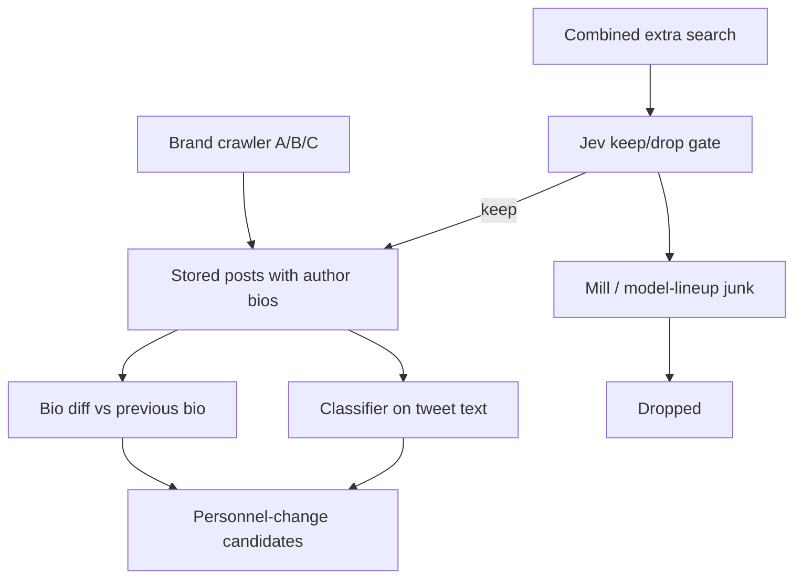
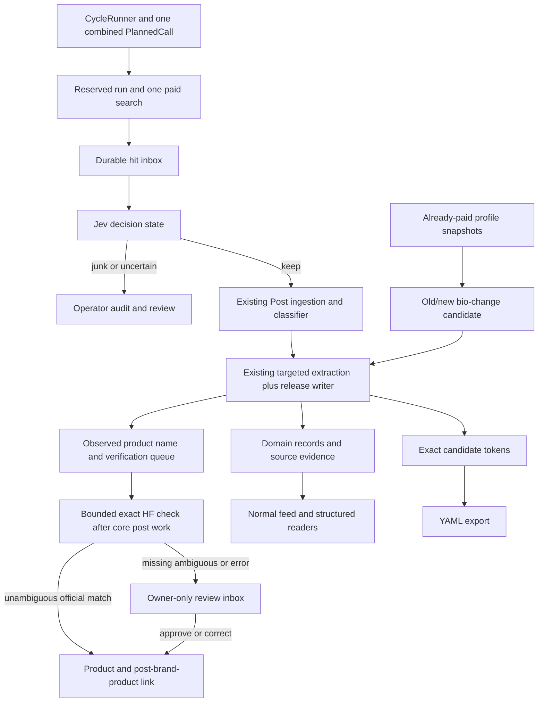

<!-- BEGIN OLLIJA DELIVERY GUIDE -->
## Ollija Delivery Guide

This block is generated guidance. Do not edit it directly. Correct durable facts in `.ollija/project.yaml` or this template, then rerun `ollija annotate-plan`. Put a user-directed exception in the editable Delivery Exceptions section below.

### Resolved locations

- Authoritative host: `fuchitalee`
- Authoritative repository: `/Users/fuchitalee/development/pushin-weight-v2`
- Ollija release worktree area: `/Users/fuchitalee/development/pushin-weight-v2/.worktrees`
- Active worktree: `/Users/fuchitalee/development/pushin-weight-v2/.worktrees/feat/combined-rare-type-extra-search-release`
- Plan: `/Users/fuchitalee/development/pushin-weight-v2/.worktrees/feat/combined-rare-type-extra-search-release/docs/plans/2026-09-24-080727-feat-combined-rare-type-extra-search-release-plan.md`
- Change: `feat-combined-rare-type-extra-search-release-2026-09-24-080727`
- Branch: `feat/combined-rare-type-extra-search-release`
- Staging branch and blueprint: `staging`, `/Users/fuchitalee/development/pushin-weight-v2/.worktrees/feat/combined-rare-type-extra-search-release/render-staging.yaml`
- Production branch and blueprint: `main`, `/Users/fuchitalee/development/pushin-weight-v2/.worktrees/feat/combined-rare-type-extra-search-release/render.yaml`
- Staging URL: `https://pushinweight-staging-web.onrender.com`
- Production URL: `https://pushinweight-web.onrender.com`

### Placement

This worktree is inside the Ollija release worktree area. Reuse it for the whole change. Do not create a second worktree or plan for this branch.

### Delivery scope

- Workflow: `lfg`
- Delivery target: `production`
- Owner selection recorded: `true`

1. Complete implementation and the plan's verification contract.
2. Run the configured focused checks:
   - `pytest tests/ollija`
3. The parent workflow commits only this plan's changes, pushes the feature branch, and records the candidate SHA.
4. Fetch the remote staging lane: `git fetch origin refs/heads/staging`.
5. Require the unchanged candidate SHA to be a fast-forward of that fetched remote ref, then push the exact candidate SHA to `refs/heads/staging` with the server-enforced fast-forward command `git push origin <candidate-sha>:refs/heads/staging`.
6. Verify the remote staging ref resolves to the candidate SHA and the deployment for `pushinweight-staging-web` reports that same SHA.
7. Run staging checks. Stop here if they fail.
8. Only after staging passes, fetch the remote production lane: `git fetch origin refs/heads/main`.
9. Require the same unchanged candidate SHA to be a fast-forward of that fetched remote ref, then push the exact candidate SHA to `refs/heads/main` with the server-enforced fast-forward command `git push origin <candidate-sha>:refs/heads/main`.
10. Verify the remote production ref resolves to the candidate SHA and the deployment for `pushinweight-web` reports that same SHA before reporting completion.
11. After step 10 succeeds, perform worktree cleanup as the final filesystem action:
    - From `/Users/fuchitalee/development/pushin-weight-v2`, require `/Users/fuchitalee/development/pushin-weight-v2/.worktrees/feat/combined-rare-type-extra-search-release` to remain registered, clean, unlocked, and at the verified candidate SHA. If any guard fails, retain it and report the reason.
    - Run `git -C /Users/fuchitalee/development/pushin-weight-v2 worktree remove /Users/fuchitalee/development/pushin-weight-v2/.worktrees/feat/combined-rare-type-extra-search-release` without `--force`.
    - Preserve the local and remote feature branches. Continue final reporting from the authoritative repository root.

### Failure handling

- Never promote a staging candidate whose automated checks failed.
- Implementation failures return to the parent implementation workflow for diagnosis, correction, recommit, and restaging.
- SSH, shell, environment, or multi-machine failures use the repository infra/multi-machine skill first.
- The change ledger is advisory; do not validate or enforce it.
- Never force-remove a worktree. Retain staging-only, failed, dirty, locked,
  noncanonical, or candidate-mismatched worktrees for diagnosis or later
  delivery.
- Do not run an endless retry loop or start a persistent Ollija process.
<!-- END OLLIJA DELIVERY GUIDE -->

## Delivery Exceptions

- Owner-directed, 2026-09-25: authorize up to 100 additional bounded `RARE_EXTRA` staging attempts to finish this release without returning for per-attempt approval. Each attempt retains the one-search, one-page, five-result, zero-HTTP-retry, `5/5/0` enrichment envelope; every terminal result remains a separately recorded immutable receipt. This authorization permits retries after repairing a diagnosed preflight, credential, or runtime failure. It does not waive exact-SHA identity, functional acceptance, database/feed evidence, staging suspension at rest, or the rule that only an `accepted` result may promote to production.
- Owner-directed, 2026-09-24: after the replacement TypeSafe token appeared in a secret-field browser snapshot, the owner explicitly assumed responsibility for that exposure, directed continued use of the same token, and authorized the release workflow to proceed. This authorizes one new separately recorded bounded `RARE_EXTRA` staging attempt under the existing one-search, one-page, five-result, zero-retry envelope; it does not waive functional acceptance or authorize production promotion after a failed or inconclusive result.
- Owner-directed, 2026-09-24: accept the existing migrated staging database for this rare-types release without a fresh production-to-staging snapshot. The guarded refresh passed preflight but its 3.5 GB shadow restore exceeded the tool's 30-minute subprocess limit before cutover (`subprocess_failed`); the original `pushinweight_staging` remained active with 241,924 posts and 498 Products, and its September 18 refresh receipt no longer matches current rows. Treat the fresh-refresh receipt and refresh-derived zero-state census as waived for this release only, not as passed. Before the staging Trigger Run, collect a new read-only census of the actual staging database and verify release-specific state, exact candidate SHA, applied migrations, service/role identity, suspended/dormant harvester, empty broker, provider caps, and the bounded acceptance result. This waiver does not authorize a database reset, a plain/manual production cycle, a production cron pause, or promotion after a failed functional acceptance. The owner said to accept this staging technicality and move on.
- Owner-directed, 2026-09-24: "create isolated worktree" supersedes the earlier same-checkout instruction for this release. The canonical release worktree is `.worktrees/feat/combined-rare-type-extra-search-release` on `feat/combined-rare-type-extra-search-release`; the root checkout retains concurrent HF/UI work and is not a release source. This plan was migrated from the original branch's plan into Ollija's branch-selected path without changing its product contract or production authorization. The generated placement guidance applies to this linked worktree.
- Owner-directed, 2026-09-24: "ok let's lfg the rest of this plan to production" changes the delivery target to production after the existing staging checks pass. This supersedes earlier staging-only delivery limits throughout this document. Promote the same verified candidate through the generated production guide, apply its additive migrations, configure the required provider/reviewer settings, and verify the deployed web and natural harvest cycle. Existing unrelated services, brand harvesting membership, and scheduler cadence retain their current configuration. The later isolated-worktree exception above supersedes the earlier same-checkout instruction; never remove the authoritative root.
- Owner-approved, 2026-09-24: accept the two HTTP 529 errors in the separate direct-TypeSafe live assessment and proceed without retrying those two requests. Preserve the original 54 successful responses and two error receipts. This exception removes the two provider failures as a delivery blocker; it does not label those posts, fabricate model responses, or waive functional, authorization, migration, or staging checks. Independently assess the usable live cases and record their limitations without a numerical quality bar.
- Owner-directed, 2026-09-22: continue implementation and staging delivery in the existing authoritative checkout on `feat/combined-rare-type-extra-search`. Do not move it or create a replacement release worktree; this overrides the generated Placement instructions for this change only. Retain this checkout after staging.
- Owner-approved carryover: the existing uncommitted plan, handoff, trial assessment, `x_monitor/rare_type_extra_search.py`, `monitor/management/commands/trial_rare_type_extra_search.py`, `tests/test_rare_type_extra_search_query.py`, and `tests/test_trial_rare_type_extra_search.py` are inputs to this feature and may be updated and committed with it. Preserve all other pre-existing edits and untracked files; do not stage them.
- Execution stays in the canonical isolated checkout named above. Use serial native GPT-5.6 Sol workers for implementation and routine verification; do not use a detached-worker route that creates additional worktrees. Astra retains planning and integration oversight.

# Combined Rare-Type Extra Search - Plan

## Plain-English Summary

PushinWeight will collect rare AI-related posts the brand crawler misses and turn useful discoveries into saved, source-linked records: personnel changes, jobs, events, opportunities, and model releases. The intended surface is the next 15-minute harvest, subject to the provider returning the post and the processing budget being available.

One combined search feeds a Jev keep/drop gate, then the existing classifier and extraction pipeline. Several reports of the same release become evidence for one model-release record. Conferences remain ordinary events. Changes to already-collected author bios provide a second source of personnel candidates, without inventing employment dates.

Companies may own several brands, and a stable brand may cover several models or modalities. Each official Hugging Face model repository can be a Product, while an announced model without a repository can still have a Product after review. A post's release-subject category is not proof of which Product it names; product links require separate evidence.

This is the full feature plan, including durable storage, unknown-name YAML exports, bounded Hugging Face corroboration, a small owner-only approval inbox, failure recovery, tests, and staging-first production delivery. The owner authorized production on 2026-09-24. A general Hugging Face activity crawler and automatic promotion into paid brand harvesting remain out of scope. Staging stays manually triggered; this plan does not add another scheduler.

First, run bounded tests on **TwitterAPI.io itself** to measure how many raw posts the proposed query returns in real 15-minute windows. The earlier Grok/X research supplies hypotheses, not a measured TwitterAPI rate. Compare the observed hourly volume with the 20- and 50-post/hour exploration targets before committing to the search wording or building the remaining feature. These are execution-time paid probes requiring an explicit on-demand allowance; editing this plan does not run them.

Completion requires evidence that a returned post reaches the correct record and visible surface, retries do not duplicate records or repeat paid searches, and the original harvest remains unchanged when the feature is off. One page has limited room: junk, repeated coverage, or a provider outage can prevent the 15-minute target. Those failures must be visible, not reported as successful coverage.

---

## Goal Capsule

- **Objective:** An operator sees personnel changes, job listings, events, opportunities, and new-model upgrades/releases the brand crawler missed, within about 15 minutes of the post appearing.
- **Means:** One tight combined extra TwitterAPI search on each 15-minute harvest, Jev routing to type or junk, plus bio diffs on already-collected author profiles. (KTD1, KTD2)
- **Authority:** Product Requirements govern visible behavior; Key Decisions constrain those requirements. The Ollija Delivery Guide and Delivery Exceptions govern delivery. The owner selected production on 2026-09-24, after the existing staging gates pass.
- **Execution profile:** Full implementation plan. The implementation workflow owns coding, review, and exact-candidate staging verification; the planning deliverable does not itself execute those steps.
- **Stop conditions:** Stop if mill or conference-spam fills extra-search pages so personnel/job keepers are not returned. Stop if a bio observation time is treated as an employment start date.
- **Release stop conditions:** Missing or contradictory source evidence, unresolved query overflow, unsafe credential routing, unbounded spend, or a staging identity mismatch prevents enablement/delivery. Keeper percentage, precision, recall, overlap percentage, and junk share are reported diagnostics, not numeric release bars. Provider-limited recall is measured, never presented as complete coverage.
- **Catalog stop conditions:** Automatic Product creation remains off until the execution-time X/TwitterAPI identity policy, exact HF matching, private review authorization, and migration tests pass. A missing HF result or generic blue check is never enough to auto-create.

## First Execution Gate — Measure TwitterAPI Volume

This gate comes **before the remaining feature implementation**. Only the minimum U1 query revision and U2 trial/receipt tooling needed to run a trustworthy probe may precede it. The existing 5/20 keeper trial and Grok release census do not establish the ordinary TwitterAPI hourly denominator: one seven-day page is capped, and release-only posts omit old-model discussion and other query matches. Do not treat query relevance, unique stored posts, or distinct releases as the raw paid-result count.

1. Freeze the exact candidate query version/hash and production-shaped `advanced_search` arguments: outer parentheses, `Latest`, `min_faves:0`, `since_time`/`until_time`, one page, 20 requested results, and explicit `ON_DEMAND` credential purpose. Preview syntax without a paid call. Recheck current provider price, rate limits, and the actual client/response continuation fields.
2. Before calling, record the authorized spend and physical-attempt ceiling. The measurement is **two prespecified, nonoverlapping 24-hour periods**, one weekday and one weekend, divided into 192 distinct 15-minute UTC windows: at most one call per window, no automatic retry or pagination. At the plan's 300-credit/page allowance, that reserves at most 57,600 credits (about $0.576 under the 2026-09-23 rate of 100,000 credits/USD); actual charges depend on provider-returned volume and current pricing. The owner authorized this separate ON_DEMAND volume-probe ceiling on 2026-09-24; it does not borrow the 1,200-credit quality-trial ceiling or authorize additional calls. The credential must be made available through its proper on-demand source without exposing it in logs or command arguments. If access or provider behavior prevents the complete 192-call sample, label the result directional, not a confirmed weekday/weekend rate.
3. Save each exact request and unmodified response before the next call in durable, owner-accessible `requests.jsonl`/`hits.jsonl`; emit `report.md` with the query, UTC windows, every physical call (including empty/error attempts), raw top-level result count, unique IDs, duplicates/overlap, creation-time distribution, continuation/cap status, provider usage versus estimated credits, and missing windows. Redact secrets but preserve verbatim post text. Count billed returns before normalization, filtering, Jev, or database deduplication. The provider's empty-call minimum is **15 credits for one billable result**, not 15 returned tweets; refresh this rule before execution.
4. Compute observed raw posts per sampled hour and per 15-minute window separately for weekday/weekend; show median, upper tail, zero windows, and fraction reaching 20 or exposing a next cursor. Compare with the report's named Grok estimate and the 20/50-posts-per-hour exploration targets, but do not claim statistical certainty about rare releases or all days. A full page or continuation is a **lower bound**, not proof that only 20 matched; seek a separately authorized bounded follow-up (smaller windows or pagination) if accurate volume is necessary. A 7-day single-page query cannot replace this gate.
5. Present the evidence and query/budget recommendation to the owner before proceeding. If volume is well below the desired aperture, revise and version the **search query** to improve recall, then repeat the bounded measurement; do not improve the keeper percentage by narrowing it. If measured volume or capped-window frequency threatens one-page recall or the daily credit cap, decide with the owner whether to change query, page/window policy, or budget. Record any accepted tradeoff; no automatic scheduled enablement follows from this gate.

## Execution Checkpoint — 2026-09-24

**Status: two-day TwitterAPI volume probe complete; feature disabled; nothing pushed or deployed.** The provisional v3 query returned 1,337 raw/unique posts across 192 quarter-hour windows (27.85/hour). All 187 signaled cursors returned empty terminal pages, so the provider's chains are exhausted for these two historical days; this does not prove future one-page completeness. The first and continuation passes together imply 22,935 credits (~$0.22935), not provider-confirmed billing. See [the reconciled report](../analysis/harvester/2026-09-24-063710-rare-type-two-day-twitterapi-volume.md). The owner approved raising the recurring reservation cap from 6,000 to 28,800 credits per UTC day, enough for all 96 scheduled slots at 300 credits each; it is headroom, not expected billing. The historical U3 assessment had incomplete Jev capture, while the owner removed its numerical acceptance thresholds. The direct-TypeSafe adapter, bounded runner, and corrected routing are implemented. The frozen direct 56-case provider capture is complete, but the separate live 56-post capture has two HTTP 529 errors and no independent labels; see [the direct assessment](../analysis/harvester/2026-09-24-151138-rare-type-direct-jev-assessment.md). R17 remains incomplete. The full U1–U16 scope remains the completion contract.

| Unit | Local state | Evidence |
| --- | --- | --- |
| U4 | Implemented, `e116b93` | Existing harvest regression: 108 passed, 39 required PostgreSQL tests executed, no skips; profile/feed checks separately passed |
| U1 / U2 | Implemented, `0163ad9`, `5b3fbd5`, `bbe60cf` | Versioned v3 query and bounded on-demand trial/volume evidence |
| U5 | Implemented, `7661464` | Durable ledgers: host suite 132 passed, 63 required PostgreSQL tests executed, no skips/errors |
| U7 | Implemented, `c69e6d0` | Bounded Jev adapter and accounting: host suite 149 passed, 80 required PostgreSQL tests executed, no skips/errors |
| U3 | Threshold-free gate committed, `b20e1af`, `446eb20`; the earlier assessment remains incomplete, while a separate archived 56-case assessment is complete locally | 53 original focused tests passed. The earlier live query had 5/20 keepers but only 37/56 Jev responses retained. The new archived assessment preserves all 112 attempts, including two accepted HTTP 529 errors, without a percentage acceptance bar. |
| U10 | Exact candidate-token storage/export implemented, `6959563` | 29 focused PostgreSQL tests passed; migration 0047→0048 and drift check passed |
| Volume follow-up | Complete, `40f5b7b` | 192/192 provider-exhausted windows, 1,337 raw/unique posts, 187 empty terminal continuation pages, no errors |
| U6, U8–U9, U11–U13 | Implemented; production activation audit in progress | `9e4ac87`, `e9eafa1`, `ce4368b`, `c6a636f`, `69de10d`, `13e4180`, `1dd959e`; 2026-09-24 release verification: 232 feature tests passed, 155 PostgreSQL-required tests executed with zero skips/errors |
| U14 | Local staging acceptance wiring implemented; live proof pending | 70 focused tests passed, including 11 required PostgreSQL checks; exact assessment pin, ON_DEMAND credential, one request/page/pass, five normalized results, Jev five/HF one, no carryover |
| U15–U16 | Known/new-publisher verification, bounded resumable catalog command, and private inbox implemented; browser/live catalog checks remain | Parent integration: 52 Product/review/model-release PostgreSQL tests passed; no live import yet |

### Production continuation, 2026-09-24

- **Isolation recovery:** The owner directed creation of the canonical linked worktree on `feat/combined-rare-type-extra-search-release`. This branch started at `389e9e7` and received only rare-type continuation edits before the independently merged HF catalog baseline was integrated. Ollija recognizes this worktree, branch, and production target. The root worktree and its unrelated dirt are preserved.
- In this isolated tree, the staging-refresh suite passed 110/110, including its complete migration-table policy; the Product identity/review/model-release suite passed 52/52 PostgreSQL tests; and the cycle/staging-acceptance/translator-wrapper suite passed 100/100 with 37 PostgreSQL-required checks. `makemigrations --check --dry-run` found no model drift and `manage.py check` found no issues. These focused results do not substitute for browser checks or staging and production receipts.
- The separate archived 56-case assessment is complete locally: 112 frozen physical attempts, 110 successes, two owner-accepted HTTP 529 receipts, no retries or new provider calls. Successful-usage estimate is $0.009196950; conservative all-attempt reservation is $0.036414462 against $0.25. It reports 17 blind source-label keeps, 34 drops, and five uncertain, with no numeric keeper bar. The source window had 1,337 unique posts over 192 quarter-hours and 22,935 estimated historical Twitter credits; sampling added zero Twitter credits. The runtime validator accepted digest `03165d5084fb8605e5eaa115f5dd98274bb5e7a0a2bfa334e5200bc8776a726a`; archived output regenerated byte-for-byte. See [the archived assessment](../analysis/harvester/2026-09-24-172323-rare-type-archived-live56-assessment.md). Forty assessment tests and 61 staging-acceptance tests passed, including two PostgreSQL-required tests. Enablement remains separately pinned and off by default.
- Complete isolated application inventory: 4,362 passed, 293 failed, 78 skipped, 135 subtests passed. Against a frozen `origin/main` source snapshot, 283 failing node IDs were common. Eight candidate-only failures require the retired v1 SQLite file, present in the root but not linked in this isolated worktree; the other two candidate-only browser failures passed on a complete standalone rerun (58 passed, 79 subtests). Three baseline-only failures were archive/git-context assumptions. No changed feature test failed. This is a baseline comparison, not a claim that the full suite passes. Ollija's configured checks passed 36/36.
- The behavior-preserving simplification pass centralized the rare-call identifier and assessment identity, removed an extra source-query lookup per kept hit, and reused exact canonical serialization. Proposed batch persistence was reverted because it changed the side effects of a later attribution exception; the old commit-before-next-hit ordering is explicitly regression-tested. A combined pre-HF-merge feature suite passed 301/301, including 92 required PostgreSQL checks with zero skips/errors. More invasive catalog upsert, Product convergence, and migration-seed refactors remain for integrated review rather than being assumed safe simplifications.
- The independent HF catalog branch was merged into remote `main` as `db35b50` after this isolated candidate was created. Local integration now retains HF's authoritative resumable catalog command, removes the rare-only duplicate writer, preserves HF metadata and wider counters alongside rare-type Product identity/type fields, and joins the migration leaves with `0056_merge_hf_catalog_rare_types`. The rare-specific catalog runbook delegates to the shared HF runbook. The combined staging-refresh suite passed 110/110. A scratch PostgreSQL upgrade from HF migration `0045_hf_catalog_observations` to combined `0056` preserved an existing Product's ID, count, and metadata; the scratch database was then removed. The HF persistence migration test now ends at the combined leaf and passed. The combined HF/rare feature suite passed 355/355, including 117 required PostgreSQL checks with zero skips/errors. These are local receipts; staging and production are not yet verified.
- Post-merge review found and fixed three narrow verification/observability gaps: provider-free direct-TypeSafe transport error/redaction tests (16 passed), a Product-key migration regression through the shared `0044` ancestor and combined `0056` leaf (2 PostgreSQL tests passed), and an additive operator status section that separates Jev decision-attempt evidence from legacy search-run counters (12 PostgreSQL command tests passed). The status contract now distinguishes confirmed from estimated/unconfirmed cost and warns that reused decisions cannot be summed across source runs. Independent cross-model review raised 12 hypotheses; targeted code and PostgreSQL-test triage confirmed none as defects. Real-browser owner-inbox verification then found a 34-pixel mobile overflow, fixed it with border-box sizing, and reran the 390-pixel mobile and 1440-pixel desktop paths: 11 browser checks executed, zero skipped or functional errors, zero console errors; 10 PostgreSQL UI tests passed. Anonymous/ordinary/owner/staff access, approve/reject, EN/ZH copy, and hostile evidence inertness were covered with synthetic data. The browser database was removed; exact-SHA staging receipts remain pending.
- Final focused integration after those fixes: 250 tests passed on local PostgreSQL, including all 32 required PostgreSQL checks with zero skips or errors. Ruff and `git diff --check` passed; Django reported no model-migration drift. `manage.py check --deploy` reports three pre-existing local-environment warnings (frame header, HSTS, and the development secret key), not new feature failures. The owner authorized bounded staging TwitterAPI calls as needed on 2026-09-24, subject to the one-call/five-result/no-retry envelope per attempt and immutable receipts.
- First live staging attempt, 2026-09-24 12:35:52–12:36:26 UTC, candidate `4cf16b6`: **failed**, not rare-type acceptance. The Render cron used `A`, made one bounded search, received one result, inserted zero posts, and reported `pipeline_or_bound_failure` with four pre-existing enrichment rows quarantined. It was suspended immediately afterward. The UI edit had been made before the asynchronously loaded existing value appeared, so `A` overwrote the attempted `RARE_EXTRA` fill before Save; a later read of the persisted live setting confirmed `A`. The `RARE_EXTRA` selector has now been re-entered after the value loaded and independently read back as `RARE_EXTRA` while the cron remains suspended. Preserve the failed receipt; do not relabel it as rare-type proof or infer production readiness. A corrected, separately recorded bounded attempt under the owner's existing authorization still requires exact live-setting verification after restart and all other staging gates.
- Corrected live staging attempt, 2026-09-24 12:52:36–12:53:02 UTC, candidate `a4deed9`: **failed**, not production authorization. The post-restart Render setting and structured receipt both selected `RARE_EXTRA`; service/environment/database identity matched `pushinweight-staging-harvest` / `staging` / `pushinweight_staging`, and the fixed one-search, one-page, five-result, zero-retry, `5/5/0` enrichment envelope was active. TwitterAPI returned seven raw results and the command bounded them to five, then all five TypeSafe decision requests returned HTTP 401. The selected call ended `truncated`, inserted zero posts, and the top-level result reported `pipeline_or_bound_failure`. Run ID: `20260924T125254_0000-3be883ed`; harvest summary hash: `55e8038096756c285662edfd5cf2635c6787ba31571fe2022e2901e0587c2f71`. The cron was suspended immediately after the terminal result. Preserve this attempt independently; do not retry automatically or promote until a valid TypeSafe credential is installed and a newly authorized bounded attempt passes.
- Newly authorized staging attempt, 2026-09-24 13:09:25–13:09:55 UTC, candidate `725ea39`: **failed before provider transport**, not production authorization. The command exited with `deployment_environment_mismatch` during staging preflight; no TwitterAPI or TypeSafe request was made and the prior rare-type database counts did not advance. The service-local `X_MONITOR_DEPLOYMENT_ENVIRONMENT` row had been removed during the preceding credential-form repair. It is restored to `staging`, the broker and classifier rows are restored without duplicates, and the cron is suspended on `0 0 31 2 *`. Preserve this zero-spend receipt and require a new explicit one-attempt authorization before another Trigger Run.
- **Earlier delivery stop: concurrent same-checkout schema changes.** A separate HF catalog session added `core/migrations/0056_hf_catalog_observations.py` and changed `core/models.py` during verification. Its three `hf_model_catalog_*` tables failed the root checkout's exhaustive staging-refresh table-policy test. Separate URL/UI work also appeared in `project/urls.py` and new route modules. None of those external changes were absorbed, reverted, committed, or deployed by this workflow; the isolated branch above resolves the release ownership conflict.
- U14 rare-only refresh compatibility is implemented: saved domain rows are copied; environment-local ledgers, proposal queues, and token provenance tied to excluded transient evidence are scrubbed. Pending 0033/0049 seed-count deltas are simulated from the exact repeatable-read source snapshot, including partially seeded frontier brands and conflicting ownership. Worker evidence: 109 staging-refresh checks passed with the external graph test deselected; four PostgreSQL seed/migration checks and nine fail-closed matrix checks passed. The full graph remains failing on the external 0056 migration; this is not a whole-candidate pass.
- The translator wrapper regression and frontier-seed fixture isolation were fixed. Worker evidence: 11 wrapper/plaintext checks, 86 fixture checks plus 15 subtests, and 19 classifier compatibility checks passed. Exact baseline comparison attributed 30 selected failures to unchanged `origin/main` behavior; the remaining candidate-only failure was the refresh graph addressed above. The later whole-suite inventory (`.pytest-tmp/rare-full-scope`) was interrupted when concurrent schema edits invalidated its stable-source assumption; do not cite it as completed or green.
- Remaining work includes simplification/code review, owner-inbox browser checks, bounded catalog import, and exact-SHA staging/production verification. The old production checklist's eager-commentary requirement conflicts with the current on-demand commentary behavior; the owner decision requested during this run remains unanswered. No new percentage quality bar is authorized.
- Owner selected staging-first production delivery; see Delivery Exceptions. The feature remains disabled until evidence and deployment gates pass.
- Independent source review of the archived deterministic 56-post cohort is stored in `docs/analysis/harvester/2026-09-24-160000-rare-type-live56-independent-labels.json`: 17 definite keeps, 34 drops, five uncertain. These are blind machine-reviewed source labels, not human gold or externally verified release facts. Every definite keeper in this sample is a model/harness release; it supplies no live-positive coverage for the other four types.
- A separate offline join with the unchanged 54 successful Jev responses gives eight definite positives automatically kept, seven held for review, and two dropped. Of the other three automatic keeps, two have definite negative source labels and one is uncertain. The two original 529 errors remain separate and were not retried. No additional provider calls were made for this review; no percentage acceptance bar applies.
- Source review can use captured article previews absent from Jev's current public-state serializer. This is an explicit input-coverage limit, not evidence that Jev saw those previews. Preserve the frozen request/response hashes.
- Release regression run: 202 application/regression checks passed, with 93 PostgreSQL-required tests executed and no skips/errors. One Ollija hygiene check initially found only stale, untracked Python bytecode under the retired `scripts/ollija/`; it was moved recoverably to `.pytest-tmp/ollija-stale-bytecode-20260924`. All 36 Ollija checks then passed.
- Upstream `main` documentation commit `d5694e7` was merged as `389e9e7`. All 120 incoming TypeSafe documentation files matched the local untracked copy exactly; the local copy is retained under ignored `.context/typesafe-main-identical-local-20260924`. Unrelated dirty files remain unstaged.
- Remaining activation work includes environment-scoped rare/extraction/HF controls, the final provenance-preserving assessment artifact, the current X/HF new-publisher rule, bounded catalog import, staging-refresh relation policy, browser verification, and exact-SHA staging/production receipts. These are required work, not completed claims.
- Runtime activation controls are now implemented with 243 related tests passing (125 PostgreSQL-required, zero skips/errors). Checked-in defaults remain off; activation validates the environment and the pinned evidence, and explicitly enables bounded targeted extraction without enabling the older jobs/personnel harvest lanes.
- U15 completion uses `product-x-hf-v2`: exact stored HF URL, stable X identity and unchanged handle, Business verification for a new publisher, exact repository metadata, and matching HF organization social backlink. One-request staging work caches model metadata before a later social check. Confirmed candidates resolve to untracked Brands without fabricating Companies or rewriting owner-derived release identities. The Product/review/model-release parent integration run passed 52/52 PostgreSQL tests, zero skips/errors. Initial live catalog collection and browser proof remain undone.
- The broader disposable-PostgreSQL inventory stopped at its explicit 30-failure limit: 1,637 tests passed and 30 legacy/live-only tests skipped. Confirmed feature failures include new-seed fixture isolation, missing raw-text forwarding in the new translator budget wrapper, and the staging-refresh relation inventory. Other failures concern legacy SQLite labels, retired CLI commands, and old C-call assumptions; baseline comparison is required before calling them pre-existing. This is not a full-suite pass.
- Pre-deployment production baseline: the enrichment-relevant health check selected 20 posts at 06:47 UTC and inspected those same IDs once after 07:20 UTC. The second read returned zero complete, one pending, 19 unhealthy; regression and acceptance gates failed. Language was present on 19/20, Simplified Chinese translation on 13/13 applicable posts, and legacy commentary on 0/20 in each language. The candidate was not deployed. This baseline is not a feature regression and is not a passing delivery result; preserve it alongside candidate-specific staging and post-deployment evidence. No retry, repair, harvest, or provider call was made by this check.

Read [the quality-stop assessment](../analysis/harvester/2026-09-22-095250-rare-type-quality-stop.md) before resuming. It links full live-query source texts, exact-ID production overlap, real Jev responses, spend evidence, and the terminal-capture limitation (37/56 responses retained). No full-corpus precision/recall or passing assessment is claimed. The schema-only smoke is not quality evidence.

Continue in the canonical isolated release worktree and branch named in the Ollija Delivery Guide with the provisionally widened v3 query and direct-TypeSafe route, not OpenRouter. Preserve all earlier failed evidence. The independent labels and provenance-preserving archived assessment now exist; the two terminal HTTP 529 receipts are owner-accepted without retries. Earlier probe ceilings alone did not authorize production; the owner's subsequent production request and Delivery Exceptions now do, after the remaining review and exact-SHA staging gates. Provider secrets remain in ignored local or Render-managed configuration only.

---

## Product Contract

### Summary

Add one tight combined extra Twitter search to each 15-minute harvest for personnel changes, job listings, events, opportunities, and model releases the brand crawler misses. Jev routes returned tweets to type or junk. Bio diffs remain a second personnel source. Keep extra searches disabled until a bakeoff and a bounded TwitterAPI.io trial pass. Do not turn on the unused jobs/personnel query packs as written.

### Problem Frame

The classifier only labels posts the harvest already stored. Personnel changes are rare in that set because the brand crawler is choosy: a list of official accounts, bare brand names for a few labs, and co-occurrence words like `llm` for ambiguous names.

A person writing “I recently left OpenAI” or “I've joined @deepseek_ai” with no catalog brand word never enters that net. A researcher who only updates their X bio also never looks like a personnel-change tweet. Unused jobs/personnel search strings exist in config and stay off; live Grok probes of those strings returned job-board spam, F1/Kimi collisions, and “model joined a lineup” hits.

TwitterAPI.io charges for every tweet it returns. Saving a duplicate in the database does not refund that charge. A 24-hour extra-search window on every 15-minute harvest would re-buy posts. A 15-minute lookback on a 15-minute extra call does not. Several loose extra calls every 15 minutes would pay the empty floor many times; one tight combined call pays it once. Mill hiring on that same page can crowd out a rare personnel post, so hiring language in the combined query stays narrow.

### Key Decisions

- **Personnel first, rewritten extra searches.** (session-settled: user-directed — chosen over enabling the unused jobs/personnel packs, adding events/opportunities searches, or adding no extra Twitter searches: live samples of the unused packs were mostly noise.) Governs R14, R18.
- **Org ring is all AI-related companies.** (session-settled: user-directed — chosen over AI-labs-only after later widening: mill junk and a typed gate must carry the extra volume.) Governs R1, R2, R12, R13, R19.
- **Mill job posts are junk, not a nationality rule.** (session-settled: user-directed — chosen over ingesting the hiring firehose: data-entry/temp/low-wage mill listings are the noise pattern, including the India job-board shape, not a ban on people.) Governs R12.
- **First-person quoted phrases, not a people roster or destination-org list.** Live probes showed a roster cannot discover unknown movers, and METR-style landing-pad hits mostly duplicated origin-lab phrases. Governs R3, R4.
- **Search in EN, ZH-CN, and JA.** (session-settled: user-directed — chosen over company-home-language-only: that split was raised and struck.) Governs R3.
- **Pay-avoidance is query-time.** Database uniqueness does not save TwitterAPI credits. Extra searches use miss-only language, including catalog `@handle` joins that a brand-name crawl can skip. Governs R5, R6, R7.
- **Combined extra search runs with the 15-minute harvest.** (session-settled: user-directed — chosen over a daily-only slot: the operator wants personnel and jobs surfaced within 15 minutes; one tight combined call keeps the empty-floor bill small.) Governs R6, R16, R20, R21.
- **Events and opportunities ride the same extra call.** (session-settled: user-directed — chosen over deferring them: combine everything so the 15-minute slot is worth running.) Governs R16, R21.
- **New-model upgrades/releases ride the same extra call.** (session-settled: user-directed — chosen over relying on A/B/C: Call A already sees official tracked-account posts; B/C miss new names and nicknames such as a dormant lab's “step 5 preview”.) Governs R22.
- **Stable brands group models; categories are brand-scoped on each post.** (session-settled: user-directed — chosen over a brand per model/version and one post-wide category: users may want MiniMax's LLM and image-model news grouped, while a post may need several categories.) Governs R31, R32.
- **Product identity needs separate evidence.** (session-settled: user-approved — chosen over assigning every rare-type post to a default product: a category does not identify a named model, and a brand can span several products.) Governs R34, R35.
- **Corroborate X discoveries against official Hugging Face repositories.** (session-settled: user-directed — chosen over treating an X claim or repository edit alone as a new product: an exact official cross-platform match can be automatic, while other cases need approval.) Governs R36–R39.
- **HuggingFace activity crawler is a later work unit.** (session-settled: user-directed to judge now — it lives in top-gun, polls `huggingface_hub`, and scores repos, not X posts. It can proceed independently and must not block this extra-search plan.) Governs the Scope Boundaries HuggingFace deferral.
- **Untracked company names accumulate in a YAML-shaped stopgap, persisted on the server.** (session-settled: user-directed — chosen over waiting for a full brand parser: extra-search hits on untracked orgs need a growing, disambiguated token list Jev can later score for catalog promotion.) Governs R13, R23, R24, R25.
- **Bio diffs are a second personnel source.** (session-settled: user-directed — chosen over tweet-text-only personnel detection: bios already arrive on harvested posts, and a silent bio rewrite is a real move.) Governs R8, R9, R10, R11.
- **Grok X search is research-only.** Production harvest stays TwitterAPI.io `advanced_search`. Governs R15, R17.
- **Jev is a typed extra-search gate, not the 0731 replacement.** (session-settled: user-directed — chosen over skipping Jev: a 2026-09-21 OpenRouter Decisions probe scored mill/lineup/joke drops correctly when first-person employment is a separate question.) Governs R19.

<!-- ce-section: work-relationships -->
### How This Work Fits Together

This plan owns extra-search capture and persistence of five rare types plus bio-diff personnel observation.

The broader picture:

- Official recruiting-site job sync — Independent. Shares `job_listings`. Spends no TwitterAPI credits. Covers five labs' career pages; X extra search is for listings those pages miss.
- Unused jobs/personnel discovery packs — Stay off as written.
- HuggingFace model-activity crawler — Separate later work. Existing design is in top-gun (`docs/plans/2026-05-16-001-feat-huggingface-collector-simplified-plan.md` and the 2026-05-15 discover-collector plan): `HfApi.list_models` / `list_datasets` / `list_spaces`, ingest to `topgun.db`. It does not harvest X and does not belong in this extra-search call.
- Jev promotion of untracked-name candidates to tracked brands — Later/out. This plan only accumulates disambiguated tokens (R23–R25).
- `brand_discovery_candidates` — Existing unresolved-identity queue. New token/evidence rows extend it. The owner-only inbox can resolve identity and product proposals under R38, but does not enable a Brand for paid harvesting; YAML remains an export, not the durable database.
- `companies` / `brands_companies` / `brands` — A company can have many stable brands; a brand can group many observed models and releases. `BrandDiscoveryCandidate` is an unresolved identity, not a second brand class: its optional `reviewed_brand` points to a canonical Brand after resolution. A canonical Brand may exist without belonging to `config.yaml::enabled_models`; identity resolution never enables paid per-brand harvesting. Existing `BrandCompany` is a junction, so the database also permits a brand to have multiple company links.
- Stage 1 classifier and targeted extraction — Shares `personnel_changes`, `job_listings`, `events`, and `opportunities` labels. This plan does not add a HuggingFace poller or a new taxonomy solely for HF repos.
- `products` — Currently keyed by required HF `repo_id` and populated one row per repository. R34–R39 extend it to hold X-announced products with no HF repo, keep official HF model-repo identity stable, and link posts only when the named product is supported.

### Actors

- A1. Operator — reviews unknown AI labs, reads personnel changes, decides whether extra searches may turn on after a trial.
- A2. Brand crawler — existing 15-minute list, brand-name, handle, and co-occurrence searches.
- A3. Combined extra search — one optional TwitterAPI.io search for five rare types; stays off until R17 passes.
- A4. Bio-diff watcher — compares successive author bios already stored on posts.
- A5. Classifier — labels `personnel_changes` on persisted posts; does not see unharvested tweets.

### Requirements

**Coverage**

- R1. Extra personnel searches collect first-person join, leave, and appointment posts about tracked catalog brands and about other AI-related companies.
- R2. Extra personnel searches include AI-related employers (AI labs, AI-product firms, and AI/ML roles at broader companies). Mill listings still drop per R12.
- R3. Extra search language is the first-person quoted family in the Appendix exhibit (English, Chinese, and Japanese), not bare `left` / `joined` OR-chains.
- R4. Extra searches include catalog `@handle` join phrases when the post never uses the brand word the name crawler already buys.

**Credit overlap**

- R5. Extra searches do not fetch every post that already contains a B1 bare brand word (MiniMax, Qwen, DeepSeek, StepFun, Hunyuan).
- R6. Combined extra search runs on each 15-minute harvest cycle. Lookback is since the last extra-search call (about 15 minutes). It is not a 24-hour window stacked on every cycle.
- R7. A tweet already in the database still costs credits if TwitterAPI returns it again; overlap control happens in the query, not after insert.

**Bio diffs**

- R8. A change between successive author bios collected on harvested posts is a personnel-change candidate.
- R9. An unchanged static bio is not a personnel change.
- R10. The time PushinWeight first sees a new bio is observation time only; it is never an employment start or end date unless the bio itself states a date.
- R11. A bio-change remains a personnel candidate when the tweet that carried the new bio is about something else.

**Quality**

- R12. Data-entry, temp, and low-wage mill job posts are dropped as junk and never stored as personnel changes or job listings.
- R13. An unknown AI-related organization is recorded in the untracked-name stopgap (R23). Extra search does not silently make it a tracked brand.

**Enablement**

- R14. The unused jobs and personnel query packs stay disabled; this work rewrites personnel search instead of turning those packs on.
- R15. Grok X search may calibrate phrases; it is not part of the 15-minute harvest.
- R16. Job-listing, event, opportunity, and new-model-release phrases share the combined extra-search call with personnel phrases. Official recruiting-site sync stays the catalog-jobs path.
- R20. Extra search is exactly one TwitterAPI.io `advanced_search` call per 15-minute harvest cycle. The full rendered query, including `min_faves:0 since_time:<epoch> until_time:<epoch>`, is under 512 characters. The Appendix one-call exhibit is the seed; planning may shorten it, not split it into a second extra call.
- R21. Events are attendance at a venue or session. Opportunities are a bounded action-for-benefit with a deadline or apply step. Conference spam, generic “grant” word hits, and hackathon-judging product ads are junk.
- R22. Combined extra search also collects posts announcing a new model name, version, nickname, or preview that B/C would miss because the token is not a current brand keyword (example: a dormant lab posting “step 5 preview” without the lab token). Official tracked-account release posts remain Call A’s job.
- R23. Names of untracked organizations seen on kept extra-search posts (personnel, jobs, events, opportunities, model-releases) accumulate in a YAML-shaped registry that survives Render deploys and restarts. A file on the container disk alone is not enough; Postgres (already used for `brand_discovery_candidates`) is the durable store, with a YAML export the operator can read and later parse.
- R24. Each observed spelling, transliteration, handle, and nickname is stored as its own token. Tokens are grouped under a candidate, not merged automatically. “Kimi” and “Moonshot” stay separate tokens until review or Jev says they are the same org. “step 5 preview” stays a token even when “stepfun” is already a tracked brand keyword.
- R25. A later Jev (or parser) pass may score whether a candidate is worth adding to tracked brands. That pass is not this stopgap. The stopgap only appends tokens, rare types seen, and first/last source post ids.
- R17. Combined extra searches stay off until the first-gate TwitterAPI.io 15-minute-window measurement establishes the raw volume/budget tradeoff, Grok phrasing research informs the candidate wording, and a separately bounded on-demand TwitterAPI.io assessment records source-level relevance and Jev routing with complete receipts. Report kept posts per credit, overlap, mill/recap/lineup/conference noise, and missed known positives without a numerical pass percentage. The owner accepts the measured volume/budget tradeoff before enablement; a low keeper fraction alone never narrows the query or blocks staging.
- R18. Classifier `personnel_changes` still needs a named person and a role start, end, or change; static biographies stay excluded.
- R19. Extra-search keep/drop and type routing may use TypeSafe Jev through the Decisions API (not chat-completions): one post per state, independent yes/no questions combined in code into personnel, job, event, opportunity, model-release, or junk. Jev does not replace the 0731 classifier and does not write production labels until R17 passes.

**Full-feature completion**

- R26. A kept post enters normal classification and produces a source-linked structured record when the evidence supports one; Jev acceptance alone is not a published label or a completed extraction.
- R27. Several reports of one model release support one release record. A model release is distinct from an attendance event, and uncertain identity never silently merges separate releases.
- R28. The operator can inspect each run, paid search volume, gate outcome, processing failure, resulting record, and source post; pending or failed processing is distinguishable from junk and from publication.
- R29. Retrying local processing never requires another Twitter search and never duplicates canonical records, evidence, or registry tokens. Unknown organizations can survive the full pipeline without becoming tracked brands.
- R30. Delivery ends on isolated staging at a verified candidate SHA. Production configuration stays disabled and its running scheduler is untouched.
- R31. A company can own multiple durable brands, and a brand can group multiple model names and releases. The publisher and released model remain distinct facts. Do not create a new Brand for every model/version, and do not build a model-version lineage in this feature.
- R32. Classify `llm-model`, `other-ai-model`, and `agent-harness` for each evidenced post–brand relationship, not as one exclusive post-wide value or a permanent single-valued Brand type. A brand may have more than one category on one post, and one post may have different categories for different brands. When ownership is unresolved, preserve the same post–candidate category evidence until the candidate resolves; never guess a Brand merely to store a category.
- R33. Formalize OpenAI, Anthropic, SpaceXAI, and Google Gemini as canonical Brand identities for rare-type attribution, reusing existing rows where present and recording supported Company links. Do not add these brands to `config.yaml::enabled_models`, the scheduled harvester, or the tracked-brand search policy. An independently unverified name remains a BrandDiscoveryCandidate rather than being promoted because its X profile merely looks official.
- R34. Treat each distinct model repository in a corroborated official Hugging Face organization as a separate Product under its Brand, with supported catalog `type` of `llm-model`, `other-ai-model`, or `agent-harness`; perform a bounded, idempotent initial catalog import for known mapped official organizations. A repository modification updates that Product's metadata, not its identity and not a release record. Products without an HF repository are permitted after owner approval.
- R35. A model-category judgment (`llm-model`, `other-ai-model`, or `agent-harness`) never proves a Product identity. Keep post–Brand or post–candidate classification authoritative; link zero, one, or several Products to a post only when source evidence identifies them, and retain an unresolved observed product name otherwise. Do not copy brand-level sentiment or other classifications onto Product links.
- R36. During execution, determine the account-legitimacy bar from current TwitterAPI.io response/endpoint documentation, actual captured fields, and X's current verification/affiliation documentation. Preserve the researched field semantics, rule version, accepted evidence combinations, and negative cases in a deterministic policy and tests; a generic verified/blue-check flag alone cannot establish publisher ownership.
- R37. After a named new-product claim is durably saved, make a bounded metadata-only Hugging Face check for an exact model-repository candidate and corroborated publisher namespace. An unambiguous official X publisher relationship plus a corroborated official HF organization/repository match may automatically create an untracked Brand if needed and create/link the Product; missing, private/inaccessible, ambiguous, or failing HF results remain pending review, not false negatives or guessed matches.
- R38. Give the owner a minimal authenticated review inbox showing the X post/account evidence, HF check outcome, proposed Brand and Product, and why automation stopped. The owner can approve, correct, or reject a proposal with an audit trail; these actions never add a Brand to `enabled_models` or alter scheduled search policy.
- R39. Hugging Face corroboration must not delay paid search, post persistence, or normal classification. Pending checks are resumable without repeating an X search; bounded checks may extend total post-fetch work only within the existing cycle deadline, and a delayed Product link is reported separately from post publication.



### Key Flows

- F1. Extra search, still off
  - **Trigger:** A harvest cycle runs.
  - **Actors:** A2, A3
  - **Steps:** Brand crawler runs as today. Combined extra searches emit zero TwitterAPI calls while R17 is unmet.
  - **Outcome:** Brand-crawler cost is unchanged.
  - **Covered by:** R14, R17

- F2. Extra search, after a passing trial
  - **Trigger:** Operator has passed R17 and a harvest cycle runs.
  - **Actors:** A3, A5
  - **Steps:** Combined extra search runs with ~15-minute lookback. Jev (R19) routes each tweet to personnel, job, event, opportunity, model-release, or junk. Remaining posts enter normal persistence, classification, and structured extraction.
  - **Outcome:** A rare keeper posted in this cycle can appear in the product within about 15 minutes.
  - **Covered by:** R1, R3, R5, R6, R7, R12, R16, R19, R20, R21

- F3. Bio diff on already-paid posts
  - **Trigger:** A harvested post carries an author bio different from the account's previous observed bio.
  - **Actors:** A4, A5
  - **Steps:** The new bio is compared to the last observed bio. An unchanged bio is ignored. A change becomes a personnel candidate with observation time only. Tweet text may be unrelated.
  - **Outcome:** A silent lab move is visible without an extra TwitterAPI search.
  - **Covered by:** R8, R9, R10, R11

- F4. Unknown lab
  - **Trigger:** A passing extra-search or bio-diff names an organization not in the catalog.
  - **Actors:** A1, A3
  - **Steps:** Each new spelling/handle/nickname is appended as its own token on a YAML-shaped candidate (R23–R24). Mill junk is dropped. Jev promotion to tracked brands is later (R25).
  - **Outcome:** No automatic new tracked brand. The operator can read the growing YAML export.
  - **Covered by:** R2, R12, R13, R23, R24, R25

- F5. Named model announcement and corroboration
  - **Trigger:** A kept X post names a proposed new model or agent harness.
  - **Actors:** A1, A3, A5
  - **Steps:** Persist the post and observed name; resolve the source account against the versioned X-identity policy; check a bounded exact HF model-repository candidate after core post processing; auto-create only an unambiguous cross-platform match, otherwise queue owner review.
  - **Outcome:** Product identity is supported without delaying the post, repeating X search, or mistaking an HF repository edit for a release.
  - **Covered by:** R34–R39

### Acceptance Examples

- AE1. Handle-only catalog join
  - **Covers R4, R5.**
  - **Given:** A post says “I've joined @deepseek_ai, working on product ops” and never uses the word DeepSeek.
  - **When:** Extra search is on after R17.
  - **Then:** The post is collected. A different MiniMax mention that B1 already buys is not fetched again.

- AE2. First-person counterpart move
  - **Covers R1, R3.**
  - **Given:** “I recently left OpenAI” or “I've recently left @GoogleDeepMind”.
  - **When:** Extra search runs.
  - **Then:** The post is in scope as an AI-lab personnel change.

- AE3. Model lineup is not a person
  - **Covers R3, R17.**
  - **Given:** “Qwen3.8-Flash joined DeepSeek-V4.1-Flash in the 90% off lineup”.
  - **When:** Phrase scoring or trial scoring runs.
  - **Then:** It counts as a failed hit, not a personnel change.

- AE4. Mill listing is junk
  - **Covers R12.**
  - **Given:** A data-entry or temp mill posting, including the India job-board shape.
  - **When:** Extra search returns it.
  - **Then:** It is dropped as junk. An Indian researcher joining an AI lab is not dropped for nationality.

- AE5. Joke and F1 collisions
  - **Covers R3, R12.**
  - **Given:** “Joined Anthropic as a User” or “george left kimi” as F1.
  - **When:** Extra search or junk filter runs.
  - **Then:** Neither is a personnel change.

- AE6. Bio rewrite, unrelated tweet
  - **Covers R8, R9, R10, R11.**
  - **Given:** Prior bio “researcher @OpenAI”; new bio “researcher @Anthropic” on a product tweet.
  - **When:** Bio diff runs.
  - **Then:** A personnel candidate is opened with observation time only. The old static bio by itself was not a personnel change.

- AE7. Extra search stays off
  - **Covers R14, R17.**
  - **Given:** R17 has not passed.
  - **When:** A scheduled harvest cycle runs.
  - **Then:** Combined extra searches make zero TwitterAPI calls. Unused jobs/personnel packs stay off.

- AE9. Combined 15-minute surface
  - **Covers R6, R16, R20.**
  - **Given:** A first-person lab join is posted at minute 2 of a harvest cycle.
  - **When:** Extra search is on after R17.
  - **Then:** The next extra-search call in that cycle can return it. Mill hiring language is not wide enough to fill the page with recruiter repeats and hide it.

- AE8. Jev extra-search gate
  - **Covers R12, R19.**
  - **Given:** Seven probe posts including a DeepSeek first-person join, Benton leave, Nokia mill, Qwen lineup, joke subscription, Kimi ambassador, and a Japanese recap.
  - **When:** Jev 1.13 scores independent yes/no questions on one post per call.
  - **Then:** Mill, lineup, joke, and ambassador drop. Recaps drop only if source-announcement is required. First-person “I've joined @handle” keeps only if the author counts as the named person.

- AE10. Several release reports, one record
  - **Covers R22, R26, R27, R29.** Two posts name the same Step-5 preview and link the same release announcement. They produce one model-release record and two evidence links, not two attendance events. A price table mentioning Step-5 alone does not establish a release.
- AE11. Resume after a provider failure
  - **Covers R19, R28, R29.** A search succeeds but Jev times out. Its paid results remain pending in Postgres. Local retry uses those results, makes no Twitter call, and publishes nothing until downstream processing succeeds.
- AE12. Unknown organizer
  - **Covers R13, R23, R24, R26, R29.** A real AI workshop or fellowship from an untracked organization produces a candidate-owned record and separately preserved observed tokens. It creates no tracked Brand and makes no alias-equivalence claim.
- AE13. Staging-only completion
  - **Covers R14, R17, R30.** Exact-candidate staging checks pass through the guarded manual command. Production still plans its original A/B/C calls, and staging has no periodic harvest schedule.
- AE14. One brand, several models and categories
  - **Covers R26, R31, R32.** A post announces a MiniMax LLM and image model. Both remain under the MiniMax Brand, with separate `llm-model` and `other-ai-model` assignments for that post–brand pair. A later model version does not create another Brand or a model-version lineage. A post also naming a second brand keeps that brand's categories separate.
- AE15. Category without a named Product
  - **Covers R32, R35.** A MiniMax post supports `llm-model` but identifies no particular model. It keeps the post–Brand category and no `posts_brands_products` row; it does not inherit a default MiniMax Product or product-level sentiment.
- AE16. Straight-through official X and HF match
  - **Covers R34, R36, R37.** An account with a proven official Brand mapping announces an exact new model name. The matching model repository belongs to the corroborated official HF organization. One Product and one source-supported post–Brand–Product link are created, with the X and HF evidence retained. A later SHA change updates metadata only.
- AE17. Distinct repository, ambiguous post
  - **Covers R34, R35.** An official HF organization has separate base and quantized model repositories. Both are Products, but an X post using only the shared base name links only to the exact supported Product; it never guesses the quantized variant. A post naming both can link both.
- AE18. Unavailable or disputed corroboration
  - **Covers R36–R39.** A blue-check account with no corroborated publisher link, or an HF 404/private/timeout/conflicting namespace, leaves a reviewable proposal with the observed name and source evidence. The post continues through ordinary classification, and a later local retry makes no new X request.
- AE19. Owner review
  - **Covers R35, R38.** An authorized owner sees the evidence and approves an X-only closed-weight Product or corrects its Brand; a second identical approval creates no duplicate. A normal signed-in viewer cannot read or POST to the inbox, and rejection preserves the source claim without creating a Product or changing harvest membership.

### Success Criteria

- SC1. After R17, extra-search credits buy kept rare-type posts across the five types at a rate the operator accepts; mill, recap, lineup, and conference-spam are counted against that rate. A returned personnel or job keeper can surface in the next harvest, with delay and coverage gaps reported separately.
- SC2. Bio diffs surface silent affiliation rewrites without inventing employment dates.
- SC3. Scheduled harvest credit cost is unchanged while extra searches remain off.
- SC4. A planner can implement without inventing org ring, junk policy, lookback, or enablement gates.
- SC5. Exact official X/HF matches produce source-linked Products without delaying normal post publication; other proposals are visibly pending or reviewable, and no category-only post is forced onto a default Product.

### Scope Boundaries

**Deferred for later**

- Enabling the unused jobs-discovery-v1 or personnel-discovery-v1 packs as written.
- A general Hugging Face discovery/activity poller (top-gun collector: queue → `huggingface_hub` → `topgun.db`). This plan adds only exact, bounded corroboration for X-sourced proposals, not repository-wide polling.
- Jev (or a parser) promoting YAML untracked-name candidates into tracked brands. The stopgap only accumulates tokens; promotion is later/out.
- A maintained people roster as a harvest source.
- A destination-org list (METR-style landing pads) as a first-class search family.

**Outside this work**

- Putting Grok X search on the 15-minute harvest.
- Official recruiting-site job sync (already separate).
- Replacing taxonomy-v4 definitions or building model-version lineage. R32 adds only the feature-specific, brand-scoped release-subject categories; Product `type` is catalog metadata, not a post-wide classification.
- A general-purpose admin console or public approval endpoint. R38 adds only a private owner review inbox.
- Treating mill-filter policy as a country or ethnicity rule.

### Dependencies / Assumptions

- D1. Provider payloads may omit author profile fields. Compare only present fields; missing bio data is not an empty bio or a departure.
- D2. TwitterAPI.io `advanced_search` is the only production X fetch for extra searches.
- D3. Grok `x_keyword_search` / `x_semantic_search` remain available for bakeoff calibration and do not bill TwitterAPI credits.
- D4. Classifier labels `personnel_changes`, `job_listings`, `events`, and `opportunities` remain the types extra-search posts must earn after junk filtering.
- D5. Observation-time vs effective-date rules follow `docs/plans/2026-09-08-134925-feat-ai-enrichment-stage1-plan.md` R37 and R39; this plan does not restate those date rules.
- D6. Public HF metadata can establish a visible repository identity but cannot prove a private repository absent; an inaccessible model is a separate review outcome.

### Planning Assumptions

- Numeric spend and quality defaults are planning choices in KTD7 and KTD8, not claims that the owner already approved a measured yield.
- Query-language coverage means EN/ZH-CN/JA phrase coverage, not a nationality filter or automatic rejection of a relevant post written in another language.
- The current classifier is taxonomy-v4. The historical “0731 classifier” wording in R19 means preserve the normal classifier's authority, not restore an obsolete model or taxonomy.
- A same-looking X handle and HF namespace are candidate corroboration, not by themselves proof of common ownership. Execution must validate the available identity fields and document the deterministic acceptance rule before enabling automatic creation.

### Sources / Research

- Live Grok X probes on 2026-09-21 of unused jobs/personnel strings and rewritten phrases (this brainstorm).
- Live OpenRouter Decisions probe 2026-09-21, `typesafe/jev-1.13-20260917`, seven posts, 5/7 with a strict named-person noul; first-person “I've joined @handle” rose to 0.84–0.98 when the author counts as the person. Recaps need a source-announcement noul or they keep.
- `docs/reference/classifier-prompts.md` — `personnel_changes` vs static biographies.
- `docs/reference/x_semantic_search.md` — Grok search is research-only.
- `docs/reference/twitterapi-io-calls.md` — production `advanced_search`, page/credit charging.
- `docs/plans/2026-09-08-134925-feat-ai-enrichment-stage1-plan.md` — disabled discovery lanes, R37/R39 date rules, unused packs as seed hypotheses.
- `docs/research/2026-09-10-154845-grok-ai-company-job-search.json` — most X job listings sat outside the catalog.
- `docs/research/2026-07-08-143643-x-event-announcement-language-probe.md` — event announcement phrasing.
- Live Grok probes 2026-09-21: events (booths, DevDay, AI Conference) several per day; opportunities poisoned by generic “grant” and hackathon-product ads; unique bounded opps maybe daily.
- top-gun HuggingFace collector plans: `2026-05-15-001-feat-huggingface-discover-collector-plan.md`, `2026-05-16-001-feat-huggingface-collector-simplified-plan.md` (`HfApi.list_models` sort `lastModified`, ingest `topgun.db`).
- [X profile labels and badge meanings](https://help.x.com/en/rules-and-policies/profile-labels) and [blue-check policy](https://help.x.com/en/managing-your-account/about-x-bluecheck) — a generic paid blue check is not a publisher-ownership test.
- `docs/external_vendors/twitterapi_docs/endpoint/get_user_about.md` — captured TwitterAPI profile fields include verification and affiliation fields; execution must verify the current search/profile payload and endpoint semantics before using them.
- [Hugging Face `HfApi.model_info`](https://huggingface.co/docs/huggingface_hub/en/package_reference/hf_api) — exact model-repository metadata lookup, not a repo download; a not-found outcome can also mean private/inaccessible.

---

## Planning Contract

R1–R25 retain the original owner-settled scope. R26–R30 make full-feature completion explicit. R31–R33 record brand hierarchy, category scope, and untracked canonical identities. R34–R39 add Product identity, evidence-based linking, X/HF corroboration, owner approval, and latency limits. The owner’s full-feature request supersedes the earlier trial-only implementation scope; the trial remains a prerequisite, not the deliverable.

### Key Technical Decisions

- KTD1. **Deliver the full path through staging.** (session-settled: user-directed — chosen over the previous trial-only units: the owner requested the missing implementation units and selected staging.) Implement R26–R30 through the shared `CycleRunner`; do not create a second harvest pipeline.
- KTD2. **Credential purpose follows the invocation.** Trial, replay probes, and staging acceptance use `TwitterApiCredentialPurpose.ON_DEMAND`. A future authorized production cron uses the existing explicit `SCHEDULED` path. Local replay constructs no Twitter client. No legacy key or cross-purpose fallback is allowed.
- KTD3. **One versioned query, one page, no search retries.** R20 is enforced on the final rendered query before any network call. Use outer parentheses and `min_faves:0` in `PlannedCall.query_string`; pass times through `run_search` kwargs. Reuse `X_LENGTH_CAP` and `assert_under_length_cap`. `max_pages=1`, `max_results=20`, `Latest`, one physical HTTP attempt, no cursor walk or fallback search. Staging's stricter five-result envelope wins without assuming the provider bills only five results.
- KTD4. **Freshness cursor is not a completeness claim.** Record a durable attempted window separately from complete coverage. Start a first activation at `now - 15 minutes`; normally start at the preceding attempted window end. Cap outage catch-up at 30 minutes. Truncation, timeout, or skipped older time becomes a recorded coverage gap, not an automatic paid backfill. Reserving the cycle slot precedes HTTP dispatch; an ambiguous crash never causes that slot to be searched again. Local processing retries use stored hits. The optional seven-day trial is never a scheduled cursor.
- KTD5. **Jev gates; the classifier and extractors remain authoritative.** Apply R19 through TypeSafe's direct `POST https://api.typesafe.ai/v1/systemone` using `TYPESAFE_API_KEY`, one post in `state`, stable independent `noul` questions, and pinned `jev-1.13.0`. There is no OpenRouter fallback. Pin the question-set and route-policy versions; treat missing credential, model mismatch, malformed response, or absent token usage as a fail-closed condition. TypeSafe returns token usage but no billed dollar amount or response ID: retain tariff-estimated cost and mark invoice confirmation absent, without fabricating either field. The normal taxonomy-v4 classifier must still earn labels before targeted extraction.
- KTD6. **Enablement is environment-specific and off by default.** Add `discovery.rare_types` and call ID `RARE_EXTRA`. `config.yaml` ships disabled; existing jobs/personnel packs remain disabled. A version-matched passing assessment plus explicit staging configuration enables only the guarded manual staging path. A disabled lane plans the unchanged seven call IDs; an enabled, due, funded lane adds one. This delivery never enables production.
- KTD7. **Reserve spend before making a paid call.** Owner-approved limits: 300 Twitter credits per search attempt, 28,800 per UTC day for this lane, one attempt per 15-minute slot. The daily ceiling covers all 96 slots at the full per-call reservation, so ordinary one-attempt scheduling does not skip solely because of this lane's cap. Reserve the full page under a database lock and settle against provider-observed volume; keep the reservation charged when usage is unknown. Empty successful pages use the documented 15-credit floor (one billable result, not 15 tweets). Count raw paid results, including filtered and duplicate results, separately from normalized rows. Trial quality sampling has its own explicit 1,200-credit ceiling; the first-gate volume measurement had separate owner-authorized 57,600-credit first-pass and 300,000-credit continuation ceilings (2026-09-24). These are protective defaults, not an assertion of provider invoices; revalidate pricing before live execution.
- KTD8. **R17 is a complete-evidence and functional-correctness gate, not a yield-percentage gate.** Maintain versioned positive examples across all five rare types, EN/ZH-CN/JA personnel examples, and negative/ambiguous cases including mill, lineup, F1, joke, static-bio, recap, price-only, and conference-ad patterns. Independently label every captured assessment post and durably save every Jev request/response before interpreting it. Test that the routing logic handles the hard negatives and supported positives as intended, and expose uncertain cases for review instead of fabricating a keeper. Report fixture precision/recall, live keeper/raw ratio, overlap, noise share, per-type coverage, and keeper yield per credit with their denominators and confidence limits. None has a fixed numerical pass threshold or minimum sample count; an empty, capped, failed, or partially captured sample is described as such and cannot prove a source-to-record route. Do not purchase extra pages beyond KTD7 just to improve a metric. Query selection favors broad relevant coverage within the one-page/budget limits, even when junk increases.
- KTD9. **Persist paid hits before interpretation.** Add run, hit, and decision ledgers in Postgres. A hit holds its provider ID, bounded original payload, source window/query, and nullable normal `Post` link. Jev junk is retained as an audit decision, not inserted as a new feed post. If A/B/C independently stored the same ID, attach discovery provenance without deleting it, suppressing its existing labels, or reclassifying it solely because Jev rejected it.
- KTD10. **Uncertain is neither junk nor published.** Initial Jev general yes threshold is 0.80 and no threshold 0.20. The direct assessment supports type-specific job-opening 0.30 and event-attendance 0.50 route thresholds, with junk flags scoped to the type they actually contradict; a static-bio flag does not veto a model release or a source-linked first-person transition. These values are an in-sample correction, not an out-of-sample quality claim. Intermediate, contradictory, incomplete, or malformed answers are pending review. Require AI relevance plus the appropriate fact questions; reject definite type-relevant junk before applying each route. Several well-supported types may survive. Pending hits, classifier failures, and extractor failures remain resumable with bounded attempts and visible reasons; they never fabricate a completed record.
- KTD11. **Reuse four domain writers; add a model-release domain.** Extend existing personnel/job/event/opportunity extraction and readers. Add `ModelRelease` and `ModelReleaseEvidence`, keeping taxonomy `releases_updates` unchanged. `Event` continues to mean attendance at a session or venue. Release identity uses resolved publisher, observed model name, exact version when stated, and release channel, supported by a source URL or other strong identity evidence. This identifies an announcement, not a persistent model/version hierarchy under R31. Aliases and fuzzy titles alone never merge releases. Availability at a reseller is evidence only when the underlying release is identified; a price comparison alone is not a release announcement.
- KTD12. **Unknown ownership and exact tokens survive end to end.** Follow the existing JobListing/personnel brand-or-candidate pattern for events, opportunities, and releases. Extend `BrandDiscoveryCandidate` with separate exact-token and token-evidence rows. An observed alias or handle is not permission to invoke `_merge_candidate`, alter Brand keywords, or group independently observed candidates. Associate tokens only when the source explicitly identifies the same subject; retain ambiguous grouping for review.
- KTD13. **Bio-change evidence has its own trigger.** Build on `capture_post_profile_snapshot` and `ProfileCaptureResult.snapshot_changed`. Compare present description/affiliation fields between consecutive observations for the same stable account. Exclude display-name/avatar/verification changes from employment inference. A first snapshot establishes a baseline. Preserve existing static-affiliation evidence, but emit a movement candidate only for a meaningful change with an old and new snapshot. Observation time and any explicitly stated effective date remain separate.
- KTD14. **Normal feed, operator audit command, and private approval inbox.** Published keepers use the existing enriched-only feed and normal type labels. Add structured release reading and read-only `rare_type_search_status --json`; add deterministic `export_rare_type_tokens` YAML output. A separate guarded replay command retries saved local work. Add only the owner-only R38 review surface, not a public dashboard or taxonomy-v4 replacement; R32's brand-scoped categories are the only new classification vocabulary in this feature. If an existing feed excludes untracked discovery posts, fix that predicate narrowly and verify it in a browser under the UI skill.
- KTD15. **Additive migration and feature-off rollback.** New tables start empty. Nullable candidate-owner additions preserve existing rows before constraints are validated. Do not backfill historical posts or rewrite taxonomy-v2/v3 history. Disabling the lane stops new paid searches and gate calls without deleting evidence or changing the original A/B/C harvest.
- KTD16. **Persist R32 on the post–owner edge.** (session-settled: user-directed — chosen over a post-wide category or exclusive Brand type: one brand can span modalities and a post can mention several brands.) Add a feature-specific category assignment keyed by post, exactly one Brand or BrandDiscoveryCandidate owner, and category key; retain source evidence and classification version. Follow the existing `PostBrandAudienceTopic` per-post/per-brand pattern without reusing its audience-topic vocabulary. If a candidate already has a reviewed Brand link, readers show that resolved identity without deleting candidate evidence or counting the category twice. Do not mirror `enabled_models` into the database as a second harvest switch.
- KTD17. **Seed known untracked identities separately from harvest membership.** (session-settled: user-directed — chosen over requiring every canonical Brand to be approved or tracked: verified identities may exist in the catalog without enabling paid per-brand collection.) Use an idempotent catalog-data migration or seed path independent of `KNOWN_MODELS` and `enabled_models` for R33. Production already has `anthropic` and `gemini` Brand rows with Company links as of 2026-09-23; implementation must reuse them and verify the intended SpaceXAI identity/company relationship before creating that edge. Keep X verification badges, profile URLs, and bios as candidate evidence, not independent proof of ownership.
- KTD18. **Product is a named catalog identity, not a post category or release event.** (session-settled: user-directed — chosen over a separate Model table: the existing Product table was intended as Brand's child.) Keep a stable Product key independent of nullable `repo_id`, retain its HF metadata and `hf_type`, and add a constrained nullable `type` with `llm-model`, `other-ai-model`, or `agent-harness` when supported. Preserve one Product per corroborated official HF model repository, including separate quantizations/variants under the owner's repo-level rule; an X-only approved Product has null `repo_id`. Do not infer `type` from `hf_type` or a post category. Migrate existing repository-keyed readers/upserts and preserve existing row IDs. A named ModelRelease may optionally reference Product, but is not itself Product.
- KTD19. **Corroboration is deferred, bounded, and source-specific.** (session-settled: user-directed — chosen over an X-only automatic catalog insert: an official HF match is the easy automatic path.) Persist the X hit and normal Post before requesting HF metadata; use a durable pending verification job drained after critical post-fetch steps, under the existing cycle deadline. Initially cap normal cycles at three exact HF metadata requests, two seconds each, zero HTTP retries, and staging acceptance at one request; verify the cap against the actual client. Check the exact candidate with the supported HF model-info API and a proven X-to-HF publisher relationship, whether preexisting or newly established under KTD21; do not download weights or treat a 404, private repository, timeout, or API failure as the same outcome. Only a versioned deterministic rule can auto-create a Brand/Product; unmatched cases enter owner review. If matching evidence arrives later, attach it to the existing approved X-only Product rather than duplicate it.
- KTD20. **Approval is a private, auditable action.** R38's owner approval needs a narrow review inbox in the existing Django site; `django.contrib.admin` is not installed, and a general admin console exceeds this feature. Require Google-authenticated owner/staff authorization independent of the site's ordinary login wall, POST+CSRF for decisions, transactional/idempotent approval, preserved source evidence, reviewer/time/reason, and an exact Brand/Product target. Reject cannot delete source evidence. No approval action can change harvest membership or release review status implicitly.
- KTD21. **Account legitimacy must be revalidated during execution.** (session-settled: user-directed — chosen over a guessed meaning of `verified` metadata: the rule must be grounded in both provider payloads and X policy.) Inspect `docs/external_vendors/twitterapi_docs/endpoint/get_user_about.md`, the current TwitterAPI.io account/search schema, captured rare-search author fields, and X's current verification/affiliation help. Record the actual fields in a versioned policy document, implement one deterministic evaluator, and test subscription-only blue checks, gold organizations, verified affiliates, tracked official accounts, handle changes, conflicting domains, and missing metadata. Use exact stable account ID and ownership evidence where available; handle/namespace spelling alone is not authentication. Reuse already collected account evidence; do not add paid X profile lookups to scheduled cycles without a separately budgeted and approved design.

### Existing Evidence and Gaps

| Area | Verified starting point | Work still required |
|---|---|---|
| Query/trial | `x_monitor/rare_type_extra_search.py`, trial command, and two test files exist as uncommitted work; Appendix seed renders to 463 characters | Full coverage/overlap proof, raw-paid accounting, full-text evidence, unknown DB-overlap handling |
| Live evidence | Historical corrected harvest-shaped call returned four posts; no Jev routing or domain persistence was exercised | Reproducible corpus, scored gate, real ingestion and reader proof |
| Discovery | `core/discovery.py` dispatches jobs/personnel through a hard-coded run-model map | Combined lane, isolated budgets, cursor policy, and audit persistence |
| Ingestion | `monitor/cycle.py` has discovery provenance and `_unattributed` handling | Preserve combined-lane hits through the shared post-fetch chain |
| Domain extraction | `core/targeted_extraction.py` writes jobs, personnel, events, opportunities and keeps extraction state/attempts | Unknown event/opportunity owners, release domain, deferred-role resumption |
| Profiles | `core/profile_snapshots.py` already stores profile changes and affiliation evidence | Movement-specific old/new evidence, pending interpretation independent of tweet label |
| Candidate names | `BrandDiscoveryCandidate` exists, with alias-merging in current v4 persistence | Exact-token append path that cannot auto-merge or promote |
| Product catalog | `Product` has required unique `repo_id`, nullable Brand/HFOrg, HF metadata, and no post–Product junction | Stable nullable-HF identity, exact-repo upsert compatibility, evidence-supported post links, review proposals |
| Approval UI | `project/urls.py` has Google OAuth and monitor routes but no `django.contrib.admin`; ordinary monitor views use `login_required` | Explicit owner/staff gate, small review inbox, CSRF POST actions, audit and browser proof |
| Delivery | Staging has a guarded, manual-only harvester and shares production provider quota | Combined-call allowlist, bounded Jev budget, exact-candidate verification |

Historical sample IDs: `2101974766110269572` (@Temperatur2com, price/ranking mention), `2101973880000667923` (@NanoGPTcom, availability announcement), `2101972712901992561` (@CapyToolkit, pricing complaint), `2101972709282361784` (@SinTokens1, Spanish release report). The earlier manual report called three token-relevant rows keepers; that is not three verified releases or a Jev result. Reassess full text against R21/R22 before using these as labeled fixtures.

The recorded staging overlap `0/20` against 241,924 posts concerned the earlier unwrapped-query sample, not the corrected four-post sample. The corrected command could not read its local `posts` table. Neither result proves query-time non-overlap with A/B/C. `/tmp/pw-rare-trial/` is optional historical input, never a required fixture path.

### High-Level Technical Design

This is the intended component boundary; exact helper signatures remain implementation details.



Hit processing lifecycle: `fetched → decision_pending → kept → post_persisted → classified → extracted`. `junk` is a terminal gate outcome; `review_needed`, `provider_failed`, and `extraction_deferred` remain distinct. Publication is a separate timestamp verified against the normal feed predicate, not inferred from `kept` or `extracted`. Retries resume the last durable stage; they never return to paid search.

Search lifecycle: `reserved → dispatched → returned|empty|failed|usage_unknown`. A unique `(lane, slot_start)` claim prevents concurrent or repeated execution. The daily budget reservation and that claim share one transaction; no database lock is held across HTTP. A crash after dispatch stays usage-unknown until reconciled and is not retried automatically. The next cycle uses its next fresh bounded window and exposes any lost interval.

| Mode | Search behavior | Processing | Visible result |
|---|---|---|---|
| Disabled / assessment absent | No combined call | Existing pipeline only | Unchanged feed |
| Trial | ON_DEMAND, explicit window, one page | Read-only assessment | Evidence artifact; no Post/domain writes |
| Local replay | No Twitter client | Saved hits, guarded provider budget | Resumed decisions/records |
| Staging acceptance | ON_DEMAND, approved call ID, strict staging envelope | Same shared pipeline | Staging-only feed and audit |
| Future production, not authorized here | Scheduled purpose and natural cron | Same shared pipeline | Requires later delivery approval |

### Data and Decision Contracts

- `RareTypeSearchRun`: unique slot/run identity, query/hash/version, window, attempted/complete boundaries, status/error, provider-request count, raw/normalized counts, reserved/estimated/confirmed credits, gap/truncation flags, environment and release SHA.
- `RareTypeSearchHit`: unique `(run, provider_post_id)`, original text and allowlisted provider fields, content hash, gate state, nullable `Post` link, processing timestamps and error reason. Retain full payload for 30 days; keep minimal source identity and decisions afterward. Expired unprocessed hits are visibly expired, never silently complete.
- `RareTypeDecision`: unique `(provider_post_id, content_hash, model, question_version, threshold_version)`, response ID, per-question probabilities, derived types, request latency/usage, attempts, and terminal/pending state. Only a matching successful decision is reused. Prompt or content changes permit a new versioned decision without destroying the prior one.
- `ModelRelease` / `ModelReleaseEvidence`: publisher Brand or candidate, observed model name and exact version/channel when stated, source-supported release date and precision, stable release identity, review status, extraction version, and unique per-post/source evidence. Many releases may belong to one Brand. The version distinguishes source-supported release claims for deduplication; it is not a new Brand, a model catalog, or model-version lineage. Concurrent writes use database uniqueness and atomic get-or-create. Insufficient identity remains a source-specific pending record rather than a guessed merge.
- Brand-scoped release-subject assignments: one row per `(post, owner, category)` where owner is one Brand or one unresolved BrandDiscoveryCandidate and category is `llm-model`, `other-ai-model`, or `agent-harness`. Keep evidence and version provenance; multiple rows per post and per post–owner are valid. Do not infer the category from every model a Brand has ever released.
- `Product`: stable internal key and owning Brand, constrained nullable `type`, optional unique HF `repo_id`, existing `hf_type` and source metadata. A confirmed HF model repository maps to one Product. The stable key allows an approved X-only Product to exist before HF publication; preserve its ID when an exact later repo is linked. Existing HF upserts continue by `repo_id`; `__str__`, ordering, narrative identity snapshots, and brand-catalog term generation must tolerate null `repo_id`.
- `PostBrandProduct`: unique `(post, brand, product)` evidence link, with product ownership checked against the Brand; multiple Products per post–Brand are valid. A Brand-only post has no Product row. No brand-level sentiment, topic, or type assignment is copied to Product as a side effect.
- `ProductVerificationProposal`: durable observed name, X account ID/handle and evidence snapshot, source post/release, proposed Brand or BrandDiscoveryCandidate, HF candidate URL/namespace, exact request outcome/time, policy version and rule trace, review state/reviewer/time/reason, and optional resolved Product. Uniqueness prevents repeat posts, cycle replay, or approval retries from duplicating Products or proposals; account/ownership conflicts remain separate review items. Keep failed HF checks pending with bounded retry timing, not a negative verdict.
- Candidate-token rows preserve `form`, `kind`, `script`, candidate identity, and first/last observations. Evidence rows carry source post/hit, rare type, and observed time. Exact-form uniqueness within a candidate makes replay safe; lookup normalization never replaces the observed form.
- Profile movement candidates carry account, prior/new snapshot IDs, source post, observed time, inferred transition with confidence/review state, and any source-stated date plus precision. A unique account/old/new identity prevents replay duplicates. They link to existing personnel/affiliation evidence without labeling an unrelated tweet as a personnel announcement.

Jev questions cover: AI-related subject, real person/author identity, actual role start/end/change, genuine role opening, attendance event, bounded action/benefit, actual model release, source announcement rather than recap, and each junk pattern. First-person author identity satisfies the named-person question when account evidence supports it. Text, quoted text, and bios are untrusted data in `state`, never instructions. Jev supplies probabilities, not extracted names or dates; validated extractors perform structured writes.

Initial gate budget: at most 20 decisions per normal cycle, at most five during staging acceptance, two concurrent requests, ten-second per-request timeout, 60-second cycle allocation, zero HTTP retries. Initial monetary ceilings are USD 0.02 per cycle and USD 0.50 per UTC day for the gate; the entire quality-assessment run is capped separately at USD 0.25. Reserve a conservative per-request amount using pinned pricing and bounded input size before dispatch. Unknown usage retains its reservation; absent pricing/quota configuration blocks live enablement rather than assuming free Jev calls.

Persist deferred hits when that allocation or the existing cycle deadline is exhausted. An enabled normal cycle first claims up to four due pending hits, then spends its remaining gate allowance on the current page; either queue may use otherwise-unused allowance. Retry transient failures no earlier than the next 15-minute slot, with at most two automatic attempts per decision version. The shared cycle's existing deadline bounds the whole operation; the gate does not extend it. Staging's zero-carryover rule remains authoritative: acceptance processes its exact current cohort, and saved-hit retry is a separately budgeted explicit command. A drained hit makes no new Twitter request.

Operator review of gate/classifier outcomes remains inspection and explicit replay, with no manual override of classifier labels. Product/identity proposal review is the separate R38 owner action: it may approve/correct/reject a catalog proposal but cannot silently convert a failed classifier, release claim, or harvest candidate into a published fact or tracked search target.

Send only public source text, quoted text, language, post time, and the necessary public author identifier/name/handle/bio to Jev. Do not send headers, credentials, private contact fields, or an entire provider response. Store the Jev credential only in environment-managed secret configuration. Existing authenticated feed access and operator-shell access govern the new readers/commands; no public export endpoint is added.

### Query Coverage and Acceptance Boundaries

The Appendix is a seed, not a claim of universal coverage. U1 must produce a single reviewed query version within R20 that retains EN/ZH-CN/JA first-person phrases, a catalog handle-only case, narrow AI hiring, bounded events/opportunities, and an unbranded release-name clause. Unknown-company coverage uses first-person or role phrases with AI context, not a closed employer roster. Reviewed release tokens are bounded configuration input; newly observed registry tokens never expand the live query automatically.

Use current A/B/C query semantics to identify avoidable overlap. Do not assume `-DeepSeek` preserves `@deepseek_ai`, or that list-author exclusions work, without provider evidence. Unsupported exclusion operators are not shipped. If all required groups and exclusions do not fit, shorten within the settled phrase family and repeat the length/coverage tests; do not silently drop a required type or add a second query. Inability to satisfy that combination blocks enablement.

The 15-minute goal is a next-harvest freshness target, not a guarantee that X indexes every matching post in time. Record post-created, fetched, gate-completed, persisted, classified, extracted, and first-visible times. Test no more than 60 seconds from a staged returned fixture entering processing to its visible result, and no more than 16 minutes in the controlled 15-minute cadence simulation. Live latency and missed/truncated windows are reported separately.

### Assumptions and Constraints

- A provider-free fixture suite establishes behavior; a paid live sample establishes current query syntax/yield. Neither substitutes for the other.
- New model-release records are source claims pending review where evidence is incomplete, not independently verified facts about the model.
- No automatic historical backfill, promotion into tracked/paid harvesting, new scheduler, production suspension, or general Hugging Face crawler is authorized. Exact HF corroboration and owner-reviewable catalog creation are in scope under R34–R39.
- Staging live gates share provider quota with production. Budget authorization immediately before Trigger Run remains required by `docs/deploy/render.md`; target selection alone is not permission for unbounded paid testing.
- New migrations depend on the actual latest migration in the implementation checkout. Do not preassign a migration number from this plan.
- Preserve unrelated dirty documentation and `.pytest-tmp/`. Reconcile relevant changes from current `main`, especially synthesis and model-task routing, before final tests; do not test only the stale planning base.

### Sequencing

First revise U1 and extend U2 only enough to run the **First Execution Gate — Measure TwitterAPI Volume**; use the owner-authorized ON_DEMAND allowance, capture the two 24-hour samples, and have the owner accept the query/volume/budget tradeoff. Do not start the remaining implementation while that gate is unresolved. Then U4 establishes the regression baseline; U5 precedes U6/U7/U10; U7 precedes U3's Jev assessment and U8; U8 precedes U9; U5 and U10 support U11. U15 builds Product verification on U9, and U16 adds review on U15. U12 consumes U9–U11 and U15–U16; U13 verifies cross-cutting failures. U14 requires all preceding units, accepted volume evidence, and U3's complete-evidence/functional-routing gate, with no numeric quality bar. Keep intermediate commits feature-off.

Model allocation is execution metadata, not a product-model change: Astra owns planning/design judgments; `gpt-5.6-sol` owns implementation and routine verification. This does not change the configured runtime Jev, classifier, translator, or extraction models.

## Implementation Units

| Unit | Outcome | Primary files | Depends on |
|---|---|---|---|
| U1 | Single-query coverage and length | `x_monitor/rare_type_extra_search.py` | — |
| U2 | Trustworthy bounded trial | trial command and tests | U1 |
| U3 | Reproducible routing evidence | fixtures and assessment | U2, U7 |
| U4 | Existing-harvest regression net | cycle/discovery tests | — |
| U5 | Durable run/hit/decision storage | `core/models.py`, migrations | U4 |
| U6 | Guarded combined scheduled lane | `core/discovery.py`, `monitor/cycle.py` | U1, U4, U5 |
| U7 | Versioned Jev Decisions gate | `x_monitor/jev_decisions.py` | U5 |
| U8 | Shared ingestion and resumable processing | `monitor/cycle.py`, rare-type service | U6, U7 |
| U9 | Canonical domain records, brand-scoped categories, and evidence | targeted extraction and models | U8 |
| U10 | Exact tokens and YAML export | candidate token models/command | U5 |
| U11 | Bio-change personnel candidates | profile snapshots and extraction | U5, U10 |
| U12 | Feed/readers/operator inspection | readers and status/replay commands | U9–U11, U15–U16 |
| U13 | Failure, cost, and recovery assurance | telemetry, tests, runbook | U6–U12, U15–U16 |
| U14 | Isolated staging delivery | staging guard/config and evidence | U1–U13, U15–U16 |
| U15 | Product catalog, X identity policy, and bounded HF corroboration | product models/service and tests | U8, U9 |
| U16 | Owner-only Product approval inbox | monitor view/template and tests | U15 |

### U1. Pin a complete one-call query under 512

- **Goal:** The query meets the required coverage without silently adding paid calls.
- **Requirements:** R1–R7, R14–R16, R20–R22; AE1–AE5; KTD3.
- **Files:** Existing uncommitted `x_monitor/rare_type_extra_search.py`, `tests/test_rare_type_extra_search_query.py`; existing `x_monitor/queries.py`; new `tests/fixtures/rare_type_extra_search/query_cases.json`.
- **Approach:** Preserve the seed as historical fixture, then version the candidate query and coverage matrix. Compare against the actual A/B/C configuration, including handle-only exceptions. Test the provider-rendered query, not a second homemade serializer. Fail on excess length before any paid call.
- **Test scenarios:** Required groups and all three language families survive rendering; a handle-only join remains eligible; a broad B1 hit is not added as a search alternative; unbranded release token remains eligible; 10/11-digit times fit or fail clearly; overflow and malformed operators make zero network calls. Live syntax claims must have U3 evidence.
- **Verification:** `pytest tests/test_rare_type_extra_search_query.py tests/test_cycle_query_length_guard.py`.
- **Dependencies:** None.

### U2. Make the on-demand trial and first volume probe evidentially reliable

- **Goal:** The first TwitterAPI volume probe supports a raw-volume/budget decision; the separate quality trial supports a keeper-rate decision. Neither modifies application data.
- **Requirements:** R6, R7, R15, R17, R20; KTD2–KTD4, KTD7.
- **Files:** `monitor/management/commands/trial_rare_type_extra_search.py`, `tests/test_trial_rare_type_extra_search.py`, `x_monitor/apify.py`, `x_monitor/twitterapi_credentials.py`.
- **Approach:** Retain `--window {15m,7d}` for individual quality trials and the one-page cap, validating direct command invocation as well as argparse. Add a provider-free query preview and a bounded batch mode (or a narrow companion command) that takes prespecified exact UTC 15-minute windows, refuses overlaps, makes at most one physical attempt per window, and persists each exact request/response before continuing. Keep this batch separate from scheduled cycle state and the 1,200-credit quality-trial ceiling. Export `requests.jsonl`, `hits.jsonl`, and `report.md` under the X evidence contract; include full source text, raw/normalized counts, continuation/truncation, actual kwargs, query hash/version, credential-purpose name, missing/error windows, and estimated versus confirmed cost. DB-overlap is `known` or `unavailable`; never convert a missing table/connection to zero overlap.
- **Test scenarios:** Missing ON_DEMAND key never reads scheduled credentials; more than one page is rejected; overlapping windows and exceeded call/budget ceilings fail before HTTP; empty page records the 15-credit floor; provider returns 20 but local normalization returns four without claiming four paid rows; a full page/next cursor is marked incomplete; missing DB gives unknown overlap; network timeout does not retry or count as zero; interruption leaves prior receipts durable; no `Post`, classification, or domain inserts occur.
- **Verification:** `pytest tests/test_trial_rare_type_extra_search.py`; review redacted JSON schema and preview output before any live request.
- **Dependencies:** U1.

### U3. Establish the routing-evidence and enablement gate

- **Goal:** Keep/drop behavior and novel yield are measured with reproducible evidence, without numerical keeper-rate, precision, recall, overlap, or junk-share pass bars.
- **Requirements:** R12, R15–R19, R21, R22; AE1–AE5, AE8, AE10; KTD7, KTD8.
- **Files:** Existing `docs/analysis/harvester/2026-09-21-185032-rare-type-extra-search-trial.md`; new timestamped assessment if query version changes; new `tests/fixtures/rare_type_extra_search/gate_cases.json`, `tests/test_rare_type_quality_gate.py`.
- **Approach:** Preserve historical results with explicit limitations. Recover raw local samples only if available; otherwise use source-linked or synthetic labeled fixtures, clearly distinguished. Cite the prior Grok phrase comparison and repeat research-only comparison for materially changed phrase families. Evaluate the exact query/model/prompt/threshold tuple using captured real Jev responses; fake probabilities test gate logic but cannot prove model behavior. Keep human/reference labels separate from Jev output. Produce a machine-readable assessment whose evidence-complete and functional-routing states are reproducible and whose hash is required by enablement; a metric falling below a percentage never changes those states by itself.
- **Test scenarios:** Historical price-only Step-5 mention cannot count as a release; same-brand recap fails source-announcement criteria; genuine Indian researcher is retained; mill negative drops; low measured precision/recall or high junk share is reported without failing solely on a percentage; missing overlap and empty/capped/partial live samples retain their uncertainty; changing any tuple component invalidates prior assessment identity.
- **Verification:** `pytest tests/test_rare_type_quality_gate.py`; bounded ON_DEMAND evidence under KTD7, with no production writes. Report per-type precision/recall and keeper-per-credit with denominators, not only total keepers; a threshold-free report is not evidence that any particular source-to-record path works.
- **Dependencies:** U2, U7. Offline work may proceed while live sampling remains gated.

### U4. Establish the existing-harvest regression net

- **Goal:** The feature cannot alter existing collection when disabled.
- **Requirements:** R5–R7, R14, R17, R30; F1, AE7, AE13; KTD6, KTD15.
- **Files:** `tests/test_discovery_lanes.py`, `tests/test_run_cycle_call_ids.py`, `tests/test_cycle_regression_net.py`, `tests/test_cycle_cursor_wiring.py`, `tests/test_staging_harvest_acceptance.py`.
- **Approach:** Characterize the full planner → client → ingestion → enrichment chain with feature-off configuration before modifying it. Preserve A/B/C query strings, credential routing, cursor updates, lock behavior, and feed predicate. Read repository harvester/mistake skills before implementation.
- **Test scenarios:** Default IDs remain A, B1, B2, B3, C1, C2, C3; disabled lane constructs no Jev client; existing jobs/personnel packs remain off; no combined-lane budget affects other lanes; scheduled/on-demand boundaries hold; bio-baseline evidence is not removed by the new watcher.
- **Verification:** Run the named files against PostgreSQL, with actual DB assertions executing. Skipped database tests are not evidence of passage.
- **Dependencies:** None; begin here.

### U5. Add durable search and interpretation ledgers

- **Goal:** Every paid result and processing decision can be accounted for and resumed.
- **Requirements:** R7, R26, R28, R29; AE11; KTD4, KTD7, KTD9, KTD10, KTD15.
- **Files:** `core/models.py`, new `core/migrations/` migrations, new `core/rare_type_search.py`, new `tests/test_rare_type_search_schema.py`.
- **Approach:** Implement the run/hit/decision contracts and database constraints. Reuse `SearchQuery` history without pretending the existing jobs/personnel run models support the new lane. Use atomic reservation/claim helpers and an allowlisted payload serializer; redact headers/secrets. Define payload-expiry behavior separately from immutable audit evidence.
- **Test scenarios:** Concurrent same-slot claims produce one dispatch reservation; concurrent replay creates one decision identity; failed serialization rolls back the hit batch visibly; crash before/after HTTP has distinct usage states; existing populated schema migrates without lost rows; missing/deleted source remains representable without cascading away the audit.
- **Verification:** `pytest tests/test_rare_type_search_schema.py`; `python manage.py makemigrations --check --dry-run`; migrate a disposable PostgreSQL database up from the previous schema and inspect constraints.
- **Dependencies:** U4.

### U6. Wire the combined lane into CycleRunner

- **Goal:** An enabled due cycle adds exactly one bounded search while preserving ordinary collection.
- **Requirements:** R4–R7, R14, R16, R17, R20; F1, F2, AE7, AE9; KTD2–KTD4, KTD6, KTD7.
- **Files:** `x_monitor/config.py`, `config.yaml`, `core/discovery.py`, `monitor/cycle.py`, `monitor/management/commands/run_cycle.py`, `tests/test_discovery_lanes.py`, new `tests/test_rare_type_cycle.py`.
- **Approach:** Add typed config and `RARE_EXTRA` planning using the query helper, new run model, discovery provenance, and KTD4 slot/windows. Keep optional-lane IDs separate from `VALID_CALL_IDS` and its exact seven-entry `degraded_skip_order` validation. Extend only the call selectors that must recognize the lane. Ensure breadth-first/tip/backlog logic cannot replay this lane or walk a second page. Validate assessment identity, enabled state, deadline, and reserved budget before constructing the paid request.
- **Test scenarios:** Off → seven IDs with unchanged valid degraded-skip configuration; enabled/due → eight planned IDs; optional call selector accepts the lane without requiring it in default config; repeated invocation same slot → no second combined HTTP request; empty/truncated/error pages obey KTD4; restart cannot reuse stale cursor as seven-day catch-up; budget exhausted skips only this lane; an unrelated A/B/C failure does not reset its reservation; source query/version survives ingestion.
- **Verification:** `pytest tests/test_rare_type_cycle.py tests/test_discovery_lanes.py tests/test_cycle_tip_sweep.py tests/test_cycle_search_caps.py tests/test_harvest_cursor_lifecycle.py` with fake provider transport and real PostgreSQL.
- **Dependencies:** U1, U4, U5.

### U7. Implement the Jev Decisions adapter and gate

- **Goal:** Every fetched candidate receives a versioned, explainable keep/drop/pending outcome.
- **Requirements:** R1–R3, R12, R18, R19, R21, R22, R28; AE2–AE5, AE8, AE11; KTD5, KTD10.
- **Files:** New `x_monitor/jev_decisions.py`, `tests/test_jev_decisions.py`; `x_monitor/config.py`, `config.yaml`, `core/rare_type_search.py`; new versioned question fixture under `tests/fixtures/rare_type_extra_search/`.
- **Approach:** Use the Decisions endpoint contract directly; do not route through a chat-only generic model client. Parse each required `answers.<id>.noul` as a finite probability in [0,1]. Compose allowed rare types in code. Persist usage and request identity before handing keepers onward. Enforce the gate time/cost allocation in the Data and Decision Contracts.
- **Test scenarios:** Request contains one post/state and all required questions; first-person author counts as person; missing keys, NaN/out-of-range probabilities, wrong response type, 401/402/429/5xx, timeout, and unavailable model stay pending/failed with no publication. Prompt injection in post text cannot alter question definitions. Identical content/version reuses a decision; changed prompt creates a new one; nationality alone never determines junk.
- **Verification:** `pytest tests/test_jev_decisions.py tests/test_rare_type_quality_gate.py`; one bounded live schema smoke only as part of U3/U14's explicit provider budget.
- **Dependencies:** U5.

### U8. Persist keepers through the existing enrichment path

- **Goal:** Jev-kept posts survive attribution and become normally classified posts without a parallel ingestion system.
- **Requirements:** R13, R18, R19, R26, R28, R29; F2, F4, AE11, AE12; KTD9, KTD10.
- **Files:** `monitor/cycle.py`, `monitor/classification_persistence.py`, `core/rare_type_search.py`, new `tests/test_rare_type_ingestion.py`.
- **Approach:** Join the normal normalization/persistence path after gate completion, preserving raw source identity and discovery metadata. Carry accepted unknown-company posts through the existing discovery `_unattributed` exception. Link an already-existing Post instead of inserting a duplicate. Drain pending hits under the Data and Decision Contracts without a second search. Reuse current enrichment claims/deadlines and record any disagreement between Jev and the classifier. Read persisted untracked-organization classifications as well as `by_brand`; the existing `by_brand`-only targeted-type loop cannot be the sole source for unknown organizations.
- **Test scenarios:** Unknown AI company reaches classifier and extraction with evidence intact; rejected mill hit creates no new Post; existing A/B/C Post is never deleted/relabeled by gate rejection; same ID on two paths links once; transient Jev failure drains on the next eligible cycle without a search; attempt exhaustion becomes review-needed; staging drains no carryover; translation/classifier failures remain resumable; a kept but nonqualifying classified post creates no structured rare-type record; restart after Post insert does not duplicate it.
- **Verification:** `pytest tests/test_rare_type_ingestion.py tests/test_cycle_classifier_model_propagation.py tests/test_u18a_v4_classification_persistence.py tests/test_cycle_regression_net.py`.
- **Dependencies:** U6, U7.

### U9. Create or attach canonical records and source evidence

- **Goal:** Accepted classified discoveries become the correct domain objects, including one record per identifiable model release and brand-scoped category evidence.
- **Requirements:** R18, R21, R22, R26, R27, R29, R31–R33; AE10, AE12, AE14; KTD11, KTD12, KTD15–KTD17.
- **Files:** `core/models.py`, new schema and catalog-data migrations, `core/targeted_extraction.py`, `core/intelligence_readers.py`, `x_monitor/config.py`, model-task profile configuration; `tests/test_targeted_extraction.py`, new `tests/test_model_releases.py`, new `tests/test_untracked_brand_seed.py`.
- **Approach:** Reuse the four existing persisters, source-bound URL validation, effective-date precision, and extraction attempt/state machinery. Add a release extraction role gated by Jev's release route plus `releases_updates`. Support Brand-or-candidate ownership for events/opportunities/releases with database constraints. Add R32 category assignments on each post–Brand or post–candidate edge with database uniqueness and exclusive-owner checks; do not write a static Brand type or a model-version catalog. Seed R33 identities without changing harvest membership. Upsert records and evidence atomically; preserve review status on replay. Make failed/deferred extraction roles selectable after normal post classification has already completed.
- **Test scenarios:** Every type produces its own record; an attendance event never becomes ModelRelease; two source-linked Step-5 reports share one release and have two evidence rows; same nickname with conflicting publisher/version/channel does not merge; MiniMax LLM and image announcements share one Brand but persist both categories on the same post–Brand edge; one post's different brands retain independent categories; R33 seed reuses existing Anthropic/Gemini and creates only missing canonical rows without enabling any scheduled brand call; an official-looking but unverified account remains candidate-owned; a fixture with an already-reviewed candidate link displays one resolved category without losing candidate evidence; missing URL/date is not invented; concurrent repeats do not duplicate; malformed extraction rolls back all writes for that role; replay after a targeted-extraction deadline completes the deferred role.
- **Verification:** `pytest tests/test_model_releases.py tests/test_untracked_brand_seed.py tests/test_targeted_extraction.py tests/test_targeted_extraction_model_route.py tests/test_stage1c_intelligence_schema.py tests/test_intelligence_readers.py` plus migration constraint checks.
- **Dependencies:** U8.

### U10. Persist exact unknown-name tokens and export YAML

- **Goal:** The growing stopgap survives restarts while preserving each observed token and its sources.
- **Requirements:** R13, R23–R25, R29; F4, AE12; KTD12.
- **Files:** `core/models.py`, new migrations, `core/rare_type_search.py`, `core/targeted_extraction.py`, new `monitor/management/commands/export_rare_type_tokens.py`, new `tests/test_rare_type_tokens.py`.
- **Approach:** Append token/evidence rows only from kept, source-grounded discoveries or valid bio-change evidence. Keep tracked-brand nicknames such as `step 5 preview` as observed tokens without changing brand keywords. Export a versioned, deterministic YAML document sorted by stable candidate/token identity; stdout by default, with no server-disk dependency or import/promotion feature.
- **Test scenarios:** Moonshot, 月之暗面, @Kimi_Moonshot, and Kimi remain four forms; replay changes evidence/last-seen appropriately without duplicating tokens; distinct candidates are not merged by spelling similarity; YAML round-trips Unicode and hostile scalar strings safely; restart/export preserves exact forms; junk adds no candidate; export makes no network or Brand writes.
- **Verification:** `pytest tests/test_rare_type_tokens.py`; parse export back with a safe YAML loader and compare to database evidence.
- **Dependencies:** U5; integrate writers with U8/U9 when available.

### U11. Make bio changes actionable personnel candidates

- **Goal:** An observed affiliation rewrite becomes inspectable personnel evidence independently of the carrier tweet's label.
- **Requirements:** R8–R11, R13, R18, R23, R24, R29; F3, AE6; KTD13.
- **Files:** `core/profile_snapshots.py`, `core/models.py`, new migrations as needed, `core/targeted_extraction.py`, `monitor/cycle.py`, `tests/test_profile_snapshots.py`, new `tests/test_bio_change_personnel.py`.
- **Approach:** Preserve the current deterministic capture path and static affiliations. Add old/new movement-candidate identity and route ambiguous changes through the existing bounded profile-affiliation extractor. Do not call Jev on every baseline/stable bio. Link unknown organization tokens through U10 and keep observation/effective dates separate.
- **Test scenarios:** OpenAI → Anthropic bio on a product tweet creates one movement candidate; unchanged, first-ever, missing-field, avatar-only, and display-name-only observations create none; explicit empty description does not prove a departure; A→B→A creates two distinct observations; provider error leaves candidate pending; no tweet personnel label is fabricated; explicit year/month dates retain precision rather than becoming observed day.
- **Verification:** `pytest tests/test_bio_change_personnel.py tests/test_profile_snapshots.py tests/test_targeted_extraction.py`.
- **Dependencies:** U5, U10; shared extraction integration with U9.

### U12. Expose results, provenance, and resumable work

- **Goal:** An operator can tell what was found, what was saved, and why anything remains pending.
- **Requirements:** R23, R26–R29, R31, R32, R35, R38, R39; F2–F5, AE9–AE12, AE14–AE19; KTD14, KTD16, KTD20.
- **Files:** `core/intelligence_readers.py`, versioned intelligence read-contract reference; new `monitor/management/commands/rare_type_search_status.py`, `monitor/management/commands/replay_rare_type_hits.py`; `monitor/views.py` and its feed query helper only if necessary; new `tests/test_rare_type_readers.py`, `tests/test_rare_type_commands.py`; existing `tests/test_feed_page.py`.
- **Approach:** Add release documents with source links and separate canonical-record/evidence/post counts. Expose R32 categories under each Brand or unresolved candidate in a post, without collapsing them into one post-wide value. Show Product links only where evidence supports them, and show unresolved observed names, HF status, and review state separately. Status accepts run/post IDs and JSON output including query, cost, gate, classification, extraction, latency, and gap states. Replay is explicit-ID, dry-run by default, guarded by environment and provider budgets, and processes persisted hits without constructing a Twitter client. Document normal feed locations for each type and the CLI for structured details; no new public unauthenticated endpoint.
- **Test scenarios:** Two posts/one release reports counts as 2/1, not three discoveries; one post returns both MiniMax categories and keeps a second brand's category separate; two Products on one post count as one brand-level post; category-only posts show no guessed Product; candidate-owned categories remain visible as unresolved rather than being assigned to a guessed Brand; failed/pending/junk/expired are distinct; CLI output remains stable and secret-free; dry-run replay makes no writes/network calls; committed replay completes one saved failure without a search; unknown-org keeper is visible under the normal enriched-only rules; unrelated bio carrier keeps its original tweet labels.
- **Verification:** `pytest tests/test_rare_type_readers.py tests/test_rare_type_commands.py tests/test_intelligence_readers.py`; browser check of affected feed filters using the fix-ui skill if a visible surface changes.
- **Dependencies:** U9–U11, U15–U16.

### U13. Verify limits, failure recovery, and observability

- **Goal:** Failures are contained and explainable without breaking the existing harvest or disguising extra cost.
- **Requirements:** R6, R7, R14, R17, R20, R28–R30, R36–R39; AE7, AE9, AE11, AE18, AE19; KTD4, KTD7, KTD15, KTD19–KTD21.
- **Files:** `monitor/cycle.py`, existing harvest summary/cohort emitters and readers, `scripts/harvest_cost/`, new `tests/test_rare_type_regression_net.py`, new timestamped operator runbook under `docs/operations/`.
- **Approach:** Add version-compatible lane counters for provider attempts/raw paid hits, gate decisions, pending work, canonical inserts/evidence attachments, unknown tokens, and latency. Include discovery costs in the existing cost tool without double counting. Exercise the full cycle with injected transport, database, and downstream failures. Add operator procedures for feature-off, local replay, budget exhaustion, and query-version rollout.
- **Test scenarios:** Ten concurrent starts make one extra HTTP request; DB or Jev outage does not mark coverage complete; failed reservation makes zero calls; interrupted post insert resumes safely; daily-cap race cannot overspend reservations; deadline defers work; a slow HF service cannot block paid search, post insertion, or normal classification and stays within KTD19's call/time cap; disabling the feature returns exact seven-call behavior; historical summary versions still parse; no raw post text or credentials leak into counts-only harvest summaries.
- **Verification:** `pytest tests/test_rare_type_regression_net.py tests/test_cycle_regression_net.py tests/test_cycle_error_counters.py tests/test_cycle_cost_emit.py tests/test_harvester_cycle_cost_cli.py tests/test_validate_cycle_post_fetch.py`.
- **Dependencies:** U6–U12, U15–U16.

### U14. Deliver and verify the exact candidate on staging

- **Goal:** The feature is inspectable on isolated staging with evidence for the shipped SHA and no production changes.
- **Requirements:** R14, R17, R20, R26–R30, R34–R39; AE13, AE16–AE19; KTD1, KTD2, KTD6, KTD18–KTD21.
- **Files:** `monitor/staging_acceptance.py`, `render-staging.yaml` only where necessary, `tests/test_staging_harvest_acceptance.py`, `tests/ollija/test_render_staging_topology.py`, `docs/deploy/render.md`, timestamped staging evidence artifact.
- **Approach:** Follow the generated Ollija guide and existing staging acceptance runbook. Extend its call-ID allowlist for `RARE_EXTRA` without weakening database/service identity checks, one call/page/pass, five normalized results, zero retries/metrics, and `5/5/0` enrichment allocation. Verify the new Jev budget and same runtime model fingerprints. Use fixture replay for all type/failure cases; reserve the bounded live run for provider wiring and exact inserted-cohort evidence.
- **Test scenarios:** Wrong DB/service/key purpose/call ID rejects before network; staged query is the approved version; preexisting posts do not masquerade as newly inserted cohort; empty/no-keeper live result is inconclusive for end-to-end publication; restart preserves token/release/Product-proposal state; owner-only inbox and HF metadata path are verified with bounded fixtures; toggle-off restores baseline; staging remains manual-only; production configuration and scheduler remain unchanged.
- **Verification:** U14 gates in the Verification Contract; exact-SHA health/deploy receipt, bounded acceptance JSON, source-to-record trace, and browser/reader evidence. Retain the staging worktree and feature branch.
- **Dependencies:** U1–U13, U15–U16, and accepted U3 evidence.

### U15. Give named Products an evidence-backed X/HF identity

- **Goal:** A source-supported model name resolves to an existing or newly corroborated Product without making category classification stand in for identity.
- **Requirements:** R31, R32, R34–R37, R39; F5, AE15–AE18; KTD18, KTD19, KTD21.
- **Files:** `core/models.py`, additive core migrations, `core/targeted_extraction.py`, new `core/product_verification.py`, `monitor/cycle.py`, `x_monitor/hf_products.py`, `monitor/management/commands/onboard_brand.py`, `monitor/trend_narrative_lifecycle.py`, `docs/reference/db-schema.md`, `CONCEPTS.md`, new versioned X-account legitimacy contract under `docs/reference/`; new `tests/test_product_identity.py`, `tests/test_product_verification.py`, and existing `tests/test_hf_products.py`, `tests/test_onboard_brand.py`, `tests/test_trend_narrative_lifecycle.py`.
- **Approach:** First characterize existing Product upserts and narrative resolution. Migrate `repo_id` to nullable with a separate stable Product key, constrained nullable catalog type, and migration-safe uniqueness; preserve HF-row IDs and all existing HF metadata. Add evidence-bearing `posts_brands_products` and proposal rows, with a database-enforced or transactionally verified Product–Brand match. Seed known mapped official HF organizations through bounded, resumable `list_models(author=...)` enumeration with completeness/gap reporting; this is a one-time catalog import, not a recurring activity crawler. Research current TwitterAPI.io and X identity fields before enabling automatic creation, then freeze a versioned deterministic policy and its fixtures. Match an X-sourced exact candidate repository through bounded `HfApi.model_info` or the existing verified REST equivalent; confirm model repo type and official owner, not just handle spelling. Drain pending HF work only after X/Post/classifier critical work, under KTD19 limits, with explicit missing/private/error states and no weights download. Auto-create only when the complete X/HF rule passes; preserve X-only and ambiguous proposals for U16. Keep release dates/source claims separate from HF creation/last-modified timestamps.
- **Test scenarios:** One verified official HF model repo creates one Product and a later SHA change updates it without a new Product or ModelRelease; bounded initial MiniMax enumeration imports each returned official repo exactly once, reports truncated pages rather than claiming completeness, and does not download weights; two MiniMax repos including a quantized variant remain two Products; an X post saying only the base name does not link a sibling variant; one post naming two exact products gets two links and one Brand attribution; a categorized post with no resolvable name gets no Product; a tracked official X account plus matching corroborated HF org/repo qualifies; a subscription-only blue check, same-looking handle alone, conflicting website, or unsupported field does not; a new cross-platform-confirmed publisher can create an untracked Brand but not an enabled harvest target; HF 404/private/timeout/throttle/malformed results remain distinct pending proposals; a later HF match attaches to an owner-approved X-only Product; two workers/replays create no duplicate; a two-second timeout or exhausted cycle deadline defers work without delaying post publication; existing HF ingestion and narrative identity lookups still work with null `repo_id` rows.
- **Verification:** `pytest tests/test_product_identity.py tests/test_product_verification.py tests/test_hf_products.py tests/test_onboard_brand.py tests/test_trend_narrative_lifecycle.py tests/test_model_releases.py` plus PostgreSQL migration/constraint checks. A single bounded live public-metadata smoke may verify actual HF response semantics only under a separately recorded request cap; fixtures, not that smoke, prove error handling.
- **Dependencies:** U8, U9.

### U16. Add a private owner review inbox for unresolved Product proposals

- **Goal:** The owner can resolve cases automation cannot corroborate without silently promoting brands into paid harvesting.
- **Requirements:** R35–R39; F5, AE18, AE19; KTD20.
- **Files:** `monitor/urls.py`, `monitor/views.py`, new `monitor/templates/monitor/product_review.html`, `core/product_verification.py`, `project/settings.py` only if a separate owner allowlist is required; new `tests/test_product_review.py`, browser verification for the private page, and an operator runbook under `docs/operations/`.
- **Approach:** Build one small queue/detail view inside the existing Google-authenticated site; do not install Django admin. A separate owner/staff authorization gate protects both GET and decision POST, including staging where the existing owner-only middleware remains active. Show the original X post/account ID, the exact observed product name, account-legitimacy rule trace, HF outcome and candidate URL, proposed Brand/Product, and reasons for uncertainty. Permit approve-as-proposed, correct target/type, and reject, requiring a recorded reviewer and reason. Use CSRF-protected transactional actions with idempotent concurrency handling; retain rejected and superseded evidence. An approval may create an X-only Product with null `repo_id` but cannot edit `enabled_models`, rerun TwitterAPI, change classifier labels, or publish a release by itself.
- **Test scenarios:** Owner approves a no-HF closed-weight model and sees one Product/source link; a repeated or simultaneous approval reuses it; correcting a Brand does not reassign other posts; rejection leaves original post, candidate, and audit visible but creates no Product; ordinary signed-in users and anonymous requests cannot view or mutate proposals; stale form/CSRF/forged target fails closed; hostile X text and HF card content render as inert text; ambiguous HF and X metadata are legible in the page; no approval enables A/B/C harvesting or triggers network calls; browser check confirms the queue/detail/decision flow in EN and existing chrome locales.
- **Verification:** `pytest tests/test_product_review.py tests/test_product_verification.py tests/test_feed_page.py`; use the repository `fix-ui` and browser-test workflow for the new visible surface, then inspect an authenticated staging-only proposal/decision with no production write.
- **Dependencies:** U15.

## Verification Contract

### Automated Gates

Use the project virtual environment and a disposable PostgreSQL test database. Keep test scratch under a dedicated ignored directory on the authoritative host; do not rely on disappearing macOS temporary folders. Run per-unit commands after each change, then:

```bash
pytest tests/test_rare_type_extra_search_query.py tests/test_trial_rare_type_extra_search.py tests/test_rare_type_quality_gate.py tests/test_rare_type_search_schema.py tests/test_rare_type_cycle.py tests/test_jev_decisions.py tests/test_rare_type_ingestion.py tests/test_model_releases.py tests/test_untracked_brand_seed.py tests/test_rare_type_tokens.py tests/test_bio_change_personnel.py tests/test_product_identity.py tests/test_product_verification.py tests/test_product_review.py tests/test_rare_type_readers.py tests/test_rare_type_commands.py tests/test_rare_type_regression_net.py
pytest tests/test_discovery_lanes.py tests/test_profile_snapshots.py tests/test_targeted_extraction.py tests/test_intelligence_readers.py tests/test_cycle_regression_net.py tests/test_staging_harvest_acceptance.py tests/ollija
python manage.py makemigrations --check --dry-run
python manage.py check
pytest
```

Names marked new in units are required test deliverables, not commands claimed to pass today. Inspect collection and skips. No SQLite-only or skipped-Postgres result satisfies uniqueness, reservation-race, migration, or shared-cycle integration gates.

| Requirement group | Implementing units | Required proof |
|---|---|---|
| R1–R4, R12, R18, R19 | U1, U3, U7, U8 | Labeled multilingual positives and hard-negative gate cases; downstream classification |
| R5–R7, R14–R17, R20 | U1–U6, U13 | Query-time coverage audit, one physical request, disabled baseline, spend/slot races |
| R8–R11 | U11, U12 | Old/new bio evidence independent of tweet type, with observation precision |
| R13, R23–R25 | U9–U12 | Unknown-owner persistence, exact tokens, restart-safe YAML, no candidate auto-promotion to a tracked Brand |
| R21, R22, R26, R27 | U3, U8, U9, U12 | Correct domain type, canonical deduplication, multiple source links, visible results |
| R31–R33 | U9, U12 | Company–Brand grouping; two categories on one post–brand, separate categories per brand, provisional candidate ownership, idempotent untracked brand seeding, no model-version lineage or harvest activation |
| R34–R39 | U15, U16, U12, U13 | One Product per official HF repo, optional HF for approved X-only products, evidence-only post links, current X-account legitimacy policy, deferred bounded HF checks, owner-only audit/approval, no critical-path delay |
| R28, R29 | U5, U7–U13 | Inspectable stage outcomes, provider-free replay, idempotency and failure injection |
| R30 | U4, U14 | Exact-SHA isolated staging proof and unchanged production |

### Live Trial and Staging Gates

1. **Before remaining implementation**, run the First Execution Gate above: provider-free query preview; current price/API check; explicit owner-approved ON_DEMAND spend ceiling; two prespecified, nonoverlapping weekday/weekend 24-hour samples of 15-minute TwitterAPI windows using the U2 batch command. Reconcile every request/hit receipt and report raw paid rows, zero/capped windows, hourly volume, uncertainty, and the comparison with Grok's estimate and 20/50-posts-per-hour targets. Resolve under-volume by widening/versioning and remeasuring, and capped/costly volume through an explicit owner tradeoff. Do not count the old 5/20 trial or a one-page 7-day search as this gate.
2. After the owner accepts the measured volume/budget tradeoff, run `python manage.py trial_rare_type_extra_search --window 15m --max-pages 1` for the candidate version. A separately budgeted `--window 7d` is optional yield research, never scheduled catch-up or volume-rate proof. Save full redacted evidence and compute KTD8 diagnostics; a schema-only smoke or token mention is not source-to-record proof, and no keeper percentage is a release bar.
3. Before any Git/deployment mutation, read selected target, generated guide, and Delivery Exceptions, then run `ollija annotate-plan docs/plans/2026-09-24-080727-feat-combined-rare-type-extra-search-release-plan.md --check` inside the isolated release worktree. Keep unrelated root-checkout changes out of the candidate.
4. Deliver the reviewed candidate through the guide to `staging`, verify the deployed SHA and all configured staging service/database identities, and apply additive migrations there. Follow `docs/operations/2026-08-27-171845-staging-harvester-acceptance.md` for actual Trigger Run authority and receipts. Do not substitute a plain/manual production cycle.
5. Prove all five domain routes, duplicate evidence, unknown tokens, bio change, Product corroboration/approval, and failure replay through fixtures on the same shared code. Then perform the bounded `run_cycle --staging-acceptance RARE_EXTRA --json` through the authorized staging Trigger Run mechanism. No second automatic attempt on failure/inconclusive output.
6. Inspect the exact inserted cohort through normal feed/readers, the owner-only proposal inbox, and `rare_type_search_status --json`. Record source IDs, canonical IDs, evidence counts, processing times, HF request/outcome counts, model fingerprints, cost estimates/usage, and remaining pending items. Verify KTD3, KTD14, and KTD19; do not claim a complete release from deployment health alone.
7. Verify feature-off behavior and durable state across restart. Preserve staging evidence before promoting the same accepted SHA to production under the generated guide. Do not run `run_cycle --scheduled` locally, alter the production schedule, or pause/resume production.

### Rollback and Failure Disposition

Disable staging's combined-lane configuration first; confirm no further combined paid calls while normal processing remains intact. Preserve ledgers and token/domain evidence for diagnosis. A code rollback is a reviewed feature-only revert through the same staging route, not a database reset or historical-data deletion. Report missing, partial, capped, or failed live evidence with its actual limits and keep enablement off when functional routes or safety checks are unverified; low keeper percentage alone is not a rollback or enablement blocker.

## Definition of Done

- The first-gate TwitterAPI receipts and report measure the candidate query's raw returned-post volume across explicit 15-minute weekday/weekend windows, distinguish caps and gaps from provider-exhausted windows, reconcile estimated/actual credits where available, and record the owner's query/budget decision. The Grok estimate alone is not acceptance evidence.
- U1–U16 satisfy their specific tests and the Verification Contract on the actual candidate; plans and skipped tests are not evidence of implementation.
- The approved single query reaches Jev, normal classification, correct domain records, source evidence, and the existing visible surface. Unknown organizations and model releases are not silently lost or misfiled as attendance events.
- Companies retain their stable Brands across multiple model releases. Brand-scoped `llm-model`, `other-ai-model`, and `agent-harness` evidence survives replay and appears separately for each Brand or unresolved candidate on a post; no new Brand per model version or model-version lineage is introduced. A category-only post has no fabricated Product link.
- Corroborated official HF model repositories each have one Product, while approved X-only Products have a stable identity and null HF repo. Product–post links, X/HF rule traces, unresolved proposals, and owner decisions survive restart and replay without duplication; HF repo edits never create a release by themselves.
- The private inbox is inaccessible to ordinary signed-in users, and owner decisions are auditable. A slow or failed HF lookup does not block the paid search or normal post publication; measured extra post-fetch work stays within KTD19's cap and existing cycle deadline.
- Bio changes, exact-token YAML export, local retry, and operator status work after restart. Concurrent/repeated work does not duplicate records or buy the same reserved search again.
- Quality/cost evidence distinguishes fetched posts, paid provider volume, kept posts, canonical records, evidence links, and publication. Pending, failed, truncated, and expired outcomes remain visible.
- Unused query packs remain off, and exact-candidate staging verification precedes production activation. Candidate-to-tracked promotion and a general Hugging Face crawler are excluded; R33's known untracked identities do not enter the scheduled brand harvester.
- Remove only abandoned experimental code created for this feature; preserve unrelated user work, historical evidence, and the staging worktree. Update relevant query, classifier, intelligence-reader, and operator documentation with the implemented contracts.

### Technical Sources

- `core/discovery.py`, `monitor/cycle.py`, `core/profile_snapshots.py`, `core/targeted_extraction.py`, `core/intelligence_readers.py`, `monitor/classification_persistence.py` — reuse points verified during planning.
- `docs/deploy/render.md`, `monitor/staging_acceptance.py`, `.ollija/project.yaml` — environment, quota, and delivery constraints.
- [TypeSafe System One API](https://docs.typesafe.ai/api) and [model reference](https://docs.typesafe.ai/models) — direct endpoint, typed response, pinned model, and list price, consulted 2026-09-24. The historical [OpenRouter Decisions API](https://openrouter.ai/docs/api/api-reference/alphadecisions/submit-a-decisions-questions-and-answers-request) explains prior probe provenance only; it is not the runtime route.
- [TwitterAPI.io advanced search](https://docs.twitterapi.io/api-reference/endpoint/tweet_advanced_search) — `query`, `queryType`, cursor, and response contract, consulted 2026-09-22. Local page/credit controls must be tested against actual provider-returned volume.

---

## Appendix

### Exhibit: one extra `advanced_search` call (verbatim)

Same shape as harvest `PlannedCall.query_string`: wrap the OR of groups, then `min_faves:0`. CycleRunner injects `since_time` / `until_time` as kwargs (not baked into the planner string). Counted 2026-09-21: planner 419, post-injection 463 / 512.

**Planner string** (`query_string`, no time operators)

```text
(("I left OpenAI" OR "I've joined OpenAI" OR "I left Anthropic" OR "I've joined Anthropic" OR "I've joined @deepseek_ai" OR "I've joined Moonshot" OR "我离开了OpenAI" OR "OpenAIに入社") OR ("we're hiring" ("research scientist" OR "ML engineer")) OR (("we'll be at" OR "tickets are live") (DevDay OR "AI Conference" OR GTC)) OR (("apply by" OR "applications close") (hackathon OR fellowship)) OR ("step 5 preview")) min_faves:0
```

**Full rendered call** (epochs are examples; harvest substitutes the real window)

```text
(("I left OpenAI" OR "I've joined OpenAI" OR "I left Anthropic" OR "I've joined Anthropic" OR "I've joined @deepseek_ai" OR "I've joined Moonshot" OR "我离开了OpenAI" OR "OpenAIに入社") OR ("we're hiring" ("research scientist" OR "ML engineer")) OR (("we'll be at" OR "tickets are live") (DevDay OR "AI Conference" OR GTC)) OR (("apply by" OR "applications close") (hackathon OR fellowship)) OR ("step 5 preview")) min_faves:0 since_time:1726900000 until_time:1726900900
```

Do not split this into a second extra call. Do not add bare `jobs OR careers OR opening OR apply`. Do not require a current brand keyword on the release clause. `assert_under_length_cap` must fail the cycle if the rendered string exceeds 512.

### Exhibit: untracked-name YAML shape

Durable on the server (Postgres-backed). Operator-readable export. Tokens are not auto-merged.

```yaml
candidates:
  - id: cand_step5
    status: pending
    rare_types_seen: [model_release]
    tokens:
      - {form: "step 5 preview", kind: nickname, script: latn}
      - {form: "Step-5", kind: spelling, script: latn}
      - {form: "step5", kind: spelling, script: latn}
    first_post_id: "2100299862839603398"
    last_post_id: "2100299862839603398"
  - id: cand_moonshot_kimi
    status: pending
    rare_types_seen: [personnel_changes]
    tokens:
      - {form: "Moonshot", kind: spelling, script: latn}
      - {form: "月之暗面", kind: spelling, script: hans}
      - {form: "@Kimi_Moonshot", kind: handle, script: latn}
      - {form: "Kimi", kind: nickname, script: latn}
```

Do not ship these variants:

```text
(joined OR left OR departed OR appointed OR "now at")
("joined Qwen" OR "joined DeepSeek" OR "joined MiniMax")
("joined Kimi" OR "left Kimi")
(engineer OR researcher) (hiring OR jobs OR apply OR careers)
```

Those are the unused-pack and model-lineup/F1 collisions the probes rejected.
