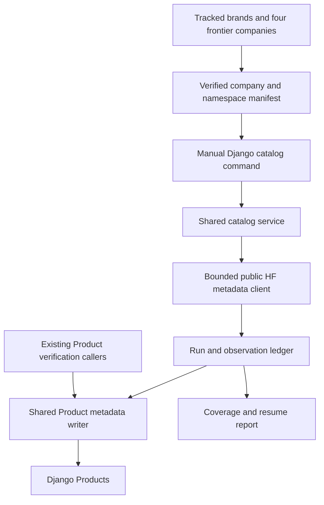
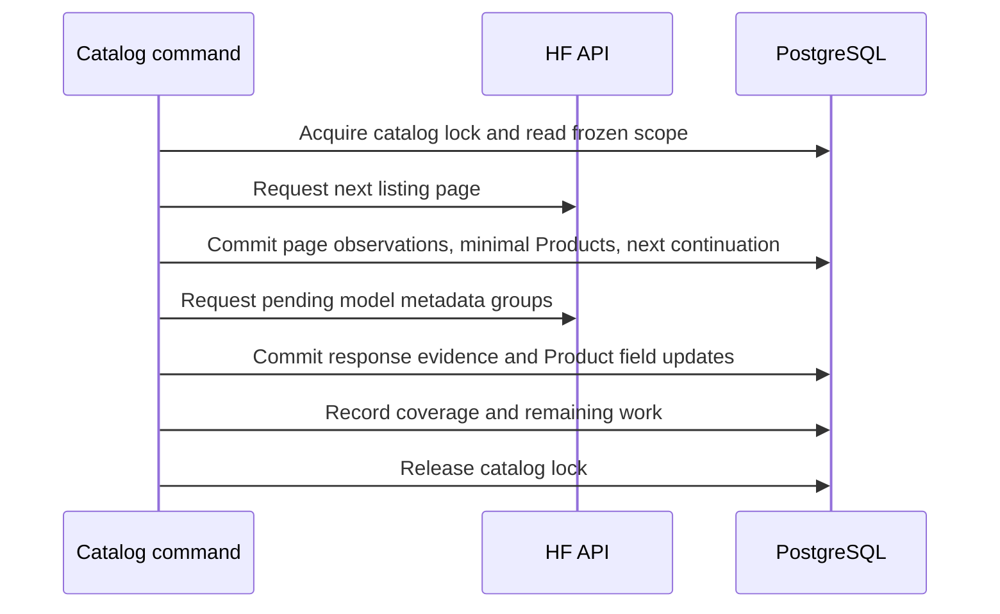
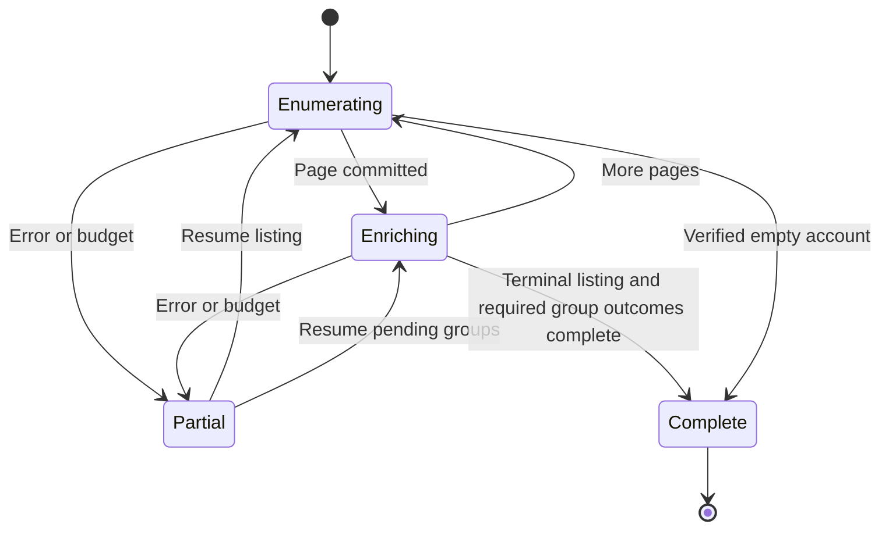
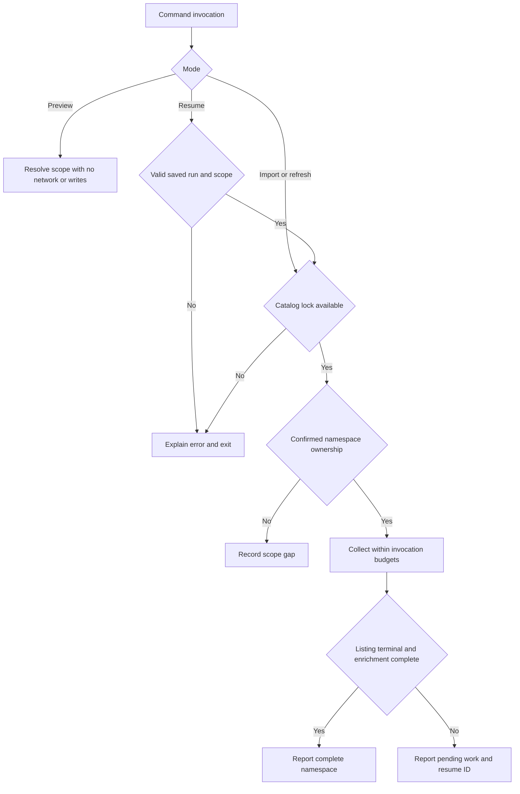

<!-- BEGIN OLLIJA DELIVERY GUIDE -->
## Ollija Delivery Guide

This block is generated guidance. Do not edit it directly. Correct durable facts in `.ollija/project.yaml` or this template, then rerun `ollija annotate-plan`. Put a user-directed exception in the editable Delivery Exceptions section below.

### Resolved locations

- Authoritative host: `fuchitalee`
- Authoritative repository: `/Users/fuchitalee/development/pushin-weight-v2`
- Ollija release worktree area: `/Users/fuchitalee/development/pushin-weight-v2/.worktrees`
- Active worktree: `/Users/fuchitalee/development/pushin-weight-v2/.worktrees/feat/hf-model-product-catalog`
- Plan: `/Users/fuchitalee/development/pushin-weight-v2/.worktrees/feat/hf-model-product-catalog/docs/plans/2026-09-24-162207-feat-hf-model-product-catalog-plan.md`
- Change: `hf-model-product-catalog-2026-09-24-162207`
- Branch: `feat/hf-model-product-catalog`
- Staging branch and blueprint: `staging`, `/Users/fuchitalee/development/pushin-weight-v2/.worktrees/feat/hf-model-product-catalog/render-staging.yaml`
- Production branch and blueprint: `main`, `/Users/fuchitalee/development/pushin-weight-v2/.worktrees/feat/hf-model-product-catalog/render.yaml`
- Staging URL: `https://pushinweight-staging-web.onrender.com`
- Production URL: `https://pushinweight-web.onrender.com`

### Placement

This worktree is inside the Ollija release worktree area. Reuse it for the whole change. Do not create a second worktree or plan for this branch.

### Delivery scope

- Workflow: `plan`
- Delivery target: `production`
- Owner selection recorded: `true`

1. Complete implementation and the plan's verification contract.
2. Run the configured focused checks:
   - `pytest tests/ollija`
3. The parent workflow commits only this plan's changes, pushes the feature branch, and records the candidate SHA.
4. Fetch the remote staging lane: `git fetch origin refs/heads/staging`.
5. Require the unchanged candidate SHA to be a fast-forward of that fetched remote ref, then push the exact candidate SHA to `refs/heads/staging` with the server-enforced fast-forward command `git push origin <candidate-sha>:refs/heads/staging`.
6. Verify the remote staging ref resolves to the candidate SHA and the deployment for `pushinweight-staging-web` reports that same SHA.
7. Run staging checks. Stop here if they fail.
8. Only after staging passes, fetch the remote production lane: `git fetch origin refs/heads/main`.
9. Require the same unchanged candidate SHA to be a fast-forward of that fetched remote ref, then push the exact candidate SHA to `refs/heads/main` with the server-enforced fast-forward command `git push origin <candidate-sha>:refs/heads/main`.
10. Verify the remote production ref resolves to the candidate SHA and the deployment for `pushinweight-web` reports that same SHA before reporting completion.
11. After step 10 succeeds, perform worktree cleanup as the final filesystem action:
    - From `/Users/fuchitalee/development/pushin-weight-v2`, require `/Users/fuchitalee/development/pushin-weight-v2/.worktrees/feat/hf-model-product-catalog` to remain registered, clean, unlocked, and at the verified candidate SHA. If any guard fails, retain it and report the reason.
    - Run `git -C /Users/fuchitalee/development/pushin-weight-v2 worktree remove /Users/fuchitalee/development/pushin-weight-v2/.worktrees/feat/hf-model-product-catalog` without `--force`.
    - Preserve the local and remote feature branches. Continue final reporting from the authoritative repository root.

### Failure handling

- Never promote a staging candidate whose automated checks failed.
- Implementation failures return to the parent implementation workflow for diagnosis, correction, recommit, and restaging.
- SSH, shell, environment, or multi-machine failures use the repository infra/multi-machine skill first.
- The change ledger is advisory; do not validate or enforce it.
- Never force-remove a worktree. Retain staging-only, failed, dirty, locked,
  noncanonical, or candidate-mismatched worktrees for diagnosis or later
  delivery.
- Do not run an endless retry loop or start a persistent Ollija process.
<!-- END OLLIJA DELIVERY GUIDE -->
# Hugging Face model Product catalog - Plan

## Delivery Exceptions

- Owner-requested closeout, 2026-09-24: "push to main, ollija clear worktree (we're on isolated, right)?" The HF implementation and data work are already production-verified; remaining changes are documentation only. For this closeout, publish only the HF plan and announcement-triggered HF follow-up note on the latest `main` using `[skip render]`. Leave `staging` and the other session's active rare-type release candidate unchanged. This documentation-only interpretation supersedes generated restaging/redeployment steps for the closeout, not for future code changes. Before cleanup, verify the published closeout SHA, a docs-only diff from the previously verified production HF implementation, and the production HF data state. Require the canonical worktree to be registered, clean, unlocked, and at that exact published closeout SHA; remove it from the authoritative root without `--force`, preserve feature branches, and make removal the final filesystem action. Never remove the authoritative root.

- Owner-directed, 2026-09-24: "with that fix to doubao, categorize (and create new brands) as you proposed the remaining 524", followed by "leave 203 linked only to publisher", authorizes the one-time assignment of the 321 matched selected Products and creation of their 12 missing Brand identities/company links. Keep the other 203 selected Products publisher-only and exclude the 400 retained Google extras. Seed is the model-family brand; Doubao remains the consumer-app brand. Reuse existing StepFun for the combined Step/StepFun grouping. This is a data update after staging rollback validation; it does not change code, the other session's release candidate, scheduler, tracked-brand membership, or harvesting keywords.

- Owner-directed, 2026-09-24: "ok go", followed by "continue to deployment to production", authorizes HF staging deployment and bounded import validation, then production deployment and collection after staging passes. Promote the same verified candidate. This supersedes the earlier local-only and on-request limits. Preserve the HF-only branch boundary; do not merge another session's unreleased work. No scheduler, service suspension, Blueprint topology change, or model download is authorized.

- Owner-directed, 2026-09-24: isolate HF on a new `feat/hf-model-product-catalog` branch based on the fetched `origin/main`, selecting only HF changes. Do not merge or carry the rare-type branch's commits. Preserve the root checkout and its unrelated work; use the canonical `.worktrees/feat/hf-model-product-catalog` checkout for the HF branch. Local HF commits are explicitly authorized. This supersedes the old generated root-placement instruction while transferring this same plan. No push, staging deployment, or production action is authorized by this exception.
- Main-based integration must use the existing Product schema and callers on `main`; keep rare-type-only verification, review, cycle, and non-HF identity code out of this branch. Reverify the adapted migration and caller chains on the isolated base. The earlier combined-branch verification remains historical evidence, not verification of this new candidate.

## Collection scope revised during production import

Owner-directed, 2026-09-24: collect the first **100 Google repositories and 100
NVIDIA repositories**, sorted by `lastModified` descending. Continue collecting
all public model repositories from the other verified publishers. Keep automatic
progress through the remaining scope rather than stopping at an overall request
quota; respect HF's own rate limits.

Google already had 500 Products when the owner changed the limit. The owner
explicitly asked to keep them. Its first 100 observations are fully enriched;
the 400 extra Products are retained with whatever metadata was already obtained.
Do not delete them or continue the original uncapped Google traversal.

The original production run `0ba5bcfa-0b2a-47d9-91a2-9a526fc7bf9c` was interrupted
to apply this scope change. Reuse its completed publisher observations and Google's
first 100, then use separate namespace runs for remaining publishers. NVIDIA's run
`0e6e0081-f4a2-4e53-9596-c3d80a8a86ee` stopped intentionally at 100 with both metadata
groups complete. `--all-tracked` alone does not encode these revised per-publisher
limits; do not resume the old global run as a way to finish this revised selection.

Deployed code: `db35b50b2974f35185356d7969cade7b89f1d822`, verified first on staging
and then production. Operational evidence and aggregate coverage are recorded in
`/Users/fuchitalee/.cache/hf-delivery-20260924/` on the authoritative host.

### Production completion evidence

Completed on 2026-09-24 at the deployed SHA above. The aggregate audit verified
all 2,007 selected repositories across 28 verified publisher pages, including
successful empty listings for Anthropic and THUDM. Both requested metadata groups
completed for every selected repository. Production contains 2,407 Products:
2,007 selected plus 400 retained Google extras. Google has 500 rows; NVIDIA has
100. Of the Google extras, 96 retain incomplete enrichment (7 partial, 89 pending)
under the owner's instruction to keep existing data and stop further collection.

No duplicate repository IDs were found; the original Product's ID, repository,
brand, publisher, and curated name were preserved. All 2,407 Products have source
creation, source modification, and local collection timestamps. These are not
verified public-release dates. The selected data contains 34 distinct metadata
field names; source fields may legitimately be absent for individual models.

At the initial import audit, 524 selected Products lacked a brand assignment; their verified
publisher is retained. The original six company/namespace mapping gaps remain
explicit in the audit. This is completion of the revised verified-publisher
selection, not a claim that every company alias or brand attribution is resolved.
Production login returned HTTP 200 after collection; no catalog runs remain
running. Evidence: `production-final-audit.txt`, `production-final-extras.txt`,
and `RELEASE.md` in the cache directory above. The worktree was initially retained
for uncommitted owner-requested notes; the later closeout exception above governs
publication and guarded cleanup.

### One-time brand assignment completed — 2026-09-24

The owner subsequently approved the proposed brand groupings with Seed as the
model-family brand and Doubao as the consumer-app brand, then explicitly chose
to leave the 203 unmatched selected Products publisher-only. Applied 321 exact
repository assignments across 19 existing/new brand identities. Created 12
missing Brands and their Company links: `alphagenome`, `autoglm`, `bagel`,
`codegeex`, `cogagent`, `cogvideo`, `cogview`, `cogvlm`, `magenta`, `qianfan`,
`timesfm`, and `ui_tars`. Used existing `stepfun` for the combined Step/StepFun
grouping; existing `doubao` remains the app brand and receives no HF weights.
SigLIP had no repository among these selected 524, so no unused SigLIP brand was
created and its repositories among the 400 Google extras were not reassigned.

Staging candidate `4cf16b6b3f03f46c409128543e9cfae8cf978728` passed a rollback-only
trial covering all 321 mappings, 12 Brand creations, preservation of Product IDs
and non-brand fields, and an unchanged rerun. The same frozen mapping was applied
atomically to production at `db35b50b2974f35185356d7969cade7b89f1d822` and verified
after commit. Only target Product brand/timestamp fields, missing Brands, and
their Company links changed. No code, release candidate, tracked-brand config,
keywords, or scheduler changed.

Final state: 2,407 total Products; 203 selected Products remain publisher-only,
plus 400 retained Google extras outside this assignment batch, for 603 total
Products with no brand. The earlier count of 524 selected attribution gaps above
is the pre-assignment audit. Evidence and before/after receipts are in the cache
directory above: `brand-assignment-manifest.json`, `brand-assignment-staging-test.txt`,
`brand-assignment-production-result.txt`, and `brand-assignment-verified.txt`.

## Next import: try collecting first, then upserting

Owner-requested follow-up, 2026-09-24: for the next large import, evaluate
collecting HF responses into separate local storage, validating and freezing that
dataset, testing its import on staging, then replaying the **same dataset** into
production through the Product writer. Upserting means inserting a missing
repository or updating the permitted fields of its existing Product.

The current importer already inserts or updates Products by repository identity.
The proposed experiment separates collection from production writes so the exact
dataset can be inspected and tested before promotion. Match on the case-insensitive
HF repository identity; preserve production Product IDs, relationships, curated
fields, and unrelated concurrent changes. Verify expected inserts/updates and
an unchanged rerun before adopting this workflow.

A recent production copy may help test realistic relationships, but do **not**
replace the live database with that modified copy: production can receive new
posts and edits after the snapshot. Promote only the intended HF row/field changes.
PostgreSQL provides atomic insert-or-update behavior through
[`INSERT ... ON CONFLICT DO UPDATE`](https://www.postgresql.org/docs/current/sql-insert.html).
This is a future experiment; the owner asked to keep the current collection running.

## Follow-up for the rare-type workflow

The separate [announcement-triggered HF verification note](../handoffs/2026-09-24-213119-rare-type-announcement-triggered-hf-followup.md)
records the proposed background lookup, candidate search, retry and Product
upsert extension. It is future work, outside the other session's active release.

## Main-based integration contract

The owner-directed isolation above supersedes combined-checkout assumptions in
the original implementation units below. Base: `origin/main` at `d5694e7`.

| Original combined-checkout assumption | Standalone HF implementation |
| --- | --- |
| Product UUID, nullable repo, curated type, non-HF models | Preserve main's existing integer `id`, required case-insensitive unique `repo_id`, curated name/brand and existing relationships; do not add rare-type identity fields. R3's UUID preservation applies when such a field exists in a future integrated schema. |
| Existing `core/product_verification.py` and compatibility import | Not on main; excluded with its rare-type callers/tests. The command calls the same HF catalog service directly. |
| U3 migration after 0055 | Generate `0045_hf_catalog_observations` directly after main's 0044 merge; fresh and populated migration tests must pass. |
| U6 verification/review/rare-type-cycle chains | Command -> client -> PostgreSQL -> resume; onboarding -> import -> onboarding; import -> classifier catalog; headline Product reference -> refresh; concurrent curated edit -> metadata writer. No cycle code changes. |
| Shared staging-refresh edits | Include only HF ledger tables/sequences, scrub policy and matching assertions/docs. Exclude rare-type refresh logic. |

The original 270-test result and local live sample describe the earlier combined
checkout. Rerun applicable tests on this base and record new evidence separately.
Staging validation and full publisher-mapping coverage remain outstanding and
are not prerequisites for the explicitly requested local HF commit. A later
integration with rare-type work will need migration-graph reconciliation and a
shared metadata-writer integration review; neither branch is merged here.

## Plain-English Summary

PushinWeight will have one Product for every public model repository published on the verified Hugging Face accounts of its tracked brands, plus OpenAI, Anthropic, Google, and xAI. Older models, adapters, and quantized versions are included. Running the import again refreshes the same Products instead of creating duplicates.

Collection will capture the richest available model metadata, including licensing and model-card data, configuration, downloads, likes, file information, and additional fields returned by HF. Common fields remain easy to query, while complete source responses retain details that do not have dedicated columns. Missing or inaccessible metadata will be visible in the report.

The work extends the existing Django import and Product-writing paths. It provides an initial import and manual refresh, without adding a scheduler or downloading model weights. Tests will prove complete pagination, safe reruns, recovery after interruption, and preservation of existing Product identities and review decisions.

Validation proceeds through local isolated PostgreSQL tests, then a bounded import against the Render staging database. Staging must demonstrate correct Products, metadata, resumptions, and coverage reporting before any production import. Production deployment and collection require a separate explicit request; this implementation does not authorize going straight to the live database.

Some HF accounts publish several brands. Company ownership is not enough to assign every repository to a particular brand; ambiguous Products retain their verified HF owner and are reported for attribution review. Live account coverage and collection totals will be measured during implementation, not assumed from old seed files.

---

## Goal Capsule

- **Objective:** Operators can inspect a complete, attributable Product catalog of the in-scope publishers' public HF models, with rich metadata and explicit coverage gaps.
- **Means:** Extend the existing Django catalog import through shared metadata collection and Product persistence (KTD1).
- **Authority:** The confirmed user scope and R1–R12 govern behavior; current `AGENTS.md`, Django models, and verified HF documentation govern implementation constraints.
- **Execution profile:** Plan only in this session. A later implementation workflow owns code, isolated tests, collection, and any requested delivery.
- **Stop conditions:** Do not collect unverified accounts, reassign conflicting Product owners, or claim completion after a cap/error. Stop affected work when the active baseline conflicts with this plan.
- **Delivery:** `on-request`; this artifact authorizes no deployment or production database write.

---

## Product Contract

### Summary

Add complete, resumable HF model catalog collection for tracked brands and the four frontier companies, preserving rich model metadata in Products and source observations. Support manual preview, import, refresh, and resume with machine-readable coverage reports.

### Problem Frame

Products already exist in Django, but the legacy HF crawler writes to retired SQLite and a newer Django importer currently captures listing payloads for a single supplied brand/account pair. Neither inspected path establishes a complete, richly populated catalog across the requested publishers. Operators need to distinguish a fully enumerated account from a partially collected one and a fully enriched Product from a listing-only record.

### Requirements

**Coverage and identity**

- R1. Cover the current `config.yaml` tracked brands plus the company records for OpenAI, Anthropic, Google, and xAI, resolving their verified HF namespaces through Company and HFOrg ownership.
- R2. Enumerate every publicly listed model repository under each verified namespace without popularity, age, task, base-model, or variant filters; datasets, Spaces, private repositories, and third-party mirrors are outside collection scope.
- R3. Persist one Product per case-insensitive model repository identity, preserving existing `id` and `product_key` on refresh.
- R4. Preserve verified ownership and existing curated brand/type decisions; ambiguous brand attribution must not prevent saving a model under its verified HFOrg.

**Metadata and evidence**

- R5. Collect the maximum supported public model metadata defined by the versioned field/request inventory in KTD3, retaining unknown response fields and exact nested values.
- R6. Preserve source responses, request provenance, observation time, source revision when available, and field-group outcomes so missing, null, zero, false, unsupported, and failed requests remain distinguishable.
- R7. Refresh source-owned values without replacing richer successful metadata with a sparse response or erasing unrelated review/source evidence.

**Operation and completion**

- R8. Support a no-network/no-write preview plus explicitly launched import, refresh, and resume with bounded physical requests, retries, elapsed time, and response sizes.
- R9. Report namespace coverage separately from metadata enrichment and attribution coverage, including every unresolved scope entry and failed repository.
- R10. Persist Products and observations before advancing checkpoints; interrupted or repeated work must not skip a model or create duplicates.
- R11. Keep catalog collection independent of scheduled X harvesting, post classification, and release/event inference.
- R12. Never interpret missing models or failed requests as a deletion instruction; retain existing Products and report the observation gap.

### Key Decisions

- **All public model variants are in scope** (session-settled: user-approved — chosen over a popularity-filtered or base-model-only catalog: the owner confirmed every model). Governs R2, R3.
- **Manual collection and refresh first** (session-settled: user-approved — chosen over recurring scheduling in this change: the owner confirmed deferring the scheduler). Governs R8, R11.
- **Rich metadata is a deliverable.** The owner's additional instruction was “grab as much fields as possible.” Governs R5–R7.

### Acceptance Examples

- AE1. **Covers R2, R3, R10:** An account returns a short first page with a next link. Both pages are collected, and base/GGUF/adapter repositories remain separate Products.
- AE2. **Covers R5–R7:** A detail response contains new nested metadata and zero cumulative downloads. Both survive persistence; a later listing without these fields cannot clear them.
- AE3. **Covers R4:** A shared company namespace contains a repository with no unambiguous brand rule. The Product is saved with HFOrg and null brand, and the report names the attribution gap.
- AE4. **Covers R8–R10:** The process dies after saving a page and before enrichment finishes. Resume enriches the persisted pending repositories and continues listing without duplication or loss.
- AE5. **Covers R9, R12:** A verified account has zero public models, while another account returns an error. The first is recorded as empty success and the second as incomplete; neither causes Product deletion.

### Scope Boundaries

Public gated model metadata is included when readable without accepting terms or accessing protected files. HF model cards and API-returned configuration are metadata; weights, inference, executable code, full repository clones, and arbitrary linked websites are excluded.

No new Product UI, automatic Product-to-post links, ModelRelease records, global publisher discovery, or changes to X collection/search scope are included. A catalog observation is not proof of a model release date.

#### Deferred to Follow-Up Work

Automatic refresh scheduling, historical activity/change analysis, release detection, and a richer Product browsing interface.

---

## Planning Contract

### Current evidence and baseline

Inspected on 2026-09-24; no collector, tests, or production queries were run during planning.

| Existing surface | Observed behavior | Consequence |
|---|---|---|
| `core/models.py`: Product | Nullable unique `repo_id`, stable UUID, nullable brand/type, HFOrg relation, scalar metadata and JSON fields | Extend current storage; preserve non-HF Products and review identity |
| `core/models.py`: HFOrg, BrandCompany | Confirmed namespace belongs to one Company; Company can own multiple brands | Resolve scope by company, fetch a namespace once |
| `core/product_verification.py`: `import_known_org_catalog` | Bounded listing, owner checks, per-row transactions and completion outcomes; working-tree version adds resume cursor | Reuse and extend this path rather than port SQLite orchestration |
| Same module: `_product_defaults`, `attach_verified_product`, verification finalizers | Multiple paths write Product metadata and identity | Extract one shared mapping/update policy; preserve caller validation and review behavior |
| `monitor/management/commands/import_hf_product_catalog.py` | Newly present, untracked command accepts one brand and confirmed namespace; preview without `--commit` | Extend this command if it remains in the accepted baseline |
| `monitor/management/commands/onboard_brand.py` | Curated company/HFOrg/Product ownership validation | Reuse its ownership conventions; do not silently auto-confirm guessed namespaces |
| `x_monitor/hf_client.py`, `x_monitor/hf_products.py` | Legacy collector can terminate on short pages/errors and fetch one org repeatedly by brand; mapper JSON-serializes values for SQLite | Reuse only validated pure mechanics; no Store adapter or retired CLI |
| `tests/test_product_verification.py`, `tests/test_product_identity.py` | Existing bounded catalog, variant identity, owner-conflict and stable-key coverage | Preserve these contracts and add command-to-database regression coverage |

The working tree changed during inspection, including Product verification and the new command. These are other-session changes, not implementation produced by this plan. Re-read their final source, callers, and tests before editing. Resolve the shared-file baseline before implementation; no merge or overwrite is prescribed here.

`config.yaml` currently lists 21 tracked brand keys: `minimax`, `qwen`, `deepseek`, `glm`, `mimo`, `moonshot_kimi`, `inclusionai`, `mistral`, `stepfun`, `ernie`, `hunyuan`, `llama`, `nemo_megatron`, `doubao`, `yi`, `sensechat`, `exaone`, `kuaishou`, `sakana_ai`, `upstage`, `dots`. Read this configuration at run creation rather than freezing these names in code. The frontier additions are company identifiers `openai`, `anthropic`, `google`, `xai`; their associated brand rows may outnumber four.

### Key Technical Decisions

- KTD1. **Extend the Django importer and share Product metadata persistence.** Extract catalog orchestration and source-field mapping into `core/hf_catalog.py` and `core/product_metadata.py`. Keep a compatibility entry point in `core/product_verification.py` for existing callers. Use the existing httpx REST approach to retain raw JSON and exact request accounting; a second SDK-based pipeline adds no required capability. No Bake-off is needed because the current path establishes the storage and caller boundaries.
- KTD2. **Resolve a frozen scope manifest before collection.** Read enabled brands, BrandCompany, and confirmed HFOrg records, union in the four frontier companies, and deduplicate namespaces case-insensitively. Save brand/company/namespace IDs, mapping version, and ownership evidence in the run. A missing brand, missing company edge, unverified namespace, and a verified empty account are distinct outcomes. Runtime search never auto-confirms an account. Before accepting an empty listing as success, collect a current public namespace identity response and match it to the confirmed manifest; missing/inaccessible identity remains a coverage gap. Preview uses stored evidence only. U1 supplies a reviewed namespace inventory before claiming publisher coverage.
- KTD3. **Use complementary detail requests and a versioned metadata inventory.** `full=true` listing is not the enrichment contract. For each repository, request default model detail with file metadata/security, then a separate expanded metadata projection for additional fields. The current HF reference prohibits combining expansion with file metadata/security flags, which is why one giant request is insufficient. Preserve each response separately and derive Product projections with field presence checks. Record returned revision per response; revision mismatches remain explicit rather than being presented as one atomic snapshot. [HF model-info reference](https://huggingface.co/docs/huggingface_hub/en/package_reference/hf_api#huggingface_hub.HfApi.model_info)
- KTD4. **Separate source payloads from queryable projections.** Keep `Product.raw` as a backward-compatible provider payload projection, preserving existing non-provider evidence. Add `Product.hf_metadata` JSON for the latest successfully observed extra metadata and per-group observation/revision references. Store complete per-request payloads in the catalog observation ledger. Failed or omitted groups never clear a successful group; present null values are retained as source facts. Define field-group precedence explicitly: file-detail responses own enriched siblings/file metadata, expanded detail owns extra properties, and listing data only fills metadata not yet observed by its richer source. A newer successful response from the same authoritative group replaces its prior value, including an explicit null or empty collection; do not recursively union removed provider values forever. Existing typed metadata columns remain queryable; widen download/like count columns to bigint where needed. Do not create a column for every evolving HF key.
- KTD5. **Resolve brand conservatively without losing repository coverage.** Preserve an existing Product brand if compatible with the verified company. For new/unassigned Products, use reviewed exact-repository or namespace/prefix attribution rules, then a sole compatible company brand when truly unambiguous across all BrandCompany edges. Otherwise leave brand null. Conflicting ownership is quarantined and reported, not reassigned. Type remains null unless a curated or deterministic, explicitly tested mapping proves an existing Product type; HF `model` does not mean `llm-model`.
- KTD6. **Journal listing before enrichment.** Add Django run, per-namespace run, and per-repository observation records. Commit the page's discovered identities, minimal Products, pending enrichment work, and next continuation atomically. Network requests happen outside transactions. Enrichment persists response evidence and Product updates atomically, then marks its group complete. Resume uses pending work and the saved continuation; replaying a page is safe. Expired/invalid cursors restart that namespace from page one with the same run's deduplication ledger.
- KTD7. **Bound each invocation without silently limiting the catalog.** Require positive request and elapsed-time budgets for a write invocation; initial defaults in the command are 1,000 physical requests and 15 minutes, with one in-flight request. Count every page, detail, retry, and redirect attempt; retry transient network/429/5xx at most three attempts total, respecting server retry timing within the deadline. Never retry 401/403/404 as transient success. Bound decoded JSON responses to 16 MiB; oversized groups are incomplete and resumable with an explicitly raised cap. Budgets apply per invocation and cumulative counts stay on the run.
- KTD8. **Make completeness honest.** A namespace's listing is complete only after a valid terminal response with no provider continuation; a short page is not terminal evidence. Detect repeated continuations and malformed next links. Separate `enumeration_complete`, enrichment outcomes, and attribution gaps. A completed walk covers the observation interval, not an atomic HF snapshot; use a fresh full refresh to reconcile activity during a long walk. Do not call known failures “all models collected.”
- KTD9. **Use a database lock and short write transactions.** A nonblocking PostgreSQL advisory lock for the catalog command prevents overlapping manual import/refresh invocations across processes; a contending invocation exits without requests or writes. Row locking and unique repo identity also protect against the existing verification/onboarding writers. Recheck ownership and curated fields inside the transaction before updating source fields. No network call or backoff holds a Product row lock.
- KTD10. **Keep metadata collection public and inert.** Use anonymous requests initially, with no implicit HF token or local credential loading. Reject private payloads and unvalidated foreign-host continuations. Same-HF-host redirects are counted and recorded; identity-changing redirects become review outcomes. Model-card content is untrusted data. No model file execution or weights retrieval is permitted.

### Metadata inventory

This is the intended request/storage contract, not a claim that every repository supplies every field. U2 must pin the implemented REST parameter serialization with fixtures and the bounded live metadata check in the Verification Contract. Store the inventory version with every observation.

| Group | Fields to request or preserve | Storage |
|---|---|---|
| Identity and access | `id`, `modelId`, `_id`, author, SHA, private, gated, disabled | Existing Product identity/access columns plus full response |
| Source times | `createdAt`, `lastModified` and returned aliases | Existing source timestamp columns; separate observation UTC |
| Activity metrics | downloads, cumulative downloads, likes, trending score | Existing numeric columns, without converting missing to zero |
| Task and library | pipeline tag, library, tags, transformers information, mask token | Existing fields plus `hf_metadata` |
| Model card | Entire `cardData`, including license, languages, datasets, base model, model-index/evaluation declarations | Existing `card_data`; unknown keys retained |
| Model configuration | Entire API `config`, architectures, model type, tokenizer-related configuration when returned | Existing `config`; no assumed equivalence to the full repository config file |
| Files and storage | siblings with available size/blob/LFS metadata, used storage | Existing `siblings` plus `hf_metadata` |
| Model structure | safetensors summary/parameter counts, GGUF metadata, base models, child-model counts | `hf_metadata` and original response |
| Serving and ecosystem | inference status, inference-provider mapping, Spaces references, widget data | Existing `spaces` plus `hf_metadata` |
| Evaluation and security | evaluation results, model-index, security status, other public metadata returned | `hf_metadata` and original response |
| Additional provider fields | Every unrecognized top-level and nested field | Full response, without an allowlist that discards data |

The expanded projection should use the supported ModelInfo properties from the current HF reference, including `downloadsAllTime`, `baseModels`, `childrenModelCount`, `evalResults`, `gguf`, `inferenceProviderMapping`, `safetensors`, `transformersInfo`, `widgetData`, and `usedStorage`, alongside the existing Product fields. Request serialization must match the official client's REST behavior, not the legacy comma-join assumption. Optional-field rejection requires a recorded compatibility outcome and a bounded fallback; do not silently drop the whole projection. [HF API reference](https://huggingface.co/docs/huggingface_hub/en/package_reference/hf_api#huggingface_hub.ModelInfo)

Keep `download_velocity` unset by this collector: changes in a rolling count do not establish daily downloads. Download counts are not unique users. [HF download-stat methodology](https://huggingface.co/docs/hub/en/models-download-stats)

### Durable state and update policy

Proposed models in `core/models.py`:

- `HFModelCatalogRun`: UUID, frozen scope/mapping/inventory versions, start/end times, invocation and cumulative counters, outcome and coverage summary.
- `HFModelCatalogNamespaceRun`: unique run/namespace pair, confirmed ownership snapshot, continuation history, listing outcome, raw/unique counts, and terminal evidence.
- `HFModelCatalogObservation`: unique run/repo identity, nullable Product link for conflicts, listing payload, group response envelopes, pending/complete/error outcomes, observed timestamps, and revision references.

Use a normalized repository identity key with a database uniqueness constraint for observation deduplication. Keep source spelling in payloads. Ledger rows preserve run evidence; a new refresh creates a new run and leaves prior runs intact. No automatic retention/deletion job is introduced. Size the first real run and document database growth before broad repetition.

Response envelopes are append-only within the observation, including retries and page replays; current successful group projections point to the selected envelope rather than overwriting source evidence. Each response envelope records endpoint, safe parameters, attempted-at/observed-at UTC, HTTP outcome, request/retry count, requested/returned fields, payload, and source revision. Do not store credentials, authorization headers, or arbitrary response headers. Failed attempts preserve error provenance and previous successful data. Listing-only Products exist even when detail enrichment cannot finish.

Provider metadata writes use explicit source-field updates, not whole-object saves from stale instances. Preserve `id`, `product_key`, curated display name/type/brand, review state, and post/release relationships. Keep unrelated raw evidence keys and use the observation ledger as the authoritative unmodified payload when a merged compatibility projection cannot be lossless. Update the shared metadata writer's callers without changing their qualification rules or expanding their HTTP work.

### High-Level Technical Design

### Command and report contract

Extend `import_hf_product_catalog` rather than introducing a parallel launcher. Preserve existing explicit `--brand`/`--confirmed-namespace` usage as a bounded scope selection. Add a mutually exclusive `--all-tracked` scope and `--resume <run-id>`; add `--refresh` for a new walk of the selected scope. Keep `--commit` as the explicit network-and-write switch. Preview is the default. Validate incompatible flags before creating a run or issuing requests.

Keep `--max-models` as an optional invocation bound for compatibility and smoke tests; reaching it is partial, never an exhaustive account claim. Replace the command's current 100-request ceiling with validated positive request/time/size limits under KTD7. The compatibility service entry retains its bounded listing behavior while delegating shared validation, pagination, and persistence.

JSON output names run ID, effective scope, namespace outcomes, raw versus unique repo counts, new/refreshed/unchanged Products, failed/quarantined records, missing fields by group, pending work, stop reason, physical requests/retries, elapsed time, and resume instructions. A clean complete run exits 0; invalid arguments or failures exit nonzero; a bounded partial run uses a documented distinct nonzero exit so automation cannot mistake it for completion. Requested scopes with unresolved account gaps never receive a global complete verdict.

### Risks and Dependencies

- **Active shared-file edits:** Reconcile the current importer/verification baseline before U2–U5. Do not replace another session's uncommitted implementation.
- **Namespace coverage:** Existing confirmed mappings may be incomplete. U1 produces an explicit entry for every tracked brand/company; unsupported ownership claims remain gaps until verified.
- **Schema and storage growth:** Use additive tables/JSON fields and bigint widening only. Generate migrations from models; no model catalog network access inside migrations. Preserve ledger records on rollback and revert application behavior without deleting Products.
- **Changing API shape:** Pin metadata inventory/version and request fixtures. HF rate-limit headers, not a universal assumed allowance, govern waiting. [HF rate-limit documentation](https://huggingface.co/docs/hub/en/rate-limits)
- **Shared Product writers:** A sparse verification result must not erase richer catalog metadata, and a late catalog response must not overwrite a newly reviewed owner/type. U6 covers both real caller paths.

---

## Implementation Units

### U1. Resolve publisher scope and verified namespace coverage

**Goal:** Produce a reviewed, deduplicated collection manifest covering R1, R2, R4, R9.

**Dependencies:** None.

**Files:** `core/hf_catalog.py` (new), `config/hf_catalog.yaml` (new attribution/inventory configuration), `tests/test_hf_catalog_scope.py` (new), `docs/reference/hf-model-catalog.md` (new).

**Approach:** Implement KTD2/KTD5 using current configuration and Django relationships. Inventory every tracked brand and frontier company against the target database during execution. Record confirmed namespaces and official ownership-source URLs, and explicitly record unavailable or unresolved coverage. Reuse curated onboarding validation for any proposed mapping corrections; do not store a guessed account as confirmed. Configuration holds reviewed attribution exceptions, not a duplicate list of tracked brands.

**Patterns:** `onboard_brand.py` ownership validation; `HFOrg.confirmed`; `BrandCompany` relations.

**Test scenarios:**

1. Two brands and a frontier selector resolve to one company/account: exactly one account scan is scheduled.
2. A company has two brands but the run selects one: no sole-brand inference is allowed from the filtered subset.
3. Missing brand/company edges and unconfirmed accounts produce explicit manifest gaps.
4. Known repository rules resolve attribution; overlapping/conflicting rules fail validation.
5. A changed config or ownership mapping cannot silently change an existing resumed run's scope.

**Verification:** Every requested brand/company has a resolved or explicit unresolved manifest entry; namespace uniqueness and ownership evidence are inspectable before collection.

### U2. Collect complete listings and rich metadata through one bounded client

**Goal:** Satisfy R2, R5, R6, R8 with explicit source outcomes.

**Dependencies:** U1.

**Files:** `core/hf_catalog.py`, `core/hf_metadata_client.py` (new), `x_monitor/hf_client.py` (only shared pure mechanics if required), `pyproject.toml` and `uv.lock` (declare httpx directly if still only transitive), `tests/test_hf_metadata_client.py` (new), `tests/fixtures/hf_catalog/` (new fixtures).

**Approach:** Follow KTD3/KTD7/KTD10. Use one request-budget owner for listing and enrichment, with no hidden retry layer. Preserve raw HTTP JSON and explicit group outcomes. Keep metadata acquisition separate from persistence so fixtures exercise the entire collector without real network. Freeze safe request parameters and validate continuation/identity before accepting data.

**Execution note:** Pin short-page-with-next-link, repeated-cursor, and retry-budget failures before reusing legacy helpers.

**Test scenarios:**

1. Covers AE1: follow a next link even after a short page; retain all unique variants.
2. Missing/repeated/malformed continuation, empty page with continuation, and cyclic cursor sequence produce distinct incomplete outcomes.
3. Complementary detail requests use correct separate parameters, capturing file metadata and expanded fields; subsequent lean siblings never replace enriched file entries.
4. Preserve zero, false, null, empty arrays, unknown nested keys, and metrics beyond signed 32-bit range.
5. Timeout/429/5xx retries obey the physical request/deadline budgets; 401/403/404 remain distinguishable.
6. Oversized payloads and rejected optional expansion fields become recorded partial groups with bounded recovery.
7. Private payloads, mismatched repository identities, and foreign-host continuations never reach persistence.
8. No request targets model weights, arbitrary links, inference, or retired database paths.

**Verification:** Fixture request logs prove exact pagination, request accounting, metadata inventory coverage, and outcome classification.

### U3. Persist observations and update Products without data loss

**Goal:** Implement R3–R7, R10, R12 through shared Django persistence.

**Dependencies:** U1, U2.

**Files:** `core/models.py`, generated `core/migrations/<next>_hf_catalog_observations.py`, `core/product_metadata.py` (new), `core/product_verification.py`, `tests/test_hf_catalog_persistence.py` (new), `tests/test_product_identity.py`, `tests/test_product_verification.py`.

**Approach:** Implement KTD4/KTD6/KTD9 and the durable-state contract. Preserve nullable repo IDs for non-HF Products. Replace duplicate source-field mapping in verification paths with the shared writer while retaining each caller's current authorization/qualification behavior. Provider payloads remain native JSON values, never JSON-encoded strings inside JSON columns.

**Patterns:** Existing Product identity migration/test, `select_for_update` owner checks, and additive Django migrations.

**Test scenarios:**

1. Covers AE2: rich import followed by sparse metadata preserves successful fields, unknown keys, and zero values.
2. Rerun with case-variant repo IDs retains Product ID/UUID and produces one identity.
3. Covers AE3: ambiguous new brand remains null while company/HFOrg evidence persists.
4. Existing reviewed brand/type/display name and post/release relationships survive refresh.
5. Ownership conflict records an observation outcome without reassigning the Product.
6. Late catalog/verification writes use field-level updates and cannot erase newly curated values.
7. A transaction failure rolls back both checkpoint progress and its uncommitted observations/Product updates.
8. Migration from populated Products preserves non-HF rows, foreign keys, large counts, and existing raw evidence.

**Verification:** Query persisted JSON/columns and identity keys after each scenario; actual PostgreSQL transaction/concurrency tests prove safety beyond mocked ORM calls.

### U4. Orchestrate resumable account scans and honest completeness

**Goal:** Deliver R8–R10 and R12 across interruption, budgets, and manual refresh.

**Dependencies:** U2, U3.

**Files:** `core/hf_catalog.py`, `core/product_verification.py` compatibility entry, `tests/test_hf_catalog_runner.py` (new).

**Approach:** Implement KTD6–KTD9. Complete a page's durable discovery before enrichment so enrichment failures cannot erase discovered identities. Recheck persisted state on resume, retry pending groups within the new invocation budget, and keep cumulative counters separate from unique Product totals. Process namespaces independently so one failing account does not suppress the rest.

**Test scenarios:**

1. Covers AE4: interruptions before/after page commit and during enrichment replay safely without losing or duplicating identities.
2. Request, time, and model caps save pending work and return incomplete coverage.
3. Invalid saved provider cursor restarts the affected namespace and deduplicates observations.
4. Covers AE5: verified empty success requires a matching current namespace identity response; a nonexistent namespace returning an empty author-filtered list remains a coverage gap.
5. Two catalog processes contend for the database lock: only one issues HTTP requests.
6. A new refresh starts from page one and observes changed known repositories and new repositories.
7. A successful listing plus a failed detail group reports enumeration complete and enrichment incomplete.
8. Repeated pages and retried groups increment raw/request counters without inflating unique/new Product counts.

**Verification:** Saved run evidence explains every Product count and checkpoint position after faults; no error/cap path emits a global complete verdict.

### U5. Extend the manual Django command and document collection

**Goal:** Make R1, R8, R9, R11 usable from the real operator/agent entry point.

**Dependencies:** U1–U4.

**Files:** `monitor/management/commands/import_hf_product_catalog.py`, `tests/test_import_hf_product_catalog.py` (new), `docs/reference/hf-model-catalog.md`, `config/staging_refresh.yaml`.

**Approach:** Implement the command/report contract and preserve the accepted baseline's preview behavior. Document a one-account smoke run, all-tracked batch, resumptions, and full refresh using the same service. Decide explicit include/exclude handling for new catalog ledger tables in staging refresh so copied Products are not accompanied by misleading active run state. No cron, worker, or Blueprint changes.

**Test scenarios:**

1. Default preview resolves scope while producing zero HTTP requests and zero database mutations.
2. All-tracked mode includes the four frontier companies even when absent from enabled X brands.
3. Explicit single-account mode remains compatible and calls the shared importer.
4. Invalid selector combinations, negative budgets, unknown run ID, and changed ownership fail before network.
5. Partial and failed reports include resume ID, scope gaps, correct exit code, and exact request totals.
6. Command invocation cannot import `x_monitor.store` or initialize the legacy SQLite database.

**Verification:** Command-to-client-to-PostgreSQL tests prove reported outcomes match persisted evidence; the documented examples use actual supported arguments.

### U6. Add the regression net and execute bounded acceptance evidence

**Goal:** Prove the differentiating behavior and protect existing Product/harvest callers under R3–R12.

**Dependencies:** U1–U5.

**Files:** `tests/test_hf_catalog_regression_net.py` (new), `tests/test_product_verification.py`, `tests/test_product_review.py`, `tests/test_onboard_brand.py`, `tests/test_rare_type_cycle.py`, `docs/reference/hf-model-catalog.md`.

**Approach:** Add the call-chain pins below, then run isolated verification and the bounded metadata acceptance procedure. Reuse captured HTTP fixtures; do not add HF network work to normal tests or scheduled harvest. The shared writer refactor must preserve existing verification budgets and review decisions.

**Test scenarios:**

1. Real command → shared collector → mocked paginated HF HTTP → PostgreSQL creates every unique model and preserves full enriched fields on rerun.
2. Existing verification drain → shared writer after rich catalog import leaves extra metadata and Product identity intact.
3. Existing review/onboarding caller followed by refresh preserves the owner's curated assignment and type.
4. Real rare-type cycle caller with fake HF/LLM clients retains its existing request budget and never starts an account catalog scan.
5. Existing Product identity, bounded import, owner conflict, review, and onboarding suites remain green.

**Verification:** At least four end-to-end call-chain tests plus the unit/integration scenarios in U1–U5 pass, and the acceptance record distinguishes fixture proof from live observations.

---

## Verification Contract

Planning performs no tests or live collection. Implementation uses the project's PostgreSQL-backed Django test environment and a persistent pytest temporary directory under the operator's home.

| Check | Command or evidence | Pass condition |
|---|---|---|
| Catalog and regression suites | `pytest tests/test_hf_catalog_scope.py tests/test_hf_metadata_client.py tests/test_hf_catalog_persistence.py tests/test_hf_catalog_runner.py tests/test_import_hf_product_catalog.py tests/test_hf_catalog_regression_net.py --basetemp="$HOME/.cache/pushinweight-pytest-hf-catalog"` | All scenarios pass without real HF/X/LLM calls |
| Shared caller protection | `pytest tests/test_product_identity.py tests/test_product_verification.py tests/test_product_review.py tests/test_onboard_brand.py tests/test_rare_type_cycle.py --basetemp="$HOME/.cache/pushinweight-pytest-hf-callers"` | Existing semantics and four call-chain pins hold |
| Schema consistency | `python manage.py makemigrations --check --dry-run` and isolated PostgreSQL migration-forward validation | No missing migration; populated data survives |
| Django system checks | `python manage.py check` | No new model/configuration errors |
| Lock/race behavior | Two PostgreSQL connections and competing catalog/verification writers | No duplicate identity, owner loss, or network under row locks |
| Metadata smoke | At most two confirmed namespaces, three repositories total, 12 physical HF requests including retries, 120 seconds, anonymous access; isolated target database | Request shapes and actual fields captured; every cap/gap reported |
| Full initial catalog | Explicit execution authorization and manifest, bounded invocations resumed to exhaustion | Every verified account has terminal enumeration evidence and unique Product reconciliation |

The metadata smoke is execution-time validation, not permission granted by this planning turn. Select repositories from the real verified manifest, including a rich model and a public gated model if available within the bounds. Save redacted fixtures and report returned versus absent fields; adjust unsupported request details before a full batch. A bounded sample proves request behavior, not complete publisher coverage.

For a full import, reconcile each namespace's unique discovered IDs against its Products and quarantined outcomes. Record start/end times and scope version. All requested companies/brands must have verified coverage or an explicit unresolved entry; unresolved entries remain visible and prevent a claim of total requested coverage. Enrichment errors remain open until resolved or explicitly accepted as documented source limitations.

---

## Definition of Done

- U1–U6 deliver their stated verification outcomes, including at least four call-chain regression tests and PostgreSQL interruption/concurrency coverage.
- Every verified, enumerated public model has exactly one Product or an explicit ownership conflict requiring resolution; no conflict is counted as imported.
- The metadata field/request inventory is implemented, actual returned payloads are retained, and omissions/errors are queryable rather than silently converted to empty values.
- Reruns and resume preserve Product identity, curated decisions, richer metadata, and checkpoint correctness.
- Full collection completion is claimed only with the namespace/metadata/attribution coverage evidence required by R9 and KTD8.
- Current shared-file changes are reconciled before implementation, and abandoned code/probes are removed from the proposed implementation diff.
- Delivery remains subject to the selected Ollija target and later explicit authorization; no scheduler or production mutation is implied by completing the plan.

---

## Delivery Exceptions

None. This is a planning artifact created in the existing checkout. The current branch name reflects other ongoing work and is not HF delivery authorization. Before later Git/deployment mutations, resolve the implementation branch/worktree and regenerate this same plan's Ollija guide; do not move the dirty authoritative root as an incidental planning action.
