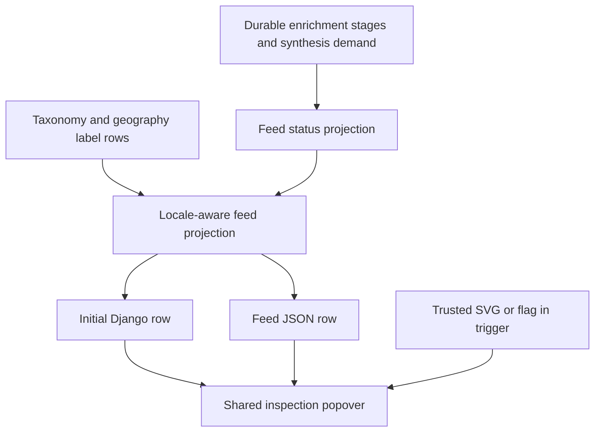

<!-- BEGIN OLLIJA DELIVERY GUIDE -->
## Ollija Delivery Guide

This block is generated guidance. Do not edit it directly. Correct durable facts in `.ollija/project.yaml` or this template, then rerun `ollija annotate-plan`. Put a user-directed exception in the editable Delivery Exceptions section below.

### Resolved locations

- Authoritative host: `fuchitalee`
- Authoritative repository: `/Users/fuchitalee/development/pushin-weight-v2`
- Ollija release worktree area: `/Users/fuchitalee/development/pushin-weight-v2/.worktrees`
- Active worktree: `/Users/fuchitalee/development/pushin-weight-v2/.worktrees/feat/feed-processing-glyphs-ja-hover`
- Plan: `/Users/fuchitalee/development/pushin-weight-v2/.worktrees/feat/feed-processing-glyphs-ja-hover/docs/plans/2026-09-25-023434-feat-feed-processing-glyphs-ja-hover-plan.md`
- Change: `feat-feed-processing-glyphs-ja-hover-2026-09-25-023434`
- Branch: `feat/feed-processing-glyphs-ja-hover`
- Staging branch and blueprint: `staging`, `/Users/fuchitalee/development/pushin-weight-v2/.worktrees/feat/feed-processing-glyphs-ja-hover/render-staging.yaml`
- Production branch and blueprint: `main`, `/Users/fuchitalee/development/pushin-weight-v2/.worktrees/feat/feed-processing-glyphs-ja-hover/render.yaml`
- Staging URL: `https://pushinweight-staging-web.onrender.com`
- Production URL: `https://pushinweight-web.onrender.com`

### Placement

This worktree is inside the Ollija release worktree area. Reuse it for the whole change. Do not create a second worktree or plan for this branch.

### Delivery scope

- Workflow: `plan`
- Delivery target: `production`
- Owner selection recorded: `true`

1. Complete implementation and the plan's verification contract.
2. Run the configured focused checks:
   - `pytest tests/ollija`
3. The parent workflow commits only this plan's changes, pushes the feature branch, and records the candidate SHA.
4. Fetch the remote staging lane: `git fetch origin refs/heads/staging`.
5. Require the unchanged candidate SHA to be a fast-forward of that fetched remote ref, then push the exact candidate SHA to `refs/heads/staging` with the server-enforced fast-forward command `git push origin <candidate-sha>:refs/heads/staging`.
6. Verify the remote staging ref resolves to the candidate SHA and the deployment for `pushinweight-staging-web` reports that same SHA.
7. Run staging checks. Stop here if they fail.
8. Only after staging passes, fetch the remote production lane: `git fetch origin refs/heads/main`.
9. Require the same unchanged candidate SHA to be a fast-forward of that fetched remote ref, then push the exact candidate SHA to `refs/heads/main` with the server-enforced fast-forward command `git push origin <candidate-sha>:refs/heads/main`.
10. Verify the remote production ref resolves to the candidate SHA and the deployment for `pushinweight-web` reports that same SHA before reporting completion.
11. After step 10 succeeds, perform worktree cleanup as the final filesystem action:
    - From `/Users/fuchitalee/development/pushin-weight-v2`, require `/Users/fuchitalee/development/pushin-weight-v2/.worktrees/feat/feed-processing-glyphs-ja-hover` to remain registered, clean, unlocked, and at the verified candidate SHA. If any guard fails, retain it and report the reason.
    - Run `git -C /Users/fuchitalee/development/pushin-weight-v2 worktree remove /Users/fuchitalee/development/pushin-weight-v2/.worktrees/feat/feed-processing-glyphs-ja-hover` without `--force`.
    - Preserve the local and remote feature branches. Continue final reporting from the authoritative repository root.

### Failure handling

- Never promote a staging candidate whose automated checks failed.
- Implementation failures return to the parent implementation workflow for diagnosis, correction, recommit, and restaging.
- SSH, shell, environment, or multi-machine failures use the repository infra/multi-machine skill first.
- The change ledger is advisory; do not validate or enforce it.
- Never force-remove a worktree. Retain staging-only, failed, dirty, locked,
  noncanonical, or candidate-mismatched worktrees for diagnosis or later
  delivery.
- Do not run an endless retry loop or start a persistent Ollija process.
<!-- END OLLIJA DELIVERY GUIDE -->

## Delivery Exceptions

None.

# Feed Processing Glyphs and Japanese Hovers - Plan

## Plain-English Summary

Feed posts will use the selected animated armillary sphere while work is waiting or queued for another attempt, and the selected stop marker when work has permanently failed. Hovering or focusing a marker will show the specific process and result in the chosen display language. Feed hover boxes will also show a slightly larger version of the visual under the pointer.

Japanese feed hovers will use Japanese headings, status text, role names, follower wording, and geography names. Lookup translations already live in rows keyed by language, so the plan adds missing `ja` rows and updates readers; it does not add a `ja` column. The existing feed, chart, and collection behavior outside these display and lookup paths stays as it is.

Implementation will use the existing server and browser feed paths, preserve the current hover interactions, and seed Japanese lookup rows through an idempotent command. Completion requires rendered-browser checks in Japanese, English, and Chinese, including initial page load and client refresh; a schema check and seed audit will confirm no migration is needed. The main risk is showing a permanent-failure mark for work that is actually queued to retry, so state mapping must be proved against the durable queue records.

---

## Goal Capsule

- **Objective:** A feed reader can tell whether post processing is still expected to complete or has stopped, and can understand every feed hover in Japanese when Japanese is selected.
- **Means:** Use the chosen armillary and stop SVGs, derive status from durable work state, localize hover copy and lookup rows, and enlarge the trigger visual inside the existing inspection popover (KTD1–KTD5).
- **Authority:** This Product Contract owns visible behavior. `core/models.py` owns the database schema; `.ollija/` and the generated guide own delivery guidance. The owner selected production delivery on 2026-09-25.
- **Stop condition:** Stop implementation if queue state cannot distinguish retryable from terminal work without changing collection or worker behavior, or if the Japanese geography catalog lacks a reviewed label for a displayed location.

---

## Product Contract

### Summary

Replace feed processing text badges with two selected state glyphs and put the specific status message in the hover. Make every feed hover legible in Japanese, with a slightly enlarged copy of the hovered glyph or flag.

### Problem Frame

The feed now exposes separate enrichment and analysis status text. A failed attempt may be back in the queue, so the word “failed” alone does not tell a reader whether processing has stopped. Japanese readers also encounter English family headings such as “Audience topic” and “Sentiment,” English account and geography hover copy, and missing Japanese lookup labels.

### Key Decisions

- **Animated armillary for pending; stop marker for terminal failure.** (session-settled: user-directed — chosen over the return orbit, hourglass, and circled X shown in the browser prototype: these were the owner's selected forms.) Governs R1–R3.
- **Keep detail in the hover.** (session-settled: user-directed — chosen over visible process-specific text badges: the glyph should convey the state and the hover should name the particular message.) Governs R3, R4.

### Requirements

**Processing state**

- R1. Show the animated armillary for enrichment or analysis work that has not completed its first pass or is queued for another attempt. A failed artifact alone must not imply terminal failure.
- R2. Show the stop marker only for work whose durable state is terminal and has no automatic retry queued; show neither status glyph for ready work. Expired or cancelled requests must not be mislabeled as permanent failure.
- R3. Preserve the distinct enrichment, classification, translation, and analysis messages in hover or focus text; readers must be able to distinguish first pass, retry queued, and terminal failure even when the same glyph is used.

**Feed hover presentation**

- R4. Every glyph- or flag-bearing feed inspection hover shows the same visual at a few pixels larger than its feed rendering, alongside its text. The enlarged armillary keeps its animation; reduced-motion settings stop the animation.
- R5. Hover, focus, click-to-pin, Escape, and viewport-edge positioning continue to work on initial rows and rows added or replaced by feed requests. Accessible names contain the specific text even when visible badges become glyph-only.
- R6. Text-only inspection triggers, including classification states without a glyph, show a slightly enlarged version of their existing text badge in the hover. This is the default pending the owner's answer to the text-only hover question; it does not introduce more glyph designs.

**Japanese content and data**

- R7. Under `ja` and `ja-JP`, every feed hover uses Japanese interface wording, including inspection family headings, status and follower wording, role and geography descriptions, and the native date tooltip. Taxonomy values use Japanese labels for current and visible historical keys. Proper names, handles, codes, and source quotations retain their identities.
- R8. Seed complete Japanese label rows for every lookup family the feed can display, including roles and geography, without adding per-language schema columns or rewriting the frozen English/Chinese geography migration seed. Existing English and Chinese rows remain intact.
- R9. Unknown or missing Japanese lookup values never surface a raw English slug as Japanese hover copy; they use a clearly Japanese unavailable label and remain observable to operators for repair.
- R10. An undetected or absent language value uses a globe in the feed. If language detection is awaiting enrichment, its hover says “Language detection pending” in English, with equivalent copy in the selected locale.
- R11. The follower hover reads as a count, the X logo, and localized “followers” (for example, “102k X followers”). The armillary, stop marker, and globe must be served from a content-hashed static sprite with browser caching.

### Acceptance Examples

- AE1. Covers R1–R3. A synthesis request fails once and returns to `pending`: the post shows the animated armillary; its hover says another attempt is queued. After the configured attempt limit yields `failed`, the same post shows the stop marker and a terminal-failure message.
- AE2. Covers R2–R3. A ready post shows no processing glyph. A cancelled or expired demand never shows the stop marker merely because it left the queue; if a new visible demand requeues it, the armillary appears.
- AE3. Covers R4–R5. A Japanese feed row shows a sentiment glyph at feed size; hovering or focusing it opens Japanese inspection text and the same glyph a few pixels larger. Clicking pins it, Escape closes it, and the same behavior works after feed refresh.
- AE4. Covers R7–R9. A Japanese row with a role badge, follower count, audience topic, national stance, country flag, and date produces Japanese hover headings, values, and date formatting. A known historical key also resolves to Japanese; an unknown key shows Japanese unavailable copy rather than its English slug.
- AE5. Covers R10–R11. An undetected language awaiting translation enrichment shows a globe whose hover says “Language detection pending”; the follower hover includes an SVG X logo; production static serving gives the new glyph sprite a content-hashed URL and immutable cache header.

### Scope Boundaries

- **Included:** The current home feed's post rows, signal column, account and geography inspection hovers, processing badges, and the lookup data those hovers read.
- **Excluded:** Harvest policy, translation or synthesis worker retry rules, chart hovers, unrelated pages, and new processing states.
- **Deferred to Follow-Up Work:** Broader localization of brand display names and non-feed surfaces. Proper names remain as recorded by the product registry.

---

## Planning Contract

### Key Technical Decisions

- KTD1. **Project status from the durable stage and demand rows.** The current `_enrichment_status` collapses translation and classification into one `failed` value, while `PostSynthesisDemand` distinguishes `pending`, `processing`, `failed`, and `cancelled`. Keep a separate presentation state and process-specific hover text on the feed wire instead of deriving retry meaning from badge copy. This implements R1–R3 and does not alter the worker state machine. (session-settled: user-directed — chosen over one glyph for every `failed` string: the owner distinguished a queued failed attempt from work that will not be retried.)
- KTD2. **Use the Cyber-Quan sprite and the shared feed hover controller.** Add the selected drawings from `docs/ideation/2026-09-25-105721-feed-processing-state-glyphs.html` to the sprite and icon allowlist. Render status triggers in both the server template and client row renderer. Preserve the existing inspection controller's event and positioning behavior. (session-settled: user-directed — chosen over the other illustrated glyph candidates: the owner chose the animated armillary and stop marker.)
- KTD3. **Make hover visuals from trusted trigger content.** The popover should clone the trigger's known SVG or flag visual, or render the existing text badge in a larger typographic treatment; it must never parse untrusted hover text as HTML. Apply one size delta across visual families, keeping flag aspect ratio, icon tone, and accessible text. This covers R4–R6.
- KTD4. **Add `ja` rows, not columns.** Existing `*Label` tables use `(key, lang)` composite keys and `seed_i18n_labels` already seeds Japanese for most active classification families. Extend its missing role and historical-label coverage; add a reviewed Japanese geography catalog sourced from pinned Unicode CLDR territory names with explicit exceptions where current owner-reviewed geography names require them. Keep the frozen `monitor/data/account_geography.json` and its migration digest unchanged. This covers R7–R9.
- KTD5. **Localize inspection text on the server.** `_feed_signal_inspections` already builds the per-brand text sent to both render paths but chooses only Chinese or English headings. Extend that single projection for Japanese and carry localized geography and account copy through the wire. JavaScript formats the inspection content and glyph; it does not translate taxonomy keys. This covers R7–R9.

### High-Level Technical Design

The state table for R1–R2 is: first-pass or queued retry → armillary; exhausted terminal failure → stop marker; complete → no status glyph; cancelled or expired → no terminal mark until a new demand supplies queue evidence. Separate process identifiers keep the hover message specific when two stages share the same glyph.

### System-Wide Impact and Risks

- **Data coverage:** Japanese role and geography labels are absent from current seed paths. A coverage gate must compare expected active and historical feed keys with seeded `ja` rows. The geography reconciliation command currently expects only English and Chinese; it must distinguish legitimate added Japanese rows from drift.
- **State semantics:** `PostSynthesisDemand.failed` is reached after attempt exhaustion, while a retryable failure returns to `pending`. Enrichment status is more compressed. If its durable rows cannot prove retryability, implementation must keep an honest neutral or text-only state rather than applying the wrong glyph.
- **Browser parity:** The first feed batch is server-rendered and later batches are client-rendered. Any copy, icon, or hover change must be verified through both paths and through a locale switch. The native date tooltip currently uses the browser locale and needs the selected app locale explicitly.
- **Accessibility and motion:** The existing popover uses `role=tooltip` and supports focus and pinning. SVGs remain decorative inside accessible triggers; `prefers-reduced-motion` removes the loop.

### Sources and Existing Patterns

- `docs/reference/lookup-tables.md` documents lookup keys and the language-row schema; `core/classification_labels.py` and `core/management/commands/seed_i18n_labels.py` are the canonical values and seed path.
- `monitor/views.py` contains `_feed_signal_inspections`, `_build_label_cache`, `_feed_geography_sources`, and the feed wire projections. `monitor/post_synthesis.py` owns queued retries and exhausted failures.
- `monitor/templates/monitor/_feed_initial_v22.html`, `monitor/static/pw-feed.js`, `monitor/static/pw-icons.js`, `monitor/templates/monitor/_cyber_quan_sprite.html`, and `monitor/static/home-v20.css` form the two render paths and visual system.
- `docs/reference/feed-ui-contract.md` and `docs/solutions/workflow-issues/django-i18n-locale-toggle-debugging-journey.md` explain the dual-render and locale pitfalls.
- Unicode CLDR [Japanese territory names](https://github.com/unicode-org/cldr-json/blob/main/cldr-json/cldr-localenames-full/main/ja/territories.json) are a source for country display copy; the existing owner-reviewed geography mapping remains authoritative for which country or region a feed row means.

---

## Implementation Units

### U1. Pin processing presentation states

- **Goal:** Give each X-post row an honest pending, terminal, or absent status per process.
- **Requirements:** R1–R3; AE1–AE2; KTD1.
- **Dependencies:** None.
- **Files:** `monitor/views.py`, `monitor/post_artifacts.py`, `tests/test_views.py`, `tests/test_post_synthesis_lifecycle.py`.
- **Approach:** Trace the current durable translation, classification, and synthesis states, then add only the presentation fields needed by both feed paths. Preserve the existing demand lifecycle and ensure queue evidence takes precedence over a failed artifact.
- **Execution note:** Start with a regression case for a failed synthesis artifact whose demand returned to `pending`; it is the behavior the current collapsed labels cannot express.
- **Test scenarios:**
  - One failed synthesis attempt with a queued retry produces `pending` plus a retry message, not terminal failure.
  - Exhausted synthesis demand produces terminal failure; ready synthesis produces no badge.
  - Cancelled and expired demands never produce the permanent-failure glyph before a new demand is queued.
  - Translation or classification failure without a proven queue state does not acquire a false pending icon.
- **Verification:** Serialized initial and API feed rows carry the same presentation state and specific message.

### U2. Add selected status glyphs and hover detail

- **Goal:** Render the selected status glyphs and a larger matching visual in the existing popover.
- **Requirements:** R1–R6; AE1–AE3; KTD2–KTD3.
- **Dependencies:** U1.
- **Files:** `monitor/templates/monitor/_cyber_quan_sprite.html`, `monitor/static/pw-icons.js`, `monitor/templates/monitor/_feed_initial_v22.html`, `monitor/static/pw-feed.js`, `monitor/static/home-v20.css`, `tests/test_cyber_quan_icon_contract.py`, `tests/test_pw_feed_formatter.js`, `tests/test_home_v22_browser.py`.
- **Approach:** Port only the armillary and stop-marker paths from the prototype. Keep the armillary outer sphere and base fixed while its inner ring rotates. Use a trusted visual in the shared popover for signal glyphs, status glyphs, follower and role glyphs, flags, and text-only status badges. Preserve positioning and accessible interaction.
- **Test scenarios:**
  - Initial and appended pending rows show the animated armillary; terminal rows show the stop marker; ready rows show neither.
  - An inspection hover contains the trigger's SVG symbol or flag at a measured size a few pixels larger, with no duplicate icon and no overflow at narrow viewports.
  - Hover, keyboard focus, click-to-pin, Escape, and replacement of rows retain working popovers and correct accessible names.
  - Reduced-motion preference leaves the armillary still in both row and popover while preserving state and hover text.
- **Verification:** A real browser confirms computed animation, geometry, visual identity, and interaction for both render paths.
- **Additional owner requirements:** Replace “undetected” language text with the globe, distinguish pending detection in its hover, put the SVG X logo between follower count and label, and serve all three new glyphs from `pw-processing-glyphs.svg` through the static manifest cache.

### U3. Complete Japanese taxonomy and role labels

- **Goal:** Make known feed classification values and role names available as Japanese lookup rows.
- **Requirements:** R7–R9; AE4; KTD4.
- **Dependencies:** None.
- **Files:** `core/classification_labels.py`, `core/management/commands/seed_i18n_labels.py`, `monitor/views.py`, `tests/test_classification_labels.py`, `tests/test_views.py`, `docs/reference/lookup-tables.md`.
- **Approach:** Add Japanese copy for missing feed-visible historical aliases, discourse compatibility values, and roles. Extend the idempotent seed and update role fallback and classification-status copy. Verify which historical keys the current feed can actually emit; seed all such keys rather than relying on raw-key fallback.
- **Test scenarios:**
  - Two seed runs produce one `ja` row per expected key and do not overwrite existing English or Chinese labels.
  - `--dry-run` inventories expected Japanese rows without writes; the focused seed audit checks actual missing rows.
  - A Japanese role badge and each current and historical feed taxonomy family resolve Japanese; a missing known label does not render an English slug.
- **Verification:** Database-row counts and rendered feed text agree with the explicit lookup coverage inventory; no model or migration change is generated.

### U4. Complete Japanese geography labels

- **Goal:** Make country, parent country, and fallback region feed hovers Japanese.
- **Requirements:** R7–R9; AE4; KTD4–KTD5.
- **Dependencies:** U3.
- **Files:** `monitor/data/account_geography_ja.json`, `core/management/commands/seed_i18n_labels.py`, `monitor/management/commands/reconcile_account_geography.py`, `monitor/views.py`, `tests/test_feed_geography.py`, `tests/test_classification_labels.py`, `docs/reference/lookup-tables.md`.
- **Approach:** Commit a pinned Japanese label map for the existing country and region identities, source ordinary territory names from CLDR, and review owner-sensitive names against the existing mapping. Insert only `ja` label rows. Teach feed geography projection to read them and teach reconciliation to validate English/Chinese baseline plus Japanese additions without treating them as drift. Do not edit the migration-frozen geography manifest.
- **Test scenarios:**
  - Every country and region key used by the feed has exactly one nonempty Japanese row after two seed runs.
  - Country, parent-child flag, Taiwan fallback, and direct-region cases produce Japanese hover and accessible text under `ja`; English and Chinese results stay the same.
  - Reconciliation accepts complete Japanese labels, reports a missing or mismatched Japanese row, and still rejects unexpected identity or English/Chinese drift.
- **Verification:** A read-only catalog audit has zero missing Japanese keys; no schema migration is generated.

### U5. Localize every feed inspection path and pin browser parity

- **Goal:** Remove English interface words from Japanese feed hovers in both render paths.
- **Requirements:** R3–R9; AE3–AE4; KTD3–KTD5.
- **Dependencies:** U1–U4.
- **Files:** `monitor/views.py`, `monitor/templates/monitor/_feed_initial_v22.html`, `monitor/static/pw-feed.js`, `monitor/static/home-v20.css`, `tests/test_home_v22_browser.py`, `tests/test_pw_feed_formatter.js`, `tests/test_feed_geography.py`, `docs/reference/feed-ui-contract.md`.
- **Approach:** Inventory every `.pw-inspection-trigger`, new status trigger, and native `title` hover: sentiment, post type, product signal, audience topic, geopolitical mode, national stance, legacy stance, classification state, promotion, followers, role, geography, date, and account display name. Localize the server-produced family heading, special warnings, status messages, and date tooltip format. Pass the selected app locale into the client date formatter instead of using the browser default; preserve proper nouns and source text.
- **Test scenarios:**
  - For each feed inspection family, a Japanese first batch and a client-refreshed batch show Japanese interface words and a larger matching visual; known English family headings are absent. The native date tooltip uses Japanese date formatting even when the browser language is English.
  - Japanese locale aliases `ja` and `ja-JP` produce the same hover wording; English and Chinese control cases remain correct.
  - A text-only classification badge uses the enlarged text treatment without a new glyph.
  - Unknown taxonomy and absent geography labels use Japanese unavailable copy or suppress the unsupported geography visual, rather than exposing a raw key or misleading flag.
- **Verification:** Browser checks cover server render, feed JSON refresh, locale switch, hover and focus, and a narrow viewport with no clipped popover.

---

## Verification Contract

| Gate | Evidence required |
|---|---|
| Schema and seed | `python manage.py makemigrations --check --dry-run`; `python manage.py seed_i18n_labels --dry-run`; focused seed and geography reconciliation tests against a disposable database. |
| Focused behavior | `pytest tests/test_classification_labels.py tests/test_feed_geography.py tests/test_views.py tests/test_post_synthesis_lifecycle.py tests/test_cyber_quan_icon_contract.py`; `node tests/test_pw_feed_formatter.js`. |
| Real browser | `pytest tests/test_home_v22_browser.py` with the repo's stable base temp path; inspect the affected tests' executed, skipped, and errored counts. No skip or zero selector match counts as a pass. |
| Stateful UI assurance | `uv run --extra dev bridgewright assurance-validate --project-root .`, `uv run --extra dev bridgewright assurance-prescribe --project-root .`, then `uv run --extra dev python -m tests.ui_assurance.gate --scope affected`. The declaration must cover feed inspection, locale change, and refresh where affected. |
| Release handoff | Record the candidate source revision and run the repo's candidate assurance gate with its required performance inputs, then follow the selected Ollija production delivery target and exact-SHA verification. |

---

## Definition of Done

- U1's status table distinguishes queued retries from exhausted failures using durable state and never labels a cancelled demand permanent.
- U2's selected glyphs match the prototype, including the fixed outer sphere and base, inner-ring revolution, and reduced-motion behavior. Every glyph-bearing hover contains the same visual a few pixels larger.
- U3–U4 leave no known feed-visible Japanese taxonomy, role, country, or region label missing; seed and reconciliation remain repeatable without a schema migration.
- U5 proves Japanese hover copy across every feed family after initial render and refresh, with English and Chinese regression coverage and accessible keyboard interaction.
- The fix-ui browser and Bridgewright affected gates report their executed, skipped, errored, and obligation results; all required obligations pass. Retire any discarded prototype or attempted implementation code from the product diff.
- Keep the plan and work on `feat/feed-processing-glyphs-ja-hover` in its canonical worktree. The owner selected production delivery on 2026-09-25.
