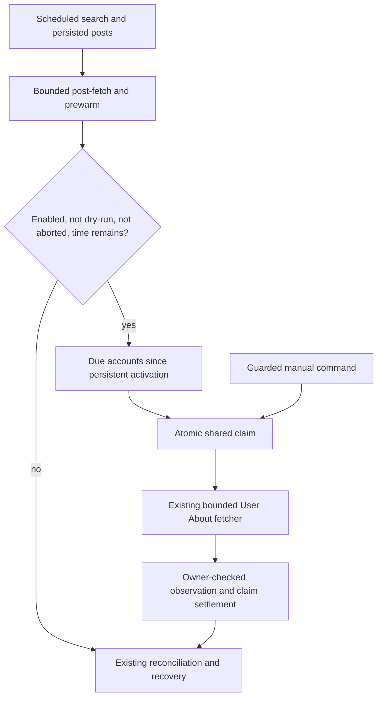

<!-- BEGIN OLLIJA DELIVERY GUIDE -->
## Ollija Delivery Guide

This block is generated guidance. Do not edit it directly. Correct durable facts in `.ollija/project.yaml` or this template, then rerun `ollija annotate-plan`. Current explicit owner instructions govern this task. Record exceptions below and reflect route changes in metadata; removed requirements must not return through another checklist.

### Resolved locations

- Authoritative host: `fuchitalee`
- Authoritative repository: `/Users/fuchitalee/development/pushin-weight-v2`
- Ollija release worktree area: `/Users/fuchitalee/development/pushin-weight-v2/.worktrees`
- Active worktree: `/Users/fuchitalee/development/pushin-weight-v2/.worktrees/feat/account-geography-harvest-freshness`
- Plan: `/Users/fuchitalee/development/pushin-weight-v2/.worktrees/feat/account-geography-harvest-freshness/docs/plans/2026-09-25-060937-feat-account-geography-harvest-freshness-plan.md`
- Change: `feat-account-geography-harvest-freshness-2026-09-25-060937`
- Branch: `feat/account-geography-harvest-freshness`
- Staging branch and blueprint: `staging`, `/Users/fuchitalee/development/pushin-weight-v2/.worktrees/feat/account-geography-harvest-freshness/render-staging.yaml`
- Production branch and blueprint: `main`, `/Users/fuchitalee/development/pushin-weight-v2/.worktrees/feat/account-geography-harvest-freshness/render.yaml`
- Staging URL: `https://pushinweight-staging-web.onrender.com`
- Production URL: `https://pushinweight-web.onrender.com`

### Placement

This worktree is inside the Ollija release worktree area. Reuse it for the whole change. Do not create a second worktree or plan for this branch.

### Delivery scope

- Workflow: `plan`
- Delivery target: `staging`
- Owner selection recorded: `true`
- Delivery route: `staged`

1. Complete implementation and the plan's verification contract.
2. Run the configured focused checks:
   - `pytest tests/ollija`
3. The parent workflow commits only this plan's changes, pushes the feature branch, and records the candidate SHA.
4. Fetch the remote staging lane: `git fetch origin refs/heads/staging`.
5. Require the unchanged candidate SHA to be a fast-forward of that fetched remote ref, then push the exact candidate SHA to `refs/heads/staging` with the server-enforced fast-forward command `git push origin <candidate-sha>:refs/heads/staging`.
6. Verify the remote staging ref resolves to the candidate SHA and the deployment for `pushinweight-staging-web` reports that same SHA.
7. Run staging checks. Stop here if they fail.

### Failure handling

- Complete applicable, unwaived checks for the selected route. A waived check is waived, never passed. Owner-selected direct production does not require staging.
- Product defects return to the parent implementation workflow; repeat only checks invalidated by the fix. Environment failures require repairing the environment, not a new source commit. Retry only after a relevant fact changes.
- SSH, shell, environment, or multi-machine failures use the repository infra/multi-machine skill first.
- The change ledger is advisory; do not validate or enforce it.
- Never force-remove a worktree. Retain staging-only, failed, dirty, locked,
  noncanonical, or candidate-mismatched worktrees for diagnosis or later
  delivery.
- Do not run an endless retry loop or start a persistent Ollija process.
<!-- END OLLIJA DELIVERY GUIDE -->

## Delivery Exceptions

The owner's 2026-09-28 LFG instruction supersedes the earlier production selection and implementation hold: implement this plan and deliver through Ollija to staging only. No production push or deployment is in scope. The owner selected a separate Muse brand under Meta for D1. No paid provider probe or historical catch-up was authorized.

The quality sweep runs concurrently on `fix/product-quality-sweep`. Its owner-selected StepFun UI alias removed the uncommitted StepFun data migration, so this geography branch owns migration `0059_account_user_about_and_muse`. Geography work may proceed independently now; integration of shared harvest files waits until the quality sweep is committed and incorporated. Deliver the quality sweep to staging first, then incorporate its exact changes into this branch, reconcile the combined seven queries and shared tests, and use staging serially. Preserve unrelated staging work and check service/database availability before this candidate is staged.

Integration checkpoint (2026-09-29): this branch fast-forwarded to the exact quality HEAD `1edbc3adaa19b370498ef0fbb026319fc676d397`; the geography changes remain uncommitted on top. The combined scheduled C1 includes all four Muse phrases and the quality sweep's `-from:xxyweb3` exclusion within the query length cap. A combined focused PostgreSQL run passed 210 tests (78 PostgreSQL-required, zero skips/errors). The quality candidate's live-classifier and staging-OAuth acceptance issues remain with the parent release workflow; do not stage this geography candidate until that workflow clears the lane and gives the handoff.

Current staging harvest inventory shows the cron is suspended with the deliberately dormant `0 0 31 2 *` schedule. Preserve that bounded/manual acceptance definition; do not replace it with an automatic paid schedule, trigger it, or unsuspend it in this release. Staging verification must not assume natural scheduled cycles. Use the deployed candidate SHA/config, staging database evidence, and a bounded fake-HTTP caller-chain acceptance run. The staging-only `X_MONITOR_STAGING_USER_ABOUT_ENABLED=True` override activates the lane's configuration at 0.2 QPS, the lowest currently published TwitterAPI.io tier ([provider subscription page](https://twitterapi.io/subscribe), checked 2026-09-28); common/production config remains disabled. This is a conservative public rate bound, not a live account-tier check or authorization to call the provider. A fake-HTTP caller-chain run proves code behavior but is not a paid-provider or naturally scheduled cohort observation.

The staging flag is authored in `render-staging.yaml`, but a branch push alone may not apply a Blueprint change to the suspended cron. U5 must observe the actual harvest service's deployed SHA and effective environment; if the flag is absent, apply the Blueprint only within the authorized staging scope or report activation as unverified. Never infer cron activation from a staging web deployment.

Current owner instructions take precedence over generated defaults. Reuse valid checks, distinguish an environment failure from a product failure, and never make empty source commits to retry an environment problem. This branch has been refreshed from `origin/main`; reannotate/check the same plan before delivery mutations. Generated web-only deployment evidence is insufficient for this harvest feature. Retain the canonical worktree after staging, as the generated guide directs for staging-only delivery.

# Account Geography and Muse Harvest Freshness - Plan

## Plain-English Summary

After an account's first harvested post is saved, the scheduled harvest will reuse the existing User About lookup and country/region mapping. It will attempt the lookup in the same 15-minute cycle when time and paid-call budgets allow, then carry unfinished accounts into later cycles. Accounts already created by a seed or list import still qualify when their first post arrives after activation. Shared account claims will prevent overlap with the existing manual backfill command.

The same plan will add four precise Muse phrases to the existing C1 collection query so public conversation that never says Llama can enter the feed. Muse gets its own brand under Meta. Wang stays llama staff on Call A. An official `@Muse` account can join existing B3 only after its ownership and numeric ID are verified.

The seven-call structure, translator, generic classifier prompts, and geography mapping remain. C1 phrase content and, if verified, B3 handle content change intentionally. Scheduled country lookups fit within the existing 13-minute cycle deadline. Additional Muse results may increase search pages, post-fetch work, and account lookups, so the combined workload must respect existing caps. Historical catch-ups and a separately proposed paid volume probe remain outside this turn. This candidate stops after staging verification; the quality sweep uses the shared staging lane first.

The saved 2026-09-25 sample counted 759 first-account posts among 3,274 ingested posts (23.2%), averaging 7.9 and peaking at 22 per 15-minute slot. At the historical 18-credit projection per attempt, that volume would cost 13,662 credits/day before retries. Those are historical planning inputs, not current traffic or verified charges. Staging delivery will verify the candidate with a bounded fixture and any naturally available scheduled cohort. Fetching the historical backlog is optional, separately budgeted work and does not block this feature's completion.

---

## Goal Capsule

- **Objective:** The feed captures relevant public Muse discussion and gains available country or region evidence soon after an account's first collected post.
- **Means:** Expand the existing C1 phrases with matching catalog/keyword data, retain source-account roles, and reuse User About through a bounded scheduled lane and shared account claims.
- **Authority:** The 2026-08-29 geography plan owns exact provider parsing, typed Account fields, country/region resolution, credential purpose, and backfill protections. This plan adds recurring freshness and shared coordination with the existing command; historical catch-up execution remains optional.
- **Delivery:** Staging is selected; use the existing `feat/account-geography-harvest-freshness` branch and worktree. The quality sweep stages first, then this branch incorporates it and stages the combined candidate. Stop before production.
- **Stop condition:** During execution, stop User About admissions on authentication, schema, circuit, deadline, or hard budget failure under the existing contract; expose the reason without stopping or rescheduling the harvest cron.

---

## Product Contract

### Problem Frame

`backfill_account_based_in` already calls `fetch_user_about_batch` and applies its results through the Account observation gateway. `run_cycle` does not fetch User About; its parser imports handle affiliate labels. `reconcile_account_geography` only maps values already stored in the database. Consequently new accounts wait for a manual paid fetch. The 2026-09-25 investigation recorded 759 first-account posts in 24 hours without an attempt and 22,125 eligible historical accounts; neither count was remeasured for this plan revision.

The supplied Muse handoff reports that staff and official posts were collected while public Muse discussion without Llama terms was missed. Local policy inspection confirms the llama C1 token list has no Muse phrase and B3 has only `AIatMeta` for this brand. Keyword attribution cannot recover a post that search never collected. The proposed collection change therefore belongs in the live policy and matching database/catalog data; generic classifier prompt retuning does not fix the intake gap.

### Decision D1 - Muse brand grouping (selected by owner)

| Choice | Effect on this plan |
| --- | --- |
| Separate `muse` brand under Meta (selected) | Add a sibling catalog identity and put its phrase tokens in the existing C1 pack. Keep Llama intact; distinguish Muse mentions/products from the source account's llama affiliation. This requires brand/company/product/label wiring and explicit source-versus-mention tests. |
| Keep Muse grouped under `llama` | Add the phrases and supported product catalog entries to the existing identity. Collection improves with fewer registry changes, while downstream brand summaries continue grouping Muse and Llama together. |

The owner selected the separate `muse` brand under existing Meta for U6/U7. This does not add a search call, change Wang's list/role, or authorize historical reclassification.

### Requirements

**Fresh account coverage**

- R1. Every eligible account whose earliest stored `Post.fetched_at` is at or after the persisted activation watermark becomes due for one User About lookup, including accounts precreated by seeds/lists. Eligibility retains numeric `author_id`, nonblank handle, and null `account_based_in_fetched_at`. Successful empty values still checkpoint the fetched timestamp.
- R2. The scheduled cycle prioritizes due new accounts after their posts are persisted and before lower-priority recovery work, subject to the existing shared 13-minute deadline and its two-minute next-slot reserve. If a cycle cannot admit all due accounts, they remain durably due for the next cycle; an account is not lost at the 24-hour boundary.
- R3. The recurring lane admits no more than 24 accounts, 32 paid attempts, 576 projected credits, or 90 seconds in one 15-minute cycle, whichever limit binds first. It uses the verified provider QPS ceiling and at most four concurrent requests; configuration can lower but not silently raise these caps. The 24-account cap covers the observed 22-account peak with small headroom, while the attempt cap limits retries.
- R4. Recurring calls declare `TwitterApiCredentialPurpose.SCHEDULED`; one-off catch-up calls declare `ON_DEMAND`. Missing purpose or key fails closed with no legacy-key or cross-purpose fallback.

**Shared paid-call safety and catch-up**

- R5. Scheduled and one-off paths acquire the same per-account durable claim before HTTP and hold ownership through result persistence. Active claims block the other path; an expired claim with an uncertain request outcome is not automatically stolen. Late workers cannot overwrite another claim's outcome.
- R6. Reuse `fetch_user_about_batch`, strict ID/schema validation, exact geography resolution, and `Account.apply_observation(source='user_about')`. Accepted success updates `account_based_in_fetched_at` even when country is empty. Identity/schema quarantine, rejected fields, and retryable transport failures retain their existing meanings.
- R7. Keep the existing manual command compatible with the shared claim protocol and its production executor, database-identity, recovery-receipt, nonblocking run-lock, rate, attempt, credit, and aggregate-report gates. A historical catch-up, if separately selected and budgeted, uses its frozen receipt cutoff, skips fetched/claimed accounts, and uses the on-demand key. Executing that catch-up is not required for recurring production delivery.
- R8. Report aggregate counts for due, claimed, attempted, accepted, success-empty, mapped country, direct region, unresolved provider value, deferred, quarantined, retries, projected credits, and cycle time. Logs and tracked reports exclude handles, Account IDs, raw payloads, keys, headers, and connection strings. Provider ledger reconciliation distinguishes actual charge from the published-rate projection.

**Muse collection and attribution**

- R9. Add exactly the quoted phrases `"Meta Muse"`, `"Muse Spark"`, `"Muse Glimmer"`, and `"Muse Realtime"` to the existing C1 pack, keeping its current co-occurrence terms and thresholds. Do not add bare `muse`, bare Llama/Meta AI on B1, version-token expansion, C4, a new B group, or extra-search expansion.
- R10. Keep `alexandr_wang` as llama staff on Call A with the existing list and membership behavior. Keep `AIatMeta` on its existing official-handle path. Add `@Muse` only to existing B3 if Meta ownership, official role, and numeric account ID are verified; absent that evidence, omit the handle without blocking phrase collection.
- R11. Implement D1's selected brand grouping in enabled-brand/company/keyword and actual product catalog data. Every active policy token has literal non-regex `BrandKeyword` coverage before activation. Preserve generic classifier prompts and source-account affiliation; a source account does not automatically make every post a Muse mention.
- R12. Fresh database creation and upgrades of an existing database produce the same intended Muse data idempotently. Deploy required registry/keyword data before activating its policy tokens. Keep the shared C1 cursor and avoid automatic historical backfill or reclassification.
- R13. Preserve the seven scheduled call IDs, current page/result/attempt caps, shared deadline, and R3's country-lookup caps under combined Muse traffic. Measure extra returned-post/enrichment/account demand and expose deferrals or starvation; no-new-call is not a zero-cost claim.

### Scope Boundaries

- In scope: recurring User About, shared claims, Muse C1 collection with matching keyword/catalog data, a verified optional B3 handle, combined workload limits, and staging evidence for both outcomes.
- Preserve seven-call structure and call taxonomy, cursors, caps, metrics refresh semantics, translation/classification queue, country/region taxonomy, and the production 15-minute cron. The existing staging manual-acceptance cron remains dormant. C1 phrase content and verified B3 handle content may change; brand catalog/labels follow D1. No feed layout redesign or classifier prompt retuning.
- A periodic refresh of accounts already fetched, broader Account profile refresh, a second cron or Celery schedule, and pausing the production harvest are out of scope.
- Optional follow-up: historical catch-up needs its own current dry-run census and exact paid-run budget. The saved 22,125-account figure is not an execution limit or a remaining release gate.
- Any historical Muse recovery/reclassification is separate scope. The writer's proposed paid 15-minute C1 probe needs its own exact account-purpose key, time/query, request/page/result/credit/wall caps and owner budget selection; it is not implicitly authorized or a new mandatory approval ceremony for the entire release.

### Acceptance Examples

- AE1. **Covers R1–R4.** A new eligible account's first post is persisted in a scheduled cycle. With time and budget remaining, one scheduled-key User About request is admitted and its accepted response updates only fields owned by the `user_about` source.
- AE2. **Covers R1–R3.** A cycle has 22 new eligible accounts, including one seed-created account with no earlier post. All qualify under the account cap; when the shared deadline is short, unclaimed accounts remain due across days and the next cycle sees them before newer accounts.
- AE3. **Covers R5–R7.** The catch-up command and scheduled cycle select the same account. Exactly one path obtains the active claim and sends HTTP; the other defers without charging. After a successful empty lookup, neither path selects it again.
- AE4. **Covers R5–R7.** The provider returns an ID mismatch or schema drift. No Account geography or fetched timestamp is written, the reason is quarantined under the existing policy, and unaffected accounts may proceed until the systemic stop threshold.
- AE5. **Covers R2–R4.** A 12-second request cannot safely fit before the shared deadline. The recurring lane admits zero new requests, does not switch credentials, and leaves the account due for the next slot.
- AE6. **Covers R7–R8.** An optional catch-up is interrupted after a complete chunk. Its next bounded invocation uses the same frozen cutoff, skips accepted/claimed accounts, and reports aggregate remaining work and projected charges. This interruption does not prevent the recurring feature from being complete.
- AE7. **Covers R9, R11–R12.** A public post says “Muse Spark” and “model” without Llama. The final C1 query contains the quoted phrase and existing co-occurrence terms; its stored keyword evidence and tracked catalog follow D1. Missing literal keyword coverage fails preflight before any paid search.
- AE8. **Covers R10–R11.** Wang posts about Llama, Muse, both, or an unrelated topic. He remains llama staff on Call A in every case; mentioned-brand/product classification follows the content and chosen catalog, with the existing relevance behavior preserved. A seed rerun does not add him as Muse staff just because both brands belong to Meta.
- AE9. **Covers R9–R10, R13.** The policy-to-planner-to-client path emits the same seven call IDs. C1 includes all four phrases and runtime `since_time`/`until_time` within the actual query limit; B3 never includes Wang and includes Muse only with verified identity. No cursor is reset.
- AE10. **Covers R2–R3, R13.** Expanded C1 reaches existing page/result caps and produces more than 24 due accounts. Primary collection and post-fetch retain their order; country lookups stop at the first time/account/attempt/credit limit, carry due accounts forward, and report oldest-due age and deferral reasons.

---

## Planning Contract

### Key Technical Decisions

- KTD1. **Use one durable claim protocol.** Add an Account-keyed state row with owner token, lease deadline, attempts, next eligible time, and aggregate-safe outcome. Claim atomically after rechecking eligibility; perform HTTP outside the transaction; settle accepted observation and claim in one transaction conditioned on the owner token. `fetch_user_about_batch` returns after the whole batch, so the lease covers pace/semaphore waiting, retry waits, the bounded batch, and settlement, not just its 12-second HTTP timeout. Limit manual chunks to a bounded claim lifetime too. Recheck ownership/deadline immediately before each attempt; ambiguous expiry becomes deferred-uncertain until the old executor is known stopped and any request window has elapsed. Do not promise exactly-once charging across a crash after HTTP success but before database commit.
- KTD2. **Define activation by stored posts.** Persist the watermark once before the first enabled scheduled cycle starts search; restarts and redeploys never reset it. Select accounts with posts at/after the watermark and no earlier stored post, ordered by earliest `Post.fetched_at` then account ID. `Account.first_seen_at` is creation time and is unsuitable. A database-only query can reconstruct due work after a crash between post persistence and claim creation; no rolling 24-hour filter or historical Account-wide paid sweep. Query only unfetched candidates with indexed post existence/earliest-time lookups, and inspect the query plan on representative data. The manual command keeps its existing receipt/account-creation cutoff; shared claims coordinate any overlap.
- KTD3. **Keep one shared deadline.** Insert the lane after bounded post-fetch and synthesis prewarm, immediately before scheduled list reconciliation/backlog in `CycleRunner.run`. Require scheduled kind, non-dry-run, enabled configuration, and primary status not aborted. Pass the existing deadline object, reserving time for result persistence and summary completion within the lane's 90 seconds and the cycle's 780 seconds. Recheck after pace/semaphore waits and before each retry; never send a request when its safe request-plus-persist envelope cannot fit. Geography failure degrades its own status, preserves posts/cursors, and cannot turn an aborted harvest into success.
- KTD4. **Keep credential purpose at the caller boundary.** Scheduled `CycleRunner` requests the scheduled key explicitly. The existing one-off command continues to require the on-demand key. The reusable fetcher takes only the resolved key; it never decides purpose or falls back.
- KTD5. **Extend the guarded command, not a second backfill.** Both callers use one shared claim/fetch/apply service around the existing fetcher/parser and `Account.apply_observation(source='user_about')`. Preserve the command's existing receipt cutoff, dry-run and aggregate reports. Do not reset fetched timestamps or use production `--refresh`. Database-only `reconcile_account_geography` is not a paid-fetch substitute.
- KTD6. **Budget from historical evidence.** The saved mean 7.9/slot and peak 22 support the initial cap of 24 accounts. At the code's 18-credit reservation, 32 attempts project at most 576 credits/slot or 55,296/day across 96 slots. The saved historical cohort projects 398,250 credits for one attempt each. Verify the provider rate and effective quota at execution before enabling paid work; a changed rate must lower admissions to preserve the budget, never silently raise it. Report projections separately from actual provider charges.
- KTD7. **Configure through the existing source of truth.** Add the bounded lane settings under `harvest` in `config.yaml` / `x_monitor.config.load_config`, with validated account/attempt/credit/wall/concurrency ceilings and a conservative rate bounded by the verified provider quota. Default disabled until migrations and the shared manual path are deployed; then enable as part of this selected production delivery. Reserve scheduled capacity if a manual catch-up shares the provider quota; do not assume process-local pace gates coordinate separate processes.
- KTD8. **Author Muse queries in the live policy.** `config/harvest_policy.yaml` flows through `specs_from_policy`, `_resolve_x_query_specs`, and the final search caller. The legacy `config.yaml.x_query_specs` map is not the activation source. Add the exact R9 phrases to the selected brand in the existing C1 `co_packs` entry; do not change packing count or thresholds. Verify length after runtime time bounds, not from the handoff's historical 288-character planner estimate.
- KTD9. **Make catalog ownership explicit after D1.** `_build_brand_index` requires literal non-regex database keyword coverage; it does not require `is_primary=True` in that check. `_tracked_brand_catalog` is generic and its default rows have empty products. Trace the actual persisted product/catalog and packet-building path before editing data; do not invent a `Brand.products` field or assume aliases populate products. For a split, separate source-account attribution from Muse mentions without bulk rebadging Wang/AIatMeta posts or changing their registry roles.
- KTD10. **Make data precede policy.** Use an additive, idempotent data migration/upsert path plus matching fresh-create seed behavior. Inspect the existing Muse Spark row before changing its ownership; the handoff reports it under llama but this revision has not queried production. Ensure the deployment order is safe for old/new workers: add compatible data first, then activate policy/catalog, and retain needed mappings on rollback. Keep the shared C1 cursor untouched.
- KTD11. **Treat added load as a joint budget.** The 2026-09-25 mean/peak sizing predates Muse expansion. Keep R3 and existing search caps; test bursts, exhausted post-fetch time, repeated deferral, and subsequent drain. Use existing representative evidence plus a bounded staged fixture before activation; later production evidence distinguishes actual returned volume from native X page counts. A paid probe is optional separately budgeted work, using `ON_DEMAND` only, never a silent prerequisite or an uncapped proxy for testing.
- KTD12. **Preserve evidence provenance.** The handoff's X confirmation was Grok-native-only and did not verify `@Muse` ownership/ID. Any later X verification follows that provider choice and the router skill. Do not infer ownership from tags/name similarity or use an unapproved paid TwitterAPI probe to resolve it.

### Existing Paths and Dependencies

- `monitor/cycle.py` creates the shared deadline and runs search, post-fetch, list reconciliation, backlog, and metrics refresh. `x_monitor/config.py` defines the 13-minute run deadline and two-minute next-slot reserve.
- `monitor/management/commands/backfill_account_based_in.py` owns eligibility, snapshot/restore gating, nonblocking production lock, dry-run, cumulative budgets and aggregate receipts.
- `monitor/twitterapi/user_about.py` owns the 12-second request envelope, 18-credit reservation, pace gate, bounded concurrency, strict parser, and quarantine behavior. `core/models.py` owns Account observation validation.
- `docs/plans/2026-08-29-093958-feat-feed-country-flags-disclosure-plan.md` records the completed User About and geography contract. Its explicit deferral of recurring User About is superseded only by this new scope.
- `config/harvest_policy.yaml`, `x_monitor/harvest_policy.py`, `monitor/cycle.py:_build_brand_index`, and `x_monitor/attribution.py:_tracked_brand_catalog` anchor Muse collection/catalog changes. `load_seed.py` links each curated account to every `BrandCompany` brand for its company; adding Muse under Meta would therefore also link Wang as Muse staff unless explicit account-link behavior prevents it. `specs_from_policy` enumerates `co_packs` into C1/C2/C3, so a sibling Muse joins the existing first pack rather than creating a fourth pack.
- `scripts/build_reference_doc.py` generates `docs/reference/twitterapi-live-queries-by-model.md`. Refresh that exhibit from final policy during implementation. Older `docs/reference/twitterapi-io-calls.md` contains conflicting B-call/source/post-fetch prose; use current code for taxonomy and correct only directly affected documentation under the reference-doc skill.

### Muse Handoff Evidence

Source: `docs/handoffs/2026-09-28-183339-meta-muse-harvest-proposal.md`, an untracked document in the authoritative root; it remains there and is not copied into this worktree. Its Sept 28 report supplies the previous week's 44 Wang posts, 5 AIatMeta posts, 176 posts containing Muse Spark, and the existing llama keyword mapping. These are writer-reported database observations, not fresh verification by this planner. Native X pages capped at 10 hits are examples/lower bounds, not a complete volume census.

The handoff records `repo_root_sha: aff2eb...` and `head: 415e87b...`, which disagree. Local code grounding for this addition uses the observed root at `415e87bcbfad5afc4361283f886444181e6b3ac5`; its supplied production/X claims keep their own provenance. The original “no posts” concern is not treated as literal absence because the supplied evidence already includes staff/official posts.

Read-only production catalog inspection on 2026-09-28 confirmed no `muse` Brand row, a single literal `"Muse Spark"` BrandKeyword currently owned by `llama`, and no Muse BrandSearchTerm. The only existing Product with Muse in its name or repository is `nvidia/Muse-Glimmer-30B-NVFP4` under `nemo_megatron`; retain that NVIDIA product as-is. Split-brand installation must transfer only the exact llama keyword and add Meta Muse data without rewriting historical post attribution.

Meta's [Muse Spark announcement](https://ai.meta.com/blog/introducing-muse-spark-msl) identifies Spark as a Muse-family model, and its [current model catalog](https://ai.meta.com/resources/models-and-libraries/llama-downloads) identifies Glimmer as a model. The migration creates those two Meta products under Muse. The `"Muse Realtime"` search phrase remains a collection token and catalog keyword, not an invented Product row; `@Muse` remains unverified and absent from B3.

### High-Level Technical Design

Claim lifecycle: due → claimed → fetched (including empty), retry-due, quarantined, or uncertain. Active/uncertain claims are excluded from new admissions. Only a resolved retry becomes due again; fetched accounts do not refresh periodically.

### Risks and Mitigations

| Risk | Mitigation |
| --- | --- |
| Paid calls duplicate across lanes | Shared atomic claim, fetched timestamp re-check, bounded lease, and a concurrency regression with both real caller paths. |
| Geography work delays next harvest slot | One cycle-wide deadline, R3 caps, safe admission envelope, and a timed 22-account peak simulation. |
| Backlog spend is underestimated | Snapshot count, published-rate attempt projection, explicit retry headroom, hard command limits, and exact-window provider ledger reconciliation. |
| Bad provider response corrupts Account geography | Existing strict parser, returned-ID validation, model-owned observation gateway, and quarantine stop thresholds. |
| New accounts are missed after one short cycle | Durable due selection since activation watermark, oldest-first carryover, and a cross-cycle regression. |
| Muse tokens activate before matching data | Data-before-policy sequencing and actual `_build_brand_index` coverage on fresh/upgraded databases. |
| Split brand silently widens account roles or rebadges source posts | D1-specific seed/source-versus-mention cases; preserve Wang's llama staff relationship. |
| Additional C1 pages starve country lookups | Fixed shared caps/deadline, combined-load regression, oldest-due/deferral reporting, and bounded live observation. |

### Sequencing

1. The owner released the hold and selected separate Muse. The existing feature branch was fast-forwarded from `f60d8fa` to `origin/main` `415e87b` before implementation; recheck its base before integration. Work independently until the quality sweep commits its shared-file changes; geography's additive schema/catalog migration is numbered `0059`.
2. U4 pins the current caller behavior; U1 adds claims/activation state; U3 routes the existing command through the shared service; U2 enables scheduled integration.
3. U6 installs separate Muse registry/keyword/catalog data; U7 activates the existing C1/B3 policy contents and proves combined load. Incorporate the quality sweep and resolve the shared files, migration numbers, combined queries, and tests before U5 stages this candidate. Optional historical catch-ups remain separate.

---

## Implementation Units

### U1. Claim and coverage state

- **Goal/requirements:** R1, R5–R6; KTD1–KTD2. **Dependencies:** U4 baseline pins.
- **Files:** `core/models.py`, generated `core/migrations/` migration, new `monitor/twitterapi/user_about_service.py`, `tests/test_account_user_about_claims.py`.
- **Approach:** Add minimal claim state and persistent activation state; use the existing model observation gateway, with transactional claim/settlement and database-only first-post selection.
- **Test scenarios:**
  - Two PostgreSQL connections race; one owns the account, and fetched or active/uncertain rows cannot be reclaimed.
  - Seed/list-created accounts with their first post after activation qualify; accounts with any earlier post do not. A crash before claim creation, an ineligible handle later repaired, and carryover across days lose no due work.
  - A success-empty result settles once; retryable failure, quarantine, uncertain expiry, and a late stale owner remain distinct. Failed observation/settlement rolls back together.
- **Verification:** Forward/reverse migration on disposable PostgreSQL and owner-fencing/selector tests pass; no HTTP occurs inside database transactions.

### U2. Scheduled User About lane

- **Goal/requirements:** R2–R4, R6, R8; KTD3–KTD4, KTD6–KTD7. **Dependencies:** U1, U3.
- **Files:** `monitor/cycle.py`, `x_monitor/config.py`, `config.yaml`, `monitor/twitterapi/user_about.py`, new `tests/test_account_user_about_cycle.py`, `tests/test_harvester_config_contract.py`.
- **Approach:** Wire the shared service at the identified `CycleRunner.run` boundary, thread the existing deadline/config, and expose additive aggregate status. Adapt fetcher admission only as needed to include post-wait checks and persistence reserve.
- **Test scenarios:**
  - AE1/AE2: a real `run_cycle --scheduled` → `CycleRunner.run` → shared fetcher → parser → Account chain, with only external HTTP faked, stores the expected country/region and fetched timestamp using `SCHEDULED`.
  - AE5: 22 accounts, retries, long pace waits, exhausted attempts/credits, and near-expired deadline each respect their binding cap. A refused account remains due next cycle.
  - Disabled, dry-run, backfill-kind, or aborted cycles issue no User About request; missing scheduled key never uses the on-demand or legacy key.
  - Authentication/schema/circuit failures are visible without changing saved posts, primary failure status, or emitting identifiers/secrets.
- **Verification:** Captured downstream kwargs and durable rows satisfy the contract; the existing seven-call/cursor/post-fetch/metrics regressions remain valid.

### U3. Shared coordination in the existing manual command

- **Goal/requirements:** R5, R7–R8; KTD1, KTD5. **Dependencies:** U1.
- **Files:** `monitor/management/commands/backfill_account_based_in.py`, shared service, `tests/test_backfill_account_based_in.py`.
- **Approach:** Keep existing command gates and selector; route each bounded chunk through the shared claim/fetch/apply service. Fetch/apply progress and lease renewal must stay bounded across large command runs. Do not execute a historical catch-up as part of this unit.
- **Test scenarios:**
  - AE3/AE6: real manual/scheduled callers overlap on one account; one request is sent, the other defers, and a completed empty result is never retried.
  - Default dry-run and invalid production receipt/database/executor fail before credential use. Valid calls declare `ON_DEMAND` and preserve the frozen cutoff and cumulative caps.
  - Claim expires during queue wait, HTTP, or persistence; no competing request or stale write occurs. Crash after paid response is reported uncertain rather than falsely free or exactly-once.
- **Verification:** Existing backfill protections pass unchanged in meaning; cross-caller race tests use PostgreSQL connections and fake HTTP barriers.

### U4. Regression net for the actual callers

- **Goal/requirements:** Pin R1–R13 before behavior changes and preserve the harvest contract. **Dependencies:** none for baseline pins; D1 for Muse expected catalog ownership.
- **Files:** new `tests/test_account_user_about_cycle.py`, new `tests/test_account_user_about_claims.py`, new `tests/test_muse_harvest_regression_net.py`, `tests/test_backfill_account_based_in.py`, `tests/test_run_cycle_call_ids.py`, `tests/test_hybrid_harvest_regression_net.py`, `tests/test_cycle_cursor_wiring.py`.
- **Approach:** Add the missing scheduled lookup regression first, with fake HTTP captured at the real fetch boundary; extend it as U1–U3 land. Reuse existing search/cursor/post-fetch/metrics pins instead of duplicating their implementation.
- **Test scenarios:** Intended first-post and command-overlap behavior is red before integration; the same caller-chain tests become green afterward. Count command-entry, scheduled integration, overlap, and deadline test shapes separately from helper tests; required skips are not passes.
- **Muse coverage:** Capture final client queries after loading actual policy and appending time bounds; assert seven calls, R9 phrases, preserved co-occurrence, no Wang on B3, no new B1/extra-search path, and unchanged shared cursor. Test D1's source-versus-mention behavior and expanded-C1 load against the same country-lookup deadline/caps.
- **Verification:** Every new production caller reaches the shared config, purpose, deadline, parser, and observation gateway. Relevant existing regression tests pass with executed/skipped/error counts reported.

### U5. Staging delivery and bounded freshness proof

- **Goal/requirements:** Verify R1–R13 at the selected staging endpoint. **Dependencies:** U1–U4, U6–U7, and incorporation of the quality sweep's shared changes.
- **Files:** this plan's evidence/verification record; existing `docs/deploy/render.md` and `docs/operations/ollija.md` as runbooks. No new scheduler or UI surface.
- **Approach:** Reannotate/check the refreshed plan, run applicable checks, confirm staging service/database availability, then stage the candidate after the quality sweep completes its staging use. Apply the additive schema before the staging-only config override is observed. Deployment includes the existing manual executor's shared-claim code; pre-upgrade manual User About jobs must finish before activation so an old caller cannot bypass claims. Keep the manual-only staging cron dormant, verify its effective 0.2-QPS enabled config without triggering provider work, and create/verify the persistent activation watermark through the bounded fake-HTTP caller chain. Rollback removes only the staging override and retains state/data; it does not pause the production harvest or discard fetched evidence.
- **Verification:** Observe the exact deployed staging web and configuration revision, migrated staging schema, activation watermark, and a bounded fake-HTTP scheduled caller-chain fixture against staging-equivalent configuration. Record aggregate post/cursor and Account outcomes from the fixture. If the staging harvest service remains suspended, report that no natural scheduled cohort occurred; do not unsuspend it or claim live provider proof. If the owner separately selects a working staging schedule, inspect its first two naturally scheduled cycles and same-cohort 30-minute enrichment grace with aggregate-only output.
- **Muse proof:** On the same deployed revision, confirm matching keyword/catalog data, generated final C1 query with time bounds, unchanged seven-call taxonomy/cursors, and representative persisted Muse-without-Llama examples when returned by normal scheduled collection. Attribute observations to the selected D1 behavior and compare additional returned-post volume, page saturation, post-fetch time, due-account age, and geography deferrals. Zero live examples is inconclusive; do not manufacture a backfill or paid probe. A regression rolls back the added policy contents/lane within the existing delivery scope while preserving registry data and cursor state.

### U6. Muse registry, keywords, and catalog under the selected grouping

- **Goal/requirements:** R10–R12; KTD9–KTD10. **Dependencies:** D1, release of owner hold, U4 baseline pins.
- **Files:** `monitor/management/commands/load_seed.py`, applicable generated data migration in `core/migrations/`, `project/settings.py` enabled-brand configuration if split, `core/models.py` only where an existing model-owned gateway needs wiring, actual product/catalog seed sources discovered from `x_monitor/attribution.py`, `tests/test_load_seed_account_observation.py`, `tests/test_muse_harvest_regression_net.py`.
- **Approach:**
  1. Resolve D1 into one concrete catalog target. Inspect existing keyword/product/brand relations, then idempotently install the four literal mappings and supported catalog data before policy activation.
  2. If split, add `muse` under existing Meta and wire enabled-brand/catalog/labels without duplicating companies or remapping Llama products. Keep Wang's exact llama staff relation and AIatMeta's existing source role; route Muse mentions separately. If grouped, extend llama catalog data without inventing a new brand.
  3. Trace how persisted product/alias data reaches actual classifier packets; keep `classifier_0731_prompts.py` generic. Update applicable labels and focused reference documentation under their relevant repo skills when execution resumes.
- **Test scenarios:** Fresh database and existing database (Muse Spark present, absent, or already under selected owner) converge on the intended result; reruns duplicate nothing; `_build_brand_index` accepts every active literal token and rejects missing coverage. Seed-by-company does not attach Wang to a new Muse brand. Llama-only, Muse-only, both, and irrelevant source posts produce D1's intended attribution/catalog inputs without historical rewriting.
- **Verification:** Database/catalog snapshots and captured classifier packets demonstrate intended identities and products; existing account roles/list membership and stored historical classifications remain intact.

### U7. Muse policy integration and combined workload proof

- **Goal/requirements:** R9–R13; KTD8, KTD11–KTD12. **Dependencies:** U6, U2, U4, resolved D1.
- **Files:** `config/harvest_policy.yaml`, `x_monitor/harvest_policy.py` only if existing composition needs a minimal fix, `monitor/cycle.py`/`x_monitor/attribution.py` only for demonstrated source/mention wiring, `tests/test_muse_harvest_regression_net.py`, `tests/test_harvest_policy_load.py`, `tests/test_cycle_query_length_guard.py`, `tests/test_harvest_query_exhibit.py`, generated `docs/reference/twitterapi-live-queries-by-model.md` and directly affected references.
- **Approach:**
  1. Add the exact four quoted phrases under D1's brand and existing C1 pack. Preserve existing co-occurrence, exclusions, thresholds, call IDs, caps, and cursors. Confirm data coverage before activating policy.
  2. Verify `@Muse` identity through the required X route if accessible; add only a confirmed official account to existing B3. Unverified identity means no handle change, with phrase collection proceeding independently.
  3. Run the actual policy→planner→final client path with fake HTTP, capture fully bounded queries, and regenerate the live-query exhibit. Keep older contradictory reference prose from becoming implementation instructions.
  4. Exercise representative Muse/non-Muse fixtures and high returned-post volume through normal persistence/post-fetch into the geography lane. Report saturation/deferral effects within existing limits; prepare U5's bounded scheduled observation.
- **Test scenarios:** AE7–AE10; all four phrase searches fit the final limit including `since_time`/`until_time`; no bare homonym, extra call, Wang B3 entry, or C1 cursor reset appears. Missing catalog/keyword data aborts preflight. Under repeated saturated cycles, geography deferral is visible and oldest eligible work drains when budget returns; no work exceeds shared time or paid-attempt caps.
- **Verification:** Exact generated query/caller evidence and database outcomes match D1; no paid probe is run by these tests. Provider-rate/volume uncertainty stays identified until applicable bounded runtime evidence exists.

---

## Verification Contract

| Evidence | Required result |
| --- | --- |
| Disposable PostgreSQL migration and claim tests | New tables/indexes apply and reverse; no overlapping Account requests in a concurrent two-runner test. |
| Focused tests under `tests/`: `test_account_user_about_claims.py`, `test_account_user_about_cycle.py`, `test_backfill_account_based_in.py`, `test_account_field_freshness.py`, `test_account_user_about_model.py` | Caller chain, credential purpose, parser/application, overlap, budgets, deadlines and resume pass; report executed/skipped/error counts. |
| Existing `tests/test_run_cycle_call_ids.py`, `tests/test_hybrid_harvest_regression_net.py`, `tests/test_cycle_cursor_wiring.py`, `tests/test_harvester_config_contract.py`, `tests/test_cycle_synthesis_prewarm.py`, and relevant metrics tests | Seven-call shape, cursor advancement, post-fetch, prewarm and metrics behavior remain green. Run these with the repo's configured `pytest` environment and persistent temp directory. |
| Staging candidate, migration, and 22-account fixture with fake HTTP | Exact candidate deploys; schema/config wiring works; a near-expired deadline admits no unsafe work and due accounts carry over. No separate paid pilot is required. |
| Staging revision and scheduled cohort if available (U5) | Exact staging candidate SHA, schema/config, and activation watermark are observed; bounded fake-HTTP caller-chain fixture proves the intended behavior. A natural cohort is expected only if the owner selects a working staging schedule. The suspended/dormant service is not unsuspended by this plan. |
| Muse data/policy/catalog regressions (U6–U7) | Fresh-create and upgrade data agree, final query includes time bounds and four phrases, catalog follows D1, source roles remain intact, and seven-call/cursor guarantees hold. |
| Combined-load staging fixture and natural staging observation when available | Existing C1 caps bound added pages/posts; shared deadline and R3 caps bound country work. Report actual extra volume, saturation, oldest-due age and deferrals; historical pre-Muse sizing is not a capacity guarantee. |
| Optional 15-minute ON_DEMAND Muse probe | Not authorized by this plan update. If later selected, freeze a separate exact query/window and spend/admission budget; keep its findings distinct from native X examples and routine scheduled evidence. |
| Optional historical catch-up | Outside core completion; only a separately budgeted invocation runs. Its existing receipts, cutoff and on-demand safeguards remain intact. |

---

## Definition of Done

- Newly seen eligible accounts become due after their first stored post and are attempted within the same scheduled cycle when R3 and the shared deadline permit, otherwise in the next available slot.
- The recurring lane and one-off catch-up cannot issue simultaneous User About requests for the same account; successful empty results are not re-fetched.
- Explicit scheduled/on-demand credential purpose, strict schema/identity validation, paid-call caps, and aggregate-only reporting are preserved.
- The exact staging harvest revision is observed with the staging-only lane configuration enabled at 0.2 QPS while the manual-acceptance cron remains dormant. The bounded fake-HTTP fixture proves scheduled lookup/persistence and durable activation watermark; it does not prove a live provider response or natural scheduled cohort, which are reported as unobserved. Production/common config remains disabled. Report unavailable geography honestly; provider-empty results do not become invented countries.
- Muse collection/catalog behavior is delivered through existing C1 and any verified B3 addition. Final-query and representative persisted-post evidence, when naturally available on staging, demonstrate the intended result without changing Wang's role or shared C1 history.
- Added Muse traffic and new-account demand remain within existing hard limits, with actual returned volume and deferrals reported. No unapproved paid probe, automatic historical Muse backfill, or historical reclassification is counted as required completion work.
- Caller-chain, concurrency, migration, and staging evidence meet the verification contract. State test counts by shape, and name skipped or inconclusive evidence. Historical catch-up completion is not required.
