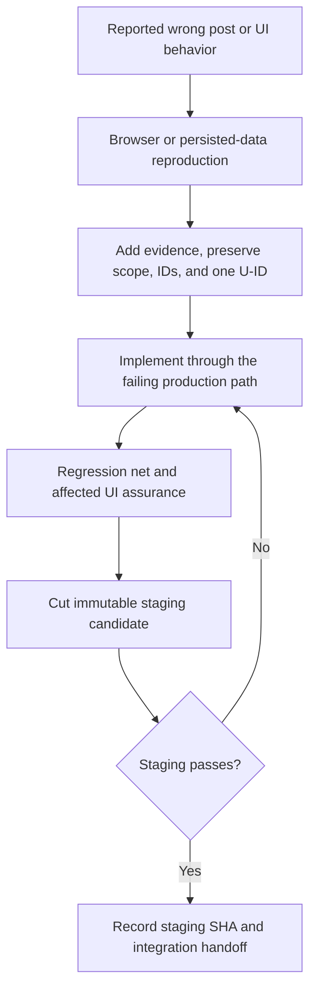
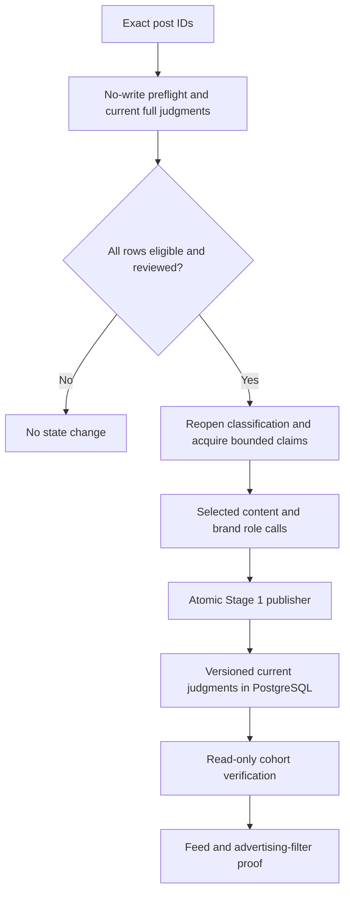
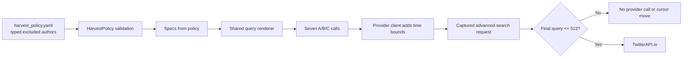
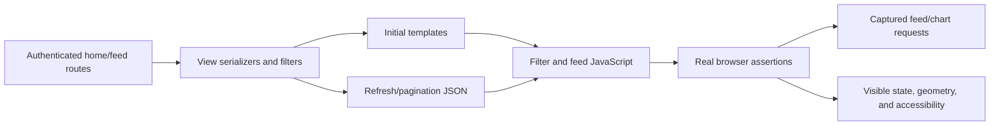

<!-- BEGIN OLLIJA DELIVERY GUIDE -->
## Ollija Delivery Guide

This block is generated guidance. Do not edit it directly. Correct durable facts in `.ollija/project.yaml` or this template, then rerun `ollija annotate-plan`. Current explicit owner instructions govern this task. Record exceptions below and reflect route changes in metadata; removed requirements must not return through another checklist.

### Resolved locations

- Authoritative host: `fuchitalee`
- Authoritative repository: `/Users/fuchitalee/development/pushin-weight-v2`
- Ollija release worktree area: `/Users/fuchitalee/development/pushin-weight-v2/.worktrees`
- Active worktree: `/Users/fuchitalee/development/pushin-weight-v2/.worktrees/fix/product-quality-sweep`
- Plan: `/Users/fuchitalee/development/pushin-weight-v2/.worktrees/fix/product-quality-sweep/docs/plans/2026-09-28-023934-main-plan.md`
- Change: `fix-product-quality-sweep-2026-09-28-023934`
- Branch: `fix/product-quality-sweep`
- Staging branch and blueprint: `staging`, `/Users/fuchitalee/development/pushin-weight-v2/.worktrees/fix/product-quality-sweep/render-staging.yaml`
- Production branch and blueprint: `main`, `/Users/fuchitalee/development/pushin-weight-v2/.worktrees/fix/product-quality-sweep/render.yaml`
- Staging URL: `https://pushinweight-staging-web.onrender.com`
- Production URL: `https://pushinweight-web.onrender.com`

### Placement

This worktree is inside the Ollija release worktree area. Reuse it for the whole change. Do not create a second worktree or plan for this branch.

### Delivery scope

- Workflow: `plan`
- Delivery target: `staging`
- Owner selection recorded: `true`
- Delivery route: `staged`

1. Complete implementation and the plan's verification contract.
2. Run the configured focused checks:
   - `pytest tests/ollija`
3. The parent workflow commits only this plan's changes, pushes the feature branch, and records the candidate SHA.
4. Fetch the remote staging lane: `git fetch origin refs/heads/staging`.
5. Require the unchanged candidate SHA to be a fast-forward of that fetched remote ref, then push the exact candidate SHA to `refs/heads/staging` with the server-enforced fast-forward command `git push origin <candidate-sha>:refs/heads/staging`.
6. Verify the remote staging ref resolves to the candidate SHA and the deployment for `pushinweight-staging-web` reports that same SHA.
7. Run staging checks. Stop here if they fail.

### Failure handling

- Complete applicable, unwaived checks for the selected route. A waived check is waived, never passed. Owner-selected direct production does not require staging.
- Product defects return to the parent implementation workflow; repeat only checks invalidated by the fix. Environment failures require repairing the environment, not a new source commit. Retry only after a relevant fact changes.
- SSH, shell, environment, or multi-machine failures use the repository infra/multi-machine skill first.
- The change ledger is advisory; do not validate or enforce it.
- Never force-remove a worktree. Retain staging-only, failed, dirty, locked,
  noncanonical, or candidate-mismatched worktrees for diagnosis or later
  delivery.
- Do not run an endless retry loop or start a persistent Ollija process.
<!-- END OLLIJA DELIVERY GUIDE -->

## Delivery Exceptions

None.

# Product Quality Sweep - Plan

## Plain-English Summary

This is the frozen plan for a quality sweep delivered to staging. The known headline issue is deliberately set aside.

The batch currently corrects two advertising-ownership examples, aliases the visible Step choice to StepFun without touching Step history, and excludes the verified `xxyweb3` spam source in the seven scheduled TwitterAPI searches. It also activates the new taxonomy-v4 Geopolitical and canonical untracked-promotion filters, keeps language and other pending-work spheres independent, removes Chinese time text from English feeds, makes the mobile filter bar reliably swipeable, and keeps every app-owned desktop hover card a safe distance from the cursor.

The Step correction is a narrow homepage alias: the old `step` brand and all its historical links remain stored, while the visible choice and old filter links resolve to `stepfun`. The owner selected this after a read-only census disproved the earlier safe-deletion premise. The promotion filter is an owner-directed activation of the current taxonomy; it does not revive the legacy `unsanctioned` control, and it records that the earlier shadow audit did not establish population-level quality. The spam exclusion is configuration-driven and applied to the actual provider query before credits are spent. Pending-sphere inspection copy will include whole-minute historical processing averages calculated once from a fixed three-day window and then stored as localized constants; page loads and polling will not recalculate them. No live TwitterAPI request is part of implementation verification.

Completion requires focused server/client tests, a real-browser regression through initial and dynamically replaced feed paths, read-only invariants proving the Step history is preserved and the repaired staging posts are correct, and staging proof for the exact candidate. The owner selected staging as this run's endpoint. The separate account-geography/Muse plan may implement concurrently, then incorporates this verified candidate before its own later staging deployment.

---

## Goal Capsule

- **Objective:** Operators can trust tracked-brand labels, harvest exclusions, selectable brands, filters, status indicators, timestamps, and mobile feed controls.
- **Means:** Keep reported quality defects as bounded units on one branch, fix each cause through its production call path, repair affected persisted rows when required, and verify the result in the real UI. (KTD1, KTD2, KTD5, KTD7-KTD15)
- **Authority:** Product Requirements govern behavior. Key Technical Decisions govern implementation. The Ollija Delivery Guide and Delivery Exceptions govern delivery.
- **Execution profile:** Code implementation with staging-data repair and real-browser verification. The owner selected staging as the endpoint.
- **Stop conditions:** Stop a unit when its expected behavior is not source-verifiable, its regression does not reach the failing call path, a data guard fails, a repair would overwrite unreviewed classification axes, a provider query exceeds its final cap, or staging does not match the candidate SHA.
- **Batch boundary:** The owner froze the included U-IDs by invoking LFG on 2026-09-28. Later additions use another batch.

---

## Product Contract

### Summary

The quality sweep turns each wrong post or broken UI behavior into one traceable correction: reproduce it, name the owner of the wrong state, protect the intended behavior, repair stored data when needed, and prove the visible result. The current draft spans classification, scheduled harvesting, persistent brand identity, and the homepage feed/filter surface.

### Problem Frame

Production post `2104375726627790944` contains a Token Machine call to action and a DeepSeek-denominated prize. Stage 1 persisted both the useful post-level signal `untracked_brand_promotions=["general"]` with subject `Token Machine` and an incorrect DeepSeek `advertising_marketing` post type. The system detected the untracked advertiser, but it assigned the same promotion to the tracked prize brand.

This is systematic rather than a one-row anomaly. Four of five observed Token Machine spin-template posts transferred advertising to the prize brand: Qwen once, Hunyuan twice, and DeepSeek once. A sixth Token Machine post with many model names is a useful boundary case because those tracked brands were not assigned advertising.

The selected content prompt already says facts and advertising must not transfer between brands. The parser validates shape and visible evidence, but it cannot determine semantic ownership. Persistence correctly allows a tracked promotion and an untracked promotion to coexist because legitimate co-promotion is possible. A blanket parser or database rejection would therefore suppress valid posts.

The same ownership error appears in post `2104483144233853085`: the source account `xxyweb3` pitches a B.AI campaign and highlights GLM, but persisted Zhipu/`glm` receives `advertising_marketing`. B.AI is the promoted untracked subject, while `xxyweb3` (author ID `1902753573395652608`) is the repeatedly observed spam author. The classifier fix and the upstream author exclusion solve different problems: the former repairs semantic ownership and the persisted row; the latter prevents new scheduled search results from this author.

Production also exposes `step` as a clickable choice with an empty feed, while `stepfun` has 969 posts. A read-only inbound-relation census found that `step` is not an empty duplicate: it retains 596 distinct historical narrative rows, 15 pending affiliations whose observed organization is “Step,” and four pending demand rows that collide with StepFun. The homepage should resolve its visible Step choice to `stepfun` without rewriting or deleting that history.

The remaining defects are UI-state breaks along already supported paths: the scaffolded taxonomy-v4 Geopolitical families and canonical untracked-promotion family remain behind `shadow_only`; one merged pending sphere exists where two independent states are required; pending inspection copy gives no evidence-backed expectation for the wait; a hard-coded `本地` server fallback survives some English row paths; and a custom mobile filter gesture blocks the native horizontal-pan behavior already working in the pulse bar. Desktop text-bearing hover cards also sit too close to the active cursor, which can cover the first words of the explanation. The legacy Nationalism UI is historical and must not return.

### Key Decisions

- **One shared pre-release sweep:** Different sessions add stable, bounded units to this plan and `fix/product-quality-sweep`; the release batch is frozen before staging. Governs R1-R5, R18.
- **Fix ownership, not detection:** One shared prompt revision keeps source-supported post-level untracked promotions while removing unsupported tracked-brand advertising for Token Machine prizes and the B.AI/GLM example. Governs R6-R10, R25-R27.
- **One visible StepFun identity, preserved Step history:** `(session-settled: user-approved — on 2026-09-29 the owner chose the UI alias after the inbound-relation census disproved safe deletion.)` Keep the stored `step` row and every relationship intact. Exclude only that exact nickname from homepage selectable brand inventory and normalize exact stale `step` filter state to `stepfun`; do not harvest bare `Step` or hide other brands. Governs R19-R24.
- **Exclude the observed author upstream:** Keep B.AI as campaign evidence, but exclude normalized author `xxyweb3` through a typed policy registry rendered into every scheduled A/B/C query. Governs R28-R33.
- **Activate the new taxonomies, preserve old reads:** The scaffolded Geopolitical mode/region/stance families and canonical untracked promotions become visible under recorded activation revisions; legacy Nationalism and `unsanctioned` remain read-compatibility paths, not visible controls. Governs R38-R46.
- **Independent UI state stays independent:** Language pending, other analysis pending, locale stamps, and touch scrolling each retain their own state owner and dynamic refresh path. Governs R34-R37, R47-R54.
- **Keep desktop hover text clear of the pointer:** One cursor-clearance invariant applies to every app-owned text-bearing hover card on the authenticated home/feed experience, with stable edge-aware placement rather than per-glyph offsets. Governs R55-R58.
- **Freeze historical wait guidance:** One read-only 72-hour snapshot produces lifecycle-specific, whole-minute historical averages for pending-sphere inspection copy; runtime requests only read localized constants. Governs R59-R62.
- **Staging delivery:** The owner's latest instruction selects staging as the endpoint for this run. Production repair and deployment require a later instruction. Governs R16-R18.

### Requirements

**Shared quality-sweep workflow**

- R1. Every added defect records the exact route or post ID, observed behavior, expected behavior, conditions, evidence, and explicit preserve scope before implementation starts.
- R2. Each defect receives new stable R-, AE-, KTD-, and U-IDs where needed; existing IDs are never renumbered or repurposed.
- R3. Visible defects are reproduced in a real browser on the affected route before source changes, and completion is checked through that same user-visible call path.
- R4. Every behavior change has a regression test that reaches the layer that failed; helper-only tests cannot be the sole proof.
- R5. A session changes only its accepted unit and shared dependencies required by that unit. Unrelated cleanup and newly noticed defects are deferred.

**Initial label-owner correction**

- R6. `advertising_marketing` belongs to a tracked brand only when visible evidence pitches, showcases, discounts, or calls the reader to act on that tracked brand itself.
- R7. A tracked brand does not inherit advertising because its tokens, credits, model, or name are a prize, denomination, spin option, compatibility ingredient, benchmark participant, or comparison foil in another subject's promotion.
- R8. Independently supported co-promotion remains valid: one post may advertise a tracked brand and separately promote an untracked subject.
- R9. Post `2104375726627790944` retains Token Machine as an untracked `general` promotion and no longer assigns DeepSeek `advertising_marketing` without independent DeepSeek promotion evidence.
- R10. The four known false-positive rows are reclassified in the staging copy after the corrected prompt deploys there: `2101798119298277764`, `2102033817418748243`, `2103615895600017738`, and `2104375726627790944`.
- R11. The two observed boundary rows, `2101837112115093617` and `2101887098726821978`, are evaluation-only in this batch. They are not part of the staging repair cohort.
- R12. The repair publishes a complete current Stage 1 judgment with new prompt/model provenance. It never deletes or edits one classification edge directly.
- R13. Before repair, a source-reviewed manifest freezes the input fingerprint and complete expected Stage 1 judgment for every R10 row. Apply publishes only when the new canonical result exactly matches that manifest; the reported advertising error does not authorize an unreviewed change to another axis.

**Safe correction and visible proof**

- R14. A bounded operator command accepts 1-20 exact post IDs, defaults to a no-write/no-provider preview, rejects unknown or actively leased rows, and performs no TwitterAPI fetch.
- R15. Applied reclassification holds the existing environment-specific harvest coordination lock and shared writer lock while it uses the claim, classifier, manifest guard, and atomic Stage 1 publisher paths; it changes no current judgment when a lock, fingerprint, prompt lineage, or full-result comparison fails.
- R16. Staging must show the new prompt lineage, the reviewed full judgments, and the expected feed/filter behavior on the deployed candidate.
- R17. Staging verification includes the deployed candidate SHA, read-only database evidence for the exact staging repair cohort, and a real-browser check of the reported post and advertising filter.
- R18. The included U-IDs are frozen before the staging candidate is cut. No post-freeze fix is folded into that immutable candidate.

**Canonical StepFun identity**

- R19. The selectable homepage inventory, pulse, chart legend, feed filter, and UI-assurance declaration expose exactly one identity for StepFun: canonical nickname `stepfun`; no `step` option remains.
- R20. This batch performs no Step/StepFun data migration. The stored `step` brand, all inbound foreign keys, snapshots, affiliations, demands, account/company edges, audit timestamps, and other historical records remain unchanged in staging and production. Migration `0059` and its source-dependent staging-refresh deletion deltas are removed from this candidate.
- R21. Homepage brand inventory omits only the exact stored nickname `step` when canonical `stepfun` exists, while preserving `step` for historical data reads and any other domain consumer. The selectable label, pulse, chart, and feed use `stepfun`; no global `is_sentinel` change, model deletion, or data rewrite implements the alias.
- R22. Current seed/config/fixture sources create or refer to `stepfun` only. Historical applied SQLite migrations and import aliases remain untouched, and no bare `Step` harvest term is introduced.
- R23. Backward compatibility normalizes only the exact retired homepage brand value `step` to `stepfun`, deduplicates mixed `step,stepfun` state, and emits/applies only `stepfun`; it does not create a second visible alias.
- R24. A real browser selecting StepFun sends `brands=["stepfun"]`, returns a nonempty feed, and keeps initial/replaced feed, pulse, and chart state aligned.

**Zhipu/B.AI advertising ownership**

- R25. For post `2104483144233853085`, Zhipu/`glm` does not receive `advertising_marketing` merely because GLM-5.3-Flash is highlighted inside a B.AI campaign; source-supported B.AI post-level untracked promotion remains.
- R26. The ownership prompt states that advertising belongs to the tracked brand only when that brand is the promoted offering or marketing beneficiary, not when an untracked advertiser promotes its own platform using or mentioning that brand.
- R27. The Zhipu example joins the same versioned Stage 1 regression and guarded exact-ID repair cohort as R10. It is not deleted from history, special-cased by brand, or repaired through a second prompt/publisher path.

**Durable scheduled-source exclusion**

- R28. `config/harvest_policy.yaml` contains a typed, reviewable excluded-author registry entry for normalized handle `xxyweb3`, stable author ID `1902753573395652608`, active state, reason, observation date, and evidence post/campaign identifiers. B.AI/`BAI_AGI` is evidence, not the blocked author.
- R29. Policy loading rejects malformed handles, nonnumeric author IDs, missing reason/evidence, and case-insensitive duplicate active entries. Handles omit `@`, match `^[A-Za-z0-9_]{1,15}$`, and render deterministically; inactive entries remain auditable but do not affect queries.
- R30. The active registry is rendered once through the shared planner into exactly one `-from:xxyweb3` clause in every recurring scheduled query: A, B1, C1, C2, C3, B2, and B3. Brand-local `not_include` remains a separate post-fetch body safeguard.
- R31. The seven call IDs/order, attribution, cursors, pagination, call caps, time bounds, metrics behavior, and scheduled credential purpose remain unchanged; discovery-lane and operator-launched searches are outside this exclusion unless separately approved.
- R32. The final effective query, including time operators, must remain at or below 512 characters. Overflow fails before provider invocation and cursor advancement; the implementation never truncates, drops exclusions, creates an eighth call, or falls back to post-fetch-only suppression.
- R33. Offline call-chain tests capture the final TwitterAPI.io advanced-search query and request kwargs for all seven calls, proving the exclusion survives provider-client time injection and the scheduled key purpose is used without a live provider call.

**Independent pending indicators**

- R34. Language detection pending owns one armillary sphere in the language-code position; translation/classification/commentary or other non-language analysis pending owns an independent sphere in the meta status position.
- R35. When both state groups are pending, the row shows two spheres. The language sphere is never deduplicated against the meta sphere merely because both use the same glyph.
- R36. Translation alone does not create a duplicate meta sphere while language itself is undetected; once language is detected, still-pending translation appears once in the meta position. Resolving one group removes only its sphere.
- R37. Initial HTML, `/feed/` JSON, synthesis polling, and row replacement share this state matrix and preserve localized process text plus existing completed/error markers and inspection behavior.

**Taxonomy-v4 Geopolitical control and inspection**

- R38. `.filter-bar-scroller` exposes the already scaffolded taxonomy-v4 families `geopolitical_modes`, `china_national_stance`, and `us_national_stance` with their current canonical values, localized labels/counts, and scoped selection/clear behavior under a new activation revision.
- R39. Geopolitical modes and the China/US stance dimensions retain independent state, can filter simultaneously, and send identical canonical state to feed and chart paths; explicit taxonomy values remain distinct from missing/unclassified state.
- R40. Legacy `cn_nationalism` and `us_nationalism` stay historical/read-compatibility inputs only. The old Nationalism pill, US/CN lens, and legacy values are not restored, aliased into, or displayed as the taxonomy-v4 control.
- R41. Every visible taxonomy-v4 Geopolitical feed glyph exposes meaningful localized mode/region/stance evidence through the existing hover, focus, click, and keyboard inspection contract; the control glyph also has equivalent localized hover/focus help.

**Canonical untracked-promotion control**

- R42. A new activation revision enables `untracked_brand_promotions` while leaving every shadow family other than the separately approved R38 Geopolitical families unchanged and recording the owner's decision separately from the earlier failed shadow-prevalence audit.
- R43. The visible pill uses only canonical values `general`, `spam`, `scam`, `crypto`, and `unauthorized`. Its default remains `off`: current promotion rows are hidden until selected, and no selection silently opts users into promotion content.
- R44. The complete client contract includes default state, allowed/query keys, parsing, normalization, preference hydration, URL serialization, UI sync, and feed/chart event wiring for `untracked_brand_promotions`.
- R45. Canonical modes `off`, `only`, `any`, and category lists inspect only `PostUntrackedBrandPromotion`. Legacy `unsanctioned` URLs continue to inspect the legacy relation; when both keys are present, neither is discarded and their filters intersect.
- R46. UI assurance distinguishes canonical-only, legacy-only, both, and neither records, and the visible filter never revives or relabels the legacy `unsanctioned` control.

**Locale-safe timestamps**

- R47. Server-rendered `ts_abs_text` uses `local` for English, `本地` for Chinese, `現地` for Japanese, and `CA` in comparison mode; invalid timestamps render empty and posts at least 24 hours old retain the existing no-absolute-stamp behavior.
- R48. Initial HTML and `/feed/` JSON use the same locale-aware fallback, so English responses contain no Chinese local-time copy before JavaScript runs.
- R49. Every append, replacement, synthesis refresh, and pagination mount triggers one public timezone refresh contract, immediately applying the active local/California mode without a broad DOM observer.

**Mobile filter-bar scrolling**

- R50. On mobile, `.filter-bar-scroller` uses the pulse bar's proven native horizontal overflow, momentum, and scroll-snap contract; the pulse bar's DOM, CSS, and behavior remain unchanged.
- R51. Gesture handling starts horizontal drag only after a movement threshold and horizontal-axis lock, preserves vertical page scrolling, and suppresses pill activation when displacement or actual `scrollLeft` crosses that threshold.
- R52. A drag that begins on pill chrome does not open/close a pill, change `aria-expanded`, toggle a checkbox, or emit feed/chart filter requests; drag state is pointer-specific and resets so the next stationary tap works exactly once.
- R53. Tap/click, delayed iOS tap fallback, Enter/Space, Escape, focus return, accessible naming, dropdown interaction, and portaled dropdown positioning remain intact.
- R54. Real 320px and 390px browser flows prove overflow geometry, horizontal movement to later pills, no accidental activation, a working next tap, untrapped vertical scroll, in-viewport dropdown geometry, and unchanged pulse scrolling/chip activation.

**Desktop hover-card cursor clearance**

- R55. Inventory every app-owned text-bearing desktop hover surface served by the current Django templates; at minimum this includes the shared feed/filter inspection popover and the active home and brand Chart.js tooltips. Retired `trend-chart.js` and `combined-chart.js` are not loaded by current templates and are outside this batch. Pure color/border hover states and browser-native `title` bubbles are not part of this positioning contract.
- R56. An open hover card keeps at least 12 CSS pixels between its text box and the active pointer hot spot. DOM inspection popovers remain anchored outside the trigger's expanded safe zone; chart tooltips use the same clearance invariant through shared Chart.js options or a positioner. Placement flips to an available side and clamps to an 8-pixel viewport margin rather than covering text or leaving the viewport.
- R57. The clearance rule is centralized per hover system, does not chase normal pointer jitter, and applies to initial and dynamically replaced rows. Existing hover continuity, click pinning, focus/Enter/Space/Escape behavior, scroll/resize repositioning, `aria-describedby`, chart hover-freeze, and localized content remain intact.
- R58. Touch behavior is unchanged. Real desktop-browser geometry proves cursor clearance for representative feed, pending-state, taxonomy, filter-help, and chart hover cards at central and viewport-edge positions; tests assert rendered rectangles/Chart.js tooltip bounds rather than only CSS selectors or option presence.

**Frozen historical processing-time guidance**

- R59. At implementation time, one read-only production snapshot uses a fixed UTC cutoff and the exact half-open window `[cutoff - 72 hours, cutoff)`. A checked-in analysis receipt records the query/ORM, cutoff, contract/prompt/model revisions, successful cohort size, arithmetic mean, p50, p90, and pending/failed/excluded counts for each usable lifecycle. It makes no provider call and writes no production state.
- R60. Language/translation duration is measured from `PostEnrichmentState.created_at` to the linked successful current `PostTranslationArtifact.completed_at`. Commentary duration is measured separately from `PostSynthesisDemand.first_requested_at` to its linked successful `PostSynthesisArtifact.completed_at`; synthesis is not blended into harvester enrichment because it begins on a separate demand and worker.
- R61. Current persisted data has no immutable classification-completed timestamp. Analysis duration therefore uses the explicitly documented approximation from enrichment-state creation to terminal successful `updated_at`, cross-checked against the post's latest current `classified_at`; rows with active claims, terminal failure, missing/negative clocks, later replay/repair evidence, or incomplete stages are excluded. The receipt must disclose this limitation rather than present the value as an exact service-level promise.
- R62. Each usable arithmetic mean is rounded once to the nearest whole minute and frozen in localized source copy until an explicit future product change. Pending-sphere inspection/ARIA text says “Historical average: about N minutes” for only its currently pending lifecycle(s); dual spheres can show different values, failures show no average, and initial HTML, `/feed/`, synthesis polling, and replacements agree. No request-time/poll-time aggregate, cache refresh, scheduler, automatic drift, or schema change is added.

### Acceptance Examples

- AE1. **Covers R6, R7, R9.** Given post `2104375726627790944`, when Stage 1 classifies the DeepSeek brand slot, then DeepSeek lacks `advertising_marketing`; the post-level result still contains untracked `general` promotion for the source-visible subject Token Machine.
- AE2. **Covers R6, R7, R10.** Given the Qwen and Hunyuan win/spin posts in R10, when Stage 1 classifies the named prize brand, then the Token Machine pitch does not transfer `advertising_marketing` to that brand.
- AE3. **Covers R8.** Given a post with a direct tracked-brand call to action and separate visible promotion of an untracked service, when Stage 1 classifies it, then the tracked advertising label and untracked promotion both remain.
- AE4. **Covers R7, R11.** Given the long Token Machine crypto post that lists many tracked models, when Stage 1 classifies it, then mere inclusion in the model list does not create tracked-brand advertising.
- AE5. **Covers R6, R8.** Given a direct DeepSeek product pitch with an independent call to action, when Stage 1 classifies it, then DeepSeek still receives `advertising_marketing` even if another subject is also promoted.
- AE6. **Covers R12-R15.** Given a selected row with an active enrichment lease, incomplete source prerequisites, or a candidate result that differs from its reviewed manifest, when the operator requests reclassification, then the command changes no classification state and reports the blocking row.
- AE7. **Covers R19-R24.** Given production-equivalent data containing both stored brands and Step-linked history, the homepage exposes one StepFun choice; selecting it emits only `stepfun`, and initial plus replaced feed/chart results are nonempty and aligned.
- AE8. **Covers R20-R22.** Given the 596 narrative, 15 affiliation, four demand, two account, and one company links on stored `step`, the UI alias leaves those records and both brand rows unchanged before and after homepage/filter requests; when `stepfun` is absent, `step` is not silently hidden.
- AE9. **Covers R23.** Given stale homepage state containing `step` alone or with `stepfun`, normalization applies one `stepfun` value and never renders or returns the retired ID.
- AE10. **Covers R25-R27.** Given post `2104483144233853085`, the canonical Stage 1 result lacks Zhipu advertising while retaining source-supported B.AI untracked promotion, and the exact-ID repair publishes that full reviewed judgment under the selected lineage.
- AE11. **Covers R26.** Given a direct Zhipu product call to action, Zhipu still receives advertising; mentioning a tracked model inside an untracked platform's pitch does not.
- AE12. **Covers R28-R31.** Loading the real harvest policy plans the same seven calls in the same order, each with exactly one `-from:xxyweb3`, while retaining scheduled credentials, attribution, cursors, and request kwargs.
- AE13. **Covers R32.** Given enough active exclusions to exceed the final 512-character query limit after time bounds, the cycle issues no search request and advances no cursor.
- AE14. **Covers R33.** A fake provider captures all final advanced-search requests, including time operators and the exclusion, without a live TwitterAPI call.
- AE15. **Covers R34-R37.** Given language and classification/commentary are pending, initial and replacement rows show two localized spheres in their distinct positions; resolving language removes only the language sphere.
- AE16. **Covers R36.** Language-undetected plus translation-only shows one language sphere; language-detected plus translation-pending shows one meta sphere; all work resolved shows none.
- AE17. **Covers R37.** Existing failure markers and inspection text remain terminal and are not converted into, hidden by, or deduplicated with pending spheres.
- AE18. **Covers R38-R39.** Geopolitical modes plus China and US stance controls independently and jointly send identical canonical feed/chart state and filter only rows carrying the selected taxonomy-v4 values.
- AE19. **Covers R41.** Mouse hover, keyboard focus, click, and keyboard activation expose meaningful localized mode/region/stance help and evidence for taxonomy-v4 control/feed glyphs.
- AE20. **Covers R40.** A historical URL containing legacy Nationalism keys remains readable under its existing compatibility contract, but the page renders no legacy Nationalism pill/lens and never copies that state into the taxonomy-v4 controls.
- AE21. **Covers R42-R46.** The enabled canonical promotion pill round-trips category state through preferences, URL, feed, and chart; clear returns to `off` and restores the default result.
- AE22. **Covers R45-R46.** Legacy-only records never satisfy a canonical category, current-promotion-only records never satisfy legacy `unsanctioned`, and supplying both keys applies their intersection.
- AE23. **Covers R42-R43.** The promotion activation exposes only the canonical promotion family; apart from the separately approved Geopolitical families, every unrelated shadow family and the default-off visibility rule stay unchanged.
- AE24. **Covers R47-R49.** English initial, replacement, and page-two rows never show `本地`; just-under-24-hour rows show `local`, while exactly/over-24-hour rows and invalid timestamps show no absolute stamp.
- AE25. **Covers R49.** With California mode active, appended and replaced rows immediately show `CA`; switching locale/time mode rerenders all mounted rows consistently.
- AE26. **Covers R50-R52.** A real horizontal mobile gesture changes filter `scrollLeft` and reaches later pills without opening a pill or issuing requests.
- AE27. **Covers R52-R53.** The stationary tap immediately after a drag opens exactly once, while keyboard and iOS fallback behaviors remain functional.
- AE28. **Covers R51, R54.** A primarily vertical gesture scrolls the page rather than trapping it in the filter bar, and the dropdown remains aligned inside the viewport after horizontal scrolling.
- AE29. **Covers R50, R54.** The pulse bar retains its prior overflow, scrolling, and chip activation behavior unchanged.
- AE30. **Covers R55-R58.** Hovering the center and edge of representative inspection triggers opens the localized card with its rendered text box at least 12 CSS pixels outside the pointer hot spot, including after feed replacement.
- AE31. **Covers R56-R58.** Near each viewport edge, the card flips/clamps fully onscreen without covering the pointer; keyboard focus and click pinning expose the same content, and touch behavior does not change.
- AE32. **Covers R55-R58.** Active home and brand chart hover tooltips keep the same labels, active data point, and hover-freeze behavior while their reported Chart.js bounds satisfy the 12-pixel pointer clearance rule.
- AE33. **Covers R59-R62.** Re-running the saved snapshot query against its fixed cohort reproduces every recorded count and mean; each checked-in whole-minute constant equals the corresponding rounded arithmetic mean.
- AE34. **Covers R62.** English, Simplified Chinese, and Japanese initial and replacement rows show lifecycle-appropriate frozen historical averages; a dual-pending row shows two independent spheres with their own copy, and resolving one does not alter the other's text.
- AE35. **Covers R60-R62.** Synthesis-only pending uses demand-to-artifact duration rather than post/enrichment clocks; failed, expired, or cancelled work retains terminal copy with no average; request and polling query counts gain no aggregation query.

### Scope Boundaries

**In this batch**

- The reusable contribution contract; Token Machine and B.AI/Zhipu ownership corrections; and the guarded exact-ID repair path.
- Canonical StepFun homepage alias/compatibility, the typed scheduled-author exclusion registry, and offline proof of the seven final provider requests.
- Independent pending indicators with frozen historical wait guidance, taxonomy-v4 Geopolitical activation, owner-directed canonical promotion activation, locale-safe dynamic timestamps, mobile filter scrolling, and cursor-safe desktop hover cards.
- Source, database, server/client, UI-assurance, staging, and browser verification for the frozen batch.

**Outside this batch**

- Adding a Token Machine brand, changing tracked-brand matching, or changing author affiliations.
- The known headline issue, restoration/redesign of the legacy Nationalism UI, and unrelated filter redesign.
- Blocking `BAI_AGI`, domains, promoted identities, or an entire B.AI campaign; only the evidence-backed `xxyweb3` author exclusion is active.
- Applying the registry to discovery lanes, on-demand searches, backfills, or metrics calls not driven by the seven recurring A/B/C queries.
- A global Step hide flag or alias outside the homepage selection boundary, adding bare `Step` to harvesting, or rewriting historical v1 SQLite migrations.
- A general moderation/review queue, bulk relabeling UI, taxonomy redesign, or automatic semantic rejection in persistence.
- Fixing `opportunities` or other axes unless source review makes a changed full judgment necessary under R13.
- Production deployment, production reclassification, and production database migrations in this run.

This batch is frozen for the staging run. Newly reported work moves to another batch.

### Sources

- `x_monitor/classifier_0731_prompts.py` owns the selected fixed-slot content and brand instructions.
- `x_monitor/attribution.py` selects prompt revisions, validates role output, merges the roles, and carries classification provenance.
- `monitor/classification_persistence.py` validates untracked promoted subjects without conflating them with tracked-brand types.
- `monitor/cycle.py` provides the bounded `post_ids` claim path and `_publish_stage1_classification` atomic writer.
- `monitor/management/commands/reattribute_brand_posts.py` is the local pattern for dry-run-first bounded repair and enrichment-state reopening.
- `core/u18a_activation.py` and `monitor/views.py` explain why correct persisted untracked promotion is currently hidden from the UI.
- `docs/analysis/2026-09-18-220000-u18a-shadow-prevalence-and-activation-report.md` owns the separate activation decision.
- `docs/solutions/workflow-issues/2026-08-05-115349-mockup-06-dropdown-agent-failure-postmortem.md` establishes that visible browser behavior, not internal state alone, is the UI oracle.
- `core/models.py`, ordered `core/migrations/`, `monitor/management/commands/load_seed.py`, and `monitor/views.py` own current Brand relationships, seeding, inventory, and exact filter behavior.
- `config/harvest_policy.yaml`, `x_monitor/harvest_policy.py`, `x_monitor/specs_from_policy.py`, `x_monitor/query_plan.py`, `monitor/cycle.py`, and `x_monitor/apify.py` are the scheduled-search policy-to-wire path.
- `monitor/templates/monitor/home.html`, `_feed_initial_v22.html`, `_feed_language_tag.html`, `monitor/static/pw-filter-store.js`, `pw-filter-pills.js`, `pw-feed.js`, `pw-tz.js`, `pw-icons.js`, and `home-v20.css` own the affected visible/browser state.
- `PostEnrichmentState` exposes queue creation and mutable stage state but no immutable per-stage completion clock; `PostTranslationArtifact.completed_at` and `PostSynthesisDemand.first_requested_at` → linked `PostSynthesisArtifact.completed_at` provide the faithful language and commentary clocks used by the one-time wait snapshot.
- Git history at `96d72c4^` proves the removed Nationalism control is legacy-only and must not be reinstated; commits `399e7ce`, `de32dae`, `8c5bae6`, and `0c7aca6` explain the current filter gesture and tap safeguards.
- `docs/iterations/2026-09-01-114311-feed-inspection-pagination-bridgewright-target.md` supplies the existing accessible inspection/popover pattern, not the new taxonomy-v4 filter semantics.
- [TwitterAPI.io advanced search](https://docs.twitterapi.io/api-reference/endpoint/tweet_advanced_search) documents the raw `query` parameter passed to `/twitter/tweet/advanced_search`.
- [X query construction](https://docs.x.com/x-api/posts/search/integrate/build-a-query) documents dash negation and the 512-character self-serve query limit; [X search operators](https://docs.x.com/x-api/posts/search/integrate/operators) documents `from:` and negated mention forms. Because this stack also uses TwitterAPI.io/X-web operators such as `min_faves`, the exact `-from:xxyweb3` wire string remains pinned by the repository's captured-client tests.

---

## Planning Contract

### Key Technical Decisions

- KTD1. **Use one Ollija change and one feature branch for the frozen batch.** `(session-settled: user-directed — chosen over one branch or plan per reported defect: the owner wants different sessions to contribute to one UI/front-end-heavy quality sweep.)` Sessions update this plan in place and work from `fix/product-quality-sweep`. Governs R1-R5, R18.
- KTD2. **Correct ownership in the selected content prompt, not with a blanket parser rule.** The prompt can distinguish the advertised subject from a prize or foil; deterministic rejection cannot preserve legitimate co-promotion. Governs R6-R8.
- KTD3. **Version only the changed semantic stages.** Bump the selected content and final-merge revisions, retain the unchanged brand-interpretation revision, add the new allowed triplet, and keep the old triplet readable as historical provenance. Governs R12, R16.
- KTD4. **Repair through the canonical atomic pipeline under locks and a manifest guard.** A new bounded Django command acquires the same environment-specific coordination lock and shared writer lock as `run_cycle`, validates an approved exact-row manifest, and runs the selected IDs through a guarded `CycleRunner._run_post_fetch` path. The runner compares the in-memory canonical result with the manifest before its existing atomic publisher; no command writes classification edge tables itself. Governs R12-R15.
- KTD5. **Treat browser and database evidence as one acceptance result.** The database proves attribution/provenance, while the browser proves the operator sees the correct filter/feed consequence. Governs R3, R16, R17.
- KTD6. **Stop at staging.** `(session-settled: user-directed — chosen over the earlier production endpoint: the owner explicitly changed this run to Ollija staging.)` Verify the exact deployed staging candidate and leave production untouched. Governs R16-R18.
- KTD7. **Use the owner-selected homepage alias without data migration.** `(session-settled: user-approved — the observed Step-linked history must remain untouched.)` The homepage inventory omits only exact nickname `step` when `stepfun` exists; exact stale filter state normalizes to `stepfun`. Historical `step` rows remain available to non-homepage consumers. This deliberately replaces the earlier deletion approach, whose safe-deletion premise was disproved by the production census. Governs R19-R24.
- KTD8. **Keep a typed author-exclusion registry in the harvest policy SSOT and render it once.** Validated active authors flow policy → specs → shared query builder → all seven scheduled calls → actual client request. This is distinct from brand-local post-fetch `not_include`. Governs R28-R33.
- KTD9. **Represent language and other pending work as separate wire states.** The server emits one language-position badge and, when warranted, one independent meta badge; templates and JavaScript render rather than infer or collapse them. Governs R34-R37.
- KTD10. **Activate the scaffolded taxonomy-v4 Geopolitical families and retire the old UI contract.** Use the existing `geopolitical_modes`, `china_national_stance`, and `us_national_stance` server/client seams with localized inspections. Preserve legacy Nationalism parsing only for historical reads and never render its old pill/lens. Governs R38-R41.
- KTD11. **Activate canonical untracked promotions through the activation SSOT.** Add a recorded activation revision and complete the client state path, while keeping the legacy `unsanctioned` relation and URL parser independent. The old shadow report remains immutable evidence rather than being rewritten as a pass. Governs R42-R46.
- KTD12. **Use a locale-correct server fallback plus one row-mounted timezone refresh event.** The server never emits wrong-language copy, and explicit append/replace/pagination seams notify `pw-tz.js`; a broad mutation observer is rejected. Governs R47-R49.
- KTD13. **Adopt native mobile horizontal overflow with a minimal activation guard.** Mirror the pulse bar's touch/pan contract on the filter scroller, preserve a separate desktop mouse-drag path only if still needed, and leave pulse source unchanged. Governs R50-R54.
- KTD14. **Use one 12-pixel cursor-clearance invariant for desktop hover cards.** DOM inspection cards stay outside an expanded trigger rectangle; Chart.js tooltips use shared options or a shared positioner that enforces the same pointer-safe distance. Both systems retain edge flip/clamp behavior and stable element/data-point anchoring rather than following pointer jitter. Governs R55-R58.
- KTD15. **Use one frozen 72-hour measurement, not a runtime ETA system.** Preserve separate language and synthesis clocks, label classification timing as an audited approximation, record the fixed cohort and calculation, and serve only localized whole-minute constants. The copy describes a historical average, not remaining time or a service guarantee. Governs R59-R62.

R1-R18 and AE1-AE6 retain their established meaning. R19-R62 and AE7-AE35 append the owner-approved defects without renumbering earlier product contracts.

### High-Level Technical Design

The sweep has a contribution lifecycle and a separate data-repair lifecycle. Both are authoritative constraints; file- and helper-level details remain implementation choices.

### System-Wide Impact

- **Classification:** One selected content/final prompt revision covers both ownership families; positive tracked advertising, source-supported untracked promotion, and hard negatives remain in the regression cohort.
- **Persistent data:** The exact reviewed classification cohort is republished atomically. The stored `step` brand and its historical relationships are not migrated, deleted, or rewritten; only the homepage's visible brand selection is aliased.
- **Harvest:** The policy registry changes the seven recurring scheduled query strings before fetch, with no change to calls, credentials, attribution, cursors, or metrics. Offline tests use fake transports. The staging harvest cron is suspended on an impossible schedule, so this staging run proves the deployed query configuration without issuing a live search.
- **UI:** Brand inventory, two filter families, status badges and their frozen wait guidance, timestamp refresh, touch scrolling, and desktop hover-card placement change across route/view/template/static/feed/chart seams. Initial and dynamic paths must agree.
- **Activation:** Taxonomy-v4 Geopolitical and canonical untracked promotions become visible under owner-directed activation revisions. Promotion activation does not turn its earlier shadow audit into a population-quality pass, and both new controls remain separate from legacy data.
- **Operations:** Staging exact-ID reclassification spends bounded classifier requests but no TwitterAPI credits. The source exclusion will reduce scheduled search intake when deployed with the enabled production cron later; no live TwitterAPI verification call is authorized by this staging plan. The pending-time snapshot is one read-only production database measurement with a fixed receipt, not an ongoing metric job.
- **Contributors:** Later sessions inherit the same plan IDs, branch, preserve scope, UI-assurance rules, and batch-freeze gate. The geography branch incorporates this verified staging candidate before its separate staging deployment.

### Risks and Mitigations

- **Prompt regression:** Stronger ownership wording could remove valid tracked-brand ads. AE3 and AE5 are required positive controls, and a bounded live candidate is compared with the current classifier before release.
- **Model variability:** A full reclassification may change more than `advertising_marketing`. The R13 manifest guard stops publication unless every canonical axis matches the reviewed expected state.
- **Concurrent enrichment and environment safety:** Reopening a row outside the scheduled cycle could race another writer. The repair command accepts `--apply` only with `X_MONITOR_DEPLOYMENT_ENVIRONMENT=staging` and the `pushinweight_staging` database name, then acquires the existing harvest coordination/writer locks before preflight and rejects the whole requested set when a lock or row lease is unavailable.
- **Stale staging data:** The known staging snapshot may predate this cohort. U4 checks its refresh receipt and exact IDs, then uses the existing scrubbed production-to-staging refresh runbook when the cohort is absent. The Step alias expects no Step-related negative count deltas; refresh retains the source-linked rows.
- **Partial repair:** Some rows could succeed while others fail. The command reports the published count and errors, restores the original completed queue state for unpublished rows before releasing the writer locks, and the release remains incomplete until the exact cohort is reconciled. Published rows are not rolled back across posts; a retry requires a newly reviewed manifest for the remaining exact set.
- **Long-lived branch drift:** Multiple sessions can create an unreviewable candidate. R18 freezes the U-ID set before staging; new defects after the freeze are not added.
- **Parallel release collision:** The geography/Muse plan edits the same harvest policy, cycle, seed, attribution, and query tests and targets the same staging branch/service/database. This quality candidate stages first; the geography branch incorporates its verified SHA, reconciles the combined query and migration contracts, and stages only after this candidate's evidence is complete.
- **Step history/alias boundary:** A Brand has more inbound relations than posts and keywords. The read-only census found significant `step` history, so this candidate removes migration `0059` and any source-dependent deletion deltas. A scoped homepage inventory filter and exact-value URL normalization must never rewrite stored rows or affect other brands.
- **Query-cap erosion:** Registry growth can consume the least-headroom B/C query. Validation measures the final client-effective query and fails before request/cursor movement; it never truncates exclusions.
- **Identity confusion:** B.AI is campaign evidence, not the author of the reported post. The registry and tests name `xxyweb3` plus its stable author ID; any future campaign/domain match kind needs a separate decision.
- **Promotion-quality risk:** The prior shadow audit reported unsupported examples rather than an activation pass. The new decision artifact records owner-directed visibility, retains default `off`, exposes evidence inspection, and makes no population-accuracy claim.
- **Legacy/canonical conflation:** Existing compatibility paths can make current filters depend on legacy Nationalism or `UnsanctionedFlag` state. Independent normalization and fixtures prove taxonomy-v4/legacy Nationalism separation plus the four promotion relation combinations.
- **Dynamic UI drift:** Initial HTML can pass while replacement/pagination is wrong. Each affected unit asserts server HTML, JSON, row replacement, and real-browser state transitions.
- **Gesture regression:** Removing custom touch handling could reintroduce double activation or break keyboard/dropdown behavior. Axis-lock/threshold tests and unchanged pulse baselines cover touch, mouse, keyboard, and accessibility.
- **Hover-placement regression:** A global offset can push long localized cards offscreen or disturb chart hover-freeze. The shared 12-pixel invariant retains flip/clamp behavior and is checked against real rendered bounds at central and edge positions for all three locales.
- **Stale or misleading wait copy:** A permanently frozen mean can be mistaken for a countdown or current guarantee, and classification lacks an immutable completion clock. Copy says “Historical average,” each lifecycle remains separate, the receipt discloses the approximation and sample, and any future recalculation requires an explicit product change rather than silently drifting.

---

## Implementation Units

### Unit Index

| Execution order | Unit | Outcome | Depends on |
| --- | --- | --- | --- |
| 1 | U1 | Freeze Token Machine ownership evidence | None |
| 2 | U7 | Freeze Zhipu/B.AI ownership evidence | None |
| 3 | U2 | Select one ownership-correct prompt lineage | U1, U7 |
| 4 | U3 | Add the guarded exact-ID repair path | U2 |
| 5 | U6 | Canonicalize StepFun identity | None |
| 6 | U8 | Exclude `xxyweb3` in all seven scheduled queries | None |
| 7 | U9 | Split language and meta pending indicators | None |
| 8 | U15 | Freeze three-day processing averages in pending copy | U9 |
| 9 | U10 | Activate Geopolitical and its inspections | None |
| 10 | U11 | Activate the canonical promotion filter | U10 |
| 11 | U12 | Localize and refresh absolute timestamps | U9 |
| 12 | U13 | Restore native mobile filter scrolling | U10, U11 |
| 13 | U14 | Keep desktop hover cards clear of the cursor | U9-U11, U15 |
| 14 | U4 | Validate the frozen candidate in staging | U1-U3, U6-U15, batch freeze |
| 15 | U5 | Record staging result and integration handoff | U4 |

### U1. Freeze the label-owner regression cohort

- **Goal:** Preserve the reported case, its recurrence family, and positive controls as source-visible acceptance evidence before changing the prompt.
- **Requirements:** R3, R4, R6-R11; AE1-AE5.
- **Dependencies:** None.
- **Files:** `tests/fixtures/u18a_label_owner_regressions_v1.json`, `tests/test_u18_label_owner_regressions.py`, `docs/analysis/2026-09-28-023934-u18a-label-owner-regression.md`, `docs/analysis/2026-09-28-023934-u18a-label-owner-repair-manifest.json`.
- **Approach:** Record the six observed Token Machine rows with exact target brands and expected ownership boundaries. Freeze source-reviewed complete expected judgments and input fingerprints for the four R10 repair rows in a machine-readable manifest. Add at least one direct tracked-brand advertising positive and one legitimate tracked-plus-untracked co-promotion positive. Mark the cohort and manifest as bounded repair evidence, not human gold or population accuracy.
- **Execution note:** Capture the current production browser/filter behavior and read-only database state first. Freeze expected source-visible boundaries without looking at the new candidate output.
- **Patterns to follow:** `docs/analysis/2026-09-18-210000-u18a-r94a-candidate-blind-source-visible-audit.md`, `tests/fixtures/classification_stage1_contract_v1.json`, and `tests/test_u18a_classifier_contract_v4.py`.
- **Test scenarios:**
  - Covers AE1. The DeepSeek spin case expects untracked Token Machine promotion and rejects DeepSeek advertising ownership.
  - Covers AE2. The Qwen and two Hunyuan win cases reject advertising transfer to their prize brands.
  - Covers AE4. The long multi-model crypto case keeps mere model-list membership from becoming advertising.
  - Covers AE3 / AE5. Direct tracked promotion and genuine co-promotion remain positive.
  - A fixture row whose quoted evidence is absent from its visible source is rejected as invalid test evidence.
  - A repair-manifest row without a complete canonical judgment, exact brand set, input fingerprint, or approved prompt lineage is rejected.
- **Verification:** The cohort covers all six Token Machine rows and both false-negative controls, its assertions fail against the known v5 DeepSeek result, and the R10 manifest rows are complete and source-reviewed before candidate comparison.

### U7. Freeze the Zhipu/B.AI ownership case

- **Goal:** Add the supplied production example to the same ownership contract without conflating tracked brand, promoted subject, and spam author.
- **Requirements:** R25-R27; AE10, AE11.
- **Dependencies:** None.
- **Files:** `tests/fixtures/u18a_label_owner_regressions_v1.json`, `tests/test_u18_label_owner_regressions.py`, `docs/analysis/2026-09-28-023934-u18a-label-owner-regression.md`, `docs/analysis/2026-09-28-023934-u18a-label-owner-repair-manifest.json`.
- **Approach:** Record post `2104483144233853085` with Zhipu/`glm` as the tracked label recipient, B.AI as the untracked promoted subject, and `xxyweb3` as the author. Freeze its current fingerprint and complete source-reviewed target judgment in the existing manifest, alongside a direct-Zhipu positive control.
- **Execution note:** Preserve the existing post and provenance; this unit defines expected full reclassification, not deletion or a brand-specific heuristic.
- **Test scenarios:** Covers AE10/AE11; rejects fixtures that label B.AI as the author, omit the source-supported post-level promotion, or infer the promoted subject only from the wrong GLM advertising row.
- **Verification:** The fixture fails against `stage1-two-role-merge-0731-v5`, the manifest identifies the exact post and complete target state, and the source note records the supplied production counts/evidence without treating them as population gold.

### U2. Correct and version advertising ownership

- **Goal:** Make the selected Stage 1 runtime apply R6-R8 without changing brand interpretation or post-level untracked-promotion detection.
- **Requirements:** R4, R6-R9, R12, R16, R25-R27; AE1-AE5, AE10, AE11.
- **Dependencies:** U1, U7.
- **Files:** `x_monitor/classifier_0731_prompts.py`, `x_monitor/attribution.py`, `tests/test_u18_runtime_0731.py`, `tests/test_u18_two_role_foundation.py`, `tests/test_u18a_classifier_contract_v4.py`, `tests/test_u18_label_owner_regressions.py`, `docs/reference/classifier-prompts.md`.
- **Approach:** Add explicit advertised-subject/marketing-beneficiary ownership and hard-negative boundaries to the content role. Cover tracked prizes/foils and tracked models mentioned inside an untracked platform's campaign. Select one new content/final revision triplet under KTD3, preserve the unchanged brand role, and update the prompt reference through the repository reference-doc workflow.
- **Execution note:** Start with failing ownership assertions through `classify_batch_pragmatics_full`, not a standalone prompt-string helper.
- **Patterns to follow:** Existing fixed-slot prompt rendering and allowed-revision-triplet tests in `tests/test_u18_runtime_0731.py` and `tests/test_u18_two_role_foundation.py`.
- **Test scenarios:**
  - Covers AE1 / AE2 / AE10. Fixed-slot output for each prize-brand and B.AI/GLM case lacks unsupported tracked-brand advertising and retains post-level promotion fields.
  - Covers AE3 / AE5 / AE11. A direct tracked-brand pitch remains advertising, including when an untracked subject is separately promoted.
  - A tracked brand used only as a comparison foil, compatibility provider, prize, or denomination does not inherit another subject's CTA.
  - Historical v5 trace triplets remain parseable while new classifications emit the selected v6 content/final lineage.
  - Malformed, missing, duplicate, or cross-role slot output still fails closed under the existing parser contract.
- **Verification:** Deterministic runtime tests exercise the production classifier entry point, and the bounded live cohort passes every ownership boundary without regressing its positive controls.

### U3. Add bounded exact-ID reclassification

- **Goal:** Give operators a safe, repeatable way to repair reviewed posts through the canonical classifier and publisher.
- **Requirements:** R10-R15, R27; AE6, AE10.
- **Dependencies:** U2.
- **Files:** `monitor/management/commands/reclassify_posts.py`, `monitor/cycle.py`, `tests/test_reclassify_posts.py`, `tests/test_post_enrichment_queue.py`, `tests/test_run_post_fetch.py`.
- **Approach:** Add a dry-run-first command under KTD4. Acquire the environment-specific harvest coordination lock and shared writer lock in the same order as `run_cycle`, then preflight the complete 1-20 row set, require complete translation/source prerequisites, reject active claims, and validate the repair manifest against current inputs and selected prompt lineage. The guarded `post_ids` path compares each in-memory canonical result with the manifest before publication. Emit a machine-readable per-row result and a nonzero exit when the requested set is not fully published.
- **Execution note:** Characterize `_reopen_classification`, `_claim_enrichment_states`, and `_publish_stage1_classification` behavior before adding the command. Keep the command an orchestrator over those paths.
- **Patterns to follow:** `monitor/management/commands/reattribute_brand_posts.py` for option validation and preview/apply behavior; `monitor/cycle.py` for claims, caps, and atomic publication.
- **Test scenarios:**
  - Previewing one or twenty valid exact IDs performs no write and no provider call.
  - Covers AE6. An unavailable harvest lock, unknown ID, incomplete translation, active lease, stale fingerprint, wrong prompt lineage, or full-result mismatch rejects the full set without changing a current judgment.
  - Lock acquisition order matches `run_cycle`, and command exit releases both locks after success or failure.
  - Applying a valid set calls the canonical classifier once per bounded batch and publishes complete current judgments only after every result matches the reviewed manifest.
  - A classifier error, invalid result, call-cap exhaustion, or publisher rejection exits nonzero; unpublished rows return to their prior completed queue state before locks release, so the ordinary scheduled cycle cannot retry them without the manifest guard.
  - Translation fields, PostBrand links, and unrelated posts remain unchanged.
  - The command never constructs a TwitterAPI client and never reads scheduled or on-demand TwitterAPI credentials.
- **Verification:** Command tests prove no-write preview, all-row preflight, manifest/fingerprint enforcement, exact-ID isolation, canonical publication, and visible failure reporting for the approved R10/R27 cohort.

### U6. Alias the visible Step choice to StepFun without changing history

- **Goal:** Make `stepfun` the only selectable homepage StepFun brand while preserving all stored `step` history.
- **Requirements:** R19-R24; AE7-AE9.
- **Dependencies:** None; the 2026-09-28 read-only inbound-relation census and the owner's 2026-09-29 alias choice are settled inputs.
- **Files:** `monitor/views.py`, `monitor/static/pw-filter-store.js`, `tests/test_views.py`, `tests/test_home_v22_browser.py`, `tests/test_ui_assurance_brand_inventory.py`, `tests/fixtures/ui_assurance/data.json`, `tests/fixtures/ui_assurance/declaration.json`, and related scoped homepage inventory tests. Remove the uncommitted `core/migrations/0059_canonicalize_stepfun_brand.py`, its migration-only tests, and the uncommitted staging-refresh deletion-delta changes/tests from this candidate.
- **Approach:** At the homepage inventory boundary only, omit exact nickname `step` if `stepfun` is present. Preserve the existing exact-value server/client normalization of stale `step` or mixed `step,stepfun` filters to one `stepfun` selection. Keep all stored brands and inbound records unchanged; current seed/policy/fixtures refer to `stepfun` for new selectable content. Do not alter global brand sentinel semantics or add a broad alias that changes historical consumers.
- **Execution note:** Reuse the real-browser empty Step reproduction. Preserve the read-only production census as evidence, then prove no migration/deletion is needed on staging. Do not edit retired SQLite migrations or Step-linked data.
- **Test scenarios:** Both stored brands with linked Step history render only one selectable StepFun choice and nonempty StepFun feed; absent `stepfun` does not hide `step`; stale `step` and mixed state normalize exactly; other brands are unchanged; request, page replacement, pulse, and chart use `stepfun`. Read-only DB counts for both brands and Step-linked histories are unchanged by UI requests.
- **Verification:** Covers AE7-AE9 through real view/template/browser tests and read-only staging row-count comparisons, with no Step migration applied.

### U8. Add the durable scheduled-author exclusion

- **Goal:** Prevent the verified `xxyweb3` source from reaching any of the seven recurring provider searches.
- **Requirements:** R28-R33; AE12-AE14.
- **Dependencies:** None.
- **Files:** `config/harvest_policy.yaml`, `x_monitor/harvest_policy.py`, `x_monitor/specs_from_policy.py`, `x_monitor/query_plan.py`, `monitor/cycle.py`, `x_monitor/apify.py`, `tests/test_harvest_policy_load.py`, `tests/test_specs_from_policy.py`, `tests/test_harvest_query_exhibit.py`, `tests/test_cycle_query_length_guard.py`, `tests/test_cycle_regression_net.py`, `tests/test_cycle_runtime_constants.py`.
- **Approach:** Define and validate typed author entries in the policy SSOT; derive a deterministic active handle tuple; append `-from:xxyweb3` in the shared renderer used by implicit A and all B/C calls; retain the existing final-query cap and scheduled credential path.
- **Execution note:** Do not use `not_include`, add `-@BAI_AGI`, expand to campaign/domain matching, or call the provider. Pin the documented operator through the actual fake client because the stack passes a raw TwitterAPI.io query and also uses X-web-style operators.
- **Test scenarios:** Reject malformed/duplicate entries; preserve inactive audit entries; assert exactly seven calls/order and one exclusion each; capture time-bounded final query plus unchanged kwargs; force over-cap and assert zero requests/cursor movement; assert scheduled credential purpose.
- **Verification:** Covers AE12-AE14 through the real policy → planner → cycle → provider-client call chain with a fake transport and no live TwitterAPI request.

### U9. Separate language and general pending spheres

- **Goal:** Render independent pending work independently in both server and dynamic feed rows.
- **Requirements:** R34-R37; AE15-AE17.
- **Dependencies:** None.
- **Files:** `monitor/views.py`, `monitor/templates/monitor/_feed_language_tag.html`, `monitor/templates/monitor/_feed_initial_v22.html`, `monitor/static/pw-feed.js`, `monitor/static/home-v20.css` only if spacing is required, `tests/test_views.py`, `tests/test_post_synthesis_api.py`, `tests/test_pw_feed_formatter.js`, `tests/test_home_v22_browser.py`.
- **Approach:** Replace the single aggregated-position decision in `_processing_badges` with explicit language and meta states. Keep translation associated with language while detection is unresolved, then expose translation in meta after language resolves. Render the same wire shape in initial HTML, `/feed/`, and synthesis polling.
- **Execution note:** Browser-reproduce the current single-sphere state before editing. Do not deduplicate identical glyphs or alter completed/failure semantics.
- **Test scenarios:** Pin the full matrix from AE15-AE17 in English, Chinese, and Japanese; asynchronously complete one state and prove only its badge disappears; preserve process-specific inspection text.
- **Verification:** Server, formatter, polling, and real-browser replacement tests agree on badge count, positions, localized copy, and terminal states.

### U15. Freeze three-day processing averages in pending-sphere copy

- **Goal:** Give users a durable evidence-backed wait expectation without adding a database aggregate to page loads or polling.
- **Requirements:** R59-R62; AE33-AE35.
- **Dependencies:** U9, so each average attaches to the correct independent sphere and lifecycle.
- **Files:** `monitor/views.py`, `tests/test_views.py`, `tests/test_post_synthesis_api.py`, `tests/test_pw_feed_formatter.js`, `tests/test_home_v22_browser.py`, `tests/fixtures/ui_assurance/declaration.json`, `tests/fixtures/ui_assurance/data.json`, `docs/analysis/2026-09-28-023934-pending-processing-time-baseline.md`.
- **Approach:** Freeze a UTC cutoff, run the documented read-only 72-hour lifecycle queries, record cohorts/statistics/limitations, round the arithmetic means to whole minutes, and add those values as localized constants consumed by `_processing_badges`. Language, approximate base analysis, and separately demanded commentary retain distinct clocks and values.
- **Execution note:** Do not assume the owner's estimated 4–6 minutes; the saved cohort chooses the values. Use artifact completion, not provider `latency_ms`, for user-visible wait. Do not introduce runtime aggregation, a cache, refresh task, schema migration, or automatic recalculation. If a lifecycle has no defensible or sufficiently populated cohort, record the failure and stop that copy change rather than fabricate a number.
- **Test scenarios:** Exact fixed-window arithmetic and rounding; successful/active/failed/replayed/missing-clock exclusions; query-count parity; all three locales; language-only, analysis-only, commentary-only, mixed-meta, dual-sphere, resolved, failed, expired, and cancelled states; initial, `/feed/`, polling, and replacement paths.
- **Verification:** Covers AE33-AE35 through a reproducible snapshot receipt, constants-to-receipt equality, unchanged request/poll query counts, and real-browser hover/focus copy.

### U10. Activate taxonomy-v4 Geopolitical controls and inspection

- **Goal:** Make the scaffolded Geopolitical mode/region/stance families visible and inspectable while keeping legacy Nationalism UI retired.
- **Requirements:** R38-R41; AE18-AE20.
- **Dependencies:** None.
- **Files:** `core/u18a_activation.py`, `monitor/templates/monitor/home.html`, `monitor/views.py`, `monitor/static/pw-filter-store.js`, `monitor/static/pw-filter-pills.js`, `monitor/static/pw-icons.js`, `monitor/static/pw-feed.js`, `monitor/static/home-v20.css`, `tests/test_u18a_activation.py`, `tests/test_home_v22_filter_pills.py`, `tests/test_views.py`, `tests/test_pw_feed_formatter.js`, `tests/test_home_v22_browser.py`, `tests/fixtures/ui_assurance/declaration.json`, `tests/fixtures/ui_assurance/data.json`, `docs/analysis/2026-09-28-023934-geopolitical-activation-decision.md`.
- **Approach:** Add an activation revision for all three scaffolded families, complete their client state/query/event path where needed, and preserve independent canonical keys through feed/chart filtering. Supply localized mode/region/stance help for the control glyph and guaranteed evidence payloads for feed glyphs through the existing inspection popover.
- **Execution note:** Browser-confirm the taxonomy-v4 control is hidden and its no-payload glyph is inert before editing. Do not copy the `96d72c4^` legacy Nationalism markup, map old values into the new taxonomy, or rely only on SVG `<title>`.
- **Test scenarios:** Independent/simultaneous mode and stance selections; missing versus explicit values; feed/chart request parity; hover/focus/click/keyboard inspection; legacy Nationalism URL readability with no old pill/lens and no taxonomy-v4 state pollution; unrelated shadow families remain hidden.
- **Verification:** Covers AE18-AE20 through real routes and browser controls, including nonzero on-screen tooltip/popover geometry and localized text.

### U11. Activate and wire canonical untracked promotions

- **Goal:** Restore the current `untracked_brand_promotions` family to the visible filter bar without reviving legacy `unsanctioned` semantics.
- **Requirements:** R42-R46; AE21-AE23.
- **Dependencies:** U10, because both edit the filter-bar contract and assurance fixtures.
- **Files:** `core/u18a_activation.py`, `monitor/views.py`, `monitor/templates/monitor/home.html`, `monitor/static/pw-filter-store.js`, `monitor/static/pw-icons.js`, `tests/test_u18a_activation.py`, `tests/test_home_v22_filter_pills.py`, `tests/test_views.py`, `tests/test_home_v22_browser.py`, `tests/fixtures/ui_assurance/declaration.json`, `tests/fixtures/ui_assurance/data.json`, `docs/analysis/2026-09-28-023934-untracked-promotion-activation-decision.md`.
- **Approach:** Add an enabled activation revision and decision record; retain default `off`; add the family to every client multi-value/default/query/preference/event path; replace the server `elif`/fallback conflation so canonical and legacy modes parse and filter independently, intersecting when both exist.
- **Execution note:** Browser-first capture proves the pill is absent before the change. Preserve the earlier shadow report unchanged and state that activation is owner-directed despite its adverse audit evidence.
- **Test scenarios:** All canonical values and modes; empty/some/all selection; refresh/preference hydration; feed/chart parity; canonical-only, legacy-only, both, and neither fixtures; legacy URL compatibility; unrelated shadow families remain hidden.
- **Verification:** Covers AE21-AE23; tests that asserted shadow-only absence are replaced with enabled behavior, and no legacy flag changes canonical category results.

### U12. Make absolute timestamps locale-safe across row mounts

- **Goal:** Ensure English never renders Chinese local-time copy and dynamic rows immediately honor the active timezone mode.
- **Requirements:** R47-R49; AE24, AE25.
- **Dependencies:** U9, because both edit feed serialization and row replacement.
- **Files:** `monitor/views.py`, `monitor/static/pw-tz.js`, `monitor/static/pw-feed.js`, `tests/test_views.py`, `tests/test_pw_tz.js`, `tests/test_pw_feed_formatter.js`, `tests/test_home_v22_feed_row_shape.py`, `tests/test_home_v22_browser.py`.
- **Approach:** Pass request locale into `_feed_abs_stamp`; make invalid/old fallbacks empty; publish one rows-mounted hook after append, replacement, synthesis refresh, and pagination for `pw-tz.js` to rerender all new rows in local or CA mode.
- **Execution note:** Browser-reproduce English initial and page-two/replacement leakage before editing. Preserve the relative timestamp link/title and existing 24-hour threshold.
- **Test scenarios:** English/Chinese/Japanese server HTML and JSON; just-under/exactly/over-24-hour boundaries; invalid timestamp; filter replacement; page-two append; locale switch; active CA mode.
- **Verification:** Covers AE24/AE25 with deterministic `data-pw-feed-now`; neither pre-JavaScript HTML nor dynamic English rows contain CJK local-time copy.

### U13. Restore native mobile filter-bar scrolling

- **Goal:** Make later filter pills reachable by touch without accidental activation or regressions to pulse, keyboard, or dropdown behavior.
- **Requirements:** R50-R54; AE26-AE29.
- **Dependencies:** U10, U11.
- **Files:** `monitor/static/home-v20.css`, `monitor/static/pw-filter-pills.js`, `tests/test_home_v22_filter_pills.py`, `tests/test_home_v22_browser.py`, `tests/fixtures/ui_assurance/declaration.json`.
- **Approach:** Give the filter scroller pulse-equivalent native mobile overflow/momentum/snap and remove the blocking `pan-y` contract. Retain only the smallest pointer-specific axis-lock/movement guard needed to suppress synthetic activation; keep desktop mouse drag separate if browser-first evidence still requires it.
- **Execution note:** Reproduce with a real mobile pointer sequence before changing source. Leave pulse source untouched unless a genuinely shared helper is unavoidable.
- **Test scenarios:** 320px/390px overflow; real horizontal movement; no open/toggle/request after drag; next tap opens once; vertical page movement; iOS fallback; Enter/Space/Escape/focus; portal geometry after scroll; unchanged pulse scroll/chip activation.
- **Verification:** Covers AE26-AE29 through real pointer geometry/request assertions; selector-only or synthetic-click-only checks are insufficient.

### U14. Keep desktop hover cards clear of the cursor

- **Goal:** Ensure every app-owned text-bearing desktop hover card remains readable instead of opening beneath the active pointer.
- **Requirements:** R55-R58; AE30-AE32.
- **Dependencies:** U9-U11 and U15, because those units change the inspection triggers and copy that this unit must inventory and verify.
- **Files:** `monitor/static/pw-feed.js`, `monitor/static/home-v20.css`, `monitor/static/pw-chart.js`, `monitor/static/pw-brand-chart.js`, `tests/test_pw_feed_formatter.js`, `tests/test_home_v22_browser.py`, `tests/fixtures/ui_assurance/declaration.json`.
- **Approach:** Inventory text-bearing hover surfaces, define one 12-pixel cursor-safe geometry constant, and apply it centrally in the existing inspection-popover controller and shared Chart.js tooltip configuration/positioner. Keep DOM cards outside the expanded trigger bounds, preserve the 8-pixel viewport clamp and side flip, and avoid per-glyph offsets or continuous mouse-following.
- **Execution note:** Browser-reproduce the pointer covering localized text before editing. Browser-native `title` bubbles and non-text CSS hover states are outside this positioning contract; do not change touch behavior or chart/feed content.
- **Test scenarios:** Center/corner pointer positions; top/right/bottom/left viewport edges; long English/Chinese/Japanese copy; initial and replaced rows; pending and taxonomy glyphs; filter help; each chart type; focus, keyboard, pinned click, scroll/resize, hover-freeze, and touch baselines.
- **Verification:** Covers AE30-AE32 through actual popover and Chart.js tooltip bounds relative to the pointer; option-presence and screenshot-only assertions are insufficient.

### U4. Validate the frozen batch in staging

- **Goal:** Prove the immutable candidate satisfies every frozen data, harvester, and UI contract at the selected staging endpoint.
- **Requirements:** R3-R62; AE1-AE35.
- **Dependencies:** U1-U3, U6-U15, owner confirmation that the U-ID set is frozen.
- **Files:** `tests/fixtures/ui_assurance/declaration.json`, `tests/fixtures/ui_assurance/data.json`; `.ollija/` evidence remains untracked.
- **Approach:** Validate/prescribe the updated Bridgewright declaration and digest, run focused/full/candidate gates, deploy the exact candidate to staging, verify the no-migration Step alias and scheduled-query configuration without a live provider probe, and use the current scrubbed-data refresh when the exact repair cohort is missing. Preview/apply the committed exact-ID manifest, then compare complete DB judgments and authenticated browser behavior.
- **Execution note:** Update declaration source revision only after all UI units land. Use the real route with desktop/localized/mobile states; never inject ad hoc hosted fixtures.
- **Test scenarios:** All AE rows; both stored `step` and `stepfun` intact with one visible, nonempty StepFun choice; five approved ownership-repair rows under the selected lineage; seven planned queries contain the exclusion; canonical/legacy filter partition; independent dynamic badges with receipt-matched historical averages; timestamps; mobile geometry and no request on drag; desktop pointer-safe hover geometry.
- **Verification:** Staging reports the exact candidate SHA, preserved Step-linked row counts and refresh receipt, pending-duration receipt, full DB comparisons, seven-query offline exhibit, and zero failed/skipped/errored/missing/unknown candidate assurance obligations.

### U5. Record staging result and integration handoff

- **Goal:** Close the staging release with an exact candidate SHA and evidence that the geography/Muse session can integrate.
- **Requirements:** R1-R62; AE1-AE35.
- **Dependencies:** U4.
- **Files:** No new source files expected; delivery receipts use existing ignored Ollija/runtime locations.
- **Approach:** Verify the staging branch ref and Render web revision at the exact candidate SHA, no Step migration, preserved brand/history counts, approved staging R10/R27 manifest publication, read-only database state, browser behavior, and the deployed harvest configuration. The staging cron is intentionally suspended and scheduled for an impossible date; verify the seven final requests offline against the deployed candidate without unsuspending the cron or sending a provider request. Record the SHA and combined-query obligations for the geography branch; release the staging lane only after these checks finish.
- **Execution note:** Staging repair uses canonical reclassification under existing locks, not raw SQL or a harvest cycle. Stop on SHA, Step-history count change, manifest, query-cap, browser/DB, or scheduled-health disagreement and retain the worktree. No production mutation is part of this endpoint.
- **Test scenarios:** Exact staging SHA identity; `step` and `stepfun` stored rows and historical links intact, with only `stepfun` selectable; complete staging repair cohort only; scheduled credential-purpose wiring and seven fake-transport calls; frozen processing constants match the checked-in receipt without runtime aggregation; reported browser states and hover geometry; staging cron remains suspended; no unauthorized provider/on-demand action.
- **Verification:** Staging meets AE1-AE35; the geography worktree receives the verified candidate SHA and must prove both Muse phrases and `-from:xxyweb3` in the combined seven-query path before its own staging release.

---

## Verification Contract

| Gate | Command or evidence | Required result |
| --- | --- | --- |
| Classifier and persistence regression | `pytest -q tests/test_u18_runtime_0731.py tests/test_u18_two_role_foundation.py tests/test_u18a_classifier_contract_v4.py tests/test_u18a_v4_classification_persistence.py tests/test_u18_label_owner_regressions.py` | Ownership negatives and direct/co-promotion positives pass through the selected runtime. |
| Repair command and queue regression | `pytest -q tests/test_reclassify_posts.py tests/test_post_enrichment_queue.py tests/test_run_post_fetch.py` | Preview is side-effect free; apply is exact-ID bounded, lock-safe, manifest-guarded, and uses atomic publication. |
| Step homepage alias/inventory | `pytest -q tests/test_ui_assurance_brand_inventory.py tests/test_home_chart_pulse.py tests/test_views.py tests/test_home_v22_browser.py` | Both stored brands and Step-linked history remain intact; only `stepfun` is selectable, and legacy `step` state resolves to `stepfun` through real route/browser calls. |
| Harvest policy and final wire query | `pytest -q tests/test_harvest_policy_load.py tests/test_specs_from_policy.py tests/test_harvest_query_exhibit.py tests/test_cycle_query_length_guard.py tests/test_cycle_regression_net.py tests/test_cycle_runtime_constants.py` | Exactly seven fake-transport calls contain one `-from:xxyweb3`; final kwargs, limits, cursors, and scheduled purpose are unchanged; cap failure makes no request. |
| Server/template UI regression | `pytest -q tests/test_views.py tests/test_home_v22_filter_pills.py tests/test_post_synthesis_api.py tests/test_home_v22_feed_row_shape.py` | Canonical filters, independent badge matrix, frozen lifecycle averages with query-count parity, timestamps, stale Step normalization, and legacy compatibility pass through real views/templates. |
| Static JavaScript regression | Repository's configured JavaScript runner for `tests/test_pw_feed_formatter.js` and `tests/test_pw_tz.js` | Dynamic badge/average/timestamp row mounts, locale/timezone modes, and formatter contracts pass. |
| Browser regression | `pytest -q tests/test_home_v22_browser.py` | Authenticated initial/refresh/pagination, filter requests, localized pending averages, inspection, 320/390px gestures, cursor-safe hover geometry, accessibility, and pulse preservation pass without required skips. |
| Django integrity | `python manage.py check --deploy` | No deployment-system errors. |
| Assurance contract | `uv run --extra dev bridgewright assurance-validate --project-root .` and `uv run --extra dev bridgewright assurance-prescribe --project-root .` | Declaration, controls, fixture digest, ordered actions, regressions, and request races are valid and complete. |
| Affected UI assurance | `uv run --extra dev python -m tests.ui_assurance.gate --scope affected` | Real Playwright state plus target reducer/race checks pass; zero matches, skips, or errors fail. |
| Full regression net | `pytest` | No repository regression. |
| Candidate UI assurance | `uv run --extra dev python -m tests.ui_assurance.gate --scope candidate --candidate-revision <product-source-sha>` with complete candidate performance inputs required by the gate | Full candidate evidence has zero failed, skipped, errored, missing, or unknown obligations; fixture/placeholder identity is rejected. |
| Staging classifier evidence | Bounded live run on the frozen label-owner cohort | Every negative and positive ownership case passes; provider receipts and prompt hashes identify the candidate. |
| Staging data/UI evidence | Read-only Step history/count comparison, pending-duration receipt, scrubbed-refresh receipt, exact-cohort DB comparison, offline seven-query exhibit, and authenticated browser | Both stored brand rows and Step history remain, while the visible brand choice, judgments, prompt lineage, frozen averages, filters, dynamic rows, mobile interaction, and desktop hover geometry agree with AE1-AE35. |
| Staging handoff | Exact-SHA deploy identity, Step-history and repair read-only queries, authenticated browser, deployed harvest config, and seven fake-transport calls | The geography branch can incorporate this verified SHA; the staging cron remains suspended, no provider call was used, and the scheduled call plan retains seven calls with the exclusion. |

The owner authorized at most US$10 and 40 actual model calls for the frozen live classifier check, including retries. One earlier, unintended translator call during testing used one call and reported 2,083 input/269 output tokens; its provider cost was unavailable. Reserve that call plus US$0.05, leaving evaluation ceilings of 39 actual calls, 39 logical requests, US$9.95, 247,917 input tokens, and 99,731 output tokens, with at most one transport retry per logical request. Stop at the first binding ceiling and report an incomplete cohort rather than silently raising a limit. Classifier repair does not call TwitterAPI. Harvester implementation verification uses only fake transports; the provider exclusion is staged in code and policy while the staging cron remains suspended.

---

## Definition of Done

- The owner has frozen the batch's U-ID set, and every included unit meets its verification outcome.
- The selected classifier emits versioned ownership-correct judgments for AE1-AE5 and AE10-AE11 through the real runtime path.
- The exact-ID repair command is dry-run-first, bounded to 20 posts, protected by the existing harvest locks and row leases, guarded by a reviewed full-result manifest, provider-visible, and unable to call TwitterAPI.
- The owner-selected UI alias preserves both stored brands and all Step-linked history without migration or deletion; exact stale filter state canonicalizes, and the real homepage exposes one nonempty StepFun identity.
- The typed `xxyweb3` author registry reaches every final scheduled A/B/C query without changing the seven-call topology, credentials, cursors, attribution, or final length safety.
- Language and general pending work render independent spheres with lifecycle-specific, receipt-backed historical averages and no runtime aggregate; taxonomy-v4 Geopolitical and canonical promotion controls are visible and separate from their legacy read paths; English dynamic rows never leak `本地`; mobile filter swipes work without accidental activation; every app-owned desktop hover card keeps its pointer-safe gap; pulse remains unchanged.
- Canonical promotion activation has a new decision/revision, retains default `off`, and does not conflate or expose legacy `unsanctioned` as the current taxonomy.
- Staging runs the exact candidate SHA and shows database/browser agreement for the full frozen batch.
- The approved R10/R27 rows are reconciled in staging under the new prompt lineage; every changed axis is source-supported and recorded.
- Bridgewright declaration/data digests and source revision cover the changed controls and dynamic states with no failed, skipped, errored, missing, or unknown obligations.
- Tests, temporary instrumentation, and abandoned approaches not needed by the accepted design are removed from the final diff.
- Ollija's staging delivery conditions are satisfied, and the retained worktree and any unmet guard are reported exactly.
