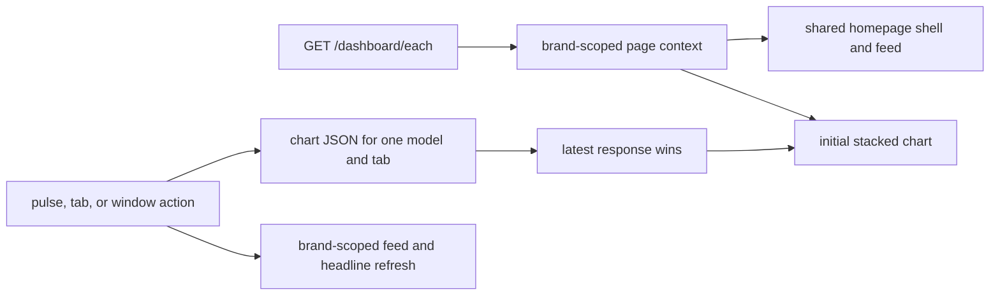

## Plain-English Summary

People will be able to open `/dashboard/each` to see how posts about one model break down over time. The familiar homepage topbar, pulse bar, headline, and feed remain in place. The pulse bar selects one model, and tabs attached to the chart switch between classification views with a page-turn motion. Every chart is a stacked area chart.

This adds a separate page and data endpoint. Existing page routes, templates, scripts, and behavior stay as they are. Completion requires deterministic chart and browser checks, the Bridgewright UI gate, and observation of the exact approved revision in production. Multi-label stacks count label assignments, which can exceed the number of unique posts; the chart must label that counting unit accurately.

<!-- BEGIN OLLIJA DELIVERY GUIDE -->
## Ollija Delivery Guide

This block is generated guidance. Do not edit it directly. Correct durable facts in `.ollija/project.yaml` or this template, then rerun `ollija annotate-plan`. Current explicit owner instructions govern this task. Record exceptions below and reflect route changes in metadata; removed requirements must not return through another checklist.

### Resolved locations

- Authoritative host: `fuchitalee`
- Authoritative repository: `/Users/fuchitalee/development/pushin-weight-v2`
- Ollija release worktree area: `/Users/fuchitalee/development/pushin-weight-v2/.worktrees`
- Active worktree: `/Users/fuchitalee/development/pushin-weight-v2/.worktrees/feat/dashboard-each`
- Plan: `/Users/fuchitalee/development/pushin-weight-v2/.worktrees/feat/dashboard-each/docs/plans/2026-09-29-062654-feat-dashboard-each-plan.md`
- Change: `feat-dashboard-each-2026-09-29-062654`
- Branch: `feat/dashboard-each`
- Staging branch and blueprint: `staging`, `/Users/fuchitalee/development/pushin-weight-v2/.worktrees/feat/dashboard-each/render-staging.yaml`
- Production branch and blueprint: `main`, `/Users/fuchitalee/development/pushin-weight-v2/.worktrees/feat/dashboard-each/render.yaml`
- Staging URL: `https://pushinweight-staging-web.onrender.com`
- Production URL: `https://pushinweight-web.onrender.com`

### Placement

This worktree is inside the Ollija release worktree area. Reuse it for the whole change. Do not create a second worktree or plan for this branch.

### Delivery scope

- Workflow: `plan`
- Delivery target: `production`
- Owner selection recorded: `true`
- Delivery route: `staged`

1. Complete implementation and the plan's verification contract.
2. Run the configured focused checks:
   - `pytest tests/ollija`
3. The parent workflow commits only this plan's changes, pushes the feature branch, and records the candidate SHA.
4. Fetch the remote staging lane: `git fetch origin refs/heads/staging`.
5. Require the unchanged candidate SHA to be a fast-forward of that fetched remote ref, then push the exact candidate SHA to `refs/heads/staging` with the server-enforced fast-forward command `git push origin <candidate-sha>:refs/heads/staging`.
6. Verify the remote staging ref resolves to the candidate SHA and the deployment for `pushinweight-staging-web` reports that same SHA.
7. Run staging checks. Stop here if they fail.
8. Only after staging passes, fetch the remote production lane: `git fetch origin refs/heads/main`.
9. Require the same unchanged candidate SHA to be a fast-forward of that fetched remote ref, then push the exact candidate SHA to `refs/heads/main` with the server-enforced fast-forward command `git push origin <candidate-sha>:refs/heads/main`.
10. Verify the remote production ref resolves to the candidate SHA and the deployment for `pushinweight-web` reports that same SHA before reporting completion.
11. After step 10 succeeds, perform worktree cleanup as the final filesystem action:
    - From `/Users/fuchitalee/development/pushin-weight-v2`, require `/Users/fuchitalee/development/pushin-weight-v2/.worktrees/feat/dashboard-each` to remain registered, clean, unlocked, and at the verified candidate SHA. If any guard fails, retain it and report the reason.
    - Run `git -C /Users/fuchitalee/development/pushin-weight-v2 worktree remove /Users/fuchitalee/development/pushin-weight-v2/.worktrees/feat/dashboard-each` without `--force`.
    - Preserve the local and remote feature branches. Continue final reporting from the authoritative repository root.

### Failure handling

- Complete applicable, unwaived checks for the selected route. A waived check is waived, never passed. Owner-selected direct production does not require staging.
- Product defects return to the parent implementation workflow; repeat only checks invalidated by the fix. Environment failures require repairing the environment, not a new source commit. Retry only after a relevant fact changes.
- SSH, shell, environment, or multi-machine failures use the repository infra/multi-machine skill first.
- The change ledger is advisory; do not validate or enforce it.
- Never force-remove a worktree. Retain staging-only, failed, dirty, locked,
  noncanonical, or candidate-mismatched worktrees for diagnosis or later
  delivery.
- Do not run an endless retry loop or start a persistent Ollija process.
<!-- END OLLIJA DELIVERY GUIDE -->

## Delivery Exceptions

None.

# Goal

Give visitors a dedicated, dependable way to examine one model's post classifications over time while retaining the familiar Pushin' Weight homepage experience.

## Goal Capsule

- **Objective:** A visitor can select one model and see its classification mix over time on `/dashboard/each`.
- **Means:** Add an isolated page and read endpoint using the approved prototype for the new tabs and chart treatment (KTD1–KTD3).
- **Authority:** This session's approved prototype and explicit production target; the existing homepage is the source for elements the user directed to keep identical.
- **Stop condition:** Do not claim delivery until the candidate revision is observed on the production web service and the route works there.
- **Execution and delivery:** Implement on `feat/dashboard-each`; use Ollija's staged production route unless the owner later changes it.

## Product Contract

### Summary and Problem Frame

The homepage compares models with one line per model. Visitors need a second view that shows the makeup of posts for one model across the homepage's classification groups. The approved prototype in `.context/compound-engineering/ce-prototype/2026-09-29-each-model-taxonomy-page/01-model-tabs-and-chart-counting/screens/001-each-model-dashboard.html` captures the new treatment; it is ignored scratch material and is not production source.

### Requirements

- **R1. Separate route:** `GET /dashboard/each` renders a public page. Existing `/`, `/internal/`, brand pages, and data routes retain their behavior and appearance. The new route is not a redirect or replacement.
- **R2. Familiar shell:** The topbar, time controls, locale controls, pulse bar, headline, feed, and footer use the existing homepage's structure, styles, copy, and interactions. The new page adds no title block, model dropdown, extra summary, or explanatory prose.
- **R3. One model:** The pulse bar selects exactly one visible model at a time and updates the chart, headline, and feed to that model. A direct URL may select a valid model; invalid or unavailable selections fall back to one visible model without exposing sentinel brands.
- **R4. Connected tabs:** The homepage filter bar is replaced by tabs attached to the chart panel. Sentiment, Post Type, Lang, Role, Audience Topics, Geopolitical, Product Signals, and Untracked Brand Promotions are represented when enabled. The Brands filter is represented by the pulse selector. Changing tabs turns the chart like a page; keyboard focus and reduced-motion preferences remain usable.
- **R5. Stacked data:** Every tab shows stacked areas with stable per-category colors and localized legend labels. Sentiment includes positive, mixed, neutral, negative, and unclassified; its stack equals the selected model's total posts for each bucket. Other exclusive categories also partition posts. Multi-label categories count each assigned label once per post, and their stack represents label assignments, not unique posts. Preserve the project's current classification and taxonomy-version rules, residual states, and time-window boundaries.
- **R6. Responsive and localized:** Desktop and narrow layouts, English, Chinese, and Japanese follow the homepage conventions. Empty, loading, and request-failure states remain legible without stale data masquerading as current.

### Acceptance Examples

- **AE1:** Select MiniMax and Sentiment in a seven-day window. Each day's five values sum to MiniMax posts for that day; no other model contributes.
- **AE2:** Select DeepSeek, then Qwen quickly. The final chart, pressed pulse, feed, and headline represent Qwen, even if the DeepSeek response arrives last.
- **AE3:** Select Post Type for a post with two types. Each type receives one count; the plotted stack does not claim to be a unique-post total.
- **AE4:** Change tab, window, and locale at mobile width. The selected state remains coherent and the chart is visible without horizontal page overflow; reduced motion suppresses the page-turn animation.
- **AE5:** Open `/` and `/dashboard/each` in the same fixture. The homepage's rendered controls and interactions remain unchanged.

### Scope Boundaries

- **In scope:** New page, its chart API and assets, URL registration, deterministic tests, Bridgewright verification, and authorized production delivery.
- **Out of scope:** Changing existing homepage UI or filter semantics, migrations, harvester behavior, and adding multi-model comparison.

### Key Decisions

- **KTD1. One model via the pulse bar** (session-settled: user-directed — chosen over a separate dropdown and multi-model selection: the approved page keeps the homepage pulse bar and selects exactly one model). Governs R2–R3.
- **KTD2. Attached tabs and stacked page-turn charts** (session-settled: user-directed — chosen over detached tabs and line charts: the user revised and approved the rendered prototype). Governs R4–R5.
- **KTD3. New page without homepage edits** (session-settled: user-directed — chosen over modifying the homepage: the requested route is additive). Governs R1–R2.
- **KTD4. Count multi-label assignments separately:** A stack of overlapping labels cannot equal a unique-post total. Preserve real per-label counts and expose the counting unit through chart accessibility and tooltip semantics. Governs R5.

## Planning Contract

### Technical Design

Directional flow (implementation details remain with U1–U3):

- Register the new route before the existing catch-all patterns in `monitor/urls.py`; add a dedicated chart JSON route for the selected model, tab, window, and timezone.
- Build one brand-scoped chart aggregate per request from current post-brand classification state and the corresponding current edge/scalar source. Use half-open time bounds and the homepage's one-day five-minute and longer daily bucket conventions. Avoid the legacy single-brand chart's 500-row feed cap.
- Use the existing homepage template, CSS, and static scripts as the source for common shell behavior. Make an additive template and page-specific chart assets rather than editing existing page markup or chart scripts. Keep the feed's brand filter synchronized with the pulse selection.
- Use localized taxonomy labels already projected by `monitor/views.py`. Keep stable category keys and palette in page-specific chart metadata. Include explicit residual categories. Handle disabled classification families without inventing labels.
- Fetch only the active tab. Cancel or discard older responses by request generation. Keep the initial chart server-renderable or delivered with the initial page so the first view does not flash blank.

### Assumptions

- The approved prototype's Geopolitical tab represents geopolitical modes. China and U.S. stance are subdimensions of that homepage filter group and need not become extra top-level tabs in this page.
- For multi-label tabs, stacked height represents label assignments. This honors the requested visual form without silently claiming those assignments are unique posts.

### Dependencies and Sequence

The chart aggregate and API establish the data contract before the chart client. The page shell and chart client can then be tested together through the real route. Browser and Bridgewright checks precede release. No schema migration is planned.

## Implementation Units

### U1. Brand and taxonomy chart data

- **Goal / requirements:** R3, R5, R6; AE1–AE3.
- **Files:** `monitor/views.py`, `monitor/urls.py`, `tests/test_dashboard_each.py`.
- **Approach:** Add a brand-validated, tab-scoped aggregate and JSON endpoint with bounded buckets, current classification semantics, localized labels, residuals, and distinct counting units. Reuse established window and timezone decisions where possible. Add a request-level regression for duplicate edges and stale classification state.
- **Test scenarios:** Exact sentiment partition including unclassified; multi-label posts counted once per label; no cross-brand contamination; invalid model/tab/window; one-day and longer buckets; empty and disabled categories; endpoint query cost on a representative fixture.
- **Verification:** Targeted Django tests and system checks.

### U2. Additive page and visual controls

- **Goal / requirements:** R1–R4, R6; AE2, AE4–AE5.
- **Files:** `monitor/templates/monitor/dashboard_each.html`, `monitor/static/pw-each-chart.js`, `monitor/static/pw-each-chart.css`, `monitor/views.py`, `monitor/urls.py`, `tests/test_dashboard_each_browser.py`.
- **Approach:** Copy only the common homepage shell needed for parity into the new template, then replace its filter bar and chart with the attached tabs and stacked chart. Reuse unchanged shared assets and feed/headline projections; keep page-specific state and request handling in new assets. New selector is single-choice and shareable by URL.
- **Test scenarios:** Render `/dashboard/each` anonymous in each locale; pulse single selection; tab page turn and reduced motion; slow-response race; feed/headline alignment; mobile and desktop geometry; static references; homepage route regression.
- **Verification:** Real Django URL → view → template → browser tests, plus focused JavaScript checks.

### U3. Bridgewright UI and performance evidence

- **Goal / requirements:** R1–R6; AE1–AE5.
- **Files:** `bridgewright.yaml`, `tests/fixtures/ui_assurance/declaration.json`, `tests/ui_assurance/gate.py`, `tests/test_dashboard_each_browser.py` only as warranted by the existing assurance contract.
- **Approach:** Validate and prescribe the pinned Bridgewright target before edits; add coverage for the new route and controls without diluting the homepage target. Run the affected gate during implementation and candidate gate at the frozen candidate revision. Measure candidate performance because aggregation and request volume change.
- **Test scenarios:** Exact selected model/tab state, reverse pulse selection, tab-window races, visible chart geometry, no homepage regression, candidate query/render cost.
- **Verification:** Bridgewright assurance validation/prescription, affected gate, candidate gate with zero missing/skipped/failed obligations and sealed performance evidence.

### U4. Review and production delivery

- **Goal / requirements:** R1–R6.
- **Files:** This plan and implementation diff.
- **Approach:** Review and simplify the diff, preserve the verified candidate SHA, follow Ollija's selected staged route, and inspect the production route after deployment. Follow owner exceptions if the owner changes the route.
- **Verification:** Exact candidate SHA on remote production branch and production web service; browser check of `/dashboard/each`; guarded worktree cleanup only after the guide's conditions are met.

## Verification Contract

- Before mutation: `ollija annotate-plan docs/plans/2026-09-29-062654-feat-dashboard-each-plan.md --check` and review the selected guide.
- Before UI edits: run `uv run --extra dev bridgewright assurance-validate --project-root .` and `uv run --extra dev bridgewright assurance-prescribe --project-root .`.
- During implementation: targeted `pytest` for the new page and `uv run --extra dev python -m tests.ui_assurance.gate --scope affected`; browser proof uses a disposable database and real URL.
- Candidate: record the product-source SHA in the declaration, then run `uv run --extra dev python -m tests.ui_assurance.gate --scope candidate --candidate-revision <sha>` with the required candidate performance inputs and sealed evidence. A waiver or unperformed check is never a pass.
- Delivery: follow the Ollija guide's staged production route, verify staging and production services/database availability, and observe the exact deployed SHA and route behavior. Do not conflate a pushed branch, PR, or staging deployment with production.

## Definition of Done

- All acceptance examples pass against deterministic fixtures and the browser route; all chart families remain stacked and labeled by the correct counting unit.
- The existing homepage template, static assets, and home-view behavior remain unchanged, with no observed regressions.
- Bridgewright affected and candidate obligations have zero failed, skipped, errored, missing, or unknown results; candidate performance evidence matches the source SHA.
- Review findings are resolved or durably reported. Dead-end prototype or experimental code is absent from the tracked diff.
- The exact candidate SHA is observed deployed in production and `/dashboard/each` works there. Cleanup follows the generated guide only when its guard conditions hold.
