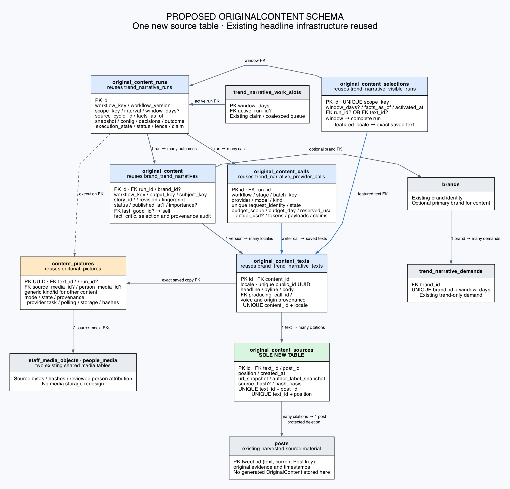
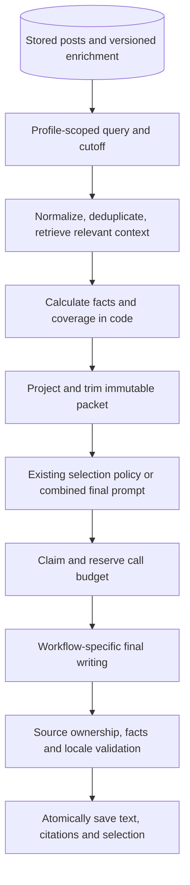
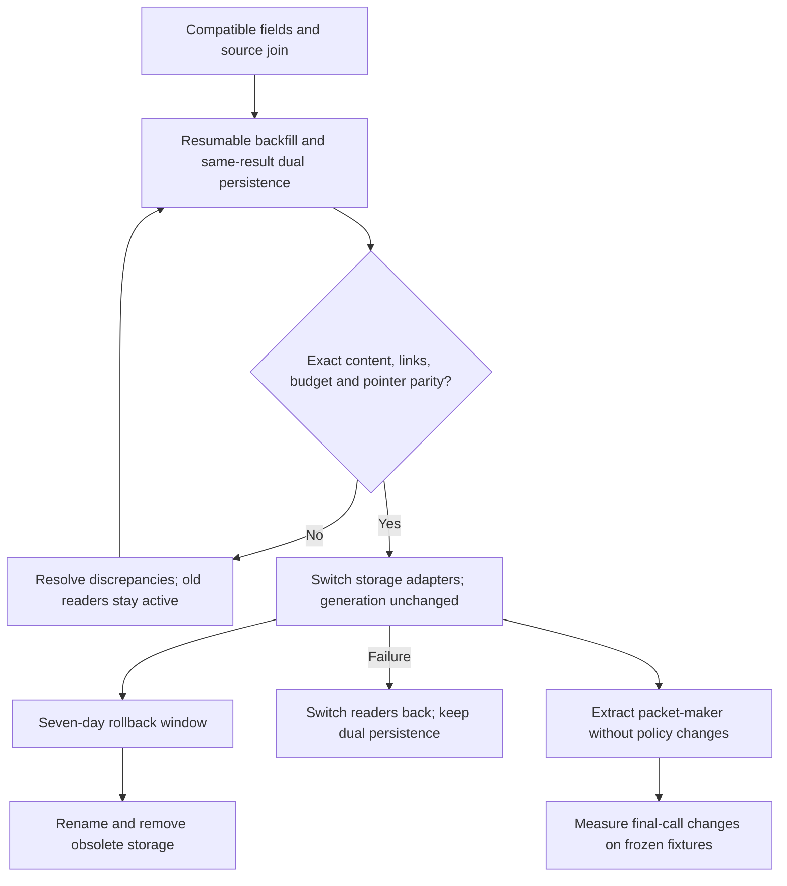
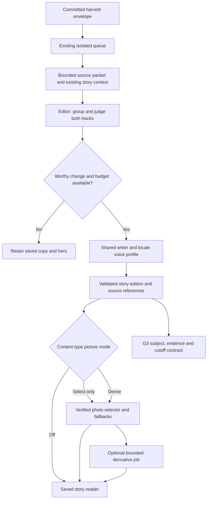

# G2 editorial engine, voices and modular picture editor - Plan

## Plain-English Summary

Headlines, Chatter and Pulse will share storage for our own generated content, called `OriginalContent`, while collected posts remain source material. Each saved language/version will contain its headline, byline, optional body and exact cited posts. Its source count and every source URL will remain inspectable.

We will extend the existing headline tables and add one source-link table. Existing run and provider-call records will track the workflow that produced each output and the resources it consumed. A shared packet-maker will collect and prepare database evidence in code, then hand it to each workflow's writing prompt.

Storage consolidation comes first, with current writing behavior preserved. Packet-maker extraction and measured call reduction follow separately. Verification will compare saved text, citations, URLs, pictures, publication choices, costs and retries, including populated-database migration and rollback. The schema image below shows the proposed end state.

The compatible release and U16 physical table renames are verified on staging and production. The six retained tables now have their agreed names; temporary views under the old names let compatible older code use the same rows. Full-row checksums, IDs, relationships, citations, publication pointers and budget totals survived the rename. Writing has resumed, source collection continued, and original service settings are restored. Monitoring observed about three minutes of website 502 responses across an overlapping rebuild and this deployment. Legacy storage and aliases remain available during the rollback window; retirement still requires its separate safeguards.

---

## Goal Capsule

- **Objective:** Operators can inspect and extend generated stories and headlines through one consistent content model, with dependable citations and resource accounting.
- **Means:** Headline-first schema consolidation (KTD10), shared packet-maker (KTD16), and profile-specific final writing (KTD17).
- **Authority:** Current owner instructions; G2-R43/R48/R50–R54 in the authoritative General Launch Charter; this current execution contract; historical release evidence.
- **Endpoint:** The current owner request is `$compound-engineering:lfg this amendment to production`: implement U16, verify the unchanged integrated candidate on staging, then observe all six canonical physical table names and compatible old-name views in production, preserving data/citations/budgets and running harvesting, with writing resumed and original service settings restored. The earlier compatible-production endpoint is already complete and its receipts remain valid for their stated scope. Observe the existing seven-day safeguard before destructive retirement.
- **Execution scope:** U16 is complete at production revision 00d73117, as recorded below. U9–U14 and compatible staging/production delivery are also complete. U15 physical retirement, alias removal, column renames and new quality experiments remain excluded. U1–U8 and completed October releases are historical evidence and must not be rerun.
- **Stop conditions:** Escalate a material contradiction of the owner-selected architecture or an unresolved migration discrepancy. Missing historical data must be reported, never replaced with invented evidence.

---

## Product Contract

Product Contract unchanged: the consolidation implements G2-R50–R54 without changing existing source, voice, selection, picture or headline requirements. Earlier G2-R01–R49 remain in the shared charter and historical release contract. Their completed experiment ceilings are not new spending authority.

### Problem Frame

The three writing paths draw on the same database but store and prepare evidence differently. Chatter/Pulse citations currently live in JSON, making post relationships harder to query and enforce. Mutable display names also obscure which code and provider calls consumed the budget.

### Requirements

**Storage and evidence**

- G2-R52. Use the owner-selected `OriginalContent` name for authored content, distinct from collected `Post` records; preserve published versions, producing workflow identity and shared-step accounting.
- G2-R54. Extend existing headline infrastructure and add only `original_content_sources`, shared by headlines, Chatter and Pulse. Existing editorial tables are migration inputs, not the target design.
- G2-R51. Persist distinct cited-post relationships and all supporting URLs per saved language/version. Context candidates and independent confirmations remain separate concepts.

**Preparation and generation**

- G2-R53. Reuse the three current implementations where optimal through a parameterized, code-first packet-maker, with workflow-specific writing at the end. Any removed judgement call requires demonstrated quality parity and measured savings.
- G2-R50. Preserve bounded recent and older relevant context retrieval, including recurring names/memes across months, and ensure selected context reaches the writer.
- G2-R43. Preserve current headline behavior while extracting reusable preparation and persistence services.
- G2-R48. Keep picture editing independently configurable and preserve shared source/derivative handling.

### Scope Boundaries

U9–U12 consolidate persistence while preserving generation prompts, models, limits, scheduling, factual checks and current publication policies. U13 extracts preparation without changing accepted copy contracts. U14 evaluates the final writing boundary under the existing quality requirements. U15 completes table retirement and reference updates after rollback proof.

The design introduces no workflow registry, story, packet, publication or daily-budget table. Workflow definitions belong in versioned code/configuration; existing records retain execution snapshots.

### Deferred to Follow-Up Work

New formats, provider/model replacements, cadence or budget changes, harvesting/classification behavior changes, G3/G4 interfaces, G5 redesign and locale voice craftsmanship require separate scope. A fresh paid evaluation requires its own explicit allowance; this plan does not restore previously waived experiments.

### Acceptance Examples

- AE1. Covers G2-R51/R54. English and Japanese copies with different cited posts retain separate source rows; fetching English returns its own distinct count and complete URL list.
- AE2. Covers G2-R52. Renaming the public label “Chatter” leaves its workflow identity, producing calls, historical URLs and budget totals unchanged.
- AE3. Covers G2-R43/R52. A failed trend refresh keeps its last-good publication and activates no partial all-brand window.
- AE4. Covers G2-R50/R53. A current Chonk/LECHONK post retrieves relevant older named/meme context without treating unrelated same-brand material as supporting evidence.
- AE5. Covers G2-R52/R54. A saved edition URL and its picture asset continue to resolve after import; rollback serves the same saved edition without another provider call.

---

## Planning Contract

### Baseline and behavior trace

Source inspection uses G2 release `ce0e8b7a`. The refreshed `origin/main` is `702fef5b`; its relevant model/migration/editorial/packet/task files match this baseline. Independent benchmark work owns the pending generic-account conversion; coordinate future migration dependencies against the actual execution base rather than assuming a next migration number. Current core migration leaves merge at `0071_merge_20261007_0608`.

The committed harvest envelope dispatches queue work. Trend runs prepare brand/window outcomes and atomically select a visible run; Chatter/Pulse assess a quarter-hour interval, reserve provider ceilings, save immutable editions and select a Chatter hero. HTTP readers return saved content and never start generation. A sent call with uncertain outcome remains charged and is not automatically resent. This single-pass trace is grounded in `monitor/trend_narrative_tasks.py`, `monitor/trend_narrative_lifecycle.py`, `monitor/editorial/service.py`, `monitor/editorial/persistence.py` and `monitor/editorial/readers.py`.

### Key Technical Decisions

- KTD10. **Generalize existing headline models in place.** Rename `BrandTrendNarrative`/its text model to `OriginalContent`/`OriginalContentText`; generalize existing run, provider-call and visible-run tables. Add exactly one new table, `OriginalContentSource`. Preserve existing integer primary keys through renames. Governs G2-R52/R54. (session-settled: user-directed — chosen over unchanged-schema JSON storage and columns-only adaptation: relational citations are shared by all three outputs.)
- KTD11. **Attach citations to localized saved text.** A parent represents an immutable output version; its locale rows own citations and producing writing calls. Import each existing editorial edition as its own parent plus one locale row, without forcing equal revision numbers or evidence across languages. Existing bilingual headline parents retain their locale grouping. Governs G2-R51/R52.
- KTD12. **Separate workflow, stage and display label.** Stable workflow keys identify code/config profiles; calls record the actual stage and provider/model. A dispatch run may contain shared editorial selection and different writing workflows. The text's producing-call foreign key resolves the exact writer; shared selection costs live on one call only. Governs G2-R52. (session-settled: user-directed — chosen over a content-type enum named for public labels: producing code determines resources and budget.)
- KTD13. **Keep story identity without a story table.** Repeat `story_id` and `subject_key` snapshots on immutable content versions. Preserve existing story UUIDs and edition UUIDs; text `public_id` pins old edition links. Serialize first story allocation and revision assignment by subject/workflow/locale to prevent competing identities. Governs G2-R52/R54 and AE5.
- KTD14. **Reuse visibility rather than introduce hero storage.** Extend the existing visible-run table with a unique `scope_key` and optional selected-text foreign key. Retain all-brand atomic window selection, while featured content selects an exact locale/version. Trend work-slot and demand tables stay trend-specific. Governs G2-R43/R52/R54.
- KTD15. **Derive daily budgets from calls plus proven carry-forward receipts.** Add pessimistic reservation/counter fields to the existing provider-call model and serialize reservation under a short PostgreSQL transaction lock per budget scope/UTC day. Preserve existing external-spend audit receipts in shared run outcomes; these are zero-send import records, not invented provider calls. Preserve the current full-ceiling charging policy, day and per-assessment call/media limits, and global in-flight protection. Imported actual usage may remain unknown; reservation is not invoice cost. Governs G2-R52.
- KTD16. **Extract one deterministic packet-maker with adapters.** Reuse current facts, projection, evidence and relevance collectors; implement profiles and bounded enrichment as code/config. No language-model dependency belongs in preparation. Cache reuse must incorporate evidence and enrichment revisions, not just post IDs. Governs G2-R50/R53. (session-settled: user-approved — chosen over independent collectors per format: source preparation is substantially shared.)
- KTD17. **Preserve judgement until savings are demonstrated.** The initial adapters keep current editor/rank/critic decisions. Prefer one final writing request per selected output/locale; combine selection and writing only where a frozen acceptance set proves parity. No fixed-window headline critic disappears merely to achieve a one-call slogan. Governs G2-R43/R53.
- KTD18. **Expand, import, switch, then retire.** New fields and source links precede writer/read changes. Dual persistence uses the same accepted result in one database transaction, never duplicate provider calls. Destructive removal and breaking column changes wait until all deployed consumers use compatible mappings and the rollback window passes. U16 may rename retained physical tables earlier only with tested old-name aliases that keep the same rollback contract usable; the aliases must remain through that window. This amendment changes the rename transition mechanism, not the seven-day retention safeguard. Governs G2-R52/R54.
- KTD19. **Preserve the existing shared picture service.** Rename/reuse `EditorialPicture` as a generic `ContentPicture`, including atomic commentary attachments. Add optional exact-text and shared-run foreign keys; preserve non-OriginalContent attachment keys, media objects, provider task IDs and bytes. This existing table is not a second new table. Governs G2-R48/R52/R54.

No bake-off is needed: the owner selected the storage mechanism, and current code establishes the reuse boundaries. Alternative implementations of citation ownership were resolved from the existing per-locale edition contract (KTD11), rather than competing designs needing development.

### High-Level Technical Design

The image shows the proposed physical end state, relevant fields and enforced foreign-key relationships. Blue tables reuse headline storage; green is the sole new table; amber reuses the existing shared picture table; gray tables already exist. A FK is a database relationship linking a row to its referenced row. Fields not listed in the image remain governed by the inventory and schema contract below.



[Open scalable schema image](2026-10-08-115300-original-content-schema.svg) · [Diagram source](2026-10-08-115300-original-content-schema.dot)

```mermaid
stateDiagram-v2
  [*] --> Reserved: budget transaction
  Reserved --> Sent: irreversible send recorded
  Reserved --> Failed: proven pre-send failure
  Sent --> Completed: response persisted
  Sent --> Ambiguous: timeout or lost response
  Completed --> [*]
  Failed --> [*]
  Ambiguous --> [*]: retain charge; no automatic resend
```







### Proposed Relevant Schema

Table names below are the final names and are now present in the deployed physical schema after0079. The six former names remain temporary, writable views of those same base tables; no replacement table or copied data was introduced. Physical column renames remain outside U16. The field descriptions below retain the broader proposed consolidation contract; maintained schema references describe the current physical columns.

| Existing table | Target table/model | One row represents |
| --- | --- | --- |
| `brand_trend_narratives` | `original_content` / `OriginalContent` | One immutable authored output version or held/unavailable outcome. |
| `brand_trend_narrative_texts` | `original_content_texts` / `OriginalContentText` | One saved language of that version. |
| None | `original_content_sources` / `OriginalContentSource` | One cited post supporting one saved text. |
| `trend_narrative_runs` | `original_content_runs` / `OriginalContentRun` | One preparation/dispatch execution, including shared selection. |
| `trend_narrative_provider_calls` | `original_content_calls` / `OriginalContentCall` | One claimed/reserved provider attempt with immutable identity. |
| `trend_narrative_visible_runs` | `original_content_selections` / `OriginalContentSelection` | One current publication pointer for a defined scope. |
| `trend_narrative_work_slots` | Same table/model | One active/coalesced trend-window work slot. |
| `trend_narrative_demands` | Same table/model | One brand/window demand record. |
| `editorial_pictures` | `content_pictures` / `ContentPicture` | One optional source/derivative attachment, also usable outside OriginalContent. |

**OriginalContent.** Retain integer `id`, run FK, nullable primary brand FK, brand-name snapshots, status, confidence, narrative kind, critic audit, fact/evidence audit, timestamps and protected `last_good` self-link. Change run deletion from cascading to protected once serving data is imported. Add `workflow_key` (80-character stable identifier), `output_key` (200-character deterministic identity within a run), `subject_key` (200-character stable grouping), nullable `story_id` UUID, positive `revision`, nullable `occurred_at`/`published_at`, nullable `importance` (0–100), `fingerprint` (64-character digest), and `provenance`/`selection` JSON snapshots. `narrative_kind` retains its analytical meaning; it does not become a Chatter/Pulse enum. Non-brand stories use empty brand snapshots and a real subject key, never fake brands.

Replace run/brand uniqueness with `(run_id, workflow_key, output_key)`; the trend adapter's output key remains the existing brand snapshot key. Index `(subject_key, workflow_key, -published_at, id)`, `story_id` and workflow/date feeds. Story UUID assignment is reused consistently for a given editorial subject under the KTD13 lock. Preserve prepared/held/status checks; held still requires protected last-good. Approval still requires verification, plus the workflow's required complete locale set and citations where required, checked in the atomic publishing service. Preserve the existing trend bilingual check during compatibility; remove duplicated parent headline/secondary columns only after localized text parity is proven. Trend-specific guarantees become adapter validation before any pointer change, with a PostgreSQL integration regression net.

**OriginalContentText.** Preserve integer `id` and the existing parent FK column identity, rename the relation to `content`, and retain `(content_id, locale)` uniqueness with supported locales `en`, `zh-cn`, `ja`. Keep `headline`, rename `secondary` to `byline` only after compatibility mappings, and add `body` text default empty. Add globally unique `public_id` UUID, nullable `producing_call` FK protected from deletion, and `provenance` JSON for voice/config and migration origin. Import editorial edition UUID into `public_id`; assign deterministic UUIDs to existing headline texts. Byline maps to the whole existing secondary string; do not split it into invented meaning. Required headline/byline checks remain; headline-only workflows may have empty body. New provider-produced text requires a completed matching writer call in the same run and workflow. Legacy text may have an unknown producer, explicitly labeled rather than matched heuristically.

**OriginalContentSource — the one new table.** Integer `id`; required text FK with cascade on deletion of its owning text; required `post` FK to the current `Post` primary key with protected deletion; positive small `position`; nonempty `url_snapshot` (up to 4096 characters); `author_label_snapshot` text; `source_hash` (64-character digest of the projected source at writing); and `created_at`. Unique `(text_id, post_id)` and `(text_id, position)`, with the normal FK indexes. Source order follows the accepted citation order. Snapshot URL/label/hash never update after publication. Protect cited posts from ORM deletion and prohibit direct SQL deletion through the enforced FK; do not claim Django protection is a PostgreSQL `ON DELETE PROTECT` clause. The count is derived from unique source rows, not duplicated on the parent. Legacy unresolved IDs block source import for that text and appear in a reconciliation report; never insert placeholder posts. Fact-only trend outputs may legitimately have zero post citations, with aggregate fact IDs retained in audit JSON. Required Chatter/Pulse citations remain required.

For legacy imports, `source_hash` is nullable only when the writing-time projection cannot be recovered. Add `hash_basis` with `writing_packet`, `legacy_packet` or `legacy_unavailable`; require a hash for the first two. Do not hash today's edited source and present it as writing-time evidence. All post URLs remain available through the relation; validate safe HTTP(S) source links without limiting the shared reader to X URLs.

**OriginalContentRun.** Retain `id`, source cycle, facts cutoff, packet schema, immutable snapshot/brand/batch manifests, lifecycle status and activation timestamps. Add nonempty `workflow_key`, `workflow_version` digest, `scope_key` (160 characters), nullable quarter-hour `interval`, `config_snapshot`, `decisions`, `outcome`, positive claim `fence`, nullable claim owner/expiry, and `execution_state` for preparing/running/complete/failed/ambiguous. Keep publication status separate from execution status. Make `window_days` nullable for non-window dispatches; trend adapters still require 1/7/30/365 and scope `trend-window:<days>`. Generalize uniqueness to `(source_cycle_id, scope_key, workflow_key)` and add conditional unique `(scope_key, interval)` when interval is present for editorial dispatch. Retain existing trend keys exactly, and lease/fence semantics from assessments. Snapshot includes packet version/hash, workflow/config versions, classification contracts and required locale policy. Imports use a namespaced legacy origin in provenance, not fabricated production cycles.

Existing external-spend audit assessments import as workflow `reservation-carryforward`, scope `budget:<budget-scope>:<UTC-day>`, with the original amount/counters/origin in immutable `outcome`. Conditional uniqueness on `(scope_key, workflow_key)` for that workflow prevents duplicate receipts. These rows have no text and can never dispatch a provider. In particular, the recorded production carry-forward is USD2.093153 and ten calls, with `provider_send=False`; it cannot be recovered by summing production call rows alone. This is existing evidence from the release activation receipt, not a new spend.

**OriginalContentCall.** Retain `id`, protected run FK, unique request identity/hash, batch key, payload/response snapshots, claim fields, state transitions, timestamps, usage, latency and error code. Widen stage/batch identifiers to 200 characters for existing writer/media identities; replace the strict rank/editor/critic-only check with validated versioned workflow-stage definitions. Add `workflow_key`/`workflow_version`, `kind` (`text`/`media`), `provider`, `model`, `budget_scope`, UTC `budget_day`, nonnegative decimal `reserved_usd` (12,6), nullable `actual_usd`, and usage/rate provenance. Keep unique `(run_id, stage, batch_key)` plus global request identity; preserve global media-task stage uniqueness with a conditional unique stage for media. Imports map `complete` to `completed`, preserve `sent`/`ambiguous`, and label unknown request hashes/usage instead of inventing requests. Existing trend calls retain their historical zero/unknown reservation semantics unless their actual reservation is recoverable.

Add an immutable `legacy_import` marker and nullable missing request hash/send/completion timestamps for imported calls only. Adapt shape constraints with an explicit legacy-import branch; fresh sends retain strict timestamp/hash/claim requirements. Proven pre-send failures may have no send timestamp only with an explicit pre-send error classification; all sent states require the send timestamp. Derive an import request identity from the actual legacy row/stage key, not a fabricated provider request. Preserve known timestamps exactly; unknown completion time stays unknown. A completed import can back a historical text, but imported uncertain work can never become sendable. Failed or ambiguous reservations retain their ceiling as required by the owning workflow; no refund is implied by a state label.

**OriginalContentSelection.** Retain the existing integer window key/column as nullable unique `window_days`, add a surrogate integer `id` primary key and unique `scope_key`, retain run/facts/activation timestamps, and add nullable protected text FK `text`. Empty legacy hero slots import as no selection row. Exactly one of run/text is selected: window scopes require run and supported window; featured scopes require text and no window. Backfill scopes for existing trend pointers and current Chatter heroes. New stable scopes use workflow keys, for example `featured:social-brief:en`; mutable public names resolve through config. Keep window publication atomic across all brands, and current Chatter incumbent scoring/locking unchanged. Remove the old nonnullable run/window constraints only after compatibility readers explicitly filter their scopes.

**ContentPicture.** Preserve UUID primary key, generic attachment kind/id, platform, revision hash, modes, state, reviewed person/source-media FKs, provenance, derivative task/poll leases and storage/hash fields. Add optional protected `text` FK and replace assessment FK with nullable protected shared run FK. Existing generic attachment keys remain for atomic commentary/older headline callers; OriginalContent readers use the exact text FK. Copy edition UUIDs unchanged so old generic keys and asset URLs keep working. Neither picture metadata nor generated descriptions become post citations. Keep `staff_media_objects` and `people_media` storage/identity untouched.

The older `trend_narratives` and `trend_narrative_subjects` are a separate predecessor model. They are excluded from renaming or removal; their subject FK does not point to `brand_trend_narratives`. Preserve their remaining readers explicitly in U9/U12.

### Editorial Input-to-Target Mapping

| Existing editorial table | Destination and retirement condition |
| --- | --- |
| `editorial_assessments` | Shared runs; preserve interval/fence/packet/decisions/outcome and migrate all call/picture references before removal. |
| `editorial_budgets` | Shared call aggregates plus preserved zero-send carry-forward run receipts; remove only after every UTC day reconciles the exact six-decimal reservation amount, total calls and media calls. |
| `editorial_calls` | Shared calls; preserve stage identity, uncertainty and ceilings so import cannot make a previously sent stage sendable. |
| `editorial_stories` | Subject/story UUID snapshots on content versions; retain unpublished story/anchor metadata in its originating run snapshot before removal. |
| `editorial_editions` | Content plus localized texts and source rows; preserve UUID links, revisions, copy and selection metadata. |
| `editorial_heroes` | Featured selection pointers; replace provider-lock sentinel with transaction lock, without changing in-flight policy. |
| `editorial_pictures` | Reused and eventually renamed `content_pictures`; migrate assessment reference, keep source objects and derivative state. |

Six obsolete editorial tables retire; the seventh remains as the shared picture table. Any ledger or unpublished-story record without a lossless destination blocks that table's retirement.

### Packet-Maker Contract and Reuse

Preparation inputs include subject/brand sets; quantity and byte limits; publication cutoff; current/baseline/lookback windows; source-language filters distinct from requested output locale; stored classification outcome, taxonomy and contract versions; source kinds; ranking weights; and explicitly enabled context/enrichment modules. Validate bounds and unsupported combinations before database queries. Adapters preserve current workflow defaults and observable selection results.

The immutable output contains projected posts and original/quote/parent passages; stable source IDs/alias maps; source hashes/URLs; typed aggregate facts with denominator/coverage; relevant context with retrieval reasons/dates; classification/enrichment versions; packet hash/schema; and trimming diagnostics. Candidate, anchor, contextual and cited roles remain separate. Citation rows are written only after final copy validation. No generic unrestricted SQL or raw prompt parameter bypass belongs in the operator interface.

| Shared stage | Existing implementation to extract/reuse | Preservation obligation |
| --- | --- | --- |
| Closed evidence projection and exact passages | `monitor/trend_narrative_packet.py` | Exact source spans and ownership; deduplicate aliases without moving claims between brands. |
| Cutoff-scoped recent evidence | `monitor/editorial/evidence.py` | Respect both source and fetched cutoff; include parent/quoted context and current publication context. |
| Story/meme relevance lookup | `monitor/editorial/context.py` | Material overlap plus shared brand/recency; recover bounded older context using distinctive recurring names. |
| Facts, deltas and coverage | `monitor/trend_narrative_facts.py` | Preserve deterministic chart facts and versioned classification denominators. |
| Final copy grounding | `monitor/editorial/grounding.py`, `monitor/headline_grounding.py`, `monitor/editorial/writing.py` | Supplied source ownership and exact spans remain authoritative after reuse. |
| Profile prompt/locale adapters | `monitor/trend_narrative_generation.py`, `monitor/editorial/writing.py` | Preserve separate trend, voiced brief and factual report contracts. |

Initial limits retain the measured runtime contract: assessment maximum 240,000 UTF-8 bytes/160 recent posts, selected story maximum 96,000 bytes/24 context posts, recent context seven days, older lookup 180 days, at most two expansion terms and optional lookup timeout 1,500 ms. Serialize the actual wire representation to count bytes; remove whole low-ranked rows while preserving anchors and required passages. If required evidence exceeds the limit, return an explicit oversized/held preparation outcome before reservation/send. Provider-specific request size also includes prompt/schema overhead and remains separately enforced.

Read classification provenance using `docs/analysis/2026-09-09-112957-classification-analysis-contract.md` and `docs/analysis/2026-09-10-203138-stage1c-contracts.md`; dates never substitute for stored versions. Relevance preserves historical Chonk/LECHONK and GLM tease/update/launch fixtures with uncertain dates, without asserting an invented chronology.

Reuse packets within the execution, not through a new cache table. A reuse key includes source content/metrics and fetched cutoffs, stored classification revisions, affiliation review/effective dates, historical query boundaries, profile config and projection/schema versions. If a trustworthy enrichment revision is unavailable, disable reuse across that boundary. An unchanged eligible packet exits before any reservation or provider call. Freeze ordering, serialization and query caps to make replays inspectable.

Stable initial code keys are `brand-window`, `social-brief`, `development-report`, `editorial-dispatch` and `media-derivative`; display labels map separately. Workflow versions are code/config digests, not label changes. Language variants use the same original evidence, with independent copy/citation validation.

### Budget, Concurrency and Publication Invariants

Under KTD15, a call reservation and its counter eligibility commit before send; no network occurs inside the lock. Sent/ambiguous/completed attempts remain fully charged, as today. Acquire UTC-day budget lock before the shared in-flight lock consistently to avoid deadlocks; aggregate indexed call rows by budget scope/day and run. A stale run fence cannot reserve or publish. Publishing a text, its validated source rows and its pointer occurs in one transaction. Source/call import is idempotent by stable legacy identity, stored in provenance; it never transitions ambiguous work back to eligible work.

Daily reservation/call/media totals include the corresponding immutable carry-forward receipt exactly once. Admit a receipt only from verified legacy audit evidence; never manufacture a balancing amount for an unexplained discrepancy. An expired sent call is conservatively ambiguous, while global media identities remain reserved across later assessments. The live workflow may not lower or rewrite import receipts to make budget available.

Shared selection is charged once to its dispatch run. Output-level cost inspection shows its direct writing calls plus separately labeled shared-call references; never sum allocated shares back into the authoritative ledger. Preserve existing separate headline and editorial budget policies; common storage does not pool their caps. Configured pricing/actual usage remains labeled distinctly from reservations and unavailable invoice totals.

### Migration, Cutover and Rollback

1. **Inventory and characterize.** U9 captures references, counts and exception reports against the actual release base and a populated isolated PostgreSQL clone. Freeze expected text, source sets, UUID routes, pointer choices and cost totals before editing storage.
2. **Expand compatibly.** U10 adds fields and the sole new join using existing physical table names. Introduce required workflow/scope/identity fields as nullable during mixed-version operation, then backfill and enforce their final constraints once compatible consumers own writes. Introduce application model names through explicit rename/state mappings so Django does not infer delete-and-create operations. Existing approved trend constraints remain until their replacement publication validation exists. Use historical models for data migrations, and separate schema/data operations when PostgreSQL pending-trigger behavior requires it. See [Django 5.2 migration operations](https://docs.djangoproject.com/en/5.2/ref/migration-operations/).
3. **Import and mirror.** U11 copies frozen accepted records in resumable batches, recording old-to-new mappings in target provenance, preserving source order and timestamps. Populate missing headline locale rows from the existing parent copy before retiring those duplicated columns; preserve already saved localized rows and report conflicts. U12 dual-persists new accepted outputs and durable call state using the same result, transaction and fence. Reconcile current-day reservations under the same lock with one canonical reservation owner, not two ledgers. Deploy the compatibility readers/claim adapters to every provider-capable consumer before enabling shared ownership; an older process that still uses independent locking must finish before the flag changes.
4. **Catch up and switch.** Import the overlap after mirror activation, then compare a transaction-consistent snapshot. Flip the storage adapter only after row, citation, route, picture, pointer and budget parity passes. Read flags select one authoritative side; they never cause LLM or harvest calls. Web/worker/operator compatibility must be observed at the same candidate before obsolete-name removal.
5. **Keep rollback available for seven days.** Continue mirroring representable published outputs and all send/ambiguity states. On failure, select old readers/storage ownership within the compatibility release and reconcile overlap under the common claim lock. Legacy-storage dispatch in that release consults canonical imported/new call identities, preventing a second send. Do not redeploy a pre-compatibility provider process, reverse migrations or delete target data to roll back serving. New output profiles that cannot be represented in old storage stay disabled until this window ends.
6. **Retire safely.** U15 checks zero legacy consumers and exact preservation before removing six obsolete tables/duplicated parent copy and renaming retained physical tables/columns. Take and restore-prove an encrypted backup with recorded retention before destructive removal. After removal, rollback is a reviewed forward fix or restored database plus reconciled publication/call overlap; simply restoring an old snapshot would lose new data and is not acceptable.

Migration lock waits are bounded with an explicit timeout; a busy shared database defers the operation instead of blocking harvest indefinitely. Renames occur only after every consumer supports target names, with deployment sequencing documented for web and queue workers. Temporary mapping/resume reports are artifacts, not new database tables. Missing posts, malformed aliases, unexplained budget balances or unmappable calls remain visible discrepancies until resolved.

### Risks, Dependencies and Execution-Time Discovery

The populated rehearsal decides batch size and lock-time bounds from actual volume. It also establishes missing-source exceptions, caller completeness and stage mapping; these are required execution checks, not unresolved schema choices. Number migrations from the then-current merged leaf, coordinate benchmark Account/Post dependencies and retain the official-company session's independent ownership. No Account primary-key conversion is included here.

Atomic service checks replace constraints that cannot span locale/citation child rows; integration tests must prove every publication path uses that service. Retain database constraints for row-local state and uniqueness. Protecting cited posts can expose previously permissive deletion paths; inventory those paths and fail clearly rather than silently removing citations.

---

## Implementation Units

U9–U14 define the completed compatible consolidation; U15 remains gated retirement. U16 is the owner's completed physical-name amendment. Additions keep existing U1–U8 IDs intact in the historical appendix.

### U9. Capture the regression net and migration inventory

**Goal:** Establish measurable preservation before storage changes.

**Requirements:** G2-R43/R48/R51–R54; KTD10–KTD15/KTD18/KTD19.

**Dependencies:** None; start from the current agreed implementation base.

**Files:** `tests/test_original_content_regression.py` (new), `tests/fixtures/original_content_migration.json` (new), existing `tests/test_trend_narrative_lifecycle.py`, `tests/test_editorial_persistence.py`, `tests/test_editorial_views.py`, `tests/test_editorial_media.py`; inventory report under `docs/analysis/`.

**Approach:** Inventory model and migration-only constraints, reverse relations, generic picture IDs, URLs/cursors, operator commands, deletion paths and all published/unpublished/call/budget records. Freeze a populated fixture with bilingual trend, English-only story, different locale/revision evidence, held last-good, ambiguous media call and shared editor step. Record comparison units and source-ID encodings.

**Execution note:** Add characterization coverage before changing existing persistence.

**Test scenarios:**

- Covers AE1. Different locale/revision source sets produce exact existing counts/URLs independently.
- Covers AE3. Approved and held window outcomes preserve all-brand activation and last-good behavior.
- Covers AE5. Old story/edition and asset URLs, disabled pictures and private media access retain current results.
- Completed/shared/ambiguous calls preserve ceilings, counters and no-resend behavior; orphan/unpublished records are included in the inventory.

**Verification:** Frozen fixtures explain each preserved behavior, and every legacy table/reference has an explicit destination or retained caller.

### U10. Extend headline storage and add shared source links

**Goal:** Introduce the compatible schema and atomic content publishing boundary.

**Requirements:** G2-R43/R51/R52/R54; KTD10–KTD14/KTD18/KTD19.

**Dependencies:** U9.

**Files:** `core/models.py`, new ordered migrations in `core/migrations/` with suffixes `original_content_expand`/`original_content_sources`, `monitor/original_content.py` (new), `tests/test_original_content_models.py` (new), `tests/test_original_content_migrations.py` (new).

**Approach:** Apply the schema contract while retaining physical names and compatibility copy fields. Add stable text identities, source associations, conditional selection shapes and workflow-scoped outcomes. Centralize locale/citation/call and required-output validation before publication.

**Test scenarios:**

- Fresh and populated forward migrations preserve existing primary keys/text; pre-cutover reverse rehearsal preserves the original records.
- Parent-only bilingual headline copy becomes equivalent locale rows before duplicate columns are retired; conflicting saved locale text blocks silent overwrite.
- Duplicate source/position, invalid workflow/selection shape and unsupported locale are rejected.
- Covers AE1. Locale citations stay separate; URL/hash snapshots survive later post/brand edits; cited-post deletion fails clearly.
- Cross-brand/unbranded English-only content publishes without fake brands; trend still requires its full bilingual set.
- Missing required citations or incomplete writer call publishes neither text nor pointer; aggregate-only trend with valid facts permits zero post links.

**Verification:** Exactly one new application table exists; populated and fresh PostgreSQL rehearsal passes with no unexplained field/constraint loss.

### U11. Import history and converge execution accounting

**Goal:** Move existing content and execution history losslessly into shared records.

**Requirements:** G2-R51/R52/R54; KTD11–KTD15/KTD18/KTD19.

**Dependencies:** U10.

**Files:** `core/management/commands/backfill_original_content.py` (new), `monitor/original_content.py`, `monitor/editorial/persistence.py`, `monitor/trend_narrative_tasks.py` (ledger adapter only), `tests/test_original_content_backfill.py` (new), `tests/test_original_content_accounting.py` (new).

**Approach:** Provide read-only report and bounded apply modes over the same mapping. Import source aliases against actual post keys, snapshots, legacy UUIDs, complete/uncertain calls, pictures and current pointers. Reserve under shared day/run locks; imported historic and current-day calls keep one canonical charge/identity. Audit unmapped assessment/story state before declaring a table removable.

**Test scenarios:**

- Interrupted backfill resumes without duplicate publications, source rows, UUIDs or reservations; read-only mode writes nothing and calls no provider.
- Covers AE2. Display-label changes preserve workflow/call mappings and shared-step totals.
- Missing post, malformed alias or daily-balance mismatch is reported and blocks retirement; no placeholder/invented usage is created.
- A USD2.093153/ten-call external-spend audit plus later production calls reconciles exactly once; replay creates no invented call or duplicate carry-forward.
- Imported completed calls with unknown request hash/completion time retain their legacy marker and remain valid history; fresh calls missing those fields fail validation.
- Legacy source hashes missing from the saved packet remain explicitly unavailable; a non-X HTTP(S) source URL survives the shared citation reader.
- Two concurrent reservations at the daily cap permit only the affordable call; shared editor charge counts once and media limits remain independent.
- Timeout, UTC rollover, expired fence and legacy ambiguous send retain the original day/charge and forbid automatic resubmission.

**Verification:** Every original day/counter/content/source/pointer reconciles, with exceptions explicitly resolved or retained as a retirement blocker.

### U12. Switch compatible writers and readers with rollback

**Goal:** Serve all three outputs from shared persistence without changing generation.

**Requirements:** G2-R43/R48/R51/R52/R54; KTD11–KTD15/KTD18/KTD19.

**Dependencies:** U11.

**Files:** `monitor/editorial/service.py`, `monitor/editorial/readers.py`, `monitor/editorial/views.py`, `monitor/editorial/pictures.py`, `monitor/editorial/bindings.py`, `monitor/editorial/dispatch.py`, `monitor/tasks.py`, `monitor/trend_narrative_projection.py`, `monitor/trend_narrative_lifecycle.py`, `monitor/trend_narrative_generation.py`/`monitor/trend_narrative_tasks.py` (persistence adapters only), relevant commands discovered in U9, `tests/test_original_content_cutover.py` (new), `tests/test_editorial_attribution_browser.py`, `tests/test_editorial_http.py`, `tests/test_editorial_pictures.py`, `tests/test_trend_narrative_projection.py`, `tests/test_trend_narrative_lifecycle.py`.

**Approach:** Mirror accepted results and calls, reconcile overlapping writes, then route readers and writer ownership through explicit storage flags. Preserve reader payloads, cursor ordering, story/edition IDs, picture access, current hero scoring and window activation. Keep source links preloaded to avoid one query per item.

**Test scenarios:**

- Covers AE5. Existing story UUID, pinned edition, locale fallback, pagination cursor and source/generated asset routes return unchanged saved output.
- Concurrent harvest completions and stale callbacks cannot split publication from citations or overwrite a newer pointer.
- Covers AE3. A partial/failed brand batch does not become visible; Chatter incumbent age/repeat choices remain identical.
- A failure during dual persistence rolls back both representations; switching back after overlapping publications preserves copy and call uncertainty without another send.
- A pre-compatibility provider worker prevents ownership cutover; rollback uses the compatible claim adapter and cannot revive an already sent stage.
- HTTP reads issue zero provider/queue calls; feed query count stays bounded by page count, not item count.

**Verification:** Snapshot parity and rollback rehearsal pass; observed storage activation is required only under a later authorized release. No current cadence/model/prompt/cap change is included.

### U13. Extract shared packet-maker without policy changes

**Goal:** Replace duplicate preparation with one code-only engine and existing-workflow adapters.

**Requirements:** G2-R43/R50/R53; KTD16/KTD17.

**Dependencies:** U12; storage parity remains the prerequisite.

**Files:** `monitor/packet_maker.py` (new), `monitor/trend_narrative_facts.py`, `monitor/trend_narrative_packet.py`, `monitor/editorial/evidence.py`, `monitor/editorial/context.py`, `monitor/editorial/service.py`, `tests/test_packet_maker.py` (new), `tests/test_packet_maker_adapters.py` (new), `tests/test_editorial_source_contract.py`, `tests/test_headline_packet_projection.py`.

**Approach:** Extract shared stages from the reuse map with typed profile configuration, explicit query/enrichment limits, immutable packets and correct reuse keys. Adapt all three paths through the same preparation stages while preserving their defaults and current selection calls.

**Test scenarios:**

- Fixed-window headline, open-ended brief and factual report fixtures yield equivalent selected sources, facts, coverage and canonical projections through old/new adapters.
- Covers AE4. Chonk/LECHONK and dated GLM tease/update/launch fixtures recover relevant older posts; unrelated same-brand rows do not enter writer context.
- UTF-8 multibyte input and oversized anchors enforce byte limits before reservation, with whole-row trimming and complete retained passages.
- Backfilled classification, corrected affiliation, changed source content/metrics or profile configuration invalidates reuse; future fetched/created rows never leak across cutoff.
- Empty/unchanged evidence makes zero provider calls; optional lookup timeout degrades explicitly without losing required anchors.

**Verification:** All three adapters use the shared engine, preparation imports no LLM client, and characterization parity holds before prompt changes.

### U14. Tighten final writing and prove savings

**Goal:** Reduce avoidable calls/tokens while preserving grounding and editorial quality.

**Requirements:** G2-R43/R50/R51/R53; KTD12/KTD16/KTD17.

**Dependencies:** U13.

**Files:** `monitor/editorial/writing.py`, `monitor/trend_narrative_generation.py`, `monitor/editorial/grounding.py`, versioned profile config under `config/`, `tests/test_original_content_workflows.py` (new), `tests/test_editorial_writing.py`, `tests/test_editorial_source_contract.py`, `tests/test_headline_0731_regressions.py`, `tests/fixtures/original_content_workflow_acceptance.json` (new).

**Approach:** Compose custom final prompts from compact projected packets and retain local source/fact validation. Remove duplicate preparation/projection first. Evaluate combined selection/writing only for profiles whose accepted semantics survive. Snapshot profile versions and actual producing calls for every accepted text.

**Test scenarios:**

- Brand-mismatch regressions retain exact source ownership; no Qwen/GLM or company/person claim transfers between sources.
- English-only and multilingual writing remain based on original evidence with their own validated citation sets.
- Cached/replayed accepted output and unchanged packets reserve/send nothing; failed copy validation holds publication without relabeling candidates as citations.
- Fake providers prove call count and wire-byte/token-accounting reductions on frozen fixtures; semantic expectations and retained judgement stages are explicit.

**Verification:** Freeze acceptance fixture, rubric and iteration ceiling before any optimization run: at most three offline iterations, recording number and major changes. Require zero grounding/citation regressions and measurable request/call savings against the unchanged baseline. If judgement collapse lacks proof, retain that stage and report the measured reduction actually achieved. No paid quality claim is made from fake-provider tests; a paid run remains separately authorized.

### U15. Retire obsolete storage and publish operating references

**Goal:** Finish schema cleanup after proven cutover and rollback retention.

**Requirements:** G2-R43/R48/R51–R54; KTD10/KTD18/KTD19.

**Dependencies:** U12 plus the seven-day rollback window; U13/U14 may proceed independently before retirement.

**Files:** `core/models.py`, new ordered retirement migrations in `core/migrations/`, obsolete editorial imports and adapters discovered in U9, `tests/test_original_content_retirement.py` (new), `docs/reference/db-schema.md`, `docs/reference/editorial-stories.md`, `docs/reference/headline-trend-narratives.md`, `docs/deploy/render.md`, `CONCEPTS.md`, `.github/workflows/g2-editorial.yml`. Physical table renames have their own U16 migration/release contract.

**Approach:** Verify dependency inventory and restore-proof and remove only replaced tables/fields, preserving primary keys/FKs/sequences. Physical table renames are separately planned in U16 and must not be bundled into this cleanup without its proved rollout. Retain predecessor trend tables, trend work/demand and all shared media. Update maintained references from implemented code, including budget queries, backfill exceptions, disable/rollback controls and source-count semantics. Remove abandoned adapters and experimental attempts.

**Test scenarios:**

- Populated retirement leaves exact IDs, source URLs, call totals, visible pointers and picture hashes intact; fresh install produces the same final schema.
- Existing generic atomic-commentary pictures and predecessor trend readers still work after retirement; U16 verifies their behavior across physical renames separately.
- Backup restore plus publication/call overlap reconciliation loses no saved output and authorizes no duplicate send.
- Catalog shows one added source table and six removed obsolete editorial tables, with no dangling FK or remaining legacy consumer.

**Verification:** Preservation report, backup proof and seven-day observation are complete before removal; schema/reference/CI inventories agree with the implemented end state.

### U16. Physical table-name amendment — production complete

**Owner decision:** On October 8 the owner clarified that actual PostgreSQL table names must change, selected completing compatible production first, then requested the physical-name amendment and disruption assessment. That original planning pass applied no rename or service hold. The subsequent explicit LFG request authorized this amendment through production; the receipt below records its completed endpoint.

**Current execution authority:** The later explicit LFG request selects production for U16, including implementation, scoped commits/pushes, staging verification, a bounded shared-service deployment window, the explained brief web restart and headline-worker pause/resumption, and observed physical-schema activation. Preserve concurrent G1/G5 work, source harvesting, credentials, schedules and budget policy. Alias/table deletion, physical column renames and new paid quality trials remain excluded. Run locally in the canonical G2 checkout using native inline execution; the parent owns integration, verification, review and release. Record iteration count and major changes in private receipts and final release evidence; do not rerun already completed units.

**Goal:** The retained database tables use the proposed names below, and Django's migration state and every consumer agree with the real PostgreSQL catalog. Preserve existing rows, primary keys, foreign keys, source links, publication selections and provider-call identities.

| Current physical table | Intended physical table |
| --- | --- |
| `brand_trend_narratives` | `original_content` |
| `brand_trend_narrative_texts` | `original_content_texts` |
| `trend_narrative_runs` | `original_content_runs` |
| `trend_narrative_provider_calls` | `original_content_calls` |
| `trend_narrative_visible_runs` | `original_content_selections` |
| `editorial_pictures` | `content_pictures` (existing accepted picture-table target) |

`original_content_sources` already has its final name. Retain the predecessor `trend_narratives`/`trend_narrative_subjects` and trend-specific demands/work slots. Column renames and deleting the six obsolete editorial tables remain separately scoped; a physical table rename must not silently include either operation.

**Implementation contract:** Change the six model `Meta.db_table` values and generate explicit Django `AlterModelTable` migrations. Keep six temporary, simple views under the old names, each selecting unchanged columns from its renamed base table. The rename operations and alias creation must commit in one PostgreSQL transaction: no deployed consumer may observe a gap between removal of an old name and creation of its alias. These views hold no copied rows and are not new application tables. The current compatible release introduced no views; this is the specifically scoped U16 transition mechanism. Reject unexpected pre-existing target relations instead of replacing them.

Inspect migration SQL and dependencies and prove no table delete/create or data copy was inferred. Preserve FK targets, indexes, constraints and owned sequence identity; table renames do not require renaming existing sequences in this scope. Keep historical migrations intact. Use the existing multi-service migration guard, `SET LOCAL lock_timeout='5s'` and a bounded statement timeout for the DDL. A timeout must roll back the entire rename/alias transaction, not leave a partially renamed schema. Do not retry until the lock/deployment cause is identified.

**Verified dependency trace (October8):** `run_cycle` finishes its collection transaction, then `monitor.trend_narrative_dispatch.dispatch_harvest_completion()` schedules Chatter/Pulse and headline work through the isolated broker. Its prewarm path writes retained trend-demand storage; it does not run the content writer synchronously. The content worker owns the renamed ledger and writing tables. The synthesis worker and job-source command have no direct use of the six renamed models in their current paths. Their Django startup/build still participates in the shared schema, so service builds/deployments require coordination. Main421622c9 adds only G1 discovery/list fixes since926; preserve both descendant fixes during later integration. G5's pending General/OriginalContent work must use Django models and refresh its base before a later deployment.

**Affected files:** `core/models.py`; new migration after the actual reconciled core leaf; `config/staging_refresh.yaml`; `tests/staging_refresh/test_policy.py`; targeted current-schema/query-shape assertions in `tests/test_original_content_backfill.py`; new `tests/test_original_content_table_names.py`; `tests/test_original_content_cutover.py`/retirement coverage as needed; maintained schema/editorial/headline references and delivery runbook. Search every old SQL name across runtime code, admin/commands, refresh scripts/config, tests and references. Historical migration tests retain their historical names. Refresh/backup table policies must select canonical base tables after rename and avoid exporting aliases as duplicate source data; sequence policies follow actual sequence identities rather than guessed renamed names.

**Database behavior and limits:** PostgreSQL documents table renames as having no effect on stored data, and simple automatically updatable views support normal inserts/updates/deletes and `ON CONFLICT UPDATE`. Django's `AlterModelTable` tracks the physical name change. These facts support the transition design; they do not prove our ORM paths. Test the actual default IDs, `RETURNING`, `get_or_create`, row locks, bulk writes, uniqueness, protected deletes and captured conflict statements before release. Do not use views for `TRUNCATE`, FK creation targets or untested schema changes. Sources continue to FK the real canonical text/post tables. See [PostgreSQL ALTER TABLE](https://www.postgresql.org/docs/18/sql-altertable.html), [updatable views](https://www.postgresql.org/docs/18/sql-createview.html#SQL-CREATEVIEW-UPDATABLE-VIEWS) and [Django AlterModelTable](https://docs.djangoproject.com/en/5.2/ref/migration-operations/#altermodeltable).

**Release sequence:**

1. Preserve current main/G1 descendants, inventory the six live base tables and all relevant consumers, capture catalog/FK/sequence identities and scoped original-field checksums, implement the migration and mixed-version regression net locally. No current production freeze is required for preparation.
2. Rehearse forward migration, simultaneous old/new consumers, preserved harvest-to-broker dispatch, fresh installation and rollback on populated isolated PostgreSQL, then staging. Measure DDL lock time, worker drain/resumption and web restart before giving a firmer production estimate. Use fake providers; no new paid quality trial.
3. At an authorized production rollout, record a bounded exclusive window for deployments that share these services/database. Snapshot current revisions/configuration and temporarily hold automatic deployments. G1–G5 development and running collection/discovery/synthesis/jobs continue; defer their overlapping service deployments, schema changes, refreshes and restores during this window. Do not interrupt another owner's active job or change schedules.
4. Drain writing/picture tasks before pausing the headline queue consumer; preserve sent/ambiguous-call state and queued envelopes. Deploy the tested candidate with the atomic rename/aliases, observe canonical tables and old-name views, and verify old running readers remain usable. Resume the compatible new worker and check citations, pointers, call reservations and picture access. The web still has its attached disk, so its Render deployment requires a brief restart even with aliases.
5. Verify current web/headline processes and remaining service startup/build contracts agree with the migration; record all required revisions and original-field checksums, then restore original automatic-deployment settings and release the deployment window. Other owners rebase/integrate this schema contract before their next deployment; do not roll back to a revision that runs an incompatible schema migration.

**Disruption estimate:** Reserve approximately 10–20 minutes for the coordinated production rollout and verification, inferred from recent builds/service readiness rather than measured rename performance. The rename transaction should be brief once its locks are acquired; individual article queries may wait during that lock. The web has a persistent disk and cannot use Render's zero-downtime deployment sequence: budget a short website interruption, with exact duration measured on staging. Headline/Chatter/Pulse/picture writing pauses while its worker is drained/restarted; source collection and independent jobs remain running. No blanket stop of G1–G5 work or current deployments is required while preparing this amendment. During the actual rollout, hold only deployments and shared-schema operations that can overlap. [Render's disk deployment limitation](https://render.com/docs/deploys#zero-downtime-deploys) supports the restart expectation. These are estimates and prerequisites, not observed zero-disruption proof.

**Rollback and cleanup:** Before migration commit, failure rolls back all six names/aliases. After commit, prefer compatible code rollback using tested old-name views; keep canonical data and provider identities intact. A reverse rename is separately tested and requires coordinated draining of canonical-name consumers; do not reverse the earlier0075–0078 expansion or restore an old data snapshot. Keep old-name aliases through the required rollback period and until every verified consumer uses canonical names. Their later removal is separate from deleting the six legacy editorial tables; neither operation is authorized by this rename amendment. Physical base-table names are canonical even while compatibility views exist. U15's native-writer/restore-proof and production seven-day safeguards remain unchanged.

**Regression net and completion proof:** Rehearse populated forward and reverse renames on PostgreSQL, capture before/after row and original-field checksums, verify catalog names and FK targets, and exercise the actual headline/editorial/picture writers and readers plus shared citation and budget queries. Fresh installation must produce the same final schema. Verify source counts, every URL, saved public links, last-good/featured selections, unchanged call reservations and media access. Test overlapping service versions and concurrent migration runners using the chosen rollout mechanism. Review the completed migration and rollback design before selecting its later execution endpoint.

**Amendment review:** Inline data/deployment review selected temporary aliases because `build.sh` applies migrations before replacing running processes. Six new PostgreSQL regression cases cover mixed-version writes, populated forward/reverse preservation, unexpected-target rejection, failed-lock atomicity and concurrent build runners. The final integrated suite and staging rehearsal passed. The review corrected the refresh runbook to require an already-renamed source database; pre-rename sources fail closed. A CLI Grok attempt verified provider-family independence but returned no substantive review; independent corroboration is not claimed.

---

## Verification Contract

Implementation verification uses isolated PostgreSQL with fake providers and collection disabled. Use the existing G2 interpreter with Pillow/browser support; supply only an isolated test database, never a production `DATABASE_URL`. Required PostgreSQL tests must execute with zero skips/errors under `tests/conftest.py`.

| Check | Applicable units | Required evidence |
| --- | --- | --- |
| `python manage.py makemigrations --check --dry-run` and `python manage.py check` | U10–U15 | Model/migration state agrees; no accidental delete/create or unrelated schema changes. |
| `python -m pytest` over new `tests/test_original_content_*.py` and `tests/test_packet_maker*.py` | U9–U15 | Unit-specific happy, failure, concurrency and integration cases pass on PostgreSQL. |
| Existing `.github/workflows/g2-editorial.yml` suite, expanded with new tests | U10–U15 | Editorial, source, picture, trend lifecycle, post-artifact and staff regressions pass; zero required PostgreSQL skips. |
| Trend facts/packet/generation/queue regression suites and fixed source fixtures | U10/U12–U14 | Current headline windows, bilingual completeness, source ownership and no-resend guarantees stay intact. |
| Populated forward/import/catch-up/rollback/retirement rehearsal | U10–U12/U15 | Exact text/IDs/ordered citations, UTC ledger totals, pointers, assets and constraints reconcile. |
| Existing attribution/story/media browser tests | U12/U15 | Readers display the saved count and every source link; old URLs and denied/private media behavior persist. |
| Frozen offline packet/workflow comparison | U13/U14 | Deterministic facts/source parity; actual request-size/call savings, iteration count and retained stages documented. |
| Populated PostgreSQL rename/alias/reverse migration and fresh installation | U16 | Canonical base-table names, old-name views, same row/sequence/FK identities, no copied tables/data and atomic timeout rollback. |
| Actual old/new ORM readers and writers during migration; concurrent build runners | U16 | Protected/locked/bulk/default-ID writes, attribution, budget and media behavior work on both names; overlapping migrations serialize safely. |
| Harvest-to-broker regression, canonical refresh/backup policy and staging restart measurement | U16 | Collection still dispatches, no alias-based duplicate export/restore, and measured disruption replaces preliminary estimates before production. |

A later delivery follows the owner-selected endpoint and current Ollija guide. Deployment and feature activation require observed candidate/schema/runtime proof; historical test counts below do not establish this future revision's correctness. Keep existing harvester/other-service controls and unrelated schema intact throughout.

---

## Definition of Done

The plan-writing request was fulfilled by the execution contract and its embedded schema image. The October 8 receipt below records subsequent implementation and staging verification.

The current production request completes U16 alongside the earlier U9–U14 compatible phase. The retained physical tables have the agreed names, citations remain relational, and preparation uses packet-maker. U15 destructive retirement remains pending under KTD18; no old table, alias or physical column was removed by this release. Complete retirement still requires native-writer replacement, restore proof and the retention interval. Paid semantic quality remains unproven unless separately evaluated.

---

## October 8 physical-name production release receipt

**Endpoint:** U16 is deployed at `00d7311754cf0837004c859e73c65c740aebab4d`. Both staging services and all five existing production services were observed LIVE at this unchanged revision. Remote `main` and `staging` resolve to it. The candidate includes the concurrent G1 fixes and main 2383 analytics release through non-forced integration. The receipt commit belongs to the feature branch; it does not replace the deployed application image or trigger another main deployment.

**Schema and preservation:** Django migration 0079 atomically renames six base tables and creates six writable old-name views. `original_content_sources` already had its final name. Immediately before writing resumed, all seven tables matched their pre-migration full-row hashes, row counts, base-table object IDs, incoming/outgoing foreign-key identities, indexes, owned sequences, owners and grants. Counts were 27,174 content records, 19,882 localized texts, 1,004 runs, 12,248 calls, three selections, 19 pictures and 43,568 source links. No table/view deletion, data copy, column rename, history reimport or retention-clock reset occurred. The earlier production cutover remains `2026-10-08T07:37:56.303216+00:00`; October 15 at 16:37:56 JST is the earliest retention boundary, with the other U15 safeguards still required.

**Verification and rounds:** Two implementation rounds: first the atomic model/migration/view change; second the refresh-policy, sequence and reference corrections, including the reviewed source-schema precondition. The six migration cases passed on PostgreSQL on the first implementation. The final integrated suite passed 580 tests and five subtests; 328 required PostgreSQL cases executed with zero skips/errors. All 36 Ollija checks passed. Migration drift, Django checks, scoped Ruff and whitespace checks passed. Repository-wide Ruff retains unrelated historical/private-file failures and is not reported green. Current-main analytics required its declared PostHog dependency and a pinned cached SDK; its 20 tests plus five browser subtests passed after repairing that local environment. There was one application candidate for staged/production U16 delivery and no new paid headline-quality trial.

**Staging rehearsal:** PostgreSQL 18.4 retained all seven full-row hashes and database identities. Actual historical 0078/current 0079 ORM paths exercised all six models, default IDs/RETURNING, get-or-create, bulk writes, conflict updates, row locks, uniqueness, protected deletes and deletion of an unused run. The fixture transaction rolled back; no synthetic article persisted. Six deployed saved-locale views preserved IDs, source counts/URLs and English fallback. Generation/public access remained disabled and both original service configurations were restored. Monitoring recorded about 54 seconds of unavailable responses before recovery. Staging has no production media disk, so that observation did not establish production restart duration.

**Production operation:** The shared-service hold ran from 17:47:35 to 18:12:23 JST. The writing worker was idle with no sent calls before suspension at 08:48:28 UTC; its tested image became LIVE at 09:09:17 UTC, an approximately21-minute writing pause. Large saved JSON snapshots exceeded a 30-second aggregate checksum query; 100-row batches completed under the same statement limit. A web-restart-interrupted audit was rerun from the stable synthesis service after verifying all five service database targets and the actual web process agreed. The successful comparison preceded worker resumption. The new queue-only worker then completed native dispatch run 1006, had its OpenAI key, and matched every saved daily editorial budget. October 8 remained USD 4.968034 reserved, 33 calls and zero media calls. Original startup/build commands, automatic deployments, unsuspended states and schedules were restored; harvest remains every 15 minutes and jobs at `17 */6 * * *`.

**Website and collection:** Production monitoring recorded 502 responses from 09:00:26 to 09:03:27 UTC, followed by 200 responses. This approximately-three-minute observed span includes an independent overlapping web rebuild and the candidate deployment; it is not attributed solely to rename DDL. The benchmark owner canceled their own overlapping rebuild after seeing the hold; their flags/key and new hourly cron were preserved. Natural harvest runs completed during the window with 46 and 28 insertions and zero persistence failures. Their existing degraded classification/summary status, including the cohort identity warning, remains outside this schema amendment and is not claimed repaired.

**Reader and review limits:** All 57 saved language/story requests, archives, feed pointers, source counts and every URL matched the pre-migration results. All 19 picture records and 38 asset-variant responses matched; their pre-existing missing files still return 404 through both readers, so positive deployed image-byte access is not claimed. Local browser coverage included the homepage, both archives, EN/ZH-CN/JA stories, archive navigation and 390×844 layout with complete attribution. Deployed staging/production login walls were checked; external Google sign-in was not exercised. Persona review and simplification ran sequentially in the parent; the external Grok output supplied no substantive corroboration.

**Evidence and cleanup:** Private authoritative-host evidence is under `.local/g2-physical-names-20261008/`, especially `release-result.json`, `preservation.json`, `production-before.json`, `production-after.json`, `reader-preservation.json`, `staging/result.json`, `final-tests.txt`, `ollija-tests.txt`, `services-final.json`, worker runtime/status probes and `harvest-continuity.json`. Live deployment IDs: web `dep-db3ln3l040hc73a4jbag`; headlines `dep-db3lqp8m7kps73f74fn0`; synthesis `dep-db3ln460tbcc73820nr0`; harvest `dep-db3ln4aj9qps738628ng`; jobs `dep-db3ln4c9v7es73diqspg`. Retain the canonical worktree: protected untracked artifacts make it dirty, and the documentation receipt advances its HEAD beyond the verified application candidate. No forced removal is authorized.

## October 8 production continuation

The owner explicitly selected production after accepting the persistent-disk website restart and short generation pause. The first candidate `900d0b14976ec74bfeca42349249dd966968e2e7` deployed and applied migrations0075–0078 successfully, with production readers still on legacy storage. Its production history check failed before import because the joined holdable cursor repeated each large run snapshot per headline and exhausted PostgreSQL temporary disk. Correct this proven resource defect through run-scoped, deferred-snapshot streaming, then verify the corrected candidate on staging before production promotion. Default staged/branch delivery is retained; no fresh paid trial is introduced. Preserve enabled production generation/public controls and harvesting/synthesis/jobs. Import and reconcile production history, activate shared storage on compatible consumers, resume generation and observe actual revisions. Retain legacy tables and start the production seven-day clock only from its own observed shared cutover. Rollback switches storage within this compatible release; it never redeploys an old provider writer or reverses expanded schema. Preserve concurrent G1 production work through non-forced integration and a bounded G2 migration/worker window; preserve G5 local work.

Deployment iteration2 has one major correction: `headline_history()` selects small run fields, loads a snapshot once only when citations require it, and processes that run's headlines without a large joined cursor. The import locks each existing parent and reuses its run object; IDs, citation algorithms, saved text and budget rules are unchanged. The production-shaped PostgreSQL regression fails on the old join and passes with the correction; read-only/import/replay paths are covered. Initial direct SSH attempts returned no evidence; an interactive Render session exposed the exact `psycopg.errors.DiskFull` failure. Host transport is healthy, and the web container recorded no out-of-memory event. No production text import or storage switch had occurred at this failure.

Corrected streaming candidate `f676d106f1bc20fe1c336055bbd0a17cc5707d8f` passed 36 storage/packet regressions (25 PostgreSQL) and three candidate-binding tests. Both staging services are live at that revision; native dry/import/replay/readiness checks preserve their two editions and 15 calls. The exact candidate passed 267 UI tests, 67 subtests, 102 PostgreSQL checks and all 5,028 assurance obligations in a fresh isolated database. The first UI retry reused a database whose transaction tests had flushed its migration-seeded geography rows; this fixture problem was repaired by a fresh isolated database, without product changes. UI performance was not rerun for this import-only correction; the unchanged UI/assets/dependencies retain candidate900's measured evidence, and new import resource behavior has its own production-shaped test and read-only rehearsal.

Deployment iteration3 adds one further correction: production history has 1,966 aliases created from the original snapshot excerpt, while the later selected writing packet stores a 160-character trim. Exact SHA-256 replays for production headlines1172,1173 and20500 resolve uniquely from the saved full excerpts (1,000/274/896 characters); the selected trims resolve none. Use that original saved excerpt only to recover the post identity, preserving the selected packet as the writing/hash basis. The shortened-excerpt regression fails before this correction. Never use today's mutable source text or invent an ID. Concurrent G1 release `da69456ae1cff072c8ff3f867761238fd0c9463d` already preserves expanded G2 code; it was integrated through a non-forced merge into final candidate926. The pause and legacy reader phase ended after the reconciliation described below.

## October 8 compatible production release receipt

**Application endpoint:** Final integrated candidate `926ef61cc52a643e2199cb5cdfa3850778645efd` was tested unchanged on staging, promoted non-forced to main and observed LIVE on all five production services. Web and headline worker use shared storage with mirroring, generation/public access enabled and core migration leaf `0078_original_content_workflow_shape`. The headline worker resumed at `2026-10-08T07:18:01Z`; generation was paused for approximately 50 minutes while the two production-scale importer defects were reproduced and repaired. The website served its legacy reader during history import, with brief service restarts. Harvesting/synthesis/jobs were not suspended and schedules were unchanged.

**Iteration count:** Three application deployment iterations, with two major corrections: bounded run-scoped snapshot streaming and source-alias recovery from the original saved excerpt. Fixture/environment retries are not application iterations. Final926 passed 78 integration/storage/discovery tests, including 57 required PostgreSQL tests with no skips/errors, plus 267 UI tests, 67 subtests, 102 PostgreSQL checks and all 5,028 assurance obligations. The earlier 550-test release evidence remains valid for unchanged code within its stated scope. The final import-only fixes and preserved G1 discovery policy did not change UI/assets/dependencies; performance was explicitly not rerun, and candidate900's measurement remains scoped to the unchanged UI. No paid quality trial was launched.

**Production import:** A read-only full-history rehearsal found zero exceptions before import. The exact tested926 backfill module then ran through the native Django ORM in the compatible live G1da web process while readers remained legacy; no remote application file was edited. It imported 71 assessments, 14 stories, 19 editions and 52 provider-call records, mapped all 27,155 existing headline parents, and created 43,568 relational source links. There are 19,882 localized texts after import, including the preserved original 13,005 headline texts and the separately imported editorial editions/fallback copies. Replaying saved accepted results made no provider request.

**Preservation:** All eight checksums over original editorial/product fields and five checksums over original headline tables match before/after import. The headline comparison preserves 925 runs, two visible-run records, 12,196 provider calls, 27,155 parents and 13,005 original localized texts, excluding newly imported editorial rows/metadata. Existing products and picture assignments retain their original fields. Harvester and independent G1 discovery remained active, so this is an exact original-field preservation claim, not a claim that all production-table counts stayed frozen.

**Resource/runtime proof:** Legacy and shared reservations reconcile exactly: October7 USD4.974125/29 calls/zero media calls; October8 USD4.968034/33 calls/zero media calls. These are reserved ceilings, not invoice charges. The ten previously recorded external spend receipts are carried forward once. Native worker proof confirms the project OpenAI key is present without exposing its value, the original Celery arguments are running, and zero editorial calls were in-flight at verification. The temporary candidate-only startup guard was removed from configuration. The web reader does not require a provider key.

**Reader/browser proof:** All 19 pinned editions passed native story/archive checks in English, Chinese and Japanese: 57 locale checks preserving source counts, source order and every URL. Public desktop Pulse, mobile Japanese Pulse and mobile Chinese Chatter browser checks also passed with no horizontal overflow. Chinese/Japanese requests correctly serve saved English text with fallback copy; only English voices are configured. All 19 picture assignment records are preserved. Their source/generated variants were already unavailable: both legacy and shared routes returned404 for all38 checks. Positive media access is covered by isolated tests; no production image-file success is claimed.

**Independent production continuation:** G1 subsequently deployed descendant `a66b59637202280c944368770298414824fa7485` to web/harvest for its account-cursor compatibility fix. It contains926, and its diff changes no G2 models, migrations, adapters, config or UI. Preserve that authorized continuation. Its web restart closed the first cutover-audit SSH connection before a receipt was saved; a read-only database check confirmed no audit row before a fresh native attempt on the unchanged926 headline worker. This is an environment interruption, not another G2 application iteration.

**Observed deployment IDs at926:** web `dep-db3k6ed9fdbs73e5hoa0`; headline worker `dep-db3k6ejncjis73aoi8n0`; synthesis `dep-db3jusrtqb8s73eanue0`; harvest `dep-db3jut6gekts73f3s370`; jobs `dep-db3jutegekts73f3s450`. The later G1 web deployment is `dep-db3kac60tbcc73ft0p90`, and harvest is `dep-db3kacbtqb8s73ec0k60`. Three natural harvest completions were observed throughout rollout; their pre-existing list/discovery/classifier degraded statuses are separate from this storage change and are not claimed repaired.

**Physical schema and follow-up:** This application release changed Django names/relationships through ORM migrations while retaining five old SQL table names and the compatible picture-table name. The owner's latest steering keeps physical renames in planning-only U16. Six-table deletion/native writer replacement and encrypted restore proof remain gated U15 work. No physical rename or drop migration was created or applied. The final documentation commit is a feature-branch receipt/amendment only; it is not a replacement deployed application candidate.

**Cutover clock and restored controls:** The native worker recorded the validated cutover at `2026-10-08T07:37:56.303216+00:00` (16:37:56 JST), after a complete reconciliation with no provider send. The earliest possible production retirement is October15 at16:37:56 JST; native writer replacement and an encrypted restore proof remain additional requirements, so the report correctly stays `ready=false`. All five original `autoDeployTrigger=commit` settings, startup/build commands, branches and unsuspended states are restored and verified. Harvest remains every15minutes and jobs at `17 */6 * * *`. The current web's native runtime check at G1a66 confirms shared storage/mirroring, migration0078, enabled public/generation configuration and the same source/text/budget totals; headline worker, synthesis and jobs remain at verified926. The first interrupted audit saved no row, so the later clock is conservative and no time from staging or first activation is borrowed.

**Evidence:** Host-owned private artifacts are under `.local/g2-original-content-production-20261008/`, including the native import, all13 checksum preservation report, shared web/worker runtime probes, 57 view checks, three browser samples, consumer receipts and service/deployment snapshots. No credentials are included. Retain the canonical worktree for these private artifacts and the follow-up plan; do not force cleanup or treat a later documentation-only head as the deployed application SHA.

## October 8 compatible staging release receipt

**Endpoint:** The authorized compatible phase is deployed and verified on staging at `900d0b14976ec74bfeca42349249dd966968e2e7`. This receipt is a documentation-only follow-up on `feat/g2-editorial`; staging retains that tested application revision. Production was not changed. Both production web and headline worker were observed live at the independent benchmark revision `dcbedf22d1cd70b4c0d54822980afda70b4f85c8`.

**Implementation:** U9–U14 are implemented. Existing headline tables now support `OriginalContent`, localized text, producing workflows and a shared call ledger. The sole added application table is `original_content_sources`, with real post foreign keys and ordered URL snapshots; displayed source counts come from those links. Chatter/Pulse publication and readers use the compatible shared adapter. All three preparation paths use immutable packet-maker inputs while retaining their existing generation stages, models, limits and quality requirements. U15 operating references and the guarded retirement report are implemented; six-table deletion, physical renames and replacement of the remaining compatibility writers are not complete.

**Verification:** The final editorial/headline suite passed 550 tests, including 317 required PostgreSQL tests with no skips or errors. The two reproduced review fixes passed 12 cutover/import tests and nine assurance-binding tests. The exact candidate passed 267 UI tests plus 67 subtests, 102 PostgreSQL checks, all 5,028 assurance obligations, and the blocking local performance contract. Mobile Lighthouse largest-contentful-paint was 7,079 ms against a 6,000 ms advisory target; this was not a passed advisory threshold. Owned lint, migration drift, Django checks, whitespace and Ollija checks passed. Simplification and persona reviews were performed sequentially in the main agent. Claude external review returned insufficient balance; the permitted Grok replacement timed out. An in-process adversarial review completed, without independent corroboration.

**Iteration and savings:** One offline writing-boundary iteration used the frozen seven-case acceptance set; no provider request or new live-quality trial was made. Removing only the duplicate source-provenance instruction reduced actual request bytes from 106,306 to 105,431: 875 bytes, or 0.823%. Source IDs, schema, grounding instructions and call stages are unchanged; zero calls were removed. No larger token-cost or semantic-quality gain is claimed.

**Staging data and activation:** Read-only inventory preceded migrations `0075`–`0078`. The staging headline worker was paused; a temporary candidate-only startup guard prevented an older process from consuming jobs when Render required resumption before deployment. Its original Celery start command is restored. Bounded import reconciled 13 assessments, 15 calls, two English editions, both relational citations and the featured pointer without exceptions. All 145 unaffected table counts and eight checksums over original editorial/product fields match the inventory, including the existing benchmark records. Both services are live with `ORIGINAL_CONTENT_STORAGE=shared` and mirroring enabled; their original automatic-deploy-off settings, build commands and other staging service states are preserved. Generation/public access remain disabled on staging.

**Reader proof and limits:** The local browser checked the home/story surfaces and complete two-source attribution. On deployed staging, staff-authorized native view requests returned 200 for both saved articles and archives in `en`, `zh-cn` and `ja`, preserving the source count and URL in every view. Chinese/Japanese requests serve the saved English text with localized fallback copy; only English voices are bound, and no new Chinese/Japanese voice was created. The staging browser verified the unchanged login wall and health route; external Google sign-in was not exercised. Both copied picture records are intact, but their files are unavailable in staging storage. Legacy and shared asset routes both return 404; positive picture access is covered by the isolated regression suite, not claimed as a staging asset success.

**Retirement remains pending:** The observed shared cutover receipt is `2026-10-08T06:06:52.100932+00:00` (15:06:52 JST). Earliest possible retirement is October 15 at 15:06:52 JST. Elapsed time alone is insufficient: `monitor.editorial.service`, `monitor.editorial.persistence` and `monitor.editorial.evidence` still use legacy compatibility records, and an encrypted backup restore must be proven before any destructive migration. The retirement command correctly reports `ready=false`; no drop migration was shipped. Keep this staging worktree and rollback records for the later U15 completion.

**Evidence:** Private host-owned artifacts are under `.local/g2-original-content-20261008/`: `final-regressions.txt`, `review.json`, `assurance-candidate-final.txt`, `performance-result.json`, `preservation.json`, `runtime-shared-{web,headlines}.txt`, `views-shared-web.txt`, `cutover-web.txt` and `final-services.json`. The final live deployments are `dep-db3j3ul9fdbs73e1h5jg` (web) and `dep-db3j3uvlk1mc73bopoq0` (headline worker). The remote staging branch resolves to the tested candidate. No production mutation, harvester activation or paid generation was performed.

---

## Appendix

The material below records the completed G2 release and experiments. Historical Goal/Planning/Verification headings and U1–U8 are preserved for evidence, not current work instructions. Current owner scope, authority and U9–U15 above govern the new consolidation.


## October 7 production completion

Production revision `ce0e8b7ab2b645e62a2789ca0c1711013fea07d5` was observed
LIVE on web, headline worker, harvest, synthesis and jobs at 12:38 UTC.
PR #51 is merged. The unchanged candidate passed exact-commit staging before
the non-forced main push. It incorporates the other session's production
revisions `67dbe871` and `3b405b78`; benchmark-only commits remain excluded.
The final integration check passed 331 tests, including 190 required PostgreSQL
checks with zero skips/errors. Earlier 586-test evidence remains applicable to
the unchanged G2 code. All three hosted checks passed on the final candidate.

The production context index is valid and ready. English generation and public
story access are enabled with direct OpenAI Chatter, DeepInfra editor/Pulse,
project MiniMax credentials, shared R2 storage and the combined $5/day cap.
The earlier $2.093153 reservation total was recorded before production sends.
One actual completed-harvest envelope was submitted through the production
Celery queue: assessment 2 completed with two publications, no holds and three
successful calls. This activation used an existing real envelope; it did not
start another harvest or wait for the next scheduled completion.

- Chatter: “Chip off the old bot? Post says agent-led accelerator runs Qwen”;
  edition `114b2b39-4c77-480f-ab00-a77e2fe6c3e4`, one saved source URL.
- Pulse: “Mistral announces Mistral Large 4, a 1T-parameter multimodal model
  with open weights due in October”; edition
  `112db2fc-12c4-4aee-8d9a-2966c187ba2e`, two saved source URLs.

Both public APIs, archives and actual desktop/mobile story pages passed checks.
Displayed source counts and every cited URL match the persisted attribution.
The two picture assignments are `missing`: neither event selected an essential
source image, and production has seven verified approved portraits but zero
confirmed current affiliations. Derivation is enabled, but this run generated
no media. Today's combined reservations are $2.485724, not an invoice total.
The earlier fresh-run semantic/citation findings remain known limitations.

Deployment recovery required no G2 code changes. One staging worker build
timed out waiting for the primary index; subsequent builds succeeded after
index completion. The required Chromium installation repaired local browser
execution. Render cron deploys require branch selection rather than an explicit
commit argument; their resulting revision was verified against the candidate.
Secondary auto-deploy triggers were briefly deferred for the main push and
restored immediately afterward. The harvest schedule remains every 15 minutes;
other jobs, flags and suspended services were preserved. The other session's
fixed-cohort job `job-db33g2142hec738f8nc0` was still running after delivery.

Staging web and worker were restored to their prior `1375d1c0` benchmark preview.
Its branch and all six saved post/account/media/editorial/benchmark counts are
unchanged; the additive index remains valid. Operational receipts, snapshots,
screenshots and source attribution proof are in
`.local/g2-production-20261007/`. This local completion note does not change the
deployed candidate. Retain the worktree because it contains this note and
historical untracked artifacts; do not force-remove it.

## October 7 LFG continuation

Owner invokes “lfg” after the amended-plan readiness result. Continue through
review, eligible fixes, commit/push, staging and verified production under the
existing staged route and $5/day ceiling. Preserve the live-quality rerun
waiver and direct OpenAI secret source. Existing uncommitted G2 implementation,
regression tests and supporting task reports from this session are offered as
the change set; unrelated historical experiment artifacts remain excluded.

### October 7 release checkpoint — staging coordination pending

Candidate `39ef296fff85d090c4fb77121f99311c5b2e9c4f` is pushed to
`feat/g2-editorial` and PR #51. It integrates production main `d66d8508`;
benchmark-only changes are excluded. All three GitHub jobs passed on that head
(editorial, staff, official company), and the canonical PR snapshot reports
CLEAN with no actionable feedback or residuals. Local integrated verification:
452 passed / 171 required PostgreSQL tests / zero skips or errors. The release
review is `docs/reviews/2026-10-07-151200-g2-release-review.md`.

This release pass made one CI setup repair (install Playwright and Chromium),
one grounding simplification, and resolved production-base migration/config
integration. No new paid quality iteration occurred. Previous context and
source-contract iteration counts remain unchanged.

Read-only production preflight observed `d66d8508`, shared R2 storage, and the
project DeepInfra credential. OpenAI and project MiniMax literal assignments
are present in the local secret store; production worker provisioning remains
pending. No Render environment, staging branch, production branch, database or
runtime configuration was mutated by this release pass.

The active `benchmark-staging-20261007` session owns a bounded staging operation.
Preserve it and its native-ID compatibility layer; do not promote benchmark
commits through G2. A user question requests exact-commit staging **after** that
session releases the environment. This replaces the earlier staging-window
question. Existing route metadata stays unchanged until the owner answers.
Production authority, the live-quality waiver and $5/day cap remain in force.
Receipts and the prepared release manifest are in
`.local/g2-lfg-20261007/`. Historical untracked artifacts remain preserved.

## October 7 fresh live generation (current owner request)

The owner now says “ok let's do a fresh live generation run”. Run one bounded
comparison on the saved real Ajax and Chonk cases using the amended shared
`story_packet`, `writer_request`, direct provider transport, validation and
edition attribution. Manually select the two known anchors; this tests writer
and context behavior, not automatic editor selection or full-database recall.
Generate Chatter for both and Pulse for Chonk: at most three physical text
requests, no automatic retries, and $1.50 new reservations inside the existing
combined $5/day cap. Preserve the earlier $1.482914 reservation total as an
external-spend baseline in the isolated ledger. No generated media, source
collection, deployment or shared database writes. Use a fresh local PostgreSQL
database and the current G2 worktree code.

Freeze acceptance before sending: copy/source validation; no cross-brand or
speaker mixing; numeric audit agrees with supported numbers; API availability
and future weights stay distinct; Chonk receives locally retrieved Chaton
context; exact cited post count and all URLs persist. Record each call and any
hold, with original outputs and conservative reservations. This is fresh live
iteration 1 after the context/provider amendment. Stop after the bounded run
and report actual outputs; no blanket quality claim from software checks.

### Fresh live run outcome

Fresh iteration 1 completed: three real calls, zero retries, $0.610239 new
reservations ($2.093153 including the earlier baseline). Exact headlines:
“PewDiePie’s AI is still loading”; “CHONK AND AWE! Mistral’s big AI model hits
the API — but its weights must wait”; and “Mistral launches Mistral Large 4
'Le Chonk' preview, a 1T-parameter multimodal model with open weights due this
month”. All three passed software validation and persisted local editions with
2/2/4 recorded source URLs. Chonk received 18 Chaton context posts.

Editorial review found two remaining issues: Chatter's unsupported “not the
strongest worldwide” qualification, and Pulse's meme date/naming motive drawn
from context omitted from its citation list. This is mixed quality evidence,
not full acceptance. No runtime source edit, retry or public publication.
[Exact outputs and review](../analysis/2026-10-07-183000-g2-fresh-live-generation.md).

## October 7 launch-route decision (current)

The owner says “1. let's skip this. 2. launch config should use openai key in
env.secrets”. Item 1 waives the proposed fresh Ajax/Chonk live-quality rerun and
its dependent new experiment-budget decision. Do not run it or recreate it as
an acceptance gate. Earlier live quality failures remain historical evidence;
this waiver does not turn them into passing results. Software regression checks
remain in scope.

Item 2 selects direct OpenAI for production Chatter: `gpt-6-sol`, medium
reasoning, image input, 4,096 completion tokens, and `OPENAI_API_KEY` sourced
from `/Users/fuchitalee/.env.secrets`. Use the literal assignment (optional
`export`, optional quotes); never execute/source the file, log its contents,
or fall back to another provider key. During delivery, provision that exact
value in the intended editorial worker's Render environment before activation.
The runtime continues to read the process environment; no host-specific secret
file is shipped or automatically loaded. The launch profile sends direct Chat
Completions with `max_completion_tokens`, `reasoning_effort: medium` and
`service_tier: default`, without OpenRouter routing parameters. Editor/Pulse
remain direct DeepInfra 0731. Existing spending limits remain unchanged.

A read-only authenticated model lookup returned HTTP 200 and model ID
`gpt-6-sol`; no completion was generated. Implementation/offline verification
is one additional local pass after the seven context/attribution passes. This
bounded configuration change does not itself deploy or activate generation.
The earlier manual Codex CLI route remains historical experiment evidence.

Verification: **123 G2 tests passed**, including 56 required PostgreSQL tests,
zero skips/errors, in 22.11 seconds. The actual launch-profile service test
captures direct OpenAI host/key/body alongside both unchanged DeepInfra calls;
additional tests cover images, incorrect/missing credentials and the bounded
HTTPS transport. Targeted Ruff checks passed. Receipt:
`.local/g2-context-verification-20261007/openai-route-tests.txt`.
No additional live-quality iteration or model-generation spend occurred.

## October 7 Chatter context diagnosis

The owner suggests that surrounding context may be misapplied or that database
context is insufficient. Read-only checks confirm a delivery gap for Ajax:
**49 pre-cutoff keyword matches in both databases → two in the editor packet →
one in the writer request.** All seven-day context was absent from the frozen
packet. Context is selected by broad brand/recency, discarded first at the byte
cap, and never expanded for a chosen story before writing. Three images arrived,
but the source-check contract offers only text references.

Recommended next repair: story-specific retrieval with preserved context space
and image evidence references, then a controlled same-story/voice comparison.
Do not infer database insufficiency or model-voice failure from the impoverished
request. Existing source and numeric guards remain relevant; context does not
prove disputed claims. No paid calls or runtime changes in this diagnosis.

[Full context diagnosis](../analysis/2026-10-07-135538-g2-chatter-context-diagnosis.md).

## October 7 source-contract repair

Owner: “make those changes” and identify further current-headline safeguards to
reuse. Initial implementation is local. The owner subsequently requests running
the live tests and iterating on failures, keeping counts and major changes.
Preserve the earlier local changes; no deployment in this test pass.

- Move model brand choices into source-owned support objects. Each complete
  strict-schema alternative binds one post, one source field (original/quote/
  parent), its allowed brands and its exact span IDs. Derive event brand keys
  from these validated choices in code. Grouped/multi-brand stories remain valid.
- Repeat the same checks locally before restoring canonical IDs. Keep the
  existing stored-brand boundary and reject unknown/mixed-source associations.
- Give the writer selected original evidence and code-owned identifiers only;
  withhold editor summary, reasons, claims and inferred subject labels.
- Require supported headline/byline/article before final copy and exact equality
  on validation. Preserve independent locale voices, images, 65,536 output
  allowance, current provider choices and the combined $5/day reservation ledger.
- Separate bounded schema overhead from evidence size; do not drop frozen
  sources to make the stronger request fit. Avoid duplicate schemas in factual
  prompt text, and test the actual 105-post wire request's size/reservation.
- Regressions: previous GLM/wrong-source and Kolibri/Qwen failures, permitted
  grouped brands, wrong-source spans/quoted-speaker mixing, changed final copy,
  no draft leakage, actual provider-to-persisted-edition path and existing G2/
  headline tests. Rejected output must not write an edition or trigger retries.

Additional reuse candidates, grounded in the existing headline implementation:

- **Implemented:** complete brand/source alternatives (`_bound_headline_format`),
  source-only final writing (`build_per_brand_critic_request`, ledger-only branch),
  and final-copy/audit agreement (`_validate_source_audit`). Shared closed-object
  construction now lives in `x_monitor/structured_output.py`; the headline path
  retains the same schema behavior.
- **Next if relevance fails:** adapt `_weaken_short_alias_matches` and
  `_ranked_headline_evidence_ids`. They distinguish substantive product evidence
  from incidental mentions, ambiguous aliases and brief reaction-only clusters.
  G2 needs source-owned subject relevance rather than importing the old per-brand
  eligibility restriction wholesale; human-interest/untracked subjects remain valid.
- **Next if relationship claims fail:** adapt the existing explicit checks for
  invented links between posts (`_unsupported_unverified_post_link`) and bind
  source-author/quoted-speaker identities to each claim. The current field-bound
  passages prevent a quote from borrowing original-text spans, but do not prove
  the actor named in prose is the right person.
- **Next if numbers fail:** adapt `_validate_measurements` value/unit/scope checks
  for chart claims. Source-reported benchmark figures still require source review;
  code-owned corpus measurements and a poster's claims must stay distinct.

Do not copy all older per-brand prompts, ranking requirements or translation
policy. These candidates become fixes only when a failure justifies their scope.

### Authorized iteration loop (October 7, 12:05 JST)

Use the same frozen 105-post evidence and production-path builders/validators.
At most **three live iterations**, **three calls per iteration**, and **$1.50 total
staging-day reservations**, whichever ceiling comes first. Each iteration is a
fresh uniquely claimed assessment; never resend an ambiguous or completed stage.
Preserve 65,536 factual output caps and the Sol Codex CLI route. No collection,
OpenRouter calls, new media generation or public/scheduled activation.

Acceptance: editor ownership validation passes, one Chatter and one Pulse edition
complete, and review against their exact sources finds no brand/source mix-up,
invented developer launch, speaker transfer, unsupported numbers or independent
confirmation. Chatter's wordplay must make sense for its story; Pulse explains
the actual development. Inspect all worthy editor proposals for the same factual
errors. This is the agent's review, not owner acceptance. Keep original responses,
requests, file hashes, usage, diagnostics and selected source evidence.

On a failure: identify the cause, borrow a relevant existing-headline safeguard
where appropriate, add a regression and rerun affected offline checks before the
next live iteration. Stop on success or the ceiling and report remaining defects.

| Iteration | Result | Major changes |
| --- | --- | --- |
| Offline preparation | 119 tests passed, including 25 PostgreSQL tests; final changed-code subset rerunning. Two initial test-fixture mistakes corrected. | Source-bound brand/field/span alternatives; code-derived event brands; no editor prose in writer input; supported-copy equality; separate schema budget. |
| Live 1 | Failed after one completed editor call (97.27s; 37,639 input / 7,292 output / zero reasoning tokens; estimated $0.00535635; reservation $0.151222). All 20 proposals used `chart_support=not_supported` with no chart evidence and `change=unchanged` with no existing stories. Local validation held the batch; no writers. Brand/source ownership passed. Semantic review also found same-account independence claims and report/announcement confusion. | First full test of source bindings and independent writer contract. Raw provider response retained. |
| Live 2 | Pipeline complete: two staging editions persisted after three successful calls. Editor 47.56s, Sol Chatter 35.76s, Pulse 20.31s. Quality not yet accepted: editor still claims independent reports and leaves numeric audits empty; Pulse uses a source credit as byline. Total staging-day reservations $0.847951 / five calls. | Bind absent charts to unavailable/empty facts, absent stories to new/null, and absent people to empty IDs. Limit the prompted shortlist to six substantive developments; group same-event reports; explicitly distinguish reporting speaker/status and require ownership of numeric claims. |
| Live 3 | Failed after one editor call (48.21s). Five posts listed, only two checked; held with source_support_outside_cited_posts. Number audits also remain empty. Writers not called. Preserved iteration 2 editions. | Derive audit actor from original/quote/parent identity in code; give code-owned repeated-author groups and unverified independence status; reject the observed multiple-independent-reports claim and numeric prose with an all-empty number audit; require a substantive supporting byline. |

### Bounded-loop outcome — not quality-qualified

**Three live iterations / five model calls.** The three-iteration ceiling is
exhausted; no fourth call is authorized by this loop. Final staging-day ledger
is $0.999359 / six text calls, including a pre-existing $0.144390 / one call.
This loop added $0.854969 reservations. No new media, public activation or deploy.

After iteration 3, the local contract now derives source IDs directly from
validated support, eliminating the independently generated list that disagreed.
This final adjustment is offline-only. A copy of the captured response passes
that derivation after removing the obsolete field, then correctly fails the
numeric audit guard. The original receipt remains untouched.

Final G2 verification: **82 passed / 24 PostgreSQL tests**, zero skipped; scoped
Ruff and whitespace checks pass. The earlier 49 unchanged-scope headline/adapter
checks remain applicable, for 131 distinct tests across the work. Final frozen
wire is 201,437 bytes; schema 63,794. Factual output limits remain 65,536.

Remaining work: improve numeric evidence ownership before another bounded model
trial. Existing `_validate_measurements` is a pattern for code-owned chart facts,
but source-reported figures need a specific source/owner/meaning contract. Do
not call the final candidate successful or deploy based on iteration 2 alone.
Historical next step, superseded by the October 7 owner waiver: no fresh live-quality allowance or rerun is required.

[Full iteration log, changes, sample output and verification](../analysis/2026-10-07-122329-g2-source-contract-iterations.md)
([machine-readable receipts](../analysis/2026-10-07-122329-g2-source-contract-iterations.json)).

## October 6 authorized live baseline replay

The owner says “go” after the bounded live editor → Sol Chatter / DeepInfra Pulse
recommendation. Run one fresh trial against the same corrected 105-post packet
(digest `0eb40ba4dd0f2737cbd87918b588586c006371c7c2bfe1a9e62672488a596705`),
with at most three text sends and no retry after ambiguity. Check the current
staging ledger; retain the prior $1.50 staging-day/assessment subcap inside the
$5/day combined limit. Production activation, deployment, new X collection and
paid image/video generation are excluded. Save selected text, raw successful
responses, request/code/schema identities, usage and timing in a fresh artifact
scope. Manual Sol retains its disclosed CLI output-cap/charge-attestation limits.

Acceptance is one completed editor decision, every selected writer completed,
source validation and saved readable outputs, plus an explicit editorial quality
assessment. A rejected/empty editorial selection is a result, not an automatic
retry. The single run exhausts this trial; report any remaining failure plainly.
Preserve global generation/public flags and all older ambiguous reservations.

Live replay preflight passed at 17:14 JST. Scope:
`operator-baseline-live-20261006-171318`; machine-local artifacts:
`.local/g2-baseline-live-20261006-171318/`. Frozen cutoff remains
`2026-10-04T01:00:40.731920+00:00`, with 105/2,497 sampled posts and no
context/people/chart records. Worker remains live at integration `f9276520`;
global generation/public flags are false. Existing reservations: $0.579566,
four text calls. Three-call trial is bounded by $1.50 staging-day/assessment
reservations, a 20-minute whole-test deadline and a manual 21-minute lease.
The 149,340-byte editor request fits its 150,000-byte cap; exact wire hash is
`3a659799e91d9ed49cf61c1887011c415d73a4e2b4ea5cc22125a12c88f2d8ab`.
Archive plus per-file patch identities are saved in `preflight.json` and checked
again before sending. Includes the modified shared DeepInfra adapter.

Review rubric for the single attempt: source/actor/number ownership and status
must hold; Chatter's wordplay must be recognizable and tied to the story;
Pulse must explain the actual development without inventing launch timing or
an unsupported company/product description. Evaluate selection and output
quality separately from transport/schema success. Owner acceptance remains
separate from the agent's source/quality review. No iterative rewrite call.

### Live replay result — held at selection, no writers

[Full replay report](../analysis/2026-10-06-171909-g2-baseline-live-writing-result.md) and its adjacent parsed
JSON capture the result. Editor returned HTTP 200/priority in 61.69 seconds,
42,499 input / 4,760 completion tokens, zero reported reasoning and $0.00511011
provider-estimated cost. The call remains reserved at $0.146109; October 6 UTC
total is $0.725675 across five text calls, zero media.

Ten proposed events were returned. The Kolibri event named `qwen` alongside
`mistral`, but its cited source's stored brand list contains only `mistral`.
Qwen is genuinely mentioned in its text; this is a mismatch between model
content tagging and the per-source stored-brand contract. The unbound brand
schema/prompt allowed it; `validate_decisions` rejected the entire batch.
Nine events pass structural validation individually. No selection was patched,
no candidate discarded to force a pass, and no writer or picture stage ran.
The source review also found independence, announcement/availability and quoted-
speaker attribution overstatements. Exact examples and remaining actions are
in the report. Successful transport is not completed writing or quality acceptance.

One send exhausted this trial's single-attempt design; no retry or deployment.
The next work is the per-source brand contract and observed editorial grounding
issues, with offline regression evidence before a separately scoped replay.
The operator saved exact requests and parsed output, but not the raw HTTP body;
retain that additional artifact in a future runner. Global flags remain off;
source/media counts unchanged. Previous reservations and local edits preserved.

## October 6 bounded baseline alignment

The owner said “go” after the resumed session recommended factual-request and
diagnostics alignment followed by offline checks. This pass ends at local
implementation and verification; historical delivery metadata remains context,
not a new paid-replay or deployment instruction. Preserve existing local repairs.

Reuse the DeepInfra adapter's locked headline settings and response validation
with G2-specific editor/writer schemas: reasoning none, priority, strict schema,
top_p .95, seed 42, temperature .2 for selection and 0 for Pulse. Preserve the
65,536 output allowance, G2 evidence/voice/image semantics, Sol choice, combined
$5/day ledger and no resend after ambiguity. Use a 300-second factual socket
wait without extending the assessment lease; lease expiry continues to prevent
publication. Add safe request identity/timing and provider-usage diagnostics.

Regression net: capture actual editor/Pulse wire payloads; test schema closure
and packet-bound source IDs; reject unexpected thinking, tier/model mismatch,
missing/invalid usage, malformed or truncated replies; retain diagnostics and
reservations on timeout without resend. Re-run existing DeepInfra/headline and
G2 selection/writing/config regressions. Report missing PostgreSQL checks as
unperformed, not passed. No live provider or production action belongs here.

### Alignment completion and verification

Completed locally on October 6, on `bacbb4337d62b3b97bed3f37956ad225993f0790`
plus the preserved pre-existing repairs and this uncommitted pass. No provider
request, commit, push, Render mutation or paid replay occurred.

- Added `editorial_editor_v1` / `editorial_writer_v1` in the shared DeepInfra
  adapter, reusing headline settings and receipt/parser validation with G2's
  own closed, source-bound schema. Pulse uses temperature 0; selection uses .2.
- Launch editor/Pulse now explicitly disable reasoning, request priority and
  strict JSON schema, and wait up to 300 seconds per socket operation. The
  65,536 allowance and existing conservative reservation rates remain intact.
- Saved success/failure metadata includes request SHA-256, profile, elapsed
  seconds, timeout, whitelisted usage/cost, tier and request ID. Timeout,
  connection failure, incomplete read and transport response-cap rejection keep
  safe diagnostics. No HTTP status or network phase is invented when unavailable.
- PostgreSQL tests prove a failed factual send remains fully reserved and
  ambiguous, and a second invocation cannot send again. Existing source/voice,
  picture, public reader, shared-budget and no-stale-publication tests pass.
- Updated the focused editorial reference. Existing headline reference drift
  remains outside this bounded pass. The README's existing reference link needs
  no change. Production Chatter transport and live writing quality remain open.

Verification used local PostgreSQL **17.9**, separate Django-created test
databases, fake providers, and `.venv-g2`; no shared environment repair.
**187 distinct selected tests passed**, including **50 required PostgreSQL tests**,
with zero skips/errors. First selection: 145 passes/22 PostgreSQL; additional
G2 regressions: 38 passes/28 PostgreSQL. After the final transport-cap handling
change, all 40 affected provider/persistence/end-to-end tests passed (17
PostgreSQL), including four new transport-failure cases. Scoped Ruff and
`git diff --check` pass. This is offline software verification, not a new live
writing/latency/billing result or a claim that the whole repository suite ran.

Reproducible combined selection (local test-only database name, no credential):

```sh
DATABASE_URL=postgresql://localhost/g2_baseline_verify_20261006 \
STAFF_COLLECTION_NETWORK_ENABLED=false .venv-g2/bin/python -m pytest -q \
  tests/test_editorial*.py tests/test_deepinfra.py \
  tests/test_deepinfra_factory_routing.py tests/test_headline_finance_generation.py \
  tests/test_headline_0731_regressions.py tests/test_llm_config.py \
  --basetemp=/Users/fuchitalee/.cache/pushinweight-g2-baseline-verify
```

Current official [structured-output docs](https://docs.deepinfra.com/chat/structured-outputs)
confirm the `json_schema` format. The [0731 model page](https://deepinfra.com/deepseek-ai/DeepSeek-V4-Flash-0731)
shows priority input/output rates of $0.09/$0.27 per million on this inspection;
the unchanged G2 reservation rates of $0.10/$2 remain conservative for that
snapshot. These web reads made no inference request.

Next separate step: a freshly scoped live replay if requested, preserving the
frozen evidence and ambiguous prior reservations. No automatic retry is queued.

## October 5 implementation result

Implementation and review are delivered in [PR #51](https://github.com/allenwlee/pushin-weight-v2/pull/51),
branch `feat/g2-editorial`. U1–U8 are complete. The implementation commits through
`0c8775c2` add the shared editor, versioned profiles, bounded provider ledger,
optional picture service, queue/CLI bindings and permanent story readers.
Generation, public access and all picture policies remain off by default.

The final local affected suite passes **173 tests**, including **110 required
PostgreSQL tests with no skips**; the new GitHub editorial job reports the same
counts. Local migrations, schema-reference reconciliation and scoped lint pass.
Browser checks cover fixed hero/scrolling history, mobile story reading, pinned
links and switching image access off. The two review findings were reproduced
and fixed: stale editor settings after disablement and stale picture verification
after G1 replaces a media object.

CI then caught the missing staging-refresh classification for G2's new tables.
The existing exhaustive assertion reproduced locally; an added PostgreSQL scrub
test also proved editorial work survived the old policy. The fix excludes and
clears the whole environment-local editorial graph, declares its tables and
sequences optional on older sources, and updates the source-grant runbook.
The complete staff/staging suite now passes **277 tests**, including **168
required PostgreSQL tests with no skips**. No live refresh or grants were run.

Detailed commands and scope are in the [implementation return](../analysis/2026-10-05-g2-implementation/implementation-result.json),
[verification record](../analysis/2026-10-05-g2-implementation/verification.md),
[browser receipt](../analysis/2026-10-05-g2-implementation/browser-result.md), and
[review with follow-through](../reviews/2026-10-05-174611-g2-code-review.md).
The PR's checks are the current remote verification record. The existing live
20-post health baseline failed; this candidate was not deployed. Independent
Claude review was unavailable because its account lacked credit. No new paid
headline/media batch or external social-posting test ran.

**Next step:** complete the owner's subsequent production activation request
below, including staging proof and shared media storage. Editorial tuning,
JA/ZH Chatter craftsmanship and G5
placement remain separately scoped launch work. G1/G3/G5 claims are preserved.

## Deployment preparation, October 5

The owner asks to resolve deployment prerequisites one at a time. Read-only
checks confirm PR #51 remains open and mergeable with both CI jobs green at
`2523730d`. Render's staging web/headline worker and production web report live
revision `f176e614`; that revision is already an ancestor of the G2 candidate.
Remote main is `71377000` and staging is `f176e614`. The build applies migrations
under the existing advisory lock. No deployment, branch promotion or paid call
has occurred during this preparation.

At this preparation snapshot rollout scope was unresolved. The later owner
instruction selects English activation and production; the current deployment
contract below supersedes this earlier decision point. Existing shipped defaults
remain disabled unless the explicit launch profile is selected.

## Experiment-to-runtime audit, October 5

The owner questions whether G2 includes the experiment agreements. The audit
confirms the English New York Post direction, exclusion of the five-example
prompt, actual-source/vision handling, factual Pulse, source-faithful atomic
commentary and direct-source locale generation. Accepted model range remains
GPT-6.1-Sol through GPT-6-Sol; it does not select a production provider/model/effort.
The audit snapshot had no runtime routes selected; the current deployment
contract below now selects them explicitly. The production request is not a byte-for-
byte experiment replay: it uses an API call and structured output for a headline,
byline and full article, rather than the original CLI headline-only assignment
or the later eight-candidate comparison. No new live quality result is claimed.

The audit found a genuine omission: the saved 54-case owner fixture preserved
labels, but G2-R39–R42 were not all present in runtime instructions. The editor
now includes quiet-brand releases, competitive entrants, the notable-person/key-
role personnel bar and multiple-source allegation/provenance guidance. The shared
writer now supplies unfamiliar-subject descriptions, product type and relevance
from source evidence. These changes carry existing owner requirements into the
calls; they do not add example headlines, change the approved voice direction or
authorize a paid experiment. Verify actual request construction and affected
selection/writing/orchestration tests before pushing this correction to PR #51.

## Current deployment contract — English G2, $5/day

The owner says "let's turn on everything and move towards deployment", then sets
the combined daily text/media cap to **$5/day**. This supersedes the completed
LFG run's no-deployment exclusion for this continuation. Parent owns staging,
authorized fast-forward promotion/merge and exact-revision production proof.
The existing staged branch route applies; no force push or new scheduler.

- Select `config/editorial-english-launch.yaml` using `EDITORIAL_CONFIG_PATH` on
  the intended web, headline worker and harvest services. The harvest service
  only enqueues the quarter-hour assessment; provider credentials stay on the
  headline worker. Existing schedule and collection behavior stay unchanged.
  Default `editorial.yaml` stays off.
  Readers, workers and CLI all use the selected file. `EDITORIAL_ENABLED` and
  `EDITORIAL_PUBLIC_ENABLED` support explicit Boolean controls; switching back
  to the default profile disables all picture bindings as well.
- Routes: OpenRouter `deepseek/deepseek-v4-flash-0731`/medium for editor and
  factual Pulse; `openai/gpt-6-sol`/medium, with actual image attachments, for
  Chatter. This uses the accepted writer range and planned factual routing.
  Editor/Pulse request **65,536 total output tokens**, the established project
  DeepSeek ceiling; Chatter retains its independent 4,096-token allowance.
  The route validator accepts allowances up to 65,536. These are request limits,
  not the model/provider's maximum capability. The ledger reserves the full
  allowance: factual output alone reserves $0.131072/call at $2/M, plus input.
  The combined $5/day cap remains unchanged.
  The editor/Pulse routes are text-only; an image-essential writer request is
  held unless its route supports vision. Do not claim those routes inspect URLs.
- All content kinds can select pictures: atomic/current headline use source
  selection; Chatter/Pulse add track-appropriate H3 derivatives. Public-source
  reuse may be unknown; restricted sources remain excluded. English voices
  only: do not invent JA/ZH Chatter craftsmanship or G5 integration.
- Combined daily reservation cap $5; per assessment $2 / six create/text calls;
  at most 384 daily text/create calls and four media creations, sharing the
  same daily dollars. Six-second 768P H3, $0.60 conservative per-video reserve.
  Catalogs verified October 5: Sol $2/M input, $10/M output, $2.50/M cache write;
  OpenRouter 0731 $0.0152/M input, $1.28/M output; H3 $0.08/second. Config reserves
  conservative upper prices and sends provider `max_price`. These are billing
  assumptions, not a provider billing guarantee.
- Staging trial is a single manual assessment, maximum $1.50 reservation,
  no new collection. `EDITORIAL_DAILY_USD` can lower but never raise the file's
  daily cap. Pause staging generation after the trial; preserve its receipt.
  Before enabling production, carry same-UTC-day staging reservations into
  production's daily ledger as explicitly labeled rollout cost, with an
  idempotent audit record. Combined staging + production must stay within $5.
- Needed credentials are available locally: `OPENROUTER_API_KEY` and the exact
  project `PUSHINWEIGHT_MINIMAX_API_KEY`. Neither is configured on headline
  workers yet. Transfer only those keys securely to the intended services;
  never print, commit or overwrite a different existing credential.
- Shared storage remains the actual missing prerequisite. Production G1 files
  are on the web-only `/var/data/staff-media` disk; headline workers cannot read
  it. The owner has selected G1-led R2 migration; G2 acknowledges the October 5
  handoff at `/tmp/compound-engineering-501/ce-handoff/pushin-weight-v2-aff2eb3769a9/2026-10-05-211242-g2-r2-media-storage.md`.
  G1 owns shared settings, dependencies, Render/R2 configuration and migration.
  G2 consumes `staff_media`/`editorial_media` aliases and owns authorized media
  delivery in its existing view. Do not duplicate shared storage work or claim
  readiness before G1 records web/worker cross-read, hash and restart proof.
  Preserve relative source/generated keys, hashes and private source access;
  staging must not write production objects. Direct R2 delivery requires policy
  checks before issuing short-lived signed links, no redirect caching, and an
  explicit expiration limit: issued URLs cannot be immediately revoked by
  disabling picture bindings. Local filesystem delivery remains streamed.

**Local activation verification, October 5:** 176 affected tests passed,
including 111 required PostgreSQL tests, zero skips/errors. The launch-profile
ledger test reserves exactly $5 across text and media, then proves both kinds
are held without another send. Profile selection cannot escape `config/`;
invalid Boolean controls and a runtime cap above $5 are rejected. Provider
request proof covers actual image attachments, no fallback, required parameters
and configured price ceilings. These are fake-provider/local proofs; no live
generation, R2 readiness or staging deployment is claimed.

**Staging continuation:** `3935f695` is observed live on both staging web and
headline worker. Migrations 0065–0068 are applied; 290,672 posts and 35 staff
media records match the pre-deploy baseline. Credentials and the English profile
are configured with generation/public reading disabled and a $1.50 lower cap.
The one historical writing trial used cutoff `2026-10-04T00:45:40.731920+00:00`:
105 of 2,514 eligible recent posts fit the packet; 7-day context rows were trimmed
by its byte cap. The editor call was held by provider validation, published zero
editions and retained a $0.029484 reservation. It must not resubmit that ambiguous
stage. Permit at most one separate, tiny JSON route probe (512 output tokens,
$0.01 maximum reservation, 120-second process deadline) to identify the response-
contract failure before any new full writing trial. It shares staging's $1.50
and combined rollout $5 limits. No automatic retry or model fallback.

The staging database has seven verified/approved/available individual portraits,
but all 856 staff-role records are pending; the editorial packet contains zero
confirmed people. G1 role readiness is an additional upstream requirement for
staff/founder selection; R2 storage alone cannot fix missing reviewed roles.

**G2 R2 consumption/delivery:** G1's selected handoff is resumed under the
existing production authority. The asset view now retains its access, edition,
verification and mode checks, then uses the shared S3-compatible adapter's
`url(name, expire=300)` for remote files. It rejects missing objects, non-HTTPS,
unsigned and over-300-second links and sends `private, no-store` redirects.
Local files still stream. Previously issued URLs can remain usable for up to
five minutes after disablement; do not claim immediate revocation. Seven route
regressions failed before the change because the web service streamed remote
bytes, then passed. Full affected suite: 183 passed / 118 required PostgreSQL /
zero skips/errors; scoped Ruff passed. Real R2 expiry, range/playback and web/
worker cross-read remain unverified and owned/coordinated with the G1 phase.

The tiny protocol probe completed HTTP 200, exact configured model, `stop`,
valid `{"ok":true}` and 39 prompt/56 completion tokens. This proves the route
can serve a small JSON request; it does not establish the initial large-request
failure's cause or live writing quality. That first adapter retained only
`ValueError`, losing whether HTTP, model identity or truncation caused the hold.
The provider/ledger now records whitelisted diagnostics and fixed failure codes
for those cases without raw text or credentials. Three PostgreSQL regressions
cover HTTP failure, changed model and truncation, and prove no uncertain resend.
After this observability repair is staged, permit one final full trial in the
next historical interval with a 660-second process deadline. Preserve the first
ambiguous receipt, source snapshot, model/voice/price recipe and $1.50 cap. Stop
the quality experiment after that attempt and report any remaining defect; do
not repeatedly vary prompts, models or spending without a new frozen trial.
The full affected regression suite including both changes passes 186 tests,
121 required PostgreSQL tests, zero skips/errors. Scoped Ruff and whitespace
checks pass. Live staging's login endpoint returns 200; story/API requests
redirect to its existing login wall (302), not accepted public story pages.

**Final bounded staging trial, October 5 at 22:04 JST:** both staging web and
headline worker are observed live at `bacbb4337d62b3b97bed3f37956ad225993f0790`;
both PR checks passed for that revision. The separate historical interval at
`2026-10-04T01:00:40.731920+00:00`, source cycle
`operator-final-staging-trial`, held with zero editions. The new diagnostics
establish HTTP 200, the exact configured model, `finish_reason=length`,
36,985 prompt tokens and 8,192 completion tokens. The failure code is
`incomplete_model_response`. It reached the obsolete G2-specific request cap,
not a provider capability limit. The current corrected editor/Pulse allowance
is **65,536**; the token counts above remain historical observations. This
does not identify how many tokens were reasoning versus final JSON, and it
does not prove the original trial had the same cause.

The ledger retains all three calls: $0.029484 for the original uncertain
editor response, $0.001166 for the completed protocol probe and $0.029484 for
this truncated response, totaling **$0.060134 reserved** on October 5 UTC.
There were no writer or media calls. Receipt:
`.local/g2-bacbb433-final-staging-trial.json` (machine-local on fuchitalee).
Global staging generation and public reading remain disabled; production has
not been promoted or activated. The frozen experiment is exhausted; do not
resend either ambiguous stage or add another paid quality retry to it.

**October 6 owner correction:** the output ceiling was raised long ago; amend
G2 to use the current limit. The existing project DeepSeek helper in
`x_monitor/translator.py` caps requests at 65,536, supported by the August 5
learning `docs/solutions/runtime-errors/translator-max-tokens-8192-cap-truncation.md`.
The new G2 profile had independently reintroduced an 8K cap. Correct the
editor/Pulse profile allowance to **65,536** and the route validator's upper
bound to match. Preserve Chatter's independently configured 4,096 allowance,
model routes, effort, evidence and prompts. This correction does not rewrite
saved usage or retrospectively change a deployed test's request.

Regression net: call the real `run_editorial` with the selected launch profile
and a fake provider transport; capture the editor/Chatter/Pulse requests and
prove their allowances are 65,536 / 4,096 / 65,536. Assert both factual ledger
receipts reserve the full output allowance before sending and the combined
daily ledger remains within $5. The test failed first with actual captured
allowances 8,192 / 4,096 / 8,192. No fresh paid model call is part of this
correction, and the old trial remains exhausted. A separately bounded live
completion check is still needed before claiming accepted headline quality.
OpenRouter documents that reasoning consumes the total `max_tokens` ceiling:
[Reasoning tokens](https://openrouter.ai/docs/guides/best-practices/reasoning-tokens).

**Correction verification, October 6:** 26 affected configuration, orchestration,
writer, persistence and end-to-end tests passed, including 17 required PostgreSQL
tests with zero skips/errors. The new real-call-chain pin passes with both
factual reservations present before the fake transport sends. Scoped Ruff and
whitespace checks pass. This is a local correction; staging's last observed
`bacbb433` request profile remains the earlier deployed code. G1's active R2
staging work is preserved; no branch promotion, service mutation or paid call
ran for this bounded correction.

### October 6 owner-authorized real writing rerun

The owner explicitly says "rerun it" after clarification that the correction
was tested with fake model responses. This authorizes **one fresh live writing
trial**, superseding the earlier exhausted-trial stop for this bounded rerun.
Keep the combined $5/day cap and lower $1.50 staging reservation ceiling.
At most three text stages in the replacement assessment (editor, Chatter and
Pulse), plus the one interrupted original send: at most four physical paid sends
for this operational recovery. No quality retries, new collection, generated-
video jobs or service configuration changes. All reservations, including the
interrupted send, remain under the original $1.50 staging / $5 combined day cap.

Staging now runs G1-only `2fd51098` and has no G2 module. Preserve G1's active
storage/deployment ownership. Execute an isolated one-off CLI source bundle from
the already tested G2/R2 integration `f9276520`, with only the current
`monitor/editorial/config.py` and `config/editorial-english-launch.yaml` output-
allowance corrections applied. This is not a deployment or exact-live-revision
claim. Record the archive and patch hashes in the receipt. Existing staging
environment credentials stay in the worker process and are never transferred
to the bundle or printed.

Preflight the actual database identity, G2 table presence, original-post counts,
existing frozen packet and current UTC-day ledger before any paid send. Replay
the prior `operator-final-staging-trial` packet and cutoff exactly, under a new
operator-specific assessment scope so neither ambiguous stage can resend.
Use the real `run_editorial`, provider transport, validation, ledger and edition
publication; inject the saved packet and new assessment scope only for this
manual replay. Process-local configuration enables generation, keeps public
reading off, lowers per-assessment sends/dollars to three/$1.50 and uses
selection-only pictures. Preserve the same model, effort, prompts and evidence.

Set an 840-second whole-trial deadline, below the 15-minute assessment lease,
and save phase timings, accepted editions, selection reasons, source references,
safe token diagnostics and full reservations. Success means actual accepted
Chatter and Pulse headline/byline/article output. A partial or held result is
reported as such; no taste-driven rerun. Global generation remains off. This
trial does not prove scheduled activation, browser serving or video quality.

Preflight passed: staging DB `pushinweight_staging`, 290,672 original posts,
35 staff media records and zero October 6 UTC reservations. The saved packet
contains 105 of 2,497 eligible posts; its hash is
`aaf369082ea15956799ebc9305064f690c76fa7cedb780207a67a2ab269eb31f`.
The caller is `.local/g2_65k_rerun.py`; preflight and execution receipts are
machine-local under `.local/g2-65k-rerun-*`. No secrets enter the bundle.


The first real editor send was interrupted by G1's staging redeployment. Render
records show old deployment `dep-db26pqbtqb8s73c9e2s0` deactivated and replacement
`dep-db26rnbtqb8s73c9l19g` (`f9276520`) live at 03:42:38 UTC. Assessment 5,
`operator-65k-writing-rerun-20261006`, has one sent editor call with no saved
response; retain its entire $0.144172 reservation. This is an environment
interruption, not observed model rejection. Reconcile only that guarded row
and call as complete-held / ambiguous, with the deployment reason preserved.

Execute one operational replacement from authoritative fuchitalee against the
same staging database so worker deployments cannot terminate it. The CLI uses
staging provider/storage credentials and a TLS database connection forwarded
through the existing Render SSH access, only in process memory; no credentials
are saved or printed. External database access is disabled (empty allowlist);
a direct connection
failed before any paid send. Existing SSH forwarding passed a read-only staging
identity query, preserving database access restrictions. Local CLI web auth
is unused; staging service auth and environment remain untouched. Keep the same
bundle, patches, frozen packet, models and output limits under new scope
`operator-65k-writing-recovery-20261006`. Caller:
`.local/g2_65k_local_recovery.py`. No further paid replacement if this attempt
returns held/partial. Scheduled activation and deployment remain unproven.

**Observed rerun result, October 6 13:01 JST:** replacement assessment completed
held with zero editions. The real editor returned HTTP 200 / exact configured
model / finish `stop` after 537.44 seconds, with 36,886 input and 20,243 output
(19,643 reasoning) tokens. The current output allowance was honored; selection
fails evidence validation (`unknown brand`). Its GLM proposal cites a supplied
Qwen/Kolibri post; two other proposals cite IDs absent from the packet. Neither
Chatter nor Pulse writer ran. Offline replay of the same validator confirms the
reason with no additional paid send; keep all source/brand guards intact.

October 6 UTC reservations are $0.288344 for two editor sends, zero media calls,
including the interrupted request. No further quality retry is authorized by
this bounded test. [Rerun report](../analysis/2026-10-06-130158-g2-65k-live-writing-rerun.md)
contains diagnostics and rejected proposals clearly marked unvalidated.
Post/media counts remain 290,672 / 35. Global generation/public reading remain
off, and production delivery is unfinished. Scheduled timing is also unproven:
`refresh_editorial` allows 11-minute soft / 12-minute hard limits, while selection
alone took almost nine minutes. Compact grounded input/stronger source binding
and total runtime need resolution before paid activation, rather than another
cap increase or relaxed checks.

After G2 added the exact integration storage dependencies to its own local
runtime, all 26 affected regression tests passed again: 17 required PostgreSQL
tests executed, zero skips/errors. Ruff and scoped whitespace checks pass.

**October 6 browser review:** owner requests the three blocked proposals,
the actual evidence and why they failed. [HTML review](../analysis/2026-10-06-140957-g2-blocked-proposals-review.html)
shows each exact model proposal/cited ID beside matching original and supplied
parent/quote text, with an explicit distinction between the first live stopping
error and two additional absent-source defects from offline review. Other
supplied posts tagged GLM (16), MiniMax (13), DeepSeek (46) are expandable and
marked not cited. All 105 supplied posts are searchable/filterable. The full
packet readback confirms **zero context posts, people, prior stories, headline
leads and chart-context groups**; seven-day context was configured, not included.
The editor was text-only: image URL strings were supplied, not image pixels.

This is a new standalone diagnostic artifact, not a product UI change.
No provider/X calls, DB mutation or deployment. Artifact/server remain on
fuchitalee; only the existing Chrome browser on allenwlee was opened. Preview:
`http://100.102.74.50:54315/g2-blocked-proposals`. Remote access returned the
expected page, and Chrome window 1388455095 returned its expected title
and URL. Browser verification: three proposals, 105 pool rows, exact-ID search
returns one, MiniMax filter returns 13, reset returns 105, desktop/mobile
390px layout has no horizontal overflow; screenshots visually reviewed. All
source strings are HTML-escaped; no unrelated artifact paths are served.

**October 6 attribution audit, diagnosis-only:** owner asks whether evidence
labels, request packaging and the editor prompt explain the bad selection.
[Audit report](../analysis/2026-10-06-141811-g2-editor-evidence-prompt-audit.md)
records an offline real-request JSON roundtrip with the exact frozen packet:
105 unique source IDs, all `id`/`evidence_id` pairs consistent, 129,975 reconstructed
wire bytes. No transport truncation or source-label loss is reproduced. The
user prompt contains the packet plus output schema; the system message contains
the editorial rules. Provider internals were not captured; this is code-path
reconstruction with the unchanged integration functions.

The important correction: matching news content exists in uncited supplied
posts, so absent cited IDs do not mean the entire story was invented. GLM details
match `2106383170857791527` (FlashX platform availability, not supplied proof of a
new developer launch); MiniMax features match `2106338457794548071` (promotional
M3 platform availability); DeepSeek/Huawei headline matches
`2106337859162476579`. The response misbound or corrupted references and inflated
two availability posts into model launches. These are manual diagnostic matches,
not an automatic repair or approved editorial judgments.

Confirmed interface/prompt gaps: no field-specific source semantics, quoted or
reply-parent source IDs/authors, source roles or brand relevance; freely generated
opaque IDs/brand strings; JSON-object mode with schema in prompt text only; no
editor no-memory rule or required source excerpt; ambiguous reject-both sentence.
Current semantic guard does not entail summaries: an intentionally false summary
with an allowed ID/brand passes structural validation in an offline counterexample.
Context trimming is not counted per section; 23 media-bearing rows and three
selected image URLs become zero attached image parts with editor vision off.
Keep reference checks intact. Recommended repair is short allowed source refs,
field/provenance labels, exact supporting excerpts and precise release-versus-
availability instructions within the same editor call. Strict provider schema
support must be verified on the selected endpoint before relying on it. These
changes are recommendations, not implemented or live validated. The report
separates confirmed defects from inferred causes of model behavior.

A concrete quote-label projection defect is also reproduced:
`post_evidence` ignores `Post.is_quote` and substitutes presence of a quoted-post
foreign key. Raw `is_quote=True` with no locally stored quoted-post relationship
becomes false despite preserved quote text. Eight actual packet rows have this
contradiction. The DB contract explicitly permits a missing quoted-post FK when
not harvested. Fixing that label is a direct code repair; its contribution to
this model response remains unproven. Six existing selection/writing tests pass,
including one required PostgreSQL test with zero skips/errors, but omit this case.

**October 6 owner correction — existing headline prompt is the starting point:**
Checked the configured 0731 final writer, not just an older generic editor
constant: `headline-critic-finance-source-audit-source-ledger-only-v56-ja`,
request profile `headline_critic_v6`. The existing code matches the local
`origin/main` baseline. An offline build through the real request functions
confirms its assembled prompt, exact source spans, and strict JSON schema with
packet-specific citation choices. Existing source-check contracts require
actor/action/target, owned spans, disagreements, number ownership and supported
copy before final text. G2 imported evidence projection helpers but omitted this
structured grounding contract from its new selector and writers. Carry these
learned safeguards forward in shared grounding code; do not invent another
independent prompt or copy the complete 17,267-character baseline verbatim.

The [audit's baseline comparison](../analysis/2026-10-06-141811-g2-editor-evidence-prompt-audit.md#existing-headline-baseline--owner-directed-starting-point)
separates reusable safeguards from brand/window-specific policy. Keep multi-post
G2 stories with claim-specific source ownership, independent locale generation,
track voices and editor-in-chief judgment. V56 is not the one-lead-post `v56l`
variant. Reuse its grounding within the current calls rather than automatically
adding a critic call; retain the combined $5/day cap. Existing source-span code
does not cover G2's quoted/parent fields; explicit provenance and the reproduced
quote flag repair remain necessary. No existing headline prompt version or
runtime behavior changed. Thirteen focused baseline contract tests pass, three
required PostgreSQL tests executed, zero skips/errors. All 105 original source
texts also roundtrip exactly through the existing helper into 216 spans. These
checks establish code contracts, not improved live model judgments; no paid
calls were made.

**October 6 owner-authorized full test:** Owner says “ok test it now” after the
diagnosis-only disclosure. Apply the shared grounding/provenance repair locally
and execute one complete editorial replay using the same 105 posts. No new source
collection or forced acceptance. Both track writers run only for selected worthy
events. Keep the earlier trial's picture-selection mode (no paid derivative),
global generation/public flags off and production unchanged. This bounded test
renews one live-attempt grant, not unlimited quality retries. Staging daily and
assessment reservation caps remain $1.50 within the combined $5/day cap; maximum
three text calls (editor, one Chatter, one Pulse). Manual whole-test deadline is
20 minutes; report whether total time fits the scheduled 11/12-minute limits.

Repair extracts the existing source-reading rules into a shared constant without
changing existing headline prompt bytes. Selection and writers use source-first
actor/action/target/status/number checks, code-owned short labels, exact field-owned
passages and attribution. Persist actual canonical source IDs after decoding and
validate passage ownership. The schema supplied in prompt binds allowed labels;
the OpenRouter request still uses JSON-object mode, so provider-enforced strict
schema support is not claimed. Raw quote/reply flags and available identities
are preserved. Eight frozen quote flags change after checking the stored raw
metadata; all original source/quote/parent text, dates, media, rows and ordering
remain frozen. No seven-day context is invented. The metadata-corrected packet
hash is `0eb40ba4dd0f2737cbd87918b588586c006371c7c2bfe1a9e62672488a596705`;
original hash remains `aaf369082ea15956799ebc9305064f690c76fa7cedb780207a67a2ab269eb31f`.
Preflight: wire 144,425 bytes against 150,000 cap; existing day reservations
$0.288344 / two text calls. Scope `operator-grounded-editorial-test-20261006`.
The local staging replay runs on fuchitalee with Render credentials held only in
process memory and the existing SSH/TLS database connection, preserving deployment.

Regression tests reproduced the quote-flag bug and missing shared prompt contract
before repair. Full G2 plus related headline regression run: 153 passed, 47 required
PostgreSQL tests executed, zero skips/errors. The subsequent OpenRouter request
failed after 611.71 seconds with `IncompleteRead`, before any usable provider
response; zero decisions, writers, editions or media. Its ambiguous reservation
$0.145617 is retained, bringing the UTC-day total to $0.433961 / three calls.
This transport failure supplies no evidence about live prompt quality.

**Owner provider correction, October 6:** “why using openrouter? should use
deepinfra key.” Editor and Pulse now use direct DeepInfra,
`deepseek-ai/DeepSeek-V4-Flash-0731`, the OpenAI-compatible chat endpoint and
`DEEPINFRA_API_KEY`; keep medium reasoning and 65,536 output allowance.
Do not repeat the OpenRouter attempt or pursue its streaming recovery. The
replacement harness `.local/g2_deepinfra_local_test.py` reads the existing project
DeepInfra credential from the staging harvester's Render environment into process
memory only. It loads no OpenRouter key and rejects OpenRouter routes before a
provider call. The headline worker currently lacks that credential; no service
configuration or deployment was changed by this correction.

Unpaid DeepInfra preflight passed: identical corrected frozen packet, 144,306
wire bytes / 150,000 cap, scope `operator-deepinfra-grounded-test-20261006`,
$1.50 staging daily/assessment caps within $5/day, at most three text calls.
Thirteen affected configuration/full-chain/transport tests pass, including five
required PostgreSQL tests; the full-chain fixture verifies both factual calls use
the direct endpoint, exact DeepInfra credential and no OpenRouter request fields.
Owner answers “sol”: keep GPT-6 Sol medium through a fresh Codex CLI session for
this manual rerun; editor and Pulse remain direct DeepInfra. The manual adapter
`.local/g2_codex_writer.py` supplies only the selected event/evidence and actual
source-image bytes, uses strict final JSON shape, disables tools/web, suppresses
project instructions and user config, and checks source ownership through the
same downstream validators. No earlier headline results are supplied. Its custom
OpenAI provider disables HTTP/stream retries. Offline adapter smoke checks verify
isolated arguments/environment, schema, source-ID restoration and usage checks;
offline CLI configuration validation also passes. No provider credential is
passed into the CLI process; saved local Codex authentication is used.

The adapter reserves an additional 32,768 input tokens for CLI instructions,
plus bounded evidence/images and the 4,096 output allowance. Codex CLI does not
expose the application's API output-cap control; observed output/input usage must
fit the reservation after completion. Actual CLI charge and served model are
not independently reported: its receipt records requested model/effort and
API-rate-equivalent usage. This is a bounded manual quality experiment, not proof
of an enforceable production Chatter API cost cap or production route readiness.

Manual DeepInfra requests use the existing headline's 300-second socket timeout,
rather than the production G2 caller's 90 seconds. The uniquely scoped manual
assessment receives a 21-minute lease for its existing 20-minute whole-test
deadline; production claim leases remain 15 minutes. Record these differences
when comparing the scheduled 11/12-minute limits. The replacement attempt ended at the first editor call: `TimeoutError` after
302.94 seconds, with no usable provider receipt or decisions. Sol/Pulse/picture
selection were not reached. One ambiguous reservation $0.145605 is retained;
October 6 UTC total $0.579566 / four text calls, zero media calls. Source/media
counts unchanged (290,672 / 35); zero OpenRouter requests. No deployed
configuration or global activation change. [Result report](../analysis/2026-10-06-152744-g2-deepinfra-sol-grounded-replay.md).

This bounded replacement is exhausted; no additional paid send. Existing 0731
headline profiles disable reasoning, use priority service and packet-bound strict
schemas; G2 still requests medium reasoning / JSON-object mode. Excess reasoning
is a plausible latency cause, not established by a timeout without usage.
Safe transport-phase timing and factual request-profile alignment are the next
correction before a new paid comparison. Preserve the corrected 65,536 allowance,
source validation and owner-selected Sol. Live grounding, writers/pictures and
scheduled completion remain unproven.

No model/X calls or DB/service writes in this diagnosis. The prompt-caused
improvement cannot be claimed without a later bounded comparison against this
frozen packet. Existing mocked-provider tests protect code invariants, not live
prompt adherence. Related PR remains #51; no separate grounding fix found.

G1's final R2 readiness is now published under the authoritative root's
`.context/g1-r2-release-20261006/README.md`: production web/worker `3269a6ef`,
restored G2 staging `f9276520`, 35 images / 20,060,954 bytes per bucket, matching
hashes, cross-service access and restart checks, both durability flags true.
G2 source image/video delivery and denial checks passed on that integration
with rollback-only fixtures and no provider calls. G2 consumes those settings;
no further shared storage provisioning is required here. Broader reviewed-role
coverage remains separate. G1 removed its completed worktree during the local
CLI recovery, so G2 uses its own `.venv-g2` with the integration's exact locked
`django-storages==1.14.6` and `boto3==1.43.108` dependencies added; no additional
paid send occurred during this runtime repair. Preserve the G2 checkout and
experiment corpus; scheduled/public production activation remains incomplete.

**Verification/rollback:** Reuse the completed migration/regression/browser
proof where its inputs are unchanged. Check new config controls and affected
provider/request suites; then real staging calls and saved headline/byline/asset
reading. Verify migrations 0065–0068, worker/web revision and service/database
identity. Promote only the unchanged tested candidate. Observe an actual
production assessment and served edition/asset within the spend cap. Rollback
first selects the default disabled profile, retaining all rows and media; do
not reverse/drop editorial tables. Health/login and prior headline paths must
continue to work. Keep current failures and unperformed checks explicit.

## Existing headline baseline learned — October 6

**Owner clarification:** “just make sure u learn everything from headline code,
including thinking etc.” This step audits and records the configured execution
path. It does not copy the pipeline, add calls, change G2 settings, or run another
paid trial. The earlier full-pipeline/call-count question is retired. Preserve
the broader delivery contract while completing this documentation-only step.

The source baseline is the authoritative root at `33f20b97`; G2's comparison
checkout is `bacbb4337d62b3b97bed3f37956ad225993f0790` plus its existing uncommitted
grounding/provider repairs. This is a code/configuration audit, not a fresh
inspection of deployed environment overrides. `docs/reference/headline-trend-narratives.md`
contains older provider, prompt, timeout and batch descriptions; resolve those
questions from the code below. Historical compatibility paths are not the
configured V56 pipeline.

### Provider and thinking contract

The configured model is `deepseek-ai/DeepSeek-V4-Flash-0731`, using direct
`https://api.deepinfra.com/v1/openai/chat/completions` and only the
`DEEPINFRA_API_KEY` credential. No OpenRouter route or fallback belongs in this
headline path.

| Stage | Selected prompt | Request profile | Thinking | Temperature | Output allowance |
| --- | --- | --- | --- | --- | --- |
| Rank | `headline-rank-0731-v3` | `headline_rank_v2` | `reasoning_effort: none` | 0.2 | 7,000 |
| Editor | `headline-editor-finance-v9-ja` | `headline_editor_v4` | `reasoning_effort: none` | 0.2 | 8,000 |
| Final source writer, stored as critic | `headline-critic-finance-source-audit-source-ledger-only-v56-ja` | `headline_critic_v6` | `reasoning_effort: none` | 0 | 8,000 |

All three use `top_p: 0.95`, `seed: 42`, `service_tier: priority`, strict
`json_schema` responses and a 300-second socket timeout. These are application
settings, not assertions about the provider's maximum capacity. **Do not replace
G2's owner-corrected 65,536-token allowance with these smaller task allowances.**
The internal request contains `thinking: {type: disabled}`; the actual DeepInfra
request uses the selected profile's `reasoning_effort: none`. Inspect the final
wire request, not just the internal request or a generic DeepSeek profile.

`x_monitor/deepinfra.py` locks profile options and validates returned model,
priority tier, request ID, nonnegative token counts and finite estimated cost.
Reported reasoning tokens must be zero or absent; a positive count is rejected.
One nonempty completion with `finish_reason: stop` is required. Truncated output
is not a usable result. The provider class's retryable-error name does not cause
a retry: the headline orchestration sends once. The authoritative-root client
uses `http.client` and reads the whole response; G2's existing branch routes
through its bounded shared `provider_http.py`. Neither path's socket timeout
alone establishes a whole-assessment deadline or explains which network phase
stalled.

### Evidence, prompt and validation lessons

- **Freeze the evidence:** `trend_narrative_candidates.py` reads an immutable
  snapshot in a read-only, repeatable database transaction. Dossiers retain
  collection and enrichment coverage, source roles, original text, translations,
  duplicate/source clusters and time scope. Missing enrichment means unknown.
  The active compact dossier can be narrative-eligible from usable raw evidence;
  legacy minimum-post/author fields must not be mistaken for its eligibility rule.
- **Bound and label the selection:** evidence allocation balances first-party
  and other sources, deduplicates text/source clusters and reserves recent
  evidence for the one-day window. Adaptive policy has a 32-source ranking
  reservoir, floor 4, lead ceiling 48, comparison ceiling 12, 1,000-character
  excerpts and 128-KiB provider packet bound. These are bounded examples, not a
  representative census of the entire discussion. Oversized batches can split.
- **Project only the intended fields:** `trend_narrative_packet.py` strips
  private bookkeeping, interns fact scopes, suppresses unavailable comparisons
  and derives exact source spans with stable IDs. Official/staff identity is
  reviewed affiliation evidence; a keyword match or nearby person's name is
  insufficient. Ordinary authors remain opaque in this existing pipeline.
  Its projected evidence is text; it does not fetch links, research the web or
  attach image bytes. G2's image-dependent stories still need their own actual
  image evidence.
- **Separate measurements from source assertions:** `trend_narrative_facts.py`
  calculates counts, rates and phases in code. Facts include units, denominator,
  interval and coverage. Prior-period change, recent movement and matched
  historical activity are different. Incomplete buckets cannot establish
  cooling; missing comparable collection history cannot establish a record or
  normal baseline. A source's benchmark number is an attributed source claim,
  not our corpus measurement. Selected examples cannot establish topic prevalence,
  adoption, purchase intent or causation.
- **Understand the actual V56 final call:** rank orders every brand; editor
  proposes source-grounded copy. The configured ledger-only critic receives
  source passages and optional editor-selected source IDs, **not the editor's
  prose**. It writes a source check first: actor/action/target, relevance, owned
  spans, conflicts and number ownership. It then writes supported English lines
  and copies them exactly into the final narrative. `decision=repair` is its
  ordinary supported output even though no draft was supplied. This is not a
  retry-until-approved loop.
- **Protect brand and claim ownership:** V56 filters final evidence to strong
  identity-linked source choices when available, removes uncitable corpus
  snippets, weakens ambiguous short-alias matches, and keeps each proposition
  tied to one source. Different posts do not automatically share an author,
  thread, test or benchmark operator. A group's ranking is not an individual
  member's ranking. A report release is not a weights release; availability is
  not necessarily a new launch; plans are not completed actions. Preserve
  allegation direction, conditions, uncertainty, product variants and event
  dates. Embedded source instructions are data to disregard.
- **Make errors structurally difficult:** editor/final schemas bind packet hash,
  batch, brand, evidence IDs, fact IDs, measurements and source spans to this
  request. Source/proposition fields precede visible prose. Validators enforce
  exact manifest coverage, owned citations, copied values/units/scopes, section
  references, nonempty locale fields and length bounds. The final English must
  equal its supported ledger lines. Specific deterministic corrections also
  normalize attribution and remove unverified post/test relationships. A valid
  ID or schema still does not prove that prose is semantically supported.
- **Keep learned locale details:** original-language meaning controls a
  conflicting translation. The code handles Chinese 折 discounts, AI tokens
  versus crypto tokens, qualifiers attached to the correct number, and equal
  attribution/uncertainty across locales. The existing final prompt translates
  its accepted English lines into ZH/JA. G2 must preserve its different owner
  requirement: independently crafted voices from original evidence, with atomic
  commentary remaining source-faithful. Do not copy English-pivot instructions.

Active implementations: `monitor/trend_narrative_generation.py` request builders,
V56 prompt assembly and validators; `x_monitor/deepinfra.py` profile/schema
binding and receipt validation. G2 already extracted the applicable finance
writing rules into `monitor/headline_grounding.py`; source-first lessons should
be shared through modules, not independent scripts. V56's mandatory narrow
brand narratives and one-source-per-proposition contract require deliberate
adaptation to G2's newsworthy multi-post stories, not automatic transplantation.

### Cost, queue and publication lessons

`trend_narrative_tasks.py`, `trend_narrative_lifecycle.py`,
`trend_narrative_dispatch.py`, `trend_narrative_queue.py`,
`trend_narrative_demand.py` and `trend_narrative_projection.py` establish:

- The current batch size is **two brands**. The ordinary graph is one rank
  plus one editor and one final call per batch: `1 + 2 * number_of_batches`.
  Fifty eligible brands normally plan 51 calls; packet splitting can increase
  that requirement and must still obey the cap. The legacy `call_cap: 4` is not
  this graph's cap. Optional risk routing can bypass the critic for valid,
  low-risk drafts, with a deterministic 5% audit sample. Null YAML activation
  controls permit environment overrides; this audit does not assert they are on.
- The configured per-run bounds are 51 calls, 2,000,000 input tokens, 420,000
  output tokens and $0.30, with worker concurrency 3. The stored pricing snapshot
  is `deepinfra-priority-0731-2026-09-24`; these are not freshly verified prices.
  Budgeting constructs the actual provider request, including schema, estimates
  input bytes/4 and reserves the full output allowance. Completed usage replaces
  estimates; uncertain work retains its reservation. This existing per-run
  budget does not replace G2's combined $5/day ledger.
- A durable reservation and owner/fence check precede a send. A sent timeout or
  expired sent lease becomes terminal ambiguity and is never automatically
  resent. Worker tasks have no automatic provider retries. Missing editor body
  prevents a critic call; a received malformed body can still lead to a
  source-based final call. An invalid final response holds the affected batch.
- Queue work follows committed harvest completion and coalesces to the latest
  eligible envelope on the dedicated headline queue. Serving, enqueueing and
  provider calls have separate controls. Current expiry is 1,800 seconds and
  claim lease 900 seconds. Optional demand shaping combines active demand,
  material-input fingerprints and explicit operator refresh; unchanged material
  can be suppressed. It is not Chatter's age-depreciating hero decision.
- One-day/week/month/year windows currently refresh every 60/1,440/10,080/43,200
  minutes, with stale thresholds twice those intervals. G2 keeps its own
  15-minute editorial assessment. No new scheduler follows from this audit.
- A visible run advances atomically only after every manifest brand has a
  terminal outcome. An older run cannot displace a newer cutoff. Held outcomes
  can retain last-good copy explicitly marked stale; no-content and unavailable
  data remain distinct. The existing public projection displays up to two
  brands and exposes copy/freshness rather than private evidence/audit payloads.
  That presentation is not G2's hero/history layout.

### Repeatable verification and honest success record

The saved [DeepInfra/Sol replay](../analysis/2026-10-06-152744-g2-deepinfra-sol-grounded-replay.md)
is still a failed editor transport, not successful G2 writing. No new model call
ran for this audit. A plausible reasoning-overhead explanation remains a
hypothesis; the failed call returned no usage or phase timing.

For the no-provider regression baseline, run from this G2 worktree:

```sh
.venv-g2/bin/python -m pytest -q \
  tests/test_deepinfra.py \
  tests/test_headline_finance_generation.py \
  tests/test_headline_0731_regressions.py \
  tests/test_llm_config.py \
  -m 'not requires_postgres' \
  --basetemp=/Users/fuchitalee/.cache/pushinweight-g2-headline-learning
```

The audit run passed 90 offline tests. Three database tests were deliberately
excluded, not passed. Both commands returned exit 1: the first selection skipped
the database tests, and the explicit offline selection deselected them, but the
repository's required-PostgreSQL check still marked verification incomplete.
This is a 90-test offline pass, not a green complete-suite result.
The shared `.venv` lacked Pillow during startup; use the already prepared
`.venv-g2`, without modifying the shared environment. These checks cover actual
request construction, schema/source regressions and pinned YAML settings. They
do not establish fresh live quality, database lifecycle health or deployment.

For a later authorized paid comparison, use the existing evaluation design in
`monitor/trend_narrative_evaluation.py`: freeze evidence/cutoff and code, record
resolved prompt/profile/voice/schema versions and final wire request hashes,
preflight the actual call graph and spend ceiling, then save request/response,
usage, latency, validation outcome and human editorial verdict separately.
Record requested versus observed model/provider/reasoning and any omitted usage.
Use the saved 105-post packet for a controlled G2 comparison; preserve the
original and corrected packet hashes in the replay report. Use a fresh trial
scope/result directory and never reopen an ambiguous prior call. The current
`.local/g2_deepinfra_local_test.py` is a scoped operator harness with fixed trial
identities, not a blindly rerunnable production command. Do not invoke it unchanged.

Only label a future run a **G2 writing success** after the editor completes,
expected selected writers complete, source checks pass, headlines/bylines are
saved for inspection, human quality review is recorded, and measured usage stays
within its budget. Picture generation and scheduled/public operation need their
own evidence. A transport return, offline test pass or valid JSON alone is not
that outcome.

Comparison hashes of the inspected G2 working files (including pre-existing
local changes; not a claim these hashes are committed):

| File | SHA-256 |
| --- | --- |
| `config.yaml` | `560944f757745a7a171242672d8b1a39cff5dbc4fa020b7edcc67c45b3cd3f14` |
| `x_monitor/deepinfra.py` | `dff832889d915015fbf14f86785541e47c36982d906e2b1c62a83b00a87c705c` |
| `monitor/trend_narrative_generation.py` | `ac50a1a21594942f78ff67df2a76535fa884573b6e8aee196d9217be4b2db49d` |
| `monitor/headline_grounding.py` | `cf62d25d2a5b628c67e33467e335241aea8024668b1d5926405093c9a025e5c4` |

## Historical Goal Capsule

- **Objective:** Readers can follow distinct, source-grounded Chatter and Pulse
  stories, revisit a shared story, and see an appropriate verified or generated
  visual when the operator enables picture editing for that content type.
- **Means:** Shared evidence, editorial selection, versioned writing profiles,
  persistent story editions and optional picture assignments (KTD1–KTD8).
- **Authority:** Current owner instructions and G2-R01–R48 in the authoritative
  General Launch Charter; this execution contract; then the historical evidence.
- **Endpoint:** Completed LFG implementation/review/PR endpoint; parent now owns
  the subsequent English activation request through staging and verified
  production with the combined $5/day cap and no new collection.
- **Stop:** Report an invalidated owner decision or missing prerequisite that
  prevents safe implementation. Unknown editorial tuning stays configurable;
  missing source/photo evidence yields an explicit unavailable/hold outcome.
- **Execution:** Sequential work in the existing G2 checkout; preserve its
  untracked experiment corpus. Use a fresh feature branch based on current main
  without carrying unrelated old branch changes into the PR.

## Historical Product Contract

Product Contract unchanged: G2-R01–R48 retain their meaning in the shared
charter. The implementation mapping below groups them without renumbering them.
G2-R10–R17/R21–R29 include completed test authorizations; preserve their evidence,
not their historical call ceilings as fresh spending authority.

### Requirements

| Governing requirements | Behavior implemented here |
| --- | --- |
| G2-R04–R08; source-unit clarification | One source post is atomic. Its commentary has no imposed house voice; all locales derive from original evidence. |
| G2-R09/R18–R20/R23/R36–R42 | Chatter uses English tabloid wit; Pulse is factual. Editor judges both tracks, distinguishes announcements from reactions, and selects news before assessing chart support. |
| G2-R24/R33–R35 | Quarter-hour decisions, at most one new Chatter story per interval, aged incumbent priority, repeat avoidance and saved reviewable reasons. |
| G2-R43/R44 | Keep current headline behavior; reuse common services; pass a stable subject, evidence references and cutoff to separately owned G3. |
| G2-R25/R30/R31/R45–R47 | Select relevant verified imagery, retain essential original media, use founder fallbacks and create track-appropriate derivatives. |
| G2-R48 | Picture editing is independently removable per content kind/platform, with source selection and derivative creation separable. |
| G5-R10/R11 (G2 consumer contract) | Permanent selected-story links, share metadata, expanded article/asset and access back to current General; no raw-post public API. |

**Actors and flows:** A committed harvest supplies evidence; the bounded editor
selects developments and writes accepted editions; a picture assignment follows
its content-type policy; readers see saved output and revisit it by stable URL.
Operators can inspect selection reasons/costs and run an offline replay through
the same services. HTTP reads never initiate paid generation.

**Scope boundaries:** This PR implements the G2 engine, callable integrations,
story reader/share routes and reusable Chatter hero/history component. G5 owns
final placement/layout and G3 owns longitudinal generation. New platform
collectors, Chinese/Japanese voice craftsmanship, social-platform posting,
Instagram publishing, G4 API/MCP exposure, production activation and fresh paid
quality trials remain outside this run. Their extension points are required;
do not claim those separate launches are finished.

## Historical Planning Contract

### Context and current behavior

Planning checked `origin/main` at `71377000` (October 5), which includes G1.
The old G2 branch is two commits ahead and 35 behind main; its prior research
files are untracked. Preserve those files and avoid shipping the unrelated
old product-quality commit by starting a feature branch at current main.

The current harvest command calls `dispatch_harvest_completion` after completion;
that service creates a committed envelope and sends to `trend-narratives`.
`monitor/tasks.py` and `monitor/trend_narrative_tasks.py` own bounded queued
headline work. `monitor/trend_narrative_packet.py` supplies closed source
projections; `monitor/post_synthesis.py` supplies original/quote/parent context.
Reuse these boundaries, and share any extracted transport/evidence helper with
the original caller. No second harvest loop or Celery beat is needed.

G1 `PersonAccount`, `PersonBrandAffiliation`, `PersonMedia` and
`StaffMediaObject` provide identity, dated roles and reviewed image attribution.
The dossier's active-claim helper admits pending roles; publication selection
must additionally check confirmation, brand/date relevance and file availability.
Team fields are nullable text, not a complete release-contributor map.

The current tagged synthesis prompt explicitly translates English into JA/ZH;
correct both prompt variants to derive each language from the original source,
and version the prompt so old cached commentary is not misrepresented as new.

### Key Technical Decisions

- KTD1. **One shared engine with explicit output policies** (session-settled:
  user-directed — chosen over cloned headline scripts: shared fixes must apply
  once). Keep current headline interfaces; add editorial services under
  `monitor/editorial/`, using the existing provider/evidence infrastructure.
  Governs G2-R43/R48. Small caller adapters distinguish atomic commentary,
  current headlines, Chatter and Pulse from the source platform.
- KTD2. **Versioned source-based voice profiles** (session-settled: user-directed
  — chosen over voiced atomic commentary and English-pivot translations: retain
  source tone and independently craft locale voices). Store immutable profile
  definitions under `config/editorial_voices/`; profile ID/version/hash and
  source/copy revisions travel with saved editions. English Chatter is active
  as a profile; uncrafted JA/ZH Chatter profiles remain explicitly unavailable,
  while factual profiles can serve Pulse. Never silently use English wordplay.
- KTD3. **One persisted editorial assessment per quarter-hour**, with separate
  immutable story editions and a current-hero pointer. Unique interval keys,
  transactional row claims and fenced publication prevent duplicate writers.
  Reserve each provider request and its worst-case budget before sending;
  uncertain sends are not retried automatically. This follows the current
  headline provider-call reservation pattern without overloading its brand/run
  records with a different unit of publication.
- KTD4. **Newsworthiness precedes measurements** (session-settled: user-directed
  — chosen over chart-gated Pulse: important news must survive missing chart
  data). Supply source text, original media and existing headline leads from
  the last 24 hours, plus relevant seven-day context and recent story identities.
  The model groups related posts and judges Chatter/Pulse independently; code
  checks source IDs, brands, dimensions and duplicates. Bound packets and record
  coverage/truncation, never advertise exhaustive selection from a sample.
- KTD5. **Configurable incumbent depreciation.** Use a six-hour half-life and
  five-point replacement margin as initial engineering defaults on a 0–100
  editorial importance scale. Anchor aging to the meaningful development time,
  not reassessment time. Only a worthy challenger can replace; no worthy item
  retains the current hero. Numerical defaults are unvalidated assumptions,
  exposed for the owner's later replay review. Exact-copy repeats cannot refresh
  age or publication time; meaningful changes create a new edition on the same
  story link. At most one Chatter publication per interval includes revisions.
- KTD6. **Optional picture assignments**, independent from text validity.
  Modes `off`, `select_only`, `derive` resolve per content kind, with optional
  platform overrides for atomic items. The writer may provide a visual brief
  in its existing call; it is never a required field when disabled. The shared
  selector tries eligible photos of the named subject/author, supported team or
  leadership, then founder. Source-image-dependent stories keep that image.
  Store illustrative fallback identity separately from the story's named actor.
- KTD7. **Asynchronous, bounded derivatives.** Use the verified MiniMax H3 V2
  contract as the first concrete video adapter, with configurable four-to-fifteen
  second duration, source image and treatment prompt. It uses only
  `PUSHINWEIGHT_MINIMAX_API_KEY` from the runtime environment; no shared fallback
  or implicit secret-file execution. Poll the saved task ID instead of creating
  another task. Cache by source hash, accepted angle/copy and treatment version.
  Future image/GIF providers fit the same assignment/result contract.
- KTD8. **Permanent story identity, explicit public activation.** Use a UUID
  story URL with saved locale/track editions, plus a cursor-paginated archive
  and one shared hero/history reader. Publishing needs validated copy and source
  references; media may attach later, with a verified-source fallback or explicit
  missing asset. No source raw-text endpoint, harvest mutation, or browser-triggered
  LLM call. Public routes remain gated separately from generation until deployment.
- KTD9. **Persist neutral contracts rather than whole provider responses.** Keep
  source/evidence snapshots, accepted copy, model/profile metadata, bounded raw
  decision output and usage; never persist credentials or image Base64 in audit
  rows. Use existing storage for source bytes and a configured storage backend
  for derivatives; validate hashes/type/size and protect against arbitrary URL
  fetching. Source photo permission/suitability remains distinct from identity.

### High-Level Technical Design





```mermaid
stateDiagram-v2
  [*] --> reserved
  reserved --> sent: budget and current fence checked
  sent --> complete: validated response saved
  sent --> ambiguous: outcome unknown; no resubmit
  reserved --> skipped: disabled or exhausted
  sent --> failed: definitive provider failure
  complete --> published: current fence and policy still valid
  complete --> retained: superseded or picture mode disabled
```

| Binding | Off | Select only | Derive |
| --- | --- | --- | --- |
| Atomic commentary, optionally X-specific | Skip editorial pictures | Attach verified source photo | Explicitly configured faithful treatment |
| Current headline | Original text flow remains valid | Same selector | Same provider/service |
| Chatter | Writer and hero selection continue | Relevant source image | Humorous treatment |
| Pulse | Factual feed continues | Relevant source image | Restrained treatment |
| Disabled while work is queued | Recheck before send | No new attachment | Save already-sent result, do not attach |

### Data and interface boundaries

Use additive Django models in `core/models.py`: editorial assessment with unique
interval and claim/fence; story with stable ID and normalized development key;
edition with track/locale/revision, accepted copy/profile/source snapshot; provider
call ledger with unique work-stage key, budget reservation and outcome; picture
assignment with generic content reference/revision, selected G1/source asset,
mode/treatment, task ID and persisted result. Add a daily budget/lock record and
an explicit hero state rather than deriving the current hero from latest creation.
Keep bound source-post references with each saved edition. Final field spelling
may follow existing naming conventions; these responsibilities must remain clear.

Canonical endpoints: `/stories/<uuid:story_id>/` expands an accepted edition;
`/stories/` provides the archive; `/api/v2/editorial-stories/` returns only the
same approved reader payload for G5; source and generated asset URLs are served
through approved attachments. A locale/track selection does not create new copy.
The expanded page links to the existing General home. G5 placement remains a
small documented inclusion contract, not a prototype rewrite. The Chatter
component exposes a stationary hero plus up to five prior stories with reduced-
motion-aware history scrolling, and can be mounted by G5 independently.

### Assumptions and operating limits

- New generation/public switches default off. Configuration must provide
  positive daily/per-assessment token and media ceilings before paid work;
  provider routing never silently falls back to another model. Suggested routes
  are GPT-6 Sol medium for Chatter and the existing 0731 route for factual/editor
  work, but deployment must explicitly select identifiers and price ceilings.
- Editorial scoring, six-hour half-life, five-point margin, one Pulse update
  per assessment initially, and bounded source sampling are tunable starting
  policy. The previously reviewed cases form the fixture corpus; do not invent
  a universal untracked-brand exclusion or a numerical human-approved threshold.
- A model judges semantic grouping with explicit existing-story candidates;
  deterministic post/URL anchors prevent exact duplicates across brand windows.
  A recurring topic is not automatically one perpetual story. New product/version
  releases remain distinguishable; reasoned grouping decisions are persisted.
- Missing/expired media preserves the story and last valid asset. `derive` does
  not accept an unverified person just to fill a card. Unknown reuse permission
  remains explicit; policy must decide permitted statuses before enabling public
  derivatives. Source file readability on the actual worker is a prerequisite.
- Source-platform abstraction applies to identifiers/adapters now; only the
  existing X source collector is wired. JA/ZH house voices still need owner craft
  and evaluation; no invented style or claimed quality completion for them.
- Stale, uncertain or failed requests cannot be blindly replayed. Operator CLI
  supports evidence-only preview, saved assessment replay and status inspection;
  it requires explicit execution/configuration for new provider calls.

### Risks and dependencies

Bound source queries and prefetch people/assets to avoid per-post database
queries. Record sample counts and evidence cutoff; raw-post observations must
not leak future evidence into replay. Concurrent workers must share budget and
fences; test with real PostgreSQL, not SQLite. A provider timeout may have spent
money, so reservation remains charged until reconciled. Public routes expose only
approved story fields; sanitize output, validate HTTP(S) source links and include
no staff-review notes or private provider metadata. G1 role/media corrections
invalidate affected cached selection; disabled bindings suppress late results.

### Research and alternatives

The local headline queue, fenced publication and synthesis budget patterns avoid
adding a scheduler or a second collection pipeline. Existing G1 tables avoid a
parallel staff/photo database. A pure keyword picture selector cannot resolve
article angles; an independent LLM per picture repeats work. KTD6 uses a bounded
candidate list and optional brief in the existing writer instead.

Primary provider references checked October 5:
[OpenRouter completion contract](https://openrouter.ai/docs/api/api-reference/chat/send-chat-completion-request),
[GPT-6 Sol route](https://openrouter.ai/openai/gpt-6-sol),
[MiniMax H3 creation](https://platform.minimax.io/docs/api-reference/video-generation-v2-create),
[H3 task query](https://platform.minimax.io/docs/api-reference/video-generation-v2-query).
The saved Wang experiment confirms the same H3 V2 source-image request shape.
No current dollar price is inferred from the historical receipts.

## Historical Implementation Units

### U1. Configuration, contracts and versioned voices

**Files:** `monitor/editorial/config.py`, `monitor/editorial/contracts.py`,
`monitor/editorial/voices.py`, `config/editorial.yaml`,
`config/editorial_voices/`, `tests/test_editorial_config.py`.
**Requirements:** G2-R04–R09/R23/R43/R48; KTD1/KTD2.
**Approach:** Validated immutable policy objects, content-kind/platform bindings,
voice registry and independent provider selection. English Chatter profile keeps
the successful bare-prompt direction without the five-example contamination.
**Tests:** Wrong-locale/profile rejection, atomic voice isolation, independent
picture modes, unknown config rejection, invalid budgets, cache-version changes.
**Verification:** Focused config/voice tests; disabled config opens no transport.

### U2. Durable editorial records and budget claims

**Files:** `core/models.py`, next additive `core/migrations/`,
`monitor/editorial/persistence.py`, `tests/test_editorial_persistence.py`.
**Requirements:** G2-R08/R24/R33/R43; KTD3/KTD5/KTD8/KTD9. Depends on U1.
**Approach:** Add records described above, indexed feed/lookup paths, unique
interval/stage/edition identities, short row-lock transactions and claim fences.
Network work runs outside transactions; publication checks lease/fence again.
**Tests:** Concurrent interval claims, stale completion, two workers sharing
budget, ambiguous spend, immutable earlier editions, no duplicate hero updates.
**Verification:** Real PostgreSQL tests and clean migration generation/check.

### U3. Evidence discovery, event grouping and editor-in-chief

**Files:** `monitor/editorial/evidence.py`, `monitor/editorial/selection.py`,
`monitor/trend_narrative_packet.py`, `tests/test_editorial_selection.py`,
`tests/fixtures/editorial_owner_review.json`.
**Requirements:** G2-R18–R20/R33–R44; KTD4/KTD5. Depends on U1/U2.
**Approach:** Reuse original/quote/parent source handling and current saved brand
headlines as leads, with current-post discovery independent of chart eligibility.
Bound source packets; retain image references/visual descriptions and selection
coverage. Model output names source IDs, story matches, newsworthiness, both track
angles, rationale, importance and measurement-support status. Validate references
and compare aged incumbent deterministically after semantic judgment.
**Tests:** Important quiet-brand release without chart support; sarcasm versus
announcement; exact source duplicate across brands; multiple-source allegation
provenance; no worthy challenger; six-hour aging; reassessment never resets age;
future evidence excluded by creation and fetch cutoff; partial coverage reported;
invalid response held. Image-dependent publication requires inspected visual
evidence or a configured vision-capable route; a text-only URL is not visual proof.
**October 7 collector extension (G2-R50/R51):** Reuse `context.story_packet` after
selection for both tracks. Discovery is 240,000 bytes; story sources are 96,000
bytes/24 added posts/180 days. Distinctive source names, exact multiword phrases,
one bounded bridge expansion and direct parent/quote links recover background.
Shared brands and recency rank relevant material, never establish the link alone.
Record alias source/field/offsets, candidate/omission counts and timeouts. A
concurrent pg_trgm index on original and quoted text supports bounded lookup;
no table/column addition. Cover Chonk→Chaton, Ajax, linked unnamed teasers,
other-version/name collisions, date/fetch cutoffs and monthly sampling. Broader
official-team nomination for unlinked unnamed teasers remains planned; shared
author alone cannot supply the missing story connection. Initial discovery
recall remains separate from selected-story recall.
**Verification:** Saved owner-case fixture reconciliation plus deterministic
selection tests; separate fixture judgments from live model-quality claims.

### U4. Shared writing and direct-source locale synthesis

**Files:** `monitor/editorial/writing.py`, `monitor/editorial/providers.py`,
applicable shared transport helper, `x_monitor/synthesis.py`, `x_monitor/config.py`,
`config.yaml`, `tests/test_editorial_writing.py`, `tests/test_synthesis_tagged_text.py`.
**Requirements:** G2-R04–R09/R23/R43; KTD1/KTD2/KTD6. Depends on U1–U3.
**Approach:** One writer composes source-fidelity, format and selected locale voice;
returns headline, supporting line, article and optional visual brief. Use bounded
provider calls/usage receipts. Version both atomic synthesis prompt variants
after removing English-pivot instructions and correcting `context.post` to the
actual `context.source` key. Preserve current headline interface.
**Tests:** Captured caller-to-provider prompts contain original evidence and exact
profile; picture fields optional when off; invented source/candidate IDs rejected;
locale mismatch and overlong output held; uncrafted voice explicit; zero retries
after ambiguous send; original synthesis call chain still works.
**October 7 input/attribution extension:** Supply frozen selected anchors plus
eligible context; require at least one anchor citation. Derive cited posts from
validated support, save distinct count/every URL under edition evidence, and
retain retrieved IDs separately. The writer cannot promote all retrieved posts
to source count. Image claim references stay a separate design question.
**Verification:** Writer/provider tests plus synthesis and current-headline regression nets.

### U5. Reusable picture selector and derivative lifecycle

**Files:** `monitor/editorial/pictures.py`, `monitor/editorial/media.py`,
`tests/test_editorial_pictures.py`, `tests/test_editorial_media.py`.
**Requirements:** G2-R25/R28/R29/R45–R48; KTD6/KTD7/KTD9. Depends on U1/U2/U4.
**Approach:** Read G1 assets/confirmed relevant roles; choose subject, photograph
and treatment separately. Honor explicit source-image dependence. Implement H3
create/query/validated download with bounded task polling and shared storage.
Preserve source versus generated provenance, original source bytes and role evidence.
Validate video bytes separately from the image decoder; never pass videos to Pillow.
A locale variant does not grant a second Chatter publication in the same interval.
**Tests:** Named subject beats incidental author; correct agent team; rejected,
superseded, former and pending affiliations; wrong-brand author; missing portrait
falls to founder; no eligible founder; source image retained; restricted reuse;
missing file; disable before/after send; task resumes by ID without new creation;
credential isolation; image hash and content-type checks; derivative cache reuse.
**Verification:** G1-backed PostgreSQL selector tests and fake HTTP provider tests.

### U6. Bounded worker, quarter-hour integration and operator commands

**Files:** `monitor/editorial/service.py`, `monitor/editorial/dispatch.py`,
`monitor/tasks.py`, `monitor/trend_narrative_dispatch.py`, `project/settings.py`,
`monitor/management/commands/editorial.py`, `tests/test_editorial_orchestration.py`.
**Requirements:** G2-R08/R24/R33/R43/R48; KTD1/KTD3/KTD5. Depends on U1–U5.
**Approach:** Reuse the existing post-commit envelope and isolated headline queue;
new editorial switch is independent of legacy headline activation. Persist work,
apply reservations/fences, schedule bounded media queries and expose safe preview,
replay and status commands. No new scheduler, cron or inline harvest LLM call.
**Tests:** Real production dispatch reaches disabled/enabled G2 with captured
queue args; legacy path unchanged; dry run never enqueues; broker failure doesn't
change harvest result; duplicate/resumed jobs cannot overspend or double-publish;
all content-type bindings exercise the same callable picture service, including
atomic commentary and current headline adapters; legacy activation cannot gate G2.
**October 7 shared collector:** `story_packet` resolves manual anchor IDs absent
from discovery under the same creation/fetch cutoff, then uses the same lookup.
The automatic service saves that bundle before writer calls and reuses it for
both tracks/locales. No additional model, X-provider call or scheduler is added.
Manual scripts should invoke this callable rather than reproduce topic queries.
**Verification:** Orchestration/call-chain tests and existing harvest dispatch tests.

### U7. Story readers, share links and reusable presentation component

**Files:** `monitor/editorial/readers.py`, `monitor/editorial/views.py`,
`monitor/urls.py`, `monitor/templates/monitor/editorial/`,
`monitor/static/monitor/editorial/`, `tests/test_editorial_views.py`.
**Requirements:** G2-R30/R32/R43/R48; G5-R10/R11 consumer contract. Depends on U2/U5/U6.
**Approach:** Implement the canonical endpoints above, approved-field projection,
permanent story/edition references, share metadata, General return link and archive.
Reusable hero/history rendering reads saved output; layout/theme inputs remain
separate. Gate public presentation and use normal authenticated operator access
for review. No GET-triggered generation or mutation. G3 receives source/cutoff IDs.
**Tests:** Stable old link after hero replacement, wrong/unpublished story 404,
locale/track fallback labeled, pagination, safe links/HTML, mode-off hiding without
source deletion, no private metadata, no provider calls from reads, fixed hero and
five-item history with reduced motion behavior.
**Verification:** Django view tests and browser checks on a local seeded PostgreSQL
instance at desktop/mobile sizes, including direct shared-link navigation.

### U8. End-to-end regression net and operating documentation

**Files:** `tests/test_editorial_end_to_end.py`,
`docs/reference/editorial-stories.md`, `docs/reference/post-synthesis.md` if that
existing reference owns the changed literal prompt, `CONCEPTS.md`, this plan.
**Requirements:** All active implementation rows; KTD1–KTD9. Depends on U1–U7.
**Approach:** Exercise envelope → evidence → fake model decision/writer → picture
selection/task → publication → reader with actual database records and captured
provider requests. Document enable/disable, supported routes, reservations,
unknown outcomes, local replay and the G1/G3/G5 integration contracts.
**October 7 regression extension:** Actual service→writer→edition checks must
show Chonk context reaches both track requests while only cited posts enter
attribution. Run a local indexed saved-Ajax/Mistral replay with a larger synthetic
background corpus; inspect query plans and distinguish this from live-database
or live-model qualification. Browser tests exercise exact count/all URLs through
the actual story route in English, Chinese and Japanese. GLM-like fixtures retain
uncertain weekend wording; no actual GLM delay has been researched or asserted.
**Tests:** Full fresh story, unchanged second assessment, replacement after aging,
same-event Pulse/Chatter distinct copy, disabled binding, public shared old story,
locale/profile swap, media failure, exhausted budget and concurrent stale worker.
**Verification:** Focused G2 and affected legacy suites, migration check, browser
proof, lint, simplify/review and fixes before PR. Avoid unrelated full-suite work
unless shared changes expose an unresolved regression concern.

## Historical Verification Contract

- Use a dedicated local PostgreSQL database and the repository virtualenv. Never
  run migrations/tests against Render or the retired SQLite file. Use a stable
  project-specific pytest basetemp outside macOS's ephemeral TMPDIR.
- Run `pytest tests/test_editorial_*.py` plus the touched current headline,
  synthesis, dispatch and provider suites. Include `tests/ollija` for project
  guidance validity. Report actual executed counts and any skipped proof.
- Run `python manage.py makemigrations --check --dry-run`, Django system checks
  and focused Ruff checks. Validate real migration graph on local PostgreSQL.
- Browser checks cover the rendered new routes/component, keyboard navigation,
  mobile/desktop, reduced motion and no network/provider side effects on GET.
- Provider tests use real request builders and controlled HTTP responses, not a
  replacement of the entire editor with a mock. No paid provider calls occur in
  this run. Preserve the earlier human-quality findings without claiming this
  routing has been newly judged by the owner.
- New schema/read contracts and independent picture switches must survive code
  review; all actionable in-scope findings are fixed and committed before shipping.

## Historical Definition of Done

All U1–U8 behaviors exist and their named checks pass against the final change.
The current headline and faithful commentary paths remain functional; disabled
G2 does not add provider calls. Published stories retain stable links, source
evidence and independent track/locale/profile versions. Picture activation can
be changed per content type without changing collection or text-writing code.
The open PR states numerical policy defaults, uncrafted locale voices, source
coverage/quality limits, pending production settings and unchanged G1/G3/G5 scope.
CI is decided. No claim of production activation or fresh model-quality acceptance.

## Historical research and discussion

The following dated records preserve prior experiments and owner decisions.
Their completed-call permissions and then-current delivery statements do not
supersede the October 5 LFG execution contract above.

**Picture-editor discussion, 2026-10-05:** Choose story-relevant people and
verified photographs from G1, with founder fallbacks, then create a humorous
Chatter or restrained Pulse derivative. Layout is deferred. The proposal below
combines code-enforced identity/photo eligibility with editorial judgment in the
existing writing call; generation follows accepted copy and image selection.
G1's schema supports roles, teams, source verification and image availability,
but team/release evidence coverage and worker access to stored files still need
verification. No application change or paid image/model call occurred.
The owner additionally requires independent attachment/removal by content type
(G2-R48): individual X-post commentary, existing headlines, Chatter and Pulse
share the editor while each controls its own activation and treatment.

**Shared implementation discussion, 2026-10-05:** The owner retains the current
brand/window headlines while G3 expands that feature, and wants Pulse and Chatter
to reuse its machinery. The proposed design below has a shared core with separate
output policies and versioned voices. The owner's names are **editor-in-chief**
for newsworthiness/track decisions and **picture editor** for story media.
G3's longitudinal expansion must not gate or change editorial selection. This
is design/documentation work; no application code or new model calls were run.

**G3 handoff, 2026-10-05:** The owner wants the existing-headline deep dive to
continue in the separate G3 session. The handoff section below preserves the
evidence pointers, scope boundaries and concrete examples; G3's five windows
and saved/asynchronous behavior remain defined in the authoritative charter.

**Source-unit clarification, 2026-10-05:** One original source post is the
atomic unit. Its commentary is our derived, source-faithful interpretation.
Chatter and Pulse stories aggregate one or more of those commentaries, with
access to original text/media. This includes a story based on just one post.
Current sources are X; future sources include Substack, YouTube, Instagram and
other platforms. Their collectors and shared storage design remain future work.

**Pulse brainstorm, 2026-10-05:** The [read-only database inventory](../analysis/2026-10-05-115738-g2-pulse-inventory/README.md)
found 6,996 approved brand/window versions, including 384 new 24-hour-window
versions in the last day. The latest 24-hour snapshot has 17 approved copies
and one retained older copy; the 7-day snapshot has 20 plus four retained copies.
Source volume is sufficient for a compact candidate feed, but repeated stories,
irrelevant brand matches and mixed-subject bylines prevent direct publication
of every version. Proposed: reuse the current pipeline for distinct Pulse
stories, ordered by publication/substantive update. This remains a brainstorm;
no runtime or generation changes were made.

**Design discussion, 2026-10-03:** The owner asks how to persist and swap English
voice and reuse the same code for independently crafted Chinese/Japanese voices.
The [voice-profile proposal](#voice-persistence-and-multilingual-reuse--2026-10-03)
below separates shared factual/generation rules from versioned locale-specific
style. It is a proposal, not an implemented writer or an approved new voice.

**Current focus, 2026-10-02:** The owner requested a manual test before
implementing the adaptive hero editor, then separated Chatter from Pulse.
The [new single review page](../analysis/2026-10-02-193700-g2-chatter-pulse-manual-rerun/review.html)
contains 54 subject decisions and **12 Chatter / 21 Pulse headline-byline pairs**
from the same October 1 JST population. Five subjects qualify for both through
different angles. No subject was assigned the rare, earth-shattering category.
Choose newsworthy events first; chart support is separate context, never a
condition for selecting a major story. The owner can review it from allenwlee
at `http://100.102.74.50:58113/review.html`; files remain on fuchitalee.

This was an in-session manual screen, not a separate named-model test: all
post leads were scanned, representative candidate text was read in full, and
52 images/posters were inspected and reused. A focused rescreen added four
cases; 118 representative posts now support the 54 cases. The full day was not
exhaustively read or visually reviewed. The [owner review](../analysis/2026-10-02-193700-g2-chatter-pulse-manual-rerun/2026-10-02-230912-owner-review/README.md)
is now collected: 18 Chatter-worthy cases, 21 Pulse-worthy cases, 12 in both.
There are 64 explicit track choices and 44 blank fields treated as rejections
under the owner's follow-up, with that distinction preserved. This is not a
blind editor-quality benchmark. No production editor or 15-minute replay has
been implemented.
The [editor and sharing brief](../brainstorms/2026-10-02-181827-g2-editor-judgment-and-sharing.md)
retains the proposed later replay, depreciation and permanent shared-story
design. Model choice, numerical replacement rules and later evaluation budgets
remain open. G5's maintained prototype is untouched.
The [first single-track test](../analysis/2026-10-02-183000-g2-manual-editor-day/review.html)
and its 24 cover / 11 hold / 15 skip decisions remain preserved at port 58112.

Develop the English voice by studying catchy, punning, tongue-in-cheek New York
Post headlines and their supporting lines. The completed source research
identifies available headline collections, story context, and potential
same-event comparisons from other publications.

The initial link-only CLI runs could not read the six X posts directly. The
owner authorized a subagent to retrieve the actual posts through TwitterAPI.io
using the on-demand credential, initially with a hard ceiling of 30 physical calls. Rerun
`gpt-6-astra` with high reasoning and `gpt-5.6-luna` with medium reasoning using
the same retrieved source packet, and preserve the original attempts separately.

Give the owner the matching input paths for an independent Grok run. Save new
model reports and copy the review files to `allenwlee:~/Downloads/agents/`, as
previously requested. Check source IDs, exact input/output preservation, call
accounting, and transferred-file checksums. Grok execution remains the owner's
separate task.

The authoritative launch charter and index remain under the root checkout's
`docs/brainstorms/`, not this worktree's copies. Individual-post commentary stays
faithful to its source; editorial voice applies to grouped general-page writing.

The owner subsequently flagged Luna's combined headline as missing the six
individual headlines. Run one fresh Luna/medium correction with an explicit
six-headline instruction and the same evidence/images. Save a new prompt and
report, verify all six assignments, and copy the report to the same Downloads
directory. Earlier outputs and the original comparison prompt remain preserved.

The owner subsequently judged the original source-grounded Astra/high result
best, including over Grok. Those six headline/supporting-line pairs are the
current preferred English reference. Preserve the full input recipe as well as
the model setting: the writing took one call after agent-prepared source/context
selection and image review. Production adoption and repeatability remain open.

The owner selected five Astra/Grok headlines as examples in a new brief. One
fresh Luna/medium run with that brief returned six pairs, but the owner rejected
its weak wordplay. Two further bounded tests at high and xhigh reasoning reused
that exact brief, source packet, and images. Both returned six pairs, but weak
wordplay remains and high misspells Alexandr Wang. Reports and a comparison are
saved and checksum-copied; neither establishes that Luna matches Astra's voice.
Only those five selected headlines were supplied from earlier results. The
brief, exact prompt, example provenance, and report are checksum-copied to the
same Downloads directory. This replaces the interrupted corpus-search resumption.

The owner then supplied nine new posts and explicitly delegated one fresh
`gpt-6-astra`/`high` run and one `gpt-5.6-sol`/`medium` run with the same
five-example brief. Retrieve actual posts, nearby context, and images; change
only the assignment count to nine. The owner raised the cumulative TwitterAPI
ceiling to 100 physical calls, including the 13 already used. Both first responses
now contain nine pairs and are saved unchanged. The reports and matching 43-file
bundle are copied to the same Downloads directory; all 45 copied files match
local checksums. Retrieval stopped at 33 cumulative calls. Owner voice assessment
found those example-guided results weaker than the originals. The owner then
restored the exact original bare editorial instruction for both nine-post models,
without the examples or later editorial brief. Reuse all evidence and 17 images,
run once per model in fresh sessions, and copy new reports to the same Downloads
directory. Astra returned nine pairs; Sol returned one combined cover headline.
The owner then explicitly requested Sol again with nine headlines. One fresh
count-corrected call now returns all nine, with no examples or added style
guidance. All three responses and their exact inputs are preserved and copied
with verified checksums. No new source retrieval occurred; usage remains 33/100.

The product discussion concerns the assignment: select a worthy event
or meme in a 15-minute window, then write one headline and supporting line using
the related posts and images. Distinguish underlying announcements from reactions
and give visual meaning explicit attention. Compare that requirement with the
saved prompts and repository code; record the resulting requirements without
starting implementation. The ranking formula and visual processing cost remain
design decisions. The owner subsequently authorized a separate Wang-only test:
eleven model/effort settings, eight candidates each, and fresh model selections.
All 88 candidate pairs and eleven selections are now saved, with a blind review
sheet and separate reveal report. The complete review bundle was copied and
checksum-verified on allenwlee; owner voice judgments remain pending.

<!-- BEGIN OLLIJA DELIVERY GUIDE -->
## Ollija Delivery Guide

This block is generated guidance. Do not edit it directly. Correct durable facts in `.ollija/project.yaml` or this template, then rerun `ollija annotate-plan`. Current explicit owner instructions govern this task. Record exceptions below and reflect route changes in metadata; removed requirements must not return through another checklist.

### Resolved locations

- Authoritative host: `fuchitalee`
- Authoritative repository: `/Users/fuchitalee/development/pushin-weight-v2`
- Ollija release worktree area: `/Users/fuchitalee/development/pushin-weight-v2/.worktrees`
- Active worktree: `/Users/fuchitalee/development/pushin-weight-v2/.worktrees/feat/g2-editorial`
- Plan: `/Users/fuchitalee/development/pushin-weight-v2/.worktrees/feat/g2-editorial/docs/plans/2026-09-30-051835-docs-g2-voices-corpus-plan.md`
- Change: `docs-g2-voices-corpus-2026-09-30-051835`
- Branch: `feat/g2-editorial`
- Staging branch and blueprint: `staging`, `/Users/fuchitalee/development/pushin-weight-v2/.worktrees/feat/g2-editorial/render-staging.yaml`
- Production branch and blueprint: `main`, `/Users/fuchitalee/development/pushin-weight-v2/.worktrees/feat/g2-editorial/render.yaml`
- Staging URL: `https://pushinweight-staging-web.onrender.com`
- Production URL: `https://pushinweight-web.onrender.com`

### Placement

This worktree is inside the Ollija release worktree area. Reuse it for the whole change. Do not create a second worktree or plan for this branch.

### Delivery scope

- Workflow: `implementation`
- Delivery target: `production`
- Owner selection recorded: `true`
- Delivery route: `staged`

1. Complete implementation and the plan's verification contract.
2. Run the configured focused checks:
   - `pytest tests/ollija`
3. The parent workflow commits only this plan's changes, pushes the feature branch, and records the candidate SHA.
4. Fetch the remote staging lane: `git fetch origin refs/heads/staging`.
5. Require the unchanged candidate SHA to be a fast-forward of that fetched remote ref, then push the exact candidate SHA to `refs/heads/staging` with the server-enforced fast-forward command `git push origin <candidate-sha>:refs/heads/staging`.
6. Verify the remote staging ref resolves to the candidate SHA and the deployment for `pushinweight-staging-web` reports that same SHA.
7. Run staging checks. Stop here if they fail.
8. Only after staging passes, fetch the remote production lane: `git fetch origin refs/heads/main`.
9. Require the same unchanged candidate SHA to be a fast-forward of that fetched remote ref, then push the exact candidate SHA to `refs/heads/main` with the server-enforced fast-forward command `git push origin <candidate-sha>:refs/heads/main`.
10. Verify the remote production ref resolves to the candidate SHA and the deployment for `pushinweight-web` reports that same SHA before reporting completion.
11. After step 10 succeeds, perform worktree cleanup as the final filesystem action:
    - From `/Users/fuchitalee/development/pushin-weight-v2`, require `/Users/fuchitalee/development/pushin-weight-v2/.worktrees/feat/g2-editorial` to remain registered, clean, unlocked, and at the verified candidate SHA. If any guard fails, retain it and report the reason.
    - Run `git -C /Users/fuchitalee/development/pushin-weight-v2 worktree remove /Users/fuchitalee/development/pushin-weight-v2/.worktrees/feat/g2-editorial` without `--force`.
    - Preserve the local and remote feature branches. Continue final reporting from the authoritative repository root.

### Failure handling

- Complete applicable, unwaived checks for the selected route. A waived check is waived, never passed. Owner-selected direct production does not require staging.
- Product defects return to the parent implementation workflow; repeat only checks invalidated by the fix. Environment failures require repairing the environment, not a new source commit. Retry only after a relevant fact changes.
- SSH, shell, environment, or multi-machine failures use the repository infra/multi-machine skill first.
- The change ledger is advisory; do not validate or enforce it.
- Never force-remove a worktree. Retain staging-only, failed, dirty, locked,
  noncanonical, or candidate-mismatched worktrees for diagnosis or later
  delivery.
- Do not run an endless retry loop or start a persistent Ollija process.
<!-- END OLLIJA DELIVERY GUIDE -->

## Delivery Exceptions

October 8 U16 completion: the authorized staged production endpoint was observed at application `00d7311754cf0837004c859e73c65c740aebab4d`. The closing plan/charter receipt is pushed only to the feature branch, preserving that deployed image and the unchanged main/staging refs. It is documentation of the completed endpoint, not another release candidate. Retain the dirty/candidate-mismatched canonical worktree and all protected private artifacts. U15 deletion, alias removal, column renames and paid quality experiments remain excluded.

October 8 active U16 LFG request: `$compound-engineering:lfg this amendment to production` supersedes the amendment's planning-only endpoint and authorizes the complete physical rename rollout, through the current staged/branch route. It includes the estimated coordinated deployment window, temporary hold of overlapping shared-service automatic deployments, brief disk-backed web restart and headline-worker drain/pause/resumption. Preserve G1 descendants and G5 work; harvesting/synthesis/jobs remain running with original schedules. Rename six retained base tables and retain six temporary old-name views; do not remove aliases/obsolete tables, rename columns, change providers/budgets/cadence, or launch a paid quality trial. The existing plan is the explicitly offered dirty artifact; the parent checkpoints that amendment/authority before ce-work so unrelated private files are never committed. The final application candidate must include then-current main through non-forced integration.

October 8 current amendment request: the owner asks to proceed immediately with the physical table amendment and asks about disruption and G1–G5 deployments. Complete U16's plan/coordination assessment now. No service is paused and no other deployment is held in this pass. The proposed actual rename uses temporary old-name aliases to preserve mixed-version operation and the seven-day rollback contract; removal of aliases/legacy storage remains separate. Implementation, its isolated/staging tests and a later selected production endpoint are not claimed complete by this document edit.

October 8 latest owner steering: finish and verify the current compatible production release first. Record the physical table-name requirement in U16 of this same plan; no physical rename or retirement is authorized as part of this continuation. Django class names and physical PostgreSQL names must be reported distinctly. Preserve the independently deployed G1 descendant that contains the verified G2 candidate; do not overwrite it just to obtain a uniform Git revision for a documentation receipt.

October 8 current continuation: “that's fine. deploy” explicitly authorizes compatible production delivery and accepts the brief persistent-disk web restart and generation pause explained immediately beforehand. Candidate900 applied expanded schema; its proven production-scale history-query defect now requires the scoped streaming fix and corrected-candidate staging verification. Preserve current enabled production generation/public settings, other services, credentials and budgets. Harvesting stays running. No fresh paid quality trial or destructive retirement is authorized by this continuation. Keep the production rollback clock and native-writer/restore safeguards. Preserve concurrent G1 work with non-forced integration.

October 8 completed staging request: `$compound-engineering:lfg this plan to staging` authorized implementation, isolated tests, review, scoped Git delivery and observed staging deployment. Its endpoint was completed at application900; the production exclusion from that request is superseded only by the explicit continuation above.

Historical completed release — October 7: the owner said “deploy lfg” after the proposed
exact-commit staging route, the completed fresh live run, and the explicit
confirmation that source counts/URLs are implemented but undeployed. Proceed
through exact-commit staging now that benchmark ownership is released, then
production and English activation. Preserve the staging branch and benchmark
schema/data; do not merge benchmark-only commits into production. This current
deploy instruction ends the hold and carries the two reported writing-quality
limitations; no further paid quality iteration is required for this release.


October 7 owner exception: skip the proposed fresh live-quality rerun and its
new experiment-budget gate. Retain previous quality failures as limitations,
not blocking rerun requirements. Production Chatter now uses direct OpenAI and
the exact `OPENAI_API_KEY` from fuchitalee's `~/.env.secrets`; provision it only
on the intended editorial runtime during delivery. This supersedes older
unresolved-production-route and pending-live-allowance instructions below.


The October 6 resumed session authorizes the bounded baseline alignment and
offline verification described near the top of this plan. This pass does not
execute the historical production endpoint or a paid replay.

The owner explicitly requested copying the two result files to
`allenwlee:~/Downloads/agents/`. This authorizes those review copies on that host;
the repository, execution evidence, and authoritative G2 documents remain on
fuchitalee. That historical experiment request did not authorize shipping.

On 2026-10-05 the owner invoked LFG for G2, authorizing implementation, local
verification, review, commits, push and an open PR with CI decided. Merge,
deployment, production activation and fresh paid experiment batches remain
outside this grant.

The later owner instruction "let's turn on everything and move towards
deployment", followed by "$5/day", explicitly extends this continuation to
English G2 activation and production delivery through the normal staging route.
Model/media calls and setup must stay within the combined daily cap. This
supersedes the earlier no-deployment boundary for this continuation only;
G1 collection, G3, G4 and G5 ownership remain separate.

## Owner contract and scope

- Session: `g2-voices-20260930`; branch: `docs/g2-voices-corpus`.
- Start revision: `33f20b971b01dbb8d90939f975e5dbbd987a3d86`.
- Owner selected English first and New York Post wordplay, with subject context
  and preferably same-event New York Times, Washington Post, CNN, or BBC titles.
- Interpret the owner's "bylines" as the supporting headline line (a deck or
  subheadline), preserving actual author bylines as a different field.
- Retain G2-R04–R08: no house voice in post-level commentary; Japanese and
  Simplified Chinese derive from original context; grouped voice; constrained
  model-call costs. Chinese/Japanese reference selection remains later G2 work.
- Initial baseline sequence: prepare a bare CLI test using the owner's exact prompt
  and six supplied X URLs before further corpus work; they will request Codex
  and Grok runs separately. No extra style rules or corpus examples belong in
  this baseline prompt.
- Endpoint, updated by the owner after preparation: two separate result files
  from the exact requested models/settings, copied to `allenwlee:~/Downloads/agents/`
  and verified against the local originals.
- Earlier owner instruction: delegate actual-post retrieval and both reruns;
  main agent supplies matching Grok input paths. The direct TwitterAPI.io budget
  was initially 30 physical calls and is now 100 cumulatively, including the
  13 original calls, using only `TWITTERAPI_IO_ON_DEMAND_API_KEY`, found
  in the authorized local `.env` or Render. Scheduled and legacy keys are excluded.
- Completed owner instruction: a new brief using Astra 1/3/5 and original Grok
  3/6 (CODE RED, SIX WEEKS LATE confirmed), followed by one fresh Luna/medium
  run isolated from other prior results. Reuse existing evidence/images and
  preserve the new artifacts separately; corpus resumption is superseded.
- Completed owner instruction: evaluate Luna high/xhigh on the frozen six-post
  prompt and separately delegate nine newly supplied posts to Astra/high and
  GPT-5.6-Sol/medium. Preserve separate results and checksum-verified review
  copies. The expanded source-call ceiling does not authorize more generation
  iterations or any runtime/release change.
- Current owner instruction: restore the original bare prompt on the same nine
  posts for Astra/high and GPT-5.6-Sol/medium, with no examples or prior results.
  Run once each and save/copy new reports; this directly authorizes those two
  additional completions while keeping source retrieval at zero new calls.
- Subsequent owner clarification after Sol returned one cover headline: rerun
  Sol/medium for nine headlines, with only an explicit count/order sentence
  added to the bare prompt. One additional fresh completion is authorized;
  Astra's successful nine-headline result is retained without another run.

## Completed bounded research pass

1. Inspect primary dataset cards, publisher archives, source repositories, and
   license/access metadata. Search public catalogs rather than launch crawlers.
2. Inspect at most eight bounded metadata/data samples, at most 1 MiB each, with
   no credentialed access requests or automatic retries. No dataset/model clones.
3. Use at most eight Firecrawl search/scrape jobs; use ordinary public-source
   browsing for corroboration. No LLM inference, training, or bulk scraping.
4. Verify whether NY Post is actually included; record headlines, contextual
   text, URLs, dates, subtitle fields, and event grouping separately.
5. Save a dated note in this worktree's `docs/research/`, with source links,
   verified versus advertised coverage, cost-conscious assembly options, and
   remaining access/rights gaps.

## Bare CLI test preparation

1. Save the literal owner prompt and six URLs, in their supplied order, in
   [the G2 English baseline test](../analysis/2026-09-30-144415-g2-en-bare-headline-test.md).
2. Keep run-record instructions outside the copyable prompt. Leave separate
   Codex and Grok responses pending, recording model/session context, actual
   source access, and reported usage when those runs occur.
3. Link the artifact from the shared index and record the owner's sequencing
   decision. Preparation requires no source retrieval or model-generation calls.

## Completed link-only baseline execution

- Fixed input: the exact saved six-link prompt; no supplied source summaries,
  corpus examples, extra editorial instructions, or access to the other result.
- Run `gpt-6-astra` at `high`, then `gpt-5.6-luna` at `medium`, once each in a
  fresh Codex CLI session. The local model catalog lists both exact models and
  requested settings. No substitutions or iterative headline refinement.
- Enable live web access for the supplied news links, use an empty working
  directory and read-only sandbox, and disable project instruction loading and
  optional shared context. Built-in Codex instructions still apply.
- Bound each CLI session to eight minutes; preserve errors or incomplete
  responses instead of turning this into an open-ended retry campaign.
- Save the raw response unchanged, CLI/model settings, timestamps, source-access
  observations, and reported token usage. Dollar cost is unknown unless reported.
- Save separate Markdown results under `docs/analysis/`, link them from the
  original test artifact, then SCP only those two reports to the requested
  Downloads directory. Verify matching SHA-256 checksums after transfer.

## Original six-post rerun — completed 2026-09-30

- Delegate: `g2_actual_post_reruns` owns new source/evidence files and the two
  new result reports. Parent owns this plan, authoritative shared coordination,
  original test index, Grok handoff, review, and transfer. Preserve active G1 work.
- Retrieval scope: the same six supplied post IDs, plus only the quoted or
  related source context needed to read those posts correctly. The owner's
  subsequent instruction explicitly includes nearby posts and attached images
  to recover nuance. Count failures,
  retries, and context lookups toward the original hard ceiling of 30 direct
  calls; this completed at 13. The later nine-post comparison uses the expanded
  cumulative 100-call ceiling recorded above. Neither ceiling is a quota.
- Use documented TwitterAPI.io operations and only the explicit on-demand
  credential. Preserve raw responses and a request ledger without secrets.
  No database writes, collector changes, scheduled calls, or deployment.
- Match returned records by string ID and author; keep full original text,
  nested quoted context, and returned media/link metadata. Describe any missing
  video, image, or article content rather than inventing it.
- Inspect nearby posts using source-specific time windows anchored to each
  returned creation timestamp, starting around one to two days either side.
  Use same-author/thread lookups or event-specific advanced keyword searches;
  preserve exact queries, windows, raw returns, selection rationale, and gaps.
  Select relevant context compactly rather than adding entire timelines.
- Download source/quote images and materially relevant context images. Preserve
  provenance, SHA-256, ordered attachment paths, and any supplied alt text or
  explicitly labeled OCR. Feed the same actual image files to both requested
  models and list them for Grok; OCR does not replace image attachments.
  Public media downloads are counted separately from direct TwitterAPI calls.
- Source and prompt prefix in `docs/analysis/`:
  `2026-09-30-152158-g2-en-source-grounded` with `-posts.jsonl`, `-posts.md`,
  and `-prompt.txt`. The prompt includes the original bare editorial request
  and the actual evidence, with no corpus examples or previous model outputs.
- Run the two exact model/settings pairs once each with the identical prompt
  bytes. Disable browsing during generation so the comparison uses the same
  frozen evidence. Preserve first outputs, prompt hash, settings, usage, timing,
  source limits, and any runtime errors; no iterative quality-refinement loop.
- Parent verifies and provides the source-filled prompt path and readable/raw
  source paths and ordered image attachments for Grok, with a short handoff.
  Do not supply prior outputs to
  Grok before its independent response. Copy the new review files to the
  requested Downloads directory and verify matching checksums.

## Acceptance and verification

### Current original-prompt reruns on the nine-post packet

- The owner suspects the five selected examples constrained the new outputs;
  preserve that assessment without presenting a causal conclusion as proven.
- Restore the exact first paragraph from the original source-grounded prompt:
  `pretend you're the editor of the new york post. take these recent news events and create a headline for the print version of your publication:`
- Follow it with the nine original URLs in their current order and the unchanged
  source-use rule/evidence suffix from the nine-post prompt. Remove the entire
  later editorial brief, examples and output-format directions. Do not add new
  style rules. The initial two calls used the literal restored prompt. After
  Sol returned one cover headline, the owner explicitly authorized a separate
  correction adding only: `Return exactly nine numbered headlines, one for each original post in URL order.`
- Reuse the 17 image files in their exact prior order. Compare prompt suffix
  and all image hashes with the completed nine-post trial; the model/effort and
  CLI isolation settings remain the same. Capture current catalog metadata,
  while acknowledging that full effective system instructions are not captured.
- One fresh initial completion each: `gpt-6-astra`/`high` and
  `gpt-5.6-sol`/`medium`, eight-minute timeout each, no revision/ranking calls.
  Those two calls are complete. The later explicit owner correction authorizes
  one additional fresh Sol/medium call with the single count sentence, under the
  same timeout; no examples, prior failed response, or new style guidance.
  No earlier outputs, selected examples, rankings or conversation enter either
  call. Source retrieval calls for this rerun: zero; cumulative usage stays 33/100.
- Inspect whether each result covers all nine source assignments and preserves
  factual scope, humor and attribution. Save raw responses even if they miss
  coverage or voice; do not silently repair them. Owner judges voice quality.
- Save new full-prompt and separate result files under `docs/analysis/`, copy
  them to `allenwlee:~/Downloads/agents/`, and verify checksums. Preserve all
  previous prompt/result files. No runtime, Git delivery, or production changes.

### Current bounded nine-post comparison

- Owner explicitly requested delegation; `/root/g2_actual_post_reruns` owns
  prefix `2026-09-30-171437-g2-en-nine-post-approved-examples` source evidence,
  image review, two model reports, and review copies. Parent retains shared
  charter/index, this plan, the test index, and Luna effort-comparison files.
- Source IDs in required order: `2101752869154140468`, `2102776904172630317`,
  `2100784142850097482`, `2101547529532059736`, `2100390512398307512`,
  `2104743674840248451`, `2103956610892849595`, `2097476196791709843`,
  `2079000862962417996`.
- Current TwitterAPI budget is 100 cumulative physical attempts, including 13
  used in the original six-post retrieval. The sole collection child may use
  up to 87 new attempts, counting failures/retries/pagination/context; this is
  a ceiling, not a target. Use the on-demand credential only, never expose it.
- Retrieve all nine originals by ID; recover nearby nuance and inspect actual
  images. Retain raw call ledgers, duplicate counts, source/context distinction,
  selection notes, media limits, and exact input hashes/order for both models.
- Preserve the current five-example brief, mechanically changing six to nine
  where it denotes the assignment/output count. No other old outputs, owner
  criticism, rankings, or model attribution enter either generation session.
- One fresh CLI completion each: `gpt-6-astra`/`high` and
  `gpt-5.6-sol`/`medium`; eight-minute timeout each, no refinement calls or
  substitutions. Check nine numbered headline/supporting-line pairs, source
  order and factual scope; preserve failures as results rather than rewriting.
- Save separately, copy both reports and the matching input bundle to
  `allenwlee:~/Downloads/agents/`, and verify remote checksums. No implementation,
  database changes, Git delivery, or deployment. Owner voice verdict remains open.

### Current bounded high/xhigh comparison

- Owner rejected the example-guided medium output's weak linguistic grounding
  and wit, and asked whether Luna high/xhigh could improve quality cheaply.
- Run `gpt-5.6-luna` at `high` and `xhigh` once each in fresh isolated CLI
  sessions; reuse the existing medium result. Ceiling: two generation calls,
  eight minutes per call, no quality retries, no new source retrieval, and no
  generation by other models within this six-post comparison. Stop after
  preserving these two first responses; the separate nine-post request above
  authorizes its own two exact-model runs.
- Reuse the exact approved-example prompt bytes (SHA-256
  `8de6aefdbdeed1dc377e934af28eb5944314489b441d48cbdf6f04d3d509d683`),
  source suffix, and 13 image files/order. Do not add the latest criticism or
  further writing rules to this comparison; that would change two variables.
- Preserve the five selected examples as the sole intentionally supplied past
  headlines. No other outputs, rankings, conversation history, or evaluation
  notes enter either session. Keep the same CLI settings apart from effort;
  capture model-catalog instruction-template hashes and disclose any differences.
- Freeze the six-event set and inspect: six headline/deck pairs; original story
  order; recognizable phrase/reference or clear story-specific double meaning
  or irony; source fidelity/uncertainty; and no verbatim copies of examples.
  Record concrete failures rather than treating formatting as a quality pass.
  One completion per effort setting cannot establish repeatability.
- Save separate reports plus a compact comparison and copy them to the existing
  review destination. Report timing/tokens and any API-price equivalents as
  estimates, not Codex billing receipts. Further candidate generation, judging,
  compact-input trials, or training remain proposals; the nine-post comparison
  above is separately owner-authorized.

### Current bounded example-guided Luna run

- Latest owner direction replaces web corpus resumption: use Astra examples
  1/3/5 and Grok 3/6 to create a new brief, then run Luna without other prior
  results. No corpus search or collection has begun for the superseded request.
- Keep `gpt-5.6-luna` / `medium` from the previous Luna runs. One fresh CLI
  generation call, eight-minute timeout, no iterative rewrite/ranking calls,
  and no new TwitterAPI or other source retrieval. Reuse the six originals,
  15 nearby posts, and exact 13 images in their saved order.
- Brief scope: six numbered headline/supporting-line pairs, one per original
  post, using catchy print-headline wordplay and factual supporting lines.
  Include only the five selected headline strings with short neutral contexts;
  omit model attribution, rankings, other headline results, earlier Luna
  outputs, and result-report paths. Ask for fresh alternatives, not copies.
- Grok #3 is WHAT THE HOP? in both saved versions. The owner explicitly
  clarified #6 as CODE RED, SIX WEEKS LATE from the original Grok 4.6 run;
  the revised headline is excluded.
- Fresh CLI session and empty working directory; no inherited conversation,
  project docs, memories, web access, or generation-time tools. Preserve command,
  input/output hashes, image order, usage, timing, and warnings. Record that the
  five selected prior headlines are intentionally supplied; never label this a
  run with no prior outputs whatsoever.
- Acceptance: six distinct story assignments with headline/supporting-line
  pairs; compare final headlines with the five samples for direct copying;
  inspect source fidelity and whether wordplay appears. Preserve the original
  output even if it misses these checks. The examples overlap four of the six
  test events; report that this is guided rewriting, not a test on six unseen
  subjects. Voice quality remains for owner assessment.
- Save the brief, exact source-filled prompt, selected-example provenance,
  and model report as new G2 artifacts. Copy the brief/report to the previously
  requested allenwlee Downloads/agents directory and verify their checksums.

### Existing research and experiment checks

- For the owner-clarified correction, verify six separate numbered headlines
  covering the six original posts in order. Nearby posts supply context, not
  additional headline assignments. One fresh Luna/medium call is the limit;
  no new retrieval or open-ended voice refinement is authorized by this fix.

- Recommend a source for distinctive Post wordplay and one for same-event
  comparisons, or clearly state when either cannot be verified.
- Do not describe same-topic or same-date headlines as proven same-event pairs.
- Do not equate all NY Post online headlines with the punning print-cover voice.
- Do not equate a dataset uploader's license with publisher permission.
- Preserve literal headline provenance; do not invent comparison titles.
- Read the research note and shared G2 changes; check links and whitespace.
- Verify the test prompt against the owner's text, including all six URLs and
  their order; preserve each requested model's raw final response unchanged.
- Verify separate model settings, completed run metadata, and matching local /
  remote report checksums. Keep Grok explicitly unrun until requested.
- No runtime behavior change; no application tests required for this research.

## Progress

- 2026-09-30: Completed the bounded source-research task; findings and evidence
  are in [G2 English headline corpus sources](../research/2026-09-30-142529-g2-english-headline-corpus-sources.md).
- Verified the ten-outlet CSV schema and full small availability calendar:
  4,815 dates marked available for Post beginning 2009-09-14; 4,702 dates with
  all five requested outlets. These are not article or matched-event counts.
- Inspected 835 complete Qbias sample rows, including 14 Post rows and grouped
  NYT/Washington Post/BBC comparison candidates; found no date/URL/deck fields
  in the sampled file. Shared topic groups are not proven same-event matches.
- Inspected a publisher-curated list of 22 Post covers with textual headlines,
  dates, story background, and links, plus the broader cover image archive.
- Verified dataset license labels and the noncommercial gate on an HF mirror;
  publisher training/redistribution permissions are not established.
- Eight bounded metadata/data requests and eight Firecrawl invocations were
  attempted; two access failures were preserved as failures. No paid model
  generation, bulk corpus acquisition, runtime change, or delivery occurred.
- Earlier proposal: assemble 30 diverse, verified English story comparisons with
  separate exact headline/deck fields, event provenance, and wordplay labels.
  This corpus-building step and its budget have not yet been selected.
- 2026-09-30: Prepared the [bare CLI headline test](../analysis/2026-09-30-144415-g2-en-bare-headline-test.md)
  at the owner's request, preserving their literal prompt and six links with
  separate unrun Codex/Grok result slots. No source access or model generation
  was attempted during preparation.
- 2026-09-30: Completed the two owner-requested CLI runs without retries:
  [gpt-6-astra / high](../analysis/2026-09-30-145308-g2-en-bare-headline-gpt-6-astra-high.md)
  in 75.725 seconds and
  [gpt-5.6-luna / medium](../analysis/2026-09-30-145527-g2-en-bare-headline-gpt-5.6-luna-medium.md)
  in 64.251 seconds. Both returned one combined headline and supporting line;
  direct X access failed, with public search used afterward. Neither result is
  a verified six-event headline set or an approved voice.
- Both reports preserve raw final output, exact prompt, CLI settings, source
  limitations, and token usage. Aggregate CLI totals: 429,301 input tokens,
  including 338,816 cached; 3,358 output tokens. Repeated context across tool
  steps is included; dollar charges were not reported.
- Copied both reports to `allenwlee:/Users/allenwlee/Downloads/agents/` and
  verified SHA-256 equality. Raw execution and transfer evidence remains under
  the authoritative root's `.context/g2-bare-headline-runs/`.
- Adjacent owner-requested repair: added the `allenwlee` SSH alias on fuchitalee,
  verified login and report transfer through it, and updated/installed the
  infra-shell skill from the isolated infra branch `fix/allenwlee-ssh-alias`.
  The SSH config backup is
  `/Users/fuchitalee/.ssh/config.before-allenwlee-alias-20260930-145632`.
- Next: owner assessment of the saved outputs and the separately requested
  Grok run; decide afterward whether to refine the prompt or build the corpus.
- 2026-09-30: Separate Grok session `g2-grok-01a0f0fb` ran the headline test
  from actual posts. Native `x_thread_fetch` returned all six IDs. Result:
  [Grok 4.6 source-grounded](../analysis/2026-09-30-152817-g2-en-source-grounded-headline-grok-4-6.md),
  cover **CHEAP THRILLS**. This session did not use TwitterAPI.io or write
  the `2026-09-30-152158-*` packet.
- 2026-09-30: Same Grok session added surrounding native keyword/semantic
  search around each event. Context:
  [153355 surrounding](../analysis/2026-09-30-153355-g2-en-surrounding-context.md).
  Revised heds after that search:
  [153355 revised](../analysis/2026-09-30-153355-g2-en-source-grounded-headline-grok-4-6-revised.md).
  First Grok response remains frozen.
- 2026-09-30: Same Grok session reran the test on Grok 4.7 with the same six
  posts, images, and surrounding queries. New files only. First pass:
  [162719](../analysis/2026-09-30-162719-g2-en-source-grounded-headline-grok-4-7.md),
  cover **WASH CYCLE**. Surrounding:
  [163104 context](../analysis/2026-09-30-163104-g2-en-surrounding-context.md).
  Revised heds:
  [163104 revised](../analysis/2026-09-30-163104-g2-en-source-grounded-headline-grok-4-7-revised.md).
  The 4.6 files stay frozen. The Anthropic research URL returned Not Found
  on this rerun; chart images and a search-index snippet supplied those
  numbers. A later X page added Z.ai's OpenVuln counter. No TwitterAPI.io.
- 2026-09-30: The delegated TwitterAPI rerun completed using only the on-demand
  credential. The [frozen source packet](../analysis/2026-09-30-152158-g2-en-source-grounded-posts.md)
  contains all six original posts, 15 selected nearby posts, embedded quotes,
  and 13 ordered images (ten photos/screenshots, three video thumbnails).
  Retrieval stopped at 13/30 physical calls: 144 returned slots, 136 unique IDs,
  eight repeated retrievals; no retries or failed API attempts. The provider-rate
  estimate is 2,160 credits / $0.0216, not an invoice. Full videos/audio and linked
  articles remain unread; surrounding-post coverage is sampled, not exhaustive.
- The frozen prompt hash is
  `a747c583aff8833a9f669e6aca9959c30975f3b4e2aee51df4d163210d0fcb83`;
  the image-manifest hash is
  `6d56b76fdf6452bc1003f071b2c71eb5593e38399ddcf7f088f5fd55bc8aacfe`.
  Both fresh model runs received those identical inputs without prior outputs
  or generation-time tools:
  [Astra/high](../analysis/2026-09-30-152158-g2-en-source-grounded-gpt-6-astra-high.md)
  returned six pairs in 17.261 seconds (39,876 input / 376 output tokens);
  [Luna/medium](../analysis/2026-09-30-152158-g2-en-source-grounded-gpt-5.6-luna-medium.md)
  returned one combined headline in 14.594 seconds (37,175 input, including
  6,912 cached / 522 output tokens). No quality-refinement calls were made.
- The [Grok handoff](../handoffs/2026-09-30-152158-g2-en-source-grounded-grok-handoff.md)
  and the input-only bundle were copied to
  `allenwlee:~/Downloads/agents/2026-09-30-152158-g2-en-source-grounded/`.
  All 20 input files, including the 13 image files, passed remote checksums.
  Both new model reports were copied and verified separately in Downloads/agents.
  Existing native-X Grok results remain separate; they did not use this frozen
  source/image packet and are not claimed to have identical inputs.
- Next: owner assessment; use the handoff if requesting a Grok run against the
  same frozen inputs. Output-count ambiguity remains in the unchanged original
  prompt and must not be silently corrected inside a supposedly matching test.

- 2026-09-30T15:59:12+09:00: Owner flagged Luna's one combined headline as
  missing the assignment. Previous execution success did not satisfy six-post
  output coverage. Starting one fresh Luna/medium call with only output-count
  clarification added to the same frozen source/image inputs; preserve prior
  outputs and record this as a distinct prompt version.
- 2026-09-30T16:03:07+09:00: The [Luna/medium correction](../analysis/2026-09-30-160037-g2-en-six-headlines-gpt-5.6-luna-medium.md)
  returned six numbered headlines covering the original posts in order. One
  fresh call took 12.703 seconds: 37,211 input tokens (zero cached), 290 output
  tokens, 181 separately reported reasoning tokens; no tools or new source
  calls. The source-use rule and evidence suffix are byte-identical, and all
  13 images retain their hashes/order. The revised prompt hash is
  `4dde8d5b9fea13a768496eced49a19f7f4f1a18db21a3a8821eabb5e8e67f087`.
  The report was copied to `allenwlee:~/Downloads/agents/` and both copies hash
  to `8f85e7e20471025aa1f304324da21c2fc6957c6cfee892bc4e980d3743b3b89e`.
  Count/coverage pass; the descriptive wording still misses the punning,
  tongue-in-cheek goal. Previous outputs remain unchanged. Next: owner voice
  assessment; no further generation or retrieval is running.

- 2026-09-30T16:08:20+09:00: Owner selected the original source-grounded
  Astra/high output as best among the saved tests, explicitly ahead of Grok.
  Inspected the exact prompt and CLI receipt: a bare editorial style sentence
  plus source-use rules, all six source texts, 15 nearby posts and embedded
  quotes, 13 images, transcriptions, and agent-written context-selection notes.
  One fresh call returned all six pairs in 17.261 seconds with no generation-time
  tool calls, previous responses, headline examples, custom fine-tuning, candidate
  ranking, or revisions. Codex's built-in instructions and host skill-discovery
  behavior remained. The input was 39,876 CLI tokens including image/instruction
  overhead; output was 376 tokens. This explanation uses existing receipts only;
  no new retrieval or model call. Next: preserve this preferred reference and
  await the next bounded reproduction/cost or voice-design task.

- 2026-09-30T16:17:06+09:00: Audited the Astra/Luna explanation against
  current official model/prompting documentation and the local CLI catalog.
  Corrected the earlier conversational claim that only model/effort changed:
  supplied prompts and images match, but full effective CLI instructions were
  not controlled or preserved. The current catalog has different model-specific
  instruction templates; it was fetched after the runs, so their historical
  contribution is unknown. Saved hashes/lengths and the timing limit in
  `.context/g2-source-grounded-runs/2026-09-30-152158-g2-en-source-grounded/2026-09-30-instruction-comparison-audit.json`
  under the authoritative root and added the correction to the test index.
  One original completion per model, different effort, and the revised Luna
  prompt prevent a causal attribution. Training-corpus exposure is unverified.
  Style interpretation/application is a hypothesis; the owner's Astra preference
  remains unchanged. No new generation, source retrieval, or delivery occurred.

- 2026-09-30T16:32:11+09:00: Completed the [five-example brief](../analysis/2026-09-30-162859-g2-en-approved-examples-brief.md)
  and [fresh Luna/medium run](../analysis/2026-09-30-162859-g2-en-approved-examples-gpt-5.6-luna-medium.md).
  Owner explicitly chose original Grok #6. The model saw only the selected five
  headline strings plus neutral summaries from earlier results; no prior Luna
  answers, full result files, rankings, or inherited conversation. Same source
  suffix and 13 image bytes/order; zero new retrieval and zero generation tools.
  One completion took 11.993 seconds, with 37,714 input tokens (14,080 cached),
  339 output tokens, and 96 separately reported reasoning tokens. Six pairs
  cover the original stories in order; no selected headline was copied verbatim.
  The output attempts wordplay, with voice quality still for owner assessment.
  Examples overlap four test subjects, and the brief also changes explicit
  style/output guidance, so this is guided rewriting rather than an isolated
  example-effect or fresh-story test. Saved a preflight CLI model/instruction
  catalog snapshot without claiming it captures the complete effective request.
  Brief, complete prompt, provenance, and result passed remote SHA-256 checks.
  Run evidence is under authoritative-root
  `.context/g2-source-grounded-runs/2026-09-30-162859-g2-en-approved-examples/`.
  Next: owner review; the separate active Grok 4.7 session is untouched.

## Verification result

Research findings distinguish sampled records, independently counted calendar
availability, and advertised corpus totals. The evidence note records limits
and source URLs. Local relative links and whitespace are checked at completion;
runtime tests are inapplicable to this documentation-only task.

The original prompt and both reports pass exact-text equality checks, including
all six URLs in order. Each saved final response matches its CLI event
transcript byte for byte. Both exact model/settings invocations exited zero
without timeout or model-substitution warnings. These are execution checks,
not factual or voice-quality endorsements. Separate native-X Grok runs are
recorded above; the matching frozen-input Grok test has not been run here.

Both transferred reports match their local SHA-256 checksums. The repaired
SSH alias resolves to `allenwlee@100.94.210.38:22`, with host-key verification
retained; a fresh login returned user `allenwlee` on
`Allens-MacBook-Pro-3.local`. Skill validation and installation checks passed.

For the actual-post reruns, the parent independently checked six original IDs
and their order, full original provider-text inclusion, prompt/manifest hashes,
all 13 image hashes and attachment order, both model settings, successful exits,
raw output preservation, and absence of generation-time tool calls. The direct
API ledger reconciles to 13 successful requests using only the on-demand purpose.
The input bundle and both reports match their transferred counterparts by SHA-256.

For the six-headline correction, the raw response matches its event transcript
and appears unchanged in the new report. All six headline subjects were checked
against the supplied original-post order. The remote report checksum matches.
Evidence is under `.context/g2-source-grounded-runs/2026-09-30-160037-g2-en-six-headlines/`
in the authoritative root. This verifies the corrected count and transfer;
the voice goal remains unmet by Luna's recorded output.

## Luna effort comparison completion — 2026-09-30T17:24:26+09:00

The [three-effort comparison](../analysis/2026-09-30-171050-g2-en-luna-reasoning-comparison.md)
and separate high/xhigh reports preserve one completion each. The new calls took
66.639 and 77.427 seconds, with 3,386 and 4,054 output tokens (reasoning included),
versus medium's 11.993 seconds and 339 output tokens. Input/image hashes and local
Luna instruction-template hashes match; all six assignments appear, no selected
example is copied verbatim, and raw outputs match their CLI event transcripts.

High repeats the owner-rejected bunny phrase and misspells Alexandr Wang; xhigh
has some identifiable English references but still several forced substitutions.
These first responses do not establish Astra-level quality. API-rate equivalents
are estimates, not Codex bills. No new source call or extra generation was made
for this comparison. Three new report copies passed remote SHA-256 checks at
2026-09-30T17:22:55+09:00. Receipts are under the authoritative root at
`.context/g2-source-grounded-runs/2026-09-30-171050-g2-en-luna-reasoning-comparison/`.

The nine-post comparison remains active under the separately recorded 100-call
cumulative source ceiling. Parent owns shared documentation; the explicitly
authorized child owns its distinct new evidence, reports, and review transfers.
Next complete and verify that comparison, then record its coverage, usage, media
limits, exact model settings, and delivery evidence before releasing the claim.

## Nine-post comparison completion — 2026-09-30T17:40:38+09:00

Completed the explicitly delegated [Astra/high](../analysis/2026-09-30-171437-g2-en-nine-post-approved-examples-gpt-6-astra-high.md)
and [GPT-5.6-Sol/medium](../analysis/2026-09-30-171437-g2-en-nine-post-approved-examples-gpt-5.6-sol-medium.md)
runs, one call each. Both return nine headline/supporting-line pairs in the
requested order. Astra took 48.355 seconds (48,290 input / 1,400 output tokens);
Sol took 45.608 seconds (47,161 / 841). Neither reports cached input; output totals
include reasoning. No tools or refinement calls occurred. The only supplied
earlier outputs are the five selected examples. No voice preference is inferred
for these new outputs; the owner's prior Astra preference remains historical.

The frozen [source packet](../analysis/2026-09-30-171437-g2-en-nine-post-approved-examples-posts.md)
contains nine verbatim originals, 24 selected context posts, embedded quotes,
17 ordered inspected images, and 46 labeled verbatim excerpts from the complete
120-block Jev article. A 13.96-second silent OCR video was inspected at six times;
three frames are attached to both runs. Other context videos remain thumbnail-only.
All source claims retain their source status; no benchmark replication occurred.
Retrieval used 20 new physical calls, 33 cumulative against the amended 100-call
ceiling. All returned counts, duplicates, queries, limits and price estimates are
recorded in the packet; 67 calls remain unused. No credential values are stored.

Parent checks confirmed the brief only changes lowercase assignment counts, the
exact prompt and 17 image hashes/order match both runs, raw final messages match
event logs, model/effort settings match the request, and nine entries cover the
source order. Parent visually reviewed the Instinct crop, Muse meme, Jev cartoon,
and app sketch. The reports preserve qualifications and review concerns rather
than silently correcting model replies. No published-style consistency is claimed
from a single sample. The CLI effective system prompts are not captured.

Prompt SHA-256: `4794e63f5c42de2bb595381a2b7f46305cb215e7d20a6bc692e0807a92dbc19e`.
Image-manifest SHA-256: `66e4be279ed05de2b658282de04e7e20615a99610bcb336f4a6a2fa65f52ed57`.
[Transfer evidence](../analysis/2026-09-30-171437-g2-en-nine-post-approved-examples-transfer.json)
confirms 43 bundle files plus two direct report copies, 45/45 matching SHA-256,
at `allenwlee:~/Downloads/agents/`. The input/raw-output review bundle is named
`2026-09-30-171437-g2-en-nine-post-approved-examples/`. Canonical execution evidence
remains under the authoritative root's `.context/g2-source-grounded-runs/` with
that prefix. No checkout or execution state was created on allenwlee.

All currently requested tests and copies are complete. Next: owner assessment of
the nine new pairs and the Luna effort comparison. Potential bounded cost tests
include a more compact verified source brief for Astra or candidate generation
with an explicit phrase/meaning check; neither is implemented or launched. No
commit, push, database change, production activation, or deployment occurred.

## Original-prompt rerun completion — 2026-09-30T18:09:29+09:00

Owner judged the five-example outputs weaker and asked for the original bare
prompt. Preserved its exact first paragraph, nine current URLs, and unchanged
source-use/evidence suffix; removed the entire later editorial/example/output
brief. Both sessions were fresh, with no prior answers or owner evaluation.
[Astra/high](../analysis/2026-09-30-180056-g2-en-nine-post-original-prompt-gpt-6-astra-high.md)
returned nine headline/supporting-line pairs in 31.681 seconds (47,756 input / 820
output tokens). [Sol/medium's literal-prompt response](../analysis/2026-09-30-180056-g2-en-nine-post-original-prompt-gpt-5.6-sol-medium.md)
returned one combined cover headline in 23.668 seconds (46,631 / 336). That result
fails nine-story output coverage and was saved unchanged, not silently repaired.
The two reports and matching input/raw files passed 12/12 remote checksums.

After seeing that result, the owner explicitly instructed a further Sol run for
nine headlines. The [count-corrected Sol result](../analysis/2026-09-30-180541-g2-en-nine-post-original-explicit-count-gpt-5.6-sol-medium.md)
returned nine numbered headlines in the source order in 28.496 seconds, using
46,646 input and 477 output tokens. It provides headlines without separate decks.
Only the sentence `Return exactly nine numbered headlines, one for each original post in URL order.`
was added to the preceding prompt. No examples or new style guidance, and no
failed response, were supplied. Seven new review files passed matching checksums
at 2026-09-30T18:08:08.735820+09:00. Astra was not rerun for this correction.

Each raw output matches its event transcript. The shared nine-post evidence and
17 image hashes/order match the earlier packet; no generation tools or new source
calls occurred. Cumulative TwitterAPI usage remains 33/100. The raw/source checks
and transfer receipts are under the authoritative root's
`.context/g2-source-grounded-runs/2026-09-30-180056-g2-en-nine-post-original-prompt/`
and `.context/g2-source-grounded-runs/2026-09-30-180541-g2-en-nine-post-original-explicit-count/`.
The two prompt hashes are `f4b435819f0be40aa32c39f60d828ec4b5daab5337eea6814247f099e60aed9f`
and `1e27873030dbcf9bb09f5e33ba23b92c16a5fdf6a5744942dc88033a66211249`.

Requested reruns and review copies are complete. Owner voice assessment remains
open; examples' causal effect is not isolated because restoring the original
also removes the later editorial/output rules. The Sol count correction is an
explicit separate prompt variation. No additional writing iteration, new source
retrieval, application change, commit, push, or release is selected.

## Event/meme assignment comparison — 2026-09-30

The owner identifies two possible causes of mixed writing quality: announcements
and humorous/sarcastic takes were treated as equivalent assignments, and images
need explicit attention alongside text. The intended product first selects the
most worthy event or meme in a 15-minute window; its collected conversation then
supports one voiced headline and supporting line. Recorded as G2-R18–R20 in the
authoritative charter. Keyword/semantic grouping, classification priorities, and
reaction activity are proposed ranking inputs, not an accepted scoring formula.

### What the tests actually asked

The [latest Sol prompt](../analysis/2026-09-30-180541-g2-en-nine-post-original-explicit-count-prompt.txt)
calls all nine inputs recent news events and explicitly requests one headline
for each original post in URL order. Its source-use instructions preserve the
status of claims, screenshots, memes, and reactions, but do not systematically
identify each post's editorial role or select a shared event/meme as the writing
subject. Twenty-four nearby posts are expressly context, not assignments. The
test dates span different periods and do not exercise a live 15-minute selection.

Images were supplied: 17 actual attachments and recorder visual notes. For
example, the Jev cartoon shows the correct answer to 7+7 with probability 1.0;
it is a joke about the response format, not a failed arithmetic benchmark.
The missing instruction is to establish how image and caption together define
the subject/joke, not simply to attach images that were previously absent.
These observations support a new assignment design; they do not isolate why one
model's first response was better than another's.

### Repository evidence and reusable parts

Inspected authoritative-root revision
`33f20b971b01dbb8d90939f975e5dbbd987a3d86`; no production inspection occurred.
`monitor/trend_narrative_generation.py` ranks manifest brands and writes a
narrative for each brand. It already uses grouped facts and bounded source
evidence, but brand grouping is not event/meme grouping. Its Messages-compatible
request content is text; `monitor/trend_narrative_packet.py:project_evidence`
has no image/media/visual-description fields in the inspected projection.
The latest CLI tests therefore have visual inputs that this code path lacks.

`x_monitor/classifier_0731_prompts.py` defines releases, personnel changes, and
opinions/reactions, but `events` specifically means an attended occurrence,
such as a conference. Do not use that label as a generic news-story identity.
Labels can overlap; a sarcastic post can also convey a release, so editorial
role is not a mutually exclusive replacement for the existing classification.
Existing quoted-source/duplicate grouping does not establish semantic event
identity. Stored engagement fields alone do not demonstrate complete or fresh
engagement coverage; this comparison makes no such production claim.

### Proposed assignment and cost boundary

Keep the short original New York Post voice direction, with an explicit
one-headline/one-supporting-line output. Supply the selected subject, whether
the subject is news or a meme, the underlying announcement/claim when applicable,
what reactions refer to, and the central visual meaning. Keep source statements,
corrections, interpretations, and reaction counts identifiable. Reaction activity
measures interest in the collected sample; it does not corroborate a claim.
The same underlying story can have a separate meme worth selecting, and broad
brand/keyword overlap alone should not collapse distinct developments.

Reuse faithful atomic commentary and source links. All related collected posts
remain available evidence; small groups can be supplied whole. For large groups,
a proposed cost control is a bounded representative packet with traced source
references, counts from the full group, distinct reactions, corrections, and
important images. Save reusable image observations, deduplicate repeated media,
and retain actual key images for the writer. Never turn the source's own joke
into a publication joke in the atomic commentary.

Select before paying for final prose: a baseline to measure is one English
writing call for the winner, rather than one headline call per post/candidate.
Any paid grouping or visual interpretation must also count toward the budget;
this is not a claim that the complete feature needs only one model call. Keep
the ranking window separate from the wider context needed to understand it.
No new example set, model run, retrieval, implementation, or delivery was made.
TwitterAPI usage remains 33/100 physical calls.

## Astra/Sol quality hypothesis — 2026-10-01

Owner asks why Astra's headlines are stronger even than Sol's. Saved results
support a task-specific preference, not a general impossibility claim about
Sol. The strongest proposed explanation is better selection of meaningful
associations and stronger editorial judgment: familiar language, the actual
story angle, factual fit, rhythm, and brevity must work together. This describes
observable writing behavior; it does not establish an internal candidate-search
algorithm, model size, training corpus, or post-training objective.

The preferred Astra examples combine multiple story-relevant meanings:
HACK-HANDED COMPLIMENT adapts backhanded compliment to a cybersecurity warning
read as praise of a rival; WHO FRAMED SPACE BUNNY connects a rabbit film reference
with speculation about a model's unknown creator. Sol's five-example nine-post
supporting lines often correctly explain the source while their headline relies
on an awkward phrase substitution. This makes comprehension alone an incomplete
explanation. Both stronger interpretation of images/irony and better selection
of wordplay remain hypotheses; neither has been isolated experimentally.

Controls remain incomplete: Astra was high effort and GPT-5.6-Sol medium; the
later Sol count correction also changes its prompt; complete effective CLI
system instructions were not captured; and each condition has one completion.
Sol high/xhigh has not been tested. The existing Luna high/xhigh comparison
shows more reasoning did not consistently repair weak wordplay in those samples;
it cannot establish Sol's response to higher effort. NYPost exposure in either
model's training corpus is unverified, and shared exposure would not establish
equal ability to compose new story-specific headlines.

Checked official [Astra](https://developers.openai.com/api/docs/models/gpt-6-astra)
and [GPT-5.6-Sol](https://developers.openai.com/api/docs/models/gpt-5.6-sol)
model documentation and the [reasoning-effort guide](https://developers.openai.com/api/docs/guides/reasoning).
These document effort controls but do not explain this observed creative-writing
gap. A future diagnostic could give both models the same neutral interpretation
and images at matched effort to separate understanding from phrasing; it is only
a proposal. No new evaluation, source call, model substitution, or deployment
was performed. G2-R18–R20 and the existing cost boundary remain unchanged.

## Acceptance and retries clarification — 2026-10-01

The owner asks whether raising Sol's acceptance bar and retrying could produce
the desired quality. Earlier wording about a threshold referred to inferred
editorial judgment, not an exposed model setting or measured internal process.
A stricter acceptance rule helps only when generation sometimes produces strong
candidates and the judge reliably recognizes them. The same model may repeat
its weak choices or approve its own awkward wording; a numerical self-score
does not establish owner acceptance. Success is not guaranteed by more attempts.

A proposed diagnostic is eight distinct candidates in one call for a small,
fixed set of selected subjects, with the same evidence/images and no headline
examples. Preserve all candidates and compare blind owner choices with the
model's choices. If none reach the desired standard, selection cannot rescue
that batch; if good candidates exist but are missed, selection is the immediate
problem. This diagnoses the sampled cases, not an absolute model capability
ceiling. Any later loop should cap candidate/revision rounds and total spend,
and allow no candidate to pass; a stronger fallback is a separate cost decision.
Judge quality and all generation/review/retry tokens count in the comparison
against one Astra writing call. No experiment or retry loop was launched.

Official [evaluation guidance](https://developers.openai.com/api/docs/guides/evaluation-best-practices)
supports pairwise/pass-fail evaluation and checking automated judgments against
human labels; it does not establish that Sol can judge this particular voice.
The concrete candidate count and comparison are proposals, not owner decisions.

## Wang-only multi-model diagnostic — authorized 2026-10-01

Owner accepted the eight-candidate test and named eleven settings, then explicitly
selected only the original Wang outfit-price correction. The current endpoint is
saved review artifacts and their previously authorized Downloads copies. No new
source retrieval or production/application changes are part of this experiment.

The frozen [brief](../analysis/2026-10-01-153249-g2-wang-candidates/brief.md),
[generation prompt](../analysis/2026-10-01-153249-g2-wang-candidates/generation-prompt.txt),
and [source evidence](../analysis/2026-10-01-153249-g2-wang-candidates/source-evidence.md)
define the exact test. All settings receive the same three original image bytes,
the original post, its same-author follow-up, and two embedded quotations. Image
observations were rechecked visually. The author's name is Alexandr Wang; the
owner's shorthand identifying the old headline is not supplied as an example.

Settings: `gpt-6.1-sol/xhigh`; `gpt-6-astra/medium`, `/high`, `/xhigh`, `/ultra`;
`gpt-6-sol/medium`, `/high`, `/xhigh`; `gpt-5.6-sol/medium`, `/high`; and
`gpt-5.6-luna/high`. A fresh app-server model/list confirms every requested
model and effort, including GPT-6.1-Sol absent from the older disk cache.
The catalog describes ultra as including automatic delegation; the experiment
keeps the same tool-free, multi-agent-disabled CLI isolation for every setting,
passes ultra unchanged, and must disclose that delegation is not exercised.
Preserve errors rather than silently substitute an effort or model.

Budget: at most 22 top-level CLI invocations, 11 generation and 11 selection,
three concurrent, 600 seconds per invocation, no quality retries and no new
TwitterAPI calls. Invalid generations skip dependent selection. Actual Codex
dollar billing/transport request counts are unavailable; preserve token usage
and any separately labeled API-rate estimate. No open-ended improvement loop.

Each generator returns eight headline/supporting-line pairs and no selection.
Each selector is a separate fresh session at the same model/effort, seeing only
that condition's candidates in shuffled order under new IDs, with identical
evidence/images. It ranks eight, chooses the best, and separately identifies
acceptable candidates, allowing none. The frozen rubric is natural English,
meaningful story-specific wit/irony, immediate readability, and factual/visual
fidelity; it does not require a pun when another headline device works.

Preserve raw responses, exact commands/prompts/schemas, source/image hashes,
model catalogs, errors, duration and usage. Verify eight-item coverage, distinct
IDs, response/event equality, absence of tools, and selector-ID mappings. Blind
review hides models and their choices; the separate reveal records both. Retain
duplicates as observations and flag concerns without rewriting originals. Owner
quality judgments remain pending; one story/batch cannot establish reliability.

Canonical execution directory: authoritative-root
`.context/g2-source-grounded-runs/2026-10-01-153249-g2-wang-candidates/`.
All execution state stays on fuchitalee; allenwlee receives review copies only.

## Wang comparison completion — 2026-10-01

All eleven requested model/effort settings completed one generation and one
fresh selection: 22 top-level CLI invocations, no quality retries. Every
generation contains eight distinct headline/supporting-line pairs, producing
88 pairs and 70 unique exact headline strings across settings. All selectors
rank eight valid IDs, select one best candidate, and separately identify an
acceptable subset. Model judgments do not constitute owner approval.

Deliverables: [blind review](../analysis/2026-10-01-153249-g2-wang-candidates/BLIND-REVIEW.md),
[model identities and choices](../analysis/2026-10-01-153249-g2-wang-candidates/REVEAL.md),
[source-review notes](../analysis/2026-10-01-153249-g2-wang-candidates/REVIEW-NOTES.md),
and eleven individual reports in the same directory. The package contains exact
prompts, schemas, source evidence, three images, model catalogs, raw responses,
event logs, commands, usage, mappings, and verification. The owner can record
favorites by W-number before consulting the reveal.

Verification confirmed requested settings, eight-item coverage and uniqueness
within each batch, identical supplied generation prompt/image hashes, original
source extraction, every shuffled selector mapping, all final response content
against its event transcript, zero observed tools, and no model-substitution
warnings. The CLI's experimental startup warning was initially miscounted as a
tool by the local validator. That count was corrected against unchanged logs;
no generation was repeated and the initial diagnostic results remain preserved.
The complete effective model-specific system instructions are not captured.

Reported totals: 447,153 input tokens, including 20,480 cached; 25,704 output
tokens, including 20,096 reasoning. Using October 1 standard API rates gives
**$3.002318** as an equivalent, not an observed Codex charge. Only the
GPT-6-Sol/medium selector had cached input. Its 347.133-second elapsed time is
an unexplained single-run outlier, not a reliable model-speed estimate. The
exact requested Astra ultra effort completed; automatic delegation stayed
disabled under the common isolation, so this does not test delegated ultra.

The 169-file, 1,318,196-byte review bundle passed matching local/remote SHA-256
checks at `2026-10-01T15:52:59.224058+09:00` under
`allenwlee:/Users/allenwlee/Downloads/agents/2026-10-01-153249-g2-wang-candidates/`.
Canonical transfer receipt and manifest remain in the authoritative root at
`.context/g2-source-grounded-runs/2026-10-01-153249-g2-wang-candidates/`.
No new source calls occurred; cumulative TwitterAPI usage remains 33/100.

This requested experiment and its review copies are complete. Next: owner
preferences and comparison with the recorded model selections. No additional
test, retry loop, model adoption, application change, commit, push, or production
release has been selected. One story and one batch per setting do not establish
general voice reliability or independent eight-sample success rates.

## Consolidated review file — authorized 2026-10-01

The two direct Wang review copies were verified in allenwlee's Downloads/agents
at 16:16 JST. The owner now requests all results in one table with model columns
instead of switching among files. Create one self-contained HTML review file,
grouped by the actual test and prompt conditions, with exact headlines/bylines.
Include failed-access and single-cover responses as such; preserve all Wang
candidates and distinguish selector judgments from owner preferences. Existing
raw reports remain available at their current paths. No new generations, source
retrieval, or application changes. Verify complete coverage, exact extracted
wording, usable tables, and matching local/remote copy hashes. The endpoint is
the consolidated review file in Downloads/agents.

### Selector-ID correction and table layout clarification

The owner reported that C1–C8 candidates had assessments referring to the
selector's shuffled H1–H8 labels. Verified the saved per-condition selection maps
and translated only the displayed ID references, rankings, picks and acceptable
sets to C1–C8. All eleven individual reports, the combined reveal, and its flat
review copy are corrected. The report generator now applies the same mapping.
All 132 raw evidence files remain byte-identical; no candidate words or model
judgments changed. Fourteen corrected derived files were copied to allenwlee
and passed matching SHA-256 checks at 2026-10-01T16:35:23+09:00.

The initial consolidated local HTML covers 28 distinct reports / 190 headline
entries. Browser checks verified exact table text, eleven mapped assessments,
all original-report links, filters, column selection, byline/choice toggles,
fit-to-width, horizontal scrolling and a 390px mobile viewport. The owner then
requested a simple nine-row table with model/version columns and a bold headline
plus byline in each cell. The owner did not answer the optional row clarification before delivery.
The delivered file covers both interpretations: the current Wang table has nine
content rows (model top pick, then C1–C8); the earlier nine-post tables have one
row per post. This row arrangement was the agent's stated assumption, not an
explicit owner selection. Assessments appear beneath the table, with C IDs.

### Consolidated comparison delivered — 2026-10-01

[All headline results in one file](../analysis/2026-10-01-162127-g2-all-headline-results.html)
contains 190 headline entries from all 28 distinct model reports found in
Downloads/agents (30 report paths include two duplicate copies). Model/version
and effort identify columns, headlines are bold, and supplied bylines sit beneath
them. Six comparison groups preserve the actual subjects, prompt variants and
first/revised passes. Cover-only and headline-only responses remain explicit;
no missing headline or byline is generated. The Wang top-pick row repeats eleven
candidates for convenience; those repetitions are excluded from the 190 count.

The file includes all original response text, mapped selector assessments, the
Wang image, search, model-column selection, fit-all-columns, and byline/choice
controls. It works offline. Original report links retain their existing paths.
The individual reports and both reveal copies use the corrected C-ID mapping.
Raw responses remain unchanged, including the selector's original shuffled IDs.

Final browser verification covered exact wording of all 190 entries, semantic
bold headlines, nine rows in the Wang and both nine-post tables, eleven mapped
assessments, filtering, toggles, fitting all columns and a 390px viewport without
page overflow. Earlier unchanged controls also passed column selection and
horizontal scrolling; all 28 report links resolve. No browser errors occurred.
The 481,522-byte file was copied and SHA-256 verified on allenwlee at
2026-10-01T16:40:12+09:00. Existing reports were left in place.

Execution evidence, the generator, ID correction receipt, browser evidence and
transfer receipts are under authoritative-root
`.context/g2-source-grounded-runs/2026-10-01-162127-g2-all-results/`.
No model/source calls, Git delivery or application changes occurred. Owner
quality assessment and any subsequent layout correction remain open.

### Column order — owner instruction 2026-10-01

The owner requests high-to-low marketed intelligence order and subsequently
corrected the leading columns: **Sol 6.1 before Astra 6**, then Sol 6, Sol 5.6
and Luna 5.6, with reasoning effort descending within each family (ultra, xhigh,
high, medium). This is the owner's display order, not a measured result ranking.
Earlier Grok columns retain their own block with 4.7 before 4.6; identical
model/effort passes retain their previous relative order. New DeepSeek columns
form a separate version-ordered block, with owner quality review pending.

Verified all six rendered header sequences and all 190 headline/byline mappings
against unchanged saved report data. The updated existing HTML was copied to
allenwlee and SHA-256 verified at 2026-10-01T16:55:38+09:00. The receipt is
`column-order-transfer.json` in the existing authoritative execution directory.
That earlier order was superseded by the owner's Sol-6.1-first correction;
the DeepSeek extension delivery below verifies the corrected order. The earlier
reordering made no model/source calls and did not change raw outputs, candidate
IDs or selections.

### DeepSeek extension — authorized 2026-10-01

Owner requests the Wang test on 4.1flash and 0731, permitting explicit output
instructions like those used for smaller GPT models. Resolved to DeepSeek
V4.1 Flash via the official `deepseek-flash` API and DeepSeek V4 Flash 0731 via
OpenRouter pinned to DeepInfra FP8. Use high reasoning on both (their documented
default), eight explicit C1–C8 headline/supporting-line objects, no prior headline
examples, and a fresh independently shuffled selector call per model. Keep the
original generation instruction and evidence; add only a blank JSON shape and
explicit count/field reminders.

V4.1 receives the original three image bytes. The 0731 catalog declares
text-to-text only; preserve the existing checked visual transcriptions and
explicitly disclose that image files are absent for that model. No new visual
interpretation/model call, X collection or production modification is needed.
This differs from a fully matched image-input comparison and from the Codex CLI
system-instruction environment. Preserve each actual request, output and receipt.

Budget: four planned inference requests, at most six physical attempts for
technical/format recovery only, two concurrent, 16,384 output-token limit and
180-second socket timeout (provider keep-alives can extend elapsed time).
Preflight a conservative reservation under $0.25
using peak V4.1 rates and the pinned 0731 rate; no quality retries or provider
fallbacks. Failed calls count toward the ceiling. Independently verify the eight
objects, selection permutations, C/H translations, model/provider identity and
unchanged prior entries before updating the existing comparison on allenwlee.

Owner also corrects the column order: **Sol 6.1 must precede Astra 6**. Apply that
explicit display preference while retaining descending effort within a model.

### Owner quality assessment — 2026-10-01

The owner reports that, across the model versions tested so far, thinking level
has had little impact on the final choice. The acceptable model range is
**GPT-6.1-Sol, GPT-6-Astra and GPT-6-Sol**. Models below that range, including
GPT-5.6-Sol and GPT-5.6-Luna, are **unacceptable** for this headline task on the
evidence reviewed so far. Preserve this owner judgment separately from the
models' own candidate acceptance and rankings. It is not acceptance of every
candidate or a selected production model/effort. DeepSeek is pending owner
review; do not infer its acceptance from the older-model cutoff. Recorded in
the authoritative charter as G2-R23 and in the consolidated review file.

### DeepSeek comparison delivered — 2026-10-01

Completed the two authorized high-reasoning tests: [V4.1 Flash](../analysis/2026-10-01-170533-g2-wang-deepseek/deepseek-v4.1-flash-high.md)
and [V4 Flash 0731](../analysis/2026-10-01-170533-g2-wang-deepseek/deepseek-v4-flash-0731-high.md).
Each returned eight headline/supporting-line pairs and a separate fresh selector
response. Four physical inference calls, zero retries, zero new source calls.
All generated wording is preserved. Both selectors chose their own C6; this is
a model judgment, not owner approval. No earlier results or owner quality
assessments were supplied to either model.

The [frozen brief and evidence package](../analysis/2026-10-01-170533-g2-wang-deepseek/BRIEF.md)
contains exact request bodies, responses, model/provider receipts, checked
image transcriptions, original image bytes, mappings, verification and cost
records. V4.1 received all three images; 0731 received text only, including
the existing checked visual transcriptions. The API/CLI and media differences
are disclosed in the reports and table. High reasoning was explicitly requested
for both. Provider responses identify `deepseek-flash` and
`deepseek/deepseek-v4-flash-0731` through the pinned DeepInfra route.

Generation/selection durations were 7.550/74.779 seconds for V4.1 and
120.434/304.742 seconds for 0731. The configured socket timeout is not an
overall wall-clock limit; provider keep-alives allowed the last call to exceed
180 seconds without a retry. All four responses finished normally with `stop`.
OpenRouter reported $0.00367638 for the two 0731 calls. DeepSeek's published
off-peak/peak rates imply $0.01110825–$0.02221650 for V4.1, giving a combined
reported-plus-estimated range of **$0.01478463–$0.02589288**. This is not a
consolidated invoice. The conservative six-attempt reservation was $0.23592960,
below the $0.25 ceiling; only four attempts were used.

The [existing consolidated comparison](../analysis/2026-10-01-162127-g2-all-headline-results.html)
now covers 30 reports / 206 headline entries, including 104 Wang candidates
across 13 settings. Its nine rows remain model pick plus C1–C8, with bold
headlines and supplied bylines. Sol 6.1 precedes Astra 6. The owner's assessment
appears above the table and in the original Wang review notes; DeepSeek remains
pending owner review. All 190 previous headline/byline entries are unchanged.

Checks verified exact evidence, image hashes, one-message fresh calls, model
and provider identities, eight distinct candidate pairs, selector permutations,
unchanged candidate text, every mapped C-ID assessment, and all report links.
Browser verification covered all 206 rendered entries, 13 model columns, the
requested leading order, nine Wang rows, 13 mapped assessments, fit-all-columns
and a 390px viewport without page overflow. An initial browser-verifier failure
was double JSON decoding of an already serialized result; the browser state
was correct. Only the verifier was corrected; no generation or UI was changed.

The 51-file new package, updated HTML and original Wang review notes were
copied to `allenwlee:/Users/allenwlee/Downloads/agents/`. All **53 files /
2,609,150 bytes** passed remote SHA-256 checks at **2026-10-01T17:17:08+09:00**.
The HTML checksum is `538857d4bb0daabcafb89d2037c9995f7d1977241506dc09b566b1a12e4ccc23`.
Execution scripts, browser evidence and transfer receipts are in the
authoritative-root `.context/g2-source-grounded-runs/2026-10-01-170533-g2-wang-deepseek/`.

Requested experiment, ordering correction and owner-assessment documentation
are complete. Owner review of the two DeepSeek results is the next step. No
production model selection, application change, Git delivery or deployment
was requested or performed; cumulative TwitterAPI usage remains 33/100.

### Daily headline cost estimate — historical fifteen-headline scenario

The owner clarified **15 total headlines per refresh**, not 15 candidates for
each of 15 groups. At one refresh every 15 minutes around the clock, this is
96 refreshes / 1,440 headline jobs per day. Assume one independent writing
request per post group and source packets comparable to the Wang test. This
is a costing scenario, not a change to the charter's one leading headline per
window or authorization to run a production schedule.

Current standard prices per million tokens: [GPT-6-Sol](https://developers.openai.com/api/docs/models/gpt-6-sol)
$2 input, $0.20 cached input, $10 output; [DeepSeek V4 Flash 0731 on DeepInfra](https://deepinfra.com/deepseek-ai/DeepSeek-V4-Flash-0731)
$0.06 input, $0.015 cached input, $0.18 output. The latter matches the pinned
OpenRouter/DeepInfra endpoint used in the test. Reasoning tokens are included
in the recorded output total, not added a second time. No Batch/Flex discount,
Fast/Priority premium, tax, acquisition fee or external data/image service cost
is assumed.

Measured eight-candidate writing calls:

| Model / effort | Input tokens | Output tokens, including reasoning | Cost per writing call | 1,440 calls/day |
| --- | ---: | ---: | ---: | ---: |
| GPT-6-Sol / medium | 20,157 | 496 (179 reasoning) | $0.045274 | $65.19456 |
| DeepSeek V4 Flash 0731 / high | 1,643 | 6,801 (6,382 reasoning) | $0.00132276 | $1.9047744 |

These are measured-test-size allowances per group, not measured one-headline
production calls. The tests wrote eight alternatives in one call. If one
headline retains the same input and reasoning but uses one eighth of the visible
output, the projection becomes $61.20036/day for Sol and $1.8097452/day for 0731.
That is a sensitivity calculation, not observed usage; reasoning need not stay
constant, and source packet sizes vary. Dividing the entire call cost by eight
would incorrectly divide the repeated evidence and per-call reasoning cost.

Keeping the actual eight-candidate-plus-separate-selection workflow would cost
$80.01504/day for Sol with the selector's observed cache hit, or $133.0992/day
if both stages miss the cache. The equivalent 0731 cost is $5.2939872/day.
Sol's selector used 20,688 input (20,480 cached) and 578 output tokens; 0731's
used 1,967 input and 12,420 output tokens. These are optional workflow costs,
not additional required calls for the owner's one-headline request.

Sol ran through Codex with about 20K total input tokens; 0731 used a fresh direct
API request with about 1.6K text tokens. Sol also received images and 0731 did
not. Thus the measured dollar ratio includes different execution contexts and
media support, not just model prices. A clearly hypothetical lean Sol request
with 3,000–5,000 total input tokens and 500 total output tokens, including
reasoning, would cost $15.84–$21.60/day at this volume without caching. Actual
production input/output use has not been measured. The 0731 estimate excludes
any separate image-reading call needed to prepare new visual transcriptions.

No inference or collection calls were made for this estimate; only saved usage,
current public pricing and arithmetic were used. The owner has not selected a
production model, batching strategy, source-packet limit, or selection step.

### Grouping headline assignments — historical, superseded for this feature

The owner challenges the independent-call assumption above: multiple headline
assignments can share one request and conserve repeated tokens. Agreed design
direction for costing: use lean direct API requests containing several distinct
story assignments. A proposed comparison is five versus fifteen assignments per
request; the owner has not fixed the group size or authorized a new model test.
Each assignment needs its own ID, evidence/image association and returned
headline/byline. Shared voice instructions appear once. Grouping must retain
faithfulness and avoid mixing facts or jokes across story IDs.

At 15 final headlines per refresh, fifteen assignments in one normal API request
means **96 writing calls/day**; three requests of five means **288/day**, instead
of 1,440 independent requests. This is grouping within a normal request, with
no asynchronous provider Batch-API discount assumed. The benefit is shared
instruction/context overhead and potentially deduplicated common evidence;
distinct story evidence, billable image input, outputs and reasoning still
contribute to cost. Thinking-token use may change with grouping and has not
been measured. Do not divide the entire prior bill by the number of assignments.

For a transparent illustration, if each lean request has 500 shared instruction
tokens, grouping fifteen saves `96 × (15 − 1) × 500 = 672,000` uncached input
tokens/day: **$1.344/day for Sol** or **$0.04032/day for 0731** at the prices above.
Groups of five save 576,000 shared tokens/day ($1.152 and $0.03456 respectively).
These figures hold the per-story evidence/output/reasoning constant and exclude
caching; they are arithmetic sensitivities, not observed batched performance.
Applying the fifteen-way shared-instruction saving to the prior illustrative
lean Sol scenario gives $14.496–$20.256/day, conditional on its same total-token
assumptions and on 500 of each original request's input tokens being shared.

The earlier $65.19/day Sol value is a test-replay allowance containing Codex
context, not the production budget baseline. Removing that context is a separate
potential saving from grouping assignments. 0731's measured generation used
6,382 thinking tokens, so reducing repeated input alone barely changes that
run's dollar projection. A real grouped test is needed to measure thinking use,
latency and headline quality before selecting a production budget or group size.
No new inference, source collection, application change or delivery is authorized
by this costing clarification.

### One voiced headline with generated media — owner direction 2026-10-01

The owner rejects the fifteen-headline cost scenario and limits the feature
to **one headline/byline every 15 minutes (96/day maximum)**. Each must have
one model-generated photo/image, GIF or short video. Charter G2-R24–R25 record
this change. The proposed five/fifteen-assignment writing tests above are no
longer next steps or prerequisites. Their arithmetic remains historical only.
No production schedule, model adoption or deployment is authorized.

Recommendation, pending a production decision: the writing model should produce
the headline, byline and a visual brief in one call, grounded in the selected
subject and source images. Then pass that brief, the final wording and relevant
facts/reference images to a dedicated media generator. This keeps the visual
angle aligned without another prompt-writing call or speculative asset render.
The asset should express the editorial concept while remaining distinguishable
from documentary source imagery. Media generation can use a different provider
from the accepted headline writer. Rendering every visual in parallel with an
unsettled headline risks a mismatched concept and additional paid revisions.

The owner's next instruction, “we should test minimax h3,” authorizes a media
trial. Official documentation resolves `MiniMax-H3` as video/audio generation,
not MiniMax M3 text generation. Reuse the owner-favored **THE PRICE IS WANG!**
headline, the unchanged Sol/medium C1 supporting line, the frozen Wang evidence and the primary
correction image. Generate one 4-second, 768P, 16:9 reference-guided editorial
video with `MiniMax-H3` through the official v2 API; no substitute model.
One creation request, no automatic resubmission or quality retries. Query the
same returned task at most 40 times, 30 seconds apart, and preserve its ID if
still running. Download the actual output, inspect it and make local preview
derivatives without further generation calls. Save the prompt, request, source
hash, provider responses, observed properties, cost estimate and review notes.

Published H3 pricing is $0.08/output-second at 768P, with the first five reference
images free: **$0.32 for this four-second trial**, below a **$0.50 test ceiling**.
No input video/audio, separate Context-IR request or 2K regeneration. Running
the same clip length at every production interval would be $30.72/day before
headline calls; this cost may conflict with the owner's budget direction.
The test establishes appearance and execution evidence, not production adoption.
Review set: recognizable connection to the pun and clothing-price correction,
source-faithful clothing/price details, legible intended labels, coherent motion,
correct requested media properties, visible generated/editorial framing, and
actual generation latency. Preserve defects rather than spend on quality retries.

Primary sources: [H3 task creation](https://platform.minimax.io/docs/api-reference/video-generation-v2-create),
[task query](https://platform.minimax.io/docs/api-reference/video-generation-v2-query),
[H3 pricing](https://platform.minimax.io/docs/guides/pricing-paygo), and
[H3 model overview](https://www.minimax.io/news/minimax-h3-open-source).

#### H3 attempt outcome and capability findings

The one creation request on 2026-10-01 at 17:42:29 JST was rejected after
2.141 seconds with HTTP 402, `insufficient_balance_error`, and `insufficient
balance (1008)`. No task ID or video was returned. No status calls, retries,
alternate models or quality assessment occurred. No generation charge/usage
was reported; the account ledger was not inspected. The configured
`MINIMAX_API_TOKEN` was used, and no alternate MiniMax credential was found in
the inspected environment, repo secret files, shell or agent configuration.
The remaining prerequisite is a funded MiniMax pay-as-you-go account/key;
the owner was asked to fund it or identify an already-funded local key. Do
not expose the key, erase the rejection, or resubmit before this is resolved.

The review report is
[2026-10-01-174040-g2-wang-minimax-h3.md](../analysis/2026-10-01-174040-g2-wang-minimax-h3.md).
Its sibling directory preserves the exact public request body, source image,
source facts, prompt, budget, headline provenance, script, receipt and provider
response. The report distinguishes the owner's selected title from the reused
Sol/medium C1 supporting line. H3 would execute a visual brief written in this
session; it has not demonstrated independent headline/concept generation.

Current capability finding: the tested GPT-6 family writers and Grok 4.7 can
invoke separate image tools; this is a separately billed renderer, not native
image/video output from the headline model. DeepSeek V4.1 Flash and the tested
0731 endpoint require a separate media renderer. H3 is a dedicated video model.
The report links the official model/tool documentation and the 0731 endpoint.

Published MiniMax pricing provides a useful cost comparison: H3 four-second
768P clips at $0.32 each would cost $30.72 for 96/day; `image-01` at $0.0035 per
still would cost $0.336 for 96/day, excluding writing and any retries. Neither
the blocked H3 run nor the untested still-image model establishes acceptable
media quality. The recommended sequence remains one writing call for headline,
byline and visual brief, then media generation from the settled angle and facts.
No new production model/format decision or deployment is implied.

Delivery verified on 2026-10-01 at 17:49:59 JST: the report and evidence folder
were copied to `/Users/allenwlee/Downloads/agents/` using the configured SSH
alias. All 11 files (393,559 bytes) match their local SHA-256 hashes. The
execution folder preserves `delivery-manifest.json` and
`delivery-verification.json`; the report's relative evidence links resolve.
The copied request contains only the public request body, not authorization
headers or secret values. This delivers the blocked-test evidence, not a
finished video. Next step: resolve the pay-as-you-go balance, then record a
separate bounded submission while preserving this failed attempt. Production
code and source-collection usage remain unchanged (TwitterAPI 33/100).

#### Dedicated project MiniMax credential — 2026-10-01

The owner says the previously used `MINIMAX_API_TOKEN` belongs to other apps
and wants a separate key for this project. The project variable is now
`PUSHINWEIGHT_MINIMAX_API_KEY`; its recommended local assignment is
`export PUSHINWEIGHT_MINIMAX_API_KEY="<project key>"` in
`/Users/fuchitalee/.env.secrets` on fuchitalee. The existing file was verified
to have mode 0600; its contents were not read for this setup question.

Root `AGENTS.md` records discovery and no-fallback behavior. The G2 worktree's
agent file points to that authoritative section. Both `CLAUDE.md` files already
import their adjacent `AGENTS.md`. Agents/callers must read the exact project
variable from their environment or parse its literal file assignment without
executing the secret file or exposing values. Missing/empty project key means
stop before the request; never substitute a generic MiniMax/Anthropic token.

The application currently reads repository `.env` in `project/settings.py`,
not the home secret file. Documentation discovery does not create an automatic
application loader. Future media callers must explicitly use the project key;
production would require the same variable on the relevant Render service under
separate delivery authority. No application, shell/global credential, secret
file, provider account, or deployment configuration changed here.

This supersedes the earlier suggestion to fund/reuse the shared token. The
H3 request/error and saved original script remain historical evidence; do not
rerun the script unchanged. A resumed H3 attempt must resolve the dedicated
funded key and preserve its own bounded request receipt. No new credential
value was supplied or inspected and no paid/provider call was made this turn.

#### H3 resumption with project key — 2026-10-01

The owner confirms the new token is loaded, should have balance, and explicitly
says to continue. Resolve only `PUSHINWEIGHT_MINIMAX_API_KEY` using the recorded
environment/literal-file rule. Preserve the earlier rejected attempt unchanged.
One new creation request is authorized for the identical saved request body:
MiniMax-H3, four seconds, 768P, 16:9, one reference image. The estimate remains
$0.32 and this resumed trial's ceiling is $0.50; no quality retries or automatic
resubmission. This credential repair continuation is separate from the earlier
creation attempt and is not a second creative variant.

Save new request/receipt/provider/output evidence under
`docs/analysis/2026-10-01-180456-g2-wang-minimax-h3-project-key/`, with the execution
script in the matching root `.context/g2-source-grounded-runs/` directory.
Poll only the returned task (at most 40 status calls, 30 seconds apart), preserve
its ID if interrupted/pending, and never recreate an ambiguous submission.
On success inspect the downloaded original, check media properties/decoding,
review representative frames, create an offline playable report and optional
local preview derivatives, then copy and hash-verify the review bundle on
allenwlee. Preserve any quality defects without another model call.

The resumed request succeeded using `PUSHINWEIGHT_MINIMAX_API_KEY` parsed only
from its literal assignment in `/Users/fuchitalee/.env.secrets`. The shared
credential was not used. Task `447662957719896` was submitted at
2026-10-01T18:07:15+09:00; completion was observed after 155.665 seconds on the
sixth status query, and the download completed after 157.557 seconds. One
creation call, six status calls, no quality retries and no new source calls.
The public request SHA-256 matches the rejected attempt exactly:
`05ccfc9ad96b08ad618b46ccb2c650f0d8b7cdaa2f9ac845d3cc276ed316cb27`.

Provider usage reports four output seconds, no input video seconds, and one
reference image, giving **$0.32 at the published rate**. This is a rate-based
estimate, not an inspected invoice. The returned usage also contains token
counts; they are not separately priced as text tokens because the cited H3
schedule bills video by seconds. The projected 96/day video cost remains
$30.72 before writing costs or retries.

The actual MP4 differs from the requested/provider-reported settings: it has
107 frames at 24 fps, **4.458333 seconds**, and **1344 × 768 pixels (7:4)** with
no alternate display-aspect metadata. The request/provider response say four
seconds and 16:9. Full H.264/AAC decoding passed; the original 1,133,727 bytes
were preserved with SHA-256
`f2207aab5049382744d958c2fb7d6808237d55791a3eaf56abaae2ca2429155a`.

Visual review: the price-game-show set and red-pencil reveal fit the pun, and
the final $30 shirt / $150 trousers / $60 clogs labels are clear and correctly
paired. The invented opening gold “100” and small garment lettering stray from
the facts/text restrictions. Sampled motion shows coherent progression and a
stable end display. This assessment covers eight sampled frames and two
full-resolution ending frames; it is not an exhaustive frame-by-frame review.
A 32 kHz stereo audio track is present; listening assessment was unavailable
and remains explicitly unassessed. The offline page begins muted and retains
the original audio. Owner acceptance is pending; no replacement was generated.

Review artifact:
[2026-10-01-180456-g2-wang-minimax-h3-project-key.html](../analysis/2026-10-01-180456-g2-wang-minimax-h3-project-key.html).
The sibling package contains the original MP4, GIF, poster, contact sheet,
final frame, source material, exact prompt/request, provider receipts, cost
budget, inspection scripts and structured checks. The GIF and still previews
were made locally with ffmpeg, without model calls. Browser verification proved
video playback advances, actual dimensions/duration, loaded source images,
nine review rows and no desktop page overflow. Only the dedicated review
browser session was closed.

Delivery completed at 2026-10-01T18:14:54+09:00 to
`/Users/allenwlee/Downloads/agents/2026-10-01-180456-g2-wang-minimax-h3-project-key.html`
and its sibling folder. All **35 files / 13,903,708 bytes** match local SHA-256
hashes. Local link and exact-secret scans passed before transfer; no key values
were printed or saved. The execution folder holds the delivery manifest and
verification receipt. The prior rejected artifact is unchanged. The H3 access
blocker is resolved; next is owner review and choosing the production format/
budget. No production code, schedule, deployment or source-collection changes.

#### Wang's actual standing photo as the video starting frame — 2026-10-01

The owner asks whether the headline package contained actual posted pictures
and directs a new video using the photo of Wang himself standing in the outfit.
Verified the Wang `images.json`, source evidence, `run_batch.py` and the executed
Astra/high generation metadata: three original posted images were passed with
`--image`; the first is Wang's correction photo, SHA-256
`c0ddf32f548686cf725da584b8a253f20f63b2a16f98d9a59ada588d1344538e`.
The source is https://x.com/alexandr_wang/status/2103127068318089313, image
https://pbs.twimg.com/media/HS_O7EuawAAmr8A.jpg. The primary image was visually
inspected again. The earlier video also received this image, but only as
`reference_image`, and the session-written brief explicitly asked for a clothing
display with no human figures. That creative direction explains the absence of
Wang in the first clip; it was not missing source photography.

New bounded trial: same MiniMax-H3/dedicated project key, one four-second 768P
creation request, estimate $0.32 and ceiling $0.50, no quality retries. Pass the
unaltered posted photo as `first_frame`. The official API uses `ratio: adaptive`
for this mode, preserving the portrait composition instead of requesting a
landscape crop. This is a new owner-directed visual treatment, not an automatic
retry of the clothing-display test. No new headline, source retrieval, image
pre-edit or paid model step is required. Preserve source and earlier results.

Visual brief: retain Wang, his full outfit, stage background and original
annotations. Use restrained human motion and subtle emphasis on the existing
red price corrections; keep the camera fixed, the full body visible, written
figures stable and the mouth free of fabricated speech. The review must make
clear this is AI animation of a posted still, not recorded event footage.
Inspect first/last frames, identity/clothing/annotation stability, motion,
actual media properties and decoding; disclose defects without replacements.
Audio listening remains unassessed unless a suitable inspection method exists.

Save the new trial under
`docs/analysis/2026-10-01-182149-g2-wang-minimax-h3-source-photo/` and its matching
root `.context/g2-source-grounded-runs/` folder. Reuse bounded task polling and
the verified review/delivery workflow. Copy the new review, original MP4 and
local preview derivatives to allenwlee and verify hashes. The product/media
budget decision remains separate from this authorized sample.

The source-photo trial succeeded. Task `447667271680474` started at
2026-10-01T18:24:54+09:00 using only the dedicated project credential; completion
was observed after 134.054 seconds on query five, with download complete after
135.802 seconds. One creation call, five status calls and no quality retries.
The provider reports four output seconds and one input image: estimated $0.32
at the verified published rate, or $0.64 across the two completed H3 samples.
No invoice amount was returned. The earlier rejected call produced no media.

The delivered original is H.264/AAC, 107 frames at 24 fps, **4.458333 seconds**,
**768 × 1056** portrait, 820,158 bytes. Source size is 864 × 1200; the image-to-video
request used adaptive ratio. MP4 SHA-256:
`fcf19685cdb8e001709dc50357088da9a0ff4fdaeccb0986f5f50304800a1d58`.
The new request hash is
`f1565ca3dab374239166eb18d146dacae2c49c82f4bfa3e7c8fcf4454232c559`.
The supplied source-image hash remains the original `c0ddf32f...4538e` recorded
above; no pre-edit was made.

Visual result: Wang stays in the standing outfit composition, looks down and
returns with a smile; red emphasis moves through the existing price corrections.
The $30 / $150 / $60 annotations remain legible and correctly associated. The
model re-renders small lettering and shirt artwork; exact source pixels and
every character are not preserved, even in the generated opening frame. The
assessment uses full-resolution opening/ending frames and eight evenly spaced
frames spanning the clip. Full media decoding passed. Audio content remains
unassessed by listening; the original stereo track is retained and playback
starts muted. The page labels generated motion as AI animation of a posted still.

The [new review page](../analysis/2026-10-01-182149-g2-wang-minimax-h3-source-photo.html)
places the playable animation beside the unaltered posted photo and includes
proof of the original headline image attachments. It links MP4, GIF, prompt,
source facts, checks and receipts. Browser checks verified advancing playback,
duration/dimensions, loaded original/contact-sheet images, the AI-animation
label, source-input explanation, nine review rows and no desktop page overflow.
Only the dedicated review browser session was closed.

Delivery verified at 2026-10-01T18:30:49+09:00:
`/Users/allenwlee/Downloads/agents/2026-10-01-182149-g2-wang-minimax-h3-source-photo.html`
and its sibling evidence folder. All **35 files / 7,320,055 bytes** match local
SHA-256 hashes. Local evidence links and an exact-secret scan passed. Prior
results are preserved. The user's requested sample is complete; owner quality
review and production media/cost choices remain. No new source retrieval,
headline generation, production change or deployment occurred.

#### Sequential red-pen corrections with Wang still — 2026-10-01

The owner now asks to animate the red pen crossing out underlying labels and
writing replacements one by one. This supersedes moving Wang in the next sample.
Keep the original photograph, face, body, clothing and camera stationary; only
the pen and newly drawn red ink should move. Preserve all earlier outputs.

Inspection of all three saved photos found no exact uncorrected version of
the primary correction image: the other photos have different framing and
different luxury labels. Do not silently substitute or combine those labels.
Use the primary corrected image as `last_frame` in H3's documented image-to-video
mode, with `ratio: adaptive`. Ask H3 to reconstruct the matching initial image
before the four targeted correction groups were drawn, then reach the supplied
final state. This avoids a separate image-edit model call. Source bytes are
unchanged, but the generated initial state is a reconstruction, not recovered
original source photography.

One new MiniMax-H3 request: **six seconds, 768P**, one ending-frame image,
`PUSHINWEIGHT_MINIMAX_API_KEY`, estimated **$0.48**, ceiling **$0.50**, no quality
retries. The modest duration increase gives four edits room to occur in sequence:
glasses $1,250/Gucci → “lol no”; shirt $5,699/Gucci → “$30 Thrifted in Santa Cruz”;
trousers $1,890/Prada → “$150 Norrona falketind pants”; shoes $730/Balenciaga →
“$60 Realtree Crocs”. Keep the hair joke and underwear note static from the
start because they have no corresponding underlying luxury label to cross out.
Each strike-through must precede its replacement, with actual writing motion
rather than simultaneous fades. No new words, values, human movement or speech.

The source-photo ending image, prompt, reconstructed start and actual output
must remain distinguished. Review sequential ordering, cross-out-before-writing,
spelling/prices, Wang/background stability, actual media properties and decoder/
browser playback. Preserve defects without another creation request. Save under
`docs/analysis/2026-10-01-183510-g2-wang-minimax-h3-red-pen/` and the matching
execution directory; deliver a playable comparison with MP4/GIF and evidence
to allenwlee. No new source collection or headline generation is needed.

The sequential-pen trial succeeded. Task `447670532833752` was submitted at
2026-10-01T18:37:51+09:00; completion was observed after **314.257 seconds** and
download finished after 316.035 seconds. One creation request, eleven status
queries, no retries. The provider reports six output seconds and one input
image: **$0.48 estimated**, within the $0.50 ceiling. The three successful H3
samples total $1.12 estimated; no invoice was inspected. The public request
SHA-256 is `702d82bc13531bb46391a2ecae56c0e80ae63774799502b5c5e3e3b49cd2aeae`.

The original output is H.264/AAC, **768 × 1056**, **24 fps**, 158 frames,
**6.583333 seconds**, 907,445 bytes. MP4 SHA-256:
`292a089f2515dff3b1206145e7fd9ee8f19a714dafb250f10ea1cb30626049f0`.
Full decoding passed and the original bytes were preserved while creating
the GIF, first/ending frames and twelve-frame contact sheet.

Visual inspection shows corrections progressing through glasses, shirt,
trousers and shoes, with partial lettering accumulating into the replacements.
The $30 / $150 / $60 values remain correctly associated. Wang's pose, expression
and camera appear essentially stationary in the inspected frames; the hair and
underwear notes remain present. The pen is much larger than the requested slim
felt-tip pen and obscures parts of the body. Small lettering and clothing details
are redrawn/softened. Exact stroke timing and pixel stability across every frame
are not claimed. Audio content was not assessed by listening; the original
track remains and browser playback starts muted. The generated opening is
explicitly labeled a reconstruction, not a recovered uncorrected photograph.

The [review page](../analysis/2026-10-01-183510-g2-wang-minimax-h3-red-pen.html)
plays the animation beside the original corrected image, with MP4/GIF links,
source and headline-input evidence, prompt, usage and nine assessment rows.
Browser playback advanced without error at the expected duration/dimensions;
both images loaded, AI/reconstruction labels were present, and there was no
desktop page overflow. All 30 local HTML links resolve and the project-secret
scan passed. The dedicated review browser was closed.

Delivery verified at **2026-10-01T18:48:53+09:00**:
`/Users/allenwlee/Downloads/agents/2026-10-01-183510-g2-wang-minimax-h3-red-pen.html`
and its sibling evidence folder. All **42 files / 6,468,975 bytes** match local
SHA-256 hashes. Delivery manifests and verification are in the matching root
execution directory. This requested sample is complete; owner quality review
and production media/cost selection remain. Earlier samples, source bytes,
application behavior and production are unchanged.


#### Chatter hero, history and matching media — 2026-10-01

Owner returns this session to G2 while G5 has a separate session. Authorizes
Chatter-only changes in the maintained G5 prototype: a static THE PRICE IS WANG!
hero and supporting line; 0731-written remaining commentary; five smaller past
voiced headline/byline pairs below it, newest first, automatically scrolling
without moving the hero. Five is provisional. Source-list click-through to
underlying posts is an explicit to-do, not part of this pass.

Claim is recorded in the shared index; G5 orientation is OFF. Touch Chatter
markup, scoped styles/script and its new local assets only; preserve the pulse,
other page sections, source assets and other sessions' edits. The shared
prototype remains in the authoritative root under docs/ideation/mockups/
2026-10-01-190859-g5-general-homepage/01-above-the-fold/screens/. Detailed
execution evidence belongs to the G2 worktree, docs/analysis/
2026-10-01-192934-g2-chatter-wang/, and matching root .context run.

Bounded generation: one image edit to replace only the source background with
Chatter's measured #ffffff, then one MiniMax-H3 six-second 768P pen-animation
creation request using only the dedicated project key (estimated $0.48; no
quality retries). One 0731 commentary call through the previously verified
OpenRouter/DeepInfra route, with a maximum of two calls for transport/format
recovery, no taste-based retries and a $0.02 text ceiling. Reuse saved source
evidence and five earlier Astra headline/byline pairs; no source collection or
new headline-writing calls. Source photo and AI-edited video frame remain distinct.

Verification: reproduce the existing Chatter in the real local browser first;
verify the generated copy against supplied evidence and inspect new media.
Exercise the actual static prototype at desktop and phone sizes: one static
hero, five unique chronological history items, advancing history scroll with
unchanged hero position, readable bylines, local video playback/background,
pause/hover/focus/reduced-motion handling, no horizontal overflow, and intact
other-section controls. This isolated static prototype has no Django view,
database fixture or Bridgewright application adapter; product-release gates
are not applicable and will not be reported as passed. Compare unchanged
non-Chatter sections against the saved baseline.

Deliver the updated standalone review copy to allenwlee and replace/refresh
the existing prototype view there as requested. Verify remote file hashes and
visible browser result. This is prototype delivery, not application deployment.

The Chatter iteration is implemented in the maintained prototype. G2-R30–R32
record the owner direction and G5's separate ownership. Chatter has one fixed
Wang hero, byline, two 0731 body paragraphs and five smaller past Astra headline/
byline pairs. The history uses descending source-post dates for this replay;
production should order published headlines by their own publication time.
No experimental editorial publication dates were invented. The hero is the
owner-selected subject, not a claim about the latest underlying post.

Generated media: one built-in image edit for a white ending frame, then H3 task
`447684118884690`; one creation call, seven status queries, no retries. Completion
observed in 194.735 seconds. Original 6.583333-second, 768 × 1056, 24-fps output
SHA-256 `920622efb6c1f571feb5443d09c15ba6a1af65f668580a38190626423edc06e4`.
The web derivative normalizes near-white luma and removes audio; original bytes
are retained. Browser pixels and the extracted poster match #ffffff. The source
photo, edited ending frame and reconstructed beginning remain distinguished.
Sampled frames preserve correction order and main prices; small lettering and
person details are re-rendered and the pen sometimes occludes the subject.
H3 estimate $0.48; built-in image-edit cost unreported.

One DeepSeek V4 Flash 0731 call, pinned through OpenRouter to DeepInfra FP8 at
high reasoning, returned the body commentary. Usage: 1,459 input / 1,582 output
tokens, 1,493 of the latter reasoning; reported cost $0.0003723. No retry. Two
small factual copy edits qualify the luxury label and mark the washing-machine
remark as a joke. Raw output and exact display edits are preserved. No source
retrieval or new headline-writing call was needed.

UI scope: new Chatter styles/script/media plus its markup and existing share/
detail labels. The shared first row grows to accommodate the history; the
neighboring chart retains its aspect ratio to avoid stretching text. The
original inline styles and other section fragments remain unchanged, with
existing chart/preferences/opportunity interactions verified. Header/other
section ownership remains with G5. History pauses on hover, focus, manual
interaction, explicit pause, global motion pause and reduced-motion settings;
video can be paused or enlarged. No live source-list navigation was added.

All **32 browser checks passed** against the actual localhost:58011 prototype
on Chromium 151.0.7922.34: five unique ordered history entries with bylines,
automatic history motion with unchanged hero position, media/background match,
pause/enlargement/reduced-motion behavior, preserved controls, and unclipped
history with no horizontal overflow at 1440×960, 1100×820 and 390×844. Review
screenshots hold the movie at 6.15 seconds and history at its first item; motion
was separately exercised. Media fully decodes; eight local asset references
resolve. These checks cover the static prototype, not a deployed application.

All **56 files / 13,976,946 bytes** were copied to allenwlee and SHA-256 verified
at **2026-10-01T19:51:30+09:00**. Standalone review:
`/Users/allenwlee/Downloads/agents/2026-10-01-190859-g5-general-homepage.html`,
with its sibling media folder and the G2 evidence package. Exact credential
scans passed. The existing browser preview also serves the maintained copy.
Detailed evidence: [Chatter result](../analysis/2026-10-01-192934-g2-chatter-wang/RESULT.md).

Deferred by the owner:
- [ ] Make each source-list entry open its underlying post, using preserved
  URLs and distinguishing original, quoted and contextual sources.
- [ ] Set the final number of past headlines; this prototype shows five.

No production schedule, database, Django application, commit or deployment was
changed. Further design work remains with the dedicated G5 session, with G2
providing the agreed editorial content/media behavior.

The earlier Chrome prototype tab disappeared during the task. A new dedicated
Chatter tab was opened on allenwlee at
`http://fuchitalee:58011/index.html?chatter=20261001-192934`, without replacing
the active G5 session's separately named design. Chrome title/URL inspection
confirms the new page. Remote DOM inspection is unavailable because Chrome's
Apple Events JavaScript setting is disabled; that setting was left unchanged.
The 32 browser checks were local, and remote delivery was verified by hashes.


#### Integrate G5 Agents/Humans into Chatter — 2026-10-01

Owner selected the delivered `2026-10-01-193337-g5-agents-humans-v2/index.html`
for integration into the maintained prototype. Incorporate its shorter masthead,
live branding, Agents/Humans switch, shared section data and local code workspace.
Preserve the fixed Wang headline/byline, white-background video, 0731 body, five
scrolling past pairs and deferred source navigation. The separate G5 comparison
remains evidence; the maintained prototype becomes the combined current design.
No new model/media calls or production changes are needed.

Reproduce both saved versions in a real browser before editing. Check the G5
copy on allenwlee against its authoritative local files. Back up the maintained
files in `.context/g2-source-grounded-runs/2026-10-01-200604-g2-g5-integration/`.
Regression verification must exercise the combined actual page: both modes and
section mapping, code formats/request examples, Wang content and media, five
history items with a stationary hero, pause controls, responsive widths and no
JavaScript errors. Verify local demo HTTP/MCP responses if included. The static
prototype has no Django/Bridgewright application integration; those production
release gates do not apply. Deliver the updated review copy on allenwlee with
file hashes verified. Preserve other workstreams' files and claims.

Integration completed. G5's core source files matched the named allenwlee copy
before use. The maintained prototype now combines its exact compact masthead
styles/mark, mode switch, section workspace and sample server with the unchanged
G2 Wang Chatter markup, styles and media. Adapted G5's Chatter binding so it
cannot overwrite the Wang story. Chatter motion pauses in Agents mode; return
preserves manual video pause. G5's other sample data and comparison copy remain
unchanged.

The proposed Chatter API fixture now summarizes the same price-correction
subject without the name-bearing headline, source handles, source quotation or
identifying media, preserving the existing G4 boundary. It shares the four-source
and five-history counts. This agent-authored fixture adaptation is separate
from the unchanged 0731 human prose and is not a new model output or an approved
G4 contract. The browser page itself still contains the named human story.

All 32 existing Chatter checks and 51 integration checks passed on Chromium
151.0.7922.34, with no browser errors. Verified mode transitions, hidden-video
pause, desktop/mobile rendering, sample requests across all six tools, copy/
download, chart-filter mapping and the portable file version. Eleven unique
local HTML references resolve; JavaScript syntax and scope checks passed. The
additional top-level review wrapper also loads both modes and its sibling assets.
Product application/release checks are not applicable to this static prototype.

Replaced the prior allenwlee review copy and sibling assets: 15 files, 4,278,434
bytes; all remote SHA-256 values matched at 2026-10-01T20:14:21+09:00. Entry point
remains `/Users/allenwlee/Downloads/agents/2026-10-01-190859-g5-general-homepage.html`.
The live prototype uses the same maintained files. No new paid calls, source
retrieval, application change, commit or deployment. Original G5 comparison is
preserved. Charter G5-R09 and the evolving design reference record the owner's
integration direction and current prototype.

Evidence: [G2/G5 combined result](../analysis/2026-10-01-200604-g2-g5-integration/RESULT.md).
Next: owner review; source-post click-through, final history count and the G4
public response contract remain open.

#### Adaptive editor and shared-story design — 2026-10-02

The owner requests a 15-minute editorial decision cadence that can retain a
major story for hours, with age depreciation and acceptable extra turnover on
quiet days. General must support social distribution in X/Instagram/Facebook/
possible Chinese-platform priority order. Shared links should open the specific
article and asset within General, allow return to the current page, and provide
a way to find the old story again.

The owner then specifies the next evaluation: use real posts from a complete
24-hour period, let the model choose what passes editorial muster, and have a
human judge those decisions. This supersedes using handpicked hypothetical
scenarios as the initial editor-quality test. The original headline-writing
comparisons remain evidence about writing, not editorial selection.

Saved the [requirements and evaluation brief](../brainstorms/2026-10-02-181827-g2-editor-judgment-and-sharing.md).
It covers complete input accounting, related-post grouping, source images,
accepted/rejected/uncertain decisions, human review, a bounded call/cost contract,
and a later replay that cannot see future evidence. Human judgments become
labels for subsequent tests; they are not supplied to the first model run.
The brief keeps proposed decay values, model choices and archive navigation
separate from owner requirements.

Read-only code inspection used the authoritative root at
`33f20b971b01dbb8d90939f975e5dbbd987a3d86` with existing working-tree edits.
Existing queued narrative work is per brand/window; it does not establish a
global event editor. Narrative history pruning also requires attention before
publishing durable shared-story links. No production query, paid retrieval,
editor/writer/media call, application change, prototype edit or delivery took
place. G2-R33–R35 and G5-R10–R11 record the owner's new requirements.

Next execution preparation (updated after the owner's manual-first direction):

- [x] Select October 1 JST, record exact time bounds and available coverage,
  and export the complete stored population plus an image/preview manifest.
- [x] Complete one in-session manual pass, with zero separate model, Grok or
  TwitterAPI calls; save the actual limits of lead screening and image review.
- [x] Save initial editorial choices and one human review page covering
  accepted, rejected and uncertain subjects with source inspection.
- [ ] If a separate model comparison follows, freeze exact model/settings,
  shared inputs and bounded spend before that run. This manual pilot does not
  stand in for a controlled, exhaustive model-input experiment.
- [ ] Record the human verdicts before choosing a production editor or formula.
- [ ] Subsequently replay the day at 15-minute cutoffs with only then-available
  evidence; review both turnover and missed/stale stories.

Before implementing, extend this same plan with a regression test unit for
repeated dispatch, keep-without-generation, age handling, story updates, missing
evidence, old-link retention, and shared-link/back/reopen navigation. Freeze
actual integration paths against the implementation checkout then in use.
G5 owns UI implementation; this phase does not change its active claim.
Delivery remains on-request.

Documentation verification passed: five local brief links resolve, the five
new charter requirement IDs are unique, brief/plan whitespace is clean, and
the authoritative charter/index pass scoped `git diff --check`. Ollija
annotation preserves this existing plan and its on-request delivery target.
These checks verify the written design only; no editor-quality result exists
until the real-day run and human review are completed.

#### Manual October 1 editorial test — completed for human review

Owner direction: “prior to executing the plan, let's do this test manually.”
An optional question offered current-session judgment or a separate model run.
No answer arrived; the stated default was the current-session manual pass.
No separate Astra, Sol or other inference process was invoked.

Artifact directory:
`docs/analysis/2026-10-02-183000-g2-manual-editor-day/`.
Start with [review.html](../analysis/2026-10-02-183000-g2-manual-editor-day/review.html)
or the [readable report](../analysis/2026-10-02-183000-g2-manual-editor-day/README.md).

- **Frozen interval:** `2026-09-30T15:00:00Z` inclusive to
  `2026-10-01T15:00:00Z` exclusive (October 1 JST). Read-only Render/PostgreSQL
  export of 2,924 unique post IDs from 2,303 accounts, with no language,
  engagement or relevance filter. Posts appear in every hour, but this is not
  proof of uninterrupted collection or a census of X. Collection-topic bias
  remains. 196 posts were fetched after the day ended.
- **Media:** 1,028 unique stored image/preview URLs; one direct download attempt
  each, no retries. 1,021 downloads succeeded and seven failed. 52 photos,
  screenshots or video posters were inspected in the session. Full video/GIF
  footage, linked articles and papers were not retrieved. Unviewed previews and
  missing evidence are visible in the report rather than silently substituted.
- **Judgments:** 50 manually nominated subject/counterexample cases, using
  111 representative stored posts: **24 cover / 11 hold / 15 no headline**.
  These are eligibility choices, not 50 distinct events proved complete, a
  publication schedule, or a measured accuracy rate. The provisional strongest
  subjects are Gemini, OpenAI's disclosure, Tencent/Oracle, Ascend tooling, GLM
  cyber evaluations and ChatGPT plan changes. There is no fitted score.
- **Method:** all original/quote leads screened, then full reading of
  representative candidate evidence and selected images. Unassigned posts have
  an explicit lead-screened/not-nominated disposition, not an invented full
  rejection. The searchable full corpus lets the human flag missed subjects.
  The current conversation supplies context; this is neither blind nor a
  system-prompt-free model comparison. Exact deployed model/effort labels were
  not independently verified. The initial judgments are hash-preserved apart
  from human labels, which remain blank.
- **Cost:** zero new TwitterAPI, Grok or separate generation calls. Existing
  conversation inference is not separately metered and is not claimed free.
  No retries to improve editorial taste, headline prose generation or asset
  generation occurred. No application, harvester, production data, prototype,
  Git delivery or deployment mutation occurred.
- **Review delivery:** files remain authoritative on fuchitalee. A temporary
  static server serves only the experiment directory on Tailscale address
  `100.102.74.50:58112`; its PID/path receipt is `preview-server.json`.
  Read-only `curl` from allenwlee returned HTTP 200. No checkout or review-copy
  files were created on allenwlee for this task.
- **Verification:** source/decision hashes and all 1,021 local media paths
  checked; all 50 case IDs and referenced source IDs resolve. Browser checks
  cover filters, source expansion/search, saved human verdicts, separate JSON
  export, missed-story flagging, hiding editor answers, 390 px layout and no
  browser errors. A select-event persistence issue was fixed; the browser
  tool's bottom-of-page click needed an explicit scroll. Test human annotations
  were cleared. Receipts/screenshots are under `inspection/`.

Next: owner judges the 50 cases and flags missed stories. Retain human
disagreement and merge/split corrections, then decide whether to refine the
editorial policy or run a controlled model comparison. Do not infer a live
replacement threshold, decay half-life or production editor from this pilot.

#### Owner question: can headline models research a dated news item themselves?

Checked historical prompts/receipts during this manual test. The initial
URL-only runs allowed web research, but could not access the underlying X
posts and used public search; their outputs were not a verified six-event set.
The preferred source-grounded Astra run explicitly prohibited browsing and
received six actual posts, dates, 15 nearby posts/quotes and 13 images. The
later Wang model matrix used a shared post/follow-up/quote packet and three
images, also without browsing. These facts are recorded in the original run
reports; none has been rewritten.

The owner's proposed “actual news item + publication date, with model-led web
research” is a distinct, **unrun** condition. Suggested controls for a future
comparison are an explicit as-of cutoff, retrieval of the original image when
the joke depends on it, preserved search/source traces, and total research plus
writing cost. This discussion does not start a new model run or replace the
pending human review of the manual editorial test.

#### Two-track manual rerun — owner direction, 2026-10-02

The owner separates discovery and judgment into **Chatter**, for human interest,
memes and AI-industry insider fun, and **Pulse**, for newsworthy current events
with factual headlines and chart context. An exceptional, industry-shaping
event can appear in both through different angles. Assess both lenses
independently; do not turn them into mutually exclusive bins. Neither track
requires a volume spike. The owner's correction during preparation explicitly
removes chart support as a condition for choosing a Pulse headline: select the
event first, then state what the data supports, does not support, or cannot
assess. Tracked movement remains useful for discovery and context. A coverage
gap must not cause a major story to be dropped or be mistaken for evidence
against the underlying event. This supersedes the initial chart-required
interpretation before final judgments.

The owner explicitly says **write both here**. This rerun uses the current
session for both selection and English headline/byline writing. No 0731 or
other separate model call is authorized by the chosen execution route. No
headline or media generation API, TwitterAPI collection, schedule, prototype
edit, production mutation or deployment is needed. Reuse the October 1 source
population and images, and query stored chart attribution and comparison
counts read-only. One final manual pass, no taste-driven retry loop.

Bounded artifact: `docs/analysis/2026-10-02-193700-g2-chatter-pulse-manual-rerun/`.
Preserve the first run. Freeze the two-track brief and source/counting receipts
before final judgments; inspect original source images for visual subjects.
The new single review should show exceptional-event status, each track's
choice/reason, generated headline and byline when selected, chart evidence
for Pulse, and separate human verdicts. Verification: reconcile counts against
stored brand edges and time bounds; verify references/JSON, browser rendering,
source expansion, per-track review export and reachable preview from allenwlee.
Outcome:

- **54 cases:** Chatter has 12 cover, 7 hold, 35 skip; Pulse has 21 cover,
  11 hold, 21 skip and one merged into another story. This yields 33 written
  headline/byline pairs across 28 selected subjects, with five ordinary overlaps
  and zero exceptional-both judgments. HeyGen and Creatify share one H3
  business-video story while retaining distinct product/source claims.
- **Changed selection:** single-post humor can now qualify. The Qwen reasoning
  joke, MiniMax mixed-language screenshots and explicit SSI spoof receive
  Chatter treatments. Release fatigue is a new selected subject. Three other
  newly reviewed cases remain unresolved for source/image evidence. The
  decision file retains previous choices and reasons for comparison, but the
  new rubric is not a controlled model comparison.
- **Chart context:** one read-only database command saved current attribution
  for the source day, preceding day and seven-day baselines. All 2,924 source
  IDs match the first export. The 48 visible non-sentinel series retain 288
  five-minute bins per day, plus hourly and 15-minute aggregates. All-post
  counts match the existing Pulse counting basis; filtered counts exclude
  stored unsanctioned and untracked-promotion flags. These are current records
  applied retrospectively, not historical classification snapshots.
- **Owner correction exercised:** Gemini remains selected with zero usable
  Gemini/DeepMind attribution; DeepSeek tooling remains selected despite a
  daily decline. The Tencent/Oracle report remains selected while its related
  Hunyuan proxy falls 92→44 unfiltered but rises 20→34 filtered. Attribution
  noise, including unrelated `hy3` and `solar` matches, is disclosed rather
  than silently repaired or used to veto coverage. Brand totals are not
  event counts and do not establish causes, sentiment or benchmark truth.
- **Evidence and cost:** all first-pass sources/media preserved; new focused
  screening read 29 human-interest keyword leads and selected full originals/
  quotes. The packet includes 118 representative posts, with access to the
  full corpus. Previously inspected 52 previews are reused; no full footage
  was reviewed. Zero TwitterAPI/Grok/separate model calls, new media downloads
  or generated assets. Conversation inference is not separately metered.
- **Review artifact:** one page places Chatter and Pulse side by side, with
  chart notes after editorial decisions, per-track human choices and writing
  feedback, source text/images, missed-story search, an interactive count
  comparison and a separate JSON export. Human fields are blank. The new
  temporary server is PID 48070, Tailscale `100.102.74.50:58113`; HTTP 200 was
  observed from allenwlee. No remote files were created.
- **Verification:** all case/source/brand references, headline/byline presence,
  and 1,021 reused media paths resolve. All 48 hourly/five-minute series sum
  to their saved totals. Twenty real-browser checks pass, covering independent
  judgments, actual JSON download, source-image loading, filter-direction
  changes, missing-chart story retention, search, hidden editor answers and
  390px layout. Screenshots were visually inspected. Browser test labels were
  cleared; the test export under `inspection/` is not a human assessment.

At completion of this generation pass, the next step was owner review. Its
collected outcome is recorded below. The two-track split does not authorize an additional
production writing/media budget; retain the existing Chatter cap and settle
Pulse cadence/call accounting during production design. No application,
harvester, G5 prototype, production data, Git delivery or deployment changed.

#### Owner review collected — 2026-10-02

The owner says the test primarily judges **newsworthiness**, so the changed
New York Post writing prompt does not require a rerun. The owner requests
collection from allenwlee, then clarifies that incomplete reviews should be
treated as agreement that the remaining items are not headline worthy.

Found the export in `/Users/allenwlee/Downloads/`, not its `agents/` subdirectory:
`2026-10-02-g2-chatter-pulse-human-review.json`, exported at
`2026-10-02T14:06:10.510Z`. Copied unchanged to the existing experiment's
`2026-10-02-230912-owner-review/owner-export.json`. The [review summary](../analysis/2026-10-02-193700-g2-chatter-pulse-manual-rerun/2026-10-02-230912-owner-review/README.md)
links the transfer receipt, original export and resolved verdicts. No remote
file was changed. Matching SHA-256:
`7f9a4332a45a8e3ddee3d20dd97e4ef8cf73e054e4762ec49ec743961b1201e6`.

- **Identity:** source and editor-decision hashes match the frozen experiment;
  all 54 unique case IDs and subjects match. Original sources, model decisions,
  generated headlines, original run receipts and HTML remain unchanged.
- **Resolved choices:** Chatter has 18 explicit cover, 16 explicit skip and 20
  defaulted skip; Pulse has 21 explicit cover, 9 explicit skip and 24 defaulted
  skip. All 108 track choices are resolved, including blank fields on partially
  filled rows. Twelve cases qualify for both, 27 for at least one, 27 for neither.
  Every defaulted field carries `owner_instruction_for_unreviewed` provenance.
  No writing or exceptional-event choice was filled in by assumption.
- **Selection findings:** the owner accepts major launches/competitive stories
  for Chatter, making the earlier joke/human-scene interpretation too narrow.
  Eight prior Chatter skips and two evidence holds become cover. For Pulse,
  E17/E20 become cover; E22/E27/E30 were held for evidence but are judged worthy.
  E16 is also marked cover, but its Creatify event was already grouped into E15:
  do not count that as an omitted event or automatically publish a duplicate.
  Ideogram E10 is explicitly rejected. Other unfilled selections follow the
  blanket rejection instruction; their individual rationale is unknown.
- **Owner directions:** spotlight releases from quieter tracked brands; treat
  major agent/application providers' model entries as important; explain who
  people are and describe unfamiliar companies briefly; identify the StepFun
  handset as a lab's hardware move; reserve personnel headlines for well-known
  figures or very key roles, otherwise “Who's Moved”; require multiple supporting
  posts for unproven allegations, preserving independent-source distinctions.
- **Proposals/meaning still open:** E25 suggests untracked models should remain
  in Chatter, not Pulse. Preserve this as a proposal alongside explicit approvals
  of adjacent/untracked-company Pulse stories and E19's competitive-entry
  rationale. E12/E19 are marked exceptional with notes about spotlight/priority;
  do not silently convert those into an earth-shattering numerical threshold.
  Selection approval does not settle account identity, allegations or unseen
  footage. The source-readiness holds remain evidence context.
- **Writing:** preserve two Chatter works/seven rewrite and twelve Pulse works
  ratings without treating them as selection votes. Five rewrite annotations
  concern blank Chatter-copy cells, so no headline acceptance rate is calculated.
  No headline rewrite, model call, X collection, source research, production
  policy implementation or UI change was performed to collect this review.
- **Verification:** transfer hash equality, export identity, all case IDs and
  subjects, allowed values, 64 explicit/44 defaulted decisions, resolved counts,
  retained raw bytes and unchanged editor hash pass. The deterministic analysis
  script and all comparison rows are saved with the review.

Next: use this review as the newsworthiness reference for a future editor
revision. Keep the untracked-model routing proposal, grouping choice and
exceptional/priority distinction visible until resolved; no new trial or
production generation is started by this collection step.

#### Voice persistence and multilingual reuse — 2026-10-03

**Scope:** explain the architecture requested by the owner; preserve the
newsworthiness review and established Chatter/Pulse boundaries. No implementation,
paid evaluation, prompt change, collection, Git delivery or deployment is
authorized by this design discussion.

**Observed code:** the authoritative checkout at `33f20b971b01dbb8d90939f975e5dbbd987a3d86`
has prompt-version settings in `config.yaml` and
`x_monitor/config.py::HeadlineNarrativeConfig`; the existing trend editor selects
embedded prompts using provider/version conditions in
`monitor/trend_narrative_generation.py::build_per_brand_editor_request`.
`core/models.py::BrandTrendNarrativeText` already stores separate `en`, `zh-cn`
and `ja` headline/supporting-line rows. These inspected components do not yet
provide an independently selectable, versioned G2 voice profile. This is a local
code observation, not verification of deployed behavior.

**Proposed design, not an implementation decision:**

- Keep voice definitions as version-controlled repository data, loaded by one
  shared registry. A small YAML profile can hold its stable ID, revision, locale,
  supported writing formats, authored instructions and measurable constraints;
  exact file placement is to be settled when implementing. Keep provider/model
  settings separate so changing a model does not redefine the publication voice.
- Resolve a profile through one `(track, locale)` configuration mapping, e.g.
  `chatter.en -> chatter-en-post@1`. Chinese and Japanese get independently
  authored profiles and revisions when ready. Do not silently substitute the
  English profile for an unfinished locale. Pulse selects its factual style;
  individual-post commentary never receives a publication-voice profile.
- One shared writer assembles the factual contract, output format,
  language/format constraints, selected voice and source packet. Common rules
  preserve attribution, uncertainty, identities, figures and source references.
  Style can change phrasing and the supported angle, never those facts. Shared
  headline/byline or other grouped-writing format definitions avoid copying an
  entire prompt for each language, model or use site.
- Make the newsworthiness decision once per event, then supply the same accepted
  facts, atomic commentary and original evidence/images to the locale writers.
  Each locale writes directly from that evidence; Chinese and Japanese do not
  translate an English pun or inherit its cultural references. DRY means shared
  selection, evidence, orchestration, validation, persistence and budgets, with
  intentional differences in language, idioms, rhythm and voice instructions.
- Pin the resolved voice ID/revision/content hash when queuing generation and
  persist them per locale output with the story/evidence revision, template
  version and model/settings. Include these dependencies in reuse keys. A
  configuration switch applies to future generation; previously published
  stories retain their exact copy and permanent link. Archive rewrites would be
  an explicit, budgeted operation. Repository configuration initially means a
  normal configuration release; live administrative editing can be added later
  only if needed.
- Maintain owner-reviewed cases as an offline quality benchmark for voice or
  model changes. Preserve the successful source-grounded English recipe; do
  not automatically inject the five examples that degraded earlier results.
  Deterministic checks can enforce output shape and locale/length constraints;
  they cannot guarantee wit or factual fidelity. Reuse existing editorial
  checks and human evaluation rather than mandate another paid judge call for
  every headline.
- Profile lookup costs no model call. Reuse selection and evidence across
  languages and retain already published output when the hero remains. A
  multilingual request can share input tokens if tests preserve quality;
  separate locale requests remain possible through the same writer. Account
  for their actual token/call cost and bounded retries rather than assume
  three outputs cost the same as one. The existing Chatter cadence/cap remains.

**Existing direct-source gap:** `x_monitor/synthesis.py::_TAGGED_SYNTHESIS_SYSTEM_PROMPT`
explicitly says to write English first and then translate it into Chinese and
Japanese; the checked-in `synthesis.response_format` is `tagged_text`.
That instruction conflicts with G2-R06. Fixing it and verifying meaning across
all three languages is still implementation work, not completed by this
proposal. A future regression check must protect faithful atomic commentary
and prevent voice leakage while confirming direct-source locale generation.

**Outcome:** design recorded for discussion; no code or runtime settings changed.
Next settle this structure alongside the existing editorial-policy questions,
then turn the chosen design into implementation work in this same plan.

#### Pulse reuse and supply brainstorm — 2026-10-05

The owner asks whether existing brand/time-window headlines can populate Pulse,
whether there is enough material, and whether to sort newest first. Inspected
current schema and generation/projection code, then queried production through
Render in read-only transactions. Detailed counts, reproducible SQL, raw output,
examples, proposals and limits are in the [Pulse inventory](../analysis/2026-10-05-115738-g2-pulse-inventory/README.md).

- Inventory cutoff: `2026-10-05T03:00:06.714745Z` (12:00 JST). 293,387 stored
  posts; 20,196 posts across the previous seven full JST days, 2,455–3,335/day.
- 26,020 brand outcomes contain 6,996 approved versions: 5,969 for 24-hour
  windows and 1,027 for 7-day windows. The last rolling day produced 384 and
  seven approved versions, respectively. No 30-/365-day per-brand rows exist.
- Current stored visible snapshots contain 18 usable 24-hour-window copies
  (17 approved, one retained) and 24 usable 7-day copies (20 approved, four
  retained, plus one unavailable row). All usable copies have EN/zh-cn/JA.
  These overlap and are not a count of distinct stories. Existing projection
  limits display to two brands, rather than storing only two outcomes.
- All 21 recent Upstage versions cover Solar Mini 4. Dots outcome 26029 covers
  a Steam game sale; Kimi outcome 26016 joins two different developments in its
  headline and byline. New wording, different citations and `event_led` labels
  cannot establish distinct newsworthiness or safe publication automatically.
- Recommendation, not an owner-selected design: reuse source packets, writing,
  locale storage and chart context; select distinct worthy developments and
  combine repeats across brands/windows. Treat 24-hour/7-day values as evidence
  lookbacks. Keep a source-discovery route for important stories missed by
  current brand/window eligibility; chart movement must never veto major news.
- Proposed feed ordering: newest publication or substantive update first;
  unchanged refreshes and retained copy do not bump. Preserve stable story links.
  A separate featured lead remains optional, not a new Pulse requirement.
- No new numerical cadence, minimum feed length, extra model-call budget or
  model choice was selected. The exact number of distinct, publishable stories
  is unmeasured; the earlier 21 owner-approved Pulse cases remain a one-day
  reference rather than a guaranteed daily supply.

Verification reconciles status/run totals, 391 recent approved row IDs, both
visible snapshots, locale completeness and all 21 Upstage repeats. Four database
invocations included a schema probe and one corrected JSON-shape assumption;
the failed sample and successful query evidence are retained. No separate model
or X calls, source-media retrieval, application/database mutation, UI work or
deployment occurred. Continue brainstorming the Pulse publication unit and
editorial threshold before implementing this proposed reuse path.

#### Source post, commentary and story — owner clarification, 2026-10-05

The owner explicitly defines the atomic unit as one X post, and eventually one
post/content item from another platform such as Substack, YouTube or Instagram.
Its original text and attached media are the evidence. Commentary is a derived
interpretation of that unit, retaining source fidelity, locale and version.
Chatter and Pulse aggregate one or more such commentaries while retaining the
underlying evidence and source links. A story supported by one post still uses
the track's editorial treatment; the attached post-level commentary does not
acquire Chatter's voice. Existing newsworthiness and evidence requirements apply.

Updated authoritative G2-R04/R07 and current charter terminology. Historical
notes using “atomic commentary” refer to commentary attached to an atomic
source post; they do not redefine the source unit. This clarification makes
neither an individual public commentary page nor a new platform collector an
implemented feature. No application, schema, source data or generation changed.

#### G2 evidence handoff to the separate G3 session — 2026-10-05

The owner asks how to pass relevant existing-headline findings into G3 so its
deeper investigation can proceed separately. Created a verified, immutable
[G3 handoff](/tmp/compound-engineering-501/ce-handoff/pushin-weight-v2-aff2eb3769a9/2026-10-05-140541-g2-to-g3-existing-headlines.md)
with `ce-handoff/v1` metadata. Its `/tmp` location is private and OS-managed;
these project notes preserve the core pointers if that temporary file expires.
G3 ownership remains with its dedicated session; this is context transfer, not
a G3 implementation plan or a claim that the deep investigation is complete.

- Evidence entry point: [Pulse inventory](../analysis/2026-10-05-115738-g2-pulse-inventory/README.md)
  and `headline-sample.json` beside it: 391 recent approved versions plus the
  frozen visible snapshots. Full source packets/commentary rows were not exported.
- Useful cases: Upstage Solar Mini 4 (21 rewrites, records 25574/26023), Kimi
  record 26016 (two subjects), local-inference record 26017 and Qwen 25560
  (cross-brand scope), Dots 26029 (negative relevance control). These are stored
  model claims, not independently verified news or completed G3 examples.
- Owner requirements to carry: source post → faithful commentary → one-or-more
  commentary editorial story; G3 windows **15m/1d/7d/30d/360d**, with 15m/1d
  pregenerated/saved and the others asynchronous. Product predecessors and broader
  audience topics may organize histories; prediction comparison remains proposed.
- Code inspection at `33f20b971b01dbb8d90939f975e5dbbd987a3d86` found reusable
  run cutoffs, persisted outcome propositions/citations/evidence arrays, localized
  copy and versioned per-post synthesis. Product/post edges, release evidence and
  revisioned audience topics are retrieval starting points, not proof that the
  needed populations, release relationships or 360-day history are available.
- Specific gaps for G3 to trace: selected evidence IDs are opaque hashes and the
  inspected evidence object omits the raw post ID; no direct headline-to-synthesis
  version link was established; repeated brand summaries are not stable story
  identities. Existing 90-day headline pruning may matter for 360-day history.
- Proposed interface to discuss: story identity/revision, track, subject/angle,
  source and commentary references, evidence cutoff and product/topic links.
  Next-session investigation can trace the cases end to end and measure window
  coverage before implementation. This is an agent proposal, not a selected schema.

The authoritative index links this handoff for G3 while preserving its current
ownership/status. Final file/permissions, evidence references and scoped document
checks passed. No additional database request, model/X call, source-media fetch,
runtime change or delivery occurred. G2 inventory and plan remain untracked on
fuchitalee; they must not be assumed present in another clone or after worktree
removal. Existing G3 requirements and underlying research live in the shared
charter and `docs/research/2026-09-28-111844-agentic-ai-media-advantages.md`.

#### Current headlines, Pulse and Chatter on shared services — 2026-10-05

**Owner decisions:** the existing brand/window headline product remains while
the separately owned G3 session investigates and expands it. Pulse should reuse
that capability; Chatter coexists with both. Avoid independently copied scripts
requiring repeated maintenance. The newsworthiness role is **editor-in-chief**;
the Chatter media role is **picture editor**. G3's longitudinal angles do not
determine editorial judgment. These directions are recorded as G2-R43–R45 in
the authoritative charter. Code topology below is an agent proposal.

| Output | Assignment scope | Selection and treatment |
| --- | --- | --- |
| Existing headlines | Brand and selected time window | Existing product role, with corrections/expansion owned by the active G3 work. |
| Pulse | A newsworthy development from one or more source-post commentaries | Editor-in-chief selects; standard factual writing; combine repeats across brands/windows. |
| Chatter | A worthy development, scene, meme or human-interest angle | Editor-in-chief selects and applies hero retention/depreciation; configured editorial voice and picture editor. |

**Shared implementation proposal:**

1. One evidence service loads original posts/media, faithful commentary revisions,
   source identity, claims, attribution and available measurements. One grouping
   service identifies repeated/related developments. Brand/window summaries can
   cover several developments; do not force them into a one-event data shape.
2. Output policies turn that shared evidence into writing assignments. Current
   brand/window selection remains its own policy. The editor-in-chief evaluates
   Pulse and Chatter together where useful, with independent track verdicts,
   reasons, selected angles and no-change decisions. A story can qualify for both.
   G3 result availability/depth is not an input to these selection or replacement
   decisions; normal dated source evidence still establishes what happened.
3. One writer accepts an assignment, output mode, locale and requested format.
   It composes shared factual/citation rules, format instructions, locale rules,
   the selected voice profile and relevant evidence. Model routing is a separate
   setting. Provider transport, limits, retries and usage accounting are shared;
   format/locale/policy validators are reusable parts selected by the assignment.
4. A shared persistence/publication service saves outputs and their source and
   generation revisions. Preserve the existing headline read contract through an
   adapter; exact new story/output tables are to be designed with G3, not imposed
   by this discussion. Pulse/Chatter editions can share one underlying development
   identity while retaining their own angle, wording, voice and permanent link.
5. Shared task dispatch invokes the applicable policy and stages. Modes do not
   require copied executable scripts or three independent schedulers. Current
   headline cadence, Pulse's undecided cadence and Chatter's 15-minute decision
   cadence stay distinct. Running one mode must not implicitly generate the others.
   Work uses the existing scheduler/queue boundaries; no new scheduler is authorized.

**Voice configuration proposal:** Keep a registry of versioned voice files and
an explicit `(output, locale)` selection map. For example, Chatter/en resolves
to the approved English recipe `chatter-en-post@1`; Chatter/ja and Chatter/zh-cn
remain unconfigured until independently crafted. Pulse and current-headline
formats select appropriate factual profiles. A shared loader validates that the
profile fits the requested locale/format and builds the model instructions; a
metadata label alone does not apply a voice. Keep common source-fidelity rules
outside the style files. The requested format distinguishes headline/byline
from article or longitudinal explanation, so headline wordplay rules need not
be copied indiscriminately into every paragraph.

Profile ID/version/hash, model/settings, format/prompt version and source revision
travel with each saved output and its reuse key. Changing the profile mapping
changes future generation without editing the writer or silently rewriting old
shared stories. Each locale uses the original evidence; no English-pun translation
chain. The tagged per-post synthesis prompt's English translation pivot remains
a separate recorded implementation gap. Approved examples form an evaluation
set; do not reintroduce the five-example prompt that worsened earlier results.

**G3 boundary:** Pass a stable assignment/story or existing-headline reference,
its subject and selected angle, source-post/commentary references and evidence
cutoff to G3. Product/release and audience-topic references can aid scope. G3
expands that subject, with its own format and saved/asynchronous window behavior.
History and editorial-media work can have separate jobs/failure handling while
sharing the underlying evidence, provider adapters and budgets. Their readiness
does not become a newsworthiness gate. The active G3 investigation owns corrections
to current headline aggregation and expansion; G2 does not modify those files here.

**Picture editor proposal:** After copy is accepted, form a visual brief from
its actual headline/byline, original images where relevant and G5 presentation
settings (background, dimensions, placement). Select the intended asset treatment
and invoke the media provider only for a new or deliberately revised asset.
Store source/generated provenance, prompt/model and cost. The shared theme
specification prevents background-color rules from being copied into scripts.
The role need not be an autonomous text-model agent; simple choices can be
configuration/code. Media-generation calls still have their own measured budget.
Text-first sequencing is recommended to reduce discarded assets, not yet an
owner-selected production sequence. Publication fallback on media failure is open.

**Avoid repeated work and content:** Reuse the source packet and grouping when
several outputs cover the same development; reuse writing only when evidence,
angle, format and voice are compatible. Distinct Chatter/Pulse treatments may
justify separate writing, but each refresh is not a new story. Unchanged hero
copy/assets are retained. A source/citation bug should be fixed in the shared
module once; a Japanese-voice edit should affect that profile alone. These are
small modules with named responsibilities, not one giant conditional prompt.

**Implementation/verification boundary:** This section does not authorize runtime
implementation. A future change should extract reusable behavior from the current
`monitor/trend_narrative_*` modules before adding modes, preserving the existing
headline interface while integrating G3's agreed corrections. Its regression net
must cover current output behavior, track isolation, atomic-commentary voice
isolation, direct-source locale meaning, cross-window/brand duplicate handling,
unchanged-copy reuse, profile-version reuse keys, cost ceilings, and independence
of editorial decisions from G3 or media job readiness. Deterministic checks do
not guarantee factual quality or wit; keep the reviewed cases and human evaluation.

No numerical Pulse budget/cadence, media provider, new database schema, final
model routing or delivery endpoint is selected here. The existing G3 handoff
remains an immutable earlier snapshot; this section and the shared charter carry
the newer owner clarification. No source gathering, generation, product change
or deployment occurred.

#### Picture editor: relevant people, verified photographs and derivatives — 2026-10-05

**Owner requirements:** G2-R45–R47 expand the picture editor to imagery for
articles/commentary, including Chatter and Pulse. Use G1's people/photo library;
match the person to the story, prefer relevant named staff or identifiable staff
authors, and fall back to a verified founder photograph when the preferred
person has no verified image. Chatter derivatives should be humorous; Pulse
derivatives restrained. Layout remains for a later discussion. Code/model
boundaries below are recommendations, not an implemented or approved routing.

**Inspected G1 interface:** Read the G1 worktree at `71377000`, under
`/Users/fuchitalee/development/pushin-weight-v2/.worktrees/feat/g1-staff-identity-library`:

- `core/models.py:5142`: `PersonBrandAffiliation` records brand, founder/employment
  relationship, titles, department/team, seniority, status, dated role boundaries,
  review and supersession, with separately linked source evidence.
- `core/models.py:4956`: `PersonAccount` connects an author account to a person
  with resolution/review status; an arbitrary display-name match is insufficient.
- `core/models.py:4834`: `StaffMediaObject` stores file hash, storage name, size and
  dimensions. `PersonMedia` attributes an image to a person with source URLs,
  verification reason, individual-portrait flag, availability, suitability,
  reuse status, evidence and review history. These are separate facts.
- `core/staff_assets/dossier.py:97` counts portraits when source-verified,
  individual, approved for suitability and available. This private review reader
  is not a publication selector: `core/person_affiliations.py:21` treats a claim
  as active when not superseded/rejected, which can still include a pending role.
  Picture selection needs explicit role/account eligibility, relevant dates and
  real storage access; do not equate that helper with confirmed current staff.
- Team/department are nullable text fields. The inspected people interface does
  not establish a complete person-to-product/release ownership map. Membership
  of an agent team must come from role/source evidence, not the fact someone is
  a researcher at the company. A contributor is not necessarily an employee.

This was source inspection, not a new production inventory. The shared index
reports the deployed DeepSeek pilot as 24 people/35 stored images, with portrait
gaps, while the MiniMax dossier remains local research rather than an import.
Do not assume comprehensive coverage or shared media storage for a future worker.
G1 remains responsible for collecting/reviewing identities and source assets;
G2 consumes them through one reusable candidate reader, not a parallel library.

**Proposed subject order:**

| Story evidence | Preferred subject | Fallback |
| --- | --- | --- |
| Named staff member central to the story | That person | Another directly relevant verified person, then founder as brand illustration |
| Identifiable staff author with no more central named subject | That author, when writing about the subject brand | Relevant team member, then founder |
| Company strategy/direction | Relevant CEO or founder | Another verified founder/leader |
| Model release | Named release contributor or supported senior researcher | Founder |
| Agent release | Supported agent-team member/lead | Founder |
| No eligible person image | Explicit no-person result | Proposed: verified brand/source visual; terminal publication behavior remains open |

The first two rows settle the potential named-person/author conflict by story
centrality; this precedence is a proposal. Do not pick a rival company's author
as the face of a single-brand story simply because that author supplied a post.
Multiple-brand stories need an explicit subject choice or composite, not an
arbitrary first brand. A former employee can illustrate a story about their
departure; current-company representative selection must respect dated roles.
Keep `story_subject` separate from `illustration_person`: a founder fallback
illustrates the company and must not inherit the absent researcher's quote,
credit or alleged conduct. If the founder also lacks an eligible photo, stop
the person fallback rather than silently accepting an unverified portrait.

Original story media remains first-class evidence. In THE PRICE IS WANG!, the
actual outfit photograph conveys the story; a generic Wang portrait cannot
replace that evidence. A product screenshot/demo may similarly be necessary
alongside the selected person. This preserves earlier image-context requirements.

**Proposed division of work and calls:**

1. Editor-in-chief chooses a worthy event/angle without an image-availability
   gate. Code builds a small candidate packet from the relevant brand, named
   people, confirmed account links, source-supported roles and eligible photos.
   Candidate IDs carry short role/source explanations and photo descriptors.
2. Extend the existing headline/article writing response with a visual brief:
   ranked eligible person/image IDs, selection reasons tied to source evidence,
   intended treatment and any essential original-post asset. Deterministic
   subject cases can be resolved before the call. A pure rules solution is
   cheap but weaker on nuanced angles; an independent model for every picture
   repeats article reading and adds cost. This hybrid is the recommended default.
3. Code validates returned IDs, brand/role relevance and photo eligibility,
   tries other eligible images for the same person first, then the relevant
   person/founder fallbacks. It cannot let model confidence override missing
   verification or invent an asset/person. Record rejection and fallback reasons.
4. Select the best photograph of that person using dimensions, clarity, face
   visibility, pose/expression and relevant context. Identity and employment
   come from attributed sources, not recognition of a face. Optional visual
   descriptions can be assessed once per file hash and reused. Compare actual
   candidate thumbnails only when visual suitability is unresolved and within
   a set budget; do not resend an entire staff photo library for each article.
5. After accepting copy and the actual source image, run the derivative job.
   The writer's brief can supply the creative idea in the same text call; the
   image/video provider produces the asset separately. If selection falls back
   to another person, invalidate any person-specific creative brief rather than
   transplanting the original person's joke or attribution onto the founder.

No per-post picture-selection/generation call belongs in harvest by default.
Existing collection may record identities, sources and original media; only a
requested/published article or selected story creates a picture assignment.
Standalone commentary may use the same reader without inheriting Chatter humor
or turning every atomic unit into a paid asset job. Publication treatment for
standalone commentary is still undecided.

**Derivative treatment proposal:** One shared media service accepts a versioned
treatment profile, chosen source asset, accepted story revision and visual brief.
Chatter permits visual puns, playful compositions and animations grounded in
the actual joke; Pulse uses restrained portraits, backgrounds or factual visual
explanations. Neither treatment changes what happened or presents a generated
scene as source footage. Layout/background/dimensions remain separate G5 inputs
for later integration. Preserve `source_asset` and `derived_asset` separately,
with person/brand IDs, evidence/cutoff, selection and fallback reasons, treatment
version, prompt/model and usage. G1's reuse status is separate from photo identity;
the public/derivative policy for unknown reuse status remains an existing open
decision, not something photo verification settles.

**Cost and persistence proposal:** Reuse candidate packets and photo descriptions;
unchanged stories retain assets across 15-minute assessments. Key reuse to the
accepted story/angle, actual source-image hash, treatment and output specification,
with revalidation if identity/attribution is corrected. Reuse across locales when
the image contains no locale-specific text. Start with one derivative attempt
per new accepted assignment and a bounded fallback, not a model retry loop;
concrete limits/providers/formats are still unselected. Store a missing-photo
need for G1 rather than opening automatic web/provider searches on publication.
Media failure must not change newsworthiness; public fallback versus delayed
asset attachment remains to be chosen. Expanding the picture-editor interface
does not expand the approved Chatter headline cap or settle Pulse's budget.

**Future verification / next useful test:** Before runtime implementation, select
a fixed small manual set spanning named staff, staff author, company direction,
model release, agent release, missing preferred portrait, missing founder,
former/pending staff, cross-brand source author and original-image-dependent meme.
Have the owner assess subject choice, image fitness, fallback reason and treatment
separately; a good derivative must not hide a wrong person selection. Freeze case
IDs, rubric, models, iteration ceiling and budget before paid evaluation. A future
regression net must exercise rejected/superseded affiliations, wrong-brand and
invalid model IDs, missing files, verified-photo fallback, unchanged-story reuse,
corrected-source invalidation, track separation, original-image retention and
independence from G3/media readiness. No such evaluation was run in this discussion.

This updates design only. No G1 code/data, G3 work, G5 layout, source collection,
model/image calls, application behavior or deployment changed.

#### Picture-editor modularity by content type — 2026-10-05

**Owner requirement, G2-R48:** It must be easy to apply or remove the picture
editor independently for individual source-post items and headline/story types.
Retain one shared implementation. The following interface and switch semantics
are proposed design, not existing runtime configuration or selected defaults.

- Keep content kind separate from source platform. An individual commentary
  item can be sourced from X now or another platform later; a Chatter/Pulse
  headline can aggregate several platforms. Disabling picture editing for an
  individual X-post item must not disable a headline that cites X posts.
- Give each content kind its own binding to the shared editor, optionally
  qualified by source platform for atomic items. A binding selects a mode
  (`off`, `select_only`, or `derive`), treatment profile and cost limit. These
  names illustrate the design. No production activation values are selected.
- Use one neutral input contract: content reference/revision, kind, source
  references/platforms, brand/person evidence, accepted text, locale and visual
  policy. A small caller adapter supplies this from atomic commentary, current
  headlines, Chatter or Pulse. G1 candidates, photo selection/fallback, provider
  calls, saved results and accounting remain shared services.
- Keep the optional visual brief separable from the headline response. When
  enabled and useful, a writer can supply it during its existing call. Disabled
  bindings omit picture-specific candidate loading, prompt work and jobs;
  picture fields must never be required for otherwise valid text. Existing text
  can receive a picture assignment later without rewriting the article.
- Proposed `off` behavior: skip new picture work and omit the picture-editor
  attachment from that content type's presentation. Preserve stored originals,
  derivatives and provenance for historical records, other consumers and reuse.
  Original media attached to a source post remains part of that post's evidence;
  disabling editorial imagery does not delete or suppress source evidence.
- Recheck activation before queued provider work and before attaching a result,
  so a job queued while enabled cannot restore a now-disabled attachment. An
  already-started provider request may still incur cost; save its receipt/result
  without attaching it to a disabled type. Re-enabling can reuse a valid asset
  without automatically regenerating it.
- Return a reusable result with selected source asset, optional derivative,
  selection/fallback reason and state such as disabled, selected, ready or
  unavailable. Media failure leaves the underlying content intact; the existing
  open publication-fallback decision still applies to an enabled binding.
- A policy/treatment edit affects only its chosen binding. Disabling atomic
  pictures must leave Chatter/Pulse active, and disabling Chatter pictures must
  leave headline writing and editor-in-chief selection intact. Sharing source
  assets does not require sharing derivatives across incompatible treatments.

Future regression coverage: independent toggles for the four content kinds;
X-specific atomic settings versus headlines citing X; no picture-only calls for
disabled modes; selection without generation; late attachment to existing text;
disable-during-queue behavior; saved-asset reuse on re-enable; source preservation;
and unrelated type/track behavior unchanged. This clarification changes the
design documents only; no application implementation, model call or layout edit.


## October 7 owner-requested Mistral Chatter sample — fork

Session `g2-fork-mistral-20261007` owns a single headline/supporting-line sample
for source `2107457414387622310`, using the latest Chatter request builder,
`chatter-en-v1` and the existing manual GPT-6 Sol/medium adapter. The owner
explicitly selects this release; no editor-selection call is needed. Production
lookup confirmed the official Mistral post, tagged `mistral`, announcing Mistral
Large 4 (“Le Chonk”), API availability at announcement and planned end-of-October
open weights. It was posted October 6 at 22:06:16 JST and collected at
22:15:39 JST. All benchmark superiority statements remain Mistral's claims.

Freeze current generator files before use, preserving the active
`g2-source-contract-20261007` session's code ownership. Artifacts live in
`.local/g2-mistral-release-20261007-1156/`; save exact request, model output,
code/prompt/schema identities, timing, usage and validation. One Sol send, no
ambiguous retry, no Pulse/editor/media calls. Reuse the staging reservation
ledger and provider guard, with a $0.50 sample ceiling and existing $1.50
staging-day subcap inside the $5 combined limit. Manual CLI output-token and
actual-charge limitations remain disclosed. Stored video metadata is retained;
the photo-only generator projection supplies no video pixels.

Endpoint is the reviewable sample in this conversation. Production reads only;
only isolated staging assessment/call/budget records may be written. No story
publication, source reclassification, new X collection, shared code edits,
commit/push, service/global-flag change or deployment. Existing delivery
metadata and the parent session's broader work are preserved.

### Mistral sample completion — 2026-10-07T12:01:06+09:00

[Saved readable sample](../analysis/2026-10-07-120106-g2-mistral-large-4-chatter-sample.md): **LE CHONK WEIGHS IN**.
Supporting line: Mistral AI announces its 1-trillion-parameter Large 4 model for API use, with open weights planned for the end of October.

One GPT-6 Sol/medium writer returned in 29.04s; current normalization
and copy validation passed. 20,037 input / 1,276 output tokens;
$0.14439 retained reservation, October 7 UTC staging total
$0.144390 / 1 text call. API/open-weights timing and
attributed benchmark claims passed agent source review; owner quality acceptance
is pending. No editor-selection test, Pulse/media/X call, publication or delivery.
Other G2 code ownership and existing delivery scope remain preserved. This fork's
requested sample is complete; any next sample or main G2 work is separately scoped.


## October 7 owner-corrected Mistral context rerun

The owner says “use complete current method after selection.” The earlier
writer-only, single-source sample did not satisfy the expected context path.
Keep that artifact unchanged. Resume `g2-fork-mistral-20261007` for one complete
post-selection evidence/writing sample, using the current source/provenance,
voice, schema, image and budget controls. The release remains owner-selected;
no competing-story ranking, Pulse/media generation or publication is requested.

Database inspection confirms Le Chaton Fat reactions. The ordinary global
hourly sampler misses those reactions and the primary announcement in the
inspected sample. Preserve its actual bounded packet and coverage; carry the
owner-selected announcement and release-specific reaction sources into the
post-selection writer packet via an explicit read-only operator supplement.
This addresses the sample; it does not change or certify automatic sampler
recall. Reuse `post_evidence`/source projection and current `writer_request`
and manual Sol adapter/normalization/validation. Keep announcement, reported
meme history, opinions, attached photos and uninspected video distinct.

Artifacts: `.local/g2-mistral-context-20261007-133733`. One fresh Sol/medium call, no retry;
maximum $0.50 sample reservation within the retained $1.50 staging-day subcap
and $5 combined limit. Read current ledger before send. Production reads only;
write only isolated staging assessment/call/budget records. No shared code,
collection, deployment, flags or source-classification changes. Save actual
source membership, excluded context, image delivery, response, timing, usage
and source checks before closing this sample.

### Contextual Mistral rerun completion — 2026-10-07T13:42:27+09:00

[Contextual result](../analysis/2026-10-07-134227-g2-mistral-contextual-chatter-sample.md): **CAT’S OUT OF THE BAG — WEIGHTS AREN’T**.
Supporting line: Mistral says its trillion-parameter Large 4 is available by API, with the model weights due at the end of October.

One current Sol/medium writer call passed source/copy checks in
26.6s, 55,135 input / 1,411 output tokens;
$0.483555 retained reservation and UTC-day staging total
$1.482914 / 7 calls. Actual delivered context: 50
release-related sources, including 39 Chaton references and seven older context
posts, plus three photos. The final copy cites Mistral's official announcement
and DeepChatBot's reported fictional-model backstory. Owner quality review pending.

Sampler limitation is demonstrated separately: reproducing the current broad
query/trim rules yielded 64 recent posts out of 3,806, zero older
context and zero Chaton references, excluding the owner-selected announcement.
This run therefore used an explicit operator selected-story supplement; it
does not qualify automatic recall or claim an unmodified scheduler execution.
Preserve ordinary and contextual packets, and keep the automatic sampling
repair as a separate implementation decision. No shared code or production
mutation, publication, Pulse/media generation, X-provider call or deployment.
Earlier single-source result preserved; this fork's requested contextual
headline sample is complete.

## October 7 relevance, packet limits and exact attribution

Owner requests a reasonable byte cap, relevance alongside shared brands and recency,
months-old story/meme recovery through recurring distinctive names, and exact post
count plus every supporting URL. The cloned-session collector brief is integrated below; preserve its source-grounded Chonk example. This continuation owns local code and verification, without
new paid experiments or deployment.

Implementation: raise editor evidence budget from 120,000 to 240,000 UTF-8 bytes;
keep a separate 96,000-byte selected-story evidence budget and at most 24 context
posts. Query recent shared-brand/name candidates, use relevant repeated distinctive
names for a bounded 180-day backward lookup, preserve time cutoff/fetch cutoff,
rank relevance before brand and recency, and reserve a few historical slots.
Persist exact used-post attribution in EditorialEdition.evidence (existing JSON),
separate from selected anchors and retrieved candidates. Image reference means a
pointer to supplied image evidence, not an automatically generated description;
image claim support remains a separate decision, not silently implemented here.

Regression net: related months-old posts retained; unrelated shared-brand/name
collisions excluded; post/fetch cutoff and size limits enforced; no invented
context citations; source count deduplicates IDs and includes every cited URL;
existing edition and headline behavior remains covered. Run local PostgreSQL
and offline contract tests, record iteration/major changes and actual retrieval
limits. No claim of improved live model quality without a new live run.

### Fork design intake — shared collector and release timelines, October 7

The pending cloned-session addition is now available: [shared story evidence
collector design](../brainstorms/2026-10-07-141532-g2-story-evidence-collector-design.md)
and [main-G2 handoff](/tmp/compound-engineering-501/ce-handoff/pushin-weight-v2-aff2eb3769a9/2026-10-07-141824-g2-story-evidence-collector-handoff.md).
The handoff is temporary, machine-local on fuchitalee; the brief remains in
this worktree. Owner requires the operator supplement to become normal
sampler behavior and supplied a GLM 5.2 weekend-tease/later-launch example.
The actual GLM chronology was not verified in this design fork.

Agent proposal for main G2 integration: discovery and selected-story scopes
share evidence projection and policy; manual anchor resolution and automated
selection invoke the same story collector. Recover direct relationships,
distinctive phrases and source-grounded bridge aliases, plus linked
expectation/update/actual-launch history when a teaser lacks the final model
name. Bound queries/expansion/history, protect relevant context, and keep
anchors, writer input and validated cited support distinct. Same-brand/author
alone is not a release link. An exact delay needs supported date precision;
a weekend tease must not become an invented firm deadline.

Reconcile this contract with the active context-attribution implementation
in place. Integration points: U3 gathering/grouping, U4 writer input, U6 manual
entry points, U8 call-chain regression net and existing edition-evidence JSON.
The brief adds Mistral alias discovery without operator Chaton seeds, Ajax
history/contradictions, GLM unnamed-teaser chronology, manual/global-anchor
parity, unrelated-release negatives, protected context under limits and exact
used-source attribution. Initial discovery recall remains a separate check.

This fork completed the design and handoff only; main-session unit integration
and implementation verification remain pending. Existing code edits and
claims preserved. No new paid call, collection, database mutation, publication,
commit/push or deployment; no new runtime or model-quality qualification.


### Context-attribution completion — October 7

Seven local implementation passes completed; [results, iteration log and limits](../analysis/2026-10-07-144000-g2-context-attribution-results.md).
Final suite: **118 passed / 56 required PostgreSQL / zero skips or errors**;
separate indexed saved-source replay: **1 passed / 1 required PostgreSQL**.
Ajax/Mistral recall took 61/50ms on 99 saved real posts plus 20,000 synthetic
background rows, with normal query plans using the new index. Actual Mistral
backstory post reaches the writer; identified token-address promotions do not.
Months-old recall uses dated fixtures, not a claimed recovered June corpus.

Source count/all URLs persist in existing edition JSON and render on the actual
story route in English, Chinese and Japanese. Database shape changes only by
one pg_trgm search index/extension migration; no tables or columns added and no
live migration. Manual and automatic callers share the collector; expanded
bundles freeze before writing and are reused across tracks/locales.

Fork integration is complete in U3/U4/U6/U8. Broader nomination of unnamed,
unlinked same-team teasers remains planned, not certified. Image-claim references
remain separate. Initial discovery coverage and live numeric/semantic quality
still need their own qualification. No new paid/model/X call, publication or
deployment in this continuation; earlier live-loop receipts remain unchanged.
