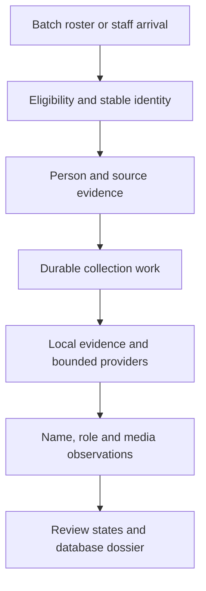
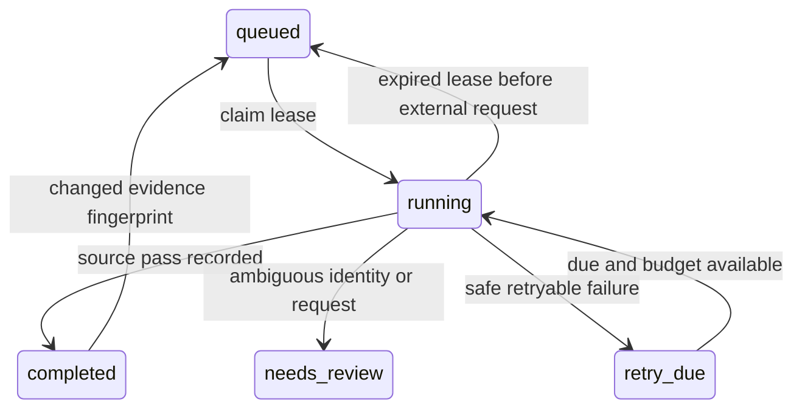
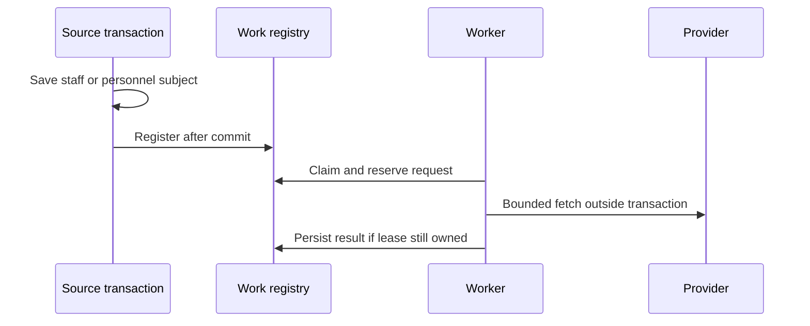

<!-- BEGIN OLLIJA DELIVERY GUIDE -->
## Ollija Delivery Guide

This block is generated guidance. Do not edit it directly. Correct durable facts in `.ollija/project.yaml` or this template, then rerun `ollija annotate-plan`. Current explicit owner instructions govern this task. Record exceptions below and reflect route changes in metadata; removed requirements must not return through another checklist.

### Resolved locations

- Authoritative host: `fuchitalee`
- Authoritative repository: `/Users/fuchitalee/development/pushin-weight-v2`
- Ollija release worktree area: `/Users/fuchitalee/development/pushin-weight-v2/.worktrees`
- Active worktree: `/Users/fuchitalee/development/pushin-weight-v2/.worktrees/feat/g1-staff-identity-library`
- Plan: `/Users/fuchitalee/development/pushin-weight-v2/.worktrees/feat/g1-staff-identity-library/docs/plans/2026-10-01-092148-feat-g1-staff-identity-library-plan.md`
- Change: `feat-g1-staff-identity-library-2026-10-01-092148`
- Branch: `feat/g1-staff-identity-library`
- Staging branch and blueprint: `staging`, `/Users/fuchitalee/development/pushin-weight-v2/.worktrees/feat/g1-staff-identity-library/render-staging.yaml`
- Production branch and blueprint: `main`, `/Users/fuchitalee/development/pushin-weight-v2/.worktrees/feat/g1-staff-identity-library/render.yaml`
- Staging URL: `https://pushinweight-staging-web.onrender.com`
- Production URL: `https://pushinweight-web.onrender.com`

### Placement

This worktree is inside the Ollija release worktree area. Reuse it for the whole change. Do not create a second worktree or plan for this branch.

### Delivery scope

- Workflow: `lfg`
- Delivery target: `on-request`
- Owner selection recorded: `false`
- Delivery route: `staged`

Target is not authorized until the owner selects it. Wait for a later explicit release request; do not commit, push, stage, or promote on this guide alone.

### Failure handling

- Complete applicable, unwaived checks for the selected route. A waived check is waived, never passed. Owner-selected direct production does not require staging.
- Product defects return to the parent implementation workflow; repeat only checks invalidated by the fix. Environment failures require repairing the environment, not a new source commit. Retry only after a relevant fact changes.
- SSH, shell, environment, or multi-machine failures use the repository infra/multi-machine skill first.
- The change ledger is advisory; do not validate or enforce it.
- Never force-remove a worktree. Retain staging-only, failed, dirty, locked,
  noncanonical, or candidate-mismatched worktrees for diagnosis or later
  delivery.
- Do not run an endless retry loop or start a persistent Ollija process.
<!-- END OLLIJA DELIVERY GUIDE --># G1 staff identities and images — initial batch and ongoing acquisition

## Plain-English Summary

The October 2 LFG continuation accepts the independent review repairs: keep
the existing tables, unify person matching, provide reviewed identity
corrections, reconcile job conclusions and make the dossier read its dedicated
records. U7–U11 below carry the remaining implementation work. Preserve the
completed U0–U6 foundation and prove the repaired paths with the saved DeepSeek
pilot before expanding collection. Product Contract unchanged.

Build one staff identity and image library with two ways of receiving work.
First, process the union of staff accounts in Call A and staff accounts already
in the database, including accounts outside Call A, plus staff publicly identified
on the official websites of the 15 China-based tracked brands. Second,
automatically process new staff added by the user or discovered through
personnel-change detection. A person can exist without an X account.
Both paths use the same evidence, matching, collection, and review rules.

The owner now selects **database and intake scaffolding first, DeepSeek as its
first end-to-end test, then the other Chinese brands**. Reuse the saved DeepSeek
research to test real persistence, matching, job history, media provenance and
dossier output before expanding collection. The installed research skill and
local dossier are inputs to this implementation, not a substitute for it.

Contributors and paper authors qualify as staff only through separate employment
evidence. Do not collect contributor-only people unless the owner specifically
requests them. The DeepSeek dossier now separates current/founder claims from
former or dated staff records; the report-credit archive is outside staff intake.

Keep sourced full names and optional given/family components for each name
representation. The owner selected `Person`, `PersonName` and separate
`PersonNameEvidence` records from the first implementation. Select the sourced
original/professional name as primary and research/store the established
English/Latin name during intake for English display. Preserve aliases and
uncertain candidates. Rename `sexs` to `sex`, preserving stored values.
Continue storing dated roles and their sources separately from personal identity.
Verify these schema changes with migration and reader checks before using them
in the staff import; these changes are planned, not implemented.

Keep each name's original evidence, source/capture reference, observation time,
collection method and review reason. Evidence must explain why the name belongs
to the person. Preserve multiple or conflicting observations and simple links
from converted/generated spellings to their originals; discovery through a
search provider does not make that provider the original publisher. Defer a
general provenance graph, automatic confidence scoring and separate review
workflows for every name component.

Save Chinese source wording immediately for names, roles, biographies and job
descriptions. English-facing person names are collected during intake, with
missing names tracked as gaps. Generate English or Japanese translations of
biographies, role descriptions and other prose when needed for display,
save them for reuse, and refresh them when the supporting source text changes.
Translations remain linked to their originals and never replace source evidence.

Start with information we already collected: current and historical profile
names, biographies, personal links, affiliation labels, and post metadata.
Use those leads to search for attributed photographs. The first public-web
passes found useful pictures, but the owner considers the acquisition approach
insufficient. A six-query Baidu test through SerpApi found five new photographs
in seven files for three named staff. The completed SearchApi comparison found
incorrect original-image mappings; the owner selected SerpApi as the more
reliable route for this workflow. The October 1 local pass expanded the current
40-person dossier to 75 distinct photographs covering 36 people, with 17 Chinese
names, eight published Chinese renderings, and 15 unresolved Chinese forms.
This covers the current list, not yet database-only staff or ongoing intake.
Phyllo's Xiaohongshu search access remains unconfirmed, with the
owner awaiting its reply. A subsequent Parse.bot documentation check confirms
known-post media lookup but no keyword search. The owner now requests broader
SerpApi image/video collection, with the filtering method explained first,
and explicitly limits Baidu searches to Chinese people in the existing list.
This source choice does not remove other staff from the overall G1 requirement.
Direct Baidu Cloud registration remains retired; Xiaohongshu/OpenCLI and
Yuanbao remain deferred.

Save progress so a batch can resume and newly discovered people can enter the
same process later. Asset searches run separately from account creation and
news collection. Verification must demonstrate both full batch accounting and
automatic handling of new arrivals. Photo quality, storage, reuse criteria, and
operating budgets still need concrete settings before automated production
collection. Local research and the dossier prototype have run; the production
acquisition process and its activation have not started.

## Execution record — October 1 scaffolding pilot

- Independent G1 implementation is in `feat/g1-staff-identity-library`, based on
  `f4d994f9d30f92e534968c28abcebd910daf4e21`. G2–G4 remain outside this change.
- U0–U5 and U6 operating commands/runbook are implemented. Production activation,
  paid requests and expansion beyond the saved DeepSeek pilot have not run.
- Migrations 0059–0061 add names/evidence, preserving `sex` rename, versioned
  originals/translations, source/media/work/request storage and database guards.
  Legacy name fields remain; `Person` has 15 physical columns during transition.
- The owner added Tianyi Cui / @tianyi during implementation. His supplied profile
  establishes a current self-reported Harness Team role; Beijing remains profile
  location and March 2007 remains X account creation, not a job start date.
  The pilot now includes 24 people: 17 founder/current claims and seven history
  records. Four contributor-only observations remain excluded. Tianyi's Chinese
  name and portrait remain unresolved; no paid search was made for this addition.
- Saved-evidence preview, import and repeat import ran on isolated local
  PostgreSQL. Repeat import preserves counts and source evidence. The database
  export has 11 current portrait gaps and no unavailable stored image objects.
  Receipt: root `.context/g1-lfg-20261001/pilot-verification.json`.
- 111 focused PostgreSQL tests passed with zero skips/errors, covering migration,
  name rules, shared intake, storage, request/lease handling, real personnel and
  profile writers, onboarding, read contracts, dossier and explicit activation.
- Browser checks exercised current/history/name filters and decoded all 35
  referenced image attributions; mobile Tianyi view has no horizontal overflow.
  Final desktop/mobile checks passed, with no browser errors; the current-staff
  PDF includes Tianyi. Implementation and recovery fixes are in
  [PR #49](https://github.com/allenwlee/pushin-weight-v2/pull/49). The authoritative
  root General Launch Index carries the final delivery/CI session outcome.
- Owner-requested populated-field export delivered to
  `/Users/allenwlee/Downloads/agents/2026-10-01-195517-deepseek-24-populated-fields-and-assets.html`.
  A read-only snapshot of `g1_staff_library_20261001` exported all 24 people,
  329 related database rows and 3,659 non-null `table.column` values, with all
  35 saved image files embedded unchanged. Direct SQL comparisons, embedded
  byte hashes and browser image decoding passed; the destination SHA-256
  matches the source. Chenggang Zhao, Shengding Hu, Tianyi Cui and Yu Wu have
  no linked saved asset, explicitly shown in the export. Evidence and the
  delivery receipt are in root `.context/g1-lfg-20261001/exports/`.
- October 2: at the owner's request, saved mainland staff-data and founder
  travel-risk research in the authoritative root at
  `docs/china_compliance/2026-10-02-051235-mainland-china-staff-data-and-travel-risk.md`.
  The report preserves nine official sources, applicability limits, project
  assessments and questions for legal review. At the owner's follow-up request,
  added Chinese customers/employment, beneficial purpose, individual rights and
  overseas data flows, plus the public-document Dinq comparison at
  `docs/china_compliance/2026-10-02-052419-dinq-compliance-comparison.md`.
  Published vendor claims are distinguished from tested controls and legal
  clearance. Recommendations remain proposals; this documentation/research
  request does not change collection authority, the PR CI choice or production
  activation.
- October 2 follow-up: saved the SerpApi/Baidu Chinese-law assessment in the
  authoritative root at
  `docs/china_compliance/2026-10-02-053159-serpapi-baidu-chinese-law.md`.
  Verified the U.S.-only Legal Shield scope, provider retention statements and
  relevant Chinese rules; distinguished searches from our separate publisher
  fetches/downloads and attribution from image-use permission. Historic Free
  Plan evidence is not a current account check. No paid query, account setting,
  collection permission or release decision changed.
- October 2 database explanation: selective fingerprint use does not change
  ordinary IDs or foreign-key links. Existing translation, synthesis and trend
  models already contain fingerprints. G1 name uniqueness is scoped to
  `(person_id, fingerprint)`; `record_name()` reuses an exact representation
  while keeping source observations separately. The hash includes full text,
  language, type, origin and derivation; it does not normalize spelling or
  establish that two people are the same. Current intake/arrival writers share
  the helper; the historical-field backfill has its own migration recipe.
  Reviewed models, writers, migration and existing test cases without changing
  application code or the database. No database-wide fingerprint migration is
  needed solely for consistency; later changes to name equality need deliberate
  normalization and migration review.
- October 2 table-purpose review: confirmed `people_brand_affiliations` exists
  on main and was created by `0032_stage1c_people_jobs_events` before G1.
  Affiliation evidence supports specific claims; `people_texts` stores typed,
  language-tagged original prose versions for separately cached translations.
  The saved pilot export records 37 texts and zero translations, and the current
  dossier does not consume the prose translation helper. Some role excerpts are
  intentionally repeated in evidence and text records. `staff_intakes` retains
  submitted bundles, eligibility and source-to-person mapping, including
  noneligible/unresolved inputs without a person; its saved prototype payload
  still supplies some dossier presentation fields. `staff_collection_work` is a
  persistent person/context/policy task whose attempts update the same row,
  not one immutable row per execution. Provider-request records carry `run_id`;
  there is no separate staff-run model. This was source/receipt inspection only,
  not a schema simplification, fresh production check or new test run.
- October 2 owner-authorized compliance publication completed by the resumed
  delegate after a server restart: only the four `docs/china_compliance/`
  files were committed and pushed directly to main as
  [f4159057](https://github.com/allenwlee/pushin-weight-v2/commit/f41590574b12c0ec5301ffb575d2de1394bf79cf),
  with `[skip render]`. Five references to unpublished local evidence became
  labeled code paths; legal findings were preserved and repaired copies were
  synchronized to the root. Delegate checked ten portable links/anchors and
  whitespace; parent independently verified remote main, four-file commit
  scope and byte equality with the root. The G1 implementation PR and its
  separate pending CI decision were not part of this documentation push.
- October 2 table-routing/enforcement audit: the curated manifest importer
  routes names, claims/evidence, prose and media through shared helpers.
  Name-selection triggers and queue/media constraints provide real database
  safeguards, but text kinds/nonempty originals, intake eligibility, provider
  budgets and completion meaning rely partly on Python. Intake/text rows have
  no database append-only guard; direct writes can bypass helper conventions.
  Database privileges were not audited. The shared Chinese-worker skill's
  project reference remains a dated research-stage snapshot without a direct
  link to the implemented operations guide. These are findings/proposed
  hardening, not new accepted implementation scope or release gates.
  Existing profile/personnel writers can create people and pending claims
  directly: staff_intakes is not a universal pre-person gate. Generic rejected
  or identity-conflicting imports also are not automatically retained there.
- October 2 owner-requested HTML textbook example authored under the root
  `.context/g1-lfg-20261001/staff-table-walkthrough/` as
  `2026-10-02-104202-staff-tables-worked-example.html`. A clearly fictional
  Yuchen Zhao scenario explains 21 tables across 12 chapters and 13 diagrams:
  harvested observations, a personless intake, sourced identity/names, job
  claims/evidence, prose/translation versions, collection work/provider
  reservations, image attribution/storage/review, profile changes and
  alternative staff/list arrivals. Separates implemented behavior, manual
  research and incomplete integration, including the text/dossier and claim
  reconciliation gaps. Browser/schema checks matched all 141 illustrated
  columns, 65 internal links, three viewports and zero external asset requests
  or JavaScript errors; desktop/mobile and print-cover visuals inspected.
  Source snapshot is `aeba0a8876ffccb441068c69b1a744dfd3a05a14`.
  No live research, import, translation, application change or database write.
  Requested delivery is the single HTML file in allenwlee Downloads/agents;
  initial SSH reachability passed but the transfer later timed out. Preserve
  the local artifact and verify destination bytes before claiming delivery.
  At 10:58 JST, Tailscale still reported allenwlee offline, last seen at
  10:50 JST; SCP exited 255 and no destination hash was obtained. fuchitalee
  network/socket health checks passed. Asked the owner whether the MacBook
  is awake/connected; answer pending. Delivery receipt records
  `pending_host_offline`; next step is a bounded SCP and source/destination
  SHA-256 comparison once reachable. HTML SHA-256 is
  `d98ce6613480d1c448e10a135347c0b8565657545fddb98357557b81dffcfe7f`.
- October 2, 16:19 JST: owner requested browser display after the MacBook
  reconnected. Copied the unchanged walkthrough to
  `/Users/allenwlee/Downloads/agents/2026-10-02-104202-staff-tables-worked-example.html`;
  source and destination SHA-256 match. Opened it in Chrome window 919890309
  and verified the front window's title and exact file URL after a targeted
  Accessibility raise. Receipt now records delivered/displayed; prior offline
  attempt remains in its history. Document content and application are unchanged.
- October 2 design-reference clarification: the saved CJK research cites W3C,
  Unicode CLDR, ORCID and Korean naming guidance; separate name evidence follows
  this repository's existing affiliation/evidence precedent. Top-gun supplied
  evidence-first enrichment, bounded cost and recovery patterns. Dinq was
  reviewed later for compliance, after the scaffold; no earlier systematic
  marketing/contact-enrichment vendor schema benchmark is documented here.
  A new bounded check of People Data Labs' public
  [build process](https://docs.peopledatalabs.com/docs/data-build),
  [person schema](https://docs.peopledatalabs.com/docs/fields) and
  [enrichment API](https://docs.peopledatalabs.com/docs/person-enrichment-api)
  supports the owner's comparison to professional-data enrichment: combine
  multiple sources, resolve duplicate identities cautiously and associate names,
  employment and social profiles with a person. This is a comparison of public
  concepts/interfaces, not evidence of their private SQL layout or a retroactive
  source for our implementation. No new adoption or schema decision was made.
- October 2: owner requests an independent review of the people/affiliation
  schema and a clear place to point another agent. Created the immutable
  ce-handoff brief at machine-local temporary path
  `/tmp/compound-engineering-501/ce-handoff/pushin-weight-v2-aff2eb3769a9/2026-10-02-174714-g1-people-schema-independent-review.md`.
  It pins feature HEAD/base, separates functional requirements from the author's
  design choices, maps every creation path and actual consumer, identifies
  historical verification limits, and proposes architecture/data-integrity
  questions and evidence-backed output. Author observations are explicitly
  distinguished from independent findings; the reviewer can challenge table
  necessity. No reviewer was launched and no schema change was made. This
  handoff is OS-managed temporary storage; receiving agents need fuchitalee
  filesystem access or a supplied copy, plus the pinned code.
- October 2 independent-review response: read the owner-supplied
  [complexity review](../../../../../docs/reviews/2026-10-02-194536-g1-people-schema-complexity-review.md)
  and checked its material findings against unchanged feature source at
  `aeba0a8876ffccb441068c69b1a744dfd3a05a14`. Agree with retaining the
  person/account/claim/evidence/name/media/work separations. This assessment
  records proposed repairs; it does not treat the supplied review as owner
  acceptance of every recommendation or change the selected product scope.
  The source confirms different identity recipes and reuse of pending account
  links in the intake, profile and personnel writers. Existing-link reuse
  prevents some duplicates, so three UUID recipes do not prove three live rows
  for an account. However, site-first and later account discovery can create
  separate people, and a later combined intake refuses the conflicting links.
  Recommend one shared resolver, confirmed evidence for cross-source linking,
  preservation of existing person IDs, and explicit review of ambiguity.
  Repeated observations of the same provisional source must remain repeatable;
  simply rejecting every pending link would break ordinary repeat intake.
  An account identity must not replace the human identity: one person can have
  several accounts or none.
- The review correctly identifies the missing operator correction path. No
  person merge/split implementation was found in the inspected application.
  A correction must retain the original evidence, record actor/reason and
  preserve account uniqueness, name derivations and media attribution. Name
  immutability guards mean this requires a designed correction operation,
  not a bulk foreign-key update. A merge alone does not provide a split or
  undo operation. Test source-first/account-first discovery, conflicting
  pending links, retries and correction of mistaken joins before expansion.
- The job-history defect is visible in source: status/title/date changes make
  separate claims, while the dossier classifies a person as current if any
  non-rejected claim is current. Recommend an explicit reviewed conclusion
  with retained prior claims. Recency alone must not decide truth; preserve
  simultaneous roles, employer returns, unknown dates and conflicts. A single
  row per person/company is too coarse. Verify departure, promotion and
  concurrent-role behavior in the dossier and collection population together.
- The dossier still gets audited Chinese/English title fields from intake
  JSON, and does not read `people_texts` or translations. Move presentation to
  selected affiliation/name/text records while retaining the intake journal.
  Role prose must identify the affiliation/source version it describes; the
  existing person-level text link alone does not resolve multiple jobs.
  Protect original intake payload/text versions without blocking reviewed
  identity corrections. Also resolve the confirmed `PersonName` choices versus
  database-check mismatch for `needs_review`, and define one-way compatibility
  updates for legacy display-name fields; `select_names` currently updates
  selected-name references only. Small migrations/constraints may be needed;
  the report's phrase "writer and reader fixes" is not a promise of zero
  schema changes.
- Do not adopt the review's blanket instruction to leave department empty.
  G1-R10 and this plan require preserving sourced team/department wording.
  Existing optional demographic/taxonomy fields do not create a requirement
  to collect or infer them. The People Data Labs comparison establishes no
  private backend design, and keeping provenance does not inherently require
  SQL rather than JSON; retaining the present separations is a project-specific
  judgment. `staff_media_objects` stores metadata/storage references, with
  bytes in media storage. Collection completion currently measures qualifying
  portrait coverage, not completed name research. No tests were rerun, pilot
  or production rows inspected, application edits made, or new external
  research performed for this response. Historical 111-test evidence remains
  scoped to its earlier checks and does not verify these proposed repairs.
- Review reproduced and fixed two recovery defects: a later account-only intake
  hid saved dossier detail, and reimport did not restore missing stored bytes.
  Three regression checks failed before the fixes and passed afterward. Scoped
  Ruff and whitespace checks pass. Full-repository Ruff remains non-green with
  1,656 findings across the existing repository; it is not claimed as passed.
  Local review lenses and validation ran sequentially under the user AGENTS
  mapping. The Claude cross-model attempt returned HTTP 402 insufficient balance,
  so the adversarial lens ran locally with no independent-model corroboration.
  Review receipt: `/tmp/compound-engineering-501/ce-code-review/20261001-191014-g1-library/review.json`.
- The operating runbook includes before/after SQL checks and coordinated-release
  and rollback instructions for the physical `sexs` to `sex` rename. No production
  migration or collection activation ran.
- Video sources are retained as attributed page references in this scaffolding;
  video streams are not downloaded. Image bytes are validated and stored.

## Goal Capsule

- Objective: operators can retain, correct and reuse sourced staff dossiers,
  and both existing staff and newly discovered people enter the same durable
  collection process.
- Means: the selected person/name/evidence design, existing affiliation records,
  reviewed media and an independent database-backed worker (KTD1–KTD6).
- Authority: current owner instructions and G1-R01–G1-R15 govern the product.
  The October 1 LFG request authorizes an independent G1 implementation and
  reviewed pull request. G2–G4 are consumers, not implementation prerequisites.
- Completion for this code delivery: U0–U5 and U6's operating configuration and
  runbook are implemented and verified with saved DeepSeek evidence and an
  isolated PostgreSQL database; the pull request has decided CI. Actual production
  activation and full-population coverage remain separately observed outcomes.
- Stop only for an unavailable material prerequisite or evidence that an agreed
  requirement cannot work. Routine implementation choices belong to the executor.

## Product Contract

Product Contract unchanged. The original G1 plan is carried into this isolated
implementation checkout; its research and owner decisions below are retained.

### Requirements

The linked General Launch Charter's G1-R01–G1-R15 remains the requirements
authority. The two deliverables, staff eligibility, source evidence, original
and English name policy, portrait requirement and DeepSeek-first sequence all
remain in scope. A passing software pilot does not establish complete staff or
portrait coverage, and does not make G1 data part of G4's public API.

### Owner contract and working scope

- Session: `g1-chinese-faces-20260930`; starting revision:
  `33f20b971b01dbb8d90939f975e5dbbd987a3d86`.
- Shared requirements: [General Launch Charter](../brainstorms/2026-09-30-104924-general-launch-charter.md), G1-R01–G1-R15.
- Owner clarification on 2026-09-30: deliver **both** initial batch acquisition
  and an ongoing process for user-added and personnel-discovered staff accounts.
  Completing the initial collection alone does not complete G1.
- “In Call A and in our DB” means a union, with overlap counted once. Do not
  require database staff to also be Call A members, have collected posts, or
  belong to an enabled harvest brand.
- The population is staff, not a nationality filter. Verify Chinese names where
  applicable; do not infer nationality or invent characters from an alias or
  romanized name. Organization accounts are not individual researchers.
- Latest Call A inclusion rule: presume every current list account except
  official company/product accounts is a person. A missing database staff role
  or uncertain identity must not remove that person from the dossier or intake.
- October 1 owner direction adds official-site staff discovery for the 15
  China-based tracked brands, including staff without X accounts. Reuse existing
  people and account links before creating a person; never create placeholder
  accounts. The owner now authorizes proceeding with the selected database/intake
  scaffolding, using DeepSeek to test it before other Chinese brands. The requested
  short plan summary precedes implementation; the earlier planning-only instruction
  for these schema changes is superseded by this execution direction.
- Existing identity review and affiliation review remain separate from asset
  collection. A personnel claim or a downloaded avatar is not verification.
- Proposed production implementation below is not deployed behavior. Completed
  local collection is documented separately; it does not change production data
  or select delivery.

## Owner-selected October 1 scope: people schema and official-site staff

### Next implementation milestone — scaffolding, then DeepSeek

Implement the shared schema and intake foundation before a wider staff crawl:
reuse accountless `Person` identities and existing work-history/evidence models;
add `PersonName` and `PersonNameEvidence`, selected primary/English name links,
optional name components and the preserving `sex` rename; persist original-language
fields and translation provenance, media/source records and resumable collection
work. Both batch and new-person paths use this foundation.

Use the saved eligible DeepSeek people and media as the first integration input:
16 founder/current claims, with seven former/dated staff records kept distinct.
Reconcile database matches before insertion. The four profiles without established
staff eligibility and 591 report credits stay outside staff intake. Test repeat
imports, accountless people, evidence preservation, role history, media storage,
verification gaps and database-backed dossier output. Exercise user-added and
personnel-discovered arrivals through the same intake, with failures and retries
that preserve source records and do not repeat unchanged paid searches.

Apply U0–U5 below to this bounded DeepSeek milestone first. Verify migrations and
the import path against a test database before applying them to an intended live
environment. Validate the pilot before expanding to the other 14 selected Chinese
brands and the broader Call A/database staff union. The latest request authorizes
implementation; it does not itself select a production release or activate a new
paid recurring schedule. Existing delivery metadata remains unchanged.

### DeepSeek collection test — source-audited local dossier delivered

**Owner correction, October 1:** redo the dossier with separate romanized-name,
Chinese-name, Chinese-job-title and English-job-title fields, each with its own
source. Distinguish quoted source wording from translations and inferred research
areas; show whether the title is verified, self-reported, reported or unknown.
Every image needs a concise identity-evidence explanation. Show actual Chinese-web
search attempts, queries and outcomes; an unperformed search must never read as
“searched and found nothing.” Deli Chen had no query in the initial 22 Baidu calls.
The owner also requires at least one fully source-verified individual portrait per
person; a confirmed personal X account or official company biography qualifies.
Nonhuman avatars and unattributed group shots do not satisfy portrait coverage.
Whether named personal-site portraits also qualify was asked as an optional
preference. They are currently included under an explicitly disclosed working
assumption, not an owner-approved decision. “100% verified source” describes
publication provenance, not measured biometric confidence. The requested
facial-identification reference database is excluded without the subjects'
consent; continue only the ordinary biographical/source-audit work in this scope.

The local correction touches the existing dossier, saved evidence and G1 notes;
preserves all prior people and image bytes; and does not extend into production
imports or publication. Bounded follow-up: 45 minutes, at most 18 SerpApi calls,
60 Firecrawl credits and 35 downloads; one search and two scrapes concurrently,
no automatic paid retries. Acceptance is the owner's four-field layout, per-image
verification reasons, accurate per-person search history and explicit portrait
gaps, plus real-browser desktop/mobile, filter, image and print checks. The initial
browser reproduces all three missing elements on Deli's profile. Homepage-only
Bridgewright gates and Django locale migrations do not apply to this local HTML.

The [October 1 test report](../analysis/2026-10-01-122327-g1-deepseek-team-test.md)
records the initial pass and source-audit follow-up: all 591 selected-report
entries (586 name strings, five repeated names kept separate, nine departed
markers), 27 individual profiles, photographs for 21 and close/upper-body
portraits for 13. Seven have a clear primary-source portrait under the personal-
website assumption above; 20 lack one. The follow-up adds four distinct photos
in six files, preserving all previous records and image bytes. The complete
collection is 66 dossiers and 145 image files. All 126 business/compliance
credits remain, even without individual job titles or photographs. Most report
entries have not had individual research; this is not a complete current team.

The initial pass used 22 SerpApi calls / 1,093 page-result entries, 104 observed
Firecrawl credits and 33 downloads. The follow-up used 18 calls / 888 page-result
entries, 19 observed Firecrawl credits and 14 download attempts. No automatic
paid retries. Deli's two new Chinese queries found a named QbitAI conference
portrait; the dossier now explicitly says the initial pass had not searched him.
It also records successful, empty, incomplete and access-failed source reviews.

All 145 local images decode and load; the prior 139 files have unchanged hashes.
Four sourced fields, per-image reasons, filters, desktop/mobile and the full
47-page PDF passed. At 14:37 JST, allenwlee Chrome's existing DeepSeek tab was
refreshed and its active tab/title/URL confirmed; the six added images also
passed HTTP/hash checks from that laptop. Evidence is in
`.context/g1-deepseek-dossier-clarity-20261001/`. No production import, migration,
runtime deployment or face matching was implemented.

The separate owner-requested human schema/reference rewrite was pushed to main
as `f4d994f9d30f92e534968c28abcebd910daf4e21` and its three owned files copied
back to the authoritative root after baseline checks. This does not deliver G1
schema or collection implementation.

The owner requests a DeepSeek team test and an update to the existing dossier,
prioritizing **founders → researchers → C-suite → other staff**. Headshots are
critical. Attempt comprehensive public-source coverage; do not assume the
company publishes a complete employee directory. Under the later G1-R12 owner
correction, official research credits are not a staff-discovery population or
collection queue. Collect contributors only when specifically requested, unless
separate employment evidence already establishes staff eligibility. Distinguish
current claims, former roles and dated staff evidence with unknown current status.
Retain historical contributor evidence outside the active staff collection.

Use official company/research pages first, then attributable personal,
university, conference and Chinese reporting sources for identity and portraits.
Preserve Chinese originals and source dates. Reuse existing people/assets,
including 罗福莉's already documented former DeepSeek role, without duplicating
her dossier. Do not invent names, handles, executive titles, joining dates or
nationality; no face recognition. A portrait needs source attribution to the
named person. Download usable images locally, verify decoding, and keep missing
headshots visible. A logo, nonhuman avatar or unlabeled group image does not
resolve a headshot gap.

Freeze this test to one collection pass with ceilings of 150 Firecrawl credits,
40 SerpApi Baidu queries (up to 50 results each, no automatic paid retries),
150 image-download attempts and 60 minutes. These are ceilings, not quotas.
Save evidence, result counts, source exclusions and unresolved candidates in
`.context/g1-deepseek-test-20261001/`; Firecrawl responses stay in `.firecrawl/`.
Reuse source results. Limits leave remaining work visible in the dossier.

TOUCH: the existing ignored HTML/JS/data and saved images, plus a DeepSeek
coverage view ordered by the selected priorities. PRESERVE: all 40 prior
dossiers, 75 photographs/83 files, 33 X account images, evidence, photo viewing,
search and printing. This test authorizes research and local dossier/browser
output; the production staff import and schema implementation remain pending.
Acceptance: account for every eligible staff record, show source/role/date and
portrait status, verify all displayed images in the browser, check desktop and
mobile, and refresh the existing allenwlee Chrome dossier tab. Do not claim the
entire current team is known without an authoritative roster.

### Process capture for a future collect-chinese-workers skill

The owner now requests documentation of every process used to research and
access these people, to support a later `collect-chinese-workers` skill. Capture
the executed roster/metadata/name/source/media/dossier procedures, exact request
parameters and local entry points, failed routes and corrections, cost units,
source-verification criteria, evidence locations and limits. Keep the dated
execution record in `docs/analysis/2026-10-01-144511-collect-chinese-workers-process-capture.md`,
with a machine-readable inventory of its local evidence and scripts. Distinguish
tested methods from documentation-only candidates and planned database/ongoing
intake. That completed documentation pass installed no skill and launched no
new provider calls or database writes. The subsequent installation is below.

**Captured:** [process record](../analysis/2026-10-01-144511-collect-chinese-workers-process-capture.md)
and [inventory](../analysis/2026-10-01-144511-collect-chinese-workers-process-inventory.json).
The record covers roster reconciliation, historical metadata, multilingual
identity/role evidence, every tested or investigated provider route, source and
media review, DeepSeek report parsing, dossier construction, browser/print
delivery, failures, measured costs and the changes needed before skill extraction.
The inventory fingerprints 107 existing files, including 39 historical local
entry points. Raw credentials, private captures and media bytes were not copied
into the documentation. Source paths and inventory hashes were checked locally;
no new collection was necessary.

### User-level skill and contributor-scope correction

The owner subsequently requested installation of `collect-chinese-workers` for
all local agents, with easy explicit invocation and automatic discovery. The
canonical skill is `~/.agents/skills/collect-chinese-workers/SKILL.md`, supported
by four references for identities, Chinese-source access, media/dossiers and
PushinWeight-specific context. Codex, Gemini and OpenClaw discover the shared
`.agents/skills` root; Claude and Cursor have symlinks to this copy. Home
`AGENTS.md`/`CLAUDE.md`, Codex `AGENTS.md`, Claude
`CLAUDE.md` and Gemini `GEMINI.md` carry matching discovery instructions.
Automatic invocation is enabled; already-running clients may need a new session
or skill reload. No provider, production database or scheduler was activated.

G1-R12 is enforced in the skill and local dossier. Saved evidence yields 16
founder/current staff claims (14 self-reports, the sourced founder, one reported
CFO appointment), seven former/dated staff records (four former, three explicit
January 2025 staff reports), and four profiles whose staff eligibility remains
unestablished. Those four are excluded from active staff enrichment; this is not
a finding that they are nonemployees. All 66 saved profiles and image records
remain preserved. The original 40-person X-list view is unchanged in membership.
The 591 report-credit entries are historical evidence only, with no collection
eligibility; they no longer render in the staff dossier or printable default.

Evidence and installation backups are in
`.context/g1-chinese-workers-skill-20261001/`, including `installation.json`,
`staff-eligibility.json` and the bounded local data correction script. The three
dated staff decisions retain Chinese excerpts from the cached PKU article;
current claims point to the separately sourced personal/appointment evidence.
Historical test metrics below describe their original runs, not the corrected
staff denominator. This task's endpoint is the local skill and dossier correction;
the broader initial batch, production import and ongoing intake remain unfinished.

Local checks passed: the skill frontmatter/metadata validator; canonical discovery
and symlink resolution; Gemini and OpenClaw enabled-skill listings; browser counts
of 16 current/founder, seven history, 40 original-list and 62 combined profiles;
contributor exclusion, role/portrait filters and mobile width; all 145 saved image
URLs and decoded files; and a regenerated 27-page PDF containing the 16 default
profiles and no contributor register. All 66 saved profiles' photograph and
account-image records are unchanged. The PDF is a local review artifact. The
verification receipts and desktop/mobile screenshots are in the run directory. The
existing allenwlee Chrome DeepSeek tab was refreshed and its corrected title,
revision URL and active-tab state were confirmed from that machine.

### Selected name and sex fields

The owner selected optional given/family components, the preserving
`sexs` → `sex` correction, researched English names at intake, and the
three-table name/provenance design from the first implementation (G1-R15).
The [CJK storage research](../research/2026-10-01-173059-g1-cjk-person-name-storage.md)
describes related name representations instead of the earlier six flat component
columns. The related-table placement supersedes that earlier proposal; the
requirement to preserve full names and optional components remains. The design
is selected and implementation is pending. The exact column lists below are the
working schema proposal, to be finalized during scaffold implementation.

| Model | Proposed name-storage contract |
| --- | --- |
| `Person` | Two name-selection links: `primary_name_id` and `english_name_id`. Target 11 total columns after replacing four flat names; 15 temporarily while legacy fields remain. |
| `PersonName` | 14 columns for IDs, full/optional given/family names, language/script tag, type, order, preference, origin, review, derivation and timestamps. |
| `PersonNameEvidence` | Eight columns for source references, source text, supported fields and observation/storage times. |

**Owner-selected provenance design (October 1):** retain the three-table
structure and a lightweight derivation link from the first implementation.
The owner accepted the reassessment and requested its addition to this plan;
the intervening suggestion to defer separate name evidence is superseded.
Saved 李元 owner/public corroboration, the
unconfirmed 张一凡 candidate and the 劉洺堉 → 刘洺堉 conversion show present needs.
Preserve source observations with original excerpts, source URLs or durable
capture references, observation times, collection methods/run references,
review decisions and reasons, and the evidence connecting each spelling to the
person. Keep multiple and conflicting observations. Separate the source
publisher from the discovery provider. Defer a general provenance graph,
automatic confidence scoring and elaborate component-level review workflows.
The counts above remain the working proposal; finalize evidence/review fields
against the saved DeepSeek intake during implementation. This is not an
additional approval gate. No models, migrations or live data changed in this
plan update.

Collect the established English/Latin professional form during intake alongside
the original-script form. Select the original/professional name as primary,
usually local script when known, and the separately stored English-facing name
for English pages. Unknown originals use the best established public fallback;
unknown English spellings remain visible gaps. A generated romanization is a
candidate, not verified source wording. Name identity remains the person UUID.

Preserve all existing `display_name`, `display_name_en`, `display_name_zh_cn`
and `display_name_ja` values through staged backfill and reader/writer migration;
the existing four display keys may remain API outputs. Retire the four old
database columns only after preservation and compatibility checks. Complete
column lists and selection rules are in the research note.

Only a usable full name is required input; components remain optional. Populate
components from established evidence, not a first-character or first/last-token
split. For the owner's 李元 example, the Chinese representation has
`family_name=李` and `given_name=元`; preserve the full 李元.
Preserve sourced aliases and alternate spellings linked to the same person;
an English alias need not be a romanization of the Chinese given name. Names
alone never establish identity or authorize merging two people.

Use a data-preserving `RenameField` migration for `sexs` rather than dropping
and recreating the column. The owner's October 1 instruction supersedes the
earlier owner-selected spelling documented in the model/test. Leave applied
migration `0032_stage1c_people_jobs_events.py` intact. Update
`core/intelligence_readers.py` (currently returning `person.sexs`), all current
callers, `tests/test_stage1c_intelligence_schema.py`, and
`tests/test_intelligence_readers.py` together. Revise/version the frozen reader
contract in `tests/fixtures/stage1c_intelligence_read_contract_v1.json` and its
references in `docs/analysis/2026-09-10-203138-stage1c-contracts.md` deliberately;
do not leave a fixture or consumer expecting the old key. Expose the optional
name components and representation/source status in the same documented read contract.

Migration acceptance must prove that existing person IDs, names, populated and
null sex values, account links, affiliations, and evidence survive unchanged;
new components default to null. Verify an accountless person and multilingual
names through the reader, preserve full-name search/display, and leave uncertain
components empty. These are implementation checks, not tests run for this
documentation update. The live schema receipt
`.context/g1-people-columns-20261001.json` confirms the pre-change 13 columns.

### Official-site staff discovery and matching

The owner requests as many publicly named staff as the official websites allow,
not a fixed leadership sample. The 15-brand scope is `minimax`, `qwen`,
`deepseek`, `glm`, `mimo`, `moonshot_kimi`, `inclusionai`, `stepfun`, `ernie`,
`hunyuan`, `doubao`, `yi`, `sensechat`, `kuaishou`, and `dots`. The earlier
22-brand assumption was checked against deployed configuration: 21 are enabled,
of which these 15 are China-based. Scope evidence is saved in
`.context/g1-brand-hq-20261001.json`. These brands add a website-discovery source;
they do not exclude other staff already within Call A/database scope.

Before implementing collection, use the existing
[official jobs sync instructions](../deploy/render.md#official-ai-lab-jobs-sync)
and inspect `core/job_sources/{registry,http,adapters,runner,sync}.py` plus
`core/management/commands/sync_job_sources.py`. The current registry covers
Qwen, DeepSeek, MiniMax, Zhipu and Kimi; its recruiting parsers do not constitute
a staff directory. Reuse its HTTPS/host and redirect validation, bounded
timeouts/retries/response sizes, isolated source failures, and fixture-backed
parsing where applicable. Define appropriate official staff-page sources for
all 15 brands. Do not run job ingestion as a staff importer or change its cron.
Record inaccessible pages and avoid bypassing logins/challenges.

Collect named staff from official team, leadership, researcher/profile, and
relevant announcement pages with source URLs, quoted supporting text, observed
time, exact organization/role wording, and any attributable images. Preserve
current/former/uncertain status; an old announcement is not evidence of current
employment. Use verified brand/company mappings: the saved MiMo mapping includes
an erroneous Meituan edge alongside Xiaomi, so do not expand that crawl to
Meituan from the database edge alone. Parent-company employment does not by
itself establish a product-team role.

For each candidate, first match existing `Person` records, evidence, and real
`PersonAccount` links using corroborated identity and organization information.
Reuse an existing person where established. If an actual account exists without
a person, resolve/create the person and link that account; no synthetic account
or handle is needed. An accountless person is a valid record, not automatically
an unresolved identity. Keep ambiguous possible duplicates visible for review
rather than merging by name. Record each candidate as reused, new, unresolved,
or excluded with a reason, retaining source coverage and repeat-import identity.

### Existing job-history and role contract

`people_brand_affiliations` holds multiple relationship claims per person. It
stores the brand (or unresolved organization candidate), original organization
name, affiliation type, raw/normalized title, department/team/function/seniority,
employment type, current/former/future/unknown status, start/end dates with
precision, work location, description, confidence, and review state. It links
to a brand, not directly to a company; company context follows brand-company
edges and must preserve the source's actual organization wording.

`people_brand_affiliation_evidence` attaches source URLs, posts or profile
snapshots, supporting text, observation time, extraction details, and review
state. `observed_at` means when we saw the evidence; it is never a substitute
for a joining/leaving date. A source that supplies only a year retains year
precision, and absent dates stay null/unknown.

Keep earlier role evidence when later roles or employers appear. The current
extraction paths can retain separate claims about the same role with different
dates, wording, or status; they do not guarantee an automatically reconciled
one-row-per-job resume. `person_intelligence()` exposes every type under
`affiliations`, but `employment_history` includes only `employment`: founder,
advisor, board member and other types remain separate. The staff importer must
reuse this evidence model and retain conflicts/review state. No job-history
schema redesign is selected by this planning update.

### Chinese originals and translations on demand

The owner selected the first translation option on October 1: preserve Chinese
originals immediately, then translate staff roles, biographies and job
descriptions into English or Japanese when needed for display. Collection does
not depend on completing translation. This is a selected requirement; the
translation path and extra source-language storage still need implementation.
The later G1-R14 correction removes English-facing person names from this
on-demand path: establish and persist them during intake, or record a name gap.

- Preserve the source's exact name, organization, title, team/department,
  location, biography/description, and supporting passage, together with its
  URL, observation time, and source version/hash. Preserve the original Chinese
  spelling; date parsing, cleaned HTML-to-text, and standardized role values
  must retain their relationship to the captured source. Do not turn translated
  or generated prose into original evidence.
- Set source language from the actual source. Chinese-language mainland pages
  normally supply `zh-CN`; English or mixed-language content remains correctly
  identified. Company location and page language do not establish a person's
  nationality or `primary_language`.
- Keep `title_raw` and `observed_organization_name` in the source wording.
  `title_normalized` describes role standardization; it is not an implicit
  English translation slot. The related-name recommendation above retains full
  names, optional components and language/script variants. Published English
  names, romanizations and generated renderings must remain distinguishable.
- Request only the display language needed, deriving EN and JA independently
  from the original source. Save the translated fields with language, exact
  source version/hash, and translation provenance/status. Reuse a completed
  translation for the same version/language; duplicate requests share work.
  A changed source makes the old translation stale. Do not present a translation
  of old wording as current, and never replace the original with it.
- While a translation is missing or has failed, retain the collected record and
  original text. The display can identify the source language and pending
  translation; source intake must still succeed. Provider, budgets and exact
  worker/field design remain implementation decisions within the existing G1
  operating contract.

Current source evidence: `core/job_sources/sync.py::_source_owned_fields` copies
the adapter's title, description, role/location fields and `raw_payload`, with
no translation call, and hardcodes `source_language="zh-CN"` for its five
configured Chinese sources. That flag alone is not proof that every returned
field is Chinese. `JobListing` already has `source_language`,
`description_html`, `description_text` and `raw_payload`. Its current official
sync updates the source-owned row/evidence in place; it is not a complete
immutable history of every source revision.

`PersonBrandAffiliation` has `title_raw` and evidence text, but its model and
`PersonBrandAffiliationEvidence` have no dedicated source-language or translated
role/biography fields. Define that storage in U2 and include it in the reader
contract before relying on it. Reuse the existing post-translation artifact
pattern where useful without treating post-only tables as already supporting
people/jobs. No translation model, live translation spend or schema change was
selected/run by this planning discussion.

## Current media direction: SerpApi for Baidu; assess Xiaohongshu providers

### Completed October 1 follow-up: Xiaohongshu search phrases

Owner requests the best phrase to type into Xiaohongshu beside every person's
name. Add one suggested phrase for each of the 40 dossiers from existing name,
alias, company/lab and project evidence. Prefer an established Chinese name
plus one disambiguating clue; retain English names/aliases where Chinese
characters are unresolved or a published transliteration is less useful.
Former affiliations may help retrieve historical assets, but label that use.
These are suggested starting queries, not searches tested inside Xiaohongshu.

TOUCH: ignored dossier `data.json`, header markup/styles and selectable search fields;
G1 coordination notes and local evidence under
`.context/g1-xiaohongshu-terms-20261001/`.
PRESERVE: the roster, existing identity/affiliation facts and uncertainties,
all photographs/account images, gallery filters and viewers, production code.
ASK FIRST: any expansion into paid calls or production writes; neither is
needed for this addition. Existing user authorization covers the local edit
and refresh of the existing allenwlee Chrome tab.

Verification: exercise the existing anonymous private-IP preview in Chrome,
assert all 40 phrases appear in name headers and remain visible in photo-index
view, test click-to-select at its HTTP address, inspect desktop/mobile layout
and compare prior dossier data unchanged.
The production-homepage Bridgewright gate does not apply to this isolated
static dossier. Existing asset-delivery evidence remains applicable because
image files and their URLs are not changed.

**Completed:** all 40 headers now include a suggested Xiaohongshu query in a
read-only field; clicking selects the full phrase for the user's normal copy
command. Five queries use explicitly labeled former affiliations to retrieve
older coverage. Unresolved Chinese names keep English names/aliases, and Lou's
alias uncertainty remains visible. The page labels every query as suggested,
not tested inside Xiaohongshu. No new external search or asset request.

Actual preview checks passed for all 40 query/handle pairs, full-text selection,
photo-index retention, desktop/mobile widths, and JavaScript execution. All
previous dossier data compares unchanged after excluding the added search
fields. The existing allenwlee Chrome tab was refreshed. Search terms, before
copies, screenshots and the browser receipt are in
`.context/g1-xiaohongshu-terms-20261001/`. An optional clipboard helper was
removed after headless copy/paste verification was inconclusive; it is not
part of the delivered UI or a pending task.

### Completed October 1 follow-up: reliable preview and X account images

Owner reports broken image links and requests all stored X account profile
images, including nonhuman avatars. Read the current account record, profile
snapshots and post-author profile-image fields for the existing 40 people;
retain distinct historical versions with observation dates. These are account
images, not additional verified photographs of the people.

TOUCH: isolated dossier HTML/JavaScript/data, local downloaded images, preview
server and verification receipts under `.context/`, plus G1 task notes.
PRESERVE: all 40 people, the 37 company exclusions, all 83 photograph files and
existing photo evidence/counts, unrelated workstreams and production data.
ASK FIRST: expansion into production writes, deployment or paid provider calls.
Those actions are not required for this local repair and account-image addition.

The old preview server stopped after 30 minutes without requests. Its saved
state records `session_end_reason: idle`; the original URL reproduces a refused
connection despite intact image files. Replace this disposable helper with a
detached static server on the same private address, without an idle/owner-exit
timer. Keep it local to this machine; no service installation is needed.
Use saved local image files for full-size links. Retain external attribution.
Verify loaded gallery images, image viewers, unchanged photo evidence and
access from allenwlee, then refresh the existing Chrome tab.

**Completed:** 33 local X account images added for 33 people, including
nonhuman avatars. All 40 database accounts matched; 83 image observations
contain 36 distinct URLs. Three older URLs return 404, and seven accounts have
no stored image URL: `aidangomez`, `1vnzh`, `JustinLin610`, `liulicheng10`,
`miao_xiong_cs`, `Randyxian`, `yifanzhang_`. Their profile snapshots also yielded
no raw records to recover, and the saved membership capture has no image URLs.
These gaps are explicit in the gallery. Current X profile retrieval for those
seven has not been performed; no claim of complete current-avatar coverage.

The 33 saved images are 225–400 pixels square. They remain separate from the
unchanged 75 researched photographs/83 photo files and do not resolve the four
human-photo gaps. The local server has no idle/owner-exit timer. A browser check
also reproduced stale JavaScript after reload; a versioned script URL and
`Cache-Control: no-store` on editable documents fix subsequent preview updates.
All 116 image files decode with expected dimensions in Chrome and return the
expected byte hashes from allenwlee. Filters, both viewers, desktop/mobile
layouts and preserved dossier evidence pass. The existing allenwlee Chrome tab
was reloaded; its subsequent requests fetched the new script/data and all 33
account images successfully. The preview remains a local process, not a service
that restarts after reboot. Evidence: `.context/g1-broken-images-20261001/` and
[the report follow-up](../analysis/2026-10-01-070200-g1-chinese-names-and-images.md#october-1-follow-up--broken-preview-and-x-account-images).
No provider search, production database write, commit, push or deployment.

### Completed October 1 request: Chinese names, then images

The owner requests Chinese names for all 40 people in the corrected dossier,
authorizes Baidu where needed, then asks to update the dossier and find their
images. This explicitly resumes asset searches. Do not carry the earlier hold
into the new run. Native/personal Chinese names, sourced Chinese transliterations
of foreign names, owner-supplied names, and unresolved aliases remain distinct.
Do not invent Chinese characters. Preserve the 40-person roster and existing
38 photographs/44 gallery files. Baidu media searches remain restricted to
Chinese people; use other public sources for the other people.

Run locally under `.context/g1-names-images-20261001/`, preserving raw search
results, source captures, per-person decisions, downloads, and exclusions.
Bound this pass to one Baidu media search per remaining eligible person, up to
50 results, no pagination, excluding the three already completed sample subjects.
Name discovery may use up to one additional Baidu request per person if other
evidence is insufficient (at most 40); do not repeat successful queries.
Use at most 150 Firecrawl credits and 200 image download attempts in this pass,
with no automatic retries; reduce limits on quota/authentication errors. These
are ceilings, not targets. Inspect candidate images and their source captions
before appending them; uncertain matches remain outside the accepted gallery.
Update the existing gallery in the requested name-then-photo order, verify
all retained/new files and browser behavior, then refresh the allenwlee tab.
No production database writes or delivery are authorized by this request.

**Bounded pass completed:** [names and photograph report](../analysis/2026-10-01-070200-g1-chinese-names-and-images.md).
All 40 people have a recorded name decision: 17 Chinese names, eight published
renderings, and 15 unresolved forms. Names were applied before media searches.
Sixteen Baidu name requests returned 669 page results; 25 media-discovery
requests returned 1,021. Selected source pages and 52 candidate images were
reviewed. Forty candidate images were accepted, including one exact duplicate
already collected; 39 new files add 37 distinct photographs. The existing
gallery now has 75 photographs/83 files for 36 people. Chao Qiao, Kyle Wong,
Lou, and Randy Xian remain explicit photograph gaps. All original gallery
objects and all 65 pre-existing image files are unchanged.

Usage: 41 SerpApi requests counted against the Free Plan (203 searches left),
101 observed Firecrawl credits, no pagination or automatic retries. Twelve
new files carry SerpApi provenance; total SerpApi coverage is 19 files/17
photographs. Other images keep their actual public-web provenance. Local
Chrome verifies all 83 files, filters, viewer and desktop/mobile layout. The
existing allenwlee Chrome tab was explicitly reloaded; its title/URL were
confirmed, while GUI foreground remained iTerm2, so the remote page-text check
was not completed. The preview uses plain viewing mode without the stale
annotation-session indicator. Remaining name/photo gaps, the database-only
staff union, and both automatic intake paths keep G1 unfinished.

### Completed September 30 request: refresh the private list and expand the existing dossier

The owner now authorizes fetching current membership of private list
`2067062923525275922` through the owning `allenwlee` account's authenticated X
access. Do not use TwitterAPI.io for this retrieval; no such call was made.
Exclude official company accounts and presume every remaining account is a
person, regardless of database role assignments. Retain identity/affiliation
uncertainty visibly without making it an inclusion gate. Update the existing
HTML dossier, preserve its collected assets, apply the owner-supplied names
below, and prepare the Chinese-only Baidu queue. Asset searches stay on hold;
no database role changes or production changes are part of this update.

**Completed:** [authenticated browser reconciliation](../analysis/2026-09-30-225700-g1-private-list-dossier-reconciliation.md)
captured all 77 members, matching the list's displayed count and owner.
Excluded 37 company/product accounts and expanded the existing dossier from
20 to 40 people. Owner names 李元/Tao He are applied, all 38 photographs in
44 gallery files are preserved, and browser checks passed. Four official X API
attempts failed on token/access constraints; the signed-in Chrome route worked.
No TwitterAPI.io or Baidu calls, database writes, or production changes occurred.
The local preparation ledger has three completed sample subjects, eight held
queries, and 29 people awaiting Chinese-only scope/identity review; it is not a
nationality classifier. Numeric IDs remain uncaptured for four new dossier
entries rather than being inferred from names. See the report for exact limits.

### Earlier diagnosis: roster omissions before remaining-person searches

The owner reports 77 current accounts in X list `2067062923525275922` and
identified `@Ronny_MiniMax` as missing from the dossier. The owner requested one
SerpApi search per remaining Chinese person, then explicitly put those searches
on hold until the roster question is answered. That one-search limit supersedes
the proposed multi-page batch; do not start media searches during this hold.

Saved evidence establishes the omission's cause: the September 30 11:29 JST
database snapshot had 68 active cached memberships, comprising 20 accounts with
a `brands_accounts` staff role, 25 with an official role, and 23 without either.
The dossier's 20 account IDs exactly equal that snapshot's staff-role set. Its
SQL export used a fixed list of those 20 IDs. This was not a YAML-derived roster
or a fresh X membership census. `Ronny_MiniMax` (ID `1902919415928328192`, saved
display name `RonnyHe`) was already in the 68-member snapshot, but had an empty
`brand_roles` array and was marked `role-unresolved`; the staff-role selection
left him out. Other unmapped entries include `JustinLin610` and `_jasonwei`.
An unresolved role should have remained visible for review instead of removing
a potential person from the dossier population.

The current saved gallery contains 20 dossiers, 17 with photographs, not 13.
The owner's observed 13-person view has not been independently reproduced.
The reported live count of 77 has not been fetched in this diagnosis. Refresh
the list directly before treating the roster as current, retain every member
as person, organization or unresolved, and reconcile by stable account ID.
Existing database roles are evidence, not the sole inclusion condition. Keep
database-only staff in the separately required full-union population.

Evidence: `.context/g1-chinese-faces-20260930/{roster.json,roster-dispositions.json,roster-query.sql}`
and `.context/compound-engineering/ce-prototype/2026-09-30-g1-staff-dossiers/{dossier-query.sql,01-staff-dossiers/screens/data.json}`.
No new X/SerpApi calls, role writes, gallery edits or media downloads occurred
during this diagnosis. The interrupted preceding turn launched no search job.

### Owner-supplied identity clarifications — 2026-09-30

| Account | Stable account ID | Name supplied by the owner | Handling |
| --- | --- | --- | --- |
| `@RyanLeeMiniMax` | `1926868815683497984` | **李元** | Chinese name for the existing RyanLee account; preserve RyanLee as an alias |
| `@Ronny_MiniMax` | `1902919415928328192` | **Tao He** | Name for the omitted Ronny account; preserve Ronny/RonnyHe as aliases; Chinese characters were not supplied |

Source: the owner's direct clarification in this session, not an independent
web lookup. Carry these names into the corrected roster and future dossier
update. Do not invent Chinese characters for Tao He or continue treating Ryan's
Chinese name as unknown. The clarification does not itself establish an image
match, joining date or a canonical database role. Preserve the original database
snapshot as historical evidence. The asset-search hold remains in effect.

### Collection method and prior filtering discussion

The owner requested as many images and videos as can be found for the people
in the existing list, then explicitly excluded non-Chinese people from Baidu
searches. The existing 20-person dossier is an incomplete saved subset; use the
reconciled current list to record the eligible subset before execution. Do not infer ethnicity or
nationality from a face, surname or employer alone. Preserve uncertain alias
identities and resolve ambiguous roster inclusion from existing evidence or
owner clarification. This does not narrow the full staff-union G1 deliverable
or initiate searches through another provider for excluded people.

The owner specifically asked to hear the filtering method first. The method
has been explained; the larger search/download batch has not started. The
[current SerpApi Baidu parameters](https://serpapi.com/baidu-search-api) were
checked with Firecrawl and do not document a humans-only image filter.

Proposed collection and review rules:

1. Default to a sourced Chinese name or verified alias plus one identity clue:
   current/former company, lab, or a well-established research project. Rotate
   those clues in separate queries to reach older and current appearances.
   The owner flagged bare-name noise, superseding the assistant's suggestion
   to begin every person with the name alone. Name-only queries are a fallback
   for specific unresolved gaps, not an automatic roster-wide pass. Terms such
   as `照片`, `演讲`, `采访`, `合影` and `视频` are supplemental query variants;
   do not require them on every employer-qualified search. Do not invent Chinese
   characters or affiliation/project associations.
2. Retrieve relevant source pages and original media, then visually inspect
   images/contact sheets for actual photographed people. Reject logos, diagrams,
   charts, text-only screenshots and clearly unrelated decorative images.
   Retain a usable photograph embedded in a poster or screenshot as a candidate
   with its full context; retain uncertain media for review.
3. Attribute each candidate from an explicit caption, speaker/profile section,
   or comparably clear source context linking the pictured person to the named
   researcher and their affiliation. A name appearing elsewhere in an article,
   a search rank, or a visual resemblance is insufficient. For group shots,
   require evidence of the subject's location before making a named crop.
   Do not use face recognition or face embeddings to identify people.
4. Deduplicate exact files by hash and flag likely resized/cropped copies using
   whole-image similarity plus visual review. Keep the best available version,
   source variants and attribution; report distinct photographs separately from
   file count. Different useful poses/frames remain eligible. Preserve small or
   low-quality unique candidates with quality flags instead of hiding coverage.
5. For video, distinguish a discovered page/thumbnail from a playable download
   and from footage visibly attributed to the subject. Inspect scene samples
   and identifying captions/title cards, then review claimed time ranges before
   accepting them. Narration about someone, unrelated presenters and slides
   alone are not footage of that person. Sampling cannot certify an entire video.
6. Store accepted, needs-review and rejected outcomes with reasons, publisher
   URL, SerpApi discovery details and media URLs. Preserve existing gallery files
   and deduplicate against them. No one- or two-photo stopping target applies to
   this broader request; freeze a finite request/download budget before running,
   account for quota and stop on access/quota errors. No purchase is implied.

Automation may help with file validity, duplicate detection and broad visual
content screening; it has not yet been implemented for this batch. Source-based
attribution and ambiguous cases still require review. The method cannot promise
perfect automatic filtering or exhaustive access to closed platforms.

The owner agreed to request up to 50 results per call (`rn=50`, desktop).
The latest batch limit is one search per remaining eligible person, with no
automatic pagination, pending the roster explanation hold. The earlier six
queries all used `rn=10`, `pn=0`,
and additional keywords; every saved response supplied a next-page link.
Its 17/18/17 result counts were collected first-page entries, not the complete
available results for each person. Name frequency or severe namesake noise was
not measured in that test. Keep relevant query context while increasing depth.

### Earlier provider selection and completed tests

The owner requested deeper integrations and then Firecrawl research into native
Chinese-model search. The repository correction is **Scrolls**, replacing
cross-post. The [native-search and Scrolls report](../research/2026-09-30-172400-g1-chinese-model-native-search.md)
records eight completed crawls, official API evidence, and inspected third-party
code. The [earlier provider report](../research/2026-09-30-165900-g1-mainland-photo-integrations.md)
remains historical supporting research. The owner initially requested three
concurrent tests across Xiaohongshu, Baidu and Yuanbao, then explicitly narrowed
the active scope to **Baidu only**. Xiaohongshu/OpenCLI and Yuanbao setup, browser
login, share-link collection, and comparison runs are deferred, not prerequisites.
No third Xiaohongshu collector is part of the requested test.

The owner selected **SerpApi** because of difficulty with
direct Baidu signup and a suspected Chinese-phone requirement. That phone
requirement has not been verified. SerpApi supplies Baidu search results using
its own API key; no Baidu Cloud account/key is required for this route. This is
a third-party integration, not the official Qianfan AI Search API or a Qwen call.
The earlier Baidu endpoint, account-verification steps, and RMB call prices are
retired from the active test; historical research remains available for context.

### Concrete test contract

- Current [SerpApi Baidu API](https://serpapi.com/baidu-search-api):
  `GET https://serpapi.com/search.json`, with `engine=baidu`, `q=<query>`,
  `ct=2` (Simplified Chinese), `device=desktop`, `rn=10`, `pn=0`, and
  `api_key` supplied only at runtime from the owner's `SERP_API_KEY` in
  `/Users/fuchitalee/.env.secrets`. Retain default
  caching and synchronous responses. Never log a credential-bearing URL.
- Fixed sample and queries: 罗福莉 (`罗福莉 小米`, `罗福莉 演讲`), 李子玄
  (`李子玄 智谱`, `李子玄 智谱 演讲`), 张昱轩 (`张昱轩 智谱`,
  `张昱轩 智谱 分享`). One request per query, six requests total, no automatic
  retries; stop on authentication, quota, or service-enablement errors.
- Ask for up to ten web results per query. [Documented result fields](https://serpapi.com/baidu-organic-results)
  include `organic_results[].thumbnail`, `thumbnails`,
  `related_images[].image`, `video_link`, `video.link`, and `related_videos`.
  These fields depend on the search results and may be absent. A dedicated
  Baidu Images engine is not established by the documentation inspected; do
  not send invented `baidu_images` or Baidu AI Search media-filter parameters.
  Preserve the raw response, search ID/status, query/person association,
  publisher links, captions/snippets, and media URLs. Documentation examples
  prove supported fields, not media availability for these three people.
- Inspect up to five distinct relevant source pages per query (at most thirty
  overall, deduplicated) to find original photographs and attribution. Prefer
  useful original images over search thumbnails when retrievable. Record
  inaccessible pages and restricted sources as gaps; this route does not
  establish access to private Xiaohongshu, WeChat, or Weibo content.
- Retrieve up to ten distinct candidate images and two candidate videos per
  person. Record unavailable media separately from empty search results. Save
  downloaded media and inspect whether it depicts the named person using source
  text/captions. A video page URL or thumbnail is not a downloaded video.
- Compare with the frozen gallery; deduplicate and report newly acquired,
  source-attributed photos and playable videos per person. The initial quality
  target is two distinct useful photographs per person; video yield is a
  separately reported outcome. Preserve raw results and rejected candidates.
- API prerequisites: a SerpApi account with an active key and sufficient quota.
  [Free signup](https://serpapi.com/users/sign_up?plan=free) supports Google,
  GitHub, and a regular signup form. [API key page](https://serpapi.com/manage-api-key)
  redirects to sign-in for an unauthenticated visitor. The logged-in key screen
  has not been inspected. The owner supplied `/Users/fuchitalee/.env.secrets`;
  its `SERP_API_KEY` authenticated all six test searches. The value is loaded
  only at runtime and was not printed, copied to project configuration, or
  committed. Direct Baidu registration remains unnecessary for this route.
- Current [SerpApi pricing](https://serpapi.com/pricing) lists a free plan with
  250 searches per month and 50 per hour. Six uncached searches fit that
  allowance if available. Existing usage and account eligibility are unverified.
  No paid plan, account signup, or subscription purchase has been performed.
  Source-page retrieval and media downloads are separate from SerpApi search
  calls and must be counted separately.

The six requests at `.context/g1-serpapi-baidu-test-20260930/requests.json`
have now run successfully. See the [measured test report](../analysis/2026-09-30-183447-g1-serpapi-baidu-media-test.md):
52 result entries, 17 inspected source pages, five new photographs in seven
files, and one downloaded commentary video held separately from the portrait
library. The two indexed WeChat articles required verification and yielded no
images. The two-photo target was met for Luo Fuli, but not Li or Zhang.

At the owner's request, the existing gallery now includes all seven accepted
files marked **Found via SerpApi · Baidu** with publisher links retained. Total
coverage is 38 distinct photos in 44 files across 17 of 20 staff; the
Chinese-source subset is 30 photos across 15 staff. Browser/image checks passed
and the existing allenwlee Chrome tab was refreshed. The fixed search batch is
complete; the owner subsequently requested the SearchApi comparison below.
There is no documented people-only filter in this Baidu API. Both initial batch
and ongoing G1 deliverables remain required after the provider experiment.

### Owner-authorized SearchApi comparison

The owner added `SEARCHAPI_KEY` to the same private secret file and requested
testing and comparison. Use the [documented SearchApi Baidu endpoint](https://www.searchapi.io/docs/baidu),
`GET https://www.searchapi.io/api/v1/search`, with Bearer authentication loaded
at runtime. Freeze the comparison before execution:

- The identical six queries above, `engine=baidu`, `num=10`, `page=1` and
  `ct=1` (SearchApi's documented Simplified Chinese setting). SerpApi documents
  Simplified Chinese as `ct=2`; these provider-specific values are not copied
  blindly. SearchApi does not document a device option on this endpoint.
- Six search requests maximum, no automatic retries or pagination; stop on
  authentication/quota/provider errors. Read-only usage checks may establish
  the credit delta if the provider documents them. No purchase or signup.
- Reuse the same maximums: five source pages per query, ten candidate images
  and two candidate videos per person. Reuse previously fetched source content
  when the same URL and evidence apply, recording reuse rather than refetching.
- Record request success/time, raw and distinct URLs, overlap, media fields,
  inaccessible sources, downloaded/visually screened files, source-attributed
  distinct photographs per person, playable videos and usage. Separate photo
  yield against the pre-SerpApi gallery from incremental yield beyond SerpApi.
- Use the same two-distinct-photos-per-person target and source-caption identity
  checks. Reject charts, screenshots and unrelated people. A provider switch
  alone does not establish a people-only image filter or improve closed-platform
  access. No production writes or automatic screening implementation is implied.

The [bounded comparison is complete](../analysis/2026-09-30-185025-g1-searchapi-serpapi-comparison.md).
SearchApi completed six searches in 38.742 seconds, returning 44 organic entries
and 35 distinct organic URLs; 34 overlapped SerpApi. Credits fell from 100 to 94.
It rediscovered the sources for all five accepted photos. Five additional
candidate files were downloaded and held for attribution review; two have
named Baidu image-index captions but unverified publisher pages. Ten of eleven
inline-image original URLs were wrong, confirmed against one saved HTML read;
correct mappings are retained separately. Three usage reads measured no extra
credit decrease for the saved HTML. This narrowly expanded evidence check did
not add search requests. No new verified photo or gallery change resulted.
Artifacts are in `.context/g1-searchapi-baidu-test-20260930/`.

**Owner note, 2026-09-30:** SerpApi is the more reliable option for this tested
Baidu photo workflow and remains the preferred provider. SearchApi's ten
incorrect original-image mappings are the concrete basis; its faster response
time does not outweigh that defect for photo collection. This records the
bounded comparison, not a general provider-uptime claim.

### Owner-authorized Phyllo Xiaohongshu assessment

The owner subsequently requested a Phyllo test for Xiaohongshu search access
and asked whether two supplied setup screenshots were necessary. Read those
screenshots from allenwlee and store any task artifacts only on fuchitalee.
They depict creating a Connect user and SDK token against staging; distinguish
that account-owner authorization flow from public creator/content search.

The owner secret file has nonempty `PHYLLO_CLIENT_ID` and `PHYLLO_API_KEY`
entries; values remain private. Establish the documented public API endpoint,
platform identifier, authentication and environment before any content request.
Start with bounded read-only capability checks. If a documented Xiaohongshu
keyword-search route and live access are established, test one first page for
each of the same three names, then inspect source-attributed image/video output
within the existing per-person limits. Stop on authentication, entitlement,
quota or unsupported-platform errors. Do not invent endpoint paths or treat
sandbox data / product marketing as verified live search access. No Connect
user creation, SDK token creation, account connection, purchase or outbound
support message is required merely to assess access.

This specifically reactivates Xiaohongshu through Phyllo. OpenCLI and Yuanbao
remain deferred. Evidence belongs in `.context/g1-phyllo-xiaohongshu-test-20260930/`.

The [initial Phyllo assessment](../analysis/2026-09-30-190049-g1-phyllo-xiaohongshu-access.md)
is complete. Official API specifications list RedNote for profile analytics and
profile/post-URL content lookup, but omit it from keyword-based post search.
Marketing mentions search; callable RedNote search support remains unconfirmed.
The screenshots show Connect user/SDK-token creation, which public-content
lookup does not require. The first catalogue probe used the current docs'
InsightIQ hostname and returned `401 invalid_credentials`. After diagnosing
the host mismatch, the exact Phyllo staging hostname in the owner's screenshot
returned HTTP 200 with the same credentials. Authentication is confirmed; the
earlier question about credential environment is superseded. Its catalogue
contains 17 platforms and no RedNote/Xiaohongshu entry. No content calls were
made. Obtain the supported RedNote platform ID and public-search route for this
account before testing name-based queries; do not infer access from marketing
or create Connect users/SDK tokens to resolve that missing capability.

### Owner-requested Parse.bot documentation assessment

While awaiting Phyllo's reply, the owner supplied a Parse.bot Xiaohongshu listing
and requested Firecrawl verification of its endpoints. The [assessment](../research/2026-09-30-192019-g1-parsebot-xiaohongshu.md)
confirms three endpoints in both the listing and live public catalogue:
`get_note_detail`, `get_user_profile` and `list_feed`. Known-note lookup documents
image/video URLs, but requires a post ID and its matching `xsec_token`. There is
no keyword search, creator-post listing, or feed pagination/filtering.

This could support a future test using share links found manually in the app;
it does not yet solve staff-photo discovery. The documented revision facility
can request a new search endpoint, but its feasibility and actual media yield
are unproven. No Parse content call, signup, subscription, fork or revision was
made. Five Firecrawl scrapes and two public catalogue reads are retained under
`.firecrawl/g1-parsebot-*20260930.*`. Phyllo is pending the vendor's response.

## Completed bounded correction: Chinese-web portrait collection

The owner rejected the first dossier and the subsequent post-media addition:
the task is to go through Chinese web sources and collect pictures **of the
people**. Avatars, charts, model screenshots, and unreviewed post attachments do
not satisfy that request. Retain the original evidence files for audit, but
replace the review gallery with source-attributed photographs and explicit
coverage gaps. This is a local collection/prototype task, not deployment or a
production database write.

The completed pass froze the same 20 staff for review, aiming for
2–4 distinct source-attributed photos where obtainable. Accept a candidate only
when page text, a caption, an event speaker block, or a personal/organizational
profile attributes the image to the matching person; do not identify faces by
appearance. Record source, original image URL, capture time, dimensions, hash,
and the identity-link evidence. Distinguish Chinese-language/Chinese-site
sources from other public sources. Same-photo copies and crops are not extra
poses. Unknown alias matches remain unresolved.

That correction was bounded to an initial pass plus one gap-filling pass: at most
60 search requests, 60 source-page attempts, 120 image-download attempts, and
150 Firecrawl credits. These are ceilings, not quotas; no new X API or image
model calls. Verify downloaded files visually and in the browser, then report
actual photo/person coverage and remaining gaps. These ceilings apply to that
completed pass, not to the new provider research or a future paid test. The
[collection report](../analysis/2026-09-30-164100-g1-chinese-web-portrait-collection.md)
records 33 distinct photographs for 17 staff, including 25 Chinese-source
photographs for 15 staff. Multiple photos for every person remains unmet.

## Evidence and current integration points

The [completed feasibility audit](../analysis/2026-09-30-114155-g1-public-source-feasibility.md)
is an input to implementation, not a substitute for either deliverable.

| Existing source or entry point | What the code establishes | G1 use |
| --- | --- | --- |
| `monitor/list_membership.py` | Active configured-list membership and staff roles are distinct; membership `source` is not the selection filter. | Build the current Call A roster and notice new members; owner rule includes every non-company account without requiring a database staff label. |
| `core/models.py`: `BrandAccount`, `CompanyAccount` | Both account relationships have a staff role; current Call A role resolution uses brand relationships. | Include database staff from both tables and report overlap, including company-only staff. |
| `monitor/management/commands/onboard_brand.py`, `load_seed.py` | Onboarding/import creates account-role relationships; onboarding can change an existing role to staff. | Queue user-added/promoted staff even when no posts exist yet. |
| `core/targeted_extraction.py`: `_persist_personnel` | Personnel and profile-affiliation extraction persist people, affiliations, and source evidence as pending claims. The subject may differ from the post author and may lack an account link. | Queue the subject person/account after persistence, carrying unresolved identity separately. |
| `core/profile_snapshots.py`: `persist_affiliation_candidates`, `capture_post_profile_snapshot` | Profile history can produce provisional person/affiliation records and movement candidates. | Notice staff candidates and useful identity links without automatically confirming staff roles. |
| `core/models.py`: `Person`, `PersonAccount`, `PersonBrandAffiliation`, `PersonBrandAffiliationEvidence`; `core/intelligence_readers.py` | People already exist independently of accounts; roles and source evidence are separate records. | Extend name fields, preserve data when renaming `sexs`, and import official-site staff into this model. |
| `core/job_sources/`, `sync_job_sources`, `docs/deploy/render.md` | Five official recruiting sources use bounded public-site fetching and source-specific parsing. | Reuse public-source handling for staff pages; keep people discovery separate from job listings and their scheduler. |
| `monitor/post_synthesis.py`, `monitor/management/commands/run_synthesis_worker.py` | PostgreSQL work claiming, leases, retries, and an independent polling worker already exist. | Use the operational pattern; keep G1 work and resources separate from synthesis. |

No staff-account creation route was found in `monitor/urls.py`. Cover existing
onboarding/import paths and manual database changes; expose shared intake for
a future user-facing addition flow. A new staff-management UI is not necessary
to establish this process.

## Deliverable 1 — Initial batch

1. **Freeze the population.** Read the current configured Call A list and its
   membership freshness, all `BrandAccount` staff edges, and all `CompanyAccount`
   staff edges. Preserve inclusion reasons and source timestamps. Deduplicate
   by stable `Account.author_id`, retaining all organizations and source flags.
   Confirmed `PersonAccount` links may group several accounts under one person;
   matching names or handles alone must not merge people.
   Add existing accountless staff and the official-site candidates from all 15
   selected brands. Use resolved person identity where available; preserve
   account IDs and source-specific candidate identities while matching remains
   unresolved. Account-based deduplication cannot represent this whole population.
2. **Apply the owner's Call A boundary visibly.** Exclude official company or
   product accounts and include every remaining member as a presumed person,
   even without a database staff label. Preserve unresolved identity and
   employment evidence separately; inclusion does not confirm employment.
   Refresh the private list through the owning allenwlee account's authorized
   access. A cached database/YAML roster is not a current complete X census.
   Preserve raw captures, count reconciliation, and account-type dispositions.
3. **Reuse and enrich.** Inventory person records, account images, snapshots,
   historical post metadata, and the saved 12-account research packet. Reuse
   evidence without marking unreviewed research approved. Send gaps through the
   common workflow below. No post history means a recorded gap and public-source
   lookup opportunity, not silent exclusion.
4. **Run in resumable portions.** Save the batch roster, per-subject work state,
   attempts, source results, costs, and last completed stage. Resume from saved
   evidence and completed work instead of repeating paid searches. A time or
   request budget ends the current portion, not the population.
5. **Report coverage.** Show unique accounts and confirmed people separately,
   Call A/database overlap, each database role source, verified identities,
   Chinese names, suitable portraits, reuse eligibility, pending review,
   inaccessible sources, and unresolved cases with next actions.

The earlier 20-staff count covers the audited Call A database roster only.
The full union's denominator has not yet been measured. Every frozen account
must have a disposition; accounting for a gap does not imply the gap is solved.

## Deliverable 2 — Ongoing acquisition

| Arrival or change | Required behavior |
| --- | --- |
| User adds staff through onboarding/import or changes an existing role to staff | Register work for the person when the change becomes durable, retaining any stable account ID; no account or collected post is required. |
| User adds staff directly in the database | A periodic database scan discovers eligible people, affiliations, and accounts lacking work or current evidence and queues them. |
| A new Call A member is observed or reconciled | Process established staff; otherwise record role resolution and queue candidate asset work when suitable person/staff evidence is available. |
| Personnel extraction discovers a person or employment claim | Follow the extracted subject, not the reporting account. Reuse a verified person/account match or retain a provisional subject and source claim. |
| The subject has no account or an unresolved handle | Process the person and sourced affiliations without requiring an account; keep only uncertain identity/link claims pending. Attach a real account when established. Never copy the reporter's avatar or force a guessed account link. |
| Profile history supplies a useful name, personal URL, or portrait | Reconsider affected gaps and retain useful older variants. Unchanged posts must not launch new searches. |
| An existing person changes employer | Add dated affiliation evidence and reuse the person's library. A job move does not create another person or invalidate every photo. |

Use a durable database work record shared with the batch. Events provide timely
intake; the periodic scan catches imports, direct edits, missed events, and later
identity resolution. Scan database staff and relevant personnel candidates, not
only recently harvested Call A posts. New arrivals stay visible and receive work
while the initial batch is running, without waiting for that batch to finish.

Proposed execution is a separate G1 PostgreSQL-polling worker with a bounded
`--once` mode, following the existing synthesis-worker pattern. It also runs
the periodic catch-up scan. Keep web/image requests outside harvest, extraction,
and onboarding transactions. Provider failures must not prevent saving a staff
account or personnel claim. If an intake write fails, record the failure and
let the catch-up scan recover it.

Configure and observe the worker's service, scan/poll intervals, and resource
budget before calling ongoing acquisition complete. A command an operator must
remember to run is insufficient. This is a proposed new G1 resource, not a
change to the headline queue, retired Celery beat/workers, or harvest scheduler.

## Common asset workflow and persistence

1. **Read local evidence first.** Collect `Account` names, `profile_bio_text`,
   image URLs, `AccountProfileSnapshot` history, person/account review state,
   and distinct historical `Post.author_profile_bio` variants. Inspect nested
   descriptions and expanded URLs, `author_affiliates_highlighted_label`, and
   relevant post links/media. Retain source post/snapshot IDs and dates. Blank
   `author_description` or `author_entities` does not mean no metadata.
2. **Follow explicit leads.** Prefer account-supplied links, reciprocal links,
   and named personal/institutional sources. Search public lab, university,
   publication, and event pages for remaining gaps. Record access failures as
   source outcomes; a blocked site is not proof of no assets. Weibo/WeChat are
   optional gap-specific leads, not a dependency for every account.
3. **Resolve identity with evidence.** Retain aliases, sourced names, Chinese
   spelling where established, account relationships, and support for each
   assertion. Same-name matches remain pending until corroborated. Do not
   automatically confirm existing pending/rejected links. Use attribution and
   explicit links, not facial recognition, to establish identity.
4. **Record image candidates.** Save page/image URLs, retrieval time, source
   association, dimensions, content type, and content hash. Record whether a
   portrait is attributable, suitable, and eligible for reuse separately. Store
   approved image bytes durably with database references; storage/retention
   settings remain a design choice.
5. **Save reviewed results.** Reuse `Person`/`PersonAccount`, extending the
   schema for sourced names, images, and work/run state only as needed. Keep
   review decisions and evidence inspectable and correctable. New candidates
   cannot overwrite approved identities or selected portraits without review;
   remember rejections. Illustration selection requires both identity and
   reuse/suitability criteria.

Collection state and review state are independent. Work needs explicit outcomes
such as queued, running, retry due, completed search, and needs more evidence;
identity, image suitability, and reuse each retain their own review status.
Record next retry time, error category, attempts, source/evidence fingerprint,
and policy version so unchanged observations do not repeat expensive work.

Prevent duplicate batch/event work with unique subject/work identities, short
database claims, expiring leases, and rejection of stale worker results.
Deduplicate image bytes by hash while preserving each source attribution.
Apply per-person and per-run request/time limits, a daily spend ceiling, bounded
retry/backoff, and a shared concurrency cap. Start with one acquisition worker;
reserve budget for new arrivals during the batch. Exhausted budgets leave work
resumable. Provider/model choices and credential purposes must be explicit;
a failed page lookup does not imply paid X or model fallback.

## Planning Contract

### Key Technical Decisions

- KTD1. Use the selected three-table name design (session-settled: user-approved
  — chosen over flat locale columns and deferred evidence: collected names
  already need multiple observations, uncertainty and conversion origins).
  Governs G1-R09, G1-R14 and G1-R15. Retain legacy full-name columns for this
  compatible release, add nullable selections, backfill through historical
  migration models, and preserve `sexs` values through `RenameField`.
- KTD2. Research and persist the established English name during intake
  (session-settled: user-directed — chosen over on-demand name translation:
  public professional spellings cannot reliably be generated). Governs G1-R14.
  Full-name components remain optional; source language/script is independent
  of display locale. Unresolved names and generated candidates stay labeled.
- KTD3. Reuse the existing `PersonAccount` and affiliation/evidence models.
  Match stable person/account IDs or an established unique personal-source
  identity; names never merge people. Imports require stable source record keys.
  Source excerpts and observation metadata remain separate from review decisions.
- KTD4. Use one durable work record per person and source fingerprint, with
  short PostgreSQL claims, expiring leases and stale-result checks. Register
  work after source transactions commit; catch-up scans cover bulk writes and
  direct database edits. Provider failures do not roll back source data.
  Django's documented `on_commit` behavior and the existing synthesis worker
  supply the transaction and worker patterns.
- KTD5. Use Django's storage interface for media, addressed by content hash and
  associated with independent source attributions. Local pilot storage is
  isolated; production activation requires configured durable shared storage.
  Validate media bytes and bound fetch sizes, timeouts and redirects. Reject
  non-public network destinations; local import paths must resolve inside the
  explicitly supplied asset root, including after following symlinks. Portrait
  attribution, suitability and reuse
  are separate states; a downloaded avatar does not become a verified portrait.
- KTD6. Keep provider execution opt-in with explicit request limits. SerpApi
  Baidu is the selected Chinese discovery adapter, restricted to intake records
  explicitly eligible for that route. Reserve a request before sending it;
  interrupted/ambiguous requests require review and are never automatically
  charged again. Record results and failures, reuse completed fingerprints, and
  enforce per-person/run/day limits and one active acquisition worker by default.
- KTD7. Preserve Chinese originals and cache prose translations by original
  version and target language. Name collection uses KTD2. Do not call translation
  providers in an import or source transaction; an absent translation stays a gap.
- KTD8. Use the saved eligible DeepSeek dossier to prove the full storage path
  before other brands (session-settled: user-directed — chosen over a 15-brand
  crawl first: prove the foundation before expanding collection). G1-R13 governs.
  A CLI manifest is the reusable interface for skill-produced research and
  official-site observations; the prototype-specific format has an explicit
  adapter, not hardcoded person branches in the importer.

- KTD9. Retain the existing table separations and repair their shared writers
  and readers (session-settled: user-approved — chosen over collapsing the
  profile into a single document: preserve names, source evidence and review
  decisions while making the workflow dependable). Governs U7–U11.
- KTD10. A shared identity service preserves existing person IDs and treats a
  confirmed account link as cross-source identity evidence. A repeated
  observation from the same provisional account/source can reuse its person
  without claiming that a separate biography has been matched. Ambiguous
  imports remain saved for review; names never establish a merge.
- KTD11. Identity corrections are explicit, transactional operations with an
  actor, reason and durable record of affected rows. Retain retired identity
  IDs, source versions and name derivations. Merge and selective split must
  both be supported; reject an ambiguous or colliding transfer before changing
  anything. Do not disable the ordinary immutable-name guards globally.
- KTD12. Employment observations remain separate claims. Review explicitly
  identifies which earlier claims a new conclusion replaces. Default readers
  exclude replaced/rejected claims, allow several active roles and preserve
  unresolved conflicts. Observation time alone never settles employment.
- KTD13. Source-language title observations and display translations belong to
  a specific affiliation. Dossiers read them and the original prose tables,
  with explicit missing/unverified labels. Import JSON remains an immutable
  journal. Compatibility name strings are maintained from selected/confirmed
  names without inventing source evidence.

### Technical design

These sketches show ownership and flow, not exact implementation signatures.







### Operating assumptions and delivery

Start with provider execution disabled, concurrency one, bounded `--once`
commands and a resumable worker mode. Commands must require explicit budgets
before paid calls. The code must support a persistent worker, but this PR does
not activate a production service. Configure durable storage, credentials and
run budgets before activation; these operating choices do not block building
and testing the code. No paid network calls are needed for the saved-evidence
pilot. Preserve existing harvest, headline and G2–G4 resource settings.

### Grounding and risks

Current main at intake is `f4d994f9d30f92e534968c28abcebd910daf4e21`;
the runtime is Django 5.2.16 with PostgreSQL. `core/targeted_extraction.py`
already persists third-party subjects separately from reporters; profile
snapshots and operational role edges provide other entry points. Current
`Person` readers use the four legacy name strings, so removal is deferred.
The migration must preserve existing reader outputs while adding explicit name
provenance and changing the versioned sex key deliberately. Real PostgreSQL
tests are required; SQLite cannot demonstrate the schema constraints.

External implementation references: [Django data migrations](https://docs.djangoproject.com/en/5.2/howto/writing-migrations/),
[post-commit actions](https://docs.djangoproject.com/en/5.2/topics/db/transactions/#performing-actions-after-commit),
and [file storage](https://docs.djangoproject.com/en/5.2/topics/files/).

## Implementation Units

Existing U-IDs remain stable. The table below is the per-unit contract; file
names are implementation-owned where marked proposed. Dependencies are U0 →
U1/U2/U2L → U3/U4 → U5 → U6; implementation is serial because the units share
the identity, queue and reader boundaries.

| Unit | Files and verification scope |
| --- | --- |
| U0 | `core/models.py`, new generated migrations, `core/person_names.py`, `core/intelligence_readers.py`, `tests/test_person_names.py`, schema/reader contract tests and fixtures. Covers KTD1–KTD3. |
| U1 | Proposed `core/staff_assets/intake.py` and `population.py`; `tests/test_staff_asset_intake.py`. Cover stable matching, contributor exclusion, current/history distinctions, accountless staff, Call A/database union and frozen roster accounting. |
| U2 | Proposed `core/staff_assets/media.py`, `providers.py`, `queue.py`; models/migrations; `tests/test_staff_asset_media.py`, `tests/test_staff_asset_queue.py`. Covers KTD4–KTD6, cached evidence, review states and bounded provider requests. |
| U2L | Proposed `core/person_text.py`, sourced text/translation storage and `tests/test_person_text.py`. Covers KTD7; unchanged sources reuse translations, changed sources retain originals and invalidate stale output. |
| U3 | Proposed import/backfill commands under `core/management/commands/` or `monitor/management/commands/`, a saved-dossier adapter and `tests/test_staff_asset_commands.py`. No-write/no-network preview, explicit apply, stable batch identity, repeat imports and resumption. |
| U4 | Shared after-commit intake from existing source writers or scoped model signals; catch-up and worker commands; `tests/test_staff_asset_regression_net.py`. Exercise real manual/personnel/profile callers, rollback, bulk-write recovery and unchanged-event suppression. |
| U5 | Database dossier/export command and template, `tests/test_staff_dossier.py`, saved DeepSeek integration receipt, relevant browser checks and human schema reference. Cover readable sourced fields, image loading and unchanged legacy views. |
| U6 | Staff collection operations documentation, explicit activation settings and deployment candidate configuration as needed. Verify command/config behavior and failure recovery; production activation/full batch observations remain outside the current PR endpoint. |

### U0. Names, evidence and preserving schema migration

Keep full names authoritative; support all stored scripts/aliases without
requiring components. Enforce same-person selection/derivation, reject rejected
selections, and preserve generated origin after later corroboration. Evidence
retains excerpts, source/capture and collection references, observation time,
review reasons and earlier decisions. Legacy unknown provenance remains unknown.
Test migration preservation, reverse compatibility where safe, two same-name
people, full-name-only input, conflicting sources, repeat observations, and the
owner/public/candidate/script-conversion cases already recorded below.

### U1. Eligibility, matching and population

Use stable manifest record IDs and existing person/account IDs; leave uncertain
cross-source matches for review. Imports must account for excluded contributors
without creating or enriching them. A current private-list capture is a supplied
input; stored membership is labeled with its capture time, never described as
a fresh X census. Official-site discovery uses public staff/bio evidence and
the existing fetching lessons, not vacancy lists as employees. Preserve every
brand/source outcome, including no staff directory or inaccessible pages.

### U2. Media, request journal and durable work

Store local source snapshots, media provenance and content hashes independently
of collection/review status. Safe web fetching validates every destination and
redirect, limits bytes and rejects HTML masquerading as an image. Journal paid
requests before dispatch and persist raw results without credentials. Test
duplicate images with multiple attributions, unavailable files, request-budget
exhaustion, ambiguous interruption, lease contention and stale-worker results.

### U2L. Original text and reusable translations

Store original-language biography/location/title text with sources and version
hashes. Use a shared translation service boundary that can use the project's
existing translator and can be replaced with a deterministic fake in tests.
Test untranslated fallback, direct original-to-target translation, version
changes, provider failure and preservation of name intake independent of prose.

### U3. Batch import and saved-evidence adapter

The generic manifest accepts curated sources, names, affiliations and media.
Adapt the saved prototype into that contract, preserving its status distinctions.
Run preview and two real imports into an isolated database, compare stable person,
name, affiliation and media counts, and export the resulting dossier. Keep raw
private-list captures, credentials and local media outside Git.

### U4. Continuing intake and worker

Queue the personnel subject after commit, including accountless subjects. Reuse
known identities and existing photos after employer changes. Catch-up scans
recover missed hooks and direct/bulk writes. Tests must call real onboarding or
role persistence and real personnel extraction, then exercise the shared worker.
No web/image request may run inside harvest or source transactions.

### U5. Dossier and regression proof

Render romanized and Chinese names with their own sources/statuses, Chinese
original/translated role distinction, English title, source-attribution reasons
beside media, and searched/not-searched/failed/no-result outcomes. Source-verified
portrait gaps remain visible. Demonstrate the eligible DeepSeek records survive
database import and repeat import before broadening collection. Use the existing
dossier as the content reference while deriving output from database records.

### U6. Operating handoff and independent delivery

Document provider/storage configuration, preview/apply/review commands, budgets,
worker lease recovery, catch-up cadence and activation verification. Keep an
explicit separation between a reviewed code delivery and an observed production
worker/full-population run. G2–G4 remain untouched by G1 activation settings.

### U7. Shared identity matching and retained ambiguous intake

**Goal:** every writer resolves the same confirmed account consistently and
retains unresolved cross-source matches for review. Requirements: G1-R01,
G1-R08, G1-R12, G1-R15; KTD9–KTD10. Depends on U0–U4.

**Files:** proposed `core/person_identity.py`; `core/staff_assets/intake.py`,
`manifest.py`, `arrivals.py`; `core/profile_snapshots.py`,
`core/targeted_extraction.py`; proposed `tests/test_person_identity.py`,
existing `tests/test_staff_library.py`, `tests/test_profile_snapshots.py` and
`tests/test_targeted_extraction.py`.

Use the real account ID for account-derived identity; resolve handles through
stored accounts when available and retain handle-only subjects as provisional.
Preserve existing IDs instead of replacing them with a new UUID recipe. Save
ambiguous input as a personless intake with a review outcome; neither attach
its photos nor launch collection until resolution. Reviewed resolution must
allow replay of that saved observation. Keep source persistence independent
of optional staff collection callbacks.

Test account-first/site-first order, a confirmed link, a wrong pending link,
multiple pending links, a renamed handle, repeat intake, same-name strangers,
concurrent account arrival and replay after explicit identity review. Start
with failing cases through actual profile/personnel/import callers.

### U8. Reviewed identity correction

**Goal:** operators can repair a duplicate or mistaken identity without losing
sources. Requirements: G1-R03, G1-R08, G1-R15; KTD11. Depends on U7.

**Files:** `core/models.py`, generated migration(s), proposed
`core/person_identity_corrections.py` and
`core/management/commands/correct_person_identity.py`; identity service,
staff readers/queue as required; `tests/test_person_identity_corrections.py`.

Provide preview and explicit apply for confirming an account, merging a
duplicate into a surviving person, and splitting selected source-associated
records onto another person. A small correction journal records actor/reason,
source and destination, row mappings and before/after state. Lock affected
people and account relationships in a consistent order; fail atomically on
conflicting confirmed accounts, active worker leases or unsafe dependencies.
Keep original IDs addressable, and preserve immutable name/text source data
through audited copies or narrowly scoped transfer rules. Paid request history
must survive correction and must not cause a repeated charge after a merge.

Test merge and split across names/derivations/evidence, accounts, affiliations,
intakes, media and queued work; duplicate observations; account uniqueness;
rollback on invalid selection; repeat application; and historical lookup of
the retired ID. Verification includes direct SQL guard checks in PostgreSQL.

### U9. Reviewed employment conclusions

**Goal:** a reviewed departure or promotion changes the current roster without
erasing history or unrelated simultaneous roles. Requirements: G1-R08,
G1-R10, G1-R12; KTD12. Depends on U7.

**Files:** affiliation models/migration, proposed `core/person_affiliations.py`
and review command; `core/staff_assets/population.py`, `arrivals.py`,
`dossier.py`; `core/intelligence_readers.py`;
proposed `tests/test_person_affiliations.py`, existing
`tests/test_staff_dossier.py` and `tests/test_staff_library.py`.

Represent replacement separately from the claimed current/former status and
retain who reviewed it and why. Reject replacements across different people
or organizations and cycles. All default staff readers use the same active
claim selection; unreviewed contradictory observations stay visible as such.
No automatic newest-row-wins rule. Re-register changed collection context
after commit, and prevent superseded-only evidence from maintaining staff work.

Test a reviewed departure, promotion, founder plus researcher, return to the
same employer, unknown dates, contradictory unreviewed evidence, invalid
cross-person replacement and rollback. Check dossier and queue/population
results together, including existing operational staff/list membership rules.

### U10. Normalized dossier fields and provenance guards

**Goal:** the dossier shows current dedicated records and correctly labeled
originals/translations instead of stale intake presentation JSON.
Requirements: G1-R09–G1-R11, G1-R14–G1-R15; KTD13. Depends on U8–U9.

**Files:** text/name models and migrations; `core/person_names.py`,
`core/person_text.py`; `core/staff_assets/intake.py`, `manifest.py`,
`dossier.py`; dossier template; `tests/test_person_names.py`,
`tests/test_person_text.py`, `tests/test_staff_dossier.py` and migration tests.

Associate title prose with its affiliation and carry source language, review
status and translation derivation. Adapt saved dossier title fields explicitly
into this contract, preserving uncertain titles and department/team wording.
Add source-version update guards for intake payload and original prose while
leaving reviewed identity association corrections possible. Align name review
choices with the database and synchronize legacy display fields through one
name-selection path. Existing unknown-provenance values remain recorded.

Test two simultaneous jobs with different Chinese/English titles, missing
translations, updated evidence overriding old dossier JSON, source-version
immutability, migration preservation, selected-name changes and demotion,
unaltered name provenance and all saved DeepSeek assets.

### U11. DeepSeek proof, operating guide and PR delivery

**Goal:** demonstrate the repaired foundation and give agents a concrete way
to operate it. Requirements: G1-R03, G1-R11, G1-R13; KTD8–KTD13.
Depends on U7–U10.

**Files:** existing staff operations/reference documentation and user-level
skill reference when needed; focused regression tests; proposed
`.github/workflows/g1-staff-library.yml`; this plan's verification record.

Run migration, focused PostgreSQL tests and a repeat import into a disposable
DeepSeek database; export and browser-check its dossier. Reuse saved evidence
and media, report portrait gaps honestly and make no paid provider requests.
Add narrowly scoped secret-free PostgreSQL CI for the changed staff paths so
the existing PR can reach a decided check result; do not gate this work on
unrelated whole-repository lint debt. Document correction/review commands and
the Python/database responsibilities, then review, commit and update PR #49.
Production activation and full-population live collection retain U6's boundary.

Verification requires source preservation, repeat-import stability, reviewed
identity/employment correction scenarios, no broken stored images and an
observed PR check result. Remove abandoned implementation experiments.

## Verification Contract

New module/command names below are **proposed**, not commands to run now. Read
the repo's harvester and recurring-mistakes skills before changing relevant
production entry points. `core/models.py` and generated Django migrations remain
the schema source of truth.

| Unit | Files and work | Exit evidence |
| --- | --- | --- |
| U0 — Selected people-schema changes | Implement `Person`, `PersonName` and separate `PersonNameEvidence` from the first migration series, with optional components, primary/English selections, source/capture and collection references, review reasons and lightweight derivation links. Preserve all four old name values through staged migration. Rename `sexs` to `sex`; update readers/writers, consumers and versioned contract. | Existing person IDs, names, sex values/nulls, account links and affiliations survive. Multiple scripts, aliases, uncertain candidates and accountless people round-trip. Owner/public observations and later corroboration remain distinct; source wording, conversion origins and review reasons remain recoverable. |
| U1 — Population and operating contract | Shared selector in proposed `core/staff_assets.py`; inspect `monitor/list_membership.py`, both role tables, existing people/affiliations, and the 15 official-site sources. Set quality/review policy, budgets, storage, and scan cadence. | Dated union roster/overlap counts; every Call A member and official-site candidate accounted for; people without X included; explicit acquisition settings. |
| U2 — Shared evidence and work storage | Extend `core/models.py`, generate `core/migrations/`; implement local-evidence extraction, source adapters, persistent work, and review results. | Alias-rich history, blank profiles, conflicting names, and duplicate images retain provenance and separate review states. |
| U2L — Original-language and translation storage | Persist researched English-facing person names during intake under U0. Define original/version storage and reusable EN/JA translations for biographies and job/role prose; only that prose uses on-demand translation. | Name coverage is established or explicitly unresolved during intake. Chinese originals remain recoverable; prose translations reuse unchanged versions, refresh changed originals and do not block intake on failure. |
| U3 — Batch path | Proposed `monitor/management/commands/backfill_staff_assets.py`, using U1/U2; no-write/no-network preview, explicit apply mode, batch ID/resume, and coverage output. | Database-only staff included; overlap produces one work item; interrupted runs resume; every row has a disposition. |
| U4 — Continuing path | Connect onboarding/import, membership, `_persist_personnel`, and profile-candidate entry points to shared intake. Add proposed `monitor/management/commands/run_staff_asset_worker.py` with catch-up; configuration in `config.yaml`/`x_monitor/config.py`. | User additions and self/third-party discoveries reach the same library; missed events recover; provider failure does not block source persistence. |
| U5 — Regression net | Add `tests/test_staff_assets.py` and `tests/test_staff_asset_regression_net.py`; extend relevant integration tests with fake providers capturing subject IDs, URLs, call counts, and settings. | Real onboarding, extraction, and batch callers exercise the common worker; preserved harvest behavior and transaction failure recovery are demonstrated. |
| U6 — Operating handoff and conditional activation | Document operating/review procedure and independent G1 service configuration. Keep activation disabled for this PR endpoint. During an authorized release, run the batch within its budget and observe ongoing intake. | Current delivery: configuration/command verification and the DeepSeek report. Later production completion: full coverage accounting, observed user-addition and personnel-discovery runs, restart/retry recovery and eligible illustration output. |

The regression net must exercise these cases through production callers:

- Database-only staff with no posts, company-only staff, and an account in both
  populations: no silent exclusion or duplicate work.
- An official-site staff member without X, a repeated official-site import,
  an existing X-linked person, and two same-name people at the same company:
  preserve accountless intake, avoid duplicate creation on retry, reuse supported
  matches, and retain unresolved identity rather than guessing a merge.
- The selected name/sex migration preserves existing values and related rows;
  compound names and unverified splits keep the original full name, with no
  required given/family fields. Unknown job dates remain unknown, while role
  changes and conflicting claims preserve their evidence and review states.
- Name-evidence cases cover an owner-supplied name followed by public
  corroboration, an unconfirmed Chinese candidate excluded from confirmed
  display, and a Traditional-to-Simplified conversion preserving its source.
  Repeated intake preserves distinct evidence without duplicate observations;
  a changed selection or review decision keeps earlier source records and reasons.
  Primary and English selections belong to the same person and cannot select
  rejected candidates. Name matching alone never merges people.
- Chinese original roles/descriptions and correctly labeled English/mixed
  sources survive extraction. EN/JA translation requests preserve the source,
  reuse matching completed work, reject stale versions, and leave intake intact
  when translation fails. Page language never sets a person's primary language.
- User promotion to staff: source transaction commits before external work;
  a rolled-back addition produces no usable asset work.
- A third-party personnel report names someone other than the author: the
  subject gets the case. A subject without an account stays pending and joins
  the same case when an account is later resolved.
- Profile-only staff discovery and an older useful URL absent from the current
  profile both reach intake without promoting unreviewed affiliations.
- Duplicate arrivals, overlapping claims, worker crash, source timeout, rejected
  identity, expired lease, and exhausted budget preserve progress/review state
  and obey retry bounds.
- The scan recovers a manual database change missed by hooks; an unchanged post
  does not trigger another paid search.

Planned focused tests after implementation, with an isolated test database:

```sh
pytest tests/test_staff_assets.py tests/test_staff_asset_regression_net.py tests/test_stage1c_intelligence_schema.py tests/test_intelligence_readers.py tests/test_onboard_brand.py tests/test_list_membership_reconciliation.py tests/test_profile_snapshots.py tests/test_bio_change_personnel.py tests/test_targeted_extraction.py tests/test_harvest_surface_regression_net.py
python manage.py makemigrations --check --dry-run
python manage.py check
```

Verify migrations against disposable PostgreSQL, including concurrent claims
and restart recovery. Follow applicable harvester health verification when
implementation changes harvest persistence/orchestration. Unit tests alone do
not prove an activated production process. This documentation-only revision
does not need application tests or live probes.

## Definition of Done

The October 2 continuation also requires U7–U11: shared identity resolution,
audited merge/split, reviewed employment replacement, dedicated dossier fields
and source-version guards, with their PostgreSQL regressions and an observed
CI result. The saved pilot proves source preservation and repeat import;
remaining portrait/name gaps are reported rather than relabeled as verified.

For the current LFG delivery, names/evidence, preserving migrations, generic
batch intake, continuing intake, bounded collection work, media storage,
translation provenance and database dossier output are implemented. All
feature-bearing units have observed PostgreSQL verification; changed readers
and existing source transactions retain their documented behavior. The saved
eligible DeepSeek population imports twice without duplicate identities or lost
evidence, and its exported dossier loads its saved images and exposes remaining
name/portrait gaps. Review findings are resolved or explicitly recorded before
the scoped feature branch is pushed and its pull request reaches decided CI.

The broader G1 launch condition additionally requires an activated worker,
full-population batch accounting and the portrait/reuse criteria in the charter.
Those outcomes must be observed during a separately authorized production
activation; code, tests or a local pilot cannot be presented as that evidence.

## Decisions still needed before live acquisition

- Additional portrait quantity/dimensions and how small avatars or missing
  Chinese names affect completeness. G1-R11 already requires at least one
  source-verified individual portrait per person; report gaps explicitly and
  record lower-quality images separately.
- Identity evidence and review authority; reuse eligibility and illustration
  editorial criteria.
- Durable image storage, access, retention, and correction/removal behavior.
- Providers, per-person/run/daily budgets, retry limits, scan interval, and
  enabled worker resource. Set these before live collection; the old audit
  budget does not authorize or cap the full batch.
- Whether unresolved cases block launch. A sample's success rate or a completed
  search with no result does not establish full coverage.

The two-deliverable scope and union population are settled owner requirements.
Choices above can be resolved alongside local roster/evidence/queue foundations
when implementation begins.

## Progress and continuation

- **October 1 name-provenance design selected:** the owner accepted the
  three-table design, separate name observations and lightweight derivation
  links from the first implementation. Updated the plain-English summary,
  G1-R15, U0 and regression cases; deferred general provenance graphs,
  automatic confidence scoring and elaborate component review. Column details
  will be settled in the authorized scaffold implementation. Next implement
  the foundation and test it with the saved eligible DeepSeek population;
  this revision changed documentation only.
- **October 1 original-language decision:** preserve Chinese source text for
  people/jobs and generate/save English or Japanese translations only when
  needed for display. The owner selected this option explicitly. Current jobs
  source fields and the missing people/evidence language/translation structure
  were checked in code; no crawler, migration or translation call ran. G1-R14
  later excludes English-facing names from the on-demand translation path.
- **October 1 people-schema planning:** owner selected six optional localized
  given/family name fields and the `sexs` → `sex` rename, preserving full names,
  aliases and existing records. Recorded the earlier person-first, 15-brand
  official-site staff scope, located the jobs crawler instructions, and verified
  job-history behavior against the model, writers, and reader. No schema change,
  new staff crawl, or import has run. Later CJK research recommends placing the
  optional components on related name records instead of six flat Person columns.
- **Completed research:** 68 cached active Call A memberships: 20 staff,
  25 official, 23 unmapped. The frozen 12-account sample yielded six attributed
  portraits at 512–1400 pixels, one at 128 pixels, four sourced Chinese spellings,
  and four direct account/profile links. These are separate evidence counts;
  reuse remains unestablished and none is an approved persisted G1 asset.
- **Metadata finding:** 466 existing posts contain 37 author-metadata variants.
  Historical links resolve zR's public name to Yuxuan Zhang and supply a personal
  LinkedIn lead for RyanLee. Alias accounts need this history inspected first.
- **Completed audit budget:** 24 search attempts, 30 page/image attempts,
  observed Firecrawl balance decrease of 36 credits, zero paid X calls, and
  three read-only database queries. These are historical research figures.
- **Earlier planning revision:** expanded this existing plan to both deliverables;
  traced onboarding, role storage, personnel subjects, profile candidates,
  and the independent-worker pattern. Updated shared G1 requirements and
  coordination. Implementation, full-union enumeration, and activation remain
  open; this is a requirements/design plan.
- **Earlier documentation verification:** local links and whitespace checked, G1-R01–R06
  reconciled across charter/plan, and Ollija annotation checked. The generated
  guide and other workstreams' charter sections were preserved. Application
  tests were not run because this revision changes documentation only.
- **Owner-requested dossier prototype:** [20-staff HTML](../../.context/compound-engineering/ce-prototype/2026-09-30-g1-staff-dossiers/01-staff-dossiers/screens/001-staff-dossiers.html),
  served at `http://100.102.74.50:62387` and opened in a new Chrome window on
  allenwlee on 2026-09-30 at approximately 15:19 JST. This is an isolated review
  artifact; it is not the full-union batch or production G1 implementation.
  It combines the frozen 20-account roster, one refreshed read-only metadata/
  affiliation query, prior research, and Sakana's official David Ha profile.
  All 12 earlier downloaded assets are retained; 29 unique image records load,
  including eight attributed source portraits, and two historical image URLs
  are unavailable. Three start-date leads preserve precision and review state.
  Current-source versus stored-company discrepancies are shown for Sophia Yang
  and Xuanming Zhang; MiMo's conflicting company mapping is also visible.
  Search, company filtering, photo index, image enlargement, profile history,
  image loading, and desktop/mobile overflow were checked in the browser.
  Remote Chrome title/URL and the 20-account data response were verified.
  Prototype files, source evidence, and screenshots remain on fuchitalee.
  The owner subsequently rejected the avatar/post-media presentation.
- **Historical post-media addition, rejected:** the owner asked whether more than one asset
  had been collected per person. The first gallery omitted media from collected
  posts. A second read-only query across the same 20 accounts found 197 posts
  with media metadata: 230 distinct media IDs, comprising 179 images, 49 videos,
  and two GIFs across 16 accounts. That prototype revision exposed these in each
  person's Collected post media section, with source posts, metadata dimensions,
  lazy previews, and a visible load-more count. These references are separate
  from the 29 downloaded profile/source images and are not verified portraits
  of the account owner. Duplicate media appearances keep their source links.
  Browser checks loaded all 13 RyanLee post-image previews, exercised Alexandr
  Wang's 24-to-48-of-78 load-more control, and confirmed no horizontal overflow
  at a 390-pixel viewport. The counts were reconciled against the saved query.
  These sections were subsequently removed from the corrected photo gallery;
  they are not accepted photographs of the staff.
- **Completed Chinese-web correction:** all 20 people were researched; the
  corrected gallery has 37 files representing 33 distinct photographs across
  17 people, with 11 people having multiple photos. Its Chinese-source subset
  has 25 photos across 15 people, eight with multiple photos. All 37 files and
  the desktop/mobile gallery were checked, then the existing allenwlee Chrome
  tab was refreshed. See the linked collection report for source attribution,
  gaps, and request accounting.
- **Current integration research:** G1-R07 records the owner's request for
  deeper mainland access. Native-search research now covers Baidu, Tencent,
  ByteDance, Qwen, Zhipu, OpenCLI and a Yuanbao proxy, alongside earlier managed
  provider research. The owner corrected cross-post to Scrolls; its Weibo image
  parser and documented discovery/deployment failures are recorded. Eight
  Firecrawl crawls returned 25 page records, supplemented by targeted scrapes
  and pinned code. This research preceded the completed six-call SerpApi test.
- **Prototype updated:** seven SerpApi-discovered photo files were added to the
  existing gallery with per-file labels; the preview was restarted at
  `http://100.102.74.50:62387`, browser-checked, and refreshed in allenwlee Chrome.
  Treat the review URL as temporary; durable artifacts remain on fuchitalee.
- **Earlier owner hold, resolved October 1:** asset searches were held until the 77-member-list
  versus dossier discrepancy was explained. The requested batch was one SerpApi
  search per remaining Chinese person, up to 50 results each, using the corrected
  list population rather than only preassigned database staff roles.
  The owner agreed to up to 50 results per request and then flagged name-only
  noise; default to name plus one known identity clue, with media-specific
  searches as supplements and bare names only for specific gaps.
  Phyllo's response remains pending and Parse.bot documentation research is complete.
  Direct Baidu signup/key setup is no longer required. OpenCLI and
  Yuanbao remain deferred; prior requests for their browser sessions/share links
  are no longer active dependencies. No OpenCLI installation or live tests
  occurred before the scope change.
- **Current roster result:** authenticated Chrome captured all 77 current list
  members. The existing gallery now contains 40 presumed people and lists 37
  excluded company/product accounts; all previous photos and source labels are
  retained. The roster explanation and requested dossier expansion are complete.
- **Next:** implement the selected people-schema changes, then collect and match
  staff from the 15 official-site sources using the existing people/affiliation
  model and jobs crawler's applicable fetching practices. This follows the
  owner's requested schema discussion and planning step. The earlier image-search
  hold was lifted and the bounded 40-person pass completed; preserve its 75
  photographs and 33 additional X account images. The new official-site staff
  batch has not started. Separately await Phyllo's reply; staging authentication
  is confirmed. Obtain the RedNote
  platform ID/product access and establish keyword-search support before a real-data
  test. Public lookup by known URL is documented, while RedNote keyword-post
  search remains unconfirmed. Parse.bot documents known-post media lookup but
  lacks keyword discovery; manual-share-link testing or a requested search
  extension are proposals only. Preserve the SearchApi parser defect
  and held-candidate findings. The
  initial SerpApi test is complete, not exhaustive. Full-union acquisition and ongoing
  intake remain unimplemented. Preserve prior evidence and rejected states.


## Delivery Exceptions

The owner invoked LFG on October 1. This authorizes implementation, local
verification, scoped commits, a feature-branch push and an open reviewed pull
request with CI decided. Staging, merging, production deployment and automated
paid acquisition activation require their own selected endpoint. The generated
on-request guide does not cancel this explicit LFG commit/push/PR authority.
G1 implementation proceeds independently of G2–G4; the general-page launch still
requires all four workstreams. Preserve their branches, resources and changes.
