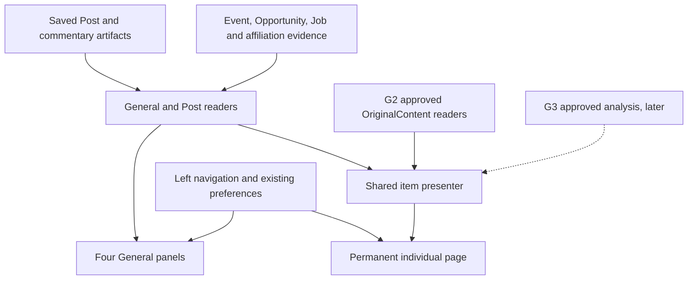
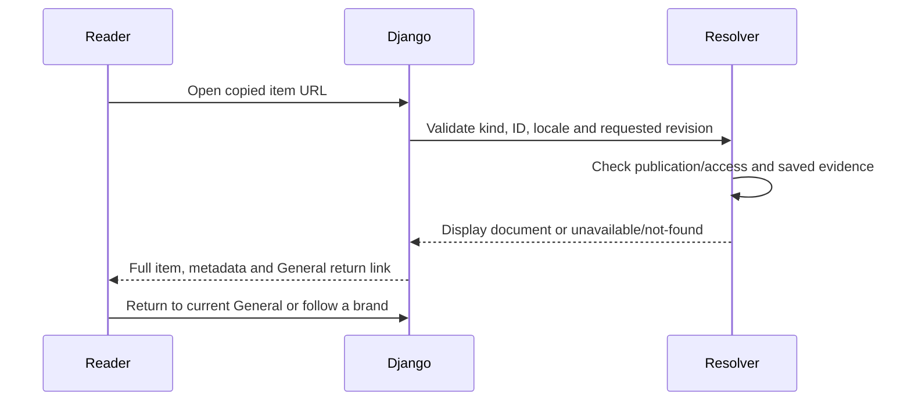
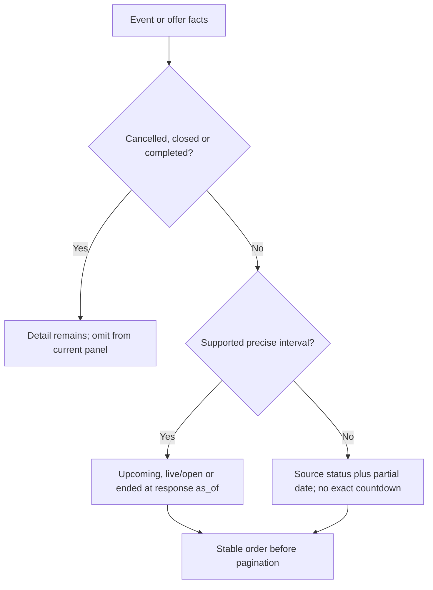

# G5 General Page - Plan

## Round-one closeout — October 9

The owner closes the selected local implementation/browser-review round.
Lower feeds, Post pages/navigation and published Chatter/Pulse integration
retain their local evidence. Preserve the uncommitted code, worktree, preview
and private data. This closure is not a production receipt or worktree cleanup.

Remaining geography-seed regression, durable published-history/link contract,
candidate assurance/performance, page decisions and later selected delivery
transfer to [round-two G5](../brainstorms/2026-10-09-110145-general-round-two.md#g5--general-page-integration-and-release-preparation),
items B2-G5-01–03. The recorded 279 passing tests plus one existing Japanese
geography-seed failure remain that exact result. See the
[closeout and lessons](../analysis/2026-10-09-110145-general-round-one-closeout.md).
Keep the earlier requirements, receipts and unfinished checkboxes as history.

## Plain-English Summary

Build the General page's Calendar, Free stuff, Jobs and Who's moving sections from saved posts and their existing commentary. Keep the accepted :58417 design and add the requested collapsible left navigation with login and settings. Each item opens a permanent, shareable page with full content, sources, media and relevant details.

These four feeds do not need G2's new headline/Chatter/Pulse writing pipeline. They do need structured extraction records for reliable dates, job facts and person/organization relationships. G2 becomes an integration dependency for shared `OriginalContent` pages, reusable pictures and retaining published content behind permanent links. Existing headline cleanup can delete old published records, so that policy must change before those links are complete. The company-extractor branch is a separate dependency to recheck before connecting Who's moving.

The implementation starts with the four readers and post pages, then connects the General shell and navigation. Published OriginalContent uses G2's compatible readers and existing story links. Pulse, Chatter and G3 analysis remain with their owners. The first expanded pages include source inspection and category facts; G3 history/prediction additions can attach when their contracts are ready.

The owner selected `ce-work` option 1 on October 8: implement and verify the independent feeds, Post pages and navigation locally. Completion requires real database-to-page checks, permanent-link checks after feed turnover, and desktop/mobile browser proof with the navigation open and closed. The October 9 continuation authorizes published Chatter/Pulse integration now that G2’s shared readers are deployed; any broader retention-policy changes remain with G2.

---

## October 9 owner scope amendment

The next bounded unit is **U8 — Published Chatter/Pulse integration (G5-R24)**.
Use current main (observed `00d73117`) and the shared published-content readers;
keep G2/G3 generation and publication ownership unchanged. Display every saved
headline, byline, full article and complete ordered source list with its distinct
post count. Preserve saved-edition URLs, locale fallback and access gating.
Refresh only an isolated G5 database from existing production data as needed.
The endpoint remains local implementation and browser review, without a commit,
push or deployment. This amendment supersedes the top-panel implementation
deferral below; generation, retention policy changes and forecasts stay deferred.

Implementation: adapt `monitor.editorial.readers.feed_payload` under the existing
editorial access rule, integrate server-rendered top-panel partials, and preserve
all six outer panel rectangles. Shared storage is selected in the preview runtime;
no ORM publication substitute or provider call is introduced. Use the shared
featured Chatter selection and published Pulse editions, with archive/story links.

Regression net: exercise the actual General route with approved shared records,
unpublished records, three locales/explicit fallback, multiple citations including
non-X URLs, and full long body text. Prove read-only requests, publication access,
and exact source count/list parity. Browser checks cover source disclosure,
saved-edition navigation, desktop/mobile Human/Agent geometry and existing lower
feeds/weights/preferences. Run the affected UI assurance gate on current source;
record any unrelated baseline failures separately from passed checks.

---

## Goal Capsule

- **Objective:** Readers can browse current events, opportunities, job posts and personnel announcements, share an individual item, and reopen its full context after it leaves the front page.
- **Means:** Read saved post commentary and extracted facts through bounded adapters, serve permanent detail pages, and integrate the accepted layout with a collapsible navigation (KTD1–KTD8).
- **Authority:** Latest owner instructions and the authoritative General Launch Charter govern this plan. The existing G5 worktree and this plan remain canonical; G2/G3/extractor ownership stays separate.
- **Endpoint:** Local implementation and verification of the independent feeds, Post pages, navigation and the October 9 published Chatter/Pulse integration. Current main and an isolated production-data snapshot are in scope. Commit, push, staging, production and external posting need a later selected endpoint; G2’s writing and retention policies remain separate.
- **Stop conditions:** Do not invent a missing event time, employment change, publication approval or upstream identity mapping. Isolate an unavailable integration rather than blocking the independent feed readers.

---

## Product Contract

Product Contract expanded by the October 8 owner requests for live lower feeds, permanent atomic-item URLs, expanded pages and collapsible left navigation. The accepted design and earlier timing, locale, motion and Human/Agent geometry requirements remain. Historical prototype evidence is retained in the Appendix and is not implementation proof.

### Summary

Connect the four lower General panels to saved post-level content, add durable item pages and introduce left navigation. Preserve ownership boundaries around generation, extraction and public agent access.

### Problem Frame

The accepted page is a static prototype with dated examples. Its lower panels have no production reader contract or durable local post pages. Meanwhile, G2 is consolidating authored content and the extractor work can change organization/identity data; direct coupling to their internal writes would make General fragile.

### Key Decisions

- KD1. **Use the previous design.** Governs R1. (session-settled: user-directed — chosen over the ChatGPT-style warm-gray/font experiment: the owner rejected that comparison after viewing it.)
- KD2. **Build the four lower feeds first.** Governs R2, R15. The owner reserves Pulse/Chatter for G2/G3 while General consumes their eventual public outputs.

### Requirements

**Feed content and timing**

- R1. Use the :58417 DeepSeek/context prototype's colors, typography, panel hierarchy, content treatment and existing glyphs as the design reference; left navigation is the explicit new layout addition. Covers G5-R12–R19.
- R2. Populate Calendar, Free stuff, Jobs and Who's moving from saved atomic posts, source-faithful commentary and linked structured facts, without generating a new editorial story on page load. Covers G2-R05–R07 and G5-R20.
- R3. Match the exact category and its recorded classification version: `events`, `opportunities`, `job_listings`, `personnel_changes`. A post can appear in several relevant sections but only once per section. Older combined `events_opportunities` rows do not become exact categories without new evidence.
- R4. Calendar and offers put live/open items first, then future starts nearest first, then items with unknown timing. Closed/cancelled/past records remain accessible on their own pages but do not crowd current panels. Covers G5-R16.
- R5. Show start/end countdowns only when a timezone-aware instant is supported. Date-only and uncertain dates retain that precision; live status is red and motion is disabled under reduced-motion preferences. Covers G5-R16.
- R6. Jobs sort by source post `fetched_at` descending with a stable ID tie-break, show elapsed fetch age, and use “Just listed … ago!” for items under 24 hours. Fetch time is not the employer's original posting date. Covers G5-R16.
- R7. Who's moving shows source-attributed personnel announcements with role, organization and effective-date uncertainty. Unreviewed extractions remain visibly unconfirmed; company discovery, a profile observation or an affiliation marked current alone does not prove a move.
- R8. Tracked brands use hashtag pills linked to existing brand pages. Unknown organizations retain source wording without a fabricated tracked-brand link. Source publication time, fetch time and event/employment effective time remain distinct.

**Atomic pages and sharing**

- R9. Every displayed Post or published OriginalContent unit has a durable first-party URL independent of feed position, category, title and current hero selection. A post covering several jobs/events keeps one atomic post URL. Covers G5-R10/R11/R21.
- R10. An item page shows full commentary/content, original-source attribution, available source media, supported category facts, brand links, language/fallback state, copy/share controls and a return to current General. The shared link works when opened directly without first loading a feed.
- R11. Preserve exact saved OriginalContent editions and existing story URLs through G2's storage transition. Post pages identify the commentary revision displayed; a requested saved revision must belong to that post and must never silently change to another revision.
- R12. Share metadata describes the same item the reader sees. Expired offers and jobs and superseded-but-published content remain readable with their status; nonexistent, withdrawn or nonpublic content cannot leak through HTML, metadata or asset URLs.

**Navigation and integration**

- R13. Add collapsible left navigation containing General, the four section links, Pro, login/account status and settings. Use existing Google sign-in and preference behavior, preserve a safe return destination, and support keyboard/mobile operation. Covers G5-R22.
- R14. Preserve shared Human/Agent outer panel geometry in each navigation state, existing header toggles, EN/Chinese/Japanese locale handling and source uncertainty. Existing public-agent exclusions remain; the browser's JSON delivery does not establish a G4 API contract.
- R15. Feed reads and detail-page visits perform no collection, extraction, model generation, publication or paid picture work. Preserve current Pro/internal routes, G2/G3 content contracts and other sessions' runtime resources.
- R16. Each panel supports a bounded first page and incremental continuation, accurate empty/unavailable states and recovery from failed refreshes. Changing filters or locale cannot apply an older response to the new state.
- R17. Open and Closed weights are independent selections. Closed is temporarily unavailable: show “Open Weights Coming Soon!” when selected, then deselect it on dismissal without changing Open's prior state, the displayed results, or saved preferences. The owner's latest wording is literal; the Closed trigger is unchanged. Place the notice beside its invoking toggle, below or above as space allows, with mobile viewport clamping and resize repositioning. Open may be independently deselected. Header/sidebar, keyboard/mobile, localized copy, old closed-weight URLs and saved preferences must agree. Do not introduce General's multiple-selection state into Pro's existing exclusive filter. Covers the owner's October 8 G5-R23 direction.

- R18. Consume real published Chatter/Pulse through G2’s existing shared readers and access gate. Display the exact saved headline, byline, complete body, distinct cited-Post count and every source URL, including non-X sources. Use current main with deployed G2/benchmark changes and refresh only G5’s isolated snapshot. Preserve saved-edition links, explicit locale fallback, all six outer rectangles and existing controls. Covers G5-R24.

### Acceptance Examples

- AE1. Covers R2–R5: a classified event post with a precise start/end appears live until its end; a date-only event shows its date without an invented “ends in” countdown.
- AE2. Covers R6/R9: one post announcing three jobs renders one feed card and one permanent page with three linked job descriptions; a repeated fetch does not create three atomic URLs.
- AE3. Covers R7: an official-company registration creates no Who's moving card. A self-announced personnel post can appear as a sourced announcement while its extracted affiliation is pending review.
- AE4. Covers R9–R12: a recipient opens an old post/story URL after front-page turnover and sees that item, its sources and supported saved revision, plus a working route back to current General.
- AE5. Covers R13/R14: a phone reader opens navigation, changes language, opens a shared item and returns; controls retain state, focus is restored, and a Human/Agent toggle does not reshape the panels.
- AE6. Covers R15/R16: refreshing a panel with missing commentary displays a labeled source-text fallback and creates no synthesis demand or provider call.
- AE7. Covers R17: Open is selected and its cards are visible; selecting Closed shows “Open Weights Coming Soon!” beside the invoking toggle with Open still selected, then dismissal returns Closed to unselected without fetching or clearing cards. With Open deselected, the same interaction leaves both choices unselected. Reload preserves Open's choice and does not retain Closed.

- AE8. Covers R18: an approved saved edition with seven citations renders its full final paragraph and all seven source URLs; its headline opens the exact saved edition. A prepared/unpublished text remains absent. Disabling public editorial access hides Chatter/Pulse publications while lower public feeds still work.

### Scope Boundaries

Active work includes the four feeds, their Post detail pages, published Chatter/Pulse panels using existing edition URLs, the General shell, navigation/settings wiring and regression coverage.

### Deferred to Follow-Up Work

- Chatter/Pulse writing, hero selection and publishing/storage migration stay with G2/G3. G5’s top-panel presentation now consumes their deployed shared readers under R18; no writing or selection algorithm changes are included.
- G3 topic history, prediction questions and market-support actions remain required downstream capabilities; this slice defines their detail-page extension boundary without inventing responses or controls that pretend to work.
- New paid per-post pictures, social posting, platform-specific embed exports, bookmarks, a new archive/search service, direct-career-site job ingestion into General, new account-management features and G4 server implementation are outside this slice.
- Replacing `/` as the default landing page is deferred; `/general/` is the additive implementation route. General contains the Reading control. The current Pro template has no Reading control; add a bounded General entry there once the General release is verified.

---

## Planning Contract

### Evidence and upstream boundaries

Research on October 8 inspected the authoritative root at `33f20b97`, G5 at `f4159057`, G2 at `346a883a` plus its ongoing uncommitted cutover work, and `feat/official-co-account-extraction` at `702fef5b`. Local `origin/main` was `dcbedf22`; these are source observations, not a new deployment check. The G5 checkout is older than the inspected G1/G2 and account changes and must be reconciled before implementation.

| Question | Evidence | Consequence |
| --- | --- | --- |
| Must lower feeds use OriginalContent? | `monitor/post_artifacts.py::read_post_content_many` reads saved normalized synthesis/translation with explicit legacy fallback; `monitor/views.py::_enrich_posts_with_classifications` consumes it. | No generator dependency. Use the post reader rather than only `Post.commentary_en`/`commentary_zh_cn`. |
| Is commentary enough for ordering? | `core/intelligence_readers.py` exposes event/offer lifecycles and precise versus partial dates, jobs and affiliations. | Commentary supplies prose; structured facts supply timing and category details. |
| Are per-post URLs already present? | Inspected `monitor/urls.py` contains feed/chart and synthesis-demand routes, but no dedicated Post detail route. | Add Post URLs; do not confuse external X links or panel anchors with a local item URL. |
| Will G2 URLs change? | G2 `monitor/original_content_readers.py` projects shared storage through `shared_story`, `saved_edition` and the existing UUID story/edition contract. | Preserve `/stories/<uuid>/` and `edition`; never substitute an integer PK in those URLs. |
| Will headline history survive indefinitely? | `monitor/trend_narrative_lifecycle.py::prune_per_brand_trend_narrative_history` explicitly deletes old unpinned content in superseded runs, normally beyond 90 days. | A permanent route alone is insufficient. G2 must preserve previously published content, localized text and citations before the OriginalContent detail integration is complete. |
| Does company discovery prove a personnel change? | Extractor plan R10/KTD1 preserves `_persist_personnel`; `core/targeted_extraction.py` writes separate people, affiliation claims and evidence. | No. Recheck the owner's pending extractor changes and adapt only the read boundary. |
| What is already public? | `monitor/views.py::home` is anonymous; G2 editorial views enforce `public_enabled` or staff access. | General is public by design, but must not bypass the editorial publication switch or staff asset access. |

The requested “g2-release co extractor” name was not an exact local branch name. The matching registered branch is `feat/official-co-account-extraction`; its current documented contract preserves people extraction. A subsequent extractor change is an execution prerequisite for the affected adapter, not a reason to rewrite or pause its pipeline.

The read trace is source-based: HTTP feed → category query → saved post-content reader → projection → HTML/JSON. Reads change no processing state. Missing synthesis returns explicit status/legacy content; expiry marks the demand, not a license to hide an otherwise saved successful artifact. Personnel evidence records `observed_at=post.fetched_at`, not employment start time. G2 story readers resolve approved saved editions and apply publication access before rendering. No tests, runtime probes or database queries were run during planning.

### Key Technical Decisions

- KTD1. **Thin Django reader layer.** Add `monitor/general_readers.py` and `monitor/general_views.py`, reusing saved post-content and intelligence readers for R2/R15. Avoid a new feed model, scheduler, materialized copy or prompt. Existing direct readers resolve the mechanism; a competing storage architecture would add synchronization without meeting a missing requirement.
- KTD2. **One card per source post.** Card identity is `(section, post_id)`, atomic identity is `(kind=post, post_id)`. Batch-load classification state, commentary, brands and all linked facts. Current supported classification outcomes govern membership; scalar readers do not by themselves establish post type. For one post with several events/offers, select its earliest current/upcoming linked item as the card's timing anchor and show every linked fact on detail (R3/R9).
- KTD3. **Bounded ordering at the reader.** Freeze the first page's `as_of` in signed cursors bound to section/filter/locale/order, with stable post-ID tie-breaks and `fetched_at <= as_of`. Continuation uses that same clock for lifecycle ordering; refresh starts a new traversal. Default 20 cards, maximum 50 per page. Order all eligible records before pagination; never sort only an arbitrary latest-post sample. Event/offer reads are not clipped to the Pro chart's post-age window. Malformed cursors/filters return 400. Source corrections remain live and clients deduplicate stable IDs; this is not a database snapshot (R4–R6/R16).
- KTD4. **Typed date and evidence projection.** Reuse `event_lifecycle` and `opportunity_lifecycle`; add batch projection around them rather than per-card queries. Keep pending extraction facts labeled as source claims, exclude rejected/superseded claims, and show unknown timing without fabricating an instant. Do not reinterpret model-written schedule text in the browser (R5/R7/R8).
- KTD5. **Separate public identities from storage migrations.** New Post route `/posts/<post_id>/` uses the existing stable Post key. Share actions include `lang` and a saved `commentary` artifact ID when available; unpinned pages display the current saved revision. Existing OriginalContent story URLs remain canonical. A trend/headline item with no existing story identity uses `/content/<content_id>/` for its immutable content row, after proving it was published; no new content storage or synthetic UUID is needed (R9–R12).
- KTD6. **Reusable detail presenter with owned resolvers.** `monitor/content_readers.py` returns a display document for Post or published OriginalContent. Post resolution stays independent of G2; OriginalContent delegates publication/edition/source/picture eligibility to G2's compatible readers. Both use shared detail partials and optional category/analysis sections. No raw ORM serialization, provider snapshots or private provenance enter responses (R10–R12/R15).
- KTD7. **Left rail plus mobile drawer.** Desktop starts with a compact 48px rail and expands to 224px; the main grid uses the remaining width with the accepted panel proportions. At the existing mobile breakpoint, navigation becomes a closed overlay drawer. Persist the explicit collapse choice under the existing preference namespace. Header settings and sidebar settings share one state owner. The nav is the bounded layout exception to R1; paired Human/Agent measurements remain equal (R13/R14).
- KTD8. **Reuse authentication and scoped preferences.** Use existing allauth route names, a same-origin return path and CSRF-protected logout. Settings cover the current weights, locale, timezone, audience and Reading choices; no new OAuth scopes or credential forms. Anonymous preferences remain browser-local and must not leak a previous signed-in user's state (R13).
- KTD9. **Server-rendered baseline with progressive updates.** Initial cards and individual-page content render through Django. JavaScript refreshes bounded panels, manages countdowns and continuation, and discards responses from older preference revisions. A failed update retains the last successful content with a visible retry state (R16).
- KTD10. **Preserve the permission boundary for Agent presentation.** Code/data views may display the corresponding approved projection, but G4's source-identity exclusions remain. Who's moving must not expose an invented `get_people_moves` public tool. Keep its outer panel and clearly identify unavailable agent data until G4 approves a contract (R14).
- KTD11. **Retain published atoms before exposing permanent links.** The G2-owned retention policy must exclude every previously published OriginalContent item and its locale/source records from destructive age-based cleanup, regardless of current selection or picture pins. For trend output, approved content in an activated active/superseded run provides historical publication evidence; an approval timestamp alone does not. Editorial editions use G2's workflow-specific publication resolver. Preserve successful Post commentary revisions linked by share URLs as well. No read creates a retention pin, archive copy or publication event (R9–R12/R15).

### High-Level Technical Design

These sketches explain the required boundaries and states; they do not prescribe helper signatures or component internals.

The dependency graph preserves independent lower-feed work while G2 changes storage.

The reader data flow is: eligible classified posts → batch commentary and fact reads → public display projection → lifecycle order at the traversal's clock → bounded page → HTML or browser JSON. Both renderers consume the same projection.

| Timing lifecycle | Transition used by the reader |
| --- | --- |
| Upcoming | Becomes live/open at a supported start instant. |
| Live/open | Becomes ended/closed at a supported end instant. |
| Unknown or partial | Stays imprecise until stored evidence supplies an instant; never advances by an invented deadline. |
| Cancelled, closed or ended | Omitted from current panels; the permanent detail remains available with its status. |

| Navigation state | Allowed transition and effect |
| --- | --- |
| Desktop rail | Expand to the desktop menu; persist the explicit choice. |
| Desktop expanded | Collapse to the rail; return focus to its control. |
| Mobile closed | Open the overlay drawer without resizing the content grid. |
| Mobile open | Escape, backdrop or selection closes it and restores focus; crossing the breakpoint restores the appropriate desktop preference. |

| Presentation/access mode | Shared behavior and boundary |
| --- | --- |
| Human / Agent | Same outer panel rectangles for the same viewport/navigation state; content follows each permitted projection. |
| Anonymous / signed in | Same eligible public content; account actions and preference namespaces differ. |
| Editorial public switch off | Ordinary visitors cannot resolve editorial content or its assets; the existing staff preview policy remains. |
| JavaScript off / on | Initial content and links work in both; panel refresh, timers and drawer enhancements are progressive. |

#### URL and detail-page contract

| Surface | Resolution and behavior |
| --- | --- |
| `/general/` | Anonymous General page; Pro and `/internal/` remain unchanged. |
| `/general/feed/` | Same public web policy; section, brand/weights, locale and signed continuation. It is a browser endpoint, not a new G4 tool. |
| `/posts/<post_id>/` | Full atomic post and derived commentary, with linked facts independent of current feed membership. Unknown ID is 404. |
| `/posts/<post_id>/?commentary=<artifact_id>&lang=<locale>` | Exact successful saved artifact belonging to that post. Invalid ownership/revision is 404; no silent current-version substitution. Legacy-only content has an unpinned URL and a visible legacy label. |
| Existing `/stories/<uuid>/?track=...&lang=...&edition=...` | Preserve G2's stable edition resolver and access policy; augment shared presentation without taking over generation. |
| `/content/<content_id>/?lang=<locale>` | Approved, actually published headline/trend version without an existing story URL. Reuse publication history and language availability; approval alone is insufficient. |
| Existing brand/account routes | Resolve server-side by route names; reject external return paths and unsafe source/action URL schemes. |

Individual pages show source versus commentary separately, source timestamps, saved commentary/version, available original media, and a bounded list of linked extracted facts. Event details include schedule/location/attendance link; offers include benefit/eligibility/deadline/action; jobs include every extracted role and supported application route; personnel includes who/role/organization/effective-date precision and review state. Show source-post media first. A person portrait requires G1's eligible verified-media policy; initials are the terminal fallback.

Source attribution retains the original external URLs. Internal “View post” links are additional and must not overwrite cited URLs or source counts. Existing G2 picture endpoints retain their eligibility checks and time-limited media delivery; share metadata uses a durable authorized asset route or the stable brand mark, never an expired signed storage URL.

### Assumptions and deferred implementation details

- “Extra features” initially means the content/source/media/category/sharing scope in R10. The optional owner question remains amendable; G3 analysis is reserved rather than fabricated.
- Free stuff initially means the existing `opportunities` category, including discounts, bounties and grants; display the actual benefit instead of calling every item free.
- The first Jobs slice is post-backed. Existing direct-career-site rows continue on their existing surfaces and are not silently converted into Posts.
- No category date can be hand-corrected from the prototype's curated sample. Correct extraction through its owner or show uncertainty.
- Physical helper names, exact query plans and available real-record counts are implementation findings. Query behavior must remain bounded as the number of rendered cards grows.
- G2's published-content adapter must be reconciled against its completed cutover before the OriginalContent portion of U4 is finalized. Work on Post readers and navigation can proceed independently.
- Retention changes belong to G2. U4's OriginalContent portion cannot be marked complete until KTD11 is implemented and verified through the real pruning path. This prerequisite does not prevent the Post portion or U5/U6's lower-panel work.

### Risks and dependencies

| Dependency | Boundary and mitigation |
| --- | --- |
| Old G5 branch | Reconcile with accepted current main before code work; preserve the existing plan and uncommitted owner files. Do not copy G2's half-finished migrations. |
| G2 OriginalContent work | Coordinate `monitor/urls.py`, editorial detail templates and compatible reader imports. Keep storage and generation edits in G2. |
| Published-content retention | G2 owns the narrow cleanup-policy change required by KTD11. Preserve old published atoms and citations; verify old links after cleanup before completing OriginalContent detail pages. |
| Pending extractor changes | Inspect the actual branch/plan again before U3; freeze fixtures for both existing and intended read shapes. Stop the affected identity adapter if keys/evidence meaning changed. |
| Sparse or pending extraction | Display source commentary and honest “date/details unavailable” states; lack of structured data cannot trigger generation from a GET. |
| Public sharing | Detail eligibility must be shared with the public projection and independent of transient filters/time windows. Source selection, review/private metadata and rejected identities must remain excluded. |
| Existing controls and geometry | Capture the accepted page before implementation; nav width is the explicit difference, not an excuse for a redesign. |

### Sources

Paths below refer to the authoritative repository root unless prefixed by the named worktree. Runtime implementation files use their ordinary repository-relative paths after branch reconciliation.

- `docs/brainstorms/2026-09-30-104924-general-launch-charter.md`: G2-R05–R07/R48/R52–R54, G3-R01–R05, G5-R10–R22.
- `.context/g5-staging-charts-20261007/screens/`: accepted reference; no source-file edits during this plan.
- `monitor/post_artifacts.py`, `monitor/views.py`, `core/intelligence_readers.py`, `core/targeted_extraction.py`, `core/classification_contract.py`, `core/models.py`: current post content, facts and temporal contracts.
- `.worktrees/feat/g2-editorial/docs/plans/2026-09-30-051835-docs-g2-voices-corpus-plan.md`, especially U9–U15; `monitor/original_content_readers.py`, `monitor/editorial/readers.py` and `monitor/trend_narrative_lifecycle.py` in that worktree.
- `.worktrees/feat/official-co-account-extraction/docs/plans/2026-10-06-100039-feat-official-co-account-extraction-plan.md`: separate company registration and preserved personnel extraction.
- `docs/analysis/2026-09-10-203138-stage1c-contracts.md`: evidence, precision, taxonomy and counting-unit boundaries.
- `docs/solutions/workflow-issues/django-i18n-locale-toggle-debugging-journey.md`: prove actual locale navigation/rendering; catalog presence alone is insufficient.
- [allauth views](https://docs.allauth.org/en/latest/account/views.html): corroborates existing login and POST logout conventions.
- [Open Graph protocol](https://ogp.me/): item-specific metadata and durable canonical identity. These sources confirm the existing approach; no new provider/framework was selected.

---

## Implementation Units

### U1. Establish the shared reader contract and regression baseline

**Goal:** Give all four panels consistent post identity, saved commentary and visibility behavior.

**Requirements:** R2/R3/R8/R14/R15. **Dependencies:** accepted-main reconciliation and upstream file ownership check.

**Files:** new `monitor/general_readers.py`, `tests/test_general_readers.py`, `tests/fixtures/general_feed_contract.json`; reuse `monitor/post_artifacts.py`, `core/intelligence_readers.py`, `core/classification_contract.py` and existing view tests.

**Approach:** Implement the common projection and batch-loading boundary under KTD1/KTD2. Separate public eligibility from user-selected filters and feed recency so detail links can use the former. Capture source/locale/version and linked-record identities without copying generic ORM fields.

**Execution note:** Start with the real database-to-reader contract and characterization of existing Pro/public routes; do not treat the old static prototype checks as application evidence.

**Test scenarios:**

- Exact v3/v4 category records are admitted; legacy combined categories, unsupported/current failed states and stale historical classifications do not masquerade as exact current membership.
- Several brand matches produce one card per post/section and preserve all relevant tracked-brand pills.
- Normalized commentary takes precedence; legacy partial and missing-language cases remain labeled and cause no demand or generation calls.
- Query count stays constant between one and twenty cards with the same relation families; private operational fields never enter the display document.

**Verification:** Deterministic PostgreSQL reader tests and unchanged existing public-feed behavior establish the contract.

### U2. Connect Calendar and opportunity timing

**Goal:** Order current events/offers from stored facts and display trustworthy countdowns.

**Requirements:** R4/R5/R8/R16; AE1. **Dependencies:** U1.

**Files:** `monitor/general_readers.py`, new `tests/test_general_timing.py`; reuse `core/intelligence_readers.py`, `tests/test_intelligence_readers.py`.

**Approach:** Add batch event/offer joins and lifecycle sort keys under KTD3/KTD4. Preserve the full fact list for detail pages while choosing one supported card anchor. Build signed continuation from the actual final order.

**Test scenarios:**

- Before start, at start, just before end and at end produce the intended upcoming/live/ended states.
- Date-only, month/year precision, absent timezone, unknown end, cancelled and postponed inputs never fabricate an exact countdown.
- A future event announced months ago still appears; sorting is not limited to the latest fetched sample.
- Several linked events select a deterministic current/upcoming anchor; rejected evidence cannot supply timing.
- Equal start times paginate without duplicate post IDs; cursor section/filter mismatch is rejected.
- Crossing an event start/end between continuation requests retains the first page's ordering clock; a refresh uses the new live state and includes newly fetched posts.

**Verification:** Controlled-clock reader tests establish ordering and precision; U6 proves browser countdown behavior.

### U3. Connect Jobs and sourced personnel announcements

**Goal:** Show newest fetched job posts and attributable personnel changes without conflating organizations with people.

**Requirements:** R6–R8/R15/R16; AE2/AE3. **Dependencies:** U1 and the current extractor contract check.

**Files:** `monitor/general_readers.py`, new `tests/test_general_jobs_people.py`; reuse `core/intelligence_readers.py`, `core/staff_assets/` and the source ownership in `core/targeted_extraction.py` without changing extraction.

**Approach:** Read post-linked jobs and personnel evidence. Keep unknown organization names, non-employment relationships and conflicting claims distinguishable under KTD4. For Who's moving, use descending post fetch time as the discovery order and display effective date separately; do not sort unknown effective dates as if they were known.

**Test scenarios:**

- The 24-hour boundary and equal fetch times preserve exact job order and age labels; source publication date does not replace fetch time.
- One post with multiple roles still has one card and all detail facts; source-only jobs and explicit closed listings remain honest.
- Company registration, an unchanged staff profile and unrelated brand discovery create no personnel announcement.
- A personnel post with pending evidence says unconfirmed; rejected/superseded evidence and name-only joins are excluded.
- Same-name people, advisors versus employees, source/effective-time differences and missing verified portraits preserve identity and uncertainty.

**Verification:** PostgreSQL joins prove source linkage and compatibility with the settled extractor models; no extraction writes or provider calls occur.

### U4. Serve permanent Post and OriginalContent detail pages

**Goal:** Make atomic items reopenable and shareable outside the feed.

**Requirements:** R9–R12/R15; AE4/AE6. **Dependencies:** U1–U3 for Post detail; G2's compatible publication reader and KTD11 retention correction for OriginalContent detail. Complete the Post portion independently; do not hold U5/U6 for the OriginalContent portion.

**Files:** new `monitor/content_readers.py`, `monitor/content_views.py`, `monitor/templates/monitor/content/detail.html`, `monitor/templates/monitor/content/_body.html`, `tests/test_content_detail.py`, `tests/test_content_sharing.py`; bounded edits in `monitor/urls.py` and, with G2 ownership cleared, `monitor/templates/monitor/editorial/story.html` for shared presentation only. G2-owned prerequisite: `monitor/trend_narrative_lifecycle.py` and `tests/test_trend_narrative_lifecycle.py` for retained published history.

**Approach:** Implement KTD5/KTD6/KTD11 and the URL contract. Render full text safely, supporting media and every category fact. Preserve original citations alongside internal post links. Use a generic brand mark when no eligible share image exists. The same view remains usable without JavaScript. Coordinate the retention correction with G2's owner in `monitor/trend_narrative_lifecycle.py`; do not replace G2's active code or introduce a second storage system.

**Test scenarios:**

- Direct old Post links still resolve after filters/feed turnover; a saved commentary ID is validated against the post and successful state.
- Missing, cross-post, failed or withdrawn revisions do not silently resolve to current content or leak data through metadata.
- Published old G2 UUID/edition links survive shared-storage mode; approved-but-never-published content does not become public.
- A published headline with no legacy story gets its own stable content URL; changing its display label or active hero does not change that identity.
- An old published headline beyond the cleanup horizon, without a current/last-good/picture pin, retains its text and citations after the actual pruning function runs. An approved output from a never-activated trend run stays nonpublic.
- Full commentary, original source, locale fallback, media and multiple facts render through the real route; malicious text/URLs cannot inject markup or unsafe links.
- Canonical/Open Graph/Copy link all identify the same item, not `/general/`; temporary storage signatures are not saved as permanent share-image URLs.

**Verification:** Django route/template/asset tests plus direct-navigation browser coverage, with provider/demand dispatch asserted absent.

### U5. Build the General shell and collapsible navigation

**Goal:** Provide the requested left navigation and working login/settings around the accepted design.

**Requirements:** R1/R13–R15/R17; AE5/AE7. **Dependencies:** U1 and U4's Post-page contract only; G2's OriginalContent integration is not a prerequisite.

**Files:** new `monitor/general_views.py`, `monitor/templates/monitor/general.html`, `monitor/templates/monitor/general/_navigation.html`, `monitor/templates/monitor/general/_settings.html`, `monitor/static/monitor/general.css`, `monitor/static/monitor/general.js`, `tests/test_general_views.py`, `tests/test_general_browser.py`; bounded `monitor/urls.py` changes and existing locale catalogs.

**Approach:** Implement KTD7/KTD8 on `/general/`. Reuse existing brand mark, glyphs and preference namespace. Provide actual section/Pro/settings/login targets, account status and standard sign-out. Use shared state for header/sidebar preferences; reserve the top component slots without copying G2 generation or static story claims.

**Test scenarios:**

- Anonymous navigation shows login; authenticated navigation shows the correct account action; inactive users and an unsafe return URL follow existing allauth policy.
- Logout requires CSRF-protected POST and cannot be triggered by a preview crawler's GET.
- Rail collapse persists; mobile drawer opens/closes with keyboard, Escape and focus return, without hiding page access when scripts fail.
- Sidebar and header locale/weights/timezone/audience choices stay synchronized and isolate per-user/browser state.
- Closed's temporary notice preserves Open on or off, card IDs, scroll position and URL; dismissal restores focus and clears Closed. Check EN/ZH-CN/JA, mouse/Space/Enter/Escape, mobile drawer focus, stale stored Closed and direct old Closed URLs. General stores its independent weights in the same account-scoped General namespace without overwriting Pro's exclusive lens. `weights=none` returns no cards; rapid off/on responses cannot replace the latest results.
- Verify the notice's bounding box is adjacent to the invoking header/sidebar toggle and remains within desktop/mobile viewport bounds. If resizing hides the sidebar toggle, move the still-open notice beside the visible header equivalent. Preserve panel geometry and feed results.
- Existing `/`, `/internal/`, brand, chart and story routes retain their access and navigation behavior.

**Verification:** Real Django routes and browser actions validate both navigation states in every supported locale.

### U6. Integrate live cards, detail links and panel updates

**Goal:** Replace lower-panel samples with real reader output and preserve interactions across preferences.

**Requirements:** R1–R16. **Dependencies:** U2/U3/U5 and U4's Post portion; add OriginalContent links when its G2 dependency is ready.

**Files:** `monitor/general_views.py`, `monitor/templates/monitor/general.html`, new `monitor/templates/monitor/general/_cards.html`, `monitor/static/monitor/general.js`, `monitor/static/monitor/general.css`, `tests/test_general_feed_api.py`, `tests/test_general_browser.py`.

**Approach:** Implement KTD9 and KTD10. Server-render the initial four panels, progressively refresh and continue them, and link each card to U4. Reuse current time/locale semantics and glyphs. Preserve G5-R16's red live/just-listed emphasis and non-red future-event blinking that becomes faster as the event approaches; reduced-motion disables the animation. G2's ready read components may occupy top slots; unavailable components are explicit rather than replaced with old sample content presented as live.

**Test scenarios:**

- Real route → reader → JSON/template → browser renders database fixture records instead of baked-in `PW_PAGE`/saved-example data.
- Rapid weights/locale changes discard a late prior response; continuation merges stable keys without duplicate cards.
- Empty, partial-data and failed-refresh states are distinct; retries do not clear valid content or create paid work.
- Live/future/just-listed emphasis updates at the correct boundary and stops motion under reduced-motion preferences.
- Human/Agent outer rectangles match at 1440/1280/900/390px with both nav states; disclosure expansion stays inside its panel.
- Card sharing, detail navigation, browser Back and General return preserve the relevant item/filter/locale state.

**Verification:** End-to-end browser proof covers each panel, each navigation state and each meaningful data-state branch.

### U7. Complete the regression net and document the reader contract

**Goal:** Prove the integrated page and durable links while protecting existing surfaces and upstream work.

**Requirements:** R1–R16. **Dependencies:** U1–U6.

**Files:** `tests/test_general_browser.py`, `tests/test_content_detail.py`, `tests/test_views.py`, relevant `tests/test_editorial_views.py`, additive `tests/fixtures/ui_assurance/general-declaration.json` and `tests/fixtures/general_feed_contract.json`, `tests/ui_assurance/general.py`, `tests/ui_assurance/gate.py`, new `docs/reference/general-page.md`; retain the existing Pro declaration/fixtures and update this plan's implementation references only if the actual file layout differs.

**Approach:** Add the new controls/routes to the repository's stateful UI assurance declaration. Exercise the accepted design with deterministic records and demonstrate link survival across publication/feed changes. Measure candidate request/query/render cost because this change adds database readers and assets. Preserve upstream checks when their code/evidence inputs remain unchanged.

**Test scenarios:**

- Full public and authenticated navigation matrices cover all four panels and detail pages without zero-selector matches, skips or fixture substitution.
- Existing Pro feed/chart, G2 story access/citations and post synthesis behavior remain unchanged through actual caller paths.
- No navigation state, timeout or missing upstream component mutates harvest, extraction, provider, budget or publication state.
- Server-rendered share HTML and available asset metadata work for a fresh anonymous request; access-restricted records remain excluded.

**Verification:** Apply the Verification Contract below and save candidate-specific evidence. Clean up abandoned implementation attempts; keep owner previews and unrelated work intact.

---

## Verification Contract

The prototype-only assurance exception from earlier work does not apply to this Django integration. The repo's `.agents/skills/fix-ui/SKILL.md` governs browser reproduction and the pinned Bridgewright declaration.

| Proof | Required outcome |
| --- | --- |
| Reader and route tests | Run the new `tests/test_general_*.py` and `tests/test_content_*.py` against disposable PostgreSQL, plus affected existing post/intelligence/editorial/view tests. No required skips or live provider calls. |
| Stateful browser checks | Run `uv run --extra dev bridgewright assurance-validate --project-root .`, `uv run --extra dev bridgewright assurance-prescribe --project-root .`, and the affected assurance gate after extending the target declaration. |
| Candidate integration | Before an implementation handoff, run the candidate assurance gate for the exact product revision with candidate performance inputs required by fix-ui. A reused baseline is not candidate performance proof. |
| Actual visual behavior | Browser screenshots and DOM rectangles at 1440/1280/900/390px, Human/Agent and collapsed/expanded navigation, with source fixture identity recorded. |
| Link persistence | Open copied Post, pinned commentary, legacy G2 edition and new published-headline links after feed/hero changes and the actual retention/pruning path; inspect HTML metadata without JavaScript. |
| Boundary proof | Assert no reads dispatch extraction/synthesis/editorial/media work and no private fields leak; verify the old public/Pro/internal paths remain intact. |

Freeze the fixture acceptance set before implementation. Bound visual repair to three passes, then report remaining design differences rather than weakening the oracle. Application tests are not run during this planning task. Any later deployment requires the separately selected delivery endpoint and exact-revision observation.

---

## Definition of Done

The four live panels show stored source-backed records with honest timing, source-faithful commentary and working first-party item links. Both Post and published OriginalContent detail paths satisfy their publication and revision rules. Navigation, login/settings, locales, mobile behavior and paired Human/Agent geometry work through actual Django routes. The Verification Contract passes for the implemented revision; no current G2/G3/extractor resources are changed incidentally, and no abandoned code remains.

The plan itself is complete when its source claims, ownership boundaries, URL decisions, units and verification have been reviewed. Historical passing prototype checks are not counted as proof of this unbuilt implementation.

October 8 document review applied four corrections: the existing reader's name, a fixed clock for feed continuation, preservation of published content through cleanup, and dependencies that let Post/navigation work proceed independently of G2. [Review evidence](../reviews/2026-10-08-145153-g5-general-page-plan-review.json) records the source findings, dispositions and reviewed document identity. No unresolved product decision prevents the independent feed work; OriginalContent completion still requires the named G2 publication/retention integration.

---

## Delivery Exceptions

The owner selected `ce-work` option 1 after planning on October 8, authorizing local implementation and verification of the independent feeds, Post pages and navigation in the existing G5 worktree. This overrides the skill's default Git/shipping tail: leave the reviewed local changes available without committing, pushing, staging or deploying. Preserve private previews :58011/:58417 and the rejected :56887 experiment as evidence. Local headless browser verification is part of this build; opening or controlling the owner's browser is not selected. G2 owns its active OriginalContent migrations, publication/retention and staging work; the company extractor owns its pipeline.

<!-- BEGIN OLLIJA DELIVERY GUIDE -->
## Ollija Delivery Guide

This block is generated guidance. Do not edit it directly. Correct durable facts in `.ollija/project.yaml` or this template, then rerun `ollija annotate-plan`. Current explicit owner instructions govern this task. Record exceptions below and reflect route changes in metadata; removed requirements must not return through another checklist.

### Resolved locations

- Authoritative host: `fuchitalee`
- Authoritative repository: `/Users/fuchitalee/development/pushin-weight-v2`
- Ollija release worktree area: `/Users/fuchitalee/development/pushin-weight-v2/.worktrees`
- Active worktree: `/Users/fuchitalee/development/pushin-weight-v2/.worktrees/feat/g5-general-page`
- Plan: `/Users/fuchitalee/development/pushin-weight-v2/.worktrees/feat/g5-general-page/docs/plans/2026-10-02-060108-feat-g5-general-page-plan.md`
- Change: `feat-g5-general-page-2026-10-02-060108`
- Branch: `feat/g5-general-page`
- Staging branch and blueprint: `staging`, `/Users/fuchitalee/development/pushin-weight-v2/.worktrees/feat/g5-general-page/render-staging.yaml`
- Production branch and blueprint: `main`, `/Users/fuchitalee/development/pushin-weight-v2/.worktrees/feat/g5-general-page/render.yaml`
- Staging URL: `https://pushinweight-staging-web.onrender.com`
- Production URL: `https://pushinweight-web.onrender.com`

### Placement

This worktree is inside the Ollija release worktree area. Reuse it for the whole change. Do not create a second worktree or plan for this branch.

### Delivery scope

- Workflow: `plan`
- Delivery target: `on-request`
- Owner selection recorded: `false`
- Delivery route: `staged`

Target is not authorized until the owner selects it. Wait for a later explicit release request; do not commit, push, stage, or promote on this guide alone.

### Failure handling

- Complete applicable, unwaived checks for the selected route. A waived check is waived, never passed. Owner-selected direct production does not require staging.
- Product defects return to the parent implementation workflow; repeat only checks invalidated by the fix. Environment failures require repairing the environment, not a new source commit. Retry only after a relevant fact changes.
- SSH, shell, environment, or multi-machine failures use the repository infra/multi-machine skill first.
- The change ledger is advisory; do not validate or enforce it.
- Never force-remove a worktree. Retain staging-only, failed, dirty, locked,
  noncanonical, or candidate-mismatched worktrees for diagnosis or later
  delivery.
- Do not run an endless retry loop or start a persistent Ollija process.
<!-- END OLLIJA DELIVERY GUIDE -->

---

## Appendix

The following records preserve earlier prototype, research and review evidence. Their historical requests and delivery exceptions do not supersede the active Product Contract, Planning Contract or Verification Contract above.

### Historical requests and prototype evidence

- Latest owner decision, 2026-10-08T12:36:45+09:00: reject the ChatGPT-style
  color/font experiment at `:56887` and return to the previous
  `http://100.102.74.50:58417/index.html?product=deepseek&window=context`
  design as the working baseline. Record only; no immediate UI edit, browser
  navigation, service change or Git/deployment action. Do not carry the
  experiment's palette or fonts into future work unless explicitly requested.
  This rejects the specific comparison without resolving the broader redesign.

- Historical October 8 color/font-only comparison (rejected): copy the exact private
  `http://100.102.74.50:58417/index.html?product=deepseek&window=context`
  prototype into an isolated preview, replace its color scheme with ChatGPT's
  warm neutral grays and its font families, and open a new allenwlee browser
  tab. TOUCH: color values, font-family/font-metric declarations and canvas
  font/color literals in the new copy only. PRESERVE: content/data/script
  behavior, all wording, dimensions,
  spacing, menu structure, toggle placement, source :58417 and previous work.
  ASK FIRST only if a change outside these boundaries becomes necessary; none
  was needed for this presentation-only treatment. Do not infer production or Git
  delivery from this prototype request.
- Regression net for this comparison: inspect source and ChatGPT in a browser
  before editing; preserve baseline hashes and DOM text; restrict CSS changes
  to color/font values; compare paired major-section geometry and control
  positions at desktop/mobile in Human/Agent modes; confirm existing controls
  still work through the actual preview URL. Limit visual refinement to three
  passes. The application Bridgewright profile does not exercise this isolated
  static prototype; use its real source/preview routes and specific checks,
  without claiming an application assurance pass.

- Completed 2026-10-08T12:08:50+09:00 (subsequently rejected by owner):
  `http://100.102.74.50:56887/index.html?product=deepseek&window=context`.
  Source/copy/evidence live under the authoritative root's
  `.context/g5-chatgpt-palette-20261008/`; independent PID 74206 serves the
  copied `screens/` to the same private owner hosts, with an eight-hour expiry.
  Chrome window 1388455160/new tab 1388455232 verified active and fully loaded.
  Only three CSS files and presentation literals in two JavaScript files differ;
  HTML, data, media and normalized behavior are identical. Browser-observed
  ChatGPT system typography and official OpenAI SDK font stacks inform the
  fonts. The golden neutral tint is the owner's requested interpretation,
  not a claim that these hex values are exact ChatGPT tokens.
  `font-size-adjust` preserves original wrapping and native select heights.
  All 41 source/browser checks pass, including exact outer panel geometry in
  both audiences at 1440/1280/900/390px, unchanged plotted paths, actual feed
  text, selector/dialog/disclosure/chat behavior and no JavaScript errors.
  Font advances shift intrinsic header control positions by at most 6.6px;
  authored placement, spacing, sizes and order remain unchanged. Desktop and
  phone screenshots were visually reviewed. This is a comparison only; no
  chosen production theme, commit, push, collection or deployment.

- October 8 prediction-graph follow-up: create a new scrolling HTML visual
  journey covering Metaculus, Polymarket, Kalshi, Manifold, Good Judgment Open,
  CME FedWatch, The Economist’s historical election forecast and Bank of
  England fan charts. Approximately 90% of visible document content belongs
  to site chapters whose explanation adopts observed site typography, colors
  and containers. Include actual screenshots in every chapter, source/date
  captions, and a short synthesis for PushinWeight. Keep observations,
  interpretations and illustrative chart data distinct. Preserve the earlier
  agentic document and prototypes. Deliver a separate private browser URL and
  open it in allenwlee Chrome.
- Create `make-visual-style-doc` in the shared user skill directory, following
  existing Codex/Claude discovery conventions. Capture this reusable workflow
  without hard-coding project paths, site themes or requiring deployment.
  No Git publication or application release is selected.
- Regression net: inspect actual public source pages; verify each screenshot
  is readable evidence of the named site and not an access challenge; check
  eight chapter/image coverage, citations, distinct prose styling, chart
  controls, keyboard/modal/navigation, mobile overflow and reduced-motion/print
  at the served URL. Validate the skill and all discovery links. Bound the
  screenshot/design iteration to three passes; retain unresolved access limits
  explicitly instead of fabricating observations.

- Latest October 8 correction: replace the plain HTML report with one visual
  journey, approximately 90% organized by sample site plus a short summary.
  The explanatory prose itself must adopt each site's colors, typography,
  layout and HTML containers as the reader scrolls; themed examples alone
  do not satisfy the request.
  Keep evidence beside each explanation; no separate report pages. Preserve
  the original Markdown/citations, distinguish observed styling from diagrams,
  and retain complete research in an inline disclosure. Reuse the same report
  URL and refresh its existing browser tab. Touch only derived research HTML,
  local build/evidence and G5 coordination. Acceptance: all six products with
  ordinary-workspace comparison and synthesis in the short summary; visibly
  distinct chapter prose and surfaces;
  working illustrative controls; source/caveat fidelity; desktop/mobile and
  reduced-motion/print rendering. Limit visual refinement to three passes.
- Latest owner request, 2026-10-08: convert the completed design research to
  HTML and display it in the browser. This is a document-formatting/browser
  task; preserve the research claims and both October 7 prototypes. Use the
  existing report, saved visual evidence and plan. No new research or release
  is requested. Verify complete text/citations, image loading, navigation and
  screen/print rendering at the actual local URL before opening the review tab.
- Latest owner request, 2026-10-07: after research, build **two prototypes** and
  display both in the browser for review. This selects local prototype execution
  and opening new review tabs on allenwlee; no production delivery is selected.
- Compare an editorial front page with a research workspace and collapsible
  navigation. Keep the same stories/data and Human/Agent geometry per variant.
  Use saved benchmark evidence and real G2 stories; unsupported forecast values
  remain unavailable. Prototype scenario questions are labeled examples.
- Live run: root `.context/compound-engineering/ce-prototype/2026-10-07-220244-g5-independent-directions/01-directions/`.
  Routes: `http://100.102.74.50:65423/editorial.html` and
  `http://100.102.74.50:65423/workspace.html`. Preserve a dated review bundle in
  `docs/ideation/mockups/2026-10-07-220244-g5-independent-directions/` under G5-R06.
- Touch: only this isolated run/bundle, this plan and G5 coordination/reference.
  Preserve: original :58011, benchmark :58417, G1–G4 implementation and services.
  No further permission is needed for this authorized local build/browser display;
  publishing, paid collection and production integration are outside its scope.
- Verification before opening review tabs: screenshots at desktop/mobile,
  working story/source and chart controls, collapsible navigation, scenario
  selection/reset, shared Human/Agent outer rectangles, keyboard/reduced-motion,
  no broken assets or JavaScript errors. Use at most three visual repair passes;
  the user chooses between the finished alternatives. The standalone prototype
  URL remains outside the Django Bridgewright adapter's application scope.

- Owner request, 2026-10-07: review current G1–G4 and record an independent G5
  design direction suitable for a prospective Polymarket/Kalshi partner.
- Follow-up: explicitly delegate a bounded comparison of current agentic
  product interfaces; assess recurring patterns separately from brand choices.
- Endpoint: updated G5 context/requirements in this plan, the maintained design
  reference and shared coordination, plus sourced research and a plain-English
  recommendation. No new visual direction is silently treated as selected.
- Scope: read upstream plans and evidence, inspect public product references,
  update owned documents. Existing prototype/application/runtime resources and
  concurrent work remain preserved. Git/deployment delivery is `on-request`.
- Completed owner request, 2026-10-02: edit the combined prototype at
  `http://fuchitalee:58011/index.html?chatter=20261001-192934` with the compact
  panels, chatbot, shared Human/Agent geometry, media, chart and feed changes.
  The delivered files and browser proof are recorded below.

### Authoritative context

Consult the live copies in the authoritative root, including their uncommitted
updates. Worktree copies of shared coordination documents can be older.

- [General Launch Index](docs/brainstorms/2026-09-30-104924-general-launch-index.md)
- [General Launch Charter](docs/brainstorms/2026-09-30-104924-general-launch-charter.md)
- [G5 evolving design reference](docs/ideation/2026-10-01-190859-g5-general-homepage.md)
- [Maintained prototype](docs/ideation/mockups/2026-10-01-190859-g5-general-homepage/01-above-the-fold/screens/index.html)

The maintained prototype remains at that root path. This setup did not copy it
into a competing worktree version. G5-R01–R19 define the current requirements;
R19 supersedes the original Polymarket visual target, R17 selects the combined
response chart/Arena panel and R18 records the planned OpenCode option. G2 owns
editorial generation and G4's public response contract remains open.

### Context refresh and design research — October 7

Session `g5-design-integration-01a0f6ef` reviewed the authoritative charter/index,
current G1/G2/G4 plans, G1 shared-media release evidence, G3's working design and
partnership assessment, and the independent benchmark chart/source amendments.
The root remains the authority for shared documents; upstream plans were read
in their own worktrees. No upstream plan or implementation was changed.

- G1 has a production identity/media foundation and shared storage; portrait
  coverage and reviewed affiliations still constrain usable images.
- G2's new completion record reports English production at `ce0e8b7a`, Chatter
  and factual Pulse publications, permanent story links, archives and saved
  source attribution. The first activated run selected no pictures, and recorded
  quality limitations remain. G5 needs both front-page and expanded-story design.
- G3 now centers on forecasts, measured histories, 2–5 variable questions,
  saved personal scenarios and a Kalshi candidate workflow. Implementation
  remains on hold; neither forecast validity nor an external partnership is proven.
- G4's draft covers approved news/history/forecast reads and proposed private
  scenarios. Its tool vocabulary is broader than the six old prototype tools;
  disclosure/authentication and scenario writes remain open decisions.
- Benchmark history/readers are staging-verified. The owner-selected three-line
  reference-week chart, separate Arena score/confidence/battle-count panel and
  OpenCode provider option are consumer contracts with pending implementation.

The [maintained design brief](docs/ideation/2026-10-01-190859-g5-general-homepage.md#current-design-brief--october-7)
links the evidence and records proposals separately from the owner's G5-R19
requirement. The suggested direction combines an AI publication with an evidence
and forecasting workspace; no exact composition, color system or font is chosen.

The owner explicitly requested subagent research. `/root/agentic_design_research`
completed the [six-product comparison](docs/research/2026-10-07-214739-agentic-product-design-patterns.md)
with a dated visual-evidence directory. It reviewed ChatGPT, Claude, Gemini,
Perplexity, Manus and Cursor, plus Notion's general-workspace navigation.
Evidence separates live public UI, official product demos/help and marketing
surfaces; authenticated ChatGPT/Claude/Perplexity styling was not verified.
All three owned browser sessions were closed. The parent reviewed the report,
two official images and the existing October 2 prototype screenshot, and
clarified G4 identity exclusions and G3-selected versus G4-proposed scenario scope.

Finding: persistent context, task input, inspectable work/results and progress/
revision controls recur more consistently than a palette or font. Cream/serif
and a sidebar are options. Suggested G5 comparison: an editorial front page
with focused topic drill-ins versus one with a collapsible saved-research rail.
No new theme or navigation layout was selected by the research. The owner then
authorized the two alternatives recorded below.

Document verification covers unique G5-R01–R19 IDs, local source/evidence links,
whitespace and Ollija annotation. The prior implementation tests were not rerun
for this document-only pass; their October 2 scope remains explicit.

Regression boundary for the next visual iteration: retain exact Human/Agent
outer geometry, readable desktop/mobile story and evidence flows, honest metric
units and separate forecast/market labels, missing-image and unavailable-data
states, source/archive links, compact navigation and reduced motion. Use the
existing prototype regression net as a starting point once a new composition is
selected; its old passing counts are not evidence for an unbuilt redesign.

### Two-direction prototype delivery — October 7

Delivered [A · Editorial](http://100.102.74.50:65423/editorial.html) and
[B · Workspace](http://100.102.74.50:65423/workspace.html). Both loaded in new
tabs of the explicitly identified Google Chrome window on allenwlee at
2026-10-07T22:37:32+09:00, with A active. Original tabs were preserved; all source
files and evidence remain on fuchitalee.

The [dated review bundle](docs/ideation/mockups/2026-10-07-220244-g5-independent-directions/README.md)
contains the screens, shared assets/data, build scripts, sixteen screenshots,
browser-display receipt and file hashes. All 24 served files matched the live
run. The run capsule records **no selected winner**. Its private preview server
has an eight-hour idle timeout. Original :58011 and :58417 files are preserved.

Both designs retain the current brand, separate G2 editorial tracks, selected
reference-week response chart, separate Arena panel and seven paired Human/Agent
sections. Story/source readers, daily/three-day controls, product selection,
date inspection, series visibility, sidebar collapse and browser-local scenario
saving work. Proposed Agent payloads exclude source-person identities. Console
JavaScript executes against saved permitted examples; no G4 service or G3
estimate is represented as live.

Identical G2 responses were captured October 7; the newest Pulse item was a
reported DeepSeek funding story, replacing the earlier context report's Mistral
example. Benchmark JSON preserves staging revision `1375d1c0` provenance and
source conditions. Original eleven feeds and Wang archive assets retain their
October 2 dates. No external generation, paid collection or database write ran.

Verification covers root `33f20b97` plus the uncommitted isolated files identified
in the bundle's SHA-256 manifest, not a deployed revision:

- 84 browser checks passed at 1440×900, 1280×800, 900×900 and 390×844: exact
  outer rectangles/radii and stable a/an spacing; controls, sources, save/reset,
  deliberately incomplete-data empty states, reduced motion and mobile rail.
  No JavaScript exceptions or local HTTP asset errors occurred.
- 12 independent Python arithmetic checks passed for both products' raw means
  and October 3 normalized trailing means. GLM has a complete August 28–September
  3 reference week; the initial test's empty-state assumption was corrected.
- Three visual passes inspected desktop/mobile results. Repairs corrected the
  clipped mark, compacted top sections, exposed source/reference labels, removed
  mobile Pulse/scenario clipping and fixed synchronous scenario reset.
- Django/application and deployment checks were not run: this static preview
  is outside those adapters' scope. October 2 counts still cover only that
  earlier prototype. These checks establish no forecast validity or integration.

Next: owner review and requested revisions. No final composition, palette, font
or permanent sidebar has been selected.

### First research HTML edition — October 8, superseded below

Created the [full HTML research report](docs/research/2026-10-07-214739-agentic-product-design-patterns.html)
from the unchanged October 7 Markdown using installed Pandoc. It retains all
paragraphs, citations and limitations, with a contents menu, six captioned
visual references, original Markdown download and browser print/save-PDF control.
The HTML date identifies conversion; research remains dated October 7.

Private browser URL:
`http://100.102.74.50:63984/docs/research/2026-10-07-214739-agentic-product-design-patterns.html`.
The viewer permits only this report, its Markdown, existing saved evidence and
the linked charter. It stops after eight hours. Source, build/verification
receipts and screenshots stay on fuchitalee; no file was transferred to allenwlee.
Runtime evidence is in root `.context/g5-research-html-20261008/`.

Thirteen browser checks passed: original text and citations preserved, six
loaded images, all contents targets, 1365/390-pixel overflow, print styling and
print-button behavior, matching Markdown download, restricted viewer routes,
and zero JavaScript/asset errors. Desktop and visual-reference screenshots
were inspected. This is a new standalone document, so no Django/application
assurance gate or prototype rerun applies. A new report tab was opened in the
identified allenwlee Chrome window; its loaded title/URL receipt is saved with
the viewer evidence. Both prototypes and their selection status are unchanged.

### Visual research journey — October 8

Rebuilt the same HTML as six sample-site chapters: ChatGPT, Claude, Gemini,
Perplexity, Manus and Cursor. Their explanatory text changes type, color and
containers alongside the demonstrated surfaces. Claude's cream serif prose
leads into a white sans-serif artifact; Gemini's explanation becomes blue
sans-serif text, a pill composer and an editable Canvas. The other chapters
show persistent context, projects, schedules and an inspectable code surface.
The introduction is brief and the summary covers convergence, Notion and
PushinWeight implications. Product chapters occupy 92.6–92.9% of the visible
page height at 390, 900 and 1440 pixels.

Seven source images open in an inline dialog. All original research text and
citations remain in an expandable section at the end. The source Markdown
SHA-256 remains `6087f605d150d8ca411874964a5a8ad8135a0372df2c25ccd10d4d92d4ac33b8`.
Locally embedded font analogues demonstrate the visual roles; measured source
font names and the limits of unauthenticated observations remain explicit.
ChatGPT and Perplexity diagrams do not claim verified app styling.

Verification: 31 document/interaction checks passed, covering source fidelity,
editable/versioned Canvas, Chat/Work/Codex context, artifact views, project and
schedule changes, editor theme/queue/checkpoint, image dialogs, print and
reduced motion. A final contrast and scroll-end navigation adjustment passed
13 focused checks at the actual URL, with the unchanged interaction evidence
reused. All seven source captures load; no horizontal overflow or JavaScript
errors were observed. Desktop and mobile screenshots were visually reviewed
within two refinement passes. These checks cover this standalone document,
not the Django application or prior prototypes.

The existing allenwlee Chrome review tab `1388455213` in window `1388455160`
was refreshed and verified active, loaded and titled
“A visual journey through agentic design — PushinWeight.” Its URL is unchanged.
Evidence remains in `.context/g5-research-html-20261008/`, notably
`journey-first-review.json`, `journey-verification.json`,
`journey-final-check.json` and `journey-browser-display.json`.
Final HTML SHA-256:
`54462f64650132b5ec392e4eeed003bf2fdf6a82158b52f8f5cc83e55990fa53`.
The two design prototypes remain unchanged; no visual direction has been
selected and no release is implied.

### Setup and access evidence — 2026-10-02

- Session: `g5-branch-01a0fb30` (thread `01a0fb30-5563-7150-817e-886ade3ee2f9`).
- Branch: `feat/g5-general-page`.
- Checkout: `.worktrees/feat/g5-general-page`.
- Base: freshly fetched `origin/main` at
  `f41590574b12c0ec5301ffb575d2de1394bf79cf`.
- The checkout hook invoked `ollija annotate-plan` and selected this exact plan.
- The root remains on `docs/general-launch-coordination`, with pre-existing
  changes preserved. This session's root edit is confined to the G5 index row/log.
- Existing preview process observed: PID `34063`, started October 1 at 19:13:33
  JST, serving the maintained `screens` directory on port `58011`.
- [iPhone preview](http://100.102.74.50:58011/index.html?g5=20261002): use Chrome
  while connected to the same Tailscale network. Fuchitalee and the iPhone peer
  were both reported online at verification time.
- HTTP 200 and exact SHA-256 content matches: `index.html`, `g5.css`, `g5.js`,
  `chatter.css`, `chatter.js`, `demo-data.js`, and `media/chatter-wang.mp4`.
- Verification was from fuchitalee against its Tailscale address; it does not
  establish that the owner's Chrome has loaded the page. No new browser or
  application test was needed for this branch/access task.

### October 2 implementation — compact aligned prototype

That iteration's session `g5-design-integration-01a0f6ef` owned the maintained
`screens/` files, this plan and targeted G5 charter/index updates. Production and
other workstream files were read-only. The heading-name brainstorm remains tabled.

1. Save the baseline screenshots/files and inspect the real live chart/glyphs.
2. Read bounded saved records for exact current-taxonomy events, opportunities,
   job listings and personnel changes. Preserve source URLs, fetch time,
   temporal precision and uncertainty; never move real dates to appear current.
3. Use one shared layout and the same outer elements for all six panels.
   Remove edition/subheading spacing. Keep the masthead compact, put a saved-
   example chatbot beside the logo, and place the fixed-width a/an audience
   switch after Weights using the existing followers and agents glyphs.
4. Agent mode switches panel interiors to practical MCP/HTTP/data examples,
   black/green monospace. Proposed endpoints and G4 redactions remain explicit.
5. Wang media is twice its former width, composed under the text at the panel
   top; headline is 48px versus 32px, with playful rotation. Commentary and
   history use compact scroll areas and carets; history/ticker default closed
   on phones. Expanded inner content cannot change outer panel dimensions.
6. Chart uses the live series geometry, units, dual timezone axes and available
   saved ranges. Real feeds use hashtag brand pills, live-first/ascending future
   start ordering, descending job fetch time and honest countdown/age labels.
   Pulse/blink speed is bounded and reduced-motion disables animation.
7. Run the regression net below, inspect screenshots and repair concrete issues.
   Freeze these acceptance criteria; cap visual refinement at three passes.

### Regression net

- Actual owner URL, anonymous English, baseline and edited files. Required
  selectors must exist; JavaScript errors or failed local assets fail the run.
- Compare x/y/width/height and corner radii of all six panels across Human/Agent
  modes at 1440×900, 1280×800, 900×900 and 390×844. Open disclosures and repeat.
- Top panels return to at most 430px; edition and section-sub are absent.
- a/an changes correctly without moving either toggle button or adjacent
  header controls; existing glyph symbols render. Chat opens, submits a saved-
  example question, provides sources, closes and restores focus.
- Commentary, history and ticker carets work. History/ticker start closed on
  phones; page has no horizontal overflow. Video opens/pauses and reduced-
  motion settings disable autoplay, scrolling and blinking.
- All lower cards carry real source URLs and provenance; check sort order and
  countdown branches before/during/after an event with a controlled clock.
  Verify jobs around the 24-hour boundary use fetched_at, not posted_at.
- Chart renders saved real buckets with production line/point settings, source
  timestamp, correct units and two timezone rows; range/weights controls cannot
  silently show invented numbers. Machine view exposes the corresponding data.
- Copy/run examples are honest about local samples and proposed contracts;
  identity-sensitive Chatter/personnel fields remain excluded from agent output.

Evidence directory:
`.context/2026-10-02-173423-g5-compact-aligned/` in this checkout.

### Delivered locally — 2026-10-02

This iteration implements the UI scope recorded as G5-R12–R16. Concurrent G2
coordination had already assigned G5-R10/R11 to sharing requirements; those
entries are preserved, and this iteration's numbers were reconciled at closeout.
Sharing beyond the existing section-link control is outside this UI revision.

The owner-named :58011 URL serves the updated maintained files. Desktop Chatter
and Pulse are 430px at 1440×900 and 375px at 1280×800, with the lower row above
the fold in both. Edition/subheading rows are removed. The desktop masthead
remains 49.5px; phone controls use two compact rows. Existing heading names and
the exact live logo remain.

The Human and Agent interiors share the same six physical section elements.
All x/y/width/height/corner-radius measurements are exactly equal across both
modes at 1440×900, 1280×800, 900×900 and 390×844, including open disclosures.
The Matrix treatment uses black/green, VT323 monospace and subtle scanlines.
The a/an article reserves a fixed width; toggle/header positions do not shift.

The chatbot searches the saved page examples and cites their source links;
no model backend was supplied. It opens/closes, accepts questions and returns
focus to the input. This is the stated working assumption, not a settled owner
choice of a production chatbot architecture.

Wang's animation is 292px wide (formerly approximately 146px), transparent and
positioned at the panel top beneath the text. The local VP9/WebM derivative
has alpha: the inspected first frame is 70.4% fully transparent and 23.74%
opaque. The original MP4 is retained as fallback and expanded-view media.
The 48px headline preserves G2 wording. Commentary is 90px on desktop versus
the measured 224.53px baseline; expansion scrolls internally. History is 58px
on desktop and defaults closed on mobile, as does the Pulse ticker.

Eight chart snapshots were read from the live `/chart.html` route, retaining
5-minute/daily buckets, post-count units, line/point settings and dual timezone
rows. Closed-brand requests returned zero counts in every range and have an
explicit empty state. No invented fallback series. Eleven curated source
examples cover events, opportunities, jobs and self-announced personnel moves.
Every example matches its persisted post type under observed taxonomy-v4.
Source URLs, fetch times and date uncertainty are retained. MiniMax's year was
inferred from dated source context and is disclosed; its erroneous stored year
was not changed. Unknown event times do not receive fabricated exact countdowns.

### Verification results

- Actual URL: `http://fuchitalee:58011/index.html?chatter=20261001-192934`,
  anonymous Chromium, English with Chinese/Japanese navigation checks.
- Baseline regression pin failed on the four intended differentiators:
  top-panel height 663.984375px, edition still present, missing chatbot and
  disappearing section rectangles in Agent mode.
- `verify_browser.py`: 145 passed, zero failed/skipped. Covers all four viewport
  pairs, compact fold, disclosures, header stability, glyphs, media controls,
  chart ranges/weights/timezone/legend, source links, chatbot, copy/share,
  HTTP-loaded JSON equality, identity omissions and reduced motion. Controlled
  page-data fixtures exercise exact live/future/ended transitions, blink speed,
  live-first sorting and the 24-hour job boundary through the served page.
- `verify_api.py`: 18 passed, zero failed/skipped. A temporary loopback server
  exercises initialize/tools/list and every HTTP/MCP payload/range, proves
  equality with saved JSON files, and rejects invalid arguments. Server stopped.
- Media/source verification: 11/11 saved examples match their source post types;
  actual alpha is present in the transparent video. Original G2 paragraphs,
  headline wording and five history items remain preserved.
- No browser exceptions or failed local assets. Actual iPhone/Safari not
  observed. Navigation-only language support remains explicit. The application
  Bridgewright gate is not run because this is the standalone static prototype;
  no application-assurance or production-deployment claim is made.

The timer test initially had missing publication dates and aborted before
registering intervals; the fixture now supplies complete dates and catches
browser errors. Production-like real records updated correctly. The page also
handles unavailable dates and refreshes on tab activation. Failed intermediate
runs are not counted as passing evidence.

Evidence is in the directory above: `regression-before.json`,
`browser-verification.json`, `api-verification.json`,
`media-source-verification.json`, `verified-human-*.png`,
`verified-agent-*.png`, `verified-chat.png`, the read-only query/source receipts,
and the final asset hash manifest. One-off build scripts are iteration evidence;
the maintained screens remain the editable authority.

Source identities: root `docs/general-launch-coordination` at
`33f20b971b01dbb8d90939f975e5dbbd987a3d86` plus uncommitted prototype edits;
G5 plan/evidence checkout `feat/g5-general-page` at
`f41590574b12c0ec5301ffb575d2de1394bf79cf`. No commit/push, production database
write, paid provider request, deployment or new persistent preview was made.

### Next step

Develop/select a front-page composition and one expanded story/forecast flow
from the refreshed brief and completed research, comparing focused topic
drill-ins with an optional saved-research rail. Preserve paired Human/Agent
geometry and the selected measurement contracts. Heading renames remain tabled. Prototype edits,
chatbot integration, live feeds, complete translations and G4 public integration
remain later work; no new layout has been implemented in this context pass.

### 2026-10-08 prediction-graph journey and skill — completed

- Endpoint: new local research document plus user-level reusable skill and
  browser display. No commit, push, application edit or deployment requested.
- Document: authoritative root `docs/research/2026-10-08-095045-prediction-graph-visual-journey.html`,
  with companion Markdown and adjacent `2026-10-08-095045-prediction-graph-design-evidence/`.
  Eight chapters: Metaculus, Polymarket, Kalshi, Manifold, Good Judgment Open,
  CME FedWatch, The Economist and Bank of England. Site chapters occupy 92.2%
  of the measured desktop document after the summary layout adjustment.
- Browser URL: http://100.102.74.50:50001/docs/research/2026-10-08-095045-prediction-graph-visual-journey.html .
  Viewer PID 54821 restricts reads to this report/notes/evidence and expires
  after eight hours. Source stays on fuchitalee. Chrome window 1388455160,
  new active tab 1388455223 on allenwlee verified correct title/URL and
  `loading=false`; earlier tabs remain intact.
- Source integrity: all eight displayed 1440×1050 screenshots are original,
  unaltered captures with date, public access state, exact URL and SHA-256 in
  `sources.json`. The Metaculus feed is observed; its blocked detail pages
  are excluded. CME is its official guide's dated 2017 interface example,
  not a claim about the current live tool. The Economist is the 2020 archive;
  Bank of England is the July 2026 report. Public remote browsing supplied
  CME/BoE after local connection/access failures. The owned remote session
  was closed; no account login, forecast submission or trade occurred.
- Meaning is explicit: odds history, distribution across outcomes, and ranges
  over future periods differ. The Economist archive is specifically a
  forecast for one election date across model updates. HTML values are
  synthetic teaching examples. No real G3 forecast availability or partnership
  is implied, and no final G5 theme was selected.
- Typography: locally served Inter, Figtree and Open Sans, with named practical
  analogues for proprietary Kalshi, CME, Economist and BoE type. The explanation
  itself changes typography/palette/container style. Source captures remain
  the reference for exact native appearance.
- Verification: 35 document/browser checks pass, including source image and
  font loading, five prose font families, chapter coverage, active navigation,
  distribution/range/meeting controls, modal Escape and focus restoration,
  360/390/900px overflow, reduced motion and print. Four final checks cover the
  mobile introduction separator refinement and 360/390/1440px final layouts.
  Desktop/mobile screenshots and generated print PDF are under authoritative
  `.context/g5-prediction-journey-20261008/`. Copies of check receipts are in
  the dated evidence directory. Three bounded visual review passes completed.
- Earlier agentic report preserved: HTML SHA-256
  `54462f64650132b5ec392e4eeed003bf2fdf6a82158b52f8f5cc83e55990fa53`;
  Markdown `6087f605d150d8ca411874964a5a8ad8135a0372df2c25ccd10d4d92d4ac33b8`.
  Previous product prototypes, services and concurrent work remain untouched.
- Skill: `/Users/fuchitalee/.agents/skills/make-visual-style-doc/SKILL.md` and
  `agents/openai.yaml`; both `~/.codex/skills/make-visual-style-doc` and
  `~/.claude/skills/make-visual-style-doc` resolve to that shared directory.
  The official skill-creator validator passes. Its portable workflow requires
  roughly 90% site chapters, explanatory prose that wears each site's style,
  actual source captures, provenance/analogue labeling, short synthesis,
  bounded browser verification and delivery. Invoke `$make-visual-style-doc`.
