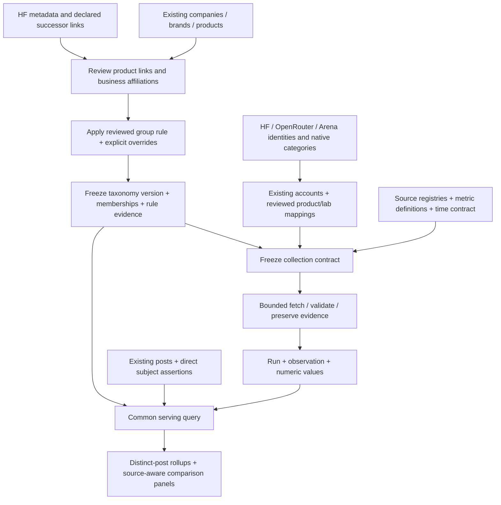
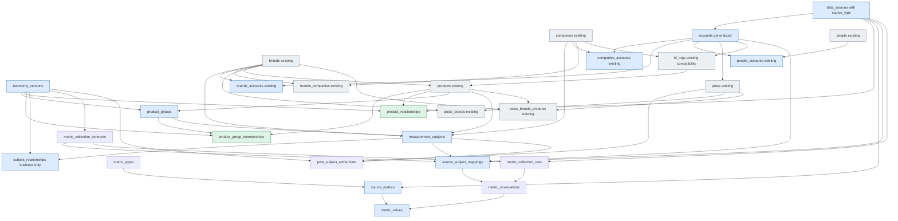
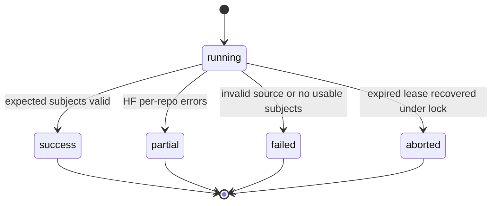
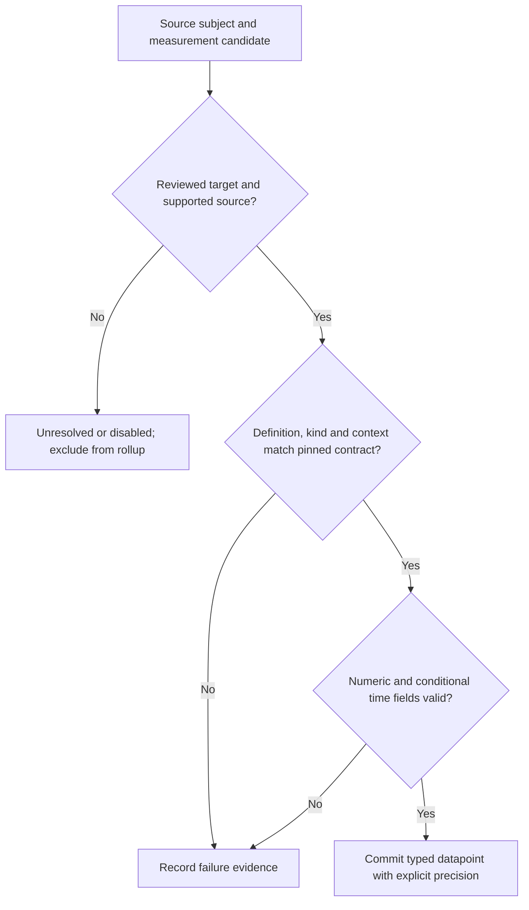
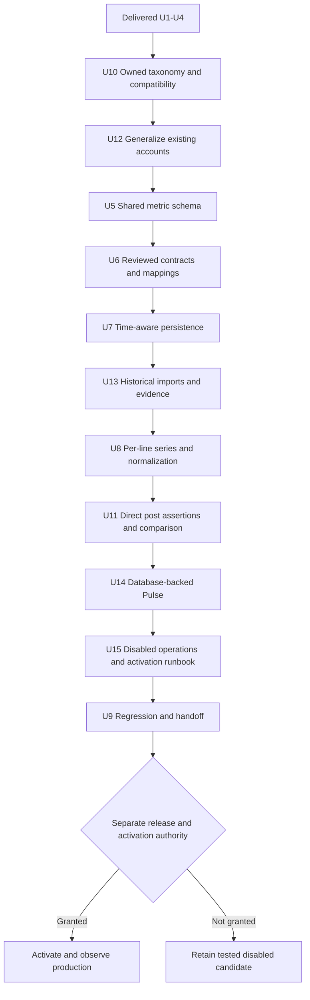

# Benchmark scores and model adoption in PostgreSQL

## Plain-English Summary

Compare post volume, benchmark scores, HF downloads and OpenRouter token usage using products we identify and a taxonomy we control. Product relationships store typed parent/child links using HF's vocabulary. Named product groups, such as M-family, have explicit membership; they are not compulsory levels between brands and products. Django queries interpret successor chains and groups while company ownership and brand membership remain separate.

The proposal contains fifteen new tables: eight shared source/metric tables and seven taxonomy/history/attribution tables. Reuse the existing accounts table and its company, brand and person links; do not create source_entities or source_accounts. Put the descriptive source_type directly on data_sources rather than creating data_source_types. The three product tables are product_relationships, product_groups and product_group_memberships. They replace the fixed product_families tier and product-level links in the old generic relationship proposal. The subject registry still supports direct company, brand, group and product mentions.

Measurements have two primary kinds: state at an effective time, and flow over an interval. Cumulative downloads are flow since the provider's counting origin. There is no third cumulative kind, cumulative boolean or duplicate origin column. Window mode, duration, source timezone and actual datapoint bounds are separate. Unknown times remain unknown.

Arena, HF and OpenRouter remain the first collection choices; AA and Vercel remain disabled candidates informed by the saved probes. Provider identities map to our products and reviewed product types. X and HF are the initial account-bearing sources. An account belongs to one source; YouTube and Instagram can use that same structure later. OpenRouter/Arena product listings remain identifiers in the crosswalk, without invented accounts. HF organizations migrate into accounts with phased hf_orgs compatibility. Publisher-wide coverage remains a filter, not a product group.

The October 6 Pulse exercise adds a production comparison contract: each line has its own explicit subject scope, source configuration and baseline. DeepSeek brand posts can therefore appear alongside V4.1 Flash downloads, tokens, Arena score and Arena rank without claiming every post mentions Flash. Percent change is calculated from a fixed starting value; missing launch-day measurements stay missing, and a later baseline is labeled. Historical imports retain their archive provenance and original snapshot dates.

This revision updates the canonical plan on fuchitalee. It remains independent of G1–G5 and implements no code, migrations, catalog changes or scheduling. Future units now include historical imports, a database-backed Pulse response and UI, and collection operations with separately authorized activation. Verification must reproduce the five-line comparison, preserve exact raw values and coverage, and prove unchanged legacy counting on isolated PostgreSQL. Account abstraction requires a staged primary-key/foreign-key migration and source-qualified lookups, including the migration-only global handle index; this is not a column rename. Existing unset product types and unconfirmed mappings remain setup work; illustrative M-series links are not verified HF observations.

## Goal Capsule

Objective: users can compare post attention with benchmark performance and adoption, knowing which entities, units and periods each point actually represents. Means: the owner-controlled taxonomy and shared metric schema below (KD3, KD6–KD15; KTD1–KTD6), delivered in the existing isolated feature worktree. Preserve U1–U4 as historical baseline; execute future units in dependency order, not numeric order. Current endpoint is amending this canonical plan with the Pulse prototype findings; delivery remains on-request. Stop at documentation delivery unless the owner separately selects implementation or release.

## Delivery Exceptions

**Active LFG authorization — tested and ready (October 6):** the owner now authorizes implementing this plan through local verification and review, with a persistent isolated PostgreSQL database containing relevant real catalog/account/post records and imported historical HF/OpenRouter/Arena data. Provide working SQL/Django queries, repeatable collection commands and a database-backed local Pulse chart, plus the second-product/configuration and tracked-brand coverage checks. Retain the development database and browser preview for owner review. Production migration, deployment, source scheduling and UI activation remain excluded until a later owner decision. Production reads needed for the bounded development copy are read-only; never load development data into production. The LFG review/commit/PR workflow may prepare a reviewable candidate; an open PR is not permission to merge or deploy. Earlier planning-only endpoint prose is superseded by this instruction. Current `delivery_target: on-request` records the absence of managed staging/production selection.


**Current endpoint, October 6 Pulse follow-up:** the owner asks to add the prototype adjustments to this plan. Amend requirements and implementation/verification units only. Earlier Downloads/agents deliveries below are historical; current host authority keeps new project artifacts on fuchitalee and uses allenwlee only as a keyboard/browser endpoint. Production serving and collection activation are now planned work, not authorized actions in this revision. No additional provider calls or database writes are needed. The existing fifteen-table inventory and relationship diagrams remain structurally valid; this amendment adds contracts and execution units, not tables or joins.

The earlier LFG authorized the delivered U1–U4 baseline and PR #50. On 2026-10-05 the owner explicitly selected ce-plan first and corrected storage to a full database schema; the earlier bounded probes remain evidence. The current revision authorizes documentation and review-copy delivery only. It does not resume implementation, source probes, catalog writes, migration execution, Git delivery, deployment or scheduling. The owner requested reusable source categories and metric types, specifically Arena and future Artificial Analysis as benchmark siblings. October 6 decisions establish our owned taxonomy, exactly two measurement kinds (state/flow), since-origin flow for cumulative activity, independent window duration and explicit timezone handling. The latest request replaces the compulsory family tier with product_relationships, product_groups and product_group_memberships, including reviewed successor-chain rules, and updates the existing amended review copy and images in Downloads/agents. HF model/dataset/space repository types remain provider-specific scopes without a category bridge. The latest owner correction restores metric terminology and the earlier metric table/column names; measurement_subjects and measurement_kind retain their existing roles. This naming correction changes no structure or temporal semantics. The latest owner decision removes source_entities entirely and generalizes existing accounts, preserving companies_accounts, brands_accounts and people_accounts. X/HF have accounts initially; YouTube/Instagram are future compatible sources, not authorized collectors. The requested whole-schema reuse audit also removes the unnecessary data_source_types lookup in favor of data_sources.source_type. Product/leaderboard identifiers stay directly in source_subject_mappings. U12 plans the existing-account migration; nothing in this revision executes it. Preserve the October 5 original review. Reviews run inline under AGENTS.md's Task mapping.

## Product Contract

### Problem Frame

Convenience brand assignments mix companies, product lines and individual releases. Carrying those ambiguities into provider joins makes identity matches and post totals unreliable. Provider measures also have different temporal meanings: one fetch can contain a rolling download flow, a since-origin download flow and scores whose publication has only date precision. The comparison needs explicit identity and time contracts before more sources are added.

### Requirements

Stable requirement IDs are retained; R18 captures provider-neutral accounts and R19–R24 capture the Pulse prototype adjustments.

| ID | Required outcome |
| --- | --- |
| R1 | Own and version our canonical taxonomy; preserve existing company/brand keys and Product.product_key. Support closed models without an HF repository. Collection never mutates the catalog; any prerequisite catalog corrections use a separate, explicitly reviewed manifest. |
| R2 | Link exact provider identifiers to reviewed canonical subjects with evidence. HF/Arena/OR model rows must resolve to product subjects; explicitly lab-scoped datasets may resolve to company subjects. Reject unknown targets, duplicate source IDs, wrong ownership and changed model variants. Unmatched observations remain stored and visibly unresolved. |
| R3 | Collect Arena overall text_style_control ratings, uncertainty, votes and publication date from the official public dataset. Reject incomplete/malformed publications. |
| R4 | Collect rolling 30-day and optional all-time HF download counts for explicitly selected official LLM repositories. Retain per-repository observation time; never infer daily download counts. |
| R5 | Collect completed UTC-day OpenRouter rankings: exact model_permaslug, total_tokens, meta.as_of and the other bucket when present. This is token usage on a partially reported platform, not downloads. |
| R6 | Store typed observations, raw evidence, source outcomes and immutable versions of selections/mappings in PostgreSQL. Preserve revisions and failures. Repeated polls must not be summed. |
| R7 | Serve a Pulse comparison with five independently selectable lines: posts, HF rolling downloads, OpenRouter tokens, Arena score and Arena rank. Offer fixed-baseline percentage change and raw values with source units, configuration, dates, coverage and missing/failure states. Preserve the existing four-panel report as an offline diagnostic consumer of the same series service. |
| R8 | Arena score for a selected company/brand/group scope is the maximum reviewed mapped rating within a complete publication. Retain its winning model and uncertainty. Hold until the next observed publication; absence in a later publication becomes N/A. No carry across configuration or collection-contract changes. |
| R9 | Daily HF selected-scope total uses the latest complete observation of exactly its selected repository cohort. Incomplete cohorts produce N/A with counts. No observation means a gap; no selected repo means N/A. |
| R10 | OpenRouter selected-scope total sums distinct mapped reported rows once per date, from one latest complete source revision. Describe it as reported usage, with unresolved coverage. Absence from top 50 is not zero total usage. Never allocate other to brands. |
| R11 | Count distinct Post.tweet_id at the selected subject/rollup scope and requested event-time window. Retain PostBrand UTC-day results for the compatibility report until explicit cutover; new direct subject attribution never invents a product from a broad mention. Label coverage and attribution policy. |
| R12 | Bound requests, redirects, bytes, rows and time. Never save credentials/headers/signed redirect URLs. Persist partial/failure outcomes and return nonzero on incomplete collection. Offline parsing/report fixtures remain available without credentials; database-backed commands require PostgreSQL. |
| R13 | Register named data sources with a descriptive source_type column and metric definitions under metric types. Arena and future AA share source_type=benchmark. Reuse accounts for platform accounts and source_subject_mappings for product/lab identifiers; preserve phased hf_orgs compatibility. |
| R14 | Preserve companies, brands and product/release identities. Store HF-style typed product relationships and generic named product groups with explicit membership, not a fixed family tier. Direct broad mentions remain broad; frozen taxonomy versions preserve grouping and ownership interpretation. |
| R15 | Keep exactly two measurement kinds, state and flow. Cumulative activity is flow with window_mode=since_origin; preserve real counting origin in window_start_at when known. Representation, quantity, unit, window mode/duration/alignment and effective timestamps are separate; no cumulative boolean or duplicate origin column. |
| R16 | Preserve source timezone, precision and unknown timing. Store known instants in UTC; half-open flow intervals use start/end. Collection time, source revision/publication and measurement effective time are distinct. Reject ambiguous local timestamps unless an offset or documented disambiguation is present. |
| R17 | Introduce precise identity beside existing tables and migrate consumers separately through compatibility reads. Company/group-only mentions do not invent product mentions. Preserve supported historical evidence. X is another source registry entry, with native posts remaining in existing event tables. |
| R18 | Generalize existing accounts with provider-scoped identity and preserve company/brand/person links. X and HF are initial account sources; future YouTube/Instagram fit without a new account table. No source_entities or source_accounts. Prevent cross-provider handle/ID collisions and preserve X post/list/staff behavior during migration. |
| R19 | Declare scope per line, not once for the whole chart. Allow DeepSeek brand-wide posts beside exact V4.1 Flash product measurements; show the distinction and preserve the post attribution policy. A correlation or assumed launch effect does not create product attribution. |
| R20 | Derive percentage change as 100 × (value / baseline_value − 1), never by summing daily percentages. Preserve baseline date/value/evidence per line. Missing or zero baselines produce an explicit unavailable state; a selected later first-observation baseline is labeled and never backfilled to launch. Rank uses the same formula and states that a lower numeric rank is better. |
| R21 | Store a reviewed launch anchor with product identity, event meaning, source URL/native ID, date or instant, timezone/precision and review evidence in the frozen comparison specification. Do not substitute HF repo creation, first collection or first benchmark publication. |
| R22 | Import bounded historical measurements through the shared writer with archive publisher, immutable revision, payload hash, native snapshot date/time, actual retrieval/import time and coverage. Community archives remain visibly secondary evidence. Historical replay and revised snapshots are idempotent/revision-aware, not summed. |
| R23 | Preserve source configuration and coverage in each displayed point: Arena category/style-control/Max variant, OR reported top-50 coverage and completed UTC days, HF fixed selected cohort and unknown rolling cutoff, and partial post days. Missing, partial, carried-forward and observed zero are distinct states. |
| R24 | Plan database-backed Pulse serving, reviewed source-specific collection cadences, freshness/failure visibility and an activation/rollback procedure. Keep all activation disabled until separately authorized; the prototype and offline report are not production completion evidence. |

### Settled decisions

- **KD1 (session-settled: user-directed) — corrected storage; Governs R1, R6:** isolation means the feature worktree and disabled activation. Primary PostgreSQL persistence is required. The earlier file-only storage decision was an agent interpretation, not an owner selection.
- **KD2 (session-settled: user-approved) — sources; Governs R3, R4, R5:** Arena first, HF downloads and OpenRouter usage. AA is an authenticated, probed benchmark candidate; Vercel is a probed usage-share candidate. Both remain disabled pending selection. Terminal-Bench/DeepSWE remain deferred.
- **KD3 (session-settled: user-directed) — taxonomy; Governs R1, R2:** Our proprietary taxonomy is authoritative, informed by HF and other providers. Stable identities and reviewed relationships belong to us; HF namespaces/repositories and provider creators are external evidence, not compulsory company/brand/group levels.
- **KD4 — technical choice; Governs R4, R5, R7:** retain native timestamps and provide an honest daily comparison first. Frequent polling can detect HF/Arena changes sooner but cannot turn OR daily totals into minute usage or HF rolling totals into daily downloads.
- **KD5 (session-settled: user-directed) — Google exclusion; Governs R1, R2, R4:** Google collection defaults to Gemma/Gemini families only, with explicit model selections. Other Google families are excluded unless the owner adds one. Do not delete excluded canonical products.
- **KD6 (session-settled: user-directed) — reusable sources and measurements; Governs R6, R13:** sources are registry rows with a shared source_type value; metric definitions share semantic metric types. Arena and future Artificial Analysis belong to benchmark. Replace the provider-specific persistence design rather than adding another custom table set.
- **KD7 (session-settled: user-directed) — entity scope; Governs R11, R14, R17:** broader feedback remains useful, but product identity and broad direct attribution must be explicit. The subject registry, product relationships, generic groups/memberships and gradual cutover below implement that distinction; this plan approves no catalog edits.
- **KD8 (session-settled: user-directed) — time semantics; Governs R15:** use state/flow only, with cumulative activity represented as since-origin flow; keep window duration/alignment and per-value bounds independent.
- **KD9 (session-settled: user-directed) — timezone vigilance; Governs R16:** unknown precision/zone is preserved rather than manufactured; display timezone does not redefine source windows.
- **KD10 (session-settled: user-directed) — product graph and groups; Governs R14/R17:** product_relationships stores HF-style typed parent/child facts; product_groups and product_group_memberships store deliberate grouping independently. Family/series labels are interpretations, not required entity tiers. No publisher-wide group rule: publisher coverage is already a filter.
- **KD11 (session-settled: user-directed) — grouping automation; Governs R14:** a reviewed rule can include a root product and follow accepted new_version links transitively. Preserve rule versions, evidence paths and manual exclusions; missing edges stay unresolved. Technical derivatives are not automatically successors or lab-owned offerings.
- **KD12 (session-settled: user-directed) — naming and external identities; Governs R2/R13:** use metric table names (metric_types, source_metrics and metric_* fact/processing tables), separate semantic metric types from units, and reuse accounts for HF publishers and source_subject_mappings for external product/lab identifiers; no universal external-entity table. Product.type remains our reviewed classification, not a direct HF enum.
- **KD13 (session-settled: user-directed) — account reuse; Governs R18:** accounts belong to one data source. Reuse existing account-to-company/brand/person relationships; abstract X assumptions before accepting HF accounts. A model listing, benchmark row or provider creator label is not an account.
- **KD14 (session-settled: user-directed) — comparison scope and arithmetic; Governs R19/R20/R23:** the Flash comparison starts at its launch date and uses all DeepSeek brand posts, exact Flash HF/OR identifiers and separate Arena score/rank. A rolling-download change of 10 → 11 → 13 displays 0%, 10%, 30%. Arena's later published baseline must remain explicit.
- **KD15 — technical proposal informed by the prototype; Governs R21/R22/R24:** reuse the fifteen tables and their versioned JSON contracts for sourced comparison anchors, archive provenance and per-line definitions. Add historical import and production serving/operations units. The compressed percentage view demonstrated five-line visibility but is not yet an owner-approved final design.
- No automatic fuzzy matching, bulk catalog reclassification or benchmark methodology blending. Scheduling and production activation are planned in U15, but are not executed or authorized by this planning revision.

## Planning Contract

### Baseline and source of truth

Current feature branch: feat/benchmark-download-collector; baseline commit 46002195e58c3bf1d2db85cd59673981221b37ff; [PR #50](https://github.com/allenwlee/pushin-weight-v2/pull/50). U1–U4 delivered a bounded file collector, read-only input exporter and offline HTML report. Its prior 89-test and CI evidence applies to that baseline, not this unimplemented database proposal.

core/models.py and core/migrations/ own the schema. Observed migration leaf is 0064_affiliation_text_provenance. Before implementation recheck the leaf and shared-file ownership because other sessions can add migrations. Do not allocate a competing migration number now.

Reuse scripts/benchmark_download_collector source parsers and report components, core/hf_metadata_client.py request limits, and the independent-lock shape in core/hf_catalog.py. Do not reuse its actual lock key or monitor/run_lock.py's harvester lock. Existing HF catalog run/namespace/observation tables describe catalog refresh, not measurement time series.

### Bounded live probes and exact types

The October 5 receipts and raw responses are under [the source-probe appendix](../analysis/2026-10-05-204735-benchmark-source-schema-probes/). Observations were made on 2026-10-05 around 11:49–11:56 UTC. These are public metadata and a read-only catalog snapshot; no model weights or source posts were downloaded. Values below are probe evidence, not hard-coded production model assumptions.

| Source / request | Result and bound | Data time |
| --- | --- | --- |
| HF GET /api/models/deepseek-ai/DeepSeek-V3?expand=downloads&expand=downloadsAllTime | HTTP 200; 113 bytes; 1 physical request; 25 s timeout; 512 KiB cap | No metric timestamp supplied; record retrieval time per repository. |
| OpenRouter GET /api/v1/datasets/rankings-daily, start/end=2026-10-04, period=day | HTTP 200; 5,376 bytes; 1 request; 25 s; 512 KiB; owner-selected key ending 362; no redirects | usage_date 2026-10-04; meta.as_of 2026-10-05T11:49:08.453Z |
| Arena official latest text_style_control Parquet | HTTP 302 then 200; 606,130 bytes; 2 physical requests; 25 s per hop, 4-hop/8 MiB wire/50,000-row/32 MiB decoded ceilings | 10,923 rows, 413 overall rows; publication date 2026-10-02 |
| OpenRouter GET /api/v1/models, public catalog | HTTP 200; 763,948 bytes; 1 request; 25 s; 8 MiB cap | 466 model rows; 178 nonempty hugging_face_id fields |

Arena artifact SHA-256: 11149e9035241fabaa1158873e43c398f98ed81ff747c24328ec87913e6091a5. Signed CDN redirect URLs were not saved.

| Wire field | Observed example | Actual wire type → normalized SQL |
| --- | --- | --- |
| HF id | deepseek-ai/DeepSeek-V3 | JSON string → VARCHAR(256) |
| HF downloads | 1370380 | JSON integer → NUMERIC(30,0) integer_value; nonnegative, rolling 30 days |
| HF downloadsAllTime | 21769531 | JSON integer → NUMERIC(30,0) integer_value when supplied; nonnegative |
| OR date | 2026-10-04 | JSON string YYYY-MM-DD → DATE |
| OR model_permaslug | stealth/space-bunny-alpha | JSON string → VARCHAR(256), exact case-sensitive source identity |
| OR total_tokens | "6727489898018" | JSON digit string → NUMERIC(30,0), exact integer |
| OR meta.as_of | 2026-10-05T11:49:08.453Z | JSON UTC timestamp string → TIMESTAMPTZ |
| OR meta.version | v1 | JSON string → run source_metadata JSONB |
| OR other total_tokens | "1299345415183" | Same exact numeric type; preserve separately, never map to a product |
| Arena model_name / organization / license | gemini-4-argon-high / google / Proprietary | Arrow string → VARCHAR(256) / TEXT / TEXT |
| Arena rating | 1525.2150000155266 | Arrow double → DOUBLE PRECISION |
| Arena rating_lower / rating_upper | 1516.3851952929315 / 1534.0448047381217 | Arrow double → DOUBLE PRECISION |
| Arena variance | 20.295792582536265 | Arrow double → nullable DOUBLE PRECISION |
| Arena vote_count | 4932.0 | **Arrow double**, not int → NUMERIC(30,0) integer_value only after finite, whole-number and safe-range validation |
| Arena rank | 1 | Arrow int64 → NUMERIC(30,0) integer_value when supplied |
| Arena category | overall | Arrow string → VARCHAR(64) |
| Arena leaderboard_publish_date | 2026-10-02 | Arrow string → DATE; do not invent a publication time |

Arena's Arrow schema declares all fields nullable. Required identity/date/rating/vote fields that are null fail the publication; optional descriptive fields remain null. Download counters must be genuine integers, not booleans or fractional values. An absent optional all-time count has no metric-value row and is recorded as unavailable on the observation; never zero.

Validate OR token strings as 1–30 ASCII digits before insertion; never parse through float. Export them to browser JSON as decimal strings. Validate all score doubles as finite; lower ≤ rating ≤ upper; variance ≥ 0 when supplied. A double vote count must be integral, nonnegative and ≤ 2^53−1, then converted exactly. JSON cannot represent NaN/Infinity as valid source values.

[OpenRouter documentation](https://openrouter.ai/docs/api/api-reference/datasets/daily-token-totals-for-top-50-models) identifies the daily top-50 dataset, optional other when the tail is empty, UTC as_of, token accounting and account/key rate limits. [HF documentation](https://huggingface.co/docs/hub/en/models-download-stats) explains qualifying file requests; downloads are not unique users. [ModelInfo](https://huggingface.co/docs/huggingface_hub/en/package_reference/hf_api#huggingface_hub.ModelInfo) distinguishes rolling and all-time counters. [Arena's official dataset](https://huggingface.co/datasets/lmarena-ai/leaderboard-dataset) documents tracks/publications; the saved Parquet probe supplies the actual vote_count double type. SQL choices follow [PostgreSQL numeric types](https://www.postgresql.org/docs/current/datatype-numeric.html).

### Existing catalog findings and Google exclusion

The read-only production snapshot contains 2,407 products, 50 brands, 31 companies and 30 HF namespaces, 28 confirmed. All Product.type values are null. There are 603 brand-unassigned products. Current export_benchmark_inputs filters type=llm-model and therefore cannot supply a usable cohort from this snapshot. Pipeline tags help review but do not by themselves authorize typing or brand assignments.

The snapshot identifies 500 Google-owned products through HF ownership: 70 already assigned to Gemma and 430 excluded other-family/brand-unassigned rows. This is the current verified snapshot count; the owner's approximate older-catalog count does not change the exclusion rule. Gemini has zero canonical product rows. Allowed family does not mean all 70 Gemma repositories are selected; pick a few exact versions. Unassigned Google repositories, including potentially relevant family variants, remain blocked until reviewed.

Do not bulk mark 2,407 products as LLMs or assign 603 missing brands. Build an explicit review manifest containing existing product UUIDs and only necessary field corrections, or explicit UUIDs for new closed-model products. Collection configuration must distinguish proposed from accepted rows. The collector itself cannot create products, brands, companies or HF organizations.

### Proposed source-to-canonical mapping

These appendices are part of this plan's data contract, not a second plan:

- [Every current product: 2,407-row CSV](../analysis/2026-10-05-204735-benchmark-source-schema-probes/proposed-product-crosswalk.csv), with full product UUID, brand/company/HF identifiers, ownership guard, OR and Arena candidates, missing/exclusion statuses.
- [Every brand: 50-row CSV](../analysis/2026-10-05-204735-benchmark-source-schema-probes/proposed-brand-crosswalk.csv), including company IDs, confirmed namespaces, product coverage and exact proposed provider identifiers.
- [Machine-readable product crosswalk](../analysis/2026-10-05-204735-benchmark-source-schema-probes/proposed-product-crosswalk.json), [brand crosswalk](../analysis/2026-10-05-204735-benchmark-source-schema-probes/proposed-brand-crosswalk.json), [summary](../analysis/2026-10-05-204735-benchmark-source-schema-probes/crosswalk-summary.json), [Google exclusion](../analysis/2026-10-05-204735-benchmark-source-schema-probes/google-scope.json).

**These crosswalks preserve the legacy catalog snapshot and discovery candidates. They do not establish product lineage, group membership or a new ownership interpretation or convert provider creators into canonical brands. U10 reviews the selected subject relationships; U6 accepts only a versioned, evidenced source crosswalk.**

**No mapping is confirmed yet.** Across the full catalog, before eligibility/exclusion review, 122 products have a direct OR hugging_face_id candidate, 103 have an Arena name candidate, 163 have either and 62 have both. Name candidates use conservative case/punctuation normalization for discovery only; this does not prove version, quantization, reasoning effort or provider equivalence. Nonmatches are listed rather than assigned a zero.

| Canonical product UUID | Brand → company | HF repository | OR API route → canonical/usage candidate | Arena candidate |
| --- | --- | --- | --- | --- |
| 86e71f83-03e7-4b42-9318-f3cf1c1a0af5 | qwen → alibaba | Qwen/Qwen3.8-27B | qwen/qwen3.8-27b → qwen/qwen3.8-27b-20260814, observed in usage | qwen3.8-27b; organization alibaba |
| cceb45fc-f883-4b25-8c9d-aeba27ca82d6 | glm → zhipu | zai-org/GLM-5.3-Flash | z-ai/glm-5.3-flash → z-ai/glm-5.3-flash-20260826, observed in usage | glm-5.3-flash; organization zai |
| cc1eecee-1927-4094-9b4b-fcf58fcf3c5f | deepseek → deepseek / deepseek_co | deepseek-ai/DeepSeek-V3 | deepseek/deepseek-chat → deepseek/deepseek-chat-v3, catalog candidate only | deepseek-v3; organization deepseek |
| 9d0d3920-6e85-47a3-bfff-766dde523840 | moonshot_kimi → moonshot | moonshotai/Kimi-K2.6 | moonshotai/kimi-k2.6 → moonshotai/kimi-k2.6-20260420, catalog candidate only | kimi-k2.6; organization moonshot |
| 605aa600-9e77-45e0-9c19-84bbb999db21 | minimax → minimax | MiniMaxAI/MiniMax-M3 | minimax/minimax-m3 → minimax/minimax-m3-20260531, observed in usage | minimax-m3; organization minimax |

For OR, retain three distinct identifiers: API id, canonical_slug and rankings model_permaslug. In this probe, 42 of 50 ranked identifiers match catalog canonical_slug; only five match catalog id. Do not assume either field always matches. The live catalog's hugging_face_id supplies evidence candidates but is not sufficient approval; some rows have null/empty links. It is observed in our response, not a field guaranteed by the retrieved [model catalog documentation](https://openrouter.ai/docs/api/api-reference/models/list-all-models-and-their-properties).

Free/batch routes may share one canonical slug. Keep route aliases as mapping metadata and store the actual usage identifier once; do not create another Product or count the same usage twice. If distinct usage variants legitimately map to one Product, require explicit equivalence evidence; otherwise use distinct canonical products or leave unresolved.

Arena's model_name is an exact source identifier scoped to the selected benchmark configuration. organization is descriptive evidence, not our company/brand key. Reasoning-effort/system variants stay distinct until reviewed. Existing convenience brands such as anthropic/openai require explicit review; do not silently reinterpret them as product families or merge them with claude/gpt. glm and chatglm, seed and doubao, and Gemini versus Gemma remain separate. Brand-only prefix candidates for Claude/Gemini are a review aid with no product target, never accepted product mappings.

Mapping acceptance for initial model sources requires: known stable product UUID and product subject; reviewed llm-model type; explicit reviewed rollup relationships (or a documented unresolved parent), not merely a convenient legacy brand; correct confirmed HF ownership for selected HF repos; exact provider identifier with source/evidence; explicit version/variant check. For closed products, HF repo and org may be null, and company membership still must be reviewed. Each accepted mapping is frozen into a new contract and taxonomy version, preserving historical attribution when live taxonomy later changes. Existing brand assignments are evidence for review, not an irrevocable grouping or technical lineage.

### Additional probes and provider taxonomy findings (October 6 revision)

The following summaries are derived from requests executed in this session. They are saved in [the amendment evidence appendix](../analysis/2026-10-06-123601-benchmark-taxonomy-time-plan/additional-probe-summary.json). Their raw bodies were not retained, so these summaries are not raw-response fixtures. Reuse their facts for planning; capture an explicitly authorized bounded response before implementing a new adapter.

| Provider / request | Observed response | Identity and metric implications |
| --- | --- | --- |
| AA GET /api/v2/data/llms/models, authenticated with ARTIFICIAL_ANALYSIS_API_KEY | HTTP 200; 611,381 bytes; 690 model/config rows, 690 unique UUID-shaped string IDs; 58 creators; one request, 25 s, 8 MiB, no redirects | Model id/name/slug/release_date strings; creator id/name/slug strings. evaluations numbers or null; price/performance numeric. No HF identity field observed. |
| Vercel GET /api/ai/leaderboard-export?dataset=models&modality=text, public | HTTP 200; 180,515 bytes; 1,487 rows, including 448 metric=tokens; dates 2026-08-07–2026-10-06 | date/group/name/metric/modality strings; share_percent float. Daily percentages, not absolute token counts; display-name mappings and timezone need verification. |

AA response digest was `6b18c07c612ae8817c13b95649ffa395acb48e5708117c6bac3950cb141d8321`. It records observed response identity, not proof of a retained raw artifact. Envelope: status, prompt_options, data. Actual prompt_options.parallel_queries=1 and prompt_length=1000 are integers. `evaluations` has 18 keys, including intelligence/coding/math indexes, GPQA, HLE, IFBench, LCR, TerminalBench variants and tau2; missing scores are null. Release date is model metadata, not a measurement timestamp. Speed/latency zeros occurred; do not automatically turn them into nulls.

| Actual AA identity/value | Observed wire type | Mapping implication |
| --- | --- | --- |
| MiniMax-M2.5 id=12adec16-19fe-4d92-aeff-5ef3eb7e780a; slug=minimax-m2-5 | Strings; UUID-shaped id | Map exact AA ID to reviewed product subject |
| MiniMax-M2.7 id=4bbceacb-cf47-464b-b60f-e1d1fe016d67 | String | Distinct release; possible shared reviewed product group, never same product automatically |
| MiniMax-M3 id=277f939a-985b-4b37-859d-b3eabc7c0b26 | String | Distinct release, matching candidate from earlier crosswalk only after review |
| MiniMax creator id=a31a9071-6144-4dbb-92dc-2e02d653ecea; slug=minimax | Strings | External creator evidence for company, not a brand/family key |
| Qwen3.8 Max id=5e5b4ce7-bc54-47b2-b911-21b9cad8394c; creator Alibaba id=d874d370-74d3-4fa0-ba00-5272f92f946b | Strings | AA creator is Alibaba, while Qwen is our possible brand |
| MiniMax-M2.5 artificial_analysis_intelligence_index=22.8; gpqa=0.848; terminalbench_hard=0.348484848484849 | JSON float | Index and benchmark fractions require different native units/configurations |
| MiniMax-M2.5 artificial_analysis_coding_index=null; terminalbench_v2_1=null; terminalbench_v4_0=null | JSON null | Unavailable, no metric-value row; not zero |
| MiniMax-M2.5 pricing input=0.3, output=1.2, blended=0.525 | JSON float | USD per million tokens; outside this first-pass score/usage collection |
| Vercel date=2026-08-07, group=model, name=Other, metric=tokens, modality=text, share_percent=78.3238 | Strings and JSON float | Aggregate share; not a product mapping or count. No named MiniMax token row in that response is absence, not zero usage. |

[AA API reference](https://artificialanalysis.ai/api-reference) documents free keyed access, the request allowance and attribution. AA remains a benchmark source sibling of Arena; its creator/model taxonomy cannot replace ours. The [Vercel open-data announcement](https://vercel.com/changelog/open-data-and-shareable-charts-for-ai-gateway-leaderboards) documents downloadable model/lab leaderboards and daily caching. The probed envelope names CC-BY-4.0; preserve source attribution for any later use. Neither probe authorizes an adapter, schedule or retrospective collection.

DeepInfra/Fireworks/Together scale research is context, not a selected measurement dataset. No documented public platform-wide daily per-model absolute-token endpoint was established for DeepInfra. Gateway and backend traffic may overlap (e.g. [DeepInfra on OpenRouter](https://openrouter.ai/provider/deepinfra)); do not sum platforms as a deduplicated global total. Vercel's percentages cannot be presented as an absolute OpenRouter alternative.

## Proposed database schema

**Fifteen proposed new tables plus changes to existing account-related tables; no implementation in this revision.** The existing-schema audit removes source_entities and data_source_types from the preceding seventeen-table proposal. Reuse accounts and its joins, put source_type on data_sources, and store external product/lab identifiers directly in the crosswalk. Account migration is explicitly planned in U12. Relevant existing tables are shown with their affected relationships.

### Changes against the preceding amended review

| Previous proposal | Current proposal | Why |
| --- | --- | --- |
| product_families as a mandatory taxonomy tier | product_groups with a descriptive group_kind | A named family/series is a grouping, not a compulsory identity level |
| Generic subject_relationships stores product variants and family containment | product_relationships for technical/successor links; product_group_memberships for grouping; subject_relationships narrowed to business affiliations | Separate technical ancestry, deliberate membership and ownership |
| Broad family labels derived from one universal hierarchy | Versioned explicit memberships, optionally generated by a reviewed successor-chain rule | Support incomplete metadata, exceptions and direct group mentions |
| Publisher-wide product-group rule | No such rule; filter by source publisher identity | Avoid duplicating HF organization association |
| source_entities for accounts and product listings | Existing accounts for accounts; source_subject_mappings for external product/lab IDs | Reuse company/brand/person account links; avoid a duplicate entity registry |
| data_source_types lookup | data_sources.source_type column | Three descriptive categories need no independent table |
| X-only account key/handle uniqueness | Internal account UUID and provider-scoped identifiers/handles | Prevent collisions when HF and later social platforms share account storage |
| Earlier metric table names | Retain metric_types, source_metrics and metric_* processing/fact tables | Owner reverted the measurement rename; unit remains a separate field |
| state, flow and cumulative counter | state or flow; all-time activity uses since_origin | Cumulative activity is interval flow; no redundant boolean/origin field |

### Colored relationship image


[Zoomable SVG](../reviews/2026-10-06-123601-benchmark-table-relationships-diff.svg). Grey denotes existing context or a retained proposal; blue denotes account-related changes against the preceding proposal. Labels distinguish existing from proposed tables. product_families is removed from this proposal and replaced by product_groups. Arrows run from the referenced table to the table holding its FK. This comparison uses the preceding seventeen-table proposal; removed tables are listed in the legend rather than shown as active tables. Existing account tables that need migration are blue. Repository schema evidence is not a live production verification. Every proposal box remains unimplemented.

### Product relationship and grouping detail


[Zoomable product detail SVG](../reviews/2026-10-06-143634-product-lineage-and-groups.svg). A group is a stable named selection; a membership links the group to a product. A typed parent/child claim is stored independently. The group's optional root is a rule input, not another compulsory taxonomy level.

### Table inventory and grain

“Grain” means exactly what one row represents.

| Table | One row represents | Diff |
| --- | --- | --- |
| data_sources | A named data origin with descriptive source_type | Amended |
| metric_types | What is measured, such as downloads or benchmark_score | Retained; semantic family, not a unit |
| source_metrics | One immutable source/measurement/semantics version | Amended: two kinds and independent window fields |
| metric_collection_contracts | One frozen mapping/definition/taxonomy/report policy | Retained |
| source_subject_mappings | One reviewed provider product/lab ID→canonical subject in a contract | Amended: direct source/identifier and optional publisher account |
| metric_collection_runs | One bounded fetch and outcome | Retained |
| metric_observations | One source row/context retrieved in a run | Retained |
| metric_values | One typed numeric datapoint with its own time precision | Amended: since-origin flow and time fields |
| taxonomy_versions | One reviewed immutable identity/group/rule/affiliation snapshot | Amended |
| product_groups | One stable named group, such as M-family | Replaces product_families |
| product_relationships | One accepted typed product parent→child claim in a taxonomy version | Added |
| product_group_memberships | One inclusion or exclusion decision for a product/group/version | Added |
| measurement_subjects | One stable typed pointer to company, brand, group or product | Amended |
| subject_relationships | One reviewed business affiliation, excluding product lineage/group membership | Narrowed |
| post_subject_attributions | One evidence-backed direct post→subject assertion | Unchanged |

### High-Level Technical Design

The diagrams show proposed responsibilities and table relationships. Adapter implementations may refine local details while preserving identity, grain and time contracts.

### Collection and serving flow



### Relationship flowchart



The PR→PG FK above is an optional root product used by a successor-chain grouping rule; it is not a family parent. TV→PG records the reviewed version governing that stored rule; historical rule configurations remain in immutable snapshots.

### Identity, ownership and grouping rules

Products/releases are the precise measurement targets. Company, brand and product_group are also valid direct post subjects. M-family may contain reviewed M2.5/M2.7/M3 products without asserting technical ancestry. Hailuo and Qwen may remain reviewed brands; Alibaba and MiniMax remain companies. Examples are proposed assignments, not accepted catalog changes.

Product relationships use parent=base/older release and child=derived/successor. Initial descriptors are new_version, finetune, adapter, quantized and merge. HF's base_model identifies one or several parents, base_model_relation may be publisher-declared or HF-inferred, and new_version is a publisher-supplied older→newer pointer. Preserve exact raw fields, repo identities, revisions and observation time; HF categories are the default vocabulary, not independent certification of training history. A Git commit/repository clone is not by itself a new product or weight derivation. Fork/mirror claims belong to external repository evidence; no automatic product ancestry is inferred from them. Closed products and gaps can have reviewed publisher evidence without an HF repo. [HF metadata](https://huggingface.co/docs/hub/en/model-cards#specifying-a-base-model).

A product can have multiple parents; store one row per parent, with shared evidence identifying merge inputs. Unknown relations have no invented edge. The writer rejects self-links, cycles in the accepted successor/derivation graph, contradictory descriptors and evidence pointing at the wrong revisions. It does not infer new_version solely from a numerical name or similar weights. Weight inspection is not part of the first feature pass.

Companies/brands remain separate from technical lineage. subject_relationships permits company→brand owns and company/brand→product/product_group offers. Product→product links exist only in product_relationships; group→product inclusion exists only in product_group_memberships. A third-party derivative is not automatically owned/offered by its base model's lab. Preserve multiple owners and percentages as evidence; post counts are not fractional. Rollups use explicit affiliations and included memberships, never all technical descendants by default.

Named groups use a generic group_kind (series, family or collection), not a compulsory taxonomy tier. A reviewed new_version_chain rule contains a root product, allowed descriptors and reviewed ownership scope. It includes the root and follows accepted new_version edges transitively; no finetune/adapter/quantized/merge traversal in this rule. Refresh existing HF cards because the successor pointer is stored on the older repo. Missing edges remain unresolved; a name match may propose a candidate but cannot admit it. The illustrative M2.0→M3 chain has not been probed or accepted.

There is no publisher-wide group rule. Listing all models of an HF organization is a publisher-identity filter. Approved rule matches may be applied automatically to a new proposed taxonomy version after bounds, identity and ownership checks. Manual includes/excludes override generated membership; multiple evidence paths produce one membership decision. Record the exact rule version and accepted relationship path. An incomplete refresh is not evidence to delete membership. On complete re-evaluation, a removed/changed edge proposes a new version and preserves the older snapshot; ordinary measurement collection never changes grouping.

Django models, query methods and the serving service interpret these persisted facts. Deep traversal may use a bounded recursive SQL query inside that service; the ORM does not magically provide transitive ancestry or missing links. Reports pin a taxonomy version and use its frozen memberships, rule configuration, affiliations and labels. Named direct group mentions require a stable group subject and are not expanded into fabricated product mentions. [Django memberships](https://docs.djangoproject.com/en/5.2/topics/db/models/#extra-fields-on-many-to-many-relationships).

### Seven taxonomy/history/attribution tables

New FKs use Django PROTECT; SQL FKs enforce valid targets. Database constraints enforce local references/uniqueness/checks, while the writer validates graph, temporal and cross-row semantics. Immutable snapshots are protected through the owned writer, not against arbitrary administrator SQL. U10 creates these seven tables and data_sources required by product relationship provenance; U12 generalizes existing account tables; U5 adds the remaining seven shared metric tables.

#### taxonomy_versions — frozen interpretation

Columns: id UUID PK; version_hash VARCHAR(64) UNIQUE NOT NULL; snapshot JSONB NOT NULL; reviewed_by TEXT NOT NULL; created_at/reviewed_at TIMESTAMPTZ NOT NULL. Hash must be 64 lowercase hex. Snapshot freezes names, product types, modalities, group kinds/rule configurations, relationship claims, business affiliations, included/excluded memberships and evidence; no posts/secrets. Accepted rows are never edited in place. Referenced subjects/products/groups and rule roots must occur in that version.

#### product_groups — stable named grouping and current rule

| Column | SQL type / nullability | Meaning |
| --- | --- | --- |
| id | UUID PK | Stable group identity |
| group_key | VARCHAR(128) UNIQUE NOT NULL | Internal stable key, not an HF namespace |
| name / description | TEXT NOT NULL | Current display label and scope |
| group_kind | VARCHAR(32) NOT NULL | series, family or collection; interpretation, not level |
| rule_kind | VARCHAR(32) NOT NULL | manual or new_version_chain |
| root_product_key | UUID FK→products.product_key NULL | Root only for new_version_chain |
| rule_version | SMALLINT NOT NULL | Positive rule version |
| rule_configuration | JSONB NOT NULL | allowed relation types, reviewed owner/brand scope and bounded traversal settings; no executable expressions |
| rule_taxonomy_version_id | UUID FK→taxonomy_versions.id NOT NULL | Version accepting the current group/rule definition |
| created_at / updated_at | TIMESTAMPTZ NOT NULL | Registration/current definition update |

CHECK positive rule_version; allowlists; manual→root null and chain→root nonnull. Writer enforces exactly new_version traversal for this rule, ownership scope, finite budgets and supported declarative keys. Historical names/rules come from taxonomy_versions.snapshot, never the mutable current group row. This stores rules without a fourth product-group rule table or an arbitrary scripting engine.

#### product_relationships — typed directed product claims

| Column | SQL type / nullability | Meaning |
| --- | --- | --- |
| id | UUID PK | Accepted relationship claim |
| taxonomy_version_id | UUID FK→taxonomy_versions.id NOT NULL | Frozen acceptance version |
| parent_product_key / child_product_key | UUID FK→products.product_key NOT NULL | Multiple parent rows supported; older/base→newer/derived |
| relationship_type | VARCHAR(32) NOT NULL | new_version, finetune, adapter, quantized or merge |
| source_id | VARCHAR(32) FK→data_sources.id NULL | HF or other evidence provider; null for genuinely internal/publisher evidence without a registered provider |
| evidence_method | VARCHAR(32) NOT NULL | source_reported, publisher_declared, provider_inferred, artifact_verified or our_inference |
| evidence | JSONB NOT NULL | Exact source fields, parent/child IDs, URLs, source revision, method and reviewer rationale; no weights/secrets |
| observed_at | TIMESTAMPTZ NOT NULL | When relationship evidence was observed |
| reviewed_by / reviewed_at | TEXT / TIMESTAMPTZ NOT NULL | Acceptance actor/time |

UNIQUE(version,parent,child,type); CHECK parent != child and supported descriptors/methods; indexes(version,parent,type), (version,child,type). Accepted snapshot membership is the review state; a candidate remains in the review manifest until accepted. When HF inference cannot be distinguished from a publisher declaration, use source_reported and preserve the uncertainty in evidence. Writers check acyclicity, compatible evidence, exact identity and source consistency. A new_version edge means successor, not proof of weight derivation.

#### product_group_memberships — one inclusion/exclusion decision

| Column | SQL type / nullability | Meaning |
| --- | --- | --- |
| id | UUID PK | Group/product decision |
| taxonomy_version_id | UUID FK→taxonomy_versions.id NOT NULL | Frozen group membership version |
| group_id | UUID FK→product_groups.id NOT NULL | Named grouping |
| product_key | UUID FK→products.product_key NOT NULL | Member/candidate product |
| membership_status | VARCHAR(16) NOT NULL | included or excluded; serving reads included only |
| membership_method | VARCHAR(24) NOT NULL | manual_include, manual_exclude or rule_generated |
| rule_version | SMALLINT NULL | Generating rule version, null for manual decisions |
| evidence | JSONB NOT NULL | Rule configuration digest, accepted relationship path IDs, source revisions, multiple supporting paths and rationale |
| created_at | TIMESTAMPTZ NOT NULL | Decision observation/creation |

UNIQUE(version,group,product); indexes(version,group,status), (version,product,status). CHECK method/status combinations and positive rule version exactly when rule_generated. Writer verifies every path/edge belongs to that version and starts at the configured root; a root member has an empty path with explicit root evidence. Combine automatic/manual evidence into one decision; manual exclusion takes precedence. Excluded rows persist overrides but are not counted as members. This decision status is unrelated to the rejected cumulative-measurement boolean.

#### measurement_subjects — explicit typed targets

Columns: id UUID PK; subject_kind VARCHAR(16) NOT NULL (company, brand, product_group or product); company_id VARCHAR(64) NULL FK→companies.nickname; brand_id VARCHAR(64) NULL FK→brands.nickname; product_group_id UUID NULL FK→product_groups.id; product_key UUID NULL FK→products.product_key; created_at TIMESTAMPTZ NOT NULL. CHECK exactly one kind-matched nonnull FK; each target is individually UNIQUE. No unrestricted type/arbitrary_id reference. Existing product UUIDs remain unchanged.

#### subject_relationships — business affiliations only

Columns: id UUID PK; taxonomy_version_id UUID NOT NULL FK→taxonomy_versions; parent_subject_id/child_subject_id UUID NOT NULL FK→measurement_subjects; relation_kind VARCHAR(32) NOT NULL (owns or offers); effective_from_date/effective_to_date DATE NULL; effective_date_precision VARCHAR(16) NOT NULL (day or unknown); evidence JSONB NOT NULL. UNIQUE(version,parent,child,kind); CHECK parent != child and end>start when both dates known; indexes(version,parent), (version,child). Writer enforces company→brand owns or company/brand→product/product_group offers. No technical product edges, group membership or mandatory family hierarchy in this table. Different valid-time segments require separate frozen versions in this first pass. Less precise evidence remains in JSON; do not invent a day.

#### post_subject_attributions — direct evidenced assertions

Columns: id UUID PK; post_id TEXT NOT NULL FK→posts.tweet_id; subject_id UUID NOT NULL FK→measurement_subjects; taxonomy_version_id UUID NOT NULL FK→taxonomy_versions; assertion_key VARCHAR(64) NOT NULL; attribution_kind VARCHAR(24) NOT NULL (direct_mention or legacy_brand); observed_name TEXT NOT NULL; policy_version VARCHAR(128) NOT NULL; evidence JSONB NOT NULL; created_at TIMESTAMPTZ NOT NULL. UNIQUE(post,subject,version,policy_version,assertion_key); indexes(subject,version,post), (post,version). Several assertions do not increase distinct-post rollups. created_at is assertion observation time, not event time. Legacy brand evidence never becomes product evidence; literal product spans require verification.

### Existing accounts — provider-neutral identity, not a new table

One account is one platform identity, independently of its company, brand or person associations. X and HF are the initial sources with account rows. Future YouTube channels and Instagram accounts can use the same structure after their identifier contracts are verified. OpenRouter/Arena product entries, AA creator labels and Vercel lab labels are not accounts merely because a provider lists them. No synthetic account is required to collect a model score or usage value.

Proposed additions/changes to Account (SQL table accounts):

| Field | Final SQL shape | Meaning / migration |
| --- | --- | --- |
| account_key | UUID PK NOT NULL | Internal stable identity. Initially add nullable, backfill once, make UNIQUE/NOT NULL, then promote after FK conversion. Never derived from a handle. |
| data_source_id | VARCHAR(32) FK→data_sources.id NOT NULL | Platform the account belongs to, initially x or hf. Does not replace the existing raw `source` metadata column. |
| external_identifier | TEXT NOT NULL | Exact provider account ID; preserve X author_id verbatim. HF uses the verified namespace where no stable opaque ID is available. |
| identifier_kind | VARCHAR(32) NOT NULL | provider_id or namespace; namespace identity does not falsely promise stability through renames. |
| normalized_identifier | TEXT NOT NULL | Source-specific lookup value with deterministic, documented normalization; deterministic case-sensitive SQL collation prevents the old global case-insensitive collation overriding provider rules. |
| handle | Existing VARCHAR(64), widened to TEXT | Current literal account name. Remove global case-insensitive assumptions only with source-aware reader conversion. |
| normalized_handle | TEXT NULL | Source-specific lookup form with deterministic case-sensitive SQL collation; empty handles stored as null. |
| account_kind | VARCHAR(24) NOT NULL | organization, individual, channel or unknown; does not imply a company/person match. |
| provider_metadata | JSONB NOT NULL DEFAULT '{}' | Provider-specific account evidence/fields; not product listings, credentials or an alternative canonical company registry. |
| author_id | TEXT UNIQUE NULL after PK transition | Deprecated X-only compatibility identifier, equal to external_identifier for X rows; null for HF. Preserve existing values and X wire output. |

Constraints: UNIQUE(data_source_id,normalized_identifier); source-scoped partial UNIQUE(data_source_id,normalized_handle) for nonnull handles; CHECK nonempty IDs, kind allowlists, x→author_id=external_identifier and non-x→author_id IS NULL. Enforce source/identifier normalization in the owned writer. Same literal ID/handle on X and HF is allowed; duplicate identity within a source is rejected. The existing migration-only `uniq_accounts_handle_lower` index in core/migrations/0009_accounts_handle_unique_ci.py must be replaced, not merely supplemented: otherwise identical X/HF handles still collide. Account first_seen_at/last_seen_at retain their current meaning; do not relabel auto-updated row time as a verified provider refresh time. Record actual evidence observation times in metadata/snapshots.

Keep common profile fields and existing X-specific columns for compatibility. X-specific unavailable/verification/geography values must not be interpreted for HF; nonapplicable values remain null or explicitly unavailable in the provider serializer. Do not create a provider-profile extension table for each future source. The existing Account.source is provider payload metadata and is not the data-source FK. Preserve its values. Accounts with a renamed namespace require evidenced reconciliation; do not merge by handle similarity. Existing account_profile_snapshots can retain profile observations, with provider-qualified readers and snapshot provenance; no duplicate snapshot table.

Reuse companies_accounts, brands_accounts, people_accounts and roles. Preserve every existing role/link, including people unrelated to a tracked company. HF organization membership does not automatically mean employment, brand ownership or an official company relationship: only reviewed evidence creates the corresponding role link. Unknown HF companies remain unresolved. Current product→brand→account joins remain useful for associated accounts; they do not identify the exact repository publisher. That publisher link is publisher_account_key on the source product mapping, supported for existing catalog rows by hf_orgs.account_key during transition.

All ten current inbound account FK tables require an explicit mapping/cutover audit: posts; twitter_list_memberships; brands_accounts; companies_accounts; untracked_brand_promotion_evidence; account_post_appearances; product_verification_proposals; people_accounts; account_profile_snapshots; profile_movement_candidates. Preserve their existing role, evidence and business grains. Generic relationships move to account_key; X-specific records continue to refer only to X accounts and retain native author IDs at API boundaries. Composite-key join tables need staged replacement FK columns and explicit constraint swaps, not an assumed automatic Django primary-key alteration. Include raw SQL, implicit pk comparisons, fixture/config imports, serializers, staff identity correction, profile/classification lookups, geography jobs and list/harvest callers in the conversion inventory.

Migration sequence: add source registry and nullable generic account fields while X remains operational; backfill X identities and one UUID per row; validate duplicates and install source-scoped indexes; backfill parallel UUID references and compare every join; convert readers/writers and constraints; promote account_key, make author_id nullable/unique and retain X compatibility; only then admit HF accounts. A required operational cutover may deploy these stages separately, but do not enable mixed-source writes while any unqualified X consumer can select HF rows. Source-qualify existing X lookups, especially handle matching and account populations, before activation. No production migration or scheduler change is authorized by this planning request.

### Eight shared source/metric tables

#### 1. data_sources — named origins

Columns: `id VARCHAR(32) PK`; `source_type VARCHAR(32) NOT NULL`; `name VARCHAR(128)`, `website_url VARCHAR(2048)`, `identifier_normalizer VARCHAR(32)`, `created_at TIMESTAMPTZ` all NOT NULL; `adapter_key VARCHAR(64) NULL`; `enabled BOOLEAN NOT NULL DEFAULT false`. Index(source_type). CHECK source_type IN (benchmark, model_adoption, social); this descriptive category does not restrict the metric types a provider can supply. Arena and AA share benchmark. CHECK enabled requires nonempty adapter_key; writer also checks supported local adapter. Fixed host allowlists live in adapters, not arbitrary registry URLs. No credential values or lookup expressions are stored.

| Source | Primary category | Proposed collection status |
| --- | --- | --- |
| hf | model_adoption | Selected first pass; initially disabled until reviewed setup/activation |
| openrouter | model_adoption | Selected first pass; initially disabled until reviewed setup/activation |
| arena | benchmark | Selected first pass; source remains Arena although hosted on HF |
| artificial_analysis | benchmark | Authenticated probe completed; disabled candidate |
| vercel_ai_gateway | model_adoption | Public usage-share probe completed; disabled candidate |
| x | social | Existing native posts provider; registry identity only, no replacement collector or metric-event duplication |

Arena and AA visibly share source_type=benchmark. Vercel share and OR absolute tokens remain distinct measurements even though their primary category matches. New providers usually add registry rows, definitions, mappings and an adapter rather than tables. Their API availability does not grant paid collection or activation.

#### 2. metric_types — semantic metric types

Columns: `id VARCHAR(32) PK`, `name VARCHAR(128) NOT NULL`, `description TEXT NOT NULL`. Seed downloads, token_usage, token_share, benchmark_score, vote_count, rank, score_variance and post_volume. Remove value_kind from this family registry: a fractional rank or decimal measure from a future provider must not silently inherit another provider's representation. Value kind belongs to each immutable source definition. Prices/exact fractional currency and nonnumeric content are outside this numeric first pass.

#### 3. source_metrics — immutable source-specific definitions

| Column | SQL type / nullability | Meaning |
| --- | --- | --- |
| id | BIGINT identity PK | Exact definition version |
| source_id | VARCHAR(32) FK→data_sources NOT NULL | Provider |
| metric_type_id | VARCHAR(32) FK→metric_types NOT NULL | Semantic family |
| metric_key / version | VARCHAR(64) / SMALLINT NOT NULL | Stable source measurement key and positive version |
| name / unit | VARCHAR(128) / VARCHAR(64) NOT NULL | Label and native unit |
| value_kind | VARCHAR(16) NOT NULL | integer or float |
| quantity_form | VARCHAR(16) NOT NULL | count, score, rank, variance or ratio |
| value_role | VARCHAR(32) NOT NULL | value, lower_bound or upper_bound |
| measurement_kind | VARCHAR(24) NOT NULL | state or flow |
| window_mode | VARCHAR(16) NOT NULL | none, rolling, calendar, fixed or since_origin |
| window_amount | NUMERIC(12,3) NULL | Positive duration amount; whole days for verified calendar-day windows |
| window_unit | VARCHAR(24) NULL | day or second; separate from how duration is interpreted |
| window_duration_basis | VARCHAR(16) NOT NULL | none, calendar, fixed or unknown; HF's exact calendar/fixed interpretation is not established by the probe |
| window_alignment | VARCHAR(32) NULL | source_local_midnight or provider_defined; only calendar windows |
| source_timezone | VARCHAR(64) NOT NULL | UTC, validated IANA zone or literal unknown, scoped to this measurement version |
| required | BOOLEAN NOT NULL | Required for successful rows of this source contract |
| definition_metadata | JSONB NOT NULL | Source wire field, track/methodology, timezone evidence, reset semantics and allowed subject kinds; no executable expressions |
| created_at | TIMESTAMPTZ NOT NULL | Definition creation |

UNIQUE(source,metric_key,version), index(metric_type,source). CHECK version>0, positive duration and enum allowlists; state→window_mode=none with basis=none and null amount/unit/alignment; flow→rolling/calendar/fixed/since_origin. Rolling/calendar/fixed require duration amount/unit and calendar/fixed/unknown basis; since_origin has basis=none and null amount/unit/alignment because its actual duration follows origin/end bounds. Only calendar has alignment. Only verified calendar duration uses whole day amounts and a named zone to derive bounds. A provider-reported rolling day count with unknown duration basis does not imply calendar arithmetic, fixed seconds, a known end instant or timezone. Change in temporal contract, representation, scale or methodology requires a new definition and contract. Validators are adapter code, not a dynamic expression engine.

| Source field → measurement key | Family / representation | Kind / quantity | Independent window and time contract |
| --- | --- | --- | --- |
| HF downloads → downloads | downloads / integer | flow / count | rolling; amount=30, unit=day, duration_basis=unknown; timezone and exact bounds unknown |
| HF downloadsAllTime → downloads_all_time | downloads / integer | flow / count | since_origin; actual counting origin and effective end unknown |
| OR total_tokens → total_tokens | token_usage / integer | flow / count | calendar; amount=1, unit=day, duration_basis=calendar; UTC midnight alignment; exact day bounds |
| Arena rating / rating_lower / rating_upper | benchmark_score / float | state / score | window none; publication date precision, effective instant unknown |
| Arena vote_count | vote_count / integer | state / count | Reported sample battles at publication; sample inclusion/history unproven; not daily votes or an established since-origin flow |
| Arena rank / variance | rank integer / score_variance float | state / rank or variance | window none; publication date precision |
| AA artificial_analysis_intelligence_index (candidate) | benchmark_score / float | state / score | AA index scale; snapshot time unknown, release_date is not score time |
| AA gpqa / terminalbench_hard (candidates) | benchmark_score / float | state / ratio | Source-specific fraction, not Arena points; separate configurations/versions |
| Vercel share_percent (candidate) | token_share / float | flow / ratio | Provider daily period; timezone/alignment not yet verified, cannot activate definition |
| X distinct posts (serving definition) | post_volume / integer | flow / count | Requested UTC event window; existing native events, derived query only |

Nine active metric definitions are the two HF fields, one OR field and six Arena fields. AA/Vercel/X rows above illustrate mapping and serving semantics; they are not active collection definitions. Arena vote_count is the reported battle sample size, not unique voters. Its sample inclusion/history does not establish a since-origin accumulation window; classify it as a count-valued state, with no daily differencing. A documented future accumulation contract would require a new definition version. Lower/upper require same observation/methodology as rating. Fraction scales may be 0–1 while an index is on another scale; unit/version and quantity_form prevent automatic blending.

#### 4. metric_collection_contracts — frozen configuration

Columns: `id UUID PK`; `taxonomy_version_id UUID NOT NULL FK→taxonomy_versions`; `contract_hash VARCHAR(64) UNIQUE`, `catalog_hash`, `mapping_hash`, `methodology_hash VARCHAR(64)`, `schema_version SMALLINT`, `catalog_snapshot JSONB`, `source_configuration JSONB`, `methodology JSONB`, `created_at TIMESTAMPTZ`, `reviewed_at TIMESTAMPTZ`, `reviewed_by TEXT`, all NOT NULL. Hashes exactly 64 lowercase hex; version positive. Configuration pins accepted source definitions, source contexts, time policies, selected subject/repo cohort, Google allowlist and aggregation policy. Snapshot labels/ownership are immutable review evidence, not live joins for historical relabeling. Source references in JSON are validated by the writer; actual mappings remain relational.

#### 5. source_subject_mappings — reviewed external product/lab crosswalk

Columns: id UUID PK; contract_id UUID NOT NULL FK→metric_collection_contracts; source_id VARCHAR(32) NOT NULL FK→data_sources; source_subject_kind VARCHAR(32) NOT NULL (repository, model or lab); identifier_scope VARCHAR(128) NOT NULL DEFAULT ''; external_identifier/normalized_identifier VARCHAR(256) NOT NULL; subject_id UUID NOT NULL FK→measurement_subjects; publisher_account_key UUID NULL FK→accounts.account_key; mapping_hash VARCHAR(64) NOT NULL; evidence_url VARCHAR(2048) NOT NULL; identity_snapshot/identifier_metadata JSONB NOT NULL; reviewed_by TEXT/reviewed_at TIMESTAMPTZ NOT NULL.

UNIQUE(contract,source,source_subject_kind,identifier_scope,normalized_identifier); indexes(contract,subject), (source,normalized_identifier), (publisher_account_key). CHECK nonempty identifiers and supported kinds. No source_entity FK. Writer checks contract/source agreement, canonical target kind, selected variants and Google scope. Mappings are immutable: literal ID, normalizer version, aliases, product identity and observed publisher evidence remain frozen even if an account changes its handle later. Each measurement identifier resolves to one subject in a contract. Several aliases may identify a product, but the usage mapping uses the actual dataset identifier and counts it once.

HF repository scope retains model/dataset/space; the initial download cohort is model. OpenRouter/Arena model IDs and future AA model/creator UUIDs are identifiers here, not fabricated accounts. Explicitly lab-scoped rows can map directly to company subjects. The same canonical company can have accounts on X/HF and a separate lab identifier on another source; these are different relationships. API route, canonical slug and usage ID remain distinct metadata where necessary. HF casefold follows the existing verified convention; other providers retain exact case unless verified. Unmapped rows remain in metric_observations with their literal identity and no accepted mapping. Adding a source never requires adding a model-listing table.

The optional publisher_account_key is populated only for an evidenced account on that mapping's source (currently HF). Cross-source publisher hints are evidence or separate mappings, not an account on the wrong source. Account→company/brand/person facts use existing relationship tables; do not duplicate account ownership mappings here. For HF, a repository→publisher account link identifies who publishes it, not ownership of its model ancestry. An account's other brand associations cannot classify every repository under that brand. Product.type stays our reviewed classification; native task/descriptors remain metadata, with no category bridge.

A reviewed compatibility manifest connects each existing hf_orgs namespace to one HF account and its evidenced companies_accounts relationship. Preserve confirmed, discovered_via and added_at; unconfirmed links remain unaccepted. Add nullable UNIQUE hf_orgs.account_key as a transition bridge, retaining namespace/company and Product.hf_org readers until comparisons pass. The manifest also proposes repository mappings for catalog support; metric_collection_contracts.source_configuration explicitly selects the measurement subset, so a supporting catalog mapping never silently expands collection. No immediate HFOrg deletion or whole-catalog import. Catalog refresh, release interpretation, account setup and metric collection remain distinct jobs.

The existing HF detail client/card metadata remains relationship evidence. Missing expanded baseModels/cardData stays incomplete evidence, not an invented edge; no weights, broad discovery or provider probe is needed for this document revision.

#### 6. metric_collection_runs — retrieval envelope and outcome

Preserve original proposed columns: `id UUID PK`, `batch_id UUID`, `contract_id UUID FK`, `source_id VARCHAR(32) FK`, `ingestion_key VARCHAR(64) UNIQUE`, `status VARCHAR(16)`, `started_at / lease_expires_at TIMESTAMPTZ`, `source_url TEXT`, `request_params / source_metadata JSONB`, `request_count / selected_count / success_count INTEGER` all NOT NULL; `observed_at / completed_at / source_as_of TIMESTAMPTZ`, `payload_sha256 VARCHAR(64)`, `raw_payload JSONB`, `error_code VARCHAR(64)` nullable as appropriate. Status running/success/partial/failed/aborted; terminal completion and nonnegative counts checked. Index(contract,source,status,completed_at), (batch_id). source_as_of is source revision metadata, not measurement window end. No request headers/secrets/signed redirect URLs. Selected/success counts are source subjects, not numeric value rows; reported/aggregate counts stay separately named in metadata.

#### 7. metric_observations — one retrieved source row

Columns: `id BIGINT identity PK`; `run_id UUID NOT NULL FK→metric_collection_runs`; `mapping_id UUID NULL FK→source_subject_mappings`; `source_identifier VARCHAR(256)`, `source_subject_kind VARCHAR(32)`, `observed_at TIMESTAMPTZ`, `dimensions JSONB`, `source_metadata JSONB`, `observation_key VARCHAR(64)`, `status VARCHAR(16)` all NOT NULL; `published_at TIMESTAMPTZ NULL`, `published_date DATE NULL`, `publication_precision VARCHAR(16) NOT NULL`, `error_code VARCHAR(64) NULL`. source_subject_kind=model/repository/lab/aggregate. Publication precision instant/date/unknown; CHECK exactly matching timestamp/date/null fields. observed_at is per-row retrieval/attempt time. Arena has published_date=2026-10-02, not midnight UTC. OR meta.as_of remains run revision metadata. HF publication unknown.

UNIQUE(run,observation_key), indexes(mapping,observed_at), (run,published_date). Key hashes literal normalized ID, subject kind and native row context (including OR usage date in dimensions); excludes retrieval time to reject duplicate rows in one run. Aggregate rows have mapping null; model/repository/lab rows may be unresolved. Status ok/error; errors have nonempty error_code and no values. Optional source fields missing remain unavailable; never fabricated zero. Malformed Arena/OR dataset fails the source publication atomically; partial HF stores per-repo successes/errors.

#### 8. metric_values — one numeric value and its effective time

| Column | SQL type / nullability | Meaning |
| --- | --- | --- |
| id | BIGINT identity PK | Datapoint |
| observation_id | BIGINT FK→metric_observations NOT NULL | Retrieved source row |
| source_metric_id | BIGINT FK→source_metrics NOT NULL | Kind, unit, quantity and window/version contract |
| integer_value | NUMERIC(30,0) NULL | Exact integer downloads/tokens/battles/rank |
| float_value | DOUBLE PRECISION NULL | Binary64 score/interval/variance/share |
| temporal_status | VARCHAR(16) NOT NULL | exact, date_only or unknown interval/instant precision |
| source_timezone | VARCHAR(64) NOT NULL | Confirmed definition timezone or unknown |
| as_of_at / as_of_date | TIMESTAMPTZ / DATE NULL | State effective instant or native date |
| window_start_at / window_end_at | TIMESTAMPTZ NULL | Flow interval [start,end); since-origin start is the real counting origin |
| period_label_date | DATE NULL | Native flow-period/effective-end date label where supplied; not invented midnight |

UNIQUE(observation,source_metric); indexes(definition,observation), (window_end_at), (as_of_date). CHECK exactly one numeric column nonnull; integer rejects NaN and float is finite; all stored times/dates are finite; end>start when both bounds known; as_of_at/as_of_date mutually exclusive; temporal_status allowlist. Preserve a single genuinely supplied flow boundary even when the other is unknown. Writer validates kind-specific times, definition/source/contract, native precision, signs and exact decimal admission before atomic commit; cross-table rules are not PostgreSQL CHECKs.

| Kind | Exact | Date-only | Unknown |
| --- | --- | --- | --- |
| state | as_of_at; flow fields null | as_of_date; flow fields null | Effective-time fields null |
| flow | Both start/end instants known; optional native date label; state fields null | Native period_label_date; complete interval not established, retain any separately proven boundary | No complete interval; preserve any genuinely supplied single boundary/date evidence without fabricating the missing bound |

Stock/state describes a point in time; flow describes activity over an interval. Benchmark rating is state, without claiming it is an economic inventory stock. All-time downloads are flow with window_mode=since_origin. There is no cumulative_counter kind, is_cumulative boolean or separate counter_origin_at. Known counting origin is window_start_at; never substitute Unix epoch, model release date, repo creation or first fetch without provider evidence. Provider reset/cohort markers, when supplied, remain per-measurement entries in observation source_metadata/evidence and constrain any differencing.

HF's single observation contains downloads=1370380 (rolling flow, 30 reported days, exact duration basis/timezone/bounds unknown) and downloads_all_time=21769531 (since-origin flow, actual origin/end unknown). Fetch time is retrieval evidence for both, not their effective end. OR total_tokens=6727489898018 uses start=2026-10-04T00:00:00Z and end=2026-10-05T00:00:00Z, with period_label_date=2026-10-04 and timezone UTC; meta.as_of is a later revision instant. Arena rating/bounds and sample battles=4932 use state/date-only as_of_date=2026-10-02. Ratios over a daily interval use flow with quantity_form=ratio and cannot enter count sums without denominators.

Never parse exact counts through float. Reject OR strings outside 1–30 ASCII digits; retain HF signed-64-bit and Arena whole-double/nonnegative/≤2^53−1 guards. NUMERIC can round fractional input, so reject before insertion. Browser JSON exports exact integers as decimal strings. Missing AA evaluations stay absent; observed numeric zeros stay zero unless a provider contract proves a sentinel.

### Timezone, precision and aggregation contract

Use [PostgreSQL datetime semantics](https://www.postgresql.org/docs/current/datatype-datetime.html) and [Python zoneinfo](https://docs.python.org/3/library/zoneinfo.html) for timezone interpretation. Validate timezone names against IANA data, pin source/time contract versions and store known timestamps in UTC with offset-aware parsing. PostgreSQL TIMESTAMPTZ stores instants, not an original zone name; source_timezone retains that interpretation. Runtime host timezone, database session timezone and chart display timezone never decide provider windows. Publication date and release date are not interchangeable with rating effective time.

Verified calendar windows use source-zone local midnight boundaries; daylight-saving changes can make a day 23 or 25 hours. A rolling 30-calendar-day contract is different from a fixed 2,592,000-second interval. Reject nonexistent/ambiguous local times unless source offset or documented fold resolves them. Date-only/unknown values retain precision and evidence. If HF does not expose its refresh instant or timezone, do not infer the true rolling window from observed_at. If Vercel's daily zone is not verified, its candidate cannot enter exact aligned daily comparisons.

Count flows can sum only distinct, compatible, nonoverlapping intervals with declared coverage. Repeated polls/revisions are alternatives, not additive events. Overlapping rolling windows cannot be summed or safely differenced into daily downloads. State scores/ranks are not summed. Differences between since-origin flows require the same subject, definition, proven counting origin and compatible reset/cohort/revision history. Disable differencing when those conditions are unproven; overlapping since-origin observations are never summed. Ratio/share aggregation needs a denominator or documented weights; never sum percentages or take an unweighted mean as platform usage. A UTC-day total cannot be rebinned into Tokyo days or minutes without finer underlying data.

### Pulse comparison and historical import contract — October 6 amendment

These rules add no tables. Native values remain in metric_values; chart percentages are derived responses, not new provider facts. Existing posts remain in their event tables. A versioned comparison specification lives in metric_collection_contracts.methodology.comparison_presets; validated request parameters may narrow its range or select lines. Return the contract hash and resolved specification with the response so the displayed calculation can be reproduced. Changes to frozen presets create a new contract; ordinary view controls do not write contracts.

| Concern | Existing storage / response contract |
| --- | --- |
| Each chart line | A preset line has line_key, subject_id, scope/rollup policy, source_metric_id (or the native post-count adapter), exact mapping IDs, required dimensions, selection policy and baseline policy. All references must belong to the selected contract/taxonomy. Never infer all line scopes from the page's brand. |
| Release anchor | Preset launch_anchor contains product_subject_id, event_kind (such as public announcement), source_url, source_native_id, announced_at or announced_date, precision, source_timezone, reviewed_at/by and evidence. Exactly one date/instant representation is allowed. Repository creation and first leaderboard publication remain separate facts. This is reviewed comparison evidence, not a new universal release table. |
| Arena configuration | Contract source_configuration and observation dimensions pin category=overall, text_style_control, exact leaderboard identifier and any published configuration such as Max. Missing configuration evidence is unresolved; do not guess from a similar name or silently substitute standard/non-Max results. Score, rank, bounds and votes must come from the same selected row/publication. |
| Historical transport | Run source_metadata records ingestion_mode=historical_import, measurement_provider, archive_publisher, dataset_id, immutable_revision, file_path, raw_artifact_sha256, adapter_version and coverage. Observation source_metadata records archive_snapshot_at/date and snapshot precision/timezone separately from any provider publication time. Direct and archived HF measurements may share their native source definition only after semantic validation; the retrieval channel and secondary publisher remain visible. |
| Observation and value times | Run/observation observed_at is actual retrieval/import time. Arena published_date stays the original provider publication date. HF archive snapshot time is not the provider's publication time or exact download-window end: keep it in archive metadata, with unknown effective bounds. Never assign the import date to the old datapoint's chart date. |
| Replay and revisions | Archive ingestion_key hashes contract, provider, archive revision, selected file/range and adapter version. observation_key additionally includes original snapshot context and native identifier/dimensions, allowing multiple historical dates in one run. Exact duplicate rows collapse; conflicting duplicates fail validation. Preserve later source revisions without summing them; choose one complete accepted revision per native date/context using the pinned precedence policy. |
| Coverage and lineage | Every response point includes its raw value/unit, evidence reference, native date/window, retrieval time, completeness, selected/reported cohort counts and whether observed or carried forward. A historical archive is labeled community archive when applicable; HF hosting alone does not make that publisher official. |

For Parquet or other binary archives, keep bounded selected raw rows in the existing JSONB raw_payload envelope, the original artifact hash and its immutable retrieval coordinates. If the implementation retains binary evidence separately, use an owned artifact location with a sanitized reference; never insert signed URLs or depend on an agent's ignored prototype directory. Distinguish the hash of the binary artifact from the hash of the JSON envelope. Import only a reviewed provider/dataset/range allowlist, with bounded bytes, rows and time; no arbitrary legacy-file ingestion.

**Baseline and plotting rules:**

- Resolve each raw series before calculating `100 * (value_t / baseline_value - 1)`. The first valid baseline is exactly 0%; this describes change in the measured level, not a running sum of daily activity or percentages. HF remains rolling-30-day downloads; post/token values remain counts for each UTC day.
- Default baseline policy is the requested launch-day value. Missing launch-day data produces `baseline_missing`; a preset may explicitly choose `first_available_on_or_after_launch` for that line, returning the actual later baseline date and label. Zero baseline produces `baseline_zero` with percentage values unavailable; raw data remains available. Do not silently skip a real zero to find a positive value.
- Arena can carry an observed publication forward until the next publication under R8, never backward before its first publication. Return effective/publication date and carried-forward status. Absence in the next complete publication stops the line; a failed fetch instead retains the prior known publication with a stale/failure indicator. Do not cross contracts/configurations. For a broader max-rating rollup, rank belongs to that same winning row, not a separate minimum-rank model.
- Preserve the arithmetic sign for ranks: 29 → 40 is approximately +37.93% in rank number and represents worse placement. Label lower-is-better rather than silently invert it. Show raw rating/rank beside percentages; a score percentage is descriptive change on that provider's scale, not a percentage improvement in ability.
- Keep exact count strings through storage/transport; use decimal arithmetic for ratios before bounded display rounding. Preserve very large legitimate changes. Provide a clearly labeled compressed-percentage option, linear percentage view and raw-value inspection. A proposed compression is sign-preserving `sign(p) * log1p(abs(p))` for coordinate placement only; ticks/tooltips retain actual percentages. Do not hide/clamp HF to make the other lines visible. Final design remains subject to the normal Pulse visual review.
- Align dates for display without asserting identical measurement windows. Tooltip/footer distinguishes UTC daily flows, HF rolling totals with unknown cutoff, and date-only Arena publications. Do not invent minute measurements, timezone precision, interpolation or missing zeros. A current post day is provisional with a collected-through timestamp and is excluded from completed-day default comparisons unless explicitly included; never manufacture an incomplete OR day.

**Selection and archive precedence:** choose direct accepted HF observations over community snapshots for the same displayed UTC observation day when both exist; otherwise choose the latest accepted archive snapshot on that day. This is a snapshot-date axis, explicitly labeled, not an HF effective-window assertion. Preserve both observations and expose which supplied the point. Unknown archive timezone permits a native date label only, not an invented UTC timestamp. A selected HF cohort is frozen for the whole comparison: incomplete dates are N/A under R9. Excluding an unavailable repository requires an explicit new selection applied to the entire range; do not silently shrink the denominator from day to day. Pre-creation missing history stays absent unless separate evidence establishes a zero.

**Prototype acceptance fixture, not catalog approval:** the September 10–October 6, 2026 comparison uses all DeepSeek-brand distinct posts, HF `deepseek-ai/DeepSeek-V4.1-Flash`, OpenRouter `deepseek/deepseek-v4.1-flash-20260910`, and the reviewed Arena V4.1 Flash Max identifier/configuration. The launch anchor is the owner-selected [DeepSeek announcement](https://x.com/deepseek_ai/status/2097930608790167907); preserve date precision until its exact timestamp is verified. Resolve actual canonical IDs and the literal Arena identifier from saved evidence during setup; this prose does not approve guessed IDs.

The exercise observed HF rolling downloads of 6 on September 10 and 869321 on October 6, demonstrating why a tiny baseline needs visible scale handling. Both inspected Arena text histories first published Flash Max on September 25; this does not establish when voting began. Its selected style-controlled score/rank were 1476.5072608045655 / 29 on September 25, 1472.76550807406 / 40 on September 30 and 1474.4402781653991 / 38 on October 2. No September 10 Arena point may be invented. OpenRouter's October 5 Flash tokens of 6458330218100 reproduced in the saved API recheck, versus 3419621759703 on October 4; the traffic cause is unverified. Preserve that observed jump and its revision evidence rather than smooth it away. The October 6 OR day was unavailable in the probe; posts for that day were partial. These are dated fixture facts, not guarantees about future source availability.

The historical HF exercise used the community dataset `cfahlgren1/hub-stats`; it does not establish an official HF historical API. Its brand-cohort missing-repository and duplicate-row findings supply completeness/replay cases. Before implementation tests, extract sanitized bounded fixtures and immutable revisions from the retained local prototype evidence into owned test fixtures; do not require live provider calls to reproduce these cases. The prototype is evidence for requirements, not passing proof of the proposed database implementation.

### Existing tables affected and staged transition

| Existing table | Proposed effect |
| --- | --- |
| accounts | Generalize in place through U12: internal UUID, data_source FK, source-scoped identifiers/handles and preserved X compatibility fields. Replace the migration-only global handle uniqueness index. |
| companies_accounts / brands_accounts / people_accounts / roles | Reuse relationship tables and role vocabulary; backfill/swap account FKs and composite constraints with no link/role loss. No duplicate account-ownership tables. |
| twitter_list_memberships / account_post_appearances / untracked_brand_promotion_evidence | Preserve X-specific meaning and native author-ID boundaries while reconciling account references. HF accounts must never enter list/search eligibility. |
| account_profile_snapshots / profile_movement_candidates / product_verification_proposals | Preserve account evidence/history and convert account references/lookups. Existing snapshots remain the profile observation store; proposals remain the product review workflow. |
| companies / brands | Referenced by explicit subject registry FKs; keys and columns preserved. Reviewed business history is in taxonomy versions/subject affiliations, not inferred product ancestry. Protection may block deleting referenced entities. |
| products | Subject FK uses existing unique product_key. Current repo_id/type/brand remain compatible; no bulk UUID merge or retyping. Closed products can have null HF fields after separate reviewed setup. |
| brands_companies | Existing many-to-many ownership remains readable; seed candidates, not automatically accepted history. No deletion/replacement. |
| hf_orgs and HF catalog/proposal tables | HF namespace/confirmed-company evidence migrates through a reviewed accounts/companies_accounts compatibility manifest; hf_orgs.account_key bridges existing catalog readers. Preserve rows/FK consumers until shadow comparisons and individually selected cutovers pass; table retirement is a follow-up, not this additive migration. Catalog refresh remains separate from measurement collection. |
| posts / posts_brands | Native X events and current brand attribution remain. Existing report keeps distinct UTC-day counts until explicit consumer cutover. |
| posts_brands_products (PostBrandProduct) | Existing literal product evidence can inform new direct assertions; verify evidence and policy. Its mandatory legacy brand is not the new universal attribution contract. Preserve rows/columns. |

Phase 1 adds subject registry/history and narrowly reviewed groups/products alongside existing records. Phase 2 collects metric values and serves reviewed subject rollups; the old brand report retains an explicit legacy-compatible query. Phase 3 adds direct multi-level post assertions and a new versioned query with confidence/coverage, compares both paths and only then migrates consumers individually. Broad posts remain broad; historical product reclassification requires its own evidenced manifest, not a collector side effect. No requirement to convert every brand join in one release.

Account prerequisites run before Phase 2: U10 → U12 → U5 → U6 → U7 → U13 → U8 → U11 → U14 → U15 → U9. U12 converts account references; it does not replace brand attribution/search relationships with product joins. Existing X post.author references are included in U12 even though post content and post-count behavior stay unchanged. U13–U15 add historical import, production Pulse integration and collection operations; actual activation remains separately authorized.

### Existing-schema reuse audit

The [audit and complete source inventory](../analysis/2026-10-06-123601-benchmark-taxonomy-time-plan/2026-10-06-165607-account-schema-audit.md) screen all 121 explicit application tables in the feature checkout and all 111 in the authoritative root, including model fields, migration operations and migration-only account uniqueness. Ten staff/identity tables exist only in the feature snapshot; do not assume either checkout equals deployed production. Framework-owned auth/session tables and the historical trend_narrative_versions view are outside this feature's ownership and are not substitutes for source/metric tables. No live database was queried.

Remove source_entities and data_source_types. Reuse accounts, existing account joins, profile snapshots, product verification, brand/company/product identity and native post storage. Keep the remaining fifteen proposed tables for the distinct grains documented in the audit. In particular, hf_model_catalog_observations stores catalog refresh evidence, Product.downloads is a latest value, trend_narrative_subjects belongs to a particular published narrative, and _applied_config_snapshot is a current configuration hash ledger; none supplies immutable numeric history or a global subject registry.

subject_relationships partially overlaps brands_companies/products.brand and is retained specifically as a reviewed, versioned business-history layer (including group offerings), not a second mutable owner registry. Seed owns/brand-product offers as review candidates from existing links; preserve ownership_pct and source-row evidence in each accepted snapshot. Existing links remain the current compatibility authority until separately selected cutover; historical serving reads the pinned accepted version. Reject unexplained contradictory links rather than silently choosing one. Product lineage and group membership never imply ownership. Do not add further tables for copied current ownership, rollups, product listings, per-source profiles or taxonomy-version labels.

post_subject_attributions is retained because current posts_brands_products requires a brand and cannot express a company-only/group-only versioned assertion. It reuses supported existing evidence with provenance; compatibility/new assertions are not summed together. metric_collection_runs/observations remain distinct from HF catalog runs because numeric polling does not refresh catalog identity or advance its enumeration cursor. This separation preserves existing operations while permitting a future deliberate shared-job refactor without requiring it now.

A company comparison combines direct broad posts with posts on reviewed descendants using COUNT(DISTINCT tweet_id), not the sum of child post counts. Product mentions of both M2.5 and M3 count once at MiniMax. Inferred parent membership does not prove company sentiment. HF totals sum the exact selected repo cohort once; OR totals sum distinct reported mapped rows and exclude other. Arena uses the best reviewed comparable LLM product at that scope with its own interval; image and LLM benchmark scales remain separate. Subject kinds are visible in labels (e.g. MiniMax company versus Qwen brand), with modality and coverage shown.

### Integrity, collection lifecycle and common serving shape

KTD1: shared registries and one numeric observation/value shape implement KD6/R13. Typed subjects, dedicated product/group links and reviewed business affiliations implement KD3/KD7 without an arbitrary entity graph. X remains native event storage and joins the same provider/subject/metric/time serving interface.

KTD2: each contract freezes taxonomy version, exact external mappings, metric versions, temporal contracts and rollup policy. New mapping, taxonomy, scale, source timing or methodology means a new immutable contract; never silently relabel historical evidence.

KTD3: acquire a distinct fail-fast PostgreSQL session advisory lock, never the harvester/catalog lock. Persist running envelopes, fetch/validate outside transactions, then atomically persist each source's evidence, observations, values and terminal status. HF partial successes remain explicit; invalid Arena/OR publication yields no usable typed rows. Recover expired leases only under the owned lock; release in finally.

KTD4: local constraints/FKs enforce references, uniqueness and typed finite values. The owned writer checks subject-kind validity, snapshot membership, source/contract agreement, graph constraints, required measurements, value kinds and conditional time semantics. Do not claim arbitrary administrator SQL immutability or cross-table SQL CHECK enforcement.

KTD5: same batch replay uses ingestion_key; fresh polls create new runs. Choose one complete source revision, not poll sums. OR ranks source_as_of then completion/run ID for each UTC period; Arena chooses publication date/configuration and one complete revision; HF chooses one run's complete selected scope cohort within the report's retrieval day. Errors/unresolved/aggregate rows remain coverage evidence, not zero or allocated totals.

KTD6: serving outputs provider, metric definition/version, subject kind/ID, unit, measurement_kind, native time/precision/zone, numeric value, coverage, contract and source revision. Use a query/service or SQL view first, not a second copied fact store. Carry Arena state only after its observed publication and within one configuration/contract; HF retrieval-day snapshots are labeled as such, not falsely exact measurement windows. Small post windows can be shown, but OR remains daily and benchmark/HF changes step only at observed updates. No interpolation invents minute usage.



### Adapter transaction sequence

```mermaid
sequenceDiagram
  participant C as Owned collector
  participant D as PostgreSQL
  participant S as Fixed official source
  C->>D: Acquire distinct session lock; create running envelope
  C->>S: Bounded request outside transaction
  S-->>C: Source response or error
  C->>C: Validate pinned identity, definitions, values and times
  C->>D: Atomically store evidence, observations, values and terminal status
  D-->>C: Commit or roll back
  C->>D: Release lock in finally
```

### Admission decisions



## Implementation Units

### U1–U4 — delivered baseline, retained IDs

U1 frozen input/export; U2 bounded source collection/files; U3 series/report; U4 regression/docs. Delivered in PR #50. Existing tests are historical baseline evidence. U5–U9 are retained and amended; U10 introduces taxonomy/compatibility prerequisites, U11 adds explicit post assertions and U12 generalizes existing accounts. U13–U15 close the prototype's historical-import, serving and operations gaps. Execute U10 → U12 → U5 → U6 → U7 → U13 → U8 → U11 → U14 → U15 → U9. Build disabled operations before U9; authorized live activation follows the regression gate, not merely unit order.



### U5 — shared numeric schema and product/lab crosswalk

**Goal:** add seven remaining shared metric tables after U10 creates data_sources and seven taxonomy/attribution tables, and U12 generalizes existing accounts. Preserve existing data and compatibility columns.
**Requirements:** R1/R6/R13/R15/R16; KTD1/KTD4.
**Dependencies:** U10/U12.
**Files:** core/models.py; core/migrations/<next>_shared_metrics.py; tests/test_benchmark_download_db_models.py.

**Approach:** recheck migration leaf/shared ownership; allocate from actual leaf. Add named models, FK targets, indexes and checks above. Do not create the superseded provider-specific or collection-products tables. Use Django-native fields and explicit database finite/digest checks.

**Test scenarios:**

- Fresh and populated disposable PostgreSQL migrations create exactly fifteen proposed tables across U10/U5, plus only the documented U12 existing-table alterations. Existing taxonomy/Post rows and product UUIDs remain unchanged; account references reconcile through the migration manifest.
- Duplicate registry keys, definition versions, mapping identities, run ingestion keys, observations and metric values are rejected.
- Metric values with both/neither typed column or NaN/Infinity are rejected; protective deletion cannot leave dangling source/subject/observation references.
- Arena and disabled future AA rows join to the same benchmark source type; their hypothetical score definitions can join to benchmark_score without sharing unit/version.

**Verification:** actual migration state matches this inventory and the existing schema is preserved; PostgreSQL cases execute without skips.

### U6 — registry definitions and reviewed source cohort

**Goal:** make source/type relationships and canonical mappings usable through explicit reviewed configuration.
**Requirements:** R1/R2/R4/R13; KD3/KD5/KD6; KTD2.
**Dependencies:** U5.
**Files:** core/benchmark_metric_identity.py; core/measurement_taxonomy.py; monitor/management/commands/configure_benchmark_collection.py; tests/test_benchmark_download_db_identity.py; core/hf_catalog.py and HF onboarding/export readers only for separately reviewed identity compatibility; tests/test_hf_metadata_client.py and existing catalog/export tests. Actual catalog-reader cutover/legacy retirement is deferred; this unit establishes shadow mappings and the compatibility manifest.

**Approach:** seed source/metric-type registries and the nine active probed definitions, with independent kind/window/timezone fields. AA and Vercel remain disabled probed candidates; X is registry identity for native events. Provide propose/validate/apply configuration with exact product UUIDs, source IDs and evidence. Source hf mappings express selected download repositories. Freeze taxonomy version, ownership/type evidence and pinned source-metric/time-contract versions in a transactional, hash-idempotent contract. Optional catalog corrections are a separate reviewed manifest/apply step, never hidden in collection.

**Test scenarios:**

- Known reviewed model/source rows configure a contract; loading proposal CSVs does not approve mappings.
- Missing product type, unreviewed subject/rollup assignment, unknown UUID, wrong owner/company, unconfirmed namespace, private/disabled repo or excluded Google family blocks acceptance with exact affected IDs.
- Gemini/Claude closed products can have benchmark/usage mappings without HF mapping; no synthetic HF repository is created.
- OR free/batch aliases sharing a usage slug create one mapping; incompatible effort/version variants remain distinct/unresolved.
- HF-only casefold matches preserve literal IDs; all mappings agree on product identity and pinned taxonomy; modifying the live Product brand does not change prior attribution.
- Changing a measurement unit/version, window, source timezone, taxonomy or cohort creates a new contract. A new numeric source/type/definition can be registered without adding a table; unknown adapter remains disabled.

**Account/crosswalk scenarios:** HFOrg namespace/confirmed-owner/provenance rows roundtrip into the compatibility manifest without loss; conflicting/unconfirmed company ownership cannot produce an accepted canonical mapping. Repository→publisher links use explicit evidence and do not depend on route-prefix guesses. HF model/dataset/space scopes do not collide and create no Arena/OR category translation; the leaderboard dataset remains an Arena source artifact. Native category values remain metadata while product mappings use our reviewed Product.type. Closed models require no fake HF namespace. HFOrg and existing Product.hf_org readers still work; no namespace row/table is deleted. Manual reviewed setup and catalog identity refresh are distinct from measurement collection.

**Verification:** reviewed source mappings define relational cohorts and pass ownership/version checks without bulk catalog typing.

### U7 — shared observation/value collection

**Goal:** persist all three selected providers through the same typed storage writer.
**Requirements:** R3–R6/R12/R13/R15/R16; KTD3–KTD5.
**Dependencies:** U5/U6.
**Files:** core/benchmark_metric_collection.py; monitor/management/commands/collect_benchmark_metrics.py; scripts/benchmark_download_collector/{sources,collect}.py; tests/test_benchmark_download_db_collect.py.

**Approach:** require contract, explicit registered source(s), OR completed-day range and bounded budgets. Reuse parsers; map their normalized fields to pinned metric definitions. Group source measurements in one source-row observation; attach temporal semantics to individual values. Use batch UUID replay, independent lock/leases and atomic source persistence. Existing OPENROUTER_API_KEY is read only for OR; never stored/logged. Registry websites do not enable arbitrary HTTP fetches. Correct optional other handling.

**Test scenarios:**

- Saved live HF row produces one observation and two exact integer values; absent optional all-time count produces one value plus recorded absence, not zero.
- Saved Arena row produces one observation with rating/interval/votes/rank/variance values; vote_count=4932.0 becomes exact integer 4932 after validation.
- OR digit strings survive exact storage/browser serialization; other remains an unmapped aggregate observation; missing empty-tail other is accepted.
- Wrong source definition, value kind, contract/mapping, required-field absence, invalid interval, fractional/oversized counter and nonfinite value prevent a usable source commit.
- Lock contention and same-batch replay do not duplicate observations; injected transaction failure rolls back values and terminal success; expired run recovery requires lock ownership.
- HF mixed success/error retains subject outcomes; malformed Arena/OR publication has failed raw envelope and no usable typed observations; secrets never appear in database/error text.
- A fixture-only fourth numeric benchmark adapter with only one required score writes through the same schema without Arena's vote/interval fields, proving the requested extension point; this is not an AA integration or live call.

- One HF row stores rolling 30 reported days with unknown duration basis and since-origin flow with its own window contract and no fabricated effective timestamps.
- OR date creates exact half-open UTC bounds while meta.as_of stays revision time; Arena date-only publication remains date-only.
- Calendar-day fixtures across daylight-saving transitions produce 23/25-hour UTC bounds; ambiguous/nonexistent local times reject without proven offsets. Unknown timezone never becomes host timezone.
- Accumulation resets, overlapping rolling/since-origin periods, mixed windows and ratios without denominators cannot enter count sums/deltas; integer and finite-float guards remain enforced.

**Verification:** actual database-backed CLI paths store source-typed subject bundles with per-value effective-time precision atomically, with visible failures and no canonical catalog writes.

### U8 — definition-aware series and report

**Goal:** join shared numeric datapoints to explicit canonical subject scopes and existing post volume, retaining a legacy-compatible brand query.
**Requirements:** R7–R11/R13/R14/R15/R16/R19–R23; KTD5/KTD6.
**Dependencies:** U7/U13.
**Files:** core/benchmark_metric_series.py; monitor/management/commands/render_benchmark_report.py; scripts/benchmark_download_collector/{series,report}.py and report.html only if necessary; tests/test_benchmark_download_db_series.py.

**Approach:** select one contract/taxonomy, bounded dates and a validated per-line specification from the Pulse comparison contract above. Resolve raw series with exact subjects, metric definitions, configuration, revision precedence, coverage and time semantics before deriving baseline percentages. Return raw and normalized values, actual per-line baseline and evidence, release anchor, missing/partial/stale/carried-forward states and exact integer strings. Serve both the existing offline diagnostic report and U14's Pulse endpoint from this shared computation. Source categories and metric types never trigger automatic mixed-scale aggregation.

**Test scenarios:**

- Later OR as_of outranks a later stale fetch; repeated polls are not summed; unknown/aggregate rows remain in coverage, outside brand sums.
- Arena max selects one winning observation; its lower/upper/votes come from that same observation even when another model has a larger upper bound/vote count.
- HF latest brand-complete cohort is selected from one run; incomplete cohorts/gap days are N/A and optional all-time absence does not invalidate 30-day totals.
- Two benchmark sources with the same metric_type but different units/version remain separate series; Arena/AA-like fixture values cannot be averaged or substituted.
- Frozen mappings survive live brand changes; distinct PostBrand joins and UTC boundaries produce correct collected-post counts.
- DB-generated fixture report preserves controls, units, source dates, exact token strings, mobile layout and accessible labels.
- One response contains brand-wide DeepSeek posts and product-only Flash downloads/tokens/Arena score/rank without creating product post assertions. Distinct legacy brand totals remain unchanged.
- 10 → 11 → 13 produces 0%, 10%, 30%; missing baseline, zero baseline, missing interior days and a tiny positive baseline stay distinguishable. Rank 29 → 40 retains its positive numeric change and lower-is-better label.
- Launch September 10 and first Arena publication September 25 yield a gap followed by a labeled September 25 zero baseline for those two lines. Carry-forward stops on a later complete publication that omits the model; failed retrieval is separately stale. No mixing of Max/other configuration or standard/style-controlled scores.
- Community historical snapshots retain original dates despite later import; direct/archive precedence is deterministic. HF cohort gaps cannot silently lower totals. An unavailable OR current day remains absent while a selected partial post day is labeled provisional.

**Verification:** each displayed point traces through value → source definition/time contract → observation → reviewed mapping → subject → frozen rollup relationships, with source revision/coverage intact.

### U9 — regression net and operating handoff

**Goal:** demonstrate the extension point and document actual database workflow.
**Requirements:** R1–R24.
**Dependencies:** U5–U8/U10–U15 (disabled candidate; precedes any authorized activation).
**Files:** scripts/benchmark_download_collector/README.md; .github/workflows/benchmark-download-collector.yml; tests named in U5–U8/U10–U15; this plan/shared index.

**Approach:** retain current HF metadata/product identity/export regression coverage and offline parsers/report. Extend CI paths for owned core modules/commands/migration and U13–U15 surfaces. Document source/type/measurement registration, reviewed configuration, bounded historical import, collection, querying, per-line normalization and failure/version behavior. Keep Google scope and complete proposed crosswalk. Historical import is limited to U13's reviewed sources/ranges; AA/Vercel and arbitrary legacy-file import remain excluded. U14/U15 explicitly cover future live-page integration and scheduling configuration, disabled until authorized. HFOrg identity compatibility and measurement-history import are separate operations.

**Test scenarios:**

- CI executes the focused existing regression set and all new database cases without PostgreSQL skips.
- A local end-to-end fixture run persists two numeric benchmark sources as benchmark siblings, reads their distinct series and joins canonical brands/posts without provider-specific tables.
- Documentation distinguishes disabled probed AA/Vercel candidates from actual collection and makes required catalog review visible.
- An isolated PostgreSQL-to-Pulse fixture reproduces all five Flash comparison lines with brand posts, historical HF provenance, later Arena baseline, source-native OR spike, exact raw values and missing/partial current-day states. Its success does not claim historical source completeness or production deployment.

**Verification:** schema, operating instructions and coordination consistently describe the shared numeric design and all applicable checks cover the implemented revision.


### U10 — owned taxonomy, stable subjects and compatibility contract

**Goal:** establish explicit multi-level identity beside the existing catalog without rewriting live brand joins.
**Requirements:** R1/R2/R11/R14/R17; KD3/KD7; KTD1/KTD2.
**Dependencies:** delivered baseline, before U5.
**Files:** core/measurement_taxonomy.py; core/models.py; core/migrations/<next>_measurement_subjects.py; monitor/management/commands/configure_measurement_taxonomy.py; tests/test_measurement_taxonomy.py; tests/test_measurement_taxonomy_db.py.

**Approach:** recheck migration leaf/active ownership. Add seven taxonomy/history/attribution tables and data_sources needed by product relationship provenance. Register X and HF without enabling a collector, so U12 can backfill account sources; U6 configures collection sources and mappings. Build propose/validate/apply for a small reviewed subject/product-link/group/membership/affiliation snapshot; apply only to an explicitly selected isolated database during implementation. Product UUIDs and current brand/company/Post tables remain intact. Keep exact legacy-brand query adapter. Prepare X's native-event provider contract; U6 fills collection configuration after all tables exist. Group rule execution is a bounded separately invoked taxonomy refresh, not measurement ingestion. No new harvesting path is introduced. Do not apply the full proposed crosswalk or bulk infer null product types.

**Test scenarios:** exactly one kind-matched target per subject; unique targets; valid protected FKs; cycle/self-link/invalid kind edges rejected; many-owner/many-path descendants deduplicated; variant aliases do not merge releases; snapshot names/history survive later live changes; invalid Google selection fails; taxonomy configure replay is hash-idempotent. Compare compatibility query to existing distinct PostBrand UTC-day output on unchanged fixtures.

**Additional product/group scenarios:** multiple merge parents persist as separate rows; new_version is distinct from derivation; product_groups have no mandatory parent family tier. A fixture root M2.0 plus three evidenced successor links creates one included membership per reached product. Branching paths deduplicate; a manual exclusion wins; incomplete metadata cannot delete a member; full rule/edge changes create a new frozen version. An adapter/quantized/fine-tune link alone is not admitted by new_version_chain. A cross-publisher successor requires reviewed ownership scope; an unrelated product under the same HF organization is not admitted. Missing cardData/baseModels fields are recorded as incomplete evidence, not invented ancestry. Current group label/rule edits do not alter earlier snapshots. Direct M-family posts remain group-level and count once in a company rollup without becoming M3 mentions.

**Verification:** eight additive prerequisite tables, stable existing IDs/rows and reviewed immutable snapshot; compatibility totals unchanged. Measurement collection performs no taxonomy/catalog writes; a separately invoked reviewed taxonomy refresh applies grouping rules.

### U11 — direct multi-level post assertions and serving comparison

**Goal:** support precise attribution and broad lab/group rollups without inventing product mentions.
**Requirements:** R11/R14/R17; KD7; KTD6.
**Dependencies:** U8/U10; precedes U9.
**Files:** core/measurement_post_attribution.py; core/benchmark_metric_series.py; tests/test_measurement_post_attribution.py; tests/test_measurement_subject_series_db.py; explicit review manifest fixtures.

**Approach:** add an evidence-based writer and explicit query path over post_subject_attributions. Reuse reviewed literal PostBrandProduct evidence and classify legacy brand evidence only as legacy_brand. Do not change classifier/harvest scheduling or automatically reprocess historical posts. Emit attribution policy, unresolved coverage and direct-versus-rollup scope; keep existing consumers on compatibility reads until individually selected cutover.

**Test scenarios:** company-only post stays company-only; M2.5 and M3 assertions count once at MiniMax; broad mention plus product assertion still counts once; group-only mention does not increase each child's count; multi-owner paths count once per selected scope; product sentiment does not silently become lab sentiment. Event created_at determines period, assertion created_at does not. Legacy and new paths display their coverage separately. Stale taxonomy versions/unsupported evidence cannot create usable assertions.

**Verification:** actual read/write fixture paths prove direct and derived scopes, with distinct-post rollups and no unapproved historical reclassification or consumer cutover.


### U12 — generalize existing accounts and preserve every caller

**Goal:** support X/HF accounts in the existing table with source-qualified identities and existing company/brand/person relationships; prepare the same account contract for future YouTube/Instagram without collecting them.
**Requirements:** R17/R18; KD13.
**Dependencies:** U10; precedes U5 and any HF account insertion. Keep stable earlier unit IDs.
**Files:** core/models.py; core/migrations/<actual-leaf-successors>_account_source_identity.py and staged FK migrations; existing account identity/persistence services; core/person_identity.py; core/person_identity_corrections.py; core/profile_snapshots.py; core/product_verification.py; core/staff_assets/intake.py and arrivals.py; monitor/classification_persistence.py; monitor/list_membership.py; monitor/cycle.py account selectors only; monitor/views.py account joins; monitor/management/commands/{onboard_brand,load_seed,reconcile_account_duplicates}.py; existing profile/geography/export/account readers found by the complete call-site inventory; tests/test_account_source_identity.py; tests/test_account_source_migration_db.py. Preserve another workstream's staff changes; reconcile the implementation leaf before modifying shared files. Harvester-touching implementation must load the repository's change-harvester skill and preserve collection policy/scheduling.

**Approach:** follow the staged account design above. Before generating migrations, enumerate all ORM and raw-SQL references from the implementation checkout, compare them to the ten-table baseline and include newly landed references. Capture row/link counts and immutable X-ID→UUID mapping in a migration manifest. Use bounded idempotent backfills with checkpoints; use the repository migration lock discipline and bounded lock acquisition for index/constraint swaps. Rebuild composite constraints through explicit stages and reconcile Django migration state with physical PostgreSQL constraints. Do not assume automatic PK conversion handles dependent joins. Keep the legacy author_id unique for X compatibility and never fabricate one for HF. New account writes always declare the source; no silent x default on provider-neutral APIs. Preserve existing X create/update behavior through an explicitly X-bound adapter.

HFOrg compatibility is additive: nullable unique hf_orgs.account_key and a separately reviewed source/account/company manifest; promote only confirmed ownership evidence to companies_accounts. Keep discovery provenance and existing namespace/company links readable. No broad catalog import. Refuse duplicate/conflicting IDs with a report before constraint changes. Unknown ownership stays unknown. Rollback before mixed-source activation restores prior reads from retained compatibility columns; after HF insertion, disable the new feature and retain data instead of deleting accounts or pretending destructive reverse migration is safe. Rehearse rollback and forward repair in isolated PostgreSQL.

**Regression net (required implementation proof):**

- Fresh and populated PostgreSQL migrations preserve every X account, post author, list membership, account appearance, staff/person link, company/brand role and evidence relationship; all ten inbound FK tables reconcile before/after. Composite uniqueness still rejects duplicate links; orphan checks are zero.
- Same literal provider ID and handle on X/HF create separate accounts; duplicate within one source fails. An evidenced handle rename preserves account_key and prior mappings/snapshots. HF namespace rename without stable evidence is unresolved, not auto-merged. Replaying the migration does not mint a second UUID.
- Exercise the real X persistence → account → post path using captured fixtures and a fake provider transport. Existing X native IDs and output remain unchanged after PK migration; assertions check stored references, not just a normalization helper.
- Exercise X list/harvest eligibility, official-account classification and profile lookup through their real callers with an HF account having the same handle. None selects or updates the HF account. No paid/provider/network requests in these tests.
- Exercise staff/person linking and identity correction, product verification, onboarding, duplicate reconciliation and geography population selection through their real service/command paths; X source filtering and generic account-key inputs are explicit at their respective boundaries.
- Existing brand report totals match baseline on unchanged post fixtures. Run existing catalog/product identity, staff, account/profile and list regression suites affected by the exact call-site inventory. Do not claim old 89-test baseline as account-migration proof.
- HFOrg→account→company shadow comparison preserves confirmed/provenance fields and repository publisher links; unconfirmed namespaces do not become official companies. OpenRouter/Arena mappings work with publisher_account_key null.

**Verification:** no new account/profile/link table; generic account identity works with X/HF fixtures, all existing references are reconciled, source-scoped indexes are physically present and the old global handle index is absent. The end-to-end regression net passes in the isolated implementation environment. Actual production cutover remains separately authorized.

### U13 — historical measurement import and archival provenance

**Goal:** populate supported historical dates without presenting imported snapshots as measurements newly taken today or as official history when supplied by a community publisher.
**Requirements:** R4–R6/R12/R16/R22/R23.
**Dependencies:** U7; precedes U8.
**Files:** proposed core/benchmark_metric_history.py; monitor/management/commands/import_benchmark_history.py; tests/test_benchmark_download_history.py; bounded sanitized fixtures under tests/fixtures/benchmark_download_collector/. Reuse U7's validated persistence writer and existing source parsers; confirm current module names before implementing.

**Approach:** support the reviewed Arena publication history, OR completed daily history and selected HF archive snapshots demonstrated by the prototype. Require an explicit contract, immutable source/dataset revisions where available, date range, repository/identifier selection and resource budget. A local dry-run validates manifests and reports proposed rows without network or database writes; apply uses an explicitly selected isolated database during implementation. Preserve native publication/snapshot context, secondary publisher, payload hashes and actual import time under the historical contract above. Unknown dates/coverage remain unavailable. Conflicting duplicate rows fail; later revisions remain separate evidence with a deterministic serving selection. Do not import all legacy collector files or all repositories in an archive by default.

**Regression net:** replay the same manifest twice without duplicate admitted observations; retain multiple historical dates within one run; reject conflicting same-snapshot rows; distinguish original date, publication precision and import instant; reject a hash/revision mismatch; keep archive errors and incomplete cohorts visible. Reproduce a missing repository on one date without silently shrinking the cohort. Confirm direct HF precedence over an archive only for the same selected observation day, with both evidence records retained. Copy bounded raw fixtures from prototype evidence before relying on them in CI; no secret-bearing request material or private post bodies.

**Verification:** a fixture import joined through the reviewed mapping serves the original historical chart dates and can trace every selected value to a provider revision or immutable archive artifact. No claim that all providers offer complete backfill or minute-resolution history.

### U14 — database-backed Pulse comparison endpoint and UI

**Goal:** make the prototype comparison reproducible from PostgreSQL through the current G5 Pulse surface.
**Requirements:** R7–R11/R19–R23.
**Dependencies:** U8/U11; coordinate with the G5 owner before touching maintained shared UI files.
**Files:** core/benchmark_metric_series.py; the current Pulse view/URL/template/static modules discovered at implementation start; proposed tests/test_benchmark_pulse_response.py and browser fixtures. Record exact discovered paths in this unit before editing; do not assume the ignored prototype directory is a maintained application entry point.

**Approach:** expose a bounded, validated comparison read using the existing authentication/access policy. Return five selectable series, explicit scopes/configurations, release marker, baseline labels, raw-value/evidence tooltips and coverage/freshness states. Reuse the latest maintained G5 design after inspecting it; retain offline report support. Cache keys include contract/taxonomy, resolved line specification, dates, baseline policies and revision/watermark; invalidate when selected measurements or post counts change, including late-arriving historical posts. No network provider calls from the chart request. Feature stays disabled until U15's authorized activation. A large HF percentage must not render the other four lines effectively undiscoverable; verify the labeled compression, linear and raw views with the owner before calling visual design approved.

**Implementation surface (2026-10-06):** separate opt-in `/benchmarks/<contract>/<preset>/` route → `monitor/benchmark_views.py` → `monitor/templates/monitor/benchmark_pulse.html` → `monitor/static/benchmark-pulse.{css,js}` → sibling `series/` read endpoint; wired through `monitor/urls.py`, default-off `BENCHMARK_METRICS_ENABLED` in `project/settings.py`. Existing home/chart endpoints are public; this aggregate page uses that same access policy. Existing homepage, internal page, G5 controls and prototype assets remain untouched. The standalone chart uses the inspected G5 Pulse appearance; its controls receive dedicated browser coverage because they are outside the homepage Bridgewright declaration. Responses are deliberately uncached (`no-store`) for the initial bounded comparison, so new observations and late posts are visible immediately without an incomplete invalidation scheme. Owner visual approval remains part of review before production.

**Regression net:** actual HTTP response → browser chart with isolated PostgreSQL fixtures for brand posts + exact Flash measurements; changed contract or provider revision cannot return a stale cached comparison; late post insertion invalidates the relevant count response. Test all five toggles, keyboard-accessible legend/tooltips, mobile layout, a zero baseline, missing Arena launch history, missing OR day and partial post day. Check axis/tooltips show real percentages under compression and raw rank direction correctly. Preserve other G5 tabs/pages and existing brand counting.

**Verification:** browser evidence covers the database-backed route and all five series, not only static prototype JSON. Record code revision, fixture scope and remaining visual decisions. This unit does not deploy or activate itself.

### U15 — collection cadence, freshness and controlled activation

**Goal:** prepare reliable ongoing collection and an explicit path from a disabled candidate to an observed production feature.
**Requirements:** R5/R6/R12/R16/R23/R24.
**Dependencies:** U7/U13/U14; U9 must pass before any authorized activation.
**Files:** existing collection/configuration commands, a proposed dedicated metric-collection management command if needed, owned scheduling configuration only after runtime discovery, tests/test_benchmark_download_operations.py and scripts/benchmark_download_collector/README.md. Preserve run_cycle and its existing harvesting schedule.

**Approach:** put source-specific polling intervals, completion lag, overlap/reconciliation range, request/byte/time budgets and freshness thresholds in reviewed source_configuration. Provisional starting schedule for later review: daily HF snapshots; daily OR completed-day collection with a bounded recent-day revision recheck; daily Arena publication checks. Allow more frequent HF/Arena polls when approved without implying finer native measurement windows. Before activation, validate these values against current endpoint limits and observed publication timing; no cadence or cost guarantee follows from the prototype. Specify one execution owner and independent locks so manual imports and scheduled collection cannot race; do not add a second harvester or Celery beat. Use existing hosting/scheduler capabilities if appropriate after inspection; a new service is not assumed necessary.

Track last successful retrieval, latest effective/publication date, missing/partial runs and delayed source updates separately. Unknown timing is not fresh exact data. Test retries, lock contention, interrupted-run recovery, repeated successful polls and bounded revision replacement with fixture transports. Expose failure and staleness in the operations report and Pulse response. Disabling collection/UI must preserve all imported observations and current X harvesting.

**Required pre-deployment live database backup (owner-directed):** before any future production schema migration or deployment of this feature, take a recoverable backup/snapshot of the live PostgreSQL database. It need not finish at the last minute: taking it a few hours before the planned deployment is acceptable, especially if backup duration is substantial. Record the exact source database, capture/completion timestamps, backup identifier/location, successful completion evidence, retention/access requirements and concrete restore procedure. Verify the backup is accessible and usable through the provider backup status or appropriate archive checks; document the recovery-point gap and any available point-in-time recovery rather than implying the snapshot includes later writes. Do not treat the isolated development copy as this backup. Prepare and verify the backup before executing the production migration; backup verification is a deployment prerequisite, not permission to deploy. The present tested-and-ready run does not initiate a production backup or deployment.

**Activation sequence, only after explicit release/activation authorization:** confirm U9 evidence, reviewed identifiers/budgets and the completed live-database backup above; apply verified schema/configuration through the selected delivery route; run the authorized bounded history/current collection; inspect stored coverage and timestamps; enable the selected schedule and then Pulse; observe actual persisted scheduled results and the live served response. Record deployed revision, contract hash, timestamps, coverage and failures. If authorization is absent, finish with a tested disabled candidate and runbook. Rollback disables this feature's scheduling/UI and retains data; it does not reverse mixed-source account migration destructively.

**Verification:** isolated fixture checks prove operation semantics; production completion additionally requires observed real scheduled persistence and a live database-backed five-line comparison on the authorized deployed revision. Neither a cron declaration, static screenshot nor completed offline import alone proves activation.

## Verification Contract

During implementation, not during this planning revision:

1. Inspect current migration leaf and shared-file claims; run migration generation against the leaf. Validate schema drift contains only fifteen proposed tables across U10/U5, documented U12 account/FK/HFOrg alterations and their owned indexes/constraints. No source_entities, source_accounts or data_source_types tables.
2. Run fresh/upgraded disposable PostgreSQL migration tests; require all database tests to execute without skips. Use a dedicated local test database and a durable pytest basetemp on fuchitalee.
3. Run focused feature tests plus tests/test_hf_metadata_client.py and tests/test_product_identity.py. Required pattern after implementation: .venv/bin/pytest tests/test_benchmark_download*.py tests/test_measurement_taxonomy*.py tests/test_measurement_attribution.py tests/test_benchmark_download_series_db.py tests/test_benchmark_pulse_views.py tests/test_hf_metadata_client.py tests/test_product_identity.py --basetemp=<task-owned-durable-path>, with explicit dedicated PostgreSQL test environment.
4. Run .venv/bin/ruff check on owned Python files, .venv/bin/python manage.py makemigrations --check --dry-run and git diff --check under isolated local configuration. Confirm all existing data survive U12, X-only outputs match the baseline and only documented schema alterations and separately reviewed setup fixtures occur.
5. Exercise actual configure/collect/history-import/report CLI paths and the Pulse response with provider-shaped fixtures and PostgreSQL, including replay, partial failure, source revision, frozen attribution and per-line scope/baseline handling. Include the U13–U15 test modules in the focused run. An end-to-end assertion must join stored product measurements to distinct brand post counts without inventing product attribution.
6. Use saved live probes as parser fixtures. A later live collection smoke test requires explicit selected contract and bounded network budget; do not repeat production taxonomy reads or source probes just to satisfy a routine checklist.
7. Browser-check the generated report when changed and U14's actual database-backed Pulse route, including all five lines, raw/percentage modes, large-value visibility, later Arena baseline and missing/partial days. Run relevant G5 regression checks for touched maintained surfaces; existing harvesting behavior remains protected and unchanged. Prototype screenshots alone do not satisfy this check.
8. Inline schema/data-integrity/code review under AGENTS; carry actual coverage and unresolved risks. Git/release actions follow the user's then-current requested endpoint, not the historical LFG or generated guide.

## Definition of Done

After separately selected implementation: the fifteen-new-table migration set and staged U12 existing-account changes apply cleanly on fresh and populated isolated PostgreSQL; a reviewed contract links typed measurements to stable subject identities and frozen rollup relationships; collection and bounded historical import persist provenance, successes/failures/revisions without secret leakage or duplicate counting; the actual Pulse response and UI reproduce five scoped lines with correct baselines, raw values, date precision and coverage; U9 regression/browser checks pass and operating instructions cover disabled scheduling plus activation/rollback. Without separately selected release/activation authority, the endpoint is a tested disabled candidate. When production activation is selected, completion additionally requires U15's observed scheduled persistence and live served comparison.

For this planning request: preserve the existing crosswalk, Google exclusions, fifteen-table schema, account design and affected-table inventory; add R19–R24, the per-line comparison/history contract, U13–U15 and updated dependency flowchart/verification in this canonical plan. Existing table-relationship images remain valid because no table or relationship changes. Prior review copies/images are historical snapshots; this amendment does not refresh or deliver them to allenwlee. Application code, production catalog and database schema remain unchanged.

## Planning evidence and review

- October 5 provider response fixtures and the read-only catalog receipt remain in the source-probe appendix. Catalog crosswalks still have zero approved mappings; no product classification or relationship was accepted by this document update.
- Saved AA/Vercel summaries remain derived session evidence whose raw bodies were not retained. Documentation research is distinct from executing collectors or inspecting weights.
- Historical reviews and the original October 5 review remain preserved; their findings do not validate later revisions. No independent review panel is claimed.
- [Pre-account revision](../analysis/2026-10-06-123601-benchmark-taxonomy-time-plan/2026-10-06-165607-before-account-abstraction.md) is the current colored-diagram diff baseline. [Schema inventory](../analysis/2026-10-06-123601-benchmark-taxonomy-time-plan/schema-inventory.json) lists fifteen new tables and relevant existing tables; [reuse audit](../analysis/2026-10-06-123601-benchmark-taxonomy-time-plan/2026-10-06-165607-account-schema-audit.md) records the full schema screen, each proposed-table disposition and migration-only account index.
- The account revision supersedes source_entities and the separate source-category lookup. It preserves metric semantics, product graph/group decisions, source selection, Google exclusions and the unapproved crosswalk. Account migration is now a prerequisite with a dedicated regression unit. Current source inspection is not production-schema verification or migration proof.
- October 6 prototype evidence is retained locally at `/Users/fuchitalee/development/pushin-weight-v2/.context/compound-engineering/ce-prototype/2026-10-06-deepseek-pulse/`, especially `02-deepseek-v41-flash/screens/data/deepseek-series.json` and the evidence directory. It includes live read-only DB results, HF community snapshots, both Arena text histories and an OR October 5 recheck. This ignored directory is a session evidence location, not a durable CI dependency; U13 extracts sanitized fixtures with immutable provenance. Representative observed values and their limits are embedded above.
- October 6 follow-up adds per-line scope, sourced launch anchors, fixed-baseline arithmetic, archive provenance, configuration/coverage, and explicit production import/serving/operations units without adding tables. The compressed-scale prototype has browser evidence but final owner visual approval remains pending. No causal explanation of the OR token spike is established.
- U5–U8 and U10–U15 are implemented in the isolated feature branch. The retained PostgreSQL 18 database has real DeepSeek and GLM comparisons; U9 final review/CI is in progress. See [implementation evidence](../analysis/2026-10-06-benchmark-implementation/tested-ready-evidence.md). Historical HTML and colored schema reviews remain planning snapshots, not current execution receipts.

<!-- BEGIN OLLIJA DELIVERY GUIDE -->
## Ollija Delivery Guide

This block is generated guidance. Do not edit it directly. Correct durable facts in `.ollija/project.yaml` or this template, then rerun `ollija annotate-plan`. Current explicit owner instructions govern this task. Record exceptions below and reflect route changes in metadata; removed requirements must not return through another checklist.

### Resolved locations

- Authoritative host: `fuchitalee`
- Authoritative repository: `/Users/fuchitalee/development/pushin-weight-v2`
- Ollija release worktree area: `/Users/fuchitalee/development/pushin-weight-v2/.worktrees`
- Active worktree: `/Users/fuchitalee/development/pushin-weight-v2/.worktrees/feat/benchmark-download-collector`
- Plan: `/Users/fuchitalee/development/pushin-weight-v2/.worktrees/feat/benchmark-download-collector/docs/plans/2026-10-05-070106-feat-benchmark-download-collector-plan.md`
- Change: `feat-benchmark-download-collector-2026-10-05-070106`
- Branch: `feat/benchmark-download-collector`
- Staging branch and blueprint: `staging`, `/Users/fuchitalee/development/pushin-weight-v2/.worktrees/feat/benchmark-download-collector/render-staging.yaml`
- Production branch and blueprint: `main`, `/Users/fuchitalee/development/pushin-weight-v2/.worktrees/feat/benchmark-download-collector/render.yaml`
- Staging URL: `https://pushinweight-staging-web.onrender.com`
- Production URL: `https://pushinweight-web.onrender.com`

### Placement

This worktree is inside the Ollija release worktree area. Reuse it for the whole change. Do not create a second worktree or plan for this branch.

### Delivery scope

- Workflow: `plan`
- Delivery target: `on-request`
- Owner selection recorded: `false`
- Delivery route: `staged`

Target is not authorized until the owner selects it. Wait for a later explicit release request; do not commit, push, stage, or promote on this guide alone.

### Failure handling

- Complete applicable, unwaived checks for the selected route. A waived check is waived, never passed. Owner-selected direct production does not require staging.
- Product defects return to the parent implementation workflow; repeat only checks invalidated by the fix. Environment failures require repairing the environment, not a new source commit. Retry only after a relevant fact changes.
- SSH, shell, environment, or multi-machine failures use the repository infra/multi-machine skill first.
- The change ledger is advisory; do not validate or enforce it.
- Never force-remove a worktree. Retain staging-only, failed, dirty, locked,
  noncanonical, or candidate-mismatched worktrees for diagnosis or later
  delivery.
- Do not run an endless retry loop or start a persistent Ollija process.
<!-- END OLLIJA DELIVERY GUIDE -->
