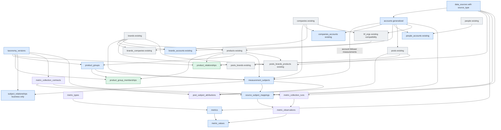
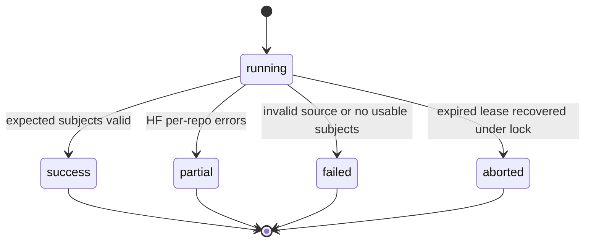
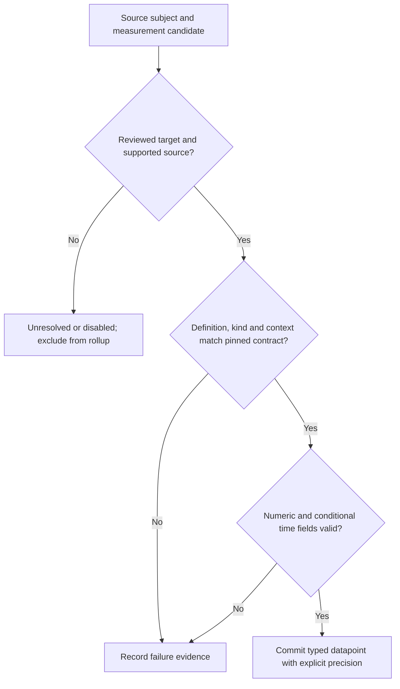
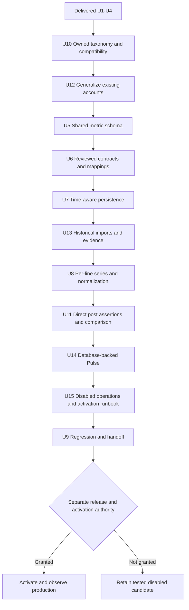

# Benchmark scores and model adoption in PostgreSQL

## Plain-English Summary

Compare post volume, benchmark scores, HF downloads and OpenRouter/OpenCode usage using products we identify and a taxonomy we control. Product relationships store typed parent/child links using HF's vocabulary. Named product groups, such as M-family, have explicit membership; they are not compulsory levels between brands and products. Django queries interpret successor chains and groups while company ownership and brand membership remain separate.

The proposal contains fifteen new tables: eight shared source/metric tables and seven taxonomy/history/attribution tables. Reuse the existing accounts table and its company, brand and person links; do not create source_entities or source_accounts. Put the descriptive source_type directly on data_sources rather than creating data_source_types. The three product tables are product_relationships, product_groups and product_group_memberships. They replace the fixed product_families tier and product-level links in the old generic relationship proposal. The subject registry supports company, brand, group and product attribution, plus source-qualified account measurements for followers. Account measurement subjects do not infer product mentions.

Measurements have two primary kinds: state at an effective time, and flow over an interval. Cumulative downloads are flow since the provider's counting origin. There is no third cumulative kind, cumulative boolean or duplicate origin column. Window mode, duration, source timezone and actual datapoint bounds are separate. Unknown times remain unknown.

Arena, HF, OpenRouter and OpenCode are the four selected peer sources; AA and Vercel remain disabled candidates informed by the saved probes. OpenCode publishes daily UTC totals refreshed hourly. We will collect its hourly revisions, preserve current-day partial totals and later corrections, and serve completed-day comparisons separately. These refreshes do not establish exact hourly usage. Provider identities map to our products and reviewed product types. X and HF are the initial account-bearing sources. An account belongs to one source; YouTube and Instagram can use that same structure later. OpenRouter/Arena/OpenCode product listings remain identifiers in the crosswalk, without invented accounts. HF organizations migrate into accounts with phased hf_orgs compatibility. Publisher-wide coverage remains a filter, not a product group.

The October 6 Pulse exercise adds a production comparison contract: each line has its own explicit subject scope, source configuration and baseline. DeepSeek brand posts can therefore appear alongside V4.1 Flash downloads, tokens, Arena score and Arena rank without claiming every post mentions Flash. The retained launch-baseline diagnostic preset calculates change from a fixed starting value; missing launch-day measurements stay missing, and a later baseline is labeled. The newly selected combined view instead uses the reference-week means described below. Historical imports retain their archive provenance and original snapshot dates.

Implementation used the isolated feature worktree and PostgreSQL database on fuchitalee, then completed Render staging deployment and verification. The October 8 code/schema release was initially verified with benchmark collection and readers disabled. The owner's later **“activate all now”** instruction is now complete: HF, OpenRouter, Arena and OpenCode collection and the production Pulse readers are enabled, retained history is imported, and the dedicated scheduled job has saved real measurements from all four sources. The initial reviewed chart cohort is DeepSeek V4.1 Flash and GLM 5.3 Flash, with DeepSeek V4 Flash as the labeled Arena predecessor. Additional products still require reviewed exact mappings; this activation does not claim coverage of all tracked brands.

This feature remains independent of G1–G5 and includes historical imports, a database-backed Pulse response and UI, an offline report using the same series, and collection operations. Verification reproduces the selected combined chart and Arena panel while preserving diagnostic comparisons, exact raw values, coverage and legacy counting. Account abstraction uses a staged primary-key/foreign-key migration and source-qualified lookups, including the migration-only global handle index; this is not a column rename. Three reviewed products now have the existing `llm-model` type required by the collector validator; 2,404 remain unclassified. The separately deferred five-category vocabulary and existing taxonomy snapshots are preserved. Illustrative M-series links are not verified HF observations.

The October 7 predecessor amendment adds an explicitly labeled predecessor-to-successor Arena rank history, while retaining exact-model views and measurements. It also requires source-use enforcement and honest historical inputs for G3. Collector deployment, public forecasts and trading integration receive separate sign-offs; G3 prediction accuracy and trading compliance remain its own work. No new table is proposed by that amendment or the selected-chart addition.

The earlier October 7 review required portable source/license attribution, acceptance of valid OpenRouter responses without an `other` bucket, and removal of per-author account queries. A1–A3 are now implemented and regression-verified. Dataset-specific permission records use existing metadata. Public release still needs a documented HF/X permission basis; AA and unreviewed archives remain disabled. These release conditions remain separate from the completed staging review.

The owner has now selected one combined release-response chart as the default G5 Pulse presentation: brand posts, exact-product OpenRouter tokens and net change in the selected HF rolling-download counter. Each line shows percentage change from its own average over the same first complete post-release week, with optional three-day smoothing. Zero represents that reference average, not the launch-day value. Arena score, confidence bands and reported battle counts share its date selection in a linked panel; rank remains supporting context. This October 7 selection replaces the earlier unresolved default-chart proposal, while preserving old comparison contracts and diagnostic views. U22–U23 are implemented and verified on Render staging at `e28cbda9`; the original diagnostic comparisons remain available.

The latest naming decision renames the definition table from `source_metrics` to `metrics`. A metric still belongs to one data source and retains its unit, numeric type, version and state/flow semantics. This is a migration of the existing table, not another table or a change in recorded measurements. U24 is implemented and verified on isolated and populated staging PostgreSQL; the October 8 verified production release also uses `metrics`.

## October 8 production release — deployed and verified

### October 9 owner-selected HF daily collection at 10:00 UTC — U28

The owner explicitly selects **10:00 UTC daily** for HF and authorizes the rationale, commit/push and production deployment. Reuse this plan, feature worktree and staged delivery route. Change only benchmark collection scheduling/health, focused regressions, this plan/collector README and HF's operational data-source metadata. Preserve OpenCode hourly, OpenRouter/Arena's existing intervals, source-use records, taxonomy snapshots and measurement contracts. The separately discussed generated time-range proposal is not included.

**Why 10:00 UTC:** the bounded October 7–8 experiment observed DeepSeek V4.1 Flash and GLM 5.3 Flash counters change between 09:18–10:18 UTC on October 7 and 09:00–10:00 UTC on October 8. Qwen3-8B changed earlier. The owner chooses the 10:00 hourly tick to collect near the observed refresh period. Two days and three repositories establish limited API-publication evidence, not a universal refresh guarantee or the 30-day counting cutoff. A late refresh can leave the selected daily snapshot unchanged; preserve that observation. HF's effective cutoff/timezone remains unknown.

**Implementation:** use the existing `data_sources.metadata.daily_collection_hour_utc` integer (0–23) as an optional operational override, with `daily_collection_schedule_note` explaining the choice. No new table, column or migration is required. Expose the hour in `collect_benchmark_due` and collection health. With the existing hourly UTC cron, dispatch once per contract/source after today's 10:00 UTC slot; if that tick is missed, the next hourly tick can catch up during the same UTC day. A recorded attempt at/after the slot prevents another automatic attempt that day, retaining existing failed-attempt behavior. Use a deterministic date/hour batch key. Sources without this metadata keep the current interval-based behavior. This collection clock is separate from source measurement windows and immutable methodology.

**Regression net:** exercise the real management-command/database path at 09:59:59 and 10:00 UTC, a shorter-than-24-hour transition, a missed tick, an already-recorded same-day attempt, the following morning, an empty history and a non-UTC input instant. Check stable daily batch IDs, invalid hour types/ranges, health disclosure and retained OpenCode/OpenRouter/Arena behavior. Provider transport remains mocked; do not use paid requests for tests.

**Delivery verification:** apply the reviewed HF-only metadata in isolated/staging/production with a preserved prior-value receipt; verify the unchanged contract hashes and non-HF metadata, source timezone and scheduler settings. Complete focused PostgreSQL/benchmark/Ollija checks and scoped code review, push the exact candidate through staging then production, and observe the web and dedicated benchmark cron at that revision. A read-only production due check before 10:00 must show HF not due and health must report 10. Record the next natural 10:00 run separately; deployment verification must not invent a future scheduled-run result.

### October 8 owner-selected production activation — completed and verified

The owner now explicitly says **“activate all now”**, following the explanation that benchmark collection, review/readers and numeric charts are disabled. This supersedes the earlier disabled-release endpoint for the four selected sources: HF, OpenRouter, Arena and OpenCode. Activate their reviewed collection/configuration and benchmark chart/read endpoints, import usable retained history with original provenance, and verify real scheduled persistence and live chart responses. BenchLM/AA/Vercel and G3 forecasting/trading remain separate work. Preserve current taxonomy snapshots, the deferred five-category schema follow-up, existing harvest/jobs and other sessions' resources.

Execution must inspect the current deployed revision (main has advanced since the schema release), establish reviewed exact mappings and a new immutable production contract, retain genuine source-use evidence and explicit restrictions, validate configured request/time/byte budgets, and arrange hourly OpenCode plus daily HF/OpenRouter/Arena collection without introducing another harvester or beat. Feature flags alone are insufficient: verify measurement rows, coverage/time semantics and the served chart/JSON. Reuse the retained verified live backup; no destructive schema rollback or migration is proposed. Changes required for source setup must be recorded, including any reviewed product-type assignments required by the currently deployed validator; do not silently rewrite old snapshots or adopt the deferred new category vocabulary.

The independently authorized HF timing worker has also been changed to UTC hour boundaries at the owner's request. Its first newly aligned poll is October 8 at 09:00 UTC. All 96 prior observations, the original 144-request ceiling and October 9 01:18:17 UTC automatic deadline are preserved; the last remaining budgeted poll is October 9 at 00:00 UTC.

**Verified activation checkpoint:** the actual production web process and new benchmark cron are LIVE at `00d7311754cf0837004c859e73c65c740aebab4d`, preserving G2's newer release. Current migration leaf is `0079_original_content_physical_names`, applied by G2; this activation introduced no migration or application-code change. All three `BENCHMARK_REVIEW_ENABLED`, `BENCHMARK_METRICS_ENABLED` and `BENCHMARK_COLLECTION_ENABLED` switches are true. The owner's OpenRouter credential ending in `362` is present on web and the dedicated cron; no secret appears in committed evidence.

Production contract `75c4a856-385b-429a-9b03-c7e023ea6f73`, hash `1c05d33280cc41b6695cf9b752c922462ee8ff4acf1f7faded9c5296cb7d08b4`, freezes taxonomy `b7a3b8ba-9663-4c72-a8c8-3b0e93e6e991` and 11 reviewed exact mappings. Two HF organization accounts use the existing generic-account abstraction. DeepSeek V4.1 Flash, DeepSeek V4 Flash and GLM 5.3 Flash were assigned the already-deployed `llm-model` type as a required setup correction; no other product changed. **Current counts: `llm-model` 3, NULL/unclassified 2,404, `other-ai-model` 0, `agent-harness` 0.** Prior release counts remain historical evidence and must not be used as the current follow-up baseline. Existing snapshots were not rewritten; the new immutable production snapshot records this activation's reviewed identities. The DeepSeek predecessor edge retains its reviewed manual-release interpretation and does not assert HF-proven weight derivation.

The dedicated API-created Render service `pushinweight-benchmark` (`crn-db3lm2ui0phs73amjs30`) runs `0 * * * *` UTC using the installed collectors, deterministic one-time bootstrap batches, then `collect_benchmark_due`. OpenCode is due hourly; HF/OpenRouter/Arena daily. The frozen operational poll thresholds allow 100 seconds of scheduler jitter without converting every other hourly tick into the intended cadence. Each source retains a 20-request, 120-second, 8 MiB budget. Existing harvest, jobs, worker commands, schedules and G2 settings are preserved; no beat or second harvester was enabled. The cron is a standalone operational resource, not a Blueprint application; record its service ID and bootstrap/contract binding when reconciling deployment configuration later.

The first natural scheduled run completed successfully at **2026-10-08 09:01:37 UTC**. All four source batches are `success`, every selected identity succeeded, and nine total upstream requests persisted new measurements: HF 8 values, OpenRouter 357, Arena 2,478, OpenCode 12. HF includes repo likes and account followers. Observed collection time is not substituted for provider-effective publication time: the current fetched Arena dataset remains dated October 2, and HF's rolling-download cutoff timezone remains unknown. OpenCode current-day totals remain partial; HF net rolling-counter changes are not mislabeled as new daily downloads.

**OpenCode revision behavior (owner clarification):** an hourly fetch saves a new observation/value revision when a daily total or its completion status changes; it does not overwrite the previous revision. Unchanged daily rows reuse the prior observation through the collection run's endpoint row references. The serving reader selects the latest valid provider revision per product/UTC date, so the daily chart has one point per day. Current-day snapshots remain stored as partial and the combined chart excludes them until complete. Retained hourly observations of cumulative daily totals are not asserted to be exact hourly consumption.

Seventy-two retained history batches replayed without failures or new upstream calls: OpenRouter 8, Arena 14, HF 49, OpenCode 1. Preserve all retained OpenRouter raw history (32,742 rows) and full admitted raw bodies; the HF replay selects batches containing the reviewed initial repositories/accounts. All retained Arena/OpenCode batches were admitted, without inventing mappings for unrelated rows. Another 3,819 HF archive batches outside this cohort remain in the retained development/staging copy. Production now has 76 contract runs, 119,564 observations and 354,171 numeric values. Original archive dates, payload hashes and original observation provenance survive replay; the new production import time remains explicit and does not create historical operational knowledge.

All eight anonymous chart/JSON pairs return HTTP 200. Four combined views render three nonempty main series plus raw Arena score/battle paths; DeepSeek and GLM each work with both OpenRouter and OpenCode. Independent recomputation of the seven raw reference-day means and all available normalized points passes. Desktop/mobile browser checks pass without horizontal overflow, source definitions and provider navigation work, and the owned browser reports no JavaScript errors. No application code changed in this activation, so the relevant prior benchmark tests remain the code evidence; live configuration, persistence, HTTP and browser checks are new activation evidence.

Source-use decisions authorize the bounded attributed chart/per-chart JSON operation under the owner's explicit activation. They retain genuine source/dataset evidence and the documented HF/OpenCode/X publication-permission uncertainty; an owner decision is not represented as a provider license or legal clearance. Model-training reuse, wholesale mirrors and G3 forecasting/trading remain outside this activation. AA/Vercel/BenchLM remain inactive candidates. See [activation evidence and current taxonomy handoff](../analysis/2026-10-08-141922-benchmark-production/2026-10-08-181800-activation.md).

The old-revision web rebuild started during G2's announced window was canceled (`dep-db3lmo3ncjis73au0n60`); the newer G2 deployment carried these benchmark environment changes. Current runtime/configuration checks occurred after G2 restored its service settings. No additional shared-web rebuild was attempted. Retain the recoverable live backup, history export, owned databases and feature worktree on fuchitalee; remove only activation-owned temporary uploads/browser resources.

### Initial production code/schema release — historical, before activation

**Owner follow-up boundary:** finish this deployment unchanged. A separate follow-up will revise `products.type` to `model-llm`, `model-other`, `agent`, `harness` and `other`. Preserve current taxonomy snapshots and type values here. At completion report exact deployed revision, migration leaf and product counts by current type; do not implement or partially seed the new categories in this release.

The owner has authorized production deployment after staging review. The endpoint is verified production code/schema with benchmark collection, review/readers and public output disabled. Earlier staging-only exclusions below describe those completed runs, not the current authority. No source-use, forecast/trading or recurring activation decision changes. BenchLM remains a research candidate.

Release checks: back up `pushinweight_shadow` on `dpg-d9koekqjobas73fvjqng-a`, validate the archive and restore it to a new owned local PostgreSQL database, rehearse all pending migrations and preserve native account/post checksums and existing table counts. Verify live account inbound references, main revision and database activity before migration. Serialize production deployment so one build runs the long account migration; preserve original production auto-deploy settings, schedules and suspension states. After deployment verify exact actual web process SHA, migration leaf, fifteen shared tables, generic/native account links, disabled flags, existing public/admin reads and the next natural scheduled harvest result. Use backup/forward repair for account rollback. Keep private backup/source exports out of Git; publish sanitized release receipts.

**Production execution detail:** rehearse a temporary operational guard against the restored native schema. Acquire all fourteen existing account/HFOrg tables together with `LOCK TABLE ... ACCESS EXCLUSIVE NOWAIT`, then execute the unchanged pending transactional migrations on that same connection/transaction under the existing shared migration gate. A conflicting writer must refuse admission before any schema change; the successful transaction releases all locks on commit. This avoids acquiring account/link DDL locks progressively amid live readers/writers. Use this guard only in the production web build, followed by unchanged `build.sh`; restore the exact prior web build command after cutover. Other services build only after schema completion. This changes release operation, not code/schema/categories, and does not suspend cron/workers or change schedules. Requests touching locked tables can wait during the account cutover. Preserve the successful full-data rehearsal separately from this concurrency/transaction proof.

**Verified production checkpoint:** all five active services are LIVE at `dcbedf22d1cd70b4c0d54822980afda70b4f85c8`; the actual web, headlines and synthesis process revisions agree. PR #50 merged when main advanced without force to that revision. Core migration leaf is `0074_official_company_generic_accounts`. All fifteen new tables exist, the definition table is `metrics`, the account primary key is `account_key`, and invalid-index count is zero. The original web build command, auto-deploy triggers, schedules and suspension states are restored; retired beat/worker remain suspended.

The 1,568,561,424-byte live backup was fully restored to a new owned PostgreSQL database and all pending migrations rehearsed before release. The live native-reference manifest preserves 92,186 accounts, 304,199 posts and all eleven other checked account-reference sets. Twelve native/generic link checks return zero mismatches. All original fields of 2,407 products, 2,407 HF catalog observations and 30 HF organizations match the restored backup. No taxonomy snapshot is regenerated or rewritten. Production has zero `taxonomy_versions` rows; existing staging comparison snapshots are unchanged. **Current product counts by type: NULL/unclassified 2,407; `llm-model` 0; `other-ai-model` 0; `agent-harness` 0.** The separate type follow-up must update ORM choices and database constraint `ck_product_type` in a new migration after this leaf while retaining historical snapshot contents.

The account cutover held the fourteen existing tables from 04:25:56.553 to 05:04:55.975 UTC, about 39 minutes. Requests involving those tables could wait; no zero-downtime claim is made. The public homepage and four server-side custom-admin reads pass after cutover, and protected HTTP routes retain their login redirects. The next natural scheduled cycle, 05:15:56–05:20:47 UTC, reports the candidate SHA, 16 inserts, 5 updates and zero persistence failures. All twenty reported post IDs exist with matching native/generic account links. Harvest remains degraded: classifier/list reconciliation warnings were present before release and one old enrichment item was quarantined; zero newly failed enrichment is reported. These warnings are recorded, not represented as repaired or fully healthy harvesting.

Benchmark review/readers and collection remain disabled. Definitions, contracts, observations and values are empty in production; historical imports remain on staging. This release grants no public numeric display, source-use, forecast, export or trading activation. The HF timing poll and other sessions' resources are unchanged. Private backups, identity manifests and raw logs remain on authoritative fuchitalee. See [production release evidence and follow-up handoff](../analysis/2026-10-08-141922-benchmark-production/README.md).

## October 8 execution checkpoint — tested and staging verified (historical)

U22–U27 are implemented, tested and deployed/verified on Render staging at exact code revision `e28cbda9fa340db61ca4d86e738c5db08ac73260`. The owner-selected endpoint is complete; production and recurring activation remain excluded. The shared release-response computation, linked raw Arena panel, metrics rename and OpenCode daily history/hourly revision handling are exercised on PostgreSQL. OpenCode's initial reviewed cohort is DeepSeek V4.1 Flash and GLM 5.3 Flash; additional products require reviewed exact mappings. Collectors remain disabled and source-use decisions continue to restrict review data from public forecasts/trading/public numeric redistribution.

Integration with main `702fef5b` exposed two newer official-company account links that the original account cutover did not know about. Migration `0074_official_company_generic_accounts` adds their UUID account links while retaining native X IDs, evidence, list status, uniqueness and native-writer compatibility. It accepts either independent migration order, updates the saved account-observation checkpoint without repeating completed work, and keeps company discovery X-only. Existing full-save paths and owner attestations use the correct native ID. This is a required account-abstraction integration repair; no table is added and no company decisions, budgets, list requests or production jobs are replayed.

Staging backup is retained privately on fuchitalee and was restored before rehearsing the populated rename and account repair. Definition object/constraint/index identities, IDs, sequence and all 2,056,891 prior values survive the rename; the new staging review reuses immutable parent measurements rather than copying them. Review ran inline under the project's sequential agent rule. External Claude and Grok attempts returned no usable review (402 balance failure and timeout); independent reviewer coverage is unavailable and is not counted as passed.

The [final staging evidence](../analysis/2026-10-07-232235-benchmark-updated-staging/README.md) records the deployed SHA, four passed hosted workflows, preservation checks, bounded import, owner-gated API/browser proof and restored service settings. Actual web process SHA and Render LIVE metadata agree. The private review used 79 browser commands/29 assertions; scores have distinct axis labels and mobile labels/pointer selection remain readable/accurate. The temporary user/session and owned uploads were removed without changing existing owner users or allowlist. No fresh Google OAuth journey or direct worker-process SHA is claimed.

Staging contract `1b91bd1b-a07d-47c9-a5ae-0e2089fc581e`, hash `d7a3e38e3e3da328dd91f8581e59b109c3db37e3c652848add789665560cdd27`, reuses parent `53fda009-28a4-4106-a91f-bd42ff7cb33e`. It adds four response presets for DeepSeek/GLM with OpenRouter/OpenCode selection. The bounded two-request OpenCode capture adds 112 observations/336 values across 56 dates per product (August 13–October 7); six current-day values remain partial with unknown end. Totals are 3,891 runs, 1,371,217 observations, 2,057,227 values and 18 definitions. Existing 290,672 posts, 364,056 post/brand links, 88,743 accounts and both editorial stories survive. The definition relation retains its object/constraint/index identities, IDs, sequence and prior values. Replay is idempotent; operational past cutoffs exclude late imports and unreviewed public/trading uses remain denied.

Hosted results at the code SHA: benchmark 284 passed/164 required PostgreSQL; company 310/250; editorial 257/138; staff 304/177, with zero required skips/errors. Suites overlap and are not summed. Independent HTTP arithmetic checks at `d3d5f97b` are reused only because subsequent commits change SVG rendering and browser assertions, not Python readers/contracts/source data. Local 36 Ollija checks pass. Raw exports, screenshots, login material and the recoverable 557,431,905-byte backup remain private on fuchitalee. Original staging reader/auto-deploy/suspension/schedule settings are restored; the staging foreground claim can be released. The hourly HF poll remains unchanged and auto-stops October 9 at 10:18 JST; HF's effective cutoff timezone is still unconfirmed.

Post-delivery plan/evidence is committed separately on the feature branch. Staging stays at the exact verified code SHA; no documentation-only redeploy or production merge is performed. The staging-only worktree, local review preview and backup remain available. Future production needs an owner-selected release, then-current main/account compatibility, verified live-production backup and one migration runner. Source-use approvals and recurring activation remain separate decisions.

## October 7 amendment — OpenCode as a fourth peer source

**R42–R45 / KD27 (session-settled: user-directed):** add OpenCode alongside
OpenRouter, Arena and HF, with equal standing in registry, persistence,
identity review, history, operations, queries and serving. OpenCode is a selected
source, not a disabled research candidate or an OpenRouter subcategory. This
original amendment granted plan edits only. The later October 7 LFG selection
authorized U25–U27 execution; the October 8 checkpoint records their completed
staging proof. Recurring activation remains excluded and the HF poll is unchanged.

### R42 — shared storage, scope and exact identifiers

- Add `data_sources.id=opencode`, `name=OpenCode`,
  `source_type=model_adoption`, `website_url=https://opencode.ai`, an explicit
  local adapter/version and exact-ID normalizer. Use the same shared tables as
  the other selected sources; there is no OpenCode table, account table or
  hourly-value table. The fifteen-table inventory remains unchanged, including
  R41's implemented definition-table rename to `metrics`.
- Freeze the provider scope as **OpenCode-hosted Go + free-model usage**.
  Public exports do not separately expose free-only totals or all usage through
  external providers in the OpenCode client. Keep OpenCode and OpenRouter series
  separate; do not add their totals or treat them as deduplicated people,
  requests or global market share. Verify and version the reported-token
  accounting before quantitative cross-provider comparisons; preserve cached
  token scope and do not add reasoning twice to an overlapping output count.
- Initial numeric collection uses model `usage.daily` fields `tokens`,
  `uniqueUsers` and `sessions`. Reuse `metric_types.token_usage`; add
  `active_users` and `session_count` registry rows for the latter two. Definitions
  in `metrics` use integer/count-valued calendar-day flow, UTC, amount=1,
  unit=day and calendar duration basis. Mark user/session counts approximate in
  definition metadata and the serving response; distinct counts cannot be
  summed across models or days and described as unique users/sessions.
- Retain `costUsd`, pricing, cache ratios, retention, country summaries and
  benchmark metadata in bounded source evidence when present. They are available
  for later reviewed definitions, not automatically admitted numeric metrics.
  This addition does not widen the existing currency contract or replace Arena
  with provider-card benchmark figures. Tokens are required; missing optional
  user/session fields remain unavailable, never zero.
- Map the literal model ID, e.g. `deepseek/deepseek-v4.1-flash`, to our product in
  `source_subject_mappings`. Preserve its API path
  `/data/deepseek/deepseek-v4-1-flash.json`, lab slug and reported model metadata
  separately. A URL slug's punctuation, provider alias, family label or linked
  HF repo is matching evidence, not automatic identity confirmation. Lab IDs
  can map to company subjects when reviewed; neither lab nor model listings
  create OpenCode accounts. Do not use family/brand matches to assign exact
  product usage, or create canonical products from every catalog entry.

### R43 — hourly acquisition, daily windows and immutable revisions

Public endpoint contract, verified read-only on October 7:

| Endpoint | Use in this collector | Observed shape |
| --- | --- | --- |
| `https://opencode.ai/data/index.json` | Discovery/coverage and platform diagnostics | `updatedAt` ISO-8601 UTC string; leaderboard, daily tokens/users and aggregate summaries. Home chart values are rounded and smaller models are grouped into Other. |
| `https://opencode.ai/data/{lab}.json` | Selected-lab catalog and identity evidence | `lab`, `models`, `usage`, `daily`; direct lab totals are not reconstructed from a potentially incomplete mapped-product cohort. |
| `https://opencode.ai/data/{lab}/{model}.json` | Primary exact-product daily measurements | `model.id` and `usage.daily[]`; `date` is YYYY-MM-DD, tokens/users/sessions are JSON integers, `costUsd` a JSON number, and `updatedAt` an ISO-8601 UTC string. |
| `https://opencode.ai/data/llms.txt` and its linked sitemap | Bounded route discovery/documentation | Published endpoint templates and catalog links; not hourly usage measurements. |

All three JSON probes returned HTTP 200 without credentials. Documented refresh
is hourly; days/weeks use UTC. On October 7 the daily exports contain 56 dates,
August 13–October 7, including a partial current day. Preserve that as observed
coverage, not a promised permanent retention floor or a historical-query API.
Per-endpoint `updatedAt` values differ; an index response is not proof of the
model endpoint's revision. The provider advertises no verified request quota or
availability guarantee in the checked export documentation.

**Cadence and bounds:** set reviewed OpenCode `poll_seconds=3600`, independently
of HF/OpenRouter/Arena. Initial proposed retrieval and publication freshness
thresholds are 7200 seconds each; report the actual last successful retrieval
and the latest endpoint update separately. Proposed physical budgets per
bounded batch are 100 requests, 120 seconds and 16 MiB, including discovery,
redirects and any bounded retries. Partition a larger reviewed selection into
explicit batches; a partially collected cohort cannot be called complete.
Keep stable UTC-hour batch IDs, existing source/contract locks, retry/backoff
limits and interrupted-run recovery. Collection remains default-off until the
separately selected activation. Reuse the existing hosting/scheduler route
after inspection; do not modify `run_cycle`, its cron or the HF timing worker,
or create a second harvester/beat scheduler. Never query a provider from Pulse.

**Storage:** use `metric_collection_runs` for attempts, endpoint revision/hash,
coverage and errors; `metric_observations` for each product/date row and its
endpoint/row evidence; `metric_values` for each numeric measurement. Preserve
the endpoint's `updatedAt` in observation/run metadata as a source export
revision timestamp, separately from our `observed_at`, native usage date and
effective flow window. It is not a proved event watermark or the exact end of
the current-day count. A multi-endpoint run keeps per-endpoint revisions; do not
overwrite them with one maximum timestamp and claim an atomic publication.

For completed UTC-day reports, store `[date 00:00Z, next date 00:00Z)` and the
native `period_label_date`. For the current day at that endpoint's revision,
retain `period_status=partial`, proven midnight `window_start_at`,
`window_end_at=NULL`, `temporal_status=date_only` and the native date. Nominal
next-midnight belongs only in metadata until a completed-day report exists;
neither retrieval time nor `updatedAt` becomes an invented exact flow end.
Unknown or invalid `updatedAt`, future-dated rows, duplicate dates, invalid IDs
and nonfinite/noninteger/negative counts cannot produce a complete admitted
snapshot. A closed calendar day is a reported completed day, not a promise of
immutable finalization; later revisions remain possible.

Preserve each changed partial/completed row as a new immutable observation;
never overwrite an earlier value or sum hourly snapshots of the same daily
total. Hash normalized model/date, admitted values, period status and semantic
context independently of retrieval/export timestamps. Keep endpoint/body hashes
in run evidence. Compare row/context hashes across the returned historical window to
detect corrections, including decreases and corrections older than seven days.
An unchanged row need not duplicate values: the run retains its successful
check, endpoint revision and coverage with references to retained observations.
Replay of the same endpoint revision/body is idempotent. A changed body at the
same `updatedAt` is a distinct revision and visible source anomaly; an older
export received later cannot replace the newer selected revision. Same-time
conflicting bodies need deterministic conflict handling and an explicit flag.
Absence, rolled-off history and failed fetches do not create zero usage or
delete retained observations.

**Serving:** expose both the latest completed daily series and an explicitly
requested current-day provisional series, with period status, exact raw counts,
source update/retrieval times, selected observation IDs and coverage. Default
daily normalized/reference-week comparisons use completed days only. Retain
earlier intraday snapshots for inspection and cutoff-aware G3 inputs. A
difference between snapshots may be labeled a change in the reported daily
total; it is not exact hourly tokens, new users or sessions. The 56-day history
has no retroactive hourly snapshots; hourly revision history starts when our
collector starts retaining it.

### R44 — capture available history and retain it locally

At initial collection, ingest every returned historical daily row for the
reviewed tracked-product cohort, including a separately marked current-day
partial row. Use model-level exports rather than rounded home charts. Report
actual first/last dates, unmapped IDs, zeroes, unavailable subjects, partial
days, endpoint hashes and capture/import timestamps. The existing OpenRouter
all-model/all-available-history selection remains unchanged; OpenCode initially
follows tracked-brand/product scope, with Google's existing Gemma/Gemini
selection rule. Catalog discovery does not expand collection to every model.

Each later hourly fetch reconciles the full returned window for those selected
products and appends changed rows while retaining older imported history after
it leaves the upstream export. Downloading again cannot recover missed hourly
revisions or days already rolled off. A model not in the export is unavailable,
not a zero-valued top-50 omission. No OpenRouter top-50 ceiling is imposed on
OpenCode; actual endpoint availability is measured per selected product.

Initial history acquisition/import and parser/series checks occur in the
isolated database before readiness, then validated evidence can be replayed to
an authorized deployment without copying local primary keys blindly. Preserve
R22/R33 historical and cutoff provenance: a daily row fetched today does not
prove that value was available at an earlier forecast cutoff. Operational
replays select only revisions observed by that cutoff; historical exports
without contemporaneous availability evidence remain retrospective inputs.

### R45 — peer serving, permissions and completion

OpenCode uses the same collection/status/history/SQL/ORM/series/export contracts
as the other three providers. R37's selected default chart stays three lines:
posts, OpenRouter tokens and HF net-download-counter change. Add a separately
identified provider selection/preset that substitutes OpenCode tokens for the
usage line, recalculates and pins the common completed reference week, and
labels Go + free scope. Do not silently rewrite existing frozen contracts,
replace the default, add an automatic fourth line, combine token providers or
change the linked Arena panel. Diagnostic queries may compare the two usage
providers with their own provenance and units.

Apply existing R25/R32 collection, retention, internal-use, public-display,
export and forecast-use decisions to OpenCode as a peer. The checked export
documentation requests citation to OpenCode Data with its update time, but a
dedicated data redistribution license was not established by these probes.
Record the actual use basis and unresolved public/export conditions; public
endpoint access and the repository's software license do not settle data rights.
This amendment contacts no provider and changes no existing source policy.

### U25–U27 — implementation and regression proof

| Unit | Implementation boundary | Required verification |
| --- | --- | --- |
| U25 — OpenCode identity, adapter and definitions (R42) | Extend `core/benchmark_metric_identity.py`, source registry/allowlists and CLI selections in `scripts/benchmark_download_collector/{sources,collect,__main__}.py`, `monitor/management/commands/{configure_benchmark_collection,collect_benchmark_metrics}.py`, and the native-row/number admission in `core/benchmark_metric_store.py`. Add reviewed source configuration/mappings and three numeric definitions, not tables. | Provider-shaped sanitized fixtures; live shape/ID match; tokens beyond JavaScript exact-integer range; approximate counts; absent optional metrics; host/redirect/budget admission; dot/hyphen paths, lab aliases, wrong product and no invented account. PostgreSQL writes must preserve existing HF/OR/Arena definitions/contracts/measurements. |
| U26 — history and hourly revisions (R43–R44) | Extend the existing history/acquisition/import boundary, `core/benchmark_metric_history.py`, `core/benchmark_metric_operations.py`, shared writer and due/health commands under `monitor/management/commands/`. Persist per-endpoint revision/period-status metadata using existing JSON columns. Review the current completed-day-only operations path before adding source-specific current-day collection. | Actual PostgreSQL round-trip of first 56-day capture, changed/unchanged hourly polls, idempotent replay, failed/partial cohort, older/same-time-conflicting revision, UTC midnight rollover, delayed publication, incomplete current-day end, next-day completed report, revised historical decrease, rolled-off dates, exact zero versus absence, locks/bounded retries/interrupted recovery and distinct retrieval/publication freshness. No snapshot summing, invented hourly data or regressions in the other sources' daily cadences. |
| U27 — queries, provider selection and cutoff proof (R45) | Extend `core/benchmark_metric_series.py`, `core/benchmark_metric_report.py`, `core/benchmark_forecast_inputs.py`, Pulse view/template/static modules and shared offline/export output. Add a new reviewed OpenCode comparison preset/provider option; keep old contracts immutable and both token sources separately queryable. | PostgreSQL → SQL/ORM → actual response/report/export/browser evidence for DeepSeek and another mapped tracked product; hourly partial snapshots versus completed daily series; pinned observation revisions and reference dates; late correction; no future revision in cutoff replay; missing product/day/baseline; raw integers, attribution/scope/approximation labels, mobile/legend controls and unchanged default three-line/Arena behavior. Reuse and extend existing benchmark source/identity/persistence/history/operations/forecast/series/report/Pulse tests. |

U25 precedes U26 and U27; U27 uses U22/U23's implemented chart boundary. U24's
rename is reconciled with the current account/migration integration. The
October 8 readiness run satisfies these units with its own PostgreSQL/import/
serving/browser evidence; pre-OpenCode staging receipts remain historical. Document the
exact candidate revision, isolated database, import coverage, source-use
decisions and hourly activation/disable procedure in the existing plan and
`scripts/benchmark_download_collector/README.md` after implementation.

Sources: [OpenCode export documentation](https://opencode.ai/data/llms.txt),
[home JSON](https://opencode.ai/data/index.json),
[DeepSeek lab JSON](https://opencode.ai/data/deepseek.json),
[DeepSeek Flash model JSON](https://opencode.ai/data/deepseek/deepseek-v4-1-flash.json)
and [official aggregation implementation](https://github.com/anomalyco/opencode/blob/ecc4916b5a9608c30e6dd58a67f2137b594407ca/packages/stats/core/src/domain/inference.ts).
These probes establish endpoint shape/availability and inform the proposed
contract; they are not collection, scheduler or deployment completion evidence.

## October 7 amendment — rename the definition table to metrics

**R41 / KD26 (session-settled: user-directed):** rename PostgreSQL
`source_metrics` to `metrics`. Each row remains one immutable provider-specific
metric definition/version, linked to `data_sources` and `metric_types`.
`metric_values` contains actual numbers; `metric_observations` supplies model,
publication and collection context. The definition table is not a simple join
table. Preserve all existing columns, IDs, definition versions, constraints,
indexes, relationships, source semantics and saved collection contracts.
The fifteen-table count stays unchanged.

### U24 — preserve existing data while renaming the table

- **Scope:** change `SourceMetric.Meta.db_table` in `core/models.py` to
  `metrics`, with a new Django migration using
  `migrations.AlterModelTable(name="sourcemetric", table="metrics")`.
  Django 5.2.16 is installed in the feature environment; the operation changes
  the model's table name in both migration state and the database.
  [Django operation contract](https://docs.djangoproject.com/en/5.2/ref/migration-operations/#altermodeltable).
  Retain the Python model name `SourceMetric`, existing ORM imports,
  `MetricValue.source_metric` and its physical `source_metric_id` column for this
  table-only change. No model/field/permission rename is included.
- **Dependency:** inspect the actual combined migration graph and coordinate
  with other schema owners before allocating the new migration filename.
  Staging was verified with `0069_merge_20261007_0550`; the feature-only graph
  differs, so do not assume its latest file is the deployment dependency.
  Never edit applied `0067_shared_metrics` or rewrite its old `db_table` option.
  Fresh installs run the existing create operation and then the new rename;
  populated installs rename the existing relation. Reject a conflicting existing
  `metrics` relation instead of dropping/replacing it.
- **References:** update current-schema allowlists, refresh policy/inventory,
  raw SQL and exact-table assertions discovered by `rg '\bsource_metrics\b'`.
  Current code inspection finds the live definition in `core/models.py` and
  two table-set assertions in `tests/staging_refresh/test_policy.py`, plus
  table entries in `config/staging_refresh.yaml`. Update that policy's table
  entries to `metrics`; retain `source_metrics_id_seq` entries because this
  table-only rename preserves the existing sequence name. Verify the actual
  sequence relation/default after migration rather than guessing its name.
  Keep historical migration files, source receipts, accepted immutable contract
  snapshots and dated schema evidence unchanged. Update maintained diagrams
  and the current schema reference after implementation, distinguishing them
  from the dated pre-rename review images linked below.
- **Migration review:** generated SQL must rename the existing table; reject
  drop/create/copy operations or unexpected column, FK, content-type or semantic
  changes. A physical rename must preserve table identity, row IDs, sequences,
  uniqueness/checks and the `metric_values.source_metric_id` references.
  Recheck any discovered database views or raw-SQL consumers. Do not mint a new
  metric definition/version or reimport provider history merely to change a
  physical table name.
- **Deployment coordination:** the old application revision still queries
  `source_metrics`; it cannot run unchanged against the renamed table. Before
  any authorized delivery, identify benchmark readers/writers and arrange a
  bounded feature pause while the migration and affected runtimes are moved
  together. Use the existing migration executor/lock discipline and reviewed
  backup/rollback requirements. Preserve unrelated services and data. Do not
  assume a rolling deployment is automatically compatible or introduce a
  compatibility table/view without a demonstrated requirement.
- **Regression net:** on isolated PostgreSQL, test both fresh migration and
  forward migration from a populated pre-rename database. Compare table OID,
  definition IDs/row hashes, metric-value IDs/counts and zero orphan links;
  verify existing uniqueness/FK checks, ORM reads/writes, collection replay,
  historical series, Pulse/offline/export and staging-refresh table policy.
  Rehearse reversing **only this rename** with matching old code, then applying
  it again without data loss; do not reverse the independent Account migration.
  Run schema drift and `makemigrations --check --dry-run` after implementation.
- **Exit:** database and migration state both name the relation `metrics`,
  relevant queries/tests pass at the candidate revision, existing measurements
  and immutable contracts remain unchanged, and no extra definition table exists.
  Execute U24 before renewed readiness of the complete amended candidate;
  U22–U23 remain the separately scoped chart work. This amendment only records
  the migration; it does not create a migration file, run it, or deploy.

## October 7 amendment — selected combined chart and Arena evaluation history

Owner direction: add the discussed Arena analysis and **lock in the combined
chart**. This is a documentation amendment for the next implementation run.
The October 7 staging deployment remains verified for its recorded revision;
U22–U23 were pending in this amendment turn. The later LFG selection
authorized implementation and staging delivery; the October 8 checkpoint records
completion. Recurring activation remains excluded.

### R37 / KD24 — selected combined release-response chart

The accepted default is the local G5 combined prototype
`normalized-response.html`, using **one chart, exactly three lines, and one
linear percentage axis**:

| Line | Raw input / subject | Displayed meaning |
| --- | --- | --- |
| Brand posts | Distinct collected posts for the explicitly selected brand, per completed UTC day | Relative change in collected brand discussion; this does not assert that every post mentions the selected release. |
| OpenRouter tokens | Completed UTC-day reported tokens for the exact mapped product/variant | Relative change in reported OpenRouter usage, retaining its historical top-50 coverage limits. |
| HF net download change | Difference between selected rolling-30-day download observations on consecutive snapshot dates, for the same reviewed repository cohort | Relative change in the **net change of the rolling counter**; this is not the number of new downloads that day. |

Resolve the raw series, coverage and source revisions first. Select the earliest
seven consecutive completed dates **strictly after the reviewed launch date**
on which all three raw inputs are available. HF differences also require the
preceding date's actual observation. All three lines use that same reference
range, but have separate raw reference means. Missing input on any date prevents
that seven-date candidate from becoming the reference; search only within the
preset's frozen, declared reference-search range, not arbitrary lifetime history.
Freeze and return the resolved reference dates/means with the contract hash and
input revision. An accepted correction produces a separately identified revised
response; view controls never silently redefine the reference.

For line `s`, compute `100 * (displayed_value_s / raw_reference_mean_s - 1)`.
Default displayed values are trailing three-day arithmetic means; the daily
toggle uses unsmoothed raw values. Both use the same unsmoothed reference means.
Three-day means require three consecutive valid inputs and never cross a gap.
A missing reference means normalization is unavailable; zero or negative means
also make the affected percentage line unavailable, with raw values retained.
Preserve negative HF differences and percentages below -100 when real inputs
produce them. Do not sum daily percentages, accumulate daily counts, force the
launch point to zero, clip extremes, or redefine the denominator on legend,
smoothing or visible-range changes.

Use a reviewed release marker, shaded reference week, a visible zero reference,
source-specific legend toggles, shared hover/day inspection, calendar/relative
day labels, raw value and reference-mean inspection, and source/evidence export.
Default context is 14 calendar days before release through day +28, bounded by
available evidence; retain an all-available/range control within the existing
366-day serving cap. Successor HF/OR data remains absent before it exists.
Reference dependencies may be outside the visible range and remain disclosed.
Display copy is **Change from reference-week average (%)**, not cumulative
growth since release. Preserve the maintained G5 layout, Human/Agent geometry,
mobile behavior and other page sections.

KD24 is owner-selected and supersedes KD15's unresolved default visual design,
R7's five-line default and the launch-day baseline default **for this new view**.
The existing five-/seven-line, raw, compressed and launch-baseline comparisons
remain diagnostic alternatives with their original definitions. Never rewrite
an immutable comparison contract or silently change a saved chart's arithmetic.

### R38 — HF transform and reproducible comparison metadata

Use actual adjacent-date HF observations from a fixed cohort and the existing
direct/archive precedence policy. Require both snapshots complete and expose
both observation/value IDs, raw counts, snapshot dates, timing precision and
cutoff uncertainty. A missed date, carried-forward value, changed cohort or
incompatible definition creates a gap; do not spread a multi-day difference
across missing days. A decrease can reflect older downloads leaving the rolling
window or a source correction. Explain that interpretation in source details.
An unchanged **observed** snapshot may yield zero; absence is never zero.

Store the new preset and its transform/normalization/reference-search policies
in existing `MetricCollectionContract.methodology.comparison_presets`, creating
a new immutable contract for the approved preset. Native observations stay in
the existing shared fact tables. Return raw input values, derived differences,
displayed means/percentages, reference means/dates, smoothing inputs, coverage,
source timing, selected configuration, evidence and attribution in the shared
series/JSON/offline contract. Use exact integer/decimal arithmetic before display
rounding. No new metric fact, proxy table, chart table or schema migration is
required for these derived views.

### R39 / KD25 — Arena score, uncertainty and participation together

Add a linked Arena panel on the same requested dates and shared inspection
control. Its primary track shows **raw Arena score with its published confidence
band**; a second aligned track shows **reported battle count**. Show raw rank
and publication date in inspection/context, with an optional rank view. Arena
does not become a fourth line on the normalized percentage axis: rating offsets
are arbitrary and rank is ordinal, so their percentage changes do not express
changes in model quality.

For each actual selected `text` / `overall`, no-style-control publication, expose
the same row's `rating`, `rating_lower`, `rating_upper`, `variance`, `vote_count`
and `rank` when available. Existing definitions store votes as integer state in
`battles`, scores/bounds as floating-point state in `arena_points`, and variance
as optional floating-point state in `arena_points_squared`. Use the existing
measurement/observation/value and mapping tables; a missing optional field is
unavailable, not zero or a reason to discard the score.

For a future numeric Arena field `xyz`, add a versioned definition row to
`metrics` under the existing Arena source, with its actual unit, numeric
type, state/flow and time semantics. Reuse an applicable `metric_types` row or
add a semantic type row if necessary. Each measured `xyz` number is a row in
`metric_values`, linked through `metric_observations` to the provider model,
publication, mapping and collection evidence. Another publication adds rows,
not a table or column. A new field can require adapter/contract validation
changes and a new immutable contract; this does not require a schema migration
when the existing numeric storage and subject/time semantics fit.

Reported battles describe comparisons included by Arena, not unique people,
unrestricted model usage, or necessarily a monotonic lifetime counter. Preserve
decreases. Do not label differences between snapshots as exact daily new battles.
Score and battle-count tracks identify actual publication points; if a step is
held between publications, distinguish that display state from a new daily
measurement. Do not smooth, interpolate, or carry confidence bounds backward.
Apply the existing complete-publication omission and failed-fetch rules.

The selected quality track remains exact-model. R31's reviewed predecessor rank
history is an explicitly labeled optional alternative, with its existing switch
rules; do not extend predecessor substitution to score or battle counts in this
amendment. Keep variant/configuration identity visible and preserve dataset
attribution in the panel and exports.

### R40 — interpretation and time comparability

Help readers distinguish these patterns without claiming causation:

- More reported battles, stable score and a narrower confidence band are
  consistent with a more precise estimate supporting the early assessment.
- More battles and a lower score warrant inspecting later evaluations and
  their uncertainty; this alone does not establish that model quality declined.
- A worse rank with a stable score can reflect competitor additions or movement.
  Rank alone does not establish less favorable feedback.

Score-history comparisons must retain methodology, configuration and anchoring
evidence. Arena explicitly fixes a reference model's score to compare periods in
its [score-history analysis](https://arena.ai/blog/opendata-july2025#score-changes).
Verify that the selected publications share a compatible score anchor/scale;
if evidence is unavailable or changes, mark comparison uncertain or break the
segment and suppress cross-segment score-change conclusions. Dataset revision
alone does not prove a common anchor. Preserve raw publications for inspection.

Arena publication dates can have unknown timezone/date-only precision. They
share a labeled calendar axis with UTC daily posts/tokens and HF snapshot dates;
the display does not establish identical cutoff instants. Preserve collection,
publication and effective times separately. Align only at supported precision.
Co-moving lines are exploratory evidence, not a causal or prediction claim;
this amendment adds no correlation coefficient, quality classifier or G3 forecast.

### U22–U23 — next implementation and verification

| Unit | Concrete changes | Required proof |
| --- | --- | --- |
| U22 — selected combined chart (R37–R38) | Extend `core/benchmark_metric_identity.py` comparison validation, `core/benchmark_metric_series.py`, `core/benchmark_metric_report.py`, `monitor/benchmark_views.py`, `monitor/templates/monitor/benchmark_pulse.html`, `monitor/static/benchmark-pulse.{js,css}` and the shared offline/export boundary. Create the approved preset in a new contract; old contracts and source facts remain unchanged. Keep reads bounded to display, declared reference-search dates and required adjacent/smoothing dependencies; never call providers from a chart request. | Isolated PostgreSQL → actual response → browser checks in existing series, Pulse view/report tests and `scripts/benchmark_download_collector/verify_pulse_browser.py`: independently calculated raw/reference/three-day/percentage values; earliest common complete week; reference fixed across controls; late correction/revision; absent/nonpositive baseline; HF negative/zero/missing/cohort changes and no multi-day allocation; top-50/partial-day gaps; integers beyond JavaScript exact range; shared hover/export, mobile and Human/Agent geometry. Preserve legacy arithmetic/counting and contract responses. |
| U23 — Arena evaluation panel (R39–R40) | Reuse the same series/report/view/static modules plus existing source/run metadata for anchor/methodology comparability; add aligned score/confidence and reported-battle tracks with actual publication markers and rank context. Consume stored Arena values rather than new collection or tables. | Prove fields come from the same row/publication and exact variant/configuration; missing optional fields; confidence bounds; decreasing battle counts; sparse publications/carry-forward/omission/fetch failure; unknown timezone; compatible, unknown and changed score anchors; no score percentages or new-battle inference; predecessor rank alternative unchanged. Browser inspection/export must reproduce all actual points and clearly separate real publications from held display states. |

Before calling this addition ready, run affected compatibility, PostgreSQL,
report/export and browser checks and review the actual change. Local static
prototype checks support the selected design only; they do not prove U22–U23's
database-backed implementation or authorization for production.

### Accepted prototype evidence and research

The saved staging inputs were exported read-only from runtime `1375d1c0`,
contract `53fda009-28a4-4106-a91f-bd42ff7cb33e`, on
`2026-10-07T08:58:32.076918Z`. The combined prototype's 25 browser checks passed,
with no JavaScript exceptions. Retained local evidence:
`/Users/fuchitalee/development/pushin-weight-v2/.context/g5-staging-charts-20261007/`
(`README.md`, `normalized-verification.json`, `screens/normalized-response.*`,
and saved comparison JSON). Use sanitized maintained fixtures for regression;
ignored prototype files are not a durable CI dependency.

- DeepSeek reference September 11–17: daily posts mean `1990.7142857142858`,
  tokens mean `1691696064097`, HF net-counter-change mean `55807.28571428572`.
- GLM reference August 28–September 3: daily posts mean `697.1428571428571`,
  tokens mean `1706922672005`, HF net-counter-change mean `73981.14285714286`.
- The reviewed DeepSeek window contains only three actual Flash Arena
  publications (September 25/30 and October 2); GLM has eight. Held daily values
  do not increase those sample counts. Posts currently end October 3 in this
  staging export; incomplete later dates remain absent.

Official research checked October 7: Arena's
[text leaderboard](https://arena.ai/leaderboard/text) puts votes, score,
confidence range, rank and rank spread together and lists pairwise win-rate and
battle-count plots; [the data deep dive](https://arena.ai/blog/opendata-july2025)
charts anchored score histories and analyzes evaluation-context effects;
[ranking methodology](https://arena.ai/blog/ranking-method) explains raw rank and
uncertainty. These are related analyses. This bounded search did not locate the
specific per-model score/battle-count maturation timeline joined to HF/OR/post
history proposed here. HF's [download methodology](https://huggingface.co/docs/hub/en/models-download-stats)
also establishes why its file-request counts should not be described as unique
downloaders. Pairwise battle-level analysis and other Arena categories remain
outside this first chart pass.

## October 7 amendment — engagement and complete available history

This amendment supersedes earlier planning-only statements for the work below. The owner authorizes implementation, bounded source collection, isolated PostgreSQL imports, verification and a reviewed PR through **tested and ready**. Production writes, migration, deployment and recurring activation remain excluded. Preserve the temporary hourly HF timing worker unchanged. The live production backup has not been taken; it remains a verified pre-deployment prerequisite.

### Settled scope

- **R26 / KD16 — HF engagement:** collect current integer repository `likes` and account `numFollowers` as state measurements with no flow window. Preserve decreases, UTC observation time and unknown effective time. Reuse existing Account and shared metric tables; add an account target to MeasurementSubject and account crosswalk validation. Repository likes retain exact repository attribution.
- **R27 / KD17 — history provenance:** distinguish `observed_snapshot`, `archived_snapshot` and `reconstructed_current_relationships`. HF `likedAt`/`followedAt` can reconstruct arrival dates of relationships still present at retrieval, not the true past total including subsequently removed relationships. Keep reconstructions separate from snapshot series and label baseline, export and chart evidence. Do not retain follower/liker profile data when aggregate daily counts and provenance suffice. Archive revision/selection hash, retrieval timestamp, date precision and unknown timezone remain explicit.
- **R28 / KD18 — OpenRouter history:** perform one logical initial backfill for the entire available completed-day history, retaining **all reported models on every day**, including untracked/unmapped models and the optional `other` aggregate. This is the union of changing historical top-50 cohorts, not today's top 50. Keep raw source rows even when no canonical mapping exists; do not fabricate products. Use provider-required date chunks if one HTTP request cannot cover the interval, checkpoint each chunk and never describe a partial run as complete. Preserve endpoint floor/ceiling and missing days in coverage; no invented zeroes or allocation of `other`.
- **R29 / KD19 — HF/Arena history:** collect accessible history only for tracked brands and their evidenced repositories/accounts/provider identifiers. Preserve the existing Google exclusion except reviewed Gemma/Gemini products. Retain unresolved candidates as coverage gaps, not automatic canonical matches. Arena keeps publication dates, exact variants and the overall `text` configuration without style control (R30). HF archive scope includes downloads and likes; follower/like reconstructions are separately labeled.
- **KD20 — deferred except R31/KD22 below:** general proxy attribution, including assigning company/account engagement or brand posts to a latest release, remains a future TODO. The owner's later Arena predecessor-ranking requirement is the sole planned exception: an explicitly labeled display series over actual product observations, without reattributing stored measurements or adding a proxy table.

KD16–KD20 are session-settled, user-directed: the rejected alternatives are separate source-entity/history tables, indistinguishable reconstructed history, brand-filtered OR collection, provider-wide HF/Arena collection, and general proxy implementation respectively. R31/KD22 narrows the last decision for the Arena ranking view only. They preserve existing identity decisions, truthful history and the owner's collection scope.

**R30 / KD21 — Arena without style control (latest owner direction):** use the official dataset configuration `text`, category `overall`, corresponding to `https://arena.ai/leaderboard/text/overall-no-style-control`, for new historical collection and comparison contracts. G3's saved `kalshi-arena-series.json` and a fresh read of Kalshi KXLLM1 both identify this settlement source; this is evidence for that series, not a universal Kalshi eligibility rule. Supersedes R3/R8/R23 and U17 references to style-controlled selection for new work. Preserve old `text_style_control` observations and immutable contracts exactly; support reading them separately. Pin configuration in new contracts, observations, imports, UI/export labels and tests; reject an incoming configuration differing from its contract. Never relabel or blend old scores. No new table is needed. Add tests proving both configurations remain separate and mismatched imports fail. General proxy attribution stays deferred; R31/KD22 below is the later Arena-ranking exception.

### Execution and verification additions

**U16 — HF engagement and account measurement support (R26–R27).** Extend `core/models.py` with nullable one-to-one Account target and exactly-one-target constraint; extend source-mapping kind constraint. Add a new migration after this branch's 0067 without editing released migrations. Update `core/measurement_taxonomy.py`, `core/benchmark_metric_identity.py`, `core/benchmark_metric_store.py`, bounded HF client/collector and `core/benchmark_metric_series.py`. Freeze source-qualified account identity in reviewed taxonomy; reject cross-source and mismatched account handles. Add optional likes/followers definitions so existing download-only contracts remain valid. Mixed repository/account HF rows must request and validate metrics applicable to that entity. Reuse existing observation/value tables; Account.followers_count is at most a latest-value cache, never the history authority. Permit account series without allowing account subjects to become inferred post/product attribution.

Proof: real PostgreSQL constraint and forward migration tests; positive repo likes/account followers; wrong-source/wrong-account rejection; unchanged download-only contracts; count decreases, zero, missing values, UTC timestamps; idempotent replay and state-history queries. Preserve old contract snapshots. UI/export must identify historical reconstruction explicitly and never silently combine it with observed snapshots.

**U17 — resumable historical collection (R22, R27–R29).** Add bounded acquisition and coverage tooling under `scripts/benchmark_download_collector/`, calling existing shared history writer and management commands. Separate source acquisition from canonical identity review. Save raw/selected artifacts and a manifest on fuchitalee; cap physical requests, redirects, bytes, pages and elapsed time; resume by verified hashes, retain errors and report incomplete status nonzero. Read secrets by exact variable without executing secret files; never save keys or signed URLs. For OR determine its exposed earliest completed date and retrieve every requested chunk/all returned models once. For HF select tracked-brand repo/account cohort, inspect available archive revisions and preserve explicit gaps. For Arena collect all available scoped publications with complete-publication context sufficient to detect model removal. Existing 366-day per-manifest and row limits may be retained by partitioning; do not silently truncate all-history acquisition to one year.

Proof: chunk boundaries, historical cohort turnover, unmapped models and optional other, duplicate rejection, resume/no duplicate writes, partial failures, archive selection/hash and missing dates, reconstructed-versus-observed separation. Produce a real-data coverage report per provider and entity with requested/returned interval, row count, unresolved mappings and missing dates. Before sign-off import collected evidence into the isolated database and exercise SQL/ORM and Pulse consumers. Inaccessible upstream history is a documented source limitation, not a successful imported interval.

**U18 — review fixes and readiness.** Complete existing A1–A5 required fixes and the later R31–R36/U19–U21 amendment below, including portable attribution, valid OR no-other responses and constant-query account lookup. Bound historical serving to requested range plus baseline/prior Arena publication. Run targeted PostgreSQL, compatibility, exporter and browser checks, review actual diff, and update PR50/evidence. Existing unchanged checks may be reused only within their recorded scope; new account/history/proxy/permission behavior requires new proof. No renewed tested-and-ready claim before this amendment's evidence exists; G3 forecast and trading activation remain separately gated.

### Deployment placement

1. Before deployment: acquire source history, validate mappings/provenance, import into isolated PostgreSQL, inspect coverage and charts. Preserve reusable manifests/artifacts and explicit unresolved source limitations.
2. After later owner deployment approval: take and verify live production backup (a few hours earlier is acceptable), reconcile the actual production migration graph and inbound Account FKs, apply reviewed schema, then replay validated history into production using source-qualified identities rather than copying local primary keys blindly.
3. Catch up the interval since acquisition, verify production counts/date ranges, then activate authorized recurring collection. Replays must be idempotent. Neither the isolated database nor its restore rehearsal is the required live backup.

## October 7 execution checkpoint — 11:45 JST

Endpoint remains **tested and ready**, not production. Work is still in progress;
this amendment has not been signed off or pushed. No live backup has been taken.

- U16 code/migration and shared account measurement support are implemented in the
  isolated worktree. Migration `0068_account_measurement_subject` is applied only
  to the retained local PostgreSQL database. Existing production/G2 migration
  numbers have advanced independently; reconciliation is a release prerequisite.
- New review contract: `371b87c8-03c0-4d1b-b44c-55b522625c5b`, Arena `text`/overall.
  Older style-controlled and intermediate contracts remain unchanged.
- OpenRouter: all 32,742 returned rows imported for 2025-01-01–2026-10-06.
  Source response omits 2025-06-15 and 2025-07-15; these remain gaps.
- Arena: 21,224 tracked-organization rows imported across 247 publication dates,
  2023-05-08–2026-10-02. Complete publication dates survive cohort filtering.
- HF engagement: scoped to 24 confirmed accounts plus 1,578 repositories under
  tracked enabled brands. Acquisition is running; one repository currently returns
  401 (`nvidia/Nemotron-3-Diarization-preview`). No private access is attempted.
  849 completed checkpoints have already imported 367,713 current/reconstructed
  observations. Reconstructed relationships remain separate from observed stock.
- HF daily archive: enumerated 685 model revisions, 2024-07-29–2026-10-06.
  Acquisition continues, with 30 checkpoints / 46,775 selected repository rows
  imported so far. Do not equate this partial import with complete history.
  Four archive workers share 150,000 physical requests, 32 GiB and a four-hour
  execution ceiling; public HF/CDN redirects are bounded, rate-limit resets are
  respected, signed resolver URLs are excluded from saved diagnostic logs.
  The worker saves checkpoints and stops at its ceiling; it has no restart loop.
- The 48-hour hourly HF counter-cutoff probe remains separate and unchanged.
- Verification: 241 tests passed, including 135 required PostgreSQL tests with
  zero skips/errors. Additional real-browser checks cover DeepSeek/GLM,
  seven distinct line colors, keyboard/day/scale controls, mobile layout,
  no-style-control labels and portable JSON attribution including Apache license
  text. The offline report labels the configuration in English and Chinese.
  Browser receipts and raw data remain in `.local/benchmark-history-20261007/`.
- A4 serving fix now bounds measurements by range and fetches only brief run
  fields; it does not load saved raw source envelopes. Real seven-line comparison
  measured ~0.15 seconds locally after the fix (the earlier path took ~26 seconds).
- Remaining: finish/check HF acquisition and replay remaining checkpoints;
  inspect per-source gaps and mapped/unmapped counts; complete final simplification,
  code review and required health check; commit/update PR50 and decide CI. Any
  source-unavailable interval must remain explicitly unavailable.
- Gert research completed separately: public current-ranking endpoints verified;
  historical feed/MCP not found, supported collection/republication unresolved.
  No Gert integration. See `docs/analysis/2026-10-07-gert-rankings-research.md`.
- New-repository minute monitoring was discussed only: HF account-scoped webhooks
  with periodic polling are a candidate. No webhook, endpoint, scheduler or monitor
  is implemented or activated by that discussion.

## October 7 execution checkpoint — 11:58 JST

- HF engagement acquisition finished: 1,601/1,602 entities; the single NVIDIA
  401 remains explicitly unavailable. All successful files replayed into the
  isolated contract: 738,814 current/reconstructed observations. No profile
  records retained, no historical reconstruction blended into observed stock.
- HF archive acquisition continues (54/685 publications at 11:56 JST). The latest
  completed import covered 46 publications / 70,556 selected repository rows.
  DeepSeek download and repo-like values now exist for all 27 dates from
  2026-09-10 through 2026-10-06. Arena still starts September 25; observed account
  follower history is unavailable before collection began.
- A one-shot local continuation waits for the existing archive process to exit,
  then imports its verified available checkpoints and writes a coverage report.
  It never restarts collection, calls providers, changes Git, or accesses
  production. It has a four-hour wait ceiling and 30-minute import ceiling.
  State: `.local/benchmark-history-20261007/finish-archive.json`; acquisition,
  import and coverage receipts remain in that same task-owned directory.
- Replay validation now rejects invalid HF observations and mismatched checkpoint
  identity; generic Arena history preserves verified empty publication context.
  Tests failed before each fix, then passed. CI-equivalent local run: 243 passed,
  137 PostgreSQL-required, zero skips/errors. Subsequent checkpoint/history delta:
  seven PostgreSQL tests passed. Lint, schema drift and whitespace checks pass.
- The required immediate production health check was read-only and failed on
  pre-existing live facts: latest 20 posts have 0 complete, 9 fresh-pending and
  11 unhealthy (missing commentary, one also missing language). Translation:
  13/13 non-zh-Hans posts have Chinese text; commentary EN and zh-CN each 4/20;
  detected language 14/20. This undeployed branch cannot explain that result.
  Exact IDs, reason codes and read-only evidence are retained in
  `.local/benchmark-history-20261007/production-health.json`. No cron/provider
  action or repair was performed. This check is not recorded as passing.
- Database coverage report distinguishes mapped and unmapped source observations
  and pending archive publications from missing upstream publication dates.
  Remaining endpoint: finish acquisition/replay inspection, final simplify/review,
  PR50 update and hosted CI. No renewed tested-and-ready sign-off yet.

## October 7 amendment — G3 use review and predecessor ranking

Owner-directed amendment after the G3 review and predecessor-ranking discussion.
This turn updates the plan for the next implementation/review run; it does not
start that rerun, publish forecasts, contact providers or authorize deployment.
The accepted endpoint remains **tested and ready**, followed by owner review.
Preserve existing bounded collectors and their receipts; inspect their actual
completion before resuming instead of starting duplicate downloads. Prior
execution checkpoints describe their recorded revision, not this amendment's completion.

### Plain-English change

Add a release-history view that shows the previous model's real Arena ranking
before the new model has an evaluation, then switches visibly to the new model.
Every point identifies the model actually evaluated. Keep the exact-model view
available, and never write predecessor ranks onto the successor's records.

Expand the review to cover predictions and trading-related uses of the collected
data. Permission to show a chart must not silently become permission for every
training, external-model or export use. Separate collector/storage release,
public forecasting and exchange/trading activation so future G3 obligations are
explicit without making the collector responsible for building G3 now.

### Requirements and settled decisions

**R31 / KD22 — predecessor Arena ranking (session-settled: user-directed).**
Add an explicit release-history ranking preset alongside the existing exact-model
preset. Its history uses a reviewed predecessor and then the selected successor:

- Before the successor's launch and until its first valid Arena publication,
  use the predecessor's actual observations in the same `text` / `overall`
  configuration without style control. A release date alone does not trigger
  the switch. Preserve native publication dates, uncertainty and omission rules.
- At the successor's first valid published ranking, switch to that exact mapped
  variant and mark **model changed**, distinct from an improvement of the same
  model. Do not automatically revert to the predecessor if the successor later
  disappears. Missing, stale and carried-forward states remain explicit; an
  explicit omission from a complete publication terminates carry-forward.
- Choose the predecessor through reviewed product relationships and exact
  Arena variant mappings. Do not infer it from a shared brand, newest upload,
  a quantization/fork, the best available rank or a similar name. An ambiguous,
  absent or incompatible predecessor leaves a labeled gap. A manually reviewed
  successor relationship must identify its evidence and must not claim HF
  supplied it. Add only required mappings in a new immutable contract/version.
- Preserve `target_product_subject_id`, actual measured subject/mapping, source
  observation IDs, publication date, segment bounds, proxy rationale, relationship
  evidence/version and transition rule in the comparison specification/output.
  Store segment rules in existing `MetricCollectionContract.methodology`; reuse
  `ProductRelationship`, `SourceSubjectMapping` and the shared observation/value
  tables. A proxy is presentation/interpretation metadata, not another measurement
  kind or historical value written to the successor. No new proxy table.
- In charts, tooltips, JSON and offline reports, label predecessor points
  **Previous release proxy — {model_name}**, distinguish their segment visually,
  and mark both successor launch and first evaluation. Do not draw a seamless
  transition implying one model changed rank. Credit predecessor and successor
  datasets, including any offscreen baseline. Keep all exact-model observations
  and legacy contracts unchanged. Arena score remains exact-model unless a later
  explicit requirement extends this proxy to score.
- Allow a bounded pre-launch lookback in this new preset. Implementation default:
  30 calendar days before launch, adjustable in the preset, with the entire
  requested interval still capped at 366 days. This is a configurable default,
  not a claim about available history. Existing exact-model presets retain their
  launch-date start. Brand posts may cover the lookback; successor HF/OR values
  remain unavailable before they exist, without proxy substitution.
- For this preset's rank percentage mode, use one fixed, disclosed baseline:
  the first available valid rank on/after its requested start. Show the actual
  baseline date/model; never reset it at the successor switch. Preserve
  `100 * (value / baseline - 1)`, state **lower rank is better**, and explain that
  ordinal-rank percent change is not a percentage change in model capability.
  Raw rank remains available. Other lines keep their declared baseline policies;
  no missing line is fabricated merely to start every series at zero.

KD22 supersedes KD14's launch-only range and later exact-model Arena baseline
only for the new release-history rank preset. It is the narrow exception to
KD20; proxy attribution of posts, downloads, likes or followers stays deferred.
The prior statement that ranks do not move is the motivating observation about
the viewed period, not an assumption: retain any real within-model rank changes.

**R32 / KD23 — permission by use (owner accepts expanded review scope).**
Extend existing source/dataset policy metadata with separate decisions for
collection/retention, internal analysis, fitting a forecasting model, foundation
model training, external model inference, public forecasts, public charts,
numeric exports/API/MCP, and exchange/trading integration. Reuse source metadata
and the contract's frozen policy snapshot; no permission table is required.
Record terms/agreement evidence, dataset/access route, review date, restrictions,
retention/deletion duties and the selected use. Absence of a decision is
unresolved. A review records a supported legal basis or applicable agreement;
it need not invent a written-consent requirement where the published license
already grants the use. Keep private agreements out of public responses.

The current `core/benchmark_attribution.py` labels HF/X display/export unresolved;
`monitor/benchmark_views.py` currently gates by feature flag only. The rerun must
enforce reviewed source-use decisions at actual consumer boundaries, not merely
show policy labels. Decide public output from every contributing source,
including proxy/baseline evidence. Fail closed for an unresolved/prohibited use;
do not silently remove a required line or expose it through a JSON route after
hiding its download button. Isolated fixtures/review access must be explicitly
scoped and tested, never an accidental public bypass. A later revoked permission
must block current use while historical policy/evidence remains immutable;
retention/deletion actions follow the applicable decision, not an assumed
right to retain everything indefinitely.

**R33 — time-correct forecast inputs.** Distinguish effective measurement period,
provider publication/availability time, first local observation, retrieval/import
time and later revision. Preserve these in existing run/observation metadata and
provide a separate explicit cutoff-aware input contract for G3. Do not repurpose
the retrospective chart reader as proof of what was known at a past instant.
Unknown or date-only availability needs a conservative documented eligibility
rule, not invented midnight precision. Current engagement reconstructions and
later classifications are excluded from operational historical replay by default.
Research reconstruction must be separately labeled. Late source corrections and
relationship reviews create new versions, never rewrite saved forecast evidence.
Proxy segments are available as labeled explanatory context; fitting on them
requires an explicit method decision and cannot treat them as successor outcomes.

**R34 — target and coverage contract for G3.** Supply exact subject/variant,
provider configuration, metric/window/unit/timezone, observation basis,
publication state and mapped/unmapped coverage. OR top-50 absence is unavailable,
not zero; observed stock and reconstructed engagement stay separate; HF rolling
changes are not daily downloads; brand posts are not exact-product attribution.
Track collection/cohort/classification changes so G3 can distinguish them from
adoption changes. Retain source-specific tokenization and population limitations.
G3 owns target threshold/horizon, tie/non-release/not-listed/correction rules,
market rule version, matching and final outcome; a collected Arena snapshot is
not automatically the exchange's settlement evidence. The first pilot must show
one reproducible chain from source observation through forecast to matched rules.

**R35 — prediction qualification, owned by G3.** Before public probability claims,
G3 must freeze target, sample/cohort, baseline, evaluation measures and iteration
budget; evaluate later unseen releases, calibration, uncertainty and improvement
over simple baselines. Include publisher/family leakage, today's LLM knowing
historical outcomes, duplicated campaigns, manipulable metrics and feedback from
our own site. Record inadequate sample support and an insufficient-evidence
outcome. Test joint user assumptions, dependent factors, answer-order invariance
and separate canonical/community/personal forecasts. This collector supplies
honest inputs and audit references, not a validated prediction engine.

**R36 — exchange and trading boundary, owned by G3/integration review.** Before
market-data ingestion/display or model use, identify the actual applicable Kalshi
API/partner agreement and rights for prices, descriptions, outcomes, caching,
AI inference/training, redistribution and derived services. API accessibility
and Builders participation are not permission evidence. Before trade suggestions,
referral promotion or routing, qualified review must address actual company/user
jurisdictions, compensation, personalization, eligibility and applicable adviser/
intermediary obligations or exemptions. A disclaimer alone is not clearance.
Use exact contract rules and executable dated quotes, quantity, fees and uncertainty;
50% forecast direction alone is never a buy instruction. Preserve the forecast,
user assumptions, quote and rule revision shown at decision time. Stale data,
missing listings and provider corrections need explicit suppression/review behavior.
Keep proposal submission, listing and orders separate; future order actions require
explicit user intent, duplicate protection and their own authorized implementation.

### Rerun units and evidence

| Unit | Owned implementation / review scope | Required evidence |
| --- | --- | --- |
| U19 — use policy enforcement (R32/R36) | Extend `core/benchmark_attribution.py`, contract validation in `core/benchmark_metric_identity.py`, source-use checks in collection/history entry points and `monitor/benchmark_views.py`, plus the shared report/series export boundary. Use one policy vocabulary/validator; pin it in contracts and consult current restrictions without rewriting history. Review external-model egress for G3 as a handoff, without activating Jev. | Tests in `tests/test_benchmark_engagement.py`, `tests/test_benchmark_pulse_views.py`, `tests/test_benchmark_download_database_report.py` and relevant persistence/history tests: unresolved/prohibited/conditional uses, mixed sources, offscreen/proxy baselines, revocation, JSON/offline bypasses, explicit isolated preview, and unchanged permitted output. Data-use matrix includes each actual dataset and route; no credential implies permission. |
| U20 — predecessor rank view (R31) | Extend frozen comparison validation, `core/benchmark_metric_series.py`, `core/benchmark_metric_report.py`, Pulse JS/template, offline report and `verify_pulse_browser.py`. Reuse reviewed relationship/mapping records; no synthetic successor values or new tables. | In `tests/test_benchmark_download_series_db.py` and view/report tests: pre-launch history, launch-to-first-evaluation interval, real predecessor rank changes, distinct model switch, no predecessor/ambiguous mapping, variant/config mismatch, zero/missing baseline, same-date precision, correction/removal and no fallback after switch. Browser-check actual DeepSeek and second-product data, mobile, legend, baseline, raw rank, transition and portable export. Compare legacy exact-model responses unchanged. |
| U21 — G3 input and release review (R33–R36) | Extend shared source/history metadata and a separately named cutoff-aware reader under `core/benchmark_metric_series.py` (or a small companion if needed); document G3's input contract and open decisions. Reconcile R32 use decisions with A5 and release phases below. | PostgreSQL cases with late-imported archives, later corrections/classifications, unknown/date-only availability and explicit retrospective mode; prove no future evidence enters operational replay. Record source coverage/censoring and a versioned real-data example. Review schema/constraint drift; use existing metadata before proposing any migration. Document G3-owned forecast/trade gates as pending, never passed by collector tests. |

Order: inspect retained U16/U17 acquisition/import receipts and finish remaining
authorized history work → U19 policy decisions/enforcement and U21 input contract
→ U20 proxy view → U18 final simplify, code/data-integrity/use review, browser
verification, PR50 update and CI. Honor existing authorization and budgets; this
amendment does not start new collection, renew a terminated worker, or authorize
external provider contact. Use existing failures/fixtures first; red-before-green
tests for changed behavior. Reuse only checks unaffected by code/data changes.

### Separate release decisions

| Release | Must be established before that release | Can remain disabled/pending |
| --- | --- | --- |
| Collector/schema/storage | Applicable collection/retention/internal-use basis; historical acquisition/replay coverage; U16–U21 collector-side tests/review; current migration graph and inbound Account FK reconciliation; verified recoverable live backup; separate owner deployment authorization. | Public charts/exports, G3 probabilities, Kalshi data/AI use and trading. No permission decision silently expands collection. |
| Public charts or forecasts | Rights/enforcement for each exposed use and contributing dataset; truthful scopes/proxies and timestamps. Forecasts additionally require G3's qualified method, saved evidence/outputs, uncertainty and correction behavior. | Market data, proposals and orders until their own conditions are met. |
| Exchange integration / trading | Actual data/API/partner terms, exact matching/settlement rules, audience/legal assessment and the selected activity's technical verification. Submission, referral/linking and orders have distinct scopes. | Any activity not explicitly selected and cleared; no blanket approval from the collector's release. |

“Tested and ready” for this rerun means U19–U21's collector functionality and
enforcement are verified, the source-use matrix and G3 handoff exist, and remaining
external rights/G3 gates are explicit with affected uses disabled. It does not
mean legal clearance, demonstrated forecast accuracy or production authorization.
Retain the owner-required live backup and migration rehearsal; the isolated
development copy is not the backup. Preserve the separate failed production
health observation as a live-condition finding, not a passed check or permission
for an unrelated repair.

### Evidence for the expanded review (checked October 7)

- [Current G3 design](/Users/fuchitalee/development/pushin-weight-v2/docs/brainstorms/2026-10-05-163237-g3-evidence-forecasts-markets.md) requires frozen inputs, chronological evaluation, scenarios and separate price comparison; these are planned behavior, not an implemented engine.
- [Arena official dataset](https://huggingface.co/datasets/lmarena-ai/leaderboard-dataset/blob/main/README.md) and [OpenRouter dataset API](https://openrouter.ai/docs/api/api-reference/datasets/daily-token-totals-for-top-50-models) declare CC BY 4.0. Its [license](https://creativecommons.org/licenses/by/4.0/) permits commercial adaptation with conditions; this is not provider endorsement or a forecast-performance guarantee. [OR usage guidance](https://openrouter.ai/docs/cookbook/administration/data-api) also describes excluded traffic and discourages a competing free API.
- [Kalshi's website-linked Data Terms](https://kalshi-public-docs.s3.amazonaws.com/kalshi-data-terms-of-service.pdf), sections I–II, restrict commercial/derived uses and explicitly prohibit AI/ML use of the covered data. Determine the applicable API/negotiated agreement rather than assuming the website terms alone settle every access route or that public API access overrides them. No such agreement has been verified here.
- [X Developer Agreement](https://docs.x.com/developer-terms/agreement), its restrictions section, specifically restricts foundation/frontier training. Do not conflate that with every statistical forecast or inference use; review our actual vendor/source rights and external processing separately. HF/X collection and downstream rights remain unresolved in A5.
- [NFA adviser guidance](https://www.nfa.futures.org/members/cta/index.html) and [CFTC intermediary definitions](https://www.cftc.gov/IndustryOversight/Intermediaries/index.htm) justify qualified assessment of the actual compensated/personalized offering, including exceptions; this plan does not determine registration status.

## Goal Capsule

Objective: users can compare post attention with benchmark performance and adoption, knowing which entities, units and periods each point actually represents. Means: the owner-controlled taxonomy and shared metric schema below (KD3, KD6–KD15; KTD1–KTD6), delivered in the existing isolated feature worktree. Preserve U1–U4 as historical baseline; execute future units in dependency order, not numeric order. The latest owner-authorized endpoint is verified production activation of the four selected sources and bounded benchmark charts/readers, completed in the October 8 activation checkpoint. PR #50 is merged and the recorded hosted checks cover the unchanged benchmark code. Additional product coverage and G3 forecast/trading uses remain separate decisions described in Delivery Exceptions.

## Delivery Exceptions

**Latest owner direction — October 9, HF schedule:** “set it for 10:00 UTC, add a note for why, and commit/push/deploy” authorizes U28 through staged production delivery and verification. Preserve all other provider schedules, source-use/taxonomy/measurement snapshots, the separate temporary poll deadline and other sessions. Configure HF's collection clock in existing operational metadata; no time-range/schema overhaul is part of this release.

**Latest owner direction — October 8, activation:** “activate all now” explicitly authorizes production activation of the selected benchmark collection, review/readers and charts, including the necessary registry/mapping/contract/history/scheduler setup and observed production verification. This supersedes previous feature-disabled exclusions for these four providers. Existing source policies must be reconciled honestly with the intended bounded chart/JSON use; owner activation is not a fabricated provider license. Preserve G2's independently owned deployment/model/migration changes, the deferred five-category product-type work, and existing harvest/other services. Do not revive inactive candidates or enable G3 forecasts/trading as part of this request.

**Latest owner direction — October 8, production deployment:** the owner said “ok go” after the readiness report. Deploy the staging-verified code and schema to production, initially disabled: no benchmark recurring collection, numeric charts, forecasts, exports or trading activation. Take and verify a recoverable live-production backup before the first production migration; preserve existing production collection and other jobs. Reuse the October 8 exact-code staging and CI evidence while code/main/dependencies remain unchanged. Documentation-only release metadata does not require repeating an already completed staging deployment. Use one production migration runner, reconcile actual live catalog/writers, verify exact deployed revision and preservation, and retain backup/forward-repair rollback for account cutover. BenchLM remains research only. This is production deployment authority, not source-use or feature activation approval.

**Historical owner direction — October 8, BenchLM research only (completed):** retain the BenchLM reputation/access assessment as a deferred research candidate. See [BenchLM source research](../research/2026-10-08-122602-benchlm-data-source-candidate.md). This did not select a fifth provider, add an implementation unit or reopen staging delivery. Its research-only scope did not authorize deployment; the later explicit production selection above governs this completed release. BenchLM remains research only.

**Latest owner execution selection — October 7, 22:06 JST:** LFG this updated plan through testing and deployment/verification on Render staging. Execute pending U22–U27, including the selected combined chart and Arena panel, populated/fresh `metrics` rename, and OpenCode history/hourly revision-aware collection and serving. This supersedes amendment-only restrictions for this run. Preserve the existing staged route, other sessions' integrated code and staging data, existing immutable comparison contracts and the HF timing worker. Bounded source-data import and staging migration/runtime coordination are authorized; production deployment/migration and recurring collection activation remain excluded. Verify a recoverable staging backup before the rename and exact candidate SHA plus feature behavior after deployment.

**Latest owner direction — OpenCode source amendment (October 7):** add OpenCode as a fourth peer source and prepare hourly revision-aware collection in R42–R45/KD27/U25–U27. This request updates the plan and shared coordination only. Preserve the prior explicit staging selection, all current runtimes and the HF timing worker; no implementation, DB import/migration, recurring activation or delivery starts in this amendment turn. OpenCode readiness remains pending alongside U22–U24.

**Latest owner direction — table naming and chart amendments (October 7):** record the `source_metrics` → `metrics` migration (R41/U24) and retain the accepted combined G5 chart/Arena analysis (R37–R40/U22–U23). This turn edits documentation only. Existing staging verification stays scoped to `1375d1c0`; the rename and new chart/panel units are pending and must not be described as deployed or tested-and-ready. Preserve historical explicit staging authority without triggering another delivery. Production and recurring activation remain excluded.

**Latest owner selection — October 7 staging delivery:** LFG through deployment and verification on Render staging. Complete R31–R36/U19–U21 and remaining history/review work, publish the reviewed candidate, reconcile existing G1/G2 staging code and all inbound Account relationships, rehearse migration against the actual staging schema, preserve staging data and verify the deployed revision and feature. Staging code/configuration/migration and bounded source-data import are authorized; production deployment, production migrations and recurring collection activation remain excluded. This supersedes earlier tested-and-ready-only and amendment-turn restrictions for this run. The live production backup remains a future production prerequisite; take a separate recoverable staging backup before staging migration. Do not refresh or overwrite another session’s staging data.

**Latest owner direction — G3 review/proxy amendment:** update this existing plan now and report concise changes. Prepare R31–R36/U19–U21 for the next run; do not begin that implementation/review rerun in this amendment turn. The existing tested-and-ready endpoint persists, with no production authorization. Preserve already-running bounded acquisition and the hourly timing probe. Later activation follows the separate release decisions above.

**October 7 review follow-up:** the owner asks to incorporate the code/compliance review into this existing plan. This turn changes documentation only; it does not apply the fixes, contact providers, collect data, publish exports, or select a release. Preserve the underlying tested-and-ready implementation endpoint and on-request delivery. The previous test receipts remain valid for their recorded scope, but the three confirmed findings below must be resolved and verified before renewed sign-off. Unresolved public-use rights are release conditions, not a demand to halt existing production harvesting or delete historical data.

**Active LFG authorization — tested and ready (October 6):** the owner now authorizes implementing this plan through local verification and review, with a persistent isolated PostgreSQL database containing relevant real catalog/account/post records and imported historical HF/OpenRouter/Arena data. Provide working SQL/Django queries, repeatable collection commands and a database-backed local Pulse chart, plus the second-product/configuration and tracked-brand coverage checks. Retain the development database and browser preview for owner review. Production migration, deployment, source scheduling and UI activation remain excluded until a later owner decision. Production reads needed for the bounded development copy are read-only; never load development data into production. The LFG review/commit/PR workflow may prepare a reviewable candidate; an open PR is not permission to merge or deploy. Earlier planning-only endpoint prose is superseded by this instruction. Current `delivery_target: on-request` records the absence of managed staging/production selection.


**Current endpoint, October 6 Pulse follow-up:** the owner asks to add the prototype adjustments to this plan. Amend requirements and implementation/verification units only. Earlier Downloads/agents deliveries below are historical; current host authority keeps new project artifacts on fuchitalee and uses allenwlee only as a keyboard/browser endpoint. Production serving and collection activation are now planned work, not authorized actions in this revision. No additional provider calls or database writes are needed. The existing fifteen-table inventory and relationship diagrams remain structurally valid; this amendment adds contracts and execution units, not tables or joins.

The earlier LFG authorized the delivered U1–U4 baseline and PR #50. On 2026-10-05 the owner explicitly selected ce-plan first and corrected storage to a full database schema; the earlier bounded probes remain evidence. The current revision authorizes documentation and review-copy delivery only. It does not resume implementation, source probes, catalog writes, migration execution, Git delivery, deployment or scheduling. The owner requested reusable source categories and metric types, specifically Arena and future Artificial Analysis as benchmark siblings. October 6 decisions establish our owned taxonomy, exactly two measurement kinds (state/flow), since-origin flow for cumulative activity, independent window duration and explicit timezone handling. The latest request replaces the compulsory family tier with product_relationships, product_groups and product_group_memberships, including reviewed successor-chain rules, and updates the existing amended review copy and images in Downloads/agents. HF model/dataset/space repository types remain provider-specific scopes without a category bridge. The latest owner correction restores metric terminology and the earlier metric table/column names; measurement_subjects and measurement_kind retain their existing roles. This naming correction changes no structure or temporal semantics. The latest owner decision removes source_entities entirely and generalizes existing accounts, preserving companies_accounts, brands_accounts and people_accounts. X/HF have accounts initially; YouTube/Instagram are future compatible sources, not authorized collectors. The requested whole-schema reuse audit also removes the unnecessary data_source_types lookup in favor of data_sources.source_type. Product/leaderboard identifiers stay directly in source_subject_mappings. U12 plans the existing-account migration; nothing in this revision executes it. Preserve the October 5 original review. Reviews run inline under AGENTS.md's Task mapping.

## Product Contract

### Problem Frame

Convenience brand assignments mix companies, product lines and individual releases. Carrying those ambiguities into provider joins makes identity matches and post totals unreliable. Provider measures also have different temporal meanings: one fetch can contain a rolling download flow, a since-origin download flow and scores whose publication has only date precision. The comparison needs explicit identity and time contracts before more sources are added.

### Requirements

Stable requirement IDs are retained; R18 captures provider-neutral accounts, R19–R24 the Pulse adjustments, R25 portable attribution, R26–R30 engagement/history/configuration, R31–R36 predecessor ranking and G3 data-use/forecast/trading review, R37–R40 the accepted combined chart and Arena evaluation history, R41 the metrics table rename, and R42–R45 OpenCode peer collection and hourly revisions. The latest amendment above governs conflicts with historical planning prose.

| ID | Required outcome |
| --- | --- |
| R1 | Own and version our canonical taxonomy; preserve existing company/brand keys and Product.product_key. Support closed models without an HF repository. Collection never mutates the catalog; any prerequisite catalog corrections use a separate, explicitly reviewed manifest. |
| R2 | Link exact provider identifiers to reviewed canonical subjects with evidence. HF/Arena/OR/OpenCode model rows must resolve to product subjects; explicitly lab-scoped datasets may resolve to company subjects. Reject unknown targets, duplicate source IDs, wrong ownership and changed model variants. Unmatched observations remain stored and visibly unresolved. |
| R3 | Collect Arena overall text ratings without style control, uncertainty, votes and publication date from the official public dataset. Reject incomplete/malformed publications. |
| R4 | Collect rolling 30-day and optional all-time HF download counts for explicitly selected official LLM repositories. Retain per-repository observation time; never infer daily download counts. |
| R5 | Collect completed UTC-day OpenRouter rankings: exact model_permaslug, total_tokens, meta.as_of and the other bucket when present. This is token usage on a partially reported platform, not downloads. |
| R6 | Store typed observations, raw evidence, source outcomes and immutable versions of selections/mappings in PostgreSQL. Preserve revisions and failures. Repeated polls must not be summed. |
| R7 | Default Pulse to R37's accepted combined three-line release-response chart, with R39's linked Arena panel. Preserve the five-/seven-line and launch-baseline comparisons as diagnostic alternatives; keep source units, configuration, dates, coverage and missing/failure states. Shared database serving, offline reports and exports must reproduce the same selected view and arithmetic. |
| R8 | Arena score for a selected company/brand/group scope is the maximum reviewed mapped rating within a complete publication. Retain its winning model and uncertainty. Hold until the next observed publication; absence in a later publication becomes N/A. No carry across configuration or collection-contract changes. |
| R9 | Daily HF selected-scope total uses the latest complete observation of exactly its selected repository cohort. Incomplete cohorts produce N/A with counts. No observation means a gap; no selected repo means N/A. |
| R10 | OpenRouter selected-scope total sums distinct mapped reported rows once per date, from one latest complete source revision. Describe it as reported usage, with unresolved coverage. Absence from top 50 is not zero total usage. Never allocate other to brands. |
| R11 | Count distinct Post.tweet_id at the selected subject/rollup scope and requested event-time window. Retain PostBrand UTC-day results for the compatibility report until explicit cutover; new direct subject attribution never invents a product from a broad mention. Label coverage and attribution policy. |
| R12 | Bound requests, redirects, bytes, rows and time. Never save credentials/headers/signed redirect URLs. Persist partial/failure outcomes and return nonzero on incomplete collection. Offline parsing/report fixtures remain available without credentials; database-backed commands require PostgreSQL. |
| R13 | Register named data sources with a descriptive source_type column and metric definitions under metric types. Arena and future AA share source_type=benchmark. Reuse accounts for platform accounts and source_subject_mappings for product/lab identifiers; preserve phased hf_orgs compatibility. |
| R14 | Preserve companies, brands and product/release identities. Store HF-style typed product relationships and generic named product groups with explicit membership, not a fixed family tier. Direct broad mentions remain broad; frozen taxonomy versions preserve grouping and ownership interpretation. |
| R15 | Keep exactly two measurement kinds, state and flow. Cumulative activity is flow with window_mode=since_origin; preserve real counting origin in window_start_at when known. Representation, quantity, unit, window mode/duration/alignment and effective timestamps are separate; no cumulative boolean or duplicate origin column. |
| R16 | Preserve source timezone, precision and unknown timing. Store known instants in UTC; half-open flow intervals use start/end. Collection time, source revision/publication and measurement effective time are distinct. Reject ambiguous local timestamps unless an offset or documented disambiguation is present. |
| R17 | Introduce precise identity beside existing tables and migrate consumers separately through compatibility reads. Company/group-only mentions do not invent product mentions. Preserve supported historical evidence. X is another source registry entry, with native posts remaining in existing event tables. |
| R18 | Generalize existing accounts with provider-scoped identity and preserve company/brand/person links. X and HF are initial account sources; future YouTube/Instagram fit without a new account table. No source_entities or source_accounts. Prevent cross-provider handle/ID collisions and preserve X post/list/staff behavior during migration. |
| R19 | Declare scope per line, not once for the whole chart. Allow DeepSeek brand-wide posts beside exact V4.1 Flash product measurements; show the distinction and preserve the post attribution policy. A correlation or assumed launch effect does not create product attribution. |
| R20 | Derive percentage change as 100 × (value / baseline_value − 1), never by summing daily percentages. Preserve baseline date/value/evidence per line. Missing or zero baselines produce an explicit unavailable state; a selected later first-observation baseline is labeled and never backfilled to launch. Rank uses the same formula and states that a lower numeric rank is better. |
| R21 | Store a reviewed launch anchor with product identity, event meaning, source URL/native ID, date or instant, timezone/precision and review evidence in the frozen comparison specification. Do not substitute HF repo creation, first collection or first benchmark publication. |
| R22 | Import bounded historical measurements through the shared writer with archive publisher, immutable revision, payload hash, native snapshot date/time, actual retrieval/import time and coverage. Community archives remain visibly secondary evidence. Historical replay and revised snapshots are idempotent/revision-aware, not summed. |
| R23 | Preserve source configuration and coverage in each displayed point: Arena category/style-control/Max variant, OR reported top-50 coverage and completed UTC days, HF fixed selected cohort and unknown rolling cutoff, and partial post days. Missing, partial, carried-forward and observed zero are distinct states. |
| R24 | Plan database-backed Pulse serving, reviewed source-specific collection cadences, freshness/failure visibility and an activation/rollback procedure. Keep all activation disabled until separately authorized; the prototype and offline report are not production completion evidence. |
| R25 | Preserve provider/dataset attribution, applicable license and source revision in the shared series response, Pulse, offline report and downloaded data. Public display and machine-readable export have separately recorded permission decisions. Community archives have their own publisher/license records; provider API access or a key does not establish redistribution rights. Unknown rights prevent public activation of affected output until resolved; isolated fixture verification remains possible. |
| R37 | Use one combined three-line percentage chart for posts, OR tokens and HF net-counter change, normalized to separate raw means over one common first complete post-release week, with default trailing-three-day means and fixed references across controls. |
| R38 | Preserve adjacent observed HF snapshot inputs, exact arithmetic, fixed cohort, signed changes, reference dependencies and reproducible transform metadata; a rolling-counter difference is not daily new downloads. |
| R39 | Add a linked Arena score/confidence and reported-battle-count panel, with rank context and actual publication markers. Reuse existing state measurements; never normalize rating/rank as quality percentages or infer daily new battles. |
| R40 | Retain score anchoring/methodology comparability, date precision and uncertainty. Separate exploratory co-movement from causal/quality/forecast claims; no new inference engine is included. |
| R41 | Rename the existing source_metrics definition table to metrics with an additive, data-preserving Django table-rename migration; preserve columns, IDs, FK relationships, semantics and immutable contracts. |
| R42 | Add OpenCode as a fourth peer source with reviewed product/lab identities and daily tokens, approximate users and sessions in the existing shared tables; preserve hosted Go + free scope. |
| R43 | Collect OpenCode hourly with per-endpoint revisions, immutable changed-row observations, partial/current-day handling, independent UTC windows and distinct retrieval/publication freshness; never sum daily snapshots or invent hourly usage. |
| R44 | Import all currently available OpenCode daily history for reviewed tracked products, reconcile the full returned window hourly, retain rolled-off history and preserve cutoff-safe provenance. |
| R45 | Serve/query/export OpenCode as a peer through a new optional usage-provider preset with separate use decisions; preserve the selected default chart and prove persistence, hourly lifecycle, browser and cutoff behavior. |

### Settled decisions

- **KD1 (session-settled: user-directed) — corrected storage; Governs R1, R6:** isolation means the feature worktree and disabled activation. Primary PostgreSQL persistence is required. The earlier file-only storage decision was an agent interpretation, not an owner selection.
- **KD2 (session-settled: user-approved) — sources; Governs R3, R4, R5:** Arena first, HF downloads and OpenRouter usage; KD27 additionally selects OpenCode as a fourth peer. AA is an authenticated, probed benchmark candidate; Vercel is a probed usage-share candidate. Both remain disabled pending selection. Terminal-Bench/DeepSWE remain deferred.
- **KD3 (session-settled: user-directed) — taxonomy; Governs R1, R2:** Our proprietary taxonomy is authoritative, informed by HF and other providers. Stable identities and reviewed relationships belong to us; HF namespaces/repositories and provider creators are external evidence, not compulsory company/brand/group levels.
- **KD4 — technical choice; Governs R4, R5, R7:** retain native timestamps and provide an honest daily comparison first. Frequent polling can detect HF/Arena changes sooner but cannot turn OR daily totals into minute usage or HF rolling totals into daily downloads.
- **KD5 (session-settled: user-directed) — Google exclusion; Governs R1, R2, R4:** Google collection defaults to Gemma/Gemini families only, with explicit model selections. Other Google families are excluded unless the owner adds one. Do not delete excluded canonical products.
- **KD6 (session-settled: user-directed) — reusable sources and measurements; Governs R6, R13:** sources are registry rows with a shared source_type value; metric definitions share semantic metric types. Arena and future Artificial Analysis belong to benchmark. Replace the provider-specific persistence design rather than adding another custom table set.
- **KD7 (session-settled: user-directed) — entity scope; Governs R11, R14, R17:** broader feedback remains useful, but product identity and broad direct attribution must be explicit. The subject registry, product relationships, generic groups/memberships and gradual cutover below implement that distinction; this plan approves no catalog edits.
- **KD8 (session-settled: user-directed) — time semantics; Governs R15:** use state/flow only, with cumulative activity represented as since-origin flow; keep window duration/alignment and per-value bounds independent.
- **KD9 (session-settled: user-directed) — timezone vigilance; Governs R16:** unknown precision/zone is preserved rather than manufactured; display timezone does not redefine source windows.
- **KD10 (session-settled: user-directed) — product graph and groups; Governs R14/R17:** product_relationships stores HF-style typed parent/child facts; product_groups and product_group_memberships store deliberate grouping independently. Family/series labels are interpretations, not required entity tiers. No publisher-wide group rule: publisher coverage is already a filter.
- **KD11 (session-settled: user-directed) — grouping automation; Governs R14:** a reviewed rule can include a root product and follow accepted new_version links transitively. Preserve rule versions, evidence paths and manual exclusions; missing edges stay unresolved. Technical derivatives are not automatically successors or lab-owned offerings.
- **KD12 (session-settled: user-directed) — naming and external identities; Governs R2/R13:** use metric table names (metric_types, metrics and metric_* fact/processing tables), separate semantic metric types from units, and reuse accounts for HF publishers and source_subject_mappings for external product/lab identifiers; no universal external-entity table. Product.type remains our reviewed classification, not a direct HF enum. KD26 supplies the table-only naming migration.
- **KD13 (session-settled: user-directed) — account reuse; Governs R18:** accounts belong to one data source. Reuse existing account-to-company/brand/person relationships; abstract X assumptions before accepting HF accounts. A model listing, benchmark row or provider creator label is not an account.
- **KD14 (session-settled: user-directed) — comparison scope and arithmetic; Governs R19/R20/R23:** the exact-model Flash comparison starts at its launch date and uses all DeepSeek brand posts, exact Flash HF/OR identifiers and separate Arena score/rank. R31/KD22 adds a separate pre-launch predecessor-ranking view without changing this preset. A rolling-download change of 10 → 11 → 13 displays 0%, 10%, 30%. Arena's later published baseline must remain explicit.
- **KD15 — technical proposal informed by the prototype; Governs R21/R22/R24:** reuse the fifteen tables and their versioned JSON contracts for sourced comparison anchors, archive provenance and per-line definitions. Add historical import and production serving/operations units. The compressed percentage view demonstrated five-line visibility; KD24/R37 now selects the combined linear chart as the default and preserves compressed views as diagnostic alternatives.
- **KD24 (session-settled: user-directed) — combined chart; Governs R7/R37/R38:** one default chart with three normalized release-response lines, shared reference dates, separate raw means and default trailing-three-day smoothing. Zero is the reference-week mean. Existing launch-baseline presets remain separate.
- **KD25 (session-settled: user-accepted proposal) — Arena analysis; Governs R39/R40:** linked raw score/confidence and reported-battle tracks on the shared date selection, rank as context, exact variant/publication evidence and explicit score comparability. No new tables, score/battle proxy substitution or automatic quality inference.
- **KD26 (session-settled: user-directed) — definition table naming; Governs R41:** metrics replaces source_metrics as the SQL table name through U24; preserve its source FK, Python model/field names and every measured value. No additional table or semantic change.
- **KD27 (session-settled: user-directed) — OpenCode peer source; Governs R42–R45:** OpenCode joins HF/OpenRouter/Arena as a selected source in the shared schema. Collect hourly revisions of daily UTC totals, mark partial days and retain corrections/history. New definitions, mappings, adapter and source-aware serving require no new tables. R37's three-line default is preserved; a new provider preset can select OpenCode tokens.
- No automatic fuzzy matching, bulk catalog reclassification or benchmark methodology blending. Scheduling and production activation are planned in U15, but are not executed or authorized by this planning revision.

## Planning Contract

### Baseline and source of truth

Current feature branch: feat/benchmark-download-collector; baseline commit 46002195e58c3bf1d2db85cd59673981221b37ff; [PR #50](https://github.com/allenwlee/pushin-weight-v2/pull/50). U1–U4 delivered a bounded file collector, read-only input exporter and offline HTML report. Its prior 89-test and CI evidence applies to that baseline, not this unimplemented database proposal.

core/models.py and core/migrations/ own the schema. Observed migration leaf is 0064_affiliation_text_provenance. Before implementation recheck the leaf and shared-file ownership because other sessions can add migrations. Do not allocate a competing migration number now.

Reuse scripts/benchmark_download_collector source parsers and report components, core/hf_metadata_client.py request limits, and the independent-lock shape in core/hf_catalog.py. Do not reuse its actual lock key or monitor/run_lock.py's harvester lock. Existing HF catalog run/namespace/observation tables describe catalog refresh, not measurement time series.

### Bounded live probes and exact types

The October 5 receipts and raw responses are under [the source-probe appendix](../analysis/2026-10-05-204735-benchmark-source-schema-probes/). Observations were made on 2026-10-05 around 11:49–11:56 UTC. These are public metadata and a read-only catalog snapshot; no model weights or source posts were downloaded. Values below are probe evidence, not hard-coded production model assumptions.

| Source / request | Result and bound | Data time |
| --- | --- | --- |
| HF GET /api/models/deepseek-ai/DeepSeek-V3?expand=downloads&expand=downloadsAllTime | HTTP 200; 113 bytes; 1 physical request; 25 s timeout; 512 KiB cap | No metric timestamp supplied; record retrieval time per repository. |
| OpenRouter GET /api/v1/datasets/rankings-daily, start/end=2026-10-04, period=day | HTTP 200; 5,376 bytes; 1 request; 25 s; 512 KiB; owner-selected key ending 362; no redirects | usage_date 2026-10-04; meta.as_of 2026-10-05T11:49:08.453Z |
| Arena official latest text_style_control Parquet | HTTP 302 then 200; 606,130 bytes; 2 physical requests; 25 s per hop, 4-hop/8 MiB wire/50,000-row/32 MiB decoded ceilings | 10,923 rows, 413 overall rows; publication date 2026-10-02 |
| OpenRouter GET /api/v1/models, public catalog | HTTP 200; 763,948 bytes; 1 request; 25 s; 8 MiB cap | 466 model rows; 178 nonempty hugging_face_id fields |

Arena artifact SHA-256: 11149e9035241fabaa1158873e43c398f98ed81ff747c24328ec87913e6091a5. Signed CDN redirect URLs were not saved.

| Wire field | Observed example | Actual wire type → normalized SQL |
| --- | --- | --- |
| HF id | deepseek-ai/DeepSeek-V3 | JSON string → VARCHAR(256) |
| HF downloads | 1370380 | JSON integer → NUMERIC(30,0) integer_value; nonnegative, rolling 30 days |
| HF downloadsAllTime | 21769531 | JSON integer → NUMERIC(30,0) integer_value when supplied; nonnegative |
| OR date | 2026-10-04 | JSON string YYYY-MM-DD → DATE |
| OR model_permaslug | stealth/space-bunny-alpha | JSON string → VARCHAR(256), exact case-sensitive source identity |
| OR total_tokens | "6727489898018" | JSON digit string → NUMERIC(30,0), exact integer |
| OR meta.as_of | 2026-10-05T11:49:08.453Z | JSON UTC timestamp string → TIMESTAMPTZ |
| OR meta.version | v1 | JSON string → run source_metadata JSONB |
| OR other total_tokens | "1299345415183" | Same exact numeric type; preserve separately, never map to a product |
| Arena model_name / organization / license | gemini-4-argon-high / google / Proprietary | Arrow string → VARCHAR(256) / TEXT / TEXT |
| Arena rating | 1525.2150000155266 | Arrow double → DOUBLE PRECISION |
| Arena rating_lower / rating_upper | 1516.3851952929315 / 1534.0448047381217 | Arrow double → DOUBLE PRECISION |
| Arena variance | 20.295792582536265 | Arrow double → nullable DOUBLE PRECISION |
| Arena vote_count | 4932.0 | **Arrow double**, not int → NUMERIC(30,0) integer_value only after finite, whole-number and safe-range validation |
| Arena rank | 1 | Arrow int64 → NUMERIC(30,0) integer_value when supplied |
| Arena category | overall | Arrow string → VARCHAR(64) |
| Arena leaderboard_publish_date | 2026-10-02 | Arrow string → DATE; do not invent a publication time |

Arena's Arrow schema declares all fields nullable. Required identity/date/rating/vote fields that are null fail the publication; optional descriptive fields remain null. Download counters must be genuine integers, not booleans or fractional values. An absent optional all-time count has no metric-value row and is recorded as unavailable on the observation; never zero.

Validate OR token strings as 1–30 ASCII digits before insertion; never parse through float. Export them to browser JSON as decimal strings. Validate all score doubles as finite; lower ≤ rating ≤ upper; variance ≥ 0 when supplied. A double vote count must be integral, nonnegative and ≤ 2^53−1, then converted exactly. JSON cannot represent NaN/Infinity as valid source values.

[OpenRouter documentation](https://openrouter.ai/docs/api/api-reference/datasets/daily-token-totals-for-top-50-models) identifies the daily top-50 dataset, optional other when the tail is empty, UTC as_of, token accounting and account/key rate limits. [HF documentation](https://huggingface.co/docs/hub/en/models-download-stats) explains qualifying file requests; downloads are not unique users. [ModelInfo](https://huggingface.co/docs/huggingface_hub/en/package_reference/hf_api#huggingface_hub.ModelInfo) distinguishes rolling and all-time counters. [Arena's official dataset](https://huggingface.co/datasets/lmarena-ai/leaderboard-dataset) documents tracks/publications; the saved Parquet probe supplies the actual vote_count double type. SQL choices follow [PostgreSQL numeric types](https://www.postgresql.org/docs/current/datatype-numeric.html).

### Existing catalog findings and Google exclusion

The read-only production snapshot contains 2,407 products, 50 brands, 31 companies and 30 HF namespaces, 28 confirmed. All Product.type values are null. There are 603 brand-unassigned products. Current export_benchmark_inputs filters type=llm-model and therefore cannot supply a usable cohort from this snapshot. Pipeline tags help review but do not by themselves authorize typing or brand assignments.

The snapshot identifies 500 Google-owned products through HF ownership: 70 already assigned to Gemma and 430 excluded other-family/brand-unassigned rows. This is the current verified snapshot count; the owner's approximate older-catalog count does not change the exclusion rule. Gemini has zero canonical product rows. Allowed family does not mean all 70 Gemma repositories are selected; pick a few exact versions. Unassigned Google repositories, including potentially relevant family variants, remain blocked until reviewed.

Do not bulk mark 2,407 products as LLMs or assign 603 missing brands. Build an explicit review manifest containing existing product UUIDs and only necessary field corrections, or explicit UUIDs for new closed-model products. Collection configuration must distinguish proposed from accepted rows. The collector itself cannot create products, brands, companies or HF organizations.

### Proposed source-to-canonical mapping

These appendices are part of this plan's data contract, not a second plan:

- [Every current product: 2,407-row CSV](../analysis/2026-10-05-204735-benchmark-source-schema-probes/proposed-product-crosswalk.csv), with full product UUID, brand/company/HF identifiers, ownership guard, OR and Arena candidates, missing/exclusion statuses.
- [Every brand: 50-row CSV](../analysis/2026-10-05-204735-benchmark-source-schema-probes/proposed-brand-crosswalk.csv), including company IDs, confirmed namespaces, product coverage and exact proposed provider identifiers.
- [Machine-readable product crosswalk](../analysis/2026-10-05-204735-benchmark-source-schema-probes/proposed-product-crosswalk.json), [brand crosswalk](../analysis/2026-10-05-204735-benchmark-source-schema-probes/proposed-brand-crosswalk.json), [summary](../analysis/2026-10-05-204735-benchmark-source-schema-probes/crosswalk-summary.json), [Google exclusion](../analysis/2026-10-05-204735-benchmark-source-schema-probes/google-scope.json).

**These crosswalks preserve the legacy catalog snapshot and discovery candidates. They do not establish product lineage, group membership or a new ownership interpretation or convert provider creators into canonical brands. U10 reviews the selected subject relationships; U6 accepts only a versioned, evidenced source crosswalk.**

**No mapping is confirmed yet.** Across the full catalog, before eligibility/exclusion review, 122 products have a direct OR hugging_face_id candidate, 103 have an Arena name candidate, 163 have either and 62 have both. Name candidates use conservative case/punctuation normalization for discovery only; this does not prove version, quantization, reasoning effort or provider equivalence. Nonmatches are listed rather than assigned a zero.

| Canonical product UUID | Brand → company | HF repository | OR API route → canonical/usage candidate | Arena candidate |
| --- | --- | --- | --- | --- |
| 86e71f83-03e7-4b42-9318-f3cf1c1a0af5 | qwen → alibaba | Qwen/Qwen3.8-27B | qwen/qwen3.8-27b → qwen/qwen3.8-27b-20260814, observed in usage | qwen3.8-27b; organization alibaba |
| cceb45fc-f883-4b25-8c9d-aeba27ca82d6 | glm → zhipu | zai-org/GLM-5.3-Flash | z-ai/glm-5.3-flash → z-ai/glm-5.3-flash-20260826, observed in usage | glm-5.3-flash; organization zai |
| cc1eecee-1927-4094-9b4b-fcf58fcf3c5f | deepseek → deepseek / deepseek_co | deepseek-ai/DeepSeek-V3 | deepseek/deepseek-chat → deepseek/deepseek-chat-v3, catalog candidate only | deepseek-v3; organization deepseek |
| 9d0d3920-6e85-47a3-bfff-766dde523840 | moonshot_kimi → moonshot | moonshotai/Kimi-K2.6 | moonshotai/kimi-k2.6 → moonshotai/kimi-k2.6-20260420, catalog candidate only | kimi-k2.6; organization moonshot |
| 605aa600-9e77-45e0-9c19-84bbb999db21 | minimax → minimax | MiniMaxAI/MiniMax-M3 | minimax/minimax-m3 → minimax/minimax-m3-20260531, observed in usage | minimax-m3; organization minimax |

For OR, retain three distinct identifiers: API id, canonical_slug and rankings model_permaslug. In this probe, 42 of 50 ranked identifiers match catalog canonical_slug; only five match catalog id. Do not assume either field always matches. The live catalog's hugging_face_id supplies evidence candidates but is not sufficient approval; some rows have null/empty links. It is observed in our response, not a field guaranteed by the retrieved [model catalog documentation](https://openrouter.ai/docs/api/api-reference/models/list-all-models-and-their-properties).

Free/batch routes may share one canonical slug. Keep route aliases as mapping metadata and store the actual usage identifier once; do not create another Product or count the same usage twice. If distinct usage variants legitimately map to one Product, require explicit equivalence evidence; otherwise use distinct canonical products or leave unresolved.

Arena's model_name is an exact source identifier scoped to the selected benchmark configuration. organization is descriptive evidence, not our company/brand key. Reasoning-effort/system variants stay distinct until reviewed. Existing convenience brands such as anthropic/openai require explicit review; do not silently reinterpret them as product families or merge them with claude/gpt. glm and chatglm, seed and doubao, and Gemini versus Gemma remain separate. Brand-only prefix candidates for Claude/Gemini are a review aid with no product target, never accepted product mappings.

Mapping acceptance for initial model sources requires: known stable product UUID and product subject; reviewed llm-model type; explicit reviewed rollup relationships (or a documented unresolved parent), not merely a convenient legacy brand; correct confirmed HF ownership for selected HF repos; exact provider identifier with source/evidence; explicit version/variant check. For closed products, HF repo and org may be null, and company membership still must be reviewed. Each accepted mapping is frozen into a new contract and taxonomy version, preserving historical attribution when live taxonomy later changes. Existing brand assignments are evidence for review, not an irrevocable grouping or technical lineage.

### Additional probes and provider taxonomy findings (October 6 revision)

The following summaries are derived from requests executed in this session. They are saved in [the amendment evidence appendix](../analysis/2026-10-06-123601-benchmark-taxonomy-time-plan/additional-probe-summary.json). Their raw bodies were not retained, so these summaries are not raw-response fixtures. Reuse their facts for planning; capture an explicitly authorized bounded response before implementing a new adapter.

| Provider / request | Observed response | Identity and metric implications |
| --- | --- | --- |
| AA GET /api/v2/data/llms/models, authenticated with ARTIFICIAL_ANALYSIS_API_KEY | HTTP 200; 611,381 bytes; 690 model/config rows, 690 unique UUID-shaped string IDs; 58 creators; one request, 25 s, 8 MiB, no redirects | Model id/name/slug/release_date strings; creator id/name/slug strings. evaluations numbers or null; price/performance numeric. No HF identity field observed. |
| Vercel GET /api/ai/leaderboard-export?dataset=models&modality=text, public | HTTP 200; 180,515 bytes; 1,487 rows, including 448 metric=tokens; dates 2026-08-07–2026-10-06 | date/group/name/metric/modality strings; share_percent float. Daily percentages, not absolute token counts; display-name mappings and timezone need verification. |

AA response digest was `6b18c07c612ae8817c13b95649ffa395acb48e5708117c6bac3950cb141d8321`. It records observed response identity, not proof of a retained raw artifact. Envelope: status, prompt_options, data. Actual prompt_options.parallel_queries=1 and prompt_length=1000 are integers. `evaluations` has 18 keys, including intelligence/coding/math indexes, GPQA, HLE, IFBench, LCR, TerminalBench variants and tau2; missing scores are null. Release date is model metadata, not a measurement timestamp. Speed/latency zeros occurred; do not automatically turn them into nulls.

| Actual AA identity/value | Observed wire type | Mapping implication |
| --- | --- | --- |
| MiniMax-M2.5 id=12adec16-19fe-4d92-aeff-5ef3eb7e780a; slug=minimax-m2-5 | Strings; UUID-shaped id | Map exact AA ID to reviewed product subject |
| MiniMax-M2.7 id=4bbceacb-cf47-464b-b60f-e1d1fe016d67 | String | Distinct release; possible shared reviewed product group, never same product automatically |
| MiniMax-M3 id=277f939a-985b-4b37-859d-b3eabc7c0b26 | String | Distinct release, matching candidate from earlier crosswalk only after review |
| MiniMax creator id=a31a9071-6144-4dbb-92dc-2e02d653ecea; slug=minimax | Strings | External creator evidence for company, not a brand/family key |
| Qwen3.8 Max id=5e5b4ce7-bc54-47b2-b911-21b9cad8394c; creator Alibaba id=d874d370-74d3-4fa0-ba00-5272f92f946b | Strings | AA creator is Alibaba, while Qwen is our possible brand |
| MiniMax-M2.5 artificial_analysis_intelligence_index=22.8; gpqa=0.848; terminalbench_hard=0.348484848484849 | JSON float | Index and benchmark fractions require different native units/configurations |
| MiniMax-M2.5 artificial_analysis_coding_index=null; terminalbench_v2_1=null; terminalbench_v4_0=null | JSON null | Unavailable, no metric-value row; not zero |
| MiniMax-M2.5 pricing input=0.3, output=1.2, blended=0.525 | JSON float | USD per million tokens; outside this first-pass score/usage collection |
| Vercel date=2026-08-07, group=model, name=Other, metric=tokens, modality=text, share_percent=78.3238 | Strings and JSON float | Aggregate share; not a product mapping or count. No named MiniMax token row in that response is absence, not zero usage. |

[AA API reference](https://artificialanalysis.ai/api-reference) documents free keyed access, the request allowance and attribution. AA remains a benchmark source sibling of Arena; its creator/model taxonomy cannot replace ours. The [Vercel open-data announcement](https://vercel.com/changelog/open-data-and-shareable-charts-for-ai-gateway-leaderboards) documents downloadable model/lab leaderboards and daily caching. The probed envelope names CC-BY-4.0; preserve source attribution for any later use. Neither probe authorizes an adapter, schedule or retrospective collection.

DeepInfra/Fireworks/Together scale research is context, not a selected measurement dataset. No documented public platform-wide daily per-model absolute-token endpoint was established for DeepInfra. Gateway and backend traffic may overlap (e.g. [DeepInfra on OpenRouter](https://openrouter.ai/provider/deepinfra)); do not sum platforms as a deduplicated global total. Vercel's percentages cannot be presented as an absolute OpenRouter alternative.

## Proposed database schema

**Fifteen proposed new tables plus changes to existing account-related tables; no implementation in this revision.** The existing-schema audit removes source_entities and data_source_types from the preceding seventeen-table proposal. Reuse accounts and its joins, put source_type on data_sources, and store external product/lab identifiers directly in the crosswalk. Account migration is explicitly planned in U12. Relevant existing tables are shown with their affected relationships.

### Changes against the preceding amended review

| Previous proposal | Current proposal | Why |
| --- | --- | --- |
| product_families as a mandatory taxonomy tier | product_groups with a descriptive group_kind | A named family/series is a grouping, not a compulsory identity level |
| Generic subject_relationships stores product variants and family containment | product_relationships for technical/successor links; product_group_memberships for grouping; subject_relationships narrowed to business affiliations | Separate technical ancestry, deliberate membership and ownership |
| Broad family labels derived from one universal hierarchy | Versioned explicit memberships, optionally generated by a reviewed successor-chain rule | Support incomplete metadata, exceptions and direct group mentions |
| Publisher-wide product-group rule | No such rule; filter by source publisher identity | Avoid duplicating HF organization association |
| source_entities for accounts and product listings | Existing accounts for accounts; source_subject_mappings for external product/lab IDs | Reuse company/brand/person account links; avoid a duplicate entity registry |
| data_source_types lookup | data_sources.source_type column | Three descriptive categories need no independent table |
| X-only account key/handle uniqueness | Internal account UUID and provider-scoped identifiers/handles | Prevent collisions when HF and later social platforms share account storage |
| Earlier metric table names | Retain metric_types and metric_* processing/fact tables; rename source_metrics to metrics through U24 | Owner retains metric terminology and now selects the shorter definition-table name; unit remains a separate field |
| state, flow and cumulative counter | state or flow; all-time activity uses since_origin | Cumulative activity is interval flow; no redundant boolean/origin field |

### Colored relationship image


[Zoomable SVG](../reviews/2026-10-06-123601-benchmark-table-relationships-diff.svg). Grey denotes existing context or a retained proposal; blue denotes account-related changes against the preceding proposal. Labels distinguish existing from proposed tables. product_families is removed from this proposal and replaced by product_groups. Arrows run from the referenced table to the table holding its FK. This comparison uses the preceding seventeen-table proposal; removed tables are listed in the legend rather than shown as active tables. Existing account tables that need migration are blue. Repository schema evidence is not a live production verification. Every proposal box remains unimplemented.

### Product relationship and grouping detail


[Zoomable product detail SVG](../reviews/2026-10-06-143634-product-lineage-and-groups.svg). A group is a stable named selection; a membership links the group to a product. A typed parent/child claim is stored independently. The group's optional root is a rule input, not another compulsory taxonomy level.

### Table inventory and grain

“Grain” means exactly what one row represents.

| Table | One row represents | Diff |
| --- | --- | --- |
| data_sources | A named data origin with descriptive source_type | Amended |
| metric_types | What is measured, such as downloads or benchmark_score | Retained; semantic family, not a unit |
| metrics | One immutable source/measurement/semantics version | Renames existing source_metrics via U24; two kinds and independent window fields |
| metric_collection_contracts | One frozen mapping/definition/taxonomy/report policy | Retained |
| source_subject_mappings | One reviewed provider product/lab ID→canonical subject in a contract | Amended: direct source/identifier and optional publisher account |
| metric_collection_runs | One bounded fetch and outcome | Retained |
| metric_observations | One source row/context retrieved in a run | Retained |
| metric_values | One typed numeric datapoint with its own time precision | Amended: since-origin flow and time fields |
| taxonomy_versions | One reviewed immutable identity/group/rule/affiliation snapshot | Amended |
| product_groups | One stable named group, such as M-family | Replaces product_families |
| product_relationships | One accepted typed product parent→child claim in a taxonomy version | Added |
| product_group_memberships | One inclusion or exclusion decision for a product/group/version | Added |
| measurement_subjects | One stable typed pointer to company, brand, group, product or account | Amended |
| subject_relationships | One reviewed business affiliation, excluding product lineage/group membership | Narrowed |
| post_subject_attributions | One evidence-backed direct post→subject assertion | Unchanged |

### High-Level Technical Design

The diagrams show proposed responsibilities and table relationships. Adapter implementations may refine local details while preserving identity, grain and time contracts.

### Collection and serving flow

```mermaid
flowchart TD
  P[Existing companies / brands / products] --> T[Review product links and business affiliations]
  H[HF metadata and declared successor links] --> T
  T --> G[Apply reviewed group rule + explicit overrides]
  G --> V[Freeze taxonomy version + memberships + rule evidence]
  S[HF / OpenRouter / Arena / OpenCode identities and native categories] --> I[Existing accounts + reviewed product/lab mappings]
  V --> C[Freeze collection contract]
  I --> C
  D[Source registries + metric definitions + time contract] --> C
  C --> A[Bounded fetch / validate / preserve evidence]
  A --> O[Run + observation + numeric values]
  X[Existing posts + direct subject assertions] --> Q[Common serving query]
  O --> Q
  V --> Q
  Q --> R[Distinct-post rollups + source-aware comparison panels]
```



### Relationship flowchart



The PR→PG FK above is an optional root product used by a successor-chain grouping rule; it is not a family parent. TV→PG records the reviewed version governing that stored rule; historical rule configurations remain in immutable snapshots.

### Identity, ownership and grouping rules

Products/releases are the precise measurement targets. Company, brand and product_group are also valid direct post subjects. M-family may contain reviewed M2.5/M2.7/M3 products without asserting technical ancestry. Hailuo and Qwen may remain reviewed brands; Alibaba and MiniMax remain companies. Examples are proposed assignments, not accepted catalog changes.

Product relationships use parent=base/older release and child=derived/successor. Initial descriptors are new_version, finetune, adapter, quantized and merge. HF's base_model identifies one or several parents, base_model_relation may be publisher-declared or HF-inferred, and new_version is a publisher-supplied older→newer pointer. Preserve exact raw fields, repo identities, revisions and observation time; HF categories are the default vocabulary, not independent certification of training history. A Git commit/repository clone is not by itself a new product or weight derivation. Fork/mirror claims belong to external repository evidence; no automatic product ancestry is inferred from them. Closed products and gaps can have reviewed publisher evidence without an HF repo. [HF metadata](https://huggingface.co/docs/hub/en/model-cards#specifying-a-base-model).

A product can have multiple parents; store one row per parent, with shared evidence identifying merge inputs. Unknown relations have no invented edge. The writer rejects self-links, cycles in the accepted successor/derivation graph, contradictory descriptors and evidence pointing at the wrong revisions. It does not infer new_version solely from a numerical name or similar weights. Weight inspection is not part of the first feature pass.

Companies/brands remain separate from technical lineage. subject_relationships permits company→brand owns and company/brand→product/product_group offers. Product→product links exist only in product_relationships; group→product inclusion exists only in product_group_memberships. A third-party derivative is not automatically owned/offered by its base model's lab. Preserve multiple owners and percentages as evidence; post counts are not fractional. Rollups use explicit affiliations and included memberships, never all technical descendants by default.

Named groups use a generic group_kind (series, family or collection), not a compulsory taxonomy tier. A reviewed new_version_chain rule contains a root product, allowed descriptors and reviewed ownership scope. It includes the root and follows accepted new_version edges transitively; no finetune/adapter/quantized/merge traversal in this rule. Refresh existing HF cards because the successor pointer is stored on the older repo. Missing edges remain unresolved; a name match may propose a candidate but cannot admit it. The illustrative M2.0→M3 chain has not been probed or accepted.

There is no publisher-wide group rule. Listing all models of an HF organization is a publisher-identity filter. Approved rule matches may be applied automatically to a new proposed taxonomy version after bounds, identity and ownership checks. Manual includes/excludes override generated membership; multiple evidence paths produce one membership decision. Record the exact rule version and accepted relationship path. An incomplete refresh is not evidence to delete membership. On complete re-evaluation, a removed/changed edge proposes a new version and preserves the older snapshot; ordinary measurement collection never changes grouping.

Django models, query methods and the serving service interpret these persisted facts. Deep traversal may use a bounded recursive SQL query inside that service; the ORM does not magically provide transitive ancestry or missing links. Reports pin a taxonomy version and use its frozen memberships, rule configuration, affiliations and labels. Named direct group mentions require a stable group subject and are not expanded into fabricated product mentions. [Django memberships](https://docs.djangoproject.com/en/5.2/topics/db/models/#extra-fields-on-many-to-many-relationships).

### Seven taxonomy/history/attribution tables

New FKs use Django PROTECT; SQL FKs enforce valid targets. Database constraints enforce local references/uniqueness/checks, while the writer validates graph, temporal and cross-row semantics. Immutable snapshots are protected through the owned writer, not against arbitrary administrator SQL. U10 creates these seven tables and data_sources required by product relationship provenance; U12 generalizes existing account tables; U5 adds the remaining seven shared metric tables.

#### taxonomy_versions — frozen interpretation

Columns: id UUID PK; version_hash VARCHAR(64) UNIQUE NOT NULL; snapshot JSONB NOT NULL; reviewed_by TEXT NOT NULL; created_at/reviewed_at TIMESTAMPTZ NOT NULL. Hash must be 64 lowercase hex. Snapshot freezes names, product types, modalities, group kinds/rule configurations, relationship claims, business affiliations, included/excluded memberships and evidence; no posts/secrets. Accepted rows are never edited in place. Referenced subjects/products/groups and rule roots must occur in that version.

#### product_groups — stable named grouping and current rule

| Column | SQL type / nullability | Meaning |
| --- | --- | --- |
| id | UUID PK | Stable group identity |
| group_key | VARCHAR(128) UNIQUE NOT NULL | Internal stable key, not an HF namespace |
| name / description | TEXT NOT NULL | Current display label and scope |
| group_kind | VARCHAR(32) NOT NULL | series, family or collection; interpretation, not level |
| rule_kind | VARCHAR(32) NOT NULL | manual or new_version_chain |
| root_product_key | UUID FK→products.product_key NULL | Root only for new_version_chain |
| rule_version | SMALLINT NOT NULL | Positive rule version |
| rule_configuration | JSONB NOT NULL | allowed relation types, reviewed owner/brand scope and bounded traversal settings; no executable expressions |
| rule_taxonomy_version_id | UUID FK→taxonomy_versions.id NOT NULL | Version accepting the current group/rule definition |
| created_at / updated_at | TIMESTAMPTZ NOT NULL | Registration/current definition update |

CHECK positive rule_version; allowlists; manual→root null and chain→root nonnull. Writer enforces exactly new_version traversal for this rule, ownership scope, finite budgets and supported declarative keys. Historical names/rules come from taxonomy_versions.snapshot, never the mutable current group row. This stores rules without a fourth product-group rule table or an arbitrary scripting engine.

#### product_relationships — typed directed product claims

| Column | SQL type / nullability | Meaning |
| --- | --- | --- |
| id | UUID PK | Accepted relationship claim |
| taxonomy_version_id | UUID FK→taxonomy_versions.id NOT NULL | Frozen acceptance version |
| parent_product_key / child_product_key | UUID FK→products.product_key NOT NULL | Multiple parent rows supported; older/base→newer/derived |
| relationship_type | VARCHAR(32) NOT NULL | new_version, finetune, adapter, quantized or merge |
| source_id | VARCHAR(32) FK→data_sources.id NULL | HF or other evidence provider; null for genuinely internal/publisher evidence without a registered provider |
| evidence_method | VARCHAR(32) NOT NULL | source_reported, publisher_declared, provider_inferred, artifact_verified or our_inference |
| evidence | JSONB NOT NULL | Exact source fields, parent/child IDs, URLs, source revision, method and reviewer rationale; no weights/secrets |
| observed_at | TIMESTAMPTZ NOT NULL | When relationship evidence was observed |
| reviewed_by / reviewed_at | TEXT / TIMESTAMPTZ NOT NULL | Acceptance actor/time |

UNIQUE(version,parent,child,type); CHECK parent != child and supported descriptors/methods; indexes(version,parent,type), (version,child,type). Accepted snapshot membership is the review state; a candidate remains in the review manifest until accepted. When HF inference cannot be distinguished from a publisher declaration, use source_reported and preserve the uncertainty in evidence. Writers check acyclicity, compatible evidence, exact identity and source consistency. A new_version edge means successor, not proof of weight derivation.

#### product_group_memberships — one inclusion/exclusion decision

| Column | SQL type / nullability | Meaning |
| --- | --- | --- |
| id | UUID PK | Group/product decision |
| taxonomy_version_id | UUID FK→taxonomy_versions.id NOT NULL | Frozen group membership version |
| group_id | UUID FK→product_groups.id NOT NULL | Named grouping |
| product_key | UUID FK→products.product_key NOT NULL | Member/candidate product |
| membership_status | VARCHAR(16) NOT NULL | included or excluded; serving reads included only |
| membership_method | VARCHAR(24) NOT NULL | manual_include, manual_exclude or rule_generated |
| rule_version | SMALLINT NULL | Generating rule version, null for manual decisions |
| evidence | JSONB NOT NULL | Rule configuration digest, accepted relationship path IDs, source revisions, multiple supporting paths and rationale |
| created_at | TIMESTAMPTZ NOT NULL | Decision observation/creation |

UNIQUE(version,group,product); indexes(version,group,status), (version,product,status). CHECK method/status combinations and positive rule version exactly when rule_generated. Writer verifies every path/edge belongs to that version and starts at the configured root; a root member has an empty path with explicit root evidence. Combine automatic/manual evidence into one decision; manual exclusion takes precedence. Excluded rows persist overrides but are not counted as members. This decision status is unrelated to the rejected cumulative-measurement boolean.

#### measurement_subjects — explicit typed targets

Columns: id UUID PK; subject_kind VARCHAR(16) NOT NULL (company, brand, product_group, product or account); company_id VARCHAR(64) NULL FK→companies.nickname; brand_id VARCHAR(64) NULL FK→brands.nickname; product_group_id UUID NULL FK→product_groups.id; product_key UUID NULL FK→products.product_key; account_id UUID NULL FK→accounts.account_key; created_at TIMESTAMPTZ NOT NULL. CHECK exactly one kind-matched nonnull FK; each target is individually UNIQUE. No unrestricted type/arbitrary_id reference. Existing product UUIDs remain unchanged.

#### subject_relationships — business affiliations only

Columns: id UUID PK; taxonomy_version_id UUID NOT NULL FK→taxonomy_versions; parent_subject_id/child_subject_id UUID NOT NULL FK→measurement_subjects; relation_kind VARCHAR(32) NOT NULL (owns or offers); effective_from_date/effective_to_date DATE NULL; effective_date_precision VARCHAR(16) NOT NULL (day or unknown); evidence JSONB NOT NULL. UNIQUE(version,parent,child,kind); CHECK parent != child and end>start when both dates known; indexes(version,parent), (version,child). Writer enforces company→brand owns or company/brand→product/product_group offers. No technical product edges, group membership or mandatory family hierarchy in this table. Different valid-time segments require separate frozen versions in this first pass. Less precise evidence remains in JSON; do not invent a day.

#### post_subject_attributions — direct evidenced assertions

Columns: id UUID PK; post_id TEXT NOT NULL FK→posts.tweet_id; subject_id UUID NOT NULL FK→measurement_subjects; taxonomy_version_id UUID NOT NULL FK→taxonomy_versions; assertion_key VARCHAR(64) NOT NULL; attribution_kind VARCHAR(24) NOT NULL (direct_mention or legacy_brand); observed_name TEXT NOT NULL; policy_version VARCHAR(128) NOT NULL; evidence JSONB NOT NULL; created_at TIMESTAMPTZ NOT NULL. UNIQUE(post,subject,version,policy_version,assertion_key); indexes(subject,version,post), (post,version). Several assertions do not increase distinct-post rollups. created_at is assertion observation time, not event time. Legacy brand evidence never becomes product evidence; literal product spans require verification.

### Existing accounts — provider-neutral identity, not a new table

One account is one platform identity, independently of its company, brand or person associations. X and HF are the initial sources with account rows. Future YouTube channels and Instagram accounts can use the same structure after their identifier contracts are verified. OpenRouter/Arena/OpenCode product entries, AA creator labels and Vercel lab labels are not accounts merely because a provider lists them. No synthetic account is required to collect a model score or usage value.

Proposed additions/changes to Account (SQL table accounts):

| Field | Final SQL shape | Meaning / migration |
| --- | --- | --- |
| account_key | UUID PK NOT NULL | Internal stable identity. Initially add nullable, backfill once, make UNIQUE/NOT NULL, then promote after FK conversion. Never derived from a handle. |
| data_source_id | VARCHAR(32) FK→data_sources.id NOT NULL | Platform the account belongs to, initially x or hf. Does not replace the existing raw `source` metadata column. |
| external_identifier | TEXT NOT NULL | Exact provider account ID; preserve X author_id verbatim. HF uses the verified namespace where no stable opaque ID is available. |
| identifier_kind | VARCHAR(32) NOT NULL | provider_id or namespace; namespace identity does not falsely promise stability through renames. |
| normalized_identifier | TEXT NOT NULL | Source-specific lookup value with deterministic, documented normalization; deterministic case-sensitive SQL collation prevents the old global case-insensitive collation overriding provider rules. |
| handle | Existing VARCHAR(64), widened to TEXT | Current literal account name. Remove global case-insensitive assumptions only with source-aware reader conversion. |
| normalized_handle | TEXT NULL | Source-specific lookup form with deterministic case-sensitive SQL collation; empty handles stored as null. |
| account_kind | VARCHAR(24) NOT NULL | organization, individual, channel or unknown; does not imply a company/person match. |
| provider_metadata | JSONB NOT NULL DEFAULT '{}' | Provider-specific account evidence/fields; not product listings, credentials or an alternative canonical company registry. |
| author_id | TEXT UNIQUE NULL after PK transition | Deprecated X-only compatibility identifier, equal to external_identifier for X rows; null for HF. Preserve existing values and X wire output. |

Constraints: UNIQUE(data_source_id,normalized_identifier); source-scoped partial UNIQUE(data_source_id,normalized_handle) for nonnull handles; CHECK nonempty IDs, kind allowlists, x→author_id=external_identifier and non-x→author_id IS NULL. Enforce source/identifier normalization in the owned writer. Same literal ID/handle on X and HF is allowed; duplicate identity within a source is rejected. The existing migration-only `uniq_accounts_handle_lower` index in core/migrations/0009_accounts_handle_unique_ci.py must be replaced, not merely supplemented: otherwise identical X/HF handles still collide. Account first_seen_at/last_seen_at retain their current meaning; do not relabel auto-updated row time as a verified provider refresh time. Record actual evidence observation times in metadata/snapshots.

Keep common profile fields and existing X-specific columns for compatibility. X-specific unavailable/verification/geography values must not be interpreted for HF; nonapplicable values remain null or explicitly unavailable in the provider serializer. Do not create a provider-profile extension table for each future source. The existing Account.source is provider payload metadata and is not the data-source FK. Preserve its values. Accounts with a renamed namespace require evidenced reconciliation; do not merge by handle similarity. Existing account_profile_snapshots can retain profile observations, with provider-qualified readers and snapshot provenance; no duplicate snapshot table.

Reuse companies_accounts, brands_accounts, people_accounts and roles. Preserve every existing role/link, including people unrelated to a tracked company. HF organization membership does not automatically mean employment, brand ownership or an official company relationship: only reviewed evidence creates the corresponding role link. Unknown HF companies remain unresolved. Current product→brand→account joins remain useful for associated accounts; they do not identify the exact repository publisher. That publisher link is publisher_account_key on the source product mapping, supported for existing catalog rows by hf_orgs.account_key during transition.

All ten current inbound account FK tables require an explicit mapping/cutover audit: posts; twitter_list_memberships; brands_accounts; companies_accounts; untracked_brand_promotion_evidence; account_post_appearances; product_verification_proposals; people_accounts; account_profile_snapshots; profile_movement_candidates. Preserve their existing role, evidence and business grains. Generic relationships move to account_key; X-specific records continue to refer only to X accounts and retain native author IDs at API boundaries. Composite-key join tables need staged replacement FK columns and explicit constraint swaps, not an assumed automatic Django primary-key alteration. Include raw SQL, implicit pk comparisons, fixture/config imports, serializers, staff identity correction, profile/classification lookups, geography jobs and list/harvest callers in the conversion inventory.

Migration sequence: add source registry and nullable generic account fields while X remains operational; backfill X identities and one UUID per row; validate duplicates and install source-scoped indexes; backfill parallel UUID references and compare every join; convert readers/writers and constraints; promote account_key, make author_id nullable/unique and retain X compatibility; only then admit HF accounts. A required operational cutover may deploy these stages separately, but do not enable mixed-source writes while any unqualified X consumer can select HF rows. Source-qualify existing X lookups, especially handle matching and account populations, before activation. No production migration or scheduler change is authorized by this planning request.

### Eight shared source/metric tables

#### 1. data_sources — named origins

Columns: `id VARCHAR(32) PK`; `source_type VARCHAR(32) NOT NULL`; `name VARCHAR(128)`, `website_url VARCHAR(2048)`, `identifier_normalizer VARCHAR(32)`, `created_at TIMESTAMPTZ` all NOT NULL; `adapter_key VARCHAR(64) NULL`; `enabled BOOLEAN NOT NULL DEFAULT false`; `metadata JSONB NOT NULL` (already implemented, Django default `dict`). Index(source_type). CHECK source_type IN (benchmark, model_adoption, social); this descriptive category does not restrict the metric types a provider can supply. Arena and AA share benchmark. CHECK enabled requires nonempty adapter_key; writer also checks supported local adapter. Fixed host allowlists live in adapters, not arbitrary registry URLs. No credential values or lookup expressions are stored.

| Source | Primary category | Proposed collection status |
| --- | --- | --- |
| hf | model_adoption | Selected first pass; initially disabled until reviewed setup/activation |
| openrouter | model_adoption | Selected first pass; initially disabled until reviewed setup/activation |
| opencode | model_adoption | Selected fourth peer; R42–R45/U25–U27 implemented and staging verified; hourly revision-aware collection remains default-off |
| arena | benchmark | Selected first pass; source remains Arena although hosted on HF |
| artificial_analysis | benchmark | Authenticated probe completed; disabled candidate |
| vercel_ai_gateway | model_adoption | Public usage-share probe completed; disabled candidate |
| x | social | Existing native posts provider; registry identity only, no replacement collector or metric-event duplication |

Arena and AA visibly share source_type=benchmark. Vercel share and OR absolute tokens remain distinct measurements even though their primary category matches. New providers usually add registry rows, definitions, mappings and an adapter rather than tables. Their API availability does not grant paid collection or activation.

#### 2. metric_types — semantic metric types

Columns: `id VARCHAR(32) PK`, `name VARCHAR(128) NOT NULL`, `description TEXT NOT NULL`. Seed downloads, token_usage, token_share, benchmark_score, vote_count, rank, score_variance and post_volume; R42 adds active_users and session_count rows for OpenCode. Remove value_kind from this family registry: a fractional rank or decimal measure from a future provider must not silently inherit another provider's representation. Value kind belongs to each immutable source definition. Prices/exact fractional currency and nonnumeric content are outside this numeric first pass.

#### 3. metrics — immutable source-specific definitions

Proposed SQL name `metrics`; current physical name is `source_metrics` until
U24's table-rename migration. Django model remains `SourceMetric`.

| Column | SQL type / nullability | Meaning |
| --- | --- | --- |
| id | BIGINT identity PK | Exact definition version |
| source_id | VARCHAR(32) FK→data_sources NOT NULL | Provider |
| metric_type_id | VARCHAR(32) FK→metric_types NOT NULL | Semantic family |
| metric_key / version | VARCHAR(64) / SMALLINT NOT NULL | Stable source measurement key and positive version |
| name / unit | VARCHAR(128) / VARCHAR(64) NOT NULL | Label and native unit |
| value_kind | VARCHAR(16) NOT NULL | integer or float |
| quantity_form | VARCHAR(16) NOT NULL | count, score, rank, variance or ratio |
| value_role | VARCHAR(32) NOT NULL | value, lower_bound or upper_bound |
| measurement_kind | VARCHAR(24) NOT NULL | state or flow |
| window_mode | VARCHAR(16) NOT NULL | none, rolling, calendar, fixed or since_origin |
| window_amount | NUMERIC(12,3) NULL | Positive duration amount; whole days for verified calendar-day windows |
| window_unit | VARCHAR(24) NULL | day or second; separate from how duration is interpreted |
| window_duration_basis | VARCHAR(16) NOT NULL | none, calendar, fixed or unknown; HF's exact calendar/fixed interpretation is not established by the probe |
| window_alignment | VARCHAR(32) NULL | source_local_midnight or provider_defined; only calendar windows |
| source_timezone | VARCHAR(64) NOT NULL | UTC, validated IANA zone or literal unknown, scoped to this measurement version |
| required | BOOLEAN NOT NULL | Required for successful rows of this source contract |
| definition_metadata | JSONB NOT NULL | Source wire field, track/methodology, timezone evidence, reset semantics and allowed subject kinds; no executable expressions |
| created_at | TIMESTAMPTZ NOT NULL | Definition creation |

UNIQUE(source,metric_key,version), index(metric_type,source). CHECK version>0, positive duration and enum allowlists; state→window_mode=none with basis=none and null amount/unit/alignment; flow→rolling/calendar/fixed/since_origin. Rolling/calendar/fixed require duration amount/unit and calendar/fixed/unknown basis; since_origin has basis=none and null amount/unit/alignment because its actual duration follows origin/end bounds. Only calendar has alignment. Only verified calendar duration uses whole day amounts and a named zone to derive bounds. A provider-reported rolling day count with unknown duration basis does not imply calendar arithmetic, fixed seconds, a known end instant or timezone. Change in temporal contract, representation, scale or methodology requires a new definition and contract. Validators are adapter code, not a dynamic expression engine.

| Source field → measurement key | Family / representation | Kind / quantity | Independent window and time contract |
| --- | --- | --- | --- |
| HF downloads → downloads | downloads / integer | flow / count | rolling; amount=30, unit=day, duration_basis=unknown; timezone and exact bounds unknown |
| HF downloadsAllTime → downloads_all_time | downloads / integer | flow / count | since_origin; actual counting origin and effective end unknown |
| OR total_tokens → total_tokens | token_usage / integer | flow / count | calendar; amount=1, unit=day, duration_basis=calendar; UTC midnight alignment; exact day bounds |
| OpenCode usage.daily.tokens → tokens | token_usage / integer | flow / count | UTC calendar day; completed day exact bounds; partial day retains proven start/date with unknown effective end, per R43 |
| OpenCode usage.daily.uniqueUsers → unique_users | active_users / integer, approximate distinct count | flow / count | Same daily contract as tokens; distinct users within source scope, not additive across products/days |
| OpenCode usage.daily.sessions → sessions | session_count / integer, approximate distinct count | flow / count | Same daily contract as tokens; preserve source session definition and nonadditive distinct-count scope |
| Arena rating / rating_lower / rating_upper | benchmark_score / float | state / score | window none; publication date precision, effective instant unknown |
| Arena vote_count | vote_count / integer | state / count | Reported sample battles at publication; sample inclusion/history unproven; not daily votes or an established since-origin flow |
| Arena rank / variance | rank integer / score_variance float | state / rank or variance | window none; publication date precision |
| AA artificial_analysis_intelligence_index (candidate) | benchmark_score / float | state / score | AA index scale; snapshot time unknown, release_date is not score time |
| AA gpqa / terminalbench_hard (candidates) | benchmark_score / float | state / ratio | Source-specific fraction, not Arena points; separate configurations/versions |
| Vercel share_percent (candidate) | token_share / float | flow / ratio | Provider daily period; timezone/alignment not yet verified, cannot activate definition |
| X distinct posts (serving definition) | post_volume / integer | flow / count | Requested UTC event window; existing native events, derived query only |

The original base cohort contained nine definitions: two HF download fields, one OR field and six Arena fields. R26 adds HF likes/followers; R42 adds three OpenCode definitions through the same tables. These are implemented and verified on staging; recurring collection is not activated. AA/Vercel/X rows above illustrate mapping and serving semantics; they are not active collection definitions. Arena vote_count is the reported battle sample size, not unique voters. Its sample inclusion/history does not establish a since-origin accumulation window; classify it as a count-valued state, with no daily differencing. A documented future accumulation contract would require a new definition version. Lower/upper require same observation/methodology as rating. Fraction scales may be 0–1 while an index is on another scale; unit/version and quantity_form prevent automatic blending.

#### 4. metric_collection_contracts — frozen configuration

Columns: `id UUID PK`; `taxonomy_version_id UUID NOT NULL FK→taxonomy_versions`; `contract_hash VARCHAR(64) UNIQUE`, `catalog_hash`, `mapping_hash`, `methodology_hash VARCHAR(64)`, `schema_version SMALLINT`, `catalog_snapshot JSONB`, `source_configuration JSONB`, `methodology JSONB`, `created_at TIMESTAMPTZ`, `reviewed_at TIMESTAMPTZ`, `reviewed_by TEXT`, all NOT NULL. Hashes exactly 64 lowercase hex; version positive. Configuration pins accepted source definitions, source contexts, time policies, selected subject/repo cohort, Google allowlist and aggregation policy. Snapshot labels/ownership are immutable review evidence, not live joins for historical relabeling. Source references in JSON are validated by the writer; actual mappings remain relational.

#### 5. source_subject_mappings — reviewed external product/lab crosswalk

Columns: id UUID PK; contract_id UUID NOT NULL FK→metric_collection_contracts; source_id VARCHAR(32) NOT NULL FK→data_sources; source_subject_kind VARCHAR(32) NOT NULL (repository, model or lab); identifier_scope VARCHAR(128) NOT NULL DEFAULT ''; external_identifier/normalized_identifier VARCHAR(256) NOT NULL; subject_id UUID NOT NULL FK→measurement_subjects; publisher_account_key UUID NULL FK→accounts.account_key; mapping_hash VARCHAR(64) NOT NULL; evidence_url VARCHAR(2048) NOT NULL; identity_snapshot/identifier_metadata JSONB NOT NULL; reviewed_by TEXT/reviewed_at TIMESTAMPTZ NOT NULL.

UNIQUE(contract,source,source_subject_kind,identifier_scope,normalized_identifier); indexes(contract,subject), (source,normalized_identifier), (publisher_account_key). CHECK nonempty identifiers and supported kinds. No source_entity FK. Writer checks contract/source agreement, canonical target kind, selected variants and Google scope. Mappings are immutable: literal ID, normalizer version, aliases, product identity and observed publisher evidence remain frozen even if an account changes its handle later. Each measurement identifier resolves to one subject in a contract. Several aliases may identify a product, but the usage mapping uses the actual dataset identifier and counts it once.

HF repository scope retains model/dataset/space; the initial download cohort is model. OpenRouter/Arena/OpenCode model IDs and future AA model/creator UUIDs are identifiers here, not fabricated accounts. OpenCode literal model ID, lab ID and endpoint path remain separate metadata per R42. Explicitly lab-scoped rows can map directly to company subjects. The same canonical company can have accounts on X/HF and a separate lab identifier on another source; these are different relationships. API route, canonical slug and usage ID remain distinct metadata where necessary. HF casefold follows the existing verified convention; other providers retain exact case unless verified. Unmapped rows remain in metric_observations with their literal identity and no accepted mapping. Adding a source never requires adding a model-listing table.

The optional publisher_account_key is populated only for an evidenced account on that mapping's source (currently HF). Cross-source publisher hints are evidence or separate mappings, not an account on the wrong source. Account→company/brand/person facts use existing relationship tables; do not duplicate account ownership mappings here. For HF, a repository→publisher account link identifies who publishes it, not ownership of its model ancestry. An account's other brand associations cannot classify every repository under that brand. Product.type stays our reviewed classification; native task/descriptors remain metadata, with no category bridge.

A reviewed compatibility manifest connects each existing hf_orgs namespace to one HF account and its evidenced companies_accounts relationship. Preserve confirmed, discovered_via and added_at; unconfirmed links remain unaccepted. Add nullable UNIQUE hf_orgs.account_key as a transition bridge, retaining namespace/company and Product.hf_org readers until comparisons pass. The manifest also proposes repository mappings for catalog support; metric_collection_contracts.source_configuration explicitly selects the measurement subset, so a supporting catalog mapping never silently expands collection. No immediate HFOrg deletion or whole-catalog import. Catalog refresh, release interpretation, account setup and metric collection remain distinct jobs.

The existing HF detail client/card metadata remains relationship evidence. Missing expanded baseModels/cardData stays incomplete evidence, not an invented edge; no weights, broad discovery or provider probe is needed for this document revision.

#### 6. metric_collection_runs — retrieval envelope and outcome

Preserve original proposed columns: `id UUID PK`, `batch_id UUID`, `contract_id UUID FK`, `source_id VARCHAR(32) FK`, `ingestion_key VARCHAR(64) UNIQUE`, `status VARCHAR(16)`, `started_at / lease_expires_at TIMESTAMPTZ`, `source_url TEXT`, `request_params / source_metadata JSONB`, `request_count / selected_count / success_count INTEGER` all NOT NULL; `observed_at / completed_at / source_as_of TIMESTAMPTZ`, `payload_sha256 VARCHAR(64)`, `raw_payload JSONB`, `error_code VARCHAR(64)` nullable as appropriate. Status running/success/partial/failed/aborted; terminal completion and nonnegative counts checked. Index(contract,source,status,completed_at), (batch_id). source_as_of is source revision metadata, not measurement window end. No request headers/secrets/signed redirect URLs. Selected/success counts are source subjects, not numeric value rows; reported/aggregate counts stay separately named in metadata.

#### 7. metric_observations — one retrieved source row

Columns: `id BIGINT identity PK`; `run_id UUID NOT NULL FK→metric_collection_runs`; `mapping_id UUID NULL FK→source_subject_mappings`; `source_identifier VARCHAR(256)`, `source_subject_kind VARCHAR(32)`, `observed_at TIMESTAMPTZ`, `dimensions JSONB`, `source_metadata JSONB`, `observation_key VARCHAR(64)`, `status VARCHAR(16)` all NOT NULL; `published_at TIMESTAMPTZ NULL`, `published_date DATE NULL`, `publication_precision VARCHAR(16) NOT NULL`, `error_code VARCHAR(64) NULL`. source_subject_kind=model/repository/lab/aggregate. Publication precision instant/date/unknown; CHECK exactly matching timestamp/date/null fields. observed_at is per-row retrieval/attempt time. Arena has published_date=2026-10-02, not midnight UTC. OR meta.as_of remains run revision metadata. HF publication unknown.

UNIQUE(run,observation_key), indexes(mapping,observed_at), (run,published_date). Key hashes literal normalized ID, subject kind and native row context (including OR usage date in dimensions); excludes retrieval time to reject duplicate rows in one run. Aggregate rows have mapping null; model/repository/lab rows may be unresolved. Status ok/error; errors have nonempty error_code and no values. Optional source fields missing remain unavailable; never fabricated zero. Malformed Arena/OR dataset fails the source publication atomically; partial HF stores per-repo successes/errors.

#### 8. metric_values — one numeric value and its effective time

| Column | SQL type / nullability | Meaning |
| --- | --- | --- |
| id | BIGINT identity PK | Datapoint |
| observation_id | BIGINT FK→metric_observations NOT NULL | Retrieved source row |
| source_metric_id | BIGINT FK→metrics NOT NULL | Kind, unit, quantity and window/version contract; existing column name retained |
| integer_value | NUMERIC(30,0) NULL | Exact integer downloads/tokens/battles/rank |
| float_value | DOUBLE PRECISION NULL | Binary64 score/interval/variance/share |
| temporal_status | VARCHAR(16) NOT NULL | exact, date_only or unknown interval/instant precision |
| source_timezone | VARCHAR(64) NOT NULL | Confirmed definition timezone or unknown |
| as_of_at / as_of_date | TIMESTAMPTZ / DATE NULL | State effective instant or native date |
| window_start_at / window_end_at | TIMESTAMPTZ NULL | Flow interval [start,end); since-origin start is the real counting origin |
| period_label_date | DATE NULL | Native flow-period/effective-end date label where supplied; not invented midnight |

UNIQUE(observation,source_metric); indexes(definition,observation), (window_end_at), (as_of_date). CHECK exactly one numeric column nonnull; integer rejects NaN and float is finite; all stored times/dates are finite; end>start when both bounds known; as_of_at/as_of_date mutually exclusive; temporal_status allowlist. Preserve a single genuinely supplied flow boundary even when the other is unknown. Writer validates kind-specific times, definition/source/contract, native precision, signs and exact decimal admission before atomic commit; cross-table rules are not PostgreSQL CHECKs.

| Kind | Exact | Date-only | Unknown |
| --- | --- | --- | --- |
| state | as_of_at; flow fields null | as_of_date; flow fields null | Effective-time fields null |
| flow | Both start/end instants known; optional native date label; state fields null | Native period_label_date; complete interval not established, retain any separately proven boundary | No complete interval; preserve any genuinely supplied single boundary/date evidence without fabricating the missing bound |

Stock/state describes a point in time; flow describes activity over an interval. Benchmark rating is state, without claiming it is an economic inventory stock. All-time downloads are flow with window_mode=since_origin. There is no cumulative_counter kind, is_cumulative boolean or separate counter_origin_at. Known counting origin is window_start_at; never substitute Unix epoch, model release date, repo creation or first fetch without provider evidence. Provider reset/cohort markers, when supplied, remain per-measurement entries in observation source_metadata/evidence and constrain any differencing.

HF's single observation contains downloads=1370380 (rolling flow, 30 reported days, exact duration basis/timezone/bounds unknown) and downloads_all_time=21769531 (since-origin flow, actual origin/end unknown). Fetch time is retrieval evidence for both, not their effective end. OR total_tokens=6727489898018 uses start=2026-10-04T00:00:00Z and end=2026-10-05T00:00:00Z, with period_label_date=2026-10-04 and timezone UTC; meta.as_of is a later revision instant. Arena rating/bounds and sample battles=4932 use state/date-only as_of_date=2026-10-02. Ratios over a daily interval use flow with quantity_form=ratio and cannot enter count sums without denominators.

Never parse exact counts through float. Reject OR strings outside 1–30 ASCII digits; retain HF signed-64-bit and Arena whole-double/nonnegative/≤2^53−1 guards. NUMERIC can round fractional input, so reject before insertion. Browser JSON exports exact integers as decimal strings. Missing AA evaluations stay absent; observed numeric zeros stay zero unless a provider contract proves a sentinel.

### Timezone, precision and aggregation contract

Use [PostgreSQL datetime semantics](https://www.postgresql.org/docs/current/datatype-datetime.html) and [Python zoneinfo](https://docs.python.org/3/library/zoneinfo.html) for timezone interpretation. Validate timezone names against IANA data, pin source/time contract versions and store known timestamps in UTC with offset-aware parsing. PostgreSQL TIMESTAMPTZ stores instants, not an original zone name; source_timezone retains that interpretation. Runtime host timezone, database session timezone and chart display timezone never decide provider windows. Publication date and release date are not interchangeable with rating effective time.

Verified calendar windows use source-zone local midnight boundaries; daylight-saving changes can make a day 23 or 25 hours. A rolling 30-calendar-day contract is different from a fixed 2,592,000-second interval. Reject nonexistent/ambiguous local times unless source offset or documented fold resolves them. Date-only/unknown values retain precision and evidence. If HF does not expose its refresh instant or timezone, do not infer the true rolling window from observed_at. If Vercel's daily zone is not verified, its candidate cannot enter exact aligned daily comparisons.

Count flows can sum only distinct, compatible, nonoverlapping intervals with declared coverage. Repeated polls/revisions are alternatives, not additive events. Overlapping rolling windows cannot be summed or safely differenced into daily downloads. State scores/ranks are not summed. Differences between since-origin flows require the same subject, definition, proven counting origin and compatible reset/cohort/revision history. Disable differencing when those conditions are unproven; overlapping since-origin observations are never summed. Ratio/share aggregation needs a denominator or documented weights; never sum percentages or take an unweighted mean as platform usage. A UTC-day total cannot be rebinned into Tokyo days or minutes without finer underlying data.

### Pulse comparison and historical import contract — October 6 amendment

These rules add no tables. Native values remain in metric_values; chart percentages are derived responses, not new provider facts. Existing posts remain in their event tables. A versioned comparison specification lives in metric_collection_contracts.methodology.comparison_presets; validated request parameters may narrow its range or select lines. Return the contract hash and resolved specification with the response so the displayed calculation can be reproduced. Changes to frozen presets create a new contract; ordinary view controls do not write contracts.

| Concern | Existing storage / response contract |
| --- | --- |
| Each chart line | A preset line has line_key, subject_id, scope/rollup policy, source_metric_id (or the native post-count adapter), exact mapping IDs, required dimensions, selection policy and baseline policy. All references must belong to the selected contract/taxonomy. Never infer all line scopes from the page's brand. |
| Release anchor | Preset launch_anchor contains product_subject_id, event_kind (such as public announcement), source_url, source_native_id, announced_at or announced_date, precision, source_timezone, reviewed_at/by and evidence. Exactly one date/instant representation is allowed. Repository creation and first leaderboard publication remain separate facts. This is reviewed comparison evidence, not a new universal release table. |
| Arena configuration | Contract source_configuration and observation dimensions pin category=overall, text_style_control, exact leaderboard identifier and any published configuration such as Max. Missing configuration evidence is unresolved; do not guess from a similar name or silently substitute standard/non-Max results. Score, rank, bounds and votes must come from the same selected row/publication. |
| Historical transport | Run source_metadata records ingestion_mode=historical_import, measurement_provider, archive_publisher, dataset_id, immutable_revision, file_path, raw_artifact_sha256, adapter_version and coverage. Observation source_metadata records archive_snapshot_at/date and snapshot precision/timezone separately from any provider publication time. Direct and archived HF measurements may share their native source definition only after semantic validation; the retrieval channel and secondary publisher remain visible. |
| Observation and value times | Run/observation observed_at is actual retrieval/import time. Arena published_date stays the original provider publication date. HF archive snapshot time is not the provider's publication time or exact download-window end: keep it in archive metadata, with unknown effective bounds. Never assign the import date to the old datapoint's chart date. |
| Replay and revisions | Archive ingestion_key hashes contract, provider, archive revision, selected file/range and adapter version. observation_key additionally includes original snapshot context and native identifier/dimensions, allowing multiple historical dates in one run. Exact duplicate rows collapse; conflicting duplicates fail validation. Preserve later source revisions without summing them; choose one complete accepted revision per native date/context using the pinned precedence policy. |
| Coverage and lineage | Every response point includes its raw value/unit, evidence reference, native date/window, retrieval time, completeness, selected/reported cohort counts and whether observed or carried forward. A historical archive is labeled community archive when applicable; HF hosting alone does not make that publisher official. |

For Parquet or other binary archives, keep bounded selected raw rows in the existing JSONB raw_payload envelope, the original artifact hash and its immutable retrieval coordinates. If the implementation retains binary evidence separately, use an owned artifact location with a sanitized reference; never insert signed URLs or depend on an agent's ignored prototype directory. Distinguish the hash of the binary artifact from the hash of the JSON envelope. Import only a reviewed provider/dataset/range allowlist, with bounded bytes, rows and time; no arbitrary legacy-file ingestion.

**Baseline and plotting rules:**

**Latest default:** R37–R40 govern the newly selected combined release-response
view and linked Arena panel. The following launch-baseline arithmetic remains
the contract for existing diagnostic/exact-model presets, not the new default.

- Resolve each raw series before calculating `100 * (value_t / baseline_value - 1)`. The first valid baseline is exactly 0%; this describes change in the measured level, not a running sum of daily activity or percentages. HF remains rolling-30-day downloads; post/token values remain counts for each UTC day.
- R31 adds a separate release-history rank preset with pre-launch range, fixed first-available rank baseline and explicit predecessor/successor segments. The following launch baseline remains the default for exact-model presets and the other lines.
- Default baseline policy is the requested launch-day value. Missing launch-day data produces `baseline_missing`; a preset may explicitly choose `first_available_on_or_after_launch` for that line, returning the actual later baseline date and label. Zero baseline produces `baseline_zero` with percentage values unavailable; raw data remains available. Do not silently skip a real zero to find a positive value.
- Arena can carry an observed publication forward until the next publication under R8, never backward before its first publication. Return effective/publication date and carried-forward status. Absence in the next complete publication stops the line; a failed fetch instead retains the prior known publication with a stale/failure indicator. Do not cross contracts/configurations. For a broader max-rating rollup, rank belongs to that same winning row, not a separate minimum-rank model.
- Preserve the arithmetic sign for ranks: 29 → 40 is approximately +37.93% in rank number and represents worse placement. Label lower-is-better rather than silently invert it. Show raw rating/rank beside percentages; a score percentage is descriptive change on that provider's scale, not a percentage improvement in ability.
- Keep exact count strings through storage/transport; use decimal arithmetic for ratios before bounded display rounding. Preserve very large legitimate changes. Provide a clearly labeled compressed-percentage option, linear percentage view and raw-value inspection. A proposed compression is sign-preserving `sign(p) * log1p(abs(p))` for coordinate placement only; ticks/tooltips retain actual percentages. Do not hide/clamp HF to make the other lines visible. Final design remains subject to the normal Pulse visual review.
- Align dates for display without asserting identical measurement windows. Tooltip/footer distinguishes UTC daily flows, HF rolling totals with unknown cutoff, and date-only Arena publications. Do not invent minute measurements, timezone precision, interpolation or missing zeros. A current post day is provisional with a collected-through timestamp and is excluded from completed-day default comparisons unless explicitly included; never manufacture an incomplete OR day.

**Selection and archive precedence:** choose direct accepted HF observations over community snapshots for the same displayed UTC observation day when both exist; otherwise choose the latest accepted archive snapshot on that day. This is a snapshot-date axis, explicitly labeled, not an HF effective-window assertion. Preserve both observations and expose which supplied the point. Unknown archive timezone permits a native date label only, not an invented UTC timestamp. A selected HF cohort is frozen for the whole comparison: incomplete dates are N/A under R9. Excluding an unavailable repository requires an explicit new selection applied to the entire range; do not silently shrink the denominator from day to day. Pre-creation missing history stays absent unless separate evidence establishes a zero.

**Prototype acceptance fixture, not catalog approval:** the September 10–October 6, 2026 comparison uses all DeepSeek-brand distinct posts, HF `deepseek-ai/DeepSeek-V4.1-Flash`, OpenRouter `deepseek/deepseek-v4.1-flash-20260910`, and the reviewed Arena V4.1 Flash Max identifier/configuration. The launch anchor is the owner-selected [DeepSeek announcement](https://x.com/deepseek_ai/status/2097930608790167907); preserve date precision until its exact timestamp is verified. Resolve actual canonical IDs and the literal Arena identifier from saved evidence during setup; this prose does not approve guessed IDs.

The exercise observed HF rolling downloads of 6 on September 10 and 869321 on October 6, demonstrating why a tiny baseline needs visible scale handling. Both inspected Arena text histories first published Flash Max on September 25; this does not establish when voting began. Its selected style-controlled score/rank were 1476.5072608045655 / 29 on September 25, 1472.76550807406 / 40 on September 30 and 1474.4402781653991 / 38 on October 2. No September 10 Arena point may be invented. OpenRouter's October 5 Flash tokens of 6458330218100 reproduced in the saved API recheck, versus 3419621759703 on October 4; the traffic cause is unverified. Preserve that observed jump and its revision evidence rather than smooth it away. The October 6 OR day was unavailable in the probe; posts for that day were partial. These are dated fixture facts, not guarantees about future source availability.

The historical HF exercise used the community dataset `cfahlgren1/hub-stats`; it does not establish an official HF historical API. Its brand-cohort missing-repository and duplicate-row findings supply completeness/replay cases. Before implementation tests, extract sanitized bounded fixtures and immutable revisions from the retained local prototype evidence into owned test fixtures; do not require live provider calls to reproduce these cases. The prototype is evidence for requirements, not passing proof of the proposed database implementation.

### Existing tables affected and staged transition

| Existing table | Proposed effect |
| --- | --- |
| accounts | Generalize in place through U12: internal UUID, data_source FK, source-scoped identifiers/handles and preserved X compatibility fields. Replace the migration-only global handle uniqueness index. |
| companies_accounts / brands_accounts / people_accounts / roles | Reuse relationship tables and role vocabulary; backfill/swap account FKs and composite constraints with no link/role loss. No duplicate account-ownership tables. |
| twitter_list_memberships / account_post_appearances / untracked_brand_promotion_evidence | Preserve X-specific meaning and native author-ID boundaries while reconciling account references. HF accounts must never enter list/search eligibility. |
| account_profile_snapshots / profile_movement_candidates / product_verification_proposals | Preserve account evidence/history and convert account references/lookups. Existing snapshots remain the profile observation store; proposals remain the product review workflow. |
| companies / brands | Referenced by explicit subject registry FKs; keys and columns preserved. Reviewed business history is in taxonomy versions/subject affiliations, not inferred product ancestry. Protection may block deleting referenced entities. |
| products | Subject FK uses existing unique product_key. Current repo_id/type/brand remain compatible; no bulk UUID merge or retyping. Closed products can have null HF fields after separate reviewed setup. |
| brands_companies | Existing many-to-many ownership remains readable; seed candidates, not automatically accepted history. No deletion/replacement. |
| hf_orgs and HF catalog/proposal tables | HF namespace/confirmed-company evidence migrates through a reviewed accounts/companies_accounts compatibility manifest; hf_orgs.account_key bridges existing catalog readers. Preserve rows/FK consumers until shadow comparisons and individually selected cutovers pass; table retirement is a follow-up, not this additive migration. Catalog refresh remains separate from measurement collection. |
| posts / posts_brands | Native X events and current brand attribution remain. Existing report keeps distinct UTC-day counts until explicit consumer cutover. |
| posts_brands_products (PostBrandProduct) | Existing literal product evidence can inform new direct assertions; verify evidence and policy. Its mandatory legacy brand is not the new universal attribution contract. Preserve rows/columns. |

Phase 1 adds subject registry/history and narrowly reviewed groups/products alongside existing records. Phase 2 collects metric values and serves reviewed subject rollups; the old brand report retains an explicit legacy-compatible query. Phase 3 adds direct multi-level post assertions and a new versioned query with confidence/coverage, compares both paths and only then migrates consumers individually. Broad posts remain broad; historical product reclassification requires its own evidenced manifest, not a collector side effect. No requirement to convert every brand join in one release.

Account prerequisites run before Phase 2: U10 → U12 → U5 → U6 → U7 → U13 → U8 → U11 → U14 → U15 → U9. U12 converts account references; it does not replace brand attribution/search relationships with product joins. Existing X post.author references are included in U12 even though post content and post-count behavior stay unchanged. U13–U15 add historical import, production Pulse integration and collection operations; actual activation remains separately authorized.

### Existing-schema reuse audit

The [audit and complete source inventory](../analysis/2026-10-06-123601-benchmark-taxonomy-time-plan/2026-10-06-165607-account-schema-audit.md) screen all 121 explicit application tables in the feature checkout and all 111 in the authoritative root, including model fields, migration operations and migration-only account uniqueness. Ten staff/identity tables exist only in the feature snapshot; do not assume either checkout equals deployed production. Framework-owned auth/session tables and the historical trend_narrative_versions view are outside this feature's ownership and are not substitutes for source/metric tables. No live database was queried.

Remove source_entities and data_source_types. Reuse accounts, existing account joins, profile snapshots, product verification, brand/company/product identity and native post storage. Keep the remaining fifteen proposed tables for the distinct grains documented in the audit. In particular, hf_model_catalog_observations stores catalog refresh evidence, Product.downloads is a latest value, trend_narrative_subjects belongs to a particular published narrative, and _applied_config_snapshot is a current configuration hash ledger; none supplies immutable numeric history or a global subject registry.

subject_relationships partially overlaps brands_companies/products.brand and is retained specifically as a reviewed, versioned business-history layer (including group offerings), not a second mutable owner registry. Seed owns/brand-product offers as review candidates from existing links; preserve ownership_pct and source-row evidence in each accepted snapshot. Existing links remain the current compatibility authority until separately selected cutover; historical serving reads the pinned accepted version. Reject unexplained contradictory links rather than silently choosing one. Product lineage and group membership never imply ownership. Do not add further tables for copied current ownership, rollups, product listings, per-source profiles or taxonomy-version labels.

post_subject_attributions is retained because current posts_brands_products requires a brand and cannot express a company-only/group-only versioned assertion. It reuses supported existing evidence with provenance; compatibility/new assertions are not summed together. metric_collection_runs/observations remain distinct from HF catalog runs because numeric polling does not refresh catalog identity or advance its enumeration cursor. This separation preserves existing operations while permitting a future deliberate shared-job refactor without requiring it now.

A company comparison combines direct broad posts with posts on reviewed descendants using COUNT(DISTINCT tweet_id), not the sum of child post counts. Product mentions of both M2.5 and M3 count once at MiniMax. Inferred parent membership does not prove company sentiment. HF totals sum the exact selected repo cohort once; OR totals sum distinct reported mapped rows and exclude other. Arena uses the best reviewed comparable LLM product at that scope with its own interval; image and LLM benchmark scales remain separate. Subject kinds are visible in labels (e.g. MiniMax company versus Qwen brand), with modality and coverage shown.

### Integrity, collection lifecycle and common serving shape

KTD1: shared registries and one numeric observation/value shape implement KD6/R13. Typed subjects, dedicated product/group links and reviewed business affiliations implement KD3/KD7 without an arbitrary entity graph. X remains native event storage and joins the same provider/subject/metric/time serving interface.

KTD2: each contract freezes taxonomy version, exact external mappings, metric versions, temporal contracts and rollup policy. New mapping, taxonomy, scale, source timing or methodology means a new immutable contract; never silently relabel historical evidence.

KTD3: acquire a distinct fail-fast PostgreSQL session advisory lock, never the harvester/catalog lock. Persist running envelopes, fetch/validate outside transactions, then atomically persist each source's evidence, observations, values and terminal status. HF partial successes remain explicit; invalid Arena/OR publication yields no usable typed rows. Recover expired leases only under the owned lock; release in finally.

KTD4: local constraints/FKs enforce references, uniqueness and typed finite values. The owned writer checks subject-kind validity, snapshot membership, source/contract agreement, graph constraints, required measurements, value kinds and conditional time semantics. Do not claim arbitrary administrator SQL immutability or cross-table SQL CHECK enforcement.

KTD5: same batch replay uses ingestion_key; fresh polls create new runs. Choose one complete source revision, not poll sums. OR ranks source_as_of then completion/run ID for each UTC period; Arena chooses publication date/configuration and one complete revision; HF chooses one run's complete selected scope cohort within the report's retrieval day. Errors/unresolved/aggregate rows remain coverage evidence, not zero or allocated totals.

KTD6: serving outputs provider, metric definition/version, subject kind/ID, unit, measurement_kind, native time/precision/zone, numeric value, coverage, contract and source revision. Use a query/service or SQL view first, not a second copied fact store. Carry Arena state only after its observed publication and within one configuration/contract; HF retrieval-day snapshots are labeled as such, not falsely exact measurement windows. Small post windows can be shown, but OR remains daily and benchmark/HF changes step only at observed updates. No interpolation invents minute usage.



### Adapter transaction sequence

```mermaid
sequenceDiagram
  participant C as Owned collector
  participant D as PostgreSQL
  participant S as Fixed official source
  C->>D: Acquire distinct session lock; create running envelope
  C->>S: Bounded request outside transaction
  S-->>C: Source response or error
  C->>C: Validate pinned identity, definitions, values and times
  C->>D: Atomically store evidence, observations, values and terminal status
  D-->>C: Commit or roll back
  C->>D: Release lock in finally
```

### Admission decisions



## Implementation Units

### U1–U4 — delivered baseline, retained IDs

U1 frozen input/export; U2 bounded source collection/files; U3 series/report; U4 regression/docs. Delivered in PR #50. Existing tests are historical baseline evidence. U5–U9 are retained and amended; U10 introduces taxonomy/compatibility prerequisites, U11 adds explicit post assertions and U12 generalizes existing accounts. U13–U15 close the prototype's historical-import, serving and operations gaps. Execute U10 → U12 → U5 → U6 → U7 → U13 → U8 → U11 → U14 → U15 → U9. Build disabled operations before U9; authorized live activation follows the regression gate, not merely unit order.



### U5 — shared numeric schema and product/lab crosswalk

**Goal:** add seven remaining shared metric tables after U10 creates data_sources and seven taxonomy/attribution tables, and U12 generalizes existing accounts. Preserve existing data and compatibility columns.
**Requirements:** R1/R6/R13/R15/R16; KTD1/KTD4.
**Dependencies:** U10/U12.
**Files:** core/models.py; core/migrations/<next>_shared_metrics.py; tests/test_benchmark_download_db_models.py.

**Approach:** recheck migration leaf/shared ownership; allocate from actual leaf. Add named models, FK targets, indexes and checks above. Do not create the superseded provider-specific or collection-products tables. Use Django-native fields and explicit database finite/digest checks.

**Test scenarios:**

- Fresh and populated disposable PostgreSQL migrations create exactly fifteen proposed tables across U10/U5, plus only the documented U12 existing-table alterations. Existing taxonomy/Post rows and product UUIDs remain unchanged; account references reconcile through the migration manifest.
- Duplicate registry keys, definition versions, mapping identities, run ingestion keys, observations and metric values are rejected.
- Metric values with both/neither typed column or NaN/Infinity are rejected; protective deletion cannot leave dangling source/subject/observation references.
- Arena and disabled future AA rows join to the same benchmark source type; their hypothetical score definitions can join to benchmark_score without sharing unit/version.

**Verification:** actual migration state matches this inventory and the existing schema is preserved; PostgreSQL cases execute without skips.

### U6 — registry definitions and reviewed source cohort

**October 7 follow-up:** A1/A5 add dataset-specific permission metadata and reviewed public-display/export decisions (R25). See [required adjustments](#october-7-review-follow-up--required-adjustments).

**Goal:** make source/type relationships and canonical mappings usable through explicit reviewed configuration.
**Requirements:** R1/R2/R4/R13/R25; KD3/KD5/KD6; KTD2.
**Dependencies:** U5.
**Files:** core/benchmark_metric_identity.py; core/measurement_taxonomy.py; monitor/management/commands/configure_benchmark_collection.py; tests/test_benchmark_download_db_identity.py; core/hf_catalog.py and HF onboarding/export readers only for separately reviewed identity compatibility; tests/test_hf_metadata_client.py and existing catalog/export tests. Actual catalog-reader cutover/legacy retirement is deferred; this unit establishes shadow mappings and the compatibility manifest.

**Approach:** seed source/metric-type registries and the nine active probed definitions, with independent kind/window/timezone fields. AA and Vercel remain disabled probed candidates; X is registry identity for native events. Provide propose/validate/apply configuration with exact product UUIDs, source IDs and evidence. Source hf mappings express selected download repositories. Freeze taxonomy version, ownership/type evidence and pinned source-metric/time-contract versions in a transactional, hash-idempotent contract. Optional catalog corrections are a separate reviewed manifest/apply step, never hidden in collection.

**Test scenarios:**

- Known reviewed model/source rows configure a contract; loading proposal CSVs does not approve mappings.
- Missing product type, unreviewed subject/rollup assignment, unknown UUID, wrong owner/company, unconfirmed namespace, private/disabled repo or excluded Google family blocks acceptance with exact affected IDs.
- Gemini/Claude closed products can have benchmark/usage mappings without HF mapping; no synthetic HF repository is created.
- OR free/batch aliases sharing a usage slug create one mapping; incompatible effort/version variants remain distinct/unresolved.
- HF-only casefold matches preserve literal IDs; all mappings agree on product identity and pinned taxonomy; modifying the live Product brand does not change prior attribution.
- Changing a measurement unit/version, window, source timezone, taxonomy or cohort creates a new contract. A new numeric source/type/definition can be registered without adding a table; unknown adapter remains disabled.

**Account/crosswalk scenarios:** HFOrg namespace/confirmed-owner/provenance rows roundtrip into the compatibility manifest without loss; conflicting/unconfirmed company ownership cannot produce an accepted canonical mapping. Repository→publisher links use explicit evidence and do not depend on route-prefix guesses. HF model/dataset/space scopes do not collide and create no Arena/OR category translation; the leaderboard dataset remains an Arena source artifact. Native category values remain metadata while product mappings use our reviewed Product.type. Closed models require no fake HF namespace. HFOrg and existing Product.hf_org readers still work; no namespace row/table is deleted. Manual reviewed setup and catalog identity refresh are distinct from measurement collection.

**Verification:** reviewed source mappings define relational cohorts and pass ownership/version checks without bulk catalog typing.

### U7 — shared observation/value collection

**October 7 follow-up:** A2 corrects optional OpenRouter aggregate validation at both input boundaries. See [required adjustments](#october-7-review-follow-up--required-adjustments).

**Goal:** persist all three selected providers through the same typed storage writer.
**Requirements:** R3–R6/R12/R13/R15/R16; KTD3–KTD5.
**Dependencies:** U5/U6.
**Files:** core/benchmark_metric_collection.py; monitor/management/commands/collect_benchmark_metrics.py; scripts/benchmark_download_collector/{sources,collect}.py; tests/test_benchmark_download_db_collect.py.

**Approach:** require contract, explicit registered source(s), OR completed-day range and bounded budgets. Reuse parsers; map their normalized fields to pinned metric definitions. Group source measurements in one source-row observation; attach temporal semantics to individual values. Use batch UUID replay, independent lock/leases and atomic source persistence. Existing OPENROUTER_API_KEY is read only for OR; never stored/logged. Registry websites do not enable arbitrary HTTP fetches. Correct optional other handling.

**Test scenarios:**

- Saved live HF row produces one observation and two exact integer values; absent optional all-time count produces one value plus recorded absence, not zero.
- Saved Arena row produces one observation with rating/interval/votes/rank/variance values; vote_count=4932.0 becomes exact integer 4932 after validation.
- OR digit strings survive exact storage/browser serialization; other remains an unmapped aggregate observation; missing empty-tail other is accepted.
- Wrong source definition, value kind, contract/mapping, required-field absence, invalid interval, fractional/oversized counter and nonfinite value prevent a usable source commit.
- Lock contention and same-batch replay do not duplicate observations; injected transaction failure rolls back values and terminal success; expired run recovery requires lock ownership.
- HF mixed success/error retains subject outcomes; malformed Arena/OR publication has failed raw envelope and no usable typed observations; secrets never appear in database/error text.
- A fixture-only fourth numeric benchmark adapter with only one required score writes through the same schema without Arena's vote/interval fields, proving the requested extension point; this is not an AA integration or live call.

- One HF row stores rolling 30 reported days with unknown duration basis and since-origin flow with its own window contract and no fabricated effective timestamps.
- OR date creates exact half-open UTC bounds while meta.as_of stays revision time; Arena date-only publication remains date-only.
- Calendar-day fixtures across daylight-saving transitions produce 23/25-hour UTC bounds; ambiguous/nonexistent local times reject without proven offsets. Unknown timezone never becomes host timezone.
- Accumulation resets, overlapping rolling/since-origin periods, mixed windows and ratios without denominators cannot enter count sums/deltas; integer and finite-float guards remain enforced.

**Verification:** actual database-backed CLI paths store source-typed subject bundles with per-value effective-time precision atomically, with visible failures and no canonical catalog writes.

### U8 — definition-aware series and report

**Selected-chart follow-up:** U22–U23 extend this shared computation with R37–R40. Keep old preset arithmetic unchanged; the accepted default uses reference-week normalization and a separate Arena evaluation panel.

**October 7 follow-up:** A1 adds portable attribution (R25); A4 adds bounded-history retrieval verification. See [required adjustments](#october-7-review-follow-up--required-adjustments).

**Goal:** join shared numeric datapoints to explicit canonical subject scopes and existing post volume, retaining a legacy-compatible brand query.
**Requirements:** R7–R11/R13/R14/R15/R16/R19–R23/R25; KTD5/KTD6.
**Dependencies:** U7/U13.
**Files:** core/benchmark_metric_series.py; monitor/management/commands/render_benchmark_report.py; scripts/benchmark_download_collector/{series,report}.py and report.html only if necessary; tests/test_benchmark_download_db_series.py.

**Approach:** select one contract/taxonomy, bounded dates and a validated per-line specification from the Pulse comparison contract above. Resolve raw series with exact subjects, metric definitions, configuration, revision precedence, coverage and time semantics before deriving baseline percentages. Return raw and normalized values, actual per-line baseline and evidence, release anchor, missing/partial/stale/carried-forward states and exact integer strings. Serve both the existing offline diagnostic report and U14's Pulse endpoint from this shared computation. Source categories and metric types never trigger automatic mixed-scale aggregation.

**Test scenarios:**

- Later OR as_of outranks a later stale fetch; repeated polls are not summed; unknown/aggregate rows remain in coverage, outside brand sums.
- Arena max selects one winning observation; its lower/upper/votes come from that same observation even when another model has a larger upper bound/vote count.
- HF latest brand-complete cohort is selected from one run; incomplete cohorts/gap days are N/A and optional all-time absence does not invalidate 30-day totals.
- Two benchmark sources with the same metric_type but different units/version remain separate series; Arena/AA-like fixture values cannot be averaged or substituted.
- Frozen mappings survive live brand changes; distinct PostBrand joins and UTC boundaries produce correct collected-post counts.
- DB-generated fixture report preserves controls, units, source dates, exact token strings, mobile layout and accessible labels.
- One response contains brand-wide DeepSeek posts and product-only Flash downloads/tokens/Arena score/rank without creating product post assertions. Distinct legacy brand totals remain unchanged.
- 10 → 11 → 13 produces 0%, 10%, 30%; missing baseline, zero baseline, missing interior days and a tiny positive baseline stay distinguishable. Rank 29 → 40 retains its positive numeric change and lower-is-better label.
- Launch September 10 and first Arena publication September 25 yield a gap followed by a labeled September 25 zero baseline for those two lines. Carry-forward stops on a later complete publication that omits the model; failed retrieval is separately stale. No mixing of Max/other configuration or standard/style-controlled scores.
- Community historical snapshots retain original dates despite later import; direct/archive precedence is deterministic. HF cohort gaps cannot silently lower totals. An unavailable OR current day remains absent while a selected partial post day is labeled provisional.

**Verification:** each displayed point traces through value → source definition/time contract → observation → reviewed mapping → subject → frozen rollup relationships, with source revision/coverage intact.

### U9 — regression net and operating handoff

**October 7 follow-up:** A1–A5 are additional sign-off criteria; R25 is included in this unit. See [required adjustments](#october-7-review-follow-up--required-adjustments).

**Goal:** demonstrate the extension point and document actual database workflow.
**Requirements:** R1–R25.
**Dependencies:** U5–U8/U10–U15 (disabled candidate; precedes any authorized activation).
**Files:** scripts/benchmark_download_collector/README.md; .github/workflows/benchmark-download-collector.yml; tests named in U5–U8/U10–U15; this plan/shared index.

**Approach:** retain current HF metadata/product identity/export regression coverage and offline parsers/report. Extend CI paths for owned core modules/commands/migration and U13–U15 surfaces. Document source/type/measurement registration, reviewed configuration, bounded historical import, collection, querying, per-line normalization and failure/version behavior. Keep Google scope and complete proposed crosswalk. Historical import is limited to U13's reviewed sources/ranges; AA/Vercel and arbitrary legacy-file import remain excluded. U14/U15 explicitly cover future live-page integration and scheduling configuration, disabled until authorized. HFOrg identity compatibility and measurement-history import are separate operations.

**Test scenarios:**

- CI executes the focused existing regression set and all new database cases without PostgreSQL skips.
- A local end-to-end fixture run persists two numeric benchmark sources as benchmark siblings, reads their distinct series and joins canonical brands/posts without provider-specific tables.
- Documentation distinguishes disabled probed AA/Vercel candidates from actual collection and makes required catalog review visible.
- An isolated PostgreSQL-to-Pulse fixture reproduces all five Flash comparison lines with brand posts, historical HF provenance, later Arena baseline, source-native OR spike, exact raw values and missing/partial current-day states. Its success does not claim historical source completeness or production deployment.

**Verification:** schema, operating instructions and coordination consistently describe the shared numeric design and all applicable checks cover the implemented revision.


### U10 — owned taxonomy, stable subjects and compatibility contract

**Goal:** establish explicit multi-level identity beside the existing catalog without rewriting live brand joins.
**Requirements:** R1/R2/R11/R14/R17; KD3/KD7; KTD1/KTD2.
**Dependencies:** delivered baseline, before U5.
**Files:** core/measurement_taxonomy.py; core/models.py; core/migrations/<next>_measurement_subjects.py; monitor/management/commands/configure_measurement_taxonomy.py; tests/test_measurement_taxonomy.py; tests/test_measurement_taxonomy_db.py.

**Approach:** recheck migration leaf/active ownership. Add seven taxonomy/history/attribution tables and data_sources needed by product relationship provenance. Register X and HF without enabling a collector, so U12 can backfill account sources; U6 configures collection sources and mappings. Build propose/validate/apply for a small reviewed subject/product-link/group/membership/affiliation snapshot; apply only to an explicitly selected isolated database during implementation. Product UUIDs and current brand/company/Post tables remain intact. Keep exact legacy-brand query adapter. Prepare X's native-event provider contract; U6 fills collection configuration after all tables exist. Group rule execution is a bounded separately invoked taxonomy refresh, not measurement ingestion. No new harvesting path is introduced. Do not apply the full proposed crosswalk or bulk infer null product types.

**Test scenarios:** exactly one kind-matched target per subject; unique targets; valid protected FKs; cycle/self-link/invalid kind edges rejected; many-owner/many-path descendants deduplicated; variant aliases do not merge releases; snapshot names/history survive later live changes; invalid Google selection fails; taxonomy configure replay is hash-idempotent. Compare compatibility query to existing distinct PostBrand UTC-day output on unchanged fixtures.

**Additional product/group scenarios:** multiple merge parents persist as separate rows; new_version is distinct from derivation; product_groups have no mandatory parent family tier. A fixture root M2.0 plus three evidenced successor links creates one included membership per reached product. Branching paths deduplicate; a manual exclusion wins; incomplete metadata cannot delete a member; full rule/edge changes create a new frozen version. An adapter/quantized/fine-tune link alone is not admitted by new_version_chain. A cross-publisher successor requires reviewed ownership scope; an unrelated product under the same HF organization is not admitted. Missing cardData/baseModels fields are recorded as incomplete evidence, not invented ancestry. Current group label/rule edits do not alter earlier snapshots. Direct M-family posts remain group-level and count once in a company rollup without becoming M3 mentions.

**Verification:** eight additive prerequisite tables, stable existing IDs/rows and reviewed immutable snapshot; compatibility totals unchanged. Measurement collection performs no taxonomy/catalog writes; a separately invoked reviewed taxonomy refresh applies grouping rules.

### U11 — direct multi-level post assertions and serving comparison

**Goal:** support precise attribution and broad lab/group rollups without inventing product mentions.
**Requirements:** R11/R14/R17; KD7; KTD6.
**Dependencies:** U8/U10; precedes U9.
**Files:** core/measurement_post_attribution.py; core/benchmark_metric_series.py; tests/test_measurement_post_attribution.py; tests/test_measurement_subject_series_db.py; explicit review manifest fixtures.

**Approach:** add an evidence-based writer and explicit query path over post_subject_attributions. Reuse reviewed literal PostBrandProduct evidence and classify legacy brand evidence only as legacy_brand. Do not change classifier/harvest scheduling or automatically reprocess historical posts. Emit attribution policy, unresolved coverage and direct-versus-rollup scope; keep existing consumers on compatibility reads until individually selected cutover.

**Test scenarios:** company-only post stays company-only; M2.5 and M3 assertions count once at MiniMax; broad mention plus product assertion still counts once; group-only mention does not increase each child's count; multi-owner paths count once per selected scope; product sentiment does not silently become lab sentiment. Event created_at determines period, assertion created_at does not. Legacy and new paths display their coverage separately. Stale taxonomy versions/unsupported evidence cannot create usable assertions.

**Verification:** actual read/write fixture paths prove direct and derived scopes, with distinct-post rollups and no unapproved historical reclassification or consumer cutover.


### U12 — generalize existing accounts and preserve every caller

**October 7 follow-up:** A3 adds the constant-query regression; A4 covers combined-branch migration verification. See [required adjustments](#october-7-review-follow-up--required-adjustments).

**Goal:** support X/HF accounts in the existing table with source-qualified identities and existing company/brand/person relationships; prepare the same account contract for future YouTube/Instagram without collecting them.
**Requirements:** R17/R18; KD13.
**Dependencies:** U10; precedes U5 and any HF account insertion. Keep stable earlier unit IDs.
**Files:** core/models.py; core/migrations/<actual-leaf-successors>_account_source_identity.py and staged FK migrations; existing account identity/persistence services; core/person_identity.py; core/person_identity_corrections.py; core/profile_snapshots.py; core/product_verification.py; core/staff_assets/intake.py and arrivals.py; monitor/classification_persistence.py; monitor/list_membership.py; monitor/cycle.py account selectors only; monitor/views.py account joins; monitor/management/commands/{onboard_brand,load_seed,reconcile_account_duplicates}.py; existing profile/geography/export/account readers found by the complete call-site inventory; tests/test_account_source_identity.py; tests/test_account_source_migration_db.py. Preserve another workstream's staff changes; reconcile the implementation leaf before modifying shared files. Harvester-touching implementation must load the repository's change-harvester skill and preserve collection policy/scheduling.

**Approach:** follow the staged account design above. Before generating migrations, enumerate all ORM and raw-SQL references from the implementation checkout, compare them to the ten-table baseline and include newly landed references. Capture row/link counts and immutable X-ID→UUID mapping in a migration manifest. Use bounded idempotent backfills with checkpoints; use the repository migration lock discipline and bounded lock acquisition for index/constraint swaps. Rebuild composite constraints through explicit stages and reconcile Django migration state with physical PostgreSQL constraints. Do not assume automatic PK conversion handles dependent joins. Keep the legacy author_id unique for X compatibility and never fabricate one for HF. New account writes always declare the source; no silent x default on provider-neutral APIs. Preserve existing X create/update behavior through an explicitly X-bound adapter.

HFOrg compatibility is additive: nullable unique hf_orgs.account_key and a separately reviewed source/account/company manifest; promote only confirmed ownership evidence to companies_accounts. Keep discovery provenance and existing namespace/company links readable. No broad catalog import. Refuse duplicate/conflicting IDs with a report before constraint changes. Unknown ownership stays unknown. Rollback before mixed-source activation restores prior reads from retained compatibility columns; after HF insertion, disable the new feature and retain data instead of deleting accounts or pretending destructive reverse migration is safe. Rehearse rollback and forward repair in isolated PostgreSQL.

**Regression net (required implementation proof):**

- Fresh and populated PostgreSQL migrations preserve every X account, post author, list membership, account appearance, staff/person link, company/brand role and evidence relationship; all ten inbound FK tables reconcile before/after. Composite uniqueness still rejects duplicate links; orphan checks are zero.
- Same literal provider ID and handle on X/HF create separate accounts; duplicate within one source fails. An evidenced handle rename preserves account_key and prior mappings/snapshots. HF namespace rename without stable evidence is unresolved, not auto-merged. Replaying the migration does not mint a second UUID.
- Exercise the real X persistence → account → post path using captured fixtures and a fake provider transport. Existing X native IDs and output remain unchanged after PK migration; assertions check stored references, not just a normalization helper.
- Exercise X list/harvest eligibility, official-account classification and profile lookup through their real callers with an HF account having the same handle. None selects or updates the HF account. No paid/provider/network requests in these tests.
- Exercise staff/person linking and identity correction, product verification, onboarding, duplicate reconciliation and geography population selection through their real service/command paths; X source filtering and generic account-key inputs are explicit at their respective boundaries.
- Existing brand report totals match baseline on unchanged post fixtures. Run existing catalog/product identity, staff, account/profile and list regression suites affected by the exact call-site inventory. Do not claim old 89-test baseline as account-migration proof.
- HFOrg→account→company shadow comparison preserves confirmed/provenance fields and repository publisher links; unconfirmed namespaces do not become official companies. OpenRouter/Arena mappings work with publisher_account_key null.

**Verification:** no new account/profile/link table; generic account identity works with X/HF fixtures, all existing references are reconciled, source-scoped indexes are physically present and the old global handle index is absent. The end-to-end regression net passes in the isolated implementation environment. Actual production cutover remains separately authorized.

### U13 — historical measurement import and archival provenance

**October 7 follow-up:** A1/A5 add pinned archive license evidence and dataset-specific admission conditions (R25). See [required adjustments](#october-7-review-follow-up--required-adjustments).

**Goal:** populate supported historical dates without presenting imported snapshots as measurements newly taken today or as official history when supplied by a community publisher.
**Requirements:** R4–R6/R12/R16/R22/R23/R25.
**Dependencies:** U7; precedes U8.
**Files:** proposed core/benchmark_metric_history.py; monitor/management/commands/import_benchmark_history.py; tests/test_benchmark_download_history.py; bounded sanitized fixtures under tests/fixtures/benchmark_download_collector/. Reuse U7's validated persistence writer and existing source parsers; confirm current module names before implementing.

**Approach:** support the reviewed Arena publication history, OR completed daily history and selected HF archive snapshots demonstrated by the prototype. Require an explicit contract, immutable source/dataset revisions where available, date range, repository/identifier selection and resource budget. A local dry-run validates manifests and reports proposed rows without network or database writes; apply uses an explicitly selected isolated database during implementation. Preserve native publication/snapshot context, secondary publisher, payload hashes and actual import time under the historical contract above. Unknown dates/coverage remain unavailable. Conflicting duplicate rows fail; later revisions remain separate evidence with a deterministic serving selection. Do not import all legacy collector files or all repositories in an archive by default.

**Regression net:** replay the same manifest twice without duplicate admitted observations; retain multiple historical dates within one run; reject conflicting same-snapshot rows; distinguish original date, publication precision and import instant; reject a hash/revision mismatch; keep archive errors and incomplete cohorts visible. Reproduce a missing repository on one date without silently shrinking the cohort. Confirm direct HF precedence over an archive only for the same selected observation day, with both evidence records retained. Copy bounded raw fixtures from prototype evidence before relying on them in CI; no secret-bearing request material or private post bodies.

**Verification:** a fixture import joined through the reviewed mapping serves the original historical chart dates and can trace every selected value to a provider revision or immutable archive artifact. No claim that all providers offer complete backfill or minute-resolution history.

### U14 — database-backed Pulse comparison endpoint and UI

**Selected-chart follow-up:** U22–U23 define the accepted default and its actual PostgreSQL/browser proof. The existing five-/seven-line implementation below is retained as a diagnostic alternative; its earlier staging evidence is historical; the October 8 checkpoint separately proves the implemented new default/panel.

**October 7 follow-up:** A1 carries attribution through UI and exports (R25). See [required adjustments](#october-7-review-follow-up--required-adjustments).

**Goal:** make the prototype comparison reproducible from PostgreSQL through the current G5 Pulse surface.
**Requirements:** R7–R11/R19–R23/R25.
**Dependencies:** U8/U11; coordinate with the G5 owner before touching maintained shared UI files.
**Files:** core/benchmark_metric_series.py; the current Pulse view/URL/template/static modules discovered at implementation start; proposed tests/test_benchmark_pulse_response.py and browser fixtures. Record exact discovered paths in this unit before editing; do not assume the ignored prototype directory is a maintained application entry point.

**Approach:** expose a bounded, validated comparison read using the existing authentication/access policy. Return five selectable series, explicit scopes/configurations, release marker, baseline labels, raw-value/evidence tooltips and coverage/freshness states. Reuse the latest maintained G5 design after inspecting it; retain offline report support. Cache keys include contract/taxonomy, resolved line specification, dates, baseline policies and revision/watermark; invalidate when selected measurements or post counts change, including late-arriving historical posts. No network provider calls from the chart request. Feature stays disabled until U15's authorized activation. A large HF percentage must not render the other four lines effectively undiscoverable; verify the labeled compression, linear and raw views with the owner before calling visual design approved.

**Implementation surface (2026-10-06):** separate opt-in `/benchmarks/<contract>/<preset>/` route → `monitor/benchmark_views.py` → `monitor/templates/monitor/benchmark_pulse.html` → `monitor/static/benchmark-pulse.{css,js}` → sibling `series/` read endpoint; wired through `monitor/urls.py`, default-off `BENCHMARK_METRICS_ENABLED` in `project/settings.py`. Existing home/chart endpoints are public; this aggregate page uses that same access policy. Existing homepage, internal page, G5 controls and prototype assets remain untouched. The standalone chart uses the inspected G5 Pulse appearance; its controls receive dedicated browser coverage because they are outside the homepage Bridgewright declaration. Responses are deliberately uncached (`no-store`) for the initial bounded comparison, so new observations and late posts are visible immediately without an incomplete invalidation scheme. Owner visual approval remains part of review before production.

**Regression net:** actual HTTP response → browser chart with isolated PostgreSQL fixtures for brand posts + exact Flash measurements; changed contract or provider revision cannot return a stale cached comparison; late post insertion invalidates the relevant count response. Test all five toggles, keyboard-accessible legend/tooltips, mobile layout, a zero baseline, missing Arena launch history, missing OR day and partial post day. Check axis/tooltips show real percentages under compression and raw rank direction correctly. Preserve other G5 tabs/pages and existing brand counting.

**Verification:** browser evidence covers the database-backed route and all five series, not only static prototype JSON. Record code revision, fixture scope and remaining visual decisions. This unit does not deploy or activate itself.

### U15 — collection cadence, freshness and controlled activation

**October 7 follow-up:** A4/A5 distinguish initial operating limits and public-use conditions from local test readiness (R25). See [required adjustments](#october-7-review-follow-up--required-adjustments).

**Goal:** prepare reliable ongoing collection and an explicit path from a disabled candidate to an observed production feature.
**Requirements:** R5/R6/R12/R16/R23/R24/R25.
**Dependencies:** U7/U13/U14; U9 must pass before any authorized activation.
**Files:** existing collection/configuration commands, a proposed dedicated metric-collection management command if needed, owned scheduling configuration only after runtime discovery, tests/test_benchmark_download_operations.py and scripts/benchmark_download_collector/README.md. Preserve run_cycle and its existing harvesting schedule.

**Approach:** put source-specific polling intervals, completion lag, overlap/reconciliation range, request/byte/time budgets and freshness thresholds in reviewed source_configuration. Provisional starting schedule for later review: daily HF snapshots; daily OR completed-day collection with a bounded recent-day revision recheck; daily Arena publication checks; hourly OpenCode collection of current-day partial and completed-day revisions under R43. OpenCode must not inherit the other providers' 24-hour poll/default completed-day-only path: compare every returned selected daily row for corrections and preserve endpoint update freshness separately. Allow more frequent HF/Arena polls when approved without implying finer native measurement windows. Before activation, validate these values against current endpoint limits and observed publication timing; no cadence or cost guarantee follows from the prototype. Specify one execution owner and independent locks so manual imports and scheduled collection cannot race; do not add a second harvester or Celery beat. Use existing hosting/scheduler capabilities if appropriate after inspection; a new service is not assumed necessary.

Track last successful retrieval, latest effective/publication date, missing/partial runs and delayed source updates separately. Unknown timing is not fresh exact data. Test retries, lock contention, interrupted-run recovery, repeated successful polls and bounded revision replacement with fixture transports. Expose failure and staleness in the operations report and Pulse response. Disabling collection/UI must preserve all imported observations and current X harvesting.

**Required pre-deployment live database backup (owner-directed):** before any future production schema migration or deployment of this feature, take a recoverable backup/snapshot of the live PostgreSQL database. It need not finish at the last minute: taking it a few hours before the planned deployment is acceptable, especially if backup duration is substantial. Record the exact source database, capture/completion timestamps, backup identifier/location, successful completion evidence, retention/access requirements and concrete restore procedure. Verify the backup is accessible and usable through the provider backup status or appropriate archive checks; document the recovery-point gap and any available point-in-time recovery rather than implying the snapshot includes later writes. Do not treat the isolated development copy as this backup. Prepare and verify the backup before executing the production migration; backup verification is a deployment prerequisite, not permission to deploy. The present tested-and-ready run does not initiate a production backup or deployment.

**Activation sequence, only after explicit release/activation authorization:** confirm U9 evidence, reviewed identifiers/budgets and the completed live-database backup above; apply verified schema/configuration through the selected delivery route; run the authorized bounded history/current collection; inspect stored coverage and timestamps; enable the selected schedule and then Pulse; observe actual persisted scheduled results and the live served response. Record deployed revision, contract hash, timestamps, coverage and failures. If authorization is absent, finish with a tested disabled candidate and runbook. Rollback disables this feature's scheduling/UI and retains data; it does not reverse mixed-source account migration destructively.

**Verification:** isolated fixture checks prove operation semantics; production completion additionally requires observed real scheduled persistence and a live database-backed five-line comparison on the authorized deployed revision. Neither a cron declaration, static screenshot nor completed offline import alone proves activation.

## October 7 review follow-up — required adjustments

Evidence: [code and provider-use review](../reviews/2026-10-07-064100-benchmark-code-and-data-compliance.md), reviewed head `a3cbfe0933dfd122990b7cb024bed75a5087e236`. The review's three findings are confirmed; its scalability and integration concerns are separately tracked below. Retain U1–U15 and the fifteen-table design; amend those units rather than create another workstream or provider-specific tables. These were pending at the original review. A1–A3 are implemented and regression-verified; current completion evidence is recorded above. A4 performance limits and A5 public permission decisions remain explicitly scoped below.

### A1 — portable attribution and dataset-specific permission (review #1; U6/U8/U13/U14/U15)

**Files:** `core/benchmark_metric_identity.py`, `core/benchmark_metric_history.py`, `core/benchmark_metric_series.py`, `core/benchmark_metric_report.py`, `monitor/static/benchmark-pulse.js`, `scripts/benchmark_download_collector/report.html`; tests `test_benchmark_download_history.py`, `test_benchmark_download_series_db.py`, `test_benchmark_download_database_report.py`, `test_benchmark_pulse_views.py` and the existing browser verifier.

**Storage:** reuse `DataSource.metadata` for provider-level policy defaults and `MetricCollectionContract.source_configuration` for the reviewed source/dataset policy snapshot. Preserve the applicable policy/version alongside immutable run/archive evidence in `MetricCollectionRun.source_metadata` and per-observation metadata when sources differ within a run. Registry edits must not silently rewrite historical license/provenance. No new table is required. Importing old evidence without license metadata must retain an explicit unresolved status; any later correction must identify its evidence and review date rather than fabricate past approval.

**Proposed metadata contract:** `attribution_version`, provider ID, dataset ID/publisher when applicable, canonical source URL, license ID/URL, checked-at timestamp, terms URL/version or evidence reference, and distinct `public_display` / `data_export` decisions (`permitted`, `conditional`, `unresolved`, `prohibited`) with conditions. Include a written-permission reference only when one exists; keep private agreements/credentials out of public payloads. Source-as-of, immutable revision/hash and transformation notes come from the actual contributing observations, not the chart-generation timestamp. A changed legal assessment does not become automatic collection or publication authorization.

**Serving:** derive an `attributions` collection from every dataset contributing displayed values **or their baselines**, not only the latest point. Emit the public citation/license fields in the shared JSON; render the same entries in Pulse and offline HTML and retain them in JSON downloads. Preserve OpenRouter's prescribed citation using its actual `meta.as_of`, attach CC BY license links, and credit the HF archive even when the final observation is direct. Carry applicable Apache license/NOTICE material in the download or accompanying bundle; do not assume a short license identifier alone satisfies redistribution requirements. Source-specific conditions determine whether a chart or numeric export can be publicly served; do not globally relabel all HF data with one license. The browser-facing public `series/` endpoint itself redistributes numbers, so hiding the download button is not sufficient when machine-readable reuse is unresolved. Keep the affected public route disabled or obtain the needed rights; do not weaken authentication or silently change the agreed chart scope.

**Regression net:** mixed archived/direct HF observations show both sources; a baseline outside the displayed date range retains attribution; multiple Arena/OR revisions retain correct provenance; JSON downloaded without the page still contains usable citations/license references; both HTML consumers link to licenses; unresolved public-export rights cannot accidentally expose numeric downloads when a page is enabled. Fixture-only local preview remains explicitly distinguishable from public activation. Preserve the current graph's units, exact values and five-line behavior.

### A2 — optional OpenRouter other bucket (review #2; U2/U7/U9)

**Files:** `scripts/benchmark_download_collector/sources.py`, `core/benchmark_metric_store.py`; `tests/test_benchmark_download_sources.py` and `tests/test_benchmark_download_persistence.py`.

Allow one to fifty distinct real model rows on a day without `other`, as permitted by the provider contract. When present, admit at most one aggregate row plus at most fifty real models. Keep exact integer-string validation, date bounds, duplicate detection and source-population bounds; never allocate `other` to a product or equate an absent model with zero. Apply the same rule at transport and historical/native storage boundaries.

**Regression net:** valid days with one/fifty real rows and no aggregate; valid fifty plus aggregate; duplicate aggregate/model rejected; fifty-one real rows rejected even without aggregate; missing dates/models remain unavailable. Existing malformed-payload safeguards continue to pass. The review's mocked counterexample must succeed at both boundaries after the fix.

### A3 — account lookup cost (review #3; U12/U9)

**Files:** `monitor/list_membership.py`; `tests/test_list_membership_reconciliation.py` (or an existing focused account test module). Load the harvester-change skill before implementation because this caller participates in Call A.

Fetch membership accounts with `select_related("account")` or an equivalent joined native-ID query; preserve source-qualified identity, roles and returned contexts. Do not change harvesting policy, credentials or schedule. The review measured twenty authors causing twenty-two SQL queries.

**Regression net:** compare one-author and twenty-author batches and require a constant two-query lookup for nonempty fixtures through `resolve_call_a_author_contexts`; assert the same canonical contexts, unsupported/missing-role behavior, and X/HF collision isolation. Run affected list/account tests on isolated PostgreSQL. Query count is the measured defect; do not claim a production latency improvement without measurement.

### A4 — bounded history reads and integration risk (U8/U9/U12/U15)

Before higher-frequency or wider-cohort activation, reproduce the lifetime-history cap in `core/benchmark_metric_series.py`: the present query loads matching lifetime values before date filtering and fails above 100,000 rows. Scope retrieval to the requested dates plus the fixed-baseline dependencies, required prior Arena state and intervening publication/omission evidence. Preserve deterministic revision selection and per-point attribution; do not delete retained history or silently truncate old values to meet a budget. Add a PostgreSQL boundary case proving a short requested window still works with more than 100,000 older values matching the selected metric/mappings but outside the requested window. This is a newly required readiness check derived from a source-inspected residual risk, not an already measured production failure; resolve or record an explicit bounded initial-cadence limitation before sign-off.

Before combining with G2/official-company changes, re-inventory inbound Account foreign keys and the actual migration leaf, including PR #53 if integrated. Re-run the changed migration/compatibility checks on the combined revision. Preserve one migration executor and measure lock/disk/transaction headroom on a representative populated database; a loop inside an atomic migration does not commit each batch. Keep the existing live-backup/restore-based rollback requirement in U15; no additional production action is authorized here.

### A5 — source-specific public-release decisions (U6/U13/U15)

Use the dated review and its primary-source links as evidence, rechecking applicable terms when the source/route/export changes or before activation. Record the actual contract if it differs from public terms. These are conditions on this feature's new public output; they do not authorize provider outreach or change existing X collection.

| Source / dataset | Public-release action |
| --- | --- |
| Arena official HF leaderboard dataset | Use its CC BY dataset route; complete credit/license/change notices. Do not replace it with website scraping or confuse row-level model licenses with the dataset license. |
| OpenRouter Data API | Preserve required citation, actual response metadata and CC BY notice in numeric exports. Selected chart output remains scoped; a future wholesale data/API offering requires another use review. |
| HF direct counters | Document the applicable permission basis for cached commercial charts and numeric exports; current review found no explicit blanket redistribution grant. Treat this as unresolved, not a proven prohibition. |
| `cfahlgren1/hub-stats` | Preserve the archive's Apache-2.0 license and applicable notices, publisher, pinned revision and secondary-source label. Its declaration does not settle rights beyond those the publisher can grant. |
| `hfmlsoc/hub_weekly_snapshots` | Currently allowlisted but unused in inspected runs. Exclude it from public output until ODbL attribution/derivative-database obligations and extraction scope have been reviewed. |
| X via TwitterAPI.io | Document upstream authorization and our rights to store and publicly publish derived brand counts/downloads; obtain vendor confirmation or other adequate evidence. Aggregate counts alone do not settle collection rights. |
| Artificial Analysis | Remain disabled until applicable agreement/written consent covers a comparison-focused product, mixed-source display, required branding, machine-readable export and retention. A key or paid tier alone is insufficient. |
| Future providers | Review collection/storage, display, export, attribution, retention and agreement precedence before admission; reuse the same metadata contract. |

**Readiness boundary:** “tested and ready” requires A1–A3 fixes and regression evidence on the new exact revision, A4's test or explicitly documented initial limitation, and reviewed permission records with unresolved release conditions visibly recorded. It does not require pretending HF/X questions are settled. Public activation additionally requires the relevant permission decisions to be resolved, owner release authorization and U15's verified live backup. AA and unresolved optional archives remain disabled; permission uncertainty must not silently remove required lines or redefine the approved product scope.

## Authorized HF hourly timing experiment — October 7

Owner requested a 48-hour poll, then explicitly changed frequency to **hourly**. A temporary public-metadata worker is running on fuchitalee in tmux session `pw-hf-refresh-48h-20261007`, independently of this chat. Source: three fixed repositories (`deepseek-ai/DeepSeek-V4.1-Flash`, `zai-org/GLM-5.3-Flash`, `Qwen/Qwen3-8B`); fields `downloads` and optional `downloadsAllTime`. No production database, existing collector or release activation is involved.

- Start: `2026-10-07T01:18:17.652544+00:00`; automatic stop: `2026-10-09T01:18:17.652544+00:00` (October 09, 10:18 JST). No recurring schedule/restart; fixed 48-hour wall-clock deadline.
- Bound: 48 hourly rounds, at most 144 HTTP requests, no retries/credentials/redirect following; 64 KiB per response. The first round succeeded for all three repos. No measurements are invented for failures or unavailable fields.
- Artifacts: `.local/hf-refresh-poll-20261007/README.md`, `manifest.json`, `status.json`, `observations.jsonl`, `summary.json`; `RESULTS.md` is written on completion. These are retained local experimental evidence, not production numeric observations or durable CI fixtures.
- Early stop: create `.local/hf-refresh-poll-20261007/STOP` in this worktree; the worker exits within about a minute between requests. Preserve results. Host reboot interrupts the run; check process and file timestamps rather than trusting a stale running status.
- Analysis: compare every observed UTC change interval across both days and repositories. Sampling is approximately one hour; cache headers are retrieval evidence, never effective measurement timestamps. No change, multiple changes, polling gaps or a change during the final unsampled hour can leave the result inconclusive. The final hourly sample is one hour before the deadline. Matching observations support a refresh-cadence hypothesis, not proof that the 30-day window cuts off in that timezone; keep HF effective timezone unknown until stronger evidence establishes it.
- Follow-up: read final summary after the deadline and record whether two comparable daily updates occurred; do not automatically extend, increase frequency, change the source timezone or contact HF. Current isolated implementation and separate public-release permission conditions remain unchanged.

## Verification Contract

**Execution status:** the requirements below are retained as the acceptance contract. The October 8 checkpoint and linked evidence record their fulfilled isolated/staging scope. References to a next run or planning-only mutation limits below belong to the original amendments; they do not supersede the latest execution selection. Production and recurring activation were not executed.

**Latest OpenCode amendment:** the next authorized implementation run must
complete R42–R45/U25–U27 against isolated PostgreSQL, with reviewed real-data
history coverage and source/identity/partial-day/revision/UTC-rollover/freshness
fixtures. Exercise SQL/ORM, actual shared serving/report/export and browser
provider selection, plus cutoff-safe revision reads. Extend the existing
regression net; do not treat pre-OpenCode staging results as this proof.

**Latest chart amendment:** the next authorized implementation run must satisfy
R37–R40/U22–U23 through the shared PostgreSQL → response → Pulse/offline/export
path. Include the described regression net for unchanged contracts/counting and
bounded reads, new transforms/reference arithmetic and Arena publication/anchor
semantics. Recorded staging/static-prototype evidence remains scoped to its
revision; do not claim new database-backed behavior from those receipts.

**Latest naming amendment:** also complete R41/U24's populated/fresh/reverse
rename proof and current-schema consumer checks. Physical table naming changes
must preserve values, references and immutable contracts; applied migration
history remains unchanged. No live migration is executed by this plan edit.

During implementation, not during this planning revision:

The next run must include U19–U21 and prove the full PostgreSQL → series → Pulse/offline/export path for predecessor segments and permission enforcement, plus cutoff-aware G3 input tests. Re-run affected regression/browser checks at the new revision; do not reuse the 0e328c7a receipts as evidence for behavior added by this amendment. Frozen old exact-model contracts must still produce the same responses. Record review answers separately for storage, charts/forecasts and exchange/trading.

1. Inspect current migration leaf and shared-file claims; run migration generation against the leaf. Validate schema drift contains only fifteen proposed tables across U10/U5, documented U12 account/FK/HFOrg alterations and their owned indexes/constraints. No source_entities, source_accounts or data_source_types tables.
2. Run fresh/upgraded disposable PostgreSQL migration tests; require all database tests to execute without skips. Use a dedicated local test database and a durable pytest basetemp on fuchitalee.
3. Run focused feature tests plus tests/test_hf_metadata_client.py and tests/test_product_identity.py. Required pattern after implementation: .venv/bin/pytest tests/test_benchmark_download*.py tests/test_measurement_taxonomy*.py tests/test_measurement_attribution.py tests/test_benchmark_download_series_db.py tests/test_benchmark_pulse_views.py tests/test_hf_metadata_client.py tests/test_product_identity.py --basetemp=<task-owned-durable-path>, with explicit dedicated PostgreSQL test environment.
4. Run .venv/bin/ruff check on owned Python files, .venv/bin/python manage.py makemigrations --check --dry-run and git diff --check under isolated local configuration. Confirm all existing data survive U12, X-only outputs match the baseline and only documented schema alterations and separately reviewed setup fixtures occur.
5. Exercise actual configure/collect/history-import/report CLI paths and the Pulse response with provider-shaped fixtures and PostgreSQL, including replay, partial failure, source revision, frozen attribution and per-line scope/baseline handling. Include the U13–U15 test modules in the focused run. An end-to-end assertion must join stored product measurements to distinct brand post counts without inventing product attribution.
6. Use saved live probes as parser fixtures. A later live collection smoke test requires explicit selected contract and bounded network budget; do not repeat production taxonomy reads or source probes just to satisfy a routine checklist.
7. Browser-check the generated report when changed and U14's actual database-backed Pulse route, including all five lines, raw/percentage modes, large-value visibility, later Arena baseline and missing/partial days. Run relevant G5 regression checks for touched maintained surfaces; existing harvesting behavior remains protected and unchanged. Prototype screenshots alone do not satisfy this check.
8. Inline schema/data-integrity/code review under AGENTS; carry actual coverage and unresolved risks. Git/release actions follow the user's then-current requested endpoint, not the historical LFG or generated guide.
9. Complete A1–A3 regression checks in existing test modules and browser verification; evaluate A4 separately. Record the new exact revision, commands, query counts, export attribution evidence and remaining A5 permission conditions. The earlier 58/223-test successes do not cover these pending fixes; unavailable external review is not a passed check.

## Definition of Done

**Completed at the selected endpoint:** U22–U27 are implemented and verified on isolated PostgreSQL and exact Render staging code `e28cbda9`. OpenCode is the fourth peer with reviewed mappings, three typed definitions, real retained history, hourly revision-aware commands/health and default-off scheduling. Its partial/completed UTC-day handling, provider selection, shared report/export and cutoff-safe reads are verified. The normalized three-line chart and linked raw Arena panel have actual response/browser proof. The populated/fresh/reverse definition-table rename preserves measurements and references; current staging uses `metrics`.

U19–U21 and confirmed A1–A3 fixes remain implemented and regression-verified. Preserved exact/predecessor contracts, source-use enforcement and cutoff-aware inputs pass alongside existing account/company/editorial/staff behavior. Main `702fef5b` account relationships are reconciled through `0074`; this does not establish compatibility with every future main revision. Source coverage and performance limits remain documented. Independent reviewer coverage is unavailable, not passed.

The staging endpoint includes a recoverable staging backup/restore rehearsal, exact code deployment, bounded import with idempotent replay, original service-settings restoration and removal of owned review resources. The feature worktree/local database/preview remain retained. The post-deployment evidence commit is separate from the deployed code; current-head PR CI is decided before closeout.

Production migration/deployment, recurring activation, public forecasts, numeric redistribution and exchange/trading remain outside this completed endpoint. They require the separately selected release/use decisions; a live-production backup is still required before production deployment. Current HF timing observations do not establish its cutoff timezone. No production schema/catalog or scheduled collection was changed by this run.

## Planning evidence and review

- October 7: [fresh code/compliance review](../reviews/2026-10-07-064100-benchmark-code-and-data-compliance.md) identifies three confirmed fixes at `a3cbfe09`; 58 existing focused tests pass, while targeted parser and account-query counterexamples expose gaps. A1–A5 amend existing units and supersede any earlier implication that no review work remains. Independent Claude/Grok review produced no usable result. This amendment changes no table relationships; existing schema images need no regeneration.

- October 5 provider response fixtures and the read-only catalog receipt remain in the source-probe appendix. Catalog crosswalks still have zero approved mappings; no product classification or relationship was accepted by this document update.
- Saved AA/Vercel summaries remain derived session evidence whose raw bodies were not retained. Documentation research is distinct from executing collectors or inspecting weights.
- Historical reviews and the original October 5 review remain preserved; their findings do not validate later revisions. No independent review panel is claimed.
- [Pre-account revision](../analysis/2026-10-06-123601-benchmark-taxonomy-time-plan/2026-10-06-165607-before-account-abstraction.md) is the current colored-diagram diff baseline. [Schema inventory](../analysis/2026-10-06-123601-benchmark-taxonomy-time-plan/schema-inventory.json) lists fifteen new tables and relevant existing tables; [reuse audit](../analysis/2026-10-06-123601-benchmark-taxonomy-time-plan/2026-10-06-165607-account-schema-audit.md) records the full schema screen, each proposed-table disposition and migration-only account index.
- The account revision supersedes source_entities and the separate source-category lookup. It preserves metric semantics, product graph/group decisions, source selection, Google exclusions and the unapproved crosswalk. Account migration is now a prerequisite with a dedicated regression unit. Current source inspection is not production-schema verification or migration proof.
- October 6 prototype evidence is retained locally at `/Users/fuchitalee/development/pushin-weight-v2/.context/compound-engineering/ce-prototype/2026-10-06-deepseek-pulse/`, especially `02-deepseek-v41-flash/screens/data/deepseek-series.json` and the evidence directory. It includes live read-only DB results, HF community snapshots, both Arena text histories and an OR October 5 recheck. This ignored directory is a session evidence location, not a durable CI dependency; U13 extracts sanitized fixtures with immutable provenance. Representative observed values and their limits are embedded above.
- October 6 follow-up adds per-line scope, sourced launch anchors, fixed-baseline arithmetic, archive provenance, configuration/coverage, and explicit production import/serving/operations units without adding tables. The compressed-scale prototype has browser evidence but final owner visual approval remains pending. No causal explanation of the OR token spike is established.
- U5–U8 and U10–U15 are implemented in the isolated feature branch. The retained PostgreSQL 18 database has real DeepSeek and GLM comparisons; U9 local review fixes and the 223-test CI-equivalent run pass (126 PostgreSQL-required tests, no skips/errors); published-head CI and final PR readiness are recorded on [PR #50](https://github.com/allenwlee/pushin-weight-v2/pull/50). See [implementation evidence](../analysis/2026-10-06-benchmark-implementation/tested-ready-evidence.md). Historical HTML and colored schema reviews remain planning snapshots, not current execution receipts.

## October 7 staging delivery — historical verified baseline

The prior authorized Render staging endpoint completed at code revision `1375d1c0efaa053d5d3d9cf1ca652e580ddcd330`. This receipt is historical; the October 8 checkpoint above records the superseding `e28cbda9` runtime. Staging web, headline worker and jobs service reported the earlier revision; suspended services and inactive cron schedules were unchanged. That task did not deploy to production or enable recurring collection, public forecasts or trading.

- U19–U21 are implemented and reviewed. Source-use enforcement, labeled predecessor rank history and cutoff-aware forecast inputs are covered by the scoped regression tests. Review ran inline under AGENTS; no independent reviewer is claimed.
- A 421,275,363-byte staging backup was restored locally before migration. Actual staging now has the combined migration leaf `0069_merge_20261007_0550`. All ten account relationships retain native X identities; 290,672 posts, 364,056 post/brand links, 88,741 X accounts and both editorial stories are preserved.
- All 3,890 retained historical runs are imported, yielding 1,371,105 observations and 2,056,891 metric values. Known source gaps remain explicit: two conflicting HF archive publications, OpenRouter's top-50 coverage and removed HF engagement relationships.
- Full-import verification passed for all four comparisons. History views extend through October 6 and show missing posts after October 3; exact-model views retain the strict coverage limit and are checked through October 3. An explicit October 6 exact request correctly returns 400.
- All 1,152 checked provider datapoints match the retained source reference. Desktop/mobile browser verification passed 38 checks. Private owner and anonymous-access checks passed; the temporary test user, its three sessions and uploaded staging files were removed. This verifies controlled sessions, not a fresh Google OAuth journey.
- Regression evidence includes the 339-test account/catalog/staff/G2 run, the 217-test combined feature/integration run, focused delta/owner-access checks, exact-code GitHub workflows and 36 Ollija tests. These overlap and are not summed into a unique-test count.

[Review and G3 handoff](../analysis/2026-10-07-benchmark-staging/review-and-handoff.md) and [deployment receipt](../analysis/2026-10-07-benchmark-staging/deployment-receipt.json) contain exact scope and evidence. Review [DeepSeek release history](https://pushinweight-staging-web.onrender.com/benchmarks/53fda009-28a4-4106-a91f-bd42ff7cb33e/deepseek-history/?end=2026-10-06) or [GLM release history](https://pushinweight-staging-web.onrender.com/benchmarks/53fda009-28a4-4106-a91f-bd42ff7cb33e/glm-history/?end=2026-10-06) with the staging owner login.

Before any separately authorized production release: reconcile newer main migrations and Account references; take and verify the live-production backup; select one migration runner and allow for the observed 26-minute account migration; plan the bulk history import using its measured staging duration (about 52 minutes for the batched replay). Parallel service builds exceeded the 900-second migration-lock wait on the first web attempt; the final deployment succeeded after the migration finished. Public-output/forecast/trading rights remain separate release decisions. The hourly HF cutoff poll is independent and still auto-stops October 9.

Post-deployment documentation is committed separately on the feature branch. It changes no runtime input; staging remains on the exact verified code revision above. The staging-only worktree and recoverable backup are retained.


## October 7 — G5 staging-data chart review

Owner requested the needed charts using staging only, in the G5 prototype and shown in Chrome on allenwlee. Created an isolated copy of the latest maintained G5 screen at `/Users/fuchitalee/development/pushin-weight-v2/.context/g5-staging-charts-20261007/`; the original :58011 prototype is preserved. Read-only export of four DeepSeek/GLM launch/context comparisons came from `pushinweight_staging` at runtime1375d1c0, contract53fda009-28a4-4106-a91f-bd42ff7cb33e, 2026-10-07T08:58:32.076918Z. No provider API calls or database writes were performed.

Release charts offer compressed/linear fixed-baseline percentage change and raw values, daily inspection, source/evidence download, model-switch markers and the reviewed predecessor rank. Six lines have observations; account followers explicitly have none in these windows. Posts stop October3, and unavailable days remain gaps. HF downloads remain rolling30day totals. Arena is no-style-control; raw score uses a zoomed scale and raw rank places better rank toward the top. Existing Brands/other G5 examples are preserved and remain older saved examples, separate from the new staging-only Release charts.

155 browser assertions pass with no JavaScript errors; first/middle/last raw readings are checked across four datasets and all seven fields, plus controls, predecessor/missingness, attribution and mobile layout. Evidence and operation notes are in the prototype README and browser-verification.json. Local preview binds only the authenticated Tailscale interface and permits the two owner hosts. This is local prototype verification, not an additional staging/production deployment or production UI assurance claim.

<!-- BEGIN OLLIJA DELIVERY GUIDE -->
## Ollija Delivery Guide

This block is generated guidance. Do not edit it directly. Correct durable facts in `.ollija/project.yaml` or this template, then rerun `ollija annotate-plan`. Current explicit owner instructions govern this task. Record exceptions below and reflect route changes in metadata; removed requirements must not return through another checklist.

### Resolved locations

- Authoritative host: `fuchitalee`
- Authoritative repository: `/Users/fuchitalee/development/pushin-weight-v2`
- Ollija release worktree area: `/Users/fuchitalee/development/pushin-weight-v2/.worktrees`
- Active worktree: `/Users/fuchitalee/development/pushin-weight-v2/.worktrees/feat/benchmark-download-collector`
- Plan: `/Users/fuchitalee/development/pushin-weight-v2/.worktrees/feat/benchmark-download-collector/docs/plans/2026-10-05-070106-feat-benchmark-download-collector-plan.md`
- Change: `feat-benchmark-download-collector-2026-10-05-070106`
- Branch: `feat/benchmark-download-collector`
- Staging branch and blueprint: `staging`, `/Users/fuchitalee/development/pushin-weight-v2/.worktrees/feat/benchmark-download-collector/render-staging.yaml`
- Production branch and blueprint: `main`, `/Users/fuchitalee/development/pushin-weight-v2/.worktrees/feat/benchmark-download-collector/render.yaml`
- Staging URL: `https://pushinweight-staging-web.onrender.com`
- Production URL: `https://pushinweight-web.onrender.com`

### Placement

This worktree is inside the Ollija release worktree area. Reuse it for the whole change. Do not create a second worktree or plan for this branch.

### Delivery scope

- Workflow: `plan`
- Delivery target: `production`
- Owner selection recorded: `true`
- Delivery route: `staged`

1. Complete implementation and the plan's verification contract.
2. Run the configured focused checks:
   - `pytest tests/ollija`
3. The parent workflow commits only this plan's changes, pushes the feature branch, and records the candidate SHA.
4. Fetch the remote staging lane: `git fetch origin refs/heads/staging`.
5. Require the unchanged candidate SHA to be a fast-forward of that fetched remote ref, then push the exact candidate SHA to `refs/heads/staging` with the server-enforced fast-forward command `git push origin <candidate-sha>:refs/heads/staging`.
6. Verify the remote staging ref resolves to the candidate SHA and the deployment for `pushinweight-staging-web` reports that same SHA.
7. Run staging checks. Stop here if they fail.
8. Only after staging passes, fetch the remote production lane: `git fetch origin refs/heads/main`.
9. Require the same unchanged candidate SHA to be a fast-forward of that fetched remote ref, then push the exact candidate SHA to `refs/heads/main` with the server-enforced fast-forward command `git push origin <candidate-sha>:refs/heads/main`.
10. Verify the remote production ref resolves to the candidate SHA and the deployment for `pushinweight-web` reports that same SHA before reporting completion.
11. After step 10 succeeds, perform worktree cleanup as the final filesystem action:
    - From `/Users/fuchitalee/development/pushin-weight-v2`, require `/Users/fuchitalee/development/pushin-weight-v2/.worktrees/feat/benchmark-download-collector` to remain registered, clean, unlocked, and at the verified candidate SHA. If any guard fails, retain it and report the reason.
    - Run `git -C /Users/fuchitalee/development/pushin-weight-v2 worktree remove /Users/fuchitalee/development/pushin-weight-v2/.worktrees/feat/benchmark-download-collector` without `--force`.
    - Preserve the local and remote feature branches. Continue final reporting from the authoritative repository root.

### Failure handling

- Complete applicable, unwaived checks for the selected route. A waived check is waived, never passed. Owner-selected direct production does not require staging.
- Product defects return to the parent implementation workflow; repeat only checks invalidated by the fix. Environment failures require repairing the environment, not a new source commit. Retry only after a relevant fact changes.
- SSH, shell, environment, or multi-machine failures use the repository infra/multi-machine skill first.
- The change ledger is advisory; do not validate or enforce it.
- Never force-remove a worktree. Retain staging-only, failed, dirty, locked,
  noncanonical, or candidate-mismatched worktrees for diagnosis or later
  delivery.
- Do not run an endless retry loop or start a persistent Ollija process.
<!-- END OLLIJA DELIVERY GUIDE -->
