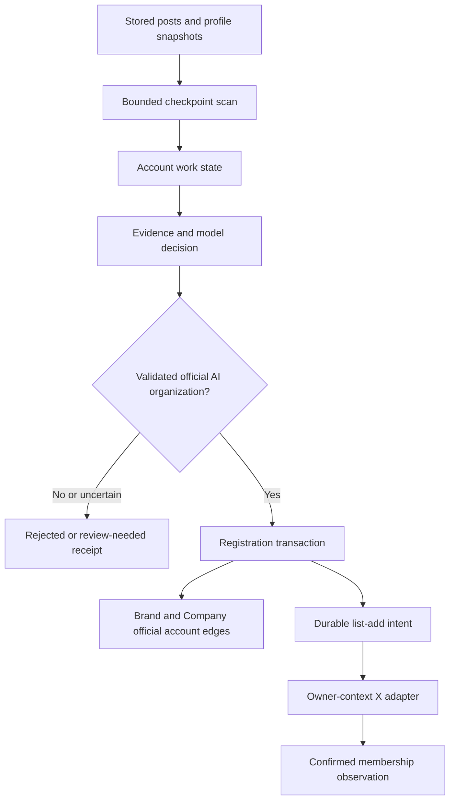
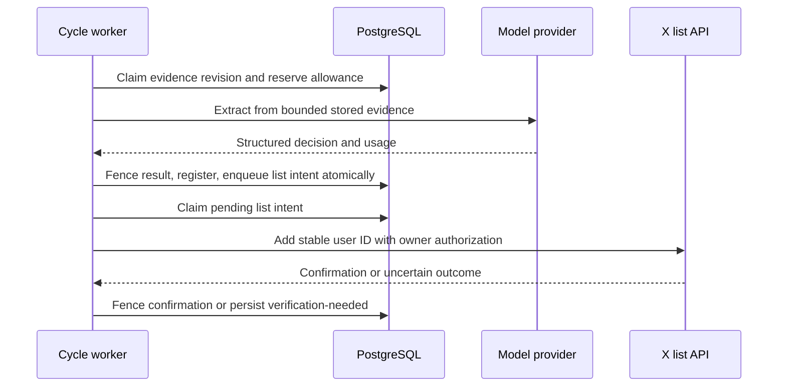
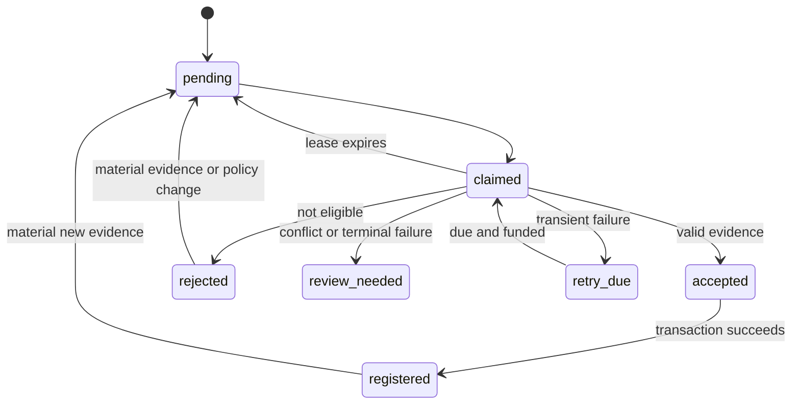
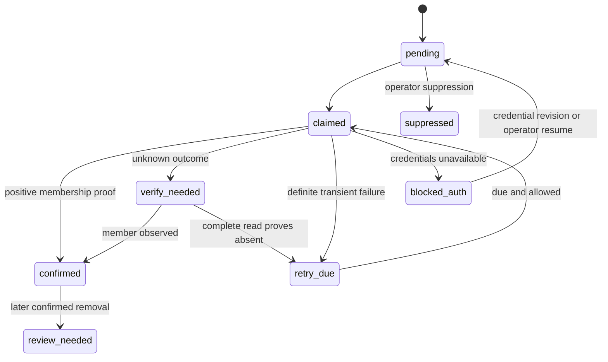
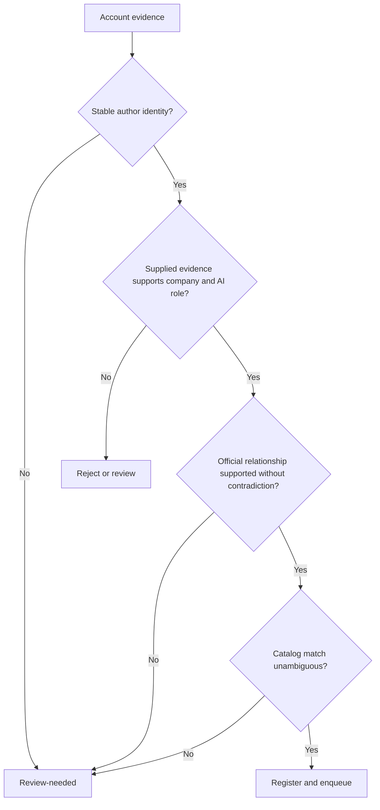

# Official Company Account Extraction - Plan

## Plain-English Summary

PushinWeight should recognize official AI company and lab accounts in posts it already stores, register those organizations, and add their accounts to the private list that Call A collects. This includes closed-model and pre-release labs. The existing people-affiliation extractor remains focused on people.

A one-time scan will cover every stored author in the entire database, with no post-age or observation-age cutoff, to find official AI labs that release or develop for release any kind of AI model: language, image, video, audio, speech, multimodal, robotics/action, embedding or other model types. It will use bounded resumable batches, keep evidence and coverage counts, and register settled organizations. Reflection, Aleph Alpha, and Bad Theory Labs are already owner-verified positive examples. Going forward, a separate incremental extractor will run with the existing 15-minute harvester, inspecting newly stored authors and materially changed post/profile evidence rather than repeating the whole initial scan.

Tests will cover those examples and unseen companies, misleading accounts, duplicate identities, retries, and the real cycle entry point. Official X owner access is verified locally. The owner now authorizes LFG through production activation plus verified collection, including the initial full-database pass, continuing extraction, settled registration and list synchronization. Runtime secret provisioning and refresh/client validation are delivery work. Single-post Chatter/Pulse admission remains separate.

---

## Goal Capsule

This branch is independent ingestion/discovery work originating from G2, with shared account records referenced by G1. Build against the current schema. The benchmark branch's proposed account and taxonomy changes are a compatibility consideration, not an implementation prerequisite or permission to migrate them here.

- **Objective:** Newly encountered official AI company and lab accounts become registered organizations and join Call A's private collection list without routine manual entry.
- **Means:** Account-scoped evidence extraction, transactional registration, and a durable list-add queue (KTD1–KTD7).
- **Authority:** Current owner instructions govern scope; this plan's Product Contract governs behavior. Existing repository rules govern execution and delivery.
- **Execution profile:** Implement in this branch, verify on isolated PostgreSQL with fake provider boundaries, then complete the owner-authorized bounded evaluation, full-database discovery and production activation.
- **Stop conditions:** Conflicting identity evidence becomes review-needed. Missing owner list credentials blocks remote synchronization, not local registration. Changes to product scope or paid activation require the owner's decision.
- **Endpoint and ownership:** Owner selected production activation plus verified collection on 2026-10-06. Parent owns implementation, review, delivery, full-scan coverage receipts, activation and normal-cycle proof. Preserve production cron state and other sessions' staging resources.

---

## Product Contract

### Summary

Add `official_co_account_extraction`, an account-level role that regularly evaluates stored evidence and registers settled official AI organizations. A persistent add-only synchronization queue connects registration to private X list `2067062923525275922`.

### Problem Frame

Useful organization evidence is already stored, but the person-oriented affiliation role is tied to classified posts and does not register official companies. Flat descriptions are empty for the three known examples despite useful nested bios and profile URLs. Existing list reconciliation observes membership; it does not add newly discovered accounts.

### Key Decisions

- **Treat the three accounts as settled positive examples** (session-settled: user-directed — chosen over nomination and reapproval: the owner already verified these identities). Governs R3.
- **Discover AI organizations generally.** Business verification, Hugging Face publication, and open weights cannot define the eligible population. Governs R2.

### Requirements

**Discovery and evidence**

- R1. Complete one resumable initial scan of the entire stored author population and its available evidence, with no age cutoff. Independently run incremental extraction with each normal harvester cycle for new authors and materially changed evidence, with bounded work and durable progress. Initial coverage must distinguish enumerated, evaluated, no-evidence, review-needed and retry-pending accounts; budget exhaustion is incomplete coverage, not success.
- R2. Identify official AI labs/companies releasing or developing for release any kind of AI model, including non-LLM, closed-model and pre-release organizations; no Business badge, Hugging Face presence, released product, or open weights is mandatory. Generic AI users, consultancies or wrappers without evidence of developing/releasing models do not qualify solely from AI wording.
- R3. Accept the owner-verified identities `reflection_ai`/`1800594921704898560`, `Aleph__Alpha`/`1073704329528438785`, and `Badtheorylabs`/`2048427879273218048` as positive acceptance fixtures rather than new nominations.
- R4. Preserve source-grounded evidence from nested profile descriptions, expanded profile URLs, authored posts, and observation times; separate missing evidence from contradictory evidence.
- R5. Persist accepted, rejected, review-needed, and retryable outcomes with evidence identity, policy/model version, rationale, source citations, attempts, and usage.

**Registration and synchronization**

- R6. Reuse stable account and organization identities when registering supported Brand, Company, BrandAccount, and CompanyAccount records; ambiguous collisions require review rather than silent merges.
- R7. Enqueue settled official accounts for add-only membership in list `2067062923525275922`, without claiming membership until the provider confirms it.
- R8. Recover safely from duplicate work, expired claims, rate limits, timeouts, partial completion, and unavailable owner credentials; registration remains durable when list synchronization is blocked.
- R9. Expose bounded inspect, retry, and suppression operations through shared domain services and machine-readable management commands.

**Existing behavior and limits**

- R10. Preserve people affiliation extraction, narrow product-publisher verification, A/B/C collection shape, existing Jev budgets, and the single 15-minute production scheduler.
- R11. Bound database scanning, provider calls, concurrency, elapsed time, and spend before dispatch; disabled and dry-run modes perform no provider calls or application writes.
- R12. Verify both unseen positive organizations and misleading negative accounts, with production-call-chain regression coverage rather than fixture-specific handle branches.
- R13. Preserve current brand-based behavior while isolating provider-qualified account identity and attribution queries in shared functions. Coordinate overlapping account/schema work with the benchmark branch before edits and recheck migration ordering before integration; do not implement its proposed taxonomy or account migration incidentally.

### Acceptance Examples

- AE1. Covers R2–R4: each settled fixture yields its stable account identity and official organization result despite empty flat description; removing Business/Hugging Face/open-weight hints does not create an eligibility gate.
- AE2. Covers R2, R12: an unseen closed-model lab with consistent first-party company bio, domain, and research/hiring posts qualifies without a public model release.
- AE3. Covers R4–R6: a person naming their employer, a fan account linking its subject's domain, a news account reposting releases, and a conflicting impersonator do not auto-register as that company's official account.
- AE4. Covers R6, R8: repeated posts and a handle rename for one stable author ID reuse the registration; reuse of an old handle by another ID cannot inherit it.
- AE5. Covers R7–R8: registration commits, the add request times out, and a later confirmed membership read completes the same queued operation without another registration.
- AE6. Covers R1, R8, R11: scan interruption resumes without losing accounts, and exhausted budget or deadline defers work with no hidden provider attempt.

### Scope Boundaries

This feature reads stored evidence; it does not launch broad X searches, scrape company websites, create people, infer legal ownership percentages, remove list members, or redesign the feed. It does not change the product-publisher verification policy.

### Deferred to Follow-Up Work

Independent website corroboration, global company-merge tooling, a review UI, and discovery outside stored authors are separate work. The separately authorized local owner-access test is complete. Runtime secret provisioning and refresh/client validation remain prerequisites for automatic synchronization under KTD8; this planning update does not perform them.

---

## Planning Contract

### Key Technical Decisions

- KTD1. **Use an account-scoped service.** Add `core/official_company_accounts.py` and share profile normalization and the existing targeted provider-call adapter. Keep `TargetedExtractionState` post/role semantics and `_persist_personnel` unchanged. This satisfies R1, R10 without forcing account work through a post-event gate.
- KTD2. **Separate full inventory from incremental progress.** The initial command freezes a started-at boundary and enumerates every stored Account plus reconciled author references, with no time cutoff, in stable keyset batches. Keep durable progress and exact coverage counts; accounts with no useful evidence remain explicitly recorded, not silently excluded. Seed incremental observation cursors at the initial boundary so arrivals/updates during the sweep are not missed. Incremental runs use separate post/profile observation cursors and material evidence hashes; enqueue transactionally before advancing. Overlap safely and use a bounded rotating all-account reconciliation to close late-commit races without rescanning everything each cycle. Do not use post creation dates as inclusion gates.
- KTD3. **Make evidence selection deterministic.** Use the latest profile plus up to five distinct recent authored posts and up to three materially different profile snapshots. Prefer nested bio text when flat text is empty; normalize HTTP(S) domains without treating a link as proof of ownership. Preserve original selected texts, raw source references, and timestamps. Payloads over the configured transport envelope become review-needed rather than silently truncated.
- KTD4. **Validate structured decisions before writes.** Require organization type, AI relationship, official-account relationship, supporting source IDs with excerpts, contradictions, and an accepted/rejected/review-needed result. Auto-accept only when all three identity judgments are supported by supplied first-party evidence and no material contradiction remains. A badge or model confidence number alone is insufficient. Supplied content is untrusted data, never executable instructions. The owner attestations in R3 are versioned evidence overrides keyed by stable author ID; they do not become handle-specific classifier logic.
- KTD5. **Register identities in one transaction.** Lock the Account and extraction state, reuse existing official BrandAccount/CompanyAccount edges and settled candidate mappings, and write missing official edges idempotently. A new organization may receive a Brand and Company with observed names and unknown legal/HQ fields; do not create a BrandCompany ownership edge from its default `1.0`. Match existing catalog candidates by stable account associations first. Similar names/domains produce review candidates, not automatic company merges. Slug conflicts also become review-needed. Write the list-add intent in the same transaction, and keep model output unable to choose arbitrary catalog IDs.
- KTD6. **Separate work state from historical receipts.** Add account work state with evidence revision, result, next attempt, claim token/expiry, registration references, and last error; keep immutable per-attempt decisions/usage in a child ledger. Add a small scan-state record and a list-add intent uniquely keyed by list/account. Reuse `BrandDiscoveryCandidate` for ambiguous catalog matches, attaching source evidence rather than treating its name/handle hash as canonical identity. All post-network completion writes must match claim token and evidence revision. New evidence supersedes an old pending decision without overwriting history.
- KTD7. **Keep desired and observed list state distinct.** Store queue states pending, claimed, retry-due, verify-needed, blocked-auth, confirmed, review-needed, and suppressed separately from `TwitterListMembership`. A positive provider add result or member observation can confirm one account; only a complete snapshot can advance `TwitterListSyncState`. Network calls occur outside registration transactions. An unknown add outcome is verified with owner-context membership reads before another write. A bounded incomplete read cannot establish absence. Manual suppression is durable; later disappearance of a previously confirmed member becomes review-needed rather than automatic re-add.
- KTD8. **Use official X owner authorization for outbound changes.** Add an explicit owner-context adapter for `/2/lists/{id}/members`, bind the configured list ID and owner ID, and check ownership/scopes before enabling writes. Owner decision 2026-10-06T12:20Z: persist access/refresh tokens encrypted in PostgreSQL, with a dedicated encryption key and matching OAuth2 client configuration in Render-managed secrets. Never store token plaintext in application records, evidence or model prompts. Save the rotated token pair atomically; uncertain refresh outcomes block another automatic refresh until operator recovery. Do not fall back to app-only tokens, another app's credentials, or TwitterAPI.io cookies. Official documentation and dated probe results are in the evidence receipt. Local owner reads and an authorized Reflection add/readback succeeded on 2026-10-06. Use the exact project variables `PUSHINWEIGHT_X_LIST_ACCESS_TOKEN` and `PUSHINWEIGHT_X_LIST_REFRESH_TOKEN` for runtime provisioning; do not assume the repository or deployed services load the operator's local secret store. Implement and validate token refresh with the matching client configuration and persist rotated credentials atomically through the encrypted PostgreSQL credential store. Confirm owner/list access from the runtime adapter before enabling automatic writes. The successful requests do not identify the issuing app or establish the cause of the earlier OAuth1 failure.
- KTD9. **Schedule through the existing bounded cycle.** Enqueue stored observations once per normal scheduled cycle under the harvest writer lock. Run optional extraction after essential post-fetch work, and skip when remaining cycle time cannot cover a request plus persistence margin. Manual replay calls the same service under the same lock. Backfill does not implicitly activate this lane. Initialize a cycle-wide optional extraction allowance once so this role and existing targeted calls share its configured total; this role's local ceiling is two model calls per cycle, concurrency one, 20-second request timeout, and 45-second lane deadline. Due retries receive one of the two slots with borrowing when either class is empty. List synchronization has a separate two-write ceiling and bounded read/page deadline.
- KTD10. **Keep activation explicit and funded.** Add independent discovery, registration, and list-write flags, all off by default. Use an explicit `official_co_account_extraction` model/prompt config, initially the existing `deepseek-ai/DeepSeek-V4-Flash-0731` route. Define separate per-cycle/day USD limits defaulting to zero; positive funded limits and a verified pricing basis are required to enable model dispatch. Reserve worst-case input/output cost atomically before calling and retain unknown-outcome reservations until reconciled. Do not charge or borrow from Jev's ledger. Retryable transport/429/5xx failures have a bounded backoff and attempt ceiling; terminal malformed/identity failures become review-needed. Auth/config failures pause that adapter until a credential/config revision or operator retry, not every cron tick.
- KTD11. **Expose operations without adding a UI.** A management command offers bounded inspect, dry-run, enqueue, retry, suppress, and resume actions with JSON results. Mutations require explicit action flags and account/list bounds. Dry-run uses stored data and cached decisions only. Human and agent callers invoke the same domain operations, receive decision IDs/reasons, and can resume from durable checkpoints.
- KTD12. **Keep current-schema access behind explicit boundaries.** Shared functions in `core/official_company_accounts.py` resolve provider-qualified identity, retrieve official organization links, and supply current brand context to callers. Reuse the existing observation writer and `resolve_call_a_author_contexts` where applicable. This lane explicitly supplies provider `x`; unsupported providers are rejected by its X adapter. Internally retain ORM Account references and resolve the native X ID only at the provider boundary; do not serialize `Account.pk` as a universal X ID. Under today's schema, the X resolver uses `author_id`; do not query proposed `account_key` or `data_source_id` fields before they exist, or repurpose raw `Account.source`. Keep these queries out of prompts, commands, and cycle hooks. Brand/company evidence remains at its supported scope and cannot assign a specific product without separate evidence. Governs R13 and the compatibility dependency below.

### X Developer Console setup and recovery instructions

These are the operator instructions requested on 2026-10-06. Local owner read/write access has already passed; reuse that evidence rather than repeating a membership mutation merely to follow this runbook. Console labels and endpoint permissions should be checked against the official documentation when this procedure is next used.

**Known account and app configuration**

- Expected owner: `allenwlee`, stable user ID `17456158`.
- Target: private list `_openweight-off-staff`, ID `2067062923525275922`.
- The console showed `openclaw-cross-post`, app ID `32434538`, connected to `openclaw (Standard Basic)`. Both old OAuth1 credentials and the first newly saved OAuth2 access token returned HTTP 403 `client-not-enrolled`, despite that visible connection.
- The console also showed `top-gun`, app ID `33020022`, connected to `openclaw (Pay Per Use)`. The owner generated/saved tokens during this walkthrough and reported that they appeared identical. Subsequent owner/list reads and a membership write succeeded. Those successful responses do not reveal the issuing app, and the cause of the earlier failure is unresolved. Do not record migration, token replacement, propagation, or a specific app as the proven cause.

**Console and credential procedure**

1. Open [X Developer Console](https://console.x.com/) under the intended developer account. Under Apps, inspect the app ID and Project Access. Manage shows the actual connection. A “Move here” action can disconnect the current project and affect every application using those credentials; it is not a routine diagnostic step. Inspect access and Credits before considering a project or billing change.
2. For owner authorization, use **OAuth 2.0 → Access Token → Generate**, where that console option is available. The app-only Bearer Token does not supply owner authorization. Preserve existing Consumer Key, Client Secret, and other applications' tokens; do not select their Regenerate/Revoke controls as part of list setup.
3. If permissions are offered, request `tweet.read`, `users.read`, `list.read`, `list.write`, and `offline.access`. Otherwise verify the resulting permissions through the documented token/authorization contract and the adapter's read/write checks; a successful read alone does not prove write access. If interactive authorization is needed, enable OAuth2 in app settings, select the appropriate server application type, and register the exact callback URI used by the authorization helper. A callback is unnecessary to invent for a console-generated token.
4. The owner saves the two values in `/Users/fuchitalee/.env.secrets` on the authoritative host, using these exact assignments (placeholders only):

   ```bash
   export PUSHINWEIGHT_X_LIST_ACCESS_TOKEN='<access token>'
   export PUSHINWEIGHT_X_LIST_REFRESH_TOKEN='<refresh token>'
   ```

   Parse only the literal assignments without executing the secret file. Check for conflicting duplicate assignments and process-environment overrides without printing values. Do not overwrite `TOPGUN_*` or `TWITTER_*`, copy secrets into this plan, or request them in chat. Screenshots used for diagnosis must conceal secret values.
5. Before recurring use, establish which OAuth2 client issued the token and provision its matching client configuration. Do not assume the token belongs to `top-gun` merely because that screen preceded the successful test. `offline.access` permits a refresh token; the runtime still needs explicit refresh logic and safe persistence of rotated tokens. Provision the exact project credentials into the intended service's managed secrets; Django and Render do not automatically read the operator's `~/.env.secrets`.

**Bounded verification sequence**

1. `GET https://api.x.com/2/users/me` with the user access token must return `allenwlee` / `17456158`. Stop on an unexpected identity or authentication failure.
2. `GET /2/lists/2067062923525275922?list.fields=owner_id,private,member_count` must identify that owner and the intended private list.
3. Read `/2/lists/2067062923525275922/members` with bounded pagination. Record returned counts and continuation state. Incomplete enumeration cannot prove an account absent.
4. For an authorized membership test, submit `POST /2/lists/2067062923525275922/members` with a settled account's stable `user_id`. Require the successful response's `data.is_member` and independently read membership back. If the result is ambiguous, verify before retrying. Do not create application database roles merely because a remote membership write succeeded.
5. Save only redacted response evidence, time, target IDs, HTTP/provider errors, and completeness. Stop on denied access; diagnose the specific failure before retrying. A 401 indicates rejected authentication without establishing its exact cause. A 403 `client-not-enrolled` requires checking app/project access and entitlement, even when the console says connected. If it persists with a confirmed configuration, preserve the discrepancy for X support rather than repeatedly regenerating tokens or moving shared apps.

**Completed proof and remaining work**

On 2026-10-06, identity and private-list reads succeeded; complete membership enumeration returned 82 accounts. One authorized add of Reflection (`1800594921704898560`) returned HTTP 200 / `is_member: true`; independent complete readback returned 83 accounts including Reflection. Aleph Alpha and Bad Theory Labs were not added by this test. The durable [account evidence](../research/2026-10-06-100039-official-company-account-evidence.md) records these observations. Raw local receipts are under `/tmp/x-list-route-probe-20261006/`; this temporary directory is supporting evidence, not a deployed dependency. Runtime provisioning, client matching, refresh/rotation, automatic registration, and synchronization remain U4/U5 implementation work.

TwitterAPI.io remains a separate, unproven write route: `/twitter/list/add_member` returned `auth_session is required` when tested with the exact on-demand API key and no owner session. Its documented legacy route requires `auth_session` and a proxy; a V2 `login_cookie` is not established as compatible. Do not route official-X tokens to TwitterAPI.io or treat the collection key as list-owner authority.

Official references: [app configuration](https://docs.x.com/fundamentals/developer-apps), [OAuth2 and refresh tokens](https://docs.x.com/fundamentals/authentication/oauth-2-0/authorization-code), [add a list member](https://docs.x.com/x-api/lists/add-list-member), [pay-per-use credits](https://docs.x.com/x-api/getting-started/pricing), and [TwitterAPI.io endpoint contract](https://docs.twitterapi.io/api-reference/openapi.json). Reviewed 2026-10-06; no billing change or new live test is authorized by this documentation update.

### Assumptions

The one-time inventory has no age cutoff and runs through bounded operator batches until the frozen population is accounted for. Evidence selection considers the full stored history; an account is not excluded for inactivity. Bounded payloads can select representative historical model-release evidence alongside the latest profile/posts. The separate ongoing lane inspects at most 500 post observations and 200 changed profile snapshots per cycle and enqueues at most 100 account states, retaining unprocessed progress. Estimate initial model work from the actual inventory before dispatch, use explicit per-batch and total funding ceilings, and report any unresolved funding prerequisite without silently reducing coverage. No new broad X/HF search is needed for the initial inventory.

The policy accepts source-grounded first-party organizational self-representation when internally consistent; it is not cryptographic proof of website ownership. Uncertain or conflicting evidence requires review. The offline corpus must include convincing impersonation and misleading-domain cases before auto-registration is enabled.

New Company records describe observed operating organizations; they do not assert incorporation, location, or ownership. An existing competing catalog identity is a review case under KTD5.

### High-Level Technical Design

Component and data flow:



Network and commit sequence:



Account decision lifecycle:



List intent lifecycle:



Decision gates:



Activation modes:

| Discovery | Registration | List writes | Effect |
| --- | --- | --- | --- |
| Off | Off | Off | Existing harvest behavior only |
| On | Off | Off | Decisions and review evidence only |
| On | On | Off | Register accepted organizations and retain queued additions |
| On | On | On | Process additions only after owner-auth preflight passes |
| Off | On | Either | Reject invalid activation combination; explicit replay can process already accepted decisions |

### System-Wide Impact and Dependencies

Registration creates official account edges consumed by `resolve_call_a_author_contexts`; list membership alone does not establish brand context. A current evidence conflict must suspend unconfirmed list work, but cannot silently delete an existing organization or official edge. Expose the conflict for review with the original registration provenance.

New tables and constraints require additive migrations, indexed due-work selection, and PostgreSQL race tests. Use claim fencing as well as the existing harvest lock because manual commands, expired workers, and future callers can overlap. No new service, cron, or Celery beat process is needed.

Official X owner reads and a bounded write are verified locally: owner `allenwlee`/`17456158`, private list `2067062923525275922`, and Reflection `1800594921704898560` added with HTTP 200 and `data.is_member: true`. Complete member reads changed from 82 to 83 and independently confirmed Reflection. This retires the local owner-auth blocker. Automatic synchronization still requires runtime secret provisioning, matching refresh/client configuration, and verification through the implemented adapter. No automatic collector, configuration, or database registration changed, and the proof does not establish that Aleph Alpha or Bad Theory Labs were added.

### Benchmark/taxonomy compatibility dependency

Integration observation 2026-10-06: benchmark branch `00d0d15f` now implements its proposed schema locally in migrations `0065_measurement_taxonomy`, `0066_account_source_identity`, `0067_shared_metrics`; none is on `origin/main` (`5082ddf7`). This branch remains against current main with additive migrations0065–0068. Its new inbound Account references are `OfficialCompanyAccountState.account` and `OfficialCompanyListIntent.account`. The second integrating branch must reconcile migration leaves and include both references in the account-key conversion; the shared launch index records this inventory. This is coordination evidence, not an acknowledgement from the other session.


**Read and status:** reviewed the benchmark branch's canonical plan at `.worktrees/feat/benchmark-download-collector/docs/plans/2026-10-05-070106-feat-benchmark-download-collector-plan.md` (path relative to the authoritative root), especially R11/R14/R17/R18, the existing-account transition, and U10–U12. Its shared database changes are now implemented on the separate tested-and-ready PR #50 (`a3cbfe09`), but remain absent from `origin/main` (`5082ddf7`) at the 2026-10-07 integration check. Its earlier file-only collector did not establish these schema changes. The authoritative launch index remains `docs/brainstorms/2026-09-30-104924-general-launch-index.md` under the root checkout, not a potentially stale worktree copy.

| Proposed benchmark change | Concrete overlap with this branch | Compatibility action |
| --- | --- | --- |
| U12 provider-neutral accounts: internal UUID, source-qualified identifiers/handles, staged primary-key and foreign-key conversion | U2 account work state, U3 official-role edges/list intents, U4 list membership, U5 account/profile selectors | Build on the current Account schema through KTD12. Maintain an inventory of every new account FK, composite constraint, and persisted native-ID field for the benchmark migration owner. Distinguish X wire IDs from internal account keys. |
| U12 conversion of existing BrandAccount/CompanyAccount/profile/list references and global handle uniqueness | Shared `core/models.py`, `core/profile_snapshots.py`, `monitor/list_membership.py`, and account selectors in `monitor/cycle.py` | Coordinate file ownership before edits. Do not change the existing primary key, handle index, or provider registry here. Future mixed-source conversion must include newly added official-co references, beyond the benchmark plan's ten-table baseline. |
| U10 product relationships/groups and U11 precise post-subject attribution | Official company registration feeds current brand context; it does not establish exact product mentions | Preserve BrandAccount/CompanyAccount roles and existing PostBrand behavior. No new compulsory family hierarchy, product attribution from company identity, or one-product-per-brand assumption. Shared query functions provide the later migration boundary. |
| External measurements and independently scoped Pulse lines | No table or metric input is needed for official-account extraction/list synchronization | No direct runtime dependency. Do not add metric joins, provider crosswalks, measurement storage, or benchmark collection to this work. |

**Ownership and integration sequence:** Before changing `core/models.py`, account references, attribution joins, or any migration, reread the authoritative launch index and benchmark plan, identify current owners, and record an agreed bounded file/schema split with the benchmark branch. An old OFF entry does not establish that its work is abandoned. If that owner is unavailable, proceed with disjoint work while resolving only the concrete overlap; do not block the whole feature on the proposal.

Before generating this branch's additive migrations and again before integration, inspect the actual migration leaves and the selected integration revision. Record whether U12 is still proposed, concurrently implemented, or already landed. If this branch lands first, give the benchmark owner its new Account references and constraints for U12's conversion inventory. If U12 lands first, adapt the shared identity functions and migration dependencies to that actual schema and include the corresponding mixed-source regression cases. If concurrent, agree ordering and rehearse the combined graph on populated isolated PostgreSQL; never resolve the conflict by blindly renumbering migrations. The concrete dependency is compatible account references and a valid migration sequence at integration, not completion of the whole taxonomy proposal.

Do not introduce `data_sources`, `measurement_subjects`, product groups/relationships, generic account UUIDs, HF account ingestion, or `post_subject_attributions` as incidental G2/official-co work. No automatic backfill or attribution cutover is included. Existing brand totals and call-A eligibility remain the compatibility baseline.

### Sources and implementation references

- Implemented services: `core/official_company_accounts.py` (evidence, decisions, registration), `core/official_company_discovery.py` (initial and incremental work), `core/official_company_lists.py` (owner-authorized list synchronization), `core/official_company_credentials.py` (encrypted token rotation), and `monitor/management/commands/official_co_account_extraction.py` (operations). These replace the provisional new filenames in the implementation-unit outlines below. Additive schema is migrations0065–0068. Operational contract: `docs/operations/official-company-account-discovery.md`.
- `docs/research/2026-10-06-100039-official-company-account-evidence.md` and its adjacent JSON: dated stored examples, provider access results, and source trace.
- `core/profile_snapshots.py`, `core/targeted_extraction.py`, `core/models.py`: evidence normalization, provider-call boundary, and canonical identity models.
- `monitor/list_membership.py`, `monitor/cycle.py`, `x_monitor/config.py`: observed membership and scheduled integration boundaries.
- `docs/solutions/integration-issues/harvest-pipeline-missing-call-queries.md` and `docs/solutions/architecture-patterns/backfiller-and-llm-classifier-pipeline-wiring.md`: caller-level verification and shared scheduled/manual services.

---

## Implementation Units

### U1. Normalize organization evidence and freeze acceptance fixtures

**Goal:** Give the account extractor correct stored inputs and an independent acceptance corpus.

**Requirements:** R2–R4, R12–R13; KTD3–KTD4, KTD12. **Dependencies:** No benchmark schema prerequisite; observe the shared ownership boundary before touching profile/identity readers.

**Files:** `core/profile_snapshots.py`, new `core/official_company_accounts.py`, `tests/test_profile_snapshots.py`, new `tests/test_official_company_accounts.py`, new `tests/fixtures/official_company_accounts.json`.

**Approach:** Extend the existing observation reader for nested descriptions and expanded URLs. Build deterministic evidence bundles and versioned owner attestations from the research fixture. Add unseen positive and adversarial negative cases before wiring a model.

Implement KTD12's shared current-schema identity/official-link readers with an explicit X boundary. Unit fixtures can exercise rejection of unsupported provider inputs without inserting impossible HF rows into today's schema.

**Test scenarios:**

- Covers AE1: empty flat description still yields the full nested bio and expanded domain for each stable author ID.
- Covers AE2–AE3: unseen unbadged/pre-release company qualifies as a possible organization input; people, fan/news accounts, and copied domain links do not receive deterministic official approval.
- Missing/null/malformed nested structures preserve known fields without inventing observations.
- Reordered payload keys preserve evidence identity; changed substantive bio/post changes it; follower-count-only changes do not.
- Stored post text containing prompt instructions remains quoted source data; no tool call or catalog ID follows from it.

**Verification:** Source fidelity and identity tests pass without network access; no test requires a fixed positive handle branch.

### U2. Add account decisions, claim fencing, and funded execution

**Goal:** Persist repeatable extraction work, attempts, and safe retry behavior.

**Requirements:** R5, R8, R11; KTD1, KTD4, KTD6, KTD10. **Dependencies:** U1.

**Files:** `core/models.py`, new `core/migrations/<next>_official_company_account_state.py`, `core/official_company_accounts.py`, `core/targeted_extraction.py`, `x_monitor/config.py`, `config.yaml`, `tests/test_official_company_accounts.py`, new `tests/test_official_company_account_schema.py`.

**Approach:** Add state/attempt/scan records and a funding ledger scoped to this role. Extract only the reusable provider-call boundary if necessary. Keep post-targeted role/state constraints separate, and thread explicit role configuration to the canonical provider factory. Validate structured source references before accepting results.

Before model/migration edits, perform the benchmark ownership and migration-leaf check above. Inventory all new Account FKs and native-ID fields; use current-schema ORM references without implementing U12's account-key conversion.

**Test scenarios:**

- Two workers claiming one account/evidence revision fund only one request.
- A stale claim response cannot replace a newer evidence decision or register an account.
- Malformed JSON, unsupported citations, and contradictory identity produce durable review-needed results.
- 429/5xx are retryable; expired claims recover; auth failures remain blocked until an explicit revision/resume.
- Zero budget, exhausted reservation, disabled mode, or inadequate deadline dispatches nothing.
- Timeout with unknown spend retains reservation; successful completion records actual usage exactly once.

**Verification:** PostgreSQL uniqueness/race tests prove state transitions and accounting; explicit model routing is captured at the provider boundary.

### U3. Register official organization identities transactionally

**Goal:** Turn accepted account evidence into reusable catalog identities and pending list intents.

**Requirements:** R3, R6–R8; KTD5–KTD7. **Dependencies:** U2.

**Files:** `core/official_company_accounts.py`, `core/models.py`, new `core/migrations/<next>_official_company_list_intents.py`, `tests/test_official_company_accounts.py`, new `tests/test_official_company_registration.py`.

**Approach:** Add registration and intent services with account/decision locks. Resolve existing official edges and reviewed candidates before allocating names. Record created-versus-reused identities and the decision that authorized each edge. Preserve existing catalog corrections.

Route identity and official-role queries through KTD12's shared functions. Organization acceptance may establish company/brand context, but cannot create a Product, product-group membership, or exact-product post assertion. Include new intent Account references in the coordinated migration inventory.

**Test scenarios:**

- Covers AE4: repeated posts, case changes, and stable-ID handle rename yield one registration and one intent.
- Reused old handle with a different author ID cannot inherit the previous company's edges.
- Existing CompanyAccount only, BrandAccount only, both, and conflicting mappings each take the defined resolution/review path.
- Unknown legal fields remain unknown; no default 100% ownership edge is created.
- Failure between edge creation and intent creation rolls back both; concurrent retries converge.
- A later contradictory evidence revision blocks unconfirmed synchronization without deleting historical registration.

**Verification:** ORM assertions show exact created/reused edges and atomic intent persistence on PostgreSQL.

### U4. Implement add-only private-list synchronization

**Goal:** Deliver pending list additions safely when owner authorization is available.

**Requirements:** R7–R9, R11; KTD7–KTD8, KTD11. **Dependencies:** U3.

**Files:** new `monitor/list_membership_sync.py`, new `x_monitor/x_list_client.py`, `monitor/list_membership.py`, `x_monitor/config.py`, new `tests/test_list_membership_sync.py`, `tests/test_list_membership_reconciliation.py`.

**Approach:** Implement the fixed official X owner-context route and preflight, including project credential loading and refresh/client validation under KTD8. Keep desired intent distinct from observed membership. Reuse positive observation persistence without fabricating a complete snapshot. Bound verification pagination and redact credentials from every receipt.

Resolve native X user IDs through the explicit X adapter, not generic primary-key string conversion. At a future mixed-source integration, reject non-X accounts before sending requests, even when their handle or native identifier equals an X account's.

**Test scenarios:**

- Covers AE5: accepted add persists a member observation; timeout followed by observed membership confirms the same intent without another write.
- Timeout followed by incomplete member pagination never establishes absence or retries the add.
- Wrong owner, wrong list, missing scope, 401, and 403 block writes with distinct machine-readable errors.
- Expired access tokens refresh only with matching client configuration; rejected refresh and rotation-persistence failure block further writes without leaking credentials.
- Already-member response, 429, 5xx, deleted/suspended account, and malformed success response retain appropriate terminal or retry state.
- Expired worker completion, concurrent reconciliation, and stale snapshot cannot overwrite newer confirmation.
- Suppression and subsequently observed manual removal prevent automatic re-add; unrelated members are never removed.

**Verification:** Fake HTTP transport pins URL, stable user ID, owner authorization, refresh behavior, response semantics, and zero unapproved fallback requests. Reuse the recorded local Reflection add/readback as route proof; it does not replace verification of the new runtime adapter and persisted membership state. Any further live mutation remains separately activation-gated.

### U5. Wire the bounded stored scan and operator commands

**Goal:** Run the service frequently through the existing scheduler and support resumable operator actions.

**Requirements:** R1, R8–R11; KTD2, KTD9–KTD11. **Dependencies:** U2–U4.

**Files:** `monitor/cycle.py`, `monitor/management/commands/run_cycle.py`, new `monitor/management/commands/official_company_accounts.py`, `x_monitor/config.py`, `config.yaml`, new `tests/test_official_company_cycle.py`, new `tests/test_official_company_commands.py`.

**Approach:** Add once-per-cycle scan/drain hooks and persistent counters. Share the optional extraction allowance across existing targeted work and the new role. Keep progress when caps/deadline expire. Commands call the same services and expose decision, registration, and sync results independently.

Add explicit `initial-scan`/resume and incremental modes using the same evidence/extraction/registration services. Initial enumeration runs over the whole DB, freezes its population boundary, reports every outcome, and cannot declare completion with unenumerated accounts or pending retries. Enqueue new/changed observations independently from that boundary. Initial evaluation runs with automatic registration/list writes disabled until the frozen acceptance evaluation passes, then process accepted results without repeating model calls. The ongoing lane never reruns the entire initial scan.

**Test scenarios:**

- Covers AE6: a post with an old creation date but new fetched observation enters the queue; interrupted scans resume after the last durable enqueue.
- Initial inventory includes accounts whose only posts/profiles are older than 30 days and non-LLM model labs; restart/resume and arrivals during the sweep produce no gaps or duplicate decisions. No-evidence and review-needed cases remain visible in coverage totals.
- Same-timestamp rows, late commits, compressed snapshot updates, and material account changes are eventually scanned without repeated paid decisions.
- Fresh and due retry work share the two-slot allowance with borrowing; retry backlogs do not consume every fresh slot.
- Existing targeted calls plus new calls never exceed the cycle-wide allowance across multiple post-fetch batches.
- No time remaining defers the lane without delaying existing essential work; discovery failure does not suppress normal collection.
- Dry-run and inspect perform no database writes or external calls; mutation commands require explicit bounded targets.

**Verification:** A real CycleRunner invocation with fake provider transports reaches the service using loaded config, and durable rows demonstrate checkpoint and outcome behavior.

### U6. Establish the regression net and activation evidence

**Goal:** Prove general discovery and preserve existing collection before any paid/live activation.

**Requirements:** R1–R13; KTD8–KTD12. **Dependencies:** U1–U5; compatible actual account schema/migration graph at integration, not completion of the benchmark proposal.

**Files:** `tests/test_official_company_cycle.py`, `tests/test_official_company_accounts.py`, `tests/test_targeted_extraction.py`, `tests/test_targeted_extraction_model_route.py`, `tests/test_list_membership_reconciliation.py`, `tests/test_jev_decisions.py`, new `docs/operations/official-company-account-discovery.md`.

**Approach:** Freeze the fixture rubric before evaluating model behavior. Add the production-call-chain regression net and document separate decision, registration, and remote-sync activation stages. Record false accepts, missed positives, review cases, actual usage, queue age, and blocked reasons. Evaluate a bounded paid sample only after budget authorization.

**Compatibility regression net:** Through real registration, cycle, and list callers, prove unchanged legacy brand contexts/counts on unchanged fixtures, company-only evidence creates no product assertion, and X wire IDs stay stable without coupling callers to `Account.pk`. Verify unsupported provider inputs cause no writes/network calls through the X adapter. If benchmark U12 has actually landed at integration, additionally use same-handle/same-native-ID X and HF fixtures to prove isolation and reconcile every new account reference before/after the combined migrations. Do not claim those future-schema database tests passed while U12 remains unimplemented. Recheck shared-file ownership and migration leaves at integration and rehearse the actual combined migration graph on populated isolated PostgreSQL.

**Test scenarios:**

- Covers AE1–AE6 through scheduled/manual shared entry points rather than only helper functions.
- Existing profile-affiliation extraction still creates people/affiliations through its original contracts.
- Existing product verification retains its Business/Hugging Face eligibility gate.
- All-disabled config preserves Call A/B/C requests, classification behavior, Jev limits, and existing membership reconciliation.
- Canonical model/endpoint remains correct with deliberately mismatched generic provider environment values.
- Migration forward/rollback and simultaneous claims use PostgreSQL; required race tests may not be silently skipped.

**Verification:** Report exact executed/passed/skipped/error counts, at least three call-chain tests and the associated function-level count, and the frozen corpus results. Zero false accepts on the adversarial corpus and correct acceptance of unseen closed/pre-release positives are required before auto-registration activation; owner fixtures alone cannot prove model quality.

---

## Verification Contract

| Gate | Scope | Completion evidence |
| --- | --- | --- |
| Model and migration checks | U2–U3 | Django system checks and migration consistency; additive schema, stable-ID uniqueness, no unintended catalog backfill |
| Focused tests | U1–U5 | Repository `scripts/pytest-local` runs new evidence, schema, registration, sync, cycle, and command tests on an isolated PostgreSQL database |
| Existing regression suites | U6 | Targeted extraction, profile snapshots, list reconciliation, provider routing, and Jev queue tests pass with zero required skips |
| Benchmark compatibility | U1–U6 / integration | R13 shared-query boundary, unchanged brand behavior, no invented product attribution, account-reference inventory, coordinated ownership and actual migration-leaf reconciliation; mixed-source database tests only when U12 actually exists |
| Concurrency and recovery | U2–U5 | Multiple database connections prove claim fencing, reservation accounting, rollback, and timeout recovery |
| Offline acceptance corpus | U1, U6 | Three attested positives plus unseen closed/pre-release labs and negative/impersonation cases produce expected validated decisions |
| Authorized model evaluation | U6 activation | Fixed corpus, explicit model/prompt/pricing, frozen iteration and spend cap, error analysis; unrun evaluation is not passed |
| Owner-auth list smoke | U4 activation | Local owner read and Reflection add/readback verified on 2026-10-06; runtime adapter, deployed secret/refresh configuration, and persisted observation remain unverified |
| Delivery health | U6 delivery | Apply change-harvester's enrichment-relevant latest-N health check after the authorized deployment and retain exact deployed revision and feature activation evidence |

Verification commands use the repository's local test wrapper and a dedicated isolated PostgreSQL database; production DB and occupied shared staging resources are not test fixtures. The current LFG request authorizes implementation, bounded evaluation, production discovery and activation; preserve explicit budgets, locks and provider limits.

---

## Current delivery evidence and prerequisites

Review candidate: [PR #53](https://github.com/allenwlee/pushin-weight-v2/pull/53).
Local feature/regression/Ollija validation passed 227 tests, including 158 required
PostgreSQL tests with zero skips/errors. The discovery CI passed on `e6989e15`;
the existing staff CI exposed missing staging-refresh classification for the
seven new discovery tables. The repair excludes and scrubs these operational
tables, including encrypted credentials and list intents, while preserving
copied canonical company/brand account links. The repaired staff CI command
passed locally: 302 tests, including 176 required PostgreSQL tests with zero
skips/errors. Both hosted workflows passed on repaired head `afdbc240`:
discovery 191 tests / 158 required PostgreSQL and staff/staging 302 tests /
176 required PostgreSQL, with zero required skips/errors. Detailed receipts remain in the
[implementation verification](../analysis/2026-10-07-061500-official-company-implementation-verification.md).

On 2026-10-07 the owner identified **top-gun** (app `33020022`) as the issuer of
the saved access/refresh token pair. Runtime provisioning must pair those tokens
with `TOPGUN_TWITTER_OAUTH2_CLIENT_ID` and `TOPGUN_TWITTER_OAUTH2_CLIENT_SECRET`,
mapped to the project-specific runtime names. Do not use the separate
openclaw-cross-post client. Live encrypted provisioning and renewal remain
verification work; identification is not proof that renewal has succeeded.
Shared staging retains the separate G2 candidate. The owner selected direct
production delivery on 2026-10-07, preserving those resources and omitting
staging delivery for this feature.

Initial decisions currently run sequentially in bounded operator batches. The
final 11-case evaluation averaged 4.4185 seconds per request. Applying that small
sample mean to the earlier 90,391-author inventory gives approximately 111 hours
of continuous request processing, before pauses, retries and database overhead.
This is a planning estimate, not a measured population runtime or recall claim.
Complete enumeration is not completed evaluation; retain the full-coverage
endpoint and report unresolved work until it is actually processed.

## Definition of Done

The implementation is complete when U1–U6 meet their verification outcomes, all required regression and PostgreSQL checks pass, and abandoned experimental code is removed. Configuration, migrations, service boundaries, and operational documentation describe the same behavior.

A disabled implementation can be code-complete while activation remains blocked. The full product outcome is complete only after the currently authorized discovery/registration runs demonstrate acceptance quality and an owner-authenticated list add is observed remotely and persisted locally. A queued intent, reachable endpoint, successful cron exit, or deployment alone is not that evidence.

For the current request, completion requires the intended revision observed in production, initial whole-database scan coverage fully accounted for (accepted/rejected/review-needed/no-evidence; no silently omitted older authors), durable registration/list outcomes, successful runtime credential refresh validation, and at least two normal scheduled cycles showing incremental progress. Demonstrate a subsequently collected eligible post from a newly registered official account, with its correct brand attribution and normal post-processing outcome. A successful add, mock test or enabled flag alone is not verified collection. Preserve measured error/uncertainty evidence; do not guarantee exhaustive discovery beyond the stored population or Chatter/Pulse admission.

---

## Delivery Exceptions

Owner selected LFG through production activation plus verified collection on 2026-10-06. This supersedes earlier planning-only and separately-authorized-activation wording for this feature. On 2026-10-07 the owner explicitly selected direct production delivery for this feature; omit staging delivery and preserve G2's staging resources. The owner also identified top-gun as the token-issuing app. Production pause/resume and unrelated taxonomy implementation are excluded. Local X list access is proven, but runtime provisioning/refresh and new account registration remain required work.

---

<!-- BEGIN OLLIJA DELIVERY GUIDE -->
## Ollija Delivery Guide

This block is generated guidance. Do not edit it directly. Correct durable facts in `.ollija/project.yaml` or this template, then rerun `ollija annotate-plan`. Current explicit owner instructions govern this task. Record exceptions below and reflect route changes in metadata; removed requirements must not return through another checklist.

### Resolved locations

- Authoritative host: `fuchitalee`
- Authoritative repository: `/Users/fuchitalee/development/pushin-weight-v2`
- Ollija release worktree area: `/Users/fuchitalee/development/pushin-weight-v2/.worktrees`
- Active worktree: `/Users/fuchitalee/development/pushin-weight-v2/.worktrees/feat/official-co-account-extraction`
- Plan: `/Users/fuchitalee/development/pushin-weight-v2/.worktrees/feat/official-co-account-extraction/docs/plans/2026-10-06-100039-feat-official-co-account-extraction-plan.md`
- Change: `feat-official-co-account-extraction-2026-10-06-100039`
- Branch: `feat/official-co-account-extraction`
- Staging branch and blueprint: `staging`, `/Users/fuchitalee/development/pushin-weight-v2/.worktrees/feat/official-co-account-extraction/render-staging.yaml`
- Production branch and blueprint: `main`, `/Users/fuchitalee/development/pushin-weight-v2/.worktrees/feat/official-co-account-extraction/render.yaml`
- Staging URL: `https://pushinweight-staging-web.onrender.com`
- Production URL: `https://pushinweight-web.onrender.com`

### Placement

This worktree is inside the Ollija release worktree area. Reuse it for the whole change. Do not create a second worktree or plan for this branch.

### Delivery scope

- Workflow: `plan`
- Delivery target: `production`
- Owner selection recorded: `true`
- Delivery route: `direct`

1. Complete implementation and the plan's verification contract.
2. Run the configured focused checks:
   - `pytest tests/ollija`
3. The parent workflow commits only this plan's changes, pushes the feature branch, and records the candidate SHA.
4. On the owner-selected direct route, fetch the remote production lane: `git fetch origin refs/heads/main`.
5. Require the same unchanged candidate SHA to be a fast-forward of that fetched remote ref, then push the exact candidate SHA to `refs/heads/main` with the server-enforced fast-forward command `git push origin <candidate-sha>:refs/heads/main`.
6. Verify the remote production ref resolves to the candidate SHA and the deployment for `pushinweight-web` reports that same SHA before reporting completion.
7. After step 6 succeeds, perform worktree cleanup as the final filesystem action:
    - From `/Users/fuchitalee/development/pushin-weight-v2`, require `/Users/fuchitalee/development/pushin-weight-v2/.worktrees/feat/official-co-account-extraction` to remain registered, clean, unlocked, and at the verified candidate SHA. If any guard fails, retain it and report the reason.
    - Run `git -C /Users/fuchitalee/development/pushin-weight-v2 worktree remove /Users/fuchitalee/development/pushin-weight-v2/.worktrees/feat/official-co-account-extraction` without `--force`.
    - Preserve the local and remote feature branches. Continue final reporting from the authoritative repository root.

### Failure handling

- Complete applicable, unwaived checks for the selected route. A waived check is waived, never passed. Owner-selected direct production does not require staging.
- Product defects return to the parent implementation workflow; repeat only checks invalidated by the fix. Environment failures require repairing the environment, not a new source commit. Retry only after a relevant fact changes.
- SSH, shell, environment, or multi-machine failures use the repository infra/multi-machine skill first.
- The change ledger is advisory; do not validate or enforce it.
- Never force-remove a worktree. Retain staging-only, failed, dirty, locked,
  noncanonical, or candidate-mismatched worktrees for diagnosis or later
  delivery.
- Do not run an endless retry loop or start a persistent Ollija process.
<!-- END OLLIJA DELIVERY GUIDE -->
