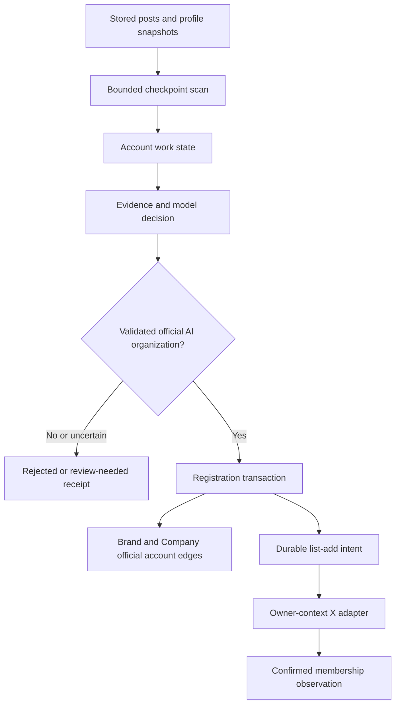
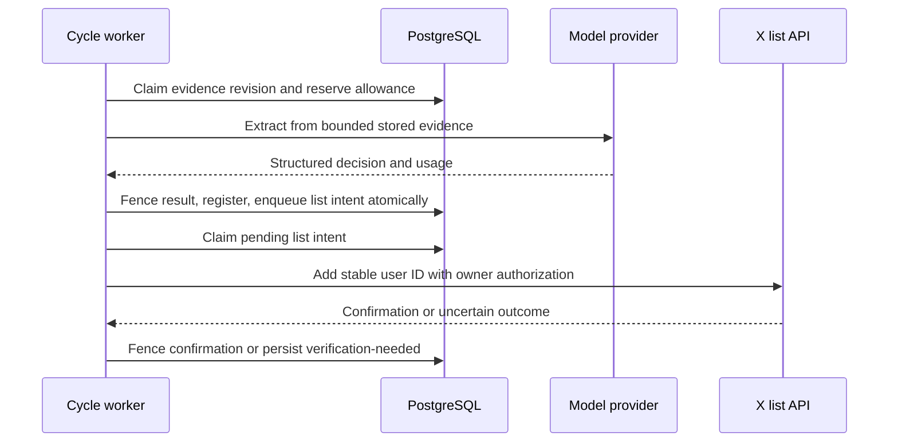
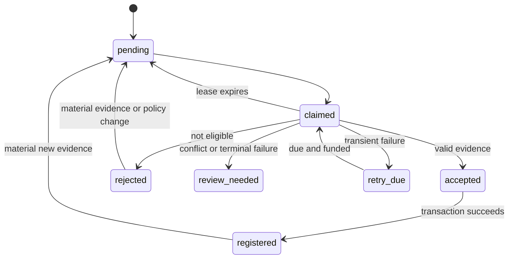
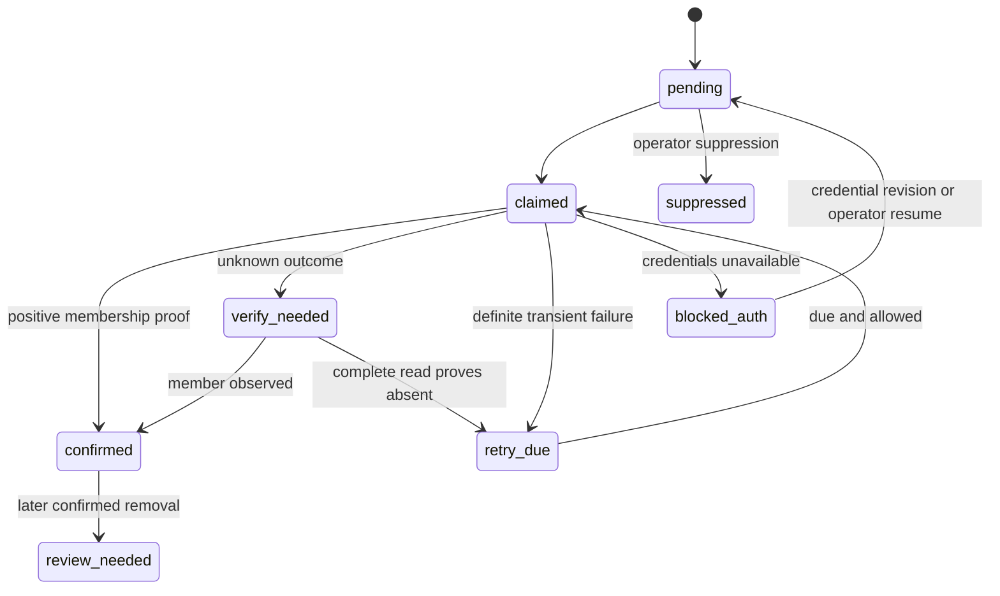
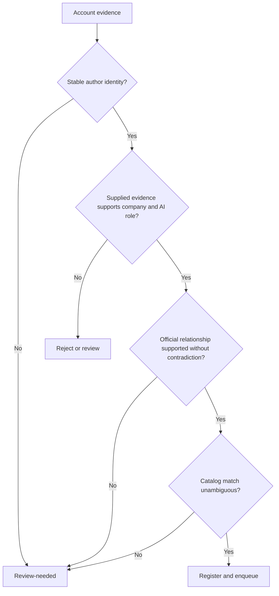

# Official Company Account Extraction - Plan

## Plain-English Summary

**Current owner direction — U21, 2026-10-08:** The owner accepts the classifier and authorizes LFG through direct production deployment and induction of the exact123 frozen accounts into Call A. Apply the five offering categories and attribution rules to the scheduled extractor, retain multiple internal categories and saved product evidence, and record owner approval separately from model results. Future unapproved positives retain human-review/HF rules. Preserve the completed benchmark schema and canonical product types, existing private-list members, credentials, budgets, background work and other sessions. Completion requires exact live source, independent list readback, and natural-cycle collection evidence.

**Owner amendment — U20, 2026-10-08:** Re-evaluate the fixed 123 qualifying accounts (the earlier 124 projection) against offering categories `model-llm`, `model-other`, `agent`, `harness`, and `other`. Product categories describe evidenced offerings; company capabilities derive from developed products, while account screening labels are internal and official identity remains separate. Narrow harness to explicit agent/model execution controls rather than treating every inference framework or AI application as a harness. Retain independent derivative-model credit and multi-category organizations. This turn authorizes a bounded evaluation report using saved evidence, not production schema changes, registrations, list edits or scheduler changes. The shared product taxonomy rename remains a coordinated follow-up after the completed benchmark deployment.

**Latest qualification requirement (U15, owner direction 2026-10-07):** A company qualifies when it develops at least one of: an AI model (proprietary or a derivative of an open-weight model), its own proprietary agent, or its own proprietary harness. An agent or harness can use another publisher's model; developing the underlying model is not required for these two routes. HF is an optional evidence source for all three routes. Model developers, including closed-weight developers, qualify without an HF page; agent and harness developers likewise need no HF page. This supersedes the model-only eligibility wording below. The broader evaluator/validator and attributable quantization/HF guard are live at3b405b78 under U17. The frozen 944-account rerun completed under U19: 123 qualifying (86 new, 37 previous), 596 uncertain, 187 rejected and 38 failed, with zero pending or awaiting retry. These are qualification outcomes, not new registrations/list additions; failed members do not have valid model decisions. U15's separate whole-population cheap rescreen remains pending.

**Latest admin requirement (U14):** Separate settled official accounts from candidates still needing review. `/admin` opens Official accounts found, with a Review needed tab; scan progress and past list synchronization stay available. Existing HF automatic approval, ordinary human review and the running full-history evaluation remain unchanged.

**Frozen-run page (U18):** Add a prominent Frozen account run link near the top of `/admin`, opening a separate page for the saved944-account rerun. Its three tabs list newly qualifying accounts, evaluations awaiting retry and pending evaluations. Counts, company/account details and evidence come from that fixed cohort; search and pagination cannot include the larger moving queue. This read-only page leaves the running scan and approval/list behavior unchanged.

**Earlier owner decision (2026-10-07; HF exception below supersedes blanket human review):** Keep the original v2 evaluator as a candidate screen. A NEAR-style false positive is acceptable in the human review queue. Hold every model-positive account for human review before creating official identities or list additions; existing explicitly settled owner identities remain approved. Model rejections remain recorded outside the positive review queue. This supersedes automatic acceptance/registration and the zero-false-positive production activation gate below, including the unshipped v3 precision repair and proposed further paid evaluation. No new prompt experiment is required. Production delivery remains direct; resume the filtered full scan with registration/list-sync flags held false.

PushinWeight should recognize likely official AI company and lab accounts in posts it already stores and show their evidence for human review. After owner settlement or the qualifying HF verification, those organizations can be registered and their accounts added to the private list that Call A collects. This includes closed-model and pre-release labs. The existing people-affiliation extractor remains focused on people.

A one-time scan covers every stored author in the entire database, with no post-age or observation-age cutoff, to find official AI companies developing models, proprietary agents, or proprietary harnesses. Model types include language, image, video, audio, speech, multimodal, robotics/action, embedding and others. It cheaply screens every author in bounded resumable batches and evaluates only selected candidates, keeping deferred authors and coverage counts. Gold/business badges admit accounts on their own and receive highest priority. Badge-free entrances use bio, development, company website/name and release signals, extended under U15 for agents and harnesses. Registration still requires a settled official company identity and qualifying development evidence. Reflection, Aleph Alpha, and Bad Theory Labs remain owner-verified positive examples. Going forward, a separate incremental extractor runs with the existing 15-minute harvester, inspecting newly stored authors and materially changed post/profile evidence rather than repeating the whole initial scan.

Tests will cover those examples and unseen companies, misleading accounts, duplicate identities, retries, and the real cycle entry point. Official X owner access is verified locally. The owner now authorizes LFG through production activation plus verified collection, including the initial full-database pass, continuing extraction, settled registration and list synchronization. Runtime secret provisioning and refresh/client validation are delivery work. Single-post Chatter/Pulse admission remains separate.

---

## Goal Capsule

This branch is independent ingestion/discovery work originating from G2, with shared account records referenced by G1. Build against the current schema. The benchmark branch's proposed account and taxonomy changes are a compatibility consideration, not an implementation prerequisite or permission to migrate them here.

- **Objective:** Newly encountered likely official AI company and lab accounts enter a source-grounded human review queue; owner-settled or externally verified HF model-developer identities become registered organizations and join Call A's private collection list.
- **Means:** Account-scoped evidence extraction, transactional registration, and a durable list-add queue (KTD1–KTD7).
- **Authority:** Current owner instructions govern scope; this plan's Product Contract governs behavior. Existing repository rules govern execution and delivery.
- **Execution profile:** Implement in this branch, verify on isolated PostgreSQL with fake provider boundaries, then complete the owner-authorized bounded evaluation, full-database discovery and production activation.
- **Stop conditions:** Conflicting identity evidence becomes review-needed. Missing owner list credentials blocks remote synchronization, not local registration. Changes to product scope or paid activation require the owner's decision.
- **Endpoint and ownership:** Owner selected production activation plus verified collection on 2026-10-06. Parent owns implementation, review, delivery, full-scan coverage receipts, activation and normal-cycle proof. Preserve production cron state and other sessions' staging resources.

---

## Product Contract

### Summary

Add `official_co_account_extraction`, an account-level role that regularly evaluates stored evidence and registers settled official AI organizations. A persistent add-only synchronization queue connects registration to private X list `2067062923525275922`.

### Problem Frame

Useful organization evidence is already stored, but the person-oriented affiliation role is tied to classified posts and does not register official companies. Flat descriptions are empty for the three known examples despite useful nested bios and profile URLs. Existing list reconciliation observes membership; it does not add newly discovered accounts.

### Key Decisions

- **Treat the three accounts as settled positive examples** (session-settled: user-directed — chosen over nomination and reapproval: the owner already verified these identities). Governs R3.
- **Discover AI organizations generally.** Business verification, Hugging Face publication, and open weights cannot define the eligible population. Governs R2.

### Requirements

**Discovery and evidence**

- R1. Complete one resumable initial scan of the entire stored author population and its available evidence, with no age cutoff. Independently run incremental extraction with each normal harvester cycle for new authors and materially changed evidence, with bounded work and durable progress. Initial coverage must distinguish enumerated, evaluated, no-evidence, review-needed and retry-pending accounts; budget exhaustion is incomplete coverage, not success.
- R2 (amended by owner, 2026-10-08; U21). Identify official company accounts where the company develops at least one qualifying product: (a) an AI model, proprietary or a derivative of an open-weight model, of any modality; (b) its own proprietary agent; or (c) its own proprietary harness; or (d) its own identifiable AI platform/service/application/framework (`other`). Retain independent, multiple offering categories internally. Closed-weight and pre-release model development remain eligible without an HF page or publicly downloadable weights. Developing an agent/harness does not require developing its underlying model. No Business badge, HF presence, released product, or open weights is mandatory. Require attributable development evidence rather than generic AI wording, mere model/API usage, hosting, resale, or an unchanged mirror. Do not reject an actual developed agent/harness just because it builds on a third-party model. A harness here means software the company develops to run, orchestrate or control models/agents. Preserve official-account identity as a separate evidence requirement.
- R3. Accept the owner-verified identities `reflection_ai`/`1800594921704898560`, `Aleph__Alpha`/`1073704329528438785`, and `Badtheorylabs`/`2048427879273218048` as positive acceptance fixtures rather than new nominations.
- R4. Preserve source-grounded evidence from nested profile descriptions, expanded profile URLs, authored posts, and observation times; separate missing evidence from contradictory evidence.
- R5. Persist accepted, rejected, review-needed, and retryable outcomes with evidence identity, policy/model version, rationale, source citations, attempts, and usage.

**Registration and synchronization**

- R6. Model-positive outcomes are candidates requiring human review; no model acceptance alone may register identities or enqueue list additions, even if registration flags are accidentally enabled. A server-generated, evidence-bound HF ownership/development verification receipt is the owner-authorized automatic exception (U11); other positives still require review. Previously explicit owner settlements and the exact123-account U21 owner-approved cohort remain registerable. Reuse stable account and organization identities for human-settled Brand, Company, BrandAccount, and CompanyAccount records; ambiguous collisions require review rather than silent merges.
- R7. Enqueue settled official accounts for add-only membership in list `2067062923525275922`, without claiming membership until the provider confirms it.
- R8. Recover safely from duplicate work, expired claims, rate limits, timeouts, partial completion, and unavailable owner credentials; registration remains durable when list synchronization is blocked.
- R9. Expose bounded inspect, retry, and suppression operations through shared domain services and machine-readable management commands.

**Existing behavior and limits**

- R10. Preserve people affiliation extraction, narrow product-publisher verification, A/B/C collection shape, existing Jev budgets, and the single 15-minute production scheduler.
- R11. Bound database scanning, provider calls, concurrency, elapsed time, and spend before dispatch; disabled and dry-run modes perform no provider calls or application writes.
- R12. Verify both unseen positive organizations and misleading negative accounts, with production-call-chain regression coverage rather than fixture-specific handle branches.
- R13. Preserve current brand-based behavior while isolating provider-qualified account identity and attribution queries in shared functions. Coordinate overlapping account/schema work with the benchmark branch before edits and recheck migration ordering before integration; do not implement its proposed taxonomy or account migration incidentally.
- R14 (owner addition, 2026-10-07). Add a read-only record of X accounts added to Call A's private list to the owner-selected `/admin` page (the existing product-review inbox). Show stable account identity, handle, organization, timestamps and synchronization outcome. Distinguish an acknowledged add, an uncertain request later confirmed by membership, and an account already present before synchronization; a `confirmed` intent alone does not prove that this extractor added the account. Preserve existing access restrictions and exclude credentials. Locate the intended page before editing a dashboard or creating another page.

### Acceptance Examples

- AE1. Covers R2–R4: each settled fixture yields its stable account identity and official organization result despite empty flat description; removing Business/Hugging Face/open-weight hints does not create an eligibility gate.
- AE2. Covers R2, R12: an unseen closed-model lab with consistent first-party company bio, domain, and research/hiring posts qualifies without a public model release.
- AE3. Covers R4–R6: a person naming their employer, a fan account linking its subject's domain, a news account reposting releases, and a conflicting impersonator do not auto-register as that company's official account.
- AE4. Covers R6, R8: repeated posts and a handle rename for one stable author ID reuse the registration; reuse of an old handle by another ID cannot inherit it.
- AE5. Covers R7–R8: registration commits, the add request times out, and a later confirmed membership read completes the same queued operation without another registration.
- AE6. Covers R1, R8, R11: scan interruption resumes without losing accounts, and exhausted budget or deadline defers work with no hidden provider attempt.
- AE7. Covers R14: the admin record distinguishes actual add acknowledgement, timeout followed by membership readback, and pre-existing membership; duplicate processing does not invent another addition. Verify the actual selected route in a browser with populated and empty data and access-denial coverage.
- AE8. Covers amended R2: an official company developing a proprietary agent or harness qualifies without an own-model release or HF namespace; supplying only an API key or reposting a vendor announcement does not establish development.
- AE9. Covers amended R2: attributable fine-tuning or other derivative development of an open-weight model qualifies. Record quantization as a distinct contribution; an attributable quantized derivative or quantized release of the company's own model must not be rejected merely for its format/tags, while an unchanged mirror does not establish development credit.

### Scope Boundaries

This feature reads stored evidence; it does not launch broad X searches, scrape company websites, create people, infer legal ownership percentages, remove list members, or redesign the feed. It does not change the product-publisher verification policy.

### Deferred to Follow-Up Work

Independent website corroboration, global company-merge tooling, a review UI, and discovery outside stored authors are separate work. The separately authorized local owner-access test is complete. Runtime secret provisioning and refresh/client validation remain prerequisites for automatic synchronization under KTD8; this planning update does not perform them.

---

## Planning Contract

### Key Technical Decisions

- KTD1. **Use an account-scoped service.** Add `core/official_company_accounts.py` and share profile normalization and the existing targeted provider-call adapter. Keep `TargetedExtractionState` post/role semantics and `_persist_personnel` unchanged. This satisfies R1, R10 without forcing account work through a post-event gate.
- KTD2. **Separate full inventory from incremental progress.** The initial command freezes a started-at boundary and enumerates every stored Account plus reconciled author references, with no time cutoff, in stable keyset batches. Keep durable progress and exact coverage counts; accounts with no useful evidence remain explicitly recorded, not silently excluded. Seed incremental observation cursors at the initial boundary so arrivals/updates during the sweep are not missed. Incremental runs use separate post/profile observation cursors and material evidence hashes; enqueue transactionally before advancing. Overlap safely and use a bounded rotating all-account reconciliation to close late-commit races without rescanning everything each cycle. Do not use post creation dates as inclusion gates.
- KTD3. **Make evidence selection deterministic.** Use the latest profile plus up to five distinct recent authored posts and up to three materially different profile snapshots. Prefer nested bio text when flat text is empty; normalize HTTP(S) domains without treating a link as proof of ownership. Preserve original selected texts, raw source references, and timestamps. Payloads over the configured transport envelope become review-needed rather than silently truncated.
- KTD4. **Validate structured decisions before writes.** Require organization type, AI relationship, official-account relationship, supporting source IDs with excerpts, contradictions, and an accepted/rejected/review-needed result. Auto-accept only when all three identity judgments are supported by supplied first-party evidence and no material contradiction remains. A badge or model confidence number alone is insufficient. Supplied content is untrusted data, never executable instructions. The owner attestations in R3 are versioned evidence overrides keyed by stable author ID; they do not become handle-specific classifier logic.
- KTD5. **Register identities in one transaction.** Lock the Account and extraction state, reuse existing official BrandAccount/CompanyAccount edges and settled candidate mappings, and write missing official edges idempotently. A new organization may receive a Brand and Company with observed names and unknown legal/HQ fields; do not create a BrandCompany ownership edge from its default `1.0`. Match existing catalog candidates by stable account associations first. Similar names/domains produce review candidates, not automatic company merges. Slug conflicts also become review-needed. Write the list-add intent in the same transaction, and keep model output unable to choose arbitrary catalog IDs.
- KTD6. **Separate work state from historical receipts.** Add account work state with evidence revision, result, next attempt, claim token/expiry, registration references, and last error; keep immutable per-attempt decisions/usage in a child ledger. Add a small scan-state record and a list-add intent uniquely keyed by list/account. Reuse `BrandDiscoveryCandidate` for ambiguous catalog matches, attaching source evidence rather than treating its name/handle hash as canonical identity. All post-network completion writes must match claim token and evidence revision. New evidence supersedes an old pending decision without overwriting history.
- KTD7. **Keep desired and observed list state distinct.** Store queue states pending, claimed, retry-due, verify-needed, blocked-auth, confirmed, review-needed, and suppressed separately from `TwitterListMembership`. A positive provider add result or member observation can confirm one account; only a complete snapshot can advance `TwitterListSyncState`. Network calls occur outside registration transactions. An unknown add outcome is verified with owner-context membership reads before another write. A bounded incomplete read cannot establish absence. Manual suppression is durable; later disappearance of a previously confirmed member becomes review-needed rather than automatic re-add.
- KTD8. **Use official X owner authorization for outbound changes.** Add an explicit owner-context adapter for `/2/lists/{id}/members`, bind the configured list ID and owner ID, and check ownership/scopes before enabling writes. Owner decision 2026-10-06T12:20Z: persist access/refresh tokens encrypted in PostgreSQL, with a dedicated encryption key and matching OAuth2 client configuration in Render-managed secrets. Never store token plaintext in application records, evidence or model prompts. Save the rotated token pair atomically; uncertain refresh outcomes block another automatic refresh until operator recovery. Do not fall back to app-only tokens, another app's credentials, or TwitterAPI.io cookies. Official documentation and dated probe results are in the evidence receipt. Local owner reads and an authorized Reflection add/readback succeeded on 2026-10-06. Use the exact project variables `PUSHINWEIGHT_X_LIST_ACCESS_TOKEN` and `PUSHINWEIGHT_X_LIST_REFRESH_TOKEN` for runtime provisioning; do not assume the repository or deployed services load the operator's local secret store. Implement and validate token refresh with the matching client configuration and persist rotated credentials atomically through the encrypted PostgreSQL credential store. Confirm owner/list access from the runtime adapter before enabling automatic writes. The successful requests do not identify the issuing app or establish the cause of the earlier OAuth1 failure.
- KTD9. **Schedule through the existing bounded cycle.** Enqueue stored observations once per normal scheduled cycle under the harvest writer lock. Run optional extraction after essential post-fetch work, and skip when remaining cycle time cannot cover a request plus persistence margin. Manual replay calls the same service under the same lock. Backfill does not implicitly activate this lane. Initialize a cycle-wide optional extraction allowance once so this role and existing targeted calls share its configured total; this role's local ceiling is two model calls per cycle, concurrency one, 20-second request timeout, and 45-second lane deadline. Due retries receive one of the two slots with borrowing when either class is empty. List synchronization has a separate two-write ceiling and bounded read/page deadline.
- KTD10. **Keep activation explicit and funded.** Add independent discovery, registration, and list-write flags, all off by default. Use an explicit `official_co_account_extraction` model/prompt config, initially the existing `deepseek-ai/DeepSeek-V4-Flash-0731` route. Define separate per-cycle/day USD limits defaulting to zero; positive funded limits and a verified pricing basis are required to enable model dispatch. Reserve worst-case input/output cost atomically before calling and retain unknown-outcome reservations until reconciled. Do not charge or borrow from Jev's ledger. Retryable transport/429/5xx failures have a bounded backoff and attempt ceiling; terminal malformed/identity failures become review-needed. Auth/config failures pause that adapter until a credential/config revision or operator retry, not every cron tick.
- KTD11. **Expose operations without adding a UI.** A management command offers bounded inspect, dry-run, enqueue, retry, suppress, and resume actions with JSON results. Mutations require explicit action flags and account/list bounds. Dry-run uses stored data and cached decisions only. Human and agent callers invoke the same domain operations, receive decision IDs/reasons, and can resume from durable checkpoints.
- KTD12. **Keep current-schema access behind explicit boundaries.** Shared functions in `core/official_company_accounts.py` resolve provider-qualified identity, retrieve official organization links, and supply current brand context to callers. Reuse the existing observation writer and `resolve_call_a_author_contexts` where applicable. This lane explicitly supplies provider `x`; unsupported providers are rejected by its X adapter. Internally retain ORM Account references and resolve the native X ID only at the provider boundary; do not serialize `Account.pk` as a universal X ID. Under today's schema, the X resolver uses `author_id`; do not query proposed `account_key` or `data_source_id` fields before they exist, or repurpose raw `Account.source`. Keep these queries out of prompts, commands, and cycle hooks. Brand/company evidence remains at its supported scope and cannot assign a specific product without separate evidence. Governs R13 and the compatibility dependency below.

### X Developer Console setup and recovery instructions

These are the operator instructions requested on 2026-10-06. Local owner read/write access has already passed; reuse that evidence rather than repeating a membership mutation merely to follow this runbook. Console labels and endpoint permissions should be checked against the official documentation when this procedure is next used.

**Known account and app configuration**

- Expected owner: `allenwlee`, stable user ID `17456158`.
- Target: private list `_openweight-off-staff`, ID `2067062923525275922`.
- The console showed `openclaw-cross-post`, app ID `32434538`, connected to `openclaw (Standard Basic)`. Both old OAuth1 credentials and the first newly saved OAuth2 access token returned HTTP 403 `client-not-enrolled`, despite that visible connection.
- The console also showed `top-gun`, app ID `33020022`, connected to `openclaw (Pay Per Use)`. The owner generated/saved tokens during this walkthrough and reported that they appeared identical. Subsequent owner/list reads and a membership write succeeded. Those successful responses do not reveal the issuing app, and the cause of the earlier failure is unresolved. Do not record migration, token replacement, propagation, or a specific app as the proven cause.

**Console and credential procedure**

1. Open [X Developer Console](https://console.x.com/) under the intended developer account. Under Apps, inspect the app ID and Project Access. Manage shows the actual connection. A “Move here” action can disconnect the current project and affect every application using those credentials; it is not a routine diagnostic step. Inspect access and Credits before considering a project or billing change.
2. For owner authorization, use **OAuth 2.0 → Access Token → Generate**, where that console option is available. The app-only Bearer Token does not supply owner authorization. Preserve existing Consumer Key, Client Secret, and other applications' tokens; do not select their Regenerate/Revoke controls as part of list setup.
3. If permissions are offered, request `tweet.read`, `users.read`, `list.read`, `list.write`, and `offline.access`. Otherwise verify the resulting permissions through the documented token/authorization contract and the adapter's read/write checks; a successful read alone does not prove write access. If interactive authorization is needed, enable OAuth2 in app settings, select the appropriate server application type, and register the exact callback URI used by the authorization helper. A callback is unnecessary to invent for a console-generated token.
4. The owner saves the two values in `/Users/fuchitalee/.env.secrets` on the authoritative host, using these exact assignments (placeholders only):

   ```bash
   export PUSHINWEIGHT_X_LIST_ACCESS_TOKEN='<access token>'
   export PUSHINWEIGHT_X_LIST_REFRESH_TOKEN='<refresh token>'
   ```

   Parse only the literal assignments without executing the secret file. Check for conflicting duplicate assignments and process-environment overrides without printing values. Do not overwrite `TOPGUN_*` or `TWITTER_*`, copy secrets into this plan, or request them in chat. Screenshots used for diagnosis must conceal secret values.
5. Before recurring use, establish which OAuth2 client issued the token and provision its matching client configuration. Do not assume the token belongs to `top-gun` merely because that screen preceded the successful test. `offline.access` permits a refresh token; the runtime still needs explicit refresh logic and safe persistence of rotated tokens. Provision the exact project credentials into the intended service's managed secrets; Django and Render do not automatically read the operator's `~/.env.secrets`.

**Bounded verification sequence**

1. `GET https://api.x.com/2/users/me` with the user access token must return `allenwlee` / `17456158`. Stop on an unexpected identity or authentication failure.
2. `GET /2/lists/2067062923525275922?list.fields=owner_id,private,member_count` must identify that owner and the intended private list.
3. Read `/2/lists/2067062923525275922/members` with bounded pagination. Record returned counts and continuation state. Incomplete enumeration cannot prove an account absent.
4. For an authorized membership test, submit `POST /2/lists/2067062923525275922/members` with a settled account's stable `user_id`. Require the successful response's `data.is_member` and independently read membership back. If the result is ambiguous, verify before retrying. Do not create application database roles merely because a remote membership write succeeded.
5. Save only redacted response evidence, time, target IDs, HTTP/provider errors, and completeness. Stop on denied access; diagnose the specific failure before retrying. A 401 indicates rejected authentication without establishing its exact cause. A 403 `client-not-enrolled` requires checking app/project access and entitlement, even when the console says connected. If it persists with a confirmed configuration, preserve the discrepancy for X support rather than repeatedly regenerating tokens or moving shared apps.

**Completed proof and remaining work**

On 2026-10-06, identity and private-list reads succeeded; complete membership enumeration returned 82 accounts. One authorized add of Reflection (`1800594921704898560`) returned HTTP 200 / `is_member: true`; independent complete readback returned 83 accounts including Reflection. Aleph Alpha and Bad Theory Labs were not added by this test. The durable [account evidence](../research/2026-10-06-100039-official-company-account-evidence.md) records these observations. Raw local receipts are under `/tmp/x-list-route-probe-20261006/`; this temporary directory is supporting evidence, not a deployed dependency. Runtime provisioning, client matching, refresh/rotation, automatic registration, and synchronization remain U4/U5 implementation work.

TwitterAPI.io remains a separate, unproven write route: `/twitter/list/add_member` returned `auth_session is required` when tested with the exact on-demand API key and no owner session. Its documented legacy route requires `auth_session` and a proxy; a V2 `login_cookie` is not established as compatible. Do not route official-X tokens to TwitterAPI.io or treat the collection key as list-owner authority.

Official references: [app configuration](https://docs.x.com/fundamentals/developer-apps), [OAuth2 and refresh tokens](https://docs.x.com/fundamentals/authentication/oauth-2-0/authorization-code), [add a list member](https://docs.x.com/x-api/lists/add-list-member), [pay-per-use credits](https://docs.x.com/x-api/getting-started/pricing), and [TwitterAPI.io endpoint contract](https://docs.twitterapi.io/api-reference/openapi.json). Reviewed 2026-10-06; no billing change or new live test is authorized by this documentation update.

### Assumptions

The one-time inventory has no age cutoff and runs through bounded operator batches until the frozen population is accounted for. Evidence selection considers the full stored history; an account is not excluded for inactivity. Bounded payloads can select representative historical model-release evidence alongside the latest profile/posts. The separate ongoing lane inspects at most 500 post observations and 200 changed profile snapshots per cycle and enqueues at most 100 account states, retaining unprocessed progress. Estimate initial model work from the actual inventory before dispatch, use explicit per-batch and total funding ceilings, and report any unresolved funding prerequisite without silently reducing coverage. No new broad X/HF search is needed for the initial inventory.

The policy accepts source-grounded first-party organizational self-representation when internally consistent; it is not cryptographic proof of website ownership. Uncertain or conflicting evidence requires review. The offline corpus must include convincing impersonation and misleading-domain cases before auto-registration is enabled.

New Company records describe observed operating organizations; they do not assert incorporation, location, or ownership. An existing competing catalog identity is a review case under KTD5.

### High-Level Technical Design

Component and data flow:



Network and commit sequence:



Account decision lifecycle:



List intent lifecycle:



Decision gates:



Activation modes:

| Discovery | Registration | List writes | Effect |
| --- | --- | --- | --- |
| Off | Off | Off | Existing harvest behavior only |
| On | Off | Off | Decisions and review evidence only |
| On | On | Off | Register accepted organizations and retain queued additions |
| On | On | On | Process additions only after owner-auth preflight passes |
| Off | On | Either | Reject invalid activation combination; explicit replay can process already accepted decisions |

### System-Wide Impact and Dependencies

Registration creates official account edges consumed by `resolve_call_a_author_contexts`; list membership alone does not establish brand context. A current evidence conflict must suspend unconfirmed list work, but cannot silently delete an existing organization or official edge. Expose the conflict for review with the original registration provenance.

New tables and constraints require additive migrations, indexed due-work selection, and PostgreSQL race tests. Use claim fencing as well as the existing harvest lock because manual commands, expired workers, and future callers can overlap. No new service, cron, or Celery beat process is needed.

Official X owner reads and a bounded write are verified locally: owner `allenwlee`/`17456158`, private list `2067062923525275922`, and Reflection `1800594921704898560` added with HTTP 200 and `data.is_member: true`. Complete member reads changed from 82 to 83 and independently confirmed Reflection. This retires the local owner-auth blocker. Automatic synchronization still requires runtime secret provisioning, matching refresh/client configuration, and verification through the implemented adapter. No automatic collector, configuration, or database registration changed, and the proof does not establish that Aleph Alpha or Bad Theory Labs were added.

### Benchmark/taxonomy compatibility dependency

Integration observation 2026-10-06: benchmark branch `00d0d15f` now implements its proposed schema locally in migrations `0065_measurement_taxonomy`, `0066_account_source_identity`, `0067_shared_metrics`; none is on `origin/main` (`5082ddf7`). This branch remains against current main with additive migrations0065–0068. Its new inbound Account references are `OfficialCompanyAccountState.account` and `OfficialCompanyListIntent.account`. The second integrating branch must reconcile migration leaves and include both references in the account-key conversion; the shared launch index records this inventory. This is coordination evidence, not an acknowledgement from the other session.


**Read and status:** reviewed the benchmark branch's canonical plan at `.worktrees/feat/benchmark-download-collector/docs/plans/2026-10-05-070106-feat-benchmark-download-collector-plan.md` (path relative to the authoritative root), especially R11/R14/R17/R18, the existing-account transition, and U10–U12. Its shared database changes are now implemented on the separate tested-and-ready PR #50 (`a3cbfe09`), but remain absent from `origin/main` (`5082ddf7`) at the 2026-10-07 integration check. Its earlier file-only collector did not establish these schema changes. The authoritative launch index remains `docs/brainstorms/2026-09-30-104924-general-launch-index.md` under the root checkout, not a potentially stale worktree copy.

| Proposed benchmark change | Concrete overlap with this branch | Compatibility action |
| --- | --- | --- |
| U12 provider-neutral accounts: internal UUID, source-qualified identifiers/handles, staged primary-key and foreign-key conversion | U2 account work state, U3 official-role edges/list intents, U4 list membership, U5 account/profile selectors | Build on the current Account schema through KTD12. Maintain an inventory of every new account FK, composite constraint, and persisted native-ID field for the benchmark migration owner. Distinguish X wire IDs from internal account keys. |
| U12 conversion of existing BrandAccount/CompanyAccount/profile/list references and global handle uniqueness | Shared `core/models.py`, `core/profile_snapshots.py`, `monitor/list_membership.py`, and account selectors in `monitor/cycle.py` | Coordinate file ownership before edits. Do not change the existing primary key, handle index, or provider registry here. Future mixed-source conversion must include newly added official-co references, beyond the benchmark plan's ten-table baseline. |
| U10 product relationships/groups and U11 precise post-subject attribution | Official company registration feeds current brand context; it does not establish exact product mentions | Preserve BrandAccount/CompanyAccount roles and existing PostBrand behavior. No new compulsory family hierarchy, product attribution from company identity, or one-product-per-brand assumption. Shared query functions provide the later migration boundary. |
| External measurements and independently scoped Pulse lines | No table or metric input is needed for official-account extraction/list synchronization | No direct runtime dependency. Do not add metric joins, provider crosswalks, measurement storage, or benchmark collection to this work. |

**Ownership and integration sequence:** Before changing `core/models.py`, account references, attribution joins, or any migration, reread the authoritative launch index and benchmark plan, identify current owners, and record an agreed bounded file/schema split with the benchmark branch. An old OFF entry does not establish that its work is abandoned. If that owner is unavailable, proceed with disjoint work while resolving only the concrete overlap; do not block the whole feature on the proposal.

Before generating this branch's additive migrations and again before integration, inspect the actual migration leaves and the selected integration revision. Record whether U12 is still proposed, concurrently implemented, or already landed. If this branch lands first, give the benchmark owner its new Account references and constraints for U12's conversion inventory. If U12 lands first, adapt the shared identity functions and migration dependencies to that actual schema and include the corresponding mixed-source regression cases. If concurrent, agree ordering and rehearse the combined graph on populated isolated PostgreSQL; never resolve the conflict by blindly renumbering migrations. The concrete dependency is compatible account references and a valid migration sequence at integration, not completion of the whole taxonomy proposal.

Do not introduce `data_sources`, `measurement_subjects`, product groups/relationships, generic account UUIDs, HF account ingestion, or `post_subject_attributions` as incidental G2/official-co work. No automatic backfill or attribution cutover is included. Existing brand totals and call-A eligibility remain the compatibility baseline.

### Sources and implementation references

- Implemented services: `core/official_company_accounts.py` (evidence, decisions, registration), `core/official_company_discovery.py` (initial and incremental work), `core/official_company_lists.py` (owner-authorized list synchronization), `core/official_company_credentials.py` (encrypted token rotation), and `monitor/management/commands/official_co_account_extraction.py` (operations). These replace the provisional new filenames in the implementation-unit outlines below. Additive schema is migrations0065–0068. Operational contract: `docs/operations/official-company-account-discovery.md`.
- `docs/research/2026-10-06-100039-official-company-account-evidence.md` and its adjacent JSON: dated stored examples, provider access results, and source trace.
- `core/profile_snapshots.py`, `core/targeted_extraction.py`, `core/models.py`: evidence normalization, provider-call boundary, and canonical identity models.
- `monitor/list_membership.py`, `monitor/cycle.py`, `x_monitor/config.py`: observed membership and scheduled integration boundaries.
- `docs/solutions/integration-issues/harvest-pipeline-missing-call-queries.md` and `docs/solutions/architecture-patterns/backfiller-and-llm-classifier-pipeline-wiring.md`: caller-level verification and shared scheduled/manual services.

---

## Implementation Units

### U1. Normalize organization evidence and freeze acceptance fixtures

**Goal:** Give the account extractor correct stored inputs and an independent acceptance corpus.

**Requirements:** R2–R4, R12–R13; KTD3–KTD4, KTD12. **Dependencies:** No benchmark schema prerequisite; observe the shared ownership boundary before touching profile/identity readers.

**Files:** `core/profile_snapshots.py`, new `core/official_company_accounts.py`, `tests/test_profile_snapshots.py`, new `tests/test_official_company_accounts.py`, new `tests/fixtures/official_company_accounts.json`.

**Approach:** Extend the existing observation reader for nested descriptions and expanded URLs. Build deterministic evidence bundles and versioned owner attestations from the research fixture. Add unseen positive and adversarial negative cases before wiring a model.

Implement KTD12's shared current-schema identity/official-link readers with an explicit X boundary. Unit fixtures can exercise rejection of unsupported provider inputs without inserting impossible HF rows into today's schema.

**Test scenarios:**

- Covers AE1: empty flat description still yields the full nested bio and expanded domain for each stable author ID.
- Covers AE2–AE3: unseen unbadged/pre-release company qualifies as a possible organization input; people, fan/news accounts, and copied domain links do not receive deterministic official approval.
- Missing/null/malformed nested structures preserve known fields without inventing observations.
- Reordered payload keys preserve evidence identity; changed substantive bio/post changes it; follower-count-only changes do not.
- Stored post text containing prompt instructions remains quoted source data; no tool call or catalog ID follows from it.

**Verification:** Source fidelity and identity tests pass without network access; no test requires a fixed positive handle branch.

### U2. Add account decisions, claim fencing, and funded execution

**Goal:** Persist repeatable extraction work, attempts, and safe retry behavior.

**Requirements:** R5, R8, R11; KTD1, KTD4, KTD6, KTD10. **Dependencies:** U1.

**Files:** `core/models.py`, new `core/migrations/<next>_official_company_account_state.py`, `core/official_company_accounts.py`, `core/targeted_extraction.py`, `x_monitor/config.py`, `config.yaml`, `tests/test_official_company_accounts.py`, new `tests/test_official_company_account_schema.py`.

**Approach:** Add state/attempt/scan records and a funding ledger scoped to this role. Extract only the reusable provider-call boundary if necessary. Keep post-targeted role/state constraints separate, and thread explicit role configuration to the canonical provider factory. Validate structured source references before accepting results.

Before model/migration edits, perform the benchmark ownership and migration-leaf check above. Inventory all new Account FKs and native-ID fields; use current-schema ORM references without implementing U12's account-key conversion.

**Test scenarios:**

- Two workers claiming one account/evidence revision fund only one request.
- A stale claim response cannot replace a newer evidence decision or register an account.
- Malformed JSON, unsupported citations, and contradictory identity produce durable review-needed results.
- 429/5xx are retryable; expired claims recover; auth failures remain blocked until an explicit revision/resume.
- Zero budget, exhausted reservation, disabled mode, or inadequate deadline dispatches nothing.
- Timeout with unknown spend retains reservation; successful completion records actual usage exactly once.

**Verification:** PostgreSQL uniqueness/race tests prove state transitions and accounting; explicit model routing is captured at the provider boundary.

### U3. Register official organization identities transactionally

**Goal:** Turn accepted account evidence into reusable catalog identities and pending list intents.

**Requirements:** R3, R6–R8; KTD5–KTD7. **Dependencies:** U2.

**Files:** `core/official_company_accounts.py`, `core/models.py`, new `core/migrations/<next>_official_company_list_intents.py`, `tests/test_official_company_accounts.py`, new `tests/test_official_company_registration.py`.

**Approach:** Add registration and intent services with account/decision locks. Resolve existing official edges and reviewed candidates before allocating names. Record created-versus-reused identities and the decision that authorized each edge. Preserve existing catalog corrections.

Route identity and official-role queries through KTD12's shared functions. Organization acceptance may establish company/brand context, but cannot create a Product, product-group membership, or exact-product post assertion. Include new intent Account references in the coordinated migration inventory.

**Test scenarios:**

- Covers AE4: repeated posts, case changes, and stable-ID handle rename yield one registration and one intent.
- Reused old handle with a different author ID cannot inherit the previous company's edges.
- Existing CompanyAccount only, BrandAccount only, both, and conflicting mappings each take the defined resolution/review path.
- Unknown legal fields remain unknown; no default 100% ownership edge is created.
- Failure between edge creation and intent creation rolls back both; concurrent retries converge.
- A later contradictory evidence revision blocks unconfirmed synchronization without deleting historical registration.

**Verification:** ORM assertions show exact created/reused edges and atomic intent persistence on PostgreSQL.

### U4. Implement add-only private-list synchronization

**Goal:** Deliver pending list additions safely when owner authorization is available.

**Requirements:** R7–R9, R11; KTD7–KTD8, KTD11. **Dependencies:** U3.

**Files:** new `monitor/list_membership_sync.py`, new `x_monitor/x_list_client.py`, `monitor/list_membership.py`, `x_monitor/config.py`, new `tests/test_list_membership_sync.py`, `tests/test_list_membership_reconciliation.py`.

**Approach:** Implement the fixed official X owner-context route and preflight, including project credential loading and refresh/client validation under KTD8. Keep desired intent distinct from observed membership. Reuse positive observation persistence without fabricating a complete snapshot. Bound verification pagination and redact credentials from every receipt.

Resolve native X user IDs through the explicit X adapter, not generic primary-key string conversion. At a future mixed-source integration, reject non-X accounts before sending requests, even when their handle or native identifier equals an X account's.

**Test scenarios:**

- Covers AE5: accepted add persists a member observation; timeout followed by observed membership confirms the same intent without another write.
- Timeout followed by incomplete member pagination never establishes absence or retries the add.
- Wrong owner, wrong list, missing scope, 401, and 403 block writes with distinct machine-readable errors.
- Expired access tokens refresh only with matching client configuration; rejected refresh and rotation-persistence failure block further writes without leaking credentials.
- Already-member response, 429, 5xx, deleted/suspended account, and malformed success response retain appropriate terminal or retry state.
- Expired worker completion, concurrent reconciliation, and stale snapshot cannot overwrite newer confirmation.
- Suppression and subsequently observed manual removal prevent automatic re-add; unrelated members are never removed.

**Verification:** Fake HTTP transport pins URL, stable user ID, owner authorization, refresh behavior, response semantics, and zero unapproved fallback requests. Reuse the recorded local Reflection add/readback as route proof; it does not replace verification of the new runtime adapter and persisted membership state. Any further live mutation remains separately activation-gated.

### U5. Wire the bounded stored scan and operator commands

**Goal:** Run the service frequently through the existing scheduler and support resumable operator actions.

**Requirements:** R1, R8–R11; KTD2, KTD9–KTD11. **Dependencies:** U2–U4.

**Files:** `monitor/cycle.py`, `monitor/management/commands/run_cycle.py`, new `monitor/management/commands/official_company_accounts.py`, `x_monitor/config.py`, `config.yaml`, new `tests/test_official_company_cycle.py`, new `tests/test_official_company_commands.py`.

**Approach:** Add once-per-cycle scan/drain hooks and persistent counters. Share the optional extraction allowance across existing targeted work and the new role. Keep progress when caps/deadline expire. Commands call the same services and expose decision, registration, and sync results independently.

Add explicit `initial-scan`/resume and incremental modes using the same evidence/extraction/registration services. Initial enumeration cheaply screens the whole DB, freezes its population boundary, reports candidate outcomes separately from deferred nonmatches, and cannot declare completion with unenumerated accounts or pending candidate retries. Stage gold candidates first through a separate checkpoint; inventory remains ordered by stable author ID. Apply the same screen to new/changed observations and prevent legacy unscreened queue rows from reserving model funds. Preserve explicit bounded operator selection as an auditable manual override. Enqueue new/changed observations independently from that boundary. Initial evaluation runs with automatic registration/list writes disabled until the frozen acceptance evaluation passes, then process accepted results without repeating model calls. The ongoing lane never reruns the entire initial scan.

**Test scenarios:**

- Covers AE6: a post with an old creation date but new fetched observation enters the queue; interrupted scans resume after the last durable enqueue.
- Initial inventory includes accounts whose only posts/profiles are older than 30 days and non-LLM model labs; restart/resume and arrivals during the sweep produce no gaps or duplicate decisions. No-evidence and review-needed cases remain visible in coverage totals.
- Same-timestamp rows, late commits, compressed snapshot updates, and material account changes are eventually scanned without repeated paid decisions.
- Fresh and due retry work share the two-slot allowance with borrowing; retry backlogs do not consume every fresh slot.
- Existing targeted calls plus new calls never exceed the cycle-wide allowance across multiple post-fetch batches.
- No time remaining defers the lane without delaying existing essential work; discovery failure does not suppress normal collection.
- Dry-run and inspect perform no database writes or external calls; mutation commands require explicit bounded targets.

**Verification:** A real CycleRunner invocation with fake provider transports reaches the service using loaded config, and durable rows demonstrate checkpoint and outcome behavior.

### U6. Establish the regression net and activation evidence

**Goal:** Prove general discovery and preserve existing collection before any paid/live activation.

**Requirements:** R1–R13; KTD8–KTD12. **Dependencies:** U1–U5; compatible actual account schema/migration graph at integration, not completion of the benchmark proposal.

**Files:** `tests/test_official_company_cycle.py`, `tests/test_official_company_accounts.py`, `tests/test_targeted_extraction.py`, `tests/test_targeted_extraction_model_route.py`, `tests/test_list_membership_reconciliation.py`, `tests/test_jev_decisions.py`, new `docs/operations/official-company-account-discovery.md`.

**Approach:** Freeze the fixture rubric before evaluating model behavior. Add the production-call-chain regression net and document separate decision, registration, and remote-sync activation stages. Record false accepts, missed positives, review cases, actual usage, queue age, and blocked reasons. Evaluate a bounded paid sample only after budget authorization.

**Compatibility regression net:** Through real registration, cycle, and list callers, prove unchanged legacy brand contexts/counts on unchanged fixtures, company-only evidence creates no product assertion, and X wire IDs stay stable without coupling callers to `Account.pk`. Verify unsupported provider inputs cause no writes/network calls through the X adapter. If benchmark U12 has actually landed at integration, additionally use same-handle/same-native-ID X and HF fixtures to prove isolation and reconcile every new account reference before/after the combined migrations. Do not claim those future-schema database tests passed while U12 remains unimplemented. Recheck shared-file ownership and migration leaves at integration and rehearse the actual combined migration graph on populated isolated PostgreSQL.

**Test scenarios:**

- Covers AE1–AE6 through scheduled/manual shared entry points rather than only helper functions.
- Existing profile-affiliation extraction still creates people/affiliations through its original contracts.
- Existing product verification retains its Business/Hugging Face eligibility gate.
- All-disabled config preserves Call A/B/C requests, classification behavior, Jev limits, and existing membership reconciliation.
- Canonical model/endpoint remains correct with deliberately mismatched generic provider environment values.
- Migration forward/rollback and simultaneous claims use PostgreSQL; required race tests may not be silently skipped.

**Verification:** Report exact executed/passed/skipped/error counts, at least three call-chain tests and the associated function-level count, and the frozen corpus results. The original v2 model screen may admit false positives to human review. Verification must prove every model-positive result is held, preserves its decision/citations, and cannot register or add list membership, even with registration enabled. Owner fixtures alone cannot prove model quality; reviewer judgment is now the settlement boundary.

---

## Verification Contract

| Gate | Scope | Completion evidence |
| --- | --- | --- |
| Model and migration checks | U2–U3 | Django system checks and migration consistency; additive schema, stable-ID uniqueness, no unintended catalog backfill |
| Focused tests | U1–U5 | Repository `scripts/pytest-local` runs new evidence, schema, registration, sync, cycle, and command tests on an isolated PostgreSQL database |
| Existing regression suites | U6 | Targeted extraction, profile snapshots, list reconciliation, provider routing, and Jev queue tests pass with zero required skips |
| Benchmark compatibility | U1–U6 / integration | R13 shared-query boundary, unchanged brand behavior, no invented product attribution, account-reference inventory, coordinated ownership and actual migration-leaf reconciliation; mixed-source database tests only when U12 actually exists |
| Concurrency and recovery | U2–U5 | Multiple database connections prove claim fencing, reservation accounting, rollback, and timeout recovery |
| Offline acceptance corpus | U1, U6 | Three attested positives plus unseen closed/pre-release labs and negative/impersonation cases produce expected validated decisions |
| Authorized model evaluation | U6 activation | Fixed corpus, explicit model/prompt/pricing, frozen iteration and spend cap, error analysis; unrun evaluation is not passed |
| Owner-auth list smoke | U4 activation | Local owner read and Reflection add/readback verified on 2026-10-06; runtime adapter, deployed secret/refresh configuration, and persisted observation remain unverified |
| Delivery health | U6 delivery | Apply change-harvester's enrichment-relevant latest-N health check after the authorized deployment and retain exact deployed revision and feature activation evidence |

Verification commands use the repository's local test wrapper and a dedicated isolated PostgreSQL database; production DB and occupied shared staging resources are not test fixtures. The current LFG request authorizes implementation, bounded evaluation, production discovery and activation; preserve explicit budgets, locks and provider limits.

---

## Current delivery evidence and prerequisites

### October 7 deployment and admin-page follow-up

PR #53 is merged at `1497027164a59ada378bc2b528df85e7d7a950b7`.
Production web and harvest were observed live at this revision. Discovery,
registration and list synchronization remain disabled; full-scan evaluation
and subsequent collection proof have not occurred. Runtime encrypted owner
provisioning and live token renewal succeeded. A new process read the encrypted
pair at credential revision 2, and the runtime adapter verified owner `17456158`
and private list `2067062923525275922`. The rotated database pair is authoritative;
do not reprovision using the now-stale operator token pair.

The owner confirmed `/product-review/` is the intended page and requested its
canonical route become `/admin`, retaining product proposal review and adding
official-account discovery detail. Preserve old GET links with redirects and
legacy detail POST handling so an already-open approval form remains usable.
Use `/admin/products/<proposal_id>/` for proposal details. Keep the current
owner/staff permission check on both console and details.

### U7. Owner admin console and truthful account-add history

- Add a shared read-only query in `core/official_company_admin.py`: aggregate
  discovery/registration/list totals, bounded initial-scan coverage and paginated
  account states. Show organization, model types, rationale/citations, status,
  model/policy, update time and Call A queue outcome; no credential-table reads.
- Add nullable first-add request and provider-acknowledgement timestamps to the
  existing `OfficialCompanyListIntent`, migration0069 descending from0068.
  Preserve first timestamps across retries/evidence updates. Persist the request
  before POST and acknowledgement after successful POST, including if a newer
  claim supersedes the work during network IO. Distinguish already-present,
  acknowledged, and requested-then-observed membership. Do not retroactively
  infer old additions or repeat a live add merely to create an audit record.
- This branch owns additive discovery state; benchmark still owns Account UUID
  conversion. No new Account references or taxonomy edits. Recheck migration
  leaves before direct production integration.
- Verify route/view/template/browser with a deterministic staff login, empty and
  populated PostgreSQL fixtures, EN/zh_hans/JA, mobile overflow, product approval,
  old URL redirects, denial for ordinary/anonymous users, pagination and escaping.
  Pin pre-existing-member and timeout readback differences in real sync tests.
- Snapshot before this follow-up: production states=0, attempts=0,
  registrations=0, list intents=0 and scans=0. Earlier manual Reflection add is
  separate evidence. Full-scan activation remains outstanding.

Review candidate: [PR #53](https://github.com/allenwlee/pushin-weight-v2/pull/53).
Local feature/regression/Ollija validation passed 227 tests, including 158 required
PostgreSQL tests with zero skips/errors. The discovery CI passed on `e6989e15`;
the existing staff CI exposed missing staging-refresh classification for the
seven new discovery tables. The repair excludes and scrubs these operational
tables, including encrypted credentials and list intents, while preserving
copied canonical company/brand account links. The repaired staff CI command
passed locally: 302 tests, including 176 required PostgreSQL tests with zero
skips/errors. Both hosted workflows passed on repaired head `afdbc240`:
discovery 191 tests / 158 required PostgreSQL and staff/staging 302 tests /
176 required PostgreSQL, with zero required skips/errors. Detailed receipts remain in the
[implementation verification](../analysis/2026-10-07-061500-official-company-implementation-verification.md).

On 2026-10-07 the owner identified **top-gun** (app `33020022`) as the issuer of
the saved access/refresh token pair. Runtime provisioning must pair those tokens
with `TOPGUN_TWITTER_OAUTH2_CLIENT_ID` and `TOPGUN_TWITTER_OAUTH2_CLIENT_SECRET`,
mapped to the project-specific runtime names. Do not use the separate
openclaw-cross-post client. Live encrypted provisioning and renewal subsequently
passed, as recorded above; issuer identification alone was not used as renewal proof.
Shared staging retains the separate G2 candidate. The owner selected direct
production delivery on 2026-10-07, preserving those resources and omitting
staging delivery for this feature.

Initial decisions currently run sequentially in bounded operator batches. The
final 11-case evaluation averaged 4.4185 seconds per request. Applying that small
sample mean to the earlier 90,391-author inventory gives approximately 111 hours
of continuous request processing, before pauses, retries and database overhead.
This is a planning estimate, not a measured population runtime or recall claim.
Complete enumeration is not completed evaluation; retain the full-coverage
endpoint and report unresolved work until it is actually processed.

### Admin follow-up and bounded activation continuation (2026-10-07)

The official-account table shows accepted/registered accounts and accounts with
Call A list history. Full-population pending and coverage counters stay visible;
initial enumeration must not bury found companies behind queued authors.
Hosted discovery CI also explicitly installs the existing Playwright development
requirement; the package's optional `dev` extra does not contain that group.

Continue the owner-authorized direct production activation after the admin audit
migration is live. Use service-local harvest overrides with an initial model cap
of USD50 total, USD0.01 per normal cycle and USD1 per day. Preserve the fixed
model, two-call/two-write limits, private list, encrypted owner tokens, writer
lock and existing 15-minute cron. These are ceilings, not spend targets.

The full scan may run as one explicitly launched, bounded Render one-off job on
the production harvest service's verified build/environment. It calls only the
existing management commands: enumerate in batches of at most500/90seconds,
then evaluate initial states in batches of at most20/120seconds and synchronize
at most2 list adds per30seconds. Use the production writer lock without waiting
or pausing the cron; yield around each scheduled quarter and on `writer_busy`.
Pin the candidate build SHA, stop on provider/auth block or funding exhaustion,
and cap the operator process at10days. Save the job ID, source hash, effective
nonsecret caps, coverage and outcomes. It is a resumable initial inventory,
not another recurring scheduler. At the verified half-CPU job rate the10-day
runtime ceiling is approximately USD2.30; only elapsed runtime is charged.
Initial coverage, two natural cycles and subsequent collection proof remain
required; launching the job does not complete them.

### Production activation in progress (2026-10-07, 10:02 JST)

PR54 is merged by exact-SHA, non-forced fast-forward promotion. Production web
`dep-db2pi1bl550s73c3q65g` and harvest code deploy
`dep-db2pi1bl550s73c3q780` were observed live at
`b13b38b5ff6df06d27531a6665449950e0685355`; migration0069 is applied.
Hosted checks passed213discovery/admin tests (180required PostgreSQL) and302
staff/staging tests (176required PostgreSQL), without skips/errors. The external
Claude review could not run due to balance; replacement Grok timed out, without
a usable artifact. Neither is completed independent coverage.

The service-local funded activation deploy `dep-db2pj859fdbs738q5tpg` was also
observed live at that SHA. The first startup enumeration froze91,028authors and
queued1. No decision/model call or extractor list add had occurred at that
observation. Render one-off job `job-db2pk1gm7kps73br6bm0` was launched and is
running from the activated harvest snapshot, using the bounded operator source
SHA256 `4357283fb62319e2f601b2558cb34f5c568f3192c72d2a1006744d0fb755317f`.
Its early logs show `writer_busy` while the existing scheduled cycle owns the
lock; it defers without pausing or cancelling that cycle. The owner-settled
three-account bootstrap likewise deferred on the writer lock. Do not report
these accounts as registered or added before persisted confirmation.

Full initial coverage, paid model outcomes, owner-settled registration/list
outcomes, two naturally scheduled incremental cycles and later collection proof
remain open. Preserve the worktree and receipts while that endpoint is pending.

## Live acceptance repair — 2026-10-07

Filtered revision `4ad401ce` is deployed and the 733 gold candidates were staged first. At the consistent 02:26 UTC observation, the whole inventory had screened 2,500/91,028 authors and selected 872 candidates. The first autonomous acceptance was unsupported: NEAR Protocol's cited post describes a formal-verification system running DeepSeek V4.1 Flash. Using or benchmarking another organization's model does not establish that this account develops a model. Do not infer eligibility from remembered external facts.

The owned initial job `job-db2qp82jnfac73fmhspg` was canceled at 02:35:09 UTC. Registration and list synchronization flags are false; discovery stays enabled and normal harvesting remains active. Same-source safety environment deployment `dep-db2qvnp42hec73fjb3jg` is live. This is a temporary repair within the existing activation task, not completion or a new owner pause.

Repair only this extractor's unsupported NEAR registration and acknowledged list addition. Verify exact state/attempt/edge ownership and native X owner/list identity; retain entities, immutable model attempt, decision and historical addition timestamps. Move the state and intent to review, remove only the newly created official account edges, and verify remote membership absence before marking the membership inactive. Preserve Reflection and Aleph Alpha's owner settlements and all other list members.

Strengthen the model-development evidence requirement without changing gold admission, queue order, model provider, harvesting or shared taxonomy. Keep evidence identity hashing stable when revising the evaluator policy, so a prompt-only change does not revoke settled identities. Before restoring registration/list synchronization, run a frozen bounded evaluation using the stored NEAR negative, other third-party-model users, and genuine model-developer positives (including closed/pre-release/non-language examples). Require no unsupported acceptance and preserve qualifying positives. Limit to two prompt variants, at most 24 paid calls and USD 0.10 total conservative reservation; no unbounded iteration or silent model substitution. Persist results, measured usage and clearly labeled token-rate cost estimates; if the boundary fails, keep additions held and report the concrete model/design decision. Regression checks must cover unchanged evidence identities, evaluator policy provenance and registration's evidence boundary.

Restart only a runner pinned to the verified repaired production revision, preserving the existing filtered inventory and gold checkpoints. Full scan coverage and subsequent collection remain required.

Repair verification at 02:44 UTC: owner-authenticated complete X list readback confirmed NEAR absent after removing its own acknowledged addition; both exact newly created official edges were removed. State/intent are review-needed; model attempt, entities and historical addition timestamps remain. Local isolated PostgreSQL checks passed (71 tests, 59 required PostgreSQL tests, zero skips/errors); scoped Ruff and migration-drift checks passed. The first v3 variant matched all 12 outcome labels, but independent Grok review found only five of six accepted development citations supported: Bad Theory Labs cited availability/license rather than model development. The semantic activation gate did not pass. The partial public Reflection sample correctly stayed review-needed; the explicit owner settlement remains registered. Estimated token-rate cost was USD0.00121680 from measured usage (conservative reservation USD0.00662262); cache discounts are not applied. All calls returned usage. The frozen inputs, decisions and rubric are recorded in `docs/analysis/2026-10-07-114402-official-company-model-development-evaluation.json`. This is bounded evidence, not a guarantee of population-wide precision. Full discovery/harvest/admin regressions passed (223 tests, all189 required PostgreSQL checks executed, zero skips/errors); Ollija36 checks passed. The prompt/policy change is still local: review, publication, exact-revision deployment and restored registration/list synchronization remain pending. Do not restart the old source-pinned job or describe additions as enabled.

## Definition of Done

The implementation is complete when U1–U6 meet their verification outcomes, all required regression and PostgreSQL checks pass, and abandoned experimental code is removed. Configuration, migrations, service boundaries, and operational documentation describe the same behavior.

A disabled implementation can be code-complete while activation remains blocked. The full product outcome is complete only after the currently authorized discovery/registration runs demonstrate acceptance quality and an owner-authenticated list add is observed remotely and persisted locally. A queued intent, reachable endpoint, successful cron exit, or deployment alone is not that evidence.

For the current request, completion requires the intended revision observed in production, initial whole-database screening coverage fully accounted for (selected candidates and deferred nonmatches, with accepted/rejected/review-needed/no-evidence candidate outcomes; no silently omitted older authors), durable registration/list outcomes, successful runtime credential refresh validation, and at least two normal scheduled cycles showing incremental progress. Demonstrate a subsequently collected eligible post from a newly registered official account, with its correct brand attribution and normal post-processing outcome. A successful add, mock test or enabled flag alone is not verified collection. Preserve measured error/uncertainty evidence; do not guarantee exhaustive discovery beyond the stored population or Chatter/Pulse admission.

---

## Delivery Exceptions

Current U21 owner direction (2026-10-08) supersedes the earlier evaluator/report restrictions: deploy the five-type offering contract and settle the exact123 cohort through explicit owner approval. Future unapproved positives retain human/HF review. Bulk list induction may use the existing allowed ten-write cap per bounded operator batch, without changing scheduled defaults. Preserve the original scan job expiry when replacing only its source after deployment.

Latest owner amendment (2026-10-07): resume the original v2 evaluator as a candidate screen, independently of the harvest writer. HF publishers that pass official account and own-model verification bypass human review (U11). Enable the HF-verification, registration and list-sync flags only with the independent receipt guard; other model-positive accounts remain held for human settlement. The failed stricter-prompt gate and proposed additional paid experiment are retired. Existing owner settlements remain valid. Full scan completion stays an operational endpoint, and new candidate approval is a separate owner action; retain the worktree while that endpoint is incomplete.

Owner selected LFG through production activation plus verified collection on 2026-10-06. This supersedes earlier planning-only and separately-authorized-activation wording for this feature. On 2026-10-07 the owner explicitly selected direct production delivery for this feature; omit staging delivery and preserve G2's staging resources. The owner also identified top-gun as the token-issuing app. Normal production harvest pause/resume and unrelated taxonomy implementation are excluded. The owner paused only official-company extraction on 2026-10-07, then authorized resuming its filtered initial scan and extraction/registration/list synchronization with “ok let's run it”; the latest decision supersedes the feature pause. Local X list access is proven, but runtime provisioning/refresh and new account registration remain required work.

---

<!-- BEGIN OLLIJA DELIVERY GUIDE -->
## Ollija Delivery Guide

This block is generated guidance. Do not edit it directly. Correct durable facts in `.ollija/project.yaml` or this template, then rerun `ollija annotate-plan`. Current explicit owner instructions govern this task. Record exceptions below and reflect route changes in metadata; removed requirements must not return through another checklist.

### Resolved locations

- Authoritative host: `fuchitalee`
- Authoritative repository: `/Users/fuchitalee/development/pushin-weight-v2`
- Ollija release worktree area: `/Users/fuchitalee/development/pushin-weight-v2/.worktrees`
- Active worktree: `/Users/fuchitalee/development/pushin-weight-v2/.worktrees/feat/official-co-account-extraction`
- Plan: `/Users/fuchitalee/development/pushin-weight-v2/.worktrees/feat/official-co-account-extraction/docs/plans/2026-10-06-100039-feat-official-co-account-extraction-plan.md`
- Change: `feat-official-co-account-extraction-2026-10-06-100039`
- Branch: `feat/official-co-account-extraction`
- Staging branch and blueprint: `staging`, `/Users/fuchitalee/development/pushin-weight-v2/.worktrees/feat/official-co-account-extraction/render-staging.yaml`
- Production branch and blueprint: `main`, `/Users/fuchitalee/development/pushin-weight-v2/.worktrees/feat/official-co-account-extraction/render.yaml`
- Staging URL: `https://pushinweight-staging-web.onrender.com`
- Production URL: `https://pushinweight-web.onrender.com`

### Placement

This worktree is inside the Ollija release worktree area. Reuse it for the whole change. Do not create a second worktree or plan for this branch.

### Delivery scope

- Workflow: `plan`
- Delivery target: `production`
- Owner selection recorded: `true`
- Delivery route: `direct`

1. Complete implementation and the plan's verification contract.
2. Run the configured focused checks:
   - `pytest tests/ollija`
3. The parent workflow commits only this plan's changes, pushes the feature branch, and records the candidate SHA.
4. On the owner-selected direct route, fetch the remote production lane: `git fetch origin refs/heads/main`.
5. Require the same unchanged candidate SHA to be a fast-forward of that fetched remote ref, then push the exact candidate SHA to `refs/heads/main` with the server-enforced fast-forward command `git push origin <candidate-sha>:refs/heads/main`.
6. Verify the remote production ref resolves to the candidate SHA and the deployment for `pushinweight-web` reports that same SHA before reporting completion.
7. After step 6 succeeds, perform worktree cleanup as the final filesystem action:
    - From `/Users/fuchitalee/development/pushin-weight-v2`, require `/Users/fuchitalee/development/pushin-weight-v2/.worktrees/feat/official-co-account-extraction` to remain registered, clean, unlocked, and at the verified candidate SHA. If any guard fails, retain it and report the reason.
    - Run `git -C /Users/fuchitalee/development/pushin-weight-v2 worktree remove /Users/fuchitalee/development/pushin-weight-v2/.worktrees/feat/official-co-account-extraction` without `--force`.
    - Preserve the local and remote feature branches. Continue final reporting from the authoritative repository root.

### Failure handling

- Complete applicable, unwaived checks for the selected route. A waived check is waived, never passed. Owner-selected direct production does not require staging.
- Product defects return to the parent implementation workflow; repeat only checks invalidated by the fix. Environment failures require repairing the environment, not a new source commit. Retry only after a relevant fact changes.
- SSH, shell, environment, or multi-machine failures use the repository infra/multi-machine skill first.
- The change ledger is advisory; do not validate or enforce it.
- Never force-remove a worktree. Retain staging-only, failed, dirty, locked,
  noncanonical, or candidate-mismatched worktrees for diagnosis or later
  delivery.
- Do not run an endless retry loop or start a persistent Ollija process.
<!-- END OLLIJA DELIVERY GUIDE -->

## Owner pause and candidate filtering — 2026-10-07

The owner explicitly paused official-company discovery, then requested read-only research to reduce the roughly 91k author population before model evaluation. Stop the initial one-off scan and disable official-company extraction, registration and list sync; preserve normal scheduled harvesting, credentials, stored evidence and queue/cursor progress. No scan restart is authorized by the filtering discussion. This overrides the earlier pause exclusion for this feature only; normal production harvesting must remain active. Derive and measure candidate filters against the three settled official accounts (Reflection, Aleph Alpha, Bad Theory Labs), retaining their evidence and measuring coverage/reduction before proposing implementation. More than one stored post is a candidate signal, not an assumed safe exclusion. The earlier whole-population evaluation approach is suspended pending this revised selection strategy.

Pause verified: one-off job `job-db2pk1gm7kps73br6bm0` is `canceled` (2026-10-07T01:25:54.752842Z); production harvest feature flags `ENABLED`, `REGISTRATION_ENABLED`, `LIST_SYNC_ENABLED` under `X_MONITOR_OFFICIAL_COMPANY_` are all `false`. Environment deploy `dep-db2pv967bikc73aid7sg` is LIVE at `b13b38b5ff6df06d27531a6665449950e0685355` (01:27:00.905935Z); harvest remains `not_suspended`. Initial durable enumeration is 14,001/91,028, incomplete. Existing scheduled lane completed two model decisions and an owner-attested Aleph Alpha registration/list add before pause: add requested 01:23:13.794003Z, acknowledged 01:23:13.949798Z, confirmed 01:23:13.954295Z. Three attempt records include one owner attestation; no claim that all three were paid model calls. Pending fresh-post health cohort revisit is unperformed, not passed. Preserve worktree because this work is paused/incomplete and its plan journal is dirty.

Owner filter rule (2026-10-07): a gold/business badge is a standalone entrance to candidate evaluation and has highest queue priority; no additional website, AI-keyword, post-count or follower condition applies to that entrance. Read `verified_type = Business` rather than the verified/blue booleans (Reflection has Business with both booleans false). This is an evaluation entrance, not automatic classification/registration/list addition: non-AI businesses must still fail the official-model-developer decision. Badge-free alternate entrances remain required for Aleph Alpha and Bad Theory Labs. Extraction remains paused; this decision does not authorize resuming it.

Read-only filter findings: [2026-10-07-103605-official-company-candidate-filter-measurements.md](../analysis/2026-10-07-103605-official-company-candidate-filter-measurements.md). Gold733 alone is first priority. Proposed ordered alternates add3,022 development-bio/website candidates and3,955 organization/domain/release candidates for7,710 total (91.53% reduction), retaining all three settled examples without filter ID overrides. First two tiers total3,755. Two-stored-post cutoff retains36,384 but loses Reflection and Aleph Alpha, so it is unsuitable as a mandatory entrance. Retain deferred outside-filter accounts and existing settled official mappings; do not mark them rejected or claim complete model evaluation. Yann LeCun demonstrates a personal-account false positive that still needs the model decision. Gold rule is owner-settled; alternate tiers remain recommendations. Candidate counts are stored-evidence measurements, not deployment of new filters or authorization to resume.


## Filtered execution authorized — 2026-10-07

The owner now explicitly says "ok let's run it", authorizing implementation, direct production delivery, and resume of filtered extraction/registration/list sync. Preserve normal harvesting. Execute the measured 7,710-style union against fresh stored evidence; actual candidate counts can differ as evidence changes. Gold alone is priority1; development-bio/external-website is priority2; AI bio + website + organization/domain name, or model-release post + organization-style name, is priority3. No post count, follower floor, HF, open-weight or age requirement. Nonmatches are deferred, not rejected. Existing settlements/registrations and suppressions remain durable.

Extend U5/U6: cheap whole-population screening precedes expensive evaluation. A fresh candidate inventory checkpoint preserves the old interrupted unfiltered scan and reuses its frozen population boundary. Store nullable candidate priority/policy version on the existing account state and add deferred status; legacy unscreened states cannot dispatch until screened. No new Account FK or attribution/taxonomy changes. Additive migration0070 belongs to this branch after0069; benchmark branch must reconcile its own graph separately. Admit/sort gold first in enumeration and evaluation, including retries; expire/defer safely without hidden calls. Explicit bounded operator enqueue remains an auditable manual candidate override and does not apply to ordinary scan/incremental calls. Reuse registered and owner-attested decisions.

Verification: failing then passing real scheduled-lane tests for outside-filter zero calls, nested-bio single-post positives, gold-only admission with false verified booleans, gold ordering ahead of older non-gold/retries, suppression/registration preservation, re-entry after changed evidence, resumable inventory/coverage accounting and claim-boundary gating of old states. Run PostgreSQL discovery/harvest and schema checks, migration forward/backward compatibility, review, hosted required checks and exact-SHA direct deployment; then funded one-off screening/drain plus normal scheduled progress. The requested immediate result is a running filtered production scan with observed gold-first model progress, not a claim that all candidate evaluations have already completed.

## Filtered implementation verification — 2026-10-07

The staged implementation reproduces the cached measured split exactly: gold 733; development-bio/website tier adds 3,022; organization/domain/release tier adds 3,955; total 7,710 of the original 91,028. This is replay evidence, not a claim that the live queue already contains those counts. The live implementation additionally reads stored profile snapshots; current evidence can therefore change the selected count.

Local PostgreSQL discovery/harvest/admin regression suite: **222 passed**, required PostgreSQL **189 executed, zero skipped/errors**. Scoped Ruff and `makemigrations --check --dry-run` pass. Migration 0070 was exercised forward, reversed to 0069 with a deferred fixture translated to pending, and applied again on isolated PostgreSQL. Disable the feature before rolling back to legacy unfiltered code. Existing account identifiers, foreign keys, taxonomy, cron schedule, A/B/C shape and credentials are unchanged. Review and production activation receipts follow after completion; they are not established by these local checks.

Staff/schema regression suite also passed: **302 tests**, required PostgreSQL **176 executed, zero skipped/errors**; Ollija **36 passed**. Strengthened the direct legacy-claim pin with positive USD funding; all **19 scan tests passed** on PostgreSQL afterward. Full review receipt: `/tmp/compound-engineering-501/ce-code-review/20261007-105622-d9a084/review.json`; seven local lenses ran sequentially per AGENTS and found no retained blocker. Cross-model coverage is unavailable: Claude returned provider HTTP402 insufficient balance; Grok4.7 xhigh reached its600second bound with no usable artifact. This is not a passed independent review. Peer jobs are terminal and their owned job directories are removed.

The prior b13b38b5 immutable20-post health cohort was revisited exactly once after its30minute grace: **unhealthy**,0commentary in either language,17/20canonical language detections and16/16required Chinese translations. That pre-existing processing path is unchanged by candidate screening; do not mark its health gate or the original verified-collection endpoint passed. Preserve the detailed local receipt and investigate separately within appropriate ownership.

## Acceptance repair continuation — 2026-10-07, 12:07 JST (historical; superseded by human review amendment)

Independent Grok review returned two confirmed P1 findings. A stale non-owner accepted decision could register after flags were restored because evidence hashing intentionally stayed unchanged across a prompt revision. Added requeue checks at ordinary enqueue and registration, preserving owner-attested, registered and suppressed records and immutable evidence/decision history. The regression reproduced an official list intent before the fix; PostgreSQL verification and final suite results are recorded below when complete. The other finding was the falsely green citation gate; the report now preserves and explicitly grades both variants. Local review/validation ran sequentially in the parent under AGENTS, not as independent local agents. Grok independence was verified at provider-family level; requested grok-4.7/xhigh serving model/effort were unverified. Claude primary returned HTTP402 and did not review.

The second and final twelve-case evaluation completed at 03:04:39 UTC: 11/12 cases passed outcome and accepted-citation checks, zero unsupported acceptances, all five accepted cases had direct model-development citations. Bad Theory Labs was held for review despite its supplied planned fine-tuning statement, failing the frozen positive requirement. The harder third-party leaderboard negative and a fine-tuning positive whose bio supplied no development proof passed. No production language regex was added; case-specific support spans are evaluation grading only. Prompt now scopes architecture research to the organization's own model. Do not reclassify the failed case after observing its result.

All 24 physical calls across two variants are used. Estimated token-rate spend totals USD0.00254346; conservative reservation USD0.01354122, below the frozen USD0.10 ceiling. Cost headroom does not waive the call/iteration limit. The gate is FAILED, so do not push/deploy this candidate, restore registration/list synchronization, bootstrap missing owner accounts or launch a third variant within this evaluation. Existing production remains 4ad401ce; discovery/normal harvesting stay enabled, the owned filtered initial job stays canceled, and saved checkpoints are retained. A new bounded evaluator experiment must address fine-tuning intent without permitting mere model use; stronger-model adjudication of uncertain accounts is an alternative requiring explicit model/cost selection. Full inventory and verified collection remain open.

Final local checks: **228 passed**, all **194 required PostgreSQL tests executed**, zero skips/errors; eleven expected missing-staticfiles warnings. Scoped Ruff, `git diff --check` and `makemigrations --check --dry-run` passed. Reused Ollija36 checks remain valid because no Ollija implementation changed. No visible UI behavior changed; existing admin/browser tests ran in the full suite. Independent review and inline validation artifacts are `/tmp/compound-engineering-501/ce-code-review/20261007-114706-a272876a`; parent fix receipt is `.context/official-co-execution/acceptance-review-fix-return.json`. Source fixes and evaluation reporting are ready locally, but production activation is **not ready**.

Read-only production verification after final evaluation: web and harvest both remain `4ad401ce`, discovery true, registration/list synchronization false, owned initial job canceled. Consistent coverage at 03:05:21 UTC remains 2,500/91,028 enumerated, 733 gold staged, 872 selected; filtered states include855 pending,11 rejected,3 review-needed,2 registered and1 accepted awaiting disabled registration. The latter is still governed by the deployed v2 evaluator; the local v3 registration guard must re-evaluate it before a future activation. This is not completed inventory or collection. Saved filtered/gold checkpoints remain intact.

## Human review before registration — owner amendment 2026-10-07

Use original `4ad401ce` v2 prompt byte-for-byte and the same DeepSeek V4 Flash0731 route/budgets/evidence. Retire the stricter v3 prompt, stale-policy rerun gate and additional paid evaluator experiment; preserve their report as historical evidence only. New model-positive attempts retain `decision.outcome=accepted` and move state to `review_needed` with `last_error=human_review_required`. Before new model work, move legacy non-owner `accepted` states to this same review status without another model call or losing attempt/evidence/decision history. Existing registered states, explicit owner settlements, rejected records and suppressions are preserved. Guard `register_account` against every unsettled model acceptance independently of config flags. No new core/models.py/migration/account-key/attribution changes.

Extend the existing read-only `/admin` table to show review-needed candidates with their evidence and rationale; count model-positive review states as found while keeping review counts separate. Preserve pagination, access, HTML escaping, locales and list audit history. This does not authorize approving NEAR, Runway, SambaNova or any other new candidate; reviews remain outstanding. There is no new approval-button feature in this amendment. Previously settled Reflection/Aleph/Bad Theory Labs remain owner-approved exceptions, not new model nominations.

Regression net: original prompt equality, original v2 model provenance/evidence identity, paid completion->review (immutable attempt decision accepted), unchanged legacy-positive hold without dispatch/reset, explicit owner settlement registration, real scheduled CycleRunner positive->review with zero Brand/Company/list writes even when all flags are enabled, and real `/admin` browser visibility of a review row lacking a list intent. Run discovery/harvest/admin PostgreSQL suite with zero required skips/errors. Confirm final diff has no model/schema/attribution change.

Delivery uses existing authorized direct production route. Observe exact source SHA live on web and harvest, then launch one runner pinned to that SHA and requiring enabled=true/registration=false/list-sync=false. Preserve initial funding USD50, per-cycleUSD0.01/dayUSD1, original population boundary, gold checkpoint, old scan and writer-lease/window rules. No pause of normal harvest, no staging changes, no X API batch beyond normal collection. Verify initial job running, whole-population enumeration advances, gold-first attempts use original v2 evaluator, and model positives are held for review without new identity/list writes. Full scan completion remains a background endpoint; human account approval is a separate owner action before further list additions.

### Human review release verification — 2026-10-07

Final local discovery/harvest/admin suite: **235 passed**, **200 required PostgreSQL checks executed**, zero skips/errors. Scoped Ruff and diff checks passed; no model/migration change. Real Chromium verifies a review candidate without a list intent on desktop and mobile, with no horizontal overflow. Existing access, escaping, product-review and locale checks also passed.

Independent Grok review found that a later stored post could revoke an owner-settled registration. A real scheduled CycleRunner regression reproduced the paid dispatch and lost settlement before the correction. Enqueue now preserves owner-attested and registered evidence/decision/status, updating candidate metadata only. The corrected test proves zero model dispatch after a new post. Materially changed ordinary evidence clears the current decision, preserving immutable attempts, so a later failed evaluation cannot display an old acceptance as a fresh nomination. Original v2 prompt fingerprint is frozen in tests.

Review artifacts: `/tmp/compound-engineering-501/ce-code-review/20261007-135113-human-review`; parent fix receipt: `.context/official-co-execution/human-review-review-fix-return.json`. Local lenses and validator ran inline sequentially under AGENTS, not as independent agents. Grok provider-family independence is verified; requested grok-4.7/xhigh serving model and effort are unverified, and the peer did not independently review the final parent fix. Claude remained unavailable with HTTP402. No unapplied actionable finding remains. Explicit operator retry can reopen a review candidate and spend again; it is not used for this restart. Bounded legacy holds can defer locked records, while registration independently blocks unsettled positives.

### Review-only production activation — 2026-10-07

Exact revision `d66d850814156b5ceaef185a744be227f2c95338` was observed live on web `dep-db2t98e7bikc73bjlf2g` and harvest `dep-db2t98e7bikc73bjlg5g` at05:14:24 UTC. Hosted [discovery/admin checks](https://github.com/allenwlee/pushin-weight-v2/actions/runs/37574790101) passed235 tests/200 required PostgreSQL checks; [staff/schema checks](https://github.com/allenwlee/pushin-weight-v2/actions/runs/37574792453) passed302/176, zero required skips/errors, no migration drift. Direct fast-forward to main verified; staging unchanged.

Owned review-only job `job-db2tame7bikc73au6m80` started05:15:07 UTC, pinned to that exact source and requiring discovery=true, registration=false, list-sync=false. Previous job remains canceled. Initial fundingUSD50, cycleUSD0.01/dayUSD1 unchanged; cron remains unsuspended at */15. The job first yielded every30seconds to the normal scheduled writer, then advanced enumeration and gold-first v2 evaluations after release of the shared lock. Production guard converted Runway/SambaNova to human_review_required without another evaluation or lost decision/evidence; Reflection/Aleph registrations remain. First progress proof at05:22:50 covered3,500 authors and five completed new model attempts, with zero new list intents and zero official account edges for unsettled model positives.

Consistent snapshot at **2026-10-07T05:24:23.211699+00:00**: cheap screening **6,500/91,028** (+4,000 from2,500); selected candidates **1,114**, gold staging733 complete; **18** distinct accounts completed LLM evaluation since05:00 UTC. These are different units. In the first1,000 newly screened authors,54 additional badge-free candidates entered the queue; gold priority remains first, so those candidates were not the accounts being model-evaluated. Admin found5 includes two registered owner settlements and three model-positive review candidates; it does not mean five new approved companies or five current list additions. Historical acknowledged-add counts retain the removed NEAR event. Initial job is running; whole-population enumeration and full candidate evaluation are incomplete. No new list intent was created after activation.

The one immediate, read-only latest20-post health check remains unhealthy: complete4, pending6, unhealthy10; canonical language12/20, required Chinese translations12/12, both commentary languages7/20. Regression/acceptance gates failed, consistent with the pre-existing broader post-processing issue; no repair, enrichment replay or repeated health check was performed. Full collection health is not claimed. Exact cohort IDs and bounded per-post reason codes are preserved in `.context/official-co-execution/human-review-immediate-health.json`.

Runtime receipts: `.context/official-co-execution/human-review-live-deployment.json`, `human-review-initial-job-receipt.json`, `human-review-verified-first-progress.json`, and `human-review-final-observation.json`. `/admin` and the old review route retain their production authentication gate; real owner-rendered Chromium evidence is from isolated/hosted tests, not a production authenticated session. Full scan completion and subsequent owner approvals/collection remain open. Retain this worktree and branch for operational continuation; this snapshot is not LFG DONE.

## Owner follow-up: independent discovery and candidate tracking — 2026-10-07

The owner requests decoupling the initial account scan/evaluation from the harvest writer lock, and tracking selected candidates on `/admin`. Continue the existing direct production authorization. Normal harvest remains active; original v2 evaluator, human settlement boundary, gold-first ordering, funding caps, schema and other sessions remain unchanged.

### U8 — Independent discovery lock and continuous initial runner

Reuse PostgreSQL nonblocking advisory-lock machinery in `monitor/run_lock.py` with an optional lock scope whose default retains the exact existing harvest identity. Add an official-company wrapper under `core/` with a distinct namespace. Initial screening, incremental enqueue and review-only draining use that lock, allowing the harvester's independent post writer to continue. The scheduled official-company lane shares this lock and defers cheaply if the initial runner owns it. Preserve one official-company evaluator at a time, row claims/fences and conservative budget reservations.

Registration/list/credential/operator mutation commands retain the harvest lock and also coordinate on the official-company lock; a drain with registration/list flags enabled retains that broader guard. Normal harvesting takes its existing lock then tries discovery's lock, never waits or steals. The initial review-only job takes discovery's lock only. Do not change account references, attribution, migrations, A/B/C fetches, classifiers or the cron schedule. Before activation replace only the owned initial job with a newly source-pinned runner; remove the quarter-hour exclusion windows. Same population/gold checkpoints, initialUSD50 and ten-day cap remain, with serial bounded calls and backoff only on discovery contention.

Regression net: a separate PostgreSQL connection holds the real harvest lock while the real management command scans/evaluates a candidate successfully; a competing discovery worker dispatches zero calls; scheduled CycleRunner under discovery contention consumes no optional allowance or model reservation; existing harvest single-flight tests stay green. Verify after deployment that enumeration/evaluation advances while a natural scheduled harvest holds its own lock. No live `run_cycle` or cron suspension.

### U9 — Candidate queue on the existing admin page

Keep the found-account/list-history table. Add a separate bounded candidate section using current filtered states only, excluding legacy unscreened/deferred authors. Show clear units: whole-population cheap screening, selected candidates, completed LLM decisions, owner-settled accounts, waiting/evaluating/retry/rejected/review counts. Provide gold-first paginated account rows with account link, candidate entrance, current status, attempt count and decision/error detail, plus status/search filters. Read persisted DB state on refresh; do not reload the whole page automatically or disrupt product approval forms. Keep human approval outside this change.

Pin the missing pending/rejected candidate display in the real Chromium owner-session flow before implementation. Test status/search pagination without losing the found-account pagination or locale, exclusion of legacy/deferred records, escaping and access control, mobile/desktop geometry and all applicable locales. Preserve the old review redirects and existing product review actions. No approval buttons, auth expansion, homepage changes or extra X API calls.

Finish through applicable review/checks, source-exact direct deployment, replacement of only the owned scan job, observed simultaneous progress and owner admin tracking. Full scan completion stays open until measured coverage finishes; downstream account approval and full post-enrichment health remain separate.

### U10 — Owner verification examples and blockchain evidence hurdle

Owner adds Crusoe/Cohere/Abacus as proposed developer examples, daily.dev/IoTeX/Invideo as proposed non-developers, and calls out already-tracked Meta/SenseTime/Alibaba accounts. Preserve proposed labels separately from observations: HF repository ownership is not proof of development; mirrors/quantizations/hosting do not establish training. Closed and pre-release model developers remain eligible. Check explicit current-schema official BrandAccount/CompanyAccount links through the shared identity boundary before reserving paid discovery work; hold already-tracked records for review with no new registration/list writes. Preserve registered/owner-attested records and immutable historical attempts. Admin displays linked brands/companies, a distinct-account already-tracked count/filter, and missing links remain unconfirmed; do not infer AlibabaCloud_jp identity from its name.

Bounded read-only production snapshot captured nine examples at2026-10-07T05:50:01 UTC. AIatMeta is officially linked to llama; SenseTime_AI to sensechat/sensenova. AlibabaCloud_jp has no official account link, while qwen belongs to tracked company alibaba. No production identity mutation from this observation. CohereLabs Command A Translate and Abacus Smaug cards directly support own-model development; Crusoe namespace includes other developers' models/quantizations. IoTeX's current Trio material claims model development through MachineFi Lab and describes small adapters; absence of an HF page cannot prove non-development.

Owner amendment: any blockchain/Web3 mention raises the hurdle for acceptance. Retain base v2 prompt byte-for-byte for ordinary evidence; append a specific technical-development requirement only when supplied sources mention blockchain/Web3 (including corresponding Chinese/Japanese wording). Record conditional prompt policy official-model-developer-v2-web3-v1 in attempt/state provenance and reserve against the actual prompt. Require evidence identifying the model and the organization's training/fine-tuning/development contribution; tokens, infrastructure, uploading and generic model marketing alone do not suffice. Blockchain association is not a ban: Nous Research's Hermes releases and Solana-coordinated Psyche are a verified counterexample. All new model positives still require human review before any identity/list mutation.

Regression net: existing official brand avoids paid calls/reservations/list writes; a multi-brand account counts once and its links render in real admin/browser flow; conditional prompt and attempt provenance follow actual evaluation while ordinary original prompt identity stays frozen. Freeze a bounded evidence corpus before any new live evaluator test; one pass only, no tuning or production state mutations, at most8 physical calls/USD0.02. Record proposed-versus-evidence labels, citation correctness, missing ownership/development proof and any failures. This is a distinct owner-requested test, not a continuation of the retired strict-v3 experiment; no recurring HF crawler/API calls are introduced incidentally.

U8/U9/U10 local verification:249 tests passed;209 required PostgreSQL checks executed, zero skips/errors; live Chromium includes candidate filtering, known-brand display, locales and mobile. Migration drift and scoped Ruff passed. Screenshot `.pytest-tmp/admin-candidate-queue.png` inspected; horizontal scrolling is contained within the table.

The frozen eight-case supplied-evidence pass used eight physical DeepInfra calls, estimatedUSD0.00102672/conservativeUSD0.00427884. Overall5/8; do not claim full verification success. IoTeX held under the higher hurdle, Nous accepted with an actual fine-tuning citation despite blockchain association, closed-speech fixture accepted without HF. Crusoe was rejected from mirrors/quantization evidence; Invideo held. Cohere was correctly accepted, but the frozen grader omitted valid X development sources and marked its mixed citations failed; retain that failed grade. Abacus/daily.dev responses failed validation; this diagnostic harness did not retain their invalid raw response bodies, so causes remain unverified and no repair is asserted. No tuning/repeated paid pass, identity/list/queue write, or recurring HF crawler. Frozen corpus and complete results remain under docs/research/2026-10-07-145516-official-company-verification-{cases,results}.json. Existing human-review boundary remains mandatory; complete external-verification behavior is not established by this diagnostic.

### U11 — Verified HF model publishers bypass human review (latest owner amendment)

Owner: "if account passes hf account with models test, it doesn't require huma review". This supersedes the blanket human-review requirement only for this verified path. Other model-positive accounts (including closed/pre-release labs without the qualifying HF proof) remain eligible for human settlement. Registration/list flags may be enabled after the independent guard is proven; model acceptance alone grants no approval.

Implement a bounded public-metadata verifier for review-needed candidates without explicit contradictions, including existing positives and invalid/ambiguous evaluator responses. Rejected, suppressed, owner-settled and already-tracked accounts are excluded. The qualifying HF proof is itself sufficient; preserve immutable evaluator attempts and use the verified HF organization name for registration, rather than any model guess. Discover namespaces through supplied HF URLs, exact handle and public HF quicksearch; search results alone establish no identity. Require an HF-verified organization with an explicit profile link to the exact X handle. A second verified research publisher may share the first verified organization’s external company domain, while the first supplies the exact X link; a domain match alone cannot bind an arbitrary X account, plus at least one public model repository containing model-artifact filenames (metadata only, no download) whose pinned model card explicitly credits that organization with development/training/fine-tuning. Mirrors/quantizations/uploaded third-party cards fail automatic settlement. Missing models, gated cards, ambiguous ownership and request errors keep review status. Blockchain/Web3 still requires explicit technical development evidence; it is not a ban.

Reuse current shared organization readers and metadata validation conventions; no shared client/schema rewrite. Bound each verification to twelve physical HF requests, twenty seconds total, 1MiB per response, two organization candidates and three model cards per namespace, no implicit credentials/retries/redirects or weight downloads. Store observation time, URLs, profile ownership evidence, repository revision, exact development quote, request outcomes and a signed receipt using dedicated Render-managed PUSHINWEIGHT_OFFICIAL_COMPANY_HF_SIGNING_KEY, bound to the native account ID, stored evidence hash and decision. Model output cannot manufacture the receipt. Preserve immutable model attempts. Receipt validation is required again before identity registration; original owner settlements remain exempt.

Use the separate hf_verification_enabled activation flag. Keep initial evaluation and HF verification under the independent official-company lock even with registration/list flags enabled. Add an explicit evaluation-only drain and a separate bounded registration/sync pass using harvest-then-discovery locks; the runner never holds the harvest lock across model/HF calls. Scheduled discovery already holds the harvest lock and uses the same bounded verification/registration helpers. Verification is additive, does not reopen rejected decisions or re-dispatch invalid model responses, and has its own persisted no-repeat evidence/revision outcome.

Admin shows automatic HF approval separately from human review, including namespace/model/card proof. Regression net: real HF-positive review->accepted->registered->list intent, ordinary model positive remains held despite flags; wrong company, unverified publisher, mirrored model, quantization, HTTP failures, stale/forged receipt cannot auto-register; physical/time/size bounds and credential stripping; known official identities remain preserved; evaluation-only drain works under a held harvest lock with registration enabled. Run required PostgreSQL/browser suite and source-exact direct production verification. Replace only the owned scan runner; preserve normal cron, USD caps/checkpoints and other sessions. Existing failed eight-case diagnostic remains historical evidence, not proof of this verifier.

### U12 — Carry the exercise rules into recurring harvesting (owner side-conversation amendment)

Owner: "for all the learnings from this exercise, make those adjustments to the ongoing harvester method". These requirements apply to the normal scheduled `CycleRunner.run` -> `_run_official_company_discovery` -> `run_discovery_lane` path as well as the independent initial runner. They must use the same implementation helpers; do not create an initial-only verification policy or a second collector. This side task owns additive recurring regression tests, the existing CI test-list entry and append-only requirements; preserve the main owner's active extractor/source changes. It authorizes no separate delivery, production mutation, provider batch, scheduler or scan restart in this side conversation.

Recurring method acceptance:

- Every scheduled harvest considers recent stored account/post/profile observations plus bounded account rotation, using observation timestamps rather than publication age. Persist cursors and retain unfinished work. The full-history initial inventory is a separate one-time coverage task, not a repeated full DB scan every fifteen minutes. Keep actual current source bounds (`enqueue_incremental(limit=100)` across four sources) unless explicitly changed; this amendment does not expand request volume.
- Apply the same cheap candidate screen learned from Reflection/Aleph/Bad Theory patterns, without a settled-account ID allowlist. A business/gold badge alone admits a candidate and gets highest priority; official ownership/development still requires evaluation. Single-post and badge-free labs can qualify. No blanket minimum-post/follower count, English/open-weight, model-modality or recent-publication requirement.
- Reuse official BrandAccount/CompanyAccount links before spending on rediscovery; preserve multi-brand associations and existing owner settlements/registrations. Similar names or an already-tracked parent company do not establish a missing account link. Do not fabricate the AlibabaCloud_jp association.
- Preserve the ordinary v2 candidate evaluator, and use the conditional stronger development-evidence prompt when supplied evidence mentions blockchain/Web3. Association is not an automatic rejection: direct model training/fine-tuning evidence can qualify. Generic AI/token/hosting/platform claims cannot establish that contribution. Store actual policy/citations and provider failures; do not turn invalid responses into successful rejection or approval.
- Apply U11's server-verified HF ownership plus actual own-model-development test to recurring nominations, including prior review-needed positives. Passing that test bypasses human review and can register/create a list intent. HF namespace existence, mirrors/quantizations or third-party model cards do not suffice. Missing/inaccessible HF evidence remains unresolved, while closed/pre-release labs without HF remain eligible for human review. No model-supplied receipt can grant approval.
- Same unchanged evidence/follower changes must not restart paid evaluation on each tick. Material new stored profile/post evidence can requeue ordinary candidates; preserve immutable attempt history, suppressions and settled identities. Persist verification outcomes by account/evidence/revision so unchanged HF checks do not repeat on every tick; transient errors use bounded retry/defer, not negative company assertions.
- Keep serial, capped paid evaluation (currently at most two calls/cycle, USD0.01/cycle and USD1/day when activated), conservative reservations and the cycle-wide deadline/optional-call allowance. HF metadata work must fit remaining lane time, preserve its physical/time/size caps and defer safely when it cannot fit. Do not stall essential post harvest to drain discovery or silently widen paid/search volume.
- Use the independent official-company lock for evaluation. Scheduled harvest cheaply defers its optional discovery lane when that lock is held. Independent scanning/evaluation must not await the harvest writer; registration/list mutations retain the coordinated shared-writer guard.
- Persist candidate entrance/current stage, model decision/citations, HF verification outcome/proof, registration and list intent/acknowledgement. `/admin` separates selected, LLM-evaluated, human-review, HF-approved, registered and list-confirmed counts. Successful add acknowledgement is not proof that Call A has subsequently collected a post; actual collected/attributed posts are separate evidence.

Regression-net addition: `tests/test_official_company_recurring_learnings.py` invokes real scheduled `CycleRunner.run` with fake providers and isolated PostgreSQL, without an initial scan. It covers all three settled evidence patterns under substituted IDs/one stored post/no gold; gold-only entrance ahead of a lower retry; already-linked multi-brand accounts avoiding paid calls; ordinary versus blockchain prompt/attempt provenance; unsettled acceptance remaining held even with registration/list flags enabled; and unchanged evidence avoiding repeat evaluation. Preserve the seven planned A/B/C calls. Existing discovery-busy concurrency, owner-settlement/list/Call-A attribution tests remain applicable. Add the new file to existing discovery CI. U11 must additionally prove recurring HF-pass registration/list intent and negative/stale/forged receipt cases through the actual scheduled caller before release; this side regression suite does not establish those pending HF behaviors.

U12 side verification — 2026-10-07T15:16:54+09:00: expanded new suite to **14 real scheduled-cycle checks**, including the shared HF verifier's actual public HTTP/parser, evidence-bound signed receipt, registration and list-sync path with isolated HF/list responses. Valid verified-publisher + own-development card passed automatically and created official brand/company links and a confirmed fake Call A list intent. Mirrored developer, unverified publisher, wrong X ownership, unavailable card and empty model catalog remained review-needed with zero identity/list writes. Existing model attempt acceptance/citations remained immutable. Initial runs exposed an invalid lower-priority retry fixture (no qualifying website); repaired the fixture rather than changing production policy.

Final combined recurring/cycle/scan run: **48 passed; 48 required PostgreSQL checks executed; zero skips/errors**, 27.25s. Command: `DATABASE_URL=<isolated local PostgreSQL> STAFF_COLLECTION_NETWORK_ENABLED=false .venv/bin/python -m pytest -q tests/test_official_company_recurring_learnings.py tests/test_official_company_cycle.py tests/test_official_company_scan.py --basetemp=/Users/fuchitalee/.cache/pw-recurring-side-pytest-20261007`. Scoped Ruff and diff whitespace checks passed. Final shared HF verifier fingerprint: `f24964da0eae52f0ef2e617013defcf77c42f1c1c1e4747ea8c8c83b3bdead55`. This is local dirty-source evidence at base d66d8508; preserve subsequent main-thread edits and rerun its complete release suite. The existing discovery CI includes the new recurring suite. No live provider call, production DB write, scheduler/list mutation, scan restart or release occurred in this side task. Real provider semantics/current public lab identity and subsequent collection remain main-thread verification, separate from these fixtures.

U12 evidence limit: the main owner changed `core/official_company_hf.py` during the combined test window (before-run4090c60d, post-runf24964da). The fingerprint above is a post-run source snapshot, not proof of the exact verifier loaded by pytest. The48 passing test outcomes are valid observed local checks, but no final-source freeze/release sign-off is asserted. The main workflow must run these new tests in its final exact-revision suite; this side task does not repeatedly chase concurrent source edits.

U11 frozen live transport probe (three public metadata cases, max36 physical requests/60seconds, no database writes): Abacus passed from its verified HF profile linking @abacusai and Smaug-Mini explicitly fine-tuned by Abacus.AI; Crusoe remained reviewable from mirrored/quantized material. Cohere failed this first pass because lowercased profile paths redirected (2/3 overall). Corrected subsequent implementation to use the canonical namespace returned by HF overview without following arbitrary redirects; isolated regression added. Preserve the failed frozen grade; no repeated tuning pass or extra paid model request. Artifact docs/research/2026-10-07-153800-hf-automatic-approval-live-probe.json. Production activation must still prove an actual automatic identity/list transition.

U11 local verification:262 discovery/harvest/admin tests passed,212 required PostgreSQL checks executed, zero required skips/errors. Final focused browser/HF checks additionally passed17 tests/7 required PostgreSQL checks after adding the automatic approval/list-history rendering regression. Real Chromium screenshot .pytest-tmp/admin-hf-verified.png inspected. Scoped Ruff passed; monitor/views.py retains21 baseline findings and x_monitor/config.py three, no new findings. No migration drift. Production/source-exact activation remains pending at this receipt.

Parent review completed sequentially under AGENTS: reuse/quality/efficiency plus correctness/concurrency and security/identity lenses. Shared registration helper removes duplicate registration loops and obeys elapsed deadline. Research namespace inheritance additionally requires related publisher names; unrelated organizations sharing a domain do not qualify. A README-only repository cannot pass; public file-list metadata must identify a model artifact without fetching weights. Single bounded metadata shape lookup confirmed Abacus safetensors files; preserve frozen transport probe's original2/3 grade. Both Grok peer attempts timed out without a usable schema-shaped review (600s original U8–U10;300s U11). No independent external review is claimed; both owned jobs are terminal and all actionable parent findings are fixed. No repeat peer/model experiment.

Runtime prerequisite: harvester has no DJANGO_SECRET_KEY; do not use the development fallback or change shared web/session secrets. Provision a new dedicated HF signing key only on the owned harvester service, retain it across deploys, strip Django fallback signing keys, and fail closed before HF requests/approval when missing. Existing X OAuth/encryption keys remain untouched. No token reprovisioning.

Final parent release checks:265 passed/214 required PostgreSQL checks, zero skips/errors. Subsequent null/invalid-name HF source guards passed15 focused tests/3 required PostgreSQL checks; prior unaffected suite evidence reused. Ollija36 passed; migration drift and scoped Ruff/diff checks passed. Hosted workflow includes the HF suite. Review artifact /tmp/compound-engineering-501/ce-code-review/20261007-154500-hf-approval/review.json discloses both timed-out external peers. Dedicated signer provisioning and observed live activation remain the delivery prerequisite, with normal cron preserved.

Integration correction: completed side task official-co-recurring-side-20261007 supplied U12 and fourteen scheduled CycleRunner.run regressions. Initial hosted a23e48d9 run failed before collection because the workflow referenced that untracked test file, which was omitted from the first publication. Include its completed in-scope tests, adapting only the fixture signing key and model-artifact metadata to the latest HF guard; no runtime-source change or omitted CI check. Main release continues after actual hosted checks pass.

### U13 — Parent-company model credit in verified HF research namespaces

Production762ef6e7 observed live on web dep-db2uj00473hc73837dl0 and activated harvest dep-db2ukv2d0e5s73eggk8g. Hosted discovery280/228requiredPG passed, staff302/176requiredPG passed on identical runtime a23e48d9. Source-pinned independent job job-db2um1h42hec73fvu9d0 replaced only owned d66 job, normal cron remains active. At06:49:19 UTC, real harvest and official-company advisory locks were simultaneously held while enumeration/evaluation progressed; authentic job logs show evaluation succeeds while registration/sync cheaply report writer_busy. At06:54:21 UTC screening50,500/91,028, selected4,258; full evaluation remains incomplete. Abacus passed from Smaug-Mini, automatically registered, and list add acknowledged06:52:40.910507/confirmed06:52:40.994298, with no human settlement. Preserve its signed proof/immutable evaluator attempt.

A pinned live North-Micro-Vision-Instruct card explicitly says Developed by [Cohere](https://cohere.com/). Current strict credit matching misses Markdown link labels and the verified parent company's name in a research publisher. A real transport regression reproduced plain parent-credit rejection (1failed/1passed). Normalize only visible Markdown label text while preserving the exact original quote. Allow the already verified identity publisher's name as developer, or a developer link whose domain matches the verified research publisher's company website and whose name is a prefix of that publisher. A domain match or alias alone is insufficient; unrelated names and third-party developer domains remain held. Preserve all publisher/X/model artifact proof requirements. Version HF checker as official-hf-model-developer-v2, checking prior held records once under the correction without additional model calls. Existing valid signed approvals remain settled; no signer rotation or owner/identity/schema rewrite.

Regression net: parent-only credit vs parent+research-credit through real bounded HF transport; actual Markdown/Model-developer credit forms; unrelated publisher, wrong company domain and mirrored Meta developer fail; full recurring CycleRunner/HF registration/list/browser paths remain green. Deliver the correction through existing direct production route, preserving flags/key/normal cron, and replace only the currently owned762 source-pinned job after exact new revision is live. No new environment rebuild when flags/key already match, no repeat independent peer or frozen paid experiment. Immediate latest20 snapshot is fresh-pending20/20, acceptance failed and completion inconclusive; no re-enrichment or repeated health diagnostic. Full initial evaluation and subsequent collection remain separate open endpoints.

U13 verification:96 focused HF/recurring/scan/cycle/registration/admin/browser checks passed,82 required PostgreSQL tests, zero skips/errors. After the final anchored Model-developer field correction and additional Markdown field regression,18 HF checks passed,3 required PostgreSQL tests, zero skips/errors. The latter result covers the latest parser lines; no frozen live probe was repeated. Scoped Ruff and diff checks pass. Parent inline review confirms aliases are downstream of verified exact-X/profile identity, matching company domain and public artifact/pinned development proof; old signed approvals remain valid. Hosted final-source checks and direct production activation remain next.

U13 exact-source production verification — 2026-10-07T16:16:44+09:00: revision826c919acf8d2a2b10e3173a4f5deee7f016a1f5 remotely verified on main and observed LIVE on web dep-db2uvqu0tbcc738qdm9g and harvest dep-db2uvqu0tbcc738qdnb0. Hosted discovery run37585004900 passed283 tests/228requiredPG; staff run37585004973 passed302/176requiredPG, zero skips/errors and no migration drift. All four flags remain true, signing key preserved, no environment writes or credential rotation. Owned762 job was canceled; job job-db2v0se7bikc73b47k90 started07:10:42UTC on exact new source with same checkpoints/caps/normal cron. Authentic runtime events show20 then17 attempted evaluations and v2 HF verification; this is actual execution, not echoed source.

At 2026-10-07T07:13:51.289942+00:00, all91,028 original accounts cheaply screened;7,717 initial candidates,83,311 deferred,733 gold staged. Overall admin selected7,725 includes incremental arrivals,408 distinct model-evaluated accounts; do not mix that overall unit with initial-only counts. Three newly discovered HF-passed accounts (Abacus, FLock.io, DatologyAI) registered automatically and list-add acknowledgements/membership were confirmed; three owner settlements remain preserved, six registered total. Their v1 signed proofs remain valid. Parent-company v2 parser is tested/deployed and automatically rechecks held records, but no live Cohere approval is asserted at this receipt. Detailed evaluation remains incomplete.

Bounded collection observation 2026-10-07T07:16:06.510826+00:00 shows no subsequently stored posts from these newly added accounts; natural Call A cursor advancement is observed, while subsequent eligible-post collection/attribution proof remains open. No fabricated post, forced harvest, repeated frozen provider experiment, new health poll, taxonomy/account migration or other-session resource change. Keep owned worktree/job for continued operational coverage; this is successful HF exception activation, not LFG DONE. Runtime receipts remain under .context/official-co-execution/hf-parent-*.json and hf-collection-observation.json.

Operational observation 2026-10-07T17:50:17+09:00: owned job job-db2v0se7bikc73b47k90 running. Original inventory remains91,028 screened/7,717 initial candidates; overall selected7,725 includes8 incremental arrivals.1,508 distinct selected accounts completed model evaluation,438 review-needed,1,112 rejected,31 already-tracked; those units overlap and must not be summed. Five HF-passed accounts now registered/list-confirmed: Abacus, FLock.io, DatologyAI, SambaNovaAI and Cohere_Labs. The latter two are observed v2 successes after the correction; CohereLabs North-Micro-Vision-Instruct confirms the production parent-credit path. Eight registrations total includes three original owner settlements. Main @cohere remains review-needed, distinct from @Cohere_Labs. Initial spendUSD0.18982572 plusUSD0.00567474 reserved. Natural Call A cursor08:45:46UTC; no subsequently collected posts from six recently confirmed additions observed at08:49:26UTC. Detailed evaluation and downstream collection remain open; no new provider batch, job restart, code/deployment or scheduler change.

### U14 — Separate official-found and review-needed admin tabs

Owner requests a tab for official accounts found and a separate tab for review-needed accounts. Continue the existing direct production endpoint. Default /admin to found accounts: registered or accepted with an existing owner settlement/HF passing receipt, excluding unsettled model positives. Review tab uses the existing current-policy candidate review predicate, including stale accepted-but-unsettled candidates, and cannot be changed to other statuses through its filter. Preserve bounded details, citations, search, pagination, locale, authentication and product approvals; keep the scan queue and historical list intents separately accessible. Tabs are native server-rendered navigation links with selected state and refresh/back/bookmark support; no extra provider calls or new mutation endpoint.

Touch only shared admin reporting/view copy/templates and relevant tests; preserve source schemas, harvest/extractor behavior, live initial runner, credentials/flags and other sessions. A conflicting owner edit or scope expansion requires coordination; no approval step is inferred for this already authorized change. Four native navigation choices preserve current content: Official accounts found, Review needed, Scan queue and List history.

Regression net: first reproduce missing separation in real authenticated Chromium using deterministic PostgreSQL fixtures; red before product changes. Verify both directions exclude other populations, owner-accepted awaiting registration stays found, unsettled accepted stays review, list history retains a now-rejected past addition without calling it official, review status cannot be overridden, pagination/search retain tab/locale, invalid tab falls back safely, and product forms/auth/CSRF/legacy redirects still work. Check desktop/mobile and English/Chinese/Japanese, actual geometry, no horizontal page overflow and screenshot. This admin-only surface is outside the homepage Bridgewright control declaration; use the existing actual route/view/browser suite, no copied homepage assurance gate. Scope review and bounded query checks, then exact-source direct production verification; no initial job replacement for this UI-only change. Full evaluation/collection remains the ongoing separate endpoint.

U14 verification: the initial real Chromium regression failed on missing tab separation before product edits; its screenshot also reproduced unsettled positives inflating Found. A second negative JSON-path issue hid legacy accepted-but-unsettled candidates from the review count; add explicit missing-key handling in the shared read predicate. Current source passed27 actual PostgreSQL route/admin/product/browser tests, zero required skips/errors. Desktop1440/mobile390 English/Chinese/Japanese, native keyboard navigation, review search retaining active tab, both population exclusions, historical suppressed additions, HF model links/acknowledgements, queue filters, product approvals/CSRF and legacy/access rules were exercised. One intermediate keyboard test raced navigation; fixed the test to await the native URL transition, without changing product behavior. Final screenshots admin-tabs.png/admin-tabs-review-{en,zh_hans,ja}.png inspected. Helper query count remains bounded (six or fewer); scoped Ruff passes and views.py retains the same21 baseline findings, zero new. Sequential parent review covers reuse, identity/report truth, nullable JSON, query bounds, access/escaping and unrelated behavior. No independent external review or homepage Bridgewright assurance is claimed; this admin-only navigation lies outside that homepage declaration. Hosted exact-source check and direct deployment are next; preserve live job job-db2v0se7bikc73b47k90 without replacement for this UI-only change.

U14 production delivery complete — 2026-10-07T18:15:37+09:00:1243ba01632eaf1bda9f0b49dd37b8beef87435a remotely verified on main/feature and observed LIVE on web dep-db30osbrjlhs73futleg and harvest dep-db30osjrjlhs73futmhg. Hosted37598125208 passed285/230requiredPG, zero skips/errors/no migration drift. Anonymous actual /admin returns its login redirect. Read-only production web job job-db30q5142hec7386qt20 succeeded using an existing real owner user through the resolved decorated admin view; no user/session/fixture created. Actual persisted DB views showed8 found,50 review rows,50 queue rows and9 history rows, with correct active-tab links and Python-validated settled/review population boundaries. Browser/locale/mobile evidence is local isolated Chromium; no production authenticated browser is claimed.

Original scan job job-db2v0se7bikc73b47k90 remains running with its original07:10:42UTC start; all four discovery/HF/registration/list flags stay true and normal cron remains unsuspended at */15 * * * *. No environment writes, signer/token changes, scan replacement, schema/attribution change or other-owner resource mutation. UI-only endpoint achieved; original detailed scan/downstream post collection remains open and worktree retained. Evidence: admin-tabs-live-deployment.json, admin-tabs-production-{job,events}.json, admin-tabs-preserved-runtime.json and local screenshots/logs under .context/official-co-execution/.

### U15 — Model, proprietary-agent or proprietary-harness qualification

Owner direction 2026-10-07: amend the definition of a passing company to one that develops a model (proprietary or derivative of an open-weight model), a proprietary agent, or a proprietary harness. These are three alternative routes. "Proprietary" describes the company's own developed agent/harness; do not add an unrequested closed-source-license test. Model development is not a prerequisite for agent/harness developers. Keep company qualification separate from proving that an X account officially represents that company, and from final registration/list synchronization.

Current implementation gap, inspected at1243ba01: core/official_company_accounts.py uses official-model-developer-v2 and rejects wrappers without considering actual agent/harness development. Its Web3 addendum likewise requires a trained/fine-tuned model. core/official_company_hf.py excludes quantized/GGUF-tagged artifacts before checking development credit, omits GGUF artifacts and recognizes training/fine-tuning/developer credits but not quantization credit. The previous HF-page-with-models rule was also narrowed by implementation-only HF badge, exact X linkage and explicit card-credit conditions. These are observed implementation restrictions, not newly owner-approved company eligibility requirements. Document any automatic approval evidence checks separately from population eligibility; do not make HF availability compulsory for any qualifying company, including closed-weight model developers; own-model development is not compulsory for agents/harnesses.

Implementation requirements:

- Version the eligibility decision and evidence contract so the qualifying route and attributable development contribution are explicit, using existing shared services/state and immutable attempt history. Do not label an agent/harness approval as proven model authorship. Keep existing owner settlements and valid approvals intact; no incidental schema/account-taxonomy migration.
- Update the ordinary and conditional Web3 prompts/validation together. Blockchain/Web3 still raises the technical-evidence hurdle, applied to the actual model, agent or harness contribution. Generic token/AI/hosting claims remain insufficient; blockchain association alone does not reject a developed product.
- Extend cheap candidate entrances and representative stored-evidence selection for agent/harness developers. Re-screen deferred accounts cheaply across the frozen original population; the old7,717 selected set cannot establish coverage of the expanded definition. Identify old rejected/review-needed candidates affected by the policy change and requeue them once under the new version, preserving suppressions, prior attempts, gold priority, budget/checkpoints and unchanged-evidence deduplication. Do not dispatch all91,028 accounts to a model call.
- Amend the HF derivative handling to retain attributable quantization/fine-tuning work and distinguish mirrors from derivative releases. Reconcile the owner's company-HF-page-with-models shortcut with the admitted extra implementation restrictions. Lack of an HF page cannot exclude model, agent or harness developers, including closed-weight model developers. Existing automatic HF approval is not proof of an agent/harness; ordinary non-HF positives retain the current human-settlement boundary until another automatic verification route is explicitly selected.
- Preserve normal harvest, optional-lane physical/time/spend bounds, separate discovery lock, list owner credentials, signer and all other sessions. Record exact source activation before replacing the owned source-pinned runner; this amendment alone does not restart it or apply new decisions to live rows.

Regression net: test the real scheduled and initial caller paths for proprietary model, open-weight fine-tune, attributable quantized derivative, quantized own-model release, agent using a third-party model, proprietary harness with no HF page, undeveloped API user/reseller/mirror, unsupported official identity and each Web3 equivalent. Include a closed-weight model developer with no HF page as an explicit positive regression. Pin immutable history/versioned requeue, cheap deferred-account rescreening, human settlement for non-HF positives, existing signed approvals, current list/add-only/Call-A attribution behavior and admin route evidence. Provider-fake/isolated PostgreSQL cases are implementation evidence; production acceptance requires observed exact-SHA deployment and an actual eligible registration/list/collection transition under the amended policy. No fresh paid evaluator experiment is created by this definition update.

Amendment receipt: definition and regression/execution requirements recorded in the canonical plan and authoritative G1-R16 charter; no source, job, provider call, database decision, credential, scheduler or deployment change in this documentation pass. U15 implementation and production activation remain pending under the existing owner-selected endpoint.

U15 owner clarification (2026-10-07T20:12:40+09:00): model developers also need no HF page, explicitly including closed-weight models. HF remains an optional verification shortcut rather than a population eligibility requirement. Plain-English summary, R2, execution requirements, regression net and authoritative charter/index now state this explicitly. Documentation only; no runtime policy/job/deployment change.

### U16 — Separate failed evaluations and already-tracked accounts in admin

Owner requests separate Failed evaluations and Already tracked tabs on /admin. Continue existing direct production delivery for this bounded read-only UI change. Review needed excludes evaluation failures and existing tracked accounts. Retain Found, Scan queue and List history. Failure classification uses the latest attempt for current evidence, including retry-pending failures and terminal/blocked evaluation, rather than any historical failure; a later successful evaluation must leave this tab. Already tracked uses existing official brand/company links or the explicit already_tracked marker, excludes settled Found identities and takes precedence over failures. Use shared reporting predicates for table rows, status labels and counts. Keep fixed-category tabs fixed under candidate_status query manipulation, and preserve search/pagination/locale/native navigation, authentication/product approvals, query bounds and missing-JSON compatibility.

Regression net: red real Chromium before runtime edits; show ordinary candidate, provider/invalid-output failures, existing multi-brand and company-only tracked accounts in distinct tabs. Test current failed vs recovered/stale-evidence attempts; show recorded errors and brand/company links; no duplicate count from multiple attempts/links. Test mobile/desktop EN/zh_hans/JA and keyboard navigation, search/pagination and forced-status guard. Isolated PostgreSQL route/admin/product/browser checks plus unchanged discovery regression scope, scoped lint and exact-source hosted checks before direct production activation. Observe exact deployed SHA and read-only existing-owner rendering of all six tabs against real data. Existing source-pinned initial job and cron/flags/credentials remain untouched. U15's wider qualification changes remain documented and unimplemented by this U16 UI release.

U16 local verification (2026-10-07T20:32:03+09:00): real Chromium reproduced failed/tracked rows contaminating Review before source edits. Final discovery/harvest/admin/product/browser plus Ollija suite passed325 tests, including234 required PostgreSQL checks, zero skips/errors. Three dedicated categories are disjoint; latest/current-evidence failures, retry-pending and blocked evaluations, recovered/stale failures, nullable HF keys, company-only/multiple-brand tracking, settled identity exclusion, counts, search/pagination/fixed-status guards are covered. Actual Chromium tested desktop/mobile EN/zh_hans/JA, keyboard navigation, recorded provider/validation errors and linked tracked brands; screenshots admin-failed/admin-tracked-{locale}.png inspected. One intermediate route test assumed English while default locale was Chinese; corrected explicit fixture request locale, with no product change. Scoped Ruff/diff checks pass; views.py retains21 baseline lint findings, zero new. Existing homepage Bridgewright controls are untouched, so no homepage assurance claim. Required local suite log: .context/official-co-execution/admin-failure-tabs-release.log.

Read-only production-data candidate-helper observation11:31:23UTC: selected7,725, completed model decisions3,427, ordinary review892, failed evaluations48, already tracked23, registered8 (counts overlap with evaluation/selection, not additive funnel totals). Failed report performs10 bounded queries including coverage/pagination/prefetch,2.108seconds including external database latency. This is uncommitted candidate reporting against existing data, not deployed-view proof. No provider/evaluation/identity/list/job/scheduler mutation. Existing initial job remains source-pinned826c919a; broader U15 qualification remains unimplemented. Parent inline review covers shared row/count predicates, latest attempt/current evidence, SQL NULL behavior, query counts, authentication/escaping, fixed filters and unrelated product flows; no new independent peer or paid model experiment. Hosted exact-source checks, direct deployment and read-only live view validation remain next.

### U17 — Owner-authorized fixed-cohort qualification rerun

Owner asks to run the amended passing test on the Review needed + Failed evaluations groups and track findings. Counts were live892+48; freeze at2026-10-07T11:35:02.783185UTC contains896 review +48 failures =944 stable state/account IDs. Authoritative frozen baseline is .context/official-co-execution/broader-qualification-cohort-20261007.json. Preserve old decisions/attempts and record fixed denominator, new model/agent/harness-qualified total, newly qualified versus earlier accepted, uncertainties, rejections, terminal failures, retries, exclusions and actual spend. Do not broaden this rerun into all deferred/rejected authors; U15's whole-population cheap rescreen remains separate pending work.

Implement the amended model/agent/harness prompt and conditional Web3 version using the same DeepSeek-V4-Flash-0731 provider/limits. Add explicit development_type and product-development citations without attributing third-party models to agent/harness companies. Keep legacy model decisions/owner/HF receipts readable; no model/schema/account migration. Closed-weight models require no HF. Remove blanket quantized/GGUF rejection when actual attributable derivative development is proven; preserve mirrors vs original/derivative credit. Ordinary positive candidates remain human-reviewable; valid server HF verification retains its existing automatic path. Update verifier version but preserve old valid signed settlements/key.

Persist the frozen bounded cohort/baselines/checkpoints in an existing OfficialCompanyScan row with a dedicated key; use immutable attempts for outcome/spend tracking. A resumable dedicated command must evaluate only cohort IDs while the existing discovery lock is held, fence evidence/claims, preserve settlements/suppression/changed-evidence exclusions, avoid duplicate new-policy attempts, and retain existing initial-total USD50 budget (no increase), request20seconds, concurrency1, max3attempts/account, operation120seconds and owned runner ten-day cap. Initialize/requeue at most500states per bounded call. Provider auth/budget blocks stop cleanly. Cohort accepted counts are eligibility findings, not registrations or additions.

Regression net: real scheduled extraction plus command->cohort->claim->provider->validator->attempt/result caller paths for closed/proprietary model, open-weight fine-tune/attributable quantization, agent/harness using third-party models without HF, wrapper/mirror/user/person/identity negatives and Web3 routes. Frozen membership/idempotent resume, old decision preservation, wrong/new evidence, active lease, suppression/settlement, provider failure/retry and fixed-denominator/novelty/actual-spend counts must be pinned. Fake providers for local/hosted checks; no repeat frozen paid experiment. Parent completes current U16 deployment first, then publishes/checks/deploys exact U17 source, replaces only its owned old source-pinned job after new revision is LIVE, and runs the requested cohort before resuming the original remaining inventory from saved checkpoints. Preserve normal cron, keys, other owners/resources and hourly provider timing workers. Actual live new-policy attempts and cohort progress are required before saying rerun started.

U16 production endpoint complete:67dbe8718f965b8af8da4e9477e50a357415d3ee remotely verified on main and observed LIVE web dep-db32ug49v7es73c940dg / harvest dep-db32ug49v7es73c941ig. Hosted37614880665 passed289 tests/234requiredPG, zero skips/errors/no migration drift. Read-only real existing-owner production job job-db32vpvavr4c739k1vbg succeeded11:42:05UTC: all six tabs render bounded actual data, with independent classification of50 review rows,49 failures and23 tracked accounts; Found8, Queue50, History9. No production browser/user/session creation or scan/env mutation. U17 implementation continues under the newer owner request; no full scan completion or worktree cleanup claimed.

U17 predeployment implementation receipt: versioned model/agent/harness evaluator/validator and conditional Web3 hurdle; unchanged evidence identity/signing salt preserves prior receipts. Quantized/GGUF derivatives now use attributable developer-credit checks. A fixed Scan checkpoint retains944 IDs and86 earlier positives, immutable attempts, serial existing claim/budget guards and bounded HF state whitelist. Admin counters distinguish qualifying/newly qualifying, development routes, uncertain/rejected/failed/retry/excluded, and independently HF-registered findings; unknown provider spend remains reserved. Parent inline reuse/quality/efficiency/security/data review repaired failure/HF/terminal accounting and kept shared identity/registration/list functions. No external code review/paid prompt experiment or new model/migration/credential/scheduler path.

Local final-runtime suite:340 passed, one test fixture initially used100KB below the existing256KiB input ceiling; corrected to300KB and rerun as a focused required-PG check. No product changes after the full-runtime suite. The earlier two obsolete literal prompt checks were amended to the explicit higher technical-evidence wording. Required PG245 executed, zero skips/errors;36 Ollija included. Scoped Ruff passes; views21 existing findings,0 new; migration drift none. Real Chromium rerun counters pass EN/zh_hans/JA at desktop/mobile with no overflow; screenshots inspected. The original owned826 job remains untouched until the exact new source is LIVE. Hosted exact-source verification and production activation are next; zero live cohort evaluations claimed at this receipt.


U17 production activation receipt — 2026-10-07T12:19:54.915911+00:00:3b405b787f473399b92bc9e0d77442c331cbce7c remotely verified main/feature and observed LIVE web dep-db33e8s9v7es73c9q1kg / harvest dep-db33e949v7es73c9q2m0. Hosted37618690517 passed305/245requiredPG, zero skips/errors/no migration drift. All four activation flags, existing dedicated signer/encrypted owner credentials and initialUSD50/cycleUSD.01/dayUSD1 preserved without environment writes. Replaced only owned old826 job after live verification; its terminal cancellation is recorded. First runner job failed before cohort initialization/evaluation on base85 manifest decoding; changed only ignored operator transport to URL-safe base64, verified exact944-member/baseline/timestamp roundtrip and safely launched corrected job job-db33g2142hec738f8nc0 at12:16:09UTC on exact3b source. No repeated paid experiment or source redeploy for the operator transport repair.

Actual new-policy attempt/usage receipts and fixed Scan checkpoint establish active execution: 15 distinct accounts have returned evaluations; 13 processed, 2 qualifying/2 newly qualifying, 9 uncertain, 2 rejected, 2 retry-pending, 929 pending, 0 excluded; measuredUSD0.0018210000 plusUSD0.0018766800 reserved (includes in-flight/unknown spend). These are early observations, not final cohort totals. Corrected owned job is running; request20s/lane120s/serial/three attempts and ten-day cap unchanged. Cohort runs first, then original inventory resumes saved checkpoints.

Read-only actual existing-owner production web job job-db33h767bikc73bi8gug succeeded12:19:09UTC. All six real admin tabs render bounded data and qualification counters exactly match the same repeatable-read ledger snapshot (944 frozen,9processed,0new,7uncertain,2rejected,2retry,933pending at that proof). No fake production owner/session or authenticated production browser is claimed; desktop/mobile three-locale Chromium evidence remains isolated. Evidence files qualification-live-deployment.json, qualification-{startup-failed-job-receipt,initial-job-receipt,current-observation}, qualification-admin-production-{events,proof}.json and hosted/local logs are retained under .context/official-co-execution/. Full944 completion, U15 cheap deferred rescreen, remaining detailed initial scan and later collected-post proof remain open; retain worktree/background ownership without LFG DONE or cleanup.

### U18 — Dedicated frozen-run page

Owner requests a separate page for the frozen944 rerun with exactly three tabs: Newly qualifying, Awaiting and Pending. Implement at /admin/official-accounts/frozen-run, linked from the existing admin counter panel, using frozen membership, matching new-policy/current-frozen-evidence attempt receipts and86-positive baseline. Awaiting defaults to retry waiting based on the immediate status context (owner clarification requested); record any supplied definition before final UI. Keep older positive results distinct from new discoveries. Exclude outside-cohort accounts/attempts from every tab; expose company/handle/development route, rationale/citations/error/next retry and previous baseline where applicable. Paginate50 with search, preserve tab/locale/bookmark/back/native keyboard navigation and owner/staff authentication. This is a read-only page with no new approval endpoint, provider calls, queue/status writes, scheduler or schema changes; live source-pinned scan remains unchanged.

Regression net: first real Chromium reproduction of missing page; actual route/view/template/browser coverage for cohort new-vs-prior positives, uncertain/rejected/failure/retry/in-flight/unprocessed/excluded and outside/stale evidence/policy attempts, search/pagination/locale/escaping and auth. Desktop/mobile EN/zh_hans/JA, visible rows/no page overflow; required isolated PostgreSQL tests, source lint/query bounds and hosted exact-source checks. Shared report classification must drive counters and rows consistently without changing current evaluation semantics. Existing direct production endpoint retained, but preserve G2's active primary concurrent index/delivery window: implement/check first, integrate current main and promote only after its OFF receipt, with no initial-job replacement or flags/token/schedule writes. Exact deployed web source plus read-only existing-owner live page/counters proof completes this UI subtask; full rerun/initial-scan/collection endpoints remain open.

U18 local implementation/review receipt: dedicated /admin/official-accounts/frozen-run page and localized prominent header link; native Newly qualifying/Awaiting/Pending navigation, counters, refresh, company/handle/type/reason/baseline evidence, retry time and in-flight distinction. Awaiting uses retry waiting after the optional terminology question received no answer over several minutes; later owner replies can amend it. Shared cohort_report optional member records preserve its default runtime output; bounded page helper uses matching frozen evidence/policy attempts, explicit deterministic handle search and existing X identity URL helper, max50rows/4queries without search, deferred evidence payloads. Parent inline reuse/security/data/efficiency review confirms read-only state/scan/list access, unchanged eligibility/runner/budget/registration, existing owner/staff guard, native escaping, bounded membership and query counts. No independent peer/code export or additional paid experiment.

Real Chromium reproduced missing page404 before implementation. Final43 affected route/admin/product/cohort/browser tests and43requiredPG pass, zero skips/errors; source-default/member-summary equivalence, frozen-vs-outside/previous/stale-policy/hash/retry/in-flight cases, status-query exclusion, read-only snapshots, search/pagination/escaping/auth/empty initialization covered. EN/zh_hans/JA desktop/mobile screenshots inspected; phone rows show every field without sideways scrolling. Header link near top is visible and enters page by keyboard; tests also exercise native tab/search navigation. Scoped Ruff passes, views21/URLs1 pre-existing findings with0new, no migration drift/whitespace errors. The homepage Bridgewright control declaration does not cover this admin-only route; real isolated route/browser checks are the applicable UI evidence. Hosted integrated-source checks, G2 window release, exact direct deployment and read-only actual-owner page/link proof remain next.

U18 owner clarification: the separate frozen-run page must allow clicking every outcome category to inspect account details, not leave other outcomes as unlinked counters. Preserve the three primary tabs, add five native detail links for previously qualifying, uncertain, rejected, failed and excluded; reuse the existing fixed-cohort bucket records and paginated/searchable read-only table. No evaluator, registration, list, scheduler or schema change. Regression net: actual browser clicks every category in EN/zh_hans/JA, checks corresponding frozen-only row and terminal error detail; server checks totals and prior-vs-new separation. Deliver as the same authorized direct-production task.

U18 category detail verification: Chromium first failed on the missing Previously qualifying link (after correcting the excluded-state fixture); all eight fixed-cohort categories now have native localized navigation and a bounded details table. Final43 actual route/admin/product/cohort/browser checks and43requiredPG pass, zero skips/errors. Browser clicked all eight categories in three locales, proved exact member rows and terminal error detail, mobile geometry and header link/search. Default evaluator/runner/registration paths unchanged; scoped Ruff/whitespace pass, parent inline review retains read-only/frozen membership/auth/escaping limits. First f1adf84b page/header deployment is LIVE on web/harvest; following category-detail source awaits hosted checks and exact production verification.

U18 production receipt 2026-10-07T22:01:59+09:00: exact702fef5b1409953a0a8f46173f120e74506e27f8 remotely verified on main and LIVE web/harvest; final hosted309/249requiredPG pass, zero required skips/errors/no migration drift. Read-only existing-owner web job job-db344is9v7es73at52a0 succeeded13:00:53UTC. All24 actual decorated page views (eight categories × three locales) match the same944-member snapshot; admin header link present, frozen-only identity membership and50-row bound proven. Proof snapshot:32new,16previous,135uncertain,25rejected,13failed,2retry,721pending,0excluded. These are qualification findings, not new list additions. Local real-browser/mobile evidence and production existing-owner rendering are distinct; no production authenticated browser or synthetic owner/session is claimed. Normal cron, flags/keys/signature/credentials and owned3b cohort job job-db33g2142hec738f8nc0 preserved/running. Receipts: frozen-page-initial-live-deployment.json, frozen-page-live-deployment.json, frozen-page-production-{job,events,proof}.json and frozen-category-{red,final,hosted}.log under .context/official-co-execution/. Foreground UI task complete; retain worktree/background ownership because full944 completion, U15 deferred rescreen, remaining initial evaluations and subsequent collection proof remain open.

### U19 — Continue frozen account evaluation to completion

Owner directs continuation until every frozen account is evaluated (prompt says844; immutable saved membership is944 and remains the execution population). Resume monitoring the existing owned3b job; no duplicate job, provider-concurrency increase, budget increase, population reset or normal-harvester change. Completion requires no pending or retry-waiting frozen members; distinguish valid decisions from terminal failed/excluded members rather than claiming a successful model evaluation for them. Investigate terminal errors and repair a concrete reusable cause before any bounded retry; preserve immutable attempts and three-attempt/account ceiling. Preserve the existing original-inventory continuation after cohort completion and all settlements/credentials/list guards. Current job running;13:06:39UTC batch255processed/38new/14failed/1retry/688pending. Record measured/unknown spend and final admin-ledger agreement.

U19 concurrent owner-requested subagent research:124 additional settled accounts fit the official X5,000/list limit; stored78-member snapshot would become202 before overlaps. One logical list query,20results/page, scheduled tip plus bounded backlog pagination with2shared replay slots,2,000results/100pages/shared13minute deadline. Bounded96-summary observation returned109A observations including replay (1.14/cycle; duplicates possible), with29post-fetch backlog ownership refusals rather than pre-dispatch refusal. One missing expected start slot means this is a sample, not full scheduler health proof. Scenario124accounts ×1–3posts/day adds1.29–3.88 results/15min; roughly2–5 total under those assumptions, with burst/partial-timeline caveats. Capacity research is not a harvest-policy repair or activation grant; no paid X reads/mutations and no new accounts/list writes. Receipt .context/official-co-execution/call-a-capacity-report.md and measured JSON/SQL logs. Frozen job monitoring remains primary and continues without duplicate execution.


U19 frozen-run completion — 2026-10-08T00:19:16+09:00: the saved 944-member cohort completed at 15:17:38 UTC, with zero pending, awaiting retry or excluded. Final shared report: 123 qualifying (86 newly qualifying, 37 previously qualifying), 596 uncertain, 187 rejected and 38 failed. Qualifying development routes: 40 model, 38 agent, 45 harness. There were 906 valid model decisions and 122 model acceptances; one independent HF verification produces the shared 123 qualification count. Qualification remains separate from registration/private-list additions. The 38 failed members are terminal processed outcomes, not successfully validated model evaluations. The frozen 86-positive baseline remains unchanged; this rerun did not automatically retain every prior acceptance.

Bounded read-only failure diagnosis at 15:08:34 UTC found 34 validation errors and four permanent provider failures, plus one retryable provider error that subsequently succeeded without intervention. Diagnosed responses included 30 citation mismatches, two model-type failures and one unsupported-field response. No invalid output was accepted, terminal attempts reset, validation relaxed or new paid batch launched. Known cohort model spend: USD 0.1354194600; USD 0.0116643000 remains reserved for unknown charges and is not a settled spend total.

The actual owned runner, job-db33g2142hec738f8nc0, emitted qualification_rerun_complete and remains running with its original 12:16:09 UTC start. Its next original-inventory drain actually attempted 14 evaluations, proving continuation after the frozen cohort. No replacement, budget/concurrency increase, signer/token/flag/environment change, normal-harvester change or other-session mutation occurred.

Exact 702fef5b remains LIVE on web and harvest. Final read-only existing-owner production job job-db3659l9fdbs73a3oc2g succeeded at 15:18:41 UTC. All 24 actual decorated frozen-page views (eight categories × three locales), the header link, frozen membership and 50-row pagination bounds match the same terminal ledger snapshot. Outcome counts sum to 944. No production user/session, authenticated production browser, provider fetch, approval/list write or fixture was created by this proof. Existing local 43 affected PostgreSQL/browser and hosted 309/249 required PostgreSQL evidence remains applicable to unchanged product source; monitoring required no repeated tests or deployment. Receipts: frozen-run-monitor-latest.json, frozen-run-completion-{events,proof}.json, frozen-final-{live-deployment,production-job,production-events,production-proof}.json and frozen-failure-final-diagnostic.json under .context/official-co-execution/.

This completes the frozen-cohort operational endpoint and its admin proof. Failed and uncertain members remain inspectable. U15's whole-population cheap deferred rescreen, the original remaining detailed inventory and subsequent collected-post proof remain open. Preserve background ownership, the feature branch and dirty receipt worktree without full-task DONE or cleanup. Capacity research remains read-only: 20 results per page with bounded pagination; 124 additional settled accounts fit the 5,000-member list limit, and one to three posts daily per account implies roughly two to five total result observations per 15 minutes under the stated assumptions.


### U20 — Five-type internal offering evaluation

Owner asks to re-evaluate the earlier124 projection, using the actual fixed123 qualified account IDs. Freeze membership from `.context/official-co-execution/frozen-qualified-post-counts.json` and evidence from the10:54JST saved production snapshot `frozen-qualified-websites.json`. The classifier must independently describe evidenced offerings and apply `model-llm`, `model-other`, `agent`, `harness`, `other`; company capability tags are derived from offerings, not permanent company/account types. Separate personal/founder/unclear account presentation from offering categories and from verified official identity. Retain model derivatives, closed models and genuinely separate multi-category offerings. Narrow harness to execution/control software; inference frameworks and app builders become `other` unless separate agent/control offerings have evidence. Preserve hosting-versus-development and original-versus-derivative distinctions.

Execution: use the existing direct DeepInfra transport/profile (`DeepSeek-V4-Flash-0731`, `deepseek_0731`), one account per request, serial concurrency1,20second timeout,4096output-token cap, maximum3attempts/account and369physical calls, total conservative USD1 ceiling,3hour wall bound and a process lock. Freeze exact prompt/rubric/source hashes before calls. Reuse the exact project DeepInfra credential in process memory; no direct database connection or secret artifacts. Store every parsed provider response, usage, validation outcome and unknown-charge allowance in a resumable local journal. Verify exact123 unique output IDs, supported type/contribution combinations and verbatim source-bound citations; report terminal failures and insufficient evidence separately. Exact quotes prove source presence, not legal ownership or semantic truth. This is one frozen evaluation pass; no unbounded prompt-tuning loop is authorized.

Artifacts: `.context/official-co-execution/five-type-evaluation-20261008/` contains rubric, prompt, cases, attempt journal, complete JSON/CSV result and aggregate report. Original qualification decisions remain intact. No product rows, account states, list membership, production configuration, harvest policies, scheduling or canonical schema are changed by this report-only run. The completed benchmark revision/migration leaf and later schema integration require a separate coordinated implementation. Validate representative boundary cases (serving framework, post-trained model, agent controls, app builder), and account for multi-category totals overlapping.

U20 completion receipt — 2026-10-08T15:06:17+09:00: all123 frozen IDs processed using the exact saved evidence and frozen `offering-five-types-screen-v1` prompt, serial DeepSeek-V4-Flash-0731. There were143 physical requests, maximum3/account,121 validated model decisions and2 terminal citation-validation failures. Separate source review repaired those two quote failures and corrected29 accounts in total, retaining every original model response and failed attempt unchanged. Final reviewed output accounts for123/123, zero pending/failed,110 with at least one supported offering and13 with insufficient supplied evidence. Final unique-account category counts: `model-llm`28, `model-other`14, `agent`30, `harness`11, `other`71; categories overlap. These are internal offering-derived screening labels, not canonical product records or official-identity verification.

Representative reviewed outcomes: SGLang→other; Haldir→harness; fal→model-other+other; NiuNiu app platform→other and separate AgentBox→harness. Removed model credit from third-party hosting/testing and harness credit from use of third-party execution software. Speech generation→model-other; multimodal language capabilities alone do not establish a separate model-other offering. The raw classifier still produces semantic attribution mistakes despite exact quotations; report corrections are explicit evidence-specific overlays, not production account-name rules or a claim that automated induction is ready. Saved samples cannot establish products for13 accounts, including Liquid AI and Zyphra; this is missing supplied evidence, not a determination that those companies develop no models. Website URLs were retained but website contents were not fetched. Original-versus-derivative lineage remains unverified where source wording is insufficient.

Known token-rate estimated spend USD0.02734686; four attempts have unknown provider charge, with conservative total reservation USD0.17938554. This is not a settled billing total. Exact123 membership, supported type/contribution combinations, every final quotation, maximum3 attempts and all category/search/reset filters were verified. Standalone Chromium report contains123 rows and no JavaScript errors. Opened the completed report in a new Chrome tab on the owner's browser, preserving the prior research tab: `http://100.102.74.50:58609/classification.html`; downloadable `classification.csv` and expandable offerings/quotes/review notes. Proofs are `verification.json`, `browser-open.json`, `source-reviews.json` and `reviewed-results.{json,csv}` in the frozen run directory. No production/database/list/scheduler/schema/environment changes or fresh X/HF calls occurred. This completes only U20's bounded reclassification/report; broader U15 inventory, prior background ownership and the separate canonical product taxonomy implementation remain unchanged.

### U21 — Production five-category extractor and owner-approved cohort induction

**Goal:** Apply the five offering types from U20 to the existing scheduled extractor, retain internal multi-category offering evidence, and induct the exact123 frozen accounts into Call A under the owner's explicit approval. The owner declares the classifier sufficiently accurate; do not start another paid prompt experiment or impose a new zero-false-positive gate.

**Settled decisions:** KTD8 (session-settled: user-directed): offerings use `model-llm`, `model-other`, `agent`, `harness`, `other`; reject the combined agent-harness type and permanent company taxonomy because companies can develop multiple offerings. KTD9 (session-settled: user-directed): the exact123 frozen accounts are owner-approved for list induction; reject waiting for another model/HF review for that cohort because the owner has approved it. Preserve identity-collision and suppression safeguards and report concrete exceptions. KTD10 (session-settled: user-directed): direct production delivery plus verified collection; an open PR or branch push alone is insufficient. General model positives outside this owner-approved cohort retain existing human-review/HF settlement rules.

**Files:** `core/official_company_accounts.py`, a shared `core/official_company_offerings.py`, `core/official_company_requalification.py`, a bounded owner-induction helper/management command, affected official-company and real-cycle tests, internal admin readers/templates if needed, existing plan and authoritative G1-R16 charter/index.

**Approach:**
1. Fast-forward the existing isolated worktree to current production main, preserving this task's plan/evidence. Use the now-current provider-neutral Account/native X adapter; do not alter models, attribution joins or migrations. Preserve other branch/staging/runtime resources.
2. Share the five-type prompt/quotation validator between the live evaluator and offering screens. Store offering rows/categories inside versioned decision JSON; retain compatibility fields for existing qualification/admin/HF readers. Infer account eligibility separately from offering function. Explicit development attribution is mandatory; third-party hosting/testing and using a third-party harness do not establish development. Preserve closed/derivative models, hosted execution controls, company multi-category offerings, and the additional Web3 hurdle. Include own AI platforms/services in other. No canonical Product.type rename, product backfill or HF collector change is incidental to this unit.
3. Preserve every historical attempt and the fixed v3 frozen-run report when the current classifier policy changes. Pin the frozen reader to its recorded policy rather than moving its completed denominator or silently applying v4 outcomes.
4. Create an explicitly invoked, bounded, idempotent owner-settlement/induction route using a manifest of exactly123 stable native X IDs, named organizations and saved reviewed offering evidence. Record approval source and immutable zero-cost attempt separately from paid model results. Preserve current account evidence and registered relationships; retain saved offering source provenance. Respect suppression/active leases/identity conflicts; re-use existing registration and durable list-intent/sync functions. Never accept arbitrary provider-neutral UUIDs as X IDs or use mutable handles as identity.
5. Use the existing encrypted PostgreSQL owner token/rotation path and official X list route. Perform bounded complete membership read before/after, add only absent approved IDs, preserve existing members, and verify every cohort ID. Operate in resumable batches under existing locks/deadlines, bounded per-call time and list-write limits; no lock held across the entire123-account remote operation. No new scheduler, credential reset, broad paid X search or cron pause.

**Regression net:** Real scheduled CycleRunner dispatch must use the v4 offering contract and persist multiple categories; serving framework/app builder→other, post-trained language/video models→their proper types, explicit permissions/state runtime→harness, third-party harness use→no developer credit, personal presentation separated, invalid quotes fail/retry, legacy/HF receipts remain readable. Frozen v3 report must preserve944 membership and outcome counts after policy upgrade/owner induction. Owner batch rejects duplicate/invalid IDs, wrong manifest membership, changed/invalid saved citations and suppressed/claimed states; retry is idempotent, native account resolution survives renames, existing official roles are reused, no duplicate identities/intents, unknown list writes reconcile before retry. Tests use fake provider boundaries and isolated required PostgreSQL; no extra live model experiment.

**Completion:** Relevant official-company/list/credential/real-cycle regression suite and applicable browser/admin checks pass with no required skips. Simplification and code review complete. Exact candidate is observed LIVE on production web and harvest; activation flags/keys/budgets and unrelated service states preserved.123 stable cohort IDs are independently confirmed in the intended owner's private Call A list, with new/already-present/exception counts and durable audit. Inspect a natural post-deploy harvester cycle in logs and PostgreSQL and literal latest-N health; verify new-policy extractor invocation and list refresh/collection eligibility. If a cohort member has not posted during the observation window, report that limit without claiming an actual newly collected post. No canonical product migration or unrelated scan expansion; original owned background scan is reconciled to the new source only after live verification.

**Plan review:** Inline coherence/feasibility/security/data/verification review follows the repository's sequential agent mapping. Current shared schema is already deployed at dcbedf22/0074. The old frozen reader's policy-equality coupling is a concrete compatibility dependency addressed above. Native identity resolution and encrypted owner access remain prerequisites checked during implementation. No unsettled product decision or additional permission gate remains.

U21 local implementation receipt: rebased by fast-forward onto concurrent G2 production900d0b14, preserving its0075–0078 schema/storage changes. Integrated official-company, harvest, credentials/list, admin/browser and Ollija suite:358 passed;262 required PostgreSQL executed with zero skips/errors. Migration drift and Django checks pass; changed discovery source/tests pass Ruff. Full-tree Ruff has1866 pre-existing findings; unchanged config baseline is checked separately. Owner manifest has exact123 native IDs and all saved quotations validate before writes; digest15bfc8e832f3f8ded11ca60a6bd7f71def7d1c1c1296a9a8e72214dd97d39943. Live preflight verifies owner17456158/private list2067062923525275922 and complete93-member snapshot;2 approved accounts are already members,121 await induction. Original source-pinned job-db33g2142hec738f8nc0 is already terminal succeeded (2026-10-08T00:27:47Z); do not cancel or replace a live unrelated job. Inspect coverage before deciding whether any continuation is necessary. The report now preserves historical positive attempts after current owner registration; a dedicated PostgreSQL regression verifies this.

U21 final local follow-up:18 required PostgreSQL tests pass after preserving historical positive findings even when their current account state becomes registered. Configuration Ruff findings exactly match the three pre-existing findings at the base revision. Deployment transport retains complete cited source texts (and all sources for uncited/insufficient cases), with unchanged reviewed decisions; full original saved-evidence manifest remains separately preserved. No source quotation is edited.


U21 deployment and induction checkpoint (2026-10-08T07:06Z): exact implementation da69456ae1cff072c8ff3f867761238fd0c9463d was observed LIVE on production web and harvest. GitHub run37739133786 passed322 tests, including262 required PostgreSQL tests with zero skips/errors. Concurrent G2 then advanced harvest to926ef61cc52a643e2199cb5cdfa3850778645efd; ancestry and the owned classifier/induction/list/config source are unchanged. Preserve that compatible newer deployment. Web login returns HTTP200.

All123 native identities are registered with123 immutable owner-manifest receipts. Six explicit identity bindings reuse Alibaba, NVIDIA, Google, Xiaomi and Alibaba Cloud company records; these have separate owner receipts. Initial complete X list snapshot contains93 members, including2 cohort members. The first bounded sync adds60, then X returns HTTP429;62 cohort members are confirmed and61 remain durably queued for07:11:39–07:11:59UTC. The resume-only job job-db3k0olg1s2s73apgafg waits for actual due times, uses one claim at a time and two-second write pacing, captures safe rate headers and waits outside writer locks. No retry timestamp, account decision, credential, funding ceiling, scheduled list cap or cron schedule is reset. Membership completion remains pending at this checkpoint.

Natural cycle20261008T070044_0000-038f5c6a at da69456a fetched8 live Call A results and inserted7, then replayed3 results/2 inserts. Read-only PostgreSQL confirms8 posts from3 newly inducted cohort authors at the corresponding fetch times. The overall cycle inserts48 but reports capacity_refused warnings, one enrichment quarantine and a cohort-receipt identity mismatch; do not describe it as healthy or claim complete coverage. Subsequent full-cohort membership/readback, next natural cycle and one literal latest20 health snapshot remain required. Canonical harvest summary omits the optional extractor result; absent v4 attempt receipts at this snapshot do not establish a fresh model evaluation.

Review limitation: inline multi-lens review found no actionable residual. The independent Claude peer failed with HTTP402 and the Grok peer timed out without a schema-valid review. Do not label inline review as independent peer approval. Scoped tests/browser checks and exact-candidate hosted evidence remain valid.


### U22 — Compatibility repair required by live activation

The U21 activation probe discovered a persisted account-observations cursor with legacy native X ID147192304 as its primary-key tie breaker. Account primary keys became UUIDs in the benchmark migration; the next scheduled extraction now raises Django ValidationError before a provider request. Current source926ef61c preserves U21 but does not adapt this JSON cursor. Repair only the shared observation-query helper: legacy numeric account cursors replay the bounded equal-timestamp boundary under current UUID order, then save the normal UUID cursor. This avoids losing tied observations when the sort order changes; current UUID cursors and post/profile cursors remain unchanged. No models, joins, migration, cursor reset, scan restart, scheduler, credential or budget changes. Add required PostgreSQL regression coverage through the actual scheduled extractor method, plus tied-boundary resume. Preserve all existing company settlements and concurrent G2 source. Existing direct production authority includes this necessary repair; verify live new-policy decisions and complete the approved list endpoint.

U22 regression receipt: both new required PostgreSQL tests fail before the fix (legacy UUID validation; actual CycleRunner returns degraded) and pass after it. The focused scan/cycle/induction/recurring suite passes63 required PostgreSQL tests with zero skips/errors; scoped Ruff and diff checks pass. Inline correctness/data/concurrency review confirms bounded inclusive timestamp replay, conversion to canonical UUID progress after the first batch, stable provider-neutral identity and unchanged post/profile cursors, review/registration and list behavior. No new schema or network test. The first live activation probe made zero provider calls because this cursor failed before evaluation; its operator success assertion also used succeeded instead of the stored completed label, now corrected for subsequent probes. These are runtime evidence, not green checks.


### U23 — Preserve list induction across provider throttling

X accepted60 new additions, then rejected every subsequent write with HTTP429, including after two15-minute reset windows. At07:26:49UTC the response remains Too Many Requests/about:blank, with advertised limit300/remaining299/reset07:41:49UTC. This proves rejection but does not establish a daily quota, funding fault or exact secondary reset. The batch must not falsely exhaust the accounts' five delivery attempts or keep POSTing the remaining claims after the first429. Preserve list members and confirmed outcomes; no credential/client replacement, extra route, schedule, cap or schema change.

Extend the existing XListError with a bounded retry timestamp from reset/retry-after headers (30seconds–24hours; missing headers preserve15minutes). The shared sync route checks any active list cooldown before claiming or reading the provider. On a429, release this and remaining batch claims into durable verify_needed at the same timestamp, refund the throttle-only retry increments, stop the batch, and expose deferred_rate_limit. This also applies to owner preflight/member-read throttles. Continue complete membership read before retrying any previously uncertain write. Unrelated auth, terminal errors, suppression, evidence fencing and manual-removal review retain their existing behavior.

Regression net: real adapter preserves reset headers; first429 stops the batch; another account respects the shared cooldown without a provider call; untouched claims retain no add-request timestamp; repeated throttles do not exhaust per-account retries; after expiry ordinary read-before-add resumes and confirms membership.45 focused required PostgreSQL list/credentials/cycle/induction/reconciliation tests pass with zero skips/errors, with scoped Ruff/diff checks. Inline security/data/correctness review confirms bounded untrusted headers, durable cooldown, claim fencing and no auth-token exposure. Broad hosted checks, live source and final persisted/remote membership evidence still required.

U22 production proof: a66b59637202280c944368770298414824fa7485 is LIVE on web dep-db3kac60tbcc73ft0p90 and harvest dep-db3kacbtqb8s73ec0k60. Hosted37742523455 passes324/264requiredPG, zero skips/errors. Live activation job-db3kbf60tbcc73ft3qe0 invokes the actual scheduled extractor method without harvesting, enqueues100 bounded observations and saves2 completed official-ai-offerings-v4 decisions (attempts8965/8966), at totalUSD0.00036690; configured output4096, call cap2 and cycle capUSD0.01. This is a manual activation proof, not a natural-cycle model-call claim. No accounts auto-registered. Its existing list lane makes2 rejected writes while X is throttled; U23 prevents this unnecessary continuation.
