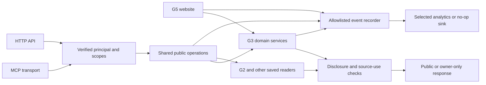
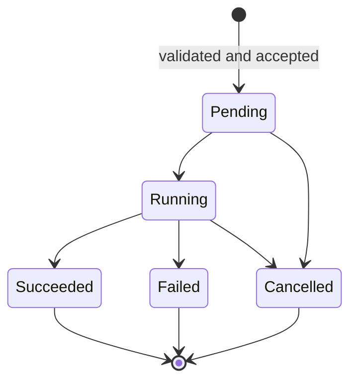

# G4 MCP and API draft

## Round-one closeout — October 9

The owner closes the completed draft-planning pass. API/MCP implementation,
auth/disclosure, scenario-write and analytics choices transfer to
[round-two G4](../brainstorms/2026-10-09-110145-general-round-two.md#g4--sharing-x-and-inherited-api-work),
especially B2-G4-03, alongside new sharing/X scope B2-G4-01/02. Draft proposals
remain proposals; no implemented or deployed server is implied.

Preserve the detailed draft below as source material. New work and decisions
belong to the successor, with actual upstream dependencies checked for the
selected capability. See the [closeout and lessons](../analysis/2026-10-09-110145-general-round-one-closeout.md).

## Plain-English Summary

Users should be able to ask an AI assistant for PushinWeight news and forecasts,
inspect the evidence and uncertainty, and, if the proposed interactive scope is
selected, answer the same scenario questions available on the website. Their
personal result stays separate from PushinWeight's published forecast. The API
and MCP will use the same approved output and permission rules.

G3 now plans a prediction engine, 2–5 variable questions per usable forecast,
personal probability updates and Kalshi market-candidate requests. G4 will
connect agents to those capabilities; G3 owns the calculations and saved
prediction records. We can scaffold interfaces with synthetic examples now,
then connect finished G1/G2/G3/G5 outputs under G4-R06. This drafting pass does
not authorize implementation, installation, live model calls or deployment.

Analytics vendor selection remains open. After the owner's request for more
established alternatives, compare Mixpanel and Amplitude alongside PostHog using
ordinary browser/server events. Website and server events show which predictions attract use,
which channel people use, and where requests fail. An agent request does not
establish that a person saw the result or intends to trade. We will preserve
that distinction in identity, event definitions and dashboards.

Verification will exercise actual HTTP and MCP calls, private-scenario
permissions, duplicate requests, withdrawn content and analytics failures.
Product choices and upstream contracts still open are listed explicitly below;
this is a reviewable draft, not a claim of launch readiness.

---

## Goal Capsule

**Objective:** Users can retrieve approved PushinWeight intelligence and explore
available predictions through their assistants, with trustworthy attribution of
website and agent usage.

**Means:** Shared public application operations with thin MCP and HTTP adapters
(KTD1), separate reads and requested computation (KTD2), and explicit event
instrumentation (KTD4).

**Authority:** Current user instructions → authoritative launch charter/index →
this plan. Detailed G3 and benchmark designs remain owned by their sessions.
The parent retains this plan and the G4 endpoint; delivery remains on-request.

**Stop conditions:** Unresolved disclosure/source-use decisions prevent real
public data exposure. Missing G3 contracts prevent live scenario integration.
Neither condition prevents a synthetic local scaffold after implementation is
requested. Final G4 integration waits for G1/G2/G3/G5 under G4-R06.

---

## Product Contract

### Problem Frame

G5's local demonstration exposes saved samples; it is not a production agent
interface. G3 is now designing interactive predictions, so a news-only tool
catalog would omit a central user action. Browser analytics alone would miss
direct MCP calls, while undifferentiated request counts would exaggerate
human interest through polling, retries and automated research.

### Requirements

R1. Expose approved news, classifications and saved topic histories through
MCP and a corresponding API. Preserve G4-R01–R05 disclosure rules across
all response channels, including prose, metadata, errors and media.

R2. Read G3 forecasts with an exact question/outcome revision, subject, target
metric and provider configuration, issue time, evidence cutoff, horizon,
method version, uncertainty, coverage and publication qualification. Numeric
estimates and probabilities are different result types; do not invent a
probability or imply an unqualified experimental forecast is publishable.

R3. Proposed interactive scope: allow an authenticated user, directly or via
an authorized client, to submit the complete set of answers to G3's 2–5
variable questions and retrieve a private scenario revision. G3 owns the
calculation; retain canonical/community/personal separation and the original
forecast revision. This scope awaits the owner's response to the planning
question; read-only is the fallback product option, not a silent selection.

R4. Reads and polling must not initiate paid analysis. Explicit scenario or
history-generation requests may use G3's bounded operation contract only after
its budget, concurrency and entitlement rules exist. A client retry must not
produce another logical calculation or another interest registration.

R5. Preserve 15m/1d/7d/30d/360d history windows; these are lookbacks, not forecast
horizons. Preserve source metric units, missing coverage and dates. A labeled
predecessor Arena series is context, never the successor's measured history or
an exchange settlement value (G3-R20/R21; benchmark R31–R36).

R6. Serve a response only when every contributing source allows that use and
G3's publication checks pass. Check current withdrawal/revocation decisions on
cached responses as well. Numeric API/MCP export, public charts, public forecasts
and internal analysis are distinct permissions, not one public/private flag.

R7. Measure prediction discovery, deliberate selection, scenario calculation,
result delivery and explicit nonbinding interest with distinct events. Keep
browser, MCP and other API channels separate; record polling/retries/errors
as operational usage rather than additional demand.

R8. Attribute usage to the authenticated principal when known, using the same
opaque user identifier across website and delegated MCP. Keep anonymous
visitors, service accounts and unknown clients distinct. Channel and delegated
identity do not prove a human initiated or viewed each operation.

R9. Send only allowed analytics metadata. Source material, raw arguments/results,
personal answers, prompt text, tokens, signed URLs and exception bodies must not
leave through telemetry. Analytics failure must not fail the product request.

R10. Stage implementation behind disabled public serving and fixture-only
adapters until upstream readiness and product decisions permit integration.
Preserve G1/G2/G3/G5 ownership and their independent implementation holds.

### Actors, flows and acceptance examples

A1 is a website reader; A2 is that user's delegated assistant; A3 is a service
account or anonymous caller; A4 is the operator reviewing usage and candidates.

F1: discover a question → retrieve its approved forecast → inspect permitted
history/questions. AE1: a not-ready or withheld result is explicit; it never
substitutes a fabricated 50% probability or a different model's measurements.

F2 (proposed): retrieve questions → submit complete answers against a fixed
revision → poll if pending → retrieve a private saved result. AE2: retrying
the request returns the same logical operation; another user cannot read it;
answering never overwrites the canonical forecast.

F3: explicitly register nonbinding interest → retain an internal receipt.
AE3: this is distinct from opening, answering, requesting candidate preparation,
submitting to Kalshi, getting listed or placing an order. Exposing F3 through
MCP requires a separate scope decision; reads cannot imply this action.

AE4: one user opens a prediction on the website and requests a scenario through
MCP: analytics can show one identified account, two channels and the distinct
actions. Ten status polls add operational volume, not ten interested people.

### Scope boundaries and dependencies

First executable slice after authorization: synthetic contracts, shared
operations, MCP/API adapters, authentication seam, event recorder and regression
fixtures. No source tables or forecasting models are copied into G4.

Later integration: G2 approved stories, G3 predictions/scenarios/history,
benchmark source-use decisions, G1 identity exclusions and G5 connection UX.
G3's existing implementation hold and G4-R06 remain. G3 owns durable scenarios,
jobs, candidate records and demand deduplication; their interfaces need agreement
before a G4 adapter can use them. No new G4 schema migration is planned now.

Deferred: watchlists/scheduled briefings, arbitrary natural-language research,
MCP Apps charts, public personal-scenario sharing, billing and local stdio
distribution. Source links/media stay policy-dependent. External Kalshi proposal
sending, trading, order routing and forecast-model selection are outside G4.

---

## Planning Contract

### Verified baseline and research

Planning checkout `feat/g4-mcp` starts at `d66d8508`. Authoritative shared
documents remain in the root checkout, accessed through the Sources links.
They include the October 7 G3-R13–R21 changes and benchmark R31–R36/U19–U21;
their existence is not evidence of a working engine or completed benchmark rerun.

`core/intelligence_readers.py` has internal release/category documents with
source IDs, URLs and claims: useful domain readers, unsafe to export wholesale.
`monitor/views.py:post_synthesis_demands` already distinguishes demand creation
from `poll_only`; `monitor/post_synthesis.py` uses fingerprinted demands,
transactions and worker ownership. These are patterns for G3's future contract,
not an existing prediction service to call or refactor in this workstream.

`project/asgi.py` is plain Django; production configuration uses gunicorn WSGI.
No MCP/PostHog dependency or forecast endpoint was found in the checked manifest,
settings, models and route files. This scoped source check is not a production
audit. No matching MCP/analytics learning was found in `docs/solutions/`.

Current PostHog docs were read on October 7. Ordinary Python events and browser
identity can share a user ID. Dedicated Python MCP analytics is beta, captures
arguments/results, and can add context/model/conversation fields. Consequently
KTD4 chooses explicit metadata events first. Its own MCP connection for querying
analytics is a different feature; connecting it does not instrument our server.

### Key Technical Decisions

KTD1. Use one public operations layer for API and MCP. Recommend hosted
Streamable HTTP with the maintained official Python SDK. Keep protocol handlers
thin and avoid copying G5's handwritten sample transport. A proposed
`project/mcp_asgi.py` is a separate local entry point; do not switch the existing
production WSGI server during scaffolding. Same-service mounting versus a
separate production process remains a delivery decision, not a new data store.

KTD2. Separate saved reads from explicit private calculation requests. Return a
G3-owned operation ID and readiness state when computation is pending. Bind a
request to principal, forecast/question revision, full normalized answer set,
evidence/method version and idempotency key. Reuse only for the same entitled
principal; identical keys with different payloads conflict. An analytics ID is
never the database duplicate guard. Calculation/cost records remain G3-owned.

KTD3. Recommend account-connected OAuth for hosted user access. Existing Google
browser login is not MCP authorization. Introduce a verified principal/scopes
contract before selecting an authorization provider; local synthetic auth cannot
be enabled on a public listener. Scope reads, private scenario requests and any
future interest writes separately. Do not trust a caller-supplied user ID, client
name, model label or analytics header for ownership or authorization.

KTD4. Use a vendor-neutral event recorder with a no-op default and one selected
analytics sink. Emit explicit domain events at shared service boundaries and one
transport event per attempt. Avoid the beta MCP wrapper initially because it
changes schemas and captures unnecessary content. If adopted later, pin and
audit its version, disable schema/result injection and automatic exceptions,
and enforce the same allowlist before sending. The beta warning concerns
PostHog's dedicated MCP wrapper, not a finding that its ordinary event SDK is
unreliable. No session replay/autocapture
is needed for this prediction measurement scope.

KTD5. Publish explicit public data transfer objects rather than database rows.
Apply disclosure, source-use and current publication checks before caching and
before delivering cached values. The cache key includes locale, revision,
visibility/permission version and owner for private records. Permission denied
or unresolved yields a safe withheld/unavailable result, not a partial answer
that silently drops a required source. Metrics label reconstruction and proxy
segments as supplied by the benchmark contract.

### Proposed tools and routes

Names and routes are draft contracts, not deployed endpoints. MCP transport:
`/api/v2/mcp/`. Equivalent HTTP actions share the same input validation,
authorization and public operation. All mutable operations are explicit POSTs.

| Tool | HTTP equivalent | Kind and availability |
| --- | --- | --- |
| `search_stories` / `get_story` | GET `/api/v2/stories/`, `/api/v2/stories/{id}/` | Saved public reads, G2 adapter |
| `list_predictions` / `get_prediction` | GET `/api/v2/predictions/`, `/api/v2/predictions/{id}/` | Qualified forecast revisions, G3 adapter |
| `get_prediction_questions` | GET `/api/v2/predictions/{id}/questions/` | Versioned question IDs and permitted answer values |
| `get_topic_history` | GET `/api/v2/topics/{id}/history/` | Saved result/readiness; no implicit paid call |
| `request_topic_history` | POST `/api/v2/topics/{id}/history-requests/` | Later entitled long-window demand; G3 budget contract required |
| `request_prediction_scenario` | POST `/api/v2/prediction-scenarios/` | Proposed explicit private computation; R3 selection required |
| `get_prediction_scenario` | GET `/api/v2/prediction-scenarios/{id}/` | Owner-only saved result and revision |
| `get_operation` | GET `/api/v2/operations/{id}/` | Owner-scoped status; poll accounting only |
| `list_events`, `list_opportunities`, `list_jobs` | GET `/api/v2/events/`, `/api/v2/opportunities/`, `/api/v2/job-listings/` | Approved projections of section data |

No arbitrary SQL, raw post lookup, person-directory export or trade tool.
Do not advertise unimplemented real-data capabilities. Local fixture tools must
identify synthetic data; absent production adapters return disabled/unavailable.
Resources may expose glossary/coverage, while optional briefing prompts are
deferred until tools settle. Tools that enqueue work must not claim read-only.

Prediction output distinguishes: canonical forecast ID/revision; exact outcome
and resolution definition; historical lookback; future horizon; evidence cutoff;
probability or numeric estimate; uncertainty; permitted explanation; qualification;
and correction status. Scenario output adds its own ID/revision, baseline
revision, question-set version and resulting values. Only the authenticated
owner receives private answers; analytics does not. A 50% direction label is
forecast interpretation, never an instruction to buy a contract.

### High-Level Technical Design



Domain event emission has one owner per event. The arrows identify available
instrumentation boundaries, not permission to emit a success event in all three.

```mermaid
sequenceDiagram
  participant C as Client
  participant O as Public operation
  participant G as G3 service
  participant E as Event recorder
  C->>O: Request scenario with revision, complete answers and key
  O->>G: Authorize and submit once
  G-->>O: Existing or newly accepted operation
  O-->>C: Operation and state
  O->>E: Attempt metadata; accepted event only for a new operation
  C->>O: Poll operation
  O->>G: Read status without enqueue
  G-->>O: Pending or terminal result
  O-->>C: Authorized result with matching revision
  O->>E: Poll/result-delivery metadata, no new interest
```



These are proposed adapter states to reconcile with G3, not a second job system.
Readiness states such as withheld, insufficient evidence or unavailable are
separate from job status. Older saved scenarios remain tied to their original
baseline; a new revision must not silently reinterpret prior answers.

### Analytics contract

The selected analytics product should answer “which accounts used predictions, on which channel, how
often, and how successfully?” It cannot establish who read an assistant's
answer, whether automation was human-triggered, or how many real people share
a service credential. Website Human/Agent display mode is not an actor identity.

| Event | Emission owner | Counting meaning |
| --- | --- | --- |
| `prediction_card_visible` | G5 browser | Card at least 50% visible for one continuous second, once per page-view/question revision; proposed definition |
| `prediction_opened` | G5 browser | Deliberate details action; not render/prefetch |
| `prediction_read_completed` | Shared server operation | Successful API/MCP detail retrieval; never named a human view |
| `prediction_scenario_requested` | G3 acceptance boundary | One newly accepted logical calculation, after transaction commit |
| `prediction_scenario_completed` | G3 completion boundary | One completed calculation, even if requester disconnects |
| `prediction_scenario_presented` | G5 browser | Matching result actually rendered; no server inference of agent display |
| `prediction_scenario_result_delivered` | API/MCP adapter | Saved result sent successfully; may be repeated, deduplicate separately for demand reporting |
| `prediction_interest_registered` | G3 durable interest operation, if selected | Explicit nonbinding interest; never automatically emitted for answers or reads |
| `agent_tool_attempt` | MCP adapter | Operational request, outcome, latency, polling/cache/replay flags |

All names and the new visibility rule are proposals; map G3's earlier
`trade_idea_*` event names once before implementation rather than double-emitting.
Question/outcome revisions are stable join keys across headlines, locales and
channels. Preserve canonical, community and personal forecast kinds explicitly.

Allowed properties: event schema version and event ID; question/forecast revision;
opaque scenario/operation ID where needed; `channel=web|mcp|api` derived by our
adapter; `principal_kind=user|service_account|anonymous`; verified opaque user
or organization ID; bounded client label with its trust/source label; entry
surface and locale; outcome/error code; latency; cache hit/replay/poll flags;
test/environment marker; occurrence timestamp. Model/client reports remain
unverified metadata. No answers, text, URLs or arbitrary exception properties.

Identity: browser sign-in identifies the canonical opaque account; the server
derives the same value from authenticated sessions/OAuth subject mapping.
Anonymous browser IDs estimate visitors; anonymous MCP sessions/requests remain
unlinked. Do not merge identities by IP or accept `X-POSTHOG-DISTINCT-ID` as
authentication. Reset browser identity on logout. Organization credentials count
as organizations/service accounts, not inferred people. Keep user identity
separate from channel so one user can appear in both channel breakdowns without
being two users in an identified-account total.

Deduplication: stable event IDs protect transport redelivery; stable domain
operation IDs protect logical counts. Attempts, polls and rejected requests
remain measurable. Use database records for canonical forecast/interest/cost
facts; sampled, blocked or dropped analytics are not an exact demand or billing
ledger. Backend sends after commit through a bounded background queue; failures
and dropped-event counts are observable locally and never block responses.

Dashboards: (1) human visible → open → scenario requested/completed/presented,
(2) agent reads → distinct accounts → private scenario requests/completions,
(3) nonbinding demand by question/channel/principal with account concentration,
(4) latency/errors/rate-limit/poll volume and event-delivery coverage. No blended
“human interest” score from tool-call totals. Analytics opt-out, browser blocking,
anonymous attribution and delayed events must be disclosed in denominators.

### Assumptions and open decisions

O1 — before real public content: settle permitted commentary/classifications,
named subjects versus authors, media and source-link identity disclosure. Current
G4-R03 remains; initial fixtures avoid these exposures.

O2 — before private-scenario implementation: select R3's interactive scope.
Recommended: agents can explicitly request private scenarios. Keep reads-only
and separately entitled computation available as distinct permission scopes.

O3 — before hosted auth: select first supported clients and OAuth provider/account
mapping. Pin released MCP SDK/protocol versions against those clients. Yesterday's
protocol research is an input, not proof of current compatibility.

O4 — before telemetry activation: select the vendor/project/region, retention
and consent policy; approve event names and scope. Draft recommendation is
explicit events only. The shortlist below responds to the owner's follow-up;
no vendor account or tracking is activated by this plan.

O5 — before G3 integration: agree domain entry points and durable records,
job/idempotency semantics, source-use enforcement, forecast qualification,
first target/horizon and operation budget. G4 must not choose the forecast model
or duplicate G3's persistence while those contracts remain unfinished.

O6 — before interest writes: decide whether agents may register explicit demand,
how it is distinguished from direct user interest, and the canonical uniqueness
window. Candidate preparation/submission remains a separate G3/operator action.

O7 — before release: settle process topology, request/page/concurrency quotas,
latency limits, supported languages/client matrix and upstream completion proof.
Proposed local limits are 32 KiB input, 50 results/page, 256 KiB output and no
provider access; verify appropriateness before any hosted release.

### Analytics alternatives — October 7 owner follow-up

The owner asks whether more proven alternatives exist; no replacement has been
selected. Mixpanel and Amplitude have documented conventional Python/server
event ingestion and user analytics. They do not need an MCP-specific wrapper
to measure our tool usage: our server emits the same controlled domain events.
This establishes feature fit, not comparative uptime or measured reliability.

- **Mixpanel — first alternative to evaluate.** Fits the focused question of
  who uses predictions, which channel they use, where a multi-step flow loses
  users and whether they return. Official Python tracking accepts our user ID,
  event name and properties; identity management and funnels are documented.
  We still own the semantic events and human/agent distinction. Its separate
  beta agent products are not needed for this design.
- **Amplitude — equally credible shortlist member.** Official Python/HTTP
  ingestion, user identity and funnels fit the same event contract. HTTP V2
  documents event deduplication using insertion/device identity over a bounded
  window. Our logical operation deduplication remains mandatory regardless of
  that ingestion behavior. Choose between it and Mixpanel through the actual
  reports and expected event volume, not an assumed reliability ranking.
- **Moesif — API-focused alternative.** Documents user/company attribution,
  API usage and behavioral funnels. Stronger fit if customer API consumption
  and API operations become the primary question; browser visibility and
  prediction-demand semantics still require explicit events.
- **PostHog ordinary events — still viable.** Keep it in the comparison without
  relying on its beta MCP wrapper. The earlier recommendation remains evidence
  of fit, not a settled product decision or claim of superior reliability.
- **GA4 — not recommended as the sole combined tracker.** Google positions
  Measurement Protocol as a supplement to browser/app tagging and warns that
  server-only use may provide partial reporting. That makes it a less direct
  fit for standalone agent traffic, even though it remains a website option.

Before vendor selection, compare one fixed acceptance journey: signed-in user
opens a forecast on the web, asks through MCP, creates one private scenario,
retries that request, polls ten times and returns the next day. Require one
identified account across channels, one logical scenario, separate operational
attempts, return-usage reporting and no private payload fields. Also exercise
anonymous traffic and a service account. Use synthetic data and a separately
authorized test project if a live vendor evaluation is requested; this draft
performed documentation comparison only. Recheck pricing against an explicit
event-volume estimate before purchase; no price or vendor SLA was evaluated.

---

## Implementation Units

All paths below are proposed additions unless identified as existing. Execute
only after implementation is requested; dependent units remain conditional.

### U1. Public contracts and synthetic adapters

**Goal / Requirements:** Stable public shapes and safe empty/withheld behavior;
R1, R2, R5, R6, R10. **Dependencies:** none for synthetic-only work.

**Files:** new `core/public_intelligence/contracts.py`, `adapters.py`,
`policy.py`; `tests/test_public_intelligence_contracts.py` and fixture data
under `tests/fixtures/public_intelligence/`. No model/migration changes.

**Approach:** Use internal readers only through explicit projections (KTD5).
Define G2/G3 adapter interfaces without their unfinished schema names. Include
synthetic approved, unqualified, withdrawn, proxy and unknown-coverage examples.

**Test scenarios:**
1. A synthetic forecast preserves target/cutoff/horizon and distinguishes numeric estimates from probabilities.
2. Missing observations stay unavailable; predecessor points retain measured identities and switch labels.
3. Prohibited nested fields, quotes/names in sample prose, media URLs and error payloads are withheld by the selected fixture policy.
4. Unresolved or revoked export permission prevents both fresh and cached delivery.

**Verification:** schema and policy tests pass; no real source data, database or provider is required.

### U2. Shared saved-read operations and transport scaffold

**Goal / Requirements:** One behavior through MCP/API; R1, R2, R4, R5, R10.
**Dependencies:** U1; pin supported SDK/protocol for local verification.

**Files:** new `core/public_intelligence/operations.py`, `monitor/public_api.py`,
`project/mcp_server.py`, `project/mcp_asgi.py`; existing `pyproject.toml`,
lockfile if present and `monitor/urls.py`; `tests/test_public_intelligence_api.py`,
`tests/test_mcp_transport.py`.

**Approach:** KTD1; loopback fixture mode and disabled production defaults.
Do not change `render.yaml` or the existing gunicorn command. Instrumentation
hooks receive bounded metadata, never full payloads. Stable pagination and
explicit readiness prevent a search or poll from quietly enqueueing work.

**Test scenarios:**
1. Actual SDK transport and Django HTTP requests return equivalent public fixture data and errors.
2. Unsupported versions, malformed arguments, invalid windows and request/result bounds fail safely.
3. Repeated reads/polls call no paid provider and create no computation request.
4. Disabled production serving cannot fall back to fixture data or internal readers.

**Verification:** complete request/response chain passes; MCP tool listing describes only supported fixture capabilities and operation side effects honestly.

### U3. Verified identity, scopes and limits

**Goal / Requirements:** Separate approved reads and private operations; R3, R4,
R8, R9. **Dependencies:** U2; O3 before production auth integration.

**Files:** new `core/public_intelligence/access.py`, `limits.py`;
`tests/test_public_intelligence_access.py`; later scoped settings in existing
`project/settings.py`. OAuth discovery implementation location follows O3.

**Approach:** KTD3. Verify token issuer/audience/expiry/scopes and map subject
to account; preserve existing Django browser CSRF protection. MCP bearer auth
does not justify globally disabling CSRF. Origin/Host and unauthorized response
behavior follow the selected transport. Shared quotas cannot multiply across
workers; choose the existing runtime's suitable shared store before deployment.

**Test scenarios:**
1. User A cannot read User B's scenario/job by guessing its ID, through either adapter.
2. Missing/expired/wrong-audience/wrong-scope credentials are denied without exposing private record existence.
3. Spoofed client/user/analytics headers cannot alter ownership; key/token revocation is observed.
4. Rate and concurrency limits hold across two application workers; synthetic auth cannot bind publicly.

**Verification:** authorization and quota tests exercise complete transport chains; no credential material appears in logs/events.

### U4. G3 prediction and private-scenario adapter

**Goal / Requirements:** Forecast and scenario parity without duplicating the
engine; R2–R6. **Dependencies:** U1–U3, R3 selection, O5 and G3 readiness.

**Files:** new `core/public_intelligence/predictions.py`;
`tests/test_public_prediction_reads.py`, `tests/test_public_prediction_scenarios.py`.
Exact G3 service modules and integration fixtures must be recorded after its
handoff; G4 does not preassign G3 tables/migrations.

**Approach:** KTD2; consume the delivered domain service. The same complete
answer set and baseline version produce the same scenario regardless of answer
order. Editing/resetting creates explicit revisions. Return superseded/baseline
changed states without substituting a different forecast. Polls never spend.

**Test scenarios:**
1. Two concurrent identical requests yield one operation/cost reservation and one accepted event.
2. An idempotency key reused for different answers conflicts; a different user cannot receive a cached private result.
3. Unsupported/obsolete question IDs, partial-invalid sets and unknown answers follow G3's explicit validation.
4. Browser and MCP scenarios match for identical inputs; canonical/community data and prior revisions are unchanged.
5. Pending, insufficient evidence, timeout and late completion retain IDs/revisions; no automatic uncertain resend.
6. Exact 50%, rounding, dependent factors and reset use G3's result; no MCP-side probability calculation or buy instruction.

**Verification:** real G3 call-chain integration and isolated PostgreSQL concurrency proof; synthetic tests alone do not establish engine correctness.

### U5. Shared prediction analytics contract and selected vendor sink

**Goal / Requirements:** Account/channel measurement without raw payload capture;
R7–R9. **Dependencies:** U1–U3 for local sink tests; O4 for activation; G3/G5
coordination before browser/domain instrumentation.

**Files:** new `core/product_analytics.py`, `tests/test_prediction_analytics.py`,
`tests/test_prediction_analytics_identity.py`; existing `pyproject.toml` and
settings only after vendor selection. Browser event source is G5-owned; agree
its actual file before editing rather than altering the maintained prototype.

**Approach:** KTD4 and analytics contract. Use an injected recorder with no-op,
in-memory test and optional bounded vendor sink. Declare one emitter for each
domain event and keep duplicate transport observations out of domain totals.

**Test scenarios:**
1. AE4 produces one identified account, distinct web/MCP activity and one accepted scenario despite retries and ten polls.
2. Anonymous browser, anonymous MCP and service credentials never merge into a fabricated person; logout resets browser attribution.
3. A failed/rolled-back calculation does not emit a successful domain event; disconnect does not suppress a completed calculation event.
4. Secret/source/answer sentinels embedded in arguments, results, errors and custom properties never reach the captured vendor envelope.
5. Queue failure/fullness and vendor timeout leave product responses unchanged and increment local delivery-loss counters.
6. Browser impression/open/presentation events require their real UI conditions; tool search/list/read cannot impersonate those events.

**Verification:** inspect outgoing fake-transport envelopes and actual domain counts; later a separately authorized test-project smoke verifies ingestion, identity and funnels.

### U6. Regression net, integration documentation and release preparation

**Goal / Requirements:** Preserve existing behavior and prove the shared user
flows; R1–R10. **Dependencies:** U1–U5 as applicable; upstream completion for
final integration. Authenticated reads-only can be assessed separately if R3 is
declined, with dependent scope retired in this same plan.

**Files:** `tests/test_public_intelligence_end_to_end.py`,
`tests/test_public_intelligence_withdrawal.py`; new
`docs/reference/public-api-and-mcp.md`, `docs/operations/prediction-analytics.md`;
existing route/access and demand tests named below. G5 owns rendered setup UX.

**Approach:** Pin full client → permission → domain service → projection → event
chains with synthetic fixtures, then upstream integration data. Verify real
selected assistant clients, protocol compatibility and source-revocation cache
behavior. Distinguish local, staging and production evidence; no release is
authorized by completion of these checks.

**Test scenarios:**
1. A correction or revoked contributing-source permission invalidates reads across API/MCP/resources/cache without leaking former values.
2. Fixture mode off leaves existing browser routes, login, post synthesis and harvester behavior unchanged.
3. Capability discovery/help accurately describes readonly versus paid/private operations and unavailable dependencies.
4. Human and agent funnels remain separate for one scripted cross-channel journey, with no duplicate completion/interest counts.

**Verification:** all affected regression tests and supported-client checks pass, draft choices are resolved and source-use/forecast qualification evidence is linked before public activation.

---

## Verification Contract

During this planning pass run document/link/whitespace and Ollija checks only.
No application tests or real analytics/model events are authorized or needed.

At implementation, run new contract/transport/access/analytics tests with the
project environment. Use an owned stable temporary test directory under the
operator's home, not the OS-cleaned temporary directory. Focused regression set:
`tests/test_post_synthesis_api.py`, `tests/test_trend_narrative_demand.py`,
`tests/test_intelligence_readers.py`; add actual login/routing tests identified
when adapters are implemented. U4 must use isolated PostgreSQL for ownership,
concurrency and idempotency proofs. Never use production for test writes.

Run `pytest` on those owned paths, the applicable lint checks, and
`python manage.py check`; broader testing follows only from changed scope or
failures. Future G5 UI instrumentation follows `fix-ui` and browser verification.
Read-only successful response parity and absent provider calls are required
alongside unit tests. Record unsupported clients and unperformed checks honestly.

---

## Definition of Done

For the current drafting request: one Ollija-selected G4 plan records current
G3 dependencies, proposed tools, analytics/identity rules, ordered units,
verification and unresolved decisions. Shared index points to this exact file.
No claim that the feature is implemented or that PostHog has been selected.

For a later scaffold: synthetic transport and policy/access/event tests pass,
all production serving/provider work remains disabled, and planned upstream
adapters are visibly unavailable. Remove abandoned experiment code from the
owned diff before completion.

For eventual G4 readiness: G1/G2/G3/G5 handoffs complete; contracts and source-use
decisions are approved; private-scenario scope and authentication are settled;
actual supported clients pass; analytics denominators are documented; correction,
revocation and regression proofs pass. Deployment is a separately selected
endpoint, not implied by the draft or local readiness.

---

## Sources

Authoritative coordination is in the root checkout on fuchitalee. Relative links
below deliberately reach it rather than stale worktree copies:

- [Launch charter](../brainstorms/2026-09-30-104924-general-launch-charter.md), G4-R01–R06 and G3-R11–R21.
- [Launch index](../brainstorms/2026-09-30-104924-general-launch-index.md).
- [G4 discovery](../brainstorms/2026-10-06-210526-g4-mcp-offering-and-scaffold.md).
- [G3 working design](../brainstorms/2026-10-05-163237-g3-evidence-forecasts-markets.md), variable questions, chart, Jev, P1–P7 and latest dependency amendment.
- [Benchmark plan](../../../../feat/benchmark-download-collector/docs/plans/2026-10-05-070106-feat-benchmark-download-collector-plan.md), R31–R36/U19–U21.
- [Existing analytics research](../analysis/2026-10-06-123349-g3-interest-analytics/README.md).
- [PostHog Python](https://posthog.com/docs/libraries/python), [cross-SDK identity](https://posthog.com/docs/product-analytics/identify), and [MCP identity](https://posthog.com/docs/mcp-analytics/identifying-users), checked October 7.
- [MCP analytics Python beta](https://posthog.com/docs/mcp-analytics/installation/python), [event reference](https://posthog.com/docs/mcp-analytics/events), [payload/privacy behavior](https://posthog.com/docs/mcp-analytics/privacy), checked October 7; direct Markdown HTTP reads used after web-reader content-type rejection.
- [Mixpanel Python](https://docs.mixpanel.com/docs/tracking-methods/sdks/python), [identity](https://docs.mixpanel.com/docs/tracking-methods/id-management/identifying-users-simplified), [funnels](https://docs.mixpanel.com/docs/reports/funnels); checked October 7 for conventional event tracking, independent of beta agent products.
- [Amplitude Python](https://amplitude.com/docs/sdks/analytics/python/python-sdk), [HTTP event contract](https://amplitude.com/docs/apis/analytics/http-v2), [funnels](https://amplitude.com/docs/analytics/charts/funnel-analysis/funnel-analysis-build); checked October 7.
- [Moesif users/companies and behavior](https://www.moesif.com/docs/user-analytics/), [GA4 Measurement Protocol](https://developers.google.com/analytics/devguides/collection/protocol/ga4); checked October 7.
- [Official MCP Python SDK](https://github.com/modelcontextprotocol/python-sdk), [transports](https://modelcontextprotocol.io/specification/2026-07-28/basic/transports), [authorization](https://modelcontextprotocol.io/specification/2026-07-28/basic/authorization); October 6 discovery, revalidate chosen released versions in U2/U3.

<!-- BEGIN OLLIJA DELIVERY GUIDE -->
## Ollija Delivery Guide

This block is generated guidance. Do not edit it directly. Correct durable facts in `.ollija/project.yaml` or this template, then rerun `ollija annotate-plan`. Current explicit owner instructions govern this task. Record exceptions below and reflect route changes in metadata; removed requirements must not return through another checklist.

### Resolved locations

- Authoritative host: `fuchitalee`
- Authoritative repository: `/Users/fuchitalee/development/pushin-weight-v2`
- Ollija release worktree area: `/Users/fuchitalee/development/pushin-weight-v2/.worktrees`
- Active worktree: `/Users/fuchitalee/development/pushin-weight-v2/.worktrees/feat/g4-mcp`
- Plan: `/Users/fuchitalee/development/pushin-weight-v2/.worktrees/feat/g4-mcp/docs/plans/2026-10-07-053244-feat-g4-mcp-plan.md`
- Change: `feat-g4-mcp-2026-10-07-053244`
- Branch: `feat/g4-mcp`
- Staging branch and blueprint: `staging`, `/Users/fuchitalee/development/pushin-weight-v2/.worktrees/feat/g4-mcp/render-staging.yaml`
- Production branch and blueprint: `main`, `/Users/fuchitalee/development/pushin-weight-v2/.worktrees/feat/g4-mcp/render.yaml`
- Staging URL: `https://pushinweight-staging-web.onrender.com`
- Production URL: `https://pushinweight-web.onrender.com`

### Placement

This worktree is inside the Ollija release worktree area. Reuse it for the whole change. Do not create a second worktree or plan for this branch.

### Delivery scope

- Workflow: `plan`
- Delivery target: `on-request`
- Owner selection recorded: `false`
- Delivery route: `staged`

Target is not authorized until the owner selects it. Wait for a later explicit release request; do not commit, push, stage, or promote on this guide alone.

### Failure handling

- Complete applicable, unwaived checks for the selected route. A waived check is waived, never passed. Owner-selected direct production does not require staging.
- Product defects return to the parent implementation workflow; repeat only checks invalidated by the fix. Environment failures require repairing the environment, not a new source commit. Retry only after a relevant fact changes.
- SSH, shell, environment, or multi-machine failures use the repository infra/multi-machine skill first.
- The change ledger is advisory; do not validate or enforce it.
- Never force-remove a worktree. Retain staging-only, failed, dirty, locked,
  noncanonical, or candidate-mismatched worktrees for diagnosis or later
  delivery.
- Do not run an endless retry loop or start a persistent Ollija process.
<!-- END OLLIJA DELIVERY GUIDE -->

## Delivery Exceptions

The owner requested a plan draft, not implementation or delivery. Retain
`delivery_target: on-request`. G4-R06 permits preparatory scaffolding but keeps
final integration after G1/G2/G3/G5 completion. Preserve G3's separate benchmark
hold. This plan authorizes no tracking installation, vendor/account setup, model
call, external candidate submission, database write, commit/push or deployment.
