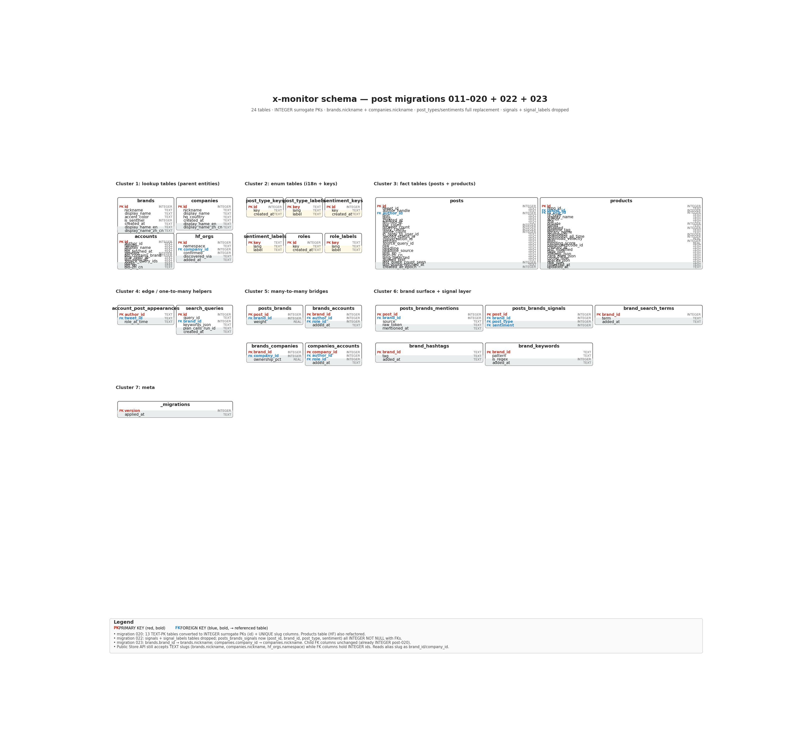

# x-monitoring DB schema

`x-monitoring/data/x_monitoring.db`
(SQLite 3, ~74 MB on disk as of 2026-07-02, **5,760 rows in `posts`**)



*This image is generated from [`docs/reference/schema.dot`](schema.dot) via [`scripts/build_schema_image.sh`](../../scripts/build_schema_image.sh) — regenerate after any migration change.*

Source files: `x_monitor/migrations/00{1..9}_*.sql` + `x_monitor/migrations/01{0..9}_*.sql` + `x_monitor/migrations/02{0..3}_*.sql`
Migration ledger: `_migrations` (**22 rows** — versions 1–20 + 22 + 23 applied; **021 intentionally reserved** for the HF products crawler that never landed).

```
version  applied_at                 migration
-------  -------------------------  ----------------------------------------
1        2026-06-08T22:53:57+00:00  001_initial.sql
2        2026-06-11T05:52:02+00:00  002_post_headline.sql
3        2026-06-17T04:22:26+00:00  003_translation_columns.sql
4        2026-06-19T06:41:47+00:00  004_company_brand_account_model.sql
5        2026-06-22T01:59:44+00:00  005_quoted_text.sql
6        2026-06-22T05:03:47+00:00  006_quote_capture_tracking.sql
7        2026-06-25T05:39:27+00:00  007_i18n_locale_columns.sql
8        2026-06-25T05:39:27+00:00  008_enum_i18n_lookup_tables.sql
9        2026-06-25T05:39:27+00:00  009_products.sql
10       2026-06-25T05:39:27+00:00  010_rename_mn_tables_to_plural_plural.sql
11       2026-06-25T05:39:27+00:00  011_rename_locale_to_lang.sql
12       2026-06-30T03:00:01+00:00  012_drop_engagement_tier.sql
13       2026-06-30T03:00:01+00:00  013_rename_post_mentions_to_posts_brands_mentions.sql
14       2026-06-30T03:00:01+00:00  014_rename_signal_keys_to_signals.sql
15       2026-06-30T03:00:01+00:00  015_rename_role_keys_to_roles.sql
16       2026-06-30T03:00:01+00:00  016_trim_role_values.sql
17       2026-06-30T03:00:01+00:00  017_brand_search_terms_hybrid.sql
18       2026-06-30T03:00:01+00:00  018_integer_primary_keys_enum_tables.sql
19       2026-06-30T03:00:01+00:00  019_post_types_and_sentiments.sql
20       2026-06-30T03:00:02+00:00  020_text_to_integer_pks_all_tables.sql
                                          (021 reserved — HF products crawler that never landed)
22       2026-06-30T03:00:02+00:00  022_kill_signal_id.sql
23       2026-06-30T03:00:02+00:00  023_rename_brand_and_company_ids_to_nicknames.sql
```

The `applied_at` column is the timestamp the migration was first run
on a real production DB; the wall-clock ordering is preserved
because migrations are applied in filename order, and the
`Store.apply_migrations` loop runs `BEGIN`/`COMMIT` per file
(`store.py:178`).

> **Branch lineage (commits resolved in this doc).** Migrations 005–006
> shipped on branch `feat/capture-quote-tweets`; 007–008 on
> `feat/i18n-locale-columns-rebased`; 009 on
> `feat/hf-products-crawler-rebased`; 010 on
> `feat/rename-mn-tables`; 011–019 on
> `feat/schema-modernization-batch` (HEAD `4cd62d2`); 020, 022, 023
> on `main` (HEADs `39396b0`, `4c9d8a0`, this branch is `docs/research-batch-2026-06-26`).
> Migration 021 is **intentionally absent** from the ledger — it was
> reserved for an HF products crawler (a `feat/hf-products-crawler`
> branch) that never landed; the slot remains available for a future
> merge of that work.
> See `docs/plans/2026-06-24-002-refactor-schema-modernization-batch-plan.md`
> for the 9-unit modernization plan that produced 011–019, and
> `docs/plans/2026-06-26-001-refactor-brand-id-to-nickname-plan.md`
> for the 1-unit parent-slug-column rename that produced 023.

Conventions used in the diagrams:

- `PK` = PRIMARY KEY, `FK` = FOREIGN KEY, `UQ` = UNIQUE
- `*` after a column = `NOT NULL`
- A column annotated `JSON` is `TEXT` at the storage layer; the app parses it
- v1.8 introduces a `companies` / `brands` / `accounts` / `posts` model that
  replaces the v1.7 `model_id`-partitioned single-table layout. Model
  metadata is now DB-resident (was code-resident in v1.7).
- v1.9 (migrations 007–008) converts the convention-only TEXT enum
  columns (`signal`, `role`, `engagement_tier`) into FK-validated
  keys + per-locale label lookup tables. The display layer reads
  `<family>_labels` joined by `(key, lang)`; the integrity layer
  reads `<family>` via the FK.
- v1.9 (migration 012) drops `engagement_tier` entirely (the
  classification was never wired into production; the "tier" concern
  moves to the control layer).
- v1.9 (migration 016) trims the 5-role taxonomy to 3:
  `{official, staff, community}`. The removed values
  (`analyst`, `partner` from the 5-value set — actually
  `researcher`, `press`, `vendor` from the 008 seed) are remapped
  to `community` defensively and then dropped from `roles` /
  `role_labels`.
- v2.0 (migrations 011–019) re-shapes the enum tables: rename
  `locale` → `lang` (011); rename `signal_keys` → `signals` and
  column `signal` → `signal_id` (014); rename `role_keys` → `roles`
  and column `role` → `role_id` (015); rename `post_mentions` →
  `posts_brands_mentions` (013); convert enum tables to
  **INTEGER id PK + UNIQUE NOT NULL key** (018); add new
  `post_type_keys` + `sentiment_keys` enum families and nullable
  `post_type` + `sentiment` columns on `posts_brands_signals`
  alongside the legacy `signal_id` (019).
- v2.0 (migration 020, follow-up) converts the remaining 13
  TEXT-PK tables (and their dependent `products` table) to
  **INTEGER surrogate PK + UNIQUE slug column** pattern. The slug
  names are `brand_id` (in `brands`) and `company_id` (in
  `companies`) — these are renamed to `nickname` in migration 023
  below. **Migration 021 is intentionally absent** from the ledger
  (reserved for an HF products crawler branch that never landed).
- v2.0 (migration 022, U9 remediation) completes the legacy
  6-signal taxonomy kill: drops `signal_id` from
  `posts_brands_signals`, promotes `post_type` + `sentiment` to
  `NOT NULL INTEGER` FKs, drops the `signals` + `signal_labels`
  tables, and rewrites the 11 consumer files that read the legacy
  keys (store.py, intent_classifier.py, attribution.py,
  reattribute.py, treemap.py, dashboard.py, query_plan.py,
  run.py, trend-chart.js, dashboard.css, _model_card.html.j2).
- v2.0 (migration 023) renames the parent-table slug columns
  `brands.brand_id` → `brands.nickname` and `companies.company_id`
  → `companies.nickname`. The child FK columns are **unchanged**
  (they already hold INTEGER surrogate ids post-020 and never held
  the slug string). The Store API preserves its public contract
  by aliasing `b.nickname AS brand_id` at the read boundary, so
  downstream consumers do not see the rename.

### Enum table pattern (post 018/019)

All four enum tables follow the same shape:

```
<family>
├── id          INTEGER  PK AUTOINCREMENT   ← integer surrogate; new enum FKs use this
├── key         TEXT     UNIQUE NOT NULL   ← canonical string; preserved as FK target
└── created_at  TEXT     NOT NULL
```

The TEXT `key` is preserved as the FK target (not the INTEGER `id`)
because every consumer — the Store API, treemap.py, dashboard, all
read-side queries — already passes and reads string keys. Switching
the FK column to integer would be a sweep through every consumer
and is explicitly out of scope for 011–019. The integer `id` is
there as a permanent identifier and to align the shape with the new
`post_type_keys` / `sentiment_keys` tables (U9, migration 019).

The `*_labels` tables (per-locale display) FK to the `key` column
(UNIQUE), not the `id`. They are unchanged in shape from migration
008; the only change is `locale` → `lang` (migration 011).

### 018's TEMP TABLE backup pattern

Migration 018 must DROP TABLE on `signals` and `roles` to swap in
the integer-PK rebuild. Each table has a CASCADE FK from its
`*_labels` child, so DROP TABLE would wipe the child rows. The
mitigation is a 3-step pattern, repeated for `signals` and `roles`:

```sql
-- (1) Copy child rows into a TEMP TABLE (auto-committed to the
--     in-memory `temp` schema; survives DROP of the parent but
--     not COMMIT of the migration's outer transaction, so the
--     restore happens BEFORE COMMIT).
CREATE TEMP TABLE _signal_labels_backup AS
    SELECT key, lang, label FROM signal_labels;

-- (2) Rebuild the parent with INTEGER id PK + UNIQUE key.
CREATE TABLE signals_new (
    id INTEGER PRIMARY KEY AUTOINCREMENT,
    key TEXT NOT NULL UNIQUE,
    created_at TEXT NOT NULL
);
INSERT INTO signals_new (key, created_at) SELECT key, created_at FROM signals ORDER BY key;
DROP TABLE signals;
ALTER TABLE signals_new RENAME TO signals;

-- (3) Restore the child rows from the backup. INSERT OR IGNORE so
--     any orphan key (e.g. from a partial rerun) is logged, not a
--     failure.
INSERT OR IGNORE INTO signal_labels (key, lang, label)
    SELECT key, lang, label FROM _signal_labels_backup;
DROP TABLE _signal_labels_backup;
```

The same pattern runs for `roles` / `role_labels`. Labels survive
the rebuild without operator action.

### 019's additive (not replacement) approach

The legacy 6-signal taxonomy (`release`, `community_question`,
`criticism`, `commenter_capture`, `praise`, `other`) bundles
*post TYPE* and *sentiment* into one enum. Migration 019 introduces
the cleaner separation as 4+4 enums:

- `post_type_keys`: `buzz_releases`, `hands_on_usage`,
  `performance_comparisons`, `feedback_questions`
- `sentiment_keys`: `positive`, `negative`, `neutral`, `mixed`

But the change is **strictly additive** — the legacy `signal_id`
column is preserved on `posts_brands_signals` and continues to be
populated by the existing pipeline. The new `post_type` and
`sentiment` columns are nullable TEXT, FK-validated against their
new keys tables (`ON DELETE RESTRICT`).

Existing rows are backfilled from `signal_id` using a static
`CASE` mapping (canonical 6-bucket → post_type × sentiment
decomposition):

```
signal_id              →  post_type                 sentiment
----------------------    ------------------------   ---------
release                  buzz_releases               neutral
praise                   buzz_releases               positive
commenter_capture        hands_on_usage              neutral
community_question       feedback_questions          neutral
criticism                feedback_questions          negative
other                    hands_on_usage              neutral
```

A future classifier pipeline (U9 follow-up) will reclassify with
the LLM for higher fidelity. Until then, this static mapping
preserves the polarity signal.

**No consumer is rewritten in 019.** `treemap.py`, `dashboard.py`,
`get_account`, and the Store API all continue to read `signal_id`
exactly as before. Reading `post_type` / `sentiment` is opt-in for
follow-up work.

---

## Tables

### `posts` (5,760 rows)

The core fact table. One row per kept tweet (after the per-model
relevance filter in Unit 4 of the v1.7 plan). In v1.8 the brand and
signal columns were dropped (moved to `posts_brands` /
`posts_brands_signals`); `favorite_count` was renamed to `like_count`
(per R9 / Decision 3, the user-facing name). Migrations 005 and 006
added quote-tweet content + capture-tracking columns
(`feat/capture-quote-tweets`).

```
posts
├── id                     INTEGER  PK AUTOINCREMENT       ← (migration 020) surrogate key
├── tweet_id*              TEXT     UNIQUE NOT NULL        ← Twitter/X status id (str); was PK pre-020
├── author_handle          TEXT                            ← @handle (nullable in live schema)
├── author_id              INTEGER                         ← (migration 020) FK → accounts.id ON DELETE SET NULL
├── text                   TEXT                            ← original post text
├── lang                   TEXT                            ← X-declared BCP-47 (often wrong; see lang_detected)
├── created_at             TEXT                            ← Twitter-format created_at (string; sorts incorrectly for time-window queries — see created_at_epoch)
├── fetched_at             TEXT                            ← ISO-8601 UTC, when the run ingested it (nullable in live schema, although the 001/002 seeds populate it)
├── like_count             INTEGER                         ← (migration 004) renamed from favorite_count
├── retweet_count          INTEGER
├── reply_count            INTEGER
├── quote_count            INTEGER
├── in_reply_to_user_id    TEXT                            ← nullable
├── quoted_status_id       TEXT                            ← nullable; populated for quote tweets (also see quoted_text)
├── conversation_id        TEXT                            ← nullable
├── entities               TEXT  JSON                      ← X entities payload (mentions, urls, hashtags)
├── source_query_id        TEXT                            ← which search_queries row fetched this post (R6c storage fork)
├── raw                    TEXT  JSON                      ← full Apify response row, for replay
├── headline               TEXT                            ← (migration 002) article title from URL
├── headline_source        TEXT                            ← (migration 002) "fetched"|"cached"|"url_only"|"fetch_failed"
├── text_en                TEXT                            ← (migration 003) English translation
├── text_zh_cn             TEXT                            ← (migration 003) Simplified Chinese translation
├── lang_detected          TEXT                            ← (migration 003) post-fetch detected lang, e.g. "zh-Hans"
                                                              (migration 004 also backfills from existing text_en/text_zh_cn rows)
├── quoted_text            TEXT                            ← (migration 005) quoted tweet's text (was held in memory & discarded pre-005)
├── last_quote_count_seen  INTEGER                         ← (migration 006) most recent quote_count observed on this post
├── last_quote_fetched_at  TEXT                            ← (migration 006) ISO-8601; seeds sinceTime for next /twitter/tweet/quotes call
└── created_at_epoch       INTEGER                         ← (migration 006) unix-second epoch parsed from Twitter-format created_at
                                                              (existing rows backfilled by scripts/2026-06-22-140225-backfill-created-at-epoch.py;
                                                              SQLite can't parse the Twitter format in pure SQL)
```

**DROPPED in v1.8 (migration 004):**

- `posts.model_id` (R1 / Decision 1) — brand attribution moves to
  `posts_brands`. There is no longer a `model_id` column anywhere in
  the `posts` schema. Migration 003's `idx_posts_model_created` and
  `idx_posts_signal_model` are dropped with the column.
- `posts.signal` (R6d) — per-brand signal moves to
  `posts_brands_signals`. A post naming 2 brands with different
  sentiments writes 2 rows there.

Indexes:

```
idx_posts_tweet_id              (tweet_id)                          — (020) Twitter/X status lookups
idx_posts_author_id             (author_id)                         — (020) account → post lookups
idx_posts_headline_null_urlonly (id) WHERE headline IS NULL
                                            AND text GLOB 'https*'   — backfill subcommand (020: switched from tweet_id to id)
idx_posts_text_en_null          (id) WHERE text_en IS NULL          — (020) translator backfill driver
idx_posts_text_zh_cn_null       (id) WHERE text_zh_cn IS NULL       — (020) translator backfill driver
idx_posts_lang_detected         (lang_detected)                     — locale filtering
idx_posts_source_query_id       (source_query_id)                   — (020) search_queries → posts lookup
idx_posts_created_at_epoch      (created_at_epoch)                  — (006) polarity window + QT daily-pass recency
```

The 003-era `idx_posts_model_created`, `idx_posts_signal_model`,
`idx_posts_text_en_null`, and `idx_posts_text_zh_cn_null` indexes
are dropped in migration 004. The two text backfill indexes are
re-created with the new lang-aware predicates (Decision 8,
P1 review fix #30 — `'und'` is treated as eligible for both
translations).

---

### `accounts` (1,522 rows; backfilled by migration 004 from `posts.author_id`)

Per-handle authoritative + community accounts. PK is the immutable
X `author_id` (was `(model_id, handle)` in v1.7). The per-account
`role` column is gone (P1 review fix #15): multi-brand accounts
make per-account role meaningless; the per-brand role lives in
`brands_accounts.role_id`. `bio` + `bio_fetched_at` are new (R13);
`multi_brand_voice` is dropped (R12). Migration 007 adds
`bio_en` / `bio_zh_cn`; migration 012 drops the
`engagement_tier` column + the two `engagement_tier_*` enum tables
(the tier classification was never wired into production).

```
accounts
├── id*                    INTEGER  PK AUTOINCREMENT       ← (migration 020) surrogate key
├── author_id*             TEXT     UNIQUE NOT NULL        ← numeric X user id (str); was PK pre-020
├── handle                 TEXT                           ← @handle (backfilled from posts; may be out of date; nullable in live schema)
├── display_name           TEXT                           ← resolved from X profile
├── bio                    TEXT                           ← (migration 004) X profile bio
├── bio_fetched_at         TEXT                           ← (migration 004) ISO-8601 when bio was last fetched
├── bio_en                 TEXT                           ← (migration 007) English translation of bio
├── bio_zh_cn              TEXT                           ← (migration 007) Simplified Chinese translation of bio
├── verified               INTEGER                        ← X blue-check flag (no DEFAULT in live schema; 004 backfill sets 0)
├── bio_contains_brand     INTEGER                        ← did the bio mention the brand? (no DEFAULT in live schema; 004 backfill sets 0)
├── first_seen_at          TEXT
├── last_seen_at           TEXT
├── source_query_ids       TEXT                           ← which search_queries discovered this account
└── notes                  TEXT
```

**DROPPED in v1.8 (migration 004):**

- `accounts.model_id` (R13 / Decision 2) — brand/account edge lives
  in `brands_accounts` now.
- `accounts.role` — moved to `brands_accounts.role_id`.
- `accounts.multi_brand_voice` (R12).
- The composite PK `(model_id, handle)` is replaced by single-column
  `author_id PK`. Posts with `author_id IS NULL` are filtered out
  during the migration backfill; the migration loader logs them to
  `data/runs/<ts>/degraded_accounts.json`.

**DROPPED in v2.0 (migration 012):**

- `accounts.engagement_tier` (FK → `engagement_tier_keys.key`,
  added in 008). The 3-tier classification (low / medium / high)
  was never read by any production code path. Migration 012 drops
  the column and both `engagement_tier_keys` / `engagement_tier_labels`
  tables. The "rank accounts by followers + engagement" question
  moves to the control layer (a fresh per-account metric that
  doesn't fit the discrete-enum shape); tracked separately.

**CONVERTED in v2.0 (migration 020):**

- `accounts.author_id` was the PK pre-020; it becomes a UNIQUE NOT
  NULL slug column and `accounts.id` becomes the INTEGER surrogate
  PK. Child tables FK to `accounts.id` post-020.

Indexes (rebuilt by 012; re-built on id PK by 020; partial backfill
indexes re-created):

```
idx_accounts_author_id            (author_id)                       — (020) surrogate-free X-user-id lookup
idx_accounts_handle               (handle)                          — (020) @handle lookup
idx_accounts_bio_en_backfill      (id) WHERE bio_en    IS NULL      — (007/012/020) translator backfill driver
idx_accounts_bio_zh_cn_backfill   (id) WHERE bio_zh_cn IS NULL      — (007/012/020) translator backfill driver
```

(Only the PK index existed in v1.8; the table rebuilds in 008, 012,
and 020 preserve these two partial indexes but do not create a
separate per-key index — the PK already serves the lookups the
dashboard needs.)

---

### `account_post_appearances` (0 rows; created by migration 004)

Join table: which accounts appeared on which posts. PK is
`(author_id, tweet_id)` (was `(model_id, handle, tweet_id)` in
v1.7). Per Decision 4, `accounts.author_id` is the immutable X user
id, so the per-brand fan-in lives in `brands_accounts`, not in this
join. **Not fully refactored by migration 020** — the `author_id`
column is still TEXT (the X user id string), not converted to an
INTEGER FK to `accounts.id`. Only the `tweet_id` FK is declared,
and it points to `posts.tweet_id` (TEXT), not `posts.id`. This
table is never populated in production (0 rows) so the
unconverted state is harmless; a future migration could
rebuild it to INTEGER FKs once it becomes a real join target.

```
account_post_appearances
├── author_id*     TEXT     PK[1]                ← TEXT X user id; NOT converted by 020
├── tweet_id*      TEXT     PK[2]                ← TEXT; FK → posts.tweet_id ON DELETE CASCADE (pre-020 shape)
└── role_at_time   TEXT                          ← snapshot of the active brands_accounts.role_id at the time of appearance
```

Indexes:

```
(only the PK index — the v1.7 idx_apa_model is gone with the model_id column)
```

Foreign keys (declared in 004; not re-typed by 020):

```
FOREIGN KEY(tweet_id)  REFERENCES posts(tweet_id)     ON DELETE CASCADE
```

The `author_id` FK to `accounts.author_id` is pre-existing logical
only — not declared. A full 020 conversion would have rebuilt
this table as `(accounts.id INTEGER, posts.id INTEGER)`, but
since 020 prioritized tables that the rest of the schema FKs
to, this one was deferred. Same drift category as
`brand_hashtags` / `brand_keywords` — three small 004-era tables
left on TEXT PKs / TEXT FKs because they are write-cold and
schema-isolated.

---

### `companies` (11 rows; seeded by migration 004; `minimax` added by 009)

Corporate parents of the brand registry. Replaces the v1.7
"models live in code" approach with a DB-resident registry.
Migration 007 adds `display_name_en` / `display_name_zh_cn` for
locale-aware rendering.

```
companies
├── id*                INTEGER  PK                     ← surrogate key (migration 020)
├── nickname*          TEXT     UNIQUE NOT NULL       ← (migration 020/023) e.g. "alibaba", "moonshot", "mistral_ai", "minimax"; was `company_id` pre-023
├── display_name       TEXT                           ← human-readable, e.g. "Alibaba" (nullable in live schema; 004 seed never inserts NULL)
├── display_name_en    TEXT                           ← (migration 007) English display name
├── display_name_zh_cn TEXT                           ← (migration 007) Simplified Chinese display name
├── hq_country         TEXT                           ← ISO-3166-1 alpha-2 (CN, FR, US, ...)
└── created_at         TEXT                           ← ISO-8601 UTC
```

Seed rows (11):

```
nickname        display_name        hq_country
---------------  ------------------  ----------
alibaba          Alibaba             CN
baidu            Baidu               CN
tencent          Tencent             CN
moonshot         Moonshot AI         CN
zhipu            Zhipu AI            CN
stepfun_inc      StepFun Inc         CN
xiaomi           Xiaomi              CN
mistral_ai       Mistral AI          FR
inclusion_ai     Inclusion AI        CN
deepseek_co      DeepSeek            CN
minimax          MiniMax             CN   ← (009) added with the HF products migration
```

Indexes:

```
idx_companies_nickname                     (nickname) UNIQUE
idx_companies_display_name_en_backfill     (id) WHERE display_name_en    IS NULL
idx_companies_display_name_zh_cn_backfill  (id) WHERE display_name_zh_cn IS NULL
```

---

### `brands` (12 rows; seeded by migration 004)

Canonical brand registry. Replaces v1.7's `KNOWN_MODELS` frozenset
for DB reads. The `_unattributed` sentinel (`is_sentinel = 1`) is
the catch-all for posts that don't match any detection rule; the
treemap and grid filter it out at query time (Decision 15, P0
review fix). Migration 007 adds `display_name_en` /
`display_name_zh_cn` for locale-aware rendering.

```
brands
├── id*                INTEGER  PK                     ← surrogate key (migration 020)
├── nickname*          TEXT     UNIQUE NOT NULL       ← (migration 020/023) e.g. "minimax", "qwen", "_unattributed"; was `brand_id` pre-023
├── display_name       TEXT                           ← human-readable (nullable in live schema, although the 004 seed never inserts NULL)
├── display_name_en    TEXT                           ← (migration 007) English display name
├── display_name_zh_cn TEXT                           ← (migration 007) Simplified Chinese display name
├── accent_color       TEXT                           ← hex color for the treemap card (no DEFAULT in live schema; 004 seed sets it)
├── is_sentinel        INTEGER                        ← 1 only for the "_unattributed" row (no DEFAULT in live schema; 004 seed sets it)
└── created_at         TEXT                           ← ISO-8601 UTC
```

Seed rows (12 — 11 tracked brands + 1 sentinel):

```
nickname        display_name          accent_color   is_sentinel
-----------      -------------------   ------------   -----------
minimax          MiniMax AI            #3b82f6        0
qwen             Qwen                  #f97316        0
deepseek         DeepSeek              #10b981        0
glm              Zhipu GLM             #a855f7        0
xiaomi_mimo      Xiaomi MiMo           #eab308        0
moonshot_kimi    Moonshot Kimi         #ec4899        0
inclusionai      InclusionAI           #06b6d4        0
mistral          Mistral               #facc15        0
stepfun          StepFun               #22c55e        0
ernie            Baidu ERNIE           #0ea5e9        0
hunyuan          Tencent Hunyuan       #ec4899        0
_unattributed    Unattributed          #6b7280        1
```

Indexes:

```
idx_brands_nickname                     (nickname) UNIQUE
idx_brands_display_name_en_backfill     (id) WHERE display_name_en    IS NULL
idx_brands_display_name_zh_cn_backfill  (id) WHERE display_name_zh_cn IS NULL
```

---

### `brands_companies` (11 rows; seeded by migration 004, `minimax` edge added by 009)

M:N edge between brands and corporate parents (Decision 2).
`ownership_pct` is `1.0` for wholly-owned brands; the column exists
for future joint ventures (e.g. a hypothetical `0.6`).

```
brands_companies
├── brand_id*       INTEGER  PK[1]             ← (migration 020) FK → brands.id    ON DELETE CASCADE
├── company_id*     INTEGER  PK[2]             ← (migration 020) FK → companies.id ON DELETE CASCADE
└── ownership_pct   REAL                       ← 1.0 for wholly-owned; no DEFAULT in live schema
```

Seed rows (11 — one per tracked brand; the `_unattributed` brand
has no corporate parent and is intentionally excluded):

```
brand_id (nickname)  company_id (nickname)
-----------------    --------------------
qwen                 alibaba
ernie                baidu
hunyuan              tencent
moonshot_kimi        moonshot
glm                  zhipu
stepfun              stepfun_inc
xiaomi_mimo          xiaomi
mistral              mistral_ai
inclusionai          inclusion_ai
deepseek             deepseek_co
minimax              minimax   ← (009) added with the HF products migration
```


### `brands_accounts` (0 rows; application-seeded)

M:N edge between brands and accounts. The per-brand `role_id` lives
here (moved off `accounts.role` in v1.8; Decision 10). Migration
008 added a FK from `role` to `role_keys.key`; migration 015 renamed
the column to `role_id` (table renamed `roles` in the same unit).
Migration 016 trimmed the values to {official, staff, community}.
Migration 020 converted `brand_id` (TEXT slug) → INTEGER FK → brands.id.

```
brands_accounts
├── brand_id*   INTEGER PK[1]                 ← (migration 020) FK → brands.id    ON DELETE CASCADE
├── author_id*  INTEGER PK[2]                 ← (migration 020) FK → accounts.id ON DELETE CASCADE
├── role_id*    INTEGER                       ← (migration 008) FK → roles.id; (015) column rename role → role_id
                                               "official" | "staff" | "community" (no DEFAULT in live schema; seed must provide)
└── added_at    TEXT                          ← ISO-8601 UTC
```

Foreign keys (declared in 008, FK target renamed in 015 + 020):

```
FOREIGN KEY (brand_id)  REFERENCES brands(id)       ON DELETE CASCADE
FOREIGN KEY (author_id) REFERENCES accounts(id)     ON DELETE CASCADE
FOREIGN KEY (role_id)   REFERENCES roles(id)        ON DELETE RESTRICT
```

Indexes:

```
idx_brands_accounts_role_id  (role_id)   — (008/015) supports dashboard grouping by role
```

Seeded by the application on the first run from
`data/brands/<brand>/accounts.yaml` (the migration loader does a
best-effort seed, but the application is authoritative).

---

### `companies_accounts` (0 rows; application-populated)

M:N edge between companies and accounts. Empty by design at
migration time (Scope Boundaries: "No new analytics"); the
application populates it on the first `account_graph` pass that
joins `accounts` → `brands_accounts` → `brands_companies`. Migration
008 added a FK from `role` to `role_keys.key`; migration 015 renamed
the column to `role_id`. Migration 016 trimmed the values to
{official, staff, community}.

```
companies_accounts
├── company_id*  INTEGER PK[1]               ← (migration 020) FK → companies.id ON DELETE CASCADE
├── author_id*   INTEGER PK[2]               ← (migration 020) FK → accounts.id  ON DELETE CASCADE
├── role_id*     INTEGER                     ← (migration 008) FK → roles.id; (015) column rename role → role_id
                                                "official" | "staff" | "community" (no DEFAULT in live schema; seed must provide)
└── added_at     TEXT                        ← ISO-8601 UTC
```

Foreign keys (declared in 008, FK target renamed in 015 + 020):

```
FOREIGN KEY (company_id) REFERENCES companies(id)   ON DELETE CASCADE
FOREIGN KEY (author_id)  REFERENCES accounts(id)    ON DELETE CASCADE
FOREIGN KEY (role_id)    REFERENCES roles(id)       ON DELETE RESTRICT
```

Indexes:

```
idx_companies_accounts_role_id  (role_id)   — (008/015) supports dashboard grouping by role
```

---

### `posts_brands` (6,278 rows; populated by `x_monitor.reattribute`)

Per-(post, brand) attribution with fractional weight (Decision 9,
Option C). `weight = 1.0 / N` for a post naming N distinct brands;
single-brand posts get `weight = 1.0`. Unattributed posts get a
sentinel row (`brand_id = <_unattributed.id>`, `weight = 1.0`) that
queries filter out via `is_sentinel`. Migration 020 converted
`brand_id` (TEXT slug) and `post_id` (TEXT) → INTEGER FKs.

```
posts_brands
├── brand_id*  INTEGER PK[1]                 ← (migration 020) FK → brands.id ON DELETE SET NULL
├── post_id*   INTEGER PK[2]                 ← (migration 020) FK → posts.id  ON DELETE CASCADE
└── weight     REAL                          ← 1.0 / N for multi-brand posts; no DEFAULT in live schema
```

Indexes:

```
idx_posts_brands_brand       (brand_id)               — per-brand scans
idx_posts_brands_brand_post  (brand_id, post_id)      — polarity JOIN (Decision 18, no IN subquery)
```

---

### `posts_brands_mentions` (5,653 rows; populated by `x_monitor.reattribute`)

Per-mention provenance: how was each brand named on each post?
Renamed from `post_mentions` in migration 013 (M:N naming
convention). The PK `(post_id, brand_id, source)` preserves the
4-source decomposition (`user_mention | hashtag | body_keyword |
search_term`). Same brand named via 3 sources produces 3 rows.
The dedup key for polarity weight is `(post_id, brand_id)`,
enforced on `posts_brands`.

```
posts_brands_mentions
├── post_id*       INTEGER PK[1]              ← (migration 020) FK → posts.id   ON DELETE CASCADE
├── brand_id       INTEGER PK[2]              ← (migration 020) FK → brands.id  ON DELETE SET NULL (nullable for un-attributed mentions)
├── source*        TEXT    PK[3]              ← user_mention | hashtag | body_keyword | search_term
├── raw_token      TEXT                       ← literal matched text: "@MiniMaxAI", "#minimax", "M3.0", "from:minimax OR ..." (nullable in live schema; 004 declared NOT NULL but 020 rebuild dropped the constraint)
└── mentioned_at   TEXT                       ← posts.created_at (ISO-8601 UTC; nullable in live schema; 004 declared NOT NULL but 020 rebuild dropped the constraint)
```

Indexes:

```
idx_posts_brands_mentions_brand_source_recent  (brand_id, source, mentioned_at DESC)  — source-breakdown card
idx_posts_brands_mentions_post                 (post_id)                              — per-post mention lookup
```

---

### `posts_brands_signals` (4,934 rows; backfilled from `posts.signal` by migration 004; rebuilt by 008, 014, 019, 020, 022)

Per-(post, brand) signal classification (R6d / Decision 18).
Replaces the v1.7 post-level `posts.signal` column. A post naming
2 brands with different sentiments writes 2 rows. There is no
sentinel-exclusion CHECK in the current schema — the original 004
constraint `(brand_id <> '_unattributed')` was dropped by 020
(the sentinel's INTEGER id is data-dependent; the post-fetch
attribution logic never inserts sentinel rows into this table
anyway), and the 019 additive re-shape also has no exclusion
constraint.

Migration 008 added a FK from `signal` to `signal_keys.key`.
Migration 014 renamed `signal_keys` → `signals` and the FK column
`signal` → `signal_id` (TEXT-storing-key). Migration 019 was the
additive re-shape: it added nullable `post_type` + `sentiment`
TEXT columns FK-validated against the new `post_type_keys` /
`sentiment_keys` tables, with the existing `signal_id` preserved
alongside them. Migration 020 converted all TEXT-storing-key FKs
(`signal_id`, `post_type`, `sentiment`) to INTEGER-storing-id.
Migration 022 is the U9 **replacement** (not additive): it dropped
`signal_id` and the `signals` + `signal_labels` tables entirely,
and promoted `post_type` + `sentiment` to `NOT NULL INTEGER` FKs
against the new `*_keys` tables.

```
posts_brands_signals
├── post_id*    INTEGER PK[1]                ← (020) FK → posts.id         ON DELETE CASCADE
├── brand_id*   INTEGER PK[2]                ← (020) FK → brands.id        ON DELETE SET NULL
├── post_type*  INTEGER NOT NULL            ← (019) added; (020) INTEGER; (022) promoted to NOT NULL
                                               FK → post_type_keys.id
                                               buzz_releases | hands_on_usage | performance_comparisons | feedback_questions
├── sentiment*  INTEGER NOT NULL            ← (019) added; (020) INTEGER; (022) promoted to NOT NULL
                                               FK → sentiment_keys.id
                                               positive | negative | neutral | mixed
                                               (signal_id dropped in 022; legacy 6-bucket taxonomy fully removed)
```

Foreign keys (declared in 008; FK target renamed in 014; new FKs
added in 019; FK columns re-typed INTEGER in 020; signal_id FK
dropped in 022):

```
FOREIGN KEY (post_id)   REFERENCES posts(id)             ON DELETE CASCADE
FOREIGN KEY (brand_id)  REFERENCES brands(id)            ON DELETE SET NULL
FOREIGN KEY (post_type) REFERENCES post_type_keys(id)    ON DELETE RESTRICT
FOREIGN KEY (sentiment) REFERENCES sentiment_keys(id)    ON DELETE RESTRICT
```

Indexes:

```
idx_posts_brands_signals_brand_id_post_type  (brand_id, post_type)   — (019/020/022) post_type aggregation
idx_posts_brands_signals_brand_id_sentiment  (brand_id, sentiment)   — (019/020/022) sentiment aggregation
```

The legacy `idx_posts_brands_signals_brand_id_signal_id` index
(from 014) is dropped by migration 022 alongside the `signal_id`
column it supported.

**019/022 backfill (static CASE).** Existing rows that pre-date 019
are backfilled from `signal_id` to (`post_type`, `sentiment`) using
a documented heuristic mapping — see the 019 section at the top of
this doc. The mapping is canonical until the LLM classifier
re-runs (U9 follow-up).

---

### `signals` (6 rows; seeded by migration 008; renamed 014; integer-PK 018; **DROPPED by 022**)

Enum-key lookup for `posts_brands_signals.signal_id`. The FK
target for the `signal_id` column (referential integrity). Seeded
once by migration 008; not mutated at runtime.

After migration 018 the table used the canonical enum-table
shape: INTEGER `id` PK + UNIQUE TEXT `key`. Migration 022 (U9
remediation) **drops the table entirely** along with the
`signal_id` column and the `signal_labels` lookup — the legacy
6-bucket taxonomy is fully removed; `posts_brands_signals` now
reads only from `post_type_keys` + `sentiment_keys`.

---

### `signal_labels` (12 rows; seeded by migration 008; column rename 011; **DROPPED by 022**)

Per-locale display label for each `signals.key`. The display
layer joins `(key, lang)` per render. Operator may override
labels via `data/translations/enum_zh_cn_overrides.json`.

Migration 022 drops this table along with `signals` and the
`signal_id` column on `posts_brands_signals`. The
`post_type_labels` and `sentiment_labels` tables (post-019) carry
forward the per-locale display concern for the new vocabulary.

---

### `roles` (3 rows; seeded by migration 008; renamed 015; trimmed 016; integer-PK 018)

Enum-key lookup for `brands_accounts.role_id` and
`companies_accounts.role_id` (shared). FK target for both
`role_id` columns (referential integrity).

After migration 016 the 5-value set
(`official, community, researcher, press, vendor`) is trimmed to 3
(`official, staff, community`). `staff` is newly added; the
removed values are remapped to `community` on the M:N tables
defensively and then dropped from `roles` / `role_labels`. After
migration 018 the table uses the canonical enum-table shape:
INTEGER `id` PK + UNIQUE TEXT `key`.

```
roles
├── id*         INTEGER  PK AUTOINCREMENT  ← (018) integer surrogate
├── key*        TEXT     UNIQUE NOT NULL   ← (016) trimmed to 3 values
                                                official | staff | community
└── created_at* TEXT                       ← ISO-8601 UTC
```

---

### `role_labels` (6 rows; seeded by migration 008; column rename 011; trimmed 016)

Per-locale display label for each `roles.key`. Shared by
`brands_accounts` and `companies_accounts`. After migration 016
the table holds 3 keys × 2 locales = 6 rows.

```
role_labels
├── key*     TEXT  PK[1]                   ← FK → roles(key) ON DELETE CASCADE
├── lang*    TEXT  PK[2]                   ← (011) renamed from `locale`; "en" | "zh_cn"
└── label*   TEXT
```

Seed labels (6 = 3 keys × 2 locales):

```
key           lang      label
-----------   -------   ----------
official      en        Official
official      zh_cn     官方
staff         en        Staff
staff         zh_cn     员工
community     en        Community
community     zh_cn     社区
```

---

### `post_type_keys` (4 rows; seeded by migration 019)

Enum-key lookup for `posts_brands_signals.post_type` (U9 / 019).
Created with the canonical enum-table shape (INTEGER id PK + UNIQUE
TEXT key) so it matches the post-018 convention.

```
post_type_keys
├── id*         INTEGER  PK AUTOINCREMENT  ← integer surrogate
├── key*        TEXT     UNIQUE NOT NULL   ← canonical string; FK target
                                                buzz_releases | hands_on_usage |
                                                performance_comparisons | feedback_questions
└── created_at* TEXT                       ← ISO-8601 UTC
```

---

### `post_type_labels` (8 rows; seeded by migration 019)

Per-locale display label for each `post_type_keys.key`.

```
post_type_labels
├── key*     TEXT  PK[1]                   ← FK → post_type_keys(key) ON DELETE CASCADE
├── lang*    TEXT  PK[2]                   ← "en" | "zh_cn"
└── label*   TEXT
```

Seed labels (8 = 4 keys × 2 locales):

```
key                       lang      label
------------------------   -------   -------------------------
buzz_releases              en        Buzz & Releases
buzz_releases              zh_cn     发布与热度
hands_on_usage             en        Hands-on Usage
hands_on_usage             zh_cn     实际使用体验
performance_comparisons    en        Performance & Comparisons
performance_comparisons    zh_cn     性能与对比
feedback_questions         en        Feedback & Questions
feedback_questions         zh_cn     问题与建议
```

---

### `sentiment_keys` (4 rows; seeded by migration 019)

Enum-key lookup for `posts_brands_signals.sentiment` (U9 / 019).
Same shape as `post_type_keys`.

```
sentiment_keys
├── id*         INTEGER  PK AUTOINCREMENT  ← integer surrogate
├── key*        TEXT     UNIQUE NOT NULL   ← canonical string; FK target
                                                positive | negative | neutral | mixed
└── created_at* TEXT                       ← ISO-8601 UTC
```

---

### `sentiment_labels` (8 rows; seeded by migration 019)

Per-locale display label for each `sentiment_keys.key`.

```
sentiment_labels
├── key*     TEXT  PK[1]                   ← FK → sentiment_keys(key) ON DELETE CASCADE
├── lang*    TEXT  PK[2]                   ← "en" | "zh_cn"
└── label*   TEXT
```

Seed labels (8 = 4 keys × 2 locales):

```
key        lang      label
--------   -------   -----
positive   en        Positive
positive   zh_cn     正面
negative   en        Negative
negative   zh_cn     负面
neutral    en        Neutral
neutral    zh_cn     中性
mixed      en        Mixed
mixed      zh_cn     混合
```

---

### `brand_hashtags` (0 rows; detection registry, R6a)

Detection registry: hashtags (lowercase, no `#` prefix) that
trigger a brand mention via the `hashtag` source. **Not converted
by migration 020** — this table is still the original 004 shape
with a TEXT `brand_id` FK to `brands.nickname` (UNIQUE), not the
INTEGER FK to `brands.id` that the rest of the schema uses.
This is an open drift from 020's stated plan-body literal
("all current tables"); the `brand_id` values are stable
nickname strings, so the FK still resolves correctly, but the
column is TEXT-storing-nickname rather than INTEGER-storing-id.

```
brand_hashtags
├── brand_id*  TEXT    PK[1]                ← TEXT nickname; FK → brands.nickname ON DELETE CASCADE
├── tag*       TEXT    PK[2]                ← lowercase, no '#' prefix
└── added_at*  TEXT
```

---

### `brand_keywords` (88 rows; detection registry, R6b)

Detection registry: literal substrings or regex patterns that
trigger a brand mention via the `body_keyword` source. `is_regex`
is `0` for substring (case-insensitive contains) and `1` for
regex (RE2 syntax; the application validates on insert).
**Not converted by migration 020** — this table is still the
original 004 shape with a TEXT `brand_id` FK to `brands.nickname`,
not the INTEGER FK to `brands.id`. Same drift as
`brand_hashtags`; the values are stable nickname strings so the
FK still resolves.

```
brand_keywords
├── brand_id*  TEXT    PK[1]                ← TEXT nickname; FK → brands.nickname ON DELETE CASCADE
├── pattern*   TEXT    PK[2]                ← substring or regex pattern
├── is_regex*  INTEGER DEFAULT 0            ← 0 = substring, 1 = regex
└── added_at*  TEXT
```

---

### `brand_search_terms` (≥0 rows; detection registry, R6c; hybrid by design since 017)

Detection registry: free-text search terms that triggered the
ingest (the original v1.7 plan_calls intents). The
`search_queries` table is the storage fork for these terms
keyed by `query_id`; `brand_search_terms` is the per-brand
discovery view.

The yaml files in `data/queries/<brand>.yaml` are the
authoritative source for the query *string* (read by
`x_monitor.query_plan.plan_calls()` at cycle time). The DB
table is the authoritative source for the term→brand map (read
by `x_monitor.reattribute.reattribute_all_posts()` and the live
fetch path in `x_monitor.run.run()` via
`_load_brand_search_terms_from_db(store)`). The yaml is NOT read
at attribution time; the DB is NOT used to build the query string.
No data is duplicated. A startup-time drift check (U7) logs a
warning if the yaml terms and the DB terms disagree on coverage
— informational, not a hard fail. Migration 020 converted
`brand_id` from TEXT slug → INTEGER FK.

```
brand_search_terms
├── brand_id*  INTEGER PK[1]                ← (migration 020) FK → brands.id  ON DELETE CASCADE
├── term*      TEXT    PK[2]
└── added_at*  TEXT
```

---

### `search_queries` (≥0 rows; populated by the ingest pipeline)

Search-query registry (R6c storage fork). Replaces the v1.7 soft
pointer from `posts.source_query_id` to
`data/queries/<id>.json` with a real DB row. `ON DELETE SET NULL`
on the FK from `posts.source_query_id` preserves posts when a
query is dropped; the application backfills `search_queries`
before applying the FK. Migration 020 added an INTEGER surrogate
`id` PK and converted `brand_id` from TEXT slug → INTEGER FK.

```
search_queries
├── id*                INTEGER PK AUTOINCREMENT ← (migration 020) surrogate key
├── query_id*          TEXT    UNIQUE NOT NULL  ← opaque id (was the filename in data/queries/)
├── brand_id*          INTEGER                  ← (migration 020) FK → brands.id  ON DELETE SET NULL
├── keywords_json*     TEXT    JSON             ← the OR-grouped query string
├── plan_calls_run_id  TEXT                     ← the run that produced this query (nullable)
└── created_at*        TEXT                     ← ISO-8601 UTC
```

---

### `hf_orgs` (11 rows; seeded by migration 009; INTEGER PK 020)

1:N edge `companies` → HuggingFace orgs/usernames. Replaces the
earlier `brand_hf_orgs` design — a `brand` is an operator-curated
product-line grouping (e.g. `inclusionai` curates Ring/Ling/Ming
series as one brand even though they live under separate HF
namespaces), but an HF namespace is a corporate identity (e.g.
`MiniMaxAI` belongs to MiniMax). HF namespace ownership is
corporate, not shared, so the edge is 1:N (not M:N). The
`brand_hf_orgs` table from the original 005 draft is dropped by
migration 009 (idempotent `DROP IF EXISTS`). Migration 020
introduced an INTEGER surrogate `id` PK and renamed the original
TEXT PK column `id` (HF namespace string) to `namespace`
(`TEXT UNIQUE NOT NULL`) to avoid a type-changing-same-name
ambiguity; `company_id` was converted from TEXT slug → INTEGER FK.

```
hf_orgs
├── id*                INTEGER PK AUTOINCREMENT  ← (migration 020) surrogate key
├── namespace*         TEXT    UNIQUE NOT NULL   ← (migration 020) HF namespace; was the original TEXT PK `id`
                                                      e.g. "MiniMaxAI", "deepseek-ai"
├── company_id*        INTEGER                   ← (migration 020) FK → companies.id ON DELETE CASCADE
├── confirmed*         INTEGER DEFAULT 0         ← 1 = curated/operator-confirmed (scraped)
                                                      0 = runtime-discovered candidate (review)
├── discovered_via*     TEXT    DEFAULT 'curated' ← 'curated' | 'search:<query>'
└── added_at*          TEXT                       ← ISO-8601 UTC
```

Seed rows (11 — one HF namespace per company that has a corporate
parent; the `_unattributed` brand has no corporate parent and no
HF coverage):

```
namespace         company_id (nickname)   confirmed   discovered_via
--------------    --------------------    ----------  --------------
Qwen              alibaba                  1           curated
baidu             baidu                    1           curated
tencent           tencent                  1           curated
moonshotai        moonshot                 1           curated
THUDM             zhipu                    1           curated
XiaomiMiMo        xiaomi                   1           curated
mistralai         mistral_ai               1           curated
inclusionAI       inclusion_ai             1           curated
deepseek-ai       deepseek_co              1           curated
stepfun-ai        stepfun_inc              1           curated
MiniMaxAI         minimax                  1           curated
```

Foreign keys (declared in 009, FK column re-typed in 020):

```
FOREIGN KEY (company_id) REFERENCES companies(id) ON DELETE CASCADE
```

Indexes:

```
idx_hf_orgs_namespace  (namespace)   — (020) per-HF-namespace lookup
idx_hf_orgs_company    (company_id)  — per-company HF org lookup
```

Runtime writes go through `x_monitor.store.upsert_hf_org`, which
never demotes `confirmed = 1` rows and preserves
`discovered_via = 'curated'` when updating an existing curated
edge. The HF-org resolution path
(`x_monitor.hf_products.resolve_hf_orgs`) is hybrid: it first
reads from this table (`confirmed_only=True`), and only if
nothing is found does it call `hf_client.search_organizations`
and write new candidate edges (`confirmed = 0`) for operator
review — those are **flagged, not scraped**, until promoted.

---

### `products` (0 rows; populated by the HF products crawler; INTEGER FKs 020)

The HuggingFace product catalog. One row per HF model (today);
`hf_type` is reserved by CHECK for future datasets and spaces.
Mirrors `posts` in spirit (a fact row + a brand FK + rich JSON
columns) but for HF artifacts instead of X posts. Migration 020
added an INTEGER surrogate `id` PK and converted `brand_id`
(TEXT slug → INTEGER FK) and `hf_org_id` (TEXT namespace string →
INTEGER FK via `LEFT JOIN hf_orgs h ON h.namespace = p.hf_org_id`).

```
products
├── id*                  INTEGER PK AUTOINCREMENT  ← (migration 020) surrogate key
├── repo_id*             TEXT    UNIQUE NOT NULL   ← HF model id, e.g. "MiniMaxAI/MiniMax-M1"
├── brand_id             INTEGER                   ← (migration 020) FK → brands.id  ON DELETE SET NULL
├── hf_org_id            INTEGER                   ← (020) FK → hf_orgs.id   ON DELETE SET NULL
                                                        (joined via hf_orgs.namespace pre-020; now the INTEGER id)
├── hf_type*             TEXT    DEFAULT 'model'    ← CHECK (hf_type IN ('model','dataset','space'))
├── display_name         TEXT                       ← repo name part (after the '/')
├── author               TEXT                       ← HF `author` field
├── sha                  TEXT                       ← git revision
├── private              INTEGER                    ← 0/1
├── gated                TEXT                       ← 'auto' | 'manual' | 'false' | NULL
├── disabled             INTEGER                    ← 0/1
├── pipeline_tag         TEXT                       ← HF task, e.g. "text-generation"
├── library_name         TEXT                       ← e.g. "transformers"
├── downloads            INTEGER                    ← 30-day count (canonical public metric)
├── downloads_all_time   INTEGER                    ← not exposed by HF API (always NULL)
├── download_velocity    REAL                       ← downloads_per_day (not exposed by HF API; always NULL)
├── likes                INTEGER
├── trending_score       REAL
├── paperswithcode_id    TEXT
├── created_at           TEXT                       ← HF ISO-8601
├── last_modified        TEXT                       ← HF ISO-8601
├── tags_json            TEXT  JSON                 ← HF tags array
├── siblings_json        TEXT  JSON                 ← [{rfilename[, size]}, ...]
├── card_data_json       TEXT  JSON                 ← license, language, base_model, …
├── config_json          TEXT  JSON                 ← architectures, model_type, quantization_config, …
├── spaces_json          TEXT  JSON                 ← dependent Spaces array
├── raw_json             TEXT  JSON                 ← verbatim HF ModelInfo payload (lossless archive)
├── collected_at*        TEXT                       ← ISO-8601; set on first upsert, stable
└── updated_at*          TEXT                       ← ISO-8601; rewritten on every upsert
```

`brand_id` and `hf_org_id` both use `ON DELETE SET NULL` (not
CASCADE): deleting a brand or an HF-org keeps the product row
but nulls those FKs — `repo_id` is never cascaded because HF
model identity is global.

Foreign keys (declared in 009, FK columns re-typed in 020):

```
FOREIGN KEY (brand_id)  REFERENCES brands(id)  ON DELETE SET NULL
FOREIGN KEY (hf_org_id) REFERENCES hf_orgs(id) ON DELETE SET NULL
```

Indexes:

```
idx_products_repo_id    (repo_id)    — (020) per-HF-model lookup
idx_products_brand      (brand_id)   — per-brand HF catalog scans
idx_products_hf_org_id  (hf_org_id)  — per-HF-org lookup
```

**Stable vs mutable columns.** `repo_id`, `brand_id`, `hf_org_id`,
`hf_type`, `display_name`, `author`, `created_at`, `collected_at`
are identity-stable — re-running the crawler does not touch them.
Everything else (`sha`, `downloads`, `likes`, `last_modified`,
the `*_json` columns, `updated_at`) is refreshed on each upsert
via `store.upsert_product`'s `ON CONFLICT(repo_id) DO UPDATE SET`
clause.

**`hf_type` CHECK constraint.** The CHECK
(`'model' | 'dataset' | 'space'`) is enforced at INSERT — invalid
artifact kinds fail at the upsert, not silently downstream.
Today's crawler only emits `hf_type = 'model'`; the dataset/space
arms are reserved by the constraint for when the crawler is
extended.

**List vs detail.** The HF list endpoint
(`/api/models?author=…&full=true`) is lean: it returns
downloads / likes / tags / siblings / pipeline_tag / library_name
/ sha / timestamps only. The license, base_model, language,
architectures, model_type, quantization_config, and dependent
Spaces are populated by a per-model `GET /api/models/{id}` call
and persisted as JSON text columns so new fields can be added
without re-scraping. `downloads_all_time` and `download_velocity`
are **not** exposed by the HF API at all and stay NULL.

See `docs/reference/minimax-hf-products-2026-06-22.md` for the
prior 19-product MiniMax catalog (the production DB's `products`
table is currently 0 rows; the crawler has not been re-run since
that initial scrape).

---

### `_migrations` (22 rows; **021 intentionally absent**)

Tracks which SQL files have been applied. Written by
`x_monitor/store.py::_apply_migration` (after the migration's
own `COMMIT` succeeds; the migration SQL never inserts into
`_migrations` itself). Created at runtime by
`Store._ensure_migrations_table` (store.py:162).

```
_migrations
├── version*    INTEGER  PK                   ← matches the "NNN_" prefix on the migration filename
└── applied_at* TEXT                          ← ISO-8601 timestamp with offset (e.g. "2026-06-24T00:00:00+00:00")
```

The `applied_at` column reflects the moment the migration was
first applied to a real production DB. Production migrated 005
and 006 together (quote-tweets branch), 007–011 in a single
2026-06-25 batch (i18n branch through locale→lang rename), 012–019
in a single 2026-06-30 batch (schema-modernization batch), 020,
022, and 023 in a final 2026-06-30 batch (TEXT→INTEGER PK
remediation, U9 signal kill, and parent-slug rename). Version 021
is intentionally absent — it was reserved for an HF products
crawler (a `feat/hf-products-crawler` branch) that never landed.

---

## Relationships (ER overview)

See the rendered image at the top of this doc for the full ER
diagram. Below is the textual relationship summary (with the
post-011–019 renames applied).

```
                ┌──────────────────────────────┐
                │           posts              │
                │ tweet_id PK, author_id, ...  │
                └─┬─────────────┬─────────────┬┘
                  │ 1           │ 1           │ 1
                  │             │             │
                  │ N           │ N           │ N
   ┌──────────────▼──┐  ┌───────▼────────┐  ┌▼────────────────────┐
   │ posts_brands     │  │ posts_brands_  │  │ posts_brands_signals│
   │ PK (brand,post) │  │ mentions       │  │ PK (post,brand)     │
   │ FK → brands     │  │ PK (post,brand,│  │ FK → posts          │
   │ FK → posts      │  │     source)    │  │ FK → brands         │
   │   (weight)      │  │ FK → posts     │  │ FK → signals        │
   └──────┬──────────┘  │ FK → brands    │  │ FK → post_type_keys │
          │ N           └────┬───────────┘  │ FK → sentiment_keys │
          │                  │ N            └──────┬──────────────┘
          │ 1                │                      │ N
          └────────┬─────────┴──────────────────────┘
                   ▼
              ┌─────────┐
              │ brands  │  (12 rows; sentinel _unattributed is_sentinel=1)
              └────┬────┘
                   │ 1
                   │
   ┌───────────────┼─────────────────┬──────────────────────┐
   │ N             │ N               │ N                    │ N
   ▼               ▼                 ▼                      ▼
┌────────┐  ┌────────────┐   ┌──────────────┐    ┌──────────────────┐
│brand_  │  │brand_      │   │brand_        │    │ brand_search_    │
│companies│ │accounts    │   │hashtags /    │    │ terms            │
│PK(b,c) │  │PK(b,a)     │   │keywords      │    │ PK (brand, term) │
│FK→brand│  │FK→brand    │   │PK (brand, *) │    │ FK → brands      │
│FK→comp │  │FK→accounts │   │FK → brands   │    │ (hybrid w/ yaml; │
└───┬────┘  │FK → roles  │   └──────────────┘    │  U7 contract)    │
    │ N     └─────┬───────┘                       └──────────────────┘
    │ 1           │ N
┌───▼────┐       │ 1
│companies│  ┌────▼──────────┐
│PK id    │  │  accounts     │
│(11 rows)│  │ PK author_id  │
└────┬────┘  └────┬──────────┘
     │ N          │ N
     │            │
┌────▼────────────▼────┐
│ companies_accounts     │
│ PK (company, author) │
│ FK → companies       │
│ FK → accounts        │
│ FK → roles           │
└──────────────────────┘

(Companies also fan out 1:N to hf_orgs and 1:N to products, see below.)

                ┌──────────────────────────────┐
                │ search_queries               │
                │ PK id (INTEGER AI)           │
                │ UQ query_id (TEXT, NN)       │
                │ FK → brands.id               │
                └──────────────────────────────┘
                         (posts.source_query_id is a soft pointer here;
                          no declared FK, so query rows can be dropped
                          without losing posts)

                ┌────────────────────────────────┐
                │ account_post_appearances       │
                │ PK (author_id, tweet_id)       │
                │ FK → accounts.id               │
                │ FK → posts.id                  │
                │   ON DELETE CASCADE            │
                └────────────────────────────────┘

                  ┌──────────────────────────┐
                  │ roles                    │
                  │ PK id (INTEGER AI)       │
                  │ UQ key (TEXT, NN)        │
                  │   (3 rows after 016)     │
                  │                          │
                  │ (referenced by           │
                  │  brands_accounts         │
                  │  + companies_accounts    │
                  │  .role_id FK)            │
                  └────────┬─────────────────┘
                           │ FK → roles.key (CASCADE; INTEGER FK to roles.id post-018/020)
                           ▼
                  ┌──────────────────────────┐
                  │ role_labels              │
                  │ PK (key, lang)           │
                  │ 6 rows (3 keys × 2       │
                  │        locales)          │
                  └──────────────────────────┘

                  (signals + signal_labels tables DROPPED by migration 022;
                   the 6-bucket taxonomy is gone; posts_brands_signals now
                   reads only from post_type_keys + sentiment_keys.)

   ┌──────────────────────────┐         ┌────────────────────────────────┐
   │ post_type_keys           │         │ sentiment_keys                  │
   │ PK id (INTEGER AI)       │         │ PK id (INTEGER AI)              │
   │ UQ key (TEXT, NN)        │         │ UQ key (TEXT, NN)               │
   │   (4 rows)               │         │   (4 rows)                      │
   │                          │         │                                 │
   │ (referenced by           │         │ (referenced by                  │
   │  posts_brands_signals    │         │  posts_brands_signals.sentiment │
   │  .post_type FK)          │         │  FK)                            │
   └────────┬─────────────────┘         └────────┬───────────────────────┘
            │ FK → post_type_keys.key            │ FK → sentiment_keys.key
            ▼                                    ▼
   ┌──────────────────────────┐         ┌────────────────────────────────┐
   │ post_type_labels         │         │ sentiment_labels                │
   │ PK (key, lang)           │         │ PK (key, lang)                  │
   │ 8 rows                   │         │ 8 rows                          │
   └──────────────────────────┘         └────────────────────────────────┘


   ┌────────────────┐  1:N  ┌────────────────────┐
   │   companies    │──────▶│   hf_orgs          │
   │   PK id        │       │   PK id (INT AI)   │  (HF namespace is
   │   (11 rows)    │       │   UQ namespace     │   1:N per company —
   └────────────────┘       │   (TEXT, NN)       │   HF namespace
                            │   FK→companies.id  │   ownership is
                            │   ON DELETE        │   corporate, not
                            │   CASCADE          │   shared)
                            │   (11 rows)        │
                            └──────┬─────────────┘
                                   │ 1
                                   │
                                   │ N
                            ┌──────▼─────────┐
                            │   products     │
                            │   PK id (INT AI)│
                            │   UQ repo_id    │
                            │   FK→brands.id  │
                            │   FK→hf_orgs.id │
                            │   (19 rows)     │
                            └────────────────┘
```

Logical (un-FK'd) edges:

- `posts.author_id` (INTEGER, FK → `accounts.id`) is a real declared
  FK post-020. The pre-020 logical-only edge was enforced by the
  application because the 004 backfill would have blocked on it
  (it inserts `accounts` rows from `posts.author_id`). Post-020
  the FK is declared, but the same backfill order is preserved
  (`accounts` first, then `posts`) — see migration 020 for the
  rebuild order.
- `posts.source_query_id` → `search_queries.query_id`. Soft
  pointer; `ON DELETE SET NULL` semantics are achieved by the
  application setting the column to NULL when a query row is
  removed, not by a real FK. (`search_queries.brand_id` is now an
  INTEGER FK to `brands.id` post-020.)
- `_unattributed` brand rows. They are seeded into `brands`
  (`is_sentinel = 1`), they appear in `posts_brands` for
  un-attributed posts (filtered at query time), but they NEVER
  appear in `posts_brands_signals` (the pre-020 `CHECK
  (brand_id <> '_unattributed')` constraint was dropped in
  migration 020 because the sentinel's INTEGER id is data-
  dependent; the post-fetch attribution logic never inserts
  sentinel rows into `posts_brands_signals` anyway).
  They are the only brand rows that should not be rendered on the
  treemap or grid.
- Brand source priority (R2): `user_mention` + `hashtag` are
  higher confidence than `body_keyword` + `search_term`. Multi-
  source matches take the max confidence across contributing
  sources. This is enforced by the application, not the schema.
- `posts_brands_signals.signal_id` enum (v1.9, FK to `signals.key`):
  `"release" | "community_question" | "criticism" | "commenter_capture" | "praise" | "other"`.
  Legacy 6-bucket taxonomy; **dropped in migration 022**. The
  `(post_type, sentiment)` decomposition below is the only signal
  vocabulary left in the schema post-022.
- `posts_brands_signals.post_type` enum (v2.0 / 019, FK to
  `post_type_keys.id`): `"buzz_releases" | "hands_on_usage" |
  "performance_comparisons" | "feedback_questions"`.
- `posts_brands_signals.sentiment` enum (v2.0 / 019, FK to
  `sentiment_keys.id`): `"positive" | "negative" | "neutral" | "mixed"`.
- `brands_accounts.role_id` / `companies_accounts.role_id` enum
  (v1.9, FK to `roles.id`): trimmed to
  `"official" | "staff" | "community"` (was 5 values in 008:
  `official, community, researcher, press, vendor`; 016 removed
  `researcher`, `press`, `vendor` and added `staff`).
- `posts_brands_mentions.source` enum:
  `"user_mention" | "hashtag" | "body_keyword" | "search_term"`.
- `posts.headline_source` enum (v1.7, unchanged):
  `"fetched" | "cached" | "url_only" | "fetch_failed"`.
- `hf_orgs.discovered_via` enum: `"curated" | "search:<query>"`.
- `products.hf_type` enum (CHECK):
  `"model" | "dataset" | "space"`.
- The `models` table that v1.7 lacked is now `brands` (the
  canonical registry) + `companies` (the corporate parents). The
  dashboard reads brand colors from `brands.accent_color` instead
  of `MODEL_ACCENT_COLORS` in `treemap.py`.
- `account_post_appearances` is no longer the multi-account fan-in
  for brand attribution. That role moved to `posts_brands` +
  `posts_brands_mentions` + `posts_brands_signals` (one row per detected
  brand per post). `account_post_appearances` is now the
  per-account appearance log (which accounts posted or were
  mentioned on which tweets), populated lazily by
  `account_graph`.

---

## PRAGMAs

Set by `Store.__init__` (`store.py:128`):

```
PRAGMA foreign_keys = ON;     — referential integrity enforced (required for migration 008's FK conversions
                                and for the new post_type / sentiment FKs in 019)
PRAGMA journal_mode = WAL;    — write-ahead logging for concurrent reader/writer access
```

---

## Migration history

```
001_initial.sql
   ├── CREATE posts                (12 base columns + raw/entities JSON)
   ├── CREATE accounts             (12 columns, PK = model_id + handle)
   ├── CREATE account_post_appearances  (3-col PK, 2 FKs)
   └── 3 supporting indexes

002_post_headline.sql
   ├── ALTER posts +headline TEXT
   ├── ALTER posts +headline_source TEXT
   └── CREATE idx_posts_headline_null_urlonly (partial)

003_translation_columns.sql
   ├── ALTER posts +text_en TEXT
   ├── ALTER posts +text_zh_cn TEXT
   ├── ALTER posts +lang_detected TEXT
   ├── ALTER posts +signal TEXT
   └── 4 indexes (2 partial for backfill + 2 full)

004_company_brand_account_model.sql
   ├── CREATE companies           (10 seed rows)
   ├── CREATE brands              (12 seed rows incl. _unattributed sentinel)
   ├── CREATE brands_companies     (10 seed rows; M:N brand ↔ company)
   ├── CREATE brands_accounts      (M:N brand ↔ accounts; role per brand)
   ├── CREATE companies_accounts    (M:N company ↔ accounts; empty at migration time)
   ├── CREATE posts_brands         (M:N post ↔ brand with fractional weight)
   ├── CREATE post_mentions       (per-source mention provenance; 4 sources)
   ├── CREATE posts_brands_signals  (per-brand signal; replaces posts.signal)
   ├── CREATE brand_hashtags      (R6a detection registry)
   ├── CREATE brand_keywords      (R6b detection registry; substring or regex)
   ├── CREATE brand_search_terms  (R6c detection registry)
   ├── CREATE search_queries      (R6c storage fork; replaces soft pointer)
   ├── INSERT posts_brands_signals  (backfill from posts.model_id + posts.signal)
   ├── UPDATE posts lang_detected (backfill from text_en/text_zh_cn rows)
   ├── DROP INDEX idx_posts_model_created
   ├── DROP INDEX idx_posts_signal_model
   ├── DROP INDEX idx_posts_text_en_null
   ├── DROP INDEX idx_posts_text_zh_cn_null
   ├── ALTER posts RENAME COLUMN favorite_count TO like_count
   ├── ALTER posts DROP COLUMN model_id
   ├── ALTER posts DROP COLUMN signal
   ├── DROP + CREATE accounts            (PK = author_id; role & multi_brand_voice dropped; bio + bio_fetched_at added)
   ├── DROP + CREATE account_post_appearances  (PK = (author_id, tweet_id); only posts FK remains)
   ├── INSERT accounts            (backfill from distinct posts.author_id + author_handle)
   ├── CREATE idx_posts_text_en_backfill     (lang-aware predicate; 004)
   ├── CREATE idx_posts_text_zh_cn_backfill  (lang-aware predicate; 004)
   ├── CREATE idx_posts_brands_brand          (single-column per-brand)
   ├── CREATE idx_posts_brands_brand_post     (polarity JOIN)
   ├── CREATE idx_post_mentions_brand_source_recent  (source-breakdown card)
   ├── CREATE idx_post_mentions_post
   ├── CREATE idx_posts_brands_signals_brand_signal
   └── CREATE idx_posts_brands_signals_post

005_quoted_text.sql                       (branch `feat/capture-quote-tweets`; APPLIED on production 2026-06-22)
   └── ALTER posts +quoted_text TEXT   ← TwitterAPI.io quote-tweet referenced body (was discarded pre-005)

006_quote_capture_tracking.sql           (branch `feat/capture-quote-tweets`; APPLIED on production 2026-06-22)
   ├── ALTER posts +last_quote_count_seen INTEGER NOT NULL DEFAULT 0   ← reactive QT trigger state
   ├── ALTER posts +last_quote_fetched_at TEXT                          ← seeds sinceTime for next /twitter/tweet/quotes call
   ├── ALTER posts +created_at_epoch INTEGER                           ← unix-second epoch (for time-window queries; Twitter-format created_at sorts wrong)
   └── CREATE idx_posts_created_at_epoch   ← polarity window + QT daily-pass recency

007_i18n_locale_columns.sql              (branch `feat/i18n-locale-columns-rebased`; APPLIED on production 2026-06-25)
   ├── ALTER brands      +display_name_en / +display_name_zh_cn   ← registry-table locale columns (R1)
   ├── ALTER companies   +display_name_en / +display_name_zh_cn   ← registry-table locale columns (R1)
   ├── ALTER accounts    +bio_en         / +bio_zh_cn             ← account-bio locale columns (R2)
   ├── CREATE idx_brands_display_name_en_backfill
   ├── CREATE idx_brands_display_name_zh_cn_backfill
   ├── CREATE idx_companies_display_name_en_backfill
   ├── CREATE idx_companies_display_name_zh_cn_backfill
   ├── CREATE idx_accounts_bio_en_backfill
   └── CREATE idx_accounts_bio_zh_cn_backfill

008_enum_i18n_lookup_tables.sql          (branch `feat/i18n-locale-columns-rebased`; APPLIED on production 2026-06-25)
   ├── CREATE signal_keys             (6 rows)        ← FK target for posts_brands_signals.signal
   ├── CREATE signal_labels           (12 rows)       ← per-(key, locale) display labels
   ├── CREATE role_keys               (5 rows)        ← FK target for brands_accounts.role + companies_accounts.role
   ├── CREATE role_labels             (10 rows)
   ├── CREATE engagement_tier_keys    (3 rows)        ← FK target for accounts.engagement_tier
   ├── CREATE engagement_tier_labels  (6 rows)
   ├── DROP + CREATE posts_brands_signals    (rebuild adds FK signal → signal_keys; preserves CHECK brand_id <> '_unattributed')
   ├── DROP + CREATE brands_accounts        (rebuild adds FK role → role_keys)
   ├── DROP + CREATE companies_accounts      (rebuild adds FK role → role_keys)
   ├── DROP + CREATE accounts              (rebuild adds FK engagement_tier → engagement_tier_keys; preserves bio_en / bio_zh_cn from 007)
   ├── CREATE idx_posts_brands_signals_brand_signal    (re-create after rebuild)
   ├── CREATE idx_posts_brands_signals_post            (re-create after rebuild)
   ├── CREATE idx_brands_accounts_role                (new; supports dashboard grouping by role)
   ├── CREATE idx_companies_accounts_role              (new; supports dashboard grouping by role)
   ├── CREATE idx_accounts_bio_en_backfill            (re-create on rebuilt accounts)
   └── CREATE idx_accounts_bio_zh_cn_backfill         (re-create on rebuilt accounts)

009_products.sql                          (branch `feat/hf-products-crawler-rebased`; APPLIED on production 2026-06-25)
   ├── DROP TABLE IF EXISTS brand_hf_orgs              ← remove earlier 005-draft M:N brand↔HF-org edge
   ├── DROP INDEX IF EXISTS idx_brand_hf_orgs_brand
   ├── DROP INDEX IF EXISTS idx_products_hf_org
   ├── CREATE hf_orgs                  (1:N companies → HF namespaces; PK = HF namespace string; 11 seed rows)
   ├── CREATE products                 (HF artifact catalog; PK repo_id; FK → brands + FK → hf_orgs; hf_type CHECK)
   ├── CREATE idx_hf_orgs_company
   ├── CREATE idx_products_brand
   ├── CREATE idx_products_hf_org_id
   ├── INSERT companies (minimax)                      ← add missing `minimax` company
   ├── INSERT brands_companies (minimax → minimax)       ← add the `minimax` brand's corporate-parent edge
   └── INSERT hf_orgs (MiniMaxAI → minimax, +10 other curated orgs)

010_rename_mn_tables_to_plural_plural.sql (branch `feat/rename-mn-tables`; APPLIED on production 2026-06-25)
   ├── ALTER TABLE brand_accounts    RENAME TO brands_accounts
   ├── ALTER TABLE brand_companies   RENAME TO brands_companies
   ├── ALTER TABLE company_accounts  RENAME TO companies_accounts
   ├── ALTER TABLE post_brands       RENAME TO posts_brands
   ├── ALTER TABLE post_brand_signals RENAME TO posts_brands_signals
   ├── DROP + CREATE idx_posts_brands_brand
   ├── DROP + CREATE idx_posts_brands_brand_post
   ├── DROP + CREATE idx_posts_brands_signals_brand_signal
   ├── DROP + CREATE idx_posts_brands_signals_post
   ├── DROP + CREATE idx_brands_accounts_role
   └── DROP + CREATE idx_companies_accounts_role

011_rename_locale_to_lang.sql             (branch `feat/schema-modernization-batch`; APPLIED on production 2026-06-25)
   ├── ALTER signal_labels          RENAME COLUMN locale TO lang
   ├── ALTER role_labels            RENAME COLUMN locale TO lang
   └── ALTER engagement_tier_labels RENAME COLUMN locale TO lang   (the table itself is dropped in 012)

012_drop_engagement_tier.sql              (branch `feat/schema-modernization-batch`; APPLIED on production 2026-06-30)
   ├── DROP TABLE engagement_tier_labels
   ├── DROP TABLE engagement_tier_keys
   ├── CREATE TABLE accounts_new (no engagement_tier column)
   ├── INSERT accounts_new (from accounts, excluding engagement_tier)
   ├── DROP TABLE accounts
   ├── ALTER TABLE accounts_new RENAME TO accounts
   ├── CREATE INDEX idx_accounts_bio_en_backfill
   └── CREATE INDEX idx_accounts_bio_zh_cn_backfill

013_rename_post_mentions_to_posts_brands_mentions.sql  (branch `feat/schema-modernization-batch`; APPLIED on production 2026-06-30)
   ├── ALTER TABLE post_mentions RENAME TO posts_brands_mentions
   ├── DROP + CREATE idx_posts_brands_mentions_brand_source_recent
   └── DROP + CREATE idx_posts_brands_mentions_post

014_rename_signal_keys_to_signals.sql     (branch `feat/schema-modernization-batch`; APPLIED on production 2026-06-30)
   ├── ALTER TABLE signal_keys RENAME TO signals
   ├── ALTER TABLE posts_brands_signals RENAME COLUMN signal TO signal_id
   └── DROP + CREATE idx_posts_brands_signals_brand_id_signal_id

015_rename_role_keys_to_roles.sql         (branch `feat/schema-modernization-batch`; APPLIED on production 2026-06-30)
   ├── ALTER TABLE role_keys RENAME TO roles
   ├── ALTER TABLE brands_accounts    RENAME COLUMN role TO role_id
   ├── ALTER TABLE companies_accounts RENAME COLUMN role TO role_id
   ├── DROP + CREATE idx_brands_accounts_role_id
   └── DROP + CREATE idx_companies_accounts_role_id

016_trim_role_values.sql                  (branch `feat/schema-modernization-batch`; APPLIED on production 2026-06-30)
   ├── UPDATE brands_accounts    SET role_id = 'community' WHERE role_id IN ('researcher','press','vendor')
   ├── UPDATE companies_accounts SET role_id = 'community' WHERE role_id IN ('researcher','press','vendor')
   ├── INSERT OR IGNORE roles (staff)                              ← new key
   ├── DELETE FROM role_labels WHERE key IN ('researcher','press','vendor')
   ├── DELETE FROM roles       WHERE key IN ('researcher','press','vendor')
   └── INSERT OR IGNORE role_labels (3 keys × 2 locales)            ← canonical labels for official / staff / community

017_brand_search_terms_hybrid.sql         (branch `feat/schema-modernization-batch`; APPLIED on production 2026-06-30)
   └── (no DDL — reserves the version slot; documents the yaml ↔ DB hybrid contract)

018_integer_primary_keys_enum_tables.sql  (branch `feat/schema-modernization-batch`; APPLIED on production 2026-06-30)
   ├── signals: TEMP backup signal_labels → rebuild signals (INTEGER id PK + UNIQUE key) → restore signal_labels from TEMP
   └── roles:   TEMP backup role_labels   → rebuild roles   (INTEGER id PK + UNIQUE key) → restore role_labels   from TEMP

019_post_types_and_sentiments.sql         (branch `feat/schema-modernization-batch`; APPLIED on production 2026-06-30)
   ├── CREATE post_type_keys   (INTEGER id PK + UNIQUE key; 4 rows)
   ├── CREATE post_type_labels (8 rows = 4 keys × 2 locales)
   ├── CREATE sentiment_keys   (INTEGER id PK + UNIQUE key; 4 rows)
   ├── CREATE sentiment_labels (8 rows = 4 keys × 2 locales)
   ├── DROP + CREATE posts_brands_signals (rebuild adds nullable post_type + sentiment TEXT cols, FK-validated)
   ├── INSERT posts_brands_signals_new (carries legacy signal_id through)
   ├── UPDATE posts_brands_signals (backfill post_type + sentiment from signal_id via documented CASE)
   ├── CREATE idx_posts_brands_signals_brand_id_signal_id
   ├── CREATE idx_posts_brands_signals_brand_id_post_type
   └── CREATE idx_posts_brands_signals_brand_id_sentiment

020_text_to_integer_pks_all_tables.sql   (on `main`; APPLIED on production 2026-06-30)
                                          (U8 remediation: 13 TEXT-PK tables + products converted to INTEGER PK)
   ├── Phase 1: lookup tables — brands, companies, accounts, hf_orgs, search_queries
   │     (each: CREATE <table>_new with INTEGER id PK + UNIQUE slug column, JOIN-backfill via slug→id, swap)
   │     hf_orgs additionally renames the original TEXT PK `id` → `namespace` (TEXT UNIQUE NOT NULL)
   ├── Phase 2: posts (moved up so M:N can FK to posts.id)
   │     (CREATE posts_new with INTEGER id PK + UNIQUE tweet_id, JOIN-backfill via author_handle→accounts.id)
   ├── Phase 3: edge tables — brands_companies, brands_accounts, companies_accounts
   │     (each: brand_id / company_id / author_id TEXT → INTEGER via JOIN-backfill)
   │     brands_accounts + companies_accounts: role_id TEXT → INTEGER via JOIN to roles.key
   ├── Phase 4: M:N tables — posts_brands, brand_search_terms, posts_brands_signals, posts_brands_mentions
   │     (each: post_id / brand_id TEXT → INTEGER via JOIN-backfill)
   │     posts_brands_signals additionally: signal_id / post_type / sentiment TEXT → INTEGER
   │                                          CHECK (brand_id <> '_unattributed') DROPPED
   │     brand_search_terms: brand_id TEXT → INTEGER
   └── Phase 5: products (brand_id TEXT → INTEGER; hf_org_id TEXT namespace → INTEGER via JOIN to hf_orgs.namespace)

   Note — three 004-era tables were DEFERRED from 020's scope (not in the 13-table list):
   brand_hashtags, brand_keywords (R6a/R6b detection registries; TEXT brand_id
   FK → brands.nickname, still TEXT-storing-nickname), and
   account_post_appearances (TEXT (author_id, tweet_id) PK; no INTEGER
   FK → accounts.id declared; only the tweet_id → posts.tweet_id FK).
   All three are write-cold (0 rows or read-only at runtime) so the
   unconverted state is harmless; a future remediation migration
   could rebuild them to the 020 pattern. See the brand_hashtags,
   brand_keywords, and account_post_appearances sections below.

(021 RESERVED — hf-products-crawler branch never landed; version slot intentionally empty)

022_kill_signal_id.sql                  (on `main`; APPLIED on production 2026-06-30)
                                          (U9 remediation: replace, not augment; the 6-signal taxonomy is fully removed)
   ├── UPDATE posts_brands_signals (defensive backfill any NULL post_type / sentiment to 'hands_on_usage' / 'neutral')
   ├── DROP + CREATE posts_brands_signals (drops signal_id; promotes post_type + sentiment to NOT NULL INTEGER FKs)
   ├── DROP idx_posts_brands_signals_brand_id_signal_id  (signal_id index no longer has a column to support)
   ├── DROP TABLE signals                                 (the 6-bucket enum-key table)
   └── DROP TABLE signal_labels                           (per-locale display for the dropped signals)

023_rename_brand_and_company_ids_to_nicknames.sql (on branch `refactor/brand-id-to-nickname`; CURRENT branch)
   ├── ALTER TABLE brands    RENAME COLUMN brand_id   TO nickname
   ├── ALTER TABLE companies RENAME COLUMN company_id TO nickname
   ├── DROP INDEX IF EXISTS idx_brands_brand_id          (the original UNIQUE TEXT PK index)
   ├── CREATE INDEX IF NOT EXISTS idx_brands_nickname    (UNIQUE on the new slug column)
   ├── DROP INDEX IF EXISTS idx_companies_company_id
   └── CREATE INDEX IF NOT EXISTS idx_companies_nickname
```

The `posts` table grew in two stages and then SHRANK in v1.8, then GREW again in v1.8 + QT, then grew in v1.9 with the i18n locale work (none on `posts` itself — the locale columns landed on `brands` / `companies` / `accounts` instead), and the schema was otherwise unchanged through 011–019:

- **v1.2 (migration 002):** article headlines for URL-only posts
- **v1.7 (migration 003):** LLM translation columns + post-fetch signal classification
- **v1.8 (migration 004):** dropped `model_id` + `signal` (moved to
  join tables); renamed `favorite_count` → `like_count`; tightened
  the translation backfill indexes with lang-aware predicates.
- **v1.8 + quote-tweets (migrations 005–006):** added `quoted_text`
  + per-post QT capture tracking (`last_quote_count_seen` /
  `last_quote_fetched_at`) + `created_at_epoch` for correct
  time-window filtering. New columns only — no existing columns
  changed and no rows are backfilled (existing posts keep NULL /
  `0` defaults; the `created_at_epoch` backfill is a separate
  Python script because SQLite can't parse the Twitter format
  in pure SQL).
- **v1.9 + i18n (migrations 007–008):** no changes to `posts`. New
  locale columns on `brands` / `companies` / `accounts`; the
  convention-only `signal` / `role` / `engagement_tier` TEXT
  columns are converted to FK-validated keys against new
  lookup tables (`signal_keys`, `role_keys`,
  `engagement_tier_keys`), with per-locale label tables for
  display. The conversion is a table-rebuild (SQLite has no
  `ALTER TABLE DROP CONSTRAINT`); the CHECK
  (`brand_id <> '_unattributed'`) on `posts_brands_signals`
  survives the rebuild (P0 review fix from 004 history).
- **v1.9 + HF products (migration 009):** adds `hf_orgs` (1:N
  companies → HF namespaces) and `products` (HF artifact
  catalog). Drops the earlier `brand_hf_orgs` design (idempotent
  `DROP IF EXISTS`). Adds the missing `minimax` company + the
  `minimax → minimax` brands_companies edge + the 11 curated
  company→HF-org seed rows.
- **v1.9 + M:N rename (migration 010):** the 5 M:N join tables
  are renamed to plural-plural form (`brand_accounts` →
  `brands_accounts`, `post_brands` → `posts_brands`, etc.).
  Same column names, same FKs, just plural-plural.
- **v2.0 + schema modernization (migrations 011–019):**
  - `posts` is **unchanged**.
  - 011 renames `locale` → `lang` on the three i18n label tables
    (one of which is dropped entirely in 012).
  - 012 drops `engagement_tier` and the two `engagement_tier_*`
    tables; `accounts` is rebuilt without the column.
  - 013 renames `post_mentions` → `posts_brands_mentions` for
    plural-plural consistency with the 010 convention.
  - 014 renames `signal_keys` → `signals` and the FK column
    `signal` → `signal_id`; renames the supporting index.
  - 015 renames `role_keys` → `roles` and the FK column
    `role` → `role_id` on the two M:N tables; renames the
    supporting indexes.
  - 016 trims the 5-value role taxonomy to 3: `official`, `staff`,
    `community`. Removed values (`researcher`, `press`, `vendor`)
    are remapped to `community` defensively on the M:N tables and
    then dropped from `roles` / `role_labels`. The new `staff`
    key is inserted.
  - 017 is a no-op DDL — it reserves the version slot and
    documents the hybrid yaml + DB contract for
    `brand_search_terms`.
  - 018 converts the PK of `signals` and `roles` from TEXT to
    INTEGER AUTOINCREMENT. The TEXT `key` is preserved as
    UNIQUE NOT NULL, so every existing FK reference
    (`signal_id`, `role_id`) continues to hold the key string
    and needs zero consumer changes. The TEMP TABLE backup
    pattern preserves the `*_labels` child rows across the
    `DROP TABLE` that triggers the CASCADE FK.
  - 019 is the additive re-shape of `posts_brands_signals`:
    new `post_type_keys` (4) + `sentiment_keys` (4) enum
    families, new nullable `post_type` + `sentiment` TEXT
    columns FK-validated against the new keys tables, and a
    static CASE backfill from the legacy `signal_id` to the
    new `(post_type, sentiment)` decomposition. The legacy
    `signal_id` column is preserved. No consumer is rewritten.
- **v2.0 + U8/U9 remediation (migrations 020, 022; 021 reserved):**
  - 020 completes the U8 plan-body literal for the 13 tables
    that 018 deferred: every TEXT-PK table and every TEXT-storing-
    key FK column is converted to INTEGER. New INTEGER surrogate
    `id` PKs on `brands`, `companies`, `accounts`, `posts`,
    `hf_orgs`, `search_queries`, `products`. The TEXT PK of
    `hf_orgs` is renamed to `namespace` to avoid a type-changing-
    same-name ambiguity. Every child FK column is also re-typed
    (TEXT slug/storing-key → INTEGER storing-id). The
    `(brand_id <> '_unattributed')` CHECK on
    `posts_brands_signals` is dropped (the sentinel's INTEGER id
    is data-dependent; the post-fetch attribution logic never
    inserts sentinel rows anyway).
  - 021 is **intentionally absent** — reserved for an HF
    products crawler branch that never landed.
  - 022 completes the U9 plan-body literal as a **replacement**,
    not an augment: drops `signal_id` from `posts_brands_signals`,
    promotes `post_type` + `sentiment` to `NOT NULL INTEGER` FKs,
    drops the `signals` + `signal_labels` tables, drops the
    `signal_id` index. The 11 consumer files that referenced
    `signal_id` are rewritten to use `(post_type, sentiment)` only.
- **v2.0 + parent-slug rename (migration 023):**
  - 023 renames `brands.brand_id` → `brands.nickname` and
    `companies.company_id` → `companies.nickname`. The child FK
    columns are **unchanged** (they already hold INTEGER
    surrogate ids post-020 and never held the slug string).
    The two UNIQUE slug indexes are renamed (`idx_brands_nickname`,
    `idx_companies_nickname`). The Store API preserves its public
    contract by aliasing `b.nickname AS brand_id` at the read
    boundary, so downstream consumers do not see the rename.
