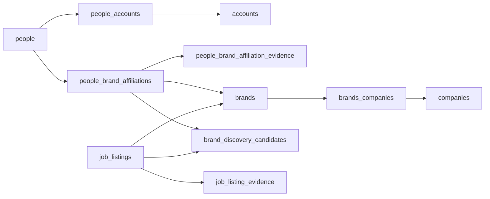

# Database schema reference

Last verified: 2026-10-08 17:13:14 JST

Scope: **151 application tables**, **1920 physical columns**, plus seven compatibility views. Source: integrated `feat/g2-editorial`; migration graph through `0079_original_content_physical_names`.

Use this guide to find where information lives and how records connect. Start
with a subject below, or use the [alphabetical table inventory](#table-inventory)
to jump directly to any table. Every inventory entry has a full column reference.

The schema is defined by [core/models.py](../../core/models.py) and the
[ordered Django migrations](../../core/migrations/). This snapshot describes
that repository schema, checked against Django models, migration state and an isolated PostgreSQL database; it does not
assert that a particular deployment has applied every migration. Django’s own
authentication, session, content-type, and migration-ledger tables are outside
this **application-table** count. `DiscoveryRunBase` is an abstract model, not
another table; its columns are included under both discovery-run tables.
The retired SQLite database and Graphviz image are not current schema sources.

## Find information by subject

| Subject | Tables | Start here when you need… |
| --- | ---: | --- |
| [People and job history](#people) | 13 | A person, their optional X identity, roles, employment dates, and evidence. |
| [Companies, brands, and organization discovery](#organizations) | 11 | Company/brand identity, ownership, associated accounts, and unresolved organizations. |
| [Accounts, profiles, and lists](#accounts) | 6 | X profiles, observed profile history, list membership, and post appearances. |
| [Countries and regions](#geography) | 6 | Country/region names and interpretation of account geography. |
| [Posts and classification](#posts) | 13 | Source posts, brand attribution, classification, and supporting judgments. |
| [Classification vocabularies and translated labels](#vocabularies) | 23 | Allowed classification concepts and their translated display labels. |
| [Products, model releases, and Hugging Face catalog](#products) | 12 | Exact products, release claims, and catalog observations. |
| [Job listings and official career-site collection](#jobs) | 5 | Advertised roles, their sources, and career-site synchronization status. |
| [Events and opportunities](#events) | 3 | Attendable occurrences and action-for-benefit offers. |
| [Post translation and commentary](#translation) | 9 | Literal post translations, generated commentary, retries, and budgets. |
| [Authored content and trend publication](#headlines) | 10 | Prepared headline text, publication pointers, work requests, and provider costs. |
| [Compatible editorial input storage and pictures](#editorial) | 7 | Story identities, accepted editions, quarter-hour decisions, spend and optional assets. |
| [Collection, extraction, and processing records](#processing) | 16 | Search cursors, coverage gaps, extraction attempts, and rare-type search accounting. |
| [Measurement subjects, metrics and observations](#measurements) | 10 | Sourced measurements and their collection state. |
| [Official-company collection](#official-companies) | 7 | Official-company account collection, attempts and spending. |

For staff records, begin with **[People and job history](#people)**. A person can
exist without an X account. Their employer/brand relationships and supporting
sources have their own tables. **[Job listings](#jobs)** describe advertised
positions; they are not a person’s employment history.

```mermaid
flowchart LR
    P[people] --> PA[people_accounts]
    PA --> A[accounts]
    P --> H[people_brand_affiliations]
    H --> E[people_brand_affiliation_evidence]
    H --> B[brands]
    H --> D[brand_discovery_candidates]
    B --> BC[brands_companies]
    BC --> C[companies]
    J[job_listings] --> B
    J --> D
    J --> JE[job_listing_evidence]
```

An affiliation or job listing is owned by exactly one known brand **or** one
organization awaiting review. The two arrows in the diagram are alternatives,
not two simultaneous owners. A company is reached through `brands_companies`;
there is no direct company column on the affiliation.

## Reading the table details

- A **primary key (PK)** uniquely identifies a row. Some tables use a natural
  identifier such as a provider ID or brand slug; others use a UUID or a
  generated integer. A **composite primary key** uses several existing columns
  together. Django’s `pk` attribute for those models is not a physical column.
- A **foreign key (FK)** links to another table. Column tables use actual SQL
  column names; a different Django attribute is shown as `model: …`. For example,
  `people_accounts.author_id` is the SQL column for the model’s `account` field.
- **NULL allowed** describes database nullability. It is separate from Django
  form validation (`blank=True`) and from an empty string. A non-null column may
  still accept `''` if its constraints allow it.
- **Default** means a Django/application default unless explicitly marked as a
  database identity. `uuid.uuid4`, `auto_now_add`, and `auto_now` are application
  behavior, not PostgreSQL defaults. Direct SQL writes must supply required
  values themselves. `auto_now` applies to normal model saves, not every bulk
  update or arbitrary SQL statement.
- PostgreSQL types are shown directly: `varchar(n)` is bounded text, `text` is
  unbounded text, `jsonb` is structured JSON, and `timestamp with time zone` is
  a timezone-aware timestamp. Positive integer Django fields also receive
  nonnegative database checks. Field choices are application validation;
  only listed database checks enforce their allowed values in SQL.
- `case_insensitive` is the ICU collation created in the initial migration
  (`und-u-ks-level2`, nondeterministic). Only fields explicitly marked with that
  collation use it; not every identifier does.
- FK deletion labels describe Django behavior: `CASCADE` deletes dependent
  records, `PROTECT` prevents deletion while referenced, and `SET_NULL` clears
  an optional link. These are not a claim that every SQL FK has that same
  `ON DELETE` clause. The migration-specific exceptions are documented below.
- Every table lists its named model indexes and constraints. PKs and unique
  fields provide uniqueness indexes; ordinary FK fields also receive indexes
  unless the field details say otherwise. These automatic indexes are not
  repeated as manually named indexes. Exact check expressions use SQL notation;
  the important meaning is explained in each subject’s introduction.

## Dates, evidence, and languages

Source facts and collection times answer different questions. `observed_at`,
`first_seen_at`, and `last_seen_at` say when PushinWeight saw a claim;
`created_at`/`updated_at` usually track the stored row. A source’s employment,
birth, release, event, or opportunity date stays in its dedicated value field.
For `posts`, `accounts`, and `products`, `created_at` is a source creation time;
the table notes identify those exceptions.

Reduced-precision dates pair a string value with a precision: `YYYY`/`year`,
`YYYY-MM`/`month`, `YYYY-MM-DD`/`day`, or NULL/`unknown`. Models that allow
`datetime` require a timezone-bearing ISO-style timestamp. Named checks express the expected string shapes and precision pairings;
application validation must also handle missing values and valid calendar dates.
As with PostgreSQL checks generally, an expression evaluating to SQL NULL does
not fail a check, so a nullable value plus a precision label is not by itself
proof of a complete or valid date. Comparable start/end values have additional ordering checks where
listed. Never substitute the date a page was crawled for an unknown joining date.

Evidence tables keep observations separate from interpreted facts. A stored
claim, confidence score, or record with `review_status='pending'` is not proof
of a confirmed identity. Do not count evidence rows as distinct people/jobs.
Several observations can support one record, and different claims can still
need reconciliation.

People select primary and English names from `people_names`; the four legacy
name fields remain for compatibility. `people_name_evidence` stores the sources.
Original professional prose and EN/JA translations live in `people_texts` and
`people_text_translations`. Media bytes and person/source attribution have their
own tables. Affiliation title/location originals and supporting evidence remain
in the existing job-history records; no company-headquarters location is inferred
for staff. Job listings retain their own source text and language fields.

## Alphabetical table inventory

Each of the 151 application tables appears once in this inventory and once in
the detailed sections. Subject counts above sum to 151.

| Table | Subject | What one row represents |
| --- | --- | --- |
| [_applied_config_snapshot](#table-_applied_config_snapshot) | [Collection, extraction, and processing records](#processing) | One configuration artifact’s last applied content hash. |
| [account_based_in_mappings](#table-account_based_in_mappings) | [Countries and regions](#geography) | One reviewed mapping from an X “based in” string to a country or region. |
| [account_post_appearances](#table-account_post_appearances) | [Accounts, profiles, and lists](#accounts) | One account’s appearance in one collected post, with collection context. |
| [account_profile_snapshots](#table-account_profile_snapshots) | [Accounts, profiles, and lists](#accounts) | One consecutive observation period during which an account’s saved profile hash is unchanged. |
| [accounts](#table-accounts) | [Accounts, profiles, and lists](#accounts) | One source account with a UUID identity, source/native key and current saved profile. |
| [audience_topic_concepts](#table-audience_topic_concepts) | [Classification vocabularies and translated labels](#vocabularies) | One stable topic identity within an audience-topic scheme. |
| [audience_topic_labels](#table-audience_topic_labels) | [Classification vocabularies and translated labels](#vocabularies) | One translated topic label for a particular revision. |
| [audience_topic_schemes](#table-audience_topic_schemes) | [Classification vocabularies and translated labels](#vocabularies) | One versioned audience-topic scheme and its manifest identity. |
| [brand_discovery_candidate_token_evidence](#table-brand_discovery_candidate_token_evidence) | [Companies, brands, and organization discovery](#organizations) | One source observation supporting an organization token. |
| [brand_discovery_candidate_tokens](#table-brand_discovery_candidate_tokens) | [Companies, brands, and organization discovery](#organizations) | One exact observed spelling or handle for an unresolved organization. |
| [brand_discovery_candidates](#table-brand_discovery_candidates) | [Companies, brands, and organization discovery](#organizations) | One unresolved organization identity awaiting review against known brands. |
| [brand_hashtags](#table-brand_hashtags) | [Companies, brands, and organization discovery](#organizations) | One hashtag associated with a brand. |
| [brand_keywords](#table-brand_keywords) | [Companies, brands, and organization discovery](#organizations) | One literal or regular-expression matching pattern for a brand. |
| [brand_search_terms](#table-brand_search_terms) | [Companies, brands, and organization discovery](#organizations) | One search term associated with a brand. |
| [brands](#table-brands) | [Companies, brands, and organization discovery](#organizations) | One brand identity and its display metadata. |
| [brands_accounts](#table-brands_accounts) | [Companies, brands, and organization discovery](#organizations) | One account’s role for a brand, such as official or researcher. |
| [brands_companies](#table-brands_companies) | [Companies, brands, and organization discovery](#organizations) | One ownership relationship between a brand and a company. |
| [call_state](#table-call_state) | [Collection, extraction, and processing records](#processing) | One harvest cursor for a brand, call, bucket, and query combination. |
| [companies](#table-companies) | [Companies, brands, and organization discovery](#organizations) | One company identity, including its recorded headquarters country. |
| [companies_accounts](#table-companies_accounts) | [Companies, brands, and organization discovery](#organizations) | One account’s role for a company. |
| [content_pictures](#table-content_pictures) | [Compatible editorial input storage and pictures](#editorial) | One optional source/derivative assignment for a content revision. |
| [countries](#table-countries) | [Countries and regions](#geography) | One country/territory code and optional display-parent relationship. |
| [country_codes_region](#table-country_codes_region) | [Countries and regions](#geography) | One country’s assigned region and the source of that assignment. |
| [country_labels](#table-country_labels) | [Countries and regions](#geography) | One translated label for a country code. |
| [data_sources](#table-data_sources) | [Accounts, profiles, and lists](#accounts) | One stable collection-source identity, distinct from original authored content. |
| [discourse_keys](#table-discourse_keys) | [Classification vocabularies and translated labels](#vocabularies) | One legacy pragmatic-register vocabulary key. |
| [discourse_labels](#table-discourse_labels) | [Classification vocabularies and translated labels](#vocabularies) | One translated legacy pragmatic-register label. |
| [editorial_assessments](#table-editorial_assessments) | [Compatible editorial input storage and pictures](#editorial) | One fenced quarter-hour editorial or content-picture assessment, with frozen evidence and outcome. |
| [editorial_budgets](#table-editorial_budgets) | [Compatible editorial input storage and pictures](#editorial) | One UTC day of conservative spend reservations and text/media call counts. |
| [editorial_calls](#table-editorial_calls) | [Compatible editorial input storage and pictures](#editorial) | One reserved provider stage and its saved response or uncertain-send outcome. |
| [editorial_editions](#table-editorial_editions) | [Compatible editorial input storage and pictures](#editorial) | One immutable accepted story edition for a track, locale and revision. |
| [editorial_heroes](#table-editorial_heroes) | [Compatible editorial input storage and pictures](#editorial) | One current hero pointer, or the shared provider-lock row. |
| [editorial_stories](#table-editorial_stories) | [Compatible editorial input storage and pictures](#editorial) | One permanent development identity with original-post anchors. |
| [event_evidence](#table-event_evidence) | [Events and opportunities](#events) | One source observation supporting an event occurrence. |
| [events](#table-events) | [Events and opportunities](#events) | One attendance-bearing occurrence, such as a conference or meetup. |
| [geopolitical_mode_keys](#table-geopolitical_mode_keys) | [Classification vocabularies and translated labels](#vocabularies) | One geopolitical-mode vocabulary key. |
| [geopolitical_mode_labels](#table-geopolitical_mode_labels) | [Classification vocabularies and translated labels](#vocabularies) | One translated geopolitical-mode label. |
| [harvest_backlog_windows](#table-harvest_backlog_windows) | [Collection, extraction, and processing records](#processing) | One bounded time window still owed collection coverage. |
| [hf_model_catalog_namespace_runs](#table-hf_model_catalog_namespace_runs) | [Products, model releases, and Hugging Face catalog](#products) | One namespace’s enumeration state within a catalog run. |
| [hf_model_catalog_observations](#table-hf_model_catalog_observations) | [Products, model releases, and Hugging Face catalog](#products) | One repository observation within a namespace run. |
| [hf_model_catalog_runs](#table-hf_model_catalog_runs) | [Products, model releases, and Hugging Face catalog](#products) | One overall Hugging Face catalog collection run. |
| [hf_orgs](#table-hf_orgs) | [Products, model releases, and Hugging Face catalog](#products) | One Hugging Face organization/user namespace linked to a company. |
| [job_discovery_runs](#table-job_discovery_runs) | [Job listings and official career-site collection](#jobs) | One job-search query/window run, including coverage, cost, and extracted listing count. |
| [job_listing_evidence](#table-job_listing_evidence) | [Job listings and official career-site collection](#jobs) | One source observation supporting a job listing. |
| [job_listings](#table-job_listings) | [Job listings and official career-site collection](#jobs) | One advertised position/requisition, including its source identity and current saved details. |
| [job_source_states](#table-job_source_states) | [Job listings and official career-site collection](#jobs) | One career-site source’s active lease and last successful synchronization state. |
| [job_source_sync_runs](#table-job_source_sync_runs) | [Job listings and official career-site collection](#jobs) | One attempt to synchronize an official career-site source. |
| [measurement_subjects](#table-measurement_subjects) | [Measurement subjects, metrics and observations](#measurements) | One identity that measurements describe, optionally linked to a product, group, brand or company. |
| [metric_collection_contracts](#table-metric_collection_contracts) | [Measurement subjects, metrics and observations](#measurements) | One versioned collection contract for a data source. |
| [metric_collection_runs](#table-metric_collection_runs) | [Measurement subjects, metrics and observations](#measurements) | One bounded measurement collection attempt with its contract and outcome. |
| [metric_observations](#table-metric_observations) | [Measurement subjects, metrics and observations](#measurements) | One sourced, dated observation in a collection run. |
| [metric_types](#table-metric_types) | [Measurement subjects, metrics and observations](#measurements) | One allowed family of measurements and its interpretation. |
| [metric_values](#table-metric_values) | [Measurement subjects, metrics and observations](#measurements) | One value for a metric in an observation. |
| [metrics](#table-metrics) | [Measurement subjects, metrics and observations](#measurements) | One metric definition with units, scale and methodology. |
| [model_release_evidence](#table-model_release_evidence) | [Products, model releases, and Hugging Face catalog](#products) | One observed source claim supporting a model release. |
| [model_releases](#table-model_releases) | [Products, model releases, and Hugging Face catalog](#products) | One source-backed model-release occurrence and its stated date precision. |
| [national_stance_keys](#table-national_stance_keys) | [Classification vocabularies and translated labels](#vocabularies) | One China/US national-stance direction vocabulary key. |
| [national_stance_labels](#table-national_stance_labels) | [Classification vocabularies and translated labels](#vocabularies) | One translated national-stance label. |
| [nationalism_keys](#table-nationalism_keys) | [Classification vocabularies and translated labels](#vocabularies) | One legacy nationalism-scale vocabulary key shared by the China and US axes. |
| [nationalism_labels](#table-nationalism_labels) | [Classification vocabularies and translated labels](#vocabularies) | One translated legacy nationalism-scale label. |
| [official_company_account_states](#table-official_company_account_states) | [Official-company collection](#official-companies) | One official-company account collection state and cursor. |
| [official_company_attempts](#table-official_company_attempts) | [Official-company collection](#official-companies) | One official-company provider attempt with its budget charge and state. |
| [official_company_budgets](#table-official_company_budgets) | [Official-company collection](#official-companies) | One period of reserved official-company collection spend. |
| [official_company_list_intents](#table-official_company_list_intents) | [Official-company collection](#official-companies) | One desired official-company list membership action. |
| [official_company_owner_credentials](#table-official_company_owner_credentials) | [Official-company collection](#official-companies) | One owner-scoped credential reference; secret material is not documented here. |
| [official_company_provider_states](#table-official_company_provider_states) | [Official-company collection](#official-companies) | One provider lifecycle/control record for official-company collection. |
| [official_company_scans](#table-official_company_scans) | [Official-company collection](#official-companies) | One official-company account scan and its outcome. |
| [opportunities](#table-opportunities) | [Events and opportunities](#events) | One bounded offer in which an action can provide a benefit, optionally linked to an event. |
| [original_content](#table-original_content) | [Authored content and trend publication](#headlines) | One prepared brand headline outcome within a run. |
| [original_content_calls](#table-original_content_calls) | [Authored content and trend publication](#headlines) | One recorded provider attempt for ranking, editing, or reviewing headlines. |
| [original_content_runs](#table-original_content_runs) | [Authored content and trend publication](#headlines) | One common evidence cutoff for an all-brand headline run and time window. |
| [original_content_selections](#table-original_content_selections) | [Authored content and trend publication](#headlines) | One currently visible run for a supported time window. |
| [original_content_sources](#table-original_content_sources) | [Authored content and trend publication](#headlines) | One distinct cited post supporting one saved locale/version, with immutable ordered URL/author/hash snapshots. |
| [original_content_texts](#table-original_content_texts) | [Authored content and trend publication](#headlines) | One locale’s headline and byline for a brand narrative. |
| [people](#table-people) | [People and job history](#people) | One person, whether or not they have an X account. |
| [people_accounts](#table-people_accounts) | [People and job history](#people) | One proposed or reviewed link between a person and an X account. |
| [people_brand_affiliation_evidence](#table-people_brand_affiliation_evidence) | [People and job history](#people) | One source observation supporting an affiliation claim. |
| [people_brand_affiliations](#table-people_brand_affiliations) | [People and job history](#people) | One claim about a person’s role or relationship with an organization. |
| [people_identity_corrections](#table-people_identity_corrections) | [People and job history](#people) | One append-only reviewed account confirmation, identity merge or selective split. |
| [people_media](#table-people_media) | [People and job history](#people) | One person-specific attribution of an image or video reference to a source. |
| [people_name_evidence](#table-people_name_evidence) | [People and job history](#people) | One observation supporting a name or explicitly supported name components. |
| [people_names](#table-people_names) | [People and job history](#people) | One sourced spelling of a person’s full name, with optional evidenced components. |
| [people_text_translations](#table-people_text_translations) | [People and job history](#people) | One cached translation of a specific original prose version and provider configuration. |
| [people_texts](#table-people_texts) | [People and job history](#people) | One immutable version of original biography, role, location or job-description prose. |
| [personnel_discovery_runs](#table-personnel_discovery_runs) | [People and job history](#people) | One personnel-search query/window run, including coverage, cost, and extraction counts. |
| [post_enrichment_states](#table-post_enrichment_states) | [Post translation and commentary](#translation) | One post’s replayable translation/classification progress and diagnostics. |
| [post_subject_attributions](#table-post_subject_attributions) | [Measurement subjects, metrics and observations](#measurements) | One sourced post linked to a measurement subject. |
| [post_synthesis_artifacts](#table-post_synthesis_artifacts) | [Post translation and commentary](#translation) | One versioned commentary artifact for a post and its context. |
| [post_synthesis_daily_budgets](#table-post_synthesis_daily_budgets) | [Post translation and commentary](#translation) | One day’s commentary request/token budget accounting. |
| [post_synthesis_demands](#table-post_synthesis_demands) | [Post translation and commentary](#translation) | One coalesced request for post commentary, including its worker claim and retry state. |
| [post_synthesis_rate_limit_buckets](#table-post_synthesis_rate_limit_buckets) | [Post translation and commentary](#translation) | One request-throttle bucket keyed without storing a user ID or IP address. |
| [post_synthesis_texts](#table-post_synthesis_texts) | [Post translation and commentary](#translation) | One locale’s commentary text within a synthesis artifact. |
| [post_translation_artifacts](#table-post_translation_artifacts) | [Post translation and commentary](#translation) | One versioned literal-translation attempt/state for a post body. |
| [post_translation_chunks](#table-post_translation_chunks) | [Post translation and commentary](#translation) | One validated locale chunk retained for resuming a long post translation. |
| [post_translation_texts](#table-post_translation_texts) | [Post translation and commentary](#translation) | One locale’s validated literal text within a translation artifact. |
| [post_type_keys](#table-post_type_keys) | [Classification vocabularies and translated labels](#vocabularies) | One post-type vocabulary key, such as release or review. |
| [post_type_labels](#table-post_type_labels) | [Classification vocabularies and translated labels](#vocabularies) | One translated post-type label. |
| [posts](#table-posts) | [Posts and classification](#posts) | One collected X post, its source text, metrics, and author snapshot. |
| [posts_brands](#table-posts_brands) | [Posts and classification](#posts) | One post-to-brand attribution and its relevance weight. |
| [posts_brands_audience_topics](#table-posts_brands_audience_topics) | [Posts and classification](#posts) | One audience-topic assignment for a post/brand pair. |
| [posts_brands_classification_judgments](#table-posts_brands_classification_judgments) | [Posts and classification](#posts) | One recorded stage of a classifier judgment, including inputs and validation. |
| [posts_brands_classification_states](#table-posts_brands_classification_states) | [Posts and classification](#posts) | One current versioned classification state for a post/brand pair. |
| [posts_brands_discourse](#table-posts_brands_discourse) | [Posts and classification](#posts) | One legacy pragmatic speech-act assignment for a post/brand pair. |
| [posts_brands_geopolitical_modes](#table-posts_brands_geopolitical_modes) | [Posts and classification](#posts) | One geopolitical-mode assignment for a post/brand pair. |
| [posts_brands_mentions](#table-posts_brands_mentions) | [Posts and classification](#posts) | One matching source that connected a post to a brand. |
| [posts_brands_product_labels](#table-posts_brands_product_labels) | [Posts and classification](#posts) | One independent product-feedback label for a post/brand pair. |
| [posts_brands_products](#table-posts_brands_products) | [Products, model releases, and Hugging Face catalog](#products) | One source-backed claim that a post names an exact product for a brand. |
| [posts_brands_signals](#table-posts_brands_signals) | [Posts and classification](#posts) | One post type and sentiment assignment for a post/brand pair. |
| [posts_unsanctioned_flags](#table-posts_unsanctioned_flags) | [Posts and classification](#posts) | One post’s legacy unsanctioned-flag assignment. |
| [posts_untracked_brand_promotions](#table-posts_untracked_brand_promotions) | [Posts and classification](#posts) | One current post-level judgment about promotion of an untracked brand. |
| [product_group_memberships](#table-product_group_memberships) | [Products, model releases, and Hugging Face catalog](#products) | One product belonging to a versioned group. |
| [product_groups](#table-product_groups) | [Products, model releases, and Hugging Face catalog](#products) | One stable grouping identity for related products. |
| [product_label_keys](#table-product_label_keys) | [Classification vocabularies and translated labels](#vocabularies) | One independent product-feedback vocabulary key. |
| [product_label_labels](#table-product_label_labels) | [Classification vocabularies and translated labels](#vocabularies) | One translated product-feedback label. |
| [product_relationships](#table-product_relationships) | [Products, model releases, and Hugging Face catalog](#products) | One typed relationship between two products. |
| [product_verification_proposals](#table-product_verification_proposals) | [Products, model releases, and Hugging Face catalog](#products) | One reviewable proposal to resolve an observed product name to a product. |
| [products](#table-products) | [Products, model releases, and Hugging Face catalog](#products) | One model/product identity, with optional Hugging Face repository metadata. |
| [profile_movement_candidates](#table-profile_movement_candidates) | [People and job history](#people) | One observed profile change queued for personnel-movement interpretation. |
| [rare_type_category_assignments](#table-rare_type_category_assignments) | [Collection, extraction, and processing records](#processing) | One source-backed rare-category assignment for a post and organization. |
| [rare_type_decision_attempts](#table-rare_type_decision_attempts) | [Collection, extraction, and processing records](#processing) | One funded provider attempt for a relevance decision, with one settlement record. |
| [rare_type_decision_processing_cycles](#table-rare_type_decision_processing_cycles) | [Collection, extraction, and processing records](#processing) | One processing time slot that funds relevance-decision attempts. |
| [rare_type_decisions](#table-rare_type_decisions) | [Collection, extraction, and processing records](#processing) | One reusable, versioned relevance interpretation of a provider result. |
| [rare_type_search_daily_budgets](#table-rare_type_search_daily_budgets) | [Collection, extraction, and processing records](#processing) | One search lane’s budget accounting for a UTC day. |
| [rare_type_search_hits](#table-rare_type_search_hits) | [Collection, extraction, and processing records](#processing) | One durable inbox result from an already-paid rare-type search. |
| [rare_type_search_runs](#table-rare_type_search_runs) | [Collection, extraction, and processing records](#processing) | One paid rare-type search time slot and its coverage/cost record. |
| [region_labels](#table-region_labels) | [Countries and regions](#geography) | One translated label for a region. |
| [regions](#table-regions) | [Countries and regions](#geography) | One region in the geographic hierarchy. |
| [role_labels](#table-role_labels) | [Classification vocabularies and translated labels](#vocabularies) | One translated account-role label. |
| [roles](#table-roles) | [Classification vocabularies and translated labels](#vocabularies) | One account-role vocabulary key. |
| [search_queries](#table-search_queries) | [Collection, extraction, and processing records](#processing) | One saved collection/discovery query identity and associated brand/keywords. |
| [sentiment_keys](#table-sentiment_keys) | [Classification vocabularies and translated labels](#vocabularies) | One sentiment vocabulary key. |
| [sentiment_labels](#table-sentiment_labels) | [Classification vocabularies and translated labels](#vocabularies) | One translated sentiment label. |
| [source_subject_mappings](#table-source_subject_mappings) | [Measurement subjects, metrics and observations](#measurements) | One external source identifier mapped to a measurement subject. |
| [staff_collection_work](#table-staff_collection_work) | [Collection, extraction, and processing records](#processing) | One person/source-fingerprint/policy unit of resumable collection work. |
| [staff_intakes](#table-staff_intakes) | [Collection, extraction, and processing records](#processing) | One versioned staff-source observation, including eligibility and its input payload. |
| [staff_media_objects](#table-staff_media_objects) | [People and job history](#people) | One validated image file, addressed by its SHA-256 content hash. |
| [staff_provider_requests](#table-staff_provider_requests) | [Collection, extraction, and processing records](#processing) | One reserved provider request, its outcome and safe response evidence. |
| [subject_relationships](#table-subject_relationships) | [Measurement subjects, metrics and observations](#measurements) | One typed relationship between measurement subjects. |
| [targeted_extraction_attempts](#table-targeted_extraction_attempts) | [Collection, extraction, and processing records](#processing) | One recorded attempt to extract a role-specific fact from a post. |
| [targeted_extraction_states](#table-targeted_extraction_states) | [Collection, extraction, and processing records](#processing) | One post/role extraction state, used to avoid repeating the same work. |
| [taxonomy_versions](#table-taxonomy_versions) | [Classification vocabularies and translated labels](#vocabularies) | One versioned taxonomy identity and its manifest. |
| [trend_narrative_demands](#table-trend_narrative_demands) | [Authored content and trend publication](#headlines) | One coalesced brand/window headline request and its scheduling state. |
| [trend_narrative_subjects](#table-trend_narrative_subjects) | [Authored content and trend publication](#headlines) | One reported subject attached to a headline publication. |
| [trend_narrative_work_slots](#table-trend_narrative_work_slots) | [Authored content and trend publication](#headlines) | One window’s active work claim and optional newer queued cutoff. |
| [trend_narratives](#table-trend_narratives) | [Authored content and trend publication](#headlines) | One durable attempt/version of a shared time-window headline. |
| [twitter_list_memberships](#table-twitter_list_memberships) | [Accounts, profiles, and lists](#accounts) | One account’s membership state in one X list. |
| [twitter_list_sync_state](#table-twitter_list_sync_state) | [Accounts, profiles, and lists](#accounts) | One X list’s last completed membership synchronization. |
| [unsanctioned_flag_keys](#table-unsanctioned_flag_keys) | [Classification vocabularies and translated labels](#vocabularies) | One legacy unsanctioned-flag vocabulary key; there is no paired label table. |
| [untracked_brand_promotion_evidence](#table-untracked_brand_promotion_evidence) | [Posts and classification](#posts) | One visible promoted subject supporting an untracked-brand judgment. |
| [untracked_brand_promotion_keys](#table-untracked_brand_promotion_keys) | [Classification vocabularies and translated labels](#vocabularies) | One current untracked-brand-promotion vocabulary key. |
| [untracked_brand_promotion_labels](#table-untracked_brand_promotion_labels) | [Classification vocabularies and translated labels](#vocabularies) | One translated untracked-brand-promotion label. |

## People and job history

`people` holds identity. `people_accounts` supplies optional social-account
links, while `people_brand_affiliations` holds the career relationships. One
person can have several affiliations, including separate roles at the same
organization and relationships such as founder, advisor, or board member.
`people_brand_affiliation_evidence` holds the source text/URL/post/profile that
supports each claim. These are core person records, not an implementation-phase
appendix.

The uniqueness of `claim_identity` prevents the same claim identity from being
inserted twice; it does not by itself merge every duplicate person or resolve
conflicting career claims. Confirmed account links have stricter constraints:
an account has at most one confirmed person, and a person has at most one
confirmed primary account. Pending links can coexist during review.

`profile_movement_candidates` is a processing queue built from profile changes,
not a confirmed job-history record. `personnel_discovery_runs` measures searches,
not employment. The current [person reader](../../core/intelligence_readers.py)
returns all affiliations, but its `employment_history` subset includes only
`affiliation_type='employment'`.

Current person identity has 16 columns, including `sex` and two selected name
links. Full names and optional given/family components belong to `people_names`.
Primary selects a sourced professional/original representation; English selects
an established English representation. Both must belong to this person and be
confirmed. The reader falls back to legacy full-name fields when no selection
exists; a fallback does not establish source verification. Its version-2 read
contract exposes `sex`. See [the extraction path](../../core/targeted_extraction.py)
and [profile observations](../../core/profile_snapshots.py) for identity creation.

### `people` — Person

One person, whether or not they have an X account.

Model: [Person](../../core/models.py#L4712).

**Primary key:** `id`.

| SQL column | PostgreSQL type | NULL allowed | Meaning, relationships, and defaults |
| --- | --- | --- | --- |
| `id` | `uuid` | No | PK component. Django default: `uuid4` (not an assumed SQL default). |
| `display_name` | `text` | No | Legacy full display name and fallback; not unique. |
| `display_name_en` | `text` | Yes | English or romanized full name. |
| `display_name_zh_cn` | `text` | Yes | Simplified Chinese full name. |
| `display_name_ja` | `text` | Yes | Japanese full name. |
| `date_of_birth` | `varchar(10)` | Yes | Source-supported date at the paired precision; not necessarily a full date. |
| `date_of_birth_precision` | `varchar(16)` | No | Django default: `'unknown'` (not an assumed SQL default). Choices: `day`, `month`, `year`, `unknown`. |
| `sex` | `text` | Yes | Source-supported sex value. |
| `primary_name_id` | `bigint` | Yes | FK → [`people_names`](#table-people_names) (`id`). Django deletion: `SET_NULL`; PostgreSQL FK uses NO ACTION, normally deferred to transaction end. Model field: `primary_name`. |
| `english_name_id` | `bigint` | Yes | FK → [`people_names`](#table-people_names) (`id`). Django deletion: `SET_NULL`; PostgreSQL FK uses NO ACTION, normally deferred to transaction end. Model field: `english_name`. |
| `nationality` | `text` | Yes | Stored value. |
| `ethnicity` | `text` | Yes | Stored value. |
| `primary_language` | `text` | Yes | Stored value. |
| `merged_into_id` | `uuid` | Yes | Retired identity redirects to [people](#table-people); Django PROTECT. Original ID remains addressable. FK → [`people`](#table-people) (`id`). Django deletion: `PROTECT`; PostgreSQL FK uses NO ACTION, normally deferred to transaction end. Model field: `merged_into`. |
| `created_at` | `timestamp with time zone` | No | Set by Django on creation. Set by Django on creation. |
| `updated_at` | `timestamp with time zone` | No | Set by Django on model save. Set by Django on model save. |

**Named indexes:**

None declared beyond field/FK/constraint indexes.

**Named constraints:**

- `ck_person_merge_not_self`: `CONSTRAINT "ck_person_merge_not_self" CHECK (NOT ("merged_into_id" = ("id") AND "merged_into_id" IS NOT NULL))`.
- `ck_people_dob_precision`: `CONSTRAINT "ck_people_dob_precision" CHECK ((("date_of_birth" IS NULL AND "date_of_birth_precision" = 'unknown') OR ("date_of_birth"::text ~ '^[0-9]{4}-[0-9]{2}-[0-9]{2}$' AND "date_of_birth_precision" = 'day') OR ("date_of_birth"::text ~ '^[0-9]{4}-[0-9]{2}$' AND "date_of_birth_precision" = 'month') OR ("date_of_birth"::text ~ '^[0-9]{4}$' AND "date_of_birth_precision" = 'year')))`.

[Back to table inventory](#table-inventory)

### `people_accounts` — PersonAccount

One proposed or reviewed link between a person and an X account.

Model: [PersonAccount](../../core/models.py#L5111).

**Primary key:** `person, account`.

| SQL column | PostgreSQL type | NULL allowed | Meaning, relationships, and defaults |
| --- | --- | --- | --- |
| `person_id` | `uuid` | No | FK → [`people`](#table-people) (`id`). Django deletion: `CASCADE`; PostgreSQL FK uses NO ACTION, normally deferred to transaction end. Model field: `person`. |
| `author_id` | `text` | Yes | Model field: `native_account_id`. |
| `account_key` | `uuid` | No | FK → [`accounts`](#table-accounts) (`account_key`). Django deletion: `CASCADE`; PostgreSQL FK uses NO ACTION, normally deferred to transaction end. Model field: `account`. |
| `is_primary` | `boolean` | No | Django default: `False` (not an assumed SQL default). |
| `first_observed_at` | `timestamp with time zone` | No | Stored value. |
| `last_observed_at` | `timestamp with time zone` | No | Stored value. |
| `confidence` | `double precision` | Yes | Stored value. |
| `resolution_status` | `varchar(16)` | No | Django default: `'pending'` (not an assumed SQL default). Choices: `pending`, `confirmed`, `rejected`, `needs_review`. |
| `review_note` | `text` | No | Django default: `''` (not an assumed SQL default). |
| `reviewed_at` | `timestamp with time zone` | Yes | Stored value. |

**Named indexes:**

None declared beyond field/FK/constraint indexes.

**Named constraints:**

- `ck_people_accounts_resolution`: `CONSTRAINT "ck_people_accounts_resolution" CHECK ("resolution_status" IN ('pending', 'confirmed', 'rejected', 'needs_review'))`.
- `ck_people_accounts_window`: `CONSTRAINT "ck_people_accounts_window" CHECK ("last_observed_at" >= ("first_observed_at"))`.
- `ck_people_accounts_conf`: `CONSTRAINT "ck_people_accounts_conf" CHECK (("confidence" IS NULL OR ("confidence" >= 0.0 AND "confidence" <= 1.0)))`.
- `uq_people_accounts_confirmed`: `None`.
- `uq_people_accounts_primary`: `None`.

[Back to table inventory](#table-inventory)

### `people_brand_affiliations` — PersonBrandAffiliation

One claim about a person’s role or relationship with an organization.

Model: [PersonBrandAffiliation](../../core/models.py#L5300).

**Primary key:** `id`.

| SQL column | PostgreSQL type | NULL allowed | Meaning, relationships, and defaults |
| --- | --- | --- | --- |
| `id` | `bigint` | No | PK; database-generated identity. |
| `person_id` | `uuid` | No | FK → [`people`](#table-people) (`id`). Django deletion: `CASCADE`; PostgreSQL FK uses NO ACTION, normally deferred to transaction end. Model field: `person`. |
| `brand_id` | `varchar(64)` | Yes | FK → [`brands`](#table-brands) (`nickname`). Django deletion: `PROTECT`; PostgreSQL FK uses NO ACTION, normally deferred to transaction end. Model field: `brand`. |
| `brand_discovery_candidate_id` | `bigint` | Yes | FK → [`brand_discovery_candidates`](#table-brand_discovery_candidates) (`id`). Django deletion: `PROTECT`; PostgreSQL FK uses NO ACTION, normally deferred to transaction end. Model field: `brand_discovery_candidate`. |
| `affiliation_type` | `varchar(32)` | No | Choices: `employment`, `founder`, `advisor`, `board_member`, `contractor`, `ambassador`, `creator_partner`, `affiliate`, `investor`, `community`, `other`. |
| `observed_organization_name` | `text` | No | Organization name as observed in the source. |
| `observed_organization_handle` | `varchar(64)` | Yes | Organization handle as observed in the source. |
| `title_raw` | `text` | Yes | Title wording retained from the source. |
| `title_normalized` | `text` | Yes | Standardized title; not a dedicated English-translation field. |
| `department` | `text` | Yes | Stored value. |
| `team` | `text` | Yes | Stored value. |
| `job_function` | `text` | Yes | Stored value. |
| `seniority` | `text` | Yes | Stored value. |
| `employment_type` | `text` | Yes | Stored value. |
| `status` | `varchar(16)` | No | Django default: `'unknown'` (not an assumed SQL default). Choices: `current`, `former`, `future`, `unknown`. |
| `start_date` | `varchar(10)` | Yes | Source-supported relationship start, paired with precision. |
| `start_date_precision` | `varchar(16)` | No | Django default: `'unknown'` (not an assumed SQL default). Choices: `day`, `month`, `year`, `unknown`. |
| `end_date` | `varchar(10)` | Yes | Source-supported relationship end, paired with precision. |
| `end_date_precision` | `varchar(16)` | No | Django default: `'unknown'` (not an assumed SQL default). Choices: `day`, `month`, `year`, `unknown`. |
| `location` | `text` | Yes | Stored value. |
| `workplace_type` | `text` | Yes | Stored value. |
| `description` | `text` | Yes | Relationship description; no language-specific sibling columns. |
| `confidence` | `double precision` | Yes | Stored value. |
| `review_status` | `varchar(16)` | No | Django default: `'pending'` (not an assumed SQL default). Choices: `pending`, `confirmed`, `rejected`, `needs_review`. |
| `review_note` | `text` | No | Django default: `''` (not an assumed SQL default). |
| `reviewed_at` | `timestamp with time zone` | Yes | Stored value. |
| `source_system` | `varchar(64)` | Yes | Stored value. |
| `external_id` | `text` | Yes | Stored value. |
| `claim_identity` | `varchar(64)` | No | Unique. Stable identity for this claim; uniqueness is not a person-matching algorithm. Field-level unique. |
| `superseded_by_id` | `bigint` | Yes | Reviewed replacement claim in this table; Django PROTECT. Distinct from current/former job status. FK → [`people_brand_affiliations`](#table-people_brand_affiliations) (`id`). Django deletion: `PROTECT`; PostgreSQL FK uses NO ACTION, normally deferred to transaction end. Model field: `superseded_by`. |
| `superseded_at` | `timestamp with time zone` | Yes | When the replacement decision was recorded. |
| `superseded_by_reviewer` | `text` | No | Reviewer; default empty before replacement. Django default: `''` (not an assumed SQL default). |
| `supersession_reason` | `text` | No | Decision reason; default empty before replacement. Django default: `''` (not an assumed SQL default). |
| `created_at` | `timestamp with time zone` | No | Set by Django on creation. Set by Django on creation. |
| `updated_at` | `timestamp with time zone` | No | Set by Django on model save. Set by Django on model save. |

**Named indexes:**

- `idx_pba_brand_type_status`: `CREATE INDEX "idx_pba_brand_type_status" ON "people_brand_affiliations" ("brand_id", "affiliation_type", "status")`.
- `idx_pba_person_type`: `CREATE INDEX "idx_pba_person_type" ON "people_brand_affiliations" ("person_id", "affiliation_type")`.

**Named constraints:**

- `ck_pba_one_organization`: `CONSTRAINT "ck_pba_one_organization" CHECK ((("brand_id" IS NOT NULL AND "brand_discovery_candidate_id" IS NULL) OR ("brand_id" IS NULL AND "brand_discovery_candidate_id" IS NOT NULL)))`.
- `ck_pba_affiliation_type`: `CONSTRAINT "ck_pba_affiliation_type" CHECK ("affiliation_type" IN ('employment', 'founder', 'advisor', 'board_member', 'contractor', 'ambassador', 'creator_partner', 'affiliate', 'investor', 'community', 'other'))`.
- `ck_pba_status`: `CONSTRAINT "ck_pba_status" CHECK ("status" IN ('current', 'former', 'future', 'unknown'))`.
- `ck_pba_review_status`: `CONSTRAINT "ck_pba_review_status" CHECK ("review_status" IN ('pending', 'confirmed', 'rejected', 'needs_review'))`.
- `ck_pba_confidence`: `CONSTRAINT "ck_pba_confidence" CHECK (("confidence" IS NULL OR ("confidence" >= 0.0 AND "confidence" <= 1.0)))`.
- `ck_pba_start_precision`: `CONSTRAINT "ck_pba_start_precision" CHECK ((("start_date" IS NULL AND "start_date_precision" = 'unknown') OR ("start_date"::text ~ '^[0-9]{4}-[0-9]{2}-[0-9]{2}$' AND "start_date_precision" = 'day') OR ("start_date"::text ~ '^[0-9]{4}-[0-9]{2}$' AND "start_date_precision" = 'month') OR ("start_date"::text ~ '^[0-9]{4}$' AND "start_date_precision" = 'year')))`.
- `ck_pba_end_precision`: `CONSTRAINT "ck_pba_end_precision" CHECK ((("end_date" IS NULL AND "end_date_precision" = 'unknown') OR ("end_date"::text ~ '^[0-9]{4}-[0-9]{2}-[0-9]{2}$' AND "end_date_precision" = 'day') OR ("end_date"::text ~ '^[0-9]{4}-[0-9]{2}$' AND "end_date_precision" = 'month') OR ("end_date"::text ~ '^[0-9]{4}$' AND "end_date_precision" = 'year')))`.
- `ck_pba_comparable_dates`: `CONSTRAINT "ck_pba_comparable_dates" CHECK (("start_date" IS NULL OR "end_date" IS NULL OR NOT ("start_date_precision" = ("end_date_precision")) OR "start_date" <= ("end_date")))`.

Migration 0063 enforces same-person/organization replacement, complete review metadata and acyclic chains. Recorded replacement decisions cannot be rewritten. Readers use `active_claims`; latest observation time alone never settles competing claims.

[Back to table inventory](#table-inventory)

### `people_brand_affiliation_evidence` — PersonBrandAffiliationEvidence

One source observation supporting an affiliation claim.

Model: [PersonBrandAffiliationEvidence](../../core/models.py#L5475).

**Primary key:** `id`.

| SQL column | PostgreSQL type | NULL allowed | Meaning, relationships, and defaults |
| --- | --- | --- | --- |
| `id` | `bigint` | No | PK; database-generated identity. |
| `affiliation_id` | `bigint` | No | FK → [`people_brand_affiliations`](#table-people_brand_affiliations) (`id`). Django deletion: `CASCADE`; PostgreSQL FK uses NO ACTION, normally deferred to transaction end. Model field: `affiliation`. |
| `source_post_id` | `text` | Yes | FK → [`posts`](#table-posts) (`tweet_id`). Django deletion: `SET_NULL`; PostgreSQL FK uses NO ACTION, normally deferred to transaction end. Model field: `source_post`. |
| `source_profile_snapshot_id` | `bigint` | Yes | FK → [`account_profile_snapshots`](#table-account_profile_snapshots) (`id`). Django deletion: `SET_NULL`; PostgreSQL FK uses NO ACTION, normally deferred to transaction end. Model field: `source_profile_snapshot`. |
| `source_url` | `varchar(2048)` | Yes | Stored value. |
| `evidence_text` | `text` | No | Django default: `''` (not an assumed SQL default). |
| `observed_at` | `timestamp with time zone` | No | When this evidence was observed, not the employment effective date. |
| `extracted_claim_data` | `jsonb` | No | Django default: `dict` (not an assumed SQL default). |
| `extraction_method` | `varchar(64)` | No | Stored value. |
| `extraction_model` | `text` | Yes | Stored value. |
| `extraction_prompt_version` | `text` | Yes | Stored value. |
| `confidence` | `double precision` | Yes | Stored value. |
| `review_status` | `varchar(16)` | No | Django default: `'pending'` (not an assumed SQL default). Choices: `pending`, `confirmed`, `rejected`, `needs_review`. |
| `reviewer` | `text` | Yes | Stored value. |
| `review_note` | `text` | No | Django default: `''` (not an assumed SQL default). |
| `reviewed_at` | `timestamp with time zone` | Yes | Stored value. |
| `evidence_hash` | `varchar(64)` | No | Deduplication identity within an affiliation. |
| `created_at` | `timestamp with time zone` | No | Set by Django on creation. Set by Django on creation. |

**Named indexes:**

None declared beyond field/FK/constraint indexes.

**Named constraints:**

- `ck_pbae_review_status`: `CONSTRAINT "ck_pbae_review_status" CHECK ("review_status" IN ('pending', 'confirmed', 'rejected', 'needs_review'))`.
- `ck_pbae_has_source`: `CONSTRAINT "ck_pbae_has_source" CHECK (("source_post_id" IS NOT NULL OR "source_profile_snapshot_id" IS NOT NULL OR ("source_url" IS NOT NULL AND NOT ("source_url" = '' AND "source_url" IS NOT NULL))))`.
- `ck_pbae_confidence`: `CONSTRAINT "ck_pbae_confidence" CHECK (("confidence" IS NULL OR ("confidence" >= 0.0 AND "confidence" <= 1.0)))`.
- `uq_pbae_affiliation_hash`: `CONSTRAINT "uq_pbae_affiliation_hash" UNIQUE ("affiliation_id", "evidence_hash")`.

[Back to table inventory](#table-inventory)

### `profile_movement_candidates` — ProfileMovementCandidate

One observed profile change queued for personnel-movement interpretation.

Model: [ProfileMovementCandidate](../../core/models.py#L5246).

**Primary key:** `id`.

| SQL column | PostgreSQL type | NULL allowed | Meaning, relationships, and defaults |
| --- | --- | --- | --- |
| `id` | `bigint` | No | PK; database-generated identity. |
| `author_id` | `text` | Yes | Model field: `native_account_id`. |
| `account_key` | `uuid` | No | FK → [`accounts`](#table-accounts) (`account_key`). Django deletion: `CASCADE`; PostgreSQL FK uses NO ACTION, normally deferred to transaction end. Model field: `account`. |
| `prior_snapshot_id` | `bigint` | No | FK → [`account_profile_snapshots`](#table-account_profile_snapshots) (`id`). Django deletion: `PROTECT`; PostgreSQL FK uses NO ACTION, normally deferred to transaction end. Model field: `prior_snapshot`. |
| `new_snapshot_id` | `bigint` | No | FK → [`account_profile_snapshots`](#table-account_profile_snapshots) (`id`). Django deletion: `PROTECT`; PostgreSQL FK uses NO ACTION, normally deferred to transaction end. Model field: `new_snapshot`. |
| `source_post_id` | `text` | No | FK → [`posts`](#table-posts) (`tweet_id`). Django deletion: `PROTECT`; PostgreSQL FK uses NO ACTION, normally deferred to transaction end. Model field: `source_post`. |
| `prior_description` | `text` | No | Stored value. |
| `new_description` | `text` | No | Stored value. |
| `observed_at` | `timestamp with time zone` | No | When the changed profile was observed. |
| `effective_date` | `varchar(10)` | Yes | Source-supported movement date, if known. |
| `effective_date_precision` | `varchar(16)` | No | Django default: `'unknown'` (not an assumed SQL default). Choices: `day`, `month`, `year`, `unknown`. |
| `movement_identity` | `varchar(64)` | No | Unique. Field-level unique. |
| `status` | `varchar(16)` | No | Django default: `'pending'` (not an assumed SQL default). Choices: `pending`, `succeeded`, `failed`. |
| `attempts` | `smallint` | No | Django default: `0` (not an assumed SQL default). |
| `last_error_code` | `varchar(128)` | No | Django default: `''` (not an assumed SQL default). |
| `created_at` | `timestamp with time zone` | No | Set by Django on creation. Set by Django on creation. |
| `updated_at` | `timestamp with time zone` | No | Set by Django on model save. Set by Django on model save. |

**Named indexes:**

None declared beyond field/FK/constraint indexes.

**Named constraints:**

- `uq_profile_movement_transition`: `CONSTRAINT "uq_profile_movement_transition" UNIQUE ("account_key", "prior_snapshot_id", "new_snapshot_id")`.
- `ck_profile_movement_status`: `CONSTRAINT "ck_profile_movement_status" CHECK ("status" IN ('pending', 'succeeded', 'failed'))`.
- `ck_profile_movement_date_precision`: `CONSTRAINT "ck_profile_movement_date_precision" CHECK ((("effective_date" IS NULL AND "effective_date_precision" = 'unknown') OR ("effective_date"::text ~ '^[0-9]{4}-[0-9]{2}-[0-9]{2}$' AND "effective_date_precision" = 'day') OR ("effective_date"::text ~ '^[0-9]{4}-[0-9]{2}$' AND "effective_date_precision" = 'month') OR ("effective_date"::text ~ '^[0-9]{4}$' AND "effective_date_precision" = 'year')))`.

[Back to table inventory](#table-inventory)

### `personnel_discovery_runs` — PersonnelDiscoveryRun

One personnel-search query/window run, including coverage, cost, and extraction counts.

Model: [PersonnelDiscoveryRun](../../core/models.py#L6183).

**Primary key:** `id`.

| SQL column | PostgreSQL type | NULL allowed | Meaning, relationships, and defaults |
| --- | --- | --- | --- |
| `id` | `bigint` | No | PK; database-generated identity. |
| `run_identity` | `varchar(64)` | No | Unique. Field-level unique. |
| `run_id` | `text` | No | Stored value. |
| `cycle_id` | `text` | Yes | Stored value. |
| `query_id` | `bigint` | No | FK → [`search_queries`](#table-search_queries) (`id`). Django deletion: `PROTECT`; PostgreSQL FK uses NO ACTION, normally deferred to transaction end. Model field: `query`. |
| `query_text` | `text` | No | Stored value. |
| `query_hash` | `varchar(64)` | No | Stored value. |
| `query_pack_version` | `text` | No | Stored value. |
| `provider_boundary` | `text` | No | Stored value. |
| `tool_boundary` | `text` | Yes | Stored value. |
| `language` | `varchar(16)` | No | Stored value. |
| `query_family` | `varchar(32)` | No | Stored value. |
| `window_start` | `timestamp with time zone` | No | Stored value. |
| `window_end` | `timestamp with time zone` | No | Stored value. |
| `input_cursor` | `text` | Yes | Stored value. |
| `output_cursor` | `text` | Yes | Stored value. |
| `reviewed_post_count` | `integer` | No | Django default: `0` (not an assumed SQL default). |
| `accepted_post_count` | `integer` | No | Django default: `0` (not an assumed SQL default). |
| `excluded_count` | `integer` | No | Django default: `0` (not an assumed SQL default). |
| `exclusion_reasons` | `jsonb` | No | Django default: `dict` (not an assumed SQL default). |
| `discovered_organization_count` | `integer` | No | Django default: `0` (not an assumed SQL default). |
| `provider_capabilities` | `jsonb` | No | Django default: `dict` (not an assumed SQL default). |
| `provider_call_count` | `integer` | No | Django default: `0` (not an assumed SQL default). |
| `provider_credit_count` | `integer` | No | Django default: `0` (not an assumed SQL default). |
| `telemetry` | `jsonb` | No | Django default: `dict` (not an assumed SQL default). |
| `limitations` | `jsonb` | No | Django default: `list` (not an assumed SQL default). |
| `status` | `varchar(16)` | No | Django default: `'planned'` (not an assumed SQL default). Choices: `planned`, `running`, `completed`, `failed`, `truncated`, `blocked`. |
| `started_at` | `timestamp with time zone` | Yes | Stored value. |
| `completed_at` | `timestamp with time zone` | Yes | Stored value. |
| `completion_reason` | `text` | Yes | Stored value. |
| `created_at` | `timestamp with time zone` | No | Set by Django on creation. Set by Django on creation. |
| `updated_at` | `timestamp with time zone` | No | Set by Django on model save. Set by Django on model save. |
| `extracted_affiliation_count` | `integer` | No | Django default: `0` (not an assumed SQL default). |
| `extracted_evidence_count` | `integer` | No | Django default: `0` (not an assumed SQL default). |

**Named indexes:**

None declared beyond field/FK/constraint indexes.

**Named constraints:**

- `ck_personnel_runs_status`: `CONSTRAINT "ck_personnel_runs_status" CHECK ("status" IN ('planned', 'running', 'completed', 'failed', 'truncated', 'blocked'))`.
- `ck_personnel_runs_window`: `CONSTRAINT "ck_personnel_runs_window" CHECK ("window_end" > ("window_start"))`.

[Back to table inventory](#table-inventory)

### `people_names` — PersonName

One sourced spelling of a person’s full name, with optional evidenced components.

Model: [PersonName](../../core/models.py#L4793).

**Primary key:** `id`.

| SQL column | PostgreSQL type | NULL allowed | Meaning, relationships, and defaults |
| --- | --- | --- | --- |
| `id` | `bigint` | No | PK. PK; database-generated identity. |
| `person_id` | `uuid` | No | FK → [`people`](#table-people) (`id`). Django deletion: `CASCADE`; PostgreSQL FK uses NO ACTION, normally deferred to transaction end. Model field: `person`. |
| `full_name` | `text` | No | Stored value. |
| `given_name` | `text` | Yes | Stored value. |
| `family_name` | `text` | Yes | Stored value. |
| `language` | `varchar(35)` | No | Django default: `'und'` (not an assumed SQL default). |
| `name_type` | `varchar(32)` | No | Django default: `'professional'` (not an assumed SQL default). |
| `name_order` | `varchar(24)` | No | Django default: `'unknown'` (not an assumed SQL default). |
| `origin` | `varchar(24)` | No | Django default: `'source'` (not an assumed SQL default). |
| `derived_from_id` | `bigint` | Yes | FK → [`people_names`](#table-people_names) (`id`). Django deletion: `PROTECT`; PostgreSQL FK uses NO ACTION, normally deferred to transaction end. Model field: `derived_from`. |
| `review_status` | `varchar(16)` | No | Django default: `'pending'` (not an assumed SQL default). Choices: `pending`, `confirmed`, `rejected`. |
| `review_history` | `jsonb` | No | Django default: `list` (not an assumed SQL default). |
| `fingerprint` | `varchar(64)` | No | Stored value. |
| `created_at` | `timestamp with time zone` | No | Set by Django on creation. Set by Django on creation. |
| `updated_at` | `timestamp with time zone` | No | Set by Django on model save. Set by Django on model save. |

**Named indexes:**

None declared beyond field/FK/constraint indexes.

**Named constraints:**

- `uq_person_name_fingerprint`: `CONSTRAINT "uq_person_name_fingerprint" UNIQUE ("person_id", "fingerprint")`.
- `ck_person_name_nonempty`: `CONSTRAINT "ck_person_name_nonempty" CHECK (NOT ("full_name" = ''))`.
- `ck_person_name_review`: `CONSTRAINT "ck_person_name_review" CHECK ("review_status" IN ('pending', 'confirmed', 'rejected'))`.
- `ck_person_name_origin`: `CONSTRAINT "ck_person_name_origin" CHECK ("origin" IN ('source', 'owner', 'converted', 'generated', 'legacy'))`.
- `ck_person_name_not_self`: `CONSTRAINT "ck_person_name_not_self" CHECK (NOT ("derived_from_id" = ("id") AND "derived_from_id" IS NOT NULL))`.

Original names stay authoritative. Language/script and origin are independent of the selected display locale. Generated or converted origins remain unchanged after corroboration. Names never identify or merge people. PostgreSQL triggers reject cross-person derivations and edits that would erase an original representation.

Migration 0060 installs `g1_person_name_guard` on this table and `g1_person_name_selection` on `people`. These PostgreSQL triggers enforce same-person derivation/selection, confirmed selections, immutable original representations, and clearing selections before rejecting a name.

[Back to table inventory](#table-inventory)

### `people_name_evidence` — PersonNameEvidence

One observation supporting a name or explicitly supported name components.

Model: [PersonNameEvidence](../../core/models.py#L4847).

**Primary key:** `id`.

| SQL column | PostgreSQL type | NULL allowed | Meaning, relationships, and defaults |
| --- | --- | --- | --- |
| `id` | `bigint` | No | PK. PK; database-generated identity. |
| `name_id` | `bigint` | No | FK → [`people_names`](#table-people_names) (`id`). Django deletion: `CASCADE`; PostgreSQL FK uses NO ACTION, normally deferred to transaction end. Model field: `name`. |
| `source_kind` | `varchar(40)` | No | Stored value. |
| `source_reference` | `text` | No | Stored value. |
| `source_text` | `text` | No | Django default: `''` (not an assumed SQL default). |
| `supports_fields` | `jsonb` | No | Django default: `list` (not an assumed SQL default). |
| `observed_at` | `timestamp with time zone` | No | Stored value. |
| `collection_method` | `varchar(64)` | No | Stored value. |
| `review_reason` | `text` | No | Django default: `''` (not an assumed SQL default). |
| `evidence_hash` | `varchar(64)` | No | Stored value. |
| `created_at` | `timestamp with time zone` | No | Set by Django on creation. Set by Django on creation. |

**Named indexes:**

None declared beyond field/FK/constraint indexes.

**Named constraints:**

- `uq_person_name_evidence`: `CONSTRAINT "uq_person_name_evidence" UNIQUE ("name_id", "evidence_hash")`.
- `ck_person_name_source`: `CONSTRAINT "ck_person_name_source" CHECK (NOT ("source_reference" = ''))`.

Several observations can corroborate the same representation. Source excerpts, observation time, collection method and review reason remain separate from the name’s review status. Legacy backfills explicitly record unknown provenance.

[Back to table inventory](#table-inventory)

### `people_texts` — PersonText

One immutable source version of biography, role, title, location or job-description prose, with separately reviewed attribution.

Model: [PersonText](../../core/models.py#L5053).

**Primary key:** `id`.

| SQL column | PostgreSQL type | NULL allowed | Meaning, relationships, and defaults |
| --- | --- | --- | --- |
| `id` | `bigint` | No | PK. PK; database-generated identity. |
| `person_id` | `uuid` | No | FK → [`people`](#table-people) (`id`). Django deletion: `CASCADE`; PostgreSQL FK uses NO ACTION, normally deferred to transaction end. Model field: `person`. |
| `affiliation_id` | `bigint` | Yes | [Job claim](#table-people_brand_affiliations); required for titles. Django PROTECT. FK → [`people_brand_affiliations`](#table-people_brand_affiliations) (`id`). Django deletion: `PROTECT`; PostgreSQL FK uses NO ACTION, normally deferred to transaction end. Model field: `affiliation`. |
| `origin` | `varchar(24)` | No | Default source; source, translation, summary or unknown. Django default: `'source'` (not an assumed SQL default). |
| `derived_from_id` | `bigint` | Yes | Exact parent text in this table; Django PROTECT. FK → [`people_texts`](#table-people_texts) (`id`). Django deletion: `PROTECT`; PostgreSQL FK uses NO ACTION, normally deferred to transaction end. Model field: `derived_from`. |
| `review_status` | `varchar(16)` | No | Default pending; pending, confirmed or rejected. Django default: `'pending'` (not an assumed SQL default). Choices: `pending`, `confirmed`, `rejected`. |
| `review_note` | `text` | No | Source audit or review explanation; default empty. Django default: `''` (not an assumed SQL default). |
| `kind` | `varchar(32)` | No | Stored value. |
| `language` | `varchar(35)` | No | Stored value. |
| `text` | `text` | No | Stored value. |
| `source_reference` | `text` | No | Stored value. |
| `version_hash` | `varchar(64)` | No | Stored value. |
| `observed_at` | `timestamp with time zone` | No | Stored value. |
| `created_at` | `timestamp with time zone` | No | Set by Django on creation. Set by Django on creation. |

**Named indexes:**

None declared beyond field/FK/constraint indexes.

**Named constraints:**

- `uq_person_text_version`: `None`.
- `ck_person_text_origin`: `CONSTRAINT "ck_person_text_origin" CHECK ("origin" IN ('source', 'translation', 'summary', 'unknown'))`.
- `ck_person_text_review`: `CONSTRAINT "ck_person_text_review" CHECK ("review_status" IN ('pending', 'confirmed', 'rejected'))`.
- `ck_person_title_affiliation`: `CONSTRAINT "ck_person_title_affiliation" CHECK ((NOT ("kind" = 'title') OR "affiliation_id" IS NOT NULL))`.

The version hash covers language and exact text, plus origin/derivation for translated or other derived representations. New source wording creates a new version; prior originals and translations remain available. Person names use the name tables instead.

Migration 0064 prevents changing captured wording, language, source, version, origin, derivation or affiliation. New wording creates a new row. Deferred database guards enforce the same person for text and job, matching person/affiliation for derived text and acyclic derivation. Identity corrections can move complete dependencies together.

[Back to table inventory](#table-inventory)

### `people_text_translations` — PersonTextTranslation

One cached translation of a specific original prose version and provider configuration.

Model: [PersonTextTranslation](../../core/models.py#L5090).

**Primary key:** `id`.

| SQL column | PostgreSQL type | NULL allowed | Meaning, relationships, and defaults |
| --- | --- | --- | --- |
| `id` | `bigint` | No | PK. PK; database-generated identity. |
| `original_id` | `bigint` | No | FK → [`people_texts`](#table-people_texts) (`id`). Django deletion: `CASCADE`; PostgreSQL FK uses NO ACTION, normally deferred to transaction end. Model field: `original`. |
| `language` | `varchar(35)` | No | Stored value. |
| `text` | `text` | No | Stored value. |
| `provider` | `varchar(64)` | No | Stored value. |
| `model` | `varchar(128)` | No | Stored value. |
| `prompt_version` | `varchar(64)` | No | Stored value. |
| `created_at` | `timestamp with time zone` | No | Set by Django on creation. Set by Django on creation. |

**Named indexes:**

None declared beyond field/FK/constraint indexes.

**Named constraints:**

- `uq_person_text_translation`: `CONSTRAINT "uq_person_text_translation" UNIQUE ("original_id", "language", "provider", "model", "prompt_version")`.

English/Japanese display text stays linked to the exact original. Missing or failed translation does not replace the source or prevent staff intake. Translation runs explicitly outside source transactions.

[Back to table inventory](#table-inventory)

### `people_identity_corrections` — PersonIdentityCorrection

One operator's reviewed account confirmation, merge or selective split. This is

Model: [PersonIdentityCorrection](../../core/models.py#L4766).

**Primary key:** `id`.

| SQL column | PostgreSQL type | NULL allowed | Meaning, relationships, and defaults |
| --- | --- | --- | --- |
| `id` | `bigint` | No | Database-generated identity. PK; database-generated identity. |
| `request_key` | `varchar(128)` | No | Unique operator request; reuse requires exactly the same request. Field-level unique. |
| `kind` | `varchar(24)` | No | merge, split or confirm_account. |
| `source_id` | `uuid` | No | Original [person](#table-people); Django PROTECT. FK → [`people`](#table-people) (`id`). Django deletion: `PROTECT`; PostgreSQL FK uses NO ACTION, normally deferred to transaction end. Model field: `source`. |
| `target_id` | `uuid` | No | Destination [person](#table-people); Django PROTECT. FK → [`people`](#table-people) (`id`). Django deletion: `PROTECT`; PostgreSQL FK uses NO ACTION, normally deferred to transaction end. Model field: `target`. |
| `reviewer` | `text` | No | Operator identity. |
| `reason` | `text` | No | Explanation of the reviewed correction. |
| `request` | `jsonb` | No | Exact requested operation and selected row IDs; default dict. Django default: `dict` (not an assumed SQL default). |
| `changes` | `jsonb` | No | Source snapshots, mappings and resulting identity/account state; default dict. Django default: `dict` (not an assumed SQL default). |
| `created_at` | `timestamp with time zone` | No | Django creation timestamp. Set by Django on creation. |

**Named indexes:**

None declared beyond field/FK/constraint indexes.

**Named constraints:**

- `ck_identity_correction_kind`: `CONSTRAINT "ck_identity_correction_kind" CHECK ("kind" IN ('merge', 'split', 'confirm_account'))`.
- `ck_identity_correction_review`: `CONSTRAINT "ck_identity_correction_review" CHECK ((NOT ("reviewer" = '') AND NOT ("reason" = '') AND NOT ("request_key" = '')))`.

[Back to table inventory](#table-inventory)

### `people_media` — PersonMedia

One person-specific attribution of an image or video reference to a source.

Model: [PersonMedia](../../core/models.py#L5002).

**Primary key:** `id`.

| SQL column | PostgreSQL type | NULL allowed | Meaning, relationships, and defaults |
| --- | --- | --- | --- |
| `id` | `bigint` | No | PK. PK; database-generated identity. |
| `person_id` | `uuid` | No | FK → [`people`](#table-people) (`id`). Django deletion: `CASCADE`; PostgreSQL FK uses NO ACTION, normally deferred to transaction end. Model field: `person`. |
| `media_id` | `varchar(64)` | Yes | FK → [`staff_media_objects`](#table-staff_media_objects) (`sha256`). Django deletion: `PROTECT`; PostgreSQL FK uses NO ACTION, normally deferred to transaction end. Model field: `media`. |
| `fingerprint` | `varchar(64)` | No | Stored value. |
| `source_url` | `varchar(4096)` | No | Stored value. |
| `original_url` | `varchar(4096)` | No | Django default: `''` (not an assumed SQL default). |
| `source_kind` | `varchar(40)` | No | Stored value. |
| `discovery_provider` | `varchar(64)` | No | Django default: `''` (not an assumed SQL default). |
| `kind` | `varchar(24)` | No | Django default: `'image'` (not an assumed SQL default). |
| `availability` | `varchar(24)` | No | Django default: `'unfetched'` (not an assumed SQL default). |
| `source_verified` | `boolean` | No | Django default: `False` (not an assumed SQL default). |
| `individual_portrait` | `boolean` | No | Django default: `False` (not an assumed SQL default). |
| `suitability` | `varchar(24)` | No | Django default: `'pending'` (not an assumed SQL default). |
| `reuse_status` | `varchar(24)` | No | Django default: `'unknown'` (not an assumed SQL default). |
| `verification_reason` | `text` | No | Django default: `''` (not an assumed SQL default). |
| `evidence` | `jsonb` | No | Django default: `dict` (not an assumed SQL default). |
| `review_history` | `jsonb` | No | Django default: `list` (not an assumed SQL default). |
| `observed_at` | `timestamp with time zone` | No | Stored value. |
| `created_at` | `timestamp with time zone` | No | Set by Django on creation. Set by Django on creation. |

**Named indexes:**

None declared beyond field/FK/constraint indexes.

**Named constraints:**

- `uq_person_media_attribution`: `CONSTRAINT "uq_person_media_attribution" UNIQUE ("person_id", "fingerprint")`.
- `ck_media_verification_reason`: `CONSTRAINT "ck_media_verification_reason" CHECK ((NOT "source_verified" OR NOT ("verification_reason" = '')))`.
- `ck_media_suitability`: `CONSTRAINT "ck_media_suitability" CHECK ("suitability" IN ('pending', 'approved', 'rejected'))`.
- `ck_media_reuse`: `CONSTRAINT "ck_media_reuse" CHECK ("reuse_status" IN ('unknown', 'permitted', 'restricted'))`.

Multiple publisher attributions may point to identical media bytes. Source verification, individual-portrait suitability, availability and permission for reuse remain separate. An X avatar may be a logo; downloading it does not make it a verified portrait. Video-page references can exist without downloadable video bytes.

[Back to table inventory](#table-inventory)

### `staff_media_objects` — StaffMediaObject

One validated image file, addressed by its SHA-256 content hash.

Model: [StaffMediaObject](../../core/models.py#L4989).

**Primary key:** `sha256`.

| SQL column | PostgreSQL type | NULL allowed | Meaning, relationships, and defaults |
| --- | --- | --- | --- |
| `sha256` | `varchar(64)` | No | PK. PK component. |
| `storage_name` | `text` | No | Stored value. |
| `media_type` | `varchar(64)` | No | Stored value. |
| `byte_size` | `bigint` | No | Stored value. |
| `width` | `integer` | Yes | Stored value. |
| `height` | `integer` | Yes | Stored value. |
| `created_at` | `timestamp with time zone` | No | Set by Django on creation. Set by Django on creation. |

**Named indexes:**

None declared beyond field/FK/constraint indexes.

**Named constraints:**

None declared beyond primary keys, field uniqueness and foreign keys.

Bytes live in the configured staff_media Django storage, outside PostgreSQL and Git. Records retain dimensions, type and byte size. File decoding and bounded public-network checks run before publication in a dossier.

None beyond field-level database rules.

[Back to table inventory](#table-inventory)

## Companies, brands, and organization discovery

A company and a brand are separate identities: a company can own brands,
and ownership is recorded in `brands_companies`. Account-role links describe an
account’s association with a company/brand; they do not replace a person’s dated
affiliation history. `roles` labels those account relationships.

Organization candidates hold unresolved names instead of forcing them into a
known brand. Exact candidate tokens and their source evidence are separate,
reviewable records. Review can point the candidate at a known brand. Keywords,
search terms, and hashtags support matching/collection and do not establish
ownership or employment. See [organization extraction](../../core/targeted_extraction.py)
and the [lookup guide](lookup-tables.md).

### `companies` — Company

One company identity, including its recorded headquarters country.

Model: [Company](../../core/models.py#L453).

**Primary key:** `nickname`.

| SQL column | PostgreSQL type | NULL allowed | Meaning, relationships, and defaults |
| --- | --- | --- | --- |
| `nickname` | `varchar(64)` | No | PK. Collation: `case_insensitive`. PK component. |
| `display_name` | `text` | Yes | Stored value. |
| `hq_country` | `text` | Yes | Stored value. |
| `accent_color` | `text` | Yes | Stored value. |
| `description` | `text` | Yes | Stored value. |
| `created_at` | `timestamp with time zone` | No | Set by Django on creation. Set by Django on creation. |
| `display_name_en` | `text` | Yes | Stored value. |
| `display_name_zh_cn` | `text` | Yes | Stored value. |

**Named indexes:**

None declared beyond field/FK/constraint indexes.

**Named constraints:**

None declared beyond primary keys, field uniqueness and foreign keys.

None beyond the column-level keys, uniqueness, nullability, and type checks described above.

[Back to table inventory](#table-inventory)

### `brands` — Brand

One brand identity and its display metadata.

Model: [Brand](../../core/models.py#L427).

**Primary key:** `nickname`.

| SQL column | PostgreSQL type | NULL allowed | Meaning, relationships, and defaults |
| --- | --- | --- | --- |
| `nickname` | `varchar(64)` | No | PK. Collation: `case_insensitive`. PK component. |
| `display_name` | `text` | Yes | Stored value. |
| `accent_color` | `text` | Yes | Stored value. |
| `is_sentinel` | `boolean` | No | Django default: `False` (not an assumed SQL default). |
| `created_at` | `timestamp with time zone` | No | Set by Django on creation. Set by Django on creation. |
| `display_name_en` | `text` | Yes | Stored value. |
| `display_name_zh_cn` | `text` | Yes | Stored value. |

**Named indexes:**

None declared beyond field/FK/constraint indexes.

**Named constraints:**

None declared beyond primary keys, field uniqueness and foreign keys.

None beyond the column-level keys, uniqueness, nullability, and type checks described above.

[Back to table inventory](#table-inventory)

### `brands_companies` — BrandCompany

One ownership relationship between a brand and a company.

Model: [BrandCompany](../../core/models.py#L2054).

**Primary key:** `brand, company`.

| SQL column | PostgreSQL type | NULL allowed | Meaning, relationships, and defaults |
| --- | --- | --- | --- |
| `brand_id` | `varchar(64)` | No | FK → [`brands`](#table-brands) (`nickname`). Django deletion: `CASCADE`; PostgreSQL FK uses NO ACTION, normally deferred to transaction end. Model field: `brand`. |
| `company_id` | `varchar(64)` | No | FK → [`companies`](#table-companies) (`nickname`). Django deletion: `CASCADE`; PostgreSQL FK uses NO ACTION, normally deferred to transaction end. Model field: `company`. |
| `ownership_pct` | `double precision` | No | Django default: `1.0` (not an assumed SQL default). |

**Named indexes:**

None declared beyond field/FK/constraint indexes.

**Named constraints:**

None declared beyond primary keys, field uniqueness and foreign keys.

None beyond the column-level keys, uniqueness, nullability, and type checks described above.

[Back to table inventory](#table-inventory)

### `brands_accounts` — BrandAccount

One account’s role for a brand, such as official or researcher.

Model: [BrandAccount](../../core/models.py#L2076).

**Primary key:** `brand, account`.

| SQL column | PostgreSQL type | NULL allowed | Meaning, relationships, and defaults |
| --- | --- | --- | --- |
| `brand_id` | `varchar(64)` | No | FK → [`brands`](#table-brands) (`nickname`). Django deletion: `CASCADE`; PostgreSQL FK uses NO ACTION, normally deferred to transaction end. Model field: `brand`. |
| `accounts_id` | `text` | Yes | Model field: `native_account_id`. |
| `account_key` | `uuid` | No | FK → [`accounts`](#table-accounts) (`account_key`). Django deletion: `CASCADE`; PostgreSQL FK uses NO ACTION, normally deferred to transaction end. Model field: `account`. |
| `role_id` | `varchar(64)` | No | FK → [`roles`](#table-roles) (`key`). Django deletion: `PROTECT`; PostgreSQL FK uses NO ACTION, normally deferred to transaction end. Model field: `role`. |
| `added_at` | `timestamp with time zone` | No | Set by Django on creation. Set by Django on creation. |

**Named indexes:**

- `idx_brands_accounts_role_id`: `CREATE INDEX "idx_brands_accounts_role_id" ON "brands_accounts" ("role_id")`.

**Named constraints:**

None declared beyond primary keys, field uniqueness and foreign keys.

None beyond the column-level keys, uniqueness, nullability, and type checks described above.

[Back to table inventory](#table-inventory)

### `companies_accounts` — CompanyAccount

One account’s role for a company.

Model: [CompanyAccount](../../core/models.py#L2109).

**Primary key:** `company, account`.

| SQL column | PostgreSQL type | NULL allowed | Meaning, relationships, and defaults |
| --- | --- | --- | --- |
| `company_id` | `varchar(64)` | No | FK → [`companies`](#table-companies) (`nickname`). Django deletion: `CASCADE`; PostgreSQL FK uses NO ACTION, normally deferred to transaction end. Model field: `company`. |
| `author_id` | `text` | Yes | Model field: `native_account_id`. |
| `account_key` | `uuid` | No | FK → [`accounts`](#table-accounts) (`account_key`). Django deletion: `CASCADE`; PostgreSQL FK uses NO ACTION, normally deferred to transaction end. Model field: `account`. |
| `role_id` | `varchar(64)` | No | FK → [`roles`](#table-roles) (`key`). Django deletion: `PROTECT`; PostgreSQL FK uses NO ACTION, normally deferred to transaction end. Model field: `role`. |
| `added_at` | `timestamp with time zone` | No | Set by Django on creation. Set by Django on creation. |

**Named indexes:**

- `idx_companies_accounts_role_id`: `CREATE INDEX "idx_companies_accounts_role_id" ON "companies_accounts" ("role_id")`.

**Named constraints:**

None declared beyond primary keys, field uniqueness and foreign keys.

None beyond the column-level keys, uniqueness, nullability, and type checks described above.

[Back to table inventory](#table-inventory)

### `brand_discovery_candidates` — BrandDiscoveryCandidate

One unresolved organization identity awaiting review against known brands.

Model: [BrandDiscoveryCandidate](../../core/models.py#L5547).

**Primary key:** `id`.

| SQL column | PostgreSQL type | NULL allowed | Meaning, relationships, and defaults |
| --- | --- | --- | --- |
| `id` | `bigint` | No | PK; database-generated identity. |
| `observed_name` | `text` | No | Stored value. |
| `aliases` | `jsonb` | No | Django default: `list` (not an assumed SQL default). |
| `candidate_handles` | `jsonb` | No | Django default: `list` (not an assumed SQL default). |
| `organization_ai_relationship` | `text` | Yes | Stored value. |
| `source_post_id` | `text` | Yes | FK → [`posts`](#table-posts) (`tweet_id`). Django deletion: `SET_NULL`; PostgreSQL FK uses NO ACTION, normally deferred to transaction end. Model field: `source_post`. |
| `source_query_id` | `bigint` | Yes | FK → [`search_queries`](#table-search_queries) (`id`). Django deletion: `SET_NULL`; PostgreSQL FK uses NO ACTION, normally deferred to transaction end. Model field: `source_query`. |
| `source_identities` | `jsonb` | No | Django default: `list` (not an assumed SQL default). |
| `confidence` | `double precision` | Yes | Stored value. |
| `verification_status` | `varchar(16)` | No | Django default: `'pending'` (not an assumed SQL default). Choices: `pending`, `confirmed`, `rejected`, `needs_review`. |
| `reviewer` | `text` | Yes | Stored value. |
| `review_note` | `text` | No | Django default: `''` (not an assumed SQL default). |
| `reviewed_at` | `timestamp with time zone` | Yes | Stored value. |
| `reviewed_brand_id` | `varchar(64)` | Yes | FK → [`brands`](#table-brands) (`nickname`). Django deletion: `PROTECT`; PostgreSQL FK uses NO ACTION, normally deferred to transaction end. Model field: `reviewed_brand`. |
| `candidate_identity` | `varchar(64)` | No | Unique. Field-level unique. |
| `first_observed_at` | `timestamp with time zone` | No | Stored value. |
| `last_observed_at` | `timestamp with time zone` | No | Stored value. |
| `created_at` | `timestamp with time zone` | No | Set by Django on creation. Set by Django on creation. |
| `updated_at` | `timestamp with time zone` | No | Set by Django on model save. Set by Django on model save. |

**Named indexes:**

None declared beyond field/FK/constraint indexes.

**Named constraints:**

- `ck_brand_candidate_review`: `CONSTRAINT "ck_brand_candidate_review" CHECK ("verification_status" IN ('pending', 'confirmed', 'rejected', 'needs_review'))`.
- `ck_brand_candidate_window`: `CONSTRAINT "ck_brand_candidate_window" CHECK ("last_observed_at" >= ("first_observed_at"))`.
- `ck_brand_candidate_conf`: `CONSTRAINT "ck_brand_candidate_conf" CHECK (("confidence" IS NULL OR ("confidence" >= 0.0 AND "confidence" <= 1.0)))`.

[Back to table inventory](#table-inventory)

### `brand_discovery_candidate_tokens` — BrandDiscoveryCandidateToken

One exact observed spelling or handle for an unresolved organization.

Model: [BrandDiscoveryCandidateToken](../../core/models.py#L5617).

**Primary key:** `id`.

| SQL column | PostgreSQL type | NULL allowed | Meaning, relationships, and defaults |
| --- | --- | --- | --- |
| `id` | `bigint` | No | PK; database-generated identity. |
| `candidate_id` | `bigint` | No | FK → [`brand_discovery_candidates`](#table-brand_discovery_candidates) (`id`). Django deletion: `CASCADE`; PostgreSQL FK uses NO ACTION, normally deferred to transaction end. Model field: `candidate`. |
| `form` | `text` | No | Stored value. |
| `kind` | `varchar(16)` | No | Choices: `spelling`, `handle`, `nickname`. |
| `script` | `varchar(16)` | No | Stored value. |
| `first_observed_at` | `timestamp with time zone` | No | Stored value. |
| `last_observed_at` | `timestamp with time zone` | No | Stored value. |
| `created_at` | `timestamp with time zone` | No | Set by Django on creation. Set by Django on creation. |
| `updated_at` | `timestamp with time zone` | No | Set by Django on model save. Set by Django on model save. |

**Named indexes:**

None declared beyond field/FK/constraint indexes.

**Named constraints:**

- `uq_brand_candidate_token_exact`: `CONSTRAINT "uq_brand_candidate_token_exact" UNIQUE ("candidate_id", "form", "kind")`.
- `ck_brand_candidate_token_form`: `CONSTRAINT "ck_brand_candidate_token_form" CHECK (NOT ("form" = ''))`.
- `ck_brand_candidate_token_kind`: `CONSTRAINT "ck_brand_candidate_token_kind" CHECK ("kind" IN ('spelling', 'handle', 'nickname'))`.
- `ck_brand_candidate_token_window`: `CONSTRAINT "ck_brand_candidate_token_window" CHECK ("last_observed_at" >= ("first_observed_at"))`.

[Back to table inventory](#table-inventory)

### `brand_discovery_candidate_token_evidence` — BrandDiscoveryCandidateTokenEvidence

One source observation supporting an organization token.

Model: [BrandDiscoveryCandidateTokenEvidence](../../core/models.py#L5662).

**Primary key:** `id`.

| SQL column | PostgreSQL type | NULL allowed | Meaning, relationships, and defaults |
| --- | --- | --- | --- |
| `id` | `bigint` | No | PK; database-generated identity. |
| `token_id` | `bigint` | No | FK → [`brand_discovery_candidate_tokens`](#table-brand_discovery_candidate_tokens) (`id`). Django deletion: `CASCADE`; PostgreSQL FK uses NO ACTION, normally deferred to transaction end. Model field: `token`. |
| `source_hit_id` | `bigint` | Yes | FK → [`rare_type_search_hits`](#table-rare_type_search_hits) (`id`). Django deletion: `PROTECT`; PostgreSQL FK uses NO ACTION, normally deferred to transaction end. Model field: `source_hit`. |
| `source_profile_movement_id` | `bigint` | Yes | FK → [`profile_movement_candidates`](#table-profile_movement_candidates) (`id`). Django deletion: `PROTECT`; PostgreSQL FK uses NO ACTION, normally deferred to transaction end. Model field: `source_profile_movement`. |
| `source_post_id` | `text` | No | FK → [`posts`](#table-posts) (`tweet_id`). Django deletion: `PROTECT`; PostgreSQL FK uses NO ACTION, normally deferred to transaction end. Model field: `source_post`. |
| `rare_type` | `varchar(32)` | No | Choices: `personnel_changes`, `job_listings`, `events`, `opportunities`, `model_releases`. |
| `observed_at` | `timestamp with time zone` | No | Stored value. |
| `created_at` | `timestamp with time zone` | No | Set by Django on creation. Set by Django on creation. |

**Named indexes:**

None declared beyond field/FK/constraint indexes.

**Named constraints:**

- `uq_candidate_token_hit_evidence`: `None`.
- `uq_candidate_token_movement_evidence`: `None`.
- `ck_candidate_token_one_source`: `CONSTRAINT "ck_candidate_token_one_source" CHECK ((("source_hit_id" IS NOT NULL AND "source_profile_movement_id" IS NULL) OR ("source_hit_id" IS NULL AND "source_profile_movement_id" IS NOT NULL)))`.
- `ck_brand_candidate_token_rare_type`: `CONSTRAINT "ck_brand_candidate_token_rare_type" CHECK ("rare_type" IN ('personnel_changes', 'job_listings', 'events', 'opportunities', 'model_releases'))`.

[Back to table inventory](#table-inventory)

### `brand_keywords` — BrandKeyword

One literal or regular-expression matching pattern for a brand.

Model: [BrandKeyword](../../core/models.py#L3112).

**Primary key:** `brand, pattern`.

| SQL column | PostgreSQL type | NULL allowed | Meaning, relationships, and defaults |
| --- | --- | --- | --- |
| `brand_id` | `varchar(64)` | No | FK → [`brands`](#table-brands) (`nickname`). Django deletion: `CASCADE`; PostgreSQL FK uses NO ACTION, normally deferred to transaction end. Model field: `brand`. |
| `pattern` | `text` | No | PK component. |
| `is_regex` | `boolean` | No | Django default: `False` (not an assumed SQL default). |
| `added_at` | `timestamp with time zone` | No | Set by Django on creation. Set by Django on creation. |
| `is_primary` | `boolean` | No | Django default: `False` (not an assumed SQL default). |

**Named indexes:**

- `idx_brand_keywords_brand_id`: `CREATE INDEX "idx_brand_keywords_brand_id" ON "brand_keywords" ("brand_id")`.

**Named constraints:**

None declared beyond primary keys, field uniqueness and foreign keys.

None beyond the column-level keys, uniqueness, nullability, and type checks described above.

[Back to table inventory](#table-inventory)

### `brand_search_terms` — BrandSearchTerm

One search term associated with a brand.

Model: [BrandSearchTerm](../../core/models.py#L3096).

**Primary key:** `brand, term`.

| SQL column | PostgreSQL type | NULL allowed | Meaning, relationships, and defaults |
| --- | --- | --- | --- |
| `brand_id` | `varchar(64)` | No | FK → [`brands`](#table-brands) (`nickname`). Django deletion: `CASCADE`; PostgreSQL FK uses NO ACTION, normally deferred to transaction end. Model field: `brand`. |
| `term` | `text` | No | PK component. |
| `added_at` | `timestamp with time zone` | No | Set by Django on creation. Set by Django on creation. |

**Named indexes:**

None declared beyond field/FK/constraint indexes.

**Named constraints:**

None declared beyond primary keys, field uniqueness and foreign keys.

None beyond the column-level keys, uniqueness, nullability, and type checks described above.

[Back to table inventory](#table-inventory)

### `brand_hashtags` — BrandHashtag

One hashtag associated with a brand.

Model: [BrandHashtag](../../core/models.py#L3135).

**Primary key:** `brand, hashtag`.

| SQL column | PostgreSQL type | NULL allowed | Meaning, relationships, and defaults |
| --- | --- | --- | --- |
| `brand_id` | `varchar(64)` | No | FK → [`brands`](#table-brands) (`nickname`). Django deletion: `CASCADE`; PostgreSQL FK uses NO ACTION, normally deferred to transaction end. Model field: `brand`. |
| `tag` | `text` | No | Model: `hashtag`. PK component. Tag string without the leading #. Model field: `hashtag`. |
| `added_at` | `timestamp with time zone` | No | Set by Django on creation. Set by Django on creation. |

**Named indexes:**

- `idx_brand_hashtags_brand_id`: `CREATE INDEX "idx_brand_hashtags_brand_id" ON "brand_hashtags" ("brand_id")`.

**Named constraints:**

None declared beyond primary keys, field uniqueness and foreign keys.

None beyond the column-level keys, uniqueness, nullability, and type checks described above.

[Back to table inventory](#table-inventory)

## Accounts, profiles, and lists

An account is an X identity keyed by `author_id`; it can represent a person,
a company, or another kind of account. `handle` can be absent or change. People
without X accounts belong in `people`, rather than receiving fabricated X IDs.

`accounts` contains the current saved profile. `account_profile_snapshots`
preserves consecutive profile observations: another observation of the same
hash extends a period instead of creating an identical snapshot row. A profile
that later returns to an earlier value can begin a new observation period.
The author fields inside `posts` are per-post snapshots, a different record
from either account table. Missing profile values remain NULL; NULL does not
mean the account explicitly denied a fact.

List membership and list-sync completion are separate so a successfully
fetched empty list can still have a completion marker. See [profile handling](../../core/profile_snapshots.py)
and [collection behavior](twitterapi-io-calls.md).

### `accounts` — Account

One source account with a UUID identity, source/native key and current saved profile.

Model: [Account](../../core/models.py#L958).

**Primary key:** `account_key`.

| SQL column | PostgreSQL type | NULL allowed | Meaning, relationships, and defaults |
| --- | --- | --- | --- |
| `account_key` | `uuid` | No | PK component. Django default: `uuid4` (not an assumed SQL default). |
| `data_source_id` | `varchar(32)` | No | FK → [`data_sources`](#table-data_sources) (`id`). Django deletion: `PROTECT`; PostgreSQL FK uses NO ACTION, normally deferred to transaction end. Model field: `data_source`. |
| `external_identifier` | `text` | No | Django default: `''` (not an assumed SQL default). |
| `normalized_identifier` | `text` | No | Django default: `''` (not an assumed SQL default). |
| `identifier_kind` | `varchar(32)` | No | Django default: `'provider_id'` (not an assumed SQL default). |
| `normalized_handle` | `text` | Yes | Stored value. |
| `account_kind` | `varchar(24)` | No | Django default: `'unknown'` (not an assumed SQL default). |
| `provider_metadata` | `jsonb` | No | Django default: `dict` (not an assumed SQL default). |
| `author_id` | `text` | Yes | PK. X provider user ID as text; stable account identity. Field-level unique. |
| `handle` | `text` | Yes | Collation: `case_insensitive`. Current saved username; nullable and case-insensitively unique when present. |
| `display_name` | `text` | Yes | Stored value. |
| `bio` | `text` | Yes | Saved biography text. |
| `bio_fetched_at` | `timestamp with time zone` | Yes | Stored value. |
| `verified` | `boolean` | No | Django default: `False` (not an assumed SQL default). |
| `bio_contains_brand` | `boolean` | Yes | Stored value. |
| `first_seen_at` | `timestamp with time zone` | No | Set by Django on creation. Set by Django on creation. |
| `last_seen_at` | `timestamp with time zone` | No | Set by Django on model save. Set by Django on model save. |
| `source_query_ids` | `text` | Yes | Stored value. |
| `notes` | `text` | Yes | Stored value. |
| `bio_en` | `text` | Yes | English biography text. |
| `bio_zh_cn` | `text` | Yes | Simplified Chinese biography text. |
| `followers_count` | `integer` | Yes | Stored value. |
| `following_count` | `integer` | Yes | Stored value. |
| `favourites_count` | `integer` | Yes | Stored value. |
| `statuses_count` | `integer` | Yes | Stored value. |
| `media_count` | `integer` | Yes | Stored value. |
| `fast_followers_count` | `integer` | Yes | Stored value. |
| `is_blue_verified` | `boolean` | Yes | Stored value. |
| `verified_type` | `text` | Yes | Stored value. |
| `profile_picture` | `text` | Yes | Saved profile-image URL; the image need not depict the account holder. |
| `location` | `text` | Yes | Free-form profile location; not the resolved geography. |
| `description` | `text` | Yes | Provider author.description text. |
| `profile_bio_text` | `text` | Yes | Provider profile_bio.description text. |
| `followers_fetched_at` | `timestamp with time zone` | Yes | Observation/write timestamp for saved engagement/profile metadata. |
| `created_at` | `timestamp with time zone` | Yes | Source account-creation time. |
| `protected` | `boolean` | Yes | Stored value. |
| `affiliate_label_badge_url` | `varchar(2048)` | Yes | Stored value. |
| `affiliate_label_description` | `text` | Yes | Stored value. |
| `affiliate_label_url` | `varchar(2048)` | Yes | Stored value. |
| `affiliate_label_url_type` | `varchar(128)` | Yes | Stored value. |
| `affiliate_label_user_label_display_type` | `varchar(128)` | Yes | Stored value. |
| `affiliate_label_user_label_type` | `varchar(128)` | Yes | Stored value. |
| `account_based_in` | `text` | Yes | X-provided “based in” text. |
| `location_accurate` | `boolean` | Yes | Stored value. |
| `learn_more_url` | `varchar(2048)` | Yes | Stored value. |
| `affiliate_username` | `varchar(64)` | Yes | Stored value. |
| `source` | `varchar(128)` | Yes | Stored value. |
| `username_changes_count` | `integer` | Yes | Nonnegative. |
| `username_changes_last_changed_at_msec` | `bigint` | Yes | Nonnegative. |
| `created_country_accurate` | `boolean` | Yes | Stored value. |
| `verification_info_id` | `varchar(128)` | Yes | Stored value. |
| `verification_info_is_identity_verified` | `boolean` | Yes | Stored value. |
| `verification_info_reason_verified_since_msec` | `bigint` | Yes | Nonnegative. |
| `verification_info_reason_override_verified_year` | `smallint` | Yes | Nonnegative. |
| `unavailable` | `boolean` | Yes | Stored value. |
| `unavailable_reason` | `text` | Yes | Stored value. |
| `identity_profile_label_badge_url` | `varchar(2048)` | Yes | Stored value. |
| `identity_profile_label_description` | `text` | Yes | Stored value. |
| `identity_profile_label_long_description` | `text` | Yes | Stored value. |
| `identity_profile_label_url` | `varchar(2048)` | Yes | Stored value. |
| `identity_profile_label_url_type` | `varchar(128)` | Yes | Stored value. |
| `identity_profile_label_user_label_display_type` | `varchar(128)` | Yes | Stored value. |
| `identity_profile_label_user_label_type` | `varchar(128)` | Yes | Stored value. |
| `country_code` | `varchar(2)` | Yes | FK → [`countries`](#table-countries) (`code`). Django deletion: `PROTECT`; PostgreSQL FK uses NO ACTION, normally deferred to transaction end. Model field: `country`. |
| `based_in_region_key` | `varchar(64)` | Yes | FK → [`regions`](#table-regions) (`key`). Django deletion: `PROTECT`; PostgreSQL FK uses NO ACTION, normally deferred to transaction end. Model field: `based_in_region`. |
| `account_based_in_fetched_at` | `timestamp with time zone` | Yes | Freshness timestamp for the X geography observation. |

**Named indexes:**

- `idx_accounts_handle`: `CREATE INDEX "idx_accounts_handle" ON "accounts" ("handle")`.
- `idx_accounts_last_seen_at`: `CREATE INDEX "idx_accounts_last_seen_at" ON "accounts" ("last_seen_at")`.

**Named constraints:**

- `uq_account_source_identifier`: `CONSTRAINT "uq_account_source_identifier" UNIQUE ("data_source_id", "normalized_identifier")`.
- `uq_account_source_handle`: `None`.
- `ck_account_identity_nonempty`: `CONSTRAINT "ck_account_identity_nonempty" CHECK ((NOT ("external_identifier" = '') AND NOT ("normalized_identifier" = '')))`.
- `ck_account_identifier_kind`: `CONSTRAINT "ck_account_identifier_kind" CHECK ("identifier_kind" IN ('provider_id', 'namespace'))`.
- `ck_account_kind`: `CONSTRAINT "ck_account_kind" CHECK ("account_kind" IN ('organization', 'individual', 'channel', 'unknown'))`.
- `ck_account_native_x_id`: `CONSTRAINT "ck_account_native_x_id" CHECK ((("author_id" = ("external_identifier") AND "author_id" IS NOT NULL AND "data_source_id" = 'x') OR (NOT ("data_source_id" = 'x') AND "author_id" IS NULL)))`.
- `ck_accounts_one_geography_target`: `CONSTRAINT "ck_accounts_one_geography_target" CHECK (("country_code" IS NULL OR "based_in_region_key" IS NULL))`.

Migration-only index: `uniq_accounts_handle_lower` is unique on
`LOWER(handle)` where `handle IS NOT NULL` ([migration 0009](../../core/migrations/0009_accounts_handle_unique_ci.py)).
The country FK is explicitly named `fk_accounts_country_code` in
[migration 0027](../../core/migrations/0027_account_country_foreign_key.py).

[Back to table inventory](#table-inventory)

### `account_profile_snapshots` — AccountProfileSnapshot

One consecutive observation period during which an account’s saved profile hash is unchanged.

Model: [AccountProfileSnapshot](../../core/models.py#L5177).

**Primary key:** `id`.

| SQL column | PostgreSQL type | NULL allowed | Meaning, relationships, and defaults |
| --- | --- | --- | --- |
| `id` | `bigint` | No | PK; database-generated identity. |
| `author_id` | `text` | Yes | Model field: `native_account_id`. |
| `account_key` | `uuid` | No | FK → [`accounts`](#table-accounts) (`account_key`). Django deletion: `CASCADE`; PostgreSQL FK uses NO ACTION, normally deferred to transaction end. Model field: `account`. |
| `profile_hash` | `varchar(64)` | No | Hash of the observed profile content used for consecutive compression. |
| `first_observed_at` | `timestamp with time zone` | No | Start of this consecutive observation period. |
| `last_observed_at` | `timestamp with time zone` | No | Latest observation of this same consecutive profile value. |
| `observation_count` | `integer` | No | Django default: `1` (not an assumed SQL default). |
| `first_source_kind` | `varchar(32)` | No | Stored value. |
| `first_source_post_id` | `text` | Yes | FK → [`posts`](#table-posts) (`tweet_id`). Django deletion: `SET_NULL`; PostgreSQL FK uses NO ACTION, normally deferred to transaction end. Model field: `first_source_post`. |
| `first_source_run` | `text` | Yes | Stored value. |
| `handle` | `varchar(64)` | Yes | Stored value. |
| `display_name` | `text` | Yes | Stored value. |
| `description` | `text` | Yes | Stored value. |
| `profile_bio_text` | `text` | Yes | Stored value. |
| `location` | `text` | Yes | Stored value. |
| `profile_image_url` | `varchar(2048)` | Yes | Stored value. |
| `verified` | `boolean` | Yes | Stored value. |
| `is_blue_verified` | `boolean` | Yes | Stored value. |
| `verified_type` | `text` | Yes | Stored value. |
| `affiliate_target_username` | `varchar(64)` | Yes | Stored value. |
| `affiliate_target_url` | `varchar(2048)` | Yes | Stored value. |
| `affiliate_label_description` | `text` | Yes | Stored value. |
| `affiliate_badge_image_url` | `varchar(2048)` | Yes | Stored value. |
| `affiliate_label_type` | `varchar(128)` | Yes | Stored value. |
| `affiliate_display_type` | `varchar(128)` | Yes | Stored value. |
| `present_fields` | `jsonb` | No | Django default: `list` (not an assumed SQL default). |
| `profile_data` | `jsonb` | No | Django default: `dict` (not an assumed SQL default). |
| `raw_profile_payload` | `jsonb` | Yes | Stored value. |
| `recorded_at` | `timestamp with time zone` | No | Set by Django on creation. Set by Django on creation. |

**Named indexes:**

- `idx_profile_snap_account_last`: `CREATE INDEX "idx_profile_snap_account_last" ON "account_profile_snapshots" ("account_key", "last_observed_at" DESC)`.
- `idx_profile_snap_hash`: `CREATE INDEX "idx_profile_snap_hash" ON "account_profile_snapshots" ("profile_hash")`.

**Named constraints:**

- `ck_profile_snap_window`: `CONSTRAINT "ck_profile_snap_window" CHECK ("last_observed_at" >= ("first_observed_at"))`.
- `ck_profile_snap_count`: `CONSTRAINT "ck_profile_snap_count" CHECK ("observation_count" >= 1)`.
- `uq_profile_snap_identity`: `CONSTRAINT "uq_profile_snap_identity" UNIQUE ("account_key", "profile_hash", "first_observed_at")`.

[Back to table inventory](#table-inventory)

### `twitter_list_memberships` — TwitterListMembership

One account’s membership state in one X list.

Model: [TwitterListMembership](../../core/models.py#L1368).

**Primary key:** `id`.

| SQL column | PostgreSQL type | NULL allowed | Meaning, relationships, and defaults |
| --- | --- | --- | --- |
| `id` | `bigint` | No | PK; database-generated identity. |
| `list_id` | `bigint` | No | Stored value. |
| `author_id` | `text` | Yes | Model field: `native_account_id`. |
| `account_key` | `uuid` | No | FK → [`accounts`](#table-accounts) (`account_key`). Django deletion: `CASCADE`; PostgreSQL FK uses NO ACTION, normally deferred to transaction end. Model field: `account`. |
| `active` | `boolean` | No | Django default: `True` (not an assumed SQL default). |
| `first_seen_at` | `timestamp with time zone` | No | Django default: `now` (not an assumed SQL default). |
| `last_seen_at` | `timestamp with time zone` | No | Django default: `now` (not an assumed SQL default). |
| `last_complete_reconciliation_at` | `timestamp with time zone` | Yes | Stored value. |
| `source` | `varchar(32)` | No | Stored value. |
| `source_run_id` | `varchar(128)` | No | Django default: `''` (not an assumed SQL default). |

**Named indexes:**

- `idx_tlm_list_active`: `CREATE INDEX "idx_tlm_list_active" ON "twitter_list_memberships" ("list_id", "active")`.

**Named constraints:**

- `uq_twitter_list_membership`: `CONSTRAINT "uq_twitter_list_membership" UNIQUE ("list_id", "account_key")`.
- `ck_tlm_seen_order`: `CONSTRAINT "ck_tlm_seen_order" CHECK ("last_seen_at" >= ("first_seen_at"))`.
- `ck_tlm_reconciled_order`: `CONSTRAINT "ck_tlm_reconciled_order" CHECK (("last_complete_reconciliation_at" IS NULL OR "last_complete_reconciliation_at" >= ("first_seen_at")))`.

[Back to table inventory](#table-inventory)

### `twitter_list_sync_state` — TwitterListSyncState

One X list’s last completed membership synchronization.

Model: [TwitterListSyncState](../../core/models.py#L1417).

**Primary key:** `list_id`.

| SQL column | PostgreSQL type | NULL allowed | Meaning, relationships, and defaults |
| --- | --- | --- | --- |
| `list_id` | `bigint` | No | PK. PK component. |
| `snapshot_id` | `varchar(128)` | No | Stored value. |
| `last_complete_at` | `timestamp with time zone` | No | Stored value. |

**Named indexes:**

None declared beyond field/FK/constraint indexes.

**Named constraints:**

None declared beyond primary keys, field uniqueness and foreign keys.

None beyond the column-level keys, uniqueness, nullability, and type checks described above.

[Back to table inventory](#table-inventory)

### `account_post_appearances` — AccountPostAppearance

One account’s appearance in one collected post, with collection context.

Model: [AccountPostAppearance](../../core/models.py#L2787).

**Primary key:** `account, post`.

| SQL column | PostgreSQL type | NULL allowed | Meaning, relationships, and defaults |
| --- | --- | --- | --- |
| `author_id` | `text` | Yes | Model field: `native_account_id`. |
| `account_key` | `uuid` | No | FK → [`accounts`](#table-accounts) (`account_key`). Django deletion: `CASCADE`; PostgreSQL FK uses NO ACTION, normally deferred to transaction end. Model field: `account`. |
| `tweet_id` | `text` | No | FK → [`posts`](#table-posts) (`tweet_id`). Django deletion: `CASCADE`; PostgreSQL FK uses NO ACTION, normally deferred to transaction end. Model field: `post`. |
| `role_at_time` | `text` | Yes | Stored value. |
| `source_query_ids` | `text` | Yes | Stored value. |

**Named indexes:**

- `idx_acct_post_app_post_id`: `CREATE INDEX "idx_acct_post_app_post_id" ON "account_post_appearances" ("tweet_id")`.

**Named constraints:**

None declared beyond primary keys, field uniqueness and foreign keys.

None beyond the column-level keys, uniqueness, nullability, and type checks described above.

[Back to table inventory](#table-inventory)

### `data_sources` — DataSource

One stable collection-source identity, distinct from original authored content.

Model: [DataSource](../../core/models.py#L7423).

**Primary key:** `id`.

| SQL column | PostgreSQL type | NULL allowed | Meaning, relationships, and defaults |
| --- | --- | --- | --- |
| `id` | `varchar(32)` | No | PK component. |
| `name` | `varchar(128)` | No | Stored value. |
| `source_type` | `varchar(32)` | No | Stored value. |
| `enabled` | `boolean` | No | Django default: `False` (not an assumed SQL default). |
| `metadata` | `jsonb` | No | Django default: `dict` (not an assumed SQL default). |
| `website_url` | `varchar(2048)` | No | Django default: `''` (not an assumed SQL default). |
| `identifier_normalizer` | `varchar(32)` | No | Django default: `'exact-v1'` (not an assumed SQL default). |
| `adapter_key` | `varchar(64)` | Yes | Stored value. |
| `created_at` | `timestamp with time zone` | No | Django default: `now` (not an assumed SQL default). |

**Named indexes:**

- `idx_source_type`: `CREATE INDEX "idx_source_type" ON "data_sources" ("source_type")`.

**Named constraints:**

- `ck_source_type`: `CONSTRAINT "ck_source_type" CHECK ("source_type" IN ('benchmark', 'model_adoption', 'social'))`.
- `ck_source_enabled_adapter`: `CONSTRAINT "ck_source_enabled_adapter" CHECK ((NOT "enabled" OR ("adapter_key" IS NOT NULL AND NOT ("adapter_key" = '' AND "adapter_key" IS NOT NULL))))`.

[Back to table inventory](#table-inventory)

## Countries and regions

These tables describe country/territory codes, geographic regions, and
display names. The account’s free-form `location` text and X’s `account_based_in`
value are different inputs. A reviewed mapping can resolve a “based in” value
to one country or one region. An account cannot have both resolved targets at
once, and an unresolved account can have neither. A display-parent relationship
does not change a country/territory’s stored identity.

### `countries` — Country

One country/territory code and optional display-parent relationship.

Model: [Country](../../core/models.py#L815).

**Primary key:** `code`.

| SQL column | PostgreSQL type | NULL allowed | Meaning, relationships, and defaults |
| --- | --- | --- | --- |
| `code` | `varchar(2)` | No | PK. PK component. |
| `m49_code` | `varchar(3)` | No | Unique. Field-level unique. |
| `display_parent_country_id` | `varchar(2)` | Yes | FK → [`countries`](#table-countries) (`code`). Django deletion: `PROTECT`; PostgreSQL FK uses NO ACTION, normally deferred to transaction end. Model field: `display_parent_country`. |
| `display_parent_relationship_type` | `varchar(64)` | Yes | Choices: `special_administrative_region`, `owner_display_context`, `us_insular_area`, `french_overseas`, `british_overseas_territory`, `crown_dependency`, `kingdom_constituent_country`, `netherlands_public_body`. |

**Named indexes:**

None declared beyond field/FK/constraint indexes.

**Named constraints:**

- `ck_countries_display_parent_complete`: `CONSTRAINT "ck_countries_display_parent_complete" CHECK ((("display_parent_country_id" IS NULL AND "display_parent_relationship_type" IS NULL) OR ("display_parent_country_id" IS NOT NULL AND "display_parent_relationship_type" IS NOT NULL)))`.
- `ck_countries_not_self_parent`: `CONSTRAINT "ck_countries_not_self_parent" CHECK (("display_parent_country_id" IS NULL OR NOT ("display_parent_country_id" = ("code") AND "display_parent_country_id" IS NOT NULL)))`.
- `ck_countries_parent_relationship_type`: `CONSTRAINT "ck_countries_parent_relationship_type" CHECK (("display_parent_relationship_type" IS NULL OR "display_parent_relationship_type" IN ('special_administrative_region', 'owner_display_context', 'us_insular_area', 'french_overseas', 'british_overseas_territory', 'crown_dependency', 'kingdom_constituent_country', 'netherlands_public_body')))`.

[Back to table inventory](#table-inventory)

### `country_labels` — CountryLabel

One translated label for a country code.

Model: [CountryLabel](../../core/models.py#L875).

**Primary key:** `country, lang`.

| SQL column | PostgreSQL type | NULL allowed | Meaning, relationships, and defaults |
| --- | --- | --- | --- |
| `country_code` | `varchar(2)` | No | FK → [`countries`](#table-countries) (`code`). Django deletion: `CASCADE`; PostgreSQL FK uses NO ACTION, normally deferred to transaction end. Model field: `country`. |
| `lang` | `varchar(16)` | No | PK component. |
| `label` | `text` | No | Stored value. |

**Named indexes:**

None declared beyond field/FK/constraint indexes.

**Named constraints:**

None declared beyond primary keys, field uniqueness and foreign keys.

None beyond the column-level keys, uniqueness, nullability, and type checks described above.

[Back to table inventory](#table-inventory)

### `regions` — Region

One region in the geographic hierarchy.

Model: [Region](../../core/models.py#L769).

**Primary key:** `key`.

| SQL column | PostgreSQL type | NULL allowed | Meaning, relationships, and defaults |
| --- | --- | --- | --- |
| `key` | `varchar(64)` | No | PK. PK component. |
| `m49_code` | `varchar(3)` | Yes | Unique. Field-level unique. |
| `source` | `varchar(64)` | No | Stored value. |
| `level` | `varchar(32)` | No | Stored value. |
| `parent_id` | `varchar(64)` | Yes | FK → [`regions`](#table-regions) (`key`). Django deletion: `PROTECT`; PostgreSQL FK uses NO ACTION, normally deferred to transaction end. Model field: `parent`. |

**Named indexes:**

None declared beyond field/FK/constraint indexes.

**Named constraints:**

- `ck_regions_not_self_parent`: `CONSTRAINT "ck_regions_not_self_parent" CHECK (("parent_id" IS NULL OR NOT ("parent_id" = ("key") AND "parent_id" IS NOT NULL)))`.

[Back to table inventory](#table-inventory)

### `region_labels` — RegionLabel

One translated label for a region.

Model: [RegionLabel](../../core/models.py#L799).

**Primary key:** `region, lang`.

| SQL column | PostgreSQL type | NULL allowed | Meaning, relationships, and defaults |
| --- | --- | --- | --- |
| `region_key` | `varchar(64)` | No | FK → [`regions`](#table-regions) (`key`). Django deletion: `CASCADE`; PostgreSQL FK uses NO ACTION, normally deferred to transaction end. Model field: `region`. |
| `lang` | `varchar(16)` | No | PK component. |
| `label` | `text` | No | Stored value. |

**Named indexes:**

None declared beyond field/FK/constraint indexes.

**Named constraints:**

None declared beyond primary keys, field uniqueness and foreign keys.

None beyond the column-level keys, uniqueness, nullability, and type checks described above.

[Back to table inventory](#table-inventory)

### `country_codes_region` — CountryRegion

One country’s assigned region and the source of that assignment.

Model: [CountryRegion](../../core/models.py#L891).

**Primary key:** `country_code`.

| SQL column | PostgreSQL type | NULL allowed | Meaning, relationships, and defaults |
| --- | --- | --- | --- |
| `country_code` | `varchar(2)` | No | PK component. FK → [`countries`](#table-countries) (`code`). Django deletion: `CASCADE`; PostgreSQL FK uses NO ACTION, normally deferred to transaction end. Model field: `country`. |
| `region_key` | `varchar(64)` | No | FK → [`regions`](#table-regions) (`key`). Django deletion: `PROTECT`; PostgreSQL FK uses NO ACTION, normally deferred to transaction end. Model field: `region`. |
| `source` | `varchar(64)` | No | Stored value. |

**Named indexes:**

None declared beyond field/FK/constraint indexes.

**Named constraints:**

None declared beyond primary keys, field uniqueness and foreign keys.

None beyond the column-level keys, uniqueness, nullability, and type checks described above.

[Back to table inventory](#table-inventory)

### `account_based_in_mappings` — AccountBasedInMapping

One reviewed mapping from an X “based in” string to a country or region.

Model: [AccountBasedInMapping](../../core/models.py#L913).

**Primary key:** `value`.

| SQL column | PostgreSQL type | NULL allowed | Meaning, relationships, and defaults |
| --- | --- | --- | --- |
| `value` | `text` | No | PK. PK component. |
| `country_code` | `varchar(2)` | Yes | FK → [`countries`](#table-countries) (`code`). Django deletion: `CASCADE`; PostgreSQL FK uses NO ACTION, normally deferred to transaction end. Model field: `country`. |
| `region_key` | `varchar(64)` | Yes | FK → [`regions`](#table-regions) (`key`). Django deletion: `CASCADE`; PostgreSQL FK uses NO ACTION, normally deferred to transaction end. Model field: `region`. |
| `review_note` | `text` | No | Stored value. |

**Named indexes:**

None declared beyond field/FK/constraint indexes.

**Named constraints:**

- `ck_account_based_in_mapping_one_target`: `CONSTRAINT "ck_account_based_in_mapping_one_target" CHECK ((("country_code" IS NOT NULL AND "region_key" IS NULL) OR ("country_code" IS NULL AND "region_key" IS NOT NULL)))`.

[Back to table inventory](#table-inventory)

## Posts and classification

`posts` stores source content and snapshots. The related tables answer
different questions: which brand the post concerns, which tokens matched,
which type/sentiment/topic was assigned, and what evidence/versions produced
the judgment. A post may concern several brands, so counting brand edges is
not the same as counting unique posts.

Current classification uses versioned state, Audience Topics, geopolitical
modes, national stance, and untracked-brand promotion records. Legacy discourse,
nationalism, and unsanctioned-flag tables remain queryable for compatibility;
their presence does not make them the current classifier’s output contract.
China/US national stance is separate from geopolitical mode and is meaningful
with the nationalism mode under the [classification contract](classifier-prompts.md).
The judgment ledger records provider/input/output lineage; it does not by itself
imply an additional runtime model call.

The post’s `created_at` is the source posting time, `created_at_raw` preserves
the provider’s timestamp string, and `fetched_at` is collection time. The
quoted-post link is NULL if its target is not stored; no placeholder post is
required. The top-level provider fields and `author_*` snapshots can be sparse,
especially for sources that did not supply those fields. `accounts` is the
current saved profile, not an automatic reconstruction from every post snapshot.

### `posts` — Post

One collected X post, its source text, metrics, and author snapshot.

Model: [Post](../../core/models.py#L1433).

**Primary key:** `tweet_id`.

| SQL column | PostgreSQL type | NULL allowed | Meaning, relationships, and defaults |
| --- | --- | --- | --- |
| `tweet_id` | `text` | No | PK. X status/post ID as text. PK component. |
| `author_handle` | `varchar(64)` | Yes | Collation: `case_insensitive`. Saved author handle for direct display. |
| `author_id` | `text` | Yes | Model field: `native_author_id`. |
| `author_account_key` | `uuid` | Yes | FK → [`accounts`](#table-accounts) (`account_key`). Django deletion: `SET_NULL`; PostgreSQL FK uses NO ACTION, normally deferred to transaction end. Model field: `author`. |
| `text` | `text` | Yes | Original source post text. |
| `lang` | `text` | Yes | Provider-declared language. |
| `created_at` | `timestamp with time zone` | Yes | Parsed source posting time. |
| `fetched_at` | `timestamp with time zone` | No | Set by Django on creation. Set by Django on creation. |
| `like_count` | `integer` | Yes | Stored value. |
| `retweet_count` | `integer` | Yes | Stored value. |
| `reply_count` | `integer` | Yes | Stored value. |
| `quote_count` | `integer` | Yes | Stored value. |
| `in_reply_to_user_id` | `text` | Yes | Stored value. |
| `quoted_status_id` | `text` | Yes | FK → [`posts`](#table-posts) (`tweet_id`). Django deletion: `SET_NULL`; PostgreSQL FK uses NO ACTION, normally deferred to transaction end. |
| `conversation_id` | `text` | Yes | Stored value. |
| `entities` | `jsonb` | Yes | Provider entity payload. |
| `source_query_id` | `text` | Yes | Stored value. |
| `headline` | `text` | Yes | Saved extracted headline text. |
| `headline_source` | `text` | Yes | Stored value. |
| `text_en` | `text` | Yes | English translation compatibility field. |
| `text_zh_cn` | `text` | Yes | Chinese translation compatibility field. |
| `commentary_en` | `text` | Yes | English commentary compatibility field. |
| `commentary_zh_cn` | `text` | Yes | Chinese commentary compatibility field. |
| `lang_detected` | `text` | Yes | Detected source language. |
| `quoted_text` | `text` | Yes | Stored value. |
| `last_quote_count_seen` | `integer` | Yes | Stored value. |
| `last_quote_fetched_at` | `timestamp with time zone` | Yes | Stored value. |
| `metrics_refreshed_at` | `timestamp with time zone` | Yes | Completion timestamp for metrics refresh. |
| `created_at_epoch` | `bigint` | Yes | Posting time as epoch seconds for range queries. |
| `created_at_raw` | `text` | Yes | Provider’s unparsed posting timestamp. |
| `bookmark_count` | `integer` | Yes | Stored value. |
| `is_reply` | `boolean` | Yes | Stored value. |
| `is_retweet` | `boolean` | Yes | Stored value. |
| `is_quote` | `boolean` | Yes | Stored value. |
| `in_reply_to_id` | `text` | Yes | Replied-to post/status ID; distinct from in_reply_to_user_id. |
| `in_reply_to_username` | `text` | Yes | Stored value. |
| `tweet_type` | `text` | Yes | Stored value. |
| `tweet_url` | `text` | Yes | Stored value. |
| `tweet_twitter_url` | `text` | Yes | Stored value. |
| `card` | `jsonb` | Yes | Provider card object. |
| `place` | `jsonb` | Yes | Provider geo-place object. |
| `client_source` | `text` | Yes | Source client application. |
| `view_count` | `integer` | Yes | Stored value. |
| `article` | `jsonb` | Yes | X Article/long-form post object. |
| `is_limited_reply` | `boolean` | Yes | Stored value. |
| `community_info` | `jsonb` | Yes | Stored value. |
| `display_text_range` | `jsonb` | Yes | Display-text start/end indices. |
| `extended_entities` | `jsonb` | Yes | Full media/entity payload. |
| `quoted_author_handle` | `text` | Yes | Saved handle of the quoted post’s author. |
| `author_name` | `text` | Yes | Stored value. |
| `author_followers_count` | `integer` | Yes | Stored value. |
| `author_following_count` | `integer` | Yes | Stored value. |
| `author_verified` | `boolean` | Yes | Stored value. |
| `author_is_blue_verified` | `boolean` | Yes | Stored value. |
| `author_verified_type` | `text` | Yes | Provider verification type, e.g. Business or Government. |
| `author_is_translator` | `boolean` | Yes | Stored value. |
| `author_is_automated` | `boolean` | Yes | Stored value. |
| `author_automated_by` | `text` | Yes | Stored value. |
| `author_description` | `text` | Yes | Stored value. |
| `author_location` | `text` | Yes | Stored value. |
| `author_media_count` | `integer` | Yes | Stored value. |
| `author_statuses_count` | `integer` | Yes | Stored value. |
| `author_favourites_count` | `integer` | Yes | Stored value. |
| `author_fast_followers_count` | `integer` | Yes | Stored value. |
| `author_can_dm` | `boolean` | Yes | Stored value. |
| `author_can_media_tag` | `boolean` | Yes | Stored value. |
| `author_profile_picture` | `text` | Yes | Profile-image URL in this post’s author snapshot. |
| `author_profile_bio` | `jsonb` | Yes | Full profile_bio object in this post’s author snapshot. |
| `author_cover_picture` | `text` | Yes | Stored value. |
| `author_pinned_tweet_ids` | `jsonb` | Yes | List of pinned post IDs in the author snapshot. |
| `author_affiliates_highlighted_label` | `jsonb` | Yes | Stored value. |
| `author_withheld_in_countries` | `jsonb` | Yes | Country-code list in the author snapshot. |
| `author_possibly_sensitive` | `boolean` | Yes | Stored value. |
| `author_has_custom_timelines` | `boolean` | Yes | Stored value. |
| `author_entities` | `jsonb` | Yes | Stored value. |
| `author_twitter_url` | `text` | Yes | Stored value. |
| `author_type` | `text` | Yes | Provider account type, e.g. user or bot. |
| `author_url` | `text` | Yes | Author’s external URL from the snapshot. |
| `author_created_at_raw` | `text` | Yes | Stored value. |
| `author_status` | `text` | Yes | Stored value. |

**Named indexes:**

- `idx_posts_editorial_context`: `CREATE INDEX "idx_posts_editorial_context" ON "posts" USING gin ((UPPER("text")) gin_trgm_ops, (UPPER("quoted_text")) gin_trgm_ops)`.
- `idx_posts_author_id`: `CREATE INDEX "idx_posts_author_id" ON "posts" ("author_account_key")`.
- `idx_posts_created_at`: `CREATE INDEX "idx_posts_created_at" ON "posts" ("created_at")`.
- `idx_posts_created_cover`: `CREATE INDEX "idx_posts_created_cover" ON "posts" ("created_at") INCLUDE ("tweet_id", "author_account_key")`.
- `idx_posts_lang`: `CREATE INDEX "idx_posts_lang" ON "posts" ("lang")`.
- `idx_posts_lang_detected`: `CREATE INDEX "idx_posts_lang_detected" ON "posts" ("lang_detected")`.
- `idx_posts_source_query_id`: `CREATE INDEX "idx_posts_source_query_id" ON "posts" ("source_query_id")`.
- `idx_posts_created_at_epoch`: `CREATE INDEX "idx_posts_created_at_epoch" ON "posts" ("created_at_epoch")`.

**Named constraints:**

None declared beyond primary keys, field uniqueness and foreign keys.

None beyond the column-level keys, uniqueness, nullability, and type checks described above.

[Migration 0005](../../core/migrations/0005_fix_posts_fks_on_delete_set_null.py)
explicitly gives the SQL `author_id` and `quoted_status_id` foreign keys
`ON DELETE SET NULL`, `DEFERRABLE INITIALLY DEFERRED`. Do not generalize those
SQL clauses to every Django `on_delete=SET_NULL` field.

[Back to table inventory](#table-inventory)

### `posts_brands` — PostBrand

One post-to-brand attribution and its relevance weight.

Model: [PostBrand](../../core/models.py#L2142).

**Primary key:** `post, brand`.

| SQL column | PostgreSQL type | NULL allowed | Meaning, relationships, and defaults |
| --- | --- | --- | --- |
| `post_id` | `text` | No | FK → [`posts`](#table-posts) (`tweet_id`). Django deletion: `CASCADE`; PostgreSQL FK uses NO ACTION, normally deferred to transaction end. Model field: `post`. |
| `brand_id` | `varchar(64)` | No | FK → [`brands`](#table-brands) (`nickname`). Django deletion: `CASCADE`; PostgreSQL FK uses NO ACTION, normally deferred to transaction end. Model field: `brand`. |
| `weight` | `double precision` | No | Django default: `1.0` (not an assumed SQL default). |

**Named indexes:**

- `idx_posts_brands_brand_id`: `CREATE INDEX "idx_posts_brands_brand_id" ON "posts_brands" ("brand_id")`.

**Named constraints:**

None declared beyond primary keys, field uniqueness and foreign keys.

None beyond the column-level keys, uniqueness, nullability, and type checks described above.

[Back to table inventory](#table-inventory)

### `posts_brands_mentions` — PostBrandMention

One matching source that connected a post to a brand.

Model: [PostBrandMention](../../core/models.py#L2167).

**Primary key:** `post, brand, source`.

| SQL column | PostgreSQL type | NULL allowed | Meaning, relationships, and defaults |
| --- | --- | --- | --- |
| `post_id` | `text` | No | FK → [`posts`](#table-posts) (`tweet_id`). Django deletion: `CASCADE`; PostgreSQL FK uses NO ACTION, normally deferred to transaction end. Model field: `post`. |
| `brand_id` | `varchar(64)` | No | FK → [`brands`](#table-brands) (`nickname`). Django deletion: `PROTECT`; PostgreSQL FK uses NO ACTION, normally deferred to transaction end. Model field: `brand`. |
| `source` | `text` | No | PK component. Match origin, e.g. keyword, hashtag, or handle. |
| `raw_token` | `text` | Yes | Exact token that matched. |
| `mentioned_at` | `timestamp with time zone` | No | Set by Django on creation. Set by Django on creation. |

**Named indexes:**

- `idx_post_brand_mention_brand`: `CREATE INDEX "idx_post_brand_mention_brand" ON "posts_brands_mentions" ("brand_id")`.

**Named constraints:**

None declared beyond primary keys, field uniqueness and foreign keys.

None beyond the column-level keys, uniqueness, nullability, and type checks described above.

[Back to table inventory](#table-inventory)

### `posts_brands_signals` — PostBrandSignal

One post type and sentiment assignment for a post/brand pair.

Model: [PostBrandSignal](../../core/models.py#L2196).

**Primary key:** `post, brand, post_type`.

| SQL column | PostgreSQL type | NULL allowed | Meaning, relationships, and defaults |
| --- | --- | --- | --- |
| `post_id` | `text` | No | FK → [`posts`](#table-posts) (`tweet_id`). Django deletion: `CASCADE`; PostgreSQL FK uses NO ACTION, normally deferred to transaction end. Model field: `post`. |
| `brand_id` | `varchar(64)` | No | FK → [`brands`](#table-brands) (`nickname`). Django deletion: `PROTECT`; PostgreSQL FK uses NO ACTION, normally deferred to transaction end. Model field: `brand`. |
| `post_type_key` | `varchar(64)` | No | FK → [`post_type_keys`](#table-post_type_keys) (`key`). Django deletion: `PROTECT`; PostgreSQL FK uses NO ACTION, normally deferred to transaction end. Model field: `post_type`. |
| `sentiment` | `varchar(64)` | No | FK → [`sentiment_keys`](#table-sentiment_keys) (`key`). Django deletion: `PROTECT`; PostgreSQL FK uses NO ACTION, normally deferred to transaction end. |

**Named indexes:**

- `idx_pb_sig_b_p_type`: `CREATE INDEX "idx_pb_sig_b_p_type" ON "posts_brands_signals" ("brand_id", "post_type_key")`.
- `idx_pb_sig_b_sent`: `CREATE INDEX "idx_pb_sig_b_sent" ON "posts_brands_signals" ("brand_id", "sentiment")`.

**Named constraints:**

None declared beyond primary keys, field uniqueness and foreign keys.

None beyond the column-level keys, uniqueness, nullability, and type checks described above.

[Back to table inventory](#table-inventory)

### `posts_brands_classification_states` — PostBrandClassificationState

One current versioned classification state for a post/brand pair.

Model: [PostBrandClassificationState](../../core/models.py#L2241).

**Primary key:** `post, brand`.

| SQL column | PostgreSQL type | NULL allowed | Meaning, relationships, and defaults |
| --- | --- | --- | --- |
| `post_id` | `text` | No | FK → [`posts`](#table-posts) (`tweet_id`). Django deletion: `CASCADE`; PostgreSQL FK uses NO ACTION, normally deferred to transaction end. Model field: `post`. |
| `brand_id` | `varchar(64)` | No | FK → [`brands`](#table-brands) (`nickname`). Django deletion: `PROTECT`; PostgreSQL FK uses NO ACTION, normally deferred to transaction end. Model field: `brand`. |
| `contract_version` | `varchar(64)` | No | Stored value. |
| `taxonomy_version` | `varchar(64)` | No | Stored value. |
| `prompt_version` | `varchar(64)` | No | Stored value. |
| `model` | `varchar(256)` | No | Stored value. |
| `source_language` | `varchar(64)` | No | Django default: `''` (not an assumed SQL default). |
| `input_context_fingerprint` | `varchar(64)` | No | Stored value. |
| `outcome` | `varchar(32)` | No | Choices: `classified`, `context_missing`. |
| `sentiment` | `varchar(64)` | Yes | FK → [`sentiment_keys`](#table-sentiment_keys) (`key`). Django deletion: `PROTECT`; PostgreSQL FK uses NO ACTION, normally deferred to transaction end. |
| `china_nationalism` | `varchar(64)` | Yes | FK → [`nationalism_keys`](#table-nationalism_keys) (`key`). Django deletion: `PROTECT`; PostgreSQL FK uses NO ACTION, normally deferred to transaction end. |
| `us_nationalism` | `varchar(64)` | Yes | FK → [`nationalism_keys`](#table-nationalism_keys) (`key`). Django deletion: `PROTECT`; PostgreSQL FK uses NO ACTION, normally deferred to transaction end. |
| `china_national_stance` | `varchar(64)` | Yes | FK → [`national_stance_keys`](#table-national_stance_keys) (`key`). Django deletion: `PROTECT`; PostgreSQL FK uses NO ACTION, normally deferred to transaction end. |
| `us_national_stance` | `varchar(64)` | Yes | FK → [`national_stance_keys`](#table-national_stance_keys) (`key`). Django deletion: `PROTECT`; PostgreSQL FK uses NO ACTION, normally deferred to transaction end. |
| `selected_final_judgment_id` | `bigint` | Yes | FK → [`posts_brands_classification_judgments`](#table-posts_brands_classification_judgments) (`id`). Django deletion: `SET_NULL`; PostgreSQL FK uses NO ACTION, normally deferred to transaction end. Model field: `selected_final_judgment`. |
| `classified_at` | `timestamp with time zone` | No | Set by Django on model save. Set by Django on model save. |

**Named indexes:**

- `idx_pb_cls_state_brand_outcome`: `CREATE INDEX "idx_pb_cls_state_brand_outcome" ON "posts_brands_classification_states" ("brand_id", "outcome")`.
- `idx_pb_cls_state_contract`: `CREATE INDEX "idx_pb_cls_state_contract" ON "posts_brands_classification_states" ("contract_version")`.

**Named constraints:**

None declared beyond primary keys, field uniqueness and foreign keys.

None beyond the column-level keys, uniqueness, nullability, and type checks described above.

[Back to table inventory](#table-inventory)

### `posts_brands_classification_judgments` — PostBrandClassificationJudgment

One recorded stage of a classifier judgment, including inputs and validation.

Model: [PostBrandClassificationJudgment](../../core/models.py#L2426).

**Primary key:** `id`.

| SQL column | PostgreSQL type | NULL allowed | Meaning, relationships, and defaults |
| --- | --- | --- | --- |
| `id` | `bigint` | No | PK; database-generated identity. |
| `post_id` | `text` | No | FK → [`posts`](#table-posts) (`tweet_id`). Django deletion: `CASCADE`; PostgreSQL FK uses NO ACTION, normally deferred to transaction end. Model field: `post`. |
| `brand_id` | `varchar(64)` | No | FK → [`brands`](#table-brands) (`nickname`). Django deletion: `PROTECT`; PostgreSQL FK uses NO ACTION, normally deferred to transaction end. Model field: `brand`. |
| `revision_id` | `varchar(64)` | No | Stored value. |
| `stage` | `varchar(32)` | No | Choices: `primary`, `review`, `content`, `brand_interpretation`, `final`. |
| `canonical_judgment` | `jsonb` | No | Stored value. |
| `contract_version` | `varchar(64)` | No | Stored value. |
| `taxonomy_version` | `varchar(64)` | No | Stored value. |
| `prompt_version` | `varchar(64)` | No | Stored value. |
| `model` | `varchar(256)` | No | Stored value. |
| `provider_role` | `varchar(64)` | No | Stored value. |
| `input_context_fingerprint` | `varchar(64)` | No | Stored value. |
| `selector_version` | `varchar(64)` | No | Stored value. |
| `validation_state` | `varchar(32)` | No | Stored value. |
| `changes_json` | `jsonb` | No | Django default: `dict` (not an assumed SQL default). Database default: `{}`. |
| `parent_judgment_id` | `bigint` | Yes | FK → [`posts_brands_classification_judgments`](#table-posts_brands_classification_judgments) (`id`). Django deletion: `CASCADE`; PostgreSQL FK uses NO ACTION, normally deferred to transaction end. Model field: `parent_judgment`. |
| `content_judgment_id` | `bigint` | Yes | FK → [`posts_brands_classification_judgments`](#table-posts_brands_classification_judgments) (`id`). Django deletion: `CASCADE`; PostgreSQL FK uses NO ACTION, normally deferred to transaction end. Model field: `content_judgment`. |
| `brand_interpretation_judgment_id` | `bigint` | Yes | FK → [`posts_brands_classification_judgments`](#table-posts_brands_classification_judgments) (`id`). Django deletion: `CASCADE`; PostgreSQL FK uses NO ACTION, normally deferred to transaction end. Model field: `brand_interpretation_judgment`. |
| `created_at` | `timestamp with time zone` | No | Set by Django on creation. Set by Django on creation. |
| `updated_at` | `timestamp with time zone` | No | Set by Django on model save. Set by Django on model save. |

**Named indexes:**

- `idx_pb_cls_judgment_history`: `CREATE INDEX "idx_pb_cls_judgment_history" ON "posts_brands_classification_judgments" ("post_id", "brand_id", "created_at" DESC)`.
- `idx_pb_cls_judgment_revision`: `CREATE INDEX "idx_pb_cls_judgment_revision" ON "posts_brands_classification_judgments" ("revision_id", "stage")`.

**Named constraints:**

- `uq_pb_cls_judgment_revision_stage`: `CONSTRAINT "uq_pb_cls_judgment_revision_stage" UNIQUE ("post_id", "brand_id", "revision_id", "stage")`.
- `ck_pb_cls_judgment_parent`: `CONSTRAINT "ck_pb_cls_judgment_parent" CHECK ((("brand_interpretation_judgment_id" IS NULL AND "content_judgment_id" IS NULL AND "parent_judgment_id" IS NULL AND "stage" = 'primary') OR ("brand_interpretation_judgment_id" IS NULL AND "content_judgment_id" IS NULL AND "parent_judgment_id" IS NOT NULL AND "stage" = 'review') OR ("brand_interpretation_judgment_id" IS NULL AND "content_judgment_id" IS NULL AND "parent_judgment_id" IS NULL AND "stage" IN ('content', 'brand_interpretation')) OR ("brand_interpretation_judgment_id" IS NULL AND "content_judgment_id" IS NULL AND "parent_judgment_id" IS NOT NULL AND "stage" = 'final') OR ("brand_interpretation_judgment_id" IS NOT NULL AND "content_judgment_id" IS NOT NULL AND "parent_judgment_id" IS NULL AND "stage" = 'final')))`.

[Back to table inventory](#table-inventory)

### `posts_brands_audience_topics` — PostBrandAudienceTopic

One audience-topic assignment for a post/brand pair.

Model: [PostBrandAudienceTopic](../../core/models.py#L2314).

**Primary key:** `post, brand, concept`.

| SQL column | PostgreSQL type | NULL allowed | Meaning, relationships, and defaults |
| --- | --- | --- | --- |
| `post_id` | `text` | No | FK → [`posts`](#table-posts) (`tweet_id`). Django deletion: `CASCADE`; PostgreSQL FK uses NO ACTION, normally deferred to transaction end. Model field: `post`. |
| `brand_id` | `varchar(64)` | No | FK → [`brands`](#table-brands) (`nickname`). Django deletion: `PROTECT`; PostgreSQL FK uses NO ACTION, normally deferred to transaction end. Model field: `brand`. |
| `concept_id` | `bigint` | No | FK → [`audience_topic_concepts`](#table-audience_topic_concepts) (`id`). Django deletion: `PROTECT`; PostgreSQL FK uses NO ACTION, normally deferred to transaction end. Model field: `concept`. |
| `scheme_key` | `varchar(128)` | No | FK → [`audience_topic_schemes`](#table-audience_topic_schemes) (`key`). Django deletion: `PROTECT`; PostgreSQL FK uses NO ACTION, normally deferred to transaction end. Model field: `scheme`. |
| `scheme_revision` | `smallint` | No | Nonnegative. |
| `evidence` | `jsonb` | No | Django default: `dict` (not an assumed SQL default). |
| `prompt_version` | `varchar(64)` | No | Stored value. |
| `model` | `varchar(256)` | No | Stored value. |
| `provider_role` | `varchar(64)` | No | Stored value. |
| `final_judgment_id` | `bigint` | Yes | FK → [`posts_brands_classification_judgments`](#table-posts_brands_classification_judgments) (`id`). Django deletion: `SET_NULL`; PostgreSQL FK uses NO ACTION, normally deferred to transaction end. Model field: `final_judgment`. |
| `assigned_at` | `timestamp with time zone` | No | Set by Django on model save. Set by Django on model save. |

**Named indexes:**

- `idx_pb_aud_topic_brand_concept`: `CREATE INDEX "idx_pb_aud_topic_brand_concept" ON "posts_brands_audience_topics" ("brand_id", "concept_id")`.
- `idx_pb_aud_topic_scheme_rev`: `CREATE INDEX "idx_pb_aud_topic_scheme_rev" ON "posts_brands_audience_topics" ("scheme_key", "scheme_revision")`.

**Named constraints:**

None declared beyond primary keys, field uniqueness and foreign keys.

None beyond the column-level keys, uniqueness, nullability, and type checks described above.

[Back to table inventory](#table-inventory)

### `posts_brands_geopolitical_modes` — PostBrandGeopoliticalMode

One geopolitical-mode assignment for a post/brand pair.

Model: [PostBrandGeopoliticalMode](../../core/models.py#L2373).

**Primary key:** `post, brand, geopolitical_mode`.

| SQL column | PostgreSQL type | NULL allowed | Meaning, relationships, and defaults |
| --- | --- | --- | --- |
| `post_id` | `text` | No | FK → [`posts`](#table-posts) (`tweet_id`). Django deletion: `CASCADE`; PostgreSQL FK uses NO ACTION, normally deferred to transaction end. Model field: `post`. |
| `brand_id` | `varchar(64)` | No | FK → [`brands`](#table-brands) (`nickname`). Django deletion: `PROTECT`; PostgreSQL FK uses NO ACTION, normally deferred to transaction end. Model field: `brand`. |
| `geopolitical_mode_key` | `varchar(64)` | No | FK → [`geopolitical_mode_keys`](#table-geopolitical_mode_keys) (`key`). Django deletion: `PROTECT`; PostgreSQL FK uses NO ACTION, normally deferred to transaction end. Model field: `geopolitical_mode`. |
| `taxonomy_version` | `varchar(64)` | No | Stored value. |
| `evidence` | `jsonb` | No | Django default: `dict` (not an assumed SQL default). |
| `prompt_version` | `varchar(64)` | No | Stored value. |
| `model` | `varchar(256)` | No | Stored value. |
| `provider_role` | `varchar(64)` | No | Stored value. |
| `final_judgment_id` | `bigint` | Yes | FK → [`posts_brands_classification_judgments`](#table-posts_brands_classification_judgments) (`id`). Django deletion: `SET_NULL`; PostgreSQL FK uses NO ACTION, normally deferred to transaction end. Model field: `final_judgment`. |
| `assigned_at` | `timestamp with time zone` | No | Set by Django on model save. Set by Django on model save. |

**Named indexes:**

- `idx_pb_geo_mode_brand_mode`: `CREATE INDEX "idx_pb_geo_mode_brand_mode" ON "posts_brands_geopolitical_modes" ("brand_id", "geopolitical_mode_key")`.
- `idx_pb_geo_mode_taxonomy`: `CREATE INDEX "idx_pb_geo_mode_taxonomy" ON "posts_brands_geopolitical_modes" ("taxonomy_version")`.

**Named constraints:**

None declared beyond primary keys, field uniqueness and foreign keys.

None beyond the column-level keys, uniqueness, nullability, and type checks described above.

[Back to table inventory](#table-inventory)

### `posts_brands_product_labels` — PostBrandProductLabel

One independent product-feedback label for a post/brand pair.

Model: [PostBrandProductLabel](../../core/models.py#L2545).

**Primary key:** `post, brand, product_label`.

| SQL column | PostgreSQL type | NULL allowed | Meaning, relationships, and defaults |
| --- | --- | --- | --- |
| `post_id` | `text` | No | FK → [`posts`](#table-posts) (`tweet_id`). Django deletion: `CASCADE`; PostgreSQL FK uses NO ACTION, normally deferred to transaction end. Model field: `post`. |
| `brand_id` | `varchar(64)` | No | FK → [`brands`](#table-brands) (`nickname`). Django deletion: `PROTECT`; PostgreSQL FK uses NO ACTION, normally deferred to transaction end. Model field: `brand`. |
| `product_label_key` | `varchar(64)` | No | FK → [`product_label_keys`](#table-product_label_keys) (`key`). Django deletion: `PROTECT`; PostgreSQL FK uses NO ACTION, normally deferred to transaction end. Model field: `product_label`. |

**Named indexes:**

- `idx_pb_product_brand_label`: `CREATE INDEX "idx_pb_product_brand_label" ON "posts_brands_product_labels" ("brand_id", "product_label_key")`.

**Named constraints:**

None declared beyond primary keys, field uniqueness and foreign keys.

None beyond the column-level keys, uniqueness, nullability, and type checks described above.

[Back to table inventory](#table-inventory)

### `posts_brands_discourse` — PostBrandDiscourse

One legacy pragmatic speech-act assignment for a post/brand pair.

Model: [PostBrandDiscourse](../../core/models.py#L2572).

**Primary key:** `post, brand, discourse, act_id`.

| SQL column | PostgreSQL type | NULL allowed | Meaning, relationships, and defaults |
| --- | --- | --- | --- |
| `post_id` | `text` | No | FK → [`posts`](#table-posts) (`tweet_id`). Django deletion: `CASCADE`; PostgreSQL FK uses NO ACTION, normally deferred to transaction end. Model field: `post`. |
| `brand_id` | `varchar(64)` | No | FK → [`brands`](#table-brands) (`nickname`). Django deletion: `PROTECT`; PostgreSQL FK uses NO ACTION, normally deferred to transaction end. Model field: `brand`. |
| `discourse_key` | `varchar(64)` | No | FK → [`discourse_keys`](#table-discourse_keys) (`key`). Django deletion: `PROTECT`; PostgreSQL FK uses NO ACTION, normally deferred to transaction end. Model field: `discourse`. |
| `act_id` | `smallint` | No | PK component. Nonnegative. Distinguishes separate speech acts for a post/brand pair. |
| `china_nationalism` | `varchar(64)` | Yes | FK → [`nationalism_keys`](#table-nationalism_keys) (`key`). Django deletion: `PROTECT`; PostgreSQL FK uses NO ACTION, normally deferred to transaction end. |
| `us_nationalism` | `varchar(64)` | Yes | FK → [`nationalism_keys`](#table-nationalism_keys) (`key`). Django deletion: `PROTECT`; PostgreSQL FK uses NO ACTION, normally deferred to transaction end. |

**Named indexes:**

- `idx_post_brand_dis_b_dr`: `CREATE INDEX "idx_post_brand_dis_b_dr" ON "posts_brands_discourse" ("brand_id", "discourse_key")`.
- `idx_post_brand_dis_b_cn_nat`: `CREATE INDEX "idx_post_brand_dis_b_cn_nat" ON "posts_brands_discourse" ("brand_id", "china_nationalism")`.
- `idx_post_brand_dis_b_us_nat`: `CREATE INDEX "idx_post_brand_dis_b_us_nat" ON "posts_brands_discourse" ("brand_id", "us_nationalism")`.

**Named constraints:**

None declared beyond primary keys, field uniqueness and foreign keys.

None beyond the column-level keys, uniqueness, nullability, and type checks described above.

[Back to table inventory](#table-inventory)

### `posts_untracked_brand_promotions` — PostUntrackedBrandPromotion

One current post-level judgment about promotion of an untracked brand.

Model: [PostUntrackedBrandPromotion](../../core/models.py#L2670).

**Primary key:** `post_id`.

| SQL column | PostgreSQL type | NULL allowed | Meaning, relationships, and defaults |
| --- | --- | --- | --- |
| `post_id` | `text` | No | PK component. FK → [`posts`](#table-posts) (`tweet_id`). Django deletion: `CASCADE`; PostgreSQL FK uses NO ACTION, normally deferred to transaction end. Model field: `post`. |
| `promotion_keys` | `jsonb` | No | Django default: `list` (not an assumed SQL default). |
| `evidence` | `jsonb` | No | Django default: `dict` (not an assumed SQL default). |
| `contract_version` | `varchar(64)` | No | Stored value. |
| `taxonomy_version` | `varchar(64)` | No | Stored value. |
| `prompt_version` | `varchar(64)` | No | Stored value. |
| `model` | `varchar(256)` | No | Stored value. |
| `provider_role` | `varchar(64)` | No | Stored value. |
| `final_judgment_id` | `bigint` | Yes | FK → [`posts_brands_classification_judgments`](#table-posts_brands_classification_judgments) (`id`). Django deletion: `SET_NULL`; PostgreSQL FK uses NO ACTION, normally deferred to transaction end. Model field: `final_judgment`. |
| `decided_at` | `timestamp with time zone` | No | Set by Django on model save. Set by Django on model save. |

**Named indexes:**

- `idx_post_untracked_promo_keys`: `CREATE INDEX "idx_post_untracked_promo_keys" ON "posts_untracked_brand_promotions" ("promotion_keys")`.

**Named constraints:**

None declared beyond primary keys, field uniqueness and foreign keys.

None beyond the column-level keys, uniqueness, nullability, and type checks described above.

[Back to table inventory](#table-inventory)

### `untracked_brand_promotion_evidence` — UntrackedBrandPromotionEvidence

One visible promoted subject supporting an untracked-brand judgment.

Model: [UntrackedBrandPromotionEvidence](../../core/models.py#L2707).

**Primary key:** `id`.

| SQL column | PostgreSQL type | NULL allowed | Meaning, relationships, and defaults |
| --- | --- | --- | --- |
| `id` | `bigint` | No | PK; database-generated identity. |
| `promotion_post_id` | `text` | No | FK → [`posts_untracked_brand_promotions`](#table-posts_untracked_brand_promotions) (`post_id`). Django deletion: `CASCADE`; PostgreSQL FK uses NO ACTION, normally deferred to transaction end. Model field: `promotion`. |
| `brand_discovery_candidate_id` | `bigint` | No | FK → [`brand_discovery_candidates`](#table-brand_discovery_candidates) (`id`). Django deletion: `PROTECT`; PostgreSQL FK uses NO ACTION, normally deferred to transaction end. Model field: `brand_discovery_candidate`. |
| `source_post_id` | `text` | No | FK → [`posts`](#table-posts) (`tweet_id`). Django deletion: `PROTECT`; PostgreSQL FK uses NO ACTION, normally deferred to transaction end. Model field: `source_post`. |
| `exact_matched_account_id` | `text` | Yes | Model field: `native_account_id`. |
| `matched_account_key` | `uuid` | Yes | FK → [`accounts`](#table-accounts) (`account_key`). Django deletion: `SET_NULL`; PostgreSQL FK uses NO ACTION, normally deferred to transaction end. Model field: `exact_matched_account`. |
| `observed_name` | `text` | No | Stored value. |
| `aliases` | `jsonb` | No | Django default: `list` (not an assumed SQL default). |
| `handles` | `jsonb` | No | Django default: `list` (not an assumed SQL default). |
| `domains` | `jsonb` | No | Django default: `list` (not an assumed SQL default). |
| `products` | `jsonb` | No | Django default: `list` (not an assumed SQL default). |
| `hashtags` | `jsonb` | No | Django default: `list` (not an assumed SQL default). |
| `evidence_spans` | `jsonb` | No | Django default: `list` (not an assumed SQL default). |
| `subject_identity` | `varchar(64)` | No | Stored value. |
| `first_seen_at` | `timestamp with time zone` | No | Stored value. |
| `last_seen_at` | `timestamp with time zone` | No | Stored value. |
| `recurrence_count` | `integer` | No | Django default: `1` (not an assumed SQL default). |
| `created_at` | `timestamp with time zone` | No | Set by Django on creation. Set by Django on creation. |
| `updated_at` | `timestamp with time zone` | No | Set by Django on model save. Set by Django on model save. |

**Named indexes:**

- `idx_untracked_promo_cand_last`: `CREATE INDEX "idx_untracked_promo_cand_last" ON "untracked_brand_promotion_evidence" ("brand_discovery_candidate_id", "last_seen_at" DESC)`.
- `idx_untracked_promo_acct_last`: `CREATE INDEX "idx_untracked_promo_acct_last" ON "untracked_brand_promotion_evidence" ("matched_account_key", "last_seen_at" DESC)`.

**Named constraints:**

- `uq_untracked_promo_subject_identity`: `CONSTRAINT "uq_untracked_promo_subject_identity" UNIQUE ("promotion_post_id", "subject_identity")`.
- `ck_untracked_promo_evidence_window`: `CONSTRAINT "ck_untracked_promo_evidence_window" CHECK ("last_seen_at" >= ("first_seen_at"))`.
- `ck_untracked_promo_evidence_recurrence`: `CONSTRAINT "ck_untracked_promo_evidence_recurrence" CHECK ("recurrence_count" >= 1)`.
- `ck_untracked_promo_evidence_source_post`: `CONSTRAINT "ck_untracked_promo_evidence_source_post" CHECK ("source_post_id" = ("promotion_post_id"))`.

[Back to table inventory](#table-inventory)

### `posts_unsanctioned_flags` — PostUnsanctionedFlag

One post’s legacy unsanctioned-flag assignment.

Model: [PostUnsanctionedFlag](../../core/models.py#L2640).

**Primary key:** `post_id`.

| SQL column | PostgreSQL type | NULL allowed | Meaning, relationships, and defaults |
| --- | --- | --- | --- |
| `post_id` | `text` | No | PK component. FK → [`posts`](#table-posts) (`tweet_id`). Django deletion: `CASCADE`; PostgreSQL FK uses NO ACTION, normally deferred to transaction end. Model field: `post`. |
| `flags` | `text` | No | Legacy JSON array serialized as text. |
| `flag_set` | `jsonb` | Yes | Structured flag-key set; nullable, including older/unbackfilled rows. |
| `evidence` | `text` | Yes | Stored value. |
| `decided_at` | `timestamp with time zone` | No | Set by Django on creation. Set by Django on creation. |

**Named indexes:**

- `idx_unsanctioned_flag_set`: `CREATE INDEX "idx_unsanctioned_flag_set" ON "posts_unsanctioned_flags" ("flag_set")`.

**Named constraints:**

None declared beyond primary keys, field uniqueness and foreign keys.

None beyond the column-level keys, uniqueness, nullability, and type checks described above.

[Back to table inventory](#table-inventory)

## Classification vocabularies and translated labels

Vocabulary tables store stable keys; their paired label tables store
language-specific display text. Labels do not change the underlying identity.
Audience Topics add a scheme and revision, so a label revision can change
without inventing a new concept. The primary keys prevent duplicate labels
for the same identity/locale (and revision where applicable).

`roles` describes account relationships such as official, researcher, executive,
or investor. A person’s actual job title is free/source text in an affiliation,
not a `roles` key. The legacy discourse vocabulary includes genuine hype,
sarcasm, and dunk registers; legacy nationalism keys cover the shared China/US
scale. Current runtime vocabulary and seed details are in [Lookup tables](lookup-tables.md).

### `roles` — Role

One account-role vocabulary key.

Model: [Role](../../core/models.py#L371).

**Primary key:** `key`.

| SQL column | PostgreSQL type | NULL allowed | Meaning, relationships, and defaults |
| --- | --- | --- | --- |
| `key` | `varchar(64)` | No | PK. Collation: `case_insensitive`. PK component. |
| `created_at` | `timestamp with time zone` | No | Set by Django on creation. Set by Django on creation. |

**Named indexes:**

None declared beyond field/FK/constraint indexes.

**Named constraints:**

None declared beyond primary keys, field uniqueness and foreign keys.

None beyond the column-level keys, uniqueness, nullability, and type checks described above.

[Back to table inventory](#table-inventory)

### `role_labels` — RoleLabel

One translated account-role label.

Model: [RoleLabel](../../core/models.py#L389).

**Primary key:** `role, lang`.

| SQL column | PostgreSQL type | NULL allowed | Meaning, relationships, and defaults |
| --- | --- | --- | --- |
| `key` | `varchar(64)` | No | FK → [`roles`](#table-roles) (`key`). Django deletion: `CASCADE`; PostgreSQL FK uses NO ACTION, normally deferred to transaction end. Model field: `role`. |
| `lang` | `text` | No | PK component. |
| `label` | `text` | No | Stored value. |

**Named indexes:**

None declared beyond field/FK/constraint indexes.

**Named constraints:**

None declared beyond primary keys, field uniqueness and foreign keys.

None beyond the column-level keys, uniqueness, nullability, and type checks described above.

[Back to table inventory](#table-inventory)

### `post_type_keys` — PostTypeKey

One post-type vocabulary key, such as release or review.

Model: [PostTypeKey](../../core/models.py#L48).

**Primary key:** `key`.

| SQL column | PostgreSQL type | NULL allowed | Meaning, relationships, and defaults |
| --- | --- | --- | --- |
| `key` | `varchar(64)` | No | PK. Collation: `case_insensitive`. PK component. |
| `created_at` | `timestamp with time zone` | No | Set by Django on creation. Set by Django on creation. |

**Named indexes:**

None declared beyond field/FK/constraint indexes.

**Named constraints:**

None declared beyond primary keys, field uniqueness and foreign keys.

None beyond the column-level keys, uniqueness, nullability, and type checks described above.

[Back to table inventory](#table-inventory)

### `post_type_labels` — PostTypeLabel

One translated post-type label.

Model: [PostTypeLabel](../../core/models.py#L66).

**Primary key:** `post_type, lang`.

| SQL column | PostgreSQL type | NULL allowed | Meaning, relationships, and defaults |
| --- | --- | --- | --- |
| `key` | `varchar(64)` | No | FK → [`post_type_keys`](#table-post_type_keys) (`key`). Django deletion: `CASCADE`; PostgreSQL FK uses NO ACTION, normally deferred to transaction end. Model field: `post_type`. |
| `lang` | `text` | No | PK component. |
| `label` | `text` | No | Stored value. |

**Named indexes:**

None declared beyond field/FK/constraint indexes.

**Named constraints:**

None declared beyond primary keys, field uniqueness and foreign keys.

None beyond the column-level keys, uniqueness, nullability, and type checks described above.

[Back to table inventory](#table-inventory)

### `sentiment_keys` — SentimentKey

One sentiment vocabulary key.

Model: [SentimentKey](../../core/models.py#L266).

**Primary key:** `key`.

| SQL column | PostgreSQL type | NULL allowed | Meaning, relationships, and defaults |
| --- | --- | --- | --- |
| `key` | `varchar(64)` | No | PK. Collation: `case_insensitive`. PK component. |
| `created_at` | `timestamp with time zone` | No | Set by Django on creation. Set by Django on creation. |

**Named indexes:**

None declared beyond field/FK/constraint indexes.

**Named constraints:**

None declared beyond primary keys, field uniqueness and foreign keys.

None beyond the column-level keys, uniqueness, nullability, and type checks described above.

[Back to table inventory](#table-inventory)

### `sentiment_labels` — SentimentLabel

One translated sentiment label.

Model: [SentimentLabel](../../core/models.py#L284).

**Primary key:** `sentiment, lang`.

| SQL column | PostgreSQL type | NULL allowed | Meaning, relationships, and defaults |
| --- | --- | --- | --- |
| `key` | `varchar(64)` | No | FK → [`sentiment_keys`](#table-sentiment_keys) (`key`). Django deletion: `CASCADE`; PostgreSQL FK uses NO ACTION, normally deferred to transaction end. Model field: `sentiment`. |
| `lang` | `text` | No | PK component. |
| `label` | `text` | No | Stored value. |

**Named indexes:**

None declared beyond field/FK/constraint indexes.

**Named constraints:**

None declared beyond primary keys, field uniqueness and foreign keys.

None beyond the column-level keys, uniqueness, nullability, and type checks described above.

[Back to table inventory](#table-inventory)

### `product_label_keys` — ProductLabelKey

One independent product-feedback vocabulary key.

Model: [ProductLabelKey](../../core/models.py#L82).

**Primary key:** `key`.

| SQL column | PostgreSQL type | NULL allowed | Meaning, relationships, and defaults |
| --- | --- | --- | --- |
| `key` | `varchar(64)` | No | PK. Collation: `case_insensitive`. PK component. |
| `created_at` | `timestamp with time zone` | No | Set by Django on creation. Set by Django on creation. |

**Named indexes:**

None declared beyond field/FK/constraint indexes.

**Named constraints:**

None declared beyond primary keys, field uniqueness and foreign keys.

None beyond the column-level keys, uniqueness, nullability, and type checks described above.

[Back to table inventory](#table-inventory)

### `product_label_labels` — ProductLabelLabel

One translated product-feedback label.

Model: [ProductLabelLabel](../../core/models.py#L97).

**Primary key:** `product_label, lang`.

| SQL column | PostgreSQL type | NULL allowed | Meaning, relationships, and defaults |
| --- | --- | --- | --- |
| `key` | `varchar(64)` | No | FK → [`product_label_keys`](#table-product_label_keys) (`key`). Django deletion: `CASCADE`; PostgreSQL FK uses NO ACTION, normally deferred to transaction end. Model field: `product_label`. |
| `lang` | `text` | No | PK component. |
| `label` | `text` | No | Stored value. |

**Named indexes:**

None declared beyond field/FK/constraint indexes.

**Named constraints:**

None declared beyond primary keys, field uniqueness and foreign keys.

None beyond the column-level keys, uniqueness, nullability, and type checks described above.

[Back to table inventory](#table-inventory)

### `audience_topic_schemes` — AudienceTopicScheme

One versioned audience-topic scheme and its manifest identity.

Model: [AudienceTopicScheme](../../core/models.py#L113).

**Primary key:** `key`.

| SQL column | PostgreSQL type | NULL allowed | Meaning, relationships, and defaults |
| --- | --- | --- | --- |
| `key` | `varchar(128)` | No | PK. Collation: `case_insensitive`. PK component. |
| `revision` | `smallint` | No | Django default: `1` (not an assumed SQL default). |
| `manifest_hash` | `varchar(64)` | No | Stored value. |
| `created_at` | `timestamp with time zone` | No | Set by Django on creation. Set by Django on creation. |

**Named indexes:**

None declared beyond field/FK/constraint indexes.

**Named constraints:**

None declared beyond primary keys, field uniqueness and foreign keys.

None beyond the column-level keys, uniqueness, nullability, and type checks described above.

[Back to table inventory](#table-inventory)

### `audience_topic_concepts` — AudienceTopicConcept

One stable topic identity within an audience-topic scheme.

Model: [AudienceTopicConcept](../../core/models.py#L130).

**Primary key:** `id`.

| SQL column | PostgreSQL type | NULL allowed | Meaning, relationships, and defaults |
| --- | --- | --- | --- |
| `id` | `bigint` | No | PK; database-generated identity. |
| `scheme_key` | `varchar(128)` | No | FK → [`audience_topic_schemes`](#table-audience_topic_schemes) (`key`). Django deletion: `PROTECT`; PostgreSQL FK uses NO ACTION, normally deferred to transaction end. Model field: `scheme`. |
| `key` | `varchar(64)` | No | Collation: `case_insensitive`. |
| `created_at` | `timestamp with time zone` | No | Set by Django on creation. Set by Django on creation. |

**Named indexes:**

None declared beyond field/FK/constraint indexes.

**Named constraints:**

- `uq_audience_topic_scheme_key`: `CONSTRAINT "uq_audience_topic_scheme_key" UNIQUE ("scheme_key", "key")`.

[Back to table inventory](#table-inventory)

### `audience_topic_labels` — AudienceTopicLabel

One translated topic label for a particular revision.

Model: [AudienceTopicLabel](../../core/models.py#L155).

**Primary key:** `concept, revision, lang`.

| SQL column | PostgreSQL type | NULL allowed | Meaning, relationships, and defaults |
| --- | --- | --- | --- |
| `concept_id` | `bigint` | No | FK → [`audience_topic_concepts`](#table-audience_topic_concepts) (`id`). Django deletion: `CASCADE`; PostgreSQL FK uses NO ACTION, normally deferred to transaction end. Model field: `concept`. |
| `revision` | `smallint` | No | Django default: `1` (not an assumed SQL default). |
| `lang` | `varchar(16)` | No | PK component. |
| `label` | `text` | No | Stored value. |

**Named indexes:**

None declared beyond field/FK/constraint indexes.

**Named constraints:**

None declared beyond primary keys, field uniqueness and foreign keys.

None beyond the column-level keys, uniqueness, nullability, and type checks described above.

[Back to table inventory](#table-inventory)

### `geopolitical_mode_keys` — GeopoliticalModeKey

One geopolitical-mode vocabulary key.

Model: [GeopoliticalModeKey](../../core/models.py#L173).

**Primary key:** `key`.

| SQL column | PostgreSQL type | NULL allowed | Meaning, relationships, and defaults |
| --- | --- | --- | --- |
| `key` | `varchar(64)` | No | PK. Collation: `case_insensitive`. PK component. |
| `created_at` | `timestamp with time zone` | No | Set by Django on creation. Set by Django on creation. |

**Named indexes:**

None declared beyond field/FK/constraint indexes.

**Named constraints:**

None declared beyond primary keys, field uniqueness and foreign keys.

None beyond the column-level keys, uniqueness, nullability, and type checks described above.

[Back to table inventory](#table-inventory)

### `geopolitical_mode_labels` — GeopoliticalModeLabel

One translated geopolitical-mode label.

Model: [GeopoliticalModeLabel](../../core/models.py#L188).

**Primary key:** `geopolitical_mode, lang`.

| SQL column | PostgreSQL type | NULL allowed | Meaning, relationships, and defaults |
| --- | --- | --- | --- |
| `key` | `varchar(64)` | No | FK → [`geopolitical_mode_keys`](#table-geopolitical_mode_keys) (`key`). Django deletion: `CASCADE`; PostgreSQL FK uses NO ACTION, normally deferred to transaction end. Model field: `geopolitical_mode`. |
| `lang` | `varchar(16)` | No | PK component. |
| `label` | `text` | No | Stored value. |

**Named indexes:**

None declared beyond field/FK/constraint indexes.

**Named constraints:**

None declared beyond primary keys, field uniqueness and foreign keys.

None beyond the column-level keys, uniqueness, nullability, and type checks described above.

[Back to table inventory](#table-inventory)

### `national_stance_keys` — NationalStanceKey

One China/US national-stance direction vocabulary key.

Model: [NationalStanceKey](../../core/models.py#L204).

**Primary key:** `key`.

| SQL column | PostgreSQL type | NULL allowed | Meaning, relationships, and defaults |
| --- | --- | --- | --- |
| `key` | `varchar(64)` | No | PK. Collation: `case_insensitive`. PK component. |
| `created_at` | `timestamp with time zone` | No | Set by Django on creation. Set by Django on creation. |

**Named indexes:**

None declared beyond field/FK/constraint indexes.

**Named constraints:**

None declared beyond primary keys, field uniqueness and foreign keys.

None beyond the column-level keys, uniqueness, nullability, and type checks described above.

[Back to table inventory](#table-inventory)

### `national_stance_labels` — NationalStanceLabel

One translated national-stance label.

Model: [NationalStanceLabel](../../core/models.py#L219).

**Primary key:** `national_stance, lang`.

| SQL column | PostgreSQL type | NULL allowed | Meaning, relationships, and defaults |
| --- | --- | --- | --- |
| `key` | `varchar(64)` | No | FK → [`national_stance_keys`](#table-national_stance_keys) (`key`). Django deletion: `CASCADE`; PostgreSQL FK uses NO ACTION, normally deferred to transaction end. Model field: `national_stance`. |
| `lang` | `varchar(16)` | No | PK component. |
| `label` | `text` | No | Stored value. |

**Named indexes:**

None declared beyond field/FK/constraint indexes.

**Named constraints:**

None declared beyond primary keys, field uniqueness and foreign keys.

None beyond the column-level keys, uniqueness, nullability, and type checks described above.

[Back to table inventory](#table-inventory)

### `untracked_brand_promotion_keys` — UntrackedBrandPromotionKey

One current untracked-brand-promotion vocabulary key.

Model: [UntrackedBrandPromotionKey](../../core/models.py#L235).

**Primary key:** `key`.

| SQL column | PostgreSQL type | NULL allowed | Meaning, relationships, and defaults |
| --- | --- | --- | --- |
| `key` | `varchar(64)` | No | PK. Collation: `case_insensitive`. PK component. |
| `created_at` | `timestamp with time zone` | No | Set by Django on creation. Set by Django on creation. |

**Named indexes:**

None declared beyond field/FK/constraint indexes.

**Named constraints:**

None declared beyond primary keys, field uniqueness and foreign keys.

None beyond the column-level keys, uniqueness, nullability, and type checks described above.

[Back to table inventory](#table-inventory)

### `untracked_brand_promotion_labels` — UntrackedBrandPromotionLabel

One translated untracked-brand-promotion label.

Model: [UntrackedBrandPromotionLabel](../../core/models.py#L250).

**Primary key:** `untracked_brand_promotion, lang`.

| SQL column | PostgreSQL type | NULL allowed | Meaning, relationships, and defaults |
| --- | --- | --- | --- |
| `key` | `varchar(64)` | No | FK → [`untracked_brand_promotion_keys`](#table-untracked_brand_promotion_keys) (`key`). Django deletion: `CASCADE`; PostgreSQL FK uses NO ACTION, normally deferred to transaction end. Model field: `untracked_brand_promotion`. |
| `lang` | `varchar(16)` | No | PK component. |
| `label` | `text` | No | Stored value. |

**Named indexes:**

None declared beyond field/FK/constraint indexes.

**Named constraints:**

None declared beyond primary keys, field uniqueness and foreign keys.

None beyond the column-level keys, uniqueness, nullability, and type checks described above.

[Back to table inventory](#table-inventory)

### `discourse_keys` — DiscourseKey

One legacy pragmatic-register vocabulary key.

Model: [DiscourseKey](../../core/models.py#L300).

**Primary key:** `key`.

| SQL column | PostgreSQL type | NULL allowed | Meaning, relationships, and defaults |
| --- | --- | --- | --- |
| `key` | `varchar(64)` | No | PK. Collation: `case_insensitive`. PK component. |
| `created_at` | `timestamp with time zone` | No | Set by Django on creation. Set by Django on creation. |

**Named indexes:**

None declared beyond field/FK/constraint indexes.

**Named constraints:**

None declared beyond primary keys, field uniqueness and foreign keys.

None beyond the column-level keys, uniqueness, nullability, and type checks described above.

[Back to table inventory](#table-inventory)

### `discourse_labels` — DiscourseLabel

One translated legacy pragmatic-register label.

Model: [DiscourseLabel](../../core/models.py#L318).

**Primary key:** `discourse, lang`.

| SQL column | PostgreSQL type | NULL allowed | Meaning, relationships, and defaults |
| --- | --- | --- | --- |
| `key` | `varchar(64)` | No | FK → [`discourse_keys`](#table-discourse_keys) (`key`). Django deletion: `CASCADE`; PostgreSQL FK uses NO ACTION, normally deferred to transaction end. Model field: `discourse`. |
| `lang` | `text` | No | PK component. |
| `label` | `text` | No | Stored value. |

**Named indexes:**

None declared beyond field/FK/constraint indexes.

**Named constraints:**

None declared beyond primary keys, field uniqueness and foreign keys.

None beyond the column-level keys, uniqueness, nullability, and type checks described above.

[Back to table inventory](#table-inventory)

### `nationalism_keys` — NationalismKey

One legacy nationalism-scale vocabulary key shared by the China and US axes.

Model: [NationalismKey](../../core/models.py#L334).

**Primary key:** `key`.

| SQL column | PostgreSQL type | NULL allowed | Meaning, relationships, and defaults |
| --- | --- | --- | --- |
| `key` | `varchar(64)` | No | PK. Collation: `case_insensitive`. PK component. |
| `created_at` | `timestamp with time zone` | No | Set by Django on creation. Set by Django on creation. |

**Named indexes:**

None declared beyond field/FK/constraint indexes.

**Named constraints:**

None declared beyond primary keys, field uniqueness and foreign keys.

None beyond the column-level keys, uniqueness, nullability, and type checks described above.

[Back to table inventory](#table-inventory)

### `nationalism_labels` — NationalismLabel

One translated legacy nationalism-scale label.

Model: [NationalismLabel](../../core/models.py#L355).

**Primary key:** `nationalism, lang`.

| SQL column | PostgreSQL type | NULL allowed | Meaning, relationships, and defaults |
| --- | --- | --- | --- |
| `key` | `varchar(64)` | No | FK → [`nationalism_keys`](#table-nationalism_keys) (`key`). Django deletion: `CASCADE`; PostgreSQL FK uses NO ACTION, normally deferred to transaction end. Model field: `nationalism`. |
| `lang` | `text` | No | PK component. |
| `label` | `text` | No | Stored value. |

**Named indexes:**

None declared beyond field/FK/constraint indexes.

**Named constraints:**

None declared beyond primary keys, field uniqueness and foreign keys.

None beyond the column-level keys, uniqueness, nullability, and type checks described above.

[Back to table inventory](#table-inventory)

### `unsanctioned_flag_keys` — UnsanctionedFlagKey

One legacy unsanctioned-flag vocabulary key; there is no paired label table.

Model: [UnsanctionedFlagKey](../../core/models.py#L405).

**Primary key:** `key`.

| SQL column | PostgreSQL type | NULL allowed | Meaning, relationships, and defaults |
| --- | --- | --- | --- |
| `key` | `varchar(64)` | No | PK. Collation: `case_insensitive`. PK component. |

**Named indexes:**

None declared beyond field/FK/constraint indexes.

**Named constraints:**

None declared beyond primary keys, field uniqueness and foreign keys.

None beyond the column-level keys, uniqueness, nullability, and type checks described above.

[Back to table inventory](#table-inventory)

### `taxonomy_versions` — TaxonomyVersion

One versioned taxonomy identity and its manifest.

Model: [TaxonomyVersion](../../core/models.py#L7443).

**Primary key:** `id`.

| SQL column | PostgreSQL type | NULL allowed | Meaning, relationships, and defaults |
| --- | --- | --- | --- |
| `id` | `uuid` | No | PK component. Django default: `uuid4` (not an assumed SQL default). |
| `version_hash` | `varchar(64)` | No | Field-level unique. |
| `snapshot` | `jsonb` | No | Stored value. |
| `reviewed_by` | `text` | No | Stored value. |
| `created_at` | `timestamp with time zone` | No | Django default: `now` (not an assumed SQL default). |
| `reviewed_at` | `timestamp with time zone` | No | Django default: `now` (not an assumed SQL default). |

**Named indexes:**

None declared beyond field/FK/constraint indexes.

**Named constraints:**

- `ck_taxonomy_hash`: `CONSTRAINT "ck_taxonomy_hash" CHECK ("version_hash"::text ~ '^[0-9a-f]{64}$')`.

[Back to table inventory](#table-inventory)

## Products, model releases, and Hugging Face catalog

A product has its own stable `product_key`; a Hugging Face `repo_id` is
optional. This lets a product exist without a Hugging Face repository. `hf_orgs`
maps a namespace to a company, while the product’s brand link identifies its
tracked brand. Product verification proposals preserve an observed name and
the evidence used to resolve it. `posts_brands_products` records a specific,
source-backed product mention.

`model_releases` describes a release claim/occurrence; it is not the catalog
row itself. The release’s evidence may remain pending review. Catalog run,
namespace-run, and observation tables separate overall execution, pagination
coverage, and individual repository observations. Repository `created_at` and
`last_modified` are source dates; `collected_at` and `updated_at` track local
collection. Raw JSON columns remain separate from selected searchable fields.

### `products` — Product

One model/product identity, with optional Hugging Face repository metadata.

Model: [Product](../../core/models.py#L2819).

**Primary key:** `id`.

| SQL column | PostgreSQL type | NULL allowed | Meaning, relationships, and defaults |
| --- | --- | --- | --- |
| `id` | `bigint` | No | PK; database-generated identity. |
| `product_key` | `uuid` | No | Field-level unique. Django default: `uuid4` (not an assumed SQL default). |
| `repo_id` | `varchar(256)` | Yes | Unique. Collation: `case_insensitive`. Optional Hugging Face repository slug; unique when supplied. Field-level unique. |
| `type` | `varchar(32)` | Yes | Choices: `llm-model`, `other-ai-model`, `agent-harness`. |
| `brand_id` | `varchar(64)` | Yes | FK → [`brands`](#table-brands) (`nickname`). Django deletion: `SET_NULL`; PostgreSQL FK uses NO ACTION, normally deferred to transaction end. Model field: `brand`. |
| `hf_org_id` | `varchar(64)` | Yes | FK → [`hf_orgs`](#table-hf_orgs) (`namespace`). Django deletion: `SET_NULL`; PostgreSQL FK uses NO ACTION, normally deferred to transaction end. Model field: `hf_org`. |
| `hf_type` | `text` | No | Django default: `'model'` (not an assumed SQL default). |
| `display_name` | `text` | Yes | Stored value. |
| `author` | `text` | Yes | Stored value. |
| `sha` | `text` | Yes | Stored value. |
| `private` | `boolean` | Yes | Stored value. |
| `gated` | `text` | Yes | Stored value. |
| `disabled` | `boolean` | Yes | Stored value. |
| `pipeline_tag` | `text` | Yes | Stored value. |
| `library_name` | `text` | Yes | Stored value. |
| `downloads` | `bigint` | Yes | Recent source download count. |
| `downloads_all_time` | `bigint` | Yes | Source all-time download count when supplied. |
| `download_velocity` | `double precision` | Yes | Stored value. |
| `likes` | `bigint` | Yes | Stored value. |
| `trending_score` | `double precision` | Yes | Stored value. |
| `paperswithcode_id` | `text` | Yes | Stored value. |
| `created_at` | `timestamp with time zone` | Yes | Source repository/product creation time. |
| `last_modified` | `timestamp with time zone` | Yes | Source repository last-modified time. |
| `tags_json` | `jsonb` | Yes | Model: `tags`. Repository tags. Model field: `tags`. |
| `siblings_json` | `jsonb` | Yes | Model: `siblings`. Repository file listing. Model field: `siblings`. |
| `card_data_json` | `jsonb` | Yes | Model: `card_data`. Model-card metadata. Model field: `card_data`. |
| `config_json` | `jsonb` | Yes | Model: `config`. Repository configuration metadata. Model field: `config`. |
| `spaces_json` | `jsonb` | Yes | Model: `spaces`. Associated Spaces metadata. Model field: `spaces`. |
| `raw_json` | `jsonb` | Yes | Model: `raw`. Saved raw source metadata. Model field: `raw`. |
| `hf_metadata` | `jsonb` | No | Django default: `dict` (not an assumed SQL default). |
| `collected_at` | `timestamp with time zone` | No | Set by Django on creation. Set by Django on creation. |
| `updated_at` | `timestamp with time zone` | No | Set by Django on model save. Set by Django on model save. |

**Named indexes:**

- `idx_products_brand`: `CREATE INDEX "idx_products_brand" ON "products" ("brand_id")`.
- `idx_products_hf_org_id`: `CREATE INDEX "idx_products_hf_org_id" ON "products" ("hf_org_id")`.
- `idx_products_collected_at`: `CREATE INDEX "idx_products_collected_at" ON "products" ("collected_at")`.

**Named constraints:**

- `ck_product_type`: `CONSTRAINT "ck_product_type" CHECK (("type" IS NULL OR "type" IN ('llm-model', 'other-ai-model', 'agent-harness')))`.

[Back to table inventory](#table-inventory)

### `hf_orgs` — HFOrg

One Hugging Face organization/user namespace linked to a company.

Model: [HFOrg](../../core/models.py#L480).

**Primary key:** `namespace`.

| SQL column | PostgreSQL type | NULL allowed | Meaning, relationships, and defaults |
| --- | --- | --- | --- |
| `account_key` | `uuid` | Yes | FK → [`accounts`](#table-accounts) (`account_key`). Django deletion: `PROTECT`; PostgreSQL FK uses NO ACTION, normally deferred to transaction end. Field-level unique. Model field: `account`. |
| `namespace` | `varchar(64)` | No | PK. Collation: `case_insensitive`. Hugging Face organization/user slug. PK component. |
| `company_id` | `varchar(64)` | No | FK → [`companies`](#table-companies) (`nickname`). Django deletion: `CASCADE`; PostgreSQL FK uses NO ACTION, normally deferred to transaction end. Model field: `company`. |
| `confirmed` | `boolean` | No | Django default: `False` (not an assumed SQL default). |
| `discovered_via` | `text` | No | Django default: `'curated'` (not an assumed SQL default). |
| `added_at` | `timestamp with time zone` | No | Set by Django on creation. Set by Django on creation. |

**Named indexes:**

- `idx_hf_orgs_company`: `CREATE INDEX "idx_hf_orgs_company" ON "hf_orgs" ("company_id")`.

**Named constraints:**

None declared beyond primary keys, field uniqueness and foreign keys.

None beyond the column-level keys, uniqueness, nullability, and type checks described above.

[Back to table inventory](#table-inventory)

### `posts_brands_products` — PostBrandProduct

One source-backed claim that a post names an exact product for a brand.

Model: [PostBrandProduct](../../core/models.py#L2907).

**Primary key:** `post, brand, product`.

| SQL column | PostgreSQL type | NULL allowed | Meaning, relationships, and defaults |
| --- | --- | --- | --- |
| `post_id` | `text` | No | FK → [`posts`](#table-posts) (`tweet_id`). Django deletion: `CASCADE`; PostgreSQL FK uses NO ACTION, normally deferred to transaction end. Model field: `post`. |
| `brand_id` | `varchar(64)` | No | FK → [`brands`](#table-brands) (`nickname`). Django deletion: `PROTECT`; PostgreSQL FK uses NO ACTION, normally deferred to transaction end. Model field: `brand`. |
| `product_id` | `bigint` | No | FK → [`products`](#table-products) (`id`). Django deletion: `PROTECT`; PostgreSQL FK uses NO ACTION, normally deferred to transaction end. Model field: `product`. |
| `observed_name` | `text` | No | Stored value. |
| `source_evidence` | `jsonb` | No | Django default: `dict` (not an assumed SQL default). |
| `verification_policy_version` | `varchar(128)` | No | Stored value. |
| `created_at` | `timestamp with time zone` | No | Set by Django on creation. Set by Django on creation. |

**Named indexes:**

- `idx_pbp_product_post`: `CREATE INDEX "idx_pbp_product_post" ON "posts_brands_products" ("product_id", "post_id")`.

**Named constraints:**

None declared beyond primary keys, field uniqueness and foreign keys.

None beyond the column-level keys, uniqueness, nullability, and type checks described above.

[Back to table inventory](#table-inventory)

### `product_verification_proposals` — ProductVerificationProposal

One reviewable proposal to resolve an observed product name to a product.

Model: [ProductVerificationProposal](../../core/models.py#L2942).

**Primary key:** `id`.

| SQL column | PostgreSQL type | NULL allowed | Meaning, relationships, and defaults |
| --- | --- | --- | --- |
| `id` | `bigint` | No | PK; database-generated identity. |
| `proposal_key` | `varchar(64)` | No | Unique. Field-level unique. |
| `source_post_id` | `text` | No | FK → [`posts`](#table-posts) (`tweet_id`). Django deletion: `PROTECT`; PostgreSQL FK uses NO ACTION, normally deferred to transaction end. Model field: `source_post`. |
| `source_release_id` | `bigint` | Yes | FK → [`model_releases`](#table-model_releases) (`id`). Django deletion: `SET_NULL`; PostgreSQL FK uses NO ACTION, normally deferred to transaction end. Model field: `source_release`. |
| `proposed_brand_id` | `varchar(64)` | Yes | FK → [`brands`](#table-brands) (`nickname`). Django deletion: `PROTECT`; PostgreSQL FK uses NO ACTION, normally deferred to transaction end. Model field: `proposed_brand`. |
| `proposed_candidate_id` | `bigint` | Yes | FK → [`brand_discovery_candidates`](#table-brand_discovery_candidates) (`id`). Django deletion: `PROTECT`; PostgreSQL FK uses NO ACTION, normally deferred to transaction end. Model field: `proposed_candidate`. |
| `author_id` | `text` | Yes | Model field: `native_account_id`. |
| `account_key` | `uuid` | No | FK → [`accounts`](#table-accounts) (`account_key`). Django deletion: `PROTECT`; PostgreSQL FK uses NO ACTION, normally deferred to transaction end. Model field: `account`. |
| `account_handle_snapshot` | `varchar(64)` | No | Django default: `''` (not an assumed SQL default). |
| `observed_name` | `text` | No | Stored value. |
| `candidate_repo_id` | `varchar(256)` | No | Django default: `''` (not an assumed SQL default). |
| `account_evidence` | `jsonb` | No | Django default: `dict` (not an assumed SQL default). |
| `hf_evidence` | `jsonb` | No | Django default: `dict` (not an assumed SQL default). |
| `hf_outcome` | `varchar(16)` | No | Django default: `ProductVerificationProposal.HFOutcome.PENDING` (not an assumed SQL default). Choices: `pending`, `matched`, `missing`, `private`, `timeout`, `throttled`, `error`, `malformed`, `deferred`. |
| `policy_version` | `varchar(128)` | No | Stored value. |
| `rule_trace` | `jsonb` | No | Django default: `list` (not an assumed SQL default). |
| `review_status` | `varchar(16)` | No | Django default: `'pending'` (not an assumed SQL default). Choices: `pending`, `approved`, `rejected`. |
| `resolved_product_id` | `bigint` | Yes | FK → [`products`](#table-products) (`id`). Django deletion: `PROTECT`; PostgreSQL FK uses NO ACTION, normally deferred to transaction end. Model field: `resolved_product`. |
| `attempted_at` | `timestamp with time zone` | Yes | Stored value. |
| `next_attempt_at` | `timestamp with time zone` | Yes | Stored value. |
| `verification_claim_token` | `uuid` | Yes | Stored value. |
| `verification_claim_expires_at` | `timestamp with time zone` | Yes | Stored value. |
| `reviewer` | `text` | Yes | Stored value. |
| `review_reason` | `text` | No | Django default: `''` (not an assumed SQL default). |
| `reviewed_at` | `timestamp with time zone` | Yes | Stored value. |
| `created_at` | `timestamp with time zone` | No | Set by Django on creation. Set by Django on creation. |
| `updated_at` | `timestamp with time zone` | No | Set by Django on model save. Set by Django on model save. |

**Named indexes:**

- `idx_product_proposal_due`: `CREATE INDEX "idx_product_proposal_due" ON "product_verification_proposals" ("hf_outcome", "next_attempt_at")`.

**Named constraints:**

- `ck_product_proposal_one_owner`: `CONSTRAINT "ck_product_proposal_one_owner" CHECK ((("proposed_brand_id" IS NOT NULL AND "proposed_candidate_id" IS NULL) OR ("proposed_brand_id" IS NULL AND "proposed_candidate_id" IS NOT NULL)))`.

[Back to table inventory](#table-inventory)

### `model_releases` — ModelRelease

One source-backed model-release occurrence and its stated date precision.

Model: [ModelRelease](../../core/models.py#L6624).

**Primary key:** `id`.

| SQL column | PostgreSQL type | NULL allowed | Meaning, relationships, and defaults |
| --- | --- | --- | --- |
| `id` | `bigint` | No | PK; database-generated identity. |
| `brand_id` | `varchar(64)` | Yes | FK → [`brands`](#table-brands) (`nickname`). Django deletion: `PROTECT`; PostgreSQL FK uses NO ACTION, normally deferred to transaction end. Model field: `brand`. |
| `brand_discovery_candidate_id` | `bigint` | Yes | FK → [`brand_discovery_candidates`](#table-brand_discovery_candidates) (`id`). Django deletion: `PROTECT`; PostgreSQL FK uses NO ACTION, normally deferred to transaction end. Model field: `brand_discovery_candidate`. |
| `observed_model_name` | `text` | No | Stored value. |
| `version` | `text` | No | Django default: `''` (not an assumed SQL default). |
| `release_channel` | `varchar(16)` | No | Django default: `'other'` (not an assumed SQL default). Choices: `stable`, `preview`, `beta`, `other`. |
| `release_value` | `varchar(64)` | Yes | Stored value. |
| `release_precision` | `varchar(16)` | No | Django default: `'unknown'` (not an assumed SQL default). Choices: `day`, `month`, `year`, `unknown`. |
| `release_identity` | `varchar(64)` | No | Unique. Field-level unique. |
| `first_seen_at` | `timestamp with time zone` | No | Stored value. |
| `last_seen_at` | `timestamp with time zone` | No | Stored value. |
| `extraction_version` | `text` | No | Stored value. |
| `review_status` | `varchar(16)` | No | Django default: `'pending'` (not an assumed SQL default). Choices: `pending`, `confirmed`, `rejected`, `needs_review`. |
| `created_at` | `timestamp with time zone` | No | Set by Django on creation. Set by Django on creation. |
| `updated_at` | `timestamp with time zone` | No | Set by Django on model save. Set by Django on model save. |

**Named indexes:**

None declared beyond field/FK/constraint indexes.

**Named constraints:**

- `ck_model_release_one_owner`: `CONSTRAINT "ck_model_release_one_owner" CHECK ((("brand_id" IS NOT NULL AND "brand_discovery_candidate_id" IS NULL) OR ("brand_id" IS NULL AND "brand_discovery_candidate_id" IS NOT NULL)))`.
- `ck_model_release_seen_window`: `CONSTRAINT "ck_model_release_seen_window" CHECK ("last_seen_at" >= ("first_seen_at"))`.
- `ck_model_release_precision`: `CONSTRAINT "ck_model_release_precision" CHECK ((("release_precision" = 'unknown' AND "release_value" IS NULL) OR ("release_precision" = 'day' AND "release_value"::text ~ '^[0-9]{4}-[0-9]{2}-[0-9]{2}$') OR ("release_precision" = 'month' AND "release_value"::text ~ '^[0-9]{4}-[0-9]{2}$') OR ("release_precision" = 'year' AND "release_value"::text ~ '^[0-9]{4}$')))`.

[Back to table inventory](#table-inventory)

### `model_release_evidence` — ModelReleaseEvidence

One observed source claim supporting a model release.

Model: [ModelReleaseEvidence](../../core/models.py#L6678).

**Primary key:** `id`.

| SQL column | PostgreSQL type | NULL allowed | Meaning, relationships, and defaults |
| --- | --- | --- | --- |
| `id` | `bigint` | No | PK; database-generated identity. |
| `release_id` | `bigint` | No | FK → [`model_releases`](#table-model_releases) (`id`). Django deletion: `CASCADE`; PostgreSQL FK uses NO ACTION, normally deferred to transaction end. Model field: `release`. |
| `source_post_id` | `text` | No | FK → [`posts`](#table-posts) (`tweet_id`). Django deletion: `PROTECT`; PostgreSQL FK uses NO ACTION, normally deferred to transaction end. Model field: `source_post`. |
| `source_url` | `varchar(2048)` | Yes | Stored value. |
| `observed_at` | `timestamp with time zone` | No | Stored value. |
| `observed_claim` | `jsonb` | No | Django default: `dict` (not an assumed SQL default). |
| `evidence_hash` | `varchar(64)` | No | Stored value. |
| `extraction_version` | `text` | No | Stored value. |
| `created_at` | `timestamp with time zone` | No | Set by Django on creation. Set by Django on creation. |

**Named indexes:**

None declared beyond field/FK/constraint indexes.

**Named constraints:**

- `uq_model_release_evidence`: `CONSTRAINT "uq_model_release_evidence" UNIQUE ("release_id", "source_post_id", "evidence_hash")`.

[Back to table inventory](#table-inventory)

### `hf_model_catalog_runs` — HFModelCatalogRun

One overall Hugging Face catalog collection run.

Model: [HFModelCatalogRun](../../core/models.py#L3026).

**Primary key:** `id`.

| SQL column | PostgreSQL type | NULL allowed | Meaning, relationships, and defaults |
| --- | --- | --- | --- |
| `id` | `uuid` | No | PK component. Django default: `uuid4` (not an assumed SQL default). |
| `scope` | `jsonb` | No | Stored value. |
| `outcome` | `varchar(40)` | No | Django default: `'pending'` (not an assumed SQL default). |
| `invocations` | `jsonb` | No | Django default: `list` (not an assumed SQL default). |
| `report` | `jsonb` | No | Django default: `dict` (not an assumed SQL default). |
| `started_at` | `timestamp with time zone` | No | Set by Django on creation. Set by Django on creation. |
| `updated_at` | `timestamp with time zone` | No | Set by Django on model save. Set by Django on model save. |
| `finished_at` | `timestamp with time zone` | Yes | Stored value. |

**Named indexes:**

None declared beyond field/FK/constraint indexes.

**Named constraints:**

None declared beyond primary keys, field uniqueness and foreign keys.

None beyond the column-level keys, uniqueness, nullability, and type checks described above.

[Back to table inventory](#table-inventory)

### `hf_model_catalog_namespace_runs` — HFModelCatalogNamespaceRun

One namespace’s enumeration state within a catalog run.

Model: [HFModelCatalogNamespaceRun](../../core/models.py#L3040).

**Primary key:** `id`.

| SQL column | PostgreSQL type | NULL allowed | Meaning, relationships, and defaults |
| --- | --- | --- | --- |
| `id` | `bigint` | No | PK; database-generated identity. |
| `run_id` | `uuid` | No | FK → [`hf_model_catalog_runs`](#table-hf_model_catalog_runs) (`id`). Django deletion: `CASCADE`; PostgreSQL FK uses NO ACTION, normally deferred to transaction end. Model field: `run`. |
| `namespace` | `varchar(64)` | No | Stored value. |
| `ownership` | `jsonb` | No | Stored value. |
| `cursor` | `text` | Yes | Stored value. |
| `cursor_history` | `jsonb` | No | Django default: `list` (not an assumed SQL default). |
| `enumeration_complete` | `boolean` | No | Django default: `False` (not an assumed SQL default). |
| `outcome` | `varchar(64)` | No | Django default: `'pending'` (not an assumed SQL default). |
| `envelopes` | `jsonb` | No | Django default: `list` (not an assumed SQL default). |
| `raw_count` | `bigint` | No | Django default: `0` (not an assumed SQL default). |

**Named indexes:**

None declared beyond field/FK/constraint indexes.

**Named constraints:**

- `uq_hf_catalog_run_namespace`: `CONSTRAINT "uq_hf_catalog_run_namespace" UNIQUE ("run_id", "namespace")`.

[Back to table inventory](#table-inventory)

### `hf_model_catalog_observations` — HFModelCatalogObservation

One repository observation within a namespace run.

Model: [HFModelCatalogObservation](../../core/models.py#L3062).

**Primary key:** `id`.

| SQL column | PostgreSQL type | NULL allowed | Meaning, relationships, and defaults |
| --- | --- | --- | --- |
| `id` | `bigint` | No | PK; database-generated identity. |
| `namespace_run_id` | `bigint` | No | FK → [`hf_model_catalog_namespace_runs`](#table-hf_model_catalog_namespace_runs) (`id`). Django deletion: `CASCADE`; PostgreSQL FK uses NO ACTION, normally deferred to transaction end. Model field: `namespace_run`. |
| `repo_key` | `varchar(256)` | No | Stored value. |
| `repo_id` | `varchar(256)` | No | Stored value. |
| `product_id` | `bigint` | Yes | FK → [`products`](#table-products) (`id`). Django deletion: `SET_NULL`; PostgreSQL FK uses NO ACTION, normally deferred to transaction end. Model field: `product`. |
| `created_product` | `boolean` | No | Django default: `False` (not an assumed SQL default). |
| `listing` | `jsonb` | No | Django default: `dict` (not an assumed SQL default). |
| `envelopes` | `jsonb` | No | Django default: `list` (not an assumed SQL default). |
| `groups` | `jsonb` | No | Django default: `dict` (not an assumed SQL default). |
| `outcome` | `varchar(64)` | No | Django default: `'pending'` (not an assumed SQL default). |
| `observed_at` | `timestamp with time zone` | No | Set by Django on creation. Set by Django on creation. |
| `updated_at` | `timestamp with time zone` | No | Set by Django on model save. Set by Django on model save. |

**Named indexes:**

None declared beyond field/FK/constraint indexes.

**Named constraints:**

- `uq_hf_catalog_repo_observation`: `CONSTRAINT "uq_hf_catalog_repo_observation" UNIQUE ("namespace_run_id", "repo_key")`.

[Back to table inventory](#table-inventory)

### `product_groups` — ProductGroup

One stable grouping identity for related products.

Model: [ProductGroup](../../core/models.py#L7456).

**Primary key:** `id`.

| SQL column | PostgreSQL type | NULL allowed | Meaning, relationships, and defaults |
| --- | --- | --- | --- |
| `id` | `uuid` | No | PK component. Django default: `uuid4` (not an assumed SQL default). |
| `group_key` | `varchar(128)` | No | Field-level unique. |
| `name` | `text` | No | Stored value. |
| `description` | `text` | No | Django default: `''` (not an assumed SQL default). |
| `group_kind` | `varchar(32)` | No | Django default: `'series'` (not an assumed SQL default). |
| `rule_kind` | `varchar(32)` | No | Django default: `'manual'` (not an assumed SQL default). |
| `root_product_key` | `uuid` | Yes | FK → [`products`](#table-products) (`product_key`). Django deletion: `PROTECT`; PostgreSQL FK uses NO ACTION, normally deferred to transaction end. Model field: `root_product`. |
| `rule_version` | `smallint` | No | Django default: `1` (not an assumed SQL default). |
| `rule_configuration` | `jsonb` | No | Django default: `dict` (not an assumed SQL default). |
| `rule_taxonomy_version_id` | `uuid` | No | FK → [`taxonomy_versions`](#table-taxonomy_versions) (`id`). Django deletion: `PROTECT`; PostgreSQL FK uses NO ACTION, normally deferred to transaction end. Model field: `rule_taxonomy_version`. |
| `created_at` | `timestamp with time zone` | No | Django default: `now` (not an assumed SQL default). |
| `updated_at` | `timestamp with time zone` | No | Set by Django on model save. |

**Named indexes:**

None declared beyond field/FK/constraint indexes.

**Named constraints:**

- `ck_product_group_kind`: `CONSTRAINT "ck_product_group_kind" CHECK ("group_kind" IN ('series', 'family', 'collection'))`.
- `ck_product_group_rule_version`: `CONSTRAINT "ck_product_group_rule_version" CHECK ("rule_version" > 0)`.
- `ck_product_group_rule_root`: `CONSTRAINT "ck_product_group_rule_root" CHECK ((("root_product_key" IS NULL AND "rule_kind" = 'manual') OR ("root_product_key" IS NOT NULL AND "rule_kind" = 'new_version_chain')))`.

[Back to table inventory](#table-inventory)

### `product_group_memberships` — ProductGroupMembership

One product belonging to a versioned group.

Model: [ProductGroupMembership](../../core/models.py#L7503).

**Primary key:** `id`.

| SQL column | PostgreSQL type | NULL allowed | Meaning, relationships, and defaults |
| --- | --- | --- | --- |
| `id` | `uuid` | No | PK component. Django default: `uuid4` (not an assumed SQL default). |
| `taxonomy_version_id` | `uuid` | No | FK → [`taxonomy_versions`](#table-taxonomy_versions) (`id`). Django deletion: `PROTECT`; PostgreSQL FK uses NO ACTION, normally deferred to transaction end. Model field: `taxonomy_version`. |
| `group_id` | `uuid` | No | FK → [`product_groups`](#table-product_groups) (`id`). Django deletion: `PROTECT`; PostgreSQL FK uses NO ACTION, normally deferred to transaction end. Model field: `group`. |
| `product_key` | `uuid` | No | FK → [`products`](#table-products) (`product_key`). Django deletion: `PROTECT`; PostgreSQL FK uses NO ACTION, normally deferred to transaction end. Model field: `product`. |
| `membership_status` | `varchar(16)` | No | Stored value. |
| `membership_method` | `varchar(24)` | No | Stored value. |
| `rule_version` | `smallint` | Yes | Stored value. |
| `evidence` | `jsonb` | No | Django default: `dict` (not an assumed SQL default). |
| `created_at` | `timestamp with time zone` | No | Django default: `now` (not an assumed SQL default). |

**Named indexes:**

- `product_gro_taxonom_67bbbc_idx`: `CREATE INDEX "product_gro_taxonom_67bbbc_idx" ON "product_group_memberships" ("taxonomy_version_id", "group_id", "membership_status")`.

**Named constraints:**

- `uq_product_group_membership`: `CONSTRAINT "uq_product_group_membership" UNIQUE ("taxonomy_version_id", "group_id", "product_key")`.
- `ck_product_group_membership`: `CONSTRAINT "ck_product_group_membership" CHECK ((("membership_method" = 'manual_include' AND "membership_status" = 'included' AND "rule_version" IS NULL) OR ("membership_method" = 'manual_exclude' AND "membership_status" = 'excluded' AND "rule_version" IS NULL) OR ("membership_method" = 'rule_generated' AND "membership_status" = 'included' AND "rule_version" > 0)))`.

[Back to table inventory](#table-inventory)

### `product_relationships` — ProductRelationship

One typed relationship between two products.

Model: [ProductRelationship](../../core/models.py#L7479).

**Primary key:** `id`.

| SQL column | PostgreSQL type | NULL allowed | Meaning, relationships, and defaults |
| --- | --- | --- | --- |
| `id` | `uuid` | No | PK component. Django default: `uuid4` (not an assumed SQL default). |
| `taxonomy_version_id` | `uuid` | No | FK → [`taxonomy_versions`](#table-taxonomy_versions) (`id`). Django deletion: `PROTECT`; PostgreSQL FK uses NO ACTION, normally deferred to transaction end. Model field: `taxonomy_version`. |
| `parent_product_key` | `uuid` | No | FK → [`products`](#table-products) (`product_key`). Django deletion: `PROTECT`; PostgreSQL FK uses NO ACTION, normally deferred to transaction end. Model field: `parent_product`. |
| `child_product_key` | `uuid` | No | FK → [`products`](#table-products) (`product_key`). Django deletion: `PROTECT`; PostgreSQL FK uses NO ACTION, normally deferred to transaction end. Model field: `child_product`. |
| `relationship_type` | `varchar(32)` | No | Stored value. |
| `source_id` | `varchar(32)` | Yes | FK → [`data_sources`](#table-data_sources) (`id`). Django deletion: `PROTECT`; PostgreSQL FK uses NO ACTION, normally deferred to transaction end. Model field: `source`. |
| `evidence_method` | `varchar(32)` | No | Django default: `'source_reported'` (not an assumed SQL default). |
| `evidence` | `jsonb` | No | Stored value. |
| `observed_at` | `timestamp with time zone` | No | Django default: `now` (not an assumed SQL default). |
| `reviewed_by` | `text` | No | Stored value. |
| `reviewed_at` | `timestamp with time zone` | No | Django default: `now` (not an assumed SQL default). |

**Named indexes:**

- `product_rel_taxonom_438992_idx`: `CREATE INDEX "product_rel_taxonom_438992_idx" ON "product_relationships" ("taxonomy_version_id", "parent_product_key", "relationship_type")`.
- `product_rel_taxonom_b47de7_idx`: `CREATE INDEX "product_rel_taxonom_b47de7_idx" ON "product_relationships" ("taxonomy_version_id", "child_product_key", "relationship_type")`.

**Named constraints:**

- `uq_product_relationship`: `CONSTRAINT "uq_product_relationship" UNIQUE ("taxonomy_version_id", "parent_product_key", "child_product_key", "relationship_type")`.
- `ck_product_relationship_self`: `CONSTRAINT "ck_product_relationship_self" CHECK (NOT ("parent_product_key" = ("child_product_key")))`.
- `ck_product_relationship_type`: `CONSTRAINT "ck_product_relationship_type" CHECK ("relationship_type" IN ('new_version', 'finetune', 'adapter', 'quantized', 'merge'))`.
- `ck_product_relationship_method`: `CONSTRAINT "ck_product_relationship_method" CHECK ("evidence_method" IN ('source_reported', 'publisher_declared', 'provider_inferred', 'artifact_verified', 'our_inference'))`.

[Back to table inventory](#table-inventory)

## Job listings and official career-site collection

`job_listings` represents advertised positions, not people currently doing
those jobs. A listing belongs to a known brand or an unresolved organization,
and evidence can come from posts, web pages, or media observations. Source
identity, application route, salary, workplace, eligibility, and observation
dates are separate fields. A listing’s first collection date does not establish
when it was originally posted.

The official career-site adapters use `job_source_sync_runs` and
`job_source_states` for bounded runs, leases, counts, and complete-snapshot
tracking. `job_discovery_runs` instead records query/window searches. These are
different collection paths. A failed/incomplete source snapshot is not evidence
that every missing job has closed; closure behavior belongs to the sync logic.

The current [official-source sync](../../core/job_sources/sync.py) saves source
title, description, and raw payload and assigns `source_language='zh-CN'` for
its five registered sources. That is an adapter assignment, not automatic
language detection. The current schema has no saved EN/JA job translations.
Current official-source evidence is updated in place by the sync path, so it
is not an immutable archive of every page revision. See the [source registry](../../core/job_sources/registry.py)
and [official jobs runbook](../deploy/render.md#official-ai-lab-jobs-sync).

### `job_listings` — JobListing

One advertised position/requisition, including its source identity and current saved details.

Model: [JobListing](../../core/models.py#L5740).

**Primary key:** `id`.

| SQL column | PostgreSQL type | NULL allowed | Meaning, relationships, and defaults |
| --- | --- | --- | --- |
| `id` | `bigint` | No | PK; database-generated identity. |
| `brand_id` | `varchar(64)` | Yes | FK → [`brands`](#table-brands) (`nickname`). Django deletion: `PROTECT`; PostgreSQL FK uses NO ACTION, normally deferred to transaction end. Model field: `brand`. |
| `brand_discovery_candidate_id` | `bigint` | Yes | FK → [`brand_discovery_candidates`](#table-brand_discovery_candidates) (`id`). Django deletion: `PROTECT`; PostgreSQL FK uses NO ACTION, normally deferred to transaction end. Model field: `brand_discovery_candidate`. |
| `hiring_organization` | `text` | No | Stored value. |
| `source_key` | `varchar(64)` | Yes | Field index. |
| `source_name` | `text` | Yes | Stored value. |
| `source_listing_id` | `text` | Yes | Stored value. |
| `canonical_url` | `varchar(2048)` | Yes | Stored value. |
| `application_url` | `varchar(2048)` | Yes | Stored value. |
| `application_route_kind` | `varchar(32)` | No | Django default: `'unresolved'` (not an assumed SQL default). Choices: `direct_url`, `careers_page`, `email`, `qr`, `direct_message`, `other`, `unresolved`. |
| `application_contact` | `text` | Yes | Stored value. |
| `application_resolution_status` | `varchar(32)` | Yes | Stored value. |
| `title` | `text` | No | Saved source job title. |
| `description_html` | `text` | Yes | Saved source description HTML. |
| `description_text` | `text` | Yes | Saved source description text. |
| `department` | `text` | Yes | Stored value. |
| `team` | `text` | Yes | Stored value. |
| `job_function` | `text` | Yes | Stored value. |
| `seniority` | `text` | Yes | Stored value. |
| `employment_type` | `text` | Yes | Stored value. |
| `workplace_type` | `text` | Yes | Stored value. |
| `locations_raw` | `text` | Yes | Stored value. |
| `locations` | `jsonb` | No | Django default: `list` (not an assumed SQL default). |
| `remote_applicant_restrictions` | `text` | Yes | Stored value. |
| `salary_text` | `text` | Yes | Stored value. |
| `salary_min` | `numeric(18, 2)` | Yes | Stored value. |
| `salary_max` | `numeric(18, 2)` | Yes | Stored value. |
| `salary_currency` | `varchar(3)` | Yes | Stored value. |
| `salary_period` | `varchar(32)` | Yes | Stored value. |
| `posted_at` | `timestamp with time zone` | Yes | Source posting time, when supplied. |
| `updated_source_at` | `timestamp with time zone` | Yes | Source-side last update, when supplied. |
| `first_seen_at` | `timestamp with time zone` | No | First observation of this listing. |
| `last_seen_at` | `timestamp with time zone` | No | Latest observation of this listing. |
| `expires_at` | `timestamp with time zone` | Yes | Stored value. |
| `closed_at` | `timestamp with time zone` | Yes | Stored value. |
| `status` | `varchar(16)` | No | Django default: `'unknown'` (not an assumed SQL default). Choices: `open`, `closed`, `future`, `unknown`. |
| `consecutive_missing_snapshots` | `smallint` | No | Django default: `0` (not an assumed SQL default). |
| `last_complete_source_sync_at` | `timestamp with time zone` | Yes | Last complete career-site snapshot that observed this listing. |
| `campaign_openings` | `integer` | Yes | Nonnegative. |
| `role_openings` | `integer` | Yes | Nonnegative. |
| `skills` | `jsonb` | No | Django default: `list` (not an assumed SQL default). |
| `responsibilities` | `jsonb` | No | Django default: `list` (not an assumed SQL default). |
| `qualifications` | `jsonb` | No | Django default: `list` (not an assumed SQL default). |
| `education_requirements` | `text` | Yes | Stored value. |
| `experience_requirements` | `text` | Yes | Stored value. |
| `benefits` | `jsonb` | No | Django default: `list` (not an assumed SQL default). |
| `eligibility` | `text` | Yes | Stored value. |
| `source_language` | `varchar(32)` | Yes | Source language tag; official-source sync currently assigns zh-CN. |
| `organization_ai_relationship` | `text` | Yes | Stored value. |
| `role_ai_relationship` | `text` | Yes | Stored value. |
| `listing_identity` | `varchar(64)` | No | Unique. Stable listing/requisition deduplication identity. Field-level unique. |
| `content_hash` | `varchar(64)` | Yes | Stored value. |
| `extraction_version` | `text` | Yes | Stored value. |
| `extraction_confidence` | `double precision` | Yes | Stored value. |
| `raw_payload` | `jsonb` | Yes | Saved structured source payload; no dedicated translation bundle. |
| `created_at` | `timestamp with time zone` | No | Set by Django on creation. Set by Django on creation. |
| `updated_at` | `timestamp with time zone` | No | Set by Django on model save. Set by Django on model save. |

**Named indexes:**

- `idx_jobs_brand_status`: `CREATE INDEX "idx_jobs_brand_status" ON "job_listings" ("brand_id", "status")`.
- `idx_jobs_source_status`: `CREATE INDEX "idx_jobs_source_status" ON "job_listings" ("source_key", "status")`.
- `idx_jobs_status_expiry`: `CREATE INDEX "idx_jobs_status_expiry" ON "job_listings" ("status", "expires_at")`.

**Named constraints:**

- `ck_jobs_one_organization`: `CONSTRAINT "ck_jobs_one_organization" CHECK ((("brand_id" IS NOT NULL AND "brand_discovery_candidate_id" IS NULL) OR ("brand_id" IS NULL AND "brand_discovery_candidate_id" IS NOT NULL)))`.
- `ck_jobs_application_route`: `CONSTRAINT "ck_jobs_application_route" CHECK ("application_route_kind" IN ('direct_url', 'careers_page', 'email', 'qr', 'direct_message', 'other', 'unresolved'))`.
- `ck_jobs_status`: `CONSTRAINT "ck_jobs_status" CHECK ("status" IN ('open', 'closed', 'future', 'unknown'))`.
- `ck_jobs_seen_window`: `CONSTRAINT "ck_jobs_seen_window" CHECK ("last_seen_at" >= ("first_seen_at"))`.
- `ck_jobs_salary_range`: `CONSTRAINT "ck_jobs_salary_range" CHECK (("salary_min" IS NULL OR "salary_max" IS NULL OR "salary_max" >= ("salary_min")))`.
- `ck_jobs_salary_nonnegative`: `CONSTRAINT "ck_jobs_salary_nonnegative" CHECK ((("salary_min" IS NULL OR "salary_min" >= 0) AND ("salary_max" IS NULL OR "salary_max" >= 0)))`.
- `ck_jobs_campaign_openings`: `CONSTRAINT "ck_jobs_campaign_openings" CHECK (("campaign_openings" IS NULL OR "campaign_openings" >= 1))`.
- `ck_jobs_role_openings`: `CONSTRAINT "ck_jobs_role_openings" CHECK (("role_openings" IS NULL OR "role_openings" >= 1))`.
- `ck_jobs_extraction_conf`: `CONSTRAINT "ck_jobs_extraction_conf" CHECK (("extraction_confidence" IS NULL OR ("extraction_confidence" >= 0.0 AND "extraction_confidence" <= 1.0)))`.

[Back to table inventory](#table-inventory)

### `job_listing_evidence` — JobListingEvidence

One source observation supporting a job listing.

Model: [JobListingEvidence](../../core/models.py#L6021).

**Primary key:** `id`.

| SQL column | PostgreSQL type | NULL allowed | Meaning, relationships, and defaults |
| --- | --- | --- | --- |
| `id` | `bigint` | No | PK; database-generated identity. |
| `listing_id` | `bigint` | No | FK → [`job_listings`](#table-job_listings) (`id`). Django deletion: `CASCADE`; PostgreSQL FK uses NO ACTION, normally deferred to transaction end. Model field: `listing`. |
| `source_post_id` | `text` | Yes | FK → [`posts`](#table-posts) (`tweet_id`). Django deletion: `SET_NULL`; PostgreSQL FK uses NO ACTION, normally deferred to transaction end. Model field: `source_post`. |
| `source_url` | `varchar(2048)` | Yes | Stored value. |
| `observed_author_handle` | `varchar(64)` | Yes | Stored value. |
| `observed_author_display_name` | `text` | Yes | Stored value. |
| `source_relationship` | `varchar(16)` | No | Choices: `official`, `staff`, `third_party`. |
| `evidence_text` | `text` | No | Django default: `''` (not an assumed SQL default). |
| `linked_urls` | `jsonb` | No | Django default: `list` (not an assumed SQL default). |
| `observed_at` | `timestamp with time zone` | No | Stored value. |
| `media_url` | `varchar(2048)` | Yes | Stored value. |
| `media_hash` | `varchar(64)` | Yes | Stored value. |
| `extraction_method` | `varchar(32)` | No | Choices: `structured_text`, `ocr`, `vision`, `manual`. |
| `image_derived_fields` | `jsonb` | No | Django default: `list` (not an assumed SQL default). |
| `confidence` | `double precision` | Yes | Stored value. |
| `raw_evidence` | `jsonb` | Yes | Stored value. |
| `extraction_identity` | `varchar(64)` | No | Stored value. |
| `evidence_hash` | `varchar(64)` | No | Stored value. |
| `created_at` | `timestamp with time zone` | No | Set by Django on creation. Set by Django on creation. |

**Named indexes:**

None declared beyond field/FK/constraint indexes.

**Named constraints:**

- `ck_job_evidence_relationship`: `CONSTRAINT "ck_job_evidence_relationship" CHECK ("source_relationship" IN ('official', 'staff', 'third_party'))`.
- `ck_job_evidence_method`: `CONSTRAINT "ck_job_evidence_method" CHECK ("extraction_method" IN ('structured_text', 'ocr', 'vision', 'manual'))`.
- `ck_job_evidence_has_source`: `CONSTRAINT "ck_job_evidence_has_source" CHECK (("source_post_id" IS NOT NULL OR ("source_url" IS NOT NULL AND NOT ("source_url" = '' AND "source_url" IS NOT NULL)) OR ("media_url" IS NOT NULL AND NOT ("media_url" = '' AND "media_url" IS NOT NULL))))`.
- `ck_job_evidence_conf`: `CONSTRAINT "ck_job_evidence_conf" CHECK (("confidence" IS NULL OR ("confidence" >= 0.0 AND "confidence" <= 1.0)))`.
- `uq_job_evidence_hash`: `CONSTRAINT "uq_job_evidence_hash" UNIQUE ("listing_id", "evidence_hash")`.

[Back to table inventory](#table-inventory)

### `job_source_sync_runs` — JobSourceSyncRun

One attempt to synchronize an official career-site source.

Model: [JobSourceSyncRun](../../core/models.py#L5938).

**Primary key:** `id`.

| SQL column | PostgreSQL type | NULL allowed | Meaning, relationships, and defaults |
| --- | --- | --- | --- |
| `id` | `bigint` | No | PK; database-generated identity. |
| `source_key` | `varchar(64)` | No | Stored value. |
| `status` | `varchar(16)` | No | Django default: `'running'` (not an assumed SQL default). Choices: `running`, `succeeded`, `partial`, `failed`, `skipped`. |
| `started_at` | `timestamp with time zone` | No | Django default: `now` (not an assumed SQL default). |
| `finished_at` | `timestamp with time zone` | Yes | Stored value. |
| `snapshot_complete` | `boolean` | No | Django default: `False` (not an assumed SQL default). |
| `declared_total` | `integer` | Yes | Nonnegative. |
| `observed_total` | `integer` | Yes | Nonnegative. |
| `created_count` | `integer` | No | Django default: `0` (not an assumed SQL default). |
| `updated_count` | `integer` | No | Django default: `0` (not an assumed SQL default). |
| `unchanged_count` | `integer` | No | Django default: `0` (not an assumed SQL default). |
| `reopened_count` | `integer` | No | Django default: `0` (not an assumed SQL default). |
| `closed_count` | `integer` | No | Django default: `0` (not an assumed SQL default). |
| `error_summary` | `text` | No | Django default: `''` (not an assumed SQL default). |
| `metadata` | `jsonb` | No | Django default: `dict` (not an assumed SQL default). |

**Named indexes:**

- `idx_job_sync_source_started`: `CREATE INDEX "idx_job_sync_source_started" ON "job_source_sync_runs" ("source_key", "started_at")`.

**Named constraints:**

- `ck_job_sync_run_status`: `CONSTRAINT "ck_job_sync_run_status" CHECK ("status" IN ('running', 'succeeded', 'partial', 'failed', 'skipped'))`.

[Back to table inventory](#table-inventory)

### `job_source_states` — JobSourceState

One career-site source’s active lease and last successful synchronization state.

Model: [JobSourceState](../../core/models.py#L5982).

**Primary key:** `source_key`.

| SQL column | PostgreSQL type | NULL allowed | Meaning, relationships, and defaults |
| --- | --- | --- | --- |
| `source_key` | `varchar(64)` | No | PK. PK component. |
| `lease_token` | `varchar(64)` | Yes | Stored value. |
| `lease_expires_at` | `timestamp with time zone` | Yes | Stored value. |
| `active_run_id` | `bigint` | Yes | FK → [`job_source_sync_runs`](#table-job_source_sync_runs) (`id`). Django deletion: `SET_NULL`; PostgreSQL FK uses NO ACTION, normally deferred to transaction end. Model field: `active_run`. |
| `last_successful_at` | `timestamp with time zone` | Yes | Stored value. |
| `last_snapshot_count` | `integer` | Yes | Nonnegative. |
| `last_error` | `text` | No | Django default: `''` (not an assumed SQL default). |
| `updated_at` | `timestamp with time zone` | No | Set by Django on model save. Set by Django on model save. |

**Named indexes:**

None declared beyond field/FK/constraint indexes.

**Named constraints:**

- `ck_job_source_lease_complete`: `CONSTRAINT "ck_job_source_lease_complete" CHECK ((("lease_expires_at" IS NULL AND "lease_token" IS NULL) OR ("lease_expires_at" IS NOT NULL AND "lease_token" IS NOT NULL)))`.

[Back to table inventory](#table-inventory)

### `job_discovery_runs` — JobDiscoveryRun

One job-search query/window run, including coverage, cost, and extracted listing count.

Model: [JobDiscoveryRun](../../core/models.py#L6161).

**Primary key:** `id`.

| SQL column | PostgreSQL type | NULL allowed | Meaning, relationships, and defaults |
| --- | --- | --- | --- |
| `id` | `bigint` | No | PK; database-generated identity. |
| `run_identity` | `varchar(64)` | No | Unique. Field-level unique. |
| `run_id` | `text` | No | Stored value. |
| `cycle_id` | `text` | Yes | Stored value. |
| `query_id` | `bigint` | No | FK → [`search_queries`](#table-search_queries) (`id`). Django deletion: `PROTECT`; PostgreSQL FK uses NO ACTION, normally deferred to transaction end. Model field: `query`. |
| `query_text` | `text` | No | Stored value. |
| `query_hash` | `varchar(64)` | No | Stored value. |
| `query_pack_version` | `text` | No | Stored value. |
| `provider_boundary` | `text` | No | Stored value. |
| `tool_boundary` | `text` | Yes | Stored value. |
| `language` | `varchar(16)` | No | Stored value. |
| `query_family` | `varchar(32)` | No | Stored value. |
| `window_start` | `timestamp with time zone` | No | Stored value. |
| `window_end` | `timestamp with time zone` | No | Stored value. |
| `input_cursor` | `text` | Yes | Stored value. |
| `output_cursor` | `text` | Yes | Stored value. |
| `reviewed_post_count` | `integer` | No | Django default: `0` (not an assumed SQL default). |
| `accepted_post_count` | `integer` | No | Django default: `0` (not an assumed SQL default). |
| `excluded_count` | `integer` | No | Django default: `0` (not an assumed SQL default). |
| `exclusion_reasons` | `jsonb` | No | Django default: `dict` (not an assumed SQL default). |
| `discovered_organization_count` | `integer` | No | Django default: `0` (not an assumed SQL default). |
| `provider_capabilities` | `jsonb` | No | Django default: `dict` (not an assumed SQL default). |
| `provider_call_count` | `integer` | No | Django default: `0` (not an assumed SQL default). |
| `provider_credit_count` | `integer` | No | Django default: `0` (not an assumed SQL default). |
| `telemetry` | `jsonb` | No | Django default: `dict` (not an assumed SQL default). |
| `limitations` | `jsonb` | No | Django default: `list` (not an assumed SQL default). |
| `status` | `varchar(16)` | No | Django default: `'planned'` (not an assumed SQL default). Choices: `planned`, `running`, `completed`, `failed`, `truncated`, `blocked`. |
| `started_at` | `timestamp with time zone` | Yes | Stored value. |
| `completed_at` | `timestamp with time zone` | Yes | Stored value. |
| `completion_reason` | `text` | Yes | Stored value. |
| `created_at` | `timestamp with time zone` | No | Set by Django on creation. Set by Django on creation. |
| `updated_at` | `timestamp with time zone` | No | Set by Django on model save. Set by Django on model save. |
| `extracted_listing_count` | `integer` | No | Django default: `0` (not an assumed SQL default). |

**Named indexes:**

None declared beyond field/FK/constraint indexes.

**Named constraints:**

- `ck_job_runs_status`: `CONSTRAINT "ck_job_runs_status" CHECK ("status" IN ('planned', 'running', 'completed', 'failed', 'truncated', 'blocked'))`.
- `ck_job_runs_window`: `CONSTRAINT "ck_job_runs_window" CHECK ("window_end" > ("window_start"))`.

[Back to table inventory](#table-inventory)

## Events and opportunities

An event is an occurrence people can attend. An opportunity is an offer
with an action and a benefit, such as a program or giveaway; it may reference
an event but is not interchangeable with it. Neither table is a generic
identity for every news story or headline topic.

Keep the source’s schedule/availability wording, timezone, precision, and
status alongside normalized values. `event_evidence` preserves multiple source
observations about one occurrence. Opportunities currently store their source
post/URL and raw payload on the main row; there is no separate
`opportunity_evidence` table. Organization ownership, source presence, review
state, nonnegative benefit values, and comparable date order are constrained
where shown. See [rare-type readers and extraction](rare-types.md).

### `events` — Event

One attendance-bearing occurrence, such as a conference or meetup.

Model: [Event](../../core/models.py#L6206).

**Primary key:** `id`.

| SQL column | PostgreSQL type | NULL allowed | Meaning, relationships, and defaults |
| --- | --- | --- | --- |
| `id` | `bigint` | No | PK; database-generated identity. |
| `brand_id` | `varchar(64)` | Yes | FK → [`brands`](#table-brands) (`nickname`). Django deletion: `PROTECT`; PostgreSQL FK uses NO ACTION, normally deferred to transaction end. Model field: `brand`. |
| `brand_discovery_candidate_id` | `bigint` | Yes | FK → [`brand_discovery_candidates`](#table-brand_discovery_candidates) (`id`). Django deletion: `PROTECT`; PostgreSQL FK uses NO ACTION, normally deferred to transaction end. Model field: `brand_discovery_candidate`. |
| `source_post_id` | `text` | Yes | FK → [`posts`](#table-posts) (`tweet_id`). Django deletion: `PROTECT`; PostgreSQL FK uses NO ACTION, normally deferred to transaction end. Model field: `source_post`. |
| `source_url` | `varchar(2048)` | Yes | Stored value. |
| `canonical_url` | `varchar(2048)` | Yes | Stored value. |
| `external_event_source` | `text` | Yes | Stored value. |
| `external_event_id` | `text` | Yes | Stored value. |
| `normalized_title` | `text` | Yes | Stored value. |
| `title` | `text` | No | Stored value. |
| `organizer_name` | `text` | No | Stored value. |
| `organizer_handle` | `varchar(64)` | Yes | Stored value. |
| `attendance_mode` | `varchar(16)` | No | Django default: `'unknown'` (not an assumed SQL default). Choices: `in_person`, `online_live`, `hybrid`, `unknown`. |
| `physical_location` | `text` | Yes | Stored value. |
| `virtual_location` | `text` | Yes | Stored value. |
| `attendance_url` | `varchar(2048)` | Yes | Stored value. |
| `start_value` | `varchar(64)` | Yes | Stored value. |
| `start_precision` | `varchar(16)` | No | Django default: `'unknown'` (not an assumed SQL default). Choices: `datetime`, `day`, `month`, `year`, `unknown`. |
| `end_value` | `varchar(64)` | Yes | Stored value. |
| `end_precision` | `varchar(16)` | No | Django default: `'unknown'` (not an assumed SQL default). Choices: `datetime`, `day`, `month`, `year`, `unknown`. |
| `source_timezone` | `varchar(64)` | Yes | Stored value. |
| `source_schedule_text` | `text` | Yes | Stored value. |
| `source_status` | `varchar(16)` | No | Django default: `'unknown'` (not an assumed SQL default). Choices: `scheduled`, `live`, `completed`, `cancelled`, `postponed`, `unknown`. |
| `first_seen_at` | `timestamp with time zone` | No | Stored value. |
| `last_seen_at` | `timestamp with time zone` | No | Stored value. |
| `event_identity` | `varchar(64)` | No | Unique. Field-level unique. |
| `content_hash` | `varchar(64)` | Yes | Stored value. |
| `extraction_version` | `text` | Yes | Stored value. |
| `extraction_confidence` | `double precision` | Yes | Stored value. |
| `review_status` | `varchar(16)` | No | Django default: `'pending'` (not an assumed SQL default). Choices: `pending`, `confirmed`, `rejected`, `needs_review`. |
| `raw_payload` | `jsonb` | Yes | Stored value. |
| `created_at` | `timestamp with time zone` | No | Set by Django on creation. Set by Django on creation. |
| `updated_at` | `timestamp with time zone` | No | Set by Django on model save. Set by Django on model save. |

**Named indexes:**

None declared beyond field/FK/constraint indexes.

**Named constraints:**

- `ck_events_one_organization`: `CONSTRAINT "ck_events_one_organization" CHECK ((("brand_id" IS NOT NULL AND "brand_discovery_candidate_id" IS NULL) OR ("brand_id" IS NULL AND "brand_discovery_candidate_id" IS NOT NULL)))`.
- `ck_events_attendance_mode`: `CONSTRAINT "ck_events_attendance_mode" CHECK ("attendance_mode" IN ('in_person', 'online_live', 'hybrid', 'unknown'))`.
- `ck_events_source_status`: `CONSTRAINT "ck_events_source_status" CHECK ("source_status" IN ('scheduled', 'live', 'completed', 'cancelled', 'postponed', 'unknown'))`.
- `ck_events_review_status`: `CONSTRAINT "ck_events_review_status" CHECK ("review_status" IN ('pending', 'confirmed', 'rejected', 'needs_review'))`.
- `ck_events_has_source`: `CONSTRAINT "ck_events_has_source" CHECK (("source_post_id" IS NOT NULL OR ("source_url" IS NOT NULL AND NOT ("source_url" = '' AND "source_url" IS NOT NULL))))`.
- `ck_events_seen_window`: `CONSTRAINT "ck_events_seen_window" CHECK ("last_seen_at" >= ("first_seen_at"))`.
- `ck_events_start_precision`: `CONSTRAINT "ck_events_start_precision" CHECK ((("start_precision" = 'unknown' AND "start_value" IS NULL) OR ("start_precision" = 'day' AND "start_value"::text ~ '^[0-9]{4}-[0-9]{2}-[0-9]{2}$') OR ("start_precision" = 'month' AND "start_value"::text ~ '^[0-9]{4}-[0-9]{2}$') OR ("start_precision" = 'year' AND "start_value"::text ~ '^[0-9]{4}$') OR ("start_precision" = 'datetime' AND "start_value"::text ~  E'^[0-9]{4}-[0-9]{2}-[0-9]{2}T[0-9]{2}:[0-9]{2}(:[0-9]{2}(\\.[0-9]+)?)?(Z\|[+-][0-9]{2}:[0-9]{2})$')))`.
- `ck_events_end_precision`: `CONSTRAINT "ck_events_end_precision" CHECK ((("end_precision" = 'unknown' AND "end_value" IS NULL) OR ("end_precision" = 'day' AND "end_value"::text ~ '^[0-9]{4}-[0-9]{2}-[0-9]{2}$') OR ("end_precision" = 'month' AND "end_value"::text ~ '^[0-9]{4}-[0-9]{2}$') OR ("end_precision" = 'year' AND "end_value"::text ~ '^[0-9]{4}$') OR ("end_precision" = 'datetime' AND "end_value"::text ~  E'^[0-9]{4}-[0-9]{2}-[0-9]{2}T[0-9]{2}:[0-9]{2}(:[0-9]{2}(\\.[0-9]+)?)?(Z\|[+-][0-9]{2}:[0-9]{2})$')))`.
- `ck_events_extraction_conf`: `CONSTRAINT "ck_events_extraction_conf" CHECK (("extraction_confidence" IS NULL OR ("extraction_confidence" >= 0.0 AND "extraction_confidence" <= 1.0)))`.

[Back to table inventory](#table-inventory)

### `event_evidence` — EventEvidence

One source observation supporting an event occurrence.

Model: [EventEvidence](../../core/models.py#L6372).

**Primary key:** `id`.

| SQL column | PostgreSQL type | NULL allowed | Meaning, relationships, and defaults |
| --- | --- | --- | --- |
| `id` | `bigint` | No | PK; database-generated identity. |
| `event_id` | `bigint` | No | FK → [`events`](#table-events) (`id`). Django deletion: `CASCADE`; PostgreSQL FK uses NO ACTION, normally deferred to transaction end. Model field: `event`. |
| `source_post_id` | `text` | Yes | FK → [`posts`](#table-posts) (`tweet_id`). Django deletion: `PROTECT`; PostgreSQL FK uses NO ACTION, normally deferred to transaction end. Model field: `source_post`. |
| `source_url` | `varchar(2048)` | Yes | Stored value. |
| `observed_title` | `text` | No | Stored value. |
| `observed_organizer_name` | `text` | No | Django default: `''` (not an assumed SQL default). |
| `observed_start_value` | `varchar(64)` | Yes | Stored value. |
| `observed_start_precision` | `varchar(16)` | No | Django default: `'unknown'` (not an assumed SQL default). Choices: `datetime`, `day`, `month`, `year`, `unknown`. |
| `observed_end_value` | `varchar(64)` | Yes | Stored value. |
| `observed_end_precision` | `varchar(16)` | No | Django default: `'unknown'` (not an assumed SQL default). Choices: `datetime`, `day`, `month`, `year`, `unknown`. |
| `observed_at` | `timestamp with time zone` | No | Stored value. |
| `extraction_version` | `text` | Yes | Stored value. |
| `extraction_confidence` | `double precision` | Yes | Stored value. |
| `raw_payload` | `jsonb` | Yes | Stored value. |
| `evidence_hash` | `varchar(64)` | No | Stored value. |
| `created_at` | `timestamp with time zone` | No | Set by Django on creation. Set by Django on creation. |

**Named indexes:**

None declared beyond field/FK/constraint indexes.

**Named constraints:**

- `uq_event_evidence_observation`: `CONSTRAINT "uq_event_evidence_observation" UNIQUE ("event_id", "source_post_id", "evidence_hash")`.
- `ck_event_evidence_has_source`: `CONSTRAINT "ck_event_evidence_has_source" CHECK (("source_post_id" IS NOT NULL OR ("source_url" IS NOT NULL AND NOT ("source_url" = '' AND "source_url" IS NOT NULL))))`.
- `ck_event_evidence_start_precision`: `CONSTRAINT "ck_event_evidence_start_precision" CHECK ((("observed_start_precision" = 'unknown' AND "observed_start_value" IS NULL) OR ("observed_start_precision" = 'day' AND "observed_start_value"::text ~ '^[0-9]{4}-[0-9]{2}-[0-9]{2}$') OR ("observed_start_precision" = 'month' AND "observed_start_value"::text ~ '^[0-9]{4}-[0-9]{2}$') OR ("observed_start_precision" = 'year' AND "observed_start_value"::text ~ '^[0-9]{4}$') OR ("observed_start_precision" = 'datetime' AND "observed_start_value"::text ~  E'^[0-9]{4}-[0-9]{2}-[0-9]{2}T[0-9]{2}:[0-9]{2}(:[0-9]{2}(\\.[0-9]+)?)?(Z\|[+-][0-9]{2}:[0-9]{2})$')))`.
- `ck_event_evidence_end_precision`: `CONSTRAINT "ck_event_evidence_end_precision" CHECK ((("observed_end_precision" = 'unknown' AND "observed_end_value" IS NULL) OR ("observed_end_precision" = 'day' AND "observed_end_value"::text ~ '^[0-9]{4}-[0-9]{2}-[0-9]{2}$') OR ("observed_end_precision" = 'month' AND "observed_end_value"::text ~ '^[0-9]{4}-[0-9]{2}$') OR ("observed_end_precision" = 'year' AND "observed_end_value"::text ~ '^[0-9]{4}$') OR ("observed_end_precision" = 'datetime' AND "observed_end_value"::text ~  E'^[0-9]{4}-[0-9]{2}-[0-9]{2}T[0-9]{2}:[0-9]{2}(:[0-9]{2}(\\.[0-9]+)?)?(Z\|[+-][0-9]{2}:[0-9]{2})$')))`.

[Back to table inventory](#table-inventory)

### `opportunities` — Opportunity

One bounded offer in which an action can provide a benefit, optionally linked to an event.

Model: [Opportunity](../../core/models.py#L6440).

**Primary key:** `id`.

| SQL column | PostgreSQL type | NULL allowed | Meaning, relationships, and defaults |
| --- | --- | --- | --- |
| `id` | `bigint` | No | PK; database-generated identity. |
| `brand_id` | `varchar(64)` | Yes | FK → [`brands`](#table-brands) (`nickname`). Django deletion: `PROTECT`; PostgreSQL FK uses NO ACTION, normally deferred to transaction end. Model field: `brand`. |
| `brand_discovery_candidate_id` | `bigint` | Yes | FK → [`brand_discovery_candidates`](#table-brand_discovery_candidates) (`id`). Django deletion: `PROTECT`; PostgreSQL FK uses NO ACTION, normally deferred to transaction end. Model field: `brand_discovery_candidate`. |
| `related_event_id` | `bigint` | Yes | FK → [`events`](#table-events) (`id`). Django deletion: `SET_NULL`; PostgreSQL FK uses NO ACTION, normally deferred to transaction end. Model field: `related_event`. |
| `source_post_id` | `text` | Yes | FK → [`posts`](#table-posts) (`tweet_id`). Django deletion: `SET_NULL`; PostgreSQL FK uses NO ACTION, normally deferred to transaction end. Model field: `source_post`. |
| `source_url` | `varchar(2048)` | Yes | Stored value. |
| `sponsor_name` | `text` | No | Stored value. |
| `sponsor_handle` | `varchar(64)` | Yes | Stored value. |
| `opportunity_type` | `varchar(32)` | No | Choices: `giveaway`, `discount`, `free_credits`, `beta_access`, `grant`, `bounty`, `contest`, `referral`, `collaboration`, `other`. |
| `action_type` | `text` | No | Stored value. |
| `action_url` | `varchar(2048)` | Yes | Stored value. |
| `benefit_type` | `text` | No | Stored value. |
| `benefit_value` | `numeric(18, 2)` | Yes | Stored value. |
| `benefit_currency` | `varchar(8)` | Yes | Stored value. |
| `benefit_text` | `text` | Yes | Stored value. |
| `eligibility` | `text` | Yes | Stored value. |
| `geographic_restrictions` | `text` | Yes | Stored value. |
| `open_value` | `varchar(64)` | Yes | Stored value. |
| `open_precision` | `varchar(16)` | No | Django default: `'unknown'` (not an assumed SQL default). Choices: `datetime`, `day`, `month`, `year`, `unknown`. |
| `close_value` | `varchar(64)` | Yes | Stored value. |
| `close_precision` | `varchar(16)` | No | Django default: `'unknown'` (not an assumed SQL default). Choices: `datetime`, `day`, `month`, `year`, `unknown`. |
| `source_timezone` | `varchar(64)` | Yes | Stored value. |
| `source_availability_text` | `text` | Yes | Stored value. |
| `source_status` | `varchar(16)` | No | Django default: `'unknown'` (not an assumed SQL default). Choices: `upcoming`, `open`, `closed`, `cancelled`, `unknown`. |
| `first_seen_at` | `timestamp with time zone` | No | Stored value. |
| `last_seen_at` | `timestamp with time zone` | No | Stored value. |
| `opportunity_identity` | `varchar(64)` | No | Unique. Field-level unique. |
| `content_hash` | `varchar(64)` | Yes | Stored value. |
| `extraction_version` | `text` | Yes | Stored value. |
| `extraction_confidence` | `double precision` | Yes | Stored value. |
| `review_status` | `varchar(16)` | No | Django default: `'pending'` (not an assumed SQL default). Choices: `pending`, `confirmed`, `rejected`, `needs_review`. |
| `raw_payload` | `jsonb` | Yes | Stored value. |
| `created_at` | `timestamp with time zone` | No | Set by Django on creation. Set by Django on creation. |
| `updated_at` | `timestamp with time zone` | No | Set by Django on model save. Set by Django on model save. |

**Named indexes:**

None declared beyond field/FK/constraint indexes.

**Named constraints:**

- `ck_opportunities_one_organization`: `CONSTRAINT "ck_opportunities_one_organization" CHECK ((("brand_id" IS NOT NULL AND "brand_discovery_candidate_id" IS NULL) OR ("brand_id" IS NULL AND "brand_discovery_candidate_id" IS NOT NULL)))`.
- `ck_opportunities_type`: `CONSTRAINT "ck_opportunities_type" CHECK ("opportunity_type" IN ('giveaway', 'discount', 'free_credits', 'beta_access', 'grant', 'bounty', 'contest', 'referral', 'collaboration', 'other'))`.
- `ck_opportunities_source_status`: `CONSTRAINT "ck_opportunities_source_status" CHECK ("source_status" IN ('upcoming', 'open', 'closed', 'cancelled', 'unknown'))`.
- `ck_opportunities_review_status`: `CONSTRAINT "ck_opportunities_review_status" CHECK ("review_status" IN ('pending', 'confirmed', 'rejected', 'needs_review'))`.
- `ck_opportunities_has_source`: `CONSTRAINT "ck_opportunities_has_source" CHECK (("source_post_id" IS NOT NULL OR ("source_url" IS NOT NULL AND NOT ("source_url" = '' AND "source_url" IS NOT NULL))))`.
- `ck_opportunities_seen_window`: `CONSTRAINT "ck_opportunities_seen_window" CHECK ("last_seen_at" >= ("first_seen_at"))`.
- `ck_opportunities_open_precision`: `CONSTRAINT "ck_opportunities_open_precision" CHECK ((("open_precision" = 'unknown' AND "open_value" IS NULL) OR ("open_precision" = 'day' AND "open_value"::text ~ '^[0-9]{4}-[0-9]{2}-[0-9]{2}$') OR ("open_precision" = 'month' AND "open_value"::text ~ '^[0-9]{4}-[0-9]{2}$') OR ("open_precision" = 'year' AND "open_value"::text ~ '^[0-9]{4}$') OR ("open_precision" = 'datetime' AND "open_value"::text ~  E'^[0-9]{4}-[0-9]{2}-[0-9]{2}T[0-9]{2}:[0-9]{2}(:[0-9]{2}(\\.[0-9]+)?)?(Z\|[+-][0-9]{2}:[0-9]{2})$')))`.
- `ck_opportunities_close_precision`: `CONSTRAINT "ck_opportunities_close_precision" CHECK ((("close_precision" = 'unknown' AND "close_value" IS NULL) OR ("close_precision" = 'day' AND "close_value"::text ~ '^[0-9]{4}-[0-9]{2}-[0-9]{2}$') OR ("close_precision" = 'month' AND "close_value"::text ~ '^[0-9]{4}-[0-9]{2}$') OR ("close_precision" = 'year' AND "close_value"::text ~ '^[0-9]{4}$') OR ("close_precision" = 'datetime' AND "close_value"::text ~  E'^[0-9]{4}-[0-9]{2}-[0-9]{2}T[0-9]{2}:[0-9]{2}(:[0-9]{2}(\\.[0-9]+)?)?(Z\|[+-][0-9]{2}:[0-9]{2})$')))`.
- `ck_opportunities_extraction_conf`: `CONSTRAINT "ck_opportunities_extraction_conf" CHECK (("extraction_confidence" IS NULL OR ("extraction_confidence" >= 0.0 AND "extraction_confidence" <= 1.0)))`.

[Back to table inventory](#table-inventory)

## Post translation and commentary

Literal translation preserves what a post says; commentary interprets it.
Their artifacts and localized texts are stored separately. An artifact records
which source/version/provider work produced a set of texts; the text table holds
one locale per artifact. Translation chunks preserve validated partial work for
long posts. `post_enrichment_states` holds progress, retries, and diagnostics,
not a second copy of provider payloads.

Commentary demand rows combine repeated requests, claim work for one worker,
and track retry timing. Daily budgets account for requests/tokens, and throttle
buckets limit cross-process demand without storing user IDs or IP addresses.
These tables are explicitly linked to posts and do not currently provide
translations for people, affiliations, or job listings. Details: [literal
translation](translator-output.md) and [post commentary](commenter.md).

### `post_enrichment_states` — PostEnrichmentState

One post’s replayable translation/classification progress and diagnostics.

Model: [PostEnrichmentState](../../core/models.py#L1571).

**Primary key:** `post_id`.

| SQL column | PostgreSQL type | NULL allowed | Meaning, relationships, and defaults |
| --- | --- | --- | --- |
| `post_id` | `text` | No | PK component. FK → [`posts`](#table-posts) (`tweet_id`). Django deletion: `CASCADE`; PostgreSQL FK uses NO ACTION, normally deferred to transaction end. Model field: `post`. |
| `translation_status` | `varchar(16)` | No | Django default: `PostEnrichmentState.Status.PENDING` (not an assumed SQL default). Choices: `pending`, `succeeded`, `failed`. |
| `translation_attempts` | `smallint` | No | Django default: `0` (not an assumed SQL default). |
| `translation_first_attempt_at` | `timestamp with time zone` | Yes | Stored value. |
| `translation_last_attempt_at` | `timestamp with time zone` | Yes | Stored value. |
| `translation_next_attempt_at` | `timestamp with time zone` | Yes | Stored value. |
| `translation_error_code` | `varchar(128)` | No | Django default: `''` (not an assumed SQL default). |
| `translation_diagnostics` | `jsonb` | No | Django default: `dict` (not an assumed SQL default). Database default: `{}`. |
| `classification_status` | `varchar(16)` | No | Django default: `PostEnrichmentState.Status.PENDING` (not an assumed SQL default). Choices: `pending`, `succeeded`, `failed`. |
| `classification_attempts` | `smallint` | No | Django default: `0` (not an assumed SQL default). |
| `classification_first_attempt_at` | `timestamp with time zone` | Yes | Stored value. |
| `classification_last_attempt_at` | `timestamp with time zone` | Yes | Stored value. |
| `classification_next_attempt_at` | `timestamp with time zone` | Yes | Stored value. |
| `classification_error_code` | `varchar(128)` | No | Django default: `''` (not an assumed SQL default). |
| `claim_owner` | `varchar(128)` | No | Django default: `''` (not an assumed SQL default). |
| `claim_run_id` | `varchar(128)` | No | Django default: `''` (not an assumed SQL default). |
| `claimed_at` | `timestamp with time zone` | Yes | Stored value. |
| `claim_expires_at` | `timestamp with time zone` | Yes | Stored value. |
| `created_at` | `timestamp with time zone` | No | Set by Django on creation. Set by Django on creation. |
| `updated_at` | `timestamp with time zone` | No | Set by Django on model save. Set by Django on model save. |

**Named indexes:**

- `idx_pes_translation_due`: `CREATE INDEX "idx_pes_translation_due" ON "post_enrichment_states" ("translation_status", "translation_next_attempt_at")`.
- `idx_pes_classify_due`: `CREATE INDEX "idx_pes_classify_due" ON "post_enrichment_states" ("classification_status", "classification_next_attempt_at")`.
- `idx_pes_claim_expiry`: `CREATE INDEX "idx_pes_claim_expiry" ON "post_enrichment_states" ("claim_expires_at")`.

**Named constraints:**

None declared beyond primary keys, field uniqueness and foreign keys.

None beyond the column-level keys, uniqueness, nullability, and type checks described above.

[Back to table inventory](#table-inventory)

### `post_translation_artifacts` — PostTranslationArtifact

One versioned literal-translation attempt/state for a post body.

Model: [PostTranslationArtifact](../../core/models.py#L1628).

**Primary key:** `id`.

| SQL column | PostgreSQL type | NULL allowed | Meaning, relationships, and defaults |
| --- | --- | --- | --- |
| `id` | `bigint` | No | PK; database-generated identity. |
| `post_id` | `text` | No | FK → [`posts`](#table-posts) (`tweet_id`). Django deletion: `CASCADE`; PostgreSQL FK uses NO ACTION, normally deferred to transaction end. Model field: `post`. |
| `source_content_fingerprint` | `varchar(64)` | No | Stored value. |
| `source_language` | `varchar(16)` | No | Stored value. |
| `prompt_version` | `varchar(64)` | No | Stored value. |
| `model` | `varchar(128)` | No | Stored value. |
| `provider_role` | `varchar(64)` | No | Stored value. |
| `state` | `varchar(16)` | No | Choices: `generating`, `succeeded`, `failed`. |
| `attempts` | `smallint` | No | Django default: `1` (not an assumed SQL default). |
| `input_tokens` | `integer` | No | Django default: `0` (not an assumed SQL default). |
| `output_tokens` | `integer` | No | Django default: `0` (not an assumed SQL default). |
| `latency_ms` | `integer` | Yes | Nonnegative. |
| `error_code` | `varchar(128)` | No | Django default: `''` (not an assumed SQL default). |
| `is_current` | `boolean` | No | Django default: `False` (not an assumed SQL default). |
| `started_at` | `timestamp with time zone` | No | Stored value. |
| `completed_at` | `timestamp with time zone` | Yes | Stored value. |
| `created_at` | `timestamp with time zone` | No | Set by Django on creation. Set by Django on creation. |
| `updated_at` | `timestamp with time zone` | No | Set by Django on model save. Set by Django on model save. |

**Named indexes:**

- `idx_post_translation_post`: `CREATE INDEX "idx_post_translation_post" ON "post_translation_artifacts" ("post_id", "created_at" DESC)`.
- `idx_post_translation_state`: `CREATE INDEX "idx_post_translation_state" ON "post_translation_artifacts" ("state", "updated_at")`.

**Named constraints:**

- `uq_post_translation_identity`: `CONSTRAINT "uq_post_translation_identity" UNIQUE ("post_id", "source_content_fingerprint", "source_language", "prompt_version", "model", "provider_role")`.
- `uq_post_translation_current`: `None`.
- `ck_post_translation_state`: `CONSTRAINT "ck_post_translation_state" CHECK ((("completed_at" IS NULL AND NOT "is_current" AND "state" = 'generating') OR ("completed_at" IS NOT NULL AND "error_code" = '' AND "state" = 'succeeded') OR ("completed_at" IS NOT NULL AND "error_code" > '' AND NOT "is_current" AND "state" = 'failed')))`.

[Back to table inventory](#table-inventory)

### `post_translation_texts` — PostTranslationText

One locale’s validated literal text within a translation artifact.

Model: [PostTranslationText](../../core/models.py#L1709).

**Primary key:** `id`.

| SQL column | PostgreSQL type | NULL allowed | Meaning, relationships, and defaults |
| --- | --- | --- | --- |
| `id` | `bigint` | No | PK; database-generated identity. |
| `artifact_id` | `bigint` | No | FK → [`post_translation_artifacts`](#table-post_translation_artifacts) (`id`). Django deletion: `CASCADE`; PostgreSQL FK uses NO ACTION, normally deferred to transaction end. Model field: `artifact`. |
| `locale` | `varchar(8)` | No | Stored value. |
| `text` | `text` | No | Stored value. |
| `is_source` | `boolean` | No | Django default: `False` (not an assumed SQL default). |
| `created_at` | `timestamp with time zone` | No | Set by Django on creation. Set by Django on creation. |

**Named indexes:**

None declared beyond field/FK/constraint indexes.

**Named constraints:**

- `uq_post_translation_locale`: `CONSTRAINT "uq_post_translation_locale" UNIQUE ("artifact_id", "locale")`.
- `ck_post_translation_locale`: `CONSTRAINT "ck_post_translation_locale" CHECK ("locale" IN ('en', 'zh-cn', 'ja'))`.
- `ck_post_translation_text`: `CONSTRAINT "ck_post_translation_text" CHECK (NOT ("text" = ''))`.

[Back to table inventory](#table-inventory)

### `post_translation_chunks` — PostTranslationChunk

One validated locale chunk retained for resuming a long post translation.

Model: [PostTranslationChunk](../../core/models.py#L1736).

**Primary key:** `id`.

| SQL column | PostgreSQL type | NULL allowed | Meaning, relationships, and defaults |
| --- | --- | --- | --- |
| `id` | `bigint` | No | PK; database-generated identity. |
| `post_id` | `text` | No | FK → [`posts`](#table-posts) (`tweet_id`). Django deletion: `CASCADE`; PostgreSQL FK uses NO ACTION, normally deferred to transaction end. Model field: `post`. |
| `source_content_fingerprint` | `varchar(64)` | No | Stored value. |
| `source_chunk_fingerprint` | `varchar(64)` | No | Stored value. |
| `source_language` | `varchar(16)` | No | Stored value. |
| `prompt_version` | `varchar(64)` | No | Stored value. |
| `model` | `varchar(128)` | No | Stored value. |
| `target_language` | `varchar(8)` | No | Stored value. |
| `chunk_index` | `smallint` | No | Nonnegative. |
| `translated_text` | `text` | No | Stored value. |
| `input_tokens` | `integer` | No | Django default: `0` (not an assumed SQL default). |
| `output_tokens` | `integer` | No | Django default: `0` (not an assumed SQL default). |
| `created_at` | `timestamp with time zone` | No | Set by Django on creation. Set by Django on creation. |

**Named indexes:**

None declared beyond field/FK/constraint indexes.

**Named constraints:**

- `uq_post_translation_chunk_identity`: `CONSTRAINT "uq_post_translation_chunk_identity" UNIQUE ("post_id", "source_content_fingerprint", "source_language", "prompt_version", "model", "target_language", "chunk_index")`.
- `ck_post_translation_chunk_target`: `CONSTRAINT "ck_post_translation_chunk_target" CHECK ("target_language" IN ('en', 'zh-Hans', 'ja'))`.
- `ck_post_translation_chunk_text`: `CONSTRAINT "ck_post_translation_chunk_text" CHECK (NOT ("translated_text" = ''))`.

[Back to table inventory](#table-inventory)

### `post_synthesis_artifacts` — PostSynthesisArtifact

One versioned commentary artifact for a post and its context.

Model: [PostSynthesisArtifact](../../core/models.py#L1780).

**Primary key:** `id`.

| SQL column | PostgreSQL type | NULL allowed | Meaning, relationships, and defaults |
| --- | --- | --- | --- |
| `id` | `bigint` | No | PK; database-generated identity. |
| `post_id` | `text` | No | FK → [`posts`](#table-posts) (`tweet_id`). Django deletion: `CASCADE`; PostgreSQL FK uses NO ACTION, normally deferred to transaction end. Model field: `post`. |
| `input_context_fingerprint` | `varchar(64)` | No | Stored value. |
| `prompt_version` | `varchar(64)` | No | Stored value. |
| `model` | `varchar(128)` | No | Stored value. |
| `provider_role` | `varchar(64)` | No | Stored value. |
| `output_schema_version` | `smallint` | No | Django default: `1` (not an assumed SQL default). |
| `state` | `varchar(16)` | No | Choices: `generating`, `succeeded`, `failed`. |
| `attempts` | `smallint` | No | Django default: `1` (not an assumed SQL default). |
| `input_tokens` | `integer` | No | Django default: `0` (not an assumed SQL default). |
| `output_tokens` | `integer` | No | Django default: `0` (not an assumed SQL default). |
| `latency_ms` | `integer` | Yes | Nonnegative. |
| `error_code` | `varchar(128)` | No | Django default: `''` (not an assumed SQL default). |
| `evidence_provenance` | `jsonb` | No | Django default: `list` (not an assumed SQL default). Database default: `[]`. |
| `review_state` | `varchar(32)` | No | Django default: `''` (not an assumed SQL default). |
| `is_current` | `boolean` | No | Django default: `False` (not an assumed SQL default). |
| `started_at` | `timestamp with time zone` | No | Stored value. |
| `completed_at` | `timestamp with time zone` | Yes | Stored value. |
| `created_at` | `timestamp with time zone` | No | Set by Django on creation. Set by Django on creation. |
| `updated_at` | `timestamp with time zone` | No | Set by Django on model save. Set by Django on model save. |

**Named indexes:**

- `idx_post_synthesis_post`: `CREATE INDEX "idx_post_synthesis_post" ON "post_synthesis_artifacts" ("post_id", "created_at" DESC)`.
- `idx_post_synthesis_state`: `CREATE INDEX "idx_post_synthesis_state" ON "post_synthesis_artifacts" ("state", "updated_at")`.

**Named constraints:**

- `uq_post_synthesis_identity`: `CONSTRAINT "uq_post_synthesis_identity" UNIQUE ("post_id", "input_context_fingerprint", "prompt_version", "model", "provider_role", "output_schema_version")`.
- `uq_post_synthesis_current`: `None`.
- `ck_post_synthesis_state`: `CONSTRAINT "ck_post_synthesis_state" CHECK ((("completed_at" IS NULL AND NOT "is_current" AND "state" = 'generating') OR ("completed_at" IS NOT NULL AND "error_code" = '' AND "state" = 'succeeded') OR ("completed_at" IS NOT NULL AND "error_code" > '' AND NOT "is_current" AND "state" = 'failed')))`.

[Back to table inventory](#table-inventory)

### `post_synthesis_texts` — PostSynthesisText

One locale’s commentary text within a synthesis artifact.

Model: [PostSynthesisText](../../core/models.py#L1863).

**Primary key:** `id`.

| SQL column | PostgreSQL type | NULL allowed | Meaning, relationships, and defaults |
| --- | --- | --- | --- |
| `id` | `bigint` | No | PK; database-generated identity. |
| `artifact_id` | `bigint` | No | FK → [`post_synthesis_artifacts`](#table-post_synthesis_artifacts) (`id`). Django deletion: `CASCADE`; PostgreSQL FK uses NO ACTION, normally deferred to transaction end. Model field: `artifact`. |
| `locale` | `varchar(8)` | No | Stored value. |
| `text` | `text` | No | Stored value. |
| `created_at` | `timestamp with time zone` | No | Set by Django on creation. Set by Django on creation. |

**Named indexes:**

None declared beyond field/FK/constraint indexes.

**Named constraints:**

- `uq_post_synthesis_locale`: `CONSTRAINT "uq_post_synthesis_locale" UNIQUE ("artifact_id", "locale")`.
- `ck_post_synthesis_locale`: `CONSTRAINT "ck_post_synthesis_locale" CHECK ("locale" IN ('en', 'zh-cn', 'ja'))`.
- `ck_post_synthesis_text`: `CONSTRAINT "ck_post_synthesis_text" CHECK (NOT ("text" = ''))`.

[Back to table inventory](#table-inventory)

### `post_synthesis_demands` — PostSynthesisDemand

One coalesced request for post commentary, including its worker claim and retry state.

Model: [PostSynthesisDemand](../../core/models.py#L1889).

**Primary key:** `id`.

| SQL column | PostgreSQL type | NULL allowed | Meaning, relationships, and defaults |
| --- | --- | --- | --- |
| `id` | `bigint` | No | PK; database-generated identity. |
| `post_id` | `text` | No | FK → [`posts`](#table-posts) (`tweet_id`). Django deletion: `CASCADE`; PostgreSQL FK uses NO ACTION, normally deferred to transaction end. Model field: `post`. |
| `input_context_fingerprint` | `varchar(64)` | No | Stored value. |
| `prompt_version` | `varchar(64)` | No | Stored value. |
| `model` | `varchar(128)` | No | Stored value. |
| `output_schema_version` | `smallint` | No | Django default: `1` (not an assumed SQL default). |
| `reason` | `varchar(16)` | No | Choices: `prewarm`, `lookahead`, `visible`, `expanded`, `operator`. |
| `priority` | `smallint` | No | Nonnegative. |
| `request_count` | `integer` | No | Django default: `1` (not an assumed SQL default). |
| `first_requested_at` | `timestamp with time zone` | No | Stored value. |
| `last_requested_at` | `timestamp with time zone` | No | Stored value. |
| `not_before` | `timestamp with time zone` | No | Stored value. |
| `expires_at` | `timestamp with time zone` | Yes | Stored value. |
| `state` | `varchar(16)` | No | Django default: `PostSynthesisDemand.State.PENDING` (not an assumed SQL default). Choices: `pending`, `processing`, `succeeded`, `failed`, `cancelled`. |
| `lease_owner` | `varchar(128)` | No | Django default: `''` (not an assumed SQL default). |
| `lease_expires_at` | `timestamp with time zone` | Yes | Stored value. |
| `lease_fence` | `integer` | No | Django default: `0` (not an assumed SQL default). |
| `attempts` | `smallint` | No | Django default: `0` (not an assumed SQL default). |
| `last_error` | `varchar(128)` | No | Django default: `''` (not an assumed SQL default). |
| `artifact_id` | `bigint` | Yes | FK → [`post_synthesis_artifacts`](#table-post_synthesis_artifacts) (`id`). Django deletion: `SET_NULL`; PostgreSQL FK uses NO ACTION, normally deferred to transaction end. Model field: `artifact`. |
| `budget_id` | `bigint` | Yes | FK → [`post_synthesis_daily_budgets`](#table-post_synthesis_daily_budgets) (`id`). Django deletion: `PROTECT`; PostgreSQL FK uses NO ACTION, normally deferred to transaction end. Model field: `budget`. |
| `created_at` | `timestamp with time zone` | No | Set by Django on creation. Set by Django on creation. |
| `updated_at` | `timestamp with time zone` | No | Set by Django on model save. Set by Django on model save. |

**Named indexes:**

- `idx_post_synth_demand_due`: `CREATE INDEX "idx_post_synth_demand_due" ON "post_synthesis_demands" ("state", "not_before", "priority" DESC)`.
- `idx_post_synth_lease_expiry`: `CREATE INDEX "idx_post_synth_lease_expiry" ON "post_synthesis_demands" ("lease_expires_at")`.

**Named constraints:**

- `uq_post_synthesis_demand_identity`: `CONSTRAINT "uq_post_synthesis_demand_identity" UNIQUE ("post_id", "input_context_fingerprint", "prompt_version", "model", "output_schema_version")`.
- `ck_post_synth_demand_priority`: `CONSTRAINT "ck_post_synth_demand_priority" CHECK (("priority" >= 1 AND "priority" <= 100))`.
- `ck_post_synth_request_order`: `CONSTRAINT "ck_post_synth_request_order" CHECK ("last_requested_at" >= ("first_requested_at"))`.
- `ck_post_synth_demand_lease`: `CONSTRAINT "ck_post_synth_demand_lease" CHECK ((("lease_expires_at" IS NOT NULL AND "lease_fence" > 0 AND "lease_owner" > '' AND "state" = 'processing') OR (NOT ("state" = 'processing') AND "lease_expires_at" IS NULL AND "lease_owner" = '')))`.

[Back to table inventory](#table-inventory)

### `post_synthesis_daily_budgets` — PostSynthesisDailyBudget

One day’s commentary request/token budget accounting.

Model: [PostSynthesisDailyBudget](../../core/models.py#L2000).

**Primary key:** `id`.

| SQL column | PostgreSQL type | NULL allowed | Meaning, relationships, and defaults |
| --- | --- | --- | --- |
| `id` | `bigint` | No | PK; database-generated identity. |
| `usage_date` | `date` | No | Stored value. |
| `control_revision` | `varchar(64)` | No | Stored value. |
| `provider` | `varchar(32)` | No | Stored value. |
| `model` | `varchar(128)` | No | Stored value. |
| `reserved_requests` | `integer` | No | Django default: `0` (not an assumed SQL default). |
| `reserved_input_tokens` | `bigint` | No | Django default: `0` (not an assumed SQL default). |
| `reserved_output_tokens` | `bigint` | No | Django default: `0` (not an assumed SQL default). |
| `observed_input_tokens` | `bigint` | No | Django default: `0` (not an assumed SQL default). |
| `observed_output_tokens` | `bigint` | No | Django default: `0` (not an assumed SQL default). |
| `created_at` | `timestamp with time zone` | No | Set by Django on creation. Set by Django on creation. |
| `updated_at` | `timestamp with time zone` | No | Set by Django on model save. Set by Django on model save. |

**Named indexes:**

None declared beyond field/FK/constraint indexes.

**Named constraints:**

- `uq_post_synth_daily_budget`: `CONSTRAINT "uq_post_synth_daily_budget" UNIQUE ("usage_date", "control_revision", "provider", "model")`.

[Back to table inventory](#table-inventory)

### `post_synthesis_rate_limit_buckets` — PostSynthesisRateLimitBucket

One request-throttle bucket keyed without storing a user ID or IP address.

Model: [PostSynthesisRateLimitBucket](../../core/models.py#L2025).

**Primary key:** `id`.

| SQL column | PostgreSQL type | NULL allowed | Meaning, relationships, and defaults |
| --- | --- | --- | --- |
| `id` | `bigint` | No | PK; database-generated identity. |
| `bucket_start` | `timestamp with time zone` | No | Stored value. |
| `scope_hash` | `varchar(64)` | No | Stored value. |
| `count` | `integer` | No | Django default: `0` (not an assumed SQL default). |
| `created_at` | `timestamp with time zone` | No | Set by Django on creation. Set by Django on creation. |
| `updated_at` | `timestamp with time zone` | No | Set by Django on model save. Set by Django on model save. |

**Named indexes:**

- `idx_psynth_rate_time`: `CREATE INDEX "idx_psynth_rate_time" ON "post_synthesis_rate_limit_buckets" ("bucket_start")`.

**Named constraints:**

- `uq_post_synth_rate_bucket`: `CONSTRAINT "uq_post_synth_rate_bucket" UNIQUE ("bucket_start", "scope_hash")`.

[Back to table inventory](#table-inventory)

## Authored content and trend publication

Headline content, published selection, work ownership, and provider attempts
are different records. `original_content_runs` fixes a shared facts cutoff;
`original_content` and their locale text rows hold prepared brand outcomes.
`original_content_selections` points readers at the visible run for a window.
Work slots and demands coordinate preparation; provider-call rows record bounded
attempts and costs. Existence of a prepared row alone does not prove it is
currently visible.

`trend_narratives` and its subjects also represent the shared-window publication
path. Version/identity columns and constraints preserve the relationship between
evidence cutoff, generated text, and publication. JSON evidence and measurement
fields are not free-form replacements for their versioned contract. See [Trend
narrative contract](headline-trend-narratives.md) for exact serving and generation
behavior. The SQL view `trend_narrative_versions` is listed separately below.

### `trend_narratives` — TrendNarrative

One durable attempt/version of a shared time-window headline.

Model: [TrendNarrative](../../core/models.py#L3529).

**Primary key:** `id`.

| SQL column | PostgreSQL type | NULL allowed | Meaning, relationships, and defaults |
| --- | --- | --- | --- |
| `id` | `bigint` | No | PK; database-generated identity. |
| `source_cycle_id` | `varchar(128)` | No | Stored value. |
| `window_days` | `smallint` | No | Nonnegative. |
| `status` | `varchar(16)` | No | Choices: `checked`, `suppressed`, `generating`, `abandoned`, `failed`, `published`, `superseded`. |
| `semantic_fingerprint` | `varchar(64)` | No | Django default: `''` (not an assumed SQL default). |
| `publication_epoch` | `integer` | No | Django default: `1` (not an assumed SQL default). |
| `is_current` | `boolean` | No | Django default: `False` (not an assumed SQL default). |
| `facts_as_of` | `timestamp with time zone` | No | Stored value. |
| `generation_facts` | `jsonb` | Yes | Stored value. |
| `output_schema_version` | `smallint` | No | Django default: `1` (not an assumed SQL default). Database default: `1`. |
| `observations_en` | `jsonb` | No | Django default: `list` (not an assumed SQL default). Database default: `[]`. |
| `observations_zh_cn` | `jsonb` | No | Django default: `list` (not an assumed SQL default). Database default: `[]`. |
| `selected_candidate_ids` | `jsonb` | No | Django default: `list` (not an assumed SQL default). Database default: `[]`. |
| `claims` | `jsonb` | No | Django default: `list` (not an assumed SQL default). Database default: `[]`. |
| `latest_checked_source_cycle_id` | `varchar(128)` | No | Django default: `''` (not an assumed SQL default). |
| `latest_checked_as_of` | `timestamp with time zone` | Yes | Stored value. |
| `latest_checked_at` | `timestamp with time zone` | Yes | Stored value. |
| `latest_checked_facts` | `jsonb` | Yes | Stored value. |
| `narrative_type` | `varchar(32)` | No | Django default: `''` (not an assumed SQL default). |
| `coverage_state` | `varchar(32)` | No | Django default: `''` (not an assumed SQL default). |
| `primary_brand_id` | `varchar(64)` | Yes | FK → [`brands`](#table-brands) (`nickname`). Django deletion: `SET_NULL`; PostgreSQL FK uses NO ACTION, normally deferred to transaction end. Model field: `primary_brand`. |
| `secondary_brand_id` | `varchar(64)` | Yes | FK → [`brands`](#table-brands) (`nickname`). Django deletion: `SET_NULL`; PostgreSQL FK uses NO ACTION, normally deferred to transaction end. Model field: `secondary_brand`. |
| `primary_brand_key` | `varchar(64)` | No | Django default: `''` (not an assumed SQL default). |
| `primary_brand_name_en` | `text` | No | Django default: `''` (not an assumed SQL default). |
| `primary_brand_name_zh_hans` | `text` | No | Django default: `''` (not an assumed SQL default). |
| `secondary_brand_key` | `varchar(64)` | No | Django default: `''` (not an assumed SQL default). |
| `secondary_brand_name_en` | `text` | No | Django default: `''` (not an assumed SQL default). |
| `secondary_brand_name_zh_hans` | `text` | No | Django default: `''` (not an assumed SQL default). |
| `body_en` | `text` | No | Django default: `''` (not an assumed SQL default). |
| `body_zh_hans` | `text` | No | Django default: `''` (not an assumed SQL default). |
| `body_zh_cn` | `text` | Yes | Stored value. |
| `output_hash` | `varchar(64)` | No | Django default: `''` (not an assumed SQL default). |
| `prompt_version` | `varchar(64)` | No | Django default: `''` (not an assumed SQL default). |
| `provider` | `varchar(32)` | No | Django default: `''` (not an assumed SQL default). |
| `provider_host` | `varchar(255)` | No | Django default: `''` (not an assumed SQL default). |
| `model_name` | `varchar(128)` | No | Django default: `''` (not an assumed SQL default). |
| `llm_model_name` | `varchar(128)` | Yes | Stored value. |
| `call_slot_consumed` | `boolean` | No | Django default: `False` (not an assumed SQL default). |
| `claim_owner` | `varchar(128)` | No | Django default: `''` (not an assumed SQL default). |
| `claim_fence` | `integer` | No | Django default: `0` (not an assumed SQL default). |
| `claimed_at` | `timestamp with time zone` | Yes | Stored value. |
| `claim_expires_at` | `timestamp with time zone` | Yes | Stored value. |
| `transport_started_at` | `timestamp with time zone` | Yes | Stored value. |
| `transport_completed_at` | `timestamp with time zone` | Yes | Stored value. |
| `generated_at` | `timestamp with time zone` | Yes | Stored value. |
| `published_at` | `timestamp with time zone` | Yes | Stored value. |
| `next_attempt_at` | `timestamp with time zone` | Yes | Stored value. |
| `consecutive_failures` | `integer` | No | Django default: `0` (not an assumed SQL default). Database default: `0`. |
| `error_code` | `varchar(64)` | No | Django default: `''` (not an assumed SQL default). |
| `input_tokens` | `integer` | No | Django default: `0` (not an assumed SQL default). |
| `output_tokens` | `integer` | No | Django default: `0` (not an assumed SQL default). |
| `latency_ms` | `integer` | Yes | Nonnegative. |
| `created_at` | `timestamp with time zone` | No | Set by Django on creation. Set by Django on creation. |
| `updated_at` | `timestamp with time zone` | No | Set by Django on model save. Set by Django on model save. |

**Named indexes:**

- `idx_tnv_window_fingerprint`: `CREATE INDEX "idx_tnv_window_fingerprint" ON "trend_narratives" ("window_days", "semantic_fingerprint")`.
- `idx_tnv_window_facts`: `CREATE INDEX "idx_tnv_window_facts" ON "trend_narratives" ("window_days", "facts_as_of")`.
- `idx_tnv_status_retry`: `CREATE INDEX "idx_tnv_status_retry" ON "trend_narratives" ("status", "next_attempt_at")`.
- `idx_tnv_window_created`: `CREATE INDEX "idx_tnv_window_created" ON "trend_narratives" ("window_days", "created_at" DESC)`.

**Named constraints:**

- `uq_tnv_source_window`: `CONSTRAINT "uq_tnv_source_window" UNIQUE ("source_cycle_id", "window_days")`.
- `uq_tnv_current_window`: `None`.
- `ck_tnv_window`: `CONSTRAINT "ck_tnv_window" CHECK ("window_days" IN (1, 7, 30, 365))`.
- `ck_tnv_status`: `CONSTRAINT "ck_tnv_status" CHECK ("status" IN ('checked', 'suppressed', 'generating', 'abandoned', 'failed', 'published', 'superseded'))`.
- `ck_tnv_current_published`: `CONSTRAINT "ck_tnv_current_published" CHECK ((NOT "is_current" OR "status" = 'published'))`.
- `ck_tnv_slot_status`: `CONSTRAINT "ck_tnv_slot_status" CHECK (((NOT "call_slot_consumed" AND "status" IN ('checked', 'suppressed')) OR ("call_slot_consumed" AND "status" IN ('generating', 'abandoned', 'failed', 'published', 'superseded'))))`.
- `ck_tnv_claim_shape`: `CONSTRAINT "ck_tnv_claim_shape" CHECK (((NOT "call_slot_consumed" AND "claim_expires_at" IS NULL AND "claim_fence" = 0 AND "claim_owner" = '' AND "claimed_at" IS NULL) OR ("call_slot_consumed" AND "claim_expires_at" IS NOT NULL AND "claim_fence" > 0 AND "claim_owner" > '' AND "claimed_at" IS NOT NULL)))`.
- `ck_tnv_claim_order`: `CONSTRAINT "ck_tnv_claim_order" CHECK (("claimed_at" IS NULL OR "claim_expires_at" > ("claimed_at")))`.
- `ck_tnv_terminal_error`: `CONSTRAINT "ck_tnv_terminal_error" CHECK ((NOT ("status" IN ('failed', 'abandoned')) OR "error_code" > ''))`.
- `ck_tnv_output_shape`: `CONSTRAINT "ck_tnv_output_shape" CHECK ((("body_en" > '' AND "body_zh_hans" > '' AND "generated_at" IS NOT NULL AND "output_hash" > '' AND "primary_brand_key" > '' AND "primary_brand_name_en" > '' AND "primary_brand_name_zh_hans" > '' AND "published_at" IS NOT NULL AND "status" IN ('published', 'superseded')) OR ("body_en" = '' AND "body_zh_hans" = '' AND "generated_at" IS NULL AND "output_hash" = '' AND "published_at" IS NULL AND "status" IN ('checked', 'suppressed', 'generating', 'abandoned', 'failed'))))`.
- `ck_tnv_transport_start`: `CONSTRAINT "ck_tnv_transport_start" CHECK (("transport_started_at" IS NULL OR ("call_slot_consumed" AND "transport_started_at" >= ("claimed_at"))))`.
- `ck_tnv_transport_finish`: `CONSTRAINT "ck_tnv_transport_finish" CHECK (("transport_completed_at" IS NULL OR ("transport_completed_at" >= ("transport_started_at") AND "transport_started_at" IS NOT NULL)))`.
- `ck_tnv_generated_order`: `CONSTRAINT "ck_tnv_generated_order" CHECK (("generated_at" IS NULL OR ("generated_at" >= ("transport_completed_at") AND "transport_completed_at" IS NOT NULL)))`.
- `ck_tnv_published_order`: `CONSTRAINT "ck_tnv_published_order" CHECK (("published_at" IS NULL OR "published_at" >= ("generated_at")))`.
- `ck_tnv_check_shape`: `CONSTRAINT "ck_tnv_check_shape" CHECK ((("latest_checked_as_of" IS NULL AND "latest_checked_at" IS NULL AND "latest_checked_facts" IS NULL AND "latest_checked_source_cycle_id" = '') OR ("latest_checked_as_of" IS NOT NULL AND "latest_checked_at" IS NOT NULL AND "latest_checked_facts" IS NOT NULL AND "latest_checked_source_cycle_id" > '')))`.

[Back to table inventory](#table-inventory)

### `trend_narrative_subjects` — TrendNarrativeSubject

One reported subject attached to a headline publication.

Model: [TrendNarrativeSubject](../../core/models.py#L4493).

**Primary key:** `id`.

| SQL column | PostgreSQL type | NULL allowed | Meaning, relationships, and defaults |
| --- | --- | --- | --- |
| `id` | `bigint` | No | PK; database-generated identity. |
| `trend_narrative_id` | `bigint` | No | FK → [`trend_narratives`](#table-trend_narratives) (`id`). Django deletion: `CASCADE`; PostgreSQL FK uses NO ACTION, normally deferred to transaction end. Model field: `trend_narrative`. |
| `position` | `smallint` | No | Choices: `0`, `1`. |
| `support_type` | `varchar(32)` | No | Choices: `measured_candidate`, `evidence_only`. |
| `entity_type` | `varchar(16)` | No | Choices: `company`, `brand`, `product`, `model`, `organization`. |
| `identity_type` | `varchar(16)` | No | Choices: `brand`, `product`, `unresolved`. |
| `brand_id` | `varchar(64)` | Yes | FK → [`brands`](#table-brands) (`nickname`). Django deletion: `SET_NULL`; PostgreSQL FK uses NO ACTION, normally deferred to transaction end. Model field: `brand`. |
| `product_id` | `bigint` | Yes | FK → [`products`](#table-products) (`id`). Django deletion: `SET_NULL`; PostgreSQL FK uses NO ACTION, normally deferred to transaction end. Model field: `product`. |
| `observed_name` | `text` | No | Django default: `''` (not an assumed SQL default). |
| `canonical_key_snapshot` | `text` | No | Django default: `''` (not an assumed SQL default). |
| `name_en_snapshot` | `text` | No | Django default: `''` (not an assumed SQL default). |
| `name_zh_cn_snapshot` | `text` | No | Django default: `''` (not an assumed SQL default). |
| `candidate_id` | `varchar(192)` | No | Django default: `''` (not an assumed SQL default). |
| `evidence_ids` | `jsonb` | No | Django default: `list` (not an assumed SQL default). |
| `created_at` | `timestamp with time zone` | No | Set by Django on creation. Set by Django on creation. |

**Named indexes:**

None declared beyond field/FK/constraint indexes.

**Named constraints:**

- `uq_tns_narrative_position`: `CONSTRAINT "uq_tns_narrative_position" UNIQUE ("trend_narrative_id", "position")`.
- `ck_tns_position`: `CONSTRAINT "ck_tns_position" CHECK ("position" IN (0, 1))`.
- `ck_tns_entity_type`: `CONSTRAINT "ck_tns_entity_type" CHECK ("entity_type" IN ('company', 'brand', 'product', 'model', 'organization'))`.
- `ck_tns_identity_shape`: `CONSTRAINT "ck_tns_identity_shape" CHECK ((("canonical_key_snapshot" > '' AND "identity_type" = 'brand' AND "name_en_snapshot" > '' AND "name_zh_cn_snapshot" > '' AND "observed_name" = '' AND "product_id" IS NULL) OR ("brand_id" IS NULL AND "canonical_key_snapshot" > '' AND "identity_type" = 'product' AND "name_en_snapshot" > '' AND "name_zh_cn_snapshot" > '' AND "observed_name" = '') OR ("brand_id" IS NULL AND "canonical_key_snapshot" = '' AND "identity_type" = 'unresolved' AND "name_en_snapshot" > '' AND "name_zh_cn_snapshot" > '' AND "observed_name" > '' AND "product_id" IS NULL)))`.
- `ck_tns_support_shape`: `CONSTRAINT "ck_tns_support_shape" CHECK ((("candidate_id" > '' AND "evidence_ids" = '[]'::jsonb AND "support_type" = 'measured_candidate') OR ("candidate_id" = '' AND "support_type" = 'evidence_only' AND NOT ("evidence_ids" = '[]'::jsonb))))`.
- `ck_tns_evidence_pos`: `CONSTRAINT "ck_tns_evidence_pos" CHECK (("support_type" = 'measured_candidate' OR "position" = 1))`.

[Back to table inventory](#table-inventory)

### `original_content_runs` — OriginalContentRun

One evidence preparation/dispatch execution and its immutable cutoff/configuration snapshot.

Model: [OriginalContentRun](../../core/models.py#L3844).

**Primary key:** `id`.

| SQL column | PostgreSQL type | NULL allowed | Meaning, relationships, and defaults |
| --- | --- | --- | --- |
| `id` | `bigint` | No | PK; database-generated identity. |
| `source_cycle_id` | `varchar(128)` | No | Stored value. |
| `window_days` | `smallint` | Yes | Nonnegative. |
| `facts_as_of` | `timestamp with time zone` | No | Stored value. |
| `packet_schema_version` | `smallint` | No | Nonnegative. |
| `snapshot` | `jsonb` | No | Stored value. |
| `workflow_key` | `varchar(80)` | Yes | Stored value. |
| `workflow_version` | `varchar(64)` | No | Django default: `''` (not an assumed SQL default). |
| `scope_key` | `varchar(160)` | Yes | Stored value. |
| `interval` | `timestamp with time zone` | Yes | Stored value. |
| `config_snapshot` | `jsonb` | No | Django default: `dict` (not an assumed SQL default). |
| `decisions` | `jsonb` | No | Django default: `dict` (not an assumed SQL default). |
| `outcome` | `jsonb` | No | Django default: `dict` (not an assumed SQL default). |
| `execution_state` | `varchar(16)` | No | Django default: `'preparing'` (not an assumed SQL default). |
| `fence` | `integer` | No | Django default: `1` (not an assumed SQL default). |
| `claim_owner` | `varchar(128)` | No | Django default: `''` (not an assumed SQL default). |
| `lease_until` | `timestamp with time zone` | Yes | Stored value. |
| `brand_manifest` | `jsonb` | No | Django default: `list` (not an assumed SQL default). Database default: `[]`. |
| `batch_manifest` | `jsonb` | No | Django default: `list` (not an assumed SQL default). Database default: `[]`. |
| `internal_order` | `jsonb` | No | Django default: `list` (not an assumed SQL default). Database default: `[]`. |
| `status` | `varchar(16)` | No | Django default: `OriginalContentRun.Status.PREPARING` (not an assumed SQL default). Choices: `preparing`, `suspended`, `terminal`, `active`, `superseded`. |
| `suspension_reason` | `varchar(64)` | No | Django default: `''` (not an assumed SQL default). |
| `activated_at` | `timestamp with time zone` | Yes | Stored value. |
| `created_at` | `timestamp with time zone` | No | Set by Django on creation. Set by Django on creation. |
| `updated_at` | `timestamp with time zone` | No | Set by Django on model save. Set by Django on model save. |

**Named indexes:**

- `idx_tnr_window_facts`: `CREATE INDEX "idx_tnr_window_facts" ON "original_content_runs" ("window_days", "facts_as_of")`.
- `idx_tnr_status_created`: `CREATE INDEX "idx_tnr_status_created" ON "original_content_runs" ("status", "created_at")`.

**Named constraints:**

- `uq_tnr_source_window`: `CONSTRAINT "uq_tnr_source_window" UNIQUE ("source_cycle_id", "window_days")`.
- `uq_oc_run_cycle_scope`: `CONSTRAINT "uq_oc_run_cycle_scope" UNIQUE ("source_cycle_id", "scope_key", "workflow_key")`.
- `uq_oc_run_interval`: `None`.
- `uq_oc_carryforward`: `None`.
- `ck_tnr_window`: `CONSTRAINT "ck_tnr_window" CHECK ("window_days" IN (1, 7, 30, 365))`.
- `ck_tnr_status`: `CONSTRAINT "ck_tnr_status" CHECK ("status" IN ('preparing', 'suspended', 'terminal', 'active', 'superseded'))`.
- `ck_tnr_activation_shape`: `CONSTRAINT "ck_tnr_activation_shape" CHECK ((("activated_at" IS NOT NULL AND "status" IN ('active', 'superseded')) OR ("activated_at" IS NULL AND "status" IN ('preparing', 'suspended', 'terminal'))))`.
- `ck_tnr_suspension_reason`: `CONSTRAINT "ck_tnr_suspension_reason" CHECK ((("status" = 'suspended' AND "suspension_reason" > '') OR NOT ("status" = 'suspended')))`.

[Back to table inventory](#table-inventory)

### `original_content` — OriginalContent

One authored output version or held headline outcome, grouped by its producing workflow.

Model: [OriginalContent](../../core/models.py#L4260).

**Primary key:** `id`.

| SQL column | PostgreSQL type | NULL allowed | Meaning, relationships, and defaults |
| --- | --- | --- | --- |
| `id` | `bigint` | No | PK; database-generated identity. |
| `run_id` | `bigint` | No | FK → [`original_content_runs`](#table-original_content_runs) (`id`). Django deletion: `PROTECT`; PostgreSQL FK uses NO ACTION, normally deferred to transaction end. Model field: `run`. |
| `brand_id` | `varchar(64)` | Yes | FK → [`brands`](#table-brands) (`nickname`). Django deletion: `SET_NULL`; PostgreSQL FK uses NO ACTION, normally deferred to transaction end. Model field: `brand`. |
| `brand_key_snapshot` | `varchar(64)` | No | Stored value. |
| `brand_name_en_snapshot` | `text` | No | Stored value. |
| `brand_name_zh_cn_snapshot` | `text` | No | Stored value. |
| `workflow_key` | `varchar(80)` | Yes | Stored value. |
| `output_key` | `varchar(200)` | Yes | Stored value. |
| `subject_key` | `varchar(200)` | No | Django default: `''` (not an assumed SQL default). |
| `story_id` | `uuid` | Yes | Stored value. |
| `revision` | `integer` | No | Django default: `1` (not an assumed SQL default). |
| `occurred_at` | `timestamp with time zone` | Yes | Stored value. |
| `published_at` | `timestamp with time zone` | Yes | Stored value. |
| `importance` | `double precision` | Yes | Stored value. |
| `fingerprint` | `varchar(64)` | No | Django default: `''` (not an assumed SQL default). |
| `provenance` | `jsonb` | No | Django default: `dict` (not an assumed SQL default). |
| `selection` | `jsonb` | No | Django default: `dict` (not an assumed SQL default). |
| `status` | `varchar(32)` | No | Choices: `prepared`, `approved`, `held`, `unavailable`, `no_content`, `data_quality_unavailable`. |
| `headline_en` | `text` | No | Django default: `''` (not an assumed SQL default). |
| `headline_zh_cn` | `text` | No | Django default: `''` (not an assumed SQL default). |
| `secondary_en` | `text` | No | Django default: `''` (not an assumed SQL default). |
| `secondary_zh_cn` | `text` | No | Django default: `''` (not an assumed SQL default). |
| `critic_decision` | `varchar(16)` | No | Django default: `''` (not an assumed SQL default). Choices: `approve`, `repair`, `hold`. |
| `critic_review_state` | `varchar(16)` | No | Django default: `''` (not an assumed SQL default). |
| `critic_reason_codes` | `jsonb` | No | Django default: `list` (not an assumed SQL default). Database default: `[]`. |
| `critic_audit_eligible` | `boolean` | No | Django default: `False` (not an assumed SQL default). |
| `narrative_kind` | `varchar(32)` | No | Django default: `''` (not an assumed SQL default). Choices: `event_led`, `content_shift`, `mix_shift`, `quiet_context`. |
| `confidence` | `varchar(16)` | No | Django default: `''` (not an assumed SQL default). Choices: `high`, `medium`, `low`. |
| `propositions` | `jsonb` | No | Django default: `list` (not an assumed SQL default). Database default: `[]`. |
| `events` | `jsonb` | No | Django default: `list` (not an assumed SQL default). Database default: `[]`. |
| `cited_fact_ids` | `jsonb` | No | Django default: `list` (not an assumed SQL default). Database default: `[]`. |
| `cited_evidence_ids` | `jsonb` | No | Django default: `list` (not an assumed SQL default). Database default: `[]`. |
| `selected_evidence_packet` | `jsonb` | Yes | Stored value. |
| `final_critic_payload` | `jsonb` | Yes | Stored value. |
| `verified_at` | `timestamp with time zone` | Yes | Stored value. |
| `attempted_at` | `timestamp with time zone` | No | Stored value. |
| `error_code` | `varchar(64)` | No | Django default: `''` (not an assumed SQL default). |
| `last_good_id` | `bigint` | Yes | FK → [`original_content`](#table-original_content) (`id`). Django deletion: `PROTECT`; PostgreSQL FK uses NO ACTION, normally deferred to transaction end. Model field: `last_good`. |
| `created_at` | `timestamp with time zone` | No | Set by Django on creation. Set by Django on creation. |

**Named indexes:**

- `idx_btn_brand_attempt`: `CREATE INDEX "idx_btn_brand_attempt" ON "original_content" ("brand_key_snapshot", "attempted_at" DESC)`.
- `idx_btn_run_status`: `CREATE INDEX "idx_btn_run_status" ON "original_content" ("run_id", "status")`.
- `idx_oc_subject_history`: `CREATE INDEX "idx_oc_subject_history" ON "original_content" ("subject_key", "workflow_key", "published_at" DESC, "id")`.
- `idx_oc_workflow_feed`: `CREATE INDEX "idx_oc_workflow_feed" ON "original_content" ("workflow_key", "published_at" DESC)`.

**Named constraints:**

- `uq_oc_run_output`: `CONSTRAINT "uq_oc_run_output" UNIQUE ("run_id", "workflow_key", "output_key")`.
- `uq_oc_trend_brand`: `None`.
- `ck_oc_importance`: `CONSTRAINT "ck_oc_importance" CHECK (("importance" IS NULL OR ("importance" >= 0.0 AND "importance" <= 100.0)))`.
- `ck_btn_status`: `CONSTRAINT "ck_btn_status" CHECK ("status" IN ('prepared', 'approved', 'held', 'unavailable', 'no_content', 'data_quality_unavailable'))`.
- `ck_btn_output_shape`: `CONSTRAINT "ck_btn_output_shape" CHECK ((("status" = 'prepared' AND "verified_at" IS NULL) OR ("status" = 'approved' AND "verified_at" IS NOT NULL AND ((("workflow_key" IS NULL OR "workflow_key" = 'brand-window') AND "headline_en" > '' AND "headline_zh_cn" > '' AND "secondary_en" > '' AND "secondary_zh_cn" > '') OR ("workflow_key" > '' AND "workflow_key" IS NOT NULL AND NOT ("workflow_key" = 'brand-window' AND "workflow_key" IS NOT NULL)))) OR "status" IN ('held', 'unavailable', 'no_content', 'data_quality_unavailable')))`.
- `ck_btn_held_last_good`: `CONSTRAINT "ck_btn_held_last_good" CHECK ((("last_good_id" IS NOT NULL AND "status" = 'held') OR NOT ("status" = 'held')))`.
- `ck_btn_critic_decision`: `CONSTRAINT "ck_btn_critic_decision" CHECK ("critic_decision" IN ('', 'approve', 'repair', 'hold'))`.
- `ck_btn_critic_review_state`: `CONSTRAINT "ck_btn_critic_review_state" CHECK ("critic_review_state" IN ('', 'bypassed', 'reviewed'))`.
- `ck_btn_narrative_kind`: `CONSTRAINT "ck_btn_narrative_kind" CHECK ("narrative_kind" IN ('', 'event_led', 'content_shift', 'mix_shift', 'quiet_context'))`.
- `ck_btn_confidence`: `CONSTRAINT "ck_btn_confidence" CHECK ("confidence" IN ('', 'high', 'medium', 'low'))`.

[Back to table inventory](#table-inventory)

### `original_content_texts` — OriginalContentText

One saved language/version with exact copy, a public UUID and producing-call provenance.

Model: [OriginalContentText](../../core/models.py#L4423).

**Primary key:** `id`.

| SQL column | PostgreSQL type | NULL allowed | Meaning, relationships, and defaults |
| --- | --- | --- | --- |
| `id` | `bigint` | No | PK; database-generated identity. |
| `narrative_id` | `bigint` | No | FK → [`original_content`](#table-original_content) (`id`). Django deletion: `CASCADE`; PostgreSQL FK uses NO ACTION, normally deferred to transaction end. Model field: `narrative`. |
| `locale` | `varchar(8)` | No | Stored value. |
| `headline` | `text` | No | Stored value. |
| `secondary` | `text` | No | Stored value. |
| `body` | `text` | No | Django default: `''` (not an assumed SQL default). |
| `public_id` | `uuid` | Yes | Field-level unique. |
| `producing_call_id` | `bigint` | Yes | FK → [`original_content_calls`](#table-original_content_calls) (`id`). Django deletion: `PROTECT`; PostgreSQL FK uses NO ACTION, normally deferred to transaction end. Model field: `producing_call`. |
| `provenance` | `jsonb` | No | Django default: `dict` (not an assumed SQL default). |
| `created_at` | `timestamp with time zone` | No | Set by Django on creation. Set by Django on creation. |

**Named indexes:**

None declared beyond field/FK/constraint indexes.

**Named constraints:**

- `uq_brand_trend_narrative_locale`: `CONSTRAINT "uq_brand_trend_narrative_locale" UNIQUE ("narrative_id", "locale")`.
- `ck_brand_trend_narrative_locale`: `CONSTRAINT "ck_brand_trend_narrative_locale" CHECK ("locale" IN ('en', 'zh-cn', 'ja'))`.
- `ck_brand_trend_narrative_text`: `CONSTRAINT "ck_brand_trend_narrative_text" CHECK ((NOT ("headline" = '') AND NOT ("secondary" = '')))`.

[Back to table inventory](#table-inventory)

### `original_content_selections` — OriginalContentSelection

One selected all-brand window run or exact featured locale/version.

Model: [OriginalContentSelection](../../core/models.py#L4017).

**Primary key:** `id`.

| SQL column | PostgreSQL type | NULL allowed | Meaning, relationships, and defaults |
| --- | --- | --- | --- |
| `id` | `bigint` | No | PK; database-generated identity. |
| `window_days` | `smallint` | Yes | PK. Nonnegative. Field-level unique. |
| `scope_key` | `varchar(160)` | Yes | Field-level unique. |
| `run_id` | `bigint` | Yes | FK → [`original_content_runs`](#table-original_content_runs) (`id`). Django deletion: `PROTECT`; PostgreSQL FK uses NO ACTION, normally deferred to transaction end. Model field: `run`. |
| `text_id` | `bigint` | Yes | FK → [`original_content_texts`](#table-original_content_texts) (`id`). Django deletion: `PROTECT`; PostgreSQL FK uses NO ACTION, normally deferred to transaction end. Model field: `text`. |
| `facts_as_of` | `timestamp with time zone` | No | Stored value. |
| `activated_at` | `timestamp with time zone` | No | Stored value. |
| `updated_at` | `timestamp with time zone` | No | Set by Django on model save. Set by Django on model save. |

**Named indexes:**

None declared beyond field/FK/constraint indexes.

**Named constraints:**

- `ck_tnvr_window`: `CONSTRAINT "ck_tnvr_window" CHECK ("window_days" IN (1, 7, 30, 365))`.
- `ck_oc_selection_shape`: `CONSTRAINT "ck_oc_selection_shape" CHECK ((("run_id" IS NOT NULL AND "text_id" IS NULL AND "window_days" IS NOT NULL) OR ("run_id" IS NULL AND "text_id" IS NOT NULL AND "window_days" IS NULL)))`.

[Back to table inventory](#table-inventory)

### `trend_narrative_work_slots` — TrendNarrativeWorkSlot

One window’s active work claim and optional newer queued cutoff.

Model: [TrendNarrativeWorkSlot](../../core/models.py#L3937).

**Primary key:** `window_days`.

| SQL column | PostgreSQL type | NULL allowed | Meaning, relationships, and defaults |
| --- | --- | --- | --- |
| `window_days` | `smallint` | No | PK. Nonnegative. PK component. |
| `active_source_cycle_id` | `varchar(128)` | No | Django default: `''` (not an assumed SQL default). |
| `active_facts_as_of` | `timestamp with time zone` | Yes | Stored value. |
| `active_run_id` | `bigint` | Yes | FK → [`original_content_runs`](#table-original_content_runs) (`id`). Django deletion: `SET_NULL`; PostgreSQL FK uses NO ACTION, normally deferred to transaction end. Model field: `active_run`. |
| `snapshot_claim_owner` | `varchar(128)` | No | Django default: `''` (not an assumed SQL default). |
| `snapshot_claim_fence` | `integer` | No | Django default: `0` (not an assumed SQL default). |
| `snapshot_claimed_at` | `timestamp with time zone` | Yes | Stored value. |
| `snapshot_claim_expires_at` | `timestamp with time zone` | Yes | Stored value. |
| `queued_source_cycle_id` | `varchar(128)` | No | Django default: `''` (not an assumed SQL default). |
| `queued_facts_as_of` | `timestamp with time zone` | Yes | Stored value. |
| `updated_at` | `timestamp with time zone` | No | Set by Django on model save. Set by Django on model save. |

**Named indexes:**

None declared beyond field/FK/constraint indexes.

**Named constraints:**

- `ck_tnws_window`: `CONSTRAINT "ck_tnws_window" CHECK ("window_days" IN (1, 7, 30, 365))`.
- `ck_tnws_active_shape`: `CONSTRAINT "ck_tnws_active_shape" CHECK ((("active_facts_as_of" IS NULL AND "active_run_id" IS NULL AND "active_source_cycle_id" = '' AND "snapshot_claim_expires_at" IS NULL AND "snapshot_claim_fence" = 0 AND "snapshot_claim_owner" = '' AND "snapshot_claimed_at" IS NULL) OR ("active_facts_as_of" IS NOT NULL AND "active_source_cycle_id" > '')))`.
- `ck_tnws_snapshot_claim`: `CONSTRAINT "ck_tnws_snapshot_claim" CHECK ((("snapshot_claim_expires_at" IS NULL AND "snapshot_claim_fence" = 0 AND "snapshot_claim_owner" = '' AND "snapshot_claimed_at" IS NULL) OR ("snapshot_claim_expires_at" > ("snapshot_claimed_at") AND "snapshot_claim_fence" > 0 AND "snapshot_claim_owner" > '' AND "snapshot_claimed_at" IS NOT NULL)))`.
- `ck_tnws_queued_shape`: `CONSTRAINT "ck_tnws_queued_shape" CHECK ((("queued_facts_as_of" IS NULL AND "queued_source_cycle_id" = '') OR ("queued_facts_as_of" IS NOT NULL AND "queued_source_cycle_id" > '')))`.

[Back to table inventory](#table-inventory)

### `trend_narrative_demands` — TrendNarrativeDemand

One coalesced brand/window headline request and its scheduling state.

Model: [TrendNarrativeDemand](../../core/models.py#L4052).

**Primary key:** `id`.

| SQL column | PostgreSQL type | NULL allowed | Meaning, relationships, and defaults |
| --- | --- | --- | --- |
| `id` | `bigint` | No | PK; database-generated identity. |
| `brand_id` | `varchar(64)` | No | FK → [`brands`](#table-brands) (`nickname`). Django deletion: `CASCADE`; PostgreSQL FK uses NO ACTION, normally deferred to transaction end. Model field: `brand`. |
| `window_days` | `smallint` | No | Nonnegative. |
| `target_contract_version` | `varchar(64)` | No | Stored value. |
| `target_prompt_version` | `varchar(255)` | No | Stored value. |
| `target_model` | `varchar(128)` | No | Stored value. |
| `demand_reason` | `varchar(16)` | No | Choices: `visible`, `prewarm`, `operator`. |
| `priority` | `smallint` | No | Django default: `10` (not an assumed SQL default). |
| `request_count` | `integer` | No | Django default: `1` (not an assumed SQL default). |
| `last_enqueued_request_count` | `integer` | No | Django default: `0` (not an assumed SQL default). |
| `operator_request_count` | `integer` | No | Django default: `0` (not an assumed SQL default). |
| `last_enqueued_operator_request_count` | `integer` | No | Django default: `0` (not an assumed SQL default). |
| `first_requested_at` | `timestamp with time zone` | No | Stored value. |
| `last_requested_at` | `timestamp with time zone` | No | Stored value. |
| `hot_until` | `timestamp with time zone` | No | Stored value. |
| `is_pinned` | `boolean` | No | Django default: `False` (not an assumed SQL default). |
| `last_material_input_fingerprint` | `varchar(64)` | No | Django default: `''` (not an assumed SQL default). |
| `last_enqueued_at` | `timestamp with time zone` | Yes | Stored value. |
| `last_satisfied_at` | `timestamp with time zone` | Yes | Stored value. |
| `last_decision_reason` | `varchar(64)` | No | Django default: `''` (not an assumed SQL default). |
| `suppression_count` | `integer` | No | Django default: `0` (not an assumed SQL default). |
| `state` | `varchar(16)` | No | Django default: `TrendNarrativeDemand.State.PENDING` (not an assumed SQL default). Choices: `pending`, `scheduled`, `satisfied`, `suppressed`, `failed`. |
| `created_at` | `timestamp with time zone` | No | Set by Django on creation. Set by Django on creation. |
| `updated_at` | `timestamp with time zone` | No | Set by Django on model save. Set by Django on model save. |

**Named indexes:**

- `idx_tnd_window_due`: `CREATE INDEX "idx_tnd_window_due" ON "trend_narrative_demands" ("window_days", "state", "hot_until")`.
- `idx_tnd_state_priority`: `CREATE INDEX "idx_tnd_state_priority" ON "trend_narrative_demands" ("state", "priority" DESC)`.

**Named constraints:**

- `uq_tnd_brand_window`: `CONSTRAINT "uq_tnd_brand_window" UNIQUE ("brand_id", "window_days")`.
- `ck_tnd_window`: `CONSTRAINT "ck_tnd_window" CHECK ("window_days" IN (1, 7, 30, 365))`.
- `ck_tnd_priority`: `CONSTRAINT "ck_tnd_priority" CHECK (("priority" >= 1 AND "priority" <= 100))`.
- `ck_tnd_request_order`: `CONSTRAINT "ck_tnd_request_order" CHECK ("last_requested_at" >= ("first_requested_at"))`.
- `ck_tnd_hot_order`: `CONSTRAINT "ck_tnd_hot_order" CHECK ("hot_until" >= ("last_requested_at"))`.
- `ck_tnd_enqueued_count`: `CONSTRAINT "ck_tnd_enqueued_count" CHECK ("last_enqueued_request_count" <= ("request_count"))`.
- `ck_tnd_operator_count`: `CONSTRAINT "ck_tnd_operator_count" CHECK ("last_enqueued_operator_request_count" <= ("operator_request_count"))`.

[Back to table inventory](#table-inventory)

### `original_content_calls` — OriginalContentCall

One provider attempt with its actual request identity, pessimistic reservation and completion/uncertainty state.

Model: [OriginalContentCall](../../core/models.py#L4151).

**Primary key:** `id`.

| SQL column | PostgreSQL type | NULL allowed | Meaning, relationships, and defaults |
| --- | --- | --- | --- |
| `id` | `bigint` | No | PK; database-generated identity. |
| `run_id` | `bigint` | No | FK → [`original_content_runs`](#table-original_content_runs) (`id`). Django deletion: `PROTECT`; PostgreSQL FK uses NO ACTION, normally deferred to transaction end. Model field: `run`. |
| `stage` | `varchar(200)` | No | Stored value. |
| `batch_key` | `varchar(200)` | No | Django default: `''` (not an assumed SQL default). |
| `request_identity` | `varchar(128)` | No | Stored value. |
| `request_hash` | `varchar(64)` | Yes | Stored value. |
| `workflow_key` | `varchar(80)` | Yes | Stored value. |
| `workflow_version` | `varchar(64)` | No | Django default: `''` (not an assumed SQL default). |
| `kind` | `varchar(16)` | No | Django default: `'text'` (not an assumed SQL default). |
| `provider` | `varchar(80)` | No | Django default: `''` (not an assumed SQL default). |
| `model` | `varchar(160)` | No | Django default: `''` (not an assumed SQL default). |
| `budget_scope` | `varchar(80)` | No | Django default: `'headlines'` (not an assumed SQL default). |
| `budget_day` | `date` | Yes | Stored value. |
| `reserved_usd` | `numeric(12, 6)` | No | Django default: `0` (not an assumed SQL default). |
| `actual_usd` | `numeric(12, 6)` | Yes | Stored value. |
| `provenance` | `jsonb` | No | Django default: `dict` (not an assumed SQL default). |
| `legacy_import` | `boolean` | No | Django default: `False` (not an assumed SQL default). |
| `response_hash` | `varchar(64)` | No | Django default: `''` (not an assumed SQL default). |
| `request_packet` | `jsonb` | Yes | Stored value. |
| `response_payload` | `jsonb` | Yes | Stored value. |
| `state` | `varchar(16)` | No | Django default: `OriginalContentCall.State.RESERVED` (not an assumed SQL default). Choices: `reserved`, `sent`, `completed`, `ambiguous`, `failed`. |
| `claim_owner` | `varchar(128)` | No | Django default: `''` (not an assumed SQL default). |
| `claim_fence` | `integer` | No | Django default: `0` (not an assumed SQL default). |
| `claimed_at` | `timestamp with time zone` | Yes | Stored value. |
| `claim_expires_at` | `timestamp with time zone` | Yes | Stored value. |
| `reserved_at` | `timestamp with time zone` | No | Stored value. |
| `sent_at` | `timestamp with time zone` | Yes | Stored value. |
| `completed_at` | `timestamp with time zone` | Yes | Stored value. |
| `error_code` | `varchar(64)` | No | Django default: `''` (not an assumed SQL default). |
| `input_tokens` | `integer` | No | Django default: `0` (not an assumed SQL default). |
| `output_tokens` | `integer` | No | Django default: `0` (not an assumed SQL default). |
| `latency_ms` | `integer` | Yes | Nonnegative. |
| `created_at` | `timestamp with time zone` | No | Set by Django on creation. Set by Django on creation. |
| `updated_at` | `timestamp with time zone` | No | Set by Django on model save. Set by Django on model save. |

**Named indexes:**

- `idx_tnpc_claim_due`: `CREATE INDEX "idx_tnpc_claim_due" ON "original_content_calls" ("state", "claim_expires_at")`.
- `idx_tnpc_run_stage`: `CREATE INDEX "idx_tnpc_run_stage" ON "original_content_calls" ("run_id", "stage")`.
- `idx_oc_call_budget`: `CREATE INDEX "idx_oc_call_budget" ON "original_content_calls" ("budget_scope", "budget_day")`.

**Named constraints:**

- `uq_tnpc_run_stage_batch`: `CONSTRAINT "uq_tnpc_run_stage_batch" UNIQUE ("run_id", "stage", "batch_key")`.
- `uq_tnpc_request_identity`: `CONSTRAINT "uq_tnpc_request_identity" UNIQUE ("request_identity")`.
- `ck_oc_call_stage`: `CONSTRAINT "ck_oc_call_stage" CHECK ("stage" > '')`.
- `ck_oc_reservation`: `CONSTRAINT "ck_oc_reservation" CHECK ("reserved_usd" >= 0)`.
- `ck_oc_call_kind`: `CONSTRAINT "ck_oc_call_kind" CHECK ("kind" IN ('text', 'media'))`.
- `uq_oc_media_stage`: `None`.
- `ck_oc_request_hash`: `CONSTRAINT "ck_oc_request_hash" CHECK (("legacy_import" OR ("request_hash" > '' AND "request_hash" IS NOT NULL)))`.
- `ck_tnpc_state`: `CONSTRAINT "ck_tnpc_state" CHECK ("state" IN ('reserved', 'sent', 'completed', 'ambiguous', 'failed'))`.
- `ck_tnpc_claim_shape`: `CONSTRAINT "ck_tnpc_claim_shape" CHECK ((("claim_expires_at" IS NULL AND "claim_fence" = 0 AND "claim_owner" = '' AND "claimed_at" IS NULL) OR ("claim_expires_at" > ("claimed_at") AND "claim_fence" > 0 AND "claim_owner" > '' AND "claimed_at" IS NOT NULL)))`.
- `ck_tnpc_sent_shape`: `CONSTRAINT "ck_tnpc_sent_shape" CHECK (("legacy_import" OR ("sent_at" IS NULL AND "state" = 'reserved') OR ("error_code"::text LIKE  E'pre\\_send:%' AND "sent_at" IS NULL AND "state" = 'failed') OR ("sent_at" IS NOT NULL AND "state" IN ('sent', 'completed', 'ambiguous', 'failed'))))`.
- `ck_tnpc_completed_shape`: `CONSTRAINT "ck_tnpc_completed_shape" CHECK (("legacy_import" OR ("completed_at" IS NULL AND "state" IN ('reserved', 'sent', 'ambiguous', 'failed')) OR ("completed_at" IS NOT NULL AND "response_hash" > '' AND "state" = 'completed')))`.

[Back to table inventory](#table-inventory)

### `original_content_sources` — OriginalContentSource

One distinct cited post supporting one saved locale/version, with immutable ordered URL/author/hash snapshots.

Model: [OriginalContentSource](../../core/models.py#L4469).

**Primary key:** `id`.

| SQL column | PostgreSQL type | NULL allowed | Meaning, relationships, and defaults |
| --- | --- | --- | --- |
| `id` | `bigint` | No | PK; database-generated identity. |
| `text_id` | `bigint` | No | FK → [`original_content_texts`](#table-original_content_texts) (`id`). Django deletion: `CASCADE`; PostgreSQL FK uses NO ACTION, normally deferred to transaction end. Model field: `text`. |
| `post_id` | `text` | No | FK → [`posts`](#table-posts) (`tweet_id`). Django deletion: `PROTECT`; PostgreSQL FK uses NO ACTION, normally deferred to transaction end. Model field: `post`. |
| `position` | `smallint` | No | Stored value. |
| `url_snapshot` | `varchar(4096)` | No | Stored value. |
| `author_label_snapshot` | `text` | No | Django default: `''` (not an assumed SQL default). |
| `source_hash` | `varchar(64)` | Yes | Stored value. |
| `hash_basis` | `varchar(24)` | No | Stored value. |
| `created_at` | `timestamp with time zone` | No | Set by Django on creation. |

**Named indexes:**

None declared beyond field/FK/constraint indexes.

**Named constraints:**

- `uq_oc_source_post`: `CONSTRAINT "uq_oc_source_post" UNIQUE ("text_id", "post_id")`.
- `uq_oc_source_position`: `CONSTRAINT "uq_oc_source_position" UNIQUE ("text_id", "position")`.
- `ck_oc_source_url`: `CONSTRAINT "ck_oc_source_url" CHECK (NOT ("url_snapshot" = ''))`.
- `ck_oc_source_hash`: `CONSTRAINT "ck_oc_source_hash" CHECK ((("hash_basis" = 'legacy_unavailable' AND "source_hash" IS NULL) OR ("hash_basis" IN ('writing_packet', 'legacy_packet') AND "source_hash" > '' AND "source_hash" IS NOT NULL)))`.

[Back to table inventory](#table-inventory)

## Compatible editorial input storage and pictures

These seven tables preserve editorial decisions, shareable editions, spend and
optional picture assignments. They do not replace atomic source posts or the
existing brand/window headlines. See [editorial operation](editorial-stories.md).

Application services publish editions once and never edit their accepted copy.
This is a writer convention, not a database immutability trigger. Picture rows
can progress while a video task is collected.

### `editorial_assessments` — EditorialAssessment

One fenced quarter-hour editorial or content-picture assessment, with frozen evidence and outcome.

Model: [EditorialAssessment](../../core/models.py#L8018).

**Primary key:** `id`.

| SQL column | PostgreSQL type | NULL allowed | Meaning, relationships, and defaults |
| --- | --- | --- | --- |
| `id` | `bigint` | No | Primary key. Database-generated identity. PK; database-generated identity. |
| `interval` | `timestamp with time zone` | No | Stored value. |
| `scope` | `varchar(80)` | No | Django default: `'editorial'` (not an assumed SQL default). |
| `cutoff` | `timestamp with time zone` | No | Stored value. |
| `source_cycle_id` | `text` | No | Stored value. |
| `state` | `varchar(24)` | No | Django default: `'running'` (not an assumed SQL default). |
| `fence` | `integer` | No | Django default: `1` (not an assumed SQL default). |
| `lease_until` | `timestamp with time zone` | No | Stored value. |
| `packet` | `jsonb` | No | Django default: `dict` (not an assumed SQL default). |
| `decisions` | `jsonb` | No | Django default: `dict` (not an assumed SQL default). |
| `outcome` | `jsonb` | No | Django default: `dict` (not an assumed SQL default). |
| `created_at` | `timestamp with time zone` | No | Set by Django on creation. Set by Django on creation. |

**Named indexes:**

- `idx_editorial_assessment_state`: `CREATE INDEX "idx_editorial_assessment_state" ON "editorial_assessments" ("state", "interval")`.

**Named constraints:**

- `uq_editorial_scope_interval`: `CONSTRAINT "uq_editorial_scope_interval" UNIQUE ("scope", "interval")`.

[Back to table inventory](#table-inventory)

### `editorial_budgets` — EditorialBudget

One UTC day of conservative spend reservations and text/media call counts.

Model: [EditorialBudget](../../core/models.py#L8047).

**Primary key:** `day`.

| SQL column | PostgreSQL type | NULL allowed | Meaning, relationships, and defaults |
| --- | --- | --- | --- |
| `day` | `date` | No | Primary key. PK component. |
| `reserved_usd` | `numeric(12, 6)` | No | Django default: `0` (not an assumed SQL default). |
| `calls` | `integer` | No | Django default: `0` (not an assumed SQL default). |
| `media_calls` | `integer` | No | Django default: `0` (not an assumed SQL default). |

**Named indexes:**

None declared beyond field/FK/constraint indexes.

**Named constraints:**

- `ck_editorial_budget_positive`: `CONSTRAINT "ck_editorial_budget_positive" CHECK ("reserved_usd" >= 0)`.

None beyond primary-key, unique-field and automatic FK indexes.

[Back to table inventory](#table-inventory)

### `editorial_calls` — EditorialCall

One reserved provider stage and its saved response or uncertain-send outcome.

Model: [EditorialCall](../../core/models.py#L8063).

**Primary key:** `id`.

| SQL column | PostgreSQL type | NULL allowed | Meaning, relationships, and defaults |
| --- | --- | --- | --- |
| `id` | `bigint` | No | Primary key. Database-generated identity. PK; database-generated identity. |
| `assessment_id` | `bigint` | No | FK → [`editorial_assessments`](#table-editorial_assessments) (`id`). Django deletion: `PROTECT`; PostgreSQL FK uses NO ACTION, normally deferred to transaction end. Model field: `assessment`. |
| `stage` | `varchar(200)` | No | Stored value. |
| `kind` | `varchar(16)` | No | Stored value. |
| `state` | `varchar(24)` | No | Django default: `'sent'` (not an assumed SQL default). |
| `reserved_usd` | `numeric(12, 6)` | No | Stored value. |
| `budget_day` | `date` | No | Stored value. |
| `response` | `jsonb` | No | Django default: `dict` (not an assumed SQL default). |
| `error_code` | `varchar(80)` | No | Django default: `''` (not an assumed SQL default). |
| `created_at` | `timestamp with time zone` | No | Set by Django on creation. Set by Django on creation. |

**Named indexes:**

- `idx_editorial_call_state`: `CREATE INDEX "idx_editorial_call_state" ON "editorial_calls" ("state", "created_at")`.

**Named constraints:**

- `uq_editorial_call_stage`: `CONSTRAINT "uq_editorial_call_stage" UNIQUE ("assessment_id", "stage")`.
- `uq_editorial_media_stage`: `None`.

[Back to table inventory](#table-inventory)

### `editorial_stories` — EditorialStory

One permanent development identity with original-post anchors.

Model: [EditorialStory](../../core/models.py#L8095).

**Primary key:** `id`.

| SQL column | PostgreSQL type | NULL allowed | Meaning, relationships, and defaults |
| --- | --- | --- | --- |
| `id` | `uuid` | No | PK component. Django default: `uuid4` (not an assumed SQL default). |
| `development_key` | `varchar(160)` | No | Unique. Field-level unique. |
| `anchor_ids` | `jsonb` | No | Django default: `list` (not an assumed SQL default). |
| `created_at` | `timestamp with time zone` | No | Set by Django on creation. Set by Django on creation. |

**Named indexes:**

- `idx_editorial_story_anchors`: `CREATE INDEX "idx_editorial_story_anchors" ON "editorial_stories" USING gin ("anchor_ids")`.

**Named constraints:**

None declared beyond primary keys, field uniqueness and foreign keys.

None beyond the keys and field checks described above.

[Back to table inventory](#table-inventory)

### `editorial_editions` — EditorialEdition

One immutable accepted story edition for a track, locale and revision.

Model: [EditorialEdition](../../core/models.py#L8106).

**Primary key:** `id`.

| SQL column | PostgreSQL type | NULL allowed | Meaning, relationships, and defaults |
| --- | --- | --- | --- |
| `id` | `uuid` | No | PK component. Django default: `uuid4` (not an assumed SQL default). |
| `story_id` | `uuid` | No | FK → [`editorial_stories`](#table-editorial_stories) (`id`). Django deletion: `PROTECT`; PostgreSQL FK uses NO ACTION, normally deferred to transaction end. Model field: `story`. |
| `assessment_id` | `bigint` | No | FK → [`editorial_assessments`](#table-editorial_assessments) (`id`). Django deletion: `PROTECT`; PostgreSQL FK uses NO ACTION, normally deferred to transaction end. Model field: `assessment`. |
| `track` | `varchar(16)` | No | Stored value. |
| `locale` | `varchar(12)` | No | Stored value. |
| `revision` | `integer` | No | Stored value. |
| `headline` | `varchar(160)` | No | Stored value. |
| `byline` | `varchar(500)` | No | Stored value. |
| `article` | `text` | No | Stored value. |
| `importance` | `double precision` | No | Stored value. |
| `occurred_at` | `timestamp with time zone` | No | Stored value. |
| `fingerprint` | `varchar(64)` | No | Stored value. |
| `voice` | `jsonb` | No | Django default: `dict` (not an assumed SQL default). |
| `model` | `varchar(160)` | No | Stored value. |
| `evidence` | `jsonb` | No | Django default: `dict` (not an assumed SQL default). |
| `selection` | `jsonb` | No | Django default: `dict` (not an assumed SQL default). |
| `published_at` | `timestamp with time zone` | No | Set by Django on creation. Set by Django on creation. |

**Named indexes:**

- `idx_editorial_feed`: `CREATE INDEX "idx_editorial_feed" ON "editorial_editions" ("track", "locale", "published_at" DESC, "id" DESC)`.

**Named constraints:**

- `uq_editorial_edition_revision`: `CONSTRAINT "uq_editorial_edition_revision" UNIQUE ("story_id", "track", "locale", "revision")`.
- `uq_editorial_edition_evidence`: `CONSTRAINT "uq_editorial_edition_evidence" UNIQUE ("story_id", "track", "locale", "fingerprint")`.
- `uq_editorial_chatter_interval`: `None`.
- `ck_editorial_edition_track`: `CONSTRAINT "ck_editorial_edition_track" CHECK ("track" IN ('chatter', 'pulse'))`.
- `ck_editorial_importance`: `CONSTRAINT "ck_editorial_importance" CHECK (("importance" >= 0.0 AND "importance" <= 100.0))`.

[Back to table inventory](#table-inventory)

### `editorial_heroes` — EditorialHero

One current hero pointer, or the shared provider-lock row.

Model: [EditorialHero](../../core/models.py#L8162).

**Primary key:** `key`.

| SQL column | PostgreSQL type | NULL allowed | Meaning, relationships, and defaults |
| --- | --- | --- | --- |
| `key` | `varchar(40)` | No | Primary key. PK component. |
| `edition_id` | `uuid` | Yes | FK → [`editorial_editions`](#table-editorial_editions) (`id`). Django deletion: `PROTECT`; PostgreSQL FK uses NO ACTION, normally deferred to transaction end. Model field: `edition`. |

**Named indexes:**

None declared beyond field/FK/constraint indexes.

**Named constraints:**

None declared beyond primary keys, field uniqueness and foreign keys.

None beyond primary-key, unique-field and automatic FK indexes.

None beyond the keys and field checks described above.

[Back to table inventory](#table-inventory)

### `content_pictures` — ContentPicture

One optional generic source/derivative attachment, with protected optional shared text/run relationships.

Model: [ContentPicture](../../core/models.py#L8170).

**Primary key:** `id`.

| SQL column | PostgreSQL type | NULL allowed | Meaning, relationships, and defaults |
| --- | --- | --- | --- |
| `id` | `uuid` | No | PK component. Django default: `uuid4` (not an assumed SQL default). |
| `content_kind` | `varchar(24)` | No | Stored value. |
| `content_id` | `varchar(160)` | No | Stored value. |
| `source_platform` | `varchar(24)` | No | Django default: `'x'` (not an assumed SQL default). |
| `revision_hash` | `varchar(64)` | No | Stored value. |
| `text_id` | `bigint` | Yes | FK → [`original_content_texts`](#table-original_content_texts) (`id`). Django deletion: `PROTECT`; PostgreSQL FK uses NO ACTION, normally deferred to transaction end. Model field: `text`. |
| `run_id` | `bigint` | Yes | FK → [`original_content_runs`](#table-original_content_runs) (`id`). Django deletion: `PROTECT`; PostgreSQL FK uses NO ACTION, normally deferred to transaction end. Model field: `run`. |
| `assessment_id` | `bigint` | Yes | FK → [`editorial_assessments`](#table-editorial_assessments) (`id`). Django deletion: `PROTECT`; PostgreSQL FK uses NO ACTION, normally deferred to transaction end. Model field: `assessment`. |
| `person_media_id` | `bigint` | Yes | FK → [`people_media`](#table-people_media) (`id`). Django deletion: `PROTECT`; PostgreSQL FK uses NO ACTION, normally deferred to transaction end. Model field: `person_media`. |
| `source_media_id` | `varchar(64)` | Yes | FK → [`staff_media_objects`](#table-staff_media_objects) (`sha256`). Django deletion: `PROTECT`; PostgreSQL FK uses NO ACTION, normally deferred to transaction end. Model field: `source_media`. |
| `provenance` | `jsonb` | No | Django default: `dict` (not an assumed SQL default). |
| `treatment` | `text` | No | Django default: `''` (not an assumed SQL default). |
| `mode` | `varchar(16)` | No | Stored value. |
| `state` | `varchar(24)` | No | Django default: `'selected'` (not an assumed SQL default). |
| `provider_task_id` | `varchar(160)` | No | Django default: `''` (not an assumed SQL default). |
| `poll_count` | `integer` | No | Django default: `0` (not an assumed SQL default). |
| `next_poll_at` | `timestamp with time zone` | Yes | Stored value. |
| `poll_lease_until` | `timestamp with time zone` | Yes | Stored value. |
| `generated_storage_name` | `text` | No | Django default: `''` (not an assumed SQL default). |
| `generated_sha256` | `varchar(64)` | No | Django default: `''` (not an assumed SQL default). |
| `created_at` | `timestamp with time zone` | No | Set by Django on creation. Set by Django on creation. |

**Named indexes:**

- `idx_editorial_picture_poll`: `CREATE INDEX "idx_editorial_picture_poll" ON "content_pictures" ("state", "next_poll_at")`.

**Named constraints:**

- `uq_editorial_picture_revision`: `CONSTRAINT "uq_editorial_picture_revision" UNIQUE ("content_kind", "content_id", "revision_hash")`.

[Back to table inventory](#table-inventory)

## Collection, extraction, and processing records

These tables describe collection and interpretation work. A query identity,
a completed cursor, a missing coverage window, a paid search result, and an
accepted domain fact are different units. `call_state` advances completed
collection progress; `harvest_backlog_windows` records bounded coverage still
owed without storing tweet/provider payloads. The cursor’s text `brand_id`
is not a foreign key and can use `'*'` for a combined query.

Targeted extraction state prevents repeating the same role-specific work;
attempts record sanitized outcomes and resource use. Rare-type search runs
record paid time slots and coverage; hits retain results for later decisions.
A decision can be reused for the same content and model/question/threshold
versions. Separate processing-cycle and attempt records reserve and settle
decision spending. Reserved, accounted, and confirmed costs are not synonyms.
See [Rare-type intelligence](rare-types.md) and [collection calls](twitterapi-io-calls.md).

### `search_queries` — SearchQuery

One saved collection/discovery query identity and associated brand/keywords.

Model: [SearchQuery](../../core/models.py#L3161).

**Primary key:** `id`.

| SQL column | PostgreSQL type | NULL allowed | Meaning, relationships, and defaults |
| --- | --- | --- | --- |
| `id` | `bigint` | No | PK; database-generated identity. |
| `query_id` | `text` | No | Unique. Field-level unique. |
| `brand_id` | `varchar(64)` | Yes | FK → [`brands`](#table-brands) (`nickname`). Django deletion: `SET_NULL`; PostgreSQL FK uses NO ACTION, normally deferred to transaction end. Model field: `brand`. |
| `keywords_json` | `jsonb` | Yes | Model: `keywords`. Model field: `keywords`. |
| `plan_calls_run_id` | `text` | Yes | Stored value. |
| `created_at` | `timestamp with time zone` | No | Set by Django on creation. Set by Django on creation. |

**Named indexes:**

- `idx_search_queries_brand_id`: `CREATE INDEX "idx_search_queries_brand_id" ON "search_queries" ("brand_id")`.

**Named constraints:**

None declared beyond primary keys, field uniqueness and foreign keys.

None beyond the column-level keys, uniqueness, nullability, and type checks described above.

[Back to table inventory](#table-inventory)

### `call_state` — CallState

One harvest cursor for a brand, call, bucket, and query combination.

Model: [CallState](../../core/models.py#L3186).

**Primary key:** `brand_id, call_id, call_kind, bucket, query_id`.

| SQL column | PostgreSQL type | NULL allowed | Meaning, relationships, and defaults |
| --- | --- | --- | --- |
| `brand_id` | `text` | No | Stored value. |
| `call_id` | `text` | No | PK component. |
| `call_kind` | `text` | No | PK component. |
| `bucket` | `text` | No | Django default: `''` (not an assumed SQL default). |
| `query_id` | `text` | No | PK component. |
| `last_completed_at` | `timestamp with time zone` | Yes | Completed collection cursor; query planning applies its configured overlap. |
| `updated_at` | `timestamp with time zone` | No | Set by Django on model save. Set by Django on model save. |

**Named indexes:**

- `idx_call_state_completed_at`: `CREATE INDEX "idx_call_state_completed_at" ON "call_state" ("last_completed_at")`.

**Named constraints:**

None declared beyond primary keys, field uniqueness and foreign keys.

None beyond the column-level keys, uniqueness, nullability, and type checks described above.

[Back to table inventory](#table-inventory)

### `harvest_backlog_windows` — HarvestBacklogWindow

One bounded time window still owed collection coverage.

Model: [HarvestBacklogWindow](../../core/models.py#L3435).

**Primary key:** `id`.

| SQL column | PostgreSQL type | NULL allowed | Meaning, relationships, and defaults |
| --- | --- | --- | --- |
| `id` | `bigint` | No | PK; database-generated identity. |
| `brand_id` | `text` | No | Stored value. |
| `call_id` | `text` | No | Stored value. |
| `call_kind` | `text` | No | Stored value. |
| `bucket` | `text` | No | Django default: `''` (not an assumed SQL default). |
| `query_id` | `text` | No | Stored value. |
| `original_since` | `timestamp with time zone` | No | Stored value. |
| `original_until` | `timestamp with time zone` | No | Stored value. |
| `remaining_since` | `timestamp with time zone` | No | Stored value. |
| `remaining_until` | `timestamp with time zone` | No | Stored value. |
| `state` | `varchar(16)` | No | Django default: `HarvestBacklogWindow.State.PENDING` (not an assumed SQL default). Choices: `pending`, `claimed`, `quarantined`, `waived`. |
| `reason_code` | `varchar(64)` | No | Stored value. |
| `attempts` | `smallint` | No | Django default: `0` (not an assumed SQL default). |
| `first_seen_at` | `timestamp with time zone` | No | Set by Django on creation. Set by Django on creation. |
| `last_seen_at` | `timestamp with time zone` | No | Set by Django on model save. Set by Django on model save. |
| `next_attempt_at` | `timestamp with time zone` | Yes | Stored value. |
| `claim_owner` | `varchar(128)` | No | Django default: `''` (not an assumed SQL default). |
| `claim_run_id` | `varchar(128)` | No | Django default: `''` (not an assumed SQL default). |
| `claimed_at` | `timestamp with time zone` | Yes | Stored value. |
| `claim_expires_at` | `timestamp with time zone` | Yes | Stored value. |
| `quarantine_reason` | `varchar(128)` | No | Django default: `''` (not an assumed SQL default). |
| `quarantined_at` | `timestamp with time zone` | Yes | Stored value. |
| `waiver_reason` | `varchar(128)` | No | Django default: `''` (not an assumed SQL default). |
| `waived_at` | `timestamp with time zone` | Yes | Stored value. |

**Named indexes:**

- `idx_hbw_call_state_since`: `CREATE INDEX "idx_hbw_call_state_since" ON "harvest_backlog_windows" ("brand_id", "call_id", "call_kind", "bucket", "query_id", "state", "remaining_since")`.
- `idx_hbw_state_due`: `CREATE INDEX "idx_hbw_state_due" ON "harvest_backlog_windows" ("state", "next_attempt_at")`.
- `idx_hbw_claim_expiry`: `CREATE INDEX "idx_hbw_claim_expiry" ON "harvest_backlog_windows" ("claim_expires_at")`.

**Named constraints:**

- `ck_hbw_original_interval`: `CONSTRAINT "ck_hbw_original_interval" CHECK ("original_since" < ("original_until"))`.
- `ck_hbw_remaining_interval`: `CONSTRAINT "ck_hbw_remaining_interval" CHECK ("remaining_since" < ("remaining_until"))`.
- `ck_hbw_remaining_start`: `CONSTRAINT "ck_hbw_remaining_start" CHECK ("remaining_since" >= ("original_since"))`.
- `ck_hbw_remaining_end`: `CONSTRAINT "ck_hbw_remaining_end" CHECK ("remaining_until" <= ("original_until"))`.
- `uq_hbw_call_remaining`: `CONSTRAINT "uq_hbw_call_remaining" UNIQUE ("brand_id", "call_id", "call_kind", "bucket", "query_id", "remaining_since", "remaining_until")`.

[Back to table inventory](#table-inventory)

### `_applied_config_snapshot` — AppliedConfigSnapshot

One configuration artifact’s last applied content hash.

Model: [AppliedConfigSnapshot](../../core/models.py#L4635).

**Primary key:** `artifact`.

| SQL column | PostgreSQL type | NULL allowed | Meaning, relationships, and defaults |
| --- | --- | --- | --- |
| `artifact` | `text` | No | PK. PK component. |
| `content_hash` | `text` | No | Stored value. |
| `written_at` | `timestamp with time zone` | No | Set by Django on creation. Set by Django on creation. |

**Named indexes:**

None declared beyond field/FK/constraint indexes.

**Named constraints:**

None declared beyond primary keys, field uniqueness and foreign keys.

None beyond the column-level keys, uniqueness, nullability, and type checks described above.

[Back to table inventory](#table-inventory)

### `targeted_extraction_states` — TargetedExtractionState

One post/role extraction state, used to avoid repeating the same work.

Model: [TargetedExtractionState](../../core/models.py#L6743).

**Primary key:** `id`.

| SQL column | PostgreSQL type | NULL allowed | Meaning, relationships, and defaults |
| --- | --- | --- | --- |
| `id` | `bigint` | No | PK; database-generated identity. |
| `post_id` | `text` | No | FK → [`posts`](#table-posts) (`tweet_id`). Django deletion: `CASCADE`; PostgreSQL FK uses NO ACTION, normally deferred to transaction end. Model field: `post`. |
| `role` | `varchar(64)` | No | Stored value. |
| `status` | `varchar(16)` | No | Django default: `'pending'` (not an assumed SQL default). Choices: `pending`, `succeeded`, `failed`. |
| `content_identity` | `varchar(64)` | No | Stored value. |
| `model` | `text` | No | Stored value. |
| `prompt_version` | `varchar(64)` | No | Stored value. |
| `attempts` | `integer` | No | Django default: `0` (not an assumed SQL default). |
| `result_hash` | `varchar(64)` | Yes | Stored value. |
| `last_error_code` | `varchar(128)` | No | Django default: `''` (not an assumed SQL default). |
| `last_attempted_at` | `timestamp with time zone` | Yes | Stored value. |
| `completed_at` | `timestamp with time zone` | Yes | Stored value. |
| `created_at` | `timestamp with time zone` | No | Set by Django on creation. Set by Django on creation. |
| `updated_at` | `timestamp with time zone` | No | Set by Django on model save. Set by Django on model save. |

**Named indexes:**

- `idx_target_extract_due`: `CREATE INDEX "idx_target_extract_due" ON "targeted_extraction_states" ("status", "role")`.

**Named constraints:**

- `ck_target_extract_status`: `CONSTRAINT "ck_target_extract_status" CHECK ("status" IN ('pending', 'succeeded', 'failed'))`.
- `ck_target_extract_role`: `CONSTRAINT "ck_target_extract_role" CHECK ("role" IN ('event_extraction', 'opportunity_extraction', 'job_listing_extraction', 'personnel_change_extraction', 'profile_affiliation_extraction', 'model_release_extraction'))`.
- `uq_target_extract_post_role`: `CONSTRAINT "uq_target_extract_post_role" UNIQUE ("post_id", "role")`.

[Back to table inventory](#table-inventory)

### `targeted_extraction_attempts` — TargetedExtractionAttempt

One recorded attempt to extract a role-specific fact from a post.

Model: [TargetedExtractionAttempt](../../core/models.py#L6800).

**Primary key:** `id`.

| SQL column | PostgreSQL type | NULL allowed | Meaning, relationships, and defaults |
| --- | --- | --- | --- |
| `id` | `bigint` | No | PK; database-generated identity. |
| `state_id` | `bigint` | No | FK → [`targeted_extraction_states`](#table-targeted_extraction_states) (`id`). Django deletion: `CASCADE`; PostgreSQL FK uses NO ACTION, normally deferred to transaction end. Model field: `state`. |
| `attempt_identity` | `varchar(64)` | No | Unique. Field-level unique. |
| `attempted_at` | `timestamp with time zone` | No | Stored value. |
| `outcome` | `varchar(16)` | No | Choices: `succeeded`, `failed`. |
| `model` | `text` | No | Stored value. |
| `prompt_version` | `varchar(64)` | No | Stored value. |
| `input_tokens` | `integer` | No | Django default: `0` (not an assumed SQL default). |
| `output_tokens` | `integer` | No | Django default: `0` (not an assumed SQL default). |
| `latency_ms` | `integer` | No | Django default: `0` (not an assumed SQL default). |
| `error_code` | `varchar(128)` | No | Django default: `''` (not an assumed SQL default). |

**Named indexes:**

None declared beyond field/FK/constraint indexes.

**Named constraints:**

- `ck_target_attempt_outcome`: `CONSTRAINT "ck_target_attempt_outcome" CHECK ("outcome" IN ('succeeded', 'failed'))`.

[Back to table inventory](#table-inventory)

### `rare_type_category_assignments` — RareTypeCategoryAssignment

One source-backed rare-category assignment for a post and organization.

Model: [RareTypeCategoryAssignment](../../core/models.py#L6700).

**Primary key:** `id`.

| SQL column | PostgreSQL type | NULL allowed | Meaning, relationships, and defaults |
| --- | --- | --- | --- |
| `id` | `bigint` | No | PK; database-generated identity. |
| `post_id` | `text` | No | FK → [`posts`](#table-posts) (`tweet_id`). Django deletion: `CASCADE`; PostgreSQL FK uses NO ACTION, normally deferred to transaction end. Model field: `post`. |
| `brand_id` | `varchar(64)` | Yes | FK → [`brands`](#table-brands) (`nickname`). Django deletion: `PROTECT`; PostgreSQL FK uses NO ACTION, normally deferred to transaction end. Model field: `brand`. |
| `brand_discovery_candidate_id` | `bigint` | Yes | FK → [`brand_discovery_candidates`](#table-brand_discovery_candidates) (`id`). Django deletion: `PROTECT`; PostgreSQL FK uses NO ACTION, normally deferred to transaction end. Model field: `brand_discovery_candidate`. |
| `category` | `varchar(32)` | No | Choices: `llm-model`, `other-ai-model`, `agent-harness`. |
| `source_evidence` | `jsonb` | No | Django default: `dict` (not an assumed SQL default). |
| `classification_version` | `text` | No | Stored value. |
| `created_at` | `timestamp with time zone` | No | Set by Django on creation. Set by Django on creation. |

**Named indexes:**

None declared beyond field/FK/constraint indexes.

**Named constraints:**

- `ck_rare_category_one_owner`: `CONSTRAINT "ck_rare_category_one_owner" CHECK ((("brand_id" IS NOT NULL AND "brand_discovery_candidate_id" IS NULL) OR ("brand_id" IS NULL AND "brand_discovery_candidate_id" IS NOT NULL)))`.
- `uq_rare_category_post_brand`: `None`.
- `uq_rare_category_post_candidate`: `None`.

[Back to table inventory](#table-inventory)

### `rare_type_search_daily_budgets` — RareTypeSearchDailyBudget

One search lane’s budget accounting for a UTC day.

Model: [RareTypeSearchDailyBudget](../../core/models.py#L6838).

**Primary key:** `id`.

| SQL column | PostgreSQL type | NULL allowed | Meaning, relationships, and defaults |
| --- | --- | --- | --- |
| `id` | `bigint` | No | PK; database-generated identity. |
| `usage_date` | `date` | No | Stored value. |
| `lane` | `varchar(64)` | No | Stored value. |
| `search_credits_reserved` | `integer` | No | Django default: `0` (not an assumed SQL default). |
| `search_credits_accounted` | `integer` | No | Django default: `0` (not an assumed SQL default). |
| `decision_usd_reserved` | `numeric(16, 9)` | No | Django default: `0` (not an assumed SQL default). |
| `decision_usd_accounted` | `numeric(16, 9)` | No | Django default: `0` (not an assumed SQL default). |
| `decision_usd_confirmed` | `numeric(16, 9)` | No | Django default: `0` (not an assumed SQL default). |
| `created_at` | `timestamp with time zone` | No | Set by Django on creation. Set by Django on creation. |
| `updated_at` | `timestamp with time zone` | No | Set by Django on model save. Set by Django on model save. |

**Named indexes:**

None declared beyond field/FK/constraint indexes.

**Named constraints:**

- `uq_rare_budget_day_lane`: `CONSTRAINT "uq_rare_budget_day_lane" UNIQUE ("usage_date", "lane")`.
- `ck_rare_budget_dec_reserved`: `CONSTRAINT "ck_rare_budget_dec_reserved" CHECK ("decision_usd_reserved" >= 0)`.
- `ck_rare_budget_dec_accounted`: `CONSTRAINT "ck_rare_budget_dec_accounted" CHECK ("decision_usd_accounted" >= 0)`.
- `ck_rare_budget_dec_confirmed`: `CONSTRAINT "ck_rare_budget_dec_confirmed" CHECK ("decision_usd_confirmed" >= 0)`.

[Back to table inventory](#table-inventory)

### `rare_type_search_runs` — RareTypeSearchRun

One paid rare-type search time slot and its coverage/cost record.

Model: [RareTypeSearchRun](../../core/models.py#L6878).

**Primary key:** `id`.

| SQL column | PostgreSQL type | NULL allowed | Meaning, relationships, and defaults |
| --- | --- | --- | --- |
| `id` | `bigint` | No | PK; database-generated identity. |
| `lane` | `varchar(64)` | No | Stored value. |
| `slot_start` | `timestamp with time zone` | No | Stored value. |
| `daily_budget_id` | `bigint` | No | FK → [`rare_type_search_daily_budgets`](#table-rare_type_search_daily_budgets) (`id`). Django deletion: `PROTECT`; PostgreSQL FK uses NO ACTION, normally deferred to transaction end. Model field: `daily_budget`. |
| `source_query_id` | `bigint` | No | FK → [`search_queries`](#table-search_queries) (`id`). Django deletion: `PROTECT`; PostgreSQL FK uses NO ACTION, normally deferred to transaction end. Model field: `source_query`. |
| `query_string` | `text` | No | Stored value. |
| `query_hash` | `varchar(64)` | No | Stored value. |
| `query_version` | `varchar(128)` | No | Stored value. |
| `window_start` | `timestamp with time zone` | No | Stored value. |
| `window_end` | `timestamp with time zone` | No | Stored value. |
| `attempted_start` | `timestamp with time zone` | No | Stored value. |
| `attempted_end` | `timestamp with time zone` | No | Stored value. |
| `complete_start` | `timestamp with time zone` | Yes | Stored value. |
| `complete_end` | `timestamp with time zone` | Yes | Stored value. |
| `status` | `varchar(16)` | No | Django default: `RareTypeSearchRun.Status.RESERVED` (not an assumed SQL default). Choices: `reserved`, `dispatched`, `returned`, `empty`, `failed`, `usage_unknown`. |
| `request_count` | `smallint` | No | Django default: `0` (not an assumed SQL default). |
| `raw_result_count` | `integer` | Yes | Nonnegative. |
| `normalized_result_count` | `integer` | Yes | Nonnegative. |
| `reserved_credits` | `integer` | No | Django default: `300` (not an assumed SQL default). |
| `estimated_credits` | `integer` | Yes | Nonnegative. |
| `confirmed_credits` | `integer` | Yes | Nonnegative. |
| `decision_usd_reserved` | `numeric(16, 9)` | No | Django default: `0` (not an assumed SQL default). |
| `decision_usd_accounted` | `numeric(16, 9)` | No | Django default: `0` (not an assumed SQL default). |
| `decision_usd_confirmed` | `numeric(16, 9)` | No | Django default: `0` (not an assumed SQL default). |
| `has_coverage_gap` | `boolean` | No | Django default: `False` (not an assumed SQL default). |
| `gap_start` | `timestamp with time zone` | Yes | Stored value. |
| `gap_end` | `timestamp with time zone` | Yes | Stored value. |
| `gap_reason` | `varchar(128)` | No | Django default: `''` (not an assumed SQL default). |
| `truncated` | `boolean` | No | Django default: `False` (not an assumed SQL default). |
| `error_code` | `varchar(128)` | No | Django default: `''` (not an assumed SQL default). |
| `error_detail` | `text` | No | Django default: `''` (not an assumed SQL default). |
| `environment` | `varchar(64)` | No | Stored value. |
| `release_sha` | `varchar(64)` | No | Stored value. |
| `reserved_at` | `timestamp with time zone` | No | Stored value. |
| `dispatched_at` | `timestamp with time zone` | Yes | Stored value. |
| `returned_at` | `timestamp with time zone` | Yes | Stored value. |
| `finished_at` | `timestamp with time zone` | Yes | Stored value. |
| `created_at` | `timestamp with time zone` | No | Set by Django on creation. Set by Django on creation. |
| `updated_at` | `timestamp with time zone` | No | Set by Django on model save. Set by Django on model save. |

**Named indexes:**

- `idx_rare_run_attempted`: `CREATE INDEX "idx_rare_run_attempted" ON "rare_type_search_runs" ("lane", "attempted_end" DESC)`.
- `idx_rare_run_status_slot`: `CREATE INDEX "idx_rare_run_status_slot" ON "rare_type_search_runs" ("status", "slot_start")`.

**Named constraints:**

- `uq_rare_run_lane_slot`: `CONSTRAINT "uq_rare_run_lane_slot" UNIQUE ("lane", "slot_start")`.
- `ck_rare_run_status`: `CONSTRAINT "ck_rare_run_status" CHECK ("status" IN ('reserved', 'dispatched', 'returned', 'empty', 'failed', 'usage_unknown'))`.
- `ck_rare_run_window`: `CONSTRAINT "ck_rare_run_window" CHECK ("window_end" > ("window_start"))`.
- `ck_rare_run_attempted_window`: `CONSTRAINT "ck_rare_run_attempted_window" CHECK ("attempted_end" > ("attempted_start"))`.
- `ck_rare_run_complete_window`: `CONSTRAINT "ck_rare_run_complete_window" CHECK ((("complete_end" IS NULL AND "complete_start" IS NULL) OR ("complete_end" > ("complete_start") AND "complete_end" IS NOT NULL AND "complete_start" IS NOT NULL)))`.
- `ck_rare_run_gap_shape`: `CONSTRAINT "ck_rare_run_gap_shape" CHECK ((("gap_end" IS NULL AND "gap_reason" = '' AND "gap_start" IS NULL AND NOT "has_coverage_gap") OR ("gap_end" > ("gap_start") AND "gap_end" IS NOT NULL AND "gap_reason" > '' AND "gap_start" IS NOT NULL AND "has_coverage_gap")))`.
- `ck_rare_run_dispatch_shape`: `CONSTRAINT "ck_rare_run_dispatch_shape" CHECK ((("dispatched_at" IS NULL AND "request_count" = 0 AND "status" = 'reserved') OR ("dispatched_at" IS NOT NULL AND "request_count" = 1 AND "status" IN ('dispatched', 'returned', 'empty', 'usage_unknown')) OR ("request_count" IN (0, 1) AND "status" = 'failed')))`.
- `ck_rare_run_result_shape`: `CONSTRAINT "ck_rare_run_result_shape" CHECK ((("confirmed_credits" IS NULL AND "estimated_credits" IS NULL AND "normalized_result_count" IS NULL AND "raw_result_count" IS NULL AND "returned_at" IS NULL AND "status" IN ('reserved', 'dispatched')) OR ("estimated_credits" IS NOT NULL AND "normalized_result_count" IS NOT NULL AND "normalized_result_count" <= ("raw_result_count") AND "raw_result_count" > 0 AND "raw_result_count" IS NOT NULL AND "returned_at" IS NOT NULL AND "status" = 'returned') OR ("estimated_credits" IS NOT NULL AND "normalized_result_count" = 0 AND "normalized_result_count" IS NOT NULL AND "raw_result_count" = 0 AND "raw_result_count" IS NOT NULL AND "returned_at" IS NOT NULL AND "status" = 'empty') OR "status" IN ('failed', 'usage_unknown')))`.
- `ck_rare_run_dec_reserved`: `CONSTRAINT "ck_rare_run_dec_reserved" CHECK ("decision_usd_reserved" >= 0)`.
- `ck_rare_run_dec_accounted`: `CONSTRAINT "ck_rare_run_dec_accounted" CHECK ("decision_usd_accounted" >= 0)`.
- `ck_rare_run_dec_confirmed`: `CONSTRAINT "ck_rare_run_dec_confirmed" CHECK ("decision_usd_confirmed" >= 0)`.

[Back to table inventory](#table-inventory)

### `rare_type_search_hits` — RareTypeSearchHit

One durable inbox result from an already-paid rare-type search.

Model: [RareTypeSearchHit](../../core/models.py#L7332).

**Primary key:** `id`.

| SQL column | PostgreSQL type | NULL allowed | Meaning, relationships, and defaults |
| --- | --- | --- | --- |
| `id` | `bigint` | No | PK; database-generated identity. |
| `run_id` | `bigint` | No | FK → [`rare_type_search_runs`](#table-rare_type_search_runs) (`id`). Django deletion: `PROTECT`; PostgreSQL FK uses NO ACTION, normally deferred to transaction end. Model field: `run`. |
| `provider_post_id` | `text` | No | Provider post ID retained before/without a posts row. |
| `content_hash` | `varchar(64)` | No | Stored value. |
| `original_text` | `text` | No | Django default: `''` (not an assumed SQL default). |
| `public_payload` | `jsonb` | No | Django default: `dict` (not an assumed SQL default). |
| `payload_expires_at` | `timestamp with time zone` | No | Stored value. |
| `payload_expired_at` | `timestamp with time zone` | Yes | Stored value. |
| `source_query_hash` | `varchar(64)` | No | Stored value. |
| `source_query_version` | `varchar(128)` | No | Stored value. |
| `source_window_start` | `timestamp with time zone` | No | Stored value. |
| `source_window_end` | `timestamp with time zone` | No | Stored value. |
| `gate_state` | `varchar(24)` | No | Django default: `RareTypeSearchHit.GateState.DECISION_PENDING` (not an assumed SQL default). Choices: `decision_pending`, `kept`, `junk`, `review_needed`, `provider_failed`, `expired_unprocessed`. |
| `decision_id` | `bigint` | Yes | FK → [`rare_type_decisions`](#table-rare_type_decisions) (`id`). Django deletion: `SET_NULL`; PostgreSQL FK uses NO ACTION, normally deferred to transaction end. Model field: `decision`. |
| `post_id` | `text` | Yes | FK → [`posts`](#table-posts) (`tweet_id`). Django deletion: `SET_NULL`; PostgreSQL FK uses NO ACTION, normally deferred to transaction end. Model field: `post`. |
| `fetched_at` | `timestamp with time zone` | No | Stored value. |
| `gate_completed_at` | `timestamp with time zone` | Yes | Stored value. |
| `post_persisted_at` | `timestamp with time zone` | Yes | Stored value. |
| `classified_at` | `timestamp with time zone` | Yes | Stored value. |
| `extracted_at` | `timestamp with time zone` | Yes | Stored value. |
| `first_visible_at` | `timestamp with time zone` | Yes | Stored value. |
| `last_error_code` | `varchar(128)` | No | Django default: `''` (not an assumed SQL default). |
| `created_at` | `timestamp with time zone` | No | Set by Django on creation. Set by Django on creation. |
| `updated_at` | `timestamp with time zone` | No | Set by Django on model save. Set by Django on model save. |

**Named indexes:**

- `idx_rare_hit_gate_due`: `CREATE INDEX "idx_rare_hit_gate_due" ON "rare_type_search_hits" ("gate_state", "fetched_at")`.
- `idx_rare_hit_post`: `CREATE INDEX "idx_rare_hit_post" ON "rare_type_search_hits" ("provider_post_id")`.
- `idx_rare_hit_expiry`: `CREATE INDEX "idx_rare_hit_expiry" ON "rare_type_search_hits" ("payload_expires_at")`.

**Named constraints:**

- `uq_rare_hit_run_post`: `CONSTRAINT "uq_rare_hit_run_post" UNIQUE ("run_id", "provider_post_id")`.
- `ck_rare_hit_gate_state`: `CONSTRAINT "ck_rare_hit_gate_state" CHECK ("gate_state" IN ('decision_pending', 'kept', 'junk', 'review_needed', 'provider_failed', 'expired_unprocessed'))`.
- `ck_rare_hit_source_window`: `CONSTRAINT "ck_rare_hit_source_window" CHECK ("source_window_end" > ("source_window_start"))`.
- `ck_rare_hit_payload_expiry`: `CONSTRAINT "ck_rare_hit_payload_expiry" CHECK ("payload_expires_at" > ("fetched_at"))`.

[Back to table inventory](#table-inventory)

### `rare_type_decisions` — RareTypeDecision

One reusable, versioned relevance interpretation of a provider result.

Model: [RareTypeDecision](../../core/models.py#L7128).

**Primary key:** `id`.

| SQL column | PostgreSQL type | NULL allowed | Meaning, relationships, and defaults |
| --- | --- | --- | --- |
| `id` | `bigint` | No | PK; database-generated identity. |
| `provider_post_id` | `text` | No | Stored value. |
| `content_hash` | `varchar(64)` | No | Stored value. |
| `model` | `varchar(255)` | No | Stored value. |
| `question_version` | `varchar(128)` | No | Stored value. |
| `threshold_version` | `varchar(128)` | No | Stored value. |
| `status` | `varchar(16)` | No | Django default: `RareTypeDecision.Status.PENDING` (not an assumed SQL default). Choices: `pending`, `claimed`, `completed`, `review_needed`, `failed`. |
| `response_id` | `varchar(255)` | No | Django default: `''` (not an assumed SQL default). |
| `probabilities` | `jsonb` | No | Django default: `dict` (not an assumed SQL default). |
| `derived_types` | `jsonb` | No | Django default: `list` (not an assumed SQL default). |
| `gate_outcome` | `varchar(16)` | No | Django default: `''` (not an assumed SQL default). Choices: `kept`, `junk`, `review_needed`. |
| `input_tokens` | `integer` | No | Django default: `0` (not an assumed SQL default). |
| `output_tokens` | `integer` | No | Django default: `0` (not an assumed SQL default). |
| `cost_usd` | `numeric(16, 9)` | No | Django default: `0` (not an assumed SQL default). |
| `latency_ms` | `integer` | Yes | Nonnegative. |
| `attempts` | `smallint` | No | Django default: `0` (not an assumed SQL default). |
| `next_attempt_at` | `timestamp with time zone` | Yes | Stored value. |
| `last_error_code` | `varchar(128)` | No | Django default: `''` (not an assumed SQL default). |
| `claim_owner` | `varchar(128)` | No | Django default: `''` (not an assumed SQL default). |
| `claim_fence` | `integer` | No | Django default: `0` (not an assumed SQL default). |
| `claimed_at` | `timestamp with time zone` | Yes | Stored value. |
| `claim_expires_at` | `timestamp with time zone` | Yes | Stored value. |
| `completed_at` | `timestamp with time zone` | Yes | Stored value. |
| `created_at` | `timestamp with time zone` | No | Set by Django on creation. Set by Django on creation. |
| `updated_at` | `timestamp with time zone` | No | Set by Django on model save. Set by Django on model save. |

**Named indexes:**

- `idx_rare_decision_due`: `CREATE INDEX "idx_rare_decision_due" ON "rare_type_decisions" ("status", "next_attempt_at")`.
- `idx_rare_decision_post`: `CREATE INDEX "idx_rare_decision_post" ON "rare_type_decisions" ("provider_post_id")`.

**Named constraints:**

- `uq_rare_decision_identity`: `CONSTRAINT "uq_rare_decision_identity" UNIQUE ("provider_post_id", "content_hash", "model", "question_version", "threshold_version")`.
- `ck_rare_decision_status`: `CONSTRAINT "ck_rare_decision_status" CHECK ("status" IN ('pending', 'claimed', 'completed', 'review_needed', 'failed'))`.
- `ck_rare_decision_attempts`: `CONSTRAINT "ck_rare_decision_attempts" CHECK ("attempts" <= 2)`.
- `ck_rare_decision_claim_shape`: `CONSTRAINT "ck_rare_decision_claim_shape" CHECK ((("claim_expires_at" > ("claimed_at") AND "claim_expires_at" IS NOT NULL AND "claim_fence" > 0 AND "claim_owner" > '' AND "claimed_at" IS NOT NULL AND "status" = 'claimed') OR (NOT ("status" = 'claimed') AND "claim_expires_at" IS NULL AND "claim_owner" = '' AND "claimed_at" IS NULL)))`.
- `ck_rare_decision_complete_shape`: `CONSTRAINT "ck_rare_decision_complete_shape" CHECK ((("completed_at" IS NOT NULL AND "status" = 'completed') OR (NOT ("status" = 'completed') AND "completed_at" IS NULL)))`.
- `ck_rare_decision_cost`: `CONSTRAINT "ck_rare_decision_cost" CHECK ("cost_usd" >= 0)`.

[Back to table inventory](#table-inventory)

### `rare_type_decision_processing_cycles` — RareTypeDecisionProcessingCycle

One processing time slot that funds relevance-decision attempts.

Model: [RareTypeDecisionProcessingCycle](../../core/models.py#L7063).

**Primary key:** `id`.

| SQL column | PostgreSQL type | NULL allowed | Meaning, relationships, and defaults |
| --- | --- | --- | --- |
| `id` | `bigint` | No | PK; database-generated identity. |
| `lane` | `varchar(64)` | No | Stored value. |
| `environment` | `varchar(16)` | No | Stored value. |
| `slot_start` | `timestamp with time zone` | No | Stored value. |
| `usage_date` | `date` | No | Stored value. |
| `daily_budget_id` | `bigint` | No | FK → [`rare_type_search_daily_budgets`](#table-rare_type_search_daily_budgets) (`id`). Django deletion: `PROTECT`; PostgreSQL FK uses NO ACTION, normally deferred to transaction end. Model field: `daily_budget`. |
| `attempts_reserved` | `smallint` | No | Django default: `0` (not an assumed SQL default). |
| `attempts_accounted` | `smallint` | No | Django default: `0` (not an assumed SQL default). |
| `attempts_in_flight` | `smallint` | No | Django default: `0` (not an assumed SQL default). |
| `decision_usd_reserved` | `numeric(16, 9)` | No | Django default: `0` (not an assumed SQL default). |
| `decision_usd_accounted` | `numeric(16, 9)` | No | Django default: `0` (not an assumed SQL default). |
| `decision_usd_confirmed` | `numeric(16, 9)` | No | Django default: `0` (not an assumed SQL default). |
| `allocation_started_at` | `timestamp with time zone` | No | Stored value. |
| `allocation_deadline` | `timestamp with time zone` | No | Stored value. |
| `created_at` | `timestamp with time zone` | No | Set by Django on creation. Set by Django on creation. |
| `updated_at` | `timestamp with time zone` | No | Set by Django on model save. Set by Django on model save. |

**Named indexes:**

None declared beyond field/FK/constraint indexes.

**Named constraints:**

- `uq_rare_dec_cycle_slot`: `CONSTRAINT "uq_rare_dec_cycle_slot" UNIQUE ("lane", "environment", "slot_start")`.
- `ck_rare_dec_cycle_environment`: `CONSTRAINT "ck_rare_dec_cycle_environment" CHECK ("environment" IN ('normal', 'staging'))`.
- `ck_rare_dec_cycle_reserved`: `CONSTRAINT "ck_rare_dec_cycle_reserved" CHECK ("decision_usd_reserved" >= 0)`.
- `ck_rare_dec_cycle_accounted`: `CONSTRAINT "ck_rare_dec_cycle_accounted" CHECK ("decision_usd_accounted" >= 0)`.
- `ck_rare_dec_cycle_confirmed`: `CONSTRAINT "ck_rare_dec_cycle_confirmed" CHECK ("decision_usd_confirmed" >= 0)`.
- `ck_rare_dec_cycle_inflight`: `CONSTRAINT "ck_rare_dec_cycle_inflight" CHECK ("attempts_in_flight" <= 2)`.
- `ck_rare_dec_cycle_allocation`: `CONSTRAINT "ck_rare_dec_cycle_allocation" CHECK ("allocation_deadline" > ("allocation_started_at"))`.

[Back to table inventory](#table-inventory)

### `rare_type_decision_attempts` — RareTypeDecisionAttempt

One funded provider attempt for a relevance decision, with one settlement record.

Model: [RareTypeDecisionAttempt](../../core/models.py#L7247).

**Primary key:** `id`.

| SQL column | PostgreSQL type | NULL allowed | Meaning, relationships, and defaults |
| --- | --- | --- | --- |
| `id` | `bigint` | No | PK; database-generated identity. |
| `decision_id` | `bigint` | No | FK → [`rare_type_decisions`](#table-rare_type_decisions) (`id`). Django deletion: `PROTECT`; PostgreSQL FK uses NO ACTION, normally deferred to transaction end. Model field: `decision`. |
| `processing_cycle_id` | `bigint` | No | FK → [`rare_type_decision_processing_cycles`](#table-rare_type_decision_processing_cycles) (`id`). Django deletion: `PROTECT`; PostgreSQL FK uses NO ACTION, normally deferred to transaction end. Model field: `processing_cycle`. |
| `fence` | `integer` | No | Nonnegative. |
| `state` | `varchar(16)` | No | Django default: `RareTypeDecisionAttempt.State.RESERVED` (not an assumed SQL default). Choices: `reserved`, `sent`, `settled`, `retained`. |
| `reserved_usd` | `numeric(16, 9)` | No | Stored value. |
| `accounted_usd` | `numeric(16, 9)` | No | Django default: `0` (not an assumed SQL default). |
| `confirmed_usd` | `numeric(16, 9)` | Yes | Stored value. |
| `error_code` | `varchar(128)` | No | Django default: `''` (not an assumed SQL default). |
| `response_id` | `varchar(255)` | No | Django default: `''` (not an assumed SQL default). |
| `input_tokens` | `integer` | No | Django default: `0` (not an assumed SQL default). |
| `output_tokens` | `integer` | No | Django default: `0` (not an assumed SQL default). |
| `reserved_at` | `timestamp with time zone` | No | Stored value. |
| `sent_at` | `timestamp with time zone` | Yes | Stored value. |
| `settled_at` | `timestamp with time zone` | Yes | Stored value. |
| `created_at` | `timestamp with time zone` | No | Set by Django on creation. Set by Django on creation. |
| `updated_at` | `timestamp with time zone` | No | Set by Django on model save. Set by Django on model save. |

**Named indexes:**

None declared beyond field/FK/constraint indexes.

**Named constraints:**

- `uq_rare_dec_attempt_fence`: `CONSTRAINT "uq_rare_dec_attempt_fence" UNIQUE ("decision_id", "fence")`.
- `ck_rare_dec_attempt_state`: `CONSTRAINT "ck_rare_dec_attempt_state" CHECK ("state" IN ('reserved', 'sent', 'settled', 'retained'))`.
- `ck_rare_dec_attempt_reserved`: `CONSTRAINT "ck_rare_dec_attempt_reserved" CHECK ("reserved_usd" > 0)`.
- `ck_rare_dec_attempt_accounted`: `CONSTRAINT "ck_rare_dec_attempt_accounted" CHECK ("accounted_usd" >= 0)`.
- `ck_rare_dec_attempt_confirmed`: `CONSTRAINT "ck_rare_dec_attempt_confirmed" CHECK (("confirmed_usd" IS NULL OR "confirmed_usd" >= 0))`.
- `ck_rare_dec_attempt_send_shape`: `CONSTRAINT "ck_rare_dec_attempt_send_shape" CHECK ((("sent_at" IS NULL AND "state" = 'reserved') OR ("sent_at" IS NOT NULL AND "state" IN ('sent', 'settled', 'retained'))))`.
- `ck_rare_dec_attempt_settle_shape`: `CONSTRAINT "ck_rare_dec_attempt_settle_shape" CHECK ((("settled_at" IS NOT NULL AND "state" = 'settled') OR (NOT ("state" = 'settled') AND "settled_at" IS NULL)))`.

[Back to table inventory](#table-inventory)

### `staff_intakes` — StaffIntake

One versioned staff-source observation, including eligibility and its input payload.

Model: [StaffIntake](../../core/models.py#L4873).

**Primary key:** `id`.

| SQL column | PostgreSQL type | NULL allowed | Meaning, relationships, and defaults |
| --- | --- | --- | --- |
| `id` | `bigint` | No | PK. PK; database-generated identity. |
| `source_key` | `varchar(512)` | No | Stored value. |
| `fingerprint` | `varchar(64)` | No | Stored value. |
| `person_id` | `uuid` | Yes | FK → [`people`](#table-people) (`id`). Django deletion: `PROTECT`; PostgreSQL FK uses NO ACTION, normally deferred to transaction end. Model field: `person`. |
| `eligibility` | `varchar(32)` | No | Stored value. |
| `payload` | `jsonb` | No | Django default: `dict` (not an assumed SQL default). |
| `observed_at` | `timestamp with time zone` | No | Stored value. |
| `created_at` | `timestamp with time zone` | No | Set by Django on creation. Set by Django on creation. |

**Named indexes:**

None declared beyond field/FK/constraint indexes.

**Named constraints:**

- `uq_staff_intake_version`: `CONSTRAINT "uq_staff_intake_version" UNIQUE ("source_key", "fingerprint")`.

Stable source keys and existing person/account IDs support repeat imports. Excluded contributor-only observations have no person. Names alone never authorize a merge. Payloads retain the original dossier or source evidence; these are private operator records.

Migration 0064 prevents updates to the source key, fingerprint, payload and capture timestamps. Reviewed eligibility and person association can change. `needs_review` retains unresolved identity observations without creating collection work.

[Back to table inventory](#table-inventory)

### `staff_collection_work` — StaffCollectionWork

One person/source-fingerprint/policy unit of resumable collection work.

Model: [StaffCollectionWork](../../core/models.py#L4899).

**Primary key:** `id`.

| SQL column | PostgreSQL type | NULL allowed | Meaning, relationships, and defaults |
| --- | --- | --- | --- |
| `id` | `bigint` | No | PK. PK; database-generated identity. |
| `person_id` | `uuid` | No | FK → [`people`](#table-people) (`id`). Django deletion: `CASCADE`; PostgreSQL FK uses NO ACTION, normally deferred to transaction end. Model field: `person`. |
| `fingerprint` | `varchar(64)` | No | Stored value. |
| `policy_version` | `varchar(32)` | No | Django default: `'staff-v1'` (not an assumed SQL default). |
| `state` | `varchar(24)` | No | Django default: `'queued'` (not an assumed SQL default). |
| `context` | `jsonb` | No | Django default: `dict` (not an assumed SQL default). |
| `attempts` | `integer` | No | Django default: `0` (not an assumed SQL default). |
| `next_attempt_at` | `timestamp with time zone` | No | Django default: `now` (not an assumed SQL default). |
| `lease_token` | `uuid` | Yes | Stored value. |
| `lease_expires_at` | `timestamp with time zone` | Yes | Stored value. |
| `error_category` | `varchar(64)` | No | Django default: `''` (not an assumed SQL default). |
| `result` | `jsonb` | No | Django default: `dict` (not an assumed SQL default). |
| `created_at` | `timestamp with time zone` | No | Set by Django on creation. Set by Django on creation. |
| `updated_at` | `timestamp with time zone` | No | Set by Django on model save. Set by Django on model save. |

**Named indexes:**

- `idx_staff_work_due`: `CREATE INDEX "idx_staff_work_due" ON "staff_collection_work" ("state", "next_attempt_at")`.

**Named constraints:**

- `uq_staff_work_identity`: `CONSTRAINT "uq_staff_work_identity" UNIQUE ("person_id", "fingerprint", "policy_version")`.
- `ck_staff_work_state`: `CONSTRAINT "ck_staff_work_state" CHECK ("state" IN ('queued', 'running', 'retry_due', 'complete', 'needs_review', 'needs_evidence'))`.
- `ck_staff_work_lease`: `CONSTRAINT "ck_staff_work_lease" CHECK ((("lease_expires_at" IS NOT NULL AND "lease_token" IS NOT NULL AND "state" = 'running') OR (NOT ("state" = 'running') AND "lease_expires_at" IS NULL AND "lease_token" IS NULL)))`.

Source writers register work after commit; periodic catch-up covers bulk writes. A shared PostgreSQL advisory lock enforces one active worker lease. Expired leases can resume; interrupted paid requests require review. Stale workers cannot publish collection outcomes.

[Back to table inventory](#table-inventory)

### `staff_provider_requests` — StaffProviderRequest

One reserved provider request, its outcome and safe response evidence.

Model: [StaffProviderRequest](../../core/models.py#L4958).

**Primary key:** `id`.

| SQL column | PostgreSQL type | NULL allowed | Meaning, relationships, and defaults |
| --- | --- | --- | --- |
| `id` | `bigint` | No | PK. PK; database-generated identity. |
| `person_id` | `uuid` | No | FK → [`people`](#table-people) (`id`). Django deletion: `CASCADE`; PostgreSQL FK uses NO ACTION, normally deferred to transaction end. Model field: `person`. |
| `work_id` | `bigint` | Yes | FK → [`staff_collection_work`](#table-staff_collection_work) (`id`). Django deletion: `SET_NULL`; PostgreSQL FK uses NO ACTION, normally deferred to transaction end. Model field: `work`. |
| `provider` | `varchar(32)` | No | Stored value. |
| `fingerprint` | `varchar(64)` | No | Stored value. |
| `run_id` | `uuid` | No | Stored value. |
| `parameters` | `jsonb` | No | Django default: `dict` (not an assumed SQL default). |
| `state` | `varchar(24)` | No | Django default: `'reserved'` (not an assumed SQL default). |
| `response` | `jsonb` | No | Django default: `dict` (not an assumed SQL default). |
| `error_category` | `varchar(64)` | No | Django default: `''` (not an assumed SQL default). |
| `created_at` | `timestamp with time zone` | No | Set by Django on creation. Set by Django on creation. |
| `completed_at` | `timestamp with time zone` | Yes | Stored value. |

**Named indexes:**

None declared beyond field/FK/constraint indexes.

**Named constraints:**

- `uq_staff_request_identity`: `CONSTRAINT "uq_staff_request_identity" UNIQUE ("person_id", "provider", "fingerprint")`.
- `ck_staff_request_state`: `CONSTRAINT "ck_staff_request_state" CHECK ("state" IN ('reserved', 'complete', 'needs_review'))`.

Reservations commit before HTTP. They count toward lifetime per-person, per-run and UTC-day caps, including failures. Completed identical queries are reused; uncertain requests are held for review. Explicit operator retry authorization retains the original reservation and records a new query identity.

[Back to table inventory](#table-inventory)

## Compatibility views and schema boundary

`trend_narrative_versions` is a PostgreSQL **view**, outside the application-table count, with no Django model. [Migration 0014](../../core/migrations/0014_expand_trend_narrative.py)
creates it with `SELECT * FROM trend_narratives`. PostgreSQL fixes that view’s
column list at creation; do not assume later table columns automatically appear
in the existing view. Inspect the deployed view definition before relying on
its exact column set.

[Migration 0079](../../core/migrations/0079_original_content_physical_names.py)
adds six temporary writable views after atomically renaming their base tables:

| Old-name view | Canonical base table |
| --- | --- |
| `brand_trend_narratives` | `original_content` |
| `brand_trend_narrative_texts` | `original_content_texts` |
| `trend_narrative_runs` | `original_content_runs` |
| `trend_narrative_provider_calls` | `original_content_calls` |
| `trend_narrative_visible_runs` | `original_content_selections` |
| `editorial_pictures` | `content_pictures` |

These views select the unchanged columns; they contain no copied rows. Runtime
models target canonical base tables. Table, FK, index, constraint and sequence
identities are preserved, including existing sequence names. Lock waits are
bounded to five seconds in both migration directions. Alias removal is separately
scoped after the rollback period and verification of all consumers.

The column/type/index inventory above was reconciled with all 151 concrete
`core` models and the final migration state through migration 0079. Raw SQL
migrations additionally supply the account-handle expression index, the named
account-country FK, the two explicit SQL delete actions on posts, the ICU
collation, the person-name selection/immutability triggers, and these compatibility views. Application-level validators and
reader/writer behavior still matter; a database check does not prove that a
real-world identity or source claim is true.

Useful related references: [Lookup tables](lookup-tables.md), [Rare-type
intelligence](rare-types.md), [Classifier prompts](classifier-prompts.md),
[Post translation](translator-output.md), [Post commentary](commenter.md),
[Trend narratives](headline-trend-narratives.md), and [maintaining these
references](updating-reference-docs.md).

## Measurement subjects, metrics and observations

### `measurement_subjects` — MeasurementSubject

One identity that measurements describe, optionally linked to a product, group, brand or company.

Model: [MeasurementSubject](../../core/models.py#L7523).

**Primary key:** `id`.

| SQL column | PostgreSQL type | NULL allowed | Meaning, relationships, and defaults |
| --- | --- | --- | --- |
| `id` | `uuid` | No | PK component. Django default: `uuid4` (not an assumed SQL default). |
| `subject_kind` | `varchar(16)` | No | Stored value. |
| `company_id` | `varchar(64)` | Yes | FK → [`companies`](#table-companies) (`nickname`). Django deletion: `PROTECT`; PostgreSQL FK uses NO ACTION, normally deferred to transaction end. Field-level unique. Model field: `company`. |
| `brand_id` | `varchar(64)` | Yes | FK → [`brands`](#table-brands) (`nickname`). Django deletion: `PROTECT`; PostgreSQL FK uses NO ACTION, normally deferred to transaction end. Field-level unique. Model field: `brand`. |
| `product_group_id` | `uuid` | Yes | FK → [`product_groups`](#table-product_groups) (`id`). Django deletion: `PROTECT`; PostgreSQL FK uses NO ACTION, normally deferred to transaction end. Field-level unique. Model field: `product_group`. |
| `product_key` | `uuid` | Yes | FK → [`products`](#table-products) (`product_key`). Django deletion: `PROTECT`; PostgreSQL FK uses NO ACTION, normally deferred to transaction end. Field-level unique. Model field: `product`. |
| `account_id` | `uuid` | Yes | FK → [`accounts`](#table-accounts) (`account_key`). Django deletion: `PROTECT`; PostgreSQL FK uses NO ACTION, normally deferred to transaction end. Field-level unique. Model field: `account`. |
| `created_at` | `timestamp with time zone` | No | Django default: `now` (not an assumed SQL default). |

**Named indexes:**

None declared beyond field/FK/constraint indexes.

**Named constraints:**

- `ck_measurement_subject_target`: `CONSTRAINT "ck_measurement_subject_target" CHECK ((("account_id" IS NULL AND "brand_id" IS NULL AND "company_id" IS NOT NULL AND "product_key" IS NULL AND "product_group_id" IS NULL AND "subject_kind" = 'company') OR ("account_id" IS NULL AND "brand_id" IS NOT NULL AND "company_id" IS NULL AND "product_key" IS NULL AND "product_group_id" IS NULL AND "subject_kind" = 'brand') OR ("account_id" IS NULL AND "brand_id" IS NULL AND "company_id" IS NULL AND "product_key" IS NULL AND "product_group_id" IS NOT NULL AND "subject_kind" = 'product_group') OR ("account_id" IS NULL AND "brand_id" IS NULL AND "company_id" IS NULL AND "product_key" IS NOT NULL AND "product_group_id" IS NULL AND "subject_kind" = 'product') OR ("account_id" IS NOT NULL AND "brand_id" IS NULL AND "company_id" IS NULL AND "product_key" IS NULL AND "product_group_id" IS NULL AND "subject_kind" = 'account')))`.

[Back to table inventory](#table-inventory)

### `metric_collection_contracts` — MetricCollectionContract

One versioned collection contract for a data source.

Model: [MetricCollectionContract](../../core/models.py#L7698).

**Primary key:** `id`.

| SQL column | PostgreSQL type | NULL allowed | Meaning, relationships, and defaults |
| --- | --- | --- | --- |
| `id` | `uuid` | No | PK component. Django default: `uuid4` (not an assumed SQL default). |
| `taxonomy_version_id` | `uuid` | No | FK → [`taxonomy_versions`](#table-taxonomy_versions) (`id`). Django deletion: `PROTECT`; PostgreSQL FK uses NO ACTION, normally deferred to transaction end. Model field: `taxonomy_version`. |
| `contract_hash` | `varchar(64)` | No | Field-level unique. |
| `catalog_hash` | `varchar(64)` | No | Stored value. |
| `mapping_hash` | `varchar(64)` | No | Stored value. |
| `methodology_hash` | `varchar(64)` | No | Stored value. |
| `schema_version` | `smallint` | No | Django default: `1` (not an assumed SQL default). |
| `catalog_snapshot` | `jsonb` | No | Stored value. |
| `source_configuration` | `jsonb` | No | Stored value. |
| `methodology` | `jsonb` | No | Stored value. |
| `reviewed_by` | `text` | No | Stored value. |
| `reviewed_at` | `timestamp with time zone` | No | Django default: `now` (not an assumed SQL default). |
| `created_at` | `timestamp with time zone` | No | Django default: `now` (not an assumed SQL default). |

**Named indexes:**

None declared beyond field/FK/constraint indexes.

**Named constraints:**

- `ck_contract_schema_version`: `CONSTRAINT "ck_contract_schema_version" CHECK ("schema_version" > 0)`.
- `ck_contract_contract_hash`: `CONSTRAINT "ck_contract_contract_hash" CHECK ("contract_hash"::text ~ '^[0-9a-f]{64}$')`.
- `ck_contract_catalog_hash`: `CONSTRAINT "ck_contract_catalog_hash" CHECK ("catalog_hash"::text ~ '^[0-9a-f]{64}$')`.
- `ck_contract_mapping_hash`: `CONSTRAINT "ck_contract_mapping_hash" CHECK ("mapping_hash"::text ~ '^[0-9a-f]{64}$')`.
- `ck_contract_methodology_hash`: `CONSTRAINT "ck_contract_methodology_hash" CHECK ("methodology_hash"::text ~ '^[0-9a-f]{64}$')`.

[Back to table inventory](#table-inventory)

### `metric_collection_runs` — MetricCollectionRun

One bounded measurement collection attempt with its contract and outcome.

Model: [MetricCollectionRun](../../core/models.py#L7796).

**Primary key:** `id`.

| SQL column | PostgreSQL type | NULL allowed | Meaning, relationships, and defaults |
| --- | --- | --- | --- |
| `id` | `uuid` | No | PK component. Django default: `uuid4` (not an assumed SQL default). |
| `batch_id` | `uuid` | No | Django default: `uuid4` (not an assumed SQL default). |
| `contract_id` | `uuid` | No | FK → [`metric_collection_contracts`](#table-metric_collection_contracts) (`id`). Django deletion: `PROTECT`; PostgreSQL FK uses NO ACTION, normally deferred to transaction end. Model field: `contract`. |
| `source_id` | `varchar(32)` | No | FK → [`data_sources`](#table-data_sources) (`id`). Django deletion: `PROTECT`; PostgreSQL FK uses NO ACTION, normally deferred to transaction end. Model field: `source`. |
| `ingestion_key` | `varchar(64)` | No | Field-level unique. |
| `status` | `varchar(16)` | No | Django default: `'running'` (not an assumed SQL default). |
| `started_at` | `timestamp with time zone` | No | Django default: `now` (not an assumed SQL default). |
| `lease_expires_at` | `timestamp with time zone` | No | Stored value. |
| `observed_at` | `timestamp with time zone` | Yes | Stored value. |
| `completed_at` | `timestamp with time zone` | Yes | Stored value. |
| `source_as_of` | `timestamp with time zone` | Yes | Stored value. |
| `source_url` | `text` | No | Django default: `''` (not an assumed SQL default). |
| `request_params` | `jsonb` | No | Django default: `dict` (not an assumed SQL default). |
| `source_metadata` | `jsonb` | No | Django default: `dict` (not an assumed SQL default). |
| `request_count` | `integer` | No | Django default: `0` (not an assumed SQL default). |
| `selected_count` | `integer` | No | Django default: `0` (not an assumed SQL default). |
| `success_count` | `integer` | No | Django default: `0` (not an assumed SQL default). |
| `payload_sha256` | `varchar(64)` | Yes | Stored value. |
| `raw_payload` | `jsonb` | Yes | Stored value. |
| `error_code` | `varchar(64)` | Yes | Stored value. |

**Named indexes:**

- `idx_metric_run_outcome`: `CREATE INDEX "idx_metric_run_outcome" ON "metric_collection_runs" ("contract_id", "source_id", "status", "completed_at")`.
- `idx_metric_run_batch`: `CREATE INDEX "idx_metric_run_batch" ON "metric_collection_runs" ("batch_id")`.

**Named constraints:**

- `ck_metric_ingestion_key`: `CONSTRAINT "ck_metric_ingestion_key" CHECK ("ingestion_key"::text ~ '^[0-9a-f]{64}$')`.
- `ck_run_payload_hash`: `CONSTRAINT "ck_run_payload_hash" CHECK (("payload_sha256" IS NULL OR "payload_sha256"::text ~ '^[0-9a-f]{64}$'))`.
- `ck_run_terminal`: `CONSTRAINT "ck_run_terminal" CHECK ((("completed_at" IS NULL AND "status" = 'running') OR ("completed_at" IS NOT NULL AND "status" IN ('success', 'partial', 'failed', 'aborted'))))`.
- `ck_run_success_count`: `CONSTRAINT "ck_run_success_count" CHECK ("success_count" <= ("selected_count"))`.

[Back to table inventory](#table-inventory)

### `metric_observations` — MetricObservation

One sourced, dated observation in a collection run.

Model: [MetricObservation](../../core/models.py#L7852).

**Primary key:** `id`.

| SQL column | PostgreSQL type | NULL allowed | Meaning, relationships, and defaults |
| --- | --- | --- | --- |
| `id` | `bigint` | No | PK; database-generated identity. |
| `run_id` | `uuid` | No | FK → [`metric_collection_runs`](#table-metric_collection_runs) (`id`). Django deletion: `PROTECT`; PostgreSQL FK uses NO ACTION, normally deferred to transaction end. Model field: `run`. |
| `mapping_id` | `uuid` | Yes | FK → [`source_subject_mappings`](#table-source_subject_mappings) (`id`). Django deletion: `PROTECT`; PostgreSQL FK uses NO ACTION, normally deferred to transaction end. Model field: `mapping`. |
| `source_identifier` | `varchar(256)` | No | Stored value. |
| `source_subject_kind` | `varchar(32)` | No | Stored value. |
| `observed_at` | `timestamp with time zone` | No | Django default: `now` (not an assumed SQL default). |
| `dimensions` | `jsonb` | No | Django default: `dict` (not an assumed SQL default). |
| `source_metadata` | `jsonb` | No | Django default: `dict` (not an assumed SQL default). |
| `observation_key` | `varchar(64)` | No | Stored value. |
| `status` | `varchar(16)` | No | Django default: `'ok'` (not an assumed SQL default). |
| `published_at` | `timestamp with time zone` | Yes | Stored value. |
| `published_date` | `date` | Yes | Stored value. |
| `publication_precision` | `varchar(16)` | No | Django default: `'unknown'` (not an assumed SQL default). |
| `error_code` | `varchar(64)` | Yes | Stored value. |

**Named indexes:**

- `idx_observation_mapping_time`: `CREATE INDEX "idx_observation_mapping_time" ON "metric_observations" ("mapping_id", "observed_at")`.
- `idx_observation_publication`: `CREATE INDEX "idx_observation_publication" ON "metric_observations" ("run_id", "published_date")`.

**Named constraints:**

- `uq_metric_observation`: `CONSTRAINT "uq_metric_observation" UNIQUE ("run_id", "observation_key")`.
- `ck_observation_key`: `CONSTRAINT "ck_observation_key" CHECK ("observation_key"::text ~ '^[0-9a-f]{64}$')`.
- `ck_observation_kind`: `CONSTRAINT "ck_observation_kind" CHECK ("source_subject_kind" IN ('model', 'repository', 'lab', 'account', 'aggregate'))`.
- `ck_observation_aggregate`: `CONSTRAINT "ck_observation_aggregate" CHECK (("source_subject_kind" IN ('model', 'repository', 'lab', 'account') OR "mapping_id" IS NULL))`.
- `ck_observation_status`: `CONSTRAINT "ck_observation_status" CHECK ((("error_code" IS NULL AND "status" = 'ok') OR ("error_code" IS NOT NULL AND "status" = 'error' AND NOT ("error_code" = '' AND "error_code" IS NOT NULL))))`.
- `ck_observation_publication`: `CONSTRAINT "ck_observation_publication" CHECK ((("publication_precision" = 'instant' AND "published_at" IS NOT NULL AND "published_date" IS NULL) OR ("publication_precision" = 'date' AND "published_at" IS NULL AND "published_date" IS NOT NULL) OR ("publication_precision" = 'unknown' AND "published_at" IS NULL AND "published_date" IS NULL)))`.

[Back to table inventory](#table-inventory)

### `metric_types` — MetricType

One allowed family of measurements and its interpretation.

Model: [MetricType](../../core/models.py#L7587).

**Primary key:** `id`.

| SQL column | PostgreSQL type | NULL allowed | Meaning, relationships, and defaults |
| --- | --- | --- | --- |
| `id` | `varchar(32)` | No | PK component. |
| `name` | `varchar(128)` | No | Stored value. |
| `description` | `text` | No | Django default: `''` (not an assumed SQL default). |

**Named indexes:**

None declared beyond field/FK/constraint indexes.

**Named constraints:**

None declared beyond primary keys, field uniqueness and foreign keys.

[Back to table inventory](#table-inventory)

### `metric_values` — MetricValue

One value for a metric in an observation.

Model: [MetricValue](../../core/models.py#L7933).

**Primary key:** `id`.

| SQL column | PostgreSQL type | NULL allowed | Meaning, relationships, and defaults |
| --- | --- | --- | --- |
| `id` | `bigint` | No | PK; database-generated identity. |
| `observation_id` | `bigint` | No | FK → [`metric_observations`](#table-metric_observations) (`id`). Django deletion: `PROTECT`; PostgreSQL FK uses NO ACTION, normally deferred to transaction end. Model field: `observation`. |
| `source_metric_id` | `bigint` | No | FK → [`metrics`](#table-metrics) (`id`). Django deletion: `PROTECT`; PostgreSQL FK uses NO ACTION, normally deferred to transaction end. Model field: `source_metric`. |
| `integer_value` | `numeric(30, 0)` | Yes | Stored value. |
| `float_value` | `double precision` | Yes | Stored value. |
| `temporal_status` | `varchar(16)` | No | Django default: `'unknown'` (not an assumed SQL default). |
| `source_timezone` | `varchar(64)` | No | Django default: `'unknown'` (not an assumed SQL default). |
| `as_of_at` | `timestamp with time zone` | Yes | Stored value. |
| `as_of_date` | `date` | Yes | Stored value. |
| `window_start_at` | `timestamp with time zone` | Yes | Stored value. |
| `window_end_at` | `timestamp with time zone` | Yes | Stored value. |
| `period_label_date` | `date` | Yes | Stored value. |

**Named indexes:**

- `idx_value_definition_obs`: `CREATE INDEX "idx_value_definition_obs" ON "metric_values" ("source_metric_id", "observation_id")`.
- `idx_value_window_end`: `CREATE INDEX "idx_value_window_end" ON "metric_values" ("window_end_at")`.
- `idx_value_as_of_date`: `CREATE INDEX "idx_value_as_of_date" ON "metric_values" ("as_of_date")`.

**Named constraints:**

- `uq_metric_value`: `CONSTRAINT "uq_metric_value" UNIQUE ("observation_id", "source_metric_id")`.
- `ck_value_one_number`: `CONSTRAINT "ck_value_one_number" CHECK ((("float_value" IS NULL AND "integer_value" IS NOT NULL) OR ("float_value" IS NOT NULL AND "integer_value" IS NULL)))`.
- `ck_value_integer_finite`: `CONSTRAINT "ck_value_integer_finite" CHECK (("integer_value" IS NULL OR ("integer_value" >  -1000000000000000000000000000000 AND "integer_value" < 1000000000000000000000000000000)))`.
- `ck_value_float_finite`: `CONSTRAINT "ck_value_float_finite" CHECK (("float_value" IS NULL OR ("float_value" > '-Infinity'::float8 AND "float_value" < 'Infinity'::float8)))`.
- `ck_value_temporal_status`: `CONSTRAINT "ck_value_temporal_status" CHECK ("temporal_status" IN ('exact', 'date_only', 'unknown'))`.
- `ck_value_state_precision`: `CONSTRAINT "ck_value_state_precision" CHECK (("as_of_at" IS NULL OR "as_of_date" IS NULL))`.
- `ck_value_window_order`: `CONSTRAINT "ck_value_window_order" CHECK (("window_start_at" IS NULL OR "window_end_at" IS NULL OR "window_end_at" > ("window_start_at")))`.
- `ck_value_finite_as_of_at`: `CONSTRAINT "ck_value_finite_as_of_at" CHECK (("as_of_at" IS NULL OR isfinite("as_of_at")))`.
- `ck_value_finite_as_of_date`: `CONSTRAINT "ck_value_finite_as_of_date" CHECK (("as_of_date" IS NULL OR isfinite("as_of_date")))`.
- `ck_value_finite_window_start_at`: `CONSTRAINT "ck_value_finite_window_start_at" CHECK (("window_start_at" IS NULL OR isfinite("window_start_at")))`.
- `ck_value_finite_window_end_at`: `CONSTRAINT "ck_value_finite_window_end_at" CHECK (("window_end_at" IS NULL OR isfinite("window_end_at")))`.
- `ck_value_finite_period_label_date`: `CONSTRAINT "ck_value_finite_period_label_date" CHECK (("period_label_date" IS NULL OR isfinite("period_label_date")))`.

[Back to table inventory](#table-inventory)

### `metrics` — SourceMetric

One metric definition with units, scale and methodology.

Model: [SourceMetric](../../core/models.py#L7596).

**Primary key:** `id`.

| SQL column | PostgreSQL type | NULL allowed | Meaning, relationships, and defaults |
| --- | --- | --- | --- |
| `id` | `bigint` | No | PK; database-generated identity. |
| `source_id` | `varchar(32)` | No | FK → [`data_sources`](#table-data_sources) (`id`). Django deletion: `PROTECT`; PostgreSQL FK uses NO ACTION, normally deferred to transaction end. Model field: `source`. |
| `metric_type_id` | `varchar(32)` | No | FK → [`metric_types`](#table-metric_types) (`id`). Django deletion: `PROTECT`; PostgreSQL FK uses NO ACTION, normally deferred to transaction end. Model field: `metric_type`. |
| `metric_key` | `varchar(64)` | No | Stored value. |
| `version` | `smallint` | No | Stored value. |
| `name` | `varchar(128)` | No | Stored value. |
| `unit` | `varchar(64)` | No | Stored value. |
| `value_kind` | `varchar(16)` | No | Stored value. |
| `quantity_form` | `varchar(16)` | No | Stored value. |
| `value_role` | `varchar(32)` | No | Django default: `'value'` (not an assumed SQL default). |
| `measurement_kind` | `varchar(24)` | No | Stored value. |
| `window_mode` | `varchar(16)` | No | Django default: `'none'` (not an assumed SQL default). |
| `window_amount` | `numeric(12, 3)` | Yes | Stored value. |
| `window_unit` | `varchar(24)` | Yes | Stored value. |
| `window_duration_basis` | `varchar(16)` | No | Django default: `'none'` (not an assumed SQL default). |
| `window_alignment` | `varchar(32)` | Yes | Stored value. |
| `source_timezone` | `varchar(64)` | No | Django default: `'unknown'` (not an assumed SQL default). |
| `required` | `boolean` | No | Django default: `True` (not an assumed SQL default). |
| `definition_metadata` | `jsonb` | No | Django default: `dict` (not an assumed SQL default). |
| `created_at` | `timestamp with time zone` | No | Django default: `now` (not an assumed SQL default). |

**Named indexes:**

- `idx_metric_type_source`: `CREATE INDEX "idx_metric_type_source" ON "metrics" ("metric_type_id", "source_id")`.

**Named constraints:**

- `uq_source_metric_version`: `CONSTRAINT "uq_source_metric_version" UNIQUE ("source_id", "metric_key", "version")`.
- `ck_metric_version`: `CONSTRAINT "ck_metric_version" CHECK ("version" > 0)`.
- `ck_metric_value_kind`: `CONSTRAINT "ck_metric_value_kind" CHECK ("value_kind" IN ('integer', 'float'))`.
- `ck_metric_quantity`: `CONSTRAINT "ck_metric_quantity" CHECK ("quantity_form" IN ('count', 'score', 'rank', 'variance', 'ratio'))`.
- `ck_metric_value_role`: `CONSTRAINT "ck_metric_value_role" CHECK ("value_role" IN ('value', 'lower_bound', 'upper_bound'))`.
- `ck_metric_kind_window`: `CONSTRAINT "ck_metric_kind_window" CHECK ((("measurement_kind" = 'state' AND "window_alignment" IS NULL AND "window_amount" IS NULL AND "window_duration_basis" = 'none' AND "window_mode" = 'none' AND "window_unit" IS NULL) OR ("measurement_kind" = 'flow' AND "window_alignment" IS NULL AND "window_amount" IS NULL AND "window_duration_basis" = 'none' AND "window_mode" = 'since_origin' AND "window_unit" IS NULL) OR ("measurement_kind" = 'flow' AND "window_amount" > 0 AND "window_amount" IS NOT NULL AND "window_amount" < 1000000000 AND "window_duration_basis" IN ('calendar', 'fixed', 'unknown') AND "window_mode" IN ('rolling', 'calendar', 'fixed') AND "window_unit" IN ('day', 'second') AND "window_unit" IS NOT NULL AND (("window_alignment" IN ('source_local_midnight', 'provider_defined') AND "window_alignment" IS NOT NULL AND "window_mode" = 'calendar') OR ("window_alignment" IS NULL AND NOT ("window_mode" = 'calendar'))))))`.

[Back to table inventory](#table-inventory)

### `post_subject_attributions` — PostSubjectAttribution

One sourced post linked to a measurement subject.

Model: [PostSubjectAttribution](../../core/models.py#L7566).

**Primary key:** `id`.

| SQL column | PostgreSQL type | NULL allowed | Meaning, relationships, and defaults |
| --- | --- | --- | --- |
| `id` | `uuid` | No | PK component. Django default: `uuid4` (not an assumed SQL default). |
| `post_id` | `text` | No | FK → [`posts`](#table-posts) (`tweet_id`). Django deletion: `PROTECT`; PostgreSQL FK uses NO ACTION, normally deferred to transaction end. Model field: `post`. |
| `subject_id` | `uuid` | No | FK → [`measurement_subjects`](#table-measurement_subjects) (`id`). Django deletion: `PROTECT`; PostgreSQL FK uses NO ACTION, normally deferred to transaction end. Model field: `subject`. |
| `taxonomy_version_id` | `uuid` | No | FK → [`taxonomy_versions`](#table-taxonomy_versions) (`id`). Django deletion: `PROTECT`; PostgreSQL FK uses NO ACTION, normally deferred to transaction end. Model field: `taxonomy_version`. |
| `assertion_key` | `varchar(64)` | No | Stored value. |
| `attribution_kind` | `varchar(24)` | No | Stored value. |
| `observed_name` | `text` | No | Stored value. |
| `policy_version` | `varchar(128)` | No | Stored value. |
| `evidence` | `jsonb` | No | Stored value. |
| `created_at` | `timestamp with time zone` | No | Django default: `now` (not an assumed SQL default). |

**Named indexes:**

- `post_subjec_subject_7a4dac_idx`: `CREATE INDEX "post_subjec_subject_7a4dac_idx" ON "post_subject_attributions" ("subject_id", "taxonomy_version_id", "post_id")`.

**Named constraints:**

- `uq_post_subject_assertion`: `CONSTRAINT "uq_post_subject_assertion" UNIQUE ("post_id", "subject_id", "taxonomy_version_id", "policy_version", "assertion_key")`.
- `ck_post_subject_kind`: `CONSTRAINT "ck_post_subject_kind" CHECK ("attribution_kind" IN ('direct_mention', 'legacy_brand'))`.
- `ck_post_subject_assertion_hash`: `CONSTRAINT "ck_post_subject_assertion_hash" CHECK ("assertion_key"::text ~ '^[0-9a-f]{64}$')`.

[Back to table inventory](#table-inventory)

### `source_subject_mappings` — SourceSubjectMapping

One external source identifier mapped to a measurement subject.

Model: [SourceSubjectMapping](../../core/models.py#L7735).

**Primary key:** `id`.

| SQL column | PostgreSQL type | NULL allowed | Meaning, relationships, and defaults |
| --- | --- | --- | --- |
| `id` | `uuid` | No | PK component. Django default: `uuid4` (not an assumed SQL default). |
| `contract_id` | `uuid` | No | FK → [`metric_collection_contracts`](#table-metric_collection_contracts) (`id`). Django deletion: `PROTECT`; PostgreSQL FK uses NO ACTION, normally deferred to transaction end. Model field: `contract`. |
| `source_id` | `varchar(32)` | No | FK → [`data_sources`](#table-data_sources) (`id`). Django deletion: `PROTECT`; PostgreSQL FK uses NO ACTION, normally deferred to transaction end. Model field: `source`. |
| `source_subject_kind` | `varchar(32)` | No | Stored value. |
| `identifier_scope` | `varchar(128)` | No | Django default: `''` (not an assumed SQL default). |
| `external_identifier` | `varchar(256)` | No | Stored value. |
| `normalized_identifier` | `varchar(256)` | No | Stored value. |
| `subject_id` | `uuid` | No | FK → [`measurement_subjects`](#table-measurement_subjects) (`id`). Django deletion: `PROTECT`; PostgreSQL FK uses NO ACTION, normally deferred to transaction end. Model field: `subject`. |
| `publisher_account_key` | `uuid` | Yes | FK → [`accounts`](#table-accounts) (`account_key`). Django deletion: `PROTECT`; PostgreSQL FK uses NO ACTION, normally deferred to transaction end. Model field: `publisher_account`. |
| `mapping_hash` | `varchar(64)` | No | Stored value. |
| `evidence_url` | `varchar(2048)` | No | Stored value. |
| `identity_snapshot` | `jsonb` | No | Django default: `dict` (not an assumed SQL default). |
| `identifier_metadata` | `jsonb` | No | Django default: `dict` (not an assumed SQL default). |
| `reviewed_by` | `text` | No | Stored value. |
| `reviewed_at` | `timestamp with time zone` | No | Django default: `now` (not an assumed SQL default). |

**Named indexes:**

- `idx_mapping_contract_subject`: `CREATE INDEX "idx_mapping_contract_subject" ON "source_subject_mappings" ("contract_id", "subject_id")`.
- `idx_mapping_source_identifier`: `CREATE INDEX "idx_mapping_source_identifier" ON "source_subject_mappings" ("source_id", "normalized_identifier")`.

**Named constraints:**

- `uq_source_subject_mapping`: `CONSTRAINT "uq_source_subject_mapping" UNIQUE ("contract_id", "source_id", "source_subject_kind", "identifier_scope", "normalized_identifier")`.
- `ck_mapping_subject_kind`: `CONSTRAINT "ck_mapping_subject_kind" CHECK ("source_subject_kind" IN ('repository', 'model', 'lab', 'account'))`.
- `ck_mapping_identifier`: `CONSTRAINT "ck_mapping_identifier" CHECK ((NOT ("external_identifier" = '') AND NOT ("normalized_identifier" = '')))`.
- `ck_mapping_hash`: `CONSTRAINT "ck_mapping_hash" CHECK ("mapping_hash"::text ~ '^[0-9a-f]{64}$')`.

[Back to table inventory](#table-inventory)

### `subject_relationships` — SubjectRelationship

One typed relationship between measurement subjects.

Model: [SubjectRelationship](../../core/models.py#L7544).

**Primary key:** `id`.

| SQL column | PostgreSQL type | NULL allowed | Meaning, relationships, and defaults |
| --- | --- | --- | --- |
| `id` | `uuid` | No | PK component. Django default: `uuid4` (not an assumed SQL default). |
| `taxonomy_version_id` | `uuid` | No | FK → [`taxonomy_versions`](#table-taxonomy_versions) (`id`). Django deletion: `PROTECT`; PostgreSQL FK uses NO ACTION, normally deferred to transaction end. Model field: `taxonomy_version`. |
| `parent_subject_id` | `uuid` | No | FK → [`measurement_subjects`](#table-measurement_subjects) (`id`). Django deletion: `PROTECT`; PostgreSQL FK uses NO ACTION, normally deferred to transaction end. Model field: `parent_subject`. |
| `child_subject_id` | `uuid` | No | FK → [`measurement_subjects`](#table-measurement_subjects) (`id`). Django deletion: `PROTECT`; PostgreSQL FK uses NO ACTION, normally deferred to transaction end. Model field: `child_subject`. |
| `relation_kind` | `varchar(32)` | No | Stored value. |
| `effective_from_date` | `date` | Yes | Stored value. |
| `effective_to_date` | `date` | Yes | Stored value. |
| `effective_date_precision` | `varchar(16)` | No | Django default: `'unknown'` (not an assumed SQL default). |
| `evidence` | `jsonb` | No | Stored value. |

**Named indexes:**

None declared beyond field/FK/constraint indexes.

**Named constraints:**

- `uq_subject_relationship`: `CONSTRAINT "uq_subject_relationship" UNIQUE ("taxonomy_version_id", "parent_subject_id", "child_subject_id", "relation_kind")`.
- `ck_subject_relationship_self`: `CONSTRAINT "ck_subject_relationship_self" CHECK (NOT ("parent_subject_id" = ("child_subject_id")))`.
- `ck_subject_relationship_kind`: `CONSTRAINT "ck_subject_relationship_kind" CHECK ("relation_kind" IN ('owns', 'offers'))`.
- `ck_subject_date_precision`: `CONSTRAINT "ck_subject_date_precision" CHECK ("effective_date_precision" IN ('day', 'unknown'))`.
- `ck_subject_date_order`: `CONSTRAINT "ck_subject_date_order" CHECK (("effective_from_date" IS NULL OR "effective_to_date" IS NULL OR "effective_to_date" > ("effective_from_date")))`.

[Back to table inventory](#table-inventory)

## Official-company collection

### `official_company_account_states` — OfficialCompanyAccountState

One official-company account collection state and cursor.

Model: [OfficialCompanyAccountState](../../core/models.py#L8232).

**Primary key:** `id`.

| SQL column | PostgreSQL type | NULL allowed | Meaning, relationships, and defaults |
| --- | --- | --- | --- |
| `id` | `bigint` | No | PK; database-generated identity. |
| `account_id` | `text` | Yes | Model field: `native_account_id`. |
| `account_key` | `uuid` | No | FK → [`accounts`](#table-accounts) (`account_key`). Django deletion: `PROTECT`; PostgreSQL FK uses NO ACTION, normally deferred to transaction end. Field-level unique. Model field: `account`. |
| `evidence_hash` | `varchar(64)` | No | Stored value. |
| `evidence` | `jsonb` | No | Django default: `dict` (not an assumed SQL default). |
| `status` | `varchar(24)` | No | Django default: `'pending'` (not an assumed SQL default). |
| `decision` | `jsonb` | No | Django default: `dict` (not an assumed SQL default). |
| `model` | `varchar(128)` | No | Django default: `''` (not an assumed SQL default). |
| `policy_version` | `varchar(96)` | No | Django default: `''` (not an assumed SQL default). |
| `candidate_priority` | `smallint` | Yes | Stored value. |
| `candidate_policy_version` | `varchar(96)` | No | Django default: `''` (not an assumed SQL default). |
| `attempts` | `integer` | No | Django default: `0` (not an assumed SQL default). |
| `next_attempt_at` | `timestamp with time zone` | Yes | Stored value. |
| `claim_token` | `varchar(64)` | No | Django default: `''` (not an assumed SQL default). |
| `claim_expires_at` | `timestamp with time zone` | Yes | Stored value. |
| `initial_scan_id` | `varchar(64)` | Yes | FK → [`official_company_scans`](#table-official_company_scans) (`key`). Django deletion: `PROTECT`; PostgreSQL FK uses NO ACTION, normally deferred to transaction end. Model field: `initial_scan`. |
| `registered_brand_id` | `varchar(64)` | Yes | FK → [`brands`](#table-brands) (`nickname`). Django deletion: `PROTECT`; PostgreSQL FK uses NO ACTION, normally deferred to transaction end. Model field: `registered_brand`. |
| `registered_company_id` | `varchar(64)` | Yes | FK → [`companies`](#table-companies) (`nickname`). Django deletion: `PROTECT`; PostgreSQL FK uses NO ACTION, normally deferred to transaction end. Model field: `registered_company`. |
| `last_error` | `varchar(128)` | No | Django default: `''` (not an assumed SQL default). |
| `created_at` | `timestamp with time zone` | No | Set by Django on creation. |
| `updated_at` | `timestamp with time zone` | No | Set by Django on model save. |

**Named indexes:**

- `idx_official_co_due`: `CREATE INDEX "idx_official_co_due" ON "official_company_account_states" ("status", "next_attempt_at")`.
- `idx_official_co_priority`: `CREATE INDEX "idx_official_co_priority" ON "official_company_account_states" ("status", "candidate_priority")`.

**Named constraints:**

- `ck_official_co_status`: `CONSTRAINT "ck_official_co_status" CHECK ("status" IN ('pending', 'claimed', 'accepted', 'rejected', 'review_needed', 'retry_due', 'registered', 'no_evidence', 'deferred', 'suppressed'))`.

[Back to table inventory](#table-inventory)

### `official_company_attempts` — OfficialCompanyAttempt

One official-company provider attempt with its budget charge and state.

Model: [OfficialCompanyAttempt](../../core/models.py#L8314).

**Primary key:** `id`.

| SQL column | PostgreSQL type | NULL allowed | Meaning, relationships, and defaults |
| --- | --- | --- | --- |
| `id` | `bigint` | No | PK; database-generated identity. |
| `state_id` | `bigint` | No | FK → [`official_company_account_states`](#table-official_company_account_states) (`id`). Django deletion: `PROTECT`; PostgreSQL FK uses NO ACTION, normally deferred to transaction end. Model field: `state`. |
| `evidence_hash` | `varchar(64)` | No | Stored value. |
| `evidence` | `jsonb` | No | Django default: `dict` (not an assumed SQL default). |
| `claim_token` | `varchar(64)` | No | Field-level unique. |
| `model` | `varchar(128)` | No | Stored value. |
| `policy_version` | `varchar(96)` | No | Stored value. |
| `status` | `varchar(24)` | No | Django default: `'reserved'` (not an assumed SQL default). |
| `decision` | `jsonb` | No | Django default: `dict` (not an assumed SQL default). |
| `reserved_usd` | `numeric(16, 10)` | No | Stored value. |
| `actual_usd` | `numeric(16, 10)` | Yes | Stored value. |
| `budget_keys` | `jsonb` | No | Django default: `list` (not an assumed SQL default). |
| `input_tokens` | `integer` | No | Django default: `0` (not an assumed SQL default). |
| `output_tokens` | `integer` | No | Django default: `0` (not an assumed SQL default). |
| `error_code` | `varchar(128)` | No | Django default: `''` (not an assumed SQL default). |
| `created_at` | `timestamp with time zone` | No | Set by Django on creation. |
| `completed_at` | `timestamp with time zone` | Yes | Stored value. |

**Named indexes:**

None declared beyond field/FK/constraint indexes.

**Named constraints:**

- `ck_official_co_attempt_cost`: `CONSTRAINT "ck_official_co_attempt_cost" CHECK (("reserved_usd" >= 0 AND ("actual_usd" IS NULL OR "actual_usd" >= 0)))`.

[Back to table inventory](#table-inventory)

### `official_company_budgets` — OfficialCompanyBudget

One period of reserved official-company collection spend.

Model: [OfficialCompanyBudget](../../core/models.py#L8299).

**Primary key:** `key`.

| SQL column | PostgreSQL type | NULL allowed | Meaning, relationships, and defaults |
| --- | --- | --- | --- |
| `key` | `varchar(96)` | No | PK component. |
| `reserved_usd` | `numeric(16, 10)` | No | Django default: `0` (not an assumed SQL default). |
| `spent_usd` | `numeric(16, 10)` | No | Django default: `0` (not an assumed SQL default). |

**Named indexes:**

None declared beyond field/FK/constraint indexes.

**Named constraints:**

- `ck_official_co_funding`: `CONSTRAINT "ck_official_co_funding" CHECK (("reserved_usd" >= 0 AND "spent_usd" >= 0))`.

[Back to table inventory](#table-inventory)

### `official_company_list_intents` — OfficialCompanyListIntent

One desired official-company list membership action.

Model: [OfficialCompanyListIntent](../../core/models.py#L8347).

**Primary key:** `id`.

| SQL column | PostgreSQL type | NULL allowed | Meaning, relationships, and defaults |
| --- | --- | --- | --- |
| `id` | `bigint` | No | PK; database-generated identity. |
| `account_id` | `text` | Yes | Model field: `native_account_id`. |
| `account_key` | `uuid` | No | FK → [`accounts`](#table-accounts) (`account_key`). Django deletion: `PROTECT`; PostgreSQL FK uses NO ACTION, normally deferred to transaction end. Model field: `account`. |
| `state_id` | `bigint` | No | FK → [`official_company_account_states`](#table-official_company_account_states) (`id`). Django deletion: `PROTECT`; PostgreSQL FK uses NO ACTION, normally deferred to transaction end. Model field: `state`. |
| `evidence_hash` | `varchar(64)` | No | Stored value. |
| `list_id` | `bigint` | No | Stored value. |
| `status` | `varchar(24)` | No | Django default: `'pending'` (not an assumed SQL default). |
| `claim_token` | `varchar(64)` | No | Django default: `''` (not an assumed SQL default). |
| `claim_expires_at` | `timestamp with time zone` | Yes | Stored value. |
| `next_attempt_at` | `timestamp with time zone` | Yes | Stored value. |
| `attempts` | `integer` | No | Django default: `0` (not an assumed SQL default). |
| `last_error` | `varchar(128)` | No | Django default: `''` (not an assumed SQL default). |
| `confirmed_at` | `timestamp with time zone` | Yes | Stored value. |
| `add_requested_at` | `timestamp with time zone` | Yes | Stored value. |
| `add_acknowledged_at` | `timestamp with time zone` | Yes | Stored value. |
| `created_at` | `timestamp with time zone` | No | Set by Django on creation. |
| `updated_at` | `timestamp with time zone` | No | Set by Django on model save. |

**Named indexes:**

- `idx_official_co_list_due`: `CREATE INDEX "idx_official_co_list_due" ON "official_company_list_intents" ("status", "next_attempt_at")`.

**Named constraints:**

- `uq_official_co_list_intent`: `CONSTRAINT "uq_official_co_list_intent" UNIQUE ("list_id", "account_key")`.
- `ck_official_co_list_status`: `CONSTRAINT "ck_official_co_list_status" CHECK ("status" IN ('pending', 'claimed', 'retry_due', 'verify_needed', 'blocked_auth', 'confirmed', 'review_needed', 'suppressed'))`.

[Back to table inventory](#table-inventory)

### `official_company_owner_credentials` — OfficialCompanyOwnerCredential

One owner-scoped credential reference; secret material is not documented here.

Model: [OfficialCompanyOwnerCredential](../../core/models.py#L8408).

**Primary key:** `key`.

| SQL column | PostgreSQL type | NULL allowed | Meaning, relationships, and defaults |
| --- | --- | --- | --- |
| `key` | `varchar(64)` | No | PK component. |
| `encrypted_tokens` | `bytea` | No | Stored value. |
| `status` | `varchar(24)` | No | Django default: `'ready'` (not an assumed SQL default). |
| `revision` | `integer` | No | Django default: `1` (not an assumed SQL default). |
| `updated_at` | `timestamp with time zone` | No | Set by Django on model save. |

**Named indexes:**

None declared beyond field/FK/constraint indexes.

**Named constraints:**

- `ck_official_co_credential`: `CONSTRAINT "ck_official_co_credential" CHECK ("status" IN ('ready', 'refreshing', 'blocked'))`.

[Back to table inventory](#table-inventory)

### `official_company_provider_states` — OfficialCompanyProviderState

One provider lifecycle/control record for official-company collection.

Model: [OfficialCompanyProviderState](../../core/models.py#L8427).

**Primary key:** `key`.

| SQL column | PostgreSQL type | NULL allowed | Meaning, relationships, and defaults |
| --- | --- | --- | --- |
| `key` | `varchar(64)` | No | PK component. |
| `credential_revision` | `varchar(64)` | No | Stored value. |
| `blocked_reason` | `varchar(96)` | No | Django default: `''` (not an assumed SQL default). |
| `updated_at` | `timestamp with time zone` | No | Set by Django on model save. |

**Named indexes:**

None declared beyond field/FK/constraint indexes.

**Named constraints:**

None declared beyond primary keys, field uniqueness and foreign keys.

[Back to table inventory](#table-inventory)

### `official_company_scans` — OfficialCompanyScan

One official-company account scan and its outcome.

Model: [OfficialCompanyScan](../../core/models.py#L8219).

**Primary key:** `key`.

| SQL column | PostgreSQL type | NULL allowed | Meaning, relationships, and defaults |
| --- | --- | --- | --- |
| `key` | `varchar(64)` | No | PK component. |
| `started_at` | `timestamp with time zone` | No | Django default: `now` (not an assumed SQL default). |
| `cursor` | `text` | No | Django default: `''` (not an assumed SQL default). |
| `population` | `integer` | No | Django default: `0` (not an assumed SQL default). |
| `enumerated` | `integer` | No | Django default: `0` (not an assumed SQL default). |
| `complete` | `boolean` | No | Django default: `False` (not an assumed SQL default). |
| `updated_at` | `timestamp with time zone` | No | Set by Django on model save. |

**Named indexes:**

None declared beyond field/FK/constraint indexes.

**Named constraints:**

None declared beyond primary keys, field uniqueness and foreign keys.

[Back to table inventory](#table-inventory)
