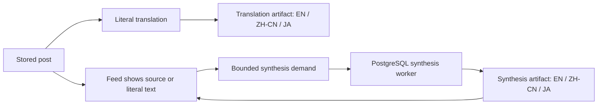

# Post content artifacts and synthesis demand

Post readability and analyst commentary are separate products. Every stored
post can appear in the feed immediately. Literal translation is produced by
the post-fetch pipeline, while richer synthesis is requested only for content
a reader is likely to consume. Both products preserve version, provenance,
usage, failures, and last-good output.

## Data flow



No page request calls a model. A signed-in reader can create shared demand,
poll current status, and continue reading source or literal text while work is
pending or failed.

## Translation storage

`post_translation_artifacts` is the immutable parent lifecycle. Its identity
is:

```text
post_id
+ source_content_fingerprint
+ source_language
+ prompt_version
+ model
+ provider_role
```

`post_translation_texts` contains one child for each of `en`, `zh-cn`, and
`ja`. The source-locale child has `is_source=true`. Exactly one successful
parent per post may have `is_current=true`; failures never replace it.

The writer locks the post and recomputes its source fingerprint immediately
before publication. Output generated for an older body cannot publish after a
post edit. A retry of the same identity advances its attempt count and can
turn the failed lifecycle into a successful, locale-complete artifact.

## Synthesis storage

`post_synthesis_artifacts` owns this identity:

```text
post_id
+ input_context_fingerprint
+ prompt_version
+ model
+ provider_role
+ output_schema_version
```

The context fingerprint covers source text, a stored quote, and a locally
persisted parent when available. `post_synthesis_texts` must contain distinct,
nonblank EN, ZH-CN, and JA children before the parent can become current. The
parent retains evidence provenance, review state, attempts, input/output
tokens, latency, safe error code, and lifecycle timestamps.

A context change cancels obsolete demand. Provider and validation failures
remain auditable on the artifact parent and preserve the last successful
current artifact.

## Durable demand

`post_synthesis_demands` coalesces requests by post, context, prompt, model,
and schema. Reader identity never changes the artifact or demand identity.
Repeated requests increase `request_count`; a stronger reason upgrades the
priority.

| Reason | Priority | Lifetime |
| --- | ---: | --- |
| `lookahead` | 20 | 15 minutes by default |
| `visible` | 50 | 120 minutes by default |
| `expanded` | 80 | 120 minutes by default |
| `operator` | 100 | No automatic expiry |

The worker claims a small batch with `SELECT FOR UPDATE SKIP LOCKED`, commits
the lease, calls the provider outside the transaction, then publishes only if
the lease owner, fence, expiry, and context still match. Expired speculation is
cancelled before transport. Retry exhaustion becomes terminal `failed` state.

`post_synthesis_daily_budgets` reserves the full configured request and token
maximum before transport. A crashed call keeps that conservative reservation.
`post_synthesis_rate_limit_buckets` enforces the authenticated API limit in
PostgreSQL across web processes.

## Browser and agent contract

The endpoint is:

```text
POST /api/v2/post-synthesis-demands/
```

It requires the existing signed-in owner session and Cross-Site Request
Forgery (CSRF) token. The JSON body accepts at most 20 visible post IDs, one of
`visible`, `expanded`, or `lookahead`, and optional `poll_only=true`. Every ID
must already be visible to the same user through the feed authorization path.
Polling reads state without creating demand.

The response returns each requested post's synthesis status and any completed
locale bundle. The browser requests at most 20 visible rows plus 10 lookahead
rows, debounces navigation, stops on terminal state or document hiding, and
polls with bounded exponential backoff.

Agents use the same service contract through the endpoint or Django service.
They can also create operator demand or poll the identical result shape with:

```bash
python manage.py request_post_synthesis POST_ID [POST_ID ...] --json
python manage.py request_post_synthesis POST_ID [POST_ID ...] --poll-only --json
```

Operators can inspect the provider-free state with:

```bash
python manage.py synthesis_status --json
```

The dedicated worker runs:

```bash
python manage.py run_synthesis_worker
```

It holds an environment-specific PostgreSQL coordination lock for its full
lifetime. A second worker or a staging snapshot refresh fails closed on that
same lock. The worker has no Celery broker, scheduler, harvest command, or
TwitterAPI credential.

## Read precedence and rollback

For each locale, the feed reads the best available layer in this order:

1. current normalized synthesis;
2. current normalized literal translation;
3. identified legacy commentary or translation projection;
4. original source text.

Pending, failed, and cancelled synthesis never remove or reorder a feed row.
Disabling synthesis provider calls stops new work while keeping demands,
failures, and successful artifacts. The older application binary can continue
to read `posts.text_en`, `posts.text_zh_cn`, `posts.commentary_en`, and
`posts.commentary_zh_cn` after the additive migration.

For later analysis, separate pre-refactor and post-refactor populations by the
artifact identity and timestamps rather than assuming the compatibility
columns describe one model contract. Historical combined commentary has no
normalized synthesis artifact; new literal and synthesis output carries its
prompt, model, provider role, schema, and completion time explicitly.
