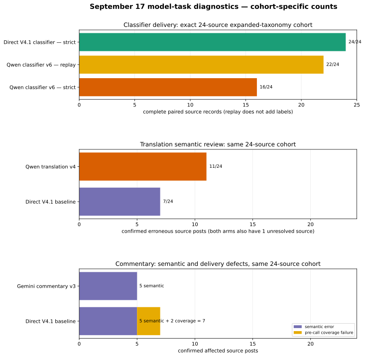

# AI enrichment model, provider, endpoint, and configuration experiment report

> **Living-report snapshot — September 18, 19:30 JST:** Model-route testing is
> complete for the owner's current execution decision. Staging integration and
> end-to-end verification remain.
> This file is the single narrative index for completed classification,
> translation, and commentary experiments in this worktree. Historical results
> remain in place, while the tables near the top summarize current decisions.
> Detailed receipts, raw responses, review ledgers, and superseded drafts remain
> at their original paths and are not moved or rewritten. A prepared contract,
> successful probe, or partial review is not promoted to a completed result.

**Report map:** start with the [current decision dashboard](#current-decision-dashboard),
then use the [historical classifier summary](#historical-classifier-summary-r97r123),
[fresh/cloud 0731 addendum](#addendum-fresh-cohort-comparisons-and-v4-flash-0731-r107r122),
[local Hillary comparison](#supplemental-local-inference-on-hillary-mxfp4-0731),
[September 16–17 language-task evidence](#september-16--translation-role-request-shape-separate-from-classifier),
[September 17 cross-model register](#september-17--model-task-trial-register-historical-r113-snapshot),
and the [latest direct-DeepInfra snapshot](#september-18--direct-deepinfra-follow-ups-and-living-snapshot).

## Owner execution decision — September 18

The owner has locked the next staging implementation to these routes:

- **Classification:** DeepSeek V4 Flash 0731 directly through DeepInfra.
- **Translation:** Gemma 4 31B directly through DeepInfra.
- **Commentary:** Gemma 4 31B directly through DeepInfra.

This is an explicit owner override of the experiment's conservative quality
gates. The owner reviewed the evidence, knows that direct 0731 classification
returned only 25/45 brand rows in the exact R122 replay and that direct Gemma
translation tied V4.1 at the unresolved `[10,11]` boundary, accepts those
limitations, and assumes responsibility for selecting these routes. The
decision does not convert a failed or unresolved experiment into a quality
pass, and it does not change any historical score below. Direct Gemma
commentary independently passed its retained comparison. Runtime activation
still requires implementation, staging tests, and the original plan's release
checks.

## Current decision dashboard

This is the shortest reliable reading of the work so far. It is deliberately
task-specific: a model can qualify for commentary while failing classification
or translation, and a provider-delivery result is not a semantic-quality result.

| Task | Current position | Strongest current evidence | What remains open |
| --- | --- | --- | --- |
| Classification | **Owner-selected execution route: DeepSeek V4 Flash 0731 directly through DeepInfra FP8.** | Historical OpenRouter-pinned 0731 matched 249/358 reviewed fields versus 231/358 for V4.1, but the exact direct R122 replay returned 45/45 content rows and only 25/45 brand rows. | Owner override; direct classification did not pass its experimental gate. Implement the direct route, then verify schema completeness and retry/failure handling in staging. |
| Translation | **Owner-selected execution route: Gemma 4 31B directly through DeepInfra FP4.** | On retained random100, direct Gemma and V4.1 both had conservative `[10,11]` affected-source intervals; Gemma delivered 215/215 provider responses. | Owner override of the unresolved parity boundary. Integrate and run staging translation regressions. |
| Commentary | **Owner-selected execution route: Gemma 4 31B directly through DeepInfra FP4.** | Direct Gemma passed the retained comparison: `[4,5]` affected sources versus V4.1's `[9,10]`, with 100/100 provider responses and 99 application-complete sources. | Integrate and complete staging and regression checks. |

### Model and route coverage at a glance

“Tested” below means at least one inference request reached that named route.
It does not mean the model passed quality or was tested on every task. Detailed
attempt-level results, including blocked and malformed runs, remain in the
chronological sections later in this report.

| Model family / route | Classification | Translation | Commentary | Current interpretation |
| --- | --- | --- | --- | --- |
| DeepSeek V4.1 Flash, direct | Full historical and expanded-taxonomy controls | Random100 incumbent control | Smoke, diagnostic24, old45, and random100 controls | Quality comparator; direct billed price is unavailable in the frozen evidence. |
| DeepSeek V4 Flash 0731, OpenRouter → DeepInfra FP8 | Historical selected cloud classifier; 20-case two-role configuration | Historical/random100 candidate evidence | Historical/random100 candidate evidence | Superseded as the execution route by the owner's direct-DeepInfra choice; retained as historical comparison evidence. |
| DeepSeek V4 Flash 0731, local Hillary MXFP4 | Prior45 and fresh45, 2-case and 20-case runs | Not tested | Not tested | Close to cloud classification scores; no API charge, but slower and not strict-raw compliant. |
| DeepSeek V4 Flash 0731, direct DeepInfra FP8 | Exact R122 replay completed but schema-incomplete; owner selected this route by override | Random100 delivered and reconciled; tied V4.1 at `[10,11]`, not selected | Random100 delivered and reconciled; 14 confirmed affected sources, not selected | Locked for classification by owner decision despite the failed direct replay; not selected for translation or commentary. |
| Gemma 4 31B, OpenRouter → DeepInfra FP4 | Early free-route block only | Diagnostic24, random100, and recovery-aware runs | Not used for the retained commentary comparison | OpenRouter shared-pool overload dominated later delivery; semantic defects remained after retries. |
| Gemma 4 31B, direct DeepInfra FP4 | Three diagnostic24 configurations; not selected | Random100 tied the incumbent interval; owner selected by override | Tagged random100 passed; owner selected | Locked for translation and commentary by owner decision; the translation choice does not retroactively pass the conservative gate. |
| Qwen variants: 3.5 9B, 3.7 Flash, 235B | Multiple blocked, malformed, smoke, and diagnostic runs | Qwen3.7 and Qwen235 multi-profile trials | Qwen3.7 smoke/configuration trials | Cheap routes and structural adaptations did not establish task parity; provider-specific failures must not be generalized to all hosts. |
| Gemini 2.5 Flash-Lite Flex | Smoke8 only; follow-up cancelled unspent | Smoke, diagnostic24, old45, and random100 | Smoke, diagnostic24, old45, and random100 with reasoning-on/off control | Did not qualify. Disabling reasoning cut cost materially but worsened the paired commentary review. |
| Hy-MT2 1.8B, 7B, and 30B | Not tested | Multiple specialist profiles through Tencent FP8 | Not tested | Fast and inexpensive, but repeated meaning and coverage defects prevented parity. |
| GPT-5.6 Luna, OpenAI Flex | Earlier catalog/parameter block only | Smoke, diagnostic24, and old45 | Smoke and diagnostic24 | Useful diagnostic results, but neither task was fully qualified under the retained evidence. |
| Mistral NeMo, Ling 3.0 Flash, GPT-5.6 Sol | Historical classifier-only experiments | Not tested | Not tested | NeMo/Ling were too weak; Sol low improved one axis but was much more expensive and failed the overall gate. |
| GPT-OSS-120B and GPT-5 Nano | Not tested | Not tested | Reserve/research only | No quality claim: endpoint/profile research is not inference evidence. |

### Latest like-for-like comparisons

| Task and cohort | Candidate | Comparator | Result | Decision at this snapshot |
| --- | --- | --- | --- | --- |
| Classification, owner-reviewed fresh45 expanded fields | Cloud 0731 via OpenRouter/DeepInfra: 249/358 (69.6%) | V4.1: 231/358 (64.5%) | Candidate +18 exact fields | Historical selection evidence; 0731 remains selected. |
| Classification, exact R122 direct-route replay | Direct DeepInfra 0731: 45/45 content rows, 25/45 brand rows; 148/358 consumed-control fields | Historical OpenRouter→DeepInfra R122: 249/358 consumed-control fields | One direct 20-row brand response collapsed required fields and was not safely normalizable | Failed experiment gate; direct route selected later by explicit owner override. |
| Classification, expanded diagnostic24 singleton roles | Direct 0731: 100/193 exact reviewed fields (51.8%); 22 error sources | Direct V4.1: 117/193 (60.6%); 20 error sources | Candidate −17 exact fields; one candidate role excluded after an identity mismatch | Direct diagnostic does not equal or beat V4.1; not a reversal of the differently shaped fresh45 selection. |
| Classification, expanded diagnostic24 | Direct Gemma v3: [19,21] confirmed-or-uncertain error sources | Direct V4.1: [18,20] | Intervals overlap, but Gemma has the worse confirmed floor | No classifier parity; 0731 selection unchanged. |
| Translation, retained random100 | Direct Gemma v1: [10,11] affected sources | Direct V4.1: [10,11] | Same paired interval, with different error sets | Experimental boundary unresolved; owner selected Gemma by explicit override. |
| Commentary, retained random100 | Direct Gemma tagged v2: [4,5] affected sources | Direct V4.1: [9,10] | Candidate upper bound below comparator lower bound | Passes R113; owner selected Gemma for staging implementation. |

### Evidence and supersession rules

- Use a final run report or receipt for route, delivery, usage, timing, and cost.
- Use the latest parent reconciliation for semantic counts. Earlier automated or
  independent reviews remain provenance, but their superseded totals are not the
  current comparison.
- Compare models only on the same task, source cohort, supplied context,
  taxonomy, required outputs, and scoring rule. Smoke8, diagnostic24, old45,
  fresh45, prior45, and random100 are not interchangeable.
- Treat missing output, parser rejection, and semantic error as distinct
  failure types. A lower bill caused by missing responses is not a saving.
- Provider, gateway, precision, reasoning mode, prompt profile, batching, and
  concurrency are part of the configuration. Results do not transfer silently
  to another route serving nominally similar weights.
- Agent reviews are not a new human gold set. The report states where the owner
  reference exists and where results are source-grounded automated judgments.

### Cross-cutting findings from the week

| Finding | Evidence across the experiments | Practical consequence |
| --- | --- | --- |
| The route is part of the result. | OpenRouter→DeepInfra, direct DeepInfra, direct DeepSeek, Alibaba, Tencent, Google Flex, OpenAI Flex, GMICloud, OpenInference, and local `llama.cpp` differed in supported parameters, delivery, latency, pricing, or output behavior. | Name model, provider, gateway, precision/tier, and fallback policy together; never carry a score or availability claim to another host silently. |
| Valid structure does not establish correct meaning. | Strict schemas repaired output shape for several candidates while product labels, secondary post types, attribution, translation relations, or grounded commentary remained wrong. Direct Gemma classification delivered 48/48 in every configuration and still failed parity. | Keep transport, parsing, semantic review, and activation as separate gates. |
| Native structured-output modes can be model/route sensitive. | 0731 frequently performed better with fixed-slot plain JSON and bounded local parsing than with native `response_format`; Gemma commentary's strict-schema probe malformed JSON while tagged text completed 99/100 application records. | Test the exact response interface. Prefer the smallest deterministic adapter that preserves labels and exposes every normalization. |
| More reasoning is not automatically better. | Sol xhigh was slower, costlier, and worse than Sol low; 0731 low/high exhausted 6,000-token ceilings without answers; Qwen translation reasoning profiles did not resolve the main defects; Gemini commentary no-reasoning was cheaper but semantically worse. | Treat reasoning mode/budget as a measured configuration, not a quality guarantee or universal default. |
| Batch size and role decomposition change outputs. | DeepSeek and 0731 results moved across 40-, 20-, five-, two-, and singleton-case shapes; three-role and sequential-reviewer variants changed precision, recall, cost, and latency rather than merely transport efficiency. | A batch or role change requires a paired quality run; token fit alone does not establish equivalence. |
| Direct access can fix delivery without fixing the model. | Direct Gemma returned 215/215 translations after OpenRouter shared-pool overload, yet retained semantic defects; direct 0731 delivery likewise needs task-specific review. | Diagnose provider availability separately from model capability and preserve failed-response metadata. |
| Source-first reconciliation is necessary. | Several initial automated reviews missed errors or applied rules asymmetrically. Parent ledgers corrected Gemma, Qwen, Gemini, Luna, 0731, and incumbent counts without rewriting the original reviews. | Headline tables must cite the latest controlling ledger and explicitly label earlier totals superseded. |
| Cost must be quality- and coverage-aware. | Missing responses made some runs look cheaper; reasoning dominated some bills; direct V4.1 lacked a frozen billed price; local inference omitted hardware/energy/operator cost. | Distinguish response receipts, estimates, reservations, unknown failure charges, and total cost of ownership. |

## Historical classifier summary (R97–R123)

The experiments have answered three different questions. First, changing the way the work is divided can improve DeepSeek's classifications: one complete primary call followed by a small, conditional rare-type check was materially better and cheaper than the original two-role design. Second, the very cheap replacement models tested so far do not preserve enough classification quality. Mistral NeMo could be made to return valid rows at roughly the desired price reduction, but it missed too many labels. Ling 3.0 Flash was fast and cheap, but it missed every positive product-feedback label. Third, a frontier model did not provide a broad win: GPT-5.6 Sol at low reasoning slightly raised post-type F1 over the saved DeepSeek primary but lowered product-label agreement, cost 22.68 times as much as off-peak DeepSeek, and took 4.2 times as long. Sol at xhigh reasoning was slower, costlier, and less accurate on this consumed cohort than Sol low.

The best completed architecture tradeoff in the series is R101's single DeepSeek V4.1 Flash primary plus a conditional rare-type specialist. Its 45/45 valid rows reached post-type F1 0.807, but two false opportunity labels remained. Sol low reached the series' highest post-type F1, 0.813, while its product-label F1 fell to 0.622 and false product positives rose to 14; the saved DeepSeek primary had product-label F1 0.645 and took 15.369 seconds rather than Sol low's 65.165 seconds. R99's older two-role run had the highest product-label F1, 0.821, while doing worse on post types and several other axes. None passed all frozen quality gates. “Incumbent” or “control” below means the stored DeepSeek workload used for this experiment's cost and quality comparison; it does not mean the experimental R101 architecture is the current staging or production architecture. No experiment in this report activated a classifier, changed production configuration, wrote database rows, or authorized deployment.

Cost needs careful reading. DeepSeek's saved R101 primary workload costs an estimated $0.00600291 off-peak or $0.01200582 at peak under the September 15 price sheet. NeMo's compact 20-row version cost $0.00052095 and crossed a tenfold ratio only after accepting much worse labels. Its five-row version was a little more accurate but only 8.22 times cheaper than off-peak DeepSeek after OpenRouter's 5.5% credit-purchase fee. The product budget is $150 per month for **all** large-language-model work, including classification, translation, Japanese output, headlines, and other calls. TwitterAPI and hosting are outside that figure. Since frontier coverage is expected to raise post volume two to three times, a cheap classifier alone cannot establish that the whole system fits the budget.

The later local Hillary runs show that the same 0731 release can be run without per-token billing on a self-hosted `ggml-org/DeepSeek-V4-Flash-0731-GGUF MXFP4` artifact through `llama.cpp`. On the fresh 45 cohort, the completed batch-20 local result matched 247/358 reviewed fields (69.0%), close to the cloud DeepInfra FP8 result's 249/358 (69.6%). Local inference was sequential, took 627.2 seconds for 14 successful requests including the recovery tail, and reported zero provider charge; hardware, energy, and operating costs were not measured. The local result therefore adds a deployment option and a useful checkpoint/quantization comparison, but it did not replace the owner-selected cloud route.

All scored R98–R106 comparisons use the same 45 owner-reviewed post-brand rows, ordered as 15 English, 15 Japanese, and 15 Simplified Chinese cases. That review is closed and is the only human review for this cohort. It has been used repeatedly to choose prompts and architectures, so these numbers measure agreement with consumed development evidence, not accuracy on unseen posts. The fresh 45-case packet in `docs/analysis/2026-09-15-121342-u18-fresh-45-review-packet.md` has no owner answers and was deliberately excluded. No new human review gate follows from this report.

## What counts as a test in this report

The evidence falls into four categories, which must not be blended:

1. **Full or bounded inference run:** the named provider returned outputs for the intended cohort or frozen subset, and the deterministic scorer produced eligible metrics where the response contract allowed it.
2. **Diagnostic inference:** a provider was called, but the response failed the batch contract or covered only a diagnostic subset. Individual rows may explain a failure but are not accepted batch output.
3. **Blocked before useful inference:** a route failed catalog, parameter, authentication, transport, or response-shape checks before a valid cohort result existed. This is evidence about compatibility, not semantic quality.
4. **Catalog or price screen only:** public model/endpoint metadata was inspected with zero inference calls. These models are proposals, not tested classifiers.

Missing rows are failures on every exact-match axis. A missing prediction is never credited as a correct empty label set. R104 found that an inherited scorer had inflated exact agreement for missing rows; R104 and R105 recomputed the affected headline values while preserving the frozen raw artifacts. “Individually valid rows” from a rejected batch are reported only as diagnostics. “Strictly accepted rows” means every row in the batch passed the response and semantic contract.

## Common evaluation boundary

Unless a row below says otherwise, the R97–R106 experiments used current-v3 classifications for 45 post-brand pairs and compared six axes:

- outcome (`classified` or `context_missing`);
- the complete multi-label post-type set;
- the complete multi-label product-feedback set;
- sentiment toward the attributed brand;
- China-nationalism value; and
- U.S.-nationalism value.

The owner reference contains 95 post-type assignments. Its rare-type support is small: three events, five opportunities, one job listing, zero personnel changes, and zero positive product `bug` labels. Product-label support includes 13 testimonials, two ideas/requests, one complaint, and one current-v3 `misinformation` label. These counts let the trials find obvious misses, but one or zero positives cannot establish dependable rare-class accuracy. Proposed `news_reporting`, Audience Topics, claim metadata, and the replacement Geopolitical family are later taxonomy work and are absent from all scores here.

The source packets contained public X text plus locally stored context available to the frozen experiment. Owner answers were never sent to providers. R97–R99 included reviewed source affiliations in the two-role packet. R101's single-primary evidence omitted author affiliations; later model substitutions deliberately kept that omission so the model comparison did not silently change its input. No trial browsed links or fetched missing media during inference.

## Experiment sequence at a glance

| Experiment | Question tested | Provider calls | Execution shape | Terminal result |
| --- | --- | ---: | --- | --- |
| R97 | Can three cheaper OpenRouter models replace the same-model two-role classifier? | 10 logical / 12 transports across three models | Content and brand roles parallel within 20/20/5 batches | All failed completeness/transport; no eligible quality result |
| R98 | Does direct DeepSeek work, and can a cost-ordered fallback pass if it does not? | 12 logical / 14 transports | Two roles parallel per 20/20/5 batch; adaptive candidate ladder | DeepSeek completed 45 but failed semantics; four alternatives blocked/failed |
| R99 | Does 40/5 batching reduce calls without truncation or quality loss? | 4 | Two roles parallel per 40/5 batch; 8,000 output cap | Operationally valid and cheaper request ledger; still failed quality |
| R100 | Can a conditional third call recover events, opportunities, jobs, and personnel labels? | 3 new calls over saved R98 output | One specialist call for 23 routed rows in 12/8/3 batches | Recovered 6/7 missing rare labels, added one false opportunity |
| R101 | Can one full primary plus one conditional specialist replace the two-role base? | 6 | Serial primary then conditional call for each 20/20/5 batch | Best completed architecture tradeoff; still failed gates |
| R102 | Can a near-full second pass add eight commonly missed post types? | 1 paid call | First 20-row specialist batch | Response grouped by type instead of row; zero decisions accepted |
| R103 | Does an explicit row schema fix R102, and does the broad second pass help? | 3 | Serial 20/20/1 specialist over 41 primary-classified rows | Valid output; 5 correct and 7 false additions, no exact-set gain |
| R104 | Can NeMo or Ling replace the saved DeepSeek primary with no prompt redesign? | 8 including two smokes | One model at a time; smoke then 20/20/5 full prompt | Both invoked and failed; NeMo invalid, Ling semantically weak |
| R105 | Can bounded prompt/schema/batch/temperature/provider adaptation make NeMo viable? | 21 | Five frozen arms, serial; 20/20/5 or nine batches of five | Validity fixed; every full arm still far below quality requirements |
| R106 | Does GPT-5.6 Sol improve with `xhigh` rather than `low` reasoning? | 6 | Serial interleaving, 20/20/5 per arm, strict JSON Schema | Both valid; low was much better, but both failed quality and cost requirements |
| Local MXFP4 runs | Can the 0731 GGUF run locally, and what changes when the packet is grouped as 2-case versus 20-case batches? | 92 full units in the first run; 12 parent units plus 3 recovery units in the batch-20 run | Blind, sequential `llama.cpp` on Hillary; fixed-slot plain JSON; no provider call | Local output was usable after declared parsing/sentinel handling, but raw fences, empty arrays, and one repeated `null` enum failure remain contract evidence |

## Model outcomes: invoked, blocked, and catalog-only

| Model and provider | Evidence level | What happened |
| --- | --- | --- |
| Direct `deepseek-v4-flash`, response alias `deepseek-flash`, served as DeepSeek V4.1 Flash | Full runs R98–R103; saved control in R104–R106 | Operationally reliable on the tested shapes. Main failure was semantic: incomplete multi-label sets, context handling, and earlier `null`/`none` nationalism behavior. |
| `qwen/qwen3.5-9b` / DeepInfra BF16 | R97 diagnostic inference | First content/brand pair returned malformed JSON; stopped because 45/45 completeness was impossible. |
| `google/gemma-4-31b-it:free` / Google AI Studio | R97 blocked transport | Both roles exhausted one identical transport retry. No quality result. |
| `qwen/qwen3-235b-a22b-2507` / GMICloud FP8 | R97 full transport, ineligible output | Six valid JSON envelopes, but brand role returned only one row per batch. Zero complete role pairs. |
| `qwen/qwen3-30b-a3b-instruct-2507` / StreamLake | R98 diagnostic inference | Invalid content response; no complete rows. |
| `mistralai/mistral-small-3.2-24b-instruct` / Parasail BF16 | R98 blocked transport | Both allowed attempts failed. No semantic evidence. |
| `openai/gpt-5.6-luna` / OpenAI Flex | R98 blocked at catalog/parameter check | Required temperature was unsupported, so zero inference calls. Luna must not be described as a quality failure. |
| `google/gemini-3.8-flash` / Google AI Studio Flex | R98 blocked request | HTTP 400 on the two-role pair. No semantic evidence. |
| `mistralai/mistral-nemo` / DekaLLM FP8 | R104 full-prompt failure; R105 five adaptation arms | Original prompt produced no accepted batches. Compact/schema adaptations restored validity, but quality stayed far below DeepSeek. |
| `mistralai/mistral-nemo` / DeepInfra FP8 | R105 full 45-row adaptation arm | Valid output with worse quality than the compact Deka route. |
| `inclusionai/ling-3.0-flash` / Novita | R104 smoke plus full attempted run | API behavior and speed were workable; one batch failed target-brand identity and the model recovered 0/17 positive product labels. |
| `openai/gpt-5.6-sol` / OpenAI through OpenRouter | R106 two full valid arms | Low slightly exceeded DeepSeek's post-type F1 but regressed product labels and cost/latency. Xhigh used 49,012 reasoning tokens and performed worse overall than low. |
| `dsv4-flash-0731-mxfp4` / `llama.cpp on hillary` | Two blind local 90-case runs | The MXFP4 GGUF returned every intended result after a batch-20 tail recovery; local output had no provider billing but had representation issues and was slower than cloud. |
| Qwen3.5 9B / Darkbloom FP4; Qwen3 32B / DeepInfra; Mercury 2.5 / Inception; DeepSeek V4 Flash 0731 / Baidu and OpenInference | Catalog screen only | Endpoint and price records were captured, but these exact routes were not inference-tested in R97–R106. |
| Qwen3.7 Flash / Alibaba | September 15 price screen only | Estimated 4.29 times cheaper than off-peak DeepSeek before fee at R101's stored token mix; no classifier call. |
| SetFit multilingual trained classifier | Explicitly deferred proposal | Not an OpenRouter candidate and not tested in this series. |

The catalog source was captured at `2026-09-14T08:15:15Z` with 445 models in `docs/research/2026-09-14-171515-openrouter-classifier-model-selection.json`. Exact endpoint snapshots are under `.context/u18/openrouter-model-selection-2026-09-14/`. Catalog availability, advertised discounts, and supported parameters can change and are not substitutes for a completed classification.

## R97: cheaper OpenRouter models with parallel role separation

R97 held the classifier's two-role architecture constant and changed the serving model. The content role owned outcome, post types, and unsanctioned flags; the brand-interpretation role owned product labels, sentiment, and both nationalism axes. For each 20/20/5 batch, the two roles were reserved together and could run concurrently. A row could be published only after both role results joined on `(tweet_id, brand_id)` and passed validation.

All candidates used temperature 0, a 4,096-token output allowance per call, JSON-object mode rather than strict JSON Schema, no semantic repair, no provider fallback, and at most one identical retry for transport failure. OpenRouter routes were pinned to the provider, parameter support, data policy, and maximum price. The shared concurrency ceiling was three transports.

| Candidate | Calls/transports | Contract result | Cost evidence | Timing evidence |
| --- | ---: | --- | ---: | ---: |
| Qwen3.5 9B / DeepInfra BF16 | 2 / 2 | Malformed JSON; 0/45 complete pairs | $0.0026834975 upper bound because malformed-output usage was not retained | No complete batch |
| Gemma 4 31B free / Google AI Studio | 2 / 4 | Transport retry exhausted in both roles | $0 | No complete batch |
| Qwen3 235B A22B / GMICloud FP8 | 6 / 6 | Content rows 19/20, 20/20, 5/5; brand rows 1/20, 1/20, 1/5; 0/45 complete pairs | $0.0068668775 | Six-call batch-pair p95 79.277s; no publishable pair latency |

Settled evaluation-key spend was $0.009550375, below the $0.042190175 frozen ceiling. The result resolved that cheap headline price and valid outer JSON were insufficient for this dense multi-row, two-role contract. Because no candidate reached 45 complete pairs, none was eligible for semantic scoring.

Primary evidence: `docs/analysis/2026-09-14-190649-u18-r97-two-role-pilot-contract.json`, `docs/analysis/2026-09-14-194529-u18-openrouter-two-role-pilot-results.md`, and raw receipts under `.context/u18/openrouter-two-role-pilot-v1/`.

## R98: direct DeepSeek control and adaptive fallback ladder

R98 first ran the production-shaped direct DeepSeek control, then attempted four alternatives in cost order. It kept R97's two-role prompts, 20/20/5 batches, parallel role dispatch, 4,096 output allowance, temperature 0, JSON-object mode, local validation, and no semantic repair. The intended ladder would stop after the cheapest passing candidate was known. Since no candidate passed, every preapproved route reached a terminal record.

| Candidate | Calls/transports | 45-row result | Spend treatment |
| --- | ---: | --- | ---: |
| Direct DeepSeek V4 Flash | 6 / 6 | 45/45 complete; semantic gates failed | $0.03512344 estimated at the frozen peak rates |
| Qwen3 30B / StreamLake | 2 / 2 | Invalid content response; 0/45 | $0.00155216070 settled/billed |
| Mistral Small 3.2 / Parasail | 2 / 4 | Transport failed after retry; 0/45 | $0.00216450000 conservative ledger estimate; not billed by OpenRouter |
| GPT-5.6 Luna / OpenAI Flex | 0 / 0 | Catalog blocked required temperature | $0 |
| Gemini 3.8 Flash / Google AI Studio Flex | 2 / 2 | HTTP 400; 0/45 | $0.00450937500 conservative ledger estimate; not billed by OpenRouter |

DeepSeek's complete-result p95 was 8.793 seconds. It achieved post-type exact agreement 11/45 and micro F1 0.654; product-label exact agreement 37/45 and micro F1 0.769; sentiment 28/45; China and U.S. nationalism 7/45 each; and no exact six-axis rows. It returned `null` for most assessable, non-nationalistic cases where the owner reference used `none`. The composite was 0.485 against a required 0.864.

R98 distinguishes operational success from semantic success: DeepSeek was the only model to return a complete usable response, yet it still failed. It also establishes that Luna has no measured semantic result; the request was prevented before inference by a parameter mismatch.

Primary evidence: `docs/analysis/2026-09-14-213123-u18-r98-control-fallback-pilot-contract.json`, `docs/analysis/2026-09-14-221023-u18-r98-control-fallback-pilot-results.md`, and `.context/u18/openrouter-two-role-pilot-r98-control-fallback-v1/`.

## R99: 40-row DeepSeek batches and a larger output allowance

R99 changed only the two-role batch shape and output allowance: 40/5 instead of 20/20/5, with 8,000 maximum output tokens rather than 4,096. The content and brand calls still ran as a pair for each batch. All four calls completed without retries, truncation, omission, or reasoning tokens. The largest responses used 5,462 and 5,355 tokens, proving that the previous 4,096 application setting was too small for the 40-row shape, not a model output limit.

| Measure | R98 20/20/5 | R99 40/5 | Interpretation |
| --- | ---: | ---: | --- |
| Requests | 6 | 4 | 33.3% fewer |
| Cache-inclusive prompt tokens | 44,789 | 43,559 | Nearly unchanged total workload |
| Output tokens | 12,191 | 12,215 | Nearly unchanged |
| Complete-result p95 | 8.793s | 14.427s | Larger individual batch waited longer |
| Frozen runner estimate | $0.03512344 | $0.02554640 | Lower because of cache/non-cache accounting and fewer envelopes |
| Full-input-rate estimate | $0.03579928 | $0.03528976 | Only 1.4% lower when cache reads are charged like ordinary input |

Quality improved on every measured top-level classification score but remained far below the release requirements. Post-type exact agreement rose from 11/45 to 14/45 and F1 from 0.654 to 0.708. Product exact agreement rose from 37/45 to 38/45 and F1 from 0.769 to 0.821. Sentiment rose from 28/45 to 30/45, China nationalism from 7/45 to 8/45, and U.S. nationalism from 7/45 to 10/45. The composite reached only 0.522.

The detailed error analysis found 57 correct post-type labels, 38 misses, and 9 extras. Precision was 86.4%, while recall was only 60.0%. DeepSeek repeatedly selected salient primary types and omitted compatible secondary types, especially results/evaluations, research/explanations, opinions/reactions, opportunities, and hands-on usage. The 40-row batch did not show a clear late-position collapse. The runtime default remained 20 because an operationally feasible batch change did not solve the semantic problem.

Primary evidence: `docs/analysis/2026-09-15-071753-u18-r99-deepseek-batch-size-pilot-contract.json`, `docs/analysis/2026-09-15-073517-u18-r99-deepseek-batch-size-pilot-results.md`, and `docs/analysis/2026-09-15-094428-u18-deepseek-semantic-failure-and-model-costs.md`.

## R100: conditional third call for rare post types

R100 reused the saved R98 two-role classifications, then bought one additional specialist pass only for rows selected by a broad deterministic screen. The specialist judged events, opportunities, job listings, and personnel changes independently. It could add these types but could not alter any other field. Twenty-three of 45 rows were routed into three serial batches of 12, 8, and 3. Every response was valid; there were no retries.

The specialist recovered all three missing events and three of four missing opportunities. Together with the base labels, rare-type recall rose from 2/9 to 8/9. It also added one unsupported opportunity for a third-party service's ordinary ongoing free access. Opportunity precision and recall were both 4/5. Since the frozen diagnostic required zero false additions, the experiment failed even though the recall gain was real.

Across all post types, exact agreement moved from 11/45 to 14/45 and F1 from 0.654 to 0.700. Other axes stayed exactly as in R98. The three new calls used 14,521 non-cache input tokens, 768 cache-read tokens, and 2,635 output tokens. The current peak-rate incremental estimate was $0.007522908; the consistent older conservative estimate was $0.01020536, taking base plus specialist to $0.04600464, a 28.5% increase. Measured added latencies were 4.268, 4.121, and 2.492 seconds. Because the base answers were saved and reused, R100 does not contain a measured full end-to-end wall time.

The official DeepSeek price page observed during R100 stated that legacy request alias `deepseek-v4-flash` was served by DeepSeek V4.1 Flash and returned response alias `deepseek-flash`. This mixed-time add-on cannot separate its narrower prompt effect from a possible model checkpoint change behind the legacy alias.

Primary evidence: `docs/analysis/2026-09-15-103348-u18-r100-conditional-rare-type-contract.json`, `docs/analysis/2026-09-15-104335-u18-r100-conditional-rare-type-results.md`, and `.context/u18/conditional-rare-type-pilot-r100-v1/`.

## R101: one primary plus a conditional specialist

R101 replaced the two simultaneous primary roles with one complete current-v3 primary call per batch. After each primary result, a conditional rare-type specialist received only screened rows. The six calls ran serially in primary/follow-up order for the 20/20/5 source batches. Twenty-one of 45 rows reached the specialist. Both stages used a 6,000-token allowance, temperature 0, reasoning disabled, no retry, a 90-second timeout, and direct DeepSeek's Anthropic-compatible endpoint.

| Measure | R98 + R100 two-role base plus specialist | R101 one primary plus specialist |
| --- | ---: | ---: |
| Calls | 9 | 6 |
| Routed rows | 23 | 21 |
| Post-type exact | 31.1% | 48.9% |
| Post-type F1 | 0.700 | 0.807 |
| Product exact | 82.2% | 75.6% |
| Sentiment | 62.2% | 66.7% |
| China nationalism | 15.6% | 84.4% |
| U.S. nationalism | 15.6% | 91.1% |
| Conservative 45-row token cost | $0.04600464 | $0.02705736 |

The R101 primary alone reached post-type exact 20/45 and F1 0.789. The specialist raised exact agreement to 22/45 and F1 to 0.807. It recovered two events and two opportunities, but made two unsupported opportunity additions and could not recover a Hunyuan case the primary marked `context_missing`. Product-label exact agreement remained 34/45 and product F1 remained 0.645 because the follow-up did not own that axis.

R101 used 33,322 non-cache input tokens, 6,272 cache-read tokens, and 7,300 output tokens across both stages. The six request durations sum to 24.405 seconds. Its current off-peak estimate was $0.009397116 for the full architecture, or $0.2088 per 1,000 posts at this unusually selected corpus mix. The saved primary alone used 20,621 non-cache input, 5,120 cache-read input, and 4,824 output tokens; it took 15.369 seconds and is the control reused by R104–R106.

R101 resolved the main architecture choice: one complete primary plus a bounded conditional rare-type follow-up was better than two primary roles plus a third call, and a routine full reviewer was not justified. It still failed outcome, post-type, sentiment, and composite gates and therefore was not activated.

Primary evidence: `docs/analysis/2026-09-15-110900-u18-r101-single-primary-conditional-contract.json`, `docs/analysis/2026-09-15-111545-u18-r101-single-primary-conditional-results.md`, and `.context/u18/single-primary-conditional-pilot-r101-v1/`.

## R102 and R103: near-full second pass

R102 attempted to send all 41 R101-primary rows marked `classified` through a specialist covering eight types: results/evaluations, research/explanations, hands-on usage, opinions/reactions, jobs, personnel, events, and opportunities. It was additions-only and required exact source evidence for a true addition. The first paid 20-row call returned output grouped by type instead of the required row-oriented contract. Validation raised `ValueError`; zero decisions were merged, and the run stopped. This is a response-shape failure, not evidence that the proposed labels were right or wrong.

R103 froze a new experiment with an explicit row-oriented example and raw-response retention before validation. Three serial calls processed 20, 20, and 1 rows, all valid. They used 17,615 non-cache input tokens, 1,280 cache-read tokens, and 7,564 output tokens, with 11.536, 11.140, and 1.333 second latencies. Marginal cost was estimated as $0.01829828 under the conservative rate model or $0.00718449 at current off-peak rates.

The valid specialist recovered five missing reference labels but added seven unsupported labels. Post-type exact agreement stayed 20/45 because gains and regressions occurred on different rows. The repeated false `results_evaluations` and `opportunities` additions showed that a narrower output surface and a near-full second pass did not fix model boundary errors. A broad routine second pass was rejected.

Primary evidence: `docs/analysis/2026-09-15-121500-u18-r102-secondary-type-coverage-contract.json`, `.context/u18/secondary-type-coverage-pilot-r102-v1/result.json`, `docs/analysis/2026-09-15-121500-u18-r103-secondary-type-coverage-contract.json`, and `docs/analysis/2026-09-15-121500-u18-r103-secondary-type-coverage-results.md`.

## R104: unchanged full-prompt low-cost model swap

R104 held the saved R101 primary workload constant: the same 45 ordered packets, 13,944-character prompt, current-v3 schema, 20/20/5 batches, temperature 0, and 6,000 output-token allowance. Each alternative received a small route/JSON smoke and then three benchmark calls. The candidates ran one at a time with a 180-second timeout. There were no retries, repairs, provider fallbacks, conditional calls, or database/runtime changes.

Mistral NeMo on DekaLLM returned no strictly accepted batch. Its first batch had 18/20 rows and numerous illegal values; its second hit the 6,000-token cap with unfinished JSON and missing identifiers; only one row in the final batch was individually valid. Three of 45 rows were individually valid across the rejected batches, but zero rows were accepted. Summed inference time was 267.959 seconds and benchmark cost was $0.00081478.

Ling 3.0 Flash on Novita returned complete JSON, but one 20-row batch used brand `qwen` for a requested `minimax` row, so only two batches and 25/45 rows were strictly accepted. Forty-four rows were individually valid for diagnosis. Ling produced two testimonials, both false positives, and recovered none of the 17 positive product-label assignments. It found 0/3 events, 1/16 results/evaluations, 3/5 opportunities, and the sole job listing. The public R104 artifact's post-type F1 0.564, product-label F1 0.000, post exact 10/45, and product exact 25/45 are **individual-row diagnostic metrics** over the 44 independently valid rows, with the one invalid row counted wrong. They are not strict accepted-batch scores: the other 19 rows in the rejected batch cannot be credited as published output. Summed inference time was 18.768 seconds and benchmark cost was $0.00085355.

All eight R104 calls, including the two smokes, cost $0.0016699134; the settled OpenRouter key delta agreed within rounding. At the observed promotional rates, attempted NeMo and Ling rows were 7.37 and 7.03 times cheaper than off-peak DeepSeek before the OpenRouter fee, but those ratios did not represent equivalent usable output. Ling's cost per strictly accepted row was only 3.91 times cheaper than off-peak DeepSeek. Its displayed Novita price included a 65% promotion; at regular rates the same tokens would have cost about $0.00243872 before fees.

R104 rejected an unchanged-prompt model swap. It did not prove that NeMo or Ling could never work with a task-specific prompt. That distinction led directly to R105's bounded NeMo adaptation.

Primary evidence: `docs/analysis/2026-09-15-124808-u18-r104-low-cost-primary-contract.json`, `docs/analysis/2026-09-15-124808-u18-r104-low-cost-primary-results.md`, and `.context/u18/low-cost-single-primary-r104-v1/`.

## R105: five NeMo adaptation arms

R105 tested whether the DeepSeek-developed request, rather than NeMo's underlying ability, caused R104's failure. No weights were trained or changed. The experiment varied response schema, prompt/identifier compactness, batch size, temperature, and provider route. Every arm was serial, used no retry or repair, and scored missing/rejected rows as wrong.

| Arm | Exact change from its comparison | Accepted rows | Post-type F1 | Product F1 | Serial time | Billed inference cost |
| --- | --- | ---: | ---: | ---: | ---: | ---: |
| Original R104 NeMo | Full prompt, JSON mode, Deka, 20/20/5 | 0/45 | Ineligible | Ineligible | 268.0s | $0.00081478 |
| `schema_20` | Full prompt; strict JSON Schema only | 5/45 | 0.040 | 0.000 | 136.9s | $0.00073126 |
| `compact_20` | 7,667-character compact prompt, short IDs, one row object; Deka 20/20/5 | 45/45 | 0.382 | 0.182 | 72.3s | $0.00052095 |
| `compact_5` | Same compact design; nine five-row batches; 1,800 output cap | 45/45 | 0.420 | 0.261 | 91.5s | $0.00069237 |
| `temperature_03` | Compact 20/20/5; temperature 0.3 | 45/45 | 0.364 | 0.100 | 108.1s | $0.00052038 |
| `deepinfra_20` | Compact 20/20/5; DeepInfra FP8 instead of Deka FP8 | 45/45 | 0.305 | 0.000 | 75.8s | $0.00054348 |

The compact bundle shortened instructions by 45% and changed identifiers/output representation together, so its improvement cannot be attributed to only one of those changes. Deterministic reconstruction restored original row and brand identifiers only; it never filled missing labels or scalar values. Strict JSON Schema controlled keys, enums, and basic shape, while local validation still enforced cross-field meaning such as exclusive `other` and empty arrays for `context_missing`.

All four compact variants reached 45 accepted rows. That resolved the output-validity problem but not the classifier-quality problem. The strongest arm, `compact_5`, found only 3/17 expected positive product labels, missed all three events and the sole job listing, recovered 1/14 research/explanation labels, and returned `context_missing` for 12 owner-classifiable rows. Temperature 0.3, recommended by the model card, did worse than temperature 0 on this task. The DeepInfra route also did worse than Deka. Failures appeared in English, Japanese, and Chinese.

The singleton diagnostic was conditional on an invalid five-row batch. Since all nine `compact_5` batches were valid, it was correctly skipped. Single-row semantic performance remains unmeasured; the skip is not a sixth passing adaptation.

R105 spent exactly $0.003008445 over 21 attempted calls, matching settled key usage. After a 5.5% OpenRouter fee, `compact_20` was 10.92 times cheaper than off-peak DeepSeek and 21.84 times cheaper than peak. `compact_5` was 8.22 times cheaper off-peak and 16.44 times cheaper at peak. The first arm crossed the requested tenfold price ratio but did so with post-type F1 0.382 and product-label F1 0.182. The second recovered slightly more labels but missed the off-peak tenfold target. Neither is a replacement.

Primary evidence: `docs/analysis/2026-09-15-132232-u18-r105-nemo-adaptation-contract.json`, `docs/analysis/2026-09-15-132232-u18-r105-nemo-adaptation-results.md`, exact compact instructions at `docs/analysis/2026-09-15-132232-u18-r105-nemo-adaptation-compact-prompt.txt`, and `.context/u18/nemo-adaptation-r105-v1/`.

## R106: GPT-5.6 Sol reasoning effort

R106 is a frontier-capability comparison, not a low-cost replacement claim. It held the saved R101 primary input and 13,944-character full prompt constant and changed only `reasoning.effort`: `low` versus `xhigh`. Each arm used 20/20/5 batches. The six calls ran serially in an interleaved order (`low_0`, `xhigh_0`, `xhigh_1`, `low_1`, `low_2`, `xhigh_2`) to reduce simple time-order bias.

The request was adapted for the OpenAI route: strict JSON Schema, no temperature or top-p, no tools, and a 28,000-token completion cap that included hidden reasoning plus final output. The runner reports reasoning separately without charging it a second time because provider completion cost already includes it. Timeout was 300 seconds, concurrency one, with no retries, repair, or fallback. All six responses and all 45 rows in both arms passed strict validation.

OpenRouter's endpoint receipt at freeze time listed `openai/gpt-5.6-sol` through OpenAI, response alias `openai/gpt-5.6-sol-20260709`, at $2 per million input, $10 per million output, $0.20 per million cache-read input, and $2.50 per million cache write. Those were advertised as 50% off the regular $4/$20 input/output price. The reserved maximum was $2.434449425 including the assumed 5.5% credit-purchase fee, under a $2.50 hard cap.

| Configuration | Valid rows | Post F1 | Product F1 | Exact all six axes | Serial time | Returned charge |
| --- | ---: | ---: | ---: | ---: | ---: | ---: |
| Saved DeepSeek primary | 45/45 | 0.789 | 0.645 | 13/45 | 15.369s | $0.00600291 off-peak estimate |
| Sol low | 45/45 | **0.813** | 0.622 | 9/45 | 65.165s | $0.136168 |
| Sol xhigh | 45/45 | 0.735 | 0.571 | 4/45 | 688.894s | $0.609898 |

Low reasoning recovered 76 of 95 reference post-type assignments, with 16 extras and 19 misses. Xhigh recovered 79, but produced 41 extras and missed 16; its additional recall was overwhelmed by false positives. Xhigh fixed none of low's exact post-type rows and regressed ten. On product labels both arms recovered 14 of 17 positives. Low added 14 false positives and xhigh added 18, so both had lower product-label F1 than DeepSeek despite recovering more positives. Low found all three events, four of five opportunities, and the one job listing. Xhigh found all three events, three opportunities, and missed the job. Zero personnel positives and zero bug positives still prevent sensitivity claims for those classes; both Sol arms emitted one unsupported bug label.

Exact-axis agreement confirms that low's post-type gain was not a broad quality gain. Against DeepSeek's outcome/post/product/sentiment/China/U.S. counts of 42/20/34/30/38/41, Sol low scored 42/21/30/27/39/42 and xhigh scored 42/11/28/22/37/39. Low improved post exactness by one row and each nationalism axis by one, while regressing product exactness by four, sentiment by three, and complete all-axis rows from 13 to 9.

Low used 28,825 input tokens, zero cache reads, 28,816 cache-write tokens, 6,411 total completion tokens, and 1,793 reasoning tokens. Xhigh used exactly the same input, cache-read, and cache-write counts but 53,784 completion tokens, including 49,012 reasoning tokens. The entire $0.473730 returned-charge increase from low to xhigh came from 47,373 additional completion tokens: 47,219 extra reasoning tokens and 154 extra other completion tokens. R106's six returned charges totaled **$0.746066**, or $0.787099630 under the 5.5% fee sensitivity. Low alone was 22.68 times **more expensive** than the off-peak DeepSeek primary and 11.34 times more expensive than peak; xhigh was 101.60 and 50.80 times more expensive than those controls. At the route's undiscounted normal price, the same-cache estimates were $0.272336 for low and $1.219796 for xhigh.

The quality gates stayed separate from the saved DeepSeek-primary comparison. They use R98's own frozen composite baseline. Low's composite was 0.744 versus the required 0.864, with 0/6 axis-regression checks and 7/15 measured per-label checks passing. Xhigh's composite was 0.663, with 0/6 and 5/15. Both failed every overall release decision despite valid output.

The literal axis-gate counts include a sub-millionth rounding artifact inherited from R98's six-decimal baseline rates. Sol low's outcome and U.S.-nationalism values are both 42/45, or 0.933333333, against a literal minimum of 0.933333778; its China-nationalism value is 39/45, or 0.866666667, against 0.866666778. Sol xhigh has the same borderline outcome comparison. The frozen scorer therefore records those four checks as failures even though each gap is less than 0.000001 and represents the same whole-case boundary implied by the rounded baseline. This report preserves the literal 0/6 gate output rather than rewriting frozen evidence. Treat three low-effort axis failures and one xhigh axis failure as rounding-sensitive; the material post-type, product-label, sentiment, per-label, and composite failures remain, so no overall decision changes.

The experiment resolved that xhigh reasoning is not automatically better for this dense classification prompt. On this consumed cohort it was 10.6 times slower and 4.48 times as expensive as low, and it produced more false positives with lower agreement across every top-level quality summary. Low showed a small post-type F1 gain over DeepSeek but not a broad quality improvement, a cost saving, or evidence for the $150 monthly budget.

Billing reconciliation is final: the cumulative OpenRouter key delta is $0.746066000 and exactly matches the six returned charges, including the last call's $0.135541.

Primary evidence: `docs/analysis/2026-09-15-134818-u18-r106-sol-reasoning-contract.json`, `docs/analysis/2026-09-15-134818-u18-r106-sol-reasoning-results.md`, `docs/analysis/2026-09-15-134818-u18-r106-sol-reasoning-results.json`; runner: `scripts/u18_sol_reasoning_pilot.py`; private run directory: `.context/u18/sol-reasoning-r106-v1/`.

## Comparable quality table through R106

The table uses the corrected “missing row is wrong” method. A dash means the output was ineligible or that the experiment did not change/report that axis; it does not mean zero errors.

| Candidate or selected architecture | Accepted rows | Outcome | Post exact | Post F1 | Product exact | Product F1 | Sentiment | China | U.S. |
| --- | ---: | ---: | ---: | ---: | ---: | ---: | ---: | ---: | ---: |
| DeepSeek R98 two-role | 45 | 41/45 | 11/45 | 0.654 | 37/45 | 0.769 | 28/45 | 7/45 | 7/45 |
| DeepSeek R99 two-role, batch 40 | 45 | 41/45 | 14/45 | 0.708 | 38/45 | 0.821 | 30/45 | 8/45 | 10/45 |
| DeepSeek R100 merged third call | 45 | 41/45 | 14/45 | 0.700 | 37/45 | 0.769 | 28/45 | 7/45 | 7/45 |
| DeepSeek R101 primary only | 45 | 42/45 | 20/45 | 0.789 | 34/45 | 0.645 | 30/45 | 38/45 | 41/45 |
| DeepSeek R101 primary + conditional | 45 | 42/45 | 22/45 | 0.807 | 34/45 | 0.645 | 30/45 | 38/45 | 41/45 |
| DeepSeek R103 primary + broad additions | 45 | 42/45 | 20/45 | 0.791 | 34/45 | 0.645 | 30/45 | 38/45 | 41/45 |
| Ling R104 individual-row diagnostic, ineligible | 25 strict / 44 diagnostic | — | 10/45 diag | 0.564 diag | 25/45 diag | 0.000 diag | 24/45 diag | 5/45 diag | 4/45 diag |
| NeMo R105 `compact_20` | 45 | 33/45 | 6/45 | 0.382 | 27/45 | 0.182 | 19/45 | 4/45 | 5/45 |
| NeMo R105 `compact_5` | 45 | 30/45 | 6/45 | 0.420 | 28/45 | 0.261 | 18/45 | 10/45 | 11/45 |
| NeMo R105 temperature 0.3 | 45 | 33/45 | 6/45 | 0.364 | 27/45 | 0.100 | 20/45 | 5/45 | 5/45 |
| NeMo R105 DeepInfra | 45 | 29/45 | 4/45 | 0.305 | 26/45 | 0.000 | 13/45 | 4/45 | 5/45 |
| Sol R106 low | 45 | 42/45 | 21/45 | 0.813 | 30/45 | 0.622 | 27/45 | 39/45 | 42/45 |
| Sol R106 xhigh | 45 | 42/45 | 11/45 | 0.735 | 28/45 | 0.571 | 22/45 | 37/45 | 39/45 |

Product-label exactness can look acceptable when a model predicts an empty set because many owner-reference rows also have no product label. Product-label F1 reveals whether positive signals are actually recovered. Ling's 25/45 product exact count coexists with 0.000 positive-label F1; the same caution applies to NeMo's 27–28 exact empty-heavy rows.

Ling's diagnostic row is present to explain its semantic failure, not to rank it as a 45-row accepted classifier. Strict validation accepted only 25 rows. R104 did not publish an alternate 25-row-only quality score, and this report does not convert the 44 individually parseable rows into accepted output.

R103's public JSON contains one inconsistent redundant summary: `.scores.primary.dimension_matches.post_types` is 18 and `.scores.merged.dimension_matches.post_types` is 10, while the same file's exact-set quality fields, frozen gate, language slices, the public Markdown result, and the R105 corrected shared baseline support 20/45 before and after. This report uses 20/45, the value actually consumed by the gate and published result, and does not silently treat the inconsistent redundant counts as a second result.

## Language slices, including Japanese

Each language has only 15 fixed rows, with different label composition. These slices reveal failures on the test cases; they do not prove that one language is intrinsically easier or that the same ranking will hold in production.

| Configuration / language | Post exact | Post F1 | Product exact | Product F1 | Sentiment exact |
| --- | ---: | ---: | ---: | ---: | ---: |
| R101 primary + conditional / EN | 8/15 | — | 11/15 | — | 10/15 |
| R101 primary + conditional / JA | 7/15 | — | 13/15 | — | 12/15 |
| R101 primary + conditional / ZH-CN | 7/15 | — | 10/15 | — | 8/15 |
| NeMo `compact_5` / EN | 2/15 | 0.408 | 9/15 | 0.000 | 6/15 |
| NeMo `compact_5` / JA | 2/15 | 0.490 | 10/15 | 0.444 | 7/15 |
| NeMo `compact_5` / ZH-CN | 2/15 | 0.356 | 9/15 | 0.250 | 5/15 |
| Sol low / EN | 5/15 | 0.750 | 12/15 | 0.727 | 10/15 |
| Sol low / JA | 10/15 | **0.903** | 10/15 | 0.625 | 8/15 |
| Sol low / ZH-CN | 6/15 | 0.787 | 8/15 | 0.556 | 9/15 |
| Sol xhigh / EN | 3/15 | 0.686 | 10/15 | 0.571 | 8/15 |
| Sol xhigh / JA | 5/15 | 0.811 | 9/15 | 0.556 | 6/15 |
| Sol xhigh / ZH-CN | 3/15 | 0.704 | 9/15 | 0.588 | 8/15 |

Japanese was not the weak point for Sol low: its 0.903 post-type F1 and 10/15 exact post-type sets were the strongest Sol-low language slice. Xhigh reduced Japanese exact post-type sets to 5/15 while adding many labels. NeMo's Japanese scores were its best of the three `compact_5` slices, but 2/15 exact post-type sets and product F1 0.444 remained far below a usable result. R101's conditional pass improved EN and ZH-CN post exactness by one row each but reduced complete all-axis Japanese rows from six to five after a false addition; its unchanged product and sentiment axes remained strongest on the Japanese slice.

## Cost and execution comparison

Dollar figures below retain their original basis. “Billed” comes from OpenRouter returned cost/key reconciliation. “Estimate” reprices token usage or uses a conservative reservation ledger. They should not be added as if they were one invoice.

| Experiment/workload | Calls | Execution time evidence | Cost evidence | Important sensitivity |
| --- | ---: | --- | ---: | --- |
| R97 all candidates | 10 logical / 12 transports | Qwen235 pair p95 79.277s; other complete timing unavailable | $0.009550375 settled key delta | Qwen235 had 75% catalog discount; free Gemma still failed transport |
| R98 DeepSeek control | 6 | Role pairs parallel; complete-result p95 8.793s | $0.03512344 estimated at frozen old peak rates | Cache/off-peak could reduce direct cost |
| R99 DeepSeek 40/5 | 4 | Role pairs parallel; about 17s full run; pair p95 14.427s | $0.02554640 runner estimate; $0.03528976 full-input conservative | Fewer envelopes, nearly same total tokens; cache treatment drives apparent saving |
| R100 specialist only | 3 | 10.881s summed incremental; no end-to-end base rerun | $0.007522908 current peak estimate; $0.01020536 old conservative | Uses saved base; per-1,000 projection depends on 51.1% routing rate |
| R101 primary + conditional | 6 | 24.405s summed serial | $0.02705736 old conservative; $0.009397116 current off-peak | Primary-only control is cheaper/faster; routing mix may change in production |
| R101 primary only | 3 | 15.369s summed serial | $0.00600291 off-peak / $0.01200582 peak estimate | Uses observed DeepSeek cache reads |
| R103 broad specialist only | 3 | 24.009s summed serial | $0.01829828 conservative / $0.00718449 off-peak estimate | Adds cost without exact-set gain |
| R104 NeMo benchmark | 3 + smoke | 267.959s | $0.00081478 benchmark; smoke $0.000000486 | No accepted batch, so usable-output cost undefined |
| R104 Ling benchmark | 3 + smoke | 18.768s | $0.00085355 benchmark; smoke $0.000001092 | 65% promotional price; only 25 strict rows |
| R105 all NeMo arms | 21 | One at a time; arm totals 72.3–136.9s for adapted full runs | $0.003008445 billed and reconciled | 5.5% credit fee lowers savings ratio; cheaper output partly reflects missed labels |
| R106 Sol | 6 | Low 65.165s; xhigh 688.894s, serial | $0.746066 returned charges and reconciled key delta; $0.787099630 with fee sensitivity | Equal input/cache treatment isolates observed cost increase to completion volume; 50% discount and regular-price sensitivity remain |

DeepSeek pricing changed during the experiment sequence. R98/R99 froze the then-current $0.44 input and $1.32 output per million conservative rate. By September 15, the official sheet listed off-peak $0.15 uncached input, $0.003 cache-read input, and $0.60 output, with peak prices twice those values. Comparisons to the tenfold goal therefore reprice the same saved R101 primary usage at both current off-peak and peak prices instead of comparing an alternative's current discount with DeepSeek's obsolete ceiling.

OpenRouter's returned inference cost does not include the separate credit-purchase fee. Reports use a 5.5% fee sensitivity when requested; the actual effective fee can depend on how credits are bought. Promotions are treated as temporary unless an expiry or durable contract is established. NeMo's Deka and DeepInfra prices were not promotional in the captured endpoint records; Ling's Novita route was advertised 65% off; Qwen235 was 75% off; R106 Sol was advertised 50% off. Regular-price comparisons remain projections, not actual charges.

## Architecture findings

### Parallel role split did not protect completeness

R97–R99 divided the output into two concurrent calls to reduce field competition and wall time. This helped bound latency when both calls worked, but it doubled the number of required batch responses and made atomic publication depend on complete output from both roles. Qwen235's content role was nearly complete while its brand role collapsed to one row per batch, yielding zero publishable pairs. Direct DeepSeek completed the split but still treated multi-label classification like primary-category selection.

### Larger batches reduced requests, not semantic workload

R99 cut six calls to four. Prompt-plus-output token volume barely changed, so the full-input conservative cost changed only 1.4%. Latency per large batch increased 64.1%. Semantic scores improved slightly, but the same label boundaries failed. Batch tuning is an operational choice after semantics work, not the semantic remedy.

### A conditional rare specialist helped more than a broad second pass

R100 and R101 showed that a focused specialist could recover events and opportunities. R101's single-primary design reduced calls and fixed much of the `null`/`none` nationalism mismatch while improving post-type F1. R103's eight-type near-full pass added more false labels than correct labels and produced no exact-set gain. The evidence favors bounded conditional routing with explicit predicates over a routine second classifier pass across most rows.

### Strict schema solved shape, not meaning

R102 failed because the prompt did not pin a row-oriented shape. R103 fixed that contract and returned complete rows, but label boundaries still failed. R105 likewise showed that strict JSON Schema plus compact rows could turn NeMo from zero accepted batches to 45/45 accepted rows. Post-type and product-label F1 remained poor. Transport validity and semantic quality are separate gates.

### Small batches helped NeMo a little at extra cost and time

NeMo's nine five-row batches improved post-type F1 from 0.382 to 0.420 and product-label F1 from 0.182 to 0.261. Serial time rose from 72.3 to 91.5 seconds and the after-fee off-peak cost advantage fell from 10.92x to 8.22x. This is a modest adaptation gain, not evidence for singleton execution or replacement.

### Reasoning effort is isolated only in R106

Earlier runs disabled or omitted reasoning. R106 is the first trial in this sequence to compare low and xhigh reasoning on the same frontier model while keeping prompt, packet, schema, batch size, and route fixed. Its interleaved serial order helps reduce a simple provider-time confound, but one run per arm still cannot estimate provider latency variance. Xhigh was decisively worse on the measured run: 10.6 times slower, 4.48 times the returned cost, and lower on both label F1 scores and every exact-axis total except tied outcome.

## Earlier architecture lineage before R97

R97 did not begin from a blank design. The earlier development series used DeepSeek Flash repeatedly and explains why the later work focused on model alternatives and smaller, conditional calls:

- v18's three-pass, language-specific selector produced 76/120 exact post-type sets (63.3%) with post-type micro F1 0.868. Its 65 label errors were balanced between 32 extras and 33 misses, so neither an additions-only nor deletion-only repair could solve it.
- v19 reduced English batches to five rows. All 30 rows completed, but post-type exactness fell to 56.7%; product exactness was 90%, outcome 100%, and sentiment 90%.
- v20 used one row per call. It completed 30 base calls plus one ordinary fallback, then scored 40.0% post-type exact, 80.0% product exact, and 96.7% outcome. This rejected batch size as the core semantic cause.
- v21 decomposed eight common types into three evidence-bound groups. One missing required null made the response formally invalid. Provider-free diagnostic normalization reached only 33.3% post-type exactness.
- v22 and v22b proposed direct Claude Haiku 4.5 review with the same 30 English rows. Both local credential slots returned HTTP 401 on every permitted attempt, so there were zero successful calls and no quality score. The owner later cancelled Anthropic as an active provider path. These are authentication dead ends, not Haiku semantic failures.
- A saved MiniMax reviewer output was rejected as a drop-in classifier diagnostic; it was not a newly billed full model comparison.
- v23 changed to one full DeepSeek primary plus a candidate-aware, reviewer-authoritative completeness review. It completed 26 paid calls over 120 rows (six primary, twelve review, eight repair), using 130,406 input and 24,725 output tokens. Eight internally inconsistent redundant metadata fields blocked candidate assembly, so no quality decision was produced.
- v24 and v25 replayed the same saved responses with zero provider calls after parser/selector corrections. v25 completed 120 rows but scored 52.5% post-type exact, 82.5% product exact, and 95.8% outcome. Its reviewer improved one exact post-type row and regressed two.
- v26 required exhaustive boolean verdict maps in the reviewer. It completed 26 DeepSeek calls and 120 rows for about $0.0761, but scored 50.8% post-type exact, 83.3% product exact, and 93.3% outcome. This stopped further full DeepSeek Flash prompt-topology tuning.
- An owner-run Grok 4.6 independent audit covered 45 cases outside the automated provider harness. Cost and provider usage are unknown. Against the then-model-generated reference, it reached 31.1% exact outcome-plus-post-type, post-type F1 73.2%, product exact 68.9%, and product F1 57.9%. It exposed reference ambiguity but was not human gold and did not select a candidate.
- v27 used DeepSeek V4 Pro as a reviewer for 30 owner-selected hard cases. Six logical calls and seven transports cost about $0.082 under frozen rates. A zero-transport parser replay produced 19/30 post-type exact, 23/30 product exact, and 29/30 outcome. It failed the first two diagnostic floors.

This lineage is summarized from `docs/plans/2026-09-08-134925-feat-ai-enrichment-stage1-plan.md`, `docs/analysis/2026-09-12-012550-u18-classifier-architecture-reconsideration.md`, `docs/analysis/2026-09-12-022841-u18-v25-classification-quality-assessment.md`, `docs/analysis/2026-09-12-024922-u18-v26-classification-quality-assessment.md`, `docs/analysis/2026-09-12-125824-u18-grok-independent-model-audit.md`, and `docs/analysis/2026-09-13-232100-u18-v27-evidence-reuse-failure-replay.md`. Budget or replay files are distinguished from paid inference; v24/v25 and the final v27 parser correction made zero new provider calls.

## Budget implications

The owner's desired classifier economics are approximately ten times less per inference than the DeepSeek incumbent while preserving useful quality. Coverage expansion is expected to multiply classified volume two to three times, and richer Japanese and later taxonomy output may increase tokens per post. The $150 monthly ceiling covers the entire LLM system rather than this classifier alone.

The completed evidence gives three practical constraints:

1. A raw token-price ratio is insufficient. NeMo `compact_20` crossed the off-peak tenfold threshold after fee, but its label quality was not close. Ling and original NeMo had failed batches, so attempted-row cost overstated their economic value.
2. Cache and time-of-day materially affect the control. The saved DeepSeek primary uses 5,120 cache-read tokens. Current peak rates are twice off-peak, while OpenRouter candidates may have discounts or no assumed cache benefit. Every comparison should show both peak and off-peak control prices.
3. Added calls consume the savings. R101's conditional specialist improved rare-label recall but raised primary-only serial time from 15.369 to 24.405 seconds and current off-peak cost from $0.00600291 to $0.009397116 for these 45 rows. The route fraction in a normal population must be measured before monthly forecasting.

The price screen in `docs/analysis/2026-09-15-121607-u18-llm-only-budget-price-screen.md` illustrates the whole-budget arithmetic. A tenfold price reduction can absorb three times the posts and two to three times the tokens per post within a $150 starting envelope; a threefold reduction cannot. That is an illustration, not a forecast, because current spend by classifier, translator, headline worker, and other roles has not been measured in this report.

## What the experiments resolved

- Direct DeepSeek is operationally dependable on the tested current-v3 request shapes, but the original parallel role split and broad reviewer designs do not meet the frozen semantic gates.
- The prior 4,096 output allowance was an application setting. A 40-row DeepSeek call can require more than 5,000 output tokens and complete under an 8,000 cap.
- DeepSeek's major current-v3 failure is incomplete overlapping post-type recall, not malformed output. It also had a contract-level `null` versus `none` nationalism problem in the earlier two-role prompt.
- One full primary plus a conditional rare-type specialist is the best completed architecture direction in this sequence. The opportunity boundary still needs a model/prompt solution, and the classifier remains unapproved.
- A routine broad second pass is unsupported: R103 added seven false labels while recovering five and did not improve complete sets.
- Low-cost models need adaptation to return valid output, but valid output alone is easy to overvalue. NeMo's compact schema fixed format and still failed meaning; Ling's positive product-label recall was zero.
- Frontier Sol low produced a small post-type F1 improvement but more product-label false positives, fewer exact product/sentiment/all-axis rows, fourfold latency, and more than twentyfold off-peak cost. Xhigh reasoning substantially worsened the tradeoff on this cohort.
- Luna, Haiku, Mistral Small, Gemma, and Gemini do not have quality scores from these attempts. Their routes were blocked before a valid semantic comparison. They must not be grouped with models that returned valid but wrong classifications.
- The owner-reviewed 45 is exhausted development evidence. It supports targeted diagnosis but cannot validate generalization, and no further human review of that closed cohort is requested.

## Reproducibility and evidence index

The exact active runners are:

- `scripts/u18_openrouter_two_role_pilot.py` for R97–R99;
- `scripts/u18_conditional_rare_type_pilot.py` for R100;
- `scripts/u18_single_primary_conditional_pilot.py` for R101;
- `scripts/u18_secondary_type_coverage_pilot.py` and `scripts/u18_secondary_type_coverage_pilot_r103.py` for R102/R103;
- `scripts/u18_low_cost_single_primary_pilot.py` for R104;
- `scripts/u18_nemo_adaptation_pilot.py` for R105; and
- `scripts/u18_sol_reasoning_pilot.py` for R106.

Each final experiment has an immutable public contract/result pair under `docs/analysis/` and ignored exact requests, raw responses, provider receipts, and ledgers under its `.context/u18/` directory. The public contracts record source and prompt hashes, batch order, request limits, model/provider identity, timeout, retry policy, pricing ceiling, scoring rules, and production-disabled boundary. Price and endpoint observations were captured immediately before the corresponding run; their timestamps are part of the contract or provider receipt. Provider catalog facts and prices can change after those timestamps.

No result in this report changes production. The current artifacts are experiment evidence only; they do not activate U18A, staging classification, production classification, migration, deployment, or a new review workflow.

## Addendum: fresh-cohort comparisons and V4 Flash 0731 (R107–R122)

These runs were completed after the R97–R106 report was assembled. They add a fresh owner-reviewed comparison and a 40-case batch-20 comparison, then investigate the July 31 V4 Flash checkpoint (0731) through multiple output formats, providers, reasoning settings, and call layouts. The fresh 45 and fresh 40 results are separate scored views of the first 40/45 cases from the same challenge packet; they are development comparisons, not estimates of production accuracy. Owner blanks are excluded from agreement scores. Deterministic normalization below changes only declared serialization conventions, never substantive labels.

### Fresh owner-reviewed 45: Sol low vs direct DeepSeek V4.1 Flash

R107 ran GPT-5.6 Sol at low reasoning and R108 ran DeepSeek V4.1 Flash directly on the same 45 cases, 57 brand reviews, inputs, two roles, and three 15-case batches. The providers received no owner answers. Sol's result was scored at 243/358 reviewed fields (67.9%); DeepSeek matched 231/358 (64.5%). Of the 358 scored fields, 143 additional fields were blank/unreviewed and excluded. This newer fresh-cohort comparison therefore slightly favors Sol on total agreement, while it does not reverse the earlier finding that the model rankings differ by axis. On post-type exact sets DeepSeek matched 10/51 and Sol 4/51; on product labels DeepSeek matched 15/21 and Sol 9/21. Sol matched more audience-topic sets (12/29 vs 6/29) and sentiment fields (26/41 vs 24/41). These small, enriched reviewed counts should be read as case-level evidence, not stable population estimates.

Both runs returned six role/batch results. Sol billed $0.2636235 before, or $0.2781227925 including the assumed 5.5% OpenRouter fee; the six request latencies summed to 204.421 seconds (calls were sequentially measured). DeepSeek's retained six-call estimate was $0.012254388 off-peak or $0.024508776 at peak, and its measured call times sum to at least 22.198 seconds because one original response's latency was unavailable and a replacement was used after a lost response. DeepSeek's result also required correcting an over-strict local validator that had rejected a taxonomy-permitted unavailable/unknown stance combination; the raw and replacement responses are retained. This is a measured repair to the experiment harness, not a model normalization or semantic relabel.

Evidence: `docs/analysis/2026-09-15-175250-u18-fresh-45-owner-sol-comparison.json`, `docs/analysis/2026-09-15-184444-u18-fresh-45-owner-deepseek-comparison.json`, `.context/u18/fresh45-sol-comparison-r107-v1/`, and `.context/u18/fresh45-deepseek-comparison-r108-v1/`.

R122 then gave V4 Flash 0731 its best tested two-role setup on these identical 45 cases and owner controls: pinned DeepInfra FP8, 20/20/5 batches, temperature/top-p 1.0, seed 42, reasoning disabled, fixed output slots, and a plain-text JSON contract without native `response_format`. It returned all 45/45 cases. The raw response contained two optional JSON fences and 81 empty classification arrays; deterministic normalization safely converted 74 of those arrays to the taxonomy's explicit sentinels. Seven empty `post_types` arrays belonged to `context_missing` decisions and correctly remained empty. There was no substantive label repair, missing-row inference, or owner-informed change. Consequently, R122's 249/358 (69.6%) score is adapter-normalized agreement, not strict-raw output compliance.

| Fresh-45 axis | R122 0731 / DeepInfra | R107 Sol low | R108 V4.1 direct |
| --- | ---: | ---: | ---: |
| Overall reviewed fields | 249/358 (69.6%) | 243/358 (67.9%) | 231/358 (64.5%) |
| Outcome | 46/50 | 47/50 | 44/50 |
| Sentiment | 27/41 | 26/41 | 24/41 |
| Post types, exact sets | 12/51 | 4/51 | 10/51 |
| Product labels, exact sets | 14/21 | 9/21 | 15/21 |
| Audience topics, exact sets | 12/29 | 12/29 | 6/29 |
| Geopolitical modes | 37/45 | 37/45 | 34/45 |
| China national stance | 39/43 | 42/43 | 39/43 |
| U.S. national stance | 39/43 | 39/43 | 39/43 |
| Untracked brand promotions | 23/35 | 27/35 | 20/35 |

0731 had the highest overall exact agreement of these three runs. Its post-type label precision/recall was 74.4%/57.5% (21 extra labels and 45 misses); audience-topic precision/recall was 54.8%/32.1% (14 extras and 36 misses). Thus it improved on the earlier 40-case 0731 post-type precision, but it remains omission-prone, especially for audience topics, and its post-type recall still leaves many reviewed labels out. Its $0.00429060060 cost includes the assumed OpenRouter fee, compared with Sol's $0.2781227925 billed-with-fee total and V4.1's $0.012254388 off-peak / $0.024508776 peak repricing. These figures make 0731 substantially cheaper than either comparison, but the normalized output adapter remains part of the measured configuration.

The corrected owner-comparison HTML is `docs/analysis/2026-09-15-225939-u18-fresh-45-owner-v4-0731-comparison.html`. A source-corruption issue in the initial render was corrected before this version; the associated receipt is private. Evidence: `.context/u18/fresh45-v4-0731-best-r122-v1/contract.json`, `.context/u18/fresh45-v4-0731-best-r122-v1/result.json`, and `docs/analysis/2026-09-15-225939-u18-fresh-45-owner-v4-0731-comparison.json`.

### Fresh 40: same two models at 20-case batches

R109 compared Sol and V4.1 Flash on cases L45-01–L45-40 using two roles and two 20-case batches (four calls per model); the last five cases were excluded. Across 330 owner-reviewed fields, Sol matched 225 (68.2%) and DeepSeek 215 (65.2%). DeepSeek did better on post-type exact sets (9/46 vs 7/46) and product-label exact sets (15/19 vs 7/19); Sol did better on sentiment (27/38 vs 20/38) and several other axes. The models agreed with each other on 335/456 total field outputs (73.5%), only 36.5% for post types and 46.2% for product labels. Thus model choice especially affects the two multi-label axes.

The batch-size change from 15 to 20 posts left Sol's aggregate agreement unchanged at 68.2% on these same 40 cases; DeepSeek shifted from 64.8% to 65.2%. Output-level stability against the earlier 15-case batches was 85.5% for Sol and 92.5% for DeepSeek, with post-type stability 59.6% and 75.0%, respectively. Sequentially measured times were 133.9s for Sol and 23.3s for DeepSeek; estimated role-parallel times were 77.6s and 11.7s. Sol cost $0.216839 before / $0.228765 with the assumed fee. DeepSeek's repriced cost was $0.012118 off-peak / $0.024236 peak. This supports 20-case batches operationally for these two models but does not show that batching solves multi-label omissions.

Evidence: `docs/analysis/2026-09-15-185954-u18-fresh-40-batch-20-model-comparison.md` and its JSON result.

### V4 Flash 0731: what the output and provider experiments established

The original direct API control called `deepseek-v4-flash` serves the newer V4.1 checkpoint. The 0731 candidate is an older, distinct checkpoint hosted by third parties; therefore, these are model-generation and serving-stack comparisons, not a DeepSeek API alias comparison. On the same fresh 40 cases, V4.1 used two 20-case batches and Sol two 20-case batches as above. The initial 0731 scored run used five-case batches on OpenInference FP8 because larger batches were incomplete with the selected response-format path.

| Run/configuration | Structural result | Semantic result after allowed normalization | Cost / latency |
| --- | --- | --- | --- |
| R110 dynamic strict schema, OpenInference, 20 cases | Repeated first case ID; unusable | Not scored | Diagnostic call |
| R111 fixed slots, strict schema, OpenInference, 20 cases | Rows present, decisions collapsed to contradictory repeated values | Not scored | Diagnostic call |
| R112 fixed slots, JSON-object mode, OpenInference, 20 cases | 9/20 post slots and 11/27 brand slots; normal stop | Not full-batch valid | Compared as diagnosis only |
| R113 same JSON-object setup, OpenInference, 5-case batches | All 40 content and 40 brand rows returned | Raw 214/330 (64.8%); normalizing 22 representation fields raised agreement to 224/330 (67.9%); 8 substantive errors remained | $0.001775 with fee for 40; 148.4s two-role wall time |
| R114 R112 request with `response_format` removed, OpenInference, 20 cases | 19/20 post slots and 27/27 brand decisions; normal stop | One slot still missing; one-call diagnostic | 49.31s |
| R115 same plain-text schema request on DeepInfra FP8 | 20/20 post slots and 27/27 brand decisions | One label assigned to the wrong axis; one-call diagnostic | $0.001129 and 15.12s |
| R116 fixed slots/plain-text schema, no reasoning, DeepInfra, 20-case batches | All 40 cases recoverable; one Markdown fence and empty-array sentinels violate strict raw contract | Raw 210/330 (63.6%); deterministic fence/sentinel normalization yielded 233/330 (70.6%) | $0.003933 with fee; 40.2s role-parallel time |
| R117 same DeepInfra two-call workload, `high` reasoning | All four calls exhausted the 6,000-token ceiling in reasoning; no final answers | No semantic result | $0.007449; 264.9s role-parallel time |
| R118 same workload, `low` reasoning | Same exhaustion on all four calls; no final answers | No semantic result | $0.006661; 287.7s role-parallel time |

R114 isolated the output-format effect: against the identical R112 request, dropping native `response_format` changed the early stop from 11/27 and 9/20 to 27/27 and 19/20. R115 then changed only the pinned route to DeepInfra and completed all slots. The full R116 run confirmed that the DeepInfra/no-format setup could cover the 40-case cohort. The 0731 native format path and provider behavior materially affected structural completeness, so the original 5-case necessity finding applied to that particular OpenInference configuration, not the weights in general.

For R116, the declared normalization removed one optional JSON fence, mapped empty arrays to the taxonomy's explicit `none` or `unavailable` sentinels, and removed a contradictory empty-set sentinel beside a real label. It did not move labels across axes, add missing modes, or otherwise edit classifications. On the 40-case scored comparison this made 0731's total exact agreement higher than both V4.1 (65.2%) and Sol (68.2%). Its multi-label post-type result remained weak: 9/46 exact sets, 53.7% label recall, 57.3% precision, 44 misses, and 38 extras. Product labels were more competitive at 13/19 exact, with 68.4% precision and recall. The 0731–DeepSeek advantage in aggregate was not uniform: this enriched challenge set contains many fields beyond post types, and 0731's post-type recall lagged.

Raw 0731 output must remain distinguishable from normalized diagnostics. In particular, R113's 67.9% is representation-normalized but only for the OpenInference five-case scored arm, while R116's 70.6% is normalized for the DeepInfra 20-case full cohort. Neither result is an accepted strict-raw response. The latest 0731 experiments used pinned FP8 DeepInfra through OpenRouter; this attests the upstream provider and model in response metadata, but is not a direct-to-DeepInfra API test. DeepSeek no longer serves the retired 0731 weights itself. R117/R118 show that `low` and `high` are prompt-level reasoning instructions rather than bounded compute controls on this compound 20-case request: increasing or lowering the setting did not prevent reasoning from consuming the full output cap.

Evidence: `docs/analysis/2026-09-15-200946-u18-v4-0731-five-post-comparison.md`, `docs/analysis/2026-09-15-201200-u18-v4-0731-representation-normalization.json`, `docs/analysis/2026-09-15-210716-v4-0731-vs-v41-endpoint-diagnosis.md`, `docs/analysis/2026-09-15-213853-u18-v4-0731-deepinfra-batch20-comparison.md`, and `docs/analysis/2026-09-15-220829-v4-0731-access-and-reasoning-diagnosis.md`.

### V4 Flash 0731: role-split and sequential reviewer tests

R119 split the 0731 workload into three concurrent roles per 20-case batch: post types, brand interpretation, and audience topics plus untracked promotions. It used no reasoning and the same deterministic representation adapter. It returned every slot, with 65 empty arrays normalized to explicit sentinels and one JSON fence removed. Post-type exact agreement improved from 9/46 (19.6%) in the two-call R116 arm to 12/46 (26.1%), and post-type precision rose from 57.3% to 72.2%. However, audience-topic agreement fell from 12/26 to 9/26, aggregate agreement declined from 70.6% to 69.4% (229/330), and cost rose 33% from $0.003933 to $0.005246. Estimated role-parallel latency fell from 40.2s to 31.4s. The role split improved one axis, but it did not improve the overall result enough to justify the added call.

R120/R121 then tried a sequential, add-only post-type reviewer on the primary content output. The reviewer could only add concrete post types; it could not delete primary labels or change other fields. The final R121 comparison yielded 231/330 overall matches (70.0%) and 8/46 exact post-type sets, versus its same-run primary alone at 232/330 (70.3%) and 9/46 exact post-type sets. Relative to that primary it added two labels matching reviewed owner controls and three unsupported additions. Cost was $0.003832 with fee and estimated primary-parallel-plus-review time was 37.2s. Compared with the prior two-call R116 result, the different primary sampling result was 70.6%, so the reviewer should be judged against its paired same-run primary: it reduced aggregate agreement and exact sets. A single sequential reviewer therefore did not justify adoption.

Evidence: `docs/analysis/2026-09-15-221829-u18-v4-0731-three-call-comparison.md`, `docs/analysis/2026-09-15-224209-u18-v4-0731-secondary-post-type-reviewer.md`, and `.context/u18/fresh40-v4-0731-secondary-reviewer-r120-v1/` / `r121-v1/`.

### Updated interpretation

V4 Flash 0731's two-call DeepInfra configuration is semantically competitive overall on both scored challenge views after deterministic representation normalization: 70.6% aggregate agreement on fresh 40 versus 65.2% for V4.1 and 68.2% for Sol; on fresh 45 it had the best overall agreement of the three (69.6% vs 67.9% for Sol and 64.5% for V4.1). It is much cheaper than both comparisons, but it is not strictly output-valid without the declared adapter, does not meet the earlier tenfold target against off-peak V4.1, and remains omission-prone on secondary labels—especially audience topics, with low recall, while post-type recall also remains incomplete. Provider-format configuration explains much of the initial completeness failure, while it does not erase semantic errors. The three-call role split raises post-type precision but lowers overall agreement and adds 33% cost; the sequential add-only reviewer adds more unsupported than supported labels and slightly regresses its paired primary. Neither architecture change merits adoption on this evidence. These comparisons remain offline; they do not authorize a model, prompt, adapter, or architecture change in staging or production.

No new full Qwen classification run followed the earlier Qwen experiments in R97/R98; the later 0731 investigations do not convert the earlier Qwen transport/shape outcomes into a fair model-specific retest. Likewise, NeMo's post-report status is the R105 adapted evidence already covered above: compact prompt/schema, batch and provider variations restored valid rows, while semantic quality remained inadequate. Keep the mechanically recoverable output failures separate from missing decisions and semantic label errors when comparing any later candidate.

## Supplemental local inference on Hillary: MXFP4 0731

The final supplemental test ran the same released V4 Flash 0731 checkpoint locally on Hillary, a separate machine used only as temporary compute. The artifact was `ggml-org/DeepSeek-V4-Flash-0731-GGUF MXFP4`, served by `llama.cpp` at `http://127.0.0.1:1235/v1/chat/completions`, with server build `b10760-0f3a71be1`. This is the same 0731 model release family as the cloud DeepInfra comparison, but it is a different quantization and serving stack: local MXFP4 versus cloud FP8. It is therefore a useful deployment comparison, not a pure provider-only A/B test.

Both lanes were blind: the owner reference was withheld until all full checkpoints were durable. The H lane is the prior 45-case, current-v3 six-axis packet with 45 cases and 45 brand reviews (270 reviewed fields). The L lane is the fresh 45-case packet with its available owner review (358 reviewed fields across the expanded axes). No owner answers entered model requests. Both lanes used fixed-slot plain JSON instructions and deliberately omitted native `response_format`, following the earlier 0731 format diagnosis. Sampling was `temperature=1.0`, `top_p=1.0`, `seed=42`, `top_k=0`, `min_p=0`, reasoning off, and `max_tokens=6000`; local concurrency was one.

### First local run: 2-case batches

The run frozen at `2026-09-15T22:29:03Z` used two cases per request. It completed 100 units: eight probes and 92 full role units, or 46 content and 46 brand requests per lane. There were no provider charges. H matched 167/270 reviewed fields (61.9%) and L matched 245/358 (68.4%). The H and L lanes took 274.380 and 438.006 seconds of summed request time, respectively. They used 71,204 and 90,939 input tokens and 4,355 and 6,428 completion tokens. The L scorer recorded 52 raw representation issues and 37 deterministic normalizations; H recorded eight raw issues and no semantic normalization. These were local parser/representation observations, not extra model calls.

| Local 2-case lane | Reviewed fields | Exact matches | Complete cases | Raw issues | Deterministic normalizations |
| --- | ---: | ---: | ---: | ---: | ---: |
| H / prior 45, current-v3 | 270 | 167 (61.9%) | 2 | 8 | 0 |
| L / fresh 45, expanded taxonomy | 358 | 245 (68.4%) | — | 52 | 37 |

Primary evidence is the [2-case manifest](../../.context/u18/2026-09-16-072534-hillary-local-first90-v1/manifest.json), its [H result](../../.context/u18/2026-09-16-072534-hillary-local-first90-v1/h-result.json), [L result](../../.context/u18/2026-09-16-072534-hillary-local-first90-v1/l-result.json), and the two owner-comparison reports under its `reports/` directory. The H and L comparison JSON files are `2026-09-16-080907-u18-h45-owner-hillary-local-v4-0731-comparison.json` and `2026-09-16-080907-u18-l45-owner-hillary-local-v4-0731-comparison.json` within that directory.

### Second local run: 20-case batches and the preserved tail recovery

The second run froze at `2026-09-16T00:55:16Z` with 20-case batches, matching the selected runtime batch size. Its probe gate passed all four first-batch units. During the full run, the third H brand request returned HTTP 200 but emitted the out-of-contract string `null` for two nationalism fields on two identical attempts. The controller stopped with seven of twelve parent units durable and preserved both invalid attempts. This is an enum/contract failure, not a transport failure and not evidence that the tail's semantic labels were correct.

The separately identified recovery run replaced only that invalid five-case H brand tail with independently validated 2+2+1 requests. It made no semantic normalization and preserved the failed parent attempts. The final parent-plus-recovery evidence contains 14 successful requests: 11 accepted parent requests plus three accepted recovery requests. The twelfth logical parent checkpoint is synthesized from the verified 2+2+1 recovery; it is not a fifteenth inference request. Local compute reported zero billed provider cost; the final cleanup receipt records 627.207 seconds, 91,471 prompt tokens, 3,142 cached prompt tokens, 9,840 completion tokens, and 101,311 total tokens across successful requests. The two rejected attempts consumed another 21.212 seconds, 8,432 prompt tokens, and 456 completion tokens, but never entered scoring.

The final batch-20 local score was 182/270 (67.4%) for H and 247/358 (69.0%) for L. H improved by 15 reviewed fields over the 2-case run; L improved by two. The batch-20 L result had 49 raw issues and 41 deterministic representation normalizations. Its 41 normalizations were chiefly empty arrays converted to explicit taxonomy sentinels, while an optional JSON fence was removed by the same declared parser path. H had six raw issues, including Markdown fences and the mixed-batch recovery marker; the 2+2+1 recovery changed grouping only and did not rewrite labels.

| Local 20-case lane | Reviewed fields | Exact matches | Complete cases | Raw issues | Deterministic normalizations |
| --- | ---: | ---: | ---: | ---: | ---: |
| H / prior 45, current-v3 | 270 | 182 (67.4%) | 6 | 6 | 0 |
| L / fresh 45, expanded taxonomy | 358 | 247 (69.0%) | — | 49 | 41 |

The local batch-20 per-axis counts are also retained in the reports. H matched outcome 39/45, post-type sets 13/45, product-label sets 32/45, sentiment 26/45, China stance 35/45, and U.S. stance 37/45. L matched outcome 46/50, sentiment 25/41, post-type sets 13/51, product-label sets 14/21, Audience Topics 9/29, Geopolitical modes 37/45, China stance 39/43, and U.S. stance 39/43. The expanded L counts are adapter-normalized; they must not be presented as strict raw-output compliance.

Evidence for the completed run is the [batch-20 manifest](../../.context/u18/2026-09-16-005313-hillary-local-first90-batch20-v1/manifest.json), [H result](../../.context/u18/2026-09-16-005313-hillary-local-first90-batch20-v1/h-result.json), [L result](../../.context/u18/2026-09-16-005313-hillary-local-first90-batch20-v1/l-result.json), [blocked receipt](../../.context/u18/2026-09-16-005313-hillary-local-first90-batch20-v1/blocked-receipt.json), [recovery receipt](../../.context/u18/2026-09-16-005313-hillary-local-first90-batch20-v1/recovery-complete-receipt.json), and [cleanup receipt](../../.context/u18/2026-09-16-005313-hillary-local-first90-batch20-v1/cleanup-receipt.json). The associated comparison JSON files are `2026-09-16-104032-u18-h45-owner-hillary-local-v4-0731-comparison.json` and `2026-09-16-104032-u18-l45-owner-hillary-local-v4-0731-comparison.json` under its `reports/` directory. The recovery run is [the H tail recovery directory](../../.context/u18/2026-09-16-012924-hillary-h-tail-brand-recovery-v1/).

### Local versus cloud 0731

The local and cloud results are close in aggregate on the two available owner-reviewed views, but the configurations differ in quantization, runtime, prompt fingerprints, and execution order. The local result also uses the declared empty-array/sentinel normalization on L. The comparison is therefore directional evidence about deployment choices.

| Owner-reviewed view | Local MXFP4, Hillary, batch 20 | Cloud 0731, DeepInfra FP8 via OpenRouter | Difference |
| --- | ---: | ---: | ---: |
| Prior 45, six current-v3 axes | 182/270 (67.4%) | 180/270 (66.7%) | Local +2 fields |
| Fresh 45, expanded reviewed axes | 247/358 (69.0%) | 249/358 (69.6%) | Cloud +2 fields |

On the fresh L lane, local versus cloud exact field counts were: outcome 46/50 versus 46/50; sentiment 25/41 versus 27/41; post types 13/51 versus 12/51; product labels 14/21 versus 14/21; Audience Topics 9/29 versus 12/29; Geopolitical modes 37/45 versus 37/45; China stance 39/43 versus 39/43; and U.S. stance 39/43 versus 39/43. The local model was close on most axes, but lower on sentiment and Audience Topics and one set better on post types. These are the same consumed development comparisons used elsewhere in this report, not prevalence-weighted population accuracy.

The local run demonstrates that 0731 can execute on a self-hosted endpoint with no API or provider bill and with a 20-case request shape that is operationally possible after a narrow tail recovery. It does not establish total cost of ownership: hardware depreciation, electricity, maintenance, serving availability, model-loading time, and operator effort were not measured. It also does not establish strict contract compliance: the local output included Markdown fences, empty arrays requiring sentinels on L, and the repeated `null` enum failure that blocked the initial batch-20 continuation. The 2-case and 20-case scores differ, but the runs also differ in prompt hashes and execution history, so this is not a clean batch-size causal estimate.

### Relationship to the September 16 selection

The local MXFP4 result was explicitly considered as offline evidence. At the
September 16 cutoff, the owner-selected runtime was OpenRouter model
`deepseek/deepseek-v4-flash-0731`, pinned to the DeepInfra FP8 provider with
fallback disabled, reasoning disabled, fixed-slot plain JSON instructions
without native `response_format`, `temperature=1`, `top_p=1`, `seed=42`, and
a 20-post batch default. OpenRouter was the gateway and DeepInfra was the
serving host; the local Hillary endpoint was neither service. The selected
architecture used two concurrent roles (content and brand interpretation),
deterministic disjoint-field merge, and no third classifier, reviewer, judge,
repair call, or silent fallback. The September 18 owner decision supersedes
only the provider path: classification now targets DeepInfra directly. The
historical September 16 evidence and score remain unchanged.

The selection is recorded in the [September 16 plan decision](../plans/2026-09-08-134925-feat-ai-enrichment-stage1-plan.md#september-16--cloud-v4-flash-0731-and-two-role-runtime-selected). The cloud evidence used for that decision is the [DeepInfra 20-post comparison](../analysis/2026-09-15-213853-u18-v4-0731-deepinfra-batch20-comparison.md), the [V4.1 versus 0731 endpoint diagnosis](../analysis/2026-09-15-210716-v4-0731-vs-v41-endpoint-diagnosis.md), the [fresh-45 owner comparison](../analysis/2026-09-15-225939-u18-fresh-45-owner-v4-0731-comparison.json), and the [prior-45 owner comparison](../analysis/2026-09-16-061619-u18-prior-45-owner-v4-0731-comparison.json).

The local result did not authorize activation, staging, production writes, or
a direct DeepInfra API switch. At the September 16 selection cutoff,
direct-to-DeepInfra behavior was unverified because those tests used OpenRouter
to reach DeepInfra. September 18 subsequently completed both a direct
diagnostic and the exact selected R122 fresh45 replay, summarized below. The
exact replay returned all six provider responses but only 25/45 required brand
rows, so it failed its experimental gate. The owner later selected the direct
route as an explicit override; that decision does not alter this historical
result.

## Remaining unverified questions after selection

- Direct DeepInfra is now tested on the 0731 singleton diagnostic, exact R122
  fresh45 classifier replay, and random100 translation/commentary workloads.
  The exact R122 replay exposed a non-lossless brand-schema failure. Staging
  still must prove whether the implementation's visible failure handling and
  operational controls are acceptable under ordinary traffic.
- No run here estimates prevalence-weighted production accuracy. The prior 45 and fresh 45 owner comparisons are consumed development evidence; the fresh packet was used for tuning and selection, and the owner-reviewed fields are not an independent test sample.
- The selected 0731 configuration still relies on a deterministic representation adapter for fences, empty arrays, and explicit sentinels. The adapter is bounded and documented, but strict raw compliance over repeated normal production batches remains to be demonstrated.
- The 20-post cloud run has been completed on the selected two-role shape, while repeated reliability under ordinary staging load, queue concurrency, timeout behavior, cost per 1,000 real posts, and the whole-system $150 monthly LLM budget remain unverified.
- The local MXFP4 run does not answer whether self-hosting is cheaper after hardware and operating costs, nor whether its output variance and recovery requirements are acceptable under sustained service conditions.
- Rare classes, especially personnel changes and zero-support bug cases in the closed reference, remain too sparse for dependable sensitivity estimates. Taxonomy revisions selected on September 16 require new acceptance fixtures and staging proof; historical scores retain their original taxonomy meaning.

## September 16 — Translation-role request shape (separate from classifier)

The owner-approved U20 experiment moved literal translation from three JSON
20/20/5 batches to 90 raw-text calls for the same 45 posts, copying known native
language text in code. The classifier's two-role design did not change.
0731 completed 45/45 structural rows with no request errors in 759.533 seconds
for $0.00723006 reported (29,211 output tokens), compared with 875.535 seconds
and $0.00926472 in the preceding JSON repeat (46,394 output tokens). Incumbent
raw-text translation took 205.297 seconds and about $0.04653360 estimated
(30,561 output tokens), versus 188.846 seconds / $0.05644615 / 46,806 output
tokens in its preceding repeat. Both raw-text arms used 32,868 input tokens.
The new shape was 6.44 times cheaper on 0731 than incumbent in this sample,
not tenfold. Cost is measured translation inference only, not monthly spend.

Both native source-copy fields were exact across all 45 posts. Parent review
confirmed recovery of the previously omitted leadership/researcher paragraphs,
but 0731 still deduplicated a bilingual post and returned an unchanged Japanese
post in an English field. Both models changed a numerical magnitude elsewhere.
Two fresh reviewers, blinded to model identity, reviewed 180 non-native
translations; their flags are retained as automated screening, with parent
cautions for ambiguous source wording and unsupported singular/name claims.
These failures prevent a blanket translator switch despite transport success.

The deferred paragraph protocol was then tested on the two omission posts:
short deterministic markers, every block required once/in order, code-owned
reassembly, still one call per post/target language. Four calls passed in
75.424 seconds for $0.00118770, preserving the full repeated bilingual section
and URL. This is a targeted development result, not a full-cohort regrade, and
does not prove number/entity/language fidelity or exact blank-line counts.
The protocol remains opt-in. Full results, review methodology, caps, code
checkpoints and remaining gates are recorded in the
[plaintext translation exhibit](../analysis/2026-09-16-195300-u20-plaintext-translation-comparison.md)
and its JSON sibling. No classifier score changed and no production or
staging provider/feature activation occurred.

## September 16, 21:37 JST — Translation invariants, protected quantities and full45 replay

This is a translation-role experiment; classifier architecture and scores are
unchanged. See [the complete evidence](../analysis/2026-09-16-213715-u20-translation-invariant-retest.md)
and its JSON sibling for source/code/rubric hashes, review flags and limitations.

A compact source instruction plus deterministic token-value validation still
allowed 0731 to generate 109兆 for a 10.9-trillion source; the validator rejected
it. That eight-call probe returned three complete posts out of four, took
126.166 seconds and cost $0.00175404. It was not repaired or replayed against
the provider. A new source-placeholder protocol delegates only the surrounding
language to the model: Decimal code restores exact localized token quantities
and requires every per-occurrence marker once. Its separate eight-call probe
passed four posts, took 144.360 seconds and cost $0.00174786.

The subsequent same-source full45 run made 90 serial calls (native locales
copied), with no transport errors/retries: 57,494 input and 35,500 output tokens,
858.251 seconds, $0.00960924 reported. Strict parsing initially rejected five
posts solely for absent or doubled-colon ending markers. After the run, a
narrow code-only terminal normalization recovered all five from saved responses,
while asserting identical requests and byte-identical previously accepted text.
Final availability is 45/45 posts, 90/90 translated outputs and 45 exact native
copies. No new inference was used for recovery. All source URL occurrences
survive; two English outputs merge one internal source newline.

Compared with the earlier plain-text 45-post run ($0.00723006; 759.533 seconds),
this adds about 33% cost and 13% serial elapsed time through extra instructions
and markers, not additional calls. It is not a tenfold saving or a measured
production concurrency result. Combined cost of these three experiments is
$0.01311114; review-agent work and wallet fees are excluded.

Four model-anonymous source-visible automated reviewers screened all 90
non-native translations, with separate rereviews for recovered unavailable
outputs. Fidelity screening passes: EN 26/30, ZH-CN 27/30, JA 27/30; readability
30/30, 29/30, 30/30. They flagged no critical inversions. These are not human
gold or population accuracy. Parent verified that the pronunciation guide
still loses spelling/reading distinctions and one MiniMax H3 translation
mistakes the model for an excluded character. Some other flags concern
ambiguous currency or romanization and must not be overstated.

U20 quality remains open; no translator activation or deployment occurred.
Final local regression: 82 passed including 16 required PostgreSQL checks,
zero skips. Source-copy, retained failed usage, real persistence rejection,
marker integrity, unit arithmetic and literal browser layout are covered.
The full45 review is open on Allen's MacBook, served from fuchitalee; its
commentary is explicitly unchanged from the earlier separate experiment.

### September 17 — U20 semantic-fidelity corrections, 0731 only

Three separately frozen translation experiments followed the full45 invariant
run: compact shared instructions (16/16 responses, $0.00231120, 294.963s),
concrete pronunciation/entity/currency cues (11/12 responses, $0.00112596
known reported cost, 134.321s, one HTTP 429), and protected pronunciation
spans with reused line markers (5/8 responses, $0.00061890 known reported
cost, 52.890s, three HTTP 429). No retry, incumbent run, additional production
call or activation occurred. Currency/role prompting improved individual
outputs but was inconsistent; deterministic protection restored all 34 guide
spans and source line counts in returned final outputs. English entity roles
and a Chinese untranslated heading remain material failures. These results
support exact-copy code guards but do not qualify 0731 for translation or
prove a model-exclusive defect. The final shape has not had a full45 quality,
cost or throughput comparison. 90 focused tests passed, including 17 required
PostgreSQL tests and zero skips. Full source/output evidence, costs, limits
and independent-review cautions are in
`docs/analysis/2026-09-17-075000-u20-compact-fidelity-fixes.md` and its JSON sibling.

### Fresh five-post translation reproduction, September 17

This separate U20 translator diagnostic used five purposively selected fresh
Japanese posts from the September 10 local snapshot, not the owner-reviewed
classifier cohorts. It returned all 10 EN/ZH responses through 0731 with zero
provider errors in 67.118 seconds for $0.00075378 reported. The sample had
three explicit model/tool-versus-character/person cases and two standalone
heading cases. Native copies were exact 5/5 and all non-native line counts
matched. F01 Chinese was a complete Japanese-source echo despite passing the
mechanical echo/line checks; it confirms the untranslated-text symptom but is
not a translation or role-fidelity pass. The two heading cases translated all
tested headings, and no role confusion appeared in the usable outputs for the
three clearer role cases. This is not an accuracy or prevalence estimate and
does not contradict the earlier elliptical MiniMax/Phoebes failure. No
classifier architecture, prompt, provider activation, production setting, or
database state changed. Evidence: `docs/analysis/2026-09-17-124500-u20-five-post-error-reproduction.md` and JSON sibling; U20's quality gate remains open.

## September 17 — U20 live random100 translation/commentary benchmark

A uniform sample of 100 posts first collected in a frozen last-24-hour live-DB
window (pool 3,960) replaced the deliberately balanced or difficult earlier
corpora for this prevalence check. Cloud0731 used the current rawv12/linev13
translation prompts, existing commentary prompt, 4,000-output-token commentary
allowance, three provider requests in flight, and no retries. No classifier or
production write ran. There were 215 translation requests and 96 commentary
requests, plus four recorded commentary input-cap rejects.

- Translation: 200 available outputs; 13 rate limits and two validation rejects;
  85 source-native copies exact. Reconciled automated review: seven material
  defects (3.5% of available outputs), six uncertain, three minor-only.
- Commentary: 87 complete posts / 261 locale outputs; nine adapter/schema failures
  plus four input-cap rejects. Reconciled review: 15 material locale defects
  across five posts (5.7% of available outputs), three uncertain, six minor-only.
- Missing-or-material post outcomes: translation17/100; commentary18/100.
- Known inference billing subtotal $0.02357100; 15m31.320s wall time. Missing
  billing on some failed translations prevents claiming a complete bill.
- These are automated screening findings, not human gold; exact flagged excerpts,
  original judgments, independent disputed-case reviews and parent corrections
  are preserved. Current gates remain open.

The owner subsequently authorized direct incumbent DSV4.1 Flash on these exact
inputs and prompts. At the time this paragraph was first written, that paired
control was pending. It subsequently completed; the measured comparison and
its limits appear in the R113 update below. Do not compare this current 0731
rate to earlier balanced-corpus rates as proof of improvement. Full original
report: [Live random100 study](../analysis/2026-09-17-125626-u20-random100-live-report.md).

## September 17 — model-task trial register (historical R113 snapshot)

This append records the model-task work completed after the preceding report
update. It does not replace the historical R97–R123 results above, and it does
not activate a route, change a production setting, or write classified data.
The owner has selected the existing 0731 classifier route; further alternative
classifier requests are closed. All evidence below remains staging-only
diagnostic evidence.

> **Superseded as a current-state statement:** this paragraph accurately records
> the September 17 cutoff. On September 18 the owner reopened bounded direct
> DeepInfra tests for Gemma and 0731. Those later results are summarized in the
> dashboard and [September 18 section](#september-18--direct-deepinfra-follow-ups-and-living-snapshot).
> They did not activate a route or alter production.

### Status matrix at the September 17 cutoff

This is the compact answer to “results so far.” It keeps task evidence in its
own column: a classifier delivery count is not a translation error rate, and a
semantic finding is not a receipt or an approval to activate a route. Costs are
the cited most informative completed receipt for that task, except where the
direct-account price is unavailable.

| Model / route | Classifier | Translation | Commentary | Current status and latest relevant cost |
| --- | --- | --- | --- | --- |
| Cloud 0731 / DeepInfra FP8 | **Selected historically**: 249/358 reviewed fields versus V4.1's 231/358 in the prior selection comparison. No new classifier control. | Retained random100 reassessed: 12 sources have missing translations, exceeding incumbent's [9,10] total-error interval before semantics; this saved run fails parity. | Separate historical/U20 work; no current parity claim here. | Alternative classifier trials are closed; staging-only. [Bounded reassessment](2026-09-17-215000-0731-translation-random100-parity-reassessment.md). |
| Direct DeepSeek V4.1 | Fresh expanded-taxonomy diagnostic: 24/24 strict delivery, with reviewed semantic examples but no aggregate score. | Same diagnostic24 baseline: 7 confirmed + 1 unknown. | Corrected T3: smoke8 4 confirmed, 0 unknown; full24 5 semantic + 2 pre-call coverage failures = 7 confirmed, 0 unknown. | Direct classifier billed price unavailable; $3 is allocation only. |
| Qwen3.7 Flash / Alibaba | v6: 16/24 strict; 22/24 under bounded mechanical replay; material semantic findings. | v4 diagnostic24: 11 confirmed + 1 unknown versus V4.1 7 + 1. | Best smoke8: 5/8 versus corrected V4.1 4/8. | Not selected. Latest classifier receipt $0.002654116; v4 translation $0.00223058; best commentary (v2) $0.00030791. |
| Gemini 2.5 Flash-Lite Flex | v1: 7/8 strict; v2 contract cancelled unspent. | Parent-reconciled diagnostic24: 9 confirmed + 1 unknown versus V4.1 7 + 1. Random100: 10 semantic + 3 coverage + 2 unknown versus the incumbent review's 9 + 0 + 1. Current evidence does not qualify Gemini. | Keep diagnostic24 separate: 5 candidate semantic versus V4.1 5 semantic + 2 pre-call coverage. Parent-adjudicated old45 is 5 confirmed candidate sources versus 3 incumbent coverage failures; it regresses. Versioned v3 random100 review is 10 confirmed +3 unknown, [10,13], superseding 8+2; old45+random100 is [15,18]. The same-prompt v4 reasoning-disabled control is 21 confirmed +4 unknown, [21,25], so this paired control is closed without a quality pass. | Translation random100 receipt $0.07566375 is 67.6% above the off-peak V4.1 OpenRouter proxy. Commentary v3/v4 receipts are $0.0299522/$0.0069008; v4 saves 76.96% but is worse in review. These are not direct V4.1 bills. [Parent checkpoint](2026-09-17-192500-model-task-parent-checkpoint.md). |
| Hy-MT2 1.8B / 7B | Not tested. | 1.8B used 3 paid configurations; 7B used 2. Neither establishes parity. | Not tested. | Latest receipts: 1.8B v3 $0.000659234; 7B v3 $0.001381363. |
| GPT-5.6 Luna / OpenAI Flex | Not tested. | v3 diagnostic24: 3 confirmed failing sources + 1 unknown, an observed diagnostic result only. Old45 adds one confirmed ordinary-heading error; `白目` remains an independent-review disagreement, so no full qualification. | v3 diagnostic24 review complete: 23/24 delivered; 3 minor semantic/locale sources plus one retained upstream 429 = 4/24 versus T3's 7/24, no unknown. This is an observed diagnostic result, not qualification. | The cumulative reservation cap holds further work. v2 commentary receipt $0.006015325; v3 commentary $0.008572125. |

### Evaluation and evidence boundary

R113 supersedes the former fixed one-percent error target for the new
model-task work. A candidate may be considered only when it equals or beats
the direct DeepSeek V4.1 comparator on the *same source cohort, supplied
context, current taxonomy, and task-specific independent rubric*. A differing
answer is not itself an error. Coverage, parser/contract failures, and
source-supported semantic findings are counted separately. A full review is
needed before declaring parity. This is intentionally stricter than matching
one stored output, but it remains automated evidence review rather than a new
human gold set or a population-accuracy estimate.

The automated S/T review drafts are rejected and are not used anywhere in this
append. The controlling translation baseline is S3: seven confirmed erroneous
sources, one unresolved source, and 16 reviewed-good sources in the 24-source
cohort. The controlling paired eight-source commentary adjudication is two
confirmed sources for both arms, with one incumbent `lol`-intent source
unresolved. The later current 24-source commentary artifact is separately
marked provisional below; it must not be converted into a population result.

The current 24-source packet is
`.context/model-task-20260917/diagnostic24.json` and contains, in frozen
order: `2099963285571297560`, `2100010148131746219`,
`2100058309072199756`, `2100079736537923768`, `2100158202914406749`,
`2100243502130971051`, `2100245604027043870`, `2100249221484220856`,
`2100262531788832809`, `2100269014656364938`, `2100270972465008655`,
`2100271964736696742`, `2100277491390951481`, `2100281384351015367`,
`2100283207736332475`, `2100306053913252315`, `2100314574721315014`,
`2100320389226225806`, `2100339358398058923`, `2100346971144036571`,
`2100404178355167577`, `2100420165917982857`, `2100422464241013210`, and
`2100430324899455118`. The common smoke eight is
`.context/model-task-20260917/smoke8.json`: `2100245604027043870`,
`2100249221484220856`, `2100262531788832809`, `2100270972465008655`,
`2100277491390951481`, `2100314574721315014`, `2100346971144036571`, and
`2100430324899455118`. Classifier requests instead use the frozen
`classifier-input.json` packet; its diagnostic 24 source IDs and source hash
are preserved in the v6 and direct-V4.1 contracts cited below.

### Prices, receipts, and limits

Every price here comes from the two September 17 original captures or the
separately identified frozen Luna endpoint supplement, not an uncaptured
catalog lookup:

| Route family | Frozen source | Input / output / reasoning / cache price, USD per million tokens | How amounts are reported |
| --- | --- | --- | --- |
| Alibaba Qwen3.7 Flash | `2026-09-17-143812-openrouter-pricing-snapshot` manifest SHA `28e5394ed2e9d15aca585d3c0556f8734720c14d7e970b83104ec251db839e52` | $0.03 / $0.13 / not separately quoted / $0.006 read, $0.038 write | At >=32k prompt tokens the saved override is $0.10 / $0.40 / $0.020 read / $0.125 write; >=256k is $0.20 / $0.80 / $0.040 / $0.250. Receipts remain authoritative. |
| Gemini 2.5 Flash-Lite, Google AI Studio Flex | same snapshot | $0.05 / $0.20 / $0.20 internal reasoning / $0.005 read, $0.0416667 write | Profiles identify whether reasoning was disabled or capped; OpenRouter receipt cost remains authoritative. |
| DeepSeek V4.1 Flash listed through OpenRouter DeepSeek | same snapshot | $0.15 off-peak or $0.30 peak / $0.60 off-peak or $1.20 peak / not separately quoted / $0.003 off-peak or $0.006 peak read | Snapshot comparison price only; it does not price the direct account used by the benchmark. |
| DeepSeek V4 Flash 0731 via DeepInfra FP8 | same snapshot | $0.06 / $0.18 / not separately quoted / $0.015 read | Historical selection/control reservation only in this new register; no fresh paid classifier control. |
| Hy-MT2 1.8B / 7B, Tencent FP8 | `2026-09-17-062006-model-specialist-endpoints` manifest SHA `46e265fd438f4f85d0766103987d8b10f310d4966f49dd04b3c8716d0e6b4c38` | 1.8B: $0.044 / $0.177; 7B: $0.074 / $0.295; reasoning/cache not captured | OpenRouter receipt cost. |
| GPT-5.6 Luna catalog ceiling used in trial reservations | September 17 saved catalog, `2026-09-17-143812-openrouter-pricing-snapshot/raw/models.json` | $0.20 / $1.20 / not separately quoted / $0.02 read, $0.25 write | This conservative ceiling remains in the frozen contracts; it is not the lower Flex route price. The catalog's >=272k-input tier is $0.40 / $1.80. |
| GPT-5.6 Luna, actual pinned OpenAI Flex route | Frozen `2026-09-17-172422-luna-openrouter-endpoint-snapshot/raw/endpoints-openai__gpt-5.6-luna.json`, endpoint `openai/flex` | $0.10 / $0.60 / not separately quoted / $0.01 read, $0.125 write | The two completed receipt totals reconcile exactly to these input/output rates. At >=272k input, the saved route prices are $0.20 / $0.90. This supplement clarifies observed billing without rewriting trial reservations. |
| Direct DeepSeek V4.1 Anthropic-compatible API | No matching direct-account price in either capture | unavailable / unavailable / unavailable / unavailable | The $3 ledger entry is an authorized allocation, **not** an estimate or billed receipt. |

All current contracts retain a $3 per-model/task ceiling, $30 shared portfolio
ceiling, no retry, no provider fallback, and at most three requests in flight.
No price should be inferred from the direct DeepSeek route merely because an
OpenRouter snapshot also lists a DeepSeek endpoint.

For a reproducible rate-only comparison, the following table applies the saved
base input/output prices to two hypothetical mixes: (A) 1M input plus 0.25M
output tokens and (B) 1M input plus 1M output tokens. It excludes cache,
internal reasoning, tier overrides, funding fees, taxes, and any actual
provider receipt. It is neither a monthly forecast nor a claim about a trial's
real token mix.

These totals represent many short requests, not a single million-token request;
each request must remain below its route's higher-price context threshold.

| Saved route rate | A: 1M input + 0.25M output | B: 1M input + 1M output |
| --- | ---: | ---: |
| Alibaba Qwen3.7 Flash base | $0.06250 | $0.16000 |
| Gemini 2.5 Flash-Lite Flex | $0.10000 | $0.25000 |
| DeepSeek V4.1 OpenRouter reference, off-peak | $0.30000 | $0.75000 |
| DeepSeek V4.1 OpenRouter reference, peak | $0.60000 | $1.50000 |
| DeepSeek V4 Flash 0731, DeepInfra FP8 | $0.10500 | $0.24000 |
| Hy-MT2 1.8B, Tencent FP8 | $0.08825 | $0.22100 |
| Hy-MT2 7B, Tencent FP8 | $0.14775 | $0.36900 |
| GPT-5.6 Luna catalog reservation ceiling | $0.50000 | $1.40000 |
| GPT-5.6 Luna, pinned OpenAI Flex base | $0.25000 | $0.70000 |

### Translation trials

All translation profiles produce EN, zh-CN, and JA where the locale is not a
native deterministic copy. The 19-call smoke shape is eight source posts with
five native copies, and the 55-call diagnostic shape is 24 source posts with
17 native copies. The prompt descriptions below identify the actual tested
change, rather than claiming that a later configuration inherited a quality
result from an earlier one.

| Model / profile versions consumed | Cohort; calls; prompt/output/reasoning; batching/concurrency | Structural result, receipt cost, and timing | Current source-first result |
| --- | --- | --- | --- |
| Qwen3.7 Flash `qwen_translation_v1`, v2, v3 | smoke8; 19 each; raw-text translation; v2 used a 2,048-token reasoning allowance, v1/v3 no reasoning; serial | v1 1 missing source, $0.00056394, 47.28s; v2 1 missing, $0.00561707, 241.99s; v3 all sources delivered, $0.00049007, 27.69s | Earlier diagnostic reviews retain at least 4, 6, and 5 confirmed erroneous sources respectively; v3 also has an unresolved source. |
| Qwen3.7 Flash `qwen_translation_v4` | smoke8 and the exact diagnostic24; structured per-line JSON object; reasoning off; max three source posts in flight | smoke8: all delivered, $0.00054444, 27.92s. Diagnostic24: all 55 generated outputs and 17 copies delivered, $0.00223058, 88.88s | Same-cohort diagnostic24 review has 11 confirmed erroneous sources and one unresolved, compared with direct V4.1 S3's 7 confirmed plus one unresolved. This is not parity. |
| Qwen3.7 Flash `qwen_translation_v5`, v6 | smoke8; JSON object; v5 asks for a source interpretation in the same call; v6 adds 4,096 reasoning tokens, temperature 0 and a limited glossary; max three in flight | v5: 2 missing, $0.00075002, 44.10s. v6: 2 missing, $0.00886110, 392.26s | Each has 6 confirmed erroneous sources plus an unresolved source. More reasoning increased cost and latency without resolving the tested failure families. |
| Gemini 2.5 Flash-Lite Flex `gemini_flex_translation_v1`, v2, v3 | smoke8; 19 calls each; raw text (v3 compact); v2 uses 2,048 reasoning tokens, v1/v3 disable reasoning; serial | v1: all delivered, $0.00089675, 23.51s. v2: all delivered, $0.00626375, 47.17s. v3: 2 missing, $0.00077430, 11.91s. Wider v2 random100 receipt: $0.07566375. | The 4+1 smoke review is historical only. Parent-reconciled diagnostic24 is Gemini 9 confirmed + 1 unknown versus V4.1 7 + 1; random100 is Gemini 10 semantic + 3 coverage + 2 unknown versus V4.1 9 + 0 + 1. No qualification. The random100 receipt is 67.6% above the off-peak retained-V4.1 OpenRouter proxy, not a direct-account comparison. |
| Hy-MT2 1.8B `hy18_translation_v1`, v2, v3 | smoke8; 19 each; v3 uses Tencent's documented native one-user-message template, visible-name glossary and temperature 0; max three in flight | v1: 2 missing, $0.00082947, 10.30s. v2: 1 missing, $0.00072864, 10.32s. v3: one HTTP 429, 18/19 received, $0.000659234 | The 1.8B route used exactly three paid configurations. Repeated price-direction, idiom, opaque-name and role-relation defects mean it loses the source-first comparison; no parity. |
| Hy-MT2 7B `hy7_translation_v2`, v3 | smoke8; 19 each; native one-user-message template, then source-fidelity ledger at Tencent temperature 0.7; max three in flight | v2: all 19 `stop`, $0.001313511. v3: all 19 `stop`, $0.001381363, but a terminal-marker mutation was correctly rejected by the parser | Exactly **two**, not three, paid 7B configurations. Both retain the repeated semantic failures; v3 also loses a zh-CN row to the marker. No parity. |
| OpenAI Flex Luna `luna_translation_v1` | smoke8; 19 calls; raw-text translation; low reasoning effort with reasoning excluded; temperature/top-p omitted; pinned OpenAI Flex | 19/19 complete; 8/8 structurally complete; no transport/structural error; $0.00353520 summed raw receipt cost | Parent-corrected source review: 5 confirmed erroneous sources plus 1 unknown, versus incumbent 4 confirmed plus 1 unknown. No observed parity. Includes slang, name/role fidelity, and a spurious terminal character. Frozen run: `.context/model-task-20260917/luna-translation-v1-final-smoke8/attempt-1.live/report.json`; latest review: `review-luna-translation-v1-amendment.json` in the same experiment root. |

### Commentary trials

Commentary profiles generate one structured record with three language fields
per source. They are kept separate from translation: neither structural
delivery nor source-error counts may be cross-compared across these tasks.

| Model / profile versions consumed | Cohort; output/reasoning; concurrency | Receipt cost and timing | Current source-first result |
| --- | --- | --- | --- |
| Qwen3.7 Flash `qwen_commentary_v1`, v2, v3 | smoke8; JSON object. v1/v2 reasoning off and serial; v3 source-bound JSON with 4,096 reasoning tokens and up to three requests in flight | v1 $0.00034513, 44.93s; v2 $0.00030791, 31.77s; v3 $0.00277856, 111.64s | Best Qwen diagnostic remains 5 confirmed erroneous sources out of 8, versus T3's corrected baseline 4/8. The change is a source-review correction, not new Qwen inference. |
| Gemini 2.5 Flash-Lite Flex `gemini_flex_commentary_v1`, v2 | smoke8; strict JSON Schema; reasoning off; serial | v1 $0.00055925, 17.32s; v2 $0.00050885, 13.88s | Retained reviews show 6/8 and 5/8 affected sources. These are early configurations, retained for the record rather than a selection claim. |
| Gemini 2.5 Flash-Lite Flex `gemini_flex_commentary_v3` | source-bound smoke8 plus exact diagnostic24; strict JSON Schema; 2,048 reasoning tokens; up to three in flight | smoke8: 8 calls, $0.00239105 receipts, 45.952s summed call latency. diagnostic24: 24 calls, $0.00739525 receipts, 128.754s summed call latency. Wider random100 actual receipt: $0.0299522 (57,340 input; 135,426 completion including 114,584 reasoning; zero cache-read). These concurrent sums are not wall time. | Keep full24 as a separate diagnostic: candidate 5 semantic versus V4.1 5 semantic + 2 pre-call coverage. Parent-adjudicated old45 is 5 confirmed candidate sources versus 3 incumbent coverage failures, so it fails that regression cohort. A versioned paired re-review of random100 is 10 confirmed +3 unknown, [10,13], superseding its 8+2 record; it is not a qualification result. Direct V4.1 has no completed billing receipt; its $0.03019485/$0.06038970 figures remain reference estimates. |
| Gemini 2.5 Flash-Lite Flex `gemini_flex_commentary_v4_no_reasoning` | exact same random100 source/context, source-bound v3 prompt, schema, route, concurrency, timeout, and 8,192-token cap; only reasoning changes from enabled 2,048 tokens to disabled | 100/100 JSON fields; 57,340 input, 20,169 completion including eight reported reasoning tokens; $0.0069008; 50.731s artifact wall; 1.481s median / 1.874s p95 request latency | Parent reconciliation: 21 confirmed sources (13 material, seven minor, one incomplete) +4 unknown, [21,25]; 229 good, 37 material, 19 minor, three incomplete and 12 uncertain locale fields. Versus v3's re-reviewed [10,13], it has all ten shared failures plus 11 disabled-only errors. It costs 76.96% less but is materially worse; paired experiment closed without a quality pass or runtime activation. |
| OpenAI Flex Luna `luna_commentary_v1` | smoke8; 8 calls; strict JSON Schema; low reasoning effort with reasoning excluded; temperature/top-p omitted; pinned OpenAI Flex | 8/8 complete and structurally valid; no transport/structural error; $0.00215100 summed raw receipt cost | Parent-corrected source review: 3 confirmed erroneous sources, 0 unknown, versus T3's 4 confirmed. The conservative observed diagnostic bound is met; this changed through baseline correction, not new Luna inference. Latest review: `.context/model-task-20260917/review-luna-commentary-v1-baseline-t3.json`. |
| OpenAI Flex Luna `luna_commentary_v2` | exact diagnostic24; 24 calls; source-bound strict JSON Schema; low reasoning effort with reasoning excluded; temperature/top-p omitted; pinned OpenAI Flex | 24/24 complete and structurally valid; no transport/structural error; $0.006015325 summed raw receipt cost | Parent-accepted source-first review: 7 confirmed error sources + 1 unknown (61 good, 8 minor-error, 2 material-error, 1 uncertain fields) versus T3's 7 confirmed and 0 unknown. The candidate upper bound is 8, so conservative parity is not met. Evidence: `.context/model-task-20260917/review-luna-commentary-v2-diagnostic24.json`. |
| OpenAI Flex Luna `luna_commentary_v3` | source-bound diagnostic24; 24 calls; strict JSON Schema; medium reasoning; pinned OpenAI Flex | 23/24 delivered; one consumed OpenRouter 429 retained without retry; $0.008572125 receipt cost, 14,385 input and 11,721 completion tokens including 6,252 reasoning; p95 20.334s | Source review finds 3 minor semantic/locale sources plus the retained 429 coverage failure: 4/24 versus T3's 7/24, with no unknowns. This is an observed same-cohort diagnostic result only, not qualification. Evidence: [source review](2026-09-17-214500-luna-commentary-v3-diagnostic24-source-review.md). |

### Classifier trials and direct incumbent benchmark

These runs use the expanded current proposal: 14 post types, seven Audience
Topics, `investigate_claim`, separate geopolitical modes, and post-level
untracked promotions with a candidate identity. This differs from the older
R123 classifier taxonomy. Every paid classifier run retains exactly two roles:
`content` and `brand_interpretation`; no third call, fallback, or retry was
used.

| Model / profile | Frozen configuration | Cohort; calls; format/reasoning/batching | Delivery, cost, timing, and review result |
| --- | --- | --- | --- |
| Qwen3.7 Flash v1–v2 | `qwen_classifier_v1`, `qwen_classifier_v2` | classifier smoke8; two 5-or-fewer-source batches x two roles; readable fixed slots/JSON object; reasoning off; max three in flight | Both are consumed diagnostic attempts. The v2 independent-axis instruction alone did not solve sparse-label omission and state inconsistency. The detailed source reviews, including their later context corrections, are retained in `2026-09-17-165500` and `172000` reports. |
| Qwen3.7 Flash v3 | `qwen_classifier_v3` | classifier smoke8; dense fixed bit vectors; 2,048 reasoning tokens; two-role batches | The paid prompt accidentally dropped appended consistency checks while assembling the wire prompt. This is an implementation finding, not a model-only conclusion. |
| Qwen3.7 Flash v4 | `qwen_classifier_v4` | classifier smoke8; compact bits and reduced redundant `none`/country fields; reasoning off | Four calls completed. Strict output still had nullable/shape failures. The prepared diagnostic24 contract for this profile was never sent. |
| Qwen3.7 Flash v5 | `qwen_classifier_v5` | exact classifier diagnostic24; corrected compact bits and restored checks; five-or-fewer-source two-role batches; reasoning off | Ten calls, strict complete pairs 0/24; reported cost $0.00178043. This wider diagnostic is a new configuration because the corrected checks changed the wire prompt. |
| Qwen3.7 Flash v6 | `qwen_classifier_v6` | same frozen classifier diagnostic24 (source IDs retained in the v6 contract); one source x two roles = 48 calls; readable named arrays; reasoning off; singleton batches | Reported cost $0.002654116. Strict output is 16/24 source pairs. A bounded saved-output replay makes 20/24 by accepting a bare outer envelope; a second, explicitly versioned singleton-only exact canonical-brand-key-to-slot bijection makes 22/24. Neither replay invents labels or changes strict acceptance. Source/context review finds material semantic errors, so delivery gains do not qualify Qwen. |
| Direct DeepSeek V4.1 Flash | `deepseek-v41-incumbent-classification-v1` | Same exact 24 classifier sources, source evidence, system prompt, named-field contract, and 4,096 output cap as Qwen v6; direct Anthropic-compatible `deepseek-v4-flash`; thinking disabled; one source x two roles = 48 calls | 48/48 strict calls and 24/24 strict paired sources; aggregate sequential latency 51.256s (621–1,552ms each), 27,844 input + 111,488 cache-read + 3,864 output tokens. Direct billed price is unavailable; $3 is a ledger allocation only. Five source-supported semantic failure examples are documented, but no aggregate semantic rate is claimed. |
| Gemini 2.5 Flash-Lite Flex v1 | `gemini_flex_classifier_v1` | classifier smoke8: `H-H0040D161174`, `H-H0DEC6F537E0`, `H-H2B36BE298C6`, `H-H7046A8A0689`, `L-L45-01`, `L-L45-02`, `L-L45-09`, `L-L45-21`; two 5-or-fewer-source batches x two roles; strict JSON Schema; reasoning off | Four calls, 7/8 strict complete source pairs, 12,984 input + 758 cache-read + 2,090 output tokens, $0.00103309 receipt cost, 8.564s sequential. `L-L45-02` is a cross-role unavailable contradiction despite visible DeepSeek CVE/fix evidence; additional evidence-linked transfer/stance findings are documented. |
| Gemini 2.5 Flash-Lite Flex v2 | `gemini_flex_classifier_v2` | Prepared singleton smoke8 contract; strict JSON Schema; direct-evidence availability and brand-bound checks; planned 16 calls | **Cancelled before send.** The contract is preserved, but there is no consumed marker, raw output, usage, timing, or cost. Owner selection closed alternative classifier work. |

The current classifier comparison has a real structural contrast but no shared
semantic score: direct V4.1 is 24/24 strict, Qwen v6 is 16/24 strict and
22/24 under its most permissive bounded mechanical replay. Direct V4.1 itself
has the documented semantic examples (`H-H0DEC6F537E0`, `H-H3569508600E`,
`H-H92A808A114E`, `L-L45-21`, and `L-L45-22`), so its structural success is not
a quality pass. Reviewed Qwen examples must use the full supplied context:
quoted DeepSeek evidence in `H-H4E3B98376E5`, Alibaba/Qwen–Kimi–DeepSeek
allegations in `L-L45-17`, comparative Qwen sentiment in `H-H7046A8A0689`,
and the owner-accepted DeepSeek benchmark boundary in `L-L45-22` are not
valid counterexamples to manufacture.

### Static cohort-count figures

The [SVG](2026-09-17-221500-model-task-current-results.svg) and
[PNG](2026-09-17-221500-model-task-current-results.png) are generated by
`2026-09-17-221500-model-task-current-results-charts.py`. They intentionally
show only like-for-like source cohorts: classifier delivery on its exact
24-source packet, translation confirmed-error counts on its exact 24-source
packet, and commentary confirmed-error counts on its exact 24-source packet.
They do not turn source-count diagnostics into population accuracy, compare
translation to classifier outcomes, or turn unknowns into successes. Direct
V4.1 classifier cost is omitted because the frozen direct-account price is
unknown.

### Completed U20 random100 direct incumbent comparison

The stale pending statement above is resolved by
`docs/analysis/2026-09-17-133300-u20-random100-incumbent-vs-0731.md`. It is a
different 100-post live-window cohort and task shape from the purposive
24-source diagnostics, so it is reported separately and not plotted beside
them. The direct arm used `deepseek-v4-flash` on the direct
Anthropic-compatible endpoint with thinking disabled, the same literal
translation/commentary prompts, 215 translation requests, and 96 commentary
requests. The 0731 arm is the frozen existing run, not a newly paid classifier
control.

| Measure | Direct V4.1 incumbent | Existing 0731 result |
| --- | ---: | ---: |
| Translation attempts / expected | 215 / 215 | 215 / 215 attempted; 200 available outputs |
| Translation initial automated-screen result | 0 / 215 generated outputs (superseded; see below) | 7 / 200 available outputs |
| Translation unavailable outputs | 0 | 15 / 215 |
| Commentary completed posts | 96 / 100 | 87 / 100 |
| Commentary initial automated-screen result | 0 / 288 available locale outputs (superseded; see below) | 15 / 261 available locale outputs |
| Commentary unavailable posts | 4 input-cap pre-call exclusions | 13 / 100 |
| Transport errors | 0 | retained in the frozen 0731 evidence |

The direct arm retained 122,282 input and 94,936 output tokens, ran translation
in 128.3 seconds and a separate later commentary completion in 98.0 seconds.
Provider billed-cost fields were unavailable. The source report records a
$0.1506 *historical estimate* calculated from a direct price receipt it
captured at the time, and a $1.6445 conservative reservation; neither number
is recast as a September 17 snapshot price in this register.

The initial all-output screening's zero-error result is **superseded as a
semantic-quality claim**. Subsequent S3/T2/V source-and-context review of
retained outputs proves errors in that same incumbent output population, so a
corrected full-100 semantic rate is not yet known. The table keeps the original
screen only as historical screening and delivery evidence. The current snapshot
price table continues to mark direct-account per-token prices unavailable.
Neither the initial zero nor the uncompleted correction is human-gold accuracy
or a population selection conclusion.

### State at this update

- The selected 0731 classifier has no fresh paid control in this wave; its
  historical selection evidence remains separate from the expanded-taxonomy
  alternative classifier diagnostics.
- Gemini classifier v1 was consumed once; v2 is retained as a cancelled,
  unspent contract. No Gemini classifier v3, GPT-OSS, GPT-5 nano, or new 0731
  classifier call was made under this register.
- Luna's translation and commentary smoke8 arms are mechanically complete;
  their actual receipt sums and frozen reports appear in the task tables.
  Parent-corrected semantic review does not demonstrate parity for either
  task on smoke8; neither is a qualification result.
- The receipt/contract directories under `.context/model-task-20260917/` are
  the primary evidence. Per-source outputs, timings, raw responses, hashes and
  usage are intentionally kept there rather than copied into this historical
  report.

## September 17 — Expanded translation trials completed

**All three owner-authorized candidates completed three configurations each. None qualifies to replace V4.1 for translation.** Gemma is closest on the retained random100 regression; HY is faster but changes more source meanings. Qwen's pinned GMICloud route remains unreliable under the allowed price ceiling. Its failures do not establish how the same weights would perform on another provider.

| Model / selected configuration | Final cohort | Sources with any error | Missing-output sources | Whole-run elapsed | Retained provider charge, USD |
| --- | --- | ---: | ---: | ---: | ---: |
| DeepSeek V4.1 reference | Same random100 | 9 confirmed + 1 uncertain | 0 | Not remeasured | Direct bill unavailable |
| Gemma 4 31B v1, raw text, reasoning off | Same random100 | 11/100 | 6 | 715.0 s | 0.026888230 |
| HY-MT2 30B v3, structured lines | Same random100 | 14/100 | 8 | 161.158 s | 0.022907190 |
| Qwen235 v3, concurrency 1, four-second spacing | Diagnostic24 only | 17/24 | 15 | Not compared with random100 | 0.003277715 |

Each affected post counts once, even if multiple languages fail. Gemma has 10 coverage-error locale fields across seven sources, including one source whose Hausa paragraph was left untranslated despite non-null output. It also has seven semantic/protocol/minor-error fields across four other sources: literal French slang, leaked numeric markers, a Japanese typo and a changed company-versus-research-lab distinction. This yields 17 bad fields of 300, but the primary score is 11 affected posts. HY has ten missing locale fields across eight posts plus eleven semantic errors across seven posts, with one overlapping post: 14 affected posts and 21 bad fields of 300. Currency substitutions, a reversed discount, changed speaker attribution and a misread Korean headline are among HY's substantive errors.

Compared with the incumbent's confirmed errors, Gemma shares four affected posts, adds seven and fixes five. HY shares four, adds ten and fixes five. Neither candidate's error set includes the incumbent's one uncertain-only post. Thus resolving that incumbent uncertainty cannot establish parity for either candidate. These are reviewed observations on retained regression inputs, not estimates of production error prevalence or statistical proof of model superiority. All 300 fields per candidate were reviewed; 85 are exact native-language copies requiring no model call, while 215 require generated translations.

Initial automated reviews missed real defects. Parent source checks and additive amendments corrected them; the final canonical ledgers are `parent-reconciled-review.json` under `.context/model-task-20260917/gemma4-translation-v1-r113-random100-20260917-220700/` and `.context/model-task-20260917/hy30-translation-v3-random100-20260917-220225/`. Original reviews remain preserved. Independent reviewers received source/context and candidate output without incumbent answers, but knew the model from their assignments. These were not fully model-blind reviews or new owner adjudications.

### Configuration and cost record

All prices below come only from the saved September 17 pricing snapshot, not a new web price lookup. Official model/provider documentation informed request configuration. Provider routing and precision are part of each frozen contract; no silent fallback was allowed.

| Candidate / pinned route | USD per M input / output | Configurations tried in order | Common limits |
| --- | ---: | --- | --- |
| Qwen3-235B-A22B-Instruct-2507 / GMICloud FP8 | 0.0875 / 0.35 | Non-thinking structured JSON lines at concurrency 3; concurrency 1; concurrency 1 with four-second actual request-start spacing | Temperature 0, 8192 output tokens, 180 s timeout; no unsupported hybrid-reasoning flags |
| HY-MT2-30B-A3B / Tencent FP8 | 0.074 / 0.295 | Native single-user translation plus source-derived glossary; delimiter-only instructions without glossary; structured JSON lines with deterministic framing restoration | Temperature 0.7, 4096 output tokens, 180 s timeout, concurrency 3; no unsupported reasoning controls |
| Gemma 4 31B / DeepInfra FP4 | 0.09 / 0.34 | Raw literal translation; revised source-fidelity instructions; structured JSON lines | Reasoning disabled, 8192 output tokens, 180 s timeout, concurrency 3; inherited samplers omitted |

The selected HY100 run reported 105,600 input and 51,162 output tokens. Gemma100 reported 109,123 input and 52,878 output tokens, including 22,784 cached input tokens and zero reasoning tokens. Across all three candidates, initial smoke runs, all nine diagnostic configurations and both wider regressions total **14 runs, 982 frozen requests and $0.0975184795 in retained provider-reported charges**. Charges are not a verified account invoice: failed requests without usage receipts leave billing unknown. Lower bills caused by missing outputs are not a quality-adjusted saving. Portfolio reservations total $7.1749335725, below the $30 cap; each new candidate remains below its $3 reservation cap.

Experiment code passed 58 focused checks: 37 profile/transport tests and 21 classifier-harness compatibility tests. This includes testing actual request pacing with an injected clock. All paid runs in this bounded September 17 three-model experiment were finished; no runtime route, database data or deployment was changed. At that cutoff, cloud 0731 remained the chosen classifier and translation/commentary selection and staging integration were unfinished. The September 18 section supersedes that commentary-selection status while preserving this experiment's terminal record. This closed the bounded experiment, not the overall staging gate.

Evidence: [final reconciliation and paired source IDs](2026-09-17-224500-expanded-translation-final-reconciliation.json), [all run receipts and hashes](2026-09-17-223734-expanded-translation-trial-receipts.json), and [detailed diagnostic configurations](2026-09-17-160400-model-task-optimization-execution-report.md#expanded-translation-diagnostic-results--three-configurations-per-candidate).

### Gemma 429 investigation — attribution correction

The seven HTTP 429s affected **five** posts, not six, and clustered within about ten seconds of the 715-second run. The sixth missing-output post received a successful response copying Danish into the Chinese target; validation correctly rejected it. Total score remains 11/100, now described as five transport-affected posts plus six posts with output defects. No retry or fallback was enabled, and the client discarded HTTP error details, so transient capacity is the leading explanation but OpenRouter-versus-DeepInfra attribution remains unproven. [Investigation and proposed bounded recovery test](2026-09-17-230000-gemma-rate-limit-investigation.md). No new inference or runtime change.

## September 17 — Gemma and Qwen recovery reruns complete (Exception 35)

The owner requested two separate agents to rerun Gemma and Qwen after the rate-limit investigation. Each retained its original model, provider, prompts, source rows, output ceiling and saved-price cap. The only intended experimental change was bounded transport recovery: up to three attempts on HTTP 429/503, provider-wide cooldown, Retry-After when supplied, exponential backoff with jitter otherwise. Gemma used two workers and Qwen one; there were no semantic retries or fallback providers. All paid calls and reviews are complete. Neither candidate qualifies; production is unchanged.

| Translation run | Returned / requested targets | Recovered targets | Final source-post errors | Matching V4.1 control | Wall time | Response-reported cost |
| --- | ---: | ---: | --- | --- | ---: | ---: |
| Gemma 4 31B / DeepInfra FP4, random100 | 186/215; 181 usable after validation | 12 | 25/100 confirmed | 10 confirmed + 1 uncertain after paired correction; historical review was 9 + 1 | 27m 37s | $0.02482317 |
| Qwen3 235B Instruct 2507 / GMICloud FP8, diagnostic24 | 52/55 | 4 | 10/24 confirmed + 1 uncertain | 7 confirmed + 1 uncertain | 21m 44s | $0.0044253475 |

These are different cohorts, so their percentages are not a direct model ranking or a fresh production error-rate estimate. Source-post errors count a post once if any required translation is wrong or missing. Gemma's 25 comprise 21 coverage-affected sources and four additional semantic sources. Qwen's ten comprise two coverage-affected sources and eight additional semantic sources; a separate tokenizer-attachment ambiguity remains uncertain. Reviews are agent judgments, not a new human gold set, and reviewer identities were not blinded.

**Gemma transport:** 286 attempts yielded 186 HTTP 200, 98 HTTP 429 and two 180-second read timeouts. Forty-one targets initially failed; twelve recovered, leaving 29 transport-missing. Five additional HTTP-successful outputs were rejected by the existing caller, producing 34 null fields across 20 posts. One more post retained an untranslated Hausa paragraph in Chinese/Japanese. The remaining four error posts contain an untranslated English phrase, literal French slang, a lost price relation, or leaked internal `[[PQ2B]]` markers. Final parent review is 256 passing and 44 erroneous fields across all 300 required fields, including 85 native copies. Parent reconciliation adds the two marker leaks missed in the first agent review; its preliminary 24-post count is superseded by 25.

**Qwen transport and review:** 66 attempts yielded 52 HTTP 200 and 14 HTTP 429. Four initially failing targets recovered and three remained missing across two posts. Parent reconciliation corrects the initial reviewer count: tokenizer attachment is uncertain in both candidate and incumbent, not a confirmed candidate error, while Chinese drops the named OpenCode Go subscription. Final field ledger is 38 generated passes, 17 native copies, 12 semantic errors, three missing fields and two uncertain fields. Paired source counts are four shared confirmed, six candidate-only confirmed, three incumbent-only confirmed and one shared uncertain-only.

**Provider diagnosis:** New captured error metadata identifies DeepInfra `engine_overloaded` and GMICloud `rate_limit_exceeded`, both with `limit_source=upstream_provider_shared_pool` and `is_byok=false`. GMICloud supplied Retry-After 60 seconds; observed retry waits respected it. DeepInfra generally supplied no Retry-After. This confirms shared-provider overload for these new responses, not an account credit failure. Old runs discarded error bodies, so their exact cause remains unavailable. Gemma's short fallback backoff did not overcome this sustained overload window; the rerun does not prove retrying made availability worse. Qwen delivered more targets than its original 29/55, but additional delivery still exposed translation errors. Neither is evidence of an inherent failure of every provider serving these weights.

**Consistent scoring:** Gemma translated the Japanese price question as “higher AI model” / “模型越高”; incumbent EN also says “higher AI models.” Because the full source explicitly compares prices, the same minor meaning error must count for both. The original incumbent review remains immutable. An additive paired amendment changes this comparison's incumbent interval from [9,10] to [10,11]. Gemma still fails by a wide margin. Four confirmed error posts are shared, 21 are Gemma-only and six are incumbent-only after that correction.

**Setup costs and billing limits:** Two short local-helper setup attempts were stopped and corrected before the full reruns: Qwen omitted the requested provider-metadata header (four HTTP successes, $0.0002031225); Gemma's redaction incorrectly scrubbed numeric usage fields (nine HTTP successes, $0.00055008). These are experiment-harness faults, not model quality failures; receipts and full reservations are retained separately. Corrected retry helpers passed fake-response tests before paid execution. Full Gemma receipts report 99,331 input and 49,266 completion tokens, with zero reasoning tokens. Reported costs are sums of returned usage receipts; timeouts or errors without usage have unknown charges, not proven zero. Portfolio reservations remain $8.6843634275; Qwen's task total is $0.4815640375 and Gemma's $1.56279353, below the existing limits. No live pricing was used.

Artifacts:

- [Machine-readable comparison](2026-09-17-235000-gemma-qwen-recovery-rerun-comparison.json).
- [Gemma rerun report](2026-09-17-234128-gemma4-random100-recovery-aware-rerun.md), with parent reconciliation.
- [Qwen rerun report](2026-09-17-233200-qwen235-translation-v3-recovery-diagnostic24-report.md), with parent reconciliation.
- [Captured provider error reproduction](2026-09-17-232236-model-provider-throttling-reproduction.json).

The decisive field ledgers are `parent-reconciled-review.json` inside `.context/model-task-20260917/gemma4-translation-v1-r113-random100-recovery-aware-revised-2026-09-17-231128/` and `.context/model-task-20260917/qwen235-translation-v3-recovery-rerun-diagnostic24-20260917-230735/`. The Gemma directory also contains `incumbent-paired-review-amendment.json`. No further paid runs, route activation, staging deployment or production change follows from these results.

## September 18 — Direct DeepInfra follow-ups and living snapshot

The September 17 provider investigation separated model quality from gateway
and shared-pool availability. OpenRouter had pinned Gemma and Qwen to one
provider with fallback disabled, while the captured 429 metadata identified
upstream shared-pool overload rather than an account-credit failure. The owner
then supplied a direct DeepInfra credential and authorized bounded direct tests.
Direct access changes the provider path and operational envelope; it does not
retroactively change any OpenRouter result. Research and route alternatives are
summarized in
[the provider-access report](2026-09-18-001500-gemma-qwen-routing-research.md).

### Direct route definitions

| Direct route | Frozen standard price used | Common execution boundary |
| --- | ---: | --- |
| `google/gemma-4-31B-it-turbo` on DeepInfra FP4 | $0.09/M input, $0.34/M output | Direct OpenAI-compatible API, no fallback, zero-retention public model, route identity checked, response usage/cost retained. Task profiles set their own prompt, output cap, reasoning, temperature, and concurrency. |
| `deepseek-ai/DeepSeek-V4-Flash-0731` on DeepInfra FP8 | $0.06/M input, $0.18/M output | Direct OpenAI-compatible API, reasoning off, temperature 1, top-p 1, seed 42, serial execution, no fallback, route identity checked. Task-specific source requests remain frozen. |

These direct prices come from the captured/official route evidence used by the
contracts. Response-reported costs are retained receipts, not account invoices.
No failed request without a usage receipt is assumed to cost zero.

### Completed direct Gemma results

| Task / profile | Delivery | Usage, wall time, and cost | Paired quality result | Status |
| --- | --- | --- | --- | --- |
| Translation v1, retained random100, raw text, serial | 215/215 provider responses; two complete `stop` responses rejected for repetition loops | 111,835 input + 57,171 output tokens; 1,781.804s; $0.029156410003 | Gemma [10,11] affected sources versus V4.1 [10,11]; five confirmed errors shared and five unique to each arm | Equal intervals leave the experimental parity decision unresolved; owner selected this route by explicit override for staging implementation. |
| Commentary v1 probe, strict JSON Schema | One HTTP 200 response, rejected because the final locale string was not closed | $0.00008855 | No semantic cohort result | Preserved failed configuration; not retried. |
| Commentary tagged v2, retained random100, serial, reasoning off, temperature 0.2, 4,096-token cap | 100/100 provider responses; 99 application-complete; one malformed tagged response | 63,540 input + 20,622 output tokens, including 34,496 cached; 611.232s; $0.011350240014, or $0.011438790014 including v1 | Gemma [4,5] affected sources versus V4.1 [9,10]; one confirmed error shared, three Gemma-only, eight incumbent-only, and one shared uncertainty | Passes the conservative R113 commentary rule; owner selected this route for staging implementation. |
| Classifier tagged v1 | 48/48 valid role calls; 24/24 complete source pairs | 139,034 input + 6,443 output tokens; 166.846s; $0.010620480041 | Historical field comparison only; superseded for the final semantic decision by v3 source review | Configuration consumed; no activation. |
| Classifier checklist v2 | 48/48 valid role calls; 24/24 complete source pairs | 149,762 input + 6,452 output tokens; 231.965s; $0.011007940047 | Did not resolve the broad source-level disagreement pattern | Configuration consumed; no activation. |
| Classifier sampling/thinking-token v3 | 48/48 valid role calls; 24/24 complete source pairs | 149,858 input + 6,444 output tokens; 259.468s; $0.012397540033 | Gemma [19,21] error sources versus V4.1 [18,20]; v3 restored one clear testimonial but regressed other labels | Does not establish classifier parity; owner selected direct DeepInfra 0731 for classification. |

The direct Gemma translation result is a material correction to the earlier
OpenRouter delivery picture: the direct route returned every request on the
first attempt, whereas the recovery-aware OpenRouter run received only 186/215
after 98 HTTP 429s and two read timeouts. Direct access did not erase semantic
errors. The commentary result is stronger: after symmetric parent review,
Gemma's upper error bound is below V4.1's lower bound on the same retained
random100. The classifier result is the opposite: perfect structural delivery
did not produce parity. Full classifier examples and limitations are in the
[direct Gemma classifier report](2026-09-18-180500-gemma4-direct-classifier-diagnostic.md).

Primary direct-Gemma evidence remains under `.context/model-task-20260918/`:

- `gemma4-translation-v1-random100-direct-deepinfra-2026-09-18-110000/`,
  where `parent-reconciliation.json` is the controlling paired ledger;
- `gemma4-commentary-random100-direct-deepinfra-tagged-v2-2026-09-18-154000/`,
  where `parent-reconciliation.json` supersedes the two blind half reviews;
- `gemma4-classifier-diagnostic24-direct-deepinfra-tagged-v1-2026-09-18-172000/`,
  `...tagged-v2-2026-09-18-174000/`, and
  `...thinking-v3-2026-09-18-180000/`, where
  `parent-reconciliation.json` controls the selection result and the earlier
  `independent-paired-review.json` remains preserved as superseded provenance.

### Completed direct 0731 work

The direct 0731 adapter uses the same exact model price and identity on each
task, but the task contracts are not interchangeable. In particular, the
expanded diagnostic24 classifier uses singleton role calls, while the selected
historical classifier evidence uses two-role 20-post batches on a different
owner-reviewed view.

| Direct 0731 work | Delivery and accounting | Review state | Interpretation |
| --- | --- | --- | --- |
| Expanded-taxonomy diagnostic24 classifier | 47/48 roles received: 42 strict-complete, five accepted only after the declared lossless representation normalization, and one operator-interrupted role after an identity mismatch; 127,613 input + 3,994 output tokens; 84.046s; $0.00453954 | 100/193 exact reviewed fields (51.8%) and 22 error sources versus V4.1's 117/193 (60.6%) and 20 error sources; interrupted role excluded | Does not equal or beat V4.1 on this diagnostic. It does not supersede the differently shaped fresh45 selection evidence. |
| Retained random100 translation | 215/215 provider responses, zero retries or transport failures, one application-failed row; 106,799 input + 51,652 output tokens; 1,133.675s; $0.01517538 | Parent reconciliation: direct 0731 and V4.1 each have 10 confirmed affected sources plus the same one uncertain source, intervals `[10,11]`; six confirmed errors shared and four unique to each arm | Delivery improved over the OpenRouter execution, but strict parity remained unresolved. Not selected. |
| Retained random100 commentary | 96/96 eligible provider calls returned; four existing pre-call input-cap exclusions and two malformed responses left 94/100 application-complete; 26,747 input + 46,582 output tokens; 1,146.114s; $0.00998958 | Parent reconciliation: 14 confirmed affected sources, comprising eight semantic and six coverage failures, versus V4.1 `[9,10]` and Gemma `[4,5]` | Failed commentary parity. Not selected. |
| Exact R122 fresh45 classifier | 6/6 provider calls returned; 45/45 content rows and 25/45 brand rows; 50,739 input + 5,589 output tokens; 56.425s; $0.00399276 | One 20-row brand response collapsed separate required fields and was not safely normalizable; incomplete consumed-control comparison was 148/358 versus historical OpenRouter R122's 249/358 | Failed the experimental gate. Owner nevertheless selected this direct route by explicit override for staging implementation. |

The direct diagnostic classifier evidence is under
`.context/model-task-20260918/0731-classifier-diagnostic24-direct-deepinfra-v2-2026-09-18-191000/`.
The translation run, split reviews, and controlling parent reconciliation are under
`.context/model-task-20260918/0731-translation-random100-direct-deepinfra-2026-09-18-193000/`.
The completed commentary contract and parent reconciliation are under
`.context/model-task-20260918/0731-commentary-random100-direct-deepinfra-2026-09-18-203000/`,
and the completed fresh45 classifier replay and owner-control score are under
`.context/model-task-20260918/0731-classifier-r122-fresh45-direct-deepinfra-2026-09-18-210000/`.

### R94A candidate-blind audit status

The first direct-0731 R94A candidate-blind audit is retained as an invalid
mechanical run, not as semantic evidence that all eleven families failed. Its
normalizer encountered predictable representational deviations from the
expected contract: brand decisions were emitted as a positional list, the
promotion value was sometimes the scalar string `none` rather than the
declared one-item array, and post-type strings appeared in the `outcome` field.
Because those deviations caused every family to be scored as
`candidate_result_incomplete`, the resulting all-`shadow_only` table cannot
measure precision or recall. The audit is being corrected with deterministic,
lossless output normalization before any activation decision; its reported
22 calls, 107,038 input tokens, 21,622 output tokens, calculated cost of
$0.01031424, and 239.421-second wall time remain transport/accounting
evidence only. No semantic quality claim or user-facing activation follows
from that attempt.

### Locked route decision and remaining delivery work

The direct-provider experiment is complete. The owner has selected direct
DeepInfra 0731 for classification and direct DeepInfra Gemma 4 31B for both
translation and commentary. This owner override accepts the failed direct-0731
classification gate and unresolved Gemma-translation parity boundary; it does
not rewrite them as passes. The remaining work belongs to the original
delivery plan: implement the routes, preserve explicit failure visibility,
exercise end-to-end staging behavior, and complete the staging regression
gates before any production decision. No route, credential, database, worker,
or deployment setting was changed by these offline experiments.

This snapshot intentionally summarizes decision-relevant facts rather than
copying thousands of per-request records into Markdown. The original raw
responses, request hashes, usage receipts, review packets, and per-source
ledgers remain the audit trail at the paths above. No file was moved, renamed,
or deleted while consolidating this report.

### R94A normalized candidate audit and activation decisions

The corrected candidate-blind run applied the bounded representation-only
normalizer described above and then scored the same frozen 220 cases. It made
22 successful direct-DeepInfra calls with no transport errors, used 107,038
input and 21,985 output tokens, took 241.871 seconds, and calculated
$0.01037958 at the locked standard price. DeepInfra responses reported
$0.00758022 after cache discounts. The evaluator SHA-256 is
`cf1ec56b963fe687eb0abb6a5d5e23d88ebf6475adc48b5b0818617cb4ac9678`;
the normalized candidate-output SHA-256 is
`9d47e93d019685be179bfaf8271b19b5eeee70b7b072d7b69298200b98f05cbb`.

R94A independently enables `local_inference`, `model_distillation`, and
`api_developer_surface`. It keeps `cost_performance`, `evals_benchmarks`,
`openness_license`, `agents_tools`, `news_reporting`, `investigate_claim`, the
Geopolitical family, and Untracked Brand Promotions shadow-only. Shadow rows
may be persisted for analysis, but these eight gates remain absent from
user-facing filters and valid stale URLs are reported as unavailable. This
does not reverse the owner's model-route override or portray the shadow-only
families as model-selection failures; it applies the plan's separate
per-family activation policy to the selected runtime.

Evidence:
`docs/analysis/2026-09-18-212500-u18a-r94a-direct-0731-normalized-candidate-comparison.json`
and its Markdown sibling.
