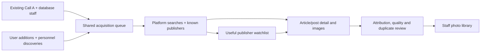

# G1 mainland photo integrations

**Subsequent owner correction and research:** the intended comparison repository
is **Scrolls**, replacing cross-post. The [native-search follow-up](2026-09-30-172400-g1-chinese-model-native-search.md)
records its Chinese-platform trials and revises the proposed provider test to
include native image search and 点点/Yuanbao integrations. The Apify-first order
below is historical, not the current recommendation. Earlier repository
observations are retained as history, not as a requirement to use cross-post.

The next useful experiment is platform-specific article/post discovery followed
by retrieval of the images inside those results. The earlier public-web pass
does not establish that G1 has enough photographs. Paid providers document
relevant access, but none was exercised against the staff roster in this
research. Their advertised coverage is not a measured result.

This research supports the existing [G1 plan](../plans/2026-10-01-092148-feat-g1-staff-identity-library-plan.md).
It is not a second implementation plan or an approved provider selection.
Both owner requirements remain: the initial Call A/database staff union and
automatic intake for user additions and personnel discoveries.

## What changed the recommendation

The [previous collection](../analysis/2026-09-30-164100-g1-chinese-web-portrait-collection.md)
contains 33 distinct photographs for 17 of 20 staff, with multiple photographs
for 11 staff. Its 25 Chinese-source photographs cover 15 staff, with multiple
Chinese-source photographs for eight. “Chinese source” in that pass includes
Chinese-language sources outside mainland China; it is not evidence of access
to mainland apps. Chao Qiao, Lou, and RyanLee still lack accepted photographs.
The owner's new direction explicitly requires investigating deeper integrations.

Three approaches are available:

| Approach | Benefit for this roster | Cost or uncertainty |
| --- | --- | --- |
| Managed platform-data services | Search articles and posts mentioning less-public staff; fetch inline photos and attribution. Apify offers an existing account route; TikHub offers direct APIs. | Upstream access, documentation accuracy, and accepted-photo yield require a measured test. |
| A maintained publisher collection | Follow company, laboratory, university, and conference public accounts once they produce useful sources; match new articles against staff. | Strong ongoing complement, but it will miss people and publishers outside the watchlist. Self-hosted collectors add session maintenance. |
| Custom mainland data supplier | Ask for historical coverage and image-bearing content for named staff/organizations. Newrank advertises custom APIs. | Quote, sample, photo export, and historical coverage are unverified; unsuitable as the first commitment. |

Recommendation: test managed access first, then use the successful publishers
to seed the continuing collection. This adds a second discovery direction:
find relevant organizational publishing, rather than requiring every person to
maintain a public, searchable social account.

## Provider shortlist

### Apify: quickest route using existing credentials

An `APIFY_API_TOKEN` is configured locally. Only presence was checked; token
validity, account plan, balance, and remaining previews were not checked.

The strongest documented WeChat candidate is
[zen-studio/wechat-official-account-scraper](https://apify.com/zen-studio/wechat-official-account-scraper).
It advertises article search, article detail, and account history with
`contentHtml`, `contentText`, and inline `images` containing dimensions.
It says no customer WeChat account/cookies are needed. The README prices search
results at **$5.99/1,000** and article detail at **$0.02999 each**; its headline
advertises “from $4.99/1,000,” so plan-specific pricing needs verification.
Free-plan previews are limited. These are provider claims, not our test results.

For Weibo, [atomus/weibo-scraper](https://apify.com/atomus/weibo-scraper)
documents keyword search and post detail with image arrays, without customer
cookies, starting at **$16/1,000 posts**. Other cheaper actors can be restricted
to anonymous first-page results; choose by usable coverage, not headline price.

[opspilot.cc/wechat-universal-search-scraper](https://apify.com/opspilot.cc/wechat-universal-search-scraper)
is another search candidate, priced at **$0.10/start**. Its upstream credential
is bundled; the public page does not establish who supplies it. Search output
alone does not replace article-detail retrieval.

An Apify actor is a separately maintained program, not a platform-wide access
guarantee. Some actors explicitly require a second vendor key:
[ethereal_wool's Channels collector](https://apify.com/ethereal_wool/wechat-channels-scraper)
requires TikHub. Such a wrapper would not establish an independent fallback.

### TikHub: most directly relevant multi-platform API documentation

[TikHub](https://tikhub.io/wechat-api) documents WeChat search and article
retrieval. Its [Weibo offering](https://tikhub.io/weibo-api) includes picture
search; [Xiaohongshu image search](https://docs.tikhub.io/420136400e0) is also
documented. No TikHub credential was found in the checked local stores.

The [live OpenAPI schema](https://api.tikhub.io/openapi.json), saved locally,
provides these concrete candidates:

| Method and route | Intended use |
| --- | --- |
| POST `/api/v1/wechat_search/v2/fetch_search` | Article/account discovery |
| POST `/api/v1/wechat_mp/v2/fetch_article_detail_h5` | Article HTML for image extraction |
| POST `/api/v1/wechat_mp/v2/fetch_account_articles` | Known-publisher collection |
| GET `/api/v1/weibo/web_v2/fetch_pic_search` | Image results linked to source posts |
| GET `/api/v1/xiaohongshu/app_v2/search_images` | Image-note discovery |
| GET `/api/v1/xiaohongshu/app_v2/get_image_note_detail` | Note images and context |

The schema prices the two named WeChat search/detail operations at
**$0.01/request**. Two hundred such requests imply $2 usage, not a verified
minimum purchase. It warns that WeChat `photos`/`image` categories currently
return empty results and still bill. Use articles instead. It also specifies
cursor pagination, contradicting the marketing page's no-pagination statement.
Preserve large IDs as strings. Image URLs, retrieval success, and actual
pagination remain pilot checks.

### Just One API: comparison candidate

[Just One API](https://justoneapi.com/en) advertises a trial; exact prices require
its dashboard. [Article search V1](https://docs.justoneapi.com/en/api/wechat-official-accounts/article-search-v1)
is a form POST to `/api/weixin/search-article/v1`, with keyword/date/sort and
pagination state. Its catalog also lists account histories, Weibo posts, and
Xiaohongshu notes.

Version numbers do not prove richer content:
[article detail V5](https://docs.justoneapi.com/en/api/wechat-official-accounts/article-details-v5)
describes lightweight metadata. Do not select V5 merely because it is newest;
verify which operation returns article HTML and original inline images.
This provider is a comparison candidate, not a confirmed full-photo fallback.

### Newrank: enterprise route if small tests fail

[Newrank's own site](https://www.newrank.cn/account/api) advertises custom API
services. A useful quote request would require source URLs, article body/HTML,
inline original-image URLs, historical depth, deletions, update frequency,
and a sample covering the hardest staff. A dashboard of engagement metrics
would not satisfy G1. No price, photo-export commitment, vendor contact, or
purchase was established.

## What WeChat's agent integration actually provides

Tencent's official
[openclaw-weixin connector](https://github.com/Tencent/openclaw-weixin) and
[Chinese protocol](https://github.com/Tencent/openclaw-weixin/blob/main/docs/protocol_zh_CN.md)
are real. The documented interface handles bot login, incoming messages,
sending replies, media, and related conversation functions. It does not
document public-article or person search. A message field is not proof of
access to arbitrary chats, groups, Moments, or contacts.

For G1, the plausible use is optional intake: forward an article link or photo
to the bot, then retain the source and review it through the same library.
It cannot establish the automatic batch or continuing discovery requirements
by itself. No connector was installed or account linked.

Tencent's [Web Search API FAQ](https://cloud.tencent.com/document/product/1806/121804),
updated September 2, 2026, explicitly excludes WeChat Official Account content.
Tencent branding alone therefore does not establish access to that corpus.

[Tencent Yuanqi](https://yuanqi.tencent.com/guide/yuanqi-introduction) describes
agent publishing and authorized own-account knowledge ingestion. These are
different capabilities from searching other publishers' photo-bearing content.

If the owner's phrase “relevance of api” meant **Relevance AI**,
[its WeChat integration page](https://marketplace.relevanceai.com/integrations/wechat)
does not establish a public-photo discovery endpoint. An agent orchestration
layer could call a data provider, but is not itself evidence of corpus access.
The clarification remains unanswered.

## Self-hosted alternatives

[MediaCrawler](https://github.com/NanmiCoder/MediaCrawler) demonstrates logged-in
browser collection for Weibo, Xiaohongshu, and other platforms. Its platform
table does not include WeChat, and its README explicitly restricts commercial
use. It is a research pattern, not an established production dependency here.

[WeRSS / we-mp-rss](https://github.com/rachelos/we-mp-rss) describes scheduled
WeChat publisher collection, APIs, exports, and webhooks. It fits known-account
monitoring better than open-ended person discovery. Session renewal and
current licensing need evaluation before adoption.

## What the two repositories contribute

These are observed local code patterns, not already-working China integrations.

| Repository evidence | Reusable behavior | Limit |
| --- | --- | --- |
| [top-gun smart_match.py](/Users/fuchitalee/development/top-gun/may2026-version/pipeline/smart_match.py:467), revision `5ad0dbda9140ffa52ea791a0ec51c975b8c9a97b` | Existing evidence first, bounded Apify lookup, cost accounting, checkpoint/resume; browser resolution for difficult links. | Existing actor retrieves X data. Heuristic confidence and estimated prices are not calibrated identity proof or current China prices. |
| [cross-post platform interface](/Users/fuchitalee/development/cross-post/src/platforms/interface.ts:51), revision `fab5a49e0e20534b7506cd63f3e7208e6b3888e3` | Explicit platform capabilities, authentication checks, and an action-needed result when user involvement is required. | Publishing interface; registered platforms are X, WordPress, Substack, LinkedIn, Facebook. No registered WeChat/Weibo/Xiaohongshu provider. |
| [cross-post auth storage](/Users/fuchitalee/development/cross-post/src/auth/store.ts:51) and [Substack browser helper](/Users/fuchitalee/development/cross-post/scripts/substack-playwright.mjs) | Platform-specific credentials and a browser path where direct requests are insufficient. | Actual credentials use file/environment storage; old prose mentioning Keychain is not the implementation. Do not run publishing to test collection. |

For G1, reuse the behavior: each provider must declare what it can search and
retrieve, preserve its source evidence, and report unavailable access honestly.
A successful HTTP response, a publisher avatar, and a verified subject photo
are different outcomes.

## Proposed test and ongoing shape

The following is a proposal for the existing G1 plan, not an approved run:

1. Freeze the same 20 staff and current accepted images. Prioritize Chao, Lou,
   Ryan, Cunxiang, Chujie, Xiong-Hui, Zixuan, and Xuanming; retain well-covered
   people as controls. Use stored aliases, verified Chinese names, company,
   laboratory, papers, and event context. Never invent Chinese characters.
2. Start with Apify WeChat article search/detail and Weibo image-bearing posts.
   Compare TikHub direct access when a credential is available. Just One API
   is the next comparison if it demonstrably supplies different useful access.
3. Propose a **$10 total usage ceiling**, one initial pass and one gap-filling
   pass. Check actual account/event pricing first; cap provider requests/results
   so the run cannot silently expand. Minimum deposits or subscriptions are
   separate unresolved costs.
4. Download candidate images and retain source article/post, caption or named
   person block, retrieval time, dimensions, and duplicate relationship.
   Judge additional distinct usable photos per person, cost per accepted
   photo, attribution errors, and remaining gaps. Record publisher icons,
   diagrams, same-photo reposts, and unrelated names as rejections.
5. After the initial test, nominate publishers that produced useful sources.
   Measure a recurring fetch and a newly added staff case before treating the
   ongoing process as proven.

The desired product shape is:

Optional forwarded WeChat material can enter the same review path. Provider
outages must not prevent saving a staff account or personnel report. A
publisher author's identity must not be assigned to a person mentioned in
their article. Historical employer/join-date evidence retains its date and
uncertainty.

## Evidence and remaining decisions

Public documentation and local code were inspected on September 30, 2026.
[Local captures](../../.context/g1-mainland-integrations-20260930/) include the
TikHub OpenAPI schema and selected routes, Just One API pages, Apify pages, and
Newrank text. This ignored directory is local evidence, not a shipped resource.

No paid data call, vendor signup, outreach, connector installation, schedule,
or production write occurred. Provider coverage, current balances, minimum
top-ups, and image reuse eligibility remain unproven. The next decision is
which bounded provider test to run; the recommended starting route is the
existing Apify account, followed by TikHub comparison if needed. Both G1
deliverables remain unfinished.
